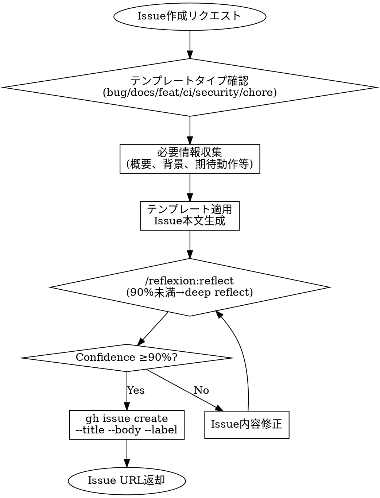

# Create Issue

GitHub Issue作成の標準化スキル。プロジェクト固有のテンプレート構造と命名規則を適用。

## Overview

このスキルは6種のIssueテンプレートを提供し、一貫性のあるIssue駆動開発を支援する。
過去のクローズ済みIssue分析に基づき、成功パターンを標準化。

## When to Use

**発動条件**:
- `/create-issue` コマンド実行時
- 「Issue作成」「課題登録」などのリクエスト時
- 新規タスク開始前の計画段階

**NOT to use**:
- 既存Issueの参照・更新 → `/issue <番号>` を使用
- PR作成 → `/push-pr` を使用

## Template Types

| Type | Prefix | Label | Use Case |
|------|--------|-------|----------|
| **bug** | `[bug]` | `bug` | バグ報告、動作不良、エラー修正 |
| **docs** | `[docs]` | `documentation` | ドキュメント追加・修正・改善 |
| **feat** | `[feat]` | `enhancement` | 新機能追加、機能拡張 |
| **ci** | `[ci]` | `enhancement` | CI/CD、インフラ、ワークフロー変更 |
| **security** | `[security]` | `bug` | セキュリティ脆弱性、修正 |
| **chore** | `[chore]` | `dependencies` | 依存更新、設定変更、リファクタ |

## Execution Flow



## Self-Review Gate (MANDATORY)

Issue本文生成後、`gh issue create` 実行**前**に必ずセルフレビューを実施。

> **⚠️ pre-filled args免除禁止**: 本ゲートはpre-filled argsで引数が事前入力されている場合でも**スキップ不可**。ステップ1-3は情報収集（入力依存）だが、本ステップは品質保証（入力非依存）であり性質が異なる。

### Review Command

```
/reflexion:reflect "deep reflect if less than 90% confidence."
```

### Review Checklist

| 項目 | 確認内容 |
|------|---------|
| **タイトル** | `[type]` prefix付き、簡潔で具体的 |
| **概要** | 1-2文で問題/機能を明確に説明 |
| **完了基準** | チェックリスト形式、検証可能 |
| **ラベル** | 適切なラベルが選択されている |
| **関連情報** | 発見元・優先度が明記されている |

### Confidence Threshold

| Confidence | Action |
|------------|--------|
| **≥90%** | `gh issue create` を実行 |
| **<90%** | deep reflectを実行 → 問題点を修正 → 再レビュー |

### Deep Reflect Focus Areas

90%未満の場合、以下を重点的に確認:

1. **曖昧な表現**: 「〜など」「適宜」→ 具体的に書き換え
2. **不足セクション**: 必須セクション（概要、完了基準）の欠落
3. **検証不能な基準**: 「正しく動作」→ 「XXテストが通過」
4. **スコープ肥大**: 1 Issueで複数問題 → 分割検討

## Template Structure (Common)

すべてのテンプレートで以下のセクション構造を維持:

```markdown
## 概要
[問題・機能の1-2文での説明]

## 背景・動機
[なぜこれが必要か、コンテキスト]

## 現状の課題 / 期待される動作
[Before/After または 現状→期待の対比]

## 実装内容 / 修正内容
[具体的なタスク、変更箇所]

## 完了基準
- [ ] チェックリスト形式
- [ ] 検証可能な基準

## 関連情報
[関連PR、参考リンク、優先度]
```

## Template: Bug Report

**Title Format**: `[bug] 簡潔な問題説明`

```markdown
## 概要
[何が壊れているか]

## 再現手順
1. [手順1]
2. [手順2]
3. [エラー発生]

## 期待される動作
[本来どう動くべきか]

## 実際の動作
[現在何が起きているか]

## 環境情報
- OS:
- Python:
- 関連バージョン:

## 完了基準
- [ ] バグが修正されている
- [ ] 回帰テストが追加されている
- [ ] CI通過

## 関連情報
- 発見元: [PR/コミット/手動テスト]
- 優先度: [Critical/High/Medium/Low]
```

## Template: Documentation

**Title Format**: `[docs] ドキュメント対象: 変更内容`

```markdown
## 対象ドキュメント
[ファイルパスまたはセクション名]

## 現状の課題
[情報不足、古い情報、不正確な記述等]

## 改善内容
[追加・修正する内容の概要]

## 期待効果
[この変更で何が改善されるか]

## 完了基準
- [ ] ドキュメント更新完了
- [ ] リンク切れチェック通過
- [ ] textlint通過

## 関連情報
- 発見元: [PR/コードレビュー/ユーザー報告]
- 優先度: [High/Medium/Low]
```

## Template: Feature Request

**Title Format**: `[feat] 機能名または機能概要`

```markdown
## 概要
[追加したい機能の説明]

## 背景・動機
[なぜこの機能が必要か]

## 要件
### 機能要件
- [要件1]
- [要件2]

### 非機能要件（該当する場合）
- パフォーマンス:
- セキュリティ:

## 解決策（案）
[実装アプローチの概要]

## 影響範囲
- 変更ファイル:
- 依存関係:

## 完了基準
- [ ] 機能実装完了
- [ ] テスト追加（カバレッジ維持）
- [ ] ドキュメント更新
- [ ] CI通過

## 補足
[設計の選択肢、トレードオフ、参考資料]
```

## Template: CI/Infrastructure

**Title Format**: `[ci] 対象システム: 変更内容`

```markdown
## 概要
[CI/インフラの変更内容]

## 背景・動機
[なぜこの変更が必要か]

## 現状
[現在の構成、問題点]

## 変更内容
### 追加/修正するもの
- [変更1]
- [変更2]

### 影響を受けるワークフロー
- [ ] ci.yml
- [ ] pre-commit
- [ ] その他

## 検証手順
```bash
# 変更検証用コマンド
```

## 完了基準
- [ ] 変更が正常に動作
- [ ] 既存ワークフローに影響なし
- [ ] ドキュメント更新

## 関連情報
- 参考: [GitHub Actions docs等]
- 優先度: [High/Medium/Low]
```

## Template: Security

**Title Format**: `[security] 脆弱性タイプ: 影響範囲`

```markdown
## 概要
[セキュリティ問題の概要]

## 脆弱性詳細
- **タイプ**: [XSS/SQLi/認証不備/権限昇格/etc]
- **深刻度**: [Critical/High/Medium/Low]
- **影響範囲**: [影響を受けるコンポーネント]

## 根本原因
[なぜこの脆弱性が存在するか]

## 対応内容
1. [修正手順1]
2. [修正手順2]

## 検証方法
[脆弱性が修正されたことの確認方法]

## 完了基準
- [ ] 脆弱性が修正されている
- [ ] セキュリティテスト追加
- [ ] Trivyスキャン通過
- [ ] 関連ドキュメント更新

## 関連リンク
- CVE/CWE: [該当する場合]
- 発見元: [Trivy/手動監査/外部報告]
```

## Template: Chore

**Title Format**: `[chore] カテゴリ: 作業内容`

```markdown
## 概要
[メンテナンス作業の内容]

## 背景・動機
[なぜこの作業が必要か]

## 作業内容
- [ ] [タスク1]
- [ ] [タスク2]

## 影響範囲
- 変更ファイル:
- 破壊的変更: あり/なし

## 完了基準
- [ ] 作業完了
- [ ] CI通過
- [ ] 動作確認

## 関連情報
- Dependabot PR: [該当する場合]
- 優先度: [High/Medium/Low]
```

## gh CLI Command

```bash
# 基本形式
gh issue create \
  --title "[type] タイトル" \
  --body "$(cat <<'EOF'
## 概要
...
EOF
)" \
  --label "label_name"

# 複数ラベル
gh issue create --label "bug" --label "good first issue"

# アサイン
gh issue create --assignee "@me"
```

## Label Mapping

| Template | Primary Label | Optional Labels |
|----------|--------------|-----------------|
| bug | `bug` | `good first issue`, `help wanted` |
| docs | `documentation` | `good first issue` |
| feat | `enhancement` | `help wanted` |
| ci | `enhancement` | - |
| security | `bug` | - |
| chore | `dependencies` | `python:uv`, `javascript` |

## Quick Reference

**Title Prefix**:
- バグ → `[bug]`
- ドキュメント → `[docs]`
- 新機能 → `[feat]`
- CI/インフラ → `[ci]`
- セキュリティ → `[security]`
- メンテナンス → `[chore]`

**必須セクション**: 概要、完了基準
**推奨セクション**: 背景・動機、影響範囲

## Common Mistakes

| Mistake | Fix |
|---------|-----|
| タイトルにprefixなし | `[type]` を必ず付ける |
| 完了基準が曖昧 | チェックリスト形式で検証可能に |
| 関連PRリンク漏れ | `Refs #XX (PR)` または `発見元:` に明記 |
| ラベル未設定 | `--label` で必ず1つ以上設定 |
| pre-filled argsでself-review省略 | ステップ1-3のスキップはステップ4に波及しない。品質保証は常時必須 |

## Integration with Workflow

Issue作成後のフロー:
1. `/create-issue` でIssue作成
2. `/git:feature <説明>` でブランチ作成（Issue番号入力フローで連携）
   - ブランチ名: `feature/issue#<番号>-<説明>`
3. 実装 → `/commit` → `/push-pr`
   - PRに自動で `Closes #<番号> (Issue)` が追加される
   - IssueにPRコメントが自動追加される
