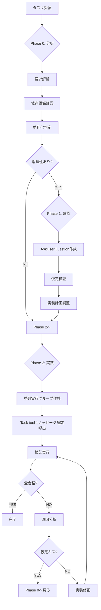
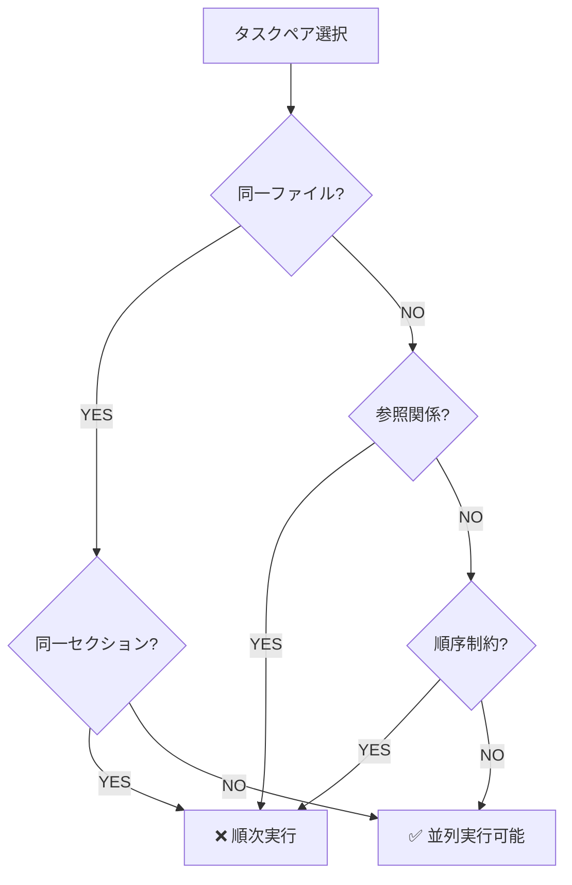

# 実行効率化ワークフロー - 試行錯誤削減ガイド

*最終更新: 2026年02月07日*
*用途: 初回正解率向上、段階的修正の防止、効率的なタスク実行*
*対象: 複数ファイル操作、依存関係のある変更、曖昧性を含む要件*
*アクセス頻度: 高（実装フェーズ開始時、複雑なタスク実行時）*

## 📚 目次

1. [コア原則](#1-コア原則)
2. [3段階ワークフロー](#2-3段階ワークフロー)
3. [並列実行判定基準](#3-並列実行判定基準)
4. [失敗パターン集](#4-失敗パターン集)
5. [例示: 並列実行による短縮](#5-例示-並列実行による短縮)
6. [チェックリスト](#6-チェックリスト)
7. [関連ドキュメント](#7-関連ドキュメント)

---

## 1. コア原則

**導入背景**: reflexion:reflect評価で特定された非効率パターン（段階的修正アプローチ）の改善

### 基本方針

| 原則 | 説明 | 効果 |
|-----|------|------|
| **分析ファースト** | 実装前に完全な要件理解 | 仮定の排除、初回正解率向上 |
| **確認優先** | 曖昧性は実装前に解消 | ユーザー訂正の削減 |
| **並列思考** | 独立タスクの同時実行 | 実行時間短縮 |
| **検証組込** | 実装後の自動検証 | 品質保証 |

### 成功指標

| 指標 | 目標値 | 測定方法 |
|-----|--------|---------|
| **初回正解率** | 90%+ | ユーザー訂正なしで完了 |
| **試行錯誤回数** | ≤1回 | 段階的修正の削減 |
| **並列化率** | 60%+ | 独立タスクの同時実行 |
| **確認時間** | <10% | Phase 1の所要時間比率 |

---

## 2. 3段階ワークフロー

### ワークフローフローチャート


```mermaid
graph TD
    A[タスク受領] --> B{Phase 0: 分析}
    B --> C[要求解析]
    C --> D[依存関係確認]
    D --> E[並列化判定]
    E --> F{曖昧性あり?}

    F -->|YES| G{Phase 1: 確認}
    F -->|NO| K[Phase 2へ]

    G --> H[AskUserQuestion作成]
    H --> I[仮定検証]
    I --> J[実装計画調整]
    J --> K

    K --> L{Phase 2: 実装}
    L --> M[並列実行グループ作成]
    M --> N[Task tool 1メッセージ複数呼出]
    N --> O[検証実行]
    O --> P{全合格?}

    P -->|YES| Q[完了]
    P -->|NO| R[原因分析]
    R --> S{仮定ミス?}
    S -->|YES| T[Phase 0へ戻る]
    S -->|NO| U[実装修正]
    U --> O
```

### Phase 0: 分析（Analysis）

**目的**: 要件の完全理解、依存関係の可視化

**実行内容**:

1. **要求解析**
```markdown
# 要求解析テンプレート
- 明示的要求: [ユーザーが明示した変更]
- 暗黙的要求: [推論される副次的変更]
- 制約条件: [変更不可の要素]
- 影響範囲: [変更が波及する領域]
```

2. **依存関係確認**
```markdown
# 依存関係マトリクス
| ファイル | 依存先 | 依存元 | 並列化可能 |
|---------|--------|--------|----------|
| file_a.md | - | file_b.md | ✅ |
| file_b.md | file_a.md | file_c.md | ❌ (file_aに依存) |
| file_c.md | file_b.md | - | ❌ (file_bに依存) |
```

3. **並列化判定**
   - 独立グループの特定
   - 実行順序の決定
   - 並列化可能性の数値化（並列化率 = 独立タスク数 / 全タスク数）

**成果物**:
- 実行計画書（dependencies.md）
- 並列実行グループリスト
- 曖昧性リスト（Phase 1用）

---

### Phase 1: 確認（Confirmation）

**目的**: 仮定の排除、ユーザー意図の明確化

**発動条件**（いずれかを満たす）:
- 曖昧な要求表現（「適切に」「必要に応じて」等）
- 暗黙的要求が3個以上
- 影響範囲が予測困難
- ユーザーの意図が2通り以上解釈可能

**実行内容**:

1. **AskUserQuestion作成**
```markdown
# 確認テンプレート
以下の点について確認させてください：

1. [項目A] は [解釈1] と [解釈2] のどちらでしょうか？
   - オプション1: [具体的な選択肢]
   - オプション2: [具体的な選択肢]

2. [項目B] の影響範囲は [範囲1] のみでよろしいでしょうか？
   - YES: [範囲1]のみ修正
   - NO: [範囲2]も含めて修正

推奨: [根拠付きの推奨案]
```

2. **仮定検証**
   - 各仮定の信頼度評価（高/中/低）
   - 低信頼度仮定の確認優先
   - 確認結果の実行計画への反映

**成果物**:
- 確認済み実行計画
- 仮定リスト（信頼度付き）
- 調整後の並列実行グループ

**スキップ条件**:
- 要求が100%明確
- 過去の類似タスクで前例あり
- 影響範囲が限定的（1-2ファイル）

---

### Phase 2: 実装（Implementation）

**目的**: 1回で正解、効率的な並列実行

**実行内容**:

1. **並列実行グループ作成**
```markdown
# 並列実行グループ例
Group 1 (並列実行可能):
  - file_a.md
  - file_d.md
  - file_e.md

Group 2 (Group 1完了後):
  - file_b.md
  - file_c.md
```

2. **並列実行の原則**
   同一グループ内の独立タスクは、1メッセージ内で複数のツール呼び出しとして同時に発行する（逐次発行しない）。

3. **検証実行**
```bash
# 検証コマンド例（プロジェクト依存）
grep -r "検証パターン" target_files/
git diff --stat
uv run pytest  # 品質ゲート
```

**成果物**:
- 変更適用済みファイル群
- 検証レポート
- 完了報告

**失敗時の対応**:
- Phase 0の分析ミス → Phase 0へ戻る
- Phase 2の実装ミス → 実装修正のみ（Phase 0-1は再実行不要）

---

## 3. 並列実行判定基準

### 独立性チェック

**依存関係の種類**:

| 依存タイプ | 説明 | 並列化 |
|----------|------|--------|
| **データ依存** | ファイルAの内容をファイルBで参照 | ❌ |
| **順序依存** | ファイルAの変更後にファイルBを変更 | ❌ |
| **名前空間依存** | 同一セクション内の異なる項目 | ✅（セクション単位で分割可） |
| **完全独立** | 互いに影響なし | ✅ |

### 並列化可能性判定フロー


```mermaid
graph TD
    A[タスクペア選択] --> B{同一ファイル?}
    B -->|YES| C{同一セクション?}
    B -->|NO| D{参照関係?}

    C -->|YES| E[❌ 順次実行]
    C -->|NO| F[✅ 並列実行可能]

    D -->|YES| E
    D -->|NO| G{順序制約?}

    G -->|YES| E
    G -->|NO| F
```

### 並列化メリット判定

**並列化推奨条件**（すべて満たす）:
- タスク数 ≥ 3
- 独立タスク率 ≥ 50%
- 各タスク所要時間 ≥ 10秒

**並列化非推奨条件**（いずれかを満たす）:
- タスク数 ≤ 2
- 依存関係が複雑（グラフが循環）
- 各タスク所要時間 < 5秒（オーバーヘッド大）

---

## 4. 失敗パターン集

### パターン1: 段階的修正（仮定の積み重ね）

**症状**:
- 初回実装: 12ファイル修正
- ユーザー訂正: 「8ファイルのみでよい」
- 2回目実装: 8ファイル修正
- ユーザー訂正: 「実は7ファイル」
- 3回目実装: 7ファイル修正

**原因**:
- Phase 1（確認）のスキップ
- 暗黙的要求の推論ミス
- 影響範囲の過大評価

**改善策**:
```markdown
# Phase 1: 確認（追加）
「TokenBudgetChecker」の除外範囲について確認させてください：

検出された16ファイルのうち、以下の分類で正しいでしょうか？
- カタログファイル: 9個 → 除外対象
- プロジェクト設定: 5個 → 除外対象
- ルールファイル: 2個 → 対象

推奨: カタログ+プロジェクト設定のみ除外（理由: ルールファイルは検証対象の可能性）
```

---

### パターン2: 検証なし実装（trial and error）

**症状**:
- 実装完了後、テスト実行で失敗
- 原因調査 → 依存関係の見落とし
- 再実装 → 別のエラー
- 繰り返し

**原因**:
- Phase 0（分析）の不足
- 依存関係の未確認
- 検証の後回し

**改善策**:
```markdown
# Phase 0: 分析（追加）
依存関係マトリクス:
| 変更対象 | 依存先 | 影響確認方法 |
|---------|--------|------------|
| file_a.md | import statements | `grep -r "from file_a import"` |
| file_b.py | file_a.md参照 | `grep -r "file_a\.md"` |

# Phase 2: 実装（検証組込）
1. 並列実行グループ1の実装
2. 検証1: `pytest tests/unit/test_file_a.py`
3. 並列実行グループ2の実装
4. 検証2: `pytest tests/integration/`
```

---

### パターン3: ユーザーフィードバック依存

**症状**:
- 実装 → ユーザー確認 → 修正 → ユーザー確認 → 修正...
- 完了まで5回以上のやり取り

**原因**:
- Phase 1（確認）の不在
- 仮定の明示不足
- 選択肢の提示不足

**改善策**:
```markdown
# Phase 1: 確認（AskUserQuestion形式）
以下の実装方針について確認させてください：

1. 除外対象の定義
   - オプションA: カタログファイルのみ（9個）
   - オプションB: カタログ+プロジェクト設定（14個）
   - オプションC: カスタム選択（個別指定）

2. 段階的実装
   - オプションA: 全ファイル一括修正
   - オプションB: 4段階に分割（依存関係順）

推奨: オプションB+オプションB（理由: 検証しやすく、ロールバック容易）
```

---

## 5. 例示: 並列実行による短縮

**原則**: Phase 0で依存関係を分析し独立タスクをグループ化、Phase 1で曖昧な範囲を確認してから、
Phase 2で各グループを1メッセージ内で並列実行する。確認を省いた段階的修正（部分実装→ユーザー訂正
→再実装の繰り返し）は、Phase 1を先に通すより時間がかかりやすい。

---

## 6. チェックリスト

### Phase 0: 分析チェックリスト

- [ ] 要求解析完了（明示的・暗黙的・制約・影響範囲）
- [ ] 依存関係マトリクス作成（ファイル単位・セクション単位）
- [ ] 並列実行グループ特定（3グループ以上推奨）
- [ ] 並列化率計算（目標: 60%以上）
- [ ] 曖昧性リスト作成（信頼度評価付き）

### Phase 1: 確認チェックリスト

- [ ] 低信頼度仮定（<80%）の特定
- [ ] AskUserQuestion形式の質問作成（選択肢2つ以上）
- [ ] 推奨案の根拠明示
- [ ] ユーザー回答の実行計画への反映
- [ ] 調整後の並列実行グループ確定

### Phase 2: 実装チェックリスト

- [ ] 並列実行グループの依存関係確認
- [ ] Task tool 1メッセージ複数呼出パターン適用
- [ ] 各グループ完了後の検証実行
- [ ] 全合格確認（品質ゲート適用）
- [ ] 完了報告（並列化率・初回正解率記載）

---

## 7. 関連ドキュメント

### ワークフロー・原則

| ドキュメント | 関連セクション | 用途 |
|------------|--------------|------|
| **RULES.md** | Workflow Rules | タスク実行の基本ルール |
| **PRINCIPLES.md** | Uncertainty Disclosure / Violation Signals | 不確実性の扱い・自己チェック |
| **command_usage_guide.md**（.serena/memories/） | Section 9 ast-grep / mgrep 使用ガイド | 検索ツール選択基準 |

### 品質保証

| ドキュメント | 関連セクション | 用途 |
|------------|--------------|------|
| **quality-gates.md** | 4つの品質ゲート | 実装完了判定基準 |
| **test-strategy.md** | テストピラミッド | テスト設計指針 |
| **coding-standards.md** | 自動検証コマンド | コード品質検証 |

### マルチエージェント協働

| ドキュメント | 関連内容 | 用途 |
|------------|---------|------|
| **AGENTS_CATALOG.md** | 69エージェント仕様 | エージェント選択 |

---

## 更新履歴

| 日付 | 変更内容 | Phase |
|------|---------|-------|
| 2026-02-07 | 初版作成（reflexion評価に基づく改善） | 設計完了 |

---

**教訓**: 「Phase 1（確認）の2分投資で、Phase 2（実装）の30分削減」

**次のアクション**: このワークフローをCLAUDE.md「開発ワークフロー」セクションに統合し、RULES.md「Workflow Rules」から参照する。
