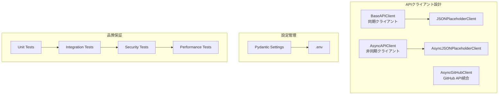
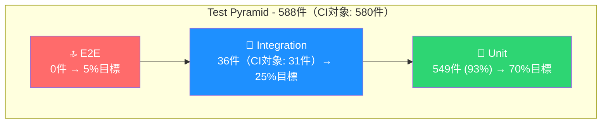
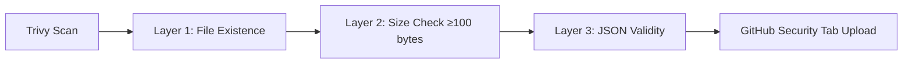

# API Test + DevOps Portfolio

*最終更新: 2026年03月06日*

## 概要

このプロジェクトは、APIテストとDevOps技術を統合した実践的なポートフォリオです。

[](https://github.com/yuta158/api-test-portfolio/actions/workflows/ci.yml)
[](https://yuta158.github.io/api-test-portfolio/htmlcov/)

[](./Dockerfile)
[](./LICENSE)
[](https://github.com/astral-sh/ruff)
[](https://mypy-lang.org/)
[](https://github.com/PyCQA/bandit)
[](https://safetycli.com/)

> **Python/Docker/CI/CDを統合したAPIテスト自動化ポートフォリオ。588件のテスト（CI品質ゲート: 580件/93.39%）。**

## 概要

- **588件のテストスイート**: Unit(549, うちPerformance 5件・Slow 1件含む) / Integration(36, うちExternal 5件含む) / Smoke(3) / E2E(実装予定)
- **カバレッジ: 93.39%**（unit+integration条件）: 継続的な品質向上
- **CI実行テスト: 580件**（unit+integration, external除外）
- **CI/CD自動化**: GitHub Actions による4段階パイプライン
- **セキュリティ**: CI/CD品質ゲート（pytest + ruff + mypy + Trivy）
- **GitHub API統合**: 実務的なAPI統合スキルを証明（Rate Limit管理、ETag活用、非同期処理）

## デモ

> 3つのGIFで主要機能を視覚的に確認できます（合計35秒）

### 1. テスト実行


> **📝 デモ内容**: クイック実行例（基本テスト19件、デモ時間短縮のため抽出。全588件は約60秒）
> **🔍 全588件を今すぐ確認**: [GitHub Actions CI/CD](https://github.com/yuta158/api-test-portfolio/actions) でフルテスト結果＋カバレッジレポートを閲覧

**何がわかるか**:

- pytest + pytest-covによる自動テスト実行
- カバレッジレポートによる品質可視化
- テスト実行: 基本19件 ~5秒、全588件 ~60秒

<details>
<summary>全テスト実行コマンド（588件、約60秒）</summary>

```bash
# 全テスト実行（588件）
uv run pytest --cov=utils --cov=config --cov=models --cov-report=term -q --color=yes

# クイック実行（unit tests）
uv run pytest tests/unit/test_api_client.py --cov=utils --cov=config --cov=models --cov-report=term -q --color=yes
```

</details>

### 2. Docker操作


> **📝 デモ内容**: Docker Multi-stage buildによるコンテナビルド
> **⏳ Week3対応予定**: docker-compose.yamlによる4環境（dev/test/demo/prod）オーケストレーション

**何がわかるか**:

- Docker Multi-stage builds（4段階: base/dependencies/runtime/test）
- 非rootユーザーでのセキュアな実行
- 本番イメージサイズ最適化（< 200MB目標）

### 3. CI/CD自動化


> **📝 デモ内容**: git push後GitHub Actionsで自動テスト・デプロイ

**何がわかるか**:

- GitHub Actionsによる自動化パイプライン
- コード変更時の自動テスト実行
- 4段階パイプライン（PR検証 → Post-Merge → Branch検証 → 週次包括）

## 技術スタック

| カテゴリ | 技術 |
|---------|-----|
| **言語** | Python 3.14 |
| **HTTP Client** | httpx（同期/非同期対応） |
| **設定管理** | Pydantic Settings（型安全） |
| **テスト** | pytest + pytest-cov + pytest-asyncio |
| **リンター** | ruff（高速、Rust製） |
| **型チェック** | mypy（strict mode） |
| **パッケージ管理** | uv（高速、Rust製） |
| **CI/CD** | GitHub Actions（4段階パイプライン） |
| **エラー監視** | Sentry SDK + MCP統合 |
| **ログ** | structlog（構造化ログ） |

## ブランチ戦略（軽量Git Flow）

```
main ─────────────────────────────────────────→ (production)
  │                                       ↑
  ├─→ develop ────────────────────────────┘ (integration)
  │      │              ↑         ↑
  │      └─→ feature/* ─┘         │
  │                               │
  └─→ hotfix/* ───────────────────┘
```

※ hotfix/*: main + develop の両方にマージ

| ブランチ | 用途 | マージ先 |
|---------|------|---------|
| `main` | 本番環境（タグ付きリリース） | - |
| `develop` | 開発統合（次期リリース準備） | main |
| `feature/*` | 新機能開発 | develop |
| `hotfix/*` | 本番緊急修正 | main + develop |

## クイックスタート

### 前提条件

| 要件 | バージョン | 確認コマンド |
|------|-----------|-------------|
| Python | 3.14 | `uv run python --version` |
| uv | 0.4+ | `uv --version` |
| Git | 2.0+ | `git --version` |
| Docker (任意) | 24.0+ | `docker --version` |

<details>
<summary>uvのインストール方法</summary>

```bash
# macOS / Linux
curl -LsSf https://astral.sh/uv/install.sh | sh

# Windows (PowerShell)
powershell -c "irm https://astral.sh/uv/install.ps1 | iex"

# pip経由
pip install uv
```

</details>

### セットアップ

```bash
# 1. リポジトリクローン
git clone https://github.com/yuta158/api-test-portfolio.git
cd api-test-portfolio

# 2. 依存関係インストール（uv使用、約10秒）
uv sync

# 3. テスト実行（並列）
uv run pytest -n auto

# 4. カバレッジ付きテスト（並列）
uv run pytest -n auto --cov=utils --cov=config --cov=models --cov-report=term

# 5. 特定マーカーのテスト実行
uv run pytest -n auto -m unit        # 単体テストのみ
uv run pytest -n auto -m integration # 統合テストのみ
uv run pytest -m security --maxfail=5  # セキュリティテスト（シリアル実行推奨: Rate Limit/認証競合回避）

# 6. 高速実行（並列、manual/external除外）
uv run pytest -n auto -m "not external and not manual"  # CI/CD相当の自動実行可能テストのみ

# 7. 週次手動実行（Rate Limit管理）
uv run pytest -m "manual or external"  # GitHub API統合テスト（週1回推奨、60 req/h制約）
```

## プロジェクト構成

```
api-test-devops-portfolio/
├── config/              # 設定管理（Pydantic Settings）
├── utils/               # ユーティリティ（APIクライアント等）
├── models/              # データモデル
├── tests/               # テストスイート（588件）
│   ├── unit/            # 単体テスト
│   ├── integration/     # 統合テスト
│   ├── performance/     # パフォーマンステスト
│   └── e2e/             # E2Eテスト（Playwright導入予定）
├── assets/              # デモGIF・画像
├── scripts/             # 自動化スクリプト
├── docs/                # ドキュメント
└── .github/workflows/   # CI/CDパイプライン
```

## アーキテクチャ

### システム構成図



### 将来の拡張ポイント（本番運用時）

本プロジェクトはポートフォリオとして設計されていますが、本番環境への移行時には以下の追加を推奨します：

| 拡張項目 | 目的 | 実装案 |
|---------|------|--------|
| **Circuit Breaker** | 障害時の連鎖的リトライ防止 | `tenacity`ライブラリまたは自前実装 |
| **Connection Pool** | 高負荷時のリソース最適化 | `httpx.Limits(max_keepalive_connections=20)` |
| **Distributed Tracing** | マイクロサービス間の追跡 | OpenTelemetry統合 |
| **Rate Limit Client** | API制限への適応 | Retry-Afterヘッダー活用 |

## エラー監視・可観測性

### Sentry統合

本プロジェクトでは、Sentry SDKを統合し、ERROR以上のログを自動でSentryに送信します。

**主な機能**:

- 🛡️ **機密データ保護**: 29種類の機密キーを自動スクラブ（password, token, api_key等）
- 🔄 **structlog連携**: ERROR/CRITICAL/EXCEPTIONレベルを自動送信
- ⚡ **サイレント失敗**: Sentry障害時もアプリケーション継続
- 🔐 **SecretStr保護**: DSNの平文出力防止

**環境変数設定**:

```bash
# Sentry設定（.envファイル）
SENTRY__ENABLED=true
SENTRY__DSN=https://xxx@xxx.ingest.us.sentry.io/xxx
SENTRY__ENVIRONMENT=production
SENTRY__TRACES_SAMPLE_RATE=0.1
SENTRY__SEND_DEFAULT_PII=false
```

**初期化（アプリケーション起動時）**:

```python
from utils.sentry_init import init_sentry

if init_sentry():
    logger.info("Sentry monitoring enabled")
```

> 📚 詳細はCLAUDE.mdの「Sentry統合」セクションを参照

## テスト戦略

### テストサマリー

| 種別 | 件数 | CI対象 | 備考 |
|------|------|--------|------|
| Unit tests | 549件 | ✅ | ビジネスロジック検証（Performance/Slow含む） |
| Integration tests | 36件（CI対象: 31件） | ✅（external 5件除外） | API統合検証 |
| **CI合計（カバレッジ計測対象）** | **580件** | | |
| **カバレッジ** | **93.39%** | | unit+integration条件 |

**カバレッジ計測対象外テスト**

| 種別 | 件数 | 除外理由 |
|------|------|---------|
| External API tests | 5件 | 実ネットワーク依存 |
| Smoke tests | 3件 | 実環境依存 |
| E2E tests | 実装予定 | — |
| **全件合計** | **588件** | |

> カバレッジはCI安定性確保のため、決定論的テスト（unit + integration）のみを計測対象としています。

### テストピラミッド



**戦略根拠**: テストピラミッド原則に基づき、CI速度と信頼性のバランスを考慮

- **Unit (70%)**: ビジネスロジックの品質担保（高速・安定）
- **Integration (25%)**: API・DB接続の検証（中速・実環境近似）
- **E2E (5%)**: クリティカルパスのみ（低速・高信頼）

> **Note**: Performance/Slow testsはunit markerを併用のためCI対象(580件)に含む。External testsはintegration markerを併用のためIntegration(36件)の内数。Smoke tests(3件)のみCI対象外。

### テスト実行特性（CI最適化）

| マーカー | 用途 | CI実行タイミング |
|---------|------|-----------------|
| `unit` | 単体テスト | 全PR |
| `integration` | 統合テスト | 全PR |
| `smoke` | 基本機能確認 | 全PR |
| `slow` | 実行時間 >3秒 | 週次のみ |
| `external` | 外部API依存 | 週次のみ |
| `performance` | 性能測定 | 週次のみ |
| `e2e` | E2Eテスト | Playwright導入後 |

> **CI最適化戦略**: `slow`/`external`/`performance`マーカーを週次実行に分離し、PRバリデーションを高速化（目標: 10分以内）

### CI/CD 4段階パイプライン

| Stage | トリガー | テスト内容 | timeout |
|-------|---------|-----------|---------|
| PR Validation | Pull Request | Unit + Integration | 10分 |
| PR Security Scan | Pull Request | Trivy脆弱性スキャン | 10分 |
| Post-Merge | Push to main | Docker Build + Trivy | 8分 |
| Weekly Comprehensive | 週次スケジュール | Performance + External API | 30分 |

### Trivy Security Scan（SARIF形式 + 3層検証）

Trivyセキュリティスキャンは**SARIF（Static Analysis Results Format）**形式で出力し、**3層検証**により確実性を担保：



**検証フロー**:

1. **Layer 1**: SARIFファイル存在確認
2. **Layer 2**: ファイルサイズ検証（≥100 bytes、空ファイル検出）
3. **Layer 3**: JSON妥当性検証（`jq empty`）

**エラーハンドリング**:

- `continue-on-error: true`: Trivyスキャン失敗時もパイプライン継続
- 各層で明確なエラーメッセージ出力
- Filesystem/Image scan個別に検証実行

**実装詳細**: 3層検証ロジックはComposite Actionとして実装され、PR/Post-Mergeの3箇所で再利用されています。

> 📚 詳細実装は [CI/CD運用ガイド](docs/guides/ci_cd_guide.md) を参照

---

## ライセンス

MIT

## お問い合わせ

- **GitHub**: [@yuta158](https://github.com/yuta158)
- **LinkedIn**: *プロフィール準備中*
