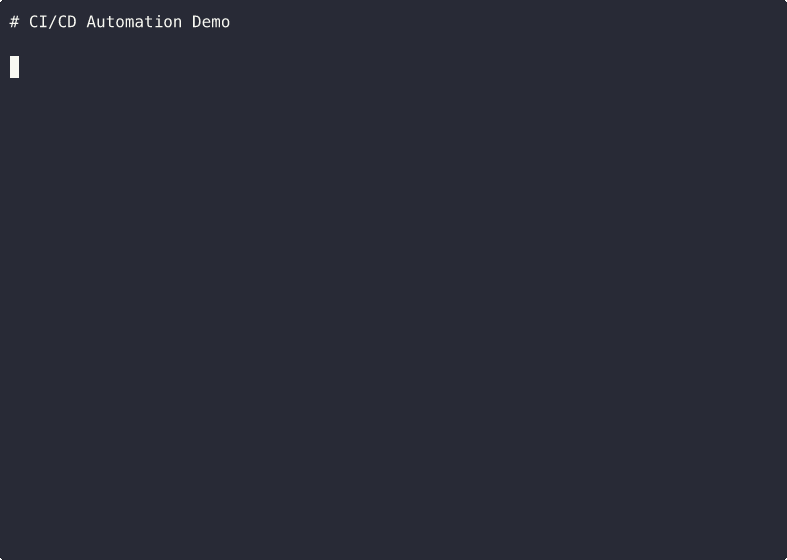
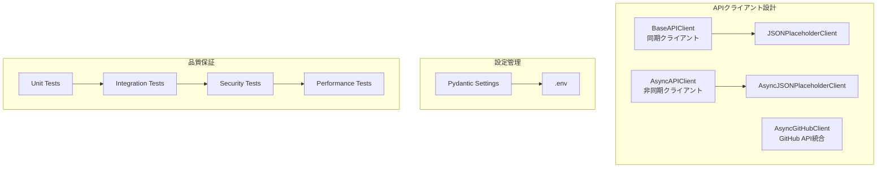
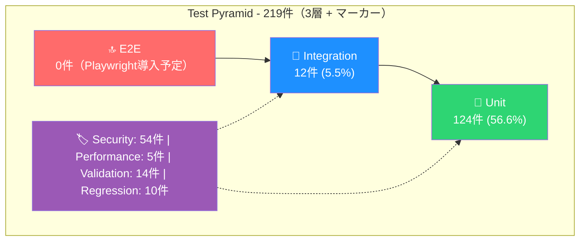

# API Test + DevOps Portfolio

最終更新: 2025年12月08日*

## 概要

このプロジェクトは、APIテストとDevOps技術を統合した実践的なポートフォリオです。
時給6000-8000円レベルの技術力を証明するために設計されています。

[](https://github.com/yuta158/api-test-portfolio/actions/workflows/ci.yml)
[](https://yuta158.github.io/api-test-portfolio/htmlcov/)
[](https://www.python.org/downloads/)
[](./Dockerfile)
[](./LICENSE)
[](https://github.com/astral-sh/ruff)
[](https://mypy-lang.org/)
[](https://github.com/PyCQA/bandit)
[](https://safetycli.com/)

> **Python/Docker/CI/CDを統合したAPIテスト自動化ポートフォリオ。（現）219件のテストで品質を保証。**

## 概要

- **（現）219件のテストスイート**: Unit / Integration / Security / Performance
- **カバレッジ 67%**: 継続的な品質向上
- **CI/CD自動化**: GitHub Actions による4段階パイプライン
- **セキュリティテスト**: OWASP API Security Top 10 対応
- **GitHub API統合**: 実務的なAPI統合スキルを証明（Rate Limit管理、ETag活用、非同期処理）


## デモ

> 3つのGIFで主要機能を視覚的に確認できます（合計35秒）

### 1. テスト実行


> **📝 デモ内容**: クイック実行例（基本テスト19件、デモ時間短縮のため抽出。全219件は約60秒）
> **🔍 全219件を今すぐ確認**: [GitHub Actions CI/CD](https://github.com/yuta158/api-test-portfolio/actions) でフルテスト結果＋カバレッジレポートを閲覧

**何がわかるか**:
- pytest + pytest-covによる自動テスト実行
- カバレッジレポートによる品質可視化
- テスト実行: 基本19件 ~5秒、全219件 ~60秒

<details>
<summary>全テスト実行コマンド（219件、約60秒）</summary>

```bash
# 全テスト実行（219件）
uv run pytest --cov=. --cov-report=term -q --color=yes

# クイック実行（デモと同じ、19件）
uv run pytest tests/unit/test_basic.py --cov=. --cov-report=term -q --color=yes
```
</details>

### 2. Docker操作


> **📝 デモ内容**: Docker Multi-stage buildによるコンテナビルド
> **⏳ Week3対応予定**: docker-compose.yamlによる4環境（dev/test/demo/prod）オーケストレーション

**何がわかるか**:
- Docker Multi-stage builds（4段階: base/dependencies/runtime/test）
- 非rootユーザーでのセキュアな実行
- 本番イメージサイズ最適化（< 200MB目標）

### 3. CI/CD自動化



> **📝 デモ内容**: git push後GitHub Actionsで自動テスト・デプロイ

**何がわかるか**:
- GitHub Actionsによる自動化パイプライン
- コード変更時の自動テスト実行
- 4段階パイプライン（PR検証 → Post-Merge → Branch検証 → 週次包括）

---
>>>>>>> Stashed changes

## 技術スタック

- **Python**: 3.10以上
- **HTTP Client**: httpx（同期/非同期対応）
- **Configuration**: Pydantic Settings（型安全な設定管理）
- **Testing**: pytest（非同期テスト、パラメータ化テスト対応）
- **Package Manager**: uv


## ブランチ戦略（軽量Git Flow）

```
main ─────────────────────────────────────────→ (production)
  │                                       ↑
  ├─→ develop ────────────────────────────┘ (integration)
  │      │              ↑         ↑
  │      └─→ feature/* ─┘         │
  │                               │
  └─→ hotfix/* ───────────────────┘
```
※ hotfix/*: main + develop の両方にマージ

| ブランチ | 用途 | マージ先 |
|---------|------|---------|
| `main` | 本番環境（タグ付きリリース） | - |
| `develop` | 開発統合（次期リリース準備） | main |
| `feature/*` | 新機能開発 | develop |
| `hotfix/*` | 本番緊急修正 | main + develop |

---

## クイックスタート

### 前提条件

| 要件 | バージョン | 確認コマンド |
|------|-----------|-------------|
| Python | 3.12+ | `python --version` |
| uv | 0.4+ | `uv --version` |
| Git | 2.0+ | `git --version` |
| Docker (任意) | 24.0+ | `docker --version` |

<details>
<summary>uvのインストール方法</summary>

```bash
# 依存関係のインストール
uv sync

# テスト実行
uv run pytest

# 特定のテストマーカー実行
uv run pytest -m unit
uv run pytest -m integration
```

## プロジェクト構成

```
api-test-devops-portfolio/
├── config/              # 設定管理（Pydantic Settings）
├── utils/               # ユーティリティ（APIクライアント等）
├── models/              # データモデル
├── tests/               # テストスイート（219件）
│   ├── unit/            # 単体テスト (124件)
│   ├── integration/     # 統合テスト (12件)
│   ├── security/        # セキュリティテスト (54件)
│   ├── validation/      # バリデーションテスト (14件)
│   ├── regression/      # 回帰テスト (10件)
│   ├── performance/     # パフォーマンステスト (5件)
│   └── e2e/             # E2Eテスト（Playwright導入予定）
├── assets/              # デモGIF・画像
├── scripts/             # 自動化スクリプト
├── docs/                # ドキュメント
└── .github/workflows/   # CI/CDパイプライン
```

## 学習目標

## アーキテクチャ

### システム構成図



### 将来の拡張ポイント（本番運用時）

本プロジェクトはポートフォリオとして設計されていますが、本番環境への移行時には以下の追加を推奨します：

| 拡張項目 | 目的 | 実装案 |
|---------|------|--------|
| **Circuit Breaker** | 障害時の連鎖的リトライ防止 | `tenacity`ライブラリまたは自前実装 |
| **Connection Pool** | 高負荷時のリソース最適化 | `httpx.Limits(max_keepalive_connections=20)` |
| **Distributed Tracing** | マイクロサービス間の追跡 | OpenTelemetry統合 |
| **Rate Limit Client** | API制限への適応 | Retry-Afterヘッダー活用 |

---

## テスト戦略

### テストピラミッド



> **Note**: pytestパラメータ化テストにより、実テスト関数182件 → pytest収集219件

### CI/CD 4段階パイプライン

| Stage | トリガー | テスト内容 | 目標時間 |
|-------|---------|-----------|---------|
| PR Validation | Pull Request | Unit + Integration + Security | < 5分 |
| Post-Merge | Push to main | Regression | < 3分 |
| Branch Validation | Push to develop | Core tests | < 10分 |
| Weekly Comprehensive | 週次スケジュール | Security + Performance | < 30分 |

---

## ライセンス

MIT