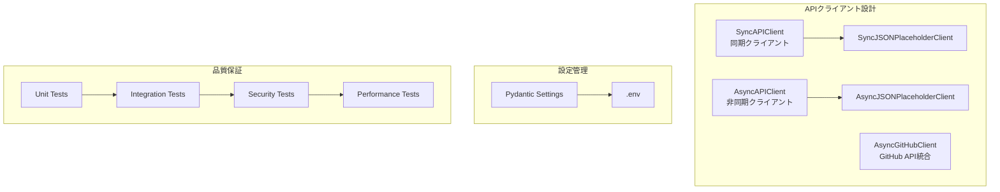

# API Test + DevOps Portfolio

*最終更新: 2026年06月07日*

外部API連携における堅牢性と品質保証を追求し、APIテストとDevOps技術を統合したポートフォリオです。
SSRFやPII漏洩、不安定なリトライといった連携特有のアンチパターンを排除し、1,300件超の自動テストを品質ゲートとして構築・運用しています。

[](https://github.com/yaoki-dev/api-test-devops-portfolio/actions/workflows/ci.yml)
[](https://yaoki-dev.github.io/api-test-devops-portfolio/htmlcov/)
[](https://www.python.org/)
[](https://github.com/astral-sh/ruff)
[](https://mypy-lang.org/)
[](./Dockerfile)
[](./LICENSE)

 **CI/CD / Python / Docker** を統合したAPIテスト自動化ポートフォリオ。
 **1,3７２**件のテスト（CI品質ゲート: **1,358件/96.15%**）

## Demo

3つのGIFで主要機能を視覚的に確認できます（合計35秒）

### 1. CI/CD自動化


**📝 デモ内容**: git push後GitHub Actionsで自動テスト・デプロイ

**何がわかるか**:

- GitHub Actionsによる自動化パイプライン
- コード変更時の自動テスト実行
- 多段階パイプライン

ー see details: [CI/CD Pipeline & Quality Gates](docs/reference/ci_cd_pipeline.md)

### 2. テスト実行


**📝 デモ内容**: クイック実行例（基本テスト19件、デモ時間短縮のため抽出。全1,360件は約60秒）
**🔍 全1,360件を今すぐ確認**: [GitHub Actions CI/CD](https://github.com/yaoki-dev/api-test-devops-portfolio/actions) でフルテスト結果＋カバレッジレポートを閲覧

**何がわかるか**:

- pytest + pytest-covによる自動テスト実行
- カバレッジレポートによる品質可視化
- テスト実行: 基本19件 ~5秒、全1,360件 ~60秒

<details>
<summary>全テスト実行コマンド（1,360件、約60秒）</summary>

```bash
# 全テスト実行（1,360件）
uv run pytest --cov=utils --cov=config --cov=models --cov-report=term -q --color=yes

# クイック実行（unit tests）
uv run pytest tests/unit/test_api_client.py --cov=utils --cov=config --cov=models --cov-report=term -q --color=yes
```

</details>

### 3. Docker操作


 **📝 デモ内容**: Docker Multi-stage buildによるコンテナビルド
 **✅ Docker Compose**: 4環境（development / testing / staging / production）オーケストレーション

**何がわかるか**:

- Docker Multi-stage builds（4段階: base/dependencies/runtime/test）
- 非rootユーザーでのセキュアな実行
- 本番イメージサイズ最適化（< 200MB目標）

ー see details:  [Docker Multi-Stage Runtime Strategy](docs/reference/docker.md)

## 概要

- **`1,360件のテストスイート`**: Unit(1,316) / Integration(35, うちExternal 5件含む) / Performance(7, 週次のみ) / Smoke(2)
- **`カバレッジ: 96.15%`**（unit+integration条件）: 継続的な品質向上
- **`CI実行テスト: 1,358件`**（unit+integration条件, external・performance・smoke除外）
  - 内訳: Unit 1,316件 + Integration 30件（35件のうちexternal 5件を除外）
- **`CI/CD自動化`**: GitHub Actions による多段階パイプライン
- **`セキュリティ`**: CI/CD品質ゲート（pytest + ruff + mypy + Trivy）
- **`GitHub API統合`**: 実務的なAPI統合スキルを証明（Rate Limit管理、ETag活用、非同期処理）

## 技術スタック

| カテゴリ | 技術 |
|---------|-----|
| **`言語`** | Python 3.14 |
| **`HTTP Client`** | httpx（同期/非同期対応） |
| **`設定管理`** | Pydantic Settings（型安全） |
| **`テスト`** | pytest + pytest-cov + pytest-asyncio |
| **`リンター`** | ruff（高速、Rust製） |
| **`型チェック`** | mypy（strict mode） |
| **`パッケージ管理`** | uv（高速、Rust製） |
| **`CI/CD`** | GitHub Actions（多段階パイプライン） |
| **`エラー監視`** | Sentry SDK + MCP統合 |
| **`ログ`** | structlog（構造化ログ） |

## アーキテクチャ

### システム構成図




### 設計判断（Design Decisions）

API特性駆動でクライアントごとに実装範囲を最適化しています。

| 判断 | 選択 | 技術的根拠 |
|------|------|----------|
| **`SyncJSONPlaceholderClient: Sync/Async両実装`** | 両パラダイム対応 | 認証なし・Rate Limit無のシンプルAPI。Django/Flask/CLI (Sync) から FastAPI/並行fetch (Async) まで広範なユースケースに対応。共通設定解決ロジックは `_resolve_client_config` / `_classify_error` で重複削減 |
| **`GitHubClient: Async特化`** | 非同期のみ | 認証 + Rate Limit (5000/h) + ETag対応のAPI特性により、並行fetch (`asyncio.gather`) と条件付きリクエスト (304 Not Modified) の恩恵が大きい。Sync caller は `asyncio.run()` で代替可 |
| **`SyncJSONPlaceholderClient → SyncAPIClient 継承`** | クラス継承 | LSP遵守 (HTTP動詞契約維持) + boilerplate削減。汎用HTTP層とドメインメソッドの責務分離 (SRP) |
| **`GitHubClient: 独立実装`** | 継承せず | 戻り値型契約差異 (`httpx.Response` vs parsed JSON) と ETag/RateLimit/PII redaction の固有要件により、継承すると LSP違反。共通化は例外階層 (`GitHubAPIError(APIClientError)`) と utility 関数レベルに限定 |

詳細な決定背景・トレードオフ分析は ADR (Architecture Decision Records) 参照: `claudedocs/adr/`（ローカル保管・バージョン管理外）

## クイックスタート

### 前提条件

| 要件 | バージョン | 確認コマンド |
|------|-----------|-------------|
| Python | 3.14 | uv run python --version |
| uv | 0.4+ | uv --version |
| Git | 2.0+ | git --version |
| Docker (任意) | 24.0+ | docker --version |

<details>
<summary>uvのインストール方法</summary>

```bash
# macOS / Linux
curl -LsSf https://astral.sh/uv/install.sh | sh

# Windows (PowerShell)
powershell -c "irm https://astral.sh/uv/install.ps1 | iex"

# pip経由
pip install uv
```

</details>

### セットアップ

**Note**: 並列実行には **`pytest-xdist`** が必要です。非並列で実行する場合は **`-n auto`** を外してください。

```bash
# 1. リポジトリクローン
git clone https://github.com/yaoki-dev/api-test-devops-portfolio.git
cd api-test-devops-portfolio

# 2. 依存関係インストール（uv使用、約10秒）
uv sync

# 3. テスト実行（並列）
uv run pytest -n auto

# 4. カバレッジ付きテスト（並列）
uv run pytest -n auto --cov=utils --cov=config --cov=models --cov-report=term

# 5. 特定マーカーのテスト実行
uv run pytest -n auto -m unit        # 単体テストのみ
uv run pytest -n auto -m integration # 統合テストのみ

# 6. 高速実行（並列、manual/external除外）
uv run pytest -n auto -m "not external and not manual"  # CI/CD相当の自動実行可能テストのみ

# 7. 週次手動実行（Rate Limit管理）
uv run pytest -m "manual or external"  # GitHub API統合テスト（週1回推奨、60 req/h制約）
```

## エラー監視・可観測性

### Sentry統合

本プロジェクトでは、Sentry SDKを統合し、ERROR以上のログを自動でSentryに送信します。

**主な機能**:

- 🛡️ **機密データ保護**: 44種類の機密キーを自動スクラブ（password, token, api_key等）
- 🔄 **structlog連携**: ERROR/CRITICAL/EXCEPTIONレベルを自動送信
- ⚡ **サイレント失敗**: Sentry障害時もアプリケーション継続
- 🔐 **SecretStr保護**: DSNの平文出力防止

**環境変数設定**:

```bash
# Sentry設定（.envファイル）
SENTRY__ENABLED=true
SENTRY__DSN=https://xxx@xxx.ingest.us.sentry.io/xxx
SENTRY__ENVIRONMENT=production
SENTRY__TRACES_SAMPLE_RATE=0.1
SENTRY__SEND_DEFAULT_PII=false
```

**初期化（アプリケーション起動時）**:

```python
from utils.sentry_init import init_sentry

if init_sentry():
    logger.info("Sentry monitoring enabled")
```
 **エラー監視** : Sentry SDK統合済み
（ERROR以上自動送信、44種機密キー自動スクラブ、structlog連携、capturing transportでテスト時ネットワーク非依存）

 **テスト方針**: Sentry連携は `tests/unit/test_sentry_init.py` の boot-up 検証と、`tests/integration/test_sentry_logging_integration.py` の結合検証でカバーする。実 Sentry DSN への送信は外部依存・ダッシュボードノイズを招くため、capturing transport でネットワーク非依存に保つ。

 📚 詳細は `.serena/memories/sentry_integration.md` を参照

## ライセンス

MIT

## お問い合わせ

- **GitHub**: [@yaoki-dev](https://github.com/yaoki-dev)
- **LinkedIn**: *プロフィール準備中*
