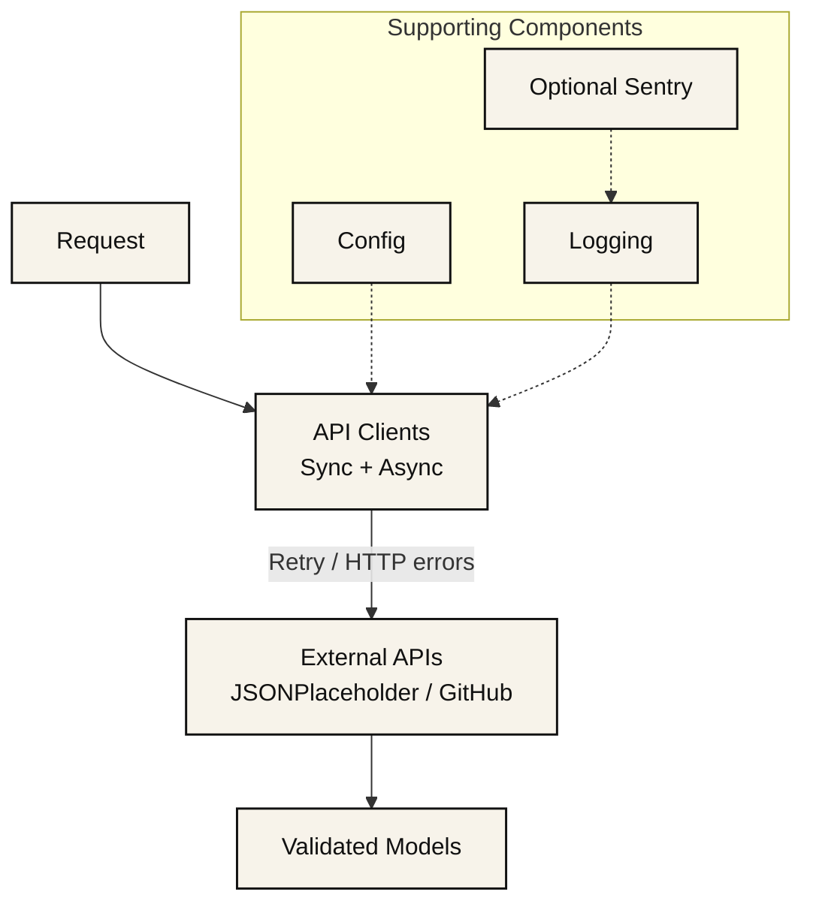
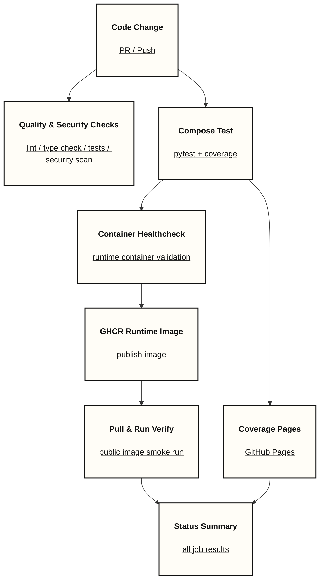
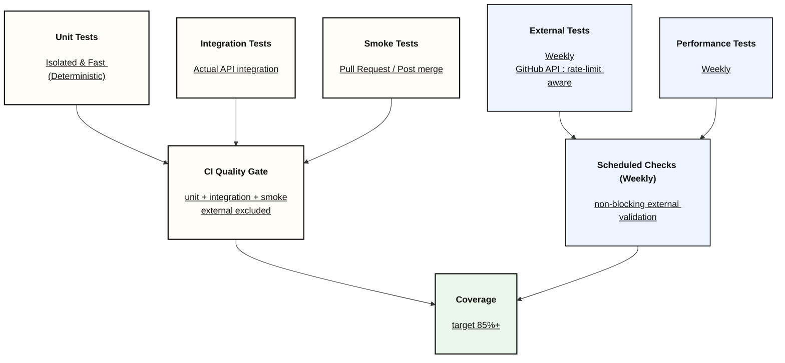
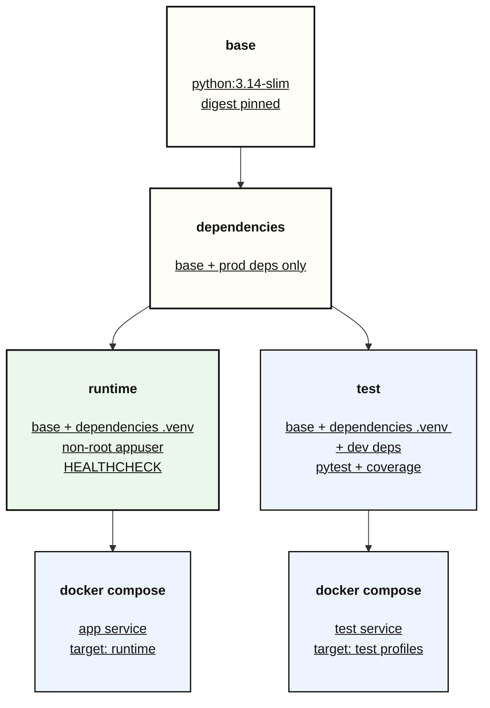

# API Test + DevOps Portfolio

*最終更新: 2026-09-07*

外部API連携における堅牢性と品質保証を追求し、APIテストとDevOps技術を統合したポートフォリオです。
外部API連携の防御境界を、base URLの許可ドメインallowlist、Sentryの`before_send` / `before_send_transaction`による送信前スクラブ、exponential backoff + jitterによるリトライ間隔制御として実装・検証しています。

[](https://github.com/yaoki-dev/api-test-devops-portfolio/actions/workflows/ci.yml)
[](https://yaoki-dev.github.io/api-test-devops-portfolio/htmlcov/)
[](https://www.python.org/)
[](https://github.com/astral-sh/ruff)
[](https://mypy-lang.org/)
[](./Dockerfile)
[](https://github.com/yaoki-dev/api-test-devops-portfolio/pkgs/container/api-test-devops-portfolio)
[](./LICENSE)

## 作成背景

前職では、他メンバーが実装した機能をステージング環境で手動操作し、結合・システム・業務シナリオ観点で確認していました。
その中で、実行手順の属人化、確認漏れ、リリース前の再実行コストといった課題を経験しました。

このリポジトリでは、その課題を API / 結合層の品質保証に絞って設計しています。
外部API連携で起こりやすい SSRF、PII漏洩、不安定なリトライ、Rate Limit 対応漏れなどを題材に、pytest による自動テスト、GitHub Actions の品質ゲート、Docker による再現可能な実行環境として実装しました。

目的は、手動確認に依存しやすい品質保証を、再現可能・継続実行可能・レビュー可能な仕組みに置き換えることです。

## 概要

- **`テストスイート`**: 全1,597件 — Unit 1,573 / Integration合計15（非External 3 / External 12）/ Performance 7（週次のみ）/ Smoke 2 / Slow 1（Unit内のサブセット）/ 未分類 0
- **`CIセレクタ対象`**: PR/host 1,576件（収集時） / **ローカル再計測カバレッジ 98.07%**（下限は `pyproject.toml` の `--cov-fail-under`）
  - PR/hostセレクタは `(unit or integration) and not external`。Composeセレクタ（Pages artifactの生成元）は `(unit or integration) and not external and not repo_contract` で1,543件。PR Validation は前者にSmoke 2件をカバレッジ計測外で追加実行
- 上記のテストケース数・CIセレクタ対象ケース数・カバレッジは、公開ドキュメント内の集計値のSSOTとする。
  他文書は数値を転記せず本節を参照する。2026-09-07 の基準測定は、`origin/main` のcommit `8d1b73cb8a029de77f482ac00e81fc9668b04f23`で実施し、排他的内訳 `1,573 + 3 + 12 + 7 + 2 = 1,597`、1,597 collected / 1,576 selected / 1,576 passed、カバレッジ98.07%を確認した。Composeセレクタは `repo_contract` を除外するため、1,543 selected / 1,543 passedとなる:

  ```bash
  TEST__EXTERNAL_API_ENABLED=false uv run pytest -n auto -m "(unit or integration) and not external" \
    --cov=utils --cov=config --cov=models --cov-report=term-missing
  ```
- **`CI/CD自動化`**: GitHub Actions による多段階パイプライン
- **`セキュリティ`**: CI/CD品質ゲート（pytest + ruff + mypy + Trivy）
- **`GitHub API統合`**: 実務的なAPI統合スキルを証明（Rate Limit管理、ETag活用、非同期処理）

## 技術スタック

| カテゴリ | 技術 |
|---------|-----|
| **`言語`** | Python 3.14 |
| **`HTTP Client`** | httpx（同期/非同期対応） |
| **`設定管理`** | Pydantic Settings（型安全） |
| **`テスト`** | pytest + pytest-cov + pytest-asyncio |
| **`リンター`** | ruff（高速、Rust製） |
| **`型チェック`** | mypy（strict mode） |
| **`パッケージ管理`** | uv（高速、Rust製） |
| **`CI/CD`** | GitHub Actions（多段階パイプライン） |
| **`ログ・可観測性`** | structlog + Sentry SDK（任意、既定無効） |

## アーキテクチャ

### システム構成図


```mermaid
graph TB
    R[Request] --> AC[API Clients<br/>Sync + Async]
    AC -- "Retry / HTTP errors" --> EA[External APIs<br/>JSONPlaceholder / GitHub]
    EA --> VM[Validated Models]

    subgraph "Supporting Components"
        CFG[Config]
        LOG[Logging]
        SEN[Optional Sentry]
    end

    CFG -.-> AC
    LOG -.-> AC
    SEN -.-> LOG

    classDef default fill:#F7F3EA,stroke:#111,stroke-width:1.5px,color:#111;
```

> この図は、リクエストが同期・非同期APIクライアントを経由して外部APIへ到達し、検証済みモデルとして返る主要な処理経路を示します。

### 運用・デプロイフロー


```mermaid
flowchart TD
    A["<h4>Code Change</h4><u>PR / Push</u>
    <br/>"]

    A --> B["<h4>Quality & Security Checks</h4><u>lint / type check / tests / security scan</u>
    <br/>"]

    A --> C["<h4>Compose Test</h4><u>pytest + coverage</u>
    <br/>"]

    C --> D["<h4>Coverage Pages</h4><u>GitHub Pages</u>
    <br/>"]

    C --> E["<h4>Container Healthcheck</h4><u>runtime container validation</u>
    <br/>"]

    E --> F["<h4>GHCR Runtime Image</h4><u>publish image</u>
    <br/>"]

    F --> G["<h4>Pull & Run Verify</h4><u>public image smoke run</u>
    <br/>"]

    G --> H["<h4>Status Summary</h4><u>all job results</u>
    <br/>"]

    D --> H

    classDef default fill:#F7F3EA,stroke:#111,stroke-width:1.5px,color:#111;
    classDef key fill:#FFFDF7,stroke:#111,stroke-width:2px,color:#111;

    class A,B,C,D,E,F,G,H key;
```
<br/>

> **注記**: 現在は GitHub Pages (coverage) + GHCR (runtime image) までの **Continuous Delivery** が実装済みです。Cloud Run / ECS / K8s 等の本番ホスティングへの実デプロイ (Continuous Deployment) は未実装です。
>
> **公開ゲート**: GHCR への publish は、runtime コンテナが healthy になり Trivy の CVE スキャン (CRITICAL/HIGH) がグリーンの場合のみ実行します。
> 公開後は認証なしの匿名 pull でイメージを取得・起動し、利用者と同じ経路で実行可能性を smoke 検証します。
>
> この図は論理概要です。正確な job 名、trigger、`needs` 依存、multi-arch検証、Trivy/SARIF詳細は [CI/CD Pipeline](docs/reference/ci_cd_pipeline.md) に記載しています。

### テスト戦略


```mermaid
flowchart TD
    A["<h4>Unit Tests</h4><u>Isolated & Fast (Deterministic)</u>
    <br/>"]
    B["<h4>Integration Tests</h4><u>Actual API integration</u>
    <br/>"]
    G["<h4>Smoke Tests</h4><u>Pull Request / Post merge</u>
    <br/>"]

    A --> C["<h4>CI Quality Gate</h4><u>unit + integration + smoke<br/>external excluded</u>
    <br/>"]
    B --> C
    G --> C

    D["<h4>External Tests</h4><u>Weekly<br/>GitHub API : rate-limit aware</u>
    <br/>"]
    F["<h4>Performance Tests</h4><u>Weekly</u>
    <br/>"]

    D --> E["<h4>Scheduled Checks (Weekly)</h4><u>non-blocking external validation</u>
    <br/>"]
    F --> E

    C --> H["<h4>Coverage</h4><u>target 85%+</u>
    <br/>"]
    E --> H

    classDef default fill:#F7F3EA,stroke:#111,stroke-width:1.5px,color:#111;
    classDef key fill:#FFFDF7,stroke:#111,stroke-width:2px,color:#111;
    classDef support fill:#EEF4FF,stroke:#111,stroke-width:1.5px,color:#111;
    classDef metric fill:#EAF7EA,stroke:#111,stroke-width:2px,color:#111;

    class A,B,C,G key;
    class D,E,F support;
    class H metric;
```

> この図は、unit・integration・smoke を CI品質ゲートへ、external・performance を週次の Scheduled Checks へ振り分ける検証戦略を示します。カバレッジ計測の対象は unit+integration 条件（external・performance・smoke を除外）です。

### Docker multi-stage


```mermaid
flowchart TD
    B["<h4>base</h4><u>python:3.14-slim<br/>digest pinned</u>
    <br/>"]

    B --> D["<h4>dependencies</h4><u>base + prod deps only</u>
    <br/>"]

    D --> R["<h4>runtime</h4><u>base + dependencies .venv<br/>non-root appuser<br/>HEALTHCHECK</u>
    <br/>"]

    D --> T["<h4>test</h4><u>base + dependencies .venv + dev deps<br/>pytest + coverage</u>
    <br/>"]

    R --> C1["<h4>docker compose</h4><u>app service<br/>target: runtime</u>
    <br/>"]

    T --> C2["<h4>docker compose</h4><u>test service<br/>target: test profiles</u>
    <br/>"]

    classDef default fill:#F7F3EA,stroke:#111,stroke-width:1.5px,color:#111;
    classDef key fill:#FFFDF7,stroke:#111,stroke-width:2px,color:#111;
    classDef runtime fill:#EAF7EA,stroke:#111,stroke-width:2px,color:#111;
    classDef support fill:#EEF4FF,stroke:#111,stroke-width:1.5px,color:#111;

    class B,D key;
    class R runtime;
    class T,C1,C2 support;
```
<br/>
> この図は4段階マルチステージビルドの論理構成です。イメージサイズ最適化、マルチアーキ（amd64/arm64）publish・検証、非root実行・HEALTHCHECK、ベースイメージのdigest固定（サプライチェーン対策）は [Docker Multi-Stage Runtime Strategy](docs/reference/docker.md) に記載しています。

<br/>

### 設計判断（Design Decisions）

| 判断 | 採用方針 | 根拠・トレードオフ |
|------|----------|------------------|
| **`pytest 採用`** | 標準的・豊富なプラグイン・並列実行対応。既存のpytestテスト/fixtureを拡張しやすい。 | 機能過多で学習曲線あり。fixture 設計に慣れが必要。 |
| **`HTTPXモック: respx採用`** | HTTPXのSync / Asyncに対応し、ルーティングベースで宣言的にモック。 | HTTPX依存。標準 library 非依存を優先する場合は不向き。 |
| **`Sync / Async 使い分け`** | JSONPlaceholderはSync / Async双方で共通CRUDを提供し、単純な利用例はSync、並行I/Oが必要な処理はAsync。GitHub APIはAsync専用。 | 単純なAPIはSyncの方が直線的でテスト容易。Asyncは呼び出し側に asyncio.run() 等の境界管理が必要で、Sync / Async双方の契約・テスト維持コストを負う（詳細: [ADR-0002](docs/adr/0002-sync-async-parity-api-client.md)）。 |
| **`JSONPlaceholder: Sync基盤継承`** | JSONPlaceholder の Sync クライアントは共通 SyncAPIClient を継承し、HTTP基盤とドメイン操作を分離。 | LSP遵守 (HTTP動詞契約維持) + boilerplate削減。汎用HTTP層とドメインメソッドの責務分離 (SRP)。代償として基底 SyncAPIClient の契約変更が全ドメインメソッドへ波及し、JSONPlaceholder 固有のHTTP制御は基底の契約内に制限される（詳細: [ADR-0002](docs/adr/0002-sync-async-parity-api-client.md)）。 |
| **`書き込みメソッドの保守的なリトライ`** | `POST` / `PATCH` / `PUT` は既定で 1 回のみ実行し、サーバー側の重複排除契約がある場合だけ呼び出し単位で `retry_non_idempotent=True` を指定する。Sync / Async と公開ドメインメソッドで同じ契約を提供。 | 要求処理済み・応答消失時の意図しない再送を既定で抑える。HTTP仕様上PUTは冪等だが、本プロジェクトでは書き込みを保守的に扱うため、明示指定の手間とIdempotency-Key等の契約確認責任が呼び出し側に残る（[RFC 9110](https://www.rfc-editor.org/rfc/rfc9110.html#name-idempotent-methods)、詳細: [ADR-0006](docs/adr/0006-non-idempotent-retry-policy.md)）。 |
| **`GitHubClient: 独立実装`** | 継承せず | 戻り値型契約差異（httpx.Response vs 検証済み Pydantic モデル）と ETag / Rate Limit / PII redaction の固有要件により、継承すると LSP違反。共通化は例外階層（GitHubAPIError(APIClientError)）とutility関数レベルに限定する（詳細: [ADR-0001](docs/adr/0001-async-only-github-client.md)）。 |
| **`GitHubClient: Async特化`** | GitHub APIはAsync専用クライアントとして実装し、Sync版は持たない。現行実装はRate Limitヘッダー監視とETag / 304キャッシュを提供し、複数リソースの並行取得は今後の拡張余地とする。 | Async-onlyにより同期利用は asyncio.run() 等の境界管理が必要。fan-out経路は現時点で未行使だが、Sync版を増やさず将来の並行I/Oを取り込める（詳細: [ADR-0001](docs/adr/0001-async-only-github-client.md)）。 |
| **`GitHubモデル: strict + extra ignore`** | GitHubの既知フィールドは厳密に型検証し、将来の追加フィールドは無視する。一方、JSONPlaceholderは既存のstrict/forbid/サニタイズ方針を維持する。 | 外部APIごとの型ドリフト耐性と既存データ保護ポリシーを分離する。代償として `extra="ignore"` は追加フィールドを黙って捨てる。さらに任意フィールドは既定値 `None` を持つため、欠落・改名の検知が遅れやすい（`extra="forbid"` なら追加フィールドは ValidationError として通知される）。 |
| **`サニタイズの適用範囲`** | JSONPlaceholder モデルのユーザー生成テキストに防御的サニタイズ (html.escape) を実装。GitHub 側は原文保持を優先し横展開しない。 | XSS対策の基本は出力時の context-aware encoding。モデル層サニタイズは補助防御だが、html.escape は値を変換するためデータ忠実性と衝突する。GitHub は原文保持を優先。 |
| **`例外チェーン方針`** | GitHubの実レスポンス由来例外は未サニタイズのまま cause にせず、JSON解析失敗は本文を含まない `SanitizedJSONDecodeError` を代理 cause にする。合成モックAPIのJSONPlaceholderは既存の `from e` を維持する（詳細: [ADR-0001](docs/adr/0001-async-only-github-client.md)）。 | Pydantic ValidationError等からのPII漏洩を抑える一方、原因追跡は例外種別・メッセージ・位置情報に限定される。実装を非対称にする代わりに、データの出所をリスク判定の軸にする。 |
| **`Multi-stage Docker`** | base / dependencies / runtime / test の4段階。runtimeの圧縮pull sizeは48.4 MB（2026-07-04の記録値。測定条件は [Docker reference](docs/reference/docker.md) を参照）・非root・ビルドキャッシュ最適化。 | 依存解決・runtime・testを分離し、最終イメージから不要なビルド/テスト依存を除外。代償として Dockerfile は複雑化し、単一 stage より理解コストが上がる。 |
| **`多段階CIゲート`** | PRではpytest・Compose/healthcheck・Markdown・Trivyを、pushではCompose/healthcheck・filesystem/Trivy・post-validationを実行し、main push時だけPages/GHCR公開と公開物検証を追加。ジョブ間はneedsで必要な依存だけを接続し、独立ゲートを並列化する。 | トリガーとneeds条件の組合せは複雑になるが、独立ジョブの並列化で待ち時間を抑える（詳細: [CI/CD reference](docs/reference/ci_cd_pipeline.md)、[ADR-0003](docs/adr/0003-ci-result-loss-prevention-conditions.md)）。 |
| **`Trivy 3層検証`** | PR: filesystem scan（develop/main）。main宛または`docker`ラベル付きPRはimage scanも追加。push: filesystem + image scan（`post-trivy-scan`）。 | 重複スキャンあり。image scanのDockerビルドはPR/pushとも `no-cache` でゲート自身の鮮度を優先し、Trivy脆弱性DBキャッシュはschedule以外で再利用する（両者は別のキャッシュ層。[ADR-0005](docs/adr/0005-ci-cache-freshness-vs-build-time.md)）。SARIFでSecurity tabに統合。 |
| **`Trivy: unfixed除外`** | `ignore-unfixed: true` で、Trivy の脆弱性 DB に修正情報が反映され、更新済み DB を使用したスキャンで検出された脆弱性をゲート対象にする。 | 修正未提供の脆弱性を合否から除外するリスク受容であり、脆弱性ゼロの証明ではない（詳細: [ADR-0004](docs/adr/0004-trivy-ignore-unfixed-policy.md)）。 |
| **`Markdown品質ゲート`** | `.github/workflows/ci.yml` の `pr-md-quality-check` はmarkdownlintとtextlintの結果を収集し、`Check lint results` で失敗時にジョブをfailureにする。 | `continue-on-error` は診断継続に限定する。required status checkとして設定されていない限り、ワークフロー単体ではマージを直接ブロックしない。 |
| **`GHCR + Pages 公開`** | GHCR: 公開パッケージは匿名pullで検証可能。publishは`GITHUB_TOKEN`を使い、GHCR用OIDCは不要。Pages: カバレッジHTMLとバッジを公開し、deployにはPages権限を使う。バッジは生成失敗時に `n/a` fallback。 | GHCRはpublic package設定が必要（リポジトリ公開性とは別管理）。PagesはGitHub Actionsの`pages:write` / `id-token:write`等が必要。 |


## クイックスタート

### 前提条件

| 要件 | バージョン | 確認コマンド |
|------|-----------|-------------|
| Python | 3.14 | uv run python --version |
| uv | 0.4+ | uv --version |
| Git | 2.0+ | git --version |
| Docker (任意) | 24.0+ | docker --version |

<details>
<summary>uvのインストール方法</summary>

```bash
# macOS / Linux
curl -LsSf https://astral.sh/uv/install.sh | sh

# Windows (PowerShell)
powershell -c "irm https://astral.sh/uv/install.ps1 | iex"

# pip経由
pip install uv
```

</details>

### ローカル環境セットアップ

```bash
# 1. リポジトリクローン
git clone https://github.com/yaoki-dev/api-test-devops-portfolio.git
cd api-test-devops-portfolio

# 2. 環境変数の設定（テンプレートから作成）
cp .env.example .env

# 3. 依存関係インストール（uv使用、約10秒）
uv sync
```

### ローカルでのテスト実行

```bash
# 1. テスト実行（並列）
uv run pytest -n auto

# 2. カバレッジ付きテスト（並列）
uv run pytest -n auto --cov=utils --cov=config --cov=models --cov-report=term

# 3. 特定マーカーのテスト実行
uv run pytest -n auto -m unit        # 単体テストのみ
uv run pytest -n auto -m integration # 統合テストのみ

# 4. 高速実行（並列、manual/external除外）
uv run pytest -n auto -m "not external and not manual"  # CI/CD相当の自動実行可能テストのみ

# 5. 週次手動実行（Rate Limit管理）
uv run pytest -m "manual or external"  # GitHub API統合テスト（週1回推奨、60 req/h制約）
```

### Dockerでの実行（コンテナ環境）
不変ランタイム（`runtime` ステージ）のポータビリティと、環境変数による挙動切り替え（Twelve-Factor App準拠）をローカルで検証します。

```bash
# テスト専用プロファイルでテスト実行（testコンテナで品質検証）
docker compose --profile test run --build --rm test

# 共通runtime用のコンテナを起動
docker compose up -d
```

## エラー監視・可観測性

### Sentry統合

Sentry SDK標準のスクラブに加えて、46種の機密キーパターン、自由文字列の認証情報・高信頼なPII形状、HTTP pathの数値・UUID識別子を対象とする防御的スクラブを`before_send` / `before_send_transaction`フックへ自前実装しています。初期化失敗時は本番相当環境でfail-fast、開発・テスト環境では警告して継続します。既定無効のopt-inで、テストはネットワーク非依存です。

対象APIが実PIIを扱わなくても、外部サービスへ送信するイベント境界には例外・ログ経由の機密情報が混入し得るため、`before_send` と `before_send_transaction` を送信前の防御層として検証しています。

本番デプロイ、実DSNによる継続監視、アラート運用、release/deploy連携は未実施です。詳細は [Sentry統合リファレンス](docs/reference/sentry.md) を参照してください。

## ライセンス

MIT

## お問い合わせ

- **GitHub**: [@yaoki-dev](https://github.com/yaoki-dev)
- **LinkedIn**: *プロフィール準備中*
