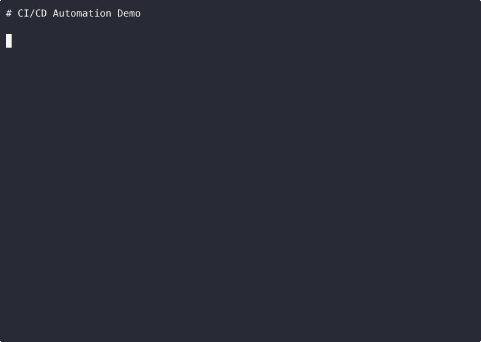
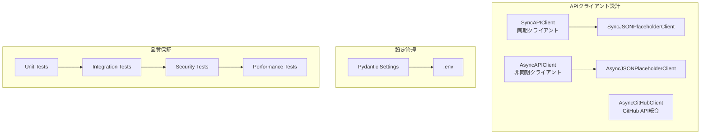
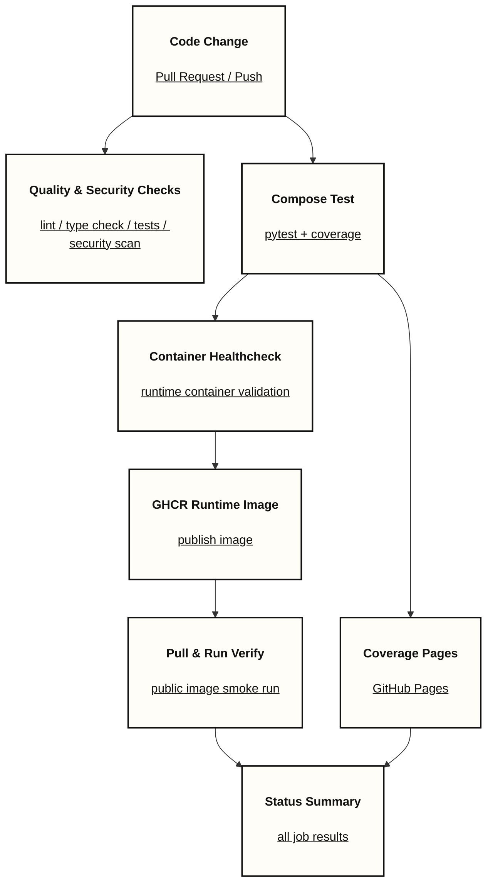
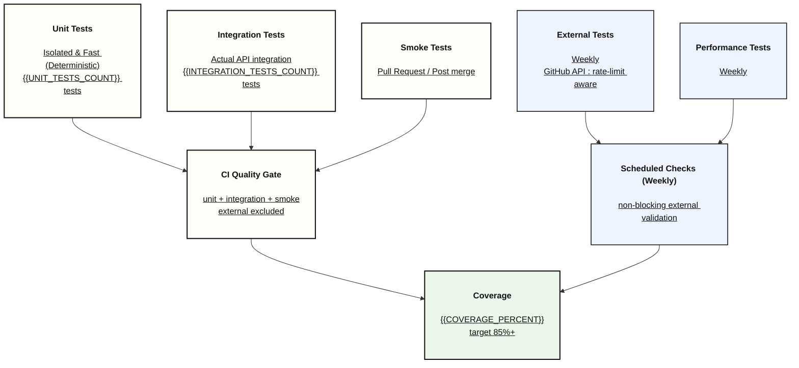
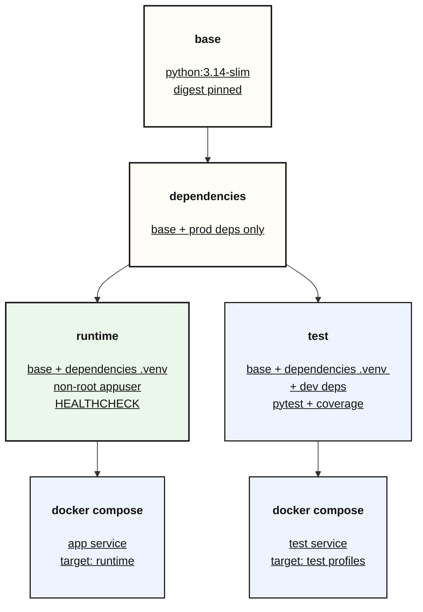

# API Test + DevOps Portfolio

*最終更新: 2026年06月07日*

外部API連携における堅牢性と品質保証を追求し、APIテストとDevOps技術を統合したポートフォリオです。
SSRFやPII漏洩、不安定なリトライといった連携特有のアンチパターンを排除し、1,300件超の自動テストを品質ゲートとして構築・運用しています。

[](https://github.com/yaoki-dev/api-test-devops-portfolio/actions/workflows/ci.yml)
[](https://yaoki-dev.github.io/api-test-devops-portfolio/htmlcov/)
[](https://www.python.org/)
[](https://github.com/astral-sh/ruff)
[](https://mypy-lang.org/)
[](./Dockerfile)
[](https://github.com/yaoki-dev/api-test-devops-portfolio/pkgs/container/api-test-devops-portfolio)
[](./LICENSE)

## 作成背景

前職では、他メンバーが実装した機能をステージング環境で手動操作し、結合・システム・業務シナリオ観点で確認していました。
その中で、実行手順の属人化、確認漏れ、リリース前の再実行コストといった課題を経験しました。

このリポジトリでは、その課題を API / 結合層の品質保証に絞って設計しています。
外部API連携で起こりやすい SSRF、PII漏洩、不安定なリトライ、Rate Limit 対応漏れなどを題材に、pytest による自動テスト、GitHub Actions の品質ゲート、Docker による再現可能な実行環境として実装しました。

目的は、手動確認に依存しやすい品質保証を、再現可能・継続実行可能・レビュー可能な仕組みに置き換えることです。

## Demo

3つのGIFで主要機能を視覚的に確認できます（合計35秒）

<!-- ### 1. CI/CD自動化



**📝 デモ内容**: git push後GitHub Actionsで自動テスト・デプロイ

**何がわかるか**:

- GitHub Actionsによる自動化パイプライン
- コード変更時の自動テスト実行
- 多段階パイプライン

ー see details: [CI/CD Pipeline & Quality Gates](docs/reference/ci_cd_pipeline.md)

### 2. テスト実行


**📝 デモ内容**: クイック実行例（基本テスト19件、デモ時間短縮のため抽出。全1,360件は約60秒）
**🔍 全1,360件を今すぐ確認**: [GitHub Actions CI/CD](https://github.com/yaoki-dev/api-test-devops-portfolio/actions) でフルテスト結果＋カバレッジレポートを閲覧

**何がわかるか**:

- pytest + pytest-covによる自動テスト実行
- カバレッジレポートによる品質可視化
- テスト実行: 基本19件 ~5秒、全1,360件 ~60秒

<details>
<summary>全テスト実行コマンド（1,360件、約60秒）</summary>

```bash
# 全テスト実行（1,360件）
uv run pytest --cov=utils --cov=config --cov=models --cov-report=term -q --color=yes

# クイック実行（unit tests）
uv run pytest tests/unit/test_jsonplaceholder_client_sync.py --cov=utils --cov=config --cov=models --cov-report=term -q --color=yes
```

</details>

### 3. Docker操作


 **📝 デモ内容**: Docker Multi-stage buildによるコンテナビルド
 **✅ Docker Compose**: 4環境（development / testing / staging / production）オーケストレーション

**何がわかるか**:

- Docker Multi-stage builds（4段階: base/dependencies/runtime/test）
- 非rootユーザーでのセキュアな実行
- 本番イメージサイズ最適化（runtime ~46 MiB pull / ~146 MiB 展開後・linux/amd64）

ー see details:  [Docker Multi-Stage Runtime Strategy](docs/reference/docker.md) -->

## 概要

- **`1,360件のテストスイート`**: Unit(1,316) / Integration(35, うちExternal 5件含む) / Performance(7, 週次のみ) / Smoke(2)
- **`カバレッジ: 96.15%`**（unit+integration条件）: 継続的な品質向上
- **`CI実行テスト: 1,358件`**（unit+integration条件, external・performance・smoke除外）
  - 内訳: Unit 1,316件 + Integration 30件（35件のうちexternal 5件を除外）
- **`CI/CD自動化`**: GitHub Actions による多段階パイプライン
- **`セキュリティ`**: CI/CD品質ゲート（pytest + ruff + mypy + Trivy）
- **`GitHub API統合`**: 実務的なAPI統合スキルを証明（Rate Limit管理、ETag活用、非同期処理）

## 技術スタック

| カテゴリ | 技術 |
|---------|-----|
| **`言語`** | Python 3.14 |
| **`HTTP Client`** | httpx（同期/非同期対応） |
| **`設定管理`** | Pydantic Settings（型安全） |
| **`テスト`** | pytest + pytest-cov + pytest-asyncio |
| **`リンター`** | ruff（高速、Rust製） |
| **`型チェック`** | mypy（strict mode） |
| **`パッケージ管理`** | uv（高速、Rust製） |
| **`CI/CD`** | GitHub Actions（多段階パイプライン） |
| **`エラー監視`** | Sentry SDK + MCP統合 |
| **`ログ`** | structlog（構造化ログ） |

## アーキテクチャ

### システム構成図


```mermaid
graph TB
    subgraph "APIクライアント設計"
        SC[SyncAPIClient<br/>同期クライアント]
        SC --> JP[SyncJSONPlaceholderClient]
        AC[AsyncAPIClient<br/>非同期クライアント]
        AC --> AJP[AsyncJSONPlaceholderClient]
        AGC[AsyncGitHubClient<br/>GitHub API統合]
    end

    subgraph "設定管理"
        PS[Pydantic Settings] --> ENV[.env]
    end

    subgraph "品質保証"
        UT[Unit Tests] --> IT[Integration Tests]
        IT --> SEC[Security Tests]
        SEC --> PERF[Performance Tests]
    end
```

### 運用・デプロイフロー


```mermaid
flowchart TD
    A["<h4>Code Change</h4><u>Pull Request / Push</u>
    <br/>"]

    A --> B["<h4>Quality & Security Checks</h4><u>lint / type check / tests / security scan</u>
    <br/>"]

    A --> C["<h4>Compose Test</h4><u>pytest + coverage</u>
    <br/>"]

    C --> D["<h4>Coverage Pages</h4><u>GitHub Pages</u>
    <br/>"]

    C --> E["<h4>Container Healthcheck</h4><u>runtime container validation</u>
    <br/>"]

    E --> F["<h4>GHCR Runtime Image</h4><u>publish image</u>
    <br/>"]

    F --> G["<h4>Pull & Run Verify</h4><u>public image smoke run</u>
    <br/>"]

    G --> H["<h4>Status Summary</h4><u>all job results</u>
    <br/>"]

    D --> H

    classDef default fill:#F7F3EA,stroke:#111,stroke-width:1.5px,color:#111;
    classDef key fill:#FFFDF7,stroke:#111,stroke-width:2px,color:#111;

    class A,B,C,D,E,F,G,H key;
```
<br/>

> **注記**: 現在は GitHub Pages (coverage) + GHCR (runtime image) までの **Continuous Delivery** が実装済みです。Cloud Run / ECS / K8s 等の本番ホスティングへの実デプロイ (Continuous Deployment) は未実装です。
>
> **公開ゲート**: GHCR への publish は、runtime コンテナが healthy になり Trivy の CVE スキャン (CRITICAL/HIGH) がグリーンの場合のみ実行します。
> 公開後は認証なしの匿名 pull でイメージを取得・起動し、利用者と同じ経路で実行可能性を smoke 検証します。
>
> この図は論理概要です。正確な job 名、trigger、`needs` 依存、multi-arch検証、Trivy/SARIF詳細は [CI/CD Pipeline](docs/reference/ci_cd_pipeline.md) に記載しています。

### テスト戦略


```mermaid
flowchart TD
    A["<h4>Unit Tests</h4><u>Isolated & Fast (Deterministic)<br/>{{UNIT_TESTS_COUNT}} tests</u>
    <br/>"]
    B["<h4>Integration Tests</h4><u>Actual API integration<br/>{{INTEGRATION_TESTS_COUNT}} tests</u>
    <br/>"]
    G["<h4>Smoke Tests</h4><u>Pull Request / Post merge</u>
    <br/>"]

    A --> C["<h4>CI Quality Gate</h4><u>unit + integration + smoke<br/>external excluded</u>
    <br/>"]
    B --> C
    G --> C

    D["<h4>External Tests</h4><u>Weekly<br/>GitHub API : rate-limit aware</u>
    <br/>"]
    F["<h4>Performance Tests</h4><u>Weekly</u>
    <br/>"]

    D --> E["<h4>Scheduled Checks (Weekly)</h4><u>non-blocking external validation</u>
    <br/>"]
    F --> E

    C --> H["<h4>Coverage</h4><u>{{COVERAGE_PERCENT}}<br/>target 85%+</u>
    <br/>"]
    E --> H

    classDef default fill:#F7F3EA,stroke:#111,stroke-width:1.5px,color:#111;
    classDef key fill:#FFFDF7,stroke:#111,stroke-width:2px,color:#111;
    classDef support fill:#EEF4FF,stroke:#111,stroke-width:1.5px,color:#111;
    classDef metric fill:#EAF7EA,stroke:#111,stroke-width:2px,color:#111;

    class A,B,C,G key;
    class D,E,F support;
    class H metric;
```

### Docker multi-stage


```mermaid
flowchart TD
    B["<h4>base</h4><u>python:3.14-slim<br/>digest pinned</u>
    <br/>"]

    B --> D["<h4>dependencies</h4><u>base + prod deps only</u>
    <br/>"]

    D --> R["<h4>runtime</h4><u>base + dependencies .venv<br/>non-root appuser<br/>HEALTHCHECK</u>
    <br/>"]

    D --> T["<h4>test</h4><u>base + dependencies .venv + dev deps<br/>pytest + coverage</u>
    <br/>"]

    R --> C1["<h4>docker compose</h4><u>app service<br/>target: runtime</u>
    <br/>"]

    T --> C2["<h4>docker compose</h4><u>test service<br/>target: test profiles</u>
    <br/>"]

    classDef default fill:#F7F3EA,stroke:#111,stroke-width:1.5px,color:#111;
    classDef key fill:#FFFDF7,stroke:#111,stroke-width:2px,color:#111;
    classDef runtime fill:#EAF7EA,stroke:#111,stroke-width:2px,color:#111;
    classDef support fill:#EEF4FF,stroke:#111,stroke-width:1.5px,color:#111;

    class B,D key;
    class R runtime;
    class T,C1,C2 support;
```
<br/>
> この図は4段階マルチステージビルドの論理構成です。イメージサイズ最適化、マルチアーキ（amd64/arm64）publish・検証、非root実行・HEALTHCHECK、ベースイメージのdigest固定（サプライチェーン対策）は [Docker Multi-Stage Runtime Strategy](docs/reference/docker.md) に記載しています。

<br/>

### 設計判断（Design Decisions）

主要な技術選定とクライアント設計の決定根拠を文書化します（面接官向け可視化）。API特性駆動でクライアントごとに実装範囲を最適化しています。

| 判断 | 採用方針 | 根拠・トレードオフ |
|------|----------|------------------|
| **`pytest 採用`** | 標準的・豊富なプラグイン・並列実行対応。unittest 互換で移行コスト低。 | 機能過多で学習曲線あり。fixture 設計に慣れが必要。 |
| **`HTTPXモック: respx採用`** | httpx ネイティブ対応・非同期対応・ルーティングベースで宣言的。requests-mock より型安全。 | httpx 依存。標準 library 非依存を優先する場合は不向き。 |
| **`Sync / Async 使い分け`** | JSONPlaceholder の単体CRUDは Sync、並行I/Oが効く処理と GitHub API は Async。（適材適所） | シンプルAPIでは Sync の方が直線的でテスト容易。GitHub は Rate Limit / ETag / 並行取得の恩恵が大きいため Async 特化。Async 導入により呼び出し側は asyncio.run() 等の境界管理が必要。 |
| **`JSONPlaceholder: Sync基盤継承`** | JSONPlaceholder の Sync クライアントは共通 SyncAPIClient を継承し、HTTP基盤とドメイン操作を分離。 | LSP遵守 (HTTP動詞契約維持) + boilerplate削減。汎用HTTP層とドメインメソッドの責務分離 (SRP)。 |
| **`GitHubClient: 独立実装`** | 継承せず | 戻り値型契約差異 (httpx.Response vs parsed JSON) と ETag/RateLimit/PII redaction の固有要件により、継承すると LSP違反。共通化は例外階層 (GitHubAPIError(APIClientError)) と utility 関数レベルに限定。 |
| **`GitHubClient: Async特化`** | GitHub API は Async 専用クライアントとして実装し、Sync 版は持たない。 | 認証・Rate Limit・ETag・複数リソース取得により並行I/Oの恩恵が大きい。Sync版を持たないことで保守対象を増やさず、同期利用は呼び出し境界で明示的に扱う。 |
| **`サニタイズの適用範囲`** | JSONPlaceholder モデルのユーザー生成テキストに防御的サニタイズ (html.escape) を実装。GitHub 側は原文保持を優先し横展開しない。 | XSS対策の基本は出力時の context-aware encoding。モデル層サニタイズは補助防御だが、html.escape は値を変換するためデータ忠実性と衝突する。GitHub は原文保持を優先。 |
| **`Multi-stage Docker`** | base/deps/runtime/test 4段階。本番 runtime 48.4 MB（pull size）・非root・ビルドキャッシュ最適化。 | 依存解決・runtime・testを分離し、最終イメージから不要なビルド/テスト依存を除外。代償として Dockerfile は複雑化し、単一 stage より理解コストが上がる。 |
| **`多段階CIゲート`** | PR validation → Compose test/healthcheck → CD (Pages/GHCR/Verify) → Post validation + Trivy。 | PR時は品質確認、main反映後は公開物の検証まで分離し、失敗箇所を切り分けやすくする。代償としてパイプラインは長くなるため、並列化とキャッシュで実行時間を抑制。 |
| **`Trivy 3層検証`** | PR: fs scan (develop/main)。main PR: + image scan。push: fs + image (post-trivy-scan)。 | 重複スキャンあり。キャッシュ戦略で実行時間抑制。SARIF で Security tab 統合。 |
| **`GHCR + Pages 公開`** | GHCR: 匿名 pull 検証可能・OIDC 不要。Pages: カバレッジ HTML 公開・バッジ自動生成。 | GHCR は public repository 前提。Private repo は追加設定必要。 |


## クイックスタート

### 前提条件

| 要件 | バージョン | 確認コマンド |
|------|-----------|-------------|
| Python | 3.14 | uv run python --version |
| uv | 0.4+ | uv --version |
| Git | 2.0+ | git --version |
| Docker (任意) | 24.0+ | docker --version |

<details>
<summary>uvのインストール方法</summary>

```bash
# macOS / Linux
curl -LsSf https://astral.sh/uv/install.sh | sh

# Windows (PowerShell)
powershell -c "irm https://astral.sh/uv/install.ps1 | iex"

# pip経由
pip install uv
```

</details>

### ローカル環境セットアップ

```bash
# 1. リポジトリクローン
git clone https://github.com/yaoki-dev/api-test-devops-portfolio.git
cd api-test-devops-portfolio

# 2. 環境変数の設定（テンプレートから作成）
cp .env.example .env

# 3. 依存関係インストール（uv使用、約10秒）
uv sync
```

### ローカルでのテスト実行

```bash
# 1. テスト実行（並列）
uv run pytest -n auto

# 2. カバレッジ付きテスト（並列）
uv run pytest -n auto --cov=utils --cov=config --cov=models --cov-report=term

# 3. 特定マーカーのテスト実行
uv run pytest -n auto -m unit        # 単体テストのみ
uv run pytest -n auto -m integration # 統合テストのみ

# 4. 高速実行（並列、manual/external除外）
uv run pytest -n auto -m "not external and not manual"  # CI/CD相当の自動実行可能テストのみ

# 5. 週次手動実行（Rate Limit管理）
uv run pytest -m "manual or external"  # GitHub API統合テスト（週1回推奨、60 req/h制約）
```

### Dockerでの実行（コンテナ環境）
不変ランタイム（`runtime` ステージ）のポータビリティと、環境変数による挙動切り替え（Twelve-Factor App準拠）をローカルで検証します。

```bash
# テスト専用プロファイルでテスト実行（testコンテナで品質検証）
docker compose --profile test run --rm test

# 共通runtime用のコンテナを起動
docker compose up -d
```

## エラー監視・可観測性

### Sentry統合

本プロジェクトでは、Sentry SDKを統合し、ERROR以上のログを自動でSentryに送信します。

**主な機能**:

- 🛡️ **機密データ保護**: 44種類の機密キーを自動スクラブ（password, token, api_key等）

- 🔄 **structlog連携**: ERROR/CRITICAL/EXCEPTIONレベルを自動送信
- ⚡ **サイレント失敗**: Sentry障害時もアプリケーション継続
- 🔐 **SecretStr保護**: DSNの平文出力防止

**設定方法**:

Sentry連携は既定で無効（`SENTRY__ENABLED=false`）です。デモ・CI はネットワーク非依存で自己完結します。有効化する場合のみ、以下を設定してください。

```bash
# DSN は機密のため .env に書かず、OS 環境変数で注入する
#   （DSN は write-only の ingest キー。コミット対象ファイルには置かない）
export SENTRY__DSN=<your-dsn>   # 例: https://xxx@oNNN.ingest.us.sentry.io/NNN

# 有効化してローカル実行（uv run は OS 環境変数を読み込む。
#   pydantic-settings の優先順位: OS env > .env のため、.env の false を上書きできる）
# init_sentry() は成功時も内部ログを出さない設計のため、戻り値を明示的に表示する
SENTRY__ENABLED=true uv run python -c "from utils.sentry_init import init_sentry; print('Sentry initialized:', init_sentry())"
```

**補足**:

- 実 DSN はコミット対象ファイルに書かない（`.env.example` はプレースホルダのみ）。
- Docker コンテナはホストの `SENTRY__DSN` を継承しない。コンテナで有効化する場合は
  `docker-compose.yml` の該当サービスに `environment: SENTRY__DSN: ${SENTRY__DSN:-}` を明示する。
- 任意の調整項目: `SENTRY__ENVIRONMENT`（未設定時は `settings.environment` を使用）、
  `SENTRY__TRACES_SAMPLE_RATE=0.1`、`SENTRY__SEND_DEFAULT_PII=false`（PII 送信は既定で無効）。

**初期化（アプリケーション起動時）**:

```python
from utils.sentry_init import init_sentry

if init_sentry():
    logger.info("Sentry monitoring enabled")
```

**コードで見る（実装）**:

| 機能 | 実装 |
|------|------|
| 機密キー定義（44種） | [`SENSITIVE_KEYS`](utils/sentry_init.py#L247) |
| PIIスクラブフック | [`_before_send()`](utils/sentry_init.py#L935) |
| 再帰スクラブ処理 | [`_scrub_sensitive_data()`](utils/sentry_init.py#L478) |
| 起動エントリ | [`init_sentry()`](utils/sentry_init.py#L1060) |
| 設定モデル（PII送信 既定無効） | [`SentryConfig`](config/settings.py#L425) |

> 行番号はコード変更でズレます。ポートフォリオ提出時はコミットSHA固定のpermalink化を推奨。

**テスト方針**: Sentry連携は `tests/unit/test_sentry_init.py` の boot-up 検証と、`tests/integration/test_sentry_logging.py` の結合検証でカバーする。実 Sentry DSN への送信は外部依存・ダッシュボードノイズを招くため、capturing transport でネットワーク非依存に保つ。

 📚 詳細は `.serena/memories/sentry_integration.md` を参照

## ドキュメント

## ライセンス

MIT

## お問い合わせ

- **GitHub**: [@yaoki-dev](https://github.com/yaoki-dev)
- **LinkedIn**: *プロフィール準備中*
