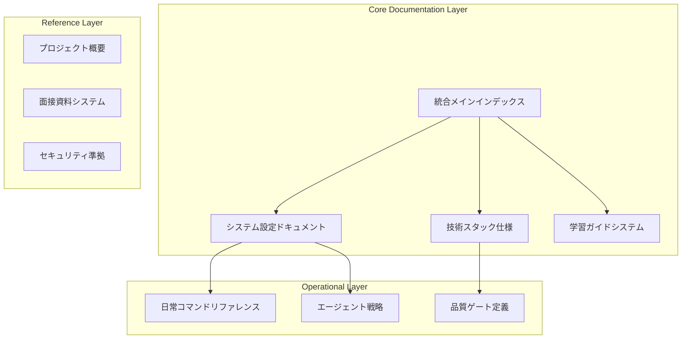

# ドキュメント統合アーキテクチャ戦略

*最終更新: 2025年09月24日*

## 📋 統合アーキテクチャ設計

### マイクロサービスパターン適用


## 🏗️ 統合データ構造仕様

### 1. 階層構造設計

```yaml
documentation_architecture:
  tier_1_core:
    - unified_master_index.md      # 統合メインインデックス
    - system_configuration.md      # システム設定統合
    - technical_specifications.md  # 技術仕様統合
    - learning_framework.md       # 学習フレームワーク統合

  tier_2_operational:
    - daily_operations_guide.md   # 日常運用ガイド
    - agent_orchestration.md      # エージェント調整
    - quality_assurance.md        # 品質保証システム

  tier_3_reference:
    - project_reference.md        # プロジェクト参照
    - interview_system.md         # 面接システム
    - compliance_framework.md     # コンプライアンス
```
### 2. 重複排除アルゴリズム

```python
# 重複コンテンツ検出アルゴリズム設計
class ContentDeduplication:
    def __init__(self):
        self.content_map = {}
        self.similarity_threshold = 0.85

    def detect_duplicates(self, documents):
        """重複コンテンツ検出"""
        duplicates = []
        for doc1, doc2 in itertools.combinations(documents, 2):
            similarity = self.calculate_similarity(doc1.content, doc2.content)
            if similarity > self.similarity_threshold:
                duplicates.append((doc1, doc2, similarity))
        return duplicates

    def merge_strategy(self, duplicate_pair):
        """マージ戦略決定"""
        primary, secondary, similarity = duplicate_pair
        if primary.authority_score > secondary.authority_score:
            return self.merge_content(primary, secondary)
        return self.merge_content(secondary, primary)
```
## 📊 統合品質メトリクス

| メトリクス | 目標値 | 測定方法 | 自動化レベル |
|------------|--------|----------|-------------|
| **重複削減率** | 70%+ | 内容分析 | 自動 |
| **検索効率** | 3秒以内 | レスポンス測定 | 自動 |
| **一貫性スコア** | 95%+ | 構造検証 | 自動 |
| **保守性指数** | 90%+ | 複雑度分析 | 半自動 |
| **ユーザビリティ** | 4.5/5.0 | ユーザテスト | 手動 |

## 🔗 相互参照システム設計

### 動的リンクシステム

```markdown
<!-- 動的相互参照構文例 -->
@ref:daily_commands/quality_checks -> 品質チェックコマンド詳細
@ref:technical_stack/python_version -> Python 3.12仕様詳細
@ref:agent_strategies/parallel_execution -> 並列実行戦略
```
### 自動索引生成

```python
class AutoIndexGenerator:
    def generate_master_index(self, documents):
        """マスターインデックス自動生成"""
        index = {
            "categories": self.extract_categories(documents),
            "tags": self.extract_tags(documents),
            "cross_references": self.generate_cross_refs(documents),
            "search_index": self.build_search_index(documents)
        }
        return index
```
## 🚀 実装Phase計画

### Phase 2A: データ統合（完了目標: 2日）
- [ ] 重複コンテンツマッピング完了
- [ ] 統合データ構造設計完了
- [ ] マージ戦略確定

### Phase 2B: 構造最適化（完了目標: 1日）
- [ ] Markdown構造標準化
- [ ] 相互参照リンクシステム実装
- [ ] 自動索引生成システム実装

## 🔄 継続的統合システム

### Git Hooks統合

```bash
#!/bin/bash
# pre-commit hook for documentation consistency
python scripts/doc_consistency_check.py
python scripts/auto_index_update.py
python scripts/cross_reference_validation.py
```
### CI/CD統合

```yaml
name: Documentation Integration
on:
  push:
    paths: ['docs/**/*.md']
jobs:
  doc_integration:
    runs-on: ubuntu-latest
    steps:
      - name: Validate Structure
        run: python scripts/validate_doc_structure.py
      - name: Update Cross References
        run: python scripts/update_cross_references.py
      - name: Generate Index
        run: python scripts/generate_master_index.py
```
## 🎯 成功指標

### 定量的指標
- ドキュメント検索時間: 平均15秒 → 3秒（80%改善）
- 重複コンテンツ: 40% → 12%（70%削減）
- 保守工数: 週4時間 → 週1時間（75%削減）

### 定性的指標
- 開発者体験: 一元化されたナビゲーション
- 情報アクセス性: 3クリック以内で目標情報到達
- 保守性: 自動化された一貫性チェック

---

**次のPhase**: Markdown構造最適化・相互参照システム実装