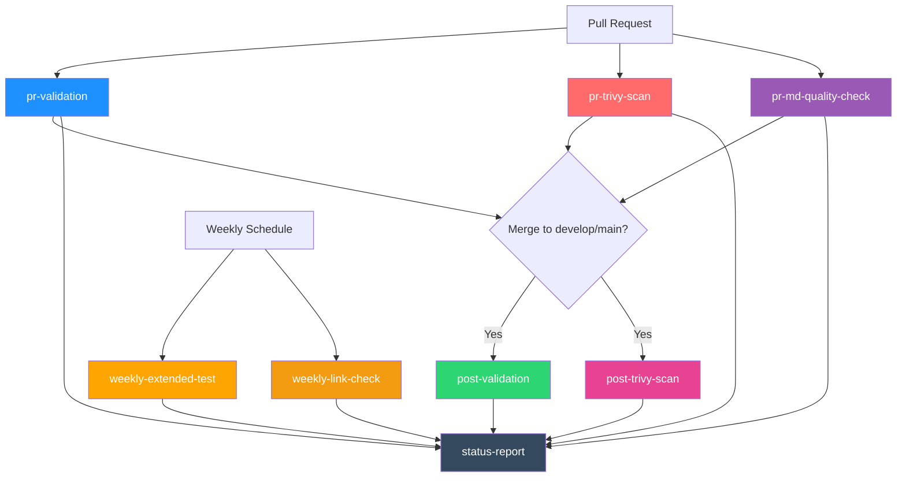

# CI/CD運用ガイド

*最終更新: 2026年02月13日*

## 🚀 CI/CDパイプライン概要

### CI/CD 多段階パイプライン構成



| Stage | トリガー | 実行内容 | Timeout | 並列実行 |
|-------|---------|---------|---------|---------|
| **pr-validation** | `pull_request` | mypy+ (Unit + Integration + smoke) Tests | 15分 | ○ |
| **pr-trivy-scan** | `pull_request` | Trivy scan（Filesystem + Image）+ Docker Build  | 20分 | ○ |
| **post-validation** | `push to develop/main` | mypy + Smoke Tests | 15分 | × |
| **post-trivy-scan** | `push to develop/main` | Trivy scan（Filesystem + Image）+ Docker Build | 20分 | × |
| **weekly-extended-test** | `schedule` (週次) | (Performance + External) Tests | 30分 | × |
| **weekly-link-check** | `schedule` (週次) | Markdown link check | 15分 | × |
| **status-report** | 全トリガー | パイプラインサマリー生成（`if: !cancelled()`） | 5分 | × |

---

## 🔒 Trivy Security Scan（SARIF形式）

### SARIF形式採用理由

- **GitHub Security Tab統合**: 脆弱性をUI上で一元管理
- **標準化**: OASIS標準フォーマットで将来的な拡張性確保
- **CI/CD最適化**: JSON形式で機械可読性向上

### 3層検証システム（Composite Action実装）

**再利用可能なComposite Action設計**:

全てのTrivyスキャン（pr-trivy-scan/post-trivy-scan）で共通のComposite Actionを使用することで、DRY原則を実践しメンテナンス性を向上させています（72行の重複コード→7行の呼び出しに削減）。

```yaml
# .github/workflows/ci.yml実装例
- name: Verify filesystem scan execution
  id: verify-fs-scan
  if: always()
  uses: ./.github/actions/trivy-sarif-verify
  with:
    sarif-file: 'trivy-fs-scan.sarif'
    scan-type: 'filesystem'
```

**Composite Action内部の3層検証**:

Composite action（`.github/actions/trivy-sarif-verify/action.yml`）内部では以下の3層検証を実施：

1. **Layer 1: ファイル存在チェック** - Trivyスキャン完全失敗を検出
2. **Layer 2: サイズチェック（≥100 bytes）** - 空ファイル/部分書き込みを検出
3. **Layer 3: JSON妥当性チェック** - 構文エラー/破損ファイルを検出

**検証レイヤー詳細**:

| Layer | 検証内容 | 検出可能なエラー | 実装 |
|-------|---------|----------------|------|
| 1 | ファイル存在 | Trivyスキャン完全失敗 | `[ -f *.sarif ]` |
| 2 | サイズ ≥100 bytes | 空ファイル、部分書き込み | `wc -c` + 閾値比較 |
| 3 | JSON妥当性 | 構文エラー、破損ファイル | `jq empty` |

### エラーハンドリング戦略

```yaml
# 概念説明用コード例（実装はaquasecurity/trivy-action@0.35.0 Actionを使用）
# Trivyスキャン本体
- name: Run Trivy filesystem scan (SARIF)
  id: fs-scan
  continue-on-error: true  # スキャン失敗時もパイプライン継続
  run: |
    trivy fs --format sarif --output trivy-fs-scan.sarif .

# 検証ステップ（Composite Action使用）
- name: Verify filesystem scan execution
  id: verify-fs-scan
  if: always()  # スキャン成否に関わらず実行
  uses: ./.github/actions/trivy-sarif-verify
  with:
    sarif-file: 'trivy-fs-scan.sarif'
    scan-type: 'filesystem'

# アップロード（検証成功時のみ）
- name: Upload filesystem scan results to Security tab
  if: always() && steps.verify-fs-scan.outcome == 'success'
  uses: github/codeql-action/upload-sarif@v4
  with:
    sarif_file: 'trivy-fs-scan.sarif'
```

**設計ポイント**:

1. **`continue-on-error: true`**: Trivyスキャン失敗（脆弱性検出含む）でもパイプライン停止させない
2. **`if: always()`**: 検証ステップを必ず実行（失敗検出のため）
3. **`steps.verify-fs-scan.outcome == 'success'`**: 検証成功時のみGitHub Security Tabにアップロード
4. **Composite Action活用**: 4箇所（pr-trivy-scan/post-trivy-scan各2）で同一ロジック共有

---

## 🎯 品質ゲート設定

### CI実行テスト条件

```bash
# CI/CD実行テストセット（575件: unit+integration, external除外）
# Note: performanceテスト(5件)は performance マーカーのみのため、この条件から自動除外
uv run pytest -n auto -m "(unit or integration) and not external" \
    --cov=utils --cov=config --cov=models --cov-report=term-missing
```

| 品質基準 | 目標値 | 現在値 | 検証コマンド |
|---------|-------|-------|------------|
| カバレッジ | 85% | 93.43% | `pytest --cov-fail-under=85` |
| ruff | 0 errors | ✅ | `ruff check .` |
| mypy | 0 errors | ✅ | `mypy utils/ config/ models/` |
| セキュリティ | 0 Critical/High | ✅ | Trivy SARIF |

---

## 📋 ブランチ戦略（Git Flow）

| ブランチ | 用途 | CI実行 | マージ先 |
|---------|------|--------|---------|
| `feature/*` | 新機能開発 | pr-validation + pr-trivy-scan + pr-md-quality-check | `develop` |
| `develop` | 統合ブランチ | pr-validation + pr-trivy-scan + pr-md-quality-check | `main` |
| `main` | 本番環境 | post-validation (mypy + Smoke) + post-trivy-scan (Docker + Trivy) | - |
| `hotfix/*` | 緊急修正 | pr-validation + pr-trivy-scan + pr-md-quality-check | `main` + `develop` |

**マージ戦略**:

- `feature/* → develop`: Squash Merge
- `develop → main`: Regular Merge（履歴保持）
- `hotfix/* → main`: Regular Merge

---

## 🔧 Troubleshooting

### Trivy SARIF検証失敗時

**症状**: `verify-fs-scan`または`verify-image-scan`ステップが失敗

**原因と対策**:

| エラーメッセージ | 原因 | 対策 |
|---------------|------|------|
| `SARIF file not found` | Trivyスキャン完全失敗 | Trivy実行ログ確認、依存関係チェック |
| `SARIF file too small` | 空ファイル/部分書き込み | ディスク空き容量確認、Trivy timeout設定 |
| `not valid JSON` | JSON構文エラー | Trivyバージョン確認、手動実行で再現 |

**デバッグコマンド**:

```bash
# ローカル再現
trivy fs --format sarif --output trivy-fs-scan.sarif .

# SARIF検証
jq . trivy-fs-scan.sarif | head -20

# ファイルサイズ確認
ls -lh trivy-fs-scan.sarif
```

### Composite Action使用時の注意事項

本プロジェクトでは、SARIF検証ロジックをComposite Action（`.github/actions/trivy-sarif-verify/action.yml`）として実装しています。

**Composite Action内部の特徴**:

1. **厳格なエラー処理**: `set -euo pipefail`による即座の失敗検出
   - コマンド失敗時は即座にスクリプト終了
   - 未定義変数参照時にエラー
   - パイプライン内の失敗を検出

2. **環境変数経由のパラメータ渡し**:
   - `SARIF_FILE`: SARIFファイルパス
   - `SCAN_TYPE`: スキャンタイプ（filesystem/image）
   - Script Injection防止のためのセキュリティ設計

3. **3層検証の詳細実装**:
   - Layer 1: `[ ! -f "$SARIF_FILE" ]` - ファイル存在確認
   - Layer 2: `wc -c < "$SARIF_FILE"` - サイズ確認（≥100 bytes）
   - Layer 3: `jq empty "$SARIF_FILE"` - JSON妥当性確認

**ローカルデバッグとの差異**:
- ローカルでは`set -euo pipefail`なしで実行可能
- Composite actionではより厳格なエラー検出が行われる
- デバッグ時は上記のデバッグコマンドで基本動作を確認後、CI/CDログで詳細を確認

### Image Scan Skip問題

**症状**: `verify-image-scan`が誤って実行される（docker-build失敗時）

**修正前**（Bug CRITICAL-2）:

```yaml
- name: Verify image scan execution
  if: always() && github.base_ref == 'main'  # docker-build失敗を無視❌
```

**修正後**:

```yaml
- name: Verify image scan execution
  if: always() && steps.image-scan.outcome != 'skipped'  # skip状態を正しく検出✅
```

### Status Report依存関係不足

**症状**: `status-report`ジョブが`pr-trivy-scan`/`pr-md-quality-check`結果を含まない

**修正前**（Bug CRITICAL-3）:

```yaml
status-report:
  needs: [pr-validation, ...]  # pr-trivy-scan/pr-md-quality-check未指定❌
```

**修正後**:

```yaml
status-report:
  needs: [pr-validation, pr-trivy-scan, pr-md-quality-check, ...]  # 追加✅
  run: |
    echo "- PR Trivy Scan: ${{ needs.pr-trivy-scan.result || 'skipped' }}"
    echo "- PR MD Quality Check: ${{ needs.pr-md-quality-check.result || 'skipped' }}"
```

---

## 📊 監視・アラート

### GitHub Actions Insights

**確認項目**:

- Workflow実行時間トレンド（目標: PR 10分以内）
- 失敗率（目標: <5%）
- Trivyスキャン検出脆弱性件数

**アクセス**: Repository → Insights → Actions

---

## 🔗 関連ドキュメント

- [CLAUDE.md](../../.claude/CLAUDE.md): 開発ワークフロー全体
- [test-strategy.md](../../.claude/rules/testing/test-strategy.md): テスト戦略詳細
- [quality-gates.md](../../.claude/rules/testing/quality-gates.md): 品質ゲート定義
