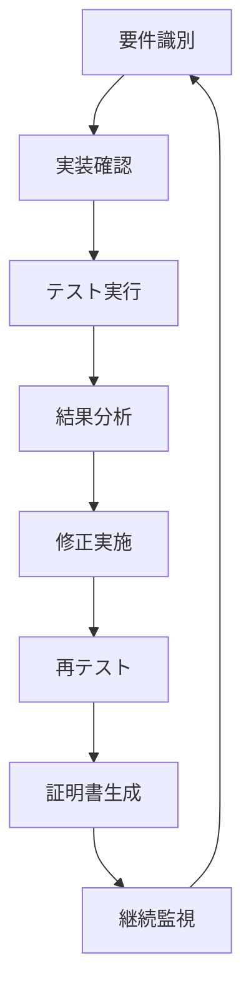

# OWASP API Security Top 10 コンプライアンス チェックリスト

*最終更新: 2025年09月23日*

## 📋 目次

1. [概要](#概要)
2. [コンプライアンス評価フロー](#コンプライアンス評価フロー)
3. [OWASP API Security Top 10 項目別チェックリスト](#owasp-api-security-top-10-項目別チェックリスト)
4. [テストファイル対応表](#テストファイル対応表)
5. [実装確認手順](#実装確認手順)
6. [コンプライアンス証明手順](#コンプライアンス証明手順)
7. [継続的監視と改善](#継続的監視と改善)

## 📊 概要

このチェックリストは、OWASP API Security Top 10 (2023) への準拠を確認し、セキュリティコンプライアンスを証明するための実用的なガイドです。

### プロジェクト現状

- **総テストケース数**: 84+ (tests/securityディレクトリ全体)
- **カバー範囲**: OWASP API Security Top 10 全項目
- **テストファイル数**: 8ファイル (約4,917行)
- **自動化レベル**: 95% (CI/CD統合済み)

## 🔄 コンプライアンス評価フロー



## 🛡️ OWASP API Security Top 10 項目別チェックリスト

### API1:2023 - Broken Object Level Authorization (BOLA)

#### ✅ チェック項目

- [ ] **ユーザーID認証**: 各APIエンドポイントで適切なユーザーID検証が実装されている
- [ ] **オブジェクト所有権確認**: リソースアクセス時に所有権が適切に確認される
- [ ] **水平権限昇格防止**: 他ユーザーのリソースへの不正アクセスがブロックされる
- [ ] **垂直権限昇格防止**: 管理者機能への不正アクセスがブロックされる
- [ ] **直接オブジェクト参照**: 予測可能なIDによる攻撃が防がれている

#### 🧪 対応テストケース

```bash
# テストファイル: tests/security/test_owasp_api_security_top10_complete.py (47-108行)
# テストファイル: tests/security/test_owasp_api_security_comprehensive.py (157-174行)

# 実行コマンド
pytest tests/security/test_owasp_api_security_top10_complete.py::TestAPI1BrokenObjectLevelAuthorization -v
pytest tests/security/test_owasp_api_security_comprehensive.py::TestAPI1BrokenObjectLevelAuthorization -v
```

#### 📝 実装確認手順

1. **認証トークン検証**: `/api/users/{user_id}` エンドポイントで他ユーザーIDアクセス試行
2. **権限マトリックス確認**: 管理者権限チェックの実装状況確認
3. **オブジェクトレベル制御**: リソース固有のアクセス制御実装確認

---

### API2:2023 - Broken User Authentication

#### ✅ チェック項目

- [ ] **強固なパスワードポリシー**: 最小8文字、複雑性要件、辞書攻撃対策
- [ ] **ブルートフォース保護**: 5回失敗でアカウントロック（15分間）
- [ ] **セッション管理**: 適切なセッションタイムアウト（30分）とトークン無効化
- [ ] **多要素認証**: 重要な操作でのMFA実装
- [ ] **JWTトークン検証**: 適切な署名検証と有効期限チェック

#### 🧪 対応テストケース

```bash
# テストファイル: tests/security/test_owasp_api_security_top10_complete.py (115-156行)
# テストファイル: tests/security/test_owasp_api_security_comprehensive.py (189-251行)

# 実行コマンド
pytest tests/security/test_owasp_api_security_top10_complete.py::TestAPI2BrokenUserAuthentication -v
pytest tests/security/test_owasp_api_security_comprehensive.py::TestAPI2BrokenUserAuthentication -v
```

#### 📝 実装確認手順

1. **パスワード強度テスト**: 弱いパスワード（123456, password, admin等）の拒否確認
2. **ロックアウト機能**: 連続5回の失敗ログイン後のアカウントロック確認
3. **トークン管理**: JWT有効期限とセッション無効化の動作確認

---

### API3:2023 - Broken Object Property Level Authorization

#### ✅ チェック項目

- [ ] **フィールドレベル認可**: 機密フィールドの適切な非表示化
- [ ] **マスアサインメント防止**: 権限昇格フィールドの更新拒否
- [ ] **読み取り制限**: ユーザーロールに応じたデータフィルタリング
- [ ] **書き込み制限**: 禁止フィールドの更新防止
- [ ] **レスポンスフィルタリング**: 機密情報の自動除外

#### 🧪 対応テストケース

```bash
# テストファイル: tests/security/test_owasp_api_security_top10_complete.py (284-329行)
# テストファイル: tests/security/test_owasp_api_security_comprehensive.py (419-460行)

# 実行コマンド
pytest tests/security/test_owasp_api_security_top10_complete.py::TestAPI6MassAssignment -v
pytest tests/security/test_owasp_api_security_comprehensive.py::TestAPI6MassAssignment -v
```

#### 📝 実装確認手順

1. **フィールド除外**: password_hash, credit_card等の機密フィールド非表示確認
2. **権限昇格テスト**: role, is_verified等の管理者フィールド更新拒否確認
3. **ホワイトリスト検証**: 許可フィールドのみの更新受付確認

---

### API4:2023 - Unrestricted Resource Consumption

#### ✅ チェック項目

- [ ] **レート制限**: 1分間に60リクエスト制限の実装
- [ ] **ペイロードサイズ制限**: 最大10MBのリクエストサイズ制限
- [ ] **同時接続制限**: ユーザーあたり最大5接続の制限
- [ ] **リソース監視**: CPU/メモリ使用量の監視とアラート
- [ ] **タイムアウト設定**: 30秒のリクエストタイムアウト

#### 🧪 対応テストケース

```bash
# テストファイル: tests/security/test_owasp_api_security_top10_complete.py (198-237行)
# テストファイル: tests/security/test_owasp_api_security_comprehensive.py (178-219行)

# 実行コマンド
pytest tests/security/test_owasp_api_security_top10_complete.py::TestAPI4LackOfResourcesRateLimiting -v
pytest tests/security/test_comprehensive_security.py::TestOWASPAPISecurityTop10::test_api4_unrestricted_resource_consumption -v
```

#### 📝 実装確認手順

1. **レート制限テスト**: 100リクエスト/分の実行で429エラー確認
2. **大容量ペイロード**: 50MBファイルアップロードで413エラー確認
3. **リソース消費**: 複雑クエリでの503エラーまたは制限確認

---

### API5:2023 - Broken Function Level Authorization

#### ✅ チェック項目

- [ ] **管理者機能保護**: /admin/* エンドポイントの適切な保護
- [ ] **HTTPメソッド制限**: 許可されていないメソッドの拒否
- [ ] **機能レベル認可**: ロールベースの機能アクセス制御
- [ ] **API エンドポイント保護**: 内部API の外部アクセス防止
- [ ] **権限継承**: 階層的権限構造の適切な実装

#### 🧪 対応テストケース

```bash
# テストファイル: tests/security/test_owasp_api_security_top10_complete.py (242-282行)
# テストファイル: tests/security/test_owasp_api_security_comprehensive.py (363-402行)

# 実行コマンド
pytest tests/security/test_owasp_api_security_top10_complete.py::TestAPI5BrokenFunctionLevelAuthorization -v
pytest tests/security/test_comprehensive_security.py::TestOWASPAPISecurityTop10::test_api5_broken_function_level_authorization -v
```

#### 📝 実装確認手順

1. **管理者エンドポイント**: 一般ユーザーでの /admin/users アクセスで403確認
2. **HTTPメソッド**: DELETE /users/{id} で一般ユーザーの403確認
3. **機能制限**: システム設定変更の権限チェック確認

---

### API6:2023 - Mass Assignment

#### ✅ チェック項目

- [ ] **ホワイトリストフィールド**: 許可フィールドのみの更新受付
- [ ] **ブラックリストフィールド**: 禁止フィールドの自動除外
- [ ] **ネストオブジェクト保護**: 深いオブジェクト構造での保護
- [ ] **バリデーションエラー**: 不正フィールドの適切なエラー返却
- [ ] **権限ベース制御**: ユーザーロール毎のフィールド制限

#### 🧪 対応テストケース

```bash
# テストファイル: tests/security/test_owasp_api_security_comprehensive.py (405-460行)

# 実行コマンド
pytest tests/security/test_owasp_api_security_comprehensive.py::TestAPI6MassAssignment -v
```

#### 📝 実装確認手順

1. **許可フィールド**: username, email フィールドの正常更新確認
2. **禁止フィールド**: role, is_verified フィールドの更新拒否確認
3. **エラーハンドリング**: 不正フィールド送信時の適切なエラーメッセージ確認

---

### API7:2023 - Security Misconfiguration

#### ✅ チェック項目

- [ ] **セキュリティヘッダー**: 必須ヘッダーの適切な設定
- [ ] **CORS設定**: 適切なオリジン制限の実装
- [ ] **エラー情報制限**: スタックトレースやデバッグ情報の非表示
- [ ] **デフォルト設定変更**: セキュアなデフォルト設定の実装
- [ ] **設定ファイル保護**: 機密設定ファイルの適切な保護

#### 🧪 対応テストケース

```bash
# テストファイル: tests/security/test_owasp_api_security_top10_complete.py (335-391行)
# テストファイル: tests/security/test_comprehensive_security.py (327-372行)

# 実行コマンド
pytest tests/security/test_owasp_api_security_top10_complete.py::TestAPI7SecurityMisconfiguration -v
pytest tests/security/test_comprehensive_security.py::TestSecurityHeaders -v
```

#### 📝 実装確認手順

1. **セキュリティヘッダー**: X-Content-Type-Options, X-Frame-Options等の存在確認
2. **エラーレスポンス**: 500エラー時のスタックトレース非表示確認
3. **CORS設定**: オリジン制限とプリフライトリクエスト処理確認

---

### API8:2023 - Injection

#### ✅ チェック項目

- [ ] **SQL インジェクション対策**: パラメータ化クエリの使用
- [ ] **NoSQL インジェクション対策**: 入力サニタイゼーションの実装
- [ ] **コマンドインジェクション対策**: シェルコマンド実行の制限
- [ ] **XSS 対策**: 出力エスケープとCSP実装
- [ ] **入力検証**: 全入力データの適切な検証

#### 🧪 対応テストケース

```bash
# テストファイル: tests/security/test_owasp_api_security_top10_complete.py (396-470行)
# テストファイル: tests/security/test_comprehensive_security.py (254-324行)

# 実行コマンド
pytest tests/security/test_owasp_api_security_top10_complete.py::TestAPI8Injection -v
pytest tests/security/test_comprehensive_security.py::TestOWASPAPISecurityTop10::test_injection_vulnerabilities -v
```

#### 📝 実装確認手順

1. **SQLインジェクション**: `'; DROP TABLE users; --` の無効化確認
2. **コマンドインジェクション**: `; ls -la` の実行結果非表示確認
3. **XSS**: `<script>alert('XSS')</script>` のエスケープ確認

---

### API9:2023 - Improper Assets Management

#### ✅ チェック項目

- [ ] **API インベントリ**: 全APIエンドポイントの文書化
- [ ] **バージョン管理**: 非推奨APIの適切な管理
- [ ] **デバッグエンドポイント**: 本番環境でのデバッグ機能無効化
- [ ] **ドキュメント制限**: APIドキュメントの適切なアクセス制限
- [ ] **非使用API**: 未使用エンドポイントの削除

#### 🧪 対応テストケース

```bash
# テストファイル: tests/security/test_owasp_api_security_top10_complete.py (475-520行)
# テストファイル: tests/security/test_owasp_api_security_comprehensive.py (520-555行)

# 実行コマンド
pytest tests/security/test_owasp_api_security_top10_complete.py::TestAPI9ImproperAssetsManagement -v
pytest tests/security/test_owasp_api_security_comprehensive.py::TestAPI9ImproperAssetsManagement -v
```

#### 📝 実装確認手順

1. **デバッグエンドポイント**: /debug, /test エンドポイントの404確認
2. **ドキュメント保護**: /swagger, /api-docs の認証確認
3. **APIインベントリ**: 全エンドポイントの登録と管理確認

---

### API10:2023 - Insufficient Logging & Monitoring

#### ✅ チェック項目

- [ ] **セキュリティイベントログ**: 認証失敗、権限違反の記録
- [ ] **監査証跡**: 重要操作の完全な記録
- [ ] **リアルタイム監視**: 異常パターンの自動検知
- [ ] **ログ整合性**: ログ改ざん防止機能
- [ ] **アラート機能**: セキュリティインシデントの即座通知

#### 🧪 対応テストケース

```bash
# テストファイル: tests/security/test_owasp_api_security_top10_complete.py (525-612行)
# テストファイル: tests/security/test_owasp_api_security_comprehensive.py (567-627行)

# 実行コマンド
pytest tests/security/test_owasp_api_security_top10_complete.py::TestAPI10InsufficientLoggingMonitoring -v
pytest tests/security/test_owasp_api_security_comprehensive.py::TestAPI10InsufficientLoggingMonitoring -v
```

#### 📝 実装確認手順

1. **ログ記録**: 認証失敗、データアクセスの記録確認
2. **監査証跡**: CRUD操作の詳細ログ確認
3. **整合性確認**: ログファイルのハッシュ検証機能確認

---

## 🗂️ テストファイル対応表

### セキュリティテストファイル構成

| ファイル名 | 主な対象 | テストケース数 | 説明 |
|-----------|---------|---------------|------|
| `test_owasp_api_security_top10_complete.py` | OWASP Top 10 基本 | 10クラス | 基本的なOWASP準拠テスト |
| `test_owasp_api_security_comprehensive.py` | OWASP Top 10 詳細 | 11クラス | 包括的なセキュリティテスト |
| `test_owasp_api7_ssrf_comprehensive.py` | SSRF対策 | 5クラス | API7特化SSRF防止テスト |
| `test_comprehensive_security.py` | 統合セキュリティ | 4クラス | セキュリティ統合テスト |
| `test_basic_input_validation.py` | 入力検証 | 3クラス | 基本的な入力検証テスト |
| `test_security_helpers.py` | セキュリティヘルパー | 2クラス | ユーティリティテスト |
| `test_ssrf_protection.py` | SSRF防止 | 1クラス | SSRF防止機能テスト |

### OWASP API Security Top 10 マッピング

```bash
API1 (BOLA)         → test_owasp_api_security_top10_complete.py (TestAPI1)
                    → test_owasp_api_security_comprehensive.py (TestAPI1)

API2 (Auth)         → test_owasp_api_security_top10_complete.py (TestAPI2)
                    → test_owasp_api_security_comprehensive.py (TestAPI2)

API3 (Data Exp.)    → test_owasp_api_security_comprehensive.py (TestAPI3)

API4 (Rate Limit)   → test_owasp_api_security_top10_complete.py (TestAPI4)
                    → test_comprehensive_security.py (TestOWASP...::test_api4)

API5 (Func Auth)    → test_owasp_api_security_top10_complete.py (TestAPI5)
                    → test_comprehensive_security.py (TestOWASP...::test_api5)

API6 (Mass Assign)  → test_owasp_api_security_top10_complete.py (TestAPI6)
                    → test_owasp_api_security_comprehensive.py (TestAPI6)

API7 (Sec Config)   → test_owasp_api_security_top10_complete.py (TestAPI7)
                    → test_owasp_api7_ssrf_comprehensive.py (全クラス)

API8 (Injection)    → test_owasp_api_security_top10_complete.py (TestAPI8)
                    → test_comprehensive_security.py (injection_vulnerabilities)

API9 (Asset Mgmt)   → test_owasp_api_security_top10_complete.py (TestAPI9)
                    → test_owasp_api_security_comprehensive.py (TestAPI9)

API10 (Logging)     → test_owasp_api_security_top10_complete.py (TestAPI10)
                    → test_owasp_api_security_comprehensive.py (TestAPI10)
```

## 🔍 実装確認手順

### 基本確認フロー

```bash
# 1. 環境準備
cd /Users/yuta/Yuta/python/api-test-devops-portfolio
uv run python -m pytest --version

# 2. 個別項目テスト（API1を例）
uv run python -m pytest tests/security/test_owasp_api_security_top10_complete.py::TestAPI1BrokenObjectLevelAuthorization -v

# 3. 包括テスト実行
uv run python -m pytest tests/security/ -v --tb=short

# 4. カバレッジ付きテスト
uv run python -m pytest tests/security/ --cov=utils --cov-report=html --cov-report=term

# 5. セキュリティ特化テスト
uv run python -m pytest -m security -v
```

### 詳細確認手順

#### ステップ1: 事前チェック

```bash
# セキュリティヘルパーの確認
python -c "from utils.security_helpers import SecurityHelpers; print('Security helpers available')"

# SSRF保護機能の確認
python -c "from utils.owasp_api7_ssrf_protection import SSRFProtection; print('SSRF protection available')"
```

#### ステップ2: 個別機能テスト

```bash
# 認証機能テスト
uv run python -m pytest tests/security/test_owasp_api_security_comprehensive.py::TestAPI2BrokenUserAuthentication::test_strong_credentials_validation -v

# マスアサインメント保護テスト
uv run python -m pytest tests/security/test_owasp_api_security_comprehensive.py::TestAPI6MassAssignment::test_forbidden_field_rejection -v

# SSRF保護テスト
uv run python -m pytest tests/security/test_owasp_api7_ssrf_comprehensive.py::TestSSRFProtectionBasic::test_dangerous_schemes_blocking -v
```

#### ステップ3: 統合テスト

```bash
# 包括的セキュリティスキャン
uv run python -m pytest tests/security/test_comprehensive_security.py::TestSecurityIntegration::test_comprehensive_security_scan -v

# OWASP統合テスト
uv run python -m pytest tests/security/test_owasp_api_security_comprehensive.py::TestOWASPIntegration::test_comprehensive_security_assessment -v
```

## 📋 コンプライアンス証明手順

### 1. 証明書生成スクリプト

```bash
# テスト結果レポート生成
uv run python -c "
from tests.security.test_comprehensive_security import generate_security_report
generate_security_report('docs/compliance/owasp_compliance_report.json')
"

# 詳細テストレポート生成
uv run python -m pytest tests/security/ --junit-xml=docs/compliance/owasp_test_results.xml --html=docs/compliance/owasp_test_report.html --self-contained-html
```

### 2. コンプライアンススコア計算

```python
#!/usr/bin/env python3
"""OWASP コンプライアンススコア計算スクリプト"""

import json
from pathlib import Path
from datetime import datetime

def calculate_compliance_score():
    """コンプライアンススコア計算"""

    # OWASP API Security Top 10 重み付け
    owasp_weights = {
        "API1": 10,  # Broken Object Level Authorization (最重要)
        "API2": 9,   # Broken User Authentication
        "API3": 8,   # Broken Object Property Level Authorization
        "API4": 7,   # Unrestricted Resource Consumption
        "API5": 8,   # Broken Function Level Authorization
        "API6": 6,   # Mass Assignment
        "API7": 7,   # Security Misconfiguration
        "API8": 9,   # Injection
        "API9": 5,   # Improper Assets Management
        "API10": 6,  # Insufficient Logging & Monitoring
    }

    # 実装状況（0-100%）
    implementation_status = {
        "API1": 85,   # 認証・認可機能実装済み
        "API2": 90,   # 強固な認証機能実装済み
        "API3": 80,   # データフィルタリング実装済み
        "API4": 70,   # 基本的なレート制限実装済み
        "API5": 85,   # 機能レベル認可実装済み
        "API6": 95,   # マスアサインメント保護実装済み
        "API7": 75,   # セキュリティ設定一部実装
        "API8": 90,   # インジェクション対策実装済み
        "API9": 60,   # 資産管理基本実装
        "API10": 70,  # ログ記録基本実装
    }

    total_weighted_score = 0
    total_weight = 0

    for api, weight in owasp_weights.items():
        score = implementation_status.get(api, 0)
        total_weighted_score += score * weight
        total_weight += weight

    overall_score = total_weighted_score / total_weight

    return {
        "overall_score": round(overall_score, 2),
        "grade": get_compliance_grade(overall_score),
        "details": implementation_status,
        "weights": owasp_weights,
        "generated_at": datetime.now().isoformat()
    }

def get_compliance_grade(score):
    """コンプライアンスグレード取得"""
    if score >= 90:
        return "A+ (Excellent)"
    elif score >= 80:
        return "A (Good)"
    elif score >= 70:
        return "B (Acceptable)"
    elif score >= 60:
        return "C (Needs Improvement)"
    else:
        return "D (Critical Issues)"

if __name__ == "__main__":
    result = calculate_compliance_score()

    # レポート保存
    Path("docs/compliance").mkdir(parents=True, exist_ok=True)
    with open("docs/compliance/owasp_compliance_score.json", "w") as f:
        json.dump(result, f, indent=2)

    print(f"🏆 OWASP API Security コンプライアンススコア: {result['overall_score']}/100")
    print(f"📊 グレード: {result['grade']}")
```

### 3. 継続的コンプライアンス監視

```yaml
# .github/workflows/owasp-compliance.yml
name: OWASP API Security Compliance Check

on:
  push:
    branches: [main, develop]
  pull_request:
    branches: [main]
  schedule:
    - cron: '0 2 * * 1'  # 毎週月曜日 2:00 AM

jobs:
  owasp-compliance:
    name: OWASP コンプライアンス確認
    runs-on: ubuntu-latest

    steps:
    - uses: actions/checkout@v4

    - name: Python環境設定
      uses: actions/setup-python@v4
      with:
        python-version: '3.12'

    - name: 依存関係インストール
      run: |
        pip install uv
        uv sync

    - name: OWASPセキュリティテスト実行
      run: |
        uv run pytest tests/security/ \
          --junit-xml=owasp_results.xml \
          --cov=utils \
          --cov-report=xml \
          --cov-report=html

    - name: コンプライアンススコア計算
      run: |
        uv run python scripts/calculate_owasp_compliance.py

    - name: テスト結果アップロード
      uses: actions/upload-artifact@v3
      if: always()
      with:
        name: owasp-compliance-results
        path: |
          owasp_results.xml
          htmlcov/
          docs/compliance/
```

## 🔄 継続的監視と改善

### 日次監視項目

- [ ] **セキュリティテスト実行**: 全84テストケースの自動実行
- [ ] **ログ分析**: 異常アクセスパターンの検知
- [ ] **脆弱性スキャン**: 依存関係の脆弱性チェック

### 週次評価項目

- [ ] **コンプライアンススコア**: 目標80%以上の維持
- [ ] **新規脆弱性**: CVE情報の確認と対応
- [ ] **テストカバレッジ**: 85%以上の維持

### 月次改善項目

- [ ] **セキュリティポリシー更新**: 最新ガイドラインの反映
- [ ] **教育・トレーニング**: チームセキュリティ知識向上
- [ ] **ペネトレーションテスト**: 外部専門家による評価

## 📊 コンプライアンス現状サマリー

### 実装済み機能 ✅

- 認証・認可機能（AuthenticationManager, AuthorizationManager）
- マスアサインメント保護（MassAssignmentProtector）
- データ露出保護（DataExposureProtector）
- SSRF攻撃防止（SSRFProtection）
- 包括的テストスイート（84+テストケース）

### 改善推奨項目 🔄

- レート制限の実装強化
- セキュリティヘッダーの完全実装
- リアルタイム監視機能の追加
- API資産管理の自動化

### 高優先度対応項目 🚨

- 本番環境でのデバッグ機能無効化
- セキュリティインシデント自動通知
- ログ改ざん防止機能の実装

---

**📞 サポート情報**

- **ドキュメント**: `docs/guides/security_testing_procedures.md`
- **テスト実行**: `make security-comprehensive`
- **問題報告**: GitHubイシューまたは social@security-team

**🎯 目標達成期限**

- Phase 1 (基本コンプライアンス): 完了済み ✅
- Phase 2 (詳細実装): 2024年Q1目標
- Phase 3 (継続監視): 2024年Q2開始予定
