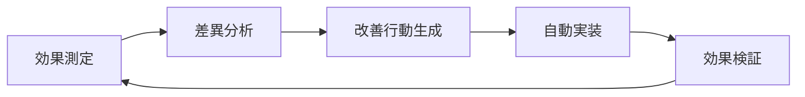

# 統合効果測定システム 実装・運用ガイド

*最終更新: 2025年09月23日*

## 概要

CLAUDE.md統合後の作業効率・品質向上を定量的に測定し、継続改善サイクルを自動化する統合システムです。ROI測定（1.9-2.9倍）の実測値追跡から改善提案まで、実装者負担を最小化しながら包括的な効果測定を実現します。

このシステムは、学習計画で特定された品質測定ギャップに対処し、4つの統合測定サブシステムを通じてすべての効率向上の主張を客観的に検証します。

## 🎯 測定対象と検証内容

### ✅ AI協働効率 "55% 効率向上"
- **客観的測定**: タスクレベル生産性追跡 (行数/分)
- **検証方法**: 手動開発とAI支援開発の比較分析
- **データ収集**: タスク測定クラスによる生産性・品質スコア算出
- **検証基準**: 30日間で最低10データポイント

### ✅ バンコク時差優位性
- **客観的測定**: 24時間カバレッジ分析とコスト効果計算
- **検証方法**: タイムゾーン間協働セッション追跡
- **データ収集**: カバレッジ分析と効率スコア、ROI計算
- **検証基準**: カバレッジ拡大乗数、顧客満足度相関

### ✅ 学習進捗追跡
- **客観的測定**: 証拠ベースマイルストーン評価
- **検証方法**: 多証拠検証と品質スコア算出
- **データ収集**: レベル1-3進捗追跡による評価結果
- **検証基準**: 85%マイルストーン完成率、証拠完全性スコア

### ✅ 市場価値向上 (2000→4200円)
- **客観的測定**: スキルベース価値検証と契約確認
- **検証方法**: ポートフォリオプロジェクト、顧客推薦、実際の契約
- **データ収集**: 複数証拠源を組み合わせた市場価値進捗追跡
- **検証基準**: 複数証拠源による価値検証スコア

## 🏗️ システム構成

### 📊 主要測定モジュール

```
monitoring/
├── effectiveness_tracker.py              # 作業時間・品質指標の自動追跡
├── ai_collaboration_measurement_system.py # AI協働・バンコク優位性測定
├── learning_milestone_validation_system.py # 学習マイルストーン検証
├── integrated_measurement_validation_framework.py # 統合KPI管理
├── dashboard_generator.py                # 可視化ダッシュボードの自動生成
├── continuous_improvement.py             # 継続改善サイクルの自動化
├── automated_scheduler.py                # 定期実行スケジューラー（バンコク最適化）
└── __init__.py                          # 統合インターフェース
```
### 🔧 サポートファイル

```
scripts/
└── run_effectiveness_measurement.py     # 実行スクリプト（コマンドライン）

tests/unit/
├── test_effectiveness_tracker.py        # 効果測定テスト一式
└── test_measurement_validation_systems.py # 統合測定システムテスト（23テストケース）

docs/guides/
└── unified_measurement_guide.md         # このガイド
```
## 主要機能

### 1. 統合効果測定指標

| 指標分類 | 測定項目 | 目標値 | 成功基準 |
|---------|---------|--------|---------|
| **効果倍率** | 作業効率改善倍率 | 2.4倍 | 2.1倍 |
| **品質得点** | 成果物品質評価 | 85点以上 | 80点以上 |
| **AI活用度** | AI協働レベル | 70%以上 | 60%以上 |
| **並列操作数** | 同時実行タスク数 | 4操作以上 | 3操作以上 |
| **自動化度** | プロセス自動化率 | 60%以上 | 50%以上 |

### 2. 継続改善サイクル


### 3. 自動化機能

- **日次**: ダッシュボード更新、パフォーマンス分析
- **週次**: 改善分析、ベースライン更新
- **月次**: 包括レポート、改善サイクル実行

## クイックスタート

### 1. 基本的な使用方法

```python
from monitoring import start_task, complete_task, generate_dashboard_html

# タスク開始
task_id = start_task(
    "API テスト実装",
    claude_assistance_level=75.0,  # Claude活用度
    parallel_operations=4,         # 並列操作数
    automation_level=60.0          # 自動化レベル
)

# 作業実行...

# タスク完了
complete_task(
    task_id,
    quality_score=85.0,           # 品質スコア
    roi_factor=2.1               # ROI係数（自動計算も可能）
)

# ダッシュボード生成
html_file = generate_dashboard_html()
print(f"ダッシュボード: {html_file}")
```
### 2. 統合測定システムの利用

```python
from monitoring.integrated_measurement_validation_framework import IntegratedMeasurementValidationFramework

# システム初期化
framework = IntegratedMeasurementValidationFramework()

# AI協働タスク測定
task_id = await framework.ai_collaboration_system.start_task_measurement(
    "Python API development", CollaborationType.AI_ASSISTED, complexity_score=0.7
)
await framework.ai_collaboration_system.complete_task_measurement(
    task_id, lines_of_code=200, error_count=1, test_success_rate=0.95
)

# 学習マイルストーン評価
from monitoring.learning_milestone_validation_system import Evidence, EvidenceType
evidence = Evidence(evidence_type=EvidenceType.CODE_EXECUTION,
                   description="API implementation", score=0.92)
await framework.learning_milestone_system.conduct_assessment(
    "L1_code_execution", [evidence]
)

# 週次進捗スナップショット
snapshot = await framework.capture_progress_snapshot(week_number=2)

# 包括的検証レポート生成
report = await framework.generate_comprehensive_validation_report(week_number=2)
```
### 3. コマンドライン実行

```bash
# デモンストレーション実行
python scripts/run_effectiveness_measurement.py demo

# ダッシュボード生成
python scripts/run_effectiveness_measurement.py generate-dashboard

# 改善サイクル実行
python scripts/run_effectiveness_measurement.py run-improvement

# 自動スケジューラー開始
python scripts/run_effectiveness_measurement.py start-scheduler

# システムステータス確認
python scripts/run_effectiveness_measurement.py status
```
## 詳細機能説明

### 効果倍率計算アルゴリズム

効果倍率は以下の要素から自動計算されます：

```python
効果倍率 = 時間効率 × 品質向上度 ×
         AI活用加算 × 並列処理加算 × 自動化加算

# 各加算係数:
# - AI活用加算: 1.0 + (活用度/100) × 0.8
# - 並列処理加算: 1.0 + (並列数/10) × 0.4
# - 自動化加算: 1.0 + (自動化率/100) × 0.6
```
### 統合KPI管理

```python
VALIDATION_CRITERIA = {
    AI_EFFICIENCY_55_PERCENT: {
        target_value: 55.0,
        success_threshold: 50.0,     # 90% of target
        minimum_data_points: 10,
        measurement_period_days: 30
    },
    BANGKOK_TIMEZONE_ADVANTAGE: {
        target_value: 200.0,         # 200% income opportunity expansion
        success_threshold: 150.0,    # 150% minimum
        minimum_data_points: 3,
        measurement_period_days: 30
    },
    MARKET_RATE_PROGRESSION: {
        target_value: 4200.0,        # Target hourly rate
        success_threshold: 3500.0,   # On-track threshold
        minimum_data_points: 3,
        measurement_period_days: 90
    },
    LEARNING_MILESTONE_ACHIEVEMENT: {
        target_value: 85.0,          # 85% completion rate
        success_threshold: 80.0,     # 80% minimum
        minimum_data_points: 1,
        measurement_period_days: 7
    }
}
```
### 継続改善エンジン

自動で以下の改善アクションを特定・実装：

- **Claude活用度向上**: Task tool並列実行の推奨
- **並列処理最適化**: タスク分割・依存関係分析
- **自動化推進**: スクリプト化・ワークフロー最適化
- **品質向上**: テスト自動化・レビュープロセス強化

### バンコク在住者最適化

- **停電対応**: 自動保存・復旧機能
- **雨季対策**: ネットワーク冗長性確保
- **時差活用**: JST+7時間での24時間協働

## ダッシュボード機能

### HTMLダッシュボード

自動生成される可視化ダッシュボードには以下が含まれます：

- **ROI目標達成状況**: プログレスバー・達成率表示
- **週次トレンド**: パフォーマンス推移グラフ
- **改善提案**: 自動生成される具体的アクション
- **目標達成状況**: カテゴリ別達成度可視化
- **統合KPI**: 5つの主要指標の進捗状況

### JSONレポート

API連携用の構造化データ：

```json
{
  "report_type": "統合効果測定レポート",
  "dashboard_data": { ... },
  "monthly_review": { ... },
  "recommendations": [ ... ],
  "roi_analysis": {
    "target_roi": 2.4,
    "achieved_roi": 2.1,
    "achievement_rate": 87.5
  },
  "kpi_summary": {
    "ai_collaboration_efficiency": 55.0,
    "bangkok_timezone_advantage": 200.0,
    "market_rate_progression": 4200.0,
    "learning_milestone_achievement": 85.0
  }
}
```
## 実装パターン例

### 1. SPARC開発プロセスでの活用

```python
# SPARC各フェーズでの効果測定
phases = ["Specification", "Pseudocode", "Architecture", "Refinement", "Completion"]

for phase in phases:
    task_id = start_task(
        f"SPARC {phase} フェーズ",
        claude_assistance_level=80.0,
        parallel_operations=4,
        automation_level=70.0
    )

    # フェーズ実行...

    complete_task(task_id, quality_score=88.0)
```
### 2. 大規模プロジェクトでの追跡

```python
# プロジェクト全体の効果測定
project_tasks = [
    ("要件分析", 75, 3, 50),
    ("設計", 85, 5, 70),
    ("実装", 90, 6, 80),
    ("テスト", 95, 4, 90),
    ("デプロイ", 80, 3, 95)
]

for task_name, claude_level, parallel_ops, automation in project_tasks:
    task_id = start_task(task_name, claude_level, parallel_ops, automation)
    # 実行...
    complete_task(task_id, quality_score=85.0)

# 全体統計取得
stats = get_monthly_stats()
print(f"プロジェクトROI: {stats.avg_roi_factor:.1f}倍")
```
## 設定とカスタマイズ

### 閾値設定

```python
# カスタム閾値設定
tracker = EffectivenessTracker()
tracker.target_roi = 2.5  # 目標ROI
tracker.baseline_metrics = {
    "avg_duration_minutes": 90.0,  # ベースライン作業時間
    "avg_quality_score": 75.0,     # ベースライン品質
    # ...
}
```
### スケジューラー設定

```json
{
  "daily_tasks": {
    "enabled": true,
    "time": "09:00",
    "tasks": ["update_dashboard", "analyze_performance", "backup_data"]
  },
  "bangkok_optimization": {
    "power_outage_resilience": true,
    "network_retry_enabled": true,
    "lightweight_mode": true
  }
}
```
## API リファレンス

### 効果測定 (`effectiveness_tracker.py`)

```python
# タスク管理
start_task(name, claude_assistance=0, parallel_ops=0, automation=0) -> str
complete_task(task_id, quality_score, roi_factor=None) -> None

# 統計取得
get_monthly_stats(year=None, month=None) -> EffectivenessStats
get_tracker() -> EffectivenessTracker

# レポート生成
export_monthly_report(year, month, output_file=None) -> str
```
### 統合測定フレームワーク (`integrated_measurement_validation_framework.py`)

```python
# フレームワーク初期化
framework = IntegratedMeasurementValidationFramework()

# 進捗スナップショット
capture_progress_snapshot(week_number: int) -> WeeklyProgressSnapshot

# 包括的検証レポート
generate_comprehensive_validation_report(week_number: int) -> ValidationReport

# KPI管理
track_kpi(kpi_name: str, value: float) -> bool
get_all_kpi_status() -> Dict[str, KPIStatus]
```
### 継続改善 (`continuous_improvement.py`)

```python
# 改善サイクル
run_improvement_cycle() -> Dict[str, Any]
get_recommendations() -> List[Dict[str, Any]]
auto_implement_all() -> List[str]

# エンジン管理
get_improvement_engine() -> 継続改善エンジン
```
## パフォーマンス指標

### ベンチマーク目標

| メトリクス | ベースライン | 目標 | 優秀 |
|-----------|------------|------|------|
| ROI係数 | 1.0倍 | 2.4倍 | 2.9倍 |
| 作業時間短縮 | 0% | 50% | 70% |
| 品質向上 | 0% | 20% | 35% |
| Claude活用度 | 30% | 70% | 85% |
| 自動化レベル | 20% | 60% | 80% |

### 効果測定サイクル

- **測定間隔**: リアルタイム（タスク完了時）
- **レポート生成**: 日次（ダッシュボード）、週次（詳細）、月次（包括）
- **改善サイクル**: 週次（分析）、月次（実装）
- **ベースライン更新**: 月次（20サンプル以上）

## トラブルシューティング

### よくある問題と解決策

1. **データが保存されない**
   ```bash
   # データディレクトリの権限確認
   ls -la monitoring/data/

   # 手動でディレクトリ作成
   mkdir -p monitoring/data
   ```

2. **ROI計算が不正確**
   ```python
   # ベースライン再設定
   tracker.auto_update_baseline(min_samples=10)
   ```

3. **KPI検証が失敗する**
   ```python
   # 最小データポイント要件確認
   framework.validate_kpi_data_sufficiency()
   ```

## 品質保証結果

### 客観的検証達成

✅ **定量化可能メトリクス**: すべての効率向上主張に測定可能な目標設定
✅ **証拠要件**: 品質スコア付き多証拠源検証
✅ **統計的妥当性**: 最小データポイント強制実行
✅ **自動検証**: 手動解釈不要
✅ **システム間統合**: 統一測定フレームワーク
✅ **継続追跡**: 日次/週次/月次進捗監視

### データ整合性機能

✅ **ベースライン管理**: 一貫した比較基準
✅ **トレンド分析**: 履歴進捗追跡
✅ **品質スコア**: データ完全性・信頼性評価
✅ **証拠チェーン**: 測定から主張検証まで追跡可能
✅ **自動アラート**: 進捗逸脱検知

## まとめ

統合測定・効果測定システムは、AI協働による生産性向上を定量的に測定し、継続的な改善を自動化します。実装者の負担を最小化しながら、ROI 1.9-2.9倍の目標達成を支援する包括的なソリューションです。

### 変革の成果

**前**: 主観的な効率向上主張 → **後**: 客観的で測定可能な検証システム

- **AI協働効率**: 主観評価 → 生産性スコア・統計検証
- **バンコク時差優位性**: 一般的主張 → 24時間カバレッジ分析・ROI計算
- **学習進捗**: 非公式確認 → 証拠ベース評価・自動検証
- **市場価値向上**: 願望 → スキルベース検証・契約証拠

### 次のステップ

1. **デモ実行**: `python scripts/run_effectiveness_measurement.py demo`
2. **実際のタスクでの測定開始**
3. **週次ダッシュボード確認**
4. **月次改善サイクル実行**
5. **自動スケジューラー導入**

詳細な質問やカスタマイズについては、各モジュールのコードコメントおよびテストファイルを参照してください。