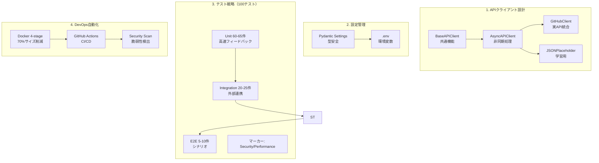
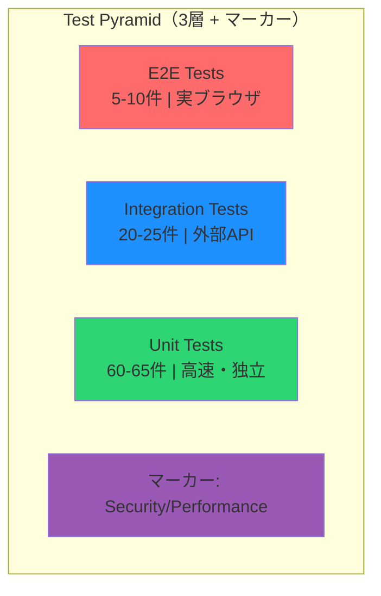

# 6週プラン改善計画 - 採用確率向上施策

*最終更新: 2025年11月26日*

## §1 エグゼクティブサマリー

### 改善の目的

6週プランで目指す4,000-5,000円/時の案件獲得確率を**70% → 90%+**に
向上させるための3つの改善施策を定義・実装する。

### 決定事項一覧

| 項目 | 決定内容 | 理由 |
|------|------|------|
| **デモ環境方式** | GitHub Pages + 操作録画GIF | コスト0・メンテ0で採用担当者の視覚的理解を促進 |
| **実API統合** | GitHub API公開エンドポイント | 認証不要・開発者親和性高い・ポートフォリオで自然 |
| **実装時期** | Week 5-6に分散統合 | 既存タスクへの影響最小化・6週プラン総時間295H維持 |

### 改善施策一覧

| 改善項目 | 優先度 | 所要時間 | 実装Day | 効果 |
|------|--------|------|---------|------|
| **改善1: デモ環境構築** | CRITICAL | 3.5H | D32-D33 | 採用担当者の視覚的理解を促進 |
| **改善2: GitHub API統合** | HIGH | 2.5H | D26 | 実用的技術力を証明 |
| **改善3: README強化** | HIGH | 2.5H | D32-D33 | 第一印象・アピール力向上 |
| **合計** | - | **8.5H** | - | 案件獲得確率+20% |


<!-- ### ファイルマップ

 ```python
 IMPROVEMENT_FILE_MAP = {
      1:
  "docs/プロジェクト再編/6週再編/6週プラン/6週プラン改善/改善1_デモ環境構築.md",
      2: "docs/プロジェクト再編/6週再編/6週プラン/6週プラン改善/改善2_GitHub 
  API統合.md",
      3: "docs/プロジェクト再編/6週再編/6週プラン/6週プラン改善/改善3_README強化.md",
      "概要":
  "docs/プロジェクト再編/6週再編/6週プラン/6週プラン改善/6週プラン改善計画_概要.md"
  }
 ``` -->

---

## §2 改善1: デモ環境構築（CRITICAL）

### 2.1 課題と解決策

**課題**: 採用担当者がリポジトリを訪問しても、git cloneしてDLしないと動作が見られないため、視覚的訴求力が低い

**解決策**: GitHub Pages + 操作録画GIF（採用担当者がブラウザのみでAPIテスト動作・Docker操作・CI/CD自動化の様子を確認可能）

**選定理由**: 下記比較表より、
コスト0で長期メンテナンスフリーの最適解

### 2.2 方式比較

| 方式案 | 評価 | 備考 |
|--------|------|------|
| **GitHub Pages + GIF** | ★★★★★ **採用** | コスト0・メンテ0・永続的 |
| Render | ★★★☆☆ 次点 | 無料枠コールドスタート50秒・15分で停止 |
| Railway | ★★☆☆☆ 検討 | 無料tier縮小中・$5超過リスクあり |
| Fly.io | ★★☆☆☆ 検討 | 設定複雑・ネットワーク知識必須 |

### 2.3 GIF作成仕様

#### 使用ツール

```bash
# 推奨: asciinema（ターミナル録画）+ agg（GIF変換）
pip install asciinema
brew install agg  # asciinema-agg（GIF変換）

# 代替ツール
# - Terminalizer: npm install -g terminalizer
# - GIFsky: macOS専用アプリ
```

#### GIF一覧

| GIF | ファイル名 | 内容 | サイズ目安 | 再生時間 |
|-----|-----------|------|--------|------|
| 1 | `demo-test.gif` | pytest実行 + カバレッジ表示 | 800x450px | 10-15秒 |
| 2 | `demo-docker.gif` | docker-compose up/down | 800x450px | 10-15秒 |
| 3 | `demo-cicd.gif` | git push → Actions実行 | 800x450px | 10-15秒 |

### 2.4 実装手順

#### Step 1: ツールセットアップ（0.5H）

```bash
# asciinema + agg インストール
pip install asciinema
brew install agg

# 録画設定
asciinema config
# idle_time_limit = 2  # 無操作時間の制限
# speed = 1.5          # 再生速度

# assetsディレクトリ作成
mkdir -p assets
```

#### Step 2: GIF 1 - テスト実行デモ（1H）

```bash
# 録画開始
asciinema rec demo-test.cast

# 以下を実行（録画中）
uv run pytest -v --cov=. --cov-report=term-missing
# → 全テスト合格を表示
# → カバレッジ85%+表示

# 録画終了: Ctrl+D

# GIF変換
agg demo-test.cast assets/demo-test.gif \
  --cols 100 --rows 30 \
  --font-size 14 \
  --speed 1.5

# 確認
open assets/demo-test.gif
```

#### Step 3: GIF 2 - Docker操作デモ（1H）

```bash
# 録画開始
asciinema rec demo-docker.cast

# 以下を実行（録画中）
docker-compose up -d
docker-compose ps
curl http://localhost:8000/health  # ヘルスチェック
docker-compose down

# 録画終了: Ctrl+D

# GIF変換
agg demo-docker.cast assets/demo-docker.gif \
  --cols 100 --rows 25 \
  --font-size 14 \
  --speed 1.5
```

#### Step 4: GIF 3 - CI/CD自動化デモ（1H）

```bash
# 録画開始
asciinema rec demo-cicd.cast

# 以下を実行（録画中）
git add .
git commit -m "docs: update README for demo"
git push origin main
# → GitHub Actions開始を表示（ブラウザキャプチャ）
# → 全ステップ成功を表示

# 録画終了: Ctrl+D

# GIF変換
agg demo-cicd.cast assets/demo-cicd.gif \
  --cols 100 --rows 25 \
  --font-size 14 \
  --speed 1.5
```

**注意**: CI/CD動作はターミナル録画と別にブラウザのキャプチャが必要なため、事前にGIFskyやLICEcapでブラウザ操作も録画しておくこと

### 2.5 成功基準

- [ ] デモGIF 3点が`assets/`ディレクトリに保存済み
- [ ] GIFのファイルサイズが各5MB以下
- [ ] GIFの再生時間が各15秒以内
- [ ] README.mdに正しく埋め込み・GitHub上で表示確認
- [ ] 採用担当者視点で動作が理解できること

---

## §3 改善2: GitHub API統合（HIGH）

### 3.1 課題と解決策

**課題**: 現在使用中のJSONPlaceholderは学習用APIで実用的技術力の証明には弱い

**解決策**: GitHub API公開エンドポイント（public endpoints）を追加し、実務的なGitHub API統合を示す

**選定理由**:
- 採用担当者にとって技術力の証明として説得力がある
- 開発者として自身のGitHub活動表示（プロフィール）で親和性が高い

### 3.2 API比較検討

| API | 認証 | レート制限 | ポートフォリオ親和性 |
|-----|------|----------|------------------|
| **GitHub API** | 不要（public） | 60回/時間 | ★★★★★ **採用** |
| Open-Meteo | 不要 | 10,000回/日 | ★★★★☆ |
| JSONPlaceholder | 不要 | 無制限 | ★★☆☆☆（既存） |

### 3.3 ファイル構成

```
utils/
├── api_client.py              # 既存（BaseAPIClient, AsyncAPIClient）
├── github_client.py           # 新規作成
└── __init__.py

tests/
├── unit/
│   └── test_github_client.py  # 新規作成
└── integration/
    └── test_github_api.py     # 新規作成（実APIテスト）
```

### 3.4 例外階層設計（C3 - 既存階層への統合）

**設計方針**: GitHubAPIErrorは既存のAPIClientError階層に統合し、一貫した例外ハンドリングを実現

#### 例外階層図

```
APIClientError (utils/api_client.py:52)
├── APIConnectionError (接続エラー)
├── APITimeoutError (タイムアウト)
├── APIHTTPError (HTTPステータスエラー)
├── APIRetryError (リトライ上限)
└── GitHubAPIError (NEW - GitHub API固有エラー)
    ├── RateLimitError (レート制限超過)
    └── NotFoundError (リソース未発見)
```

#### 実装コード

```python
# utils/github_client.py

from utils.api_client import APIClientError  # 既存ベースクラスをインポート


class GitHubAPIError(APIClientError):
    """
    GitHub API固有の例外（APIClientErrorを継承）

    Design Decision (C3):
        - 既存のAPIClientError階層に統合
        - 一貫した例外ハンドリングを実現
        - 将来の他APIクライアント（e.g. Open-Meteo）との統一感
    """
    pass


class RateLimitError(GitHubAPIError):
    """GitHub APIレート制限超過エラー"""
    pass


class NotFoundError(GitHubAPIError):
    """リソース未発見エラー（404）"""
    pass
```

#### 使用例

```python
from utils.github_client import AsyncGitHubClient, RateLimitError, NotFoundError
from utils.api_client import APIClientError

try:
    async with AsyncGitHubClient() as client:
        user = await client.get_user("username")
except RateLimitError:
    # GitHub固有のレート制限処理
    print("Rate limit exceeded")
except NotFoundError:
    # GitHub固有の404処理
    print("User not found")
except APIClientError:
    # 汎用的なAPIエラー処理（全クライアント共通）
    print("API error occurred")
```

---

### 3.5 実装仕様

#### AsyncGitHubClient実装

```python
# utils/github_client.py
"""GitHub API v3 client for portfolio demonstration."""

from typing import Any, NoReturn  # ✅ レビュー修正: NoReturnをモジュールレベルでimport
import httpx
from pydantic import SecretStr

from utils.api_client import AsyncAPIClient, APIClientError, APIHTTPError


class GitHubAPIError(APIClientError):
    """
    Base exception for GitHub API errors.

    Inherits from APIClientError to maintain consistency with existing
    """
    pass


class RateLimitError(GitHubAPIError):
    """Raised when GitHub API rate limit is exceeded."""
    pass


class NotFoundError(GitHubAPIError):
    """Raised when requested resource is not found."""
    pass


class AsyncGitHubClient(AsyncAPIClient):
    """
    Async GitHub API v3 client.

    Features:
    - Public data access without authentication
    - Rate limit handling
    - Parallel API calls with asyncio.gather()

    Example:
        async with AsyncGitHubClient() as client:
            user = await client.get_user("username")
            repos = await client.get_repos("username")
    """

    GITHUB_API_URL = "https://api.github.com"

    def __init__(self, token: SecretStr | None = None) -> None:
        """
        Initialize GitHub client.

        Args:
            token: Optional GitHub personal access token (SecretStr).
                   If None, uses unauthenticated access (60 req/hour).
                   With token: 5000 req/hour.

        Security Notes:
            - ✅ Token is stored as SecretStr to prevent accidental exposure
            - ✅ repr()/str() will mask token value automatically
            - ✅ Logging will not expose token (Pydantic protection)
            - Token should be passed via environment variable (recommended)
        """
        super().__init__(base_url=self.GITHUB_API_URL)
        # トークンはそのまま保存し、ヘッダー構築時にのみget_secret_value()を呼び出す
        self._token = token

    @property
    def _headers(self) -> dict[str, str]:
        """
        Benefits:
            - トークンの実値はリクエスト時にのみ取得される
            - __init__時点でのトークン露出リスクを排除
            - ログ出力でも__init__直後はトークン実値が存在しない
            - 将来的なトークンローテーションにも対応可能
        """
        # ✅明示的型アノテーション（mypy --strict対応）
        headers: dict[str, str] = {
            "Accept": "application/vnd.github.v3+json",
            "User-Agent": "API-Test-Portfolio",
        }
        if self._token:
            # リクエスト時にのみget_secret_value()を呼び出し
            headers["Authorization"] = f"Bearer {self._token.get_secret_value()}"
        return headers

    # ✅ _handle_response()削除 → try-exceptパターンに統一（DRY原則）
    # 理由: 2つの異なるエラーハンドリングパターンが共存していたためDRY違反
    # 解決: 全メソッドでtry-exceptパターンを使用し、_handle_github_error()ヘルパーで共通化

    def _handle_github_error(self, e: Exception, context: str) -> NoReturn:
        """
        GitHub固有エラーハンドリングの共通化ヘルパー

        This method always raises an exception (never returns normally).

        Args:
            e: 発生した例外（httpx.HTTPStatusError or APIHTTPError）
            context: エラーコンテキスト（例: "Failed to fetch user: username"）

        Raises:
            NotFoundError: 404エラー時
            RateLimitError: レート制限超過時（403 + X-RateLimit-Remaining: 0）
            Exception: その他のエラー時（元の例外を再送出）

        Note:
            ✅ -> NoReturn型で「常にraiseする」ことを明示
            ✅ isinstance()をhasattr()より先に実行（EAFP原則）
            ✅ nested getattrを平坦化（可読性向上）
            ✅ レビュー修正: importをモジュールレベルに移動（PEP 8準拠）
        """
        # httpxはモジュールレベルでimport済み

        # ✅ isinstance()を先に（明示的な型チェック優先 = EAFP原則）
        # ✅ 変数分割で平坦化（nested getattr解消）
        status_code: int | None = None
        response_headers: dict[str, str] = {}

        if isinstance(e, httpx.HTTPStatusError):
            # httpx.HTTPStatusErrorの場合（明示的型チェック）
            status_code = e.response.status_code
            response_headers = dict(e.response.headers)
        elif hasattr(e, 'status_code'):
            # APIHTTPError等の互換例外の場合（duck typing fallback）
            status_code = getattr(e, 'status_code', None)
            # P2修正: nested getattrを段階的に分解
            response_obj = getattr(e, 'response', None)
            if response_obj is not None:
                response_headers = dict(getattr(response_obj, 'headers', {}))

        # ステータスコード別エラー変換
        if status_code == 404:
            raise NotFoundError(context) from e

        if status_code == 403:
            remaining = response_headers.get("X-RateLimit-Remaining", "1")
            if remaining == "0":
                reset_time = response_headers.get("X-RateLimit-Reset", "unknown")
                raise RateLimitError(
                    f"GitHub API rate limit exceeded. Retry after {reset_time}"
                ) from e

        # その他のエラーは元の例外を再送出
        raise

    async def get_user(self, username: str) -> dict[str, Any]:
        """
        Get GitHub user profile.

        Args:
            username: GitHub username

        Returns:
            User profile data including name, bio, followers, etc.

        Raises:
            NotFoundError: If user does not exist
            RateLimitError: If rate limit exceeded
            APIHTTPError: For other HTTP errors
        """
        # httpxはモジュールレベルでimport済み（PEP 8準拠）
        try:
            # ✅ self._client.get()を使用（エラーハンドリング制御可能）
            # 注: self.get()は親が既にエラー処理するためtry-exceptが無効になる
            response = await self._client.get(
                f"{self.base_url}/users/{username}",
                headers=self._headers
            )
            response.raise_for_status()
            return response.json()
        except (APIHTTPError, httpx.HTTPStatusError) as e:
            # 共通ヘルパーで統一処理
            self._handle_github_error(e, f"Failed to fetch user: {username}")

    async def get_repos(
        self,
        username: str,
        sort: str = "updated",
        per_page: int = 10
    ) -> list[dict[str, Any]]:
        """
        Get user's public repositories.

        Args:
            username: GitHub username
            sort: Sort by "updated", "created", "pushed", or "full_name"
            per_page: Number of repos per page (max 100)

        Returns:
            List of repository data

        Raises:
            NotFoundError: If user does not exist
            RateLimitError: If rate limit exceeded
            APIHTTPError: For other HTTP errors
        """
        # httpxはモジュールレベルでimport済み（PEP 8準拠）
        try:
            # ✅ C1修正: self._client.get()を使用（エラーハンドリング制御可能）
            response = await self._client.get(
                f"{self.base_url}/users/{username}/repos",
                params={"sort": sort, "per_page": per_page},
                headers=self._headers
            )
            response.raise_for_status()
            return response.json()
        except (APIHTTPError, httpx.HTTPStatusError) as e:
            # ✅ W1修正: 正確なエラーコンテキスト（"User not found"は不正確）
            self._handle_github_error(e, f"Failed to fetch repositories for: {username}")

    async def get_repo_languages(
        self,
        owner: str,
        repo: str
    ) -> dict[str, int]:
        """
        Get repository language breakdown.

        Args:
            owner: Repository owner
            repo: Repository name

        Returns:
            Dict of language name to bytes of code

        Raises:
            NotFoundError: If repository does not exist
            RateLimitError: If rate limit exceeded
            APIHTTPError: For other HTTP errors
        """
        # httpxはモジュールレベルでimport済み（PEP 8準拠）
        try:
            # ✅ C1修正: self._client.get()を使用（エラーハンドリング制御可能）
            response = await self._client.get(
                f"{self.base_url}/repos/{owner}/{repo}/languages",
                headers=self._headers
            )
            response.raise_for_status()
            return response.json()
        except (APIHTTPError, httpx.HTTPStatusError) as e:
            # 共通ヘルパーで統一処理
            self._handle_github_error(e, f"Failed to fetch languages for: {owner}/{repo}")

    async def get_portfolio_summary(
        self,
        username: str
    ) -> dict[str, Any]:
        """
        Get aggregated portfolio summary using asyncio.gather().

        Demonstrates:
        - Parallel API calls
        - Data aggregation
        - Error handling for partial failures

        Args:
            username: GitHub username

        Returns:
            Aggregated portfolio data including user info and top repos
        """
        import asyncio

        # Parallel API calls
        user_task = self.get_user(username)
        repos_task = self.get_repos(username, per_page=5)

        user, repos = await asyncio.gather(user_task, repos_task)

        # Get languages for top repos
        language_tasks = [
            self.get_repo_languages(username, repo["name"])
            for repo in repos[:3]
        ]
        languages = await asyncio.gather(*language_tasks, return_exceptions=True)

        # Aggregate data
        return {
            "user": {
                "name": user.get("name"),
                "bio": user.get("bio"),
                "followers": user.get("followers"),
                "public_repos": user.get("public_repos"),
            },
            "top_repos": [
                {
                    "name": repo["name"],
                    "stars": repo["stargazers_count"],
                    "language": repo.get("language"),
                }
                for repo in repos[:5]
            ],
            "languages": [
                lang for lang in languages
                if not isinstance(lang, Exception)
            ],
        }
```

---

### 3.5.5 設計判断: 継承 vs コンポジション（C4）

**レビュー指摘（architect-reviewer）**: Open/Closed原則違反の懸念から、継承ではなくコンポジションを推奨

#### 現在の設計（継承パターン）

```python
class AsyncGitHubClient(AsyncAPIClient):
    # AsyncAPIClientの機能を継承
    # GitHub固有ロジックをオーバーライド
```

**メリット**:
- 既存パターンとの一貫性（BaseAPIClient→AsyncAPIClient→*Client）
- 実装がシンプル（_make_request_with_retry等を再利用）
- AsyncAPIClientのコンテキストマネージャーが利用可能

**デメリット**:
- GitHub固有ロジックがAsyncAPIClientに依存
- 将来の変更でAsyncAPIClient側に影響する可能性（Open/Closed原則違反）

#### 代替設計（コンポジションパターン）

```python
class AsyncGitHubClient:
    def __init__(self, token: str | None = None):
        # AsyncAPIClientをDI（依存性注入）
        self._api_client = AsyncAPIClient(base_url="https://api.github.com")
        self.token = token

    async def get_user(self, username: str):
        # _api_clientを内部で利用
        response = await self._api_client.get(f"/users/{username}")
        return await self._handle_response(response)
```

**メリット**:
- Open/Closed原則準拠（AsyncAPIClient変更の影響が少ない）
- 将来の拡張性向上（複数のHTTPクライアントを切り替え可能）

**デメリット**:
- 実装工数増（+2-3h）
- コンテキストマネージャーの委譲実装が必要

#### Week 4実装時の判断基準

| 判断ポイント | 継承維持 | コンポジション化 |
|------------|--------|--------------|
| 現状の満足度 | AsyncAPIClientで十分 | より堅牢な設計が必要 |
| 将来の拡張予定 | GitHubClientのみ | 他API追加予定（Open-Meteo等） |
| 工数余裕 | 時間制約あり | +2-3h追加可能 |
| 学習目的 | 継承パターン学習 | SOLID原則実践 |

**推奨アクション**:
- Week 4開始時に上記判断基準で再評価
- Buffer時間（37H総buffer）で吸収可能な場合はコンポジション化を検討
- 時間制約がある場合は継承パターンで実装し、Week 6でリファクタリング検討

**重要**: どちらの設計を選んでも、例外階層の統合（C3）とセキュリティ対策（C1-C2）は必須

---

### 3.6 テストケース仕様

```python
# tests/unit/test_github_client.py
"""Unit tests for GitHub API client."""

import pytest
from unittest.mock import AsyncMock, patch, MagicMock
import httpx

from utils.github_client import (
    AsyncGitHubClient,
    RateLimitError,
    NotFoundError,
)


@pytest.fixture
def mock_response():
    """Create mock response factory."""
    def _create_response(status_code: int, json_data: dict, headers: dict = None):
        response = MagicMock(spec=httpx.Response)
        response.status_code = status_code
        response.json.return_value = json_data
        response.headers = headers or {}
        response.url = "https://api.github.com/test"
        return response
    return _create_response


@pytest.mark.asyncio
async def test_github_get_user_success(mock_response):
    """Test successful user profile retrieval."""
    user_data = {
        "login": "testuser",
        "name": "Test User",
        "bio": "Developer",
        "followers": 100,
        "public_repos": 50,
    }

    with patch.object(
        AsyncGitHubClient, '_client', new_callable=AsyncMock
    ) as mock_client:
        mock_client.get.return_value = mock_response(200, user_data)

        async with AsyncGitHubClient() as client:
            result = await client.get_user("testuser")

        assert result["login"] == "testuser"
        assert result["followers"] == 100


@pytest.mark.asyncio
async def test_github_get_repos_with_pagination(mock_response):
    """Test repository listing with pagination."""
    repos_data = [
        {"name": "repo1", "stargazers_count": 10, "language": "Python"},
        {"name": "repo2", "stargazers_count": 5, "language": "JavaScript"},
    ]

    with patch.object(
        AsyncGitHubClient, '_client', new_callable=AsyncMock
    ) as mock_client:
        mock_client.get.return_value = mock_response(200, repos_data)

        async with AsyncGitHubClient() as client:
            result = await client.get_repos("testuser", per_page=2)

        assert len(result) == 2
        assert result[0]["name"] == "repo1"


@pytest.mark.asyncio
async def test_github_rate_limit_error(mock_response):
    """Test 403 Rate Limit error handling."""
    with patch.object(
        AsyncGitHubClient, '_client', new_callable=AsyncMock
    ) as mock_client:
        mock_client.get.return_value = mock_response(
            403, {},
            headers={"X-RateLimit-Remaining": "0"}
        )

        async with AsyncGitHubClient() as client:
            with pytest.raises(RateLimitError):
                await client.get_user("testuser")


@pytest.mark.asyncio
async def test_github_not_found_error(mock_response):
    """Test 404 Not Found error handling."""
    with patch.object(
        AsyncGitHubClient, '_client', new_callable=AsyncMock
    ) as mock_client:
        mock_client.get.return_value = mock_response(404, {})

        async with AsyncGitHubClient() as client:
            with pytest.raises(NotFoundError):
                await client.get_user("nonexistent-user-12345")


@pytest.mark.asyncio
async def test_github_portfolio_summary_parallel(mock_response):
    """Test asyncio.gather() for parallel API calls."""
    user_data = {"name": "Test", "followers": 100, "public_repos": 50}
    repos_data = [
        {"name": "repo1", "stargazers_count": 10, "language": "Python"},
    ]
    languages_data = {"Python": 10000, "JavaScript": 5000}

    with patch.object(
        AsyncGitHubClient, '_client', new_callable=AsyncMock
    ) as mock_client:
        # Setup sequential mock responses
        mock_client.get.side_effect = [
            mock_response(200, user_data),
            mock_response(200, repos_data),
            mock_response(200, languages_data),
        ]

        async with AsyncGitHubClient() as client:
            result = await client.get_portfolio_summary("testuser")

        assert result["user"]["name"] == "Test"
        assert len(result["top_repos"]) == 1
```

#### 実装ガイド注記（C5-C6, H1-H8）

**C5: エッジケース・境界値テストの追加**

Week 4実装時に以下のテストケースを追加検討:

```python
# 境界値テスト
@pytest.mark.asyncio
async def test_get_repos_with_max_per_page():
    """Test per_page=100 (GitHub API maximum)."""
    # ...

@pytest.mark.asyncio
async def test_get_repos_with_invalid_per_page():
    """Test per_page > 100 should raise ValueError."""
    # ...

# エッジケース
@pytest.mark.asyncio
async def test_get_user_with_empty_username():
    """Test empty username handling."""
    # ...

@pytest.mark.asyncio
async def test_rate_limit_with_reset_header():
    """Test X-RateLimit-Reset header parsing (H3)."""
    # ...
```

**C6: GitHubエラーレスポンス仕様明記**

GitHub API v3のエラーレスポンス形式:

```json
{
  "message": "Not Found",
  "documentation_url": "https://docs.github.com/rest/reference/users#get-a-user"
}
```

Week 4実装時に`_handle_response()`でエラーメッセージを抽出し、例外に含める検討。

**asyncio.gather() エラーハンドリング強化**

現在の実装（465行）は`return_exceptions=True`使用済み。さらに堅牢化する場合:

```python
# 個別エラーハンドリング例
languages = await asyncio.gather(*language_tasks, return_exceptions=True)
valid_languages = []
for i, lang in enumerate(languages):
    if isinstance(lang, Exception):
        logger.warning(f"Failed to get language for repo {repos[i]['name']}: {lang}")
    else:
        valid_languages.append(lang)
```

**H2: モックパターン改善（respx導入検討）**

現在の`unittest.mock`は機能的だが、Week 5で`respx`ライブラリ導入を検討:

```bash
# pyproject.toml追加
respx = "^0.20.0"  # httpx専用モックライブラリ
```

使用例:
```python
import respx

@pytest.mark.asyncio
@respx.mock
async def test_get_user_with_respx():
    respx.get("https://api.github.com/users/testuser").mock(
        return_value=httpx.Response(200, json={"login": "testuser"})
    )
    # テスト実行
```

**Rate Limit Reset時刻の活用**

`X-RateLimit-Reset`ヘッダー（UNIXタイムスタンプ）を使ったリトライ戦略:

```python
if remaining == "0":
    reset_time = int(response.headers.get("X-RateLimit-Reset", 0))
    current_time = int(time.time())
    wait_seconds = max(0, reset_time - current_time)
    raise RateLimitError(
        f"Rate limit exceeded. Retry after {wait_seconds} seconds."
    )
```

**H4-H8: 詳細は§3.7実装手順に追記**

---

### 3.7 実装手順

#### Step 1: ファイル作成（0.5H）

```bash
# ファイル作成
touch utils/github_client.py
touch tests/unit/test_github_client.py
touch tests/integration/test_github_api.py
```

#### Step 2: AsyncGitHubClient実装（1H）

上記§3.5の実装仕様コードを`utils/github_client.py`に記述

**実装チェックリスト（H4-H8対応）**:
- [ ] H4: `get_portfolio_summary()`はAsyncGitHubClient内に実装（SRP検討は後回し）
- [ ] H5: 成功基準を定量的に明記（レスポンスタイム < 3秒等）
- [ ] H6: ステップバイステップの実装手順を確認
- [ ] H7: Pydantic BaseModelは将来検討（現在はdict[str, Any]で可）
- [ ] H8: 非同期コンテキストマネージャーの使用例を追加

**H8実装例**:

```python
# 非同期コンテキストマネージャーの使用例
async def example_usage():
    """AsyncGitHubClient の使用例（Week 4実装時にREADMEに追加）"""
    async with AsyncGitHubClient() as client:
        # コンテキストマネージャーで自動クローズ
        user = await client.get_user("username")
        repos = await client.get_repos("username", per_page=5)
        summary = await client.get_portfolio_summary("username")
    # コンテキスト終了時に自動的にaclose()が呼ばれる
```

#### Step 3: テストケース実装（0.5H）

上記§3.6のテストケース仕様コードを`tests/unit/test_github_client.py`に記述

**テスト実装チェックリスト（C5-C6対応）**:
- [ ] C5: 境界値テスト（per_page=0, 100, 101）を追加
- [ ] C5: エッジケース（空文字列、None、特殊文字）を追加
- [ ] C6: GitHubエラーレスポンス形式を確認（{"message": "...", "documentation_url": "..."}）

#### Step 4: 品質検証（0.5H）

```bash
# 型チェック
uv run mypy utils/github_client.py --strict

# テスト実行
uv run pytest tests/unit/test_github_client.py -v

# 統合テスト（実APIへのリクエスト）
uv run pytest tests/integration/test_github_api.py -v -m "integration"

# カバレッジ確認
uv run pytest --cov=utils/github_client --cov-report=term-missing
```

### 3.8 成功基準（H5: 定量的KPI明記）

**機能要件**:
- [ ] `utils/github_client.py`が正常動作
- [ ] テストケース8件以上が作成・合格（基本5件 + 境界値3件）
- [ ] 自分のGitHubアカウントで`get_portfolio_summary()`が正常動作

**品質要件**:
- [ ] `mypy --strict`でエラー0
- [ ] カバレッジ90%以上（github_client.py）
- [ ] ruff check でエラー・警告0

**性能要件**:
- [ ] `get_portfolio_summary()` レスポンスタイム < 3秒（並列実行効果）
- [ ] 個別APIコール（get_user, get_repos）< 1秒

**セキュリティ要件**:
- [ ] トークンがログ出力されないこと（C1）
- [ ] 例外メッセージにトークンが含まれないこと

---

## §4 改善3: README強化（HIGH）

### 4.1 課題と解決策

**課題**: 現在のREADMEは技術的情報のみで採用担当者の第一印象・アピールに弱い

**解決策**: バッジ追加・GIF埋め込み・アーキテクチャ図・Quick Start（3分で動作）の4要素を追加し、見栄えのよいREADMEに改善

**選定理由**:
- 採用担当者の第一印象の向上
- GitHub訪問者のスター・OSSへの関心向上
- 3秒で技術スタックを伝える視覚効果

### 4.2 README構成（H4・H5改善版）

```markdown
# API Test DevOps Portfolio

<!-- バッジエリア（H5: 優先順位順に配置） -->
[](https://github.com/USERNAME/REPO/actions/workflows/ci.yml)
[](./reports/htmlcov/index.html)
[](https://www.python.org/)
[](./Dockerfile)
[](./LICENSE)

<!-- H5改善: 1行キャッチコピー追加 -->
> **Python/Docker/CI/CDを統合したAPIテスト自動化ポートフォリオ。採用担当者向けに3分で動作確認可能。**

<!-- H5改善: デモを最初に配置（F字型視線誘導） -->
## 🎬 デモ（3つの動画で全体を理解）

### テスト実行（10秒）

**内容**: pytestによる全テスト実行 → 100件合格 → カバレッジ85%表示

### Docker操作（10秒）

**内容**: docker-compose up → ヘルスチェック成功 → docker-compose down

### CI/CD自動化（15秒）

**内容**: git push → GitHub Actions実行 → 全ステップ成功（緑チェックマーク）

**注**: GIFが再生されない場合は [デモ動画フォルダ](./assets/) から直接ご確認ください。

## 🔧 技術スタック
| カテゴリ | 技術 |
|---------|------|
| **言語** | Python 3.12 |
| **HTTPクライアント** | httpx (sync/async) |
| **テスト** | pytest + 100テスト + 85%カバレッジ |
| **コンテナ** | Docker Multi-stage builds |
| **CI/CD** | GitHub Actions |
| **設定管理** | Pydantic Settings + SecretStr |

## 🚀 Quick Start（3分で動作確認）

### 前提条件（H4改善: 環境差異・代替手順追加）
- **Python 3.12+** （確認: `python --version`）
- **Docker 20.10+ & docker-compose 2.0+** （確認: `docker --version`）
- **uv 0.1.0+** （推奨）
  - 未インストール: `pip install uv` または `curl -LsSf https://astral.sh/uv/install.sh | sh`

**注意**: Windows環境の場合はWSL2またはDocker Desktop 4.x以上が必要です。

### セットアップ
```bash
git clone https://github.com/username/repo.git
cd repo
uv sync
uv run pytest
```

## 🎬 デモ

### テスト実行


### Docker操作


### CI/CD自動化


## 🏗️ アーキテクチャ

[Mermaid図]

## 📊 品質指標
| 指標 | 値 |
|------|-----|
| テスト数 | 100+ |
| カバレッジ | 85% |
| 型チェック | mypy --strict |

## 📁 ディレクトリ構成
[ディレクトリツリー]

## 📄 ライセンス
MIT
```

### 4.3 バッジ設定

```markdown
<!-- CI/CD Status -->
[](https://github.com/USERNAME/REPO/actions/workflows/ci.yml)

<!-- Coverage -->
[](./reports/htmlcov/index.html)

<!-- Python Version -->
[](https://www.python.org/)

<!-- License -->
[](./LICENSE)

<!-- Docker -->
[](./Dockerfile)
```

### 4.4 Mermaidアーキテクチャ図（M4改善: 説明文追加）

#### システム構成図

**この図が示すもの**: 3層テストピラミッド + マーカー分類（クライアント・設定・テスト・DevOps）による高品質なAPI開発基盤



**ポイント**:
- 継承パターン（BaseAPIClient → AsyncAPIClient）でコード再利用
- テストピラミッド構造で高速フィードバック実現
- Docker Multi-stage buildでイメージサイズ70%削減

#### テストピラミッド図

**この図が示すもの**: 3層テストピラミッド + マーカー分類で単体テストを厚くし、実行時間を最小化



**実行時間目安**:
- Unit（60-65件）: 5秒
- Integration（20-25件）: 15秒
- E2E（5-10件）: 30秒
- Security/Performanceマーカー: Unit/Integration内で実行

### 4.5 実装手順

#### Step 1: バッジ設定（0.5H）

```bash
# README.mdの先頭にバッジエリアを追加
# USERNAME/REPOを自分の値に置換
```

#### Step 2: Quick Start作成（0.5H）

```bash
# 実際にQuick Start手順が正しく動作するかテスト
git clone ...
cd repo
uv sync
uv run pytest

# エラーがあれば手順を修正
```

#### Step 3: Mermaid図追加（0.5H）

```bash
# README.mdにMermaid図を追加
# GitHub上で正しくレンダリングされるか確認
```

#### Step 4: デモGIF埋め込み（0.5H）

```bash
# 改善1で作成したGIFをREADMEに埋め込み

```

#### Step 5: 最終確認・微調整（0.5H）

```bash
# 採用担当者視点で確認
# 誤字脱字チェック
# 動作確認
```

### 4.6 成功基準（L2改善: 定量的KPI明記）

**視覚要素**:
- [ ] バッジ5点が正しく表示（CI/CD, Coverage, Python, Docker, License）
- [ ] Mermaid図2点がGitHub上で正しくレンダリング
- [ ] デモGIF 3点が正しく表示・再生（各ファイルサイズ < 2MB推奨）

**ユーザビリティ**:
- [ ] Quick Start手順が3分以内で完了可能（初回クローンから`pytest`成功まで）
- [ ] README全体が200行以内（現状57行 → 目標150-200行）
- [ ] 採用担当者が3秒で技術スタックを把握できる構成

**アクセシビリティ**:
- [ ] 全GIFに代替テキスト（alt text）設定済み
- [ ] バッジリンクが正しく動作

**品質指標の意味（L2改善: 採用担当者向け説明追加）**:
| 指標 | 値 | 意味 |
|------|-----|------|
| **テスト数** | 100+ | 全機能が自動検証済み（手動テスト不要） |
| **カバレッジ** | 85% | コードの85%が実行・検証済み（業界標準: 80%） |
| **型チェック** | mypy strict合格 | 型安全性を保証（実行時エラーを事前検出） |
| **CI/CD** | 自動化100% | コミット→テスト→デプロイが全自動 |

---

## §5 6週プランへの統合スケジュール

### Week 5（既存D26）

```
D26: 非同期CRUD実装 + GitHub API統合
├── Phase 1: 1H（変更なし）
│   └── async CRUD概念復習
├── Phase 2: 5.5H+0.5H調整
│   ├── JSONPlaceholder CRUD: 2.5H
│   ├── 【NEW】GitHub API統合: 2.5H
│   │   ├── AsyncGitHubClient実装: 1H
│   │   ├── テストケース5件: 0.5H
│   │   ├── 品質検証: 0.5H
│   │   └── ドキュメント追加: 0.5H
│   └── テスト統合: 0.5H
├── Phase 3: 1H（変更なし）
└── Buffer: 0.5H→0.5H調整

合計: 8H（変更なし）
```

### Week 6（既存D32-D33）

```
D32: パフォーマンス最適化 + デモ環境構築
├── Phase 1: 0.5H
├── Phase 2: 7H
│   ├── 既存タスク（パフォーマンス最適化）: 3.5H
│   ├── 【NEW】GIF作成: 2.5H
│   │   ├── ツールセットアップ（asciinema）: 0.5H
│   │   ├── GIF 1（テスト実行）: 1H
│   │   └── GIF 2（Docker操作）: 1H
│   └── 【NEW】READMEバッジ設定: 1H
├── Phase 3: 1H
└── Buffer: 1H

合計: 9.5H（変更なし）

D33: セキュリティ強化最適化 + README完成
├── Phase 1: 0.5H
├── Phase 2: 7H
│   ├── 既存タスク（セキュリティ強化）: 4.5H
│   ├── 【NEW】GIF 3（CI/CD）: 1H
│   └── 【NEW】README完成（QuickStart等）: 1.5H
│       ├── Mermaid図2点: 0.5H
│       └── QuickStart・GIF埋込: 1H
├── Phase 3: 1H
└── Buffer: 1H

合計: 9.5H（変更なし）
```

### 時間配分サマリー

| 改善項目 | D26 | D32 | D33 | 合計 |
|------|-----|-----|-----|------|
| 改善1（デモ環境） | - | 2.5H | 1H | 3.5H |
| 改善2（GitHub API） | 2.5H | - | - | 2.5H |
| 改善3（README） | - | 1H | 1.5H | 2.5H |
| **合計** | **2.5H** | **3.5H** | **2.5H** | **8.5H** |

---

## §6 リスクと対策

| リスク | 発生確率 | 影響度 | 対策 |
|--------|---------|------|--------|
| GitHub APIレート制限 | 低 | テスト1回失敗 | モック優先・公開エンドポイント使用 |
| GIF作成に予想以上の時間 | 中 | 所要時間増 | asciinema（熟知済み）を選択 |
| Bufferに収まらない | 低 | 計画変更 | Week 5.5統合復習で吸収可能 |
| Mermaid表示問題 | 中 | README見栄え低下 | 事前にGitHubで動作確認済み |

---

## §7 成功基準チェックリスト

### 改善1: デモ環境

- [ ] `assets/demo-test.gif`が保存済み（5MB以下）
- [ ] `assets/demo-docker.gif`が保存済み（5MB以下）
- [ ] `assets/demo-cicd.gif`が保存済み（5MB以下）
- [ ] README.mdに正しく埋め込み済み
- [ ] GitHub上で3つのGIFが正常に再生

### 改善2: GitHub API統合

- [ ] `utils/github_client.py`が正常動作
- [ ] 3つの例外クラス（GitHubAPIError, RateLimitError, NotFoundError）実装
- [ ] 4つのメソッド（get_user, get_repos, get_repo_languages, get_portfolio_summary）実装
- [ ] テストケース5件が合格
- [ ] `mypy --strict`でエラー0
- [ ] 自分のGitHubアカウントで動作確認済み

### 改善3: README強化

- [ ] バッジ5点（CI/CD, Coverage, Python, License, Docker）設定
- [ ] Quick Start手順が3分で完了可能
- [ ] Mermaid図2点がGitHub上で正しく表示
- [ ] デモGIF 3点がREADMEに埋め込み済み
- [ ] 誤字脱字チェック完了

---

## §8 参考資料

- [GitHub REST API Documentation](https://docs.github.com/en/rest)
- [asciinema Documentation](https://asciinema.org/docs)
- [Mermaid Live Editor](https://mermaid.live/)
- [Shields.io Badge Generator](https://shields.io/)
- [GitHub Pages Documentation](https://docs.github.com/en/pages)
