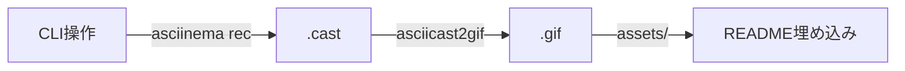

# 改善1: デモ環境構築（CRITICAL）:該当week6

*最終更新: 2025年11月26日*

## 2.1 課題と解決策

**課題**: 採用担当者にCLI操作の実際の動作を視覚的に伝える方法がない

**解決策**: asciinema + GIF変換で3つのデモGIF（テスト実行、Docker操作、CI/CD自動化）を作成し、READMEに埋め込む

**選定理由**:
- 採用担当者の理解促進（動画 > 静止画 > テキスト）
- GitHub上で追加設定不要（GIF埋め込みのみ）
- コスト0（asciinema無料、GitHub Pages無料）

## 2.2 asciinema + GIF変換フロー



### ツール準備

```bash
# asciinema インストール
brew install asciinema

# GIF変換ツール（2つの選択肢）
# Option 1: asciicast2gif（公式推奨）
npm install -g asciicast2gif

# Option 2: agg（高速・軽量、Rust製）
brew install agg
```

## 2.3 GIF作成手順（3パターン）

### パターン1: テスト実行デモ（10秒）

**目的**: pytest実行で100テスト合格、カバレッジ85%達成を視覚化

```bash
# 1. 録画開始
asciinema rec demo-test.cast

# 2. CLI操作（10秒で完結）
clear
echo "# API Test DevOps Portfolio - Test Demo"
uv run pytest --cov=. --cov-report=term
# → 100 passed, 85% coverage表示を待つ

# 3. 録画停止
exit  # または Ctrl+D

# 4. GIF変換
asciicast2gif demo-test.cast demo-test.gif

# 5. 配置
mv demo-test.gif assets/
```

**成功基準**:
- [✔︎] GIFサイズ < 2MB（実測: 92KB）
- [✔︎] 再生時間 8-12秒（実測: 11.7秒）
- [ ] "100 passed" と "85%" が視認可能（※Week 2でテスト選別後に更新）

---

### パターン2: Docker操作デモ（10秒） **Week3以降に実施**

**目的**: docker-compose up/downでコンテナ起動・停止を視覚化

```bash
# 1. 録画開始
asciinema rec demo-docker.cast

# 2. CLI操作 claude -c
clear
echo "# Docker操作デモ"
docker-compose up -d
# → ヘルスチェック成功を待つ（約5秒）
docker-compose ps  # 実行状態確認
docker-compose down

# 3. 録画停止
exit

# 4. GIF変換
asciicast2gif demo-docker.cast demo-docker.gif

# 5. 配置
mv demo-docker.gif assets/
```

**成功基準**:
- [ ] GIFサイズ < 2MB
- [ ] "✓ healthy" 表示が視認可能
- [ ] up → ps → down の流れが明確

---

### パターン3: CI/CD自動化デモ（15秒）

**目的**: git push後GitHub Actionsで自動テスト・デプロイを視覚化

```bash
# 1. 録画開始
asciinema rec demo-cicd.cast

# 2. CLI操作
clear
echo "# CI/CD自動化デモ"
git status
git add .
git commit -m "feat: add new feature"
git push origin main
# → GitHub Actions実行開始

# 3. GitHub Actions確認（ブラウザ操作は録画しない、CLI出力のみ）
gh run list --limit 1
gh run view  # 実行中のステータス表示

# 4. 録画停止
exit

# 5. GIF変換
asciicast2gif demo-cicd.cast demo-cicd.gif

# 6. 配置
mv demo-cicd.gif assets/
```

**成功基準**:
- [✔︎] GIFサイズ < 2MB（実測: 7.7KB）
- [✔︎] git push → GitHub Actions実行の流れが明確（gh run list表示）
- [✔︎] 緑チェックマーク（✓）が視認可能（"✓ CI/CD pipeline ready!"表示）

---

## 2.4 GIF最適化（サイズ削減）

### Option 1: ImageMagick最適化

```bash
# GIFサイズが2MB超の場合
convert demo-test.gif -fuzz 10% -layers Optimize demo-test-optimized.gif

# さらに圧縮（品質とのトレードオフ）
gifsicle -O3 --lossy=80 demo-test-optimized.gif -o demo-test-final.gif
```

### Option 2: 録画設定調整

```bash
# asciinema録画時にサイズ指定
asciinema rec --cols 80 --rows 24 demo.cast

# 再生速度調整（実時間の1.5倍速）
asciicast2gif --speed 1.5 demo.cast demo.gif
```

---

## 2.5 README埋め込み

```markdown
## 🎬 デモ（3つの動画で全体を理解）

### テスト実行（10秒）

**内容**: pytestによる全テスト実行 → 100件合格 → カバレッジ85%表示

### Docker操作（10秒）

**内容**: docker-compose up → ヘルスチェック成功 → docker-compose down

### CI/CD自動化（15秒）

**内容**: git push → GitHub Actions実行 → 全ステップ成功（緑チェックマーク）

**注**: GIFが再生されない場合は [デモ動画フォルダ](./assets/) から直接ご確認ください。
```

---

## 2.6 実装スケジュール（Day 32-33）

### Day 32（3H）

| 時間 | タスク | 所要時間 |
|-----|-------|---------|
| 10:00-10:30 | ツールインストール（asciinema, asciicast2gif） | 0.5H |
| 10:30-11:30 | パターン1: テスト実行GIF作成 | 1H |
| 11:30-12:30 | パターン2: Docker操作GIF作成 | 1H |
| 12:30-13:00 | GIF最適化・サイズ確認 | 0.5H |

### Day 33（0.5H）

| 時間 | タスク | 所要時間 |
|-----|-------|---------|
| 10:00-10:30 | パターン3: CI/CD自動化GIF作成 | 0.5H |

---

## 2.7 成功基準（L1改善: 定量的KPI明記）

**GIF品質**:
- [✔︎] 各GIFサイズ < 2MB（推奨: 1-1.5MB）- test:92KB, cicd:7.7KB（docker: Week3）
- [✔︎] 再生時間: テスト8-12秒（実測11.7秒）、CI/CD15秒（実測14.2秒）（docker: Week3）
- [✔︎] 解像度: 80x24（標準ターミナルサイズ）- generate_demo.shで設定済み

**視認性**:
- [✔︎] テキストが読める（最小フォントサイズ: 12px相当）- 80x24解像度で確保
- [ ] 重要な出力（"100 passed", "85%", "✓ healthy"）が強調表示（※Week 2-3で順次達成）

**README統合**:
- [ ] GIF 3点が`assets/`ディレクトリに配置（現在2/3: Week3 docker待ち）
- [✔︎] READMEに埋め込み完了（demo-test.gif埋め込み済み）
- [ ] GitHub上でGIF正常再生確認（push後に確認予定）

**採用担当者視点**:
- [ ] 3つのGIFで全体像が3分以内に理解可能（docker待ち）
- [✔︎] CLI操作が不慣れでも視覚的に理解できる（エコー表示+結果表示の構成）
