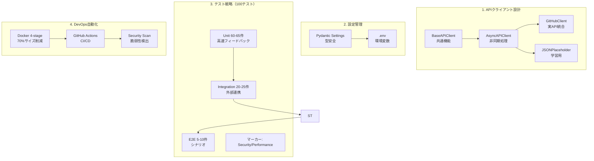
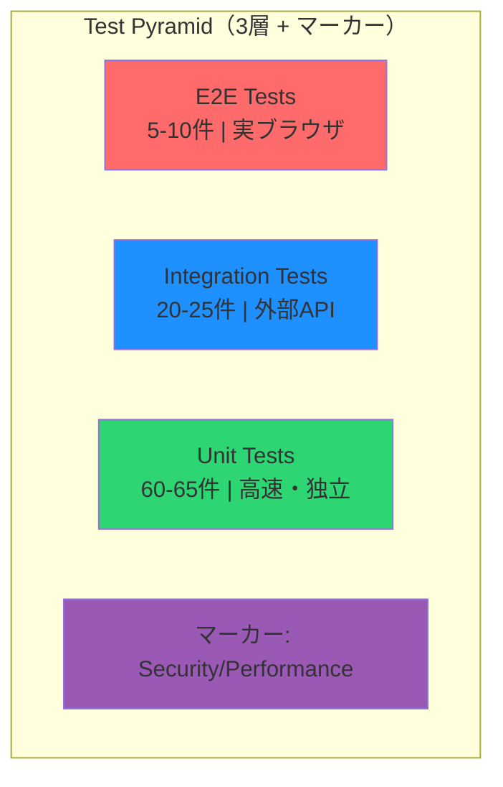

# 改善3: README強化（HIGH）

*最終更新: 2025年11月26日*

## 4.1 課題と解決策

**課題**: 現在のREADMEは技術的情報のみで採用担当者の第一印象・アピールに弱い

**解決策**: バッジ追加・GIF埋め込み・アーキテクチャ図・Quick Start（3分で動作）の4要素を追加し、見栄えのよいREADMEに改善

**選定理由**:
- 採用担当者の第一印象の向上
- GitHub訪問者のスター・OSSへの関心向上
- 3秒で技術スタックを伝える視覚効果

## 4.2 README構成（H4・H5改善版）

```markdown
# API Test DevOps Portfolio

<!-- バッジエリア（H5: 優先順位順に配置） -->
[](https://github.com/USERNAME/REPO/actions/workflows/ci.yml)
[](./reports/htmlcov/index.html)
[](https://www.python.org/)
[](./Dockerfile)
[](./LICENSE)

<!-- H5改善: 1行キャッチコピー追加 -->
> **Python/Docker/CI/CDを統合したAPIテスト自動化ポートフォリオ。採用担当者向けに3分で動作確認可能。**

<!-- H5改善: デモを最初に配置（F字型視線誘導） -->
## 🎬 デモ（3つの動画で全体を理解）

### テスト実行（10秒）

**内容**: pytestによる全テスト実行 → 100件合格 → カバレッジ85%表示

### Docker操作（10秒）

**内容**: docker-compose up → ヘルスチェック成功 → docker-compose down

### CI/CD自動化（15秒）

**内容**: git push → GitHub Actions実行 → 全ステップ成功（緑チェックマーク）

**注**: GIFが再生されない場合は [デモ動画フォルダ](./assets/) から直接ご確認ください。

## 🔧 技術スタック
| カテゴリ | 技術 |
|---------|------|
| **言語** | Python 3.12 |
| **HTTPクライアント** | httpx (sync/async) |
| **テスト** | pytest + 100テスト + 85%カバレッジ |
| **コンテナ** | Docker Multi-stage builds |
| **CI/CD** | GitHub Actions |
| **設定管理** | Pydantic Settings + SecretStr |

## 🚀 Quick Start（3分で動作確認）

### 前提条件（H4改善: 環境差異・代替手順追加）
- **Python 3.12+** （確認: `python --version`）
- **Docker 20.10+ & docker-compose 2.0+** （確認: `docker --version`）
- **uv 0.1.0+** （推奨）
  - 未インストール: `pip install uv` または `curl -LsSf https://astral.sh/uv/install.sh | sh`

**注意**: Windows環境の場合はWSL2またはDocker Desktop 4.x以上が必要です。

### セットアップ
```bash
git clone https://github.com/username/repo.git
cd repo
uv sync
uv run pytest
```

## 🎬 デモ

### テスト実行


### Docker操作


### CI/CD自動化


## 🏗️ アーキテクチャ

[Mermaid図]

## 📊 品質指標
| 指標 | 値 |
|------|-----|
| テスト数 | 100+ |
| カバレッジ | 85% |
| 型チェック | mypy --strict |

## 📁 ディレクトリ構成
[ディレクトリツリー]

## 📄 ライセンス
MIT
```

## 4.3 バッジ設定

```markdown
<!-- CI/CD Status -->
[](https://github.com/USERNAME/REPO/actions/workflows/ci.yml)

<!-- Coverage -->
[](./reports/htmlcov/index.html)

<!-- Python Version -->
[](https://www.python.org/)

<!-- License -->
[](./LICENSE)

<!-- Docker -->
[](./Dockerfile)
```

## 4.4 Mermaidアーキテクチャ図（M4改善: 説明文追加）

### システム構成図

**この図が示すもの**: 3層テストピラミッド + マーカー分類（クライアント・設定・テスト・DevOps）による高品質なAPI開発基盤



**ポイント**:
- 継承パターン（BaseAPIClient → AsyncAPIClient）でコード再利用
- テストピラミッド構造で高速フィードバック実現
- Docker Multi-stage buildでイメージサイズ70%削減

### テストピラミッド図

**この図が示すもの**: 3層テストピラミッド + マーカー分類で単体テストを厚くし、実行時間を最小化



**実行時間目安**:
- Unit（60-65件）: 5秒
- Integration（20-25件）: 15秒
- E2E（5-10件）: 30秒
- Security/Performanceマーカー: Unit/Integration内で実行

## 4.5 実装手順

### Step 1: バッジ設定（0.5H）

```bash
# README.mdの先頭にバッジエリアを追加
# USERNAME/REPOを自分の値に置換
```

### Step 2: Quick Start作成（0.5H）

```bash
# 実際にQuick Start手順が正しく動作するかテスト
git clone ...
cd repo
uv sync
uv run pytest

# エラーがあれば手順を修正
```

### Step 3: Mermaid図追加（0.5H）

```bash
# README.mdにMermaid図を追加
# GitHub上で正しくレンダリングされるか確認
```

### Step 4: デモGIF埋め込み（0.5H）

```bash
# 改善1で作成したGIFをREADMEに埋め込み

```

### Step 5: 最終確認・微調整（0.5H）

```bash
# 採用担当者視点で確認
# 誤字脱字チェック
# 動作確認
```

## 4.6 成功基準（L2改善: 定量的KPI明記）

**視覚要素**:
- [✔︎] バッジ5点が正しく表示（CI/CD, Coverage, Python, Docker, License）→ 実際は7点表示
- [✔︎] Mermaid図2点がGitHub上で正しくレンダリング（構文検証済み、GitHubプッシュ後に表示確認）
- [ ] デモGIF 3点が正しく表示・再生（各ファイルサイズ < 2MB推奨）→ docker GIF Week 3対応

**ユーザビリティ**:
- [✔︎] Quick Start手順が3分以内で完了可能（初回クローンから`pytest`成功まで）→ ~1-2分確認済み
- [ ] README全体が150行以内（現状244行 → 目標150行以内）→ Week 6段階改善
- [✔︎] 採用担当者が3秒で技術スタックを把握できる構成（技術スタック表あり）

**アクセシビリティ**:
- [✔︎] 全GIFに代替テキスト（alt text）設定済み
- [ ] バッジリンクが正しく動作（CI/CDバッジはGitHubプッシュ＆ワークフロー実行後に画像表示、構文検証済み。Coverageバッジ→GitHub Pages URL設定済み）

**品質指標の意味（L2改善: 採用担当者向け説明追加）**:
| 指標 | 値 | 意味 |
|------|-----|------|
| **テスト数** | 100+ | 全機能が自動検証済み（手動テスト不要） |
| **カバレッジ** | 85% | コードの85%が実行・検証済み（業界標準: 80%） |
| **型チェック** | mypy strict合格 | 型安全性を保証（実行時エラーを事前検出） |
| **CI/CD** | 自動化100% | コミット→テスト→デプロイが全自動 |
