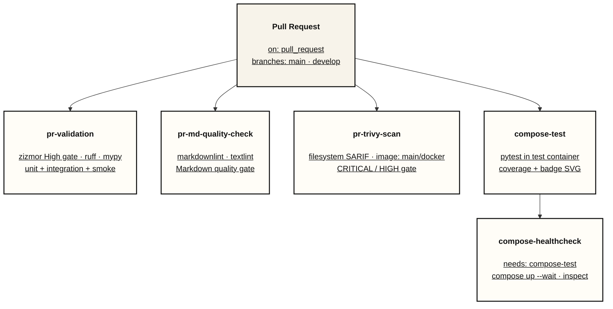
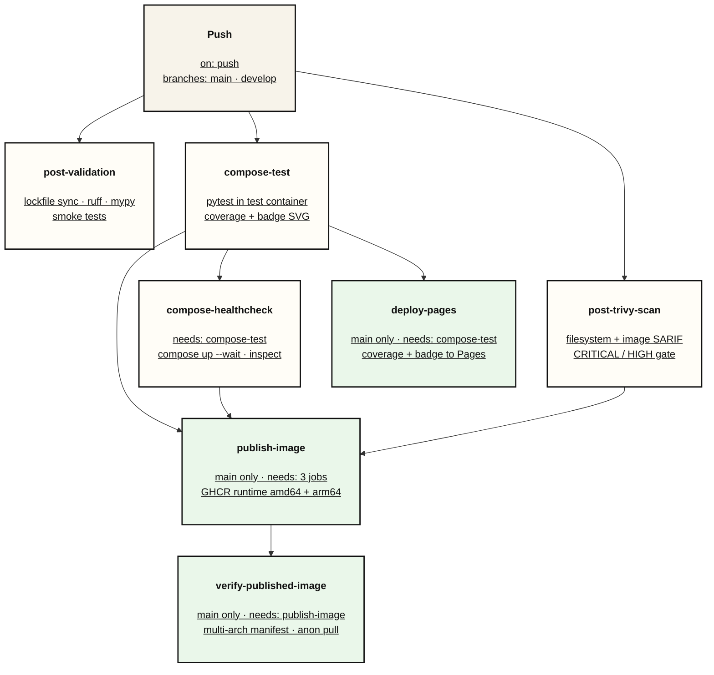
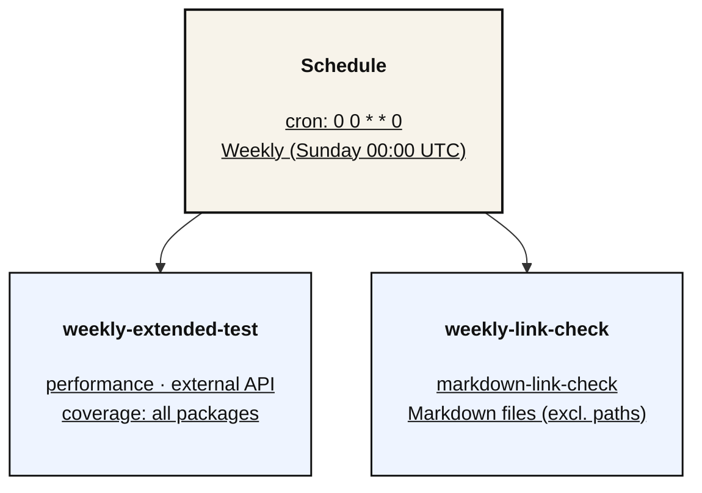

# CI/CD Pipeline

*最終更新: 2026-08-15*

## CI/CDパイプライン概要

> **Source of truth**: CI 設定の正確な依存は [.github/workflows/ci.yml](../../.github/workflows/ci.yml) が真実源。ただし Trivy ジョブの中身は reusable workflow [.github/workflows/trivy-scan.yml](../../.github/workflows/trivy-scan.yml) に切り出されているため、そちらが真実源になる。本書の図・表は派生表現であり、両ファイル変更時に追従すること。

### CI/CD パイプライン構成（トリガー別）

13 ジョブを 1 枚に収めるとトリガー分類と `needs` 依存が同一平面に混在し可読性が落ちるため、トリガー単位で 3 つの DAG に分割している。

#### 1. `pull_request`（main / develop 宛）



#### 2. `push`（main / develop）と Continuous Delivery



#### 3. `schedule`（Weekly）



**図の読み方**

- 矢印はジョブの起動順序を示す。トリガーノードから伸びる矢印は「そのトリガーで起動する」ことを表し、`needs` 依存ではない
- ノード内に `needs:` 表記があるジョブのみが `needs` を持つ。表記が無いジョブは `needs` を持たず、トリガー直後に並列起動する
- 縦位置は依存の深さを表すが、同一トリガーで起動するジョブは GitHub Actions により並列実行される。たとえば `post-trivy-scan` は `compose-test` の完了を待たず push 直後に起動する
- `compose-test` と `compose-healthcheck` は `pull_request` と `push` の両方をトリガーとするため、図 1 と図 2 の双方に登場する（同一ジョブ）
- 緑 = main への push 限定で実行される CD ジョブ、青 = `schedule` 限定ジョブ。配色は [README](../../README.md) のアーキテクチャ図と共通パレット
- 全ジョブ結果を集約する `status-report` は 3 図すべてに関わるため図からは省略した。実体は `needs: [12 ジョブ全て]` / `if: "!cancelled()"` / Timeout 5分

| Stage | トリガー | 実行内容 | Timeout |
|-------|---------|---------|---------|
| **pr-validation** | `pull_request` | lockfile 検証 + zizmor High ゲート + ruff + mypy + (Unit + Integration + Smoke) Tests | 20分 |
| **pr-md-quality-check** | `pull_request` | markdownlint + textlint | 5分 |
| **pr-trivy-scan** | `pull_request` | Trivy scan（Filesystem は常時）+ Docker Build と Image scan（main 宛 PR または `docker` ラベル時のみ） | 20分 |
| **compose-test** | `pull_request` / `push to develop/main` | Compose test profile（pytest + coverage）+ coverage badge 生成 | 15分 |
| **compose-healthcheck** | 同上（`needs: compose-test`） | `docker compose up --wait` + `docker inspect` によるヘルス確認 | 15分 |
| **post-validation** | `push to develop/main` | lockfile 検証 + ruff + mypy + Smoke Tests | 10分 |
| **post-trivy-scan** | `push to develop/main` | Trivy scan（Filesystem + Image）+ Docker Build | 20分 |
| **weekly-extended-test** | `schedule` (週次) | (Performance + External) Tests + 全パッケージ カバレッジ（計測対象は `--cov=.`。Performance / External は個別実行済みのため計測から除外） | 30分 |
| **weekly-link-check** | `schedule` (週次) | Markdown link check | 15分 |
| **status-report** | 全トリガー | パイプラインサマリー生成（`if: !cancelled()`） | 5分 |

CD 3ジョブ（`deploy-pages` / `publish-image` / `verify-published-image`）は main push 限定のため、後述の「CD（Continuous Delivery）」節の表を参照してください。同一トリガーで起動するジョブは GitHub Actions により並列実行され、直列関係はトリガー別 DAG の 3 図でノード内に `needs:` として明示されたものだけです。

---

## Trivy Security Scan（SARIF形式）

### SARIF形式採用理由

- **GitHub Security Tab統合**: 脆弱性をUI上で一元管理
- **標準化**: OASIS標準フォーマットで将来的な拡張性確保
- **CI/CD最適化**: JSON形式で機械可読性向上

### 共通化の2層構造

Trivy 関連の共通化は 2 つの粒度で行っています。

| 層 | 実体 | 共有される単位 |
|----|------|--------------|
| ジョブ全体 | Reusable workflow `.github/workflows/trivy-scan.yml` | Trivy ジョブの全ステップ（スキャン + 検証 + ゲート + Docker build） |
| ステップ内ロジック | Composite Action `.github/actions/trivy-sarif-verify` | SARIF の 3層検証ロジック |

**Reusable workflow（ジョブ全体の共通化）**:

`pr-trivy-scan` / `post-trivy-scan` は `steps` を持たず、`uses:` で `trivy-scan.yml` の `trivy-scan` ジョブを呼び出します。差分は `scan-prefix`（SARIF category の接頭辞）と `scan-image`（Image スキャン実施可否）の 2 入力のみです。

```yaml
# .github/workflows/ci.yml（呼び出し側）
pr-trivy-scan:
  name: PR Trivy scan
  if: github.event_name == 'pull_request'
  permissions:
    contents: read
    security-events: write
  uses: ./.github/workflows/trivy-scan.yml
  with:
    scan-prefix: pr
    scan-image: ${{ github.base_ref == 'main' || contains(github.event.pull_request.labels.*.name, 'docker') }}
```

> **branch protection 注意**: reusable workflow の check 名は `<呼び出し側ジョブ名> / <呼び出され側ジョブ名>` になります。本実装では `PR Trivy scan / Trivy scan` です。required status check には呼び出し側ジョブ名（`PR Trivy scan`）単体では登録できません。

**Composite Action（3層検証ロジックの共通化）**:

```yaml
# .github/workflows/trivy-scan.yml（呼び出され側）
- name: Verify filesystem scan execution
  id: verify-fs-scan
  if: "!cancelled()"
  uses: ./.github/actions/trivy-sarif-verify
  with:
    sarif-file: trivy-${{ inputs.scan-prefix }}-fs-scan.sarif
    scan-type: 'filesystem'
```

**Composite Action内部の3層検証**:

Composite action（`.github/actions/trivy-sarif-verify/action.yml`）内部では以下の3層検証を実施：

1. **Layer 1: ファイル存在チェック** - Trivyスキャン完全失敗を検出
2. **Layer 2: サイズチェック（≥100 bytes）** - 空ファイル/部分書き込みを検出
3. **Layer 3: JSON妥当性チェック** - 構文エラー/破損ファイルを検出

**検証レイヤー詳細**:

| Layer | 検証内容 | 検出可能なエラー | 実装 |
|-------|---------|----------------|------|
| 1 | ファイル存在 | Trivyスキャン完全失敗 | `[ -f *.sarif ]` |
| 2 | サイズ ≥100 bytes | 空ファイル、部分書き込み | `wc -c` + 閾値比較 |
| 3 | JSON妥当性 | 構文エラー、破損ファイル | `jq empty` |

### エラーハンドリング戦略

```yaml
# 概念説明用コード例（実装はaquasecurity/trivy-action@0.36.0 Actionをcommit SHAでpinして使用）
# Trivyスキャン本体
- name: Run Trivy filesystem scan (SARIF)
  id: fs-scan
  continue-on-error: true  # スキャン失敗時もパイプライン継続
  run: |
    trivy fs --format sarif --output trivy-pr-fs-scan.sarif .

# 検証ステップ（Composite Action使用）
- name: Verify filesystem scan execution
  id: verify-fs-scan
  if: "!cancelled()"  # スキャン成否に関わらず実行（キャンセル時は実行しない）
  uses: ./.github/actions/trivy-sarif-verify
  with:
    sarif-file: trivy-${{ inputs.scan-prefix }}-fs-scan.sarif
    scan-type: 'filesystem'

# アップロード（検証成功時のみ）
- name: Upload filesystem scan results to Security tab
  if: always() && steps.verify-fs-scan.outcome == 'success'
  uses: github/codeql-action/upload-sarif@v4
  with:
    sarif_file: trivy-${{ inputs.scan-prefix }}-fs-scan.sarif
    category: trivy-${{ inputs.scan-prefix }}-fs-scan

# 上記は Stage 1a（全 severity を SARIF 収集）のみの抜粋。
# CRITICAL / HIGH ゲートは後段の Stage 1b（exit-code: "1" の gate ステップ +
# 失敗を明示的にジョブ失敗へ昇格させるステップ）が担う。実装は trivy-scan.yml を参照。
```

**設計ポイント**:

1. **`continue-on-error: true`**: Stage 1a（SARIF 収集）ではスキャン結果に関わらずジョブを止めず、後続の検証・アップロードを必ず通す。脆弱性による合否判定は Stage 1b の CRITICAL / HIGH ゲートが担い、ゲート失敗時はジョブを失敗させる（fail-closed）
2. **`if: "!cancelled()"`**: スキャン失敗時も検証ステップを実行（失敗検出のため）。`always()` と異なりワークフローキャンセル時は実行しないため、キャンセルが即座に効く
3. **`steps.verify-fs-scan.outcome == 'success'`**: 検証成功時のみGitHub Security Tabにアップロード
4. **Composite Action活用**: reusable workflow 内の 2 箇所（filesystem / image）で同一ロジックを共有し、その reusable workflow を pr-trivy-scan / post-trivy-scan の両方が呼び出す
5. **Composite Actionを活用した厳格な品質ゲート**:Composite Actionを活用し、テスト成果物欠落時の即時エラー（Hard fail）と、CI/CD間の厳格な責務分離をカプセル化しました。
これにより、不完全なドキュメントの公開を構造的に防ぐ、妥協のない（Fail Fastな）パイプラインを実現しています。

---

## 品質ゲート設定

### CI実行テスト条件

```bash
# CI/CD実行テストセット（unit + integration, external除外）
# Note: performanceテスト(7件)は performance マーカーのみのため、この条件から自動除外
uv run pytest -n auto -m "(unit or integration) and not external" \
    --cov=utils --cov=config --cov=models --cov-report=term-missing
```

| 品質基準 | 目標値 | 検証コマンド |
|---------|-------|------------|
| カバレッジ | `pyproject.toml` の `--cov-fail-under` | 上記のCI実行コマンド（下限は addopts で自動適用） |
| ruff | 0 errors | `ruff check .` |
| mypy | 0 errors | `mypy utils/ config/ models/ tests/conftest.py` |
| セキュリティ | 0 Critical/High | Trivy SARIF |

### zizmor GitHub Actionsゲート

ローカル再現時は、CIのsource of truthである `.github/workflows/ci.yml` と同じく、先にdev依存をlockfileどおり同期します。

```bash
uv sync --dev --frozen
uv run --frozen --no-sync zizmor --version
uv run --frozen --no-sync zizmor --offline --no-config --strict-collection --persona=regular --min-severity=high --format=github .github/workflows .github/actions
```

`--offline` は監査中のネットワークアクセスを禁止し、`--no-config` はリポジトリ設定によるseverity remapを無効化します。<br/>`--strict-collection` は指定対象を厳格に収集し、`--min-severity=high` は High 以上の検出をゲートにします。<br/>zizmorにはGitHubトークンを渡しません。

### CD（Continuous Delivery）

main push時に以下3ジョブが実行され、Continuous Delivery（成果物の配信・検証）を完結します：

> **precise needs の参照先**: この CD 3ジョブの正確な `needs` 依存はこの表に集約（mermaid 図は同じ依存を矢印で可視化）。<br/>`status-report` / `compose-healthcheck` を含む全ジョブの依存は真実源 [ci.yml](../../.github/workflows/ci.yml) を参照。本表はその派生。

| ジョブ | 概要 | needs 依存関係 |
|--------|------|----------------|
| `deploy-pages` | GitHub Pages へカバレッジレポート公開 | `compose-test` |
| `publish-image` | GHCR へランタイムイメージ publish (`push: true`) | `compose-test` + `compose-healthcheck` + `post-trivy-scan` |
| `verify-published-image` | 公開済みイメージを `docker pull` / `docker run` で検証 | `publish-image` |

**補足**:
- `compose-healthcheck` は `compose-test` のみに依存
- `post-trivy-scan` は main/develop push で他ジョブと並列に起動するが、`publish-image` の `needs` に含まれる（= CVE スキャン成功を GHCR publish のゲートとして機能させている）
- 稼働環境への実デプロイ（Continuous Deployment: Cloud Run / ECS / K8s 等）は未実装

#### multi-arch 検証（`verify-published-image`）

`publish-image` は runtime を **linux/amd64 + linux/arm64** の manifest list として GHCR に公開します。<br/>`verify-published-image` は「公開したが未検証」を排除するため、`GITHUB_TOKEN` を使わない匿名 public pull（利用者と同じ取得経路）で以下を検証します：

| 検証 | 手段 | 目的 |
|------|------|------|
| manifest list 構造 | `docker buildx imagetools inspect --raw` + `jq` で `linux/amd64` `linux/arm64` 両方の存在を確認 | 単一の緑バッジが部分ビルドを隠す anti-pattern を防止（片 arch 欠落は fail-loud） |
| amd64 実行 | `docker run --platform linux/amd64` で config ロードを smoke 実行 | 公開イメージが実際に起動可能かを検証 |
| arm64 実行 | QEMU エミュレーションで `docker run --platform linux/arm64` し `platform.machine() == aarch64` を assert | manifest が arm64 を主張しつつ中身が amd64 という「嘘の manifest」を排除 |

publish 直後の GHCR 伝播遅延（一過性の 404/429/5xx）に対し、最初の manifest 参照のみ指数 backoff + jitter で再試行し、伝播遅延と実体不具合を分離します。

> multi-arch を **なぜ** publish するか（Apple Silicon 等 arm64 ホストでのネイティブ pull/run）等の配布観点は [Docker Multi-Stage Runtime Strategy](docker.md) を参照。

---

## ブランチ戦略（Git Flow）

| ブランチ | 用途 | CI実行（PR = PR 起票時 / push = 当ブランチへの push 時） | マージ先 |
|---------|------|--------|---------|
| `feature/*` | 新機能開発 | PR: pr-validation + pr-md-quality-check + pr-trivy-scan + compose-test → compose-healthcheck（push トリガーなし） | `develop` |
| `develop` | 統合ブランチ | PR: 同上 / push: post-validation + post-trivy-scan + compose-test → compose-healthcheck | `main` |
| `main` | 本番環境 | PR: 同上 / push: post-validation + post-trivy-scan + compose-test → compose-healthcheck + CD 3ジョブ | - |
| `hotfix/*` | 緊急修正 | PR: 同上（`main` / `develop` 双方へ起票） | `main` + `develop` |

**マージ戦略**:

- `feature/* → develop`: Squash Merge
- `develop → main`: Regular Merge（履歴保持）
- `hotfix/* → main`: Regular Merge

---

## Troubleshooting

### Trivy SARIF検証失敗時

**症状**: `verify-fs-scan`または`verify-image-scan`ステップが失敗

**原因と対策**:

| エラーメッセージ | 原因 | 対策 |
|---------------|------|------|
| `SARIF file not found` | Trivyスキャン完全失敗 | Trivy実行ログ確認、依存関係チェック |
| `SARIF file too small` | 空ファイル/部分書き込み | ディスク空き容量確認、Trivy timeout設定 |
| `not valid JSON` | JSON構文エラー | Trivyバージョン確認、手動実行で再現 |

**デバッグコマンド**:

```bash
# ローカル再現（CI 上のファイル名は trivy-<scan-prefix>-fs-scan.sarif。
# scan-prefix は pr-trivy-scan なら pr、post-trivy-scan なら post）
trivy fs --format sarif --output trivy-pr-fs-scan.sarif .

# SARIF検証
jq . trivy-pr-fs-scan.sarif | head -20

# ファイルサイズ確認
ls -lh trivy-pr-fs-scan.sarif
```

### Composite Action使用時の注意事項

本プロジェクトでは、SARIF検証ロジックをComposite Action（`.github/actions/trivy-sarif-verify/action.yml`）として実装しています。

**Composite Action内部の特徴**:

1. **厳格なエラー処理**: `set -euo pipefail`による即座の失敗検出
   - コマンド失敗時は即座にスクリプト終了
   - 未定義変数参照時にエラー
   - パイプライン内の失敗を検出

2. **環境変数経由のパラメータ渡し**:
   - `SARIF_FILE`: SARIFファイルパス
   - `SCAN_TYPE`: スキャンタイプ（filesystem/image）
   - Script Injection防止のためのセキュリティ設計

3. **3層検証の詳細実装**:
   - Layer 1: `[ ! -f "$SARIF_FILE" ]` - ファイル存在確認
   - Layer 2: `wc -c < "$SARIF_FILE"` - サイズ確認（≥100 bytes）
   - Layer 3: `jq empty "$SARIF_FILE"` - JSON妥当性確認

**ローカルデバッグとの差異**:
- ローカルでは`set -euo pipefail`なしで実行可能
- Composite actionではより厳格なエラー検出が行われる
- デバッグ時は上記のデバッグコマンドで基本動作を確認後、CI/CDログで詳細を確認

### Image Scan Skip問題

**症状**: `verify-image-scan`が誤って実行される（docker-build失敗時）

**修正前**（Bug CRITICAL-2）:

```yaml
- name: Verify image scan execution
  if: always() && github.base_ref == 'main'  # docker-build失敗を無視❌
```

**修正後**:

```yaml
- name: Verify image scan execution
  if: always() && steps.image-scan.outcome != 'skipped'  # skip状態を正しく検出✅
```

### Status Report依存関係不足

**症状**: `status-report`ジョブが`pr-trivy-scan`/`pr-md-quality-check`結果を含まない

**修正前**（Bug CRITICAL-3）:

```yaml
status-report:
  needs: [pr-validation, ...]  # pr-trivy-scan/pr-md-quality-check未指定❌
```

**修正後**:

```yaml
status-report:
  needs: [pr-validation, pr-trivy-scan, pr-md-quality-check, ...]  # 追加✅
  run: |
    echo "- PR Trivy Scan: ${{ needs.pr-trivy-scan.result || 'skipped' }}"
    echo "- PR MD Quality Check: ${{ needs.pr-md-quality-check.result || 'skipped' }}"
```

---

## 監視・アラート

### GitHub Actions Insights

**確認項目**:

- Workflow実行時間トレンド（目標: PR 10分以内）
- 失敗率（目標: <5%）
- Trivyスキャン検出脆弱性件数

**アクセス**: Repository → Insights → Actions
