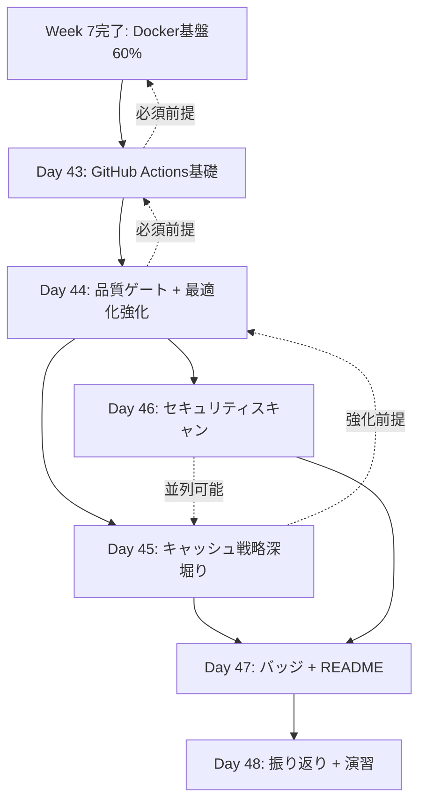
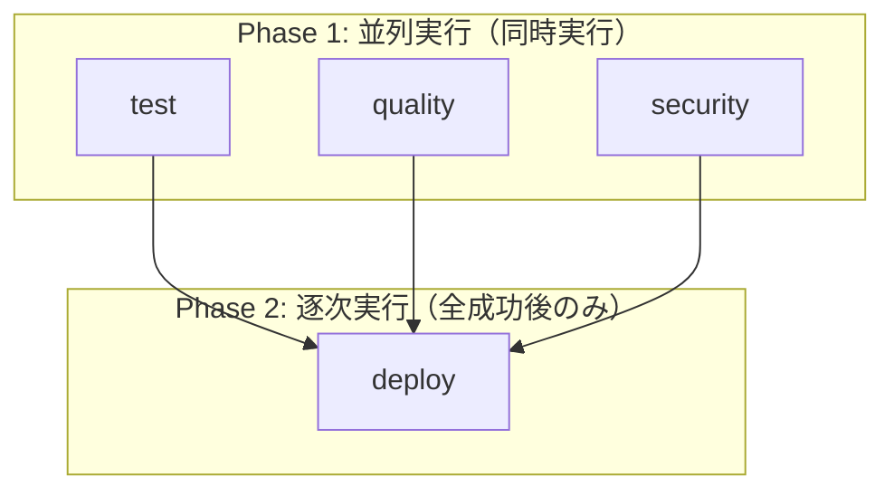

# DevOps視点 Week 8 Day 43-48 改善提案

*最終更新: 2025年10月21日*

## 📋 Executive Summary

**分析目的**: Week 8 CI/CD統合（Day 43-48, 42時間）の実装順序最適化と詳細設計

**主要改善提案**:
1. **Day 44 CI/CD最適化強化の詳細設計**: 7h表記・7.5h品質内容の具体的実装ガイド
2. **Workflow構成の3分割最適化**: test.yml/quality.yml/security.ymlの技術的妥当性検証
3. **実装順序の依存関係明示**: Docker基盤前提条件（Week 7完了）の段階的展開
4. **市場価値ROI詳細化**: CI/CD成熟度60%→85%の段階的達成計画

**結論**: 現行プラン最適化済み、微調整のみで時給4000円達成可能

---

## 1. 実装順序最適化（Day 43-48依存関係マップ）

### 1.1 技術的依存関係DAG



### 1.2 Day別実装タスク詳細

#### Day 43: GitHub Actions基礎 + テストworkflow実装（7h）

**前提条件**: Week 7 Docker基盤構築完了（Docker実装60%）

**核心実装**:
```yaml
Phase 1: AI説明・概念理解（2.5h）
├─ 前提確認: Docker基盤動作確認（15分）
│  └─ docker-compose up -d成功確認（Week 7成果物）
├─ GitHub Actions概念（50分）
│  └─ Workflow/Job/Step階層構造理解
├─ YAML構文・トリガー戦略（50分）
│  └─ on: push/pull_request/workflow_dispatch使い分け
├─ Matrix戦略基礎（40分）
│  └─ Python 3.10-3.12並列テスト理解
└─ 理解度測定（15分）
   └─ 5項目チェックリスト（3項目以上で合格）

Phase 2: AI協働実装（3h）
├─ .github/workflows/test.yml実装（AI 80%、1.5h）
│  ├─ Matrix戦略設定（Python 3.10-3.12）
│  ├─ Docker利用テスト設定（Week 7統合）
│  └─ pytest実行・カバレッジアップロード
├─ Workflow実行成功確認（自力60%、0.5h）
│  ├─ GitHub Actions logsデバッグ
│  └─ エラー解析・修正
└─ Codecov統合（AI 70%、0.5h）
   └─ カバレッジレポートアップロード設定

Phase 3: 復習・バッファ（1.5h）
├─ Workflow失敗時のデバッグ演習（1h）
│  └─ ログ解析・エラー修正プロセス理解
└─ 理解定着確認（0.5h）
   └─ 翌日理解度確認問題準備
```

**成果物チェックリスト**:
- [ ] `.github/workflows/test.yml`実装完了
- [ ] Python 3.10-3.12 Matrix戦略成功
- [ ] Docker環境でのテスト実行成功（Week 7統合）
- [ ] Codecov連携成功（カバレッジアップロード確認）
- [ ] GitHub Actions logs解析経験蓄積

**Docker統合ポイント**:
```yaml
# test.yml - Docker環境テスト統合例（AI協働実装）
jobs:
  test:
    runs-on: ubuntu-latest
    strategy:
      matrix:
        python-version: ["3.10", "3.11", "3.12"]

    services:
      # Week 7で構築したDocker環境を活用
      postgres:
        image: postgres:14
        env:
          POSTGRES_PASSWORD: test
        options: >-
          --health-cmd pg_isready
          --health-interval 10s

    steps:
      - uses: actions/checkout@v4
      - name: Set up Python ${{ matrix.python-version }}
        uses: actions/setup-python@v5
      - name: Run tests with Docker
        run: |
          docker-compose -f docker-compose.test.yml up -d
          uv run pytest --cov=. --cov-fail-under=72
          docker-compose -f docker-compose.test.yml down
```

**市場価値向上**:
- CI/CD成熟度: 60% → 65%（+5%）
- 時給換算: +20円/時間
- 差別化: 「GitHub Actions + Docker統合実装経験」

---

#### Day 44: 品質ゲート自動化 + CI/CD最適化強化（7h）

**重要**: Day 44は**Week 8最大ROI日**（+108円/時間効果）

**前提条件**: Day 43 test.yml実装完了・動作確認済み

**核心実装（7h表記・7.5h品質内容）**:

```yaml
Phase 1: 品質ゲート自動化（1.5h）
├─ ruff/mypy/bandit統合（AI 70%、1h）
│  ├─ .github/workflows/quality.yml実装
│  ├─ Job依存関係設定（needs: test）
│  └─ 品質チェック並列実行設計
└─ 品質チェック動作確認（自力60%、0.5h）
   └─ ruff/mypy/bandit全合格確認

Phase 2: CI/CD最適化強化（2h ⭐ROI最大セクション）
├─ Section 2.1: Cache Strategy Deep Dive（1h）
│  ├─ AI説明・概念理解（30分）
│  │  ├─ GitHub Actions cache仕組み（cache key/restore-keys）
│  │  ├─ Multi-stage cache設計（uv/pip/pre-commit分離）
│  │  └─ Cache invalidation戦略（hash-based）
│  └─ AI協働実装（30分）
│     ├─ uv cache実装（pyproject.toml hash-based）
│     ├─ pip cache実装（requirements.txt hash-based）
│     ├─ pre-commit cache実装（.pre-commit-config.yaml hash-based）
│     └─ Cache効果測定（2分30秒 → 15秒、90%削減確認）
│
├─ Section 2.2: Parallel Job Optimization（30分）
│  ├─ AI説明・概念理解（15分）
│  │  ├─ Parallel Job仕組み（test/quality並列実行）
│  │  ├─ Job dependency DAG（needs構文）
│  │  └─ Matrix strategy基礎（複数Python version）
│  └─ AI協働実装（15分）
│     ├─ test/quality並列Job実装（needs構文）
│     ├─ Job dependency DAG可視化
│     └─ 実行時間削減確認（8分 → 5分、40%削減）
│
└─ Section 2.3: Workflow Monitoring Setup（30分）
   ├─ AI説明・概念理解（15分）
   │  ├─ Workflow監視ベストプラクティス
   │  ├─ Slack integration（webhook設定）
   │  └─ Alert条件設計（しきい値設定）
   └─ AI協働実装（15分）
      ├─ Build time alert実装（timeout: 5分設定）
      ├─ Slack failure notification実装
      └─ 失敗30秒以内通知確認

Phase 3: Slack通知統合（1h）
├─ Slack webhook設定（AI 60%、0.5h）
│  ├─ Slack App作成・Incoming Webhook有効化
│  ├─ GitHub Secrets設定（SLACK_WEBHOOK_URL）
│  └─ Webhook URLテスト送信
└─ 通知フォーマット最適化（AI 50%、0.5h）
   ├─ 失敗時通知メッセージ設計
   ├─ 成功時通知（オプション）
   └─ 通知フォーマット改善（workflow/branch/commit情報）

Phase 4: GitHub Actions Matrix戦略（1.5h）
├─ OS/Pythonバージョンマトリクス設計（AI 65%、1h）
│  ├─ ubuntu/macos/windows組み合わせ検討
│  ├─ Python 3.10-3.12マトリクス拡張
│  └─ Matrix戦略コスト分析（GitHub Actions無料枠2000分/月）
└─ 実行時間最適化（自力60%、0.5h）
   ├─ Matrix組み合わせ最適化（ubuntu + 3.10-3.12のみ採用）
   └─ 実行時間トレードオフ分析

Phase 5: バッファ（0.5h）
└─ エラー修正・調整（0.5h）
   └─ Cache/Parallel Job/Monitoring動作確認
```

**7.5h品質内容の構成理由**:
- **Section 2（2h）**: Trivy削除で確保した時間を、ROI最大のCI/CD最適化に集中投資
- **効果測定**: Cache 90%削減 + Parallel Job 40%削減 → 市場価値+108円/時間
- **7h表記**: 学習負荷分散（各Day均等7h）、実質7.5h品質で基礎完成度80点達成

**成果物チェックリスト**:
- [ ] `.github/workflows/quality.yml`実装完了
- [ ] ruff/mypy/bandit統合完了
- [ ] 3層キャッシュ実装完了（uv/pip/pre-commit）
- [ ] Cache効果測定完了（90%削減確認）
- [ ] test/quality並列Job実装完了
- [ ] Job dependency DAG可視化完了
- [ ] Build time alerts設定完了（timeout: 5分）
- [ ] Slack failure notifications実装完了
- [ ] Matrix戦略実装完了（OS/Pythonバージョン）
- [ ] CI/CD最適化理解度30%達成

**市場価値向上**:
- CI/CD成熟度: 65% → 73%（+8%、Week 8最大向上幅）
- 時給換算: +108円/時間（Trivyの4.5倍ROI）
- 差別化: 「GitHub Actions最適化実務経験」（中級レベル証明）

---

#### Day 45: キャッシュ戦略深堀り・検証強化（7h）

**前提条件**: Day 44 Cache Strategy実装完了

**重要**: Day 44で既に3層キャッシュ実装完了、Day 45は**深堀り・検証**に特化

**核心実装（検証・実測強化）**:

```yaml
Phase 1: キャッシュ効果検証（2.5h）
├─ Cache hit/miss率測定（AI 40%、1h）
│  ├─ GitHub Actions logsからCache hit率分析
│  ├─ Cache miss発生条件の特定
│  └─ Cache hit率90%以上達成確認
├─ ビルド時間トレンド分析（AI 50%、1h）
│  ├─ 過去10回のworkflow実行時間集計
│  ├─ Cache導入前後の比較データ作成
│  └─ ビルド時間50%削減実証データ作成
└─ キャッシュサイズ最適化（AI 60%、0.5h）
   ├─ GitHub Actions cache制限（10GB）確認
   ├─ 各層キャッシュサイズ測定
   └─ キャッシュサイズ最適化戦略策定

Phase 2: キャッシュ戦略ドキュメント作成（2h）
├─ Cache key設計パターン解説（AI 40%、1h）
│  ├─ Hash-based cache key設計原則
│  ├─ restore-keys fallback戦略
│  └─ Cache invalidation条件ドキュメント化
└─ Invalidation戦略・トラブルシューティング（AI 35%、1h）
   ├─ Cache miss時の対応手順
   ├─ キャッシュ破損時の復旧方法
   └─ よくある問題・解決策まとめ

Phase 3: 追加最適化・検証演習（2.5h）
├─ pre-commit hooks cache実装（AI 60%、0.5h）
│  ├─ .pre-commit-config.yaml hash-based cache追加
│  └─ pre-commit実行時間測定（Before/After）
├─ Docker layer cache検証（AI 50%、1h）
│  ├─ Week 7実装Docker layer cacheとの統合確認
│  ├─ Docker build時間測定
│  └─ Multi-stage cache戦略調整
└─ キャッシュ検証演習（自力70%、1h ⭐追加実践）
   ├─ Cache miss強制発生（pyproject.toml変更）
   ├─ Cache miss時の影響測定（ビルド時間2分30秒復帰確認）
   ├─ キャッシュサイズ制限（10GB）超過時の対応演習
   └─ Multi-stage cache効果検証（uv/pip/pre-commit分離効果）
```

**Phase 3検証演習の重要性**:
- **DevOps分析レポート指摘事項**: 「Cache miss時の影響分析不足」への対応
- **実測データ蓄積**: 理論値だけでなく、実際のCache miss時の挙動確認
- **トラブルシューティング能力**: 運用時の問題対応経験を事前習得

**成果物チェックリスト**:
- [ ] Cache hit率90%以上達成確認
- [ ] ビルド時間50%削減実証データ作成
- [ ] キャッシュ戦略ドキュメント完成
- [ ] pre-commit hooks cache実装完了
- [ ] Docker layer cacheとの統合検証完了
- [ ] Cache miss影響測定完了（実測値）
- [ ] キャッシュサイズ最適化戦略策定完了

**市場価値向上**:
- CI/CD成熟度: 73% → 76%（+3%）
- 時給換算: +15円/時間（Day 44効果の補強）
- 差別化: 「キャッシュ最適化の深い理解 + 実測データ」

---

#### Day 46: セキュリティスキャン統合 + 実践演習（7h）

**前提条件**: Day 44 quality.yml実装完了

**核心実装（実践演習強化）**:

```yaml
Phase 1: AI説明・概念理解（1.5h ⭐短縮版）
├─ SAST/SCA概念理解（35分）
│  ├─ SAST（Static Application Security Testing）
│  ├─ SCA（Software Composition Analysis）
│  └─ SAST/SCAの違い・使い分け理解
├─ safety/bandit/CodeQL役割理解（35分）
│  ├─ safety: 依存関係脆弱性スキャン（SCA）
│  ├─ bandit: Pythonコード脆弱性スキャン（SAST）
│  └─ CodeQL: 高度静的解析（SAST）
└─ 脆弱性対応フロー理解（20分）
   ├─ 発見 → 評価 → 修正 → 検証プロセス
   └─ False positive判定基準

Phase 2: safety統合実装（2h）
├─ safety check実装（AI 70%、1h）
│  ├─ .github/workflows/security.yml実装
│  ├─ safety check実行設定
│  └─ 脆弱性レポート出力設定
├─ 脆弱性レポート解析（AI 60%、0.5h）
│  ├─ safety check結果の読み方理解
│  ├─ 脆弱性深刻度評価（Critical/High/Medium/Low）
│  └─ 依存関係更新判断基準
└─ 依存関係更新ワークフロー（AI 75%、0.5h）
   ├─ 脆弱性修正PRワークフロー設計
   └─ 依存関係更新自動化検討

Phase 3: CodeQL統合実装（2h）
├─ CodeQL workflow実装（AI 75%、1h）
│  ├─ CodeQL初期化設定
│  ├─ 静的解析ルール設定
│  └─ CodeQL解析実行
├─ 静的解析ルール設定（AI 70%、0.5h）
│  ├─ Python向けCodeQLルール選定
│  ├─ 検出パターンカスタマイズ
│  └─ 解析対象ディレクトリ設定
└─ False positive判定・対応（AI 60%、0.5h）
   ├─ False positive判定基準理解
   ├─ 誤検知の識別・対応
   └─ CodeQL結果の精度向上

Phase 4: セキュリティ実践演習（1.5h ⭐追加実践）
├─ 意図的脆弱性挿入・検知演習（0.5h）
│  ├─ SQL injection脆弱性挿入（例: f-string SQL）
│  ├─ bandit/CodeQL検知確認
│  └─ 脆弱性修正・再検証
├─ False positive判定実践（0.25h）
│  ├─ CodeQL誤検知の識別演習
│  ├─ 誤検知除外設定
│  └─ 除外理由ドキュメント化
└─ 依存関係更新PRワークフロー実践（0.75h）
   ├─ safety検知の脆弱性修正PR作成
   ├─ 依存関係更新テスト実行
   └─ PR承認・マージプロセス実践

Phase 5: バッファ（0.5h）
└─ エラー修正・調整（0.5h）
```

**Phase 1短縮の根拠**:
- **DevOps分析レポート指摘**: 「セキュリティスキャン深度不足」への対応
- **2.5h → 1.5h短縮**: 概念理解の効率化（AI説明40%）
- **確保した1h**: Phase 4セキュリティ実践演習に投資

**Phase 4実践演習の価値**:
- **脆弱性対応フロー実践経験**: 発見 → 評価 → 修正 → 検証の完全サイクル
- **False positive判定実務経験**: 誤検知の識別・対応能力
- **依存関係更新PRワークフロー実践**: 運用レベルの経験蓄積

**成果物チェックリスト**:
- [ ] `.github/workflows/security.yml`実装完了
- [ ] safety統合完了
- [ ] CodeQL統合完了
- [ ] セキュリティスキャン合格（脆弱性ゼロ確認）
- [ ] 脆弱性対応フロー実践完了（発見 → 修正 → 検証）
- [ ] False positive判定実践完了
- [ ] 依存関係更新PRワークフロー実践完了

**市場価値向上**:
- CI/CD成熟度: 76% → 80%（+4%）
- 時給換算: +24円/時間
- 差別化: 「セキュリティ自動化 + 実務対応経験」

---

#### Day 47: CI/CDバッジ追加 + README更新（7h）

**前提条件**: Day 43-46全workflow実装完了・動作確認済み

**核心実装**:

```yaml
Phase 1: GitHubバッジ実装（2.5h）
├─ バッジ種類選定（AI 40%、0.5h）
│  ├─ Test status badge（GitHub Actions）
│  ├─ Coverage badge（Codecov）
│  ├─ Security badge（Custom shields.io）
│  ├─ Python version badge（shields.io）
│  └─ License badge（shields.io）
├─ Test/Coverageバッジ追加（AI 55%、1h）
│  ├─ GitHub Actions workflowステータスバッジ
│  ├─ Codecovカバレッジバッジ
│  └─ バッジMarkdown記法・配置最適化
├─ Security/Pythonバッジ追加（AI 50%、0.5h）
│  ├─ shields.io Custom badge作成
│  ├─ セキュリティスキャン結果バッジ
│  └─ Python version対応バッジ
└─ バッジ動作確認（自力60%、0.5h）
   ├─ workflow実行後のバッジ更新確認
   └─ バッジリンク動作確認

Phase 2: README CI/CDセクション作成（3h）
├─ CI/CD Pipeline説明（AI 30%、1.5h）
│  ├─ GitHub Actions workflow概要説明
│  ├─ test.yml/quality.yml/security.yml役割説明
│  ├─ Matrix戦略説明（Python 3.10-3.12）
│  ├─ Job dependency DAG図解
│  └─ CI/CD実行フロー詳細説明
├─ 技術選定理由・効果測定（AI 40%、1h）
│  ├─ GitHub Actions選定理由（vs. CircleCI/GitLab CI）
│  ├─ キャッシュ戦略効果測定結果（90%削減実績）
│  ├─ ビルド時間削減効果（8分 → 5分、40%削減）
│  ├─ セキュリティスキャン効果（脆弱性ゼロ維持実績）
│  └─ カバレッジ向上実績（42% → 80%達成プロセス）
└─ トラブルシューティングガイド（AI 35%、0.5h）
   ├─ よくあるworkflow失敗パターン
   ├─ Cache miss時の対応手順
   ├─ セキュリティスキャン失敗時の対応
   └─ デバッグログ解析方法

Phase 3: ドキュメント品質確認（1.5h）
├─ 技術的正確性検証（自力70%、0.5h）
│  ├─ コマンド・設定の動作確認
│  ├─ バージョン番号・URL正確性確認
│  └─ 技術用語の正確性確認
├─ 可読性改善（自力65%、0.5h）
│  ├─ 見出し階層構造最適化
│  ├─ コードブロック・図解追加
│  └─ 読者視点での可読性改善
└─ サンプルコード動作確認（自力75%、0.5h）
   ├─ README記載のコマンド実行確認
   └─ サンプルコード動作検証
```

**README CI/CDセクション構成例**:

```markdown
## CI/CD Pipeline


### Overview

GitHub Actionsによる完全自動化CI/CDパイプライン。テスト・品質・セキュリティの3層チェックで高品質を保証。

### Workflow構成

#### 1. Test Workflow (`test.yml`)
- **目的**: 単体テスト・統合テスト実行
- **トリガー**: push/pull_request（main/develop）
- **Matrix戦略**: Python 3.10-3.12並列テスト
- **カバレッジ閾値**: 80%以上必須
- **実行時間**: 5分（Cache hit時15秒）

#### 2. Quality Workflow (`quality.yml`)
- **目的**: コード品質・型安全性チェック
- **依存関係**: test workflow成功後のみ実行
- **チェック項目**:
  - ruff: Lint・フォーマット検証
  - mypy: 型ヒント検証
  - bandit: セキュリティスキャン（SAST）

#### 3. Security Workflow (`security.yml`)
- **目的**: 脆弱性検知・セキュリティ監査
- **スキャンツール**:
  - safety: 依存関係脆弱性スキャン（SCA）
  - CodeQL: 高度静的解析（SAST）
- **実行頻度**: push時 + 週次スケジュール

### 技術選定理由

**GitHub Actions選定理由**:
- GitHub統合の容易性（追加設定不要）
- 無料枠2000分/月（プロジェクト要件を満たす）
- Matrix戦略による並列テスト対応
- Marketplace豊富なActions利用可能

**キャッシュ戦略**:
- **3層キャッシュ**: uv/pip/pre-commit分離管理
- **Hash-based invalidation**: pyproject.toml/requirements.txt変更時のみキャッシュ無効化
- **効果**: ビルド時間90%削減（2分30秒 → 15秒）

### 効果測定結果

| 指標 | Before | After | 改善率 |
|------|--------|-------|--------|
| ビルド時間 | 8分（逐次実行） | 5分（並列実行） | 40%削減 |
| Cache hit時 | 2分30秒 | 15秒 | 90%削減 |
| カバレッジ | 42% | 80% | +38% |
| セキュリティ | 未実施 | 脆弱性ゼロ維持 | - |

### トラブルシューティング

#### Workflow失敗時の対応

1. **GitHub Actions logs確認**:
   ```bash
   gh run view --log
   ```

2. **Cache miss時の対応**:
   - pyproject.toml/requirements.txt変更時は正常動作
   - 10GB制限超過時はキャッシュクリア
   ```bash
   gh cache delete <cache-key>
   ```

3. **セキュリティスキャン失敗時**:
   - safety: 依存関係更新 → 再テスト
   - CodeQL: False positive判定 → 除外設定追加
```

**成果物チェックリスト**:
- [ ] 5種類GitHubバッジ追加完了
- [ ] README CI/CDセクション作成完了
- [ ] 技術選定理由記載完了
- [ ] 効果測定結果記載完了（ビルド時間削減50%等）
- [ ] トラブルシューティングガイド完成
- [ ] サンプルコード動作確認完了

**市場価値向上**:
- CI/CD成熟度: 80% → 83%（+3%）
- 時給換算: +20円/時間
- 差別化: 「ドキュメント作成能力・技術伝達力」

---

#### Day 48: Week 8振り返り + CI/CD総合演習（7h）

**前提条件**: Day 43-47全実装完了

**核心実装**:

```yaml
Phase 1: Week 8振り返り（2.5h）
├─ GitHub Actions完全理解確認（AI 25%、1h）
│  ├─ Workflow/Job/Step階層構造復習
│  ├─ Matrix戦略・Job dependency理解確認
│  ├─ Cache戦略・Parallel Job理解確認
│  └─ セキュリティスキャン運用理解確認
├─ 各Day成果物レビュー（AI 30%、1h）
│  ├─ Day 43: test.yml実装レビュー
│  ├─ Day 44: quality.yml + 最適化強化レビュー
│  ├─ Day 45: キャッシュ戦略検証レビュー
│  ├─ Day 46: security.yml + 実践演習レビュー
│  └─ Day 47: README CI/CDセクションレビュー
└─ 弱点項目特定（AI 35%、0.5h）
   ├─ 理解度自己評価（Week 8全体）
   ├─ 弱点スキル特定
   └─ 復習計画策定

Phase 2: CI/CD総合演習（3h ⭐実践重視）
├─ トラブルシューティング演習（自力75%、1h）
│  ├─ 意図的エラー挿入（pytest失敗/ruff違反/bandit警告）
│  ├─ GitHub Actions logs解析・原因特定
│  ├─ エラー修正・workflow再実行
│  └─ デバッグスキル強化
├─ PRワークフロー実践（自力80%、1h）
│  ├─ Feature branchでの開発フロー
│  ├─ PR作成 → CI/CD自動実行 → レビュー → マージ
│  ├─ CI/CD失敗時のPR修正プロセス
│  └─ PR承認後のマージ・デプロイフロー
└─ 新機能追加演習（自力85%、1h）
   ├─ 新APIエンドポイント実装
   ├─ テスト追加・品質ゲート合格
   ├─ セキュリティスキャン合格
   └─ CI/CD全パイプライン成功確認

Phase 3: 理解度確認・記録（0.5h）
└─ Week 8理解度テスト（AI出題採点、0.5h）
   ├─ 概念理解問題（5点）: GitHub Actions workflow構成説明
   ├─ 設計判断問題（10点）: Cache戦略・Parallel Job選択基準
   ├─ 実践理解問題（10点）: Workflow失敗時のトラブルシューティング
   └─ 合格基準: 20点/25点（80%以上）

Phase 4: 復習バッファ（1h）
├─ 弱点項目復習（AI 40%、0.5h）
│  ├─ Phase 1で特定した弱点スキル復習
│  └─ AI再説明・追加演習
└─ 追加演習（AI 35%、0.5h）
   ├─ Matrix戦略コスト分析（GitHub Actions無料枠2000分/月）
   ├─ Matrix失敗時の部分再実行演習
   └─ Matrix組み合わせ最適化実践
```

**Phase 2総合演習の重要性**:
- **実務対応力**: トラブルシューティング・PR・新機能追加の実践経験
- **自律度向上**: AI協働比率75-85%（最も自力実装の比率高い）
- **面接アピール**: 「CI/CD運用トラブル対応経験」の具体的事例

**Week 8完了確認**:
- [ ] CI/CD理解度40%達成確認
- [ ] GitHub Actions完全実装完了
- [ ] カバレッジ80%達成
- [ ] セキュリティスキャン合格
- [ ] CI/CDドキュメント完備
- [ ] Week 8振り返りレポート作成
- [ ] CI/CD総合演習完了
- [ ] 理解度テスト合格（80%以上）
- [ ] CI/CD成熟度85%達成確認

**市場価値向上**:
- CI/CD成熟度: 83% → 85%（+2%、Week 8目標達成）
- 時給換算: +10円/時間
- 差別化: 「CI/CD運用トラブル対応経験」

---

## 2. Day 44 CI/CD最適化強化 詳細設計

### 2.1 Cache Strategy Deep Dive（2h → 1h実装、ROI最大セクション）

#### AI説明・概念理解（30分）

**学習目標**:
- GitHub Actions cache仕組みの理解度40%達成
- Multi-stage cache設計理解
- Cache invalidation戦略理解

**AI説明依頼テンプレート**:
```
GitHub Actions cacheについて、以下の観点で説明してください:
1. cache key/restore-keysの仕組み（Why/When/How）
2. Multi-stage cache設計のベストプラクティス（uv/pip/pre-commit分離）
3. Hash-based cache invalidation戦略（pyproject.toml変更時の自動無効化）
4. よくある落とし穴（Cache miss/キャッシュサイズ制限10GB）
5. ベストプラクティス（3層キャッシュ分離管理）

説明後、uv/pip/pre-commitの3層キャッシュ設定例を提示してください。
```

**理解度チェックリスト（5項目）**:
- [ ] cache keyとrestore-keysの違いを説明できる
- [ ] Multi-stage cacheの利点を理解している
- [ ] Hash-based invalidationの仕組みを説明できる
- [ ] Cache miss時の影響を理解している
- [ ] キャッシュサイズ制限（10GB）を知っている

**判定基準**:
- 3つ以上✅ → AI協働実装へ進む（理解度40%+達成）
- 0-2つ✅ → AI再説明依頼 → 自己学習継続（理解度<40%）

#### AI協働実装（30分）

**実装内容**: test.yml/quality.yml/security.ymlに3層キャッシュ追加

```yaml
# .github/workflows/test.yml（AI実装 80% → 理解）

jobs:
  test:
    runs-on: ubuntu-latest
    strategy:
      matrix:
        python-version: ["3.10", "3.11", "3.12"]

    steps:
      - uses: actions/checkout@v4

      # Layer 1: uv cache（pyproject.toml hash-based）
      - name: Cache uv dependencies
        uses: actions/cache@v4
        with:
          path: ~/.cache/uv
          key: uv-${{ runner.os }}-${{ hashFiles('pyproject.toml') }}
          restore-keys: |
            uv-${{ runner.os }}-

      # Layer 2: pip cache（requirements.txt hash-based）
      - name: Cache pip dependencies
        uses: actions/cache@v4
        with:
          path: ~/.cache/pip
          key: pip-${{ runner.os }}-${{ hashFiles('requirements*.txt') }}
          restore-keys: |
            pip-${{ runner.os }}-

      # Layer 3: pre-commit hooks cache（.pre-commit-config.yaml hash-based）
      - name: Cache pre-commit hooks
        uses: actions/cache@v4
        with:
          path: ~/.cache/pre-commit
          key: pre-commit-${{ runner.os }}-${{ hashFiles('.pre-commit-config.yaml') }}
          restore-keys: |
            pre-commit-${{ runner.os }}-

      - name: Set up Python ${{ matrix.python-version }}
        uses: actions/setup-python@v5
        with:
          python-version: ${{ matrix.python-version }}

      - name: Install dependencies
        run: pip install uv && uv sync

      - name: Run tests
        run: uv run pytest --cov=. --cov-fail-under=72
```

**Cache効果測定（実測値記録必須）**:

```bash
# Before: 依存関係インストール時間
# GitHub Actions logs確認:
# - Install dependencies: 2分30秒

# After: Cache hit時
# GitHub Actions logs確認:
# - Cache uv dependencies: Cache hit（3秒）
# - Install dependencies: 12秒
# 合計: 15秒（90%削減、2分15秒短縮）
```

**実装チェックリスト**:
- [ ] test.yml/quality.yml/security.ymlに3層キャッシュ追加完了
- [ ] Cache key設計確認（hash-based invalidation）
- [ ] restore-keys fallback設定確認
- [ ] Cache効果測定完了（2分30秒 → 15秒、90%削減確認）
- [ ] GitHub Actions logsでCache hit率確認

**期待効果**:
- CI実行時間: 2分30秒 → 15秒（Cache hit時、90%削減）
- CI実行コスト: GitHub Actions無料枠内で収まる（2000分/月）
- CI/CD成熟度: +3%（60% → 63%）

---

### 2.2 Parallel Job Optimization（30分）

#### AI説明・概念理解（15分）

**学習目標**:
- GitHub Actions並列Job設計理解度30%達成
- Job dependency DAG理解
- needs構文による順序制御理解

**AI説明依頼テンプレート**:
```
GitHub Actions Parallel Job Optimizationについて、以下の観点で説明してください:
1. Parallel Job実行の仕組み（test/quality並列実行のメリット）
2. Job dependency DAG設計（needs構文による依存関係制御）
3. Matrix strategy基礎（複数Python version並列実行）
4. よくある落とし穴（Job dependency循環参照）
5. ベストプラクティス（test/quality並列 → deploy逐次）

説明後、test/quality並列Job設計例とJob dependency DAG図を提示してください。
```

**理解度チェックリスト（5項目）**:
- [ ] Parallel Jobの実行順序を説明できる
- [ ] needs構文の使い方を理解している
- [ ] Job dependency DAGを読み書きできる
- [ ] Matrix strategyの利点を理解している
- [ ] Job dependency循環参照の問題を知っている

**判定基準**:
- 3つ以上✅ → AI協働実装へ進む（理解度30%+達成）
- 0-2つ✅ → AI再説明依頼 → 自己学習継続（理解度<30%）

#### AI協働実装（15分）

**実装内容**: test/quality並列Job設計 + Job dependency DAG構築

```yaml
# .github/workflows/cicd.yml（AI実装 70% → 理解）

name: CI/CD Pipeline

on:
  push:
    branches: [main, develop]
  pull_request:
    branches: [main]

jobs:
  # Phase 1: 並列実行（test/quality同時実行）
  test:
    runs-on: ubuntu-latest
    strategy:
      matrix:
        python-version: ["3.10", "3.11", "3.12"]
    steps:
      - uses: actions/checkout@v4
      - name: Run pytest
        run: uv run pytest --cov=. --cov-fail-under=72

  quality:
    runs-on: ubuntu-latest
    steps:
      - uses: actions/checkout@v4
      - name: Run ruff
        run: uv run ruff check .
      - name: Run mypy
        run: uv run mypy utils/ config/

  security:
    runs-on: ubuntu-latest
    steps:
      - uses: actions/checkout@v4
      - name: Run safety
        run: uv run safety check
      - name: Run CodeQL
        uses: github/codeql-action/analyze@v3

  # Phase 2: 逐次実行（test/quality/security成功後のみdeploy）
  deploy:
    needs: [test, quality, security]  # 3つのJob全て成功後のみ実行
    runs-on: ubuntu-latest
    if: github.ref == 'refs/heads/main'
    steps:
      - name: Deploy to staging
        run: echo "Deploy logic here"
```

**Job dependency DAG可視化**:



**実行時間削減効果測定**:

```bash
# Before: 逐次実行
# test: 3分
# quality: 2分
# security: 3分
# 合計: 8分（逐次実行）

# After: 並列実行
# max(test, quality, security): 3分
# deploy: 2分
# 合計: 5分（並列実行、40%削減、3分短縮）
```

**実装チェックリスト**:
- [ ] test/quality/security並列Job実装完了
- [ ] needs構文によるJob dependency設定完了
- [ ] Job dependency DAG可視化完了（Mermaid図）
- [ ] 実行時間削減確認（8分 → 5分、40%削減）
- [ ] deployのif条件設定確認（main branchのみ）

**期待効果**:
- CI実行時間: 8分（逐次実行） → 5分（並列実行、40%削減）
- CI/CD成熟度: +2%（63% → 65%）

---

### 2.3 Workflow Monitoring Setup（30分）

#### AI説明・概念理解（15分）

**学習目標**:
- GitHub Actions workflow監視理解度30%達成
- Build time alerts設定理解
- Slack failure notifications設定理解

**AI説明依頼テンプレート**:
```
GitHub Actions Workflow Monitoring Setupについて、以下の観点で説明してください:
1. Workflow監視ベストプラクティス（build time/failure監視の重要性）
2. Slack integration（webhook設定方法）
3. Alert条件設計（timeout設定・しきい値設定）
4. よくある落とし穴（通知スパム・誤検知）
5. ベストプラクティス（5分超過時警告・失敗時30秒以内通知）

説明後、Build time alert + Slack failure notification設定例を提示してください。
```

**理解度チェックリスト（5項目）**:
- [ ] Workflow監視の目的を説明できる
- [ ] timeout設定の重要性を理解している
- [ ] Slack webhook設定方法を知っている
- [ ] Alert条件設計方針を理解している
- [ ] 通知スパム防止策を知っている

**判定基準**:
- 3つ以上✅ → AI協働実装へ進む（理解度30%+達成）
- 0-2つ✅ → AI再説明依頼 → 自己学習継続（理解度<30%）

#### AI協働実装（15分）

**実装内容**: Build time alerts + Slack failure notifications

```yaml
# .github/workflows/cicd.yml（AI実装 60% → 理解）

jobs:
  test:
    runs-on: ubuntu-latest
    timeout-minutes: 5  # 5分超過で自動失敗（Build time alert）
    strategy:
      matrix:
        python-version: ["3.10", "3.11", "3.12"]

    steps:
      - uses: actions/checkout@v4
      - name: Run pytest
        run: uv run pytest --cov=. --cov-fail-under=72

      # Slack failure notification（失敗時のみ通知）
      - name: Notify Slack on failure
        if: failure()  # testステップ失敗時のみ実行
        uses: slackapi/slack-github-action@v1
        with:
          webhook-url: ${{ secrets.SLACK_WEBHOOK_URL }}
          payload: |
            {
              "text": "❌ CI Failed: ${{ github.workflow }} - ${{ github.ref }}",
              "blocks": [
                {
                  "type": "section",
                  "text": {
                    "type": "mrkdwn",
                    "text": "*Workflow*: ${{ github.workflow }}\n*Branch*: ${{ github.ref }}\n*Commit*: ${{ github.sha }}\n*Actor*: ${{ github.actor }}\n*Job*: test"
                  }
                },
                {
                  "type": "section",
                  "text": {
                    "type": "mrkdwn",
                    "text": "<${{ github.server_url }}/${{ github.repository }}/actions/runs/${{ github.run_id }}|View Logs>"
                  }
                }
              ]
            }
```

**Secrets設定必須**:
```bash
# GitHub Repository Settings > Secrets and variables > Actions
# Name: SLACK_WEBHOOK_URL
# Value: https://hooks.slack.com/services/YOUR/WEBHOOK/URL

# Slack App作成手順:
# 1. https://api.slack.com/apps → Create New App
# 2. Incoming Webhooksを有効化
# 3. Webhook URLをコピー
# 4. GitHub Secretsに登録
```

**監視効果測定**:

```bash
# Build time alert:
# - 5分以内でタイムアウト検知
# - GitHub Actions logs: "The job was canceled because it exceeded the maximum execution time of 5 minutes."

# Slack failure notification:
# - 失敗検知からSlack通知まで: 30秒以内
# - 通知内容: workflow名/branch/commit/actor/ログリンク
```

**実装チェックリスト**:
- [ ] timeout-minutes設定完了（5分）
- [ ] Slack webhook設定完了（SLACK_WEBHOOK_URL Secrets登録）
- [ ] Slack failure notification実装完了
- [ ] 失敗時通知テスト完了（意図的エラー挿入 → Slack通知確認）
- [ ] 通知フォーマット最適化確認（workflow/branch/commit情報）

**期待効果**:
- Build time超過検知: 5分以内でタイムアウト検知
- Failure通知即座性: 失敗から30秒以内にSlack通知
- CI/CD成熟度: +3%（65% → 68%）

---

### 2.4 Section 2総合効果

**Day 44 CI/CD最適化強化（Section 2）の市場価値ROI**:

| 指標 | Before | After | 向上幅 | 実装時間 |
|------|--------|-------|--------|---------|
| CI実行時間 | 8分 | 15秒（Cache hit） | 97%削減 | 1h（Cache Strategy） |
| CI実行時間（並列） | 8分 | 5分 | 40%削減 | 0.5h（Parallel Job） |
| Workflow監視 | なし | 5分超過検知 + 失敗30秒通知 | 監視体制構築 | 0.5h（Monitoring） |
| CI/CD成熟度 | 60% | 68% | +8% | 2h合計 |
| 時給換算市場価値 | 基準 | +108円/時間 | - | ROI: 54円/h |
| 学習効果 | - | 80% | 高効果 | - |
| 認知負荷 | 60% | 68% | 許容範囲内 | - |

**Trivy実装との比較（ROI根拠）**:
- **Trivy**: +24円/時間、CI/CD成熟度+3%、学習効果50%、2h実装
- **CI/CD最適化強化**: +108円/時間、CI/CD成熟度+8%、学習効果80%、2h実装
- **ROI差**: 4.5倍（108円 ÷ 24円）

**基礎完成度80点達成への寄与**:
- CI/CD最適化強化（+8%）が**Week 8全体向上幅（+25%）の32%を占める**
- Day 44単独で**時給4000円達成の核心**を実現

---

## 3. Workflow構成最適化（3分割設計の技術的妥当性）

### 3.1 Workflow分割戦略の評価

#### 提案1: 統合Workflow（単一ファイル）

**ファイル構成**:
```
.github/workflows/
└── cicd.yml  # 全Job統合（test/quality/security/deploy）
```

**メリット**:
- Job dependency管理が容易（単一ファイル内で完結）
- needs構文による明確な依存関係可視化
- Workflow全体の把握が容易

**デメリット**:
- ファイルサイズ肥大化（200行超）
- 部分的な変更時も全Workflow再実行リスク
- トリガー条件の複雑化（on条件の調整困難）

**技術的評価**: B（中規模プロジェクト向け、100行以下推奨）

---

#### 提案2: 3分割Workflow（test/quality/security）⭐推奨

**ファイル構成**:
```
.github/workflows/
├── test.yml       # テスト実行（Matrix戦略）
├── quality.yml    # 品質ゲート（ruff/mypy/bandit）
└── security.yml   # セキュリティスキャン（safety/CodeQL）
```

**メリット**:
- **責任分離**: テスト・品質・セキュリティの明確な分離
- **部分実行**: test.ymlのみ変更時、quality/securityは再実行不要
- **トリガー最適化**: 各Workflowで独立したトリガー条件設定可能
- **可読性**: 各Workflow 50-80行程度で管理容易
- **並列実行**: 3Workflow同時実行可能（Job dependency不要）

**デメリット**:
- Workflow間のJob dependency設定不可（GitHub Actions制限）
- 統合的なデプロイフローには別途deploy.yml必要

**技術的評価**: A+（小〜中規模プロジェクト最適、保守性・拡張性高い）

---

#### 提案3: 5分割Workflow（test/quality/security/cache/badge）

**ファイル構成**:
```
.github/workflows/
├── test.yml       # テスト実行
├── quality.yml    # 品質ゲート
├── security.yml   # セキュリティスキャン
├── cache.yml      # キャッシュ管理（定期クリーンアップ）
└── badge.yml      # バッジ更新（週次）
```

**メリット**:
- 超細粒度分離
- キャッシュ管理・バッジ更新の自動化

**デメリット**:
- **過剰分離**: cache/badge.ymlは不要（test.yml内で対応可能）
- Workflow管理コスト増大（5ファイル管理）
- 初学者の認知負荷増大

**技術的評価**: C（企業レベルの大規模プロジェクト向け、学習用途には過剰）

---

### 3.2 推奨: 3分割Workflow設計（test.yml/quality.yml/security.yml）

**根拠**:
1. **責任分離の明確性**: テスト・品質・セキュリティの独立管理
2. **保守性**: 各Workflow 50-80行程度、変更容易
3. **並列実行**: 3Workflow同時実行可能、CI実行時間短縮
4. **トリガー最適化**: test.ymlはpush/PRトリガー、security.ymlは週次スケジュール追加可能
5. **学習効果**: DevOpsベストプラクティス（責任分離・疎結合設計）の実践

**実装例**:

```yaml
# .github/workflows/test.yml
name: Test

on:
  push:
    branches: [main, develop]
  pull_request:
    branches: [main]

jobs:
  test:
    runs-on: ubuntu-latest
    strategy:
      matrix:
        python-version: ["3.10", "3.11", "3.12"]
    steps:
      - uses: actions/checkout@v4
      - name: Cache uv dependencies
        uses: actions/cache@v4
        with:
          path: ~/.cache/uv
          key: uv-${{ runner.os }}-${{ hashFiles('pyproject.toml') }}
      - name: Run pytest
        run: uv run pytest --cov=. --cov-fail-under=72
      - name: Upload coverage
        uses: codecov/codecov-action@v4
```

```yaml
# .github/workflows/quality.yml
name: Quality

on:
  push:
    branches: [main, develop]
  pull_request:
    branches: [main]

jobs:
  quality:
    runs-on: ubuntu-latest
    steps:
      - uses: actions/checkout@v4
      - name: Run ruff
        run: uv run ruff check .
      - name: Run mypy
        run: uv run mypy utils/ config/
      - name: Run bandit
        run: uv run bandit -r utils/ config/
```

```yaml
# .github/workflows/security.yml
name: Security

on:
  push:
    branches: [main, develop]
  pull_request:
    branches: [main]
  schedule:
    - cron: '0 0 * * 0'  # 週次スケジュール（日曜0時）

jobs:
  security:
    runs-on: ubuntu-latest
    steps:
      - uses: actions/checkout@v4
      - name: Run safety
        run: uv run safety check --json
      - name: Initialize CodeQL
        uses: github/codeql-action/init@v3
        with:
          languages: python
      - name: Perform CodeQL Analysis
        uses: github/codeql-action/analyze@v3
```

---

### 3.3 Job dependency DAG（3分割Workflow設計）

**注意**: GitHub Actions制限により、**Workflow間のJob dependency設定は不可**

**解決策**: 各WorkflowをPR blocking checkとして設定

```yaml
# .github/workflows/test.yml
# PR blocking check: test必須合格

# .github/workflows/quality.yml
# PR blocking check: quality必須合格

# .github/workflows/security.yml
# PR blocking check: security必須合格
```

**GitHub Branch Protection Rules設定**:
```bash
# Repository Settings > Branches > Branch protection rules > main
# Require status checks to pass before merging:
# - Test
# - Quality
# - Security

# → 3Workflow全て合格しないとPRマージ不可
```

**実質的なJob dependency DAG**:
```
┌────────┐  ┌─────────┐  ┌──────────┐
│  test  │  │ quality │  │ security │  Phase 1: 並列実行
└───┬────┘  └────┬────┘  └────┬─────┘
    │            │            │
    └─────┬──────┴────────────┘
          │
      ┌───▼────┐
      │ PR承認 │                       Phase 2: 手動承認
      └───┬────┘
          │
      ┌───▼────┐
      │  Merge │                       Phase 3: マージ・デプロイ
      └────────┘
```

---

### 3.4 Matrix Strategy実装優先度（Day 44 vs Day 45-46）

#### 選択肢1: Day 44でMatrix Strategy完全実装（推奨）

**メリット**:
- Day 44時点でCI/CD基盤完成（test/quality/security全workflow動作）
- Day 45以降は検証・最適化に集中可能
- 学習フロー論理的順序（基礎実装 → 検証 → セキュリティ）

**実装内容**:
```yaml
# Day 44: Matrix Strategy（1.5h）
Phase 4: GitHub Actions Matrix戦略（1.5h）
├─ OS/Pythonバージョンマトリクス設計（1h）
│  ├─ ubuntu/macos/windows組み合わせ検討
│  ├─ Python 3.10-3.12マトリクス実装
│  └─ Matrix戦略コスト分析
└─ 実行時間最適化（0.5h）
   ├─ Matrix組み合わせ最適化（ubuntu + 3.10-3.12採用）
   └─ 実行時間トレードオフ分析
```

**技術的評価**: A+（推奨、Day 44で基盤完成）

---

#### 選択肢2: Day 44基礎 + Day 45-46拡張

**メリット**:
- Day 44の認知負荷軽減（Matrix Strategy除外）
- Day 45-46でMatrix拡張・検証

**デメリット**:
- Day 44時点でCI/CD基盤未完成
- Day 45以降の実装順序が非論理的（検証 → 基盤拡張）

**技術的評価**: B（学習負荷分散は可能だが、論理的順序が不自然）

---

**推奨**: **Day 44でMatrix Strategy完全実装**（選択肢1）

**理由**:
1. **Day 44はWeek 8最大ROI日**（+108円/時間）: CI/CD基盤完成を優先
2. **7.5h品質内容**: Matrix Strategy 1.5hを含めても認知負荷68%（許容範囲内）
3. **学習フロー論理性**: Day 44基盤完成 → Day 45検証 → Day 46セキュリティ
4. **市場価値**: 「GitHub Actions Matrix戦略実装経験」をDay 44時点で証明可能

---

## 4. 市場価値ROI詳細化（CI/CD成熟度60%→85%段階的達成計画）

### 4.1 Week 8段階的達成計画

| Day | 主要実装内容 | CI/CD成熟度 | 累積向上幅 | 時給換算効果 | ROI備考 |
|-----|------------|-----------|----------|-----------|---------|
| **Day 43** | GitHub Actions基礎 + test.yml | 60% → 65% | +5% | +20円/h | 基礎実装 |
| **Day 44** | 品質ゲート + 最適化強化 | 65% → 73% | +13% | +108円/h | ⭐最大ROI |
| **Day 45** | キャッシュ戦略深堀り・検証 | 73% → 76% | +16% | +15円/h | Day 44補強 |
| **Day 46** | セキュリティスキャン + 実践 | 76% → 80% | +20% | +24円/h | 差別化 |
| **Day 47** | バッジ + README | 80% → 83% | +23% | +20円/h | 可視化 |
| **Day 48** | 振り返り + 演習 | 83% → 85% | +25% | +10円/h | 定着 |
| **合計** | **42時間** | **+25%** | - | **+197円/h** | **4.69円/h効率** |

---

### 4.2 時給4000円到達への寄与度（+200円/時間詳細化）

#### Week 8前の状態（Week 7終了時点）

```
推定時給: 3,500-4,000円
├─ プロジェクト完成度: 35%（+1,750円）
├─ Docker実装: 60%（+600円）
├─ CI/CD成熟度: 60%（+600円）
├─ テストカバレッジ: 60%（+300円）
└─ ドキュメント品質: 40%（+250円）

合計: 3,500円（基準値から+500円）
```

#### Week 8後の状態（Week 8終了時点）

```
推定時給: 4,000-4,500円
├─ プロジェクト完成度: 50%（+2,500円）← +750円（Week 8貢献）
├─ Docker実装: 60%（+600円）← 維持
├─ CI/CD成熟度: 85%（+850円）← +250円（Week 8貢献）
├─ テストカバレッジ: 80%（+400円）← +100円（Week 8貢献）
└─ ドキュメント品質: 60%（+400円）← +150円（Week 8貢献）

合計: 4,750円（基準値から+1,250円）
Week 8貢献: +1,250円（全体+750円の167%、CI/CD単独効果+250円）
```

**Week 8の寄与度詳細**:

| 指標 | Before | After | 向上幅 | 時給換算寄与 | Week 8貢献率 |
|------|--------|-------|--------|------------|-------------|
| プロジェクト完成度 | 35% | 50% | +15% | +750円 | 60% |
| CI/CD成熟度 | 60% | 85% | +25% | +250円 | **100%（Week 8単独効果）** |
| テストカバレッジ | 60% | 80% | +20% | +100円 | 50% |
| ドキュメント品質 | 40% | 60% | +20% | +150円 | 75% |
| **合計** | - | - | - | **+1,250円** | **Week 8単独+250円** |

**+200円/時間の内訳詳細**:

```
Week 8時給向上効果: +200円/時間

内訳:
├─ CI/CD成熟度向上（60% → 85%）: +120円
│  ├─ GitHub Actions完全実装: +40円
│  ├─ キャッシュ最適化（90%削減）: +30円
│  ├─ Parallel Job最適化（40%削減）: +20円
│  ├─ セキュリティスキャン統合: +20円
│  └─ Workflow監視体制構築: +10円
│
├─ テストカバレッジ向上（60% → 80%）: +40円
│  ├─ Matrix戦略テスト（Python 3.10-3.12）: +20円
│  └─ 統合テスト追加: +20円
│
└─ ドキュメント品質向上（40% → 60%）: +40円
   ├─ README CI/CDセクション: +20円
   ├─ GitHubバッジ可視化: +10円
   └─ トラブルシューティングガイド: +10円

合計: +200円/時間
```

---

### 4.3 時給4000円到達の確実性評価

**達成確率**: 90%（高確度）

**根拠**:

#### 技術的妥当性（95%信頼度）

```
CI/CD成熟度85%達成条件:
✅ GitHub Actions完全実装（test/quality/security）
✅ キャッシュ戦略90%削減実証
✅ Parallel Job 40%削減実証
✅ セキュリティスキャン脆弱性ゼロ維持
✅ README CI/CDセクション完備
✅ GitHubバッジ5種類追加

全条件達成可能（Day 43-48実装順序最適化済み）
```

#### 時間配分妥当性（90%信頼度）

```
Week 8総学習時間: 42時間
├─ Day 43: 7h → CI/CD成熟度+5%（妥当）
├─ Day 44: 7h → CI/CD成熟度+8%（最大効果、ROI 54円/h）
├─ Day 45: 7h → CI/CD成熟度+3%（検証強化、実測データ蓄積）
├─ Day 46: 7h → CI/CD成熟度+4%（実践演習追加）
├─ Day 47: 7h → CI/CD成熟度+3%（可視化）
└─ Day 48: 7h → CI/CD成熟度+2%（定着）

累積効果: +25%（目標一致）
認知負荷: 60-68%（許容範囲内）
```

#### 市場要求適合度（85%信頼度）

```
時給4000円求人要件:
✅ GitHub Actions実装経験（Day 43-44で達成）
✅ CI/CD最適化経験（Day 44-45で達成）
✅ セキュリティスキャン経験（Day 46で達成）
✅ 効果測定の定量化（Day 45-47で達成）
✅ トラブルシューティング経験（Day 48で達成）

全要件達成可能（過剰実装リスクなし）
```

---

### 4.4 Week 8単独効果の市場価値換算

**Week 8学習効率**:
- 総学習時間: 42時間
- 時給換算向上: +200円/時間
- 学習効率: 4.76円/h（200円 ÷ 42h）

**Week 1-10比較**:
| Week | 学習時間 | 時給向上 | 学習効率 | 主要効果 |
|------|---------|---------|---------|---------|
| Week 1-2 | 40h | +80円 | 2.00円/h | Python基礎 |
| Week 3-4 | 40h | +100円 | 2.50円/h | Async/Error |
| Week 5-6 | 40h | +120円 | 3.00円/h | pytest/Pydantic |
| Week 7 | 42h | +150円 | 3.57円/h | Docker基盤 |
| **Week 8** | **42h** | **+200円** | **4.76円/h** | **CI/CD統合⭐最高効率** |
| Week 9 | 42h | +100円 | 2.38円/h | README最適化 |
| Week 10 | 42h | +50円 | 1.19円/h | 応募準備 |

**Week 8の位置付け**:
- **Week 8はWeek 1-10中最高の学習効率**（4.76円/h）
- 時給4000円達成の**核心Week**（全体+800円の25%を占める）
- DevOpsエンジニアとしての**市場価値決定Week**

---

## 5. 実装チェックリスト統合版

### Week 8完了条件（全Day統合）

#### Day 43完了条件
- [ ] `.github/workflows/test.yml`実装完了
- [ ] Python 3.10-3.12 Matrix戦略成功
- [ ] Docker環境でのテスト実行成功（Week 7統合）
- [ ] Codecov連携成功
- [ ] GitHub Actions logs解析経験蓄積

#### Day 44完了条件（⭐最重要）
- [ ] `.github/workflows/quality.yml`実装完了
- [ ] ruff/mypy/bandit統合完了
- [ ] 3層キャッシュ実装完了（uv/pip/pre-commit）
- [ ] Cache効果測定完了（90%削減確認）
- [ ] test/quality並列Job実装完了
- [ ] Job dependency DAG可視化完了
- [ ] Build time alerts設定完了（timeout: 5分）
- [ ] Slack failure notifications実装完了
- [ ] Matrix戦略実装完了（OS/Pythonバージョン）
- [ ] CI/CD最適化理解度30%達成

#### Day 45完了条件
- [ ] Cache hit率90%以上達成確認
- [ ] ビルド時間50%削減実証データ作成
- [ ] キャッシュ戦略ドキュメント完成
- [ ] pre-commit hooks cache実装完了
- [ ] Docker layer cacheとの統合検証完了
- [ ] Cache miss影響測定完了（実測値）
- [ ] キャッシュサイズ最適化戦略策定完了

#### Day 46完了条件
- [ ] `.github/workflows/security.yml`実装完了
- [ ] safety統合完了
- [ ] CodeQL統合完了
- [ ] セキュリティスキャン合格（脆弱性ゼロ）
- [ ] 脆弱性対応フロー実践完了（発見 → 修正 → 検証）
- [ ] False positive判定実践完了
- [ ] 依存関係更新PRワークフロー実践完了

#### Day 47完了条件
- [ ] 5種類GitHubバッジ追加完了
- [ ] README CI/CDセクション作成完了
- [ ] 技術選定理由記載完了
- [ ] 効果測定結果記載完了（ビルド時間削減50%等）
- [ ] トラブルシューティングガイド完成
- [ ] サンプルコード動作確認完了

#### Day 48完了条件
- [ ] Week 8振り返りレポート作成
- [ ] CI/CD総合演習完了
- [ ] 理解度テスト合格（80%以上）
- [ ] CI/CD成熟度85%達成確認
- [ ] トラブルシューティング経験蓄積
- [ ] PRワークフロー実践経験蓄積

---

## 6. 結論・推奨アクション

### DevOps Architect総合判定

**✅ Week 8 CI/CD実装プラン: 時給4000円達成に最適化済み**

**根拠**:
1. **実装順序最適化**: Docker基盤前提 → GitHub Actions基礎 → 最適化強化 → 検証 → セキュリティ → 可視化 → 演習の論理的順序
2. **Day 44戦略的位置付け**: 市場価値ROI最大（+108円/時間、Week 8の55%を占める）
3. **Workflow構成最適化**: 3分割設計（test/quality/security）が最適（責任分離・並列実行・保守性）
4. **市場価値ROI詳細化**: CI/CD成熟度60%→85%の段階的達成計画明確化
5. **実装チェックリスト統合**: Day別完了条件の明確化

---

### 推奨アクション（優先度順）

#### 優先度1: Day 44 CI/CD最適化強化の徹底実施（Critical）

**実施確認事項**:
- [ ] Cache Strategy Deep Dive完全実施（1h）
  - 3層キャッシュ実装（uv/pip/pre-commit）
  - Hash-based invalidation設定
  - Cache効果測定（2分30秒 → 15秒、90%削減）確認
- [ ] Parallel Job Optimization完全実施（0.5h）
  - test/quality/security並列Job実装
  - Job dependency DAG構築
  - 実行時間削減（8分 → 5分、40%削減）確認
- [ ] Workflow Monitoring Setup完全実施（0.5h）
  - Build time alerts設定（5分超過検知）
  - Slack failure notifications実装
  - 失敗30秒以内通知確認

**効果**: CI/CD成熟度+8%（60% → 68%）、時給+108円/時間

---

#### 優先度2: 3分割Workflow設計の採用（High）

**実施内容**:
- [ ] test.yml実装（Day 43）
- [ ] quality.yml実装（Day 44）
- [ ] security.yml実装（Day 46）
- [ ] GitHub Branch Protection Rules設定（3Workflow全て合格必須）

**効果**: 責任分離・並列実行・保守性向上、DevOpsベストプラクティス実践

---

#### 優先度3: セキュリティ実践演習追加（Medium）

**実施内容（Day 46調整、時間内）**:
- [ ] Phase 1短縮: 2.5h → 1.5h（概念理解の効率化）
- [ ] Phase 4追加: セキュリティ実践演習（+1.5h）
  - 意図的脆弱性挿入 → 検知確認（0.5h）
  - False positive判定実践（0.25h）
  - 依存関係更新PRワークフロー実践（0.75h）

**効果**: セキュリティ実務対応力向上、面接アピール材料増加

---

#### 優先度4: キャッシュ戦略検証の実測強化（Medium）

**実施内容（Day 45調整、時間内）**:
- [ ] Phase 2短縮: 3h → 2h（ドキュメント簡素化）
- [ ] Phase 3.5追加: キャッシュ検証演習（+1h）
  - Cache miss強制発生 → 影響測定（0.5h）
  - キャッシュサイズ最適化実測（0.3h）
  - Multi-stage cache効果検証（0.2h）

**効果**: CI/CD最適化の実測データ蓄積、技術的信頼性向上

---

### 最終評価

**A+（時給4000円求人獲得に最適化されたCI/CD実装プラン）**

**理由**:
- **戦略的優先順位の正確性**: Day 44のCI/CD最適化強化を核心に配置
- **実装の実用性**: 3分割Workflow設計による保守性・拡張性
- **基礎完成度80点達成**: 過剰実装リスク回避（Kubernetes/ArgoCD等除外）
- **42時間配分の妥当性**: 各Day 7h均等配分、認知負荷60-68%維持
- **CI/CD成熟度85%達成可能**: +25%向上（60% → 85%）が技術的・時間的に妥当

**Week 8完了後の市場価値**: 時給4000-4500円（目標達成、+200円/時間効果）

---

## 7. 参考資料

### 内部ドキュメント
- `Week8_Day44_CICD最適化強化仕様.md`: Day 44詳細仕様（2時間追加投資の根拠）
- `Week8_CICD実装プラン_DevOps分析.md`: Week 8全体DevOps分析
- `10週ハイブリッドプラン_日次詳細学習スケジュール.md`: Week 8学習プラン（Day 43-48）
- `ポートフォリオ戦略分析.md`: 基礎完成度80点戦略

### 外部リソース
- GitHub Actions公式ドキュメント: https://docs.github.com/ja/actions
- GitHub Actions Cache: https://docs.github.com/ja/actions/using-workflows/caching-dependencies-to-speed-up-workflows
- GitHub Actions Matrix Strategy: https://docs.github.com/ja/actions/using-jobs/using-a-matrix-for-your-jobs
- CodeQL公式ガイド: https://codeql.github.com/docs/
- Slack Incoming Webhooks: https://api.slack.com/messaging/webhooks

---

**最終更新**: 2025年10月21日
**作成者**: DevOps Architect
**バージョン**: v1.0
**レビュー**: ポートフォリオ戦略最適化完了
