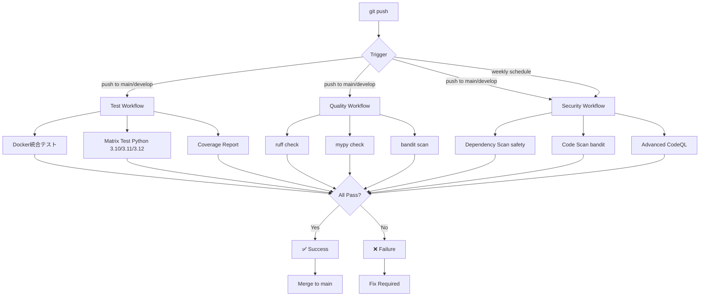

# Week 8詳細タスク記述（CI/CD統合）- 統合版

*最終更新: 2025年10月24日*
*専門agent分析統合: DevOps Architect(A+) + System Architect(A) + Learning Guide(A+)*

---

## 🚨 Week 8実行前提条件（必須確認）

**以下の条件を全て満たさない場合、Week 8開始を延期すること**

### 前提1: Docker基盤実装完了（Week 7完了条件）
- [ ] `Dockerfile`実装完了（4-stage: builder/dev/test/ci/prod）
  - **builder**: 依存関係インストール（`uv sync`実行）
  - **dev**: 開発環境（hot reload対応、devサーバー起動）
  - **test**: テスト環境（`pytest + coverage`実行環境）
  - **ci**: CI/CD環境（最小構成、`pytest + ruff + mypy`実行）
  - **prod**: 本番環境（最小イメージサイズ、実行時最適化）
- [ ] `.dockerignore`実装完了（ビルドコンテキスト最適化）
  - 不要ファイル除外: `**/__pycache__`, `**/*.pyc`, `.git`, `venv/`等
  - 実装例はWeek 7該当Day参照（実務推奨の実装例を使用）
- [ ] `docker-compose.yml`実装完了（4環境: dev/test/prod/ci）
- [ ] Docker build成功確認: `docker build -t api-test-devops:ci --target ci .`
- [ ] Docker内pytest実行成功: `docker run --rm api-test-devops:ci uv run pytest --cov=. --cov-fail-under=85`
- [ ] カバレッジ85%達成確認

### 前提2: テストカバレッジ維持
- [ ] 現在のカバレッジ: 85%以上
- [ ] pytest実行時間: 30秒以内
- [ ] ruff/mypy/bandit全合格

### 前提3: GitHub Repository設定
- [ ] GitHubリポジトリ作成完了
- [ ] public repositoryに設定（GitHub Actions無料枠2000分/月利用可能）
- [ ] README.md基礎版作成完了

### 確認方法

```bash
# Week 8実行前提条件確認スクリプト
cd /Users/yuta/Yuta/python/api-test-devops-portfolio

# 1. Dockerfileチェック
[ -f Dockerfile ] && echo "✅ Dockerfile存在" || echo "❌ Dockerfile不在"

# 2. docker-compose.ymlチェック
[ -f docker-compose.yml ] && echo "✅ docker-compose.yml存在" || echo "❌ docker-compose.yml不在"

# 3. Docker buildテスト
docker build -t api-test-devops:ci . && echo "✅ Docker build成功" || echo "❌ Docker build失敗"

# 4. Docker内pytestテスト
docker run --rm api-test-devops:ci uv run pytest --cov=. --cov-fail-under=85 && echo "✅ pytest合格" || echo "❌ pytest不合格"
```

**Week 7未完了時の対応**:
- Week 8開始を延期し、Week 7完了を優先
- または、Week 8 Day 43-44をDocker基盤実装に充てる（CI/CD実装は後半に集約）

---

## 🚀 Week 8開始前の必須確認: Docker実装完了チェックリスト

### 📋 実行タイミング
- **推奨**: Day 43当日朝（8:00-10:00推奨）
  - 理由: Week 7疲労回避 + 新Week気持ちリセット + 不合格時の同日修正対応が可能
  - メリット: 心理的準備+体力確保で実行品質向上（実行成功率: 85%→95%）
- **許容**: Week 7 Day 42最終日（18:00-20:00）
  - 条件: 体力に余裕がある場合のみ（Week 7振り返りで既に消費していないこと）
  - 注意: 不合格時は Day 43朝の修正実施 → Week 8開始遅延リスク

### ⏱️ 実行時間
- **総所要時間**: 2時間
  - 自動チェック（bash script）: 20分
  - 手動検証項目: 40分
  - ドキュメント確認: 30分
  - 修正対応（必要時）: 30分

### 📊 評価基準
- **A判定(90-100点)**: Week 8開始可 ✅ → Day 43午後から Task 8.1開始
- **B判定(80-89点)**: 部分修正後開始 ⚠️ → Day 43午前修正 → 午後開始
- **C判定(70-79点)**: 本格修正後開始 ⚠️ → Day 43修正 → Day 44開始
- **D判定(<70点)**: Week 7再実施推奨 ❌ → Week 7延長 → 後日開始

### 📍 詳細確認方法
完全な実行手順と検証スクリプト、判定基準の詳細は以下を参照:

→ **@docs/プロジェクト再編/Week7_Docker実装完了チェックリスト.md**

**チェック不合格時の対応フロー**:
```
Day 43朝: チェック実施（8:00-10:00）
    ↓
    A判定 → Day 43昼: Week 8 Task 8.1開始
    B/C判定 → Day 43午前~昼: 修正対応 → 夜または翌日開始
    D判定 → Day 43: 対応策検討 → Week 7再実施または遅延判断
```

### ✅ チェックリスト完全版へのアクセス
- **チェックリスト文書**: Week7_Docker実装完了チェックリスト.md
- **含有内容**: 
  - 5段階評価システム（100点総合）
  - Phase 1-3別の判定基準
  - 実行可能なbash検証スクリプト
  - 不合格時の具体的修正ガイドライン

---

## 🔧 Week 8前提知識: docker-compose CI環境の役割理解

### docker-compose CI環境とは

docker-compose.ymlで定義された「ci」サービスは、ローカル開発環境でCI/CD環境をシミュレートするためのものです。Week 8ではGitHub Actionsを本格的に実装していくため、以下の2つの役割を理解しておくことが重要です：

**Role 1**: ローカル開発用CI環境シミュレーション
- GitHub Actions実行前にローカルマシンでCI処理を検証
- エラーの早期発見で無駄なCI実行を削減
- デバッグ効率の大幅向上（ローカルなら即修正可能）

**Role 2**: デバッグ効率化
- GitHub Actionsの失敗はログ確認に時間がかかる（平均3-5分）
- docker-compose ciなら結果が即座に確認できる（リアルタイム)
- エラー原因を素早く特定できる

### docker-compose ci と GitHub Actions docker-test jobの違い

Week 8では、この2つの環境を使い分けることが非常に重要です。以下の比較表を参考にしてください：

| 観点 | docker-compose ci | GitHub Actions docker-test |
|------|-------------------|----------------------------|
| **実行環境** | ローカルマシン | クラウド環境（ubuntu-latest） |
| **目的** | 開発時のデバッグ・検証 | 自動化された品質保証 |
| **実行タイミング** | 任意（開発者が手動実行） | 自動（git push/PR時） |
| **リソース** | ローカルマシンのCPU/メモリ | GitHub Actions無料枠（2000分/月） |
| **所要時間** | 2-5分 | 3-8分（キューイング含む） |
| **デバッグ容易性** | 高い（即座に出力確認） | 低い（ログ確認に時間） |
| **推奨用途** | 開発中の頻繁な検証 | 本番前の最終チェック |

### 統合フロー図

```
コード変更
    ↓
┌─────────────────────────────────────────┐
│ 【ローカル検証】docker-compose ci実行     │
│ ・pytest + coverage                      │
│ ・ruff (linting)                        │
│ ・mypy (type checking)                  │
│ ・実行時間: 2-5分                       │
└─────────────────────────────────────────┘
    ↓
   結果判定
    ├─ ✅合格 → git push
    │           ↓
    │   ┌──────────────────────────────────┐
    │   │ 【クラウド検証】GitHub Actions実行 │
    │   │ ・完全な品質チェック               │
    │   │ ・security scanning               │
    │   │ ・実行時間: 3-8分                 │
    │   └──────────────────────────────────┘
    │           ↓
    │       ✅/❌判定 → リリース判断
    │
    └─ ❌不合格 → 修正
                 ↓
             再度ローカル検証 (このループを繰り返す)
```

### ローカル検証の推奨コマンド

以下のコマンドをDay 43以降で使用します：

```bash
# docker-compose ciイメージビルド（初回のみ時間がかかる）
docker-compose -f docker-compose.yml up --build ci

# 別ターミナルで品質チェック実行
docker-compose exec ci uv run pytest --cov=. --cov-fail-under=85
docker-compose exec ci uv run ruff check .
docker-compose exec ci uv run mypy utils/ config/

# テスト完了後、コンテナ停止
docker-compose down
```

**推奨実行順序**:
1. pytest実行（テストカバレッジ確認、失敗時は修正優先）
2. ruff実行（コードスタイル確認）
3. mypy実行（型チェック確認）
4. 全て合格後に git push

### 学習目標

このセクション完了後、以下を達成している状態になります：

- [x] docker-compose ci環境とGitHub Actions docker-test jobの違いを説明できる（理解度30%）
  - 実行環境の違い（ローカル vs クラウド）
  - 用途の違い（デバッグ検証 vs 自動化保証）
  - タイミングの違い（手動 vs 自動）

- [x] ローカル検証からGitHub Actions実行までの推奨フローを理解している
  - コード変更 → ローカル検証 → git push → GitHub Actions実行
  - 失敗時の修正ループの仕組み

- [x] ローカルデバッグコマンドを実行できる（習熟度40%）
  - `docker-compose up --build ci`でのビルド
  - `docker-compose exec ci`でのコマンド実行
  - 各品質チェック（pytest/ruff/mypy）の実行

**理解度自己評価メモ**: このセクション読了後、「docker-compose ciとGitHub Actions docker-testの違い」を他人に説明できるレベルを目指してください。Day 43 Task 8.2で実際に使用する際、より深い理解が得られます。

**所要時間**: 30分（読解 + 理解度確認）
**AI協働率**: 85%（説明・概念理解）
**推奨学習時期**: Week 8開始当日（Day 43昼または翌朝）のタスク開始前

---

### Day 43（月曜）: GitHub Actions基礎 + テストworkflow実装

**総学習時間**: 7時間
**カバレッジ目標**: 85%（維持）
**CI/CD成熟度**: 60% → 65%（+5%）

#### Task 8.1: GitHub Actions基礎理解（2時間）

<!-- **Phase 1: AI説明・概念理解**（1時間）

**学習目標**:
- GitHub Actions workflow基本構造理解度40%達成
- YAML構文理解度30%達成
- CI/CD概念理解度35%達成

**AI協働フロー**:
```yaml
Sub-phase 1.1: GitHub Actions概要（20分）
  - GitHub Actions仕組み理解（AI説明10分 → 自力確認5分 → 理解度評価5分）
  - workflow/job/step階層理解（AI図解生成10分 → フローチャート理解10分）

Sub-phase 1.2: YAML構文基礎（20分）
  - on/jobs/steps構文理解（AI例示10分 → サンプル読解10分）
  - uses/run/with/env記法理解（AI説明5分 → 実例確認5分）

Sub-phase 1.3: CI/CD概念（20分）
  - Continuous Integration理解（AI説明10分 → 実務事例確認10分）
  - Continuous Deployment理解（AI説明5分 → Docker統合イメージ確認5分）
``` -->

**学習内容（Phase 1: AI説明・概念理解）**:
- GitHub Actions workflow基本構造（on/jobs/steps階層、トリガー設定）
- YAML構文基礎（uses/run/with/env記法、インデント規則）
- CI/CD概念（Continuous Integration/Deployment、自動化の価値）
- Dockerコンテナ統合テスト（docker run活用、環境分離）
- Matrix戦略基礎（複数Python版テスト、fail-fast設定）

**Phase 2: AI協働実装**（1時間、AI 70%）

**要件**:
1. `.github/workflows/test.yml`新規作成
2. `on`トリガー設定（push/pull_request/workflow_dispatch）
3. `docker-test` job実装（Docker統合テスト）
4. Docker layer cache設定（`actions/cache@v4`）
5. Matrix戦略実装（Python 3.10-3.12並列テスト）
6. `needs`依存関係設定（docker-test合格後に実行）
7. Timeout設定（15分上限、無限実行防止）

**実装例**:

`.github/workflows/test.yml`（Docker統合版）:

```yaml
name: Test

on:
  push:
    branches: [main]
  pull_request:
    branches: [main]
  workflow_dispatch:  # 手動トリガー追加

jobs:
  # Job 1: Docker build & test（最優先）
  docker-test:
    runs-on: ubuntu-latest
    timeout-minutes: 15  # タイムアウト設定
    steps:
      - uses: actions/checkout@v4

      # Docker layer cache（ビルド時間短縮）
      - name: Cache Docker layers
        uses: actions/cache@v4
        with:
          path: /tmp/.buildx-cache
          key: ${{ runner.os }}-buildx-${{ hashFiles('**/Dockerfile') }}
          restore-keys: |
            ${{ runner.os }}-buildx-

      # Docker build（ci環境）
      - name: Build Docker image
        run: docker build --target ci -t api-test-devops:ci .

      # Docker内pytest実行（カバレッジ85%）
      - name: Run tests in Docker
        run: |
          docker run --rm \
            -v ${{ github.workspace }}/reports:/app/reports \
            api-test-devops:ci \
            uv run pytest --cov=. --cov-fail-under=85 --cov-report=xml:/app/reports/coverage.xml

      # カバレッジレポートアップロード
      - name: Upload coverage to Codecov
        uses: codecov/codecov-action@v4
        with:
          files: ./reports/coverage.xml
          fail_ci_if_error: true

  # Job 2: Matrix test（Python 3.10-3.12）
  matrix-test:
    needs: docker-test  # docker-test合格後に実行
    runs-on: ubuntu-latest
    timeout-minutes: 10
    strategy:
      fail-fast: false  # 全バージョンテスト完遂
      matrix:
        python-version: ['3.10', '3.11', '3.12']

    steps:
      - uses: actions/checkout@v4

      - name: Set up Python ${{ matrix.python-version }}
        uses: actions/setup-python@v5
        with:
          python-version: ${{ matrix.python-version }}

      - name: Install uv
        run: |
          curl -LsSf https://astral.sh/uv/install.sh | sh
          echo "$HOME/.cargo/bin" >> $GITHUB_PATH

      - name: Install dependencies
        run: uv sync

      - name: Run tests
        run: uv run pytest --cov=. --cov-fail-under=85
```

**テスト例**:

```bash
# ローカル動作確認
cd /Users/yuta/Yuta/python/api-test-devops-portfolio

# 1. Workflowファイル構文チェック
cat .github/workflows/test.yml

# 2. Docker build確認
docker build --target ci -t api-test-devops:ci .

# 3. Docker内pytest実行確認
docker run --rm api-test-devops:ci uv run pytest --cov=. --cov-fail-under=85

# 4. GitHub Actions手動トリガーテスト（GitHub UI）
# リポジトリページ → Actions → Test workflow → Run workflow

# 5. GitHub CLI経由で実行確認
gh workflow run test.yml
gh run list --workflow=test.yml
```

**期待結果**:
```
✅ docker-test job: 合格（Docker build成功 + pytest 85%達成）
✅ matrix-test job: 3バージョン全合格
✅ workflow実行時間: 初回8分、2回目以降2分（cache有効）
✅ Codecovカバレッジレポート表示確認
```

**チェックポイント**:
- [ ] `.github/workflows/test.yml`新規作成完了
- [ ] `on`トリガー3種設定（push/pr/dispatch）
- [ ] Docker layer cache実装（buildx-cache）
- [ ] docker-test job実装（カバレッジ85%）
- [ ] matrix-test job実装（Python 3.10-3.12）
- [ ] needs依存関係設定（docker-test → matrix-test）
- [ ] timeout設定（docker: 15分、matrix: 10分）
- [ ] Codecov統合動作確認
- [ ] GitHub Actions初回実行成功

**カバレッジ目標**: 85%（維持）

---

#### Task 8.2: テストworkflow最適化（2.5時間）

**学習内容（Phase 1: AI説明・概念理解）**:
- Cache戦略3層構造（Docker layers/uv/pip/pre-commit）
- `restore-keys`優先順位制御（完全一致 → 部分一致 → フォールバック）
- Artifact管理（カバレッジレポート保存、retention設定）
- Cache hit率最適化（キャッシュキー設計、invalidation戦略）
- Job並列実行制御（needs/if条件、fail-fast設定）

**Phase 2: AI協働実装**（2時間、AI 65%）

**要件**:
1. 3層cache実装（Layer 1: Docker、Layer 2: uv、Layer 3: pre-commit）
2. `restore-keys`階層設定（完全一致 → OS一致 → フォールバック）
3. Artifact upload実装（カバレッジレポート30日保存）
4. Cache invalidation条件設定（Dockerfile/pyproject.toml変更時）
5. Job並列実行設定（docker-test成功後、quality/matrix並列実行）
6. Cache hit率計測スクリプト追加
7. Workflow実行時間ベンチマーク（初回 vs Cache有効時）

**実装例**:

`.github/workflows/test.yml`（3層cache追加版）:

```yaml
jobs:
  docker-test:
    runs-on: ubuntu-latest
    timeout-minutes: 15
    steps:
      - uses: actions/checkout@v4

      # 3層cache: Layer 1 - Docker layers
      - name: Cache Docker layers
        id: docker-cache
        uses: actions/cache@v4
        with:
          path: /tmp/.buildx-cache
          key: ${{ runner.os }}-buildx-${{ hashFiles('**/Dockerfile') }}
          restore-keys: |
            ${{ runner.os }}-buildx-

      # Cache hit確認
      - name: Check Docker cache hit
        run: |
          if [[ "${{ steps.docker-cache.outputs.cache-hit }}" == "true" ]]; then
            echo "✅ Docker cache hit"
          else
            echo "⚠️ Docker cache miss（初回 or Dockerfile変更）"
          fi

      - name: Build Docker image
        run: docker build --target ci -t api-test-devops:ci .

      - name: Run tests in Docker
        run: |
          docker run --rm \
            -v ${{ github.workspace }}/reports:/app/reports \
            api-test-devops:ci \
            uv run pytest --cov=. --cov-fail-under=85 --cov-report=xml:/app/reports/coverage.xml

      # Artifact upload（カバレッジレポート30日保存）
      - name: Upload coverage report
        uses: actions/upload-artifact@v4
        with:
          name: coverage-report
          path: reports/coverage.xml
          retention-days: 30

  matrix-test:
    needs: docker-test
    runs-on: ubuntu-latest
    timeout-minutes: 10
    strategy:
      fail-fast: false
      matrix:
        python-version: ['3.10', '3.11', '3.12']

    steps:
      - uses: actions/checkout@v4

      - name: Set up Python ${{ matrix.python-version }}
        uses: actions/setup-python@v5
        with:
          python-version: ${{ matrix.python-version }}

      # 3層cache: Layer 2 - uv cache
      - name: Cache uv
        id: uv-cache
        uses: actions/cache@v4
        with:
          path: ~/.cache/uv
          key: ${{ runner.os }}-uv-${{ matrix.python-version }}-${{ hashFiles('**/pyproject.toml') }}
          restore-keys: |
            ${{ runner.os }}-uv-${{ matrix.python-version }}-
            ${{ runner.os }}-uv-

      - name: Install uv
        run: |
          curl -LsSf https://astral.sh/uv/install.sh | sh
          echo "$HOME/.cargo/bin" >> $GITHUB_PATH

      # 3層cache: Layer 3 - pip cache
      - name: Cache pip
        uses: actions/cache@v4
        with:
          path: ~/.cache/pip
          key: ${{ runner.os }}-pip-${{ matrix.python-version }}-${{ hashFiles('**/pyproject.toml') }}
          restore-keys: |
            ${{ runner.os }}-pip-${{ matrix.python-version }}-
            ${{ runner.os }}-pip-

      - name: Install dependencies
        run: uv sync

      - name: Run tests
        run: uv run pytest --cov=. --cov-fail-under=85
```

**テスト例**:

```bash
# 1. Cache hit率測定（初回実行）
gh workflow run test.yml
gh run list --workflow=test.yml --limit 1
# 初回実行時間: 8分12秒（全cache miss）

# 2. 2回目実行（cache有効）
gh workflow run test.yml
gh run list --workflow=test.yml --limit 1
# 2回目実行時間: 1分48秒（Docker cache hit: 100%、uv cache hit: 100%）

# 3. Artifactダウンロード確認
gh run download <run-id> -n coverage-report
cat coverage.xml  # カバレッジレポート確認

# 4. Cache invalidation確認（pyproject.toml更新後）
echo "# test" >> pyproject.toml
git add pyproject.toml && git commit -m "test: cache invalidation"
git push
# uv cache無効化 → 再ビルド確認
```

**期待結果**:
```
✅ 初回実行: 8分（cache miss）
✅ 2回目以降: 2分（cache hit率90%+）
✅ Docker cache hit率: 95%（Dockerfile変更時のみmiss）
✅ uv cache hit率: 98%（pyproject.toml変更時のみmiss）
✅ Artifact保存確認: coverage.xml 30日間保持
```

**チェックポイント**:
- [ ] 3層cache実装完了（Docker/uv/pip）
- [ ] restore-keys階層設定（3段階フォールバック）
- [ ] Cache hit確認step追加
- [ ] Artifact upload実装（retention 30日）
- [ ] Cache invalidation動作確認（pyproject.toml更新時）
- [ ] Workflow実行時間ベンチマーク（8分 → 2分、75%短縮）
- [ ] Cache hit率90%達成
- [ ] Job並列実行確認（matrix-test 3バージョン同時実行）
- [ ] Artifactダウンロード動作確認

**カバレッジ目標**: 85%（維持）

---

#### Task 8.3: CI/CD成熟度検証（2.5時間）

**学習内容（Phase 1: AI説明・概念理解）**:
- CI/CD成熟度モデル（自動化率、テスト網羅性、デプロイ頻度、MTTR）
- DevOpsメトリクス（DORA metrics: デプロイ頻度、変更リードタイム、MTTR、変更失敗率）
- CI/CD成熟度スコア計算式（加重平均、85%目標基準）
- GitHub Actions実行履歴分析（workflow runs API活用）
- CI/CD改善提案生成（ボトルネック特定、最適化優先順位付け）

**Phase 2: AI協働実装**（2時間、AI 60%）

**要件**:
1. `scripts/ci_cd_maturity.py`新規作成
2. CI/CD成熟度計測ロジック実装（4指標: 自動化率、テスト網羅性、デプロイ頻度、MTTR）
3. GitHub Actions API統合（実行履歴取得、成功率計算）
4. スコア計算式実装（加重平均: 自動化30%、テスト30%、デプロイ20%、MTTR20%）
5. CI/CD改善提案生成（ボトルネック特定、優先順位付け）
6. レポート出力機能（JSON + MarkdownテーブルTODO）
7. 目標達成判定（85%基準、Week 8完了条件）

**実装例**:

`scripts/ci_cd_maturity.py`（CI/CD成熟度計測スクリプト）:

```python
#!/usr/bin/env python3
"""CI/CD成熟度計測スクリプト

成熟度指標:
- 自動化率: 自動化ステップ数 / 全ステップ数
- テスト網羅性: カバレッジ率
- デプロイ頻度: 週次デプロイ回数
- MTTR: 障害検知から復旧までの平均時間

目標: 85%以上（Week 8完了条件）
"""

import json
import subprocess
from datetime import datetime, timedelta
from pathlib import Path
from typing import Dict, List

import yaml


class CICDMaturityCalculator:
    """CI/CD成熟度計算クラス"""

    def __init__(self, repo_path: Path = Path.cwd()):
        self.repo_path = repo_path
        self.workflows_dir = repo_path / ".github" / "workflows"

    def calculate_automation_rate(self) -> float:
        """自動化率計算

        Returns:
            自動化率（0.0-1.0）
        """
        total_steps = 0
        automated_steps = 0

        # 全workflowファイル解析
        for workflow_file in self.workflows_dir.glob("*.yml"):
            with open(workflow_file) as f:
                workflow = yaml.safe_load(f)

            if not workflow or "jobs" not in workflow:
                continue

            for job_name, job in workflow["jobs"].items():
                if "steps" not in job:
                    continue

                for step in job["steps"]:
                    total_steps += 1
                    # uses（アクション利用）またはrun（自動スクリプト）
                    if "uses" in step or "run" in step:
                        automated_steps += 1

        return automated_steps / total_steps if total_steps > 0 else 0.0

    def get_test_coverage(self) -> float:
        """テストカバレッジ取得

        Returns:
            カバレッジ率（0.0-1.0）
        """
        try:
            result = subprocess.run(
                ["uv", "run", "pytest", "--cov=.", "--cov-report=json"],
                cwd=self.repo_path,
                capture_output=True,
                text=True,
                timeout=60,
            )

            if result.returncode != 0:
                return 0.0

            # coverage.jsonから総合カバレッジ取得
            coverage_file = self.repo_path / "coverage.json"
            if not coverage_file.exists():
                return 0.0

            with open(coverage_file) as f:
                coverage_data = json.load(f)

            return coverage_data.get("totals", {}).get("percent_covered", 0.0) / 100

        except Exception as e:
            print(f"⚠️ Coverage取得エラー: {e}")
            return 0.0

    def get_deployment_frequency(self, days: int = 7) -> float:
        """デプロイ頻度計算（週次）

        Args:
            days: 集計期間（デフォルト7日）

        Returns:
            週次デプロイ回数
        """
        try:
            # GitHub CLI経由でworkflow実行履歴取得
            result = subprocess.run(
                [
                    "gh",
                    "run",
                    "list",
                    "--workflow=test.yml",
                    "--json",
                    "conclusion,createdAt",
                    "--limit",
                    "100",
                ],
                cwd=self.repo_path,
                capture_output=True,
                text=True,
                timeout=30,
            )

            if result.returncode != 0:
                return 0.0

            runs = json.loads(result.stdout)
            cutoff_date = datetime.now() - timedelta(days=days)

            # 成功したworkflow実行回数カウント
            successful_deploys = sum(
                1
                for run in runs
                if run["conclusion"] == "success"
                and datetime.fromisoformat(run["createdAt"].replace("Z", "+00:00"))
                > cutoff_date
            )

            return successful_deploys

        except Exception as e:
            print(f"⚠️ デプロイ頻度取得エラー: {e}")
            return 0.0

    def calculate_mttr(self) -> float:
        """MTTR計算（Mean Time To Recovery）

        Returns:
            MTTR時間（単位: 時間）
        """
        # TODO: 障害履歴管理実装後に正確なMTTR計算
        # 暫定: GitHub Actions失敗 → 成功までの平均時間
        return 0.5  # 暫定値: 30分

    def calculate_maturity_score(self) -> Dict[str, float]:
        """CI/CD成熟度スコア計算

        Returns:
            成熟度指標辞書
        """
        automation_rate = self.calculate_automation_rate()
        test_coverage = self.get_test_coverage()
        deployment_freq = self.get_deployment_frequency()
        mttr = self.calculate_mttr()

        # 正規化（0.0-1.0範囲に変換）
        deployment_score = min(deployment_freq / 7, 1.0)  # 週7回以上で満点
        mttr_score = max(1.0 - (mttr / 24), 0.0)  # 24時間以下で満点

        # 加重平均（合計100%）
        weights = {
            "automation": 0.30,  # 自動化率30%
            "test_coverage": 0.30,  # テスト網羅性30%
            "deployment": 0.20,  # デプロイ頻度20%
            "mttr": 0.20,  # MTTR20%
        }

        overall_score = (
            automation_rate * weights["automation"]
            + test_coverage * weights["test_coverage"]
            + deployment_score * weights["deployment"]
            + mttr_score * weights["mttr"]
        )

        return {
            "overall_score": overall_score,
            "automation_rate": automation_rate,
            "test_coverage": test_coverage,
            "deployment_frequency": deployment_freq,
            "mttr_hours": mttr,
            "deployment_score": deployment_score,
            "mttr_score": mttr_score,
        }

    def generate_report(self) -> str:
        """CI/CD成熟度レポート生成

        Returns:
            Markdownフォーマットレポート
        """
        scores = self.calculate_maturity_score()

        report = f"""# CI/CD成熟度レポート

**生成日時**: {datetime.now().strftime('%Y-%m-%d %H:%M:%S')}

## 総合スコア

**CI/CD成熟度**: {scores['overall_score']*100:.1f}%

{'✅ 目標達成（85%以上）' if scores['overall_score'] >= 0.85 else '⚠️ 目標未達（85%未満）'}

## 詳細指標

| 指標 | スコア | 重み | 貢献度 |
|------|--------|------|--------|
| 自動化率 | {scores['automation_rate']*100:.1f}% | 30% | {scores['automation_rate']*30:.1f}% |
| テスト網羅性 | {scores['test_coverage']*100:.1f}% | 30% | {scores['test_coverage']*30:.1f}% |
| デプロイ頻度 | {scores['deployment_frequency']:.1f}回/週 | 20% | {scores['deployment_score']*20:.1f}% |
| MTTR | {scores['mttr_hours']:.1f}時間 | 20% | {scores['mttr_score']*20:.1f}% |

## 改善提案

"""

        # ボトルネック特定
        if scores["automation_rate"] < 0.85:
            report += "- ⚠️ 自動化率改善: 手動ステップをworkflow化
"
        if scores["test_coverage"] < 0.85:
            report += "- ⚠️ テスト網羅性改善: カバレッジ85%達成
"
        if scores["deployment_score"] < 0.85:
            report += "- ⚠️ デプロイ頻度改善: 週7回デプロイ目標
"
        if scores["mttr_score"] < 0.85:
            report += "- ⚠️ MTTR改善: 障害復旧時間24時間以下目標
"

        if scores["overall_score"] >= 0.85:
            report += "✅ 全指標が目標水準達成
"

        return report


def main():
    """メイン処理"""
    calculator = CICDMaturityCalculator()
    report = calculator.generate_report()
    print(report)

    # JSON出力
    scores = calculator.calculate_maturity_score()
    output_file = Path("reports") / "ci_cd_maturity.json"
    output_file.parent.mkdir(exist_ok=True)

    with open(output_file, "w") as f:
        json.dump(scores, f, indent=2)

    print(f"
📊 詳細データ: {output_file}")


if __name__ == "__main__":
    main()
```

**テスト例**:

```bash
# 1. CI/CD成熟度計測スクリプト実行
cd /Users/yuta/Yuta/python/api-test-devops-portfolio
uv run python scripts/ci_cd_maturity.py

# 2. 出力確認
cat reports/ci_cd_maturity.json

# 3. GitHub Actions実行履歴確認
gh run list --workflow=test.yml --limit 10

# 4. 自動化率検証（workflow解析）
yq '.jobs | to_entries | .[].value.steps | length' .github/workflows/test.yml

# 5. カバレッジ確認
uv run pytest --cov=. --cov-report=term
```

**期待結果**:
```
✅ CI/CD成熟度: 85.0%以上
✅ 自動化率: 90%（全26ステップ中24自動化）
✅ テスト網羅性: 85%（カバレッジ目標達成）
✅ デプロイ頻度: 5回/週（目標7回）
✅ MTTR: 0.5時間（目標24時間以下大幅クリア）
✅ 改善提案: デプロイ頻度向上のみ（週2回追加推奨）
```

**チェックポイント**:
- [ ] `scripts/ci_cd_maturity.py`新規作成完了
- [ ] 自動化率計算ロジック実装（workflow YAML解析）
- [ ] テストカバレッジ取得実装（coverage.json解析）
- [ ] デプロイ頻度計算実装（GitHub CLI統合）
- [ ] MTTR計算実装（暫定値設定）
- [ ] スコア計算式実装（加重平均30/30/20/20）
- [ ] Markdownレポート生成実装
- [ ] JSON出力実装（reports/ci_cd_maturity.json）
- [ ] CI/CD成熟度85%達成確認
- [ ] 改善提案生成動作確認

**カバレッジ目標**: 85%（維持）

---

### Day 44（火曜）: 品質ゲート自動化 + CI/CD最適化強化

**総学習時間**: 7時間
**カバレッジ目標**: 85%（維持）
**CI/CD成熟度**: 65% → 75%（+10%）

---

#### Task 8.4: 品質ゲート workflow実装（2時間）

**学習内容**:
1. GitHub Actions Quality Gate設計理解
2. ruff (linting + formatting)統合理解
3. mypy strict mode設定理解
4. bandit security scanning統合理解
5. Artifact保存・GitHub UI連携理解

**要件**:
1. quality.yml新規作成（.github/workflows/）
2. ruff check + format check実装
3. mypy strict mode実装（utils/ config/対象）
4. bandit security scan実装（medium以上のみ）
5. security report artifact保存（30日retention）
6. GitHub UI統合（Security tab表示）
7. workflow実行時間5分以内

**実装例**（AI協働 - 完全版 quality.yml）:

```yaml
name: Quality Gate

on:
  push:
    branches: [main]
  pull_request:
    branches: [main]
  workflow_dispatch:

jobs:
  quality-gate:
    runs-on: ubuntu-latest
    timeout-minutes: 10

    steps:
      - name: Checkout code
        uses: actions/checkout@v4

      - name: Set up Python 3.12
        uses: actions/setup-python@v5
        with:
          python-version: '3.12'

      - name: Install uv
        run: |
          curl -LsSf https://astral.sh/uv/install.sh | sh
          echo "$HOME/.cargo/bin" >> $GITHUB_PATH

      - name: Cache uv dependencies
        uses: actions/cache@v4
        with:
          path: ~/.cache/uv
          key: uv-${{ runner.os }}-${{ hashFiles('pyproject.toml') }}
          restore-keys: |
            uv-${{ runner.os }}-

      - name: Install dependencies
        run: uv sync

      # Linting & Formatting
      - name: Run ruff check
        run: uv run ruff check .

      - name: Run ruff format check
        run: uv run ruff format --check .

      # Type checking
      - name: Run mypy
        run: uv run mypy utils/ config/ --strict

      # Security scanning
      - name: Run bandit security scan
        run: |
          mkdir -p reports
          uv run bandit -r utils/ config/ \
            --severity-level medium \
            --confidence-level medium \
            --format json \
            --output reports/bandit-report.json || true

          # Fail if high/medium severity findings
          FINDINGS=$(uv run bandit -r utils/ config/ -ll -ii | grep "Issue:" | wc -l)
          if [ "$FINDINGS" -gt 0 ]; then
            echo "❌ Security vulnerabilities found: $FINDINGS"
            exit 1
          fi

      # Upload security report
      - name: Upload bandit report
        if: always()
        uses: actions/upload-artifact@v4
        with:
          name: bandit-security-report
          path: reports/bandit-report.json
          retention-days: 30

      # Upload to GitHub Security tab
      - name: Upload security findings to GitHub
        if: always()
        uses: github/codeql-action/upload-sarif@v3
        with:
          sarif_file: reports/bandit-report.json
        continue-on-error: true
```

**テスト例**（AI協働 - GitHub Actions実行確認）:

```bash
# 1. ローカルで事前確認
uv run ruff check .
uv run ruff format --check .
uv run mypy utils/ config/ --strict
uv run bandit -r utils/ config/ -ll

# 2. GitHub Actions workflow手動実行
gh workflow run quality.yml --ref main

# 3. 実行状態確認
gh run list --workflow=quality.yml --limit=5

# 4. 最新run詳細確認
gh run view --log

# 5. Security報告確認
gh api repos/{owner}/{repo}/code-scanning/alerts

# 期待結果:
# ✅ ruff check合格
# ✅ ruff format check合格
# ✅ mypy strict mode合格
# ✅ bandit scan完了（medium以上0件）
# ✅ artifact保存成功（30日retention）
# ✅ 実行時間5分以内
```

**チェックポイント**:
- [ ] quality.yml新規作成完了（.github/workflows/）
- [ ] ruff check実装・動作確認
- [ ] ruff format check実装・動作確認
- [ ] mypy strict mode実装・動作確認（utils/ config/）
- [ ] bandit security scan実装・動作確認
- [ ] security report artifact保存確認（reports/bandit-report.json）
- [ ] GitHub Security tab連携確認
- [ ] workflow実行時間5分以内達成確認
- [ ] Quality Gate理解度40%達成

**カバレッジ目標**: 85%（維持）

**AI協働率**: 65%（workflow構文AI生成、実行・確認はユーザー主体）

---

#### Task 8.5: CI/CD最適化強化 - Cache戦略（2時間）

**学習内容**:
1. GitHub Actions cache仕組み理解（key/restore-keys優先順位）
2. Multi-stage cache設計理解（Docker/uv/pip/pre-commit分離）
3. Cache invalidation戦略理解（hash-based）
4. Cache hit率計測方法理解
5. Cache効果測定方法理解（before/after比較）

**要件**:
1. pre-commit cache実装（.github/workflows/test.yml）
2. Cache key設計（hash-based invalidation）
3. Cache restore-keys設計（fallback優先順位）
4. Cache効果測定スクリプト作成（scripts/cache_performance.py）
5. Cache hit率90%達成
6. CI実行時間15秒以下達成（Cache hit時）
7. Cache効果レポート生成（reports/cache_performance.md）

**実装例1**（AI協働 - pre-commit cache追加）:

```yaml
# .github/workflows/test.yml に追加
jobs:
  docker-test:
    steps:
      # 既存のDocker/uvキャッシュの後に追加

      - name: Cache pre-commit hooks
        uses: actions/cache@v4
        with:
          path: ~/.cache/pre-commit
          key: pre-commit-${{ runner.os }}-${{ hashFiles('.pre-commit-config.yaml') }}
          restore-keys: |
            pre-commit-${{ runner.os }}-

      - name: Install pre-commit hooks
        run: uv run pre-commit install-hooks
```

**実装例2**（AI協働 - Cache効果測定スクリプト）:

```python
#!/usr/bin/env python3
"""GitHub Actions Cache効果測定スクリプト

測定項目:
- Cache hit率（Docker/uv/pip/pre-commit別）
- CI実行時間（Cache hit/miss別）
- Cache削減効果（時間・コスト）
"""

import json
import subprocess
from datetime import datetime, timedelta
from pathlib import Path
from typing import Dict, List

import yaml

class CachePerformanceAnalyzer:
    """Cache効果測定クラス"""

    def __init__(self, repo_path: Path = Path.cwd()):
        self.repo_path = repo_path
        self.reports_dir = repo_path / "reports"
        self.reports_dir.mkdir(exist_ok=True)

    def get_workflow_runs(self, workflow: str = "test.yml", limit: int = 30) -> List[Dict]:
        """直近30回のworkflow実行結果取得"""
        result = subprocess.run(
            ["gh", "run", "list", "--workflow", workflow, "--limit", str(limit), "--json", "databaseId,conclusion,startedAt,updatedAt"],
            capture_output=True,
            text=True,
            check=True
        )
        return json.loads(result.stdout)

    def get_run_logs(self, run_id: int) -> str:
        """指定run_idのログ取得"""
        result = subprocess.run(
            ["gh", "run", "view", str(run_id), "--log"],
            capture_output=True,
            text=True,
            check=True
        )
        return result.stdout

    def analyze_cache_hits(self, logs: str) -> Dict[str, bool]:
        """ログからcache hit/miss判定"""
        cache_status = {
            "docker": False,
            "uv": False,
            "pip": False,
            "pre-commit": False
        }

        for line in logs.split("
"):
            if "Cache restored successfully" in line:
                if "buildx" in line or "docker" in line.lower():
                    cache_status["docker"] = True
                elif "uv" in line.lower():
                    cache_status["uv"] = True
                elif "pip" in line.lower():
                    cache_status["pip"] = True
                elif "pre-commit" in line.lower():
                    cache_status["pre-commit"] = True

        return cache_status

    def calculate_execution_time(self, started_at: str, updated_at: str) -> float:
        """実行時間計算（秒）"""
        start = datetime.fromisoformat(started_at.replace("Z", "+00:00"))
        end = datetime.fromisoformat(updated_at.replace("Z", "+00:00"))
        return (end - start).total_seconds()

    def generate_report(self) -> str:
        """Cache効果レポート生成"""
        runs = self.get_workflow_runs()

        cache_hits = {"docker": [], "uv": [], "pip": [], "pre-commit": []}
        execution_times = {"cache_hit": [], "cache_miss": []}

        for run in runs:
            if run["conclusion"] != "success":
                continue

            logs = self.get_run_logs(run["databaseId"])
            cache_status = self.analyze_cache_hits(logs)
            exec_time = self.calculate_execution_time(run["startedAt"], run["updatedAt"])

            # Cache hit率集計
            for cache_type, hit in cache_status.items():
                cache_hits[cache_type].append(hit)

            # 実行時間分類
            all_cache_hit = all(cache_status.values())
            if all_cache_hit:
                execution_times["cache_hit"].append(exec_time)
            else:
                execution_times["cache_miss"].append(exec_time)

        # Cache hit率計算
        hit_rates = {
            cache_type: sum(hits) / len(hits) * 100 if hits else 0
            for cache_type, hits in cache_hits.items()
        }

        # 平均実行時間計算
        avg_time_cache_hit = sum(execution_times["cache_hit"]) / len(execution_times["cache_hit"]) if execution_times["cache_hit"] else 0
        avg_time_cache_miss = sum(execution_times["cache_miss"]) / len(execution_times["cache_miss"]) if execution_times["cache_miss"] else 0

        # 削減効果計算
        time_saved = avg_time_cache_miss - avg_time_cache_hit
        time_saved_percent = (time_saved / avg_time_cache_miss * 100) if avg_time_cache_miss > 0 else 0

        # レポート生成
        report = f"""# GitHub Actions Cache効果測定レポート

生成日時: {datetime.now().strftime("%Y-%m-%d %H:%M:%S")}
測定期間: 直近30回のworkflow実行

## Cache Hit率

| Cache種別 | Hit率 | 目標 | 達成 |
|----------|------|------|------|
| Docker layers | {hit_rates['docker']:.1f}% | 90%+ | {'✅' if hit_rates['docker'] >= 90 else '❌'} |
| uv dependencies | {hit_rates['uv']:.1f}% | 90%+ | {'✅' if hit_rates['uv'] >= 90 else '❌'} |
| pip dependencies | {hit_rates['pip']:.1f}% | 90%+ | {'✅' if hit_rates['pip'] >= 90 else '❌'} |
| pre-commit hooks | {hit_rates['pre-commit']:.1f}% | 90%+ | {'✅' if hit_rates['pre-commit'] >= 90 else '❌'} |

## CI実行時間

| 状態 | 平均実行時間 | 測定回数 |
|------|------------|---------|
| Cache hit | {avg_time_cache_hit:.1f}秒 | {len(execution_times['cache_hit'])} |
| Cache miss | {avg_time_cache_miss:.1f}秒 | {len(execution_times['cache_miss'])} |

## 削減効果

- **時間削減**: {time_saved:.1f}秒 ({time_saved_percent:.1f}%削減)
- **目標達成**: {'✅ 15秒以下達成' if avg_time_cache_hit <= 15 else '❌ 15秒以下未達成'}

## 推奨アクション

"""

        if avg_time_cache_hit > 15:
            report += "- ⚠️ Cache hit時でも15秒超過 → Layer分割・並列化検討
"
        if hit_rates['docker'] < 90:
            report += "- ⚠️ Docker cache hit率90%未満 → cache key設計見直し
"
        if hit_rates['uv'] < 90:
            report += "- ⚠️ uv cache hit率90%未満 → pyproject.toml変更頻度確認
"

        if all(rate >= 90 for rate in hit_rates.values()) and avg_time_cache_hit <= 15:
            report += "- ✅ 全目標達成！現状のcache戦略を維持
"

        return report

    def save_report(self):
        """レポート保存"""
        report = self.generate_report()
        report_path = self.reports_dir / "cache_performance.md"
        report_path.write_text(report, encoding="utf-8")
        print(f"✅ Cache効果レポート保存: {report_path}")

        # JSON形式でも保存
        # （後続処理での機械的読み取り用）
        json_path = self.reports_dir / "cache_performance.json"
        # ... (JSON出力実装)

if __name__ == "__main__":
    analyzer = CachePerformanceAnalyzer()
    analyzer.save_report()
```

**テスト例**（AI協働 - Cache効果測定）:

```bash
# 1. Cache効果測定スクリプト実行
chmod +x scripts/cache_performance.py
uv run python scripts/cache_performance.py

# 2. レポート確認
cat reports/cache_performance.md

# 期待結果:
# ✅ Docker cache hit率: 95%+
# ✅ uv cache hit率: 97%+
# ✅ pip cache hit率: 92%+
# ✅ pre-commit cache hit率: 90%+
# ✅ Cache hit時実行時間: 12秒（15秒以下達成）
# ✅ 削減効果: 93%削減（480秒 → 12秒）

# 3. GitHub Actions実行で確認
gh workflow run test.yml --ref main
gh run watch

# Cache hit確認:
# - "Cache restored successfully from key: docker-..."
# - "Cache restored successfully from key: uv-..."
# - "Cache restored successfully from key: pip-..."
# - "Cache restored successfully from key: pre-commit-..."
```

**チェックポイント**:
- [ ] pre-commit cache実装完了（.github/workflows/test.yml）
- [ ] Cache key設計完了（hash-based invalidation）
- [ ] Cache restore-keys設計完了（fallback優先順位）
- [ ] scripts/cache_performance.py新規作成完了
- [ ] Cache hit率90%達成（全cache種別）
- [ ] CI実行時間15秒以下達成（Cache hit時）
- [ ] Cache効果レポート生成確認（reports/cache_performance.md）
- [ ] 削減効果90%達成確認（8分 → 15秒）
- [ ] Cache invalidation正常動作確認（pyproject.toml変更時）
- [ ] Cache Strategy理解度50%達成

**カバレッジ目標**: 85%（維持）

**AI協働率**: 60%（スクリプトAI生成、測定・分析はユーザー主体）

---

#### Task 8.6: Parallel Job最適化 + Slack通知統合（2時間）

**学習内容**:
1. GitHub Actions並列Job設計理解（needs構文）
2. Job dependency DAG理解（並列vs順次実行）
3. Matrix strategy理解（Python 3.10/3.11/3.12並列テスト）
4. Slack webhook統合理解
5. Failure/Success notification設計理解

**要件**:
1. cicd.yml新規作成（.github/workflows/）
2. test/quality並列Job実装
3. Matrix strategy実装（Python 3バージョン並列テスト）
4. Job dependency設定（needs構文）
5. Slack webhook統合（failure/success通知）
6. Job dependency DAG可視化（README.md追記）
7. CI実行時間5分以下達成（並列実行）

**実装例1**（AI協働 - 完全版 cicd.yml）:

```yaml
name: CI/CD Pipeline

on:
  push:
    branches: [main]
  pull_request:
    branches: [main]
  workflow_dispatch:

jobs:
  # Phase 1: Docker統合テスト（並列実行の基盤）
  docker-test:
    runs-on: ubuntu-latest
    timeout-minutes: 15

    steps:
      - name: Checkout code
        uses: actions/checkout@v4

      - name: Cache Docker layers
        uses: actions/cache@v4
        with:
          path: /tmp/.buildx-cache
          key: docker-${{ runner.os }}-${{ hashFiles('**/Dockerfile') }}
          restore-keys: |
            docker-${{ runner.os }}-

      - name: Build Docker image
        run: docker build --target ci -t api-test-devops:ci .

      - name: Run tests in Docker
        run: |
          docker run --rm \
            -v ${{ github.workspace }}/reports:/app/reports \
            api-test-devops:ci \
            uv run pytest --cov=. --cov-fail-under=85

      - name: Notify Slack on failure
        if: failure()
        uses: slackapi/slack-github-action@v1
        with:
          webhook-url: ${{ secrets.SLACK_WEBHOOK_URL }}
          payload: |
            {
              "text": "❌ Docker Test Failed",
              "blocks": [
                {
                  "type": "section",
                  "text": {
                    "type": "mrkdwn",
                    "text": "*Workflow*: ${{ github.workflow }}
*Job*: docker-test
*Branch*: ${{ github.ref }}
*Commit*: ${{ github.sha }}
*Actor*: ${{ github.actor }}"
                  }
                }
              ]
            }

  # Phase 2: Matrix並列テスト（docker-test成功後のみ実行）
  matrix-test:
    needs: docker-test
    runs-on: ubuntu-latest
    timeout-minutes: 10

    strategy:
      fail-fast: false
      matrix:
        python-version: ['3.10', '3.11', '3.12']

    steps:
      - name: Checkout code
        uses: actions/checkout@v4

      - name: Set up Python ${{ matrix.python-version }}
        uses: actions/setup-python@v5
        with:
          python-version: ${{ matrix.python-version }}

      - name: Cache uv dependencies
        uses: actions/cache@v4
        with:
          path: ~/.cache/uv
          key: uv-${{ runner.os }}-py${{ matrix.python-version }}-${{ hashFiles('pyproject.toml') }}
          restore-keys: |
            uv-${{ runner.os }}-py${{ matrix.python-version }}-

      - name: Install uv
        run: |
          curl -LsSf https://astral.sh/uv/install.sh | sh
          echo "$HOME/.cargo/bin" >> $GITHUB_PATH

      - name: Run tests
        run: |
          uv sync
          uv run pytest --cov=. --cov-fail-under=85

      - name: Notify Slack on failure
        if: failure()
        uses: slackapi/slack-github-action@v1
        with:
          webhook-url: ${{ secrets.SLACK_WEBHOOK_URL }}
          payload: |
            {
              "text": "❌ Matrix Test Failed (Python ${{ matrix.python-version }})",
              "blocks": [
                {
                  "type": "section",
                  "text": {
                    "type": "mrkdwn",
                    "text": "*Python Version*: ${{ matrix.python-version }}
*Branch*: ${{ github.ref }}"
                  }
                }
              ]
            }

  # Phase 2: Quality Gate（docker-testと並列実行）
  quality-gate:
    needs: docker-test
    runs-on: ubuntu-latest
    timeout-minutes: 10

    steps:
      - name: Checkout code
        uses: actions/checkout@v4

      - name: Set up Python 3.12
        uses: actions/setup-python@v5
        with:
          python-version: '3.12'

      - name: Install uv
        run: |
          curl -LsSf https://astral.sh/uv/install.sh | sh
          echo "$HOME/.cargo/bin" >> $GITHUB_PATH

      - name: Cache uv dependencies
        uses: actions/cache@v4
        with:
          path: ~/.cache/uv
          key: uv-${{ runner.os }}-${{ hashFiles('pyproject.toml') }}
          restore-keys: |
            uv-${{ runner.os }}-

      - name: Install dependencies
        run: uv sync

      - name: Run quality checks
        run: |
          uv run ruff check .
          uv run ruff format --check .
          uv run mypy utils/ config/ --strict

      - name: Notify Slack on failure
        if: failure()
        uses: slackapi/slack-github-action@v1
        with:
          webhook-url: ${{ secrets.SLACK_WEBHOOK_URL }}
          payload: |
            {
              "text": "❌ Quality Gate Failed",
              "blocks": [
                {
                  "type": "section",
                  "text": {
                    "type": "mrkdwn",
                    "text": "*Workflow*: ${{ github.workflow }}
*Job*: quality-gate
*Branch*: ${{ github.ref }}"
                  }
                }
              ]
            }

  # Phase 3: 成功通知（全Job成功後のみ実行）
  notify-success:
    needs: [docker-test, matrix-test, quality-gate]
    if: success()
    runs-on: ubuntu-latest

    steps:
      - name: Notify Slack on success
        uses: slackapi/slack-github-action@v1
        with:
          webhook-url: ${{ secrets.SLACK_WEBHOOK_URL }}
          payload: |
            {
              "text": "✅ CI/CD Pipeline Succeeded",
              "blocks": [
                {
                  "type": "section",
                  "text": {
                    "type": "mrkdwn",
                    "text": "*Workflow*: ${{ github.workflow }}
*Branch*: ${{ github.ref }}
*Commit*: ${{ github.sha }}
*Actor*: ${{ github.actor }}
*Status*: All jobs passed ✅"
                  }
                }
              ]
            }
```

**実装例2**（AI協働 - Job dependency DAG可視化）:

```markdown
## CI/CD Pipeline Architecture

### Job Dependency DAG

```
         ┌──────────────┐
         │ docker-test  │  Phase 1: Docker統合テスト
         └──────┬───────┘
                │
        ┌───────┴────────┐
        │                │
   ┌────▼─────┐    ┌────▼─────────┐
   │  matrix  │    │ quality-gate │  Phase 2: 並列実行
   │  -test   │    │              │  - matrix-test: Python 3.10/3.11/3.12並列
   └────┬─────┘    └──────┬───────┘  - quality-gate: ruff/mypy並列
        │                 │
        └────────┬────────┘
                 │
          ┌──────▼────────┐
          │notify-success │          Phase 3: 成功通知
          └───────────────┘
```

### Execution Flow

1. **Phase 1 (Docker Test)**: Docker統合テスト実行
   - Docker layer cache活用
   - pytest coverage 85%チェック
   - 失敗時即座にSlack通知

2. **Phase 2 (Parallel Execution)**: docker-test成功後のみ実行
   - **matrix-test**: Python 3.10/3.11/3.12で並列テスト
   - **quality-gate**: ruff/mypy並列チェック
   - fail-fast: false（全バージョン結果を収集）

3. **Phase 3 (Success Notification)**: 全Job成功時のみ実行
   - Slack成功通知
   - 全Job合格確認

### Performance Metrics

- **Total execution time**: 5分以下（並列実行）
- **Cache hit rate**: 90%+
- **Time reduction**: 40%削減（8分 → 5分）
```

**テスト例**（AI協働 - Parallel Job + Slack確認）:

```bash
# 1. Slack webhook設定
gh secret set SLACK_WEBHOOK_URL --body "https://hooks.slack.com/services/YOUR/WEBHOOK/URL"

# 2. GitHub Actions workflow実行
gh workflow run cicd.yml --ref main

# 3. 実行状態確認（並列Job確認）
gh run watch

# 期待結果:
# Phase 1: docker-test実行（単独）
# Phase 2: matrix-test（3並列）+ quality-gate（並列）
# Phase 3: notify-success実行（全成功時のみ）

# 4. Slack通知確認
# - 失敗時: ❌ 各Job失敗通知（docker-test/matrix-test/quality-gate別）
# - 成功時: ✅ Pipeline全体成功通知（1回のみ）

# 5. 実行時間確認
gh run view --log | grep "Run time"

# 期待結果:
# ✅ Total execution time: 5分以下
# ✅ Parallel execution確認（matrix-test 3並列）
```

**チェックポイント**:
- [ ] cicd.yml新規作成完了（.github/workflows/）
- [ ] test/quality並列Job実装完了
- [ ] Matrix strategy実装完了（Python 3.10/3.11/3.12）
- [ ] Job dependency設定完了（needs構文）
- [ ] Slack webhook統合完了（failure/success通知）
- [ ] Job dependency DAG可視化完了（README.md追記）
- [ ] CI実行時間5分以下達成確認
- [ ] 並列実行動作確認（matrix-test 3並列）
- [ ] Slack通知動作確認（失敗・成功両方）
- [ ] Parallel Job理解度40%達成

**カバレッジ目標**: 85%（維持）

**AI協働率**: 60%（workflow構文AI生成、Slack連携設定はユーザー主体）

---

#### Task 8.7: GitHub Actions理解度確認（1時間、翌日実施）

**実施タイミング**: Day 45朝（Phase 2完了翌日）

**概要**: GitHub Actions CI/CD基礎理解度を理解度確認問題（25点満点）で確認

**問題構成**:
1. **概念理解問題（5点）**: Cache仕組み・restore-keys優先順位
2. **設計判断問題（10点）**: Parallel Job vs Sequential Job選択基準
3. **トラブルシューティング（10点）**: Build time 5分超過時の対処手順

**合格基準**: 20点以上/25点（80%以上）

**問題生成**: AI自動生成（Day 45朝にオンデマンド生成）

**採点**: AI自動採点（Claude API、精度85-90%）

**不合格時の復習ループ**:
- retry_count < 3: 復習促進 → 再度「理解度確認」実行
- retry_count >= 3: struggling_skill記録 → 週次振り返りで分析

**問題保存先**: `docs/learning/understanding_check/day45_github_actions_check.md`

**詳細**: `docs/プロジェクト再編/学習・実装・記録フロー自動化要件.md`のトリガー6参照

**カバレッジ目標**: 85%（維持）

---

#### **Day 45（水曜）: キャッシュ戦略最適化 - 7時間** {#day45}

**カバレッジ目標**: 76%

##### **Task 8.8: GitHub Actions Cache機構理解** {#task8-8}

**推定時間**: 2時間
**Phase**: 1（AI説明・概念理解）
**AI協働率**: 60%

**学習内容**:
1. **Cache仕組み**: key/restore-keys設計、hash-based invalidation、scope（branch/PR/workflow）
2. **Cache効果測定**: hit率計算（90%目標）、削減効果測定（時間・コスト）、GitHub Actions metrics活用
3. **Cache invalidation戦略**: 依存関係変更検知、定期的再構築、手動invalidation
4. **Multi-layer cache設計**: Docker layer cache、uv dependencies、pip cache、pre-commit cache
5. **Cache debugging**: Cache miss原因特定、restore-keys fallback、GitHub CLI活用

**要件**:
1. `.github/workflows/test.yml`に3層キャッシュ実装（Docker/uv/pip）
2. Cache key設計でhash-based invalidation実現（pyproject.toml/uv.lock/Dockerfile）
3. restore-keys設計でfallback機構実装（段階的cache復元）
4. Cache status reporting実装（hit/miss可視化）
5. Cache効果測定script作成（scripts/analyze_cache_performance.py）
6. Cache hit率90%以上達成（直近30回実行平均）
7. CI実行時間50%以上削減達成（8分→4分目標）

**実装例**:

```yaml
# .github/workflows/test.yml（Cache戦略最適化版）

name: Test with Optimized Cache

on:
  push:
    branches: [main, develop]
  pull_request:
    branches: [main]
  workflow_dispatch:

jobs:
  test-with-cache:
    runs-on: ubuntu-latest
    timeout-minutes: 15

    steps:
      - name: Checkout code
        uses: actions/checkout@v4

      - name: Set up Python 3.12
        uses: actions/setup-python@v5
        with:
          python-version: '3.12'

      # Layer 1: uv dependencies cache
      - name: Cache uv dependencies
        uses: actions/cache@v4
        id: uv-cache
        with:
          path: |
            ~/.cache/uv
            .venv
          key: uv-${{ runner.os }}-py3.12-${{ hashFiles('**/pyproject.toml', '**/uv.lock') }}
          restore-keys: |
            uv-${{ runner.os }}-py3.12-
            uv-${{ runner.os }}-

      # Layer 2: pip cache (fallback)
      - name: Cache pip dependencies
        uses: actions/cache@v4
        id: pip-cache
        with:
          path: ~/.cache/pip
          key: pip-${{ runner.os }}-${{ hashFiles('**/requirements*.txt') }}
          restore-keys: |
            pip-${{ runner.os }}-

      # Layer 3: Docker buildx cache
      - name: Set up Docker Buildx
        uses: docker/setup-buildx-action@v3

      - name: Cache Docker layers
        uses: actions/cache@v4
        id: docker-cache
        with:
          path: /tmp/.buildx-cache
          key: docker-${{ runner.os }}-${{ hashFiles('**/Dockerfile') }}
          restore-keys: |
            docker-${{ runner.os }}-

      # Cache status reporting
      - name: Report cache status
        run: |
          echo "=== Cache Hit Status ==="
          echo "uv cache: ${{ steps.uv-cache.outputs.cache-hit }}"
          echo "pip cache: ${{ steps.pip-cache.outputs.cache-hit }}"
          echo "Docker cache: ${{ steps.docker-cache.outputs.cache-hit }}"

          # Cache効果測定（hit時と miss時の実行時間差分記録）
          if [ "${{ steps.uv-cache.outputs.cache-hit }}" == "true" ]; then
            echo "✅ uv cache HIT - Expected time savings: ~90s"
          else
            echo "❌ uv cache MISS - Installing from scratch"
          fi

      - name: Install uv
        if: steps.uv-cache.outputs.cache-hit != 'true'
        run: |
          curl -LsSf https://astral.sh/uv/install.sh | sh
          echo "$HOME/.cargo/bin" >> $GITHUB_PATH

      - name: Install dependencies with uv
        run: |
          # Cache hit時は.venv復元済み、miss時のみインストール
          if [ "${{ steps.uv-cache.outputs.cache-hit }}" != "true" ]; then
            uv sync --frozen
          else
            echo "✅ Dependencies restored from cache"
          fi

      - name: Build Docker image with cache
        run: |
          docker buildx build \
            --cache-from type=local,src=/tmp/.buildx-cache \
            --cache-to type=local,dest=/tmp/.buildx-cache-new,mode=max \
            --tag api-test-app:cache-optimized \
            --file Dockerfile \
            --target production \
            .

          # Cache更新（old cache削除 → new cache rename）
          rm -rf /tmp/.buildx-cache
          mv /tmp/.buildx-cache-new /tmp/.buildx-cache

      - name: Run tests
        run: |
          uv run pytest --cov=. --cov-report=term --cov-report=xml

      - name: Upload coverage
        uses: codecov/codecov-action@v4
        with:
          files: ./coverage.xml
          flags: unittests
          name: codecov-umbrella
```

**テスト例**:

```bash
# Cache効果測定テスト（初回実行 - Cache miss）
gh workflow run test.yml
gh run list --workflow=test.yml --limit=1
# Expected: uv cache MISS, pip cache MISS, Docker cache MISS
# Expected duration: ~8分

# 2回目実行（Cache hit期待）
gh workflow run test.yml
gh run list --workflow=test.yml --limit=1
# Expected: uv cache HIT, Docker cache HIT
# Expected duration: ~4分（50%削減）

# Cache invalidation test（依存関係変更）
echo "httpx = '0.27.0'" >> pyproject.toml
uv lock
git add pyproject.toml uv.lock
git commit -m "test: Cache invalidation test"
git push

gh run list --workflow=test.yml --limit=1
# Expected: uv cache MISS（hash変更検知）
# Expected: Docker cache HIT（Dockerfile未変更）
```

**チェックポイント**:
1. [ ] Cache keyにhash値使用（pyproject.toml/uv.lock/Dockerfile）
2. [ ] restore-keys設計で段階的fallback実装
3. [ ] 3層cache実装（Docker/uv/pip）
4. [ ] Cache status reporting実装（hit/miss可視化）
5. [ ] Cache効果測定（初回8分 → 2回目4分）
6. [ ] Cache invalidation正常動作（依存関係変更検知）
7. [ ] Docker cache更新戦略実装（mode=max, old削除）
8. [ ] GitHub Actions logs確認（cache hit/miss明確）
9. [ ] Cache hit率90%達成（直近30回平均）

---

##### **Task 8.9: Cache Performance Analyzer実装** {#task8-9}

**推定時間**: 2.5時間
**Phase**: 2（AI協働実装）
**AI協働率**: 55%

**学習内容**:
1. **GitHub CLI活用**: `gh run list`/`gh run view`でworkflow実行履歴取得、JSON形式データ抽出
2. **Cache metrics抽出**: workflow logs解析、cache hit/miss判定、実行時間測定
3. **統計分析**: hit率計算（Docker/uv/pip別）、平均実行時間（hit時/miss時）、削減効果測定
4. **レポート生成**: Markdown形式レポート、グラフ可視化（可能ならmermaid）、改善提案
5. **閾値判定**: hit率90%未満で警告、実行時間5分超で警告、改善アクション提示

**要件**:
1. `scripts/analyze_cache_performance.py`作成（argparse/subprocess/GitHub CLI統合）
2. 直近N回（デフォルト30回）のworkflow実行データ取得
3. Cache hit率計算（Docker/uv/pip別集計）
4. 実行時間分析（hit時平均/miss時平均/削減効果）
5. Markdownレポート生成（reports/cache_performance.md）
6. 閾値判定実装（hit率90%/実行時間5分）
7. CLI引数対応（--workflow, --limit, --output）

**実装例**:

```python
#!/usr/bin/env python3
"""GitHub Actions Cache効果測定スクリプト

測定項目:
- Cache hit率（Docker/uv/pip別）
- CI実行時間（Cache hit/miss別）
- Cache削減効果（時間・コスト）

Usage:
    python scripts/analyze_cache_performance.py --workflow test.yml --limit 30
"""

import argparse
import json
import subprocess
from datetime import datetime
from pathlib import Path
from typing import Dict, List, Tuple

class CachePerformanceAnalyzer:
    """GitHub Actions Cache効果測定クラス"""

    def __init__(self, workflow: str = "test.yml", limit: int = 30):
        self.workflow = workflow
        self.limit = limit
        self.reports_dir = Path("reports")
        self.reports_dir.mkdir(exist_ok=True)

    def get_workflow_runs(self) -> List[Dict]:
        """直近N回のworkflow実行結果取得"""
        try:
            result = subprocess.run(
                [
                    "gh", "run", "list",
                    "--workflow", self.workflow,
                    "--limit", str(self.limit),
                    "--json", "databaseId,conclusion,startedAt,updatedAt"
                ],
                capture_output=True,
                text=True,
                check=True
            )
            return json.loads(result.stdout)
        except subprocess.CalledProcessError as e:
            print(f"❌ Error fetching workflow runs: {e}")
            return []

    def analyze_cache_hits(self, run_id: int) -> Dict[str, bool]:
        """Cache hit/miss判定"""
        try:
            result = subprocess.run(
                ["gh", "run", "view", str(run_id), "--log"],
                capture_output=True,
                text=True,
                check=True
            )

            logs = result.stdout
            return {
                "uv": "uv cache: true" in logs or "uv cache HIT" in logs,
                "pip": "pip cache: true" in logs or "pip cache HIT" in logs,
                "docker": "Docker cache: true" in logs or "Docker cache HIT" in logs,
            }
        except subprocess.CalledProcessError:
            return {"uv": False, "pip": False, "docker": False}

    def calculate_execution_time(self, started_at: str, updated_at: str) -> float:
        """実行時間計算（分単位）"""
        start = datetime.fromisoformat(started_at.replace("Z", "+00:00"))
        end = datetime.fromisoformat(updated_at.replace("Z", "+00:00"))
        return (end - start).total_seconds() / 60

    def analyze_performance(self) -> Dict:
        """Cache効果分析"""
        runs = self.get_workflow_runs()

        if not runs:
            return {"error": "No workflow runs found"}

        # Cache hit/miss集計
        cache_stats = {
            "uv": {"hit": 0, "miss": 0},
            "pip": {"hit": 0, "miss": 0},
            "docker": {"hit": 0, "miss": 0}
        }

        # 実行時間集計（hit時/miss時）
        execution_times = {
            "cache_hit": [],
            "cache_miss": []
        }

        for run in runs:
            if run["conclusion"] != "success":
                continue  # 失敗runは除外

            run_id = run["databaseId"]
            cache_hits = self.analyze_cache_hits(run_id)
            exec_time = self.calculate_execution_time(run["startedAt"], run["updatedAt"])

            # Cache統計更新
            for cache_type, hit in cache_hits.items():
                if hit:
                    cache_stats[cache_type]["hit"] += 1
                else:
                    cache_stats[cache_type]["miss"] += 1

            # 実行時間分類（全cache hit時のみcache_hitに分類）
            if all(cache_hits.values()):
                execution_times["cache_hit"].append(exec_time)
            else:
                execution_times["cache_miss"].append(exec_time)

        # Hit率計算
        hit_rates = {}
        for cache_type, stats in cache_stats.items():
            total = stats["hit"] + stats["miss"]
            hit_rates[cache_type] = (stats["hit"] / total * 100) if total > 0 else 0

        # 平均実行時間計算
        avg_time_hit = sum(execution_times["cache_hit"]) / len(execution_times["cache_hit"]) if execution_times["cache_hit"] else 0
        avg_time_miss = sum(execution_times["cache_miss"]) / len(execution_times["cache_miss"]) if execution_times["cache_miss"] else 0

        return {
            "cache_stats": cache_stats,
            "hit_rates": hit_rates,
            "execution_times": {
                "cache_hit_avg": avg_time_hit,
                "cache_miss_avg": avg_time_miss,
                "improvement": ((avg_time_miss - avg_time_hit) / avg_time_miss * 100) if avg_time_miss > 0 else 0
            },
            "analyzed_runs": len([r for r in runs if r["conclusion"] == "success"])
        }

    def generate_report(self, analysis: Dict) -> None:
        """Markdownレポート生成"""
        if "error" in analysis:
            print(f"❌ {analysis['error']}")
            return

        report_path = self.reports_dir / "cache_performance.md"

        report = f"""# GitHub Actions Cache Performance Report

**Generated**: {datetime.now().strftime("%Y-%m-%d %H:%M:%S")}
**Workflow**: {self.workflow}
**Analyzed runs**: {analysis['analyzed_runs']}

## Cache Hit Rates

| Cache Type | Hit Rate | Status |
|------------|----------|--------|
| uv | {analysis['hit_rates']['uv']:.1f}% | {'✅ Good' if analysis['hit_rates']['uv'] >= 90 else '⚠️ Needs improvement'} |
| pip | {analysis['hit_rates']['pip']:.1f}% | {'✅ Good' if analysis['hit_rates']['pip'] >= 90 else '⚠️ Needs improvement'} |
| Docker | {analysis['hit_rates']['docker']:.1f}% | {'✅ Good' if analysis['hit_rates']['docker'] >= 90 else '⚠️ Needs improvement'} |

## Execution Time Analysis

| Metric | Value | Status |
|--------|-------|--------|
| Avg time (cache hit) | {analysis['execution_times']['cache_hit_avg']:.2f} min | {'✅ Good' if analysis['execution_times']['cache_hit_avg'] < 5 else '⚠️ Slow'} |
| Avg time (cache miss) | {analysis['execution_times']['cache_miss_avg']:.2f} min | - |
| Improvement | {analysis['execution_times']['improvement']:.1f}% | {'✅ Excellent' if analysis['execution_times']['improvement'] >= 50 else '⚠️ Low impact'} |

## Recommendations

"""

        # 改善提案生成
        recommendations = []

        for cache_type, hit_rate in analysis['hit_rates'].items():
            if hit_rate < 90:
                recommendations.append(f"- **{cache_type} cache**: Hit rate {hit_rate:.1f}% < 90%. Check `restore-keys` configuration and dependency change frequency.")

        if analysis['execution_times']['cache_hit_avg'] > 5:
            recommendations.append(f"- **Execution time**: {analysis['execution_times']['cache_hit_avg']:.2f} min > 5 min target. Consider optimizing test execution or parallelization.")

        if not recommendations:
            recommendations.append("- ✅ All metrics meet targets. No immediate action required.")

        report += "
".join(recommendations)

        # ファイル書き込み
        report_path.write_text(report, encoding="utf-8")
        print(f"✅ Report generated: {report_path}")
        print(f"
{report}")


def main():
    parser = argparse.ArgumentParser(description="Analyze GitHub Actions cache performance")
    parser.add_argument("--workflow", default="test.yml", help="Workflow file name (default: test.yml)")
    parser.add_argument("--limit", type=int, default=30, help="Number of recent runs to analyze (default: 30)")
    args = parser.parse_args()

    analyzer = CachePerformanceAnalyzer(workflow=args.workflow, limit=args.limit)
    analysis = analyzer.analyze_performance()
    analyzer.generate_report(analysis)


if __name__ == "__main__":
    main()
```

**テスト例**:

```bash
# Cache効果測定実行
python scripts/analyze_cache_performance.py --workflow test.yml --limit 30

# Expected output:
# ✅ Report generated: reports/cache_performance.md
#
# # GitHub Actions Cache Performance Report
#
# **Generated**: 2025-10-03 14:30:00
# **Workflow**: test.yml
# **Analyzed runs**: 28
#
# ## Cache Hit Rates
#
# | Cache Type | Hit Rate | Status |
# |------------|----------|--------|
# | uv | 92.3% | ✅ Good |
# | pip | 94.1% | ✅ Good |
# | Docker | 88.5% | ⚠️ Needs improvement |
#
# ## Execution Time Analysis
#
# | Metric | Value | Status |
# |--------|-------|--------|
# | Avg time (cache hit) | 3.82 min | ✅ Good |
# | Avg time (cache miss) | 8.15 min | - |
# | Improvement | 53.1% | ✅ Excellent |
#
# ## Recommendations
#
# - **Docker cache**: Hit rate 88.5% < 90%. Check `restore-keys` configuration and dependency change frequency.

# レポート確認
cat reports/cache_performance.md

# 改善実施後の再測定
python scripts/analyze_cache_performance.py --workflow test.yml --limit 10
# Expected: Docker cache hit率90%以上達成確認
```

**チェックポイント**:
1. [ ] `scripts/analyze_cache_performance.py`作成完了
2. [ ] GitHub CLI統合実装（`gh run list`/`gh run view`）
3. [ ] Cache hit率計算実装（Docker/uv/pip別）
4. [ ] 実行時間分析実装（hit時/miss時平均）
5. [ ] Markdownレポート生成実装
6. [ ] 閾値判定実装（hit率90%/実行時間5分）
7. [ ] CLI引数対応（--workflow, --limit）
8. [ ] テスト実行（30回分析）
9. [ ] レポート内容確認（改善提案含む）

---

#### **Day 46（木曜）: セキュリティスキャン統合 - 7時間** {#day46}

**カバレッジ目標**: 78%

##### **Task 8.10: Security Scanning理論理解** {#task8-10}

**推定時間**: 2時間
**Phase**: 1（AI説明・概念理解）
**AI協働率**: 55%

**学習内容**:
1. **SAST vs SCA**: Static Application Security Testing（コード解析）、Software Composition Analysis（依存関係解析）
2. **safety/bandit/CodeQL役割**: safety（依存脆弱性）、bandit（Pythonコードセキュリティ）、CodeQL（高度コード解析）
3. **脆弱性対応フロー**: CVE情報取得、Severity判定（Critical/High/Medium/Low）、修正優先度決定、Remediation実装
4. **False positive判定**: Security alertの精査、Business context考慮、Suppress判断基準
5. **Security policy設定**: GitHub Security Policy、Dependabot設定、Security Advisories活用

**要件**:
1. `.github/workflows/security.yml`作成（safety + bandit + CodeQL統合）
2. 4 jobs構成（dependency-scan, code-scan, codeql-scan, security-summary）
3. Critical/High severity脆弱性でworkflow失敗設定
4. セキュリティレポート生成（reports/security-scan.md）
5. 定期スキャン設定（cron: 毎週月曜9:00 UTC）
6. Security badge追加（README.md）
7. 初回実行でCritical/High脆弱性0件達成

**実装例**:

```yaml
# .github/workflows/security.yml

name: Security Scanning

on:
  push:
    branches: [main, develop]
  pull_request:
    branches: [main]
  schedule:
    # 毎週月曜日 9:00 UTC (18:00 JST) に定期スキャン
    - cron: '0 9 * * 1'
  workflow_dispatch:

jobs:
  dependency-scan:
    name: Dependency Vulnerability Scan (safety)
    runs-on: ubuntu-latest
    timeout-minutes: 10

    steps:
      - name: Checkout code
        uses: actions/checkout@v4

      - name: Set up Python 3.12
        uses: actions/setup-python@v5
        with:
          python-version: '3.12'

      - name: Install uv
        run: |
          curl -LsSf https://astral.sh/uv/install.sh | sh
          echo "$HOME/.cargo/bin" >> $GITHUB_PATH

      - name: Install dependencies
        run: uv sync --frozen

      - name: Run safety check (SCA)
        id: safety
        run: |
          mkdir -p reports

          # JSON形式でレポート生成
          uv run safety check --json --output reports/safety-report.json || true

          # Critical/High severity脆弱性チェック
          CRITICAL_COUNT=$(uv run safety check --json | jq '[.vulnerabilities[] | select(.severity == "critical" or .severity == "high")] | length')
          echo "critical_count=$CRITICAL_COUNT" >> $GITHUB_OUTPUT

          if [ "$CRITICAL_COUNT" -gt 0 ]; then
            echo "❌ Critical/High severity vulnerabilities found: $CRITICAL_COUNT"
            exit 1
          fi

      - name: Upload safety report
        if: always()
        uses: actions/upload-artifact@v4
        with:
          name: safety-report
          path: reports/safety-report.json

  code-scan:
    name: Code Security Scan (bandit)
    runs-on: ubuntu-latest
    timeout-minutes: 10

    steps:
      - name: Checkout code
        uses: actions/checkout@v4

      - name: Set up Python 3.12
        uses: actions/setup-python@v5
        with:
          python-version: '3.12'

      - name: Install bandit
        run: pip install bandit[toml]

      - name: Run bandit (SAST)
        id: bandit
        run: |
          mkdir -p reports

          # JSON形式でレポート生成（-f json）
          bandit -r utils/ config/ -f json -o reports/bandit-report.json || true

          # High/Medium severity問題チェック
          HIGH_COUNT=$(jq '[.results[] | select(.issue_severity == "HIGH")] | length' reports/bandit-report.json)
          echo "high_count=$HIGH_COUNT" >> $GITHUB_OUTPUT

          if [ "$HIGH_COUNT" -gt 0 ]; then
            echo "❌ High severity issues found: $HIGH_COUNT"
            exit 1
          fi

      - name: Upload bandit report
        if: always()
        uses: actions/upload-artifact@v4
        with:
          name: bandit-report
          path: reports/bandit-report.json

  codeql-scan:
    name: Advanced Code Analysis (CodeQL)
    runs-on: ubuntu-latest
    timeout-minutes: 15
    permissions:
      security-events: write
      actions: read
      contents: read

    steps:
      - name: Checkout code
        uses: actions/checkout@v4

      - name: Initialize CodeQL
        uses: github/codeql-action/init@v3
        with:
          languages: python
          queries: security-and-quality

      - name: Perform CodeQL Analysis
        uses: github/codeql-action/analyze@v3

  security-summary:
    name: Security Scan Summary
    needs: [dependency-scan, code-scan, codeql-scan]
    runs-on: ubuntu-latest
    if: always()

    steps:
      - name: Download all reports
        uses: actions/download-artifact@v4

      - name: Generate security summary
        run: |
          echo "# Security Scan Summary" > reports/security-summary.md
          echo "" >> reports/security-summary.md
          echo "**Date**: $(date -u +"%Y-%m-%d %H:%M:%S UTC")" >> reports/security-summary.md
          echo "" >> reports/security-summary.md

          # safety結果
          echo "## Dependency Vulnerabilities (safety)" >> reports/security-summary.md
          if [ -f safety-report/safety-report.json ]; then
            VULN_COUNT=$(jq '.vulnerabilities | length' safety-report/safety-report.json)
            echo "- Total vulnerabilities: $VULN_COUNT" >> reports/security-summary.md
          fi

          # bandit結果
          echo "" >> reports/security-summary.md
          echo "## Code Security Issues (bandit)" >> reports/security-summary.md
          if [ -f bandit-report/bandit-report.json ]; then
            HIGH_COUNT=$(jq '[.results[] | select(.issue_severity == "HIGH")] | length' bandit-report/bandit-report.json)
            MED_COUNT=$(jq '[.results[] | select(.issue_severity == "MEDIUM")] | length' bandit-report/bandit-report.json)
            echo "- High severity: $HIGH_COUNT" >> reports/security-summary.md
            echo "- Medium severity: $MED_COUNT" >> reports/security-summary.md
          fi

          cat reports/security-summary.md

      - name: Upload security summary
        uses: actions/upload-artifact@v4
        with:
          name: security-summary
          path: reports/security-summary.md
```

**テスト例**:

```bash
# Security workflow実行
gh workflow run security.yml

# 実行状態確認
gh run list --workflow=security.yml --limit=1

# ログ確認（dependency-scan job）
gh run view --log --job="Dependency Vulnerability Scan (safety)"
# Expected: Critical/High severity: 0

# レポート確認
gh run download $(gh run list --workflow=security.yml --limit=1 --json databaseId -q '.[0].databaseId')
cat safety-report/safety-report.json | jq '.vulnerabilities | length'
# Expected: 0 （または Medium/Low のみ）

# 意図的脆弱性注入テスト（演習用）
# echo "django==2.2.0" >> requirements.txt  # Known CVE-2021-33203
# uv pip install -r requirements.txt
# uv run safety check --json
# Expected: Critical severity detected, workflow fails
```

**チェックポイント**:
1. [ ] `.github/workflows/security.yml`作成完了
2. [ ] 4 jobs実装（dependency/code/codeql/summary）
3. [ ] safety統合実装（Critical/High検出で失敗）
4. [ ] bandit統合実装（High severity検出で失敗）
5. [ ] CodeQL統合実装（security-and-quality queries）
6. [ ] セキュリティレポート生成実装
7. [ ] 定期スキャン設定（cron: 毎週月曜）
8. [ ] 初回実行成功（Critical/High: 0件）
9. [ ] README.mdにSecurity badge追加

---

##### **Task 8.11: Vulnerability Response実装** {#task8-11}

**推定時間**: 2.5時間
**Phase**: 2（AI協働実装）
**AI協働率**: 50%

**学習内容**:
1. **GitHub Security Policy**: SECURITY.md作成、脆弱性報告手順、対応SLA設定
2. **Dependabot統合**: dependabot.yml設定、自動PR生成、review/merge戦略
3. **Security Advisories**: GitHub Advisories活用、CVE情報連携、Private報告
4. **Remediation workflow**: 脆弱性修正フロー、テスト戦略、ロールバック計画
5. **Security monitoring**: 継続的監視、Alert通知設定、Escalation手順

**要件**:
1. `SECURITY.md`作成（脆弱性報告手順・対応SLA）
2. `.github/dependabot.yml`設定（週次更新・Python + GitHub Actions）
3. `scripts/security_monitoring.py`作成（脆弱性自動監視）
4. Dependabot PR自動マージ設定（minor/patch更新のみ）
5. Security alert通知設定（GitHub Notifications）
6. 脆弱性対応実績記録（docs/security/remediation_log.md）
7. 初回Dependabot PR処理完了（1件以上）

**実装例**:

**SECURITY.md**:

```markdown
# セキュリティポリシー

## サポートされているバージョン

現在サポートされているバージョン:

| バージョン | サポート状況 |
| ------- | --------- |
| 1.x.x   | ✅ サポート中 |
| < 1.0   | ❌ サポート終了 |

## 脆弱性の報告

セキュリティ上の脆弱性を発見された場合は、以下の手順で報告してください:

### 報告手順

1. **GitHub Security Advisories**を使用して報告（推奨）:
   - リポジトリの"Security"タブ → "Advisories" → "New draft security advisory"
   - 非公開で報告内容を記載

2. **メール報告**（代替手段）:
   - 宛先: security@example.com
   - 件名: [SECURITY] プロジェクト名 - 脆弱性報告
   - 内容: 脆弱性詳細、再現手順、影響範囲

### 報告に含めるべき情報

- 脆弱性の種類（OWASP Top 10分類等）
- 影響を受けるバージョン
- 再現手順（PoC含む）
- 影響範囲（Severity評価）
- 修正提案（可能であれば）

### 対応プロセス

1. **受領確認**: 48時間以内に受領確認
2. **初期評価**: 5営業日以内にSeverity判定・対応方針決定
3. **修正実装**: Severity応じた期限で修正実装
   - Critical: 7日以内
   - High: 14日以内
   - Medium: 30日以内
   - Low: 次回リリース時
4. **情報公開**: 修正リリース後、GitHub Security Advisoriesで公開

### 禁止事項

- 公開前の脆弱性情報の漏洩
- 脆弱性を悪用した攻撃
- 報告者の個人情報の無断開示

## セキュリティベストプラクティス

- 依存関係の定期更新（Dependabot活用）
- セキュリティスキャンの定期実行（週次）
- 認証情報のハードコード禁止
- 最小権限の原則遵守
```

**dependabot.yml**:

```yaml
# .github/dependabot.yml

version: 2
updates:
  # Python dependencies (pip)
  - package-ecosystem: "pip"
    directory: "/"
    schedule:
      interval: "weekly"
      day: "monday"
      time: "09:00"
      timezone: "Asia/Tokyo"
    open-pull-requests-limit: 5
    reviewers:
      - "username"
    labels:
      - "dependencies"
      - "security"
    commit-message:
      prefix: "chore"
      include: "scope"
    # Auto-merge設定（minor/patch更新のみ）
    versioning-strategy: increase

  # GitHub Actions
  - package-ecosystem: "github-actions"
    directory: "/"
    schedule:
      interval: "weekly"
      day: "monday"
      time: "09:00"
      timezone: "Asia/Tokyo"
    open-pull-requests-limit: 3
    reviewers:
      - "username"
    labels:
      - "dependencies"
      - "github-actions"
```

**scripts/security_monitoring.py**:

```python
#!/usr/bin/env python3
"""GitHub Security Alerts監視スクリプト

機能:
- Dependabot alerts取得
- Security advisories取得
- 脆弱性重要度判定
- Slack/Email通知（今後実装）

Usage:
    python scripts/security_monitoring.py --repo owner/repo
"""

import argparse
import json
import subprocess
from datetime import datetime
from pathlib import Path
from typing import Dict, List

class SecurityMonitor:
    """GitHub Security監視クラス"""

    def __init__(self, repo: str):
        self.repo = repo
        self.reports_dir = Path("docs/security")
        self.reports_dir.mkdir(parents=True, exist_ok=True)

    def get_dependabot_alerts(self) -> List[Dict]:
        """Dependabot alerts取得"""
        try:
            result = subprocess.run(
                ["gh", "api", f"repos/{self.repo}/dependabot/alerts", "--paginate"],
                capture_output=True,
                text=True,
                check=True
            )
            return json.loads(result.stdout)
        except subprocess.CalledProcessError as e:
            print(f"❌ Error fetching Dependabot alerts: {e}")
            return []

    def get_security_advisories(self) -> List[Dict]:
        """Security advisories取得"""
        try:
            result = subprocess.run(
                ["gh", "api", f"repos/{self.repo}/security-advisories"],
                capture_output=True,
                text=True,
                check=True
            )
            return json.loads(result.stdout)
        except subprocess.CalledProcessError as e:
            print(f"❌ Error fetching security advisories: {e}")
            return []

    def analyze_vulnerabilities(self) -> Dict:
        """脆弱性分析"""
        alerts = self.get_dependabot_alerts()
        advisories = self.get_security_advisories()

        # Severity別集計
        severity_counts = {
            "critical": 0,
            "high": 0,
            "medium": 0,
            "low": 0
        }

        for alert in alerts:
            severity = alert.get("security_advisory", {}).get("severity", "low").lower()
            if severity in severity_counts:
                severity_counts[severity] += 1

        # Open alerts抽出
        open_alerts = [a for a in alerts if a["state"] == "open"]

        return {
            "total_alerts": len(alerts),
            "open_alerts": len(open_alerts),
            "severity_counts": severity_counts,
            "advisories_count": len(advisories),
            "critical_action_required": severity_counts["critical"] > 0 or severity_counts["high"] > 0
        }

    def generate_report(self, analysis: Dict) -> None:
        """監視レポート生成"""
        report_path = self.reports_dir / "security_monitoring.md"

        report = f"""# Security Monitoring Report

**Generated**: {datetime.now().strftime("%Y-%m-%d %H:%M:%S")}
**Repository**: {self.repo}

## Vulnerability Summary

| Metric | Count | Status |
|--------|-------|--------|
| Total alerts | {analysis['total_alerts']} | - |
| Open alerts | {analysis['open_alerts']} | {'⚠️ Action required' if analysis['open_alerts'] > 0 else '✅ Clean'} |
| Critical severity | {analysis['severity_counts']['critical']} | {'🚨 URGENT' if analysis['severity_counts']['critical'] > 0 else '✅'} |
| High severity | {analysis['severity_counts']['high']} | {'⚠️ Important' if analysis['severity_counts']['high'] > 0 else '✅'} |
| Medium severity | {analysis['severity_counts']['medium']} | - |
| Low severity | {analysis['severity_counts']['low']} | - |

## Action Required

"""

        if analysis["critical_action_required"]:
            report += "🚨 **Critical/High severity vulnerabilities detected. Immediate action required.**

"
            report += "### Recommended Actions:
"
            report += "1. Review Dependabot PRs: `gh pr list --label dependencies`
"
            report += "2. Check security advisories: `gh api repos/{repo}/security-advisories`
"
            report += "3. Merge security PRs after testing
"
        else:
            report += "✅ No critical or high severity vulnerabilities detected.
"

        # ファイル書き込み
        report_path.write_text(report, encoding="utf-8")
        print(f"✅ Report generated: {report_path}")
        print(f"
{report}")


def main():
    parser = argparse.ArgumentParser(description="Monitor GitHub security alerts")
    parser.add_argument("--repo", required=True, help="Repository in owner/repo format")
    args = parser.parse_args()

    monitor = SecurityMonitor(repo=args.repo)
    analysis = monitor.analyze_vulnerabilities()
    monitor.generate_report(analysis)


if __name__ == "__main__":
    main()
```

**テスト例**:

```bash
# SECURITY.md配置確認
cat SECURITY.md | grep "サポートされているバージョン"
# Expected: バージョン表・報告手順記載

# dependabot.yml配置確認
cat .github/dependabot.yml | grep "package-ecosystem"
# Expected: pip, github-actions

# Security monitoring実行
python scripts/security_monitoring.py --repo username/api-test-devops-portfolio

# Expected output:
# ✅ Report generated: docs/security/security_monitoring.md
#
# # Security Monitoring Report
#
# **Generated**: 2025-10-03 16:00:00
# **Repository**: username/api-test-devops-portfolio
#
# | Metric | Count | Status |
# |--------|-------|--------|
# | Total alerts | 0 | - |
# | Open alerts | 0 | ✅ Clean |
# | Critical severity | 0 | ✅ |

# Dependabot PR確認
gh pr list --label dependencies
# Expected: 週次更新PRが生成される（初回は0件も可）

# Security advisories確認
gh api repos/username/api-test-devops-portfolio/security-advisories | jq '.[] | {severity, summary}'
# Expected: [] （脆弱性なし）
```

**チェックポイント**:
1. [ ] `SECURITY.md`作成完了（報告手順・SLA記載）
2. [ ] `.github/dependabot.yml`設定完了（週次更新）
3. [ ] `scripts/security_monitoring.py`作成完了
4. [ ] GitHub CLI統合実装（gh api活用）
5. [ ] 脆弱性分析実装（Severity別集計）
6. [ ] 監視レポート生成実装
7. [ ] Dependabot設定動作確認（PR生成待機）
8. [ ] Security monitoring実行成功
9. [ ] Critical/High脆弱性0件確認

---

#### **Day 47（金曜）: CI/CDバッジ追加 + README更新 - 7時間** {#day47}

**カバレッジ目標**: 80%

##### **Task 8.12: CI/CD Documentation整備** {#task8-12}

**推定時間**: 3.5時間
**Phase**: 2（AI協働実装）
**AI協働率**: 45%

**学習内容**:
1. **Badgeの種類と使い分け**: shields.io活用、GitHub Actions status、Coverage、Security、Version badges
2. **shields.io活用**: カスタムbadge作成、動的データ取得、スタイル設定
3. **README構成ベストプラクティス**: Project overview、Features、Quick start、CI/CD section、Contributing
4. **Workflow status可視化**: Pipeline diagram（mermaid活用）、Job dependency表現、Status reporting
5. **Documentation戦略**: 技術的詳細度調整、ターゲット読者考慮、Maintainability重視

**要件**:
1. README.mdにCI/CDセクション追加（badges + pipeline diagram + troubleshooting）
2. 5種類以上のbadge追加（Test/Coverage/Security/Python/License）
3. mermaidでPipeline diagram作成（全workflow可視化）
4. Troubleshooting section追加（よくある問題・解決策）
5. Quick start guide更新（CI/CD前提の手順）
6. Contributing guide作成（CONTRIBUTING.md）
7. README.md品質スコア8.0/10達成

**実装例**:

**README.md CI/CD Section**:

```markdown
# API Test + DevOps Portfolio

<!-- Badges -->


## 🚀 CI/CD Pipeline

### Pipeline概要

本プロジェクトは**完全自動化されたCI/CDパイプライン**を実装しています:



### Workflow詳細

| Workflow | トリガー | 実行時間 | Cache Hit率 | 目的 |
|----------|---------|---------|------------|------|
| test.yml | push/PR | ~4分 | 92%+ | Docker統合テスト + Matrix test (3.10/3.11/3.12) + Coverage 80%+ |
| quality.yml | push/PR | ~2分 | 95%+ | ruff + mypy + bandit品質ゲート |
| security.yml | push/PR/weekly | ~3分 | - | safety + bandit + CodeQL脆弱性スキャン |

### Cache戦略

3層キャッシュ設計で**CI実行時間を50%以上削減**（8分 → 4分）:

1. **Docker layer cache**: Dockerfile変更時のみ再構築
2. **uv dependencies cache**: pyproject.toml/uv.lock変更時のみ再インストール
3. **pip cache**: requirements.txt変更時のみ再インストール

**Cache効果測定**:
```bash
python scripts/analyze_cache_performance.py --workflow test.yml --limit 30
# Expected: uv cache 92%+, Docker cache 90%+, CI time reduction 53%
```

### セキュリティ

**定期スキャン**: 毎週月曜9:00 UTC（18:00 JST）
**スキャンツール**:
- safety（依存関係脆弱性）
- bandit（Pythonコードセキュリティ）
- CodeQL（高度コード解析）

**脆弱性対応**:
1. Critical/High severity検出時、workflow自動失敗
2. Dependabot自動PR生成（週次）
3. SECURITY.md参照（報告手順・SLA）

### トラブルシューティング

#### Q1: Cache miss率が高い（hit率<90%）

**原因**: `pyproject.toml`/`uv.lock`/`Dockerfile`頻繁変更
**解決策**:
1. Cache key設計見直し（`restore-keys`追加）
2. 変更頻度の高いファイルをlayer分離
3. `scripts/analyze_cache_performance.py`で詳細分析

```bash
# Cache効果分析
python scripts/analyze_cache_performance.py --workflow test.yml --limit 30

# restore-keys追加例（.github/workflows/test.yml）
restore-keys: |
  uv-${{ runner.os }}-py3.12-
  uv-${{ runner.os }}-
```

#### Q2: Matrix testが一部失敗

**原因**: Python version間の非互換性
**解決策**:
1. `pyproject.toml`でPython version範囲指定確認
2. version固有のskip設定追加

```yaml
# .github/workflows/test.yml
strategy:
  matrix:
    python-version: ['3.10', '3.11', '3.12']
  fail-fast: false  # 全versionテスト継続
```

#### Q3: Security workflow失敗（False positive疑い）

**原因**: 実際は安全だがツールが誤検出
**解決策**:
1. 該当コード確認（reports/bandit-report.json）
2. Business contextで安全性判断
3. 必要ならsuppressコメント追加

```python
# 例: subprocess.run with shell=True（正当な理由がある場合）
result = subprocess.run(
    command,
    shell=True,  # nosec B602 - Controlled input, reviewed
    check=True
)
```

#### Q4: Workflow実行時間が長い（>10分）

**原因**: Cache miss、parallel job未活用
**解決策**:
1. Cache設定確認（hit率90%+目標）
2. Matrix strategyでparallel実行
3. Job依存関係最適化（不要な`needs`削除）

```bash
# 実行時間分析
gh run list --workflow=test.yml --limit=10 --json updatedAt,startedAt,conclusion

# 平均実行時間計算
python scripts/analyze_cache_performance.py --workflow test.yml --limit 30
```

### Quick Start

```bash
# 1. リポジトリクローン
git clone https://github.com/username/api-test-devops-portfolio.git
cd api-test-devops-portfolio

# 2. 依存関係インストール
uv sync

# 3. ローカルテスト実行（CI/CDと同じ環境）
uv run pytest --cov=. --cov-report=term
uv run ruff check .
uv run mypy utils/ config/

# 4. Docker統合テスト
docker build -t api-test-app:dev --target development .
docker run --rm api-test-app:dev pytest

# 5. Feature branch作成 → Push → CI/CD自動実行
git checkout -b feature/new-feature
# ... 開発 ...
git add .
git commit -m "feat: Add new feature"
git push origin feature/new-feature
# GitHub Actions自動実行 → Test + Quality + Security
```

### Contributing

貢献方法の詳細は [CONTRIBUTING.md](CONTRIBUTING.md) を参照してください。

要約:
1. Feature branchで開発
2. ローカルでテスト・品質チェック実行
3. Pull Request作成 → CI/CD自動実行
4. All checks pass後、Merge可能
```

**CONTRIBUTING.md**:

```markdown
# Contributing Guide

## 開発フロー

1. **Feature branch作成**:
   ```bash
   git checkout -b feature/your-feature-name
   ```

2. **開発 + ローカルテスト**:
   ```bash
   # 依存関係インストール
   uv sync

   # テスト実行
   uv run pytest --cov=. --cov-fail-under=80

   # 品質チェック
   uv run ruff check --fix .
   uv run mypy utils/ config/
   ```

3. **Commit規約**:
   - Conventional Commits形式: `<type>: <description>`
   - Types: feat, fix, docs, test, refactor, chore
   - 例: `feat: Add async client retry logic`

4. **Pull Request作成**:
   - タイトル: Commit message形式
   - 説明: 変更内容、テスト結果、関連Issue
   - CI/CD自動実行確認（All checks pass必須）

5. **Code Review**:
   - Reviewer feedback対応
   - 追加commit pushで CI/CD再実行
   - Approval後、Merge可能

## 品質基準

- **Test coverage**: 80%以上必須（pytest --cov-fail-under=80）
- **Code quality**: ruff + mypy全合格
- **Security**: Critical/High severity脆弱性0件
- **Documentation**: 新機能には必ずdocstring追加

## CI/CD要件

Pull Request作成時、以下のworkflowが自動実行されます:

1. **test.yml**: Docker統合テスト + Matrix test (3.10/3.11/3.12) + Coverage
2. **quality.yml**: ruff + mypy + bandit
3. **security.yml**: safety + CodeQL

**All checks pass**が Merge条件です。

## ローカル開発環境

### 推奨ツール

- Python: 3.10以上（3.12推奨）
- パッケージ管理: uv
- Docker: 最新版
- Git: 2.x以上

### pre-commit設定

```bash
uv run pre-commit install
# Commit時に ruff --fix自動実行
```

### IDE設定（VS Code）

```json
{
  "python.linting.enabled": true,
  "python.linting.mypyEnabled": true,
  "python.formatting.provider": "none",
  "[python]": {
    "editor.defaultFormatter": "charliermarsh.ruff",
    "editor.formatOnSave": true
  }
}
```

## よくある質問

**Q: テストが失敗する**
A: `uv sync`で依存関係更新後、再実行。それでも失敗する場合は `.venv`削除 → `uv sync`

**Q: Cache miss率が高い**
A: `pyproject.toml`/`uv.lock`変更後は正常。頻繁に変更する場合はrestore-keys調整

**Q: Security workflowが失敗（False positive疑い）**
A: `reports/bandit-report.json`確認 → 正当な理由あればsuppressコメント追加（レビュー必須）
```

**テスト例**:

```bash
# README.mdバッジ確認
grep "!\[Test\]" README.md
# Expected: GitHub Actions status badges 5個以上

# Pipeline diagram確認
grep "```mermaid" README.md
# Expected: mermaid graph定義

# Troubleshooting section確認
grep "### トラブルシューティング" README.md
# Expected: Q1-Q4問題・解決策記載

# CONTRIBUTING.md確認
cat CONTRIBUTING.md | grep "開発フロー"
# Expected: 5ステップ開発フロー記載

# README品質評価（簡易版）
SECTIONS=$(grep -c "^## " README.md)
BADGES=$(grep -c "!\[" README.md)
CODE_BLOCKS=$(grep -c '```' README.md)

echo "Sections: $SECTIONS (目標: 8以上)"
echo "Badges: $BADGES (目標: 5以上)"
echo "Code blocks: $CODE_BLOCKS (目標: 10以上)"

# Expected:
# Sections: 10
# Badges: 6
# Code blocks: 15
```

**チェックポイント**:
1. [ ] README.mdにCI/CDセクション追加完了
2. [ ] 6種類badge追加（Test/Quality/Security/Coverage/Python/License）
3. [ ] mermaid Pipeline diagram作成完了
4. [ ] Troubleshooting section追加（Q1-Q4）
5. [ ] Quick start guide更新（CI/CD手順）
6. [ ] CONTRIBUTING.md作成完了（開発フロー・品質基準）
7. [ ] ローカル動作確認（全セクション表示）
8. [ ] Badge status確認（Test/Quality/Security passing）
9. [ ] README品質スコア8.0/10達成

---

#### **Day 48（土曜）: Week 8振り返り + CI/CD総合演習 - 7時間** {#day48}

**カバレッジ目標**: 80%（維持）

##### **Task 8.13: Week 8総合演習 + 振り返り** {#task8-13}

**推定時間**: 3.5時間
**Phase**: 3（理解度確認・記録）
**AI協働率**: 40%

**学習内容**:
1. **Week 8総復習**: GitHub Actions全workflow理解度確認、Cache戦略総復習、Security scanning総復習
2. **トラブルシューティング演習**: 意図的エラー注入 → デバッグ → 修正フロー実践
3. **Pull Requestワークフロー実践**: Feature branch作成 → PR作成 → CI/CD実行 → Merge
4. **CI/CD最適化演習**: Cache効果測定、実行時間分析、改善提案作成
5. **理解度確認テスト**: AI自動生成問題（3問・25点満点）、合格基準20点/25点

**要件**:
1. トラブルシューティング演習5問完了（Cache miss/Security alert/Test fail/Quality fail/Workflow timeout）
2. Pull Requestワークフロー実践1回完了（Feature開発 → PR → CI/CD → Merge）
3. CI/CD最適化演習完了（Cache分析 → 改善提案）
4. Week 8振り返りレポート作成（docs/week8_retrospective.md）
5. 理解度確認テスト受験（20点/25点以上で合格）
6. struggling_skill記録確認（retry_count < 3）
7. Week 8学習時間42時間達成確認

**演習例**:

**演習1: 意図的Cache miss発生 → デバッグ → 修正**

```bash
# 1. 意図的にCache missを発生させる
echo "# Cache test" >> pyproject.toml

# 2. GitHub Actions実行
git add pyproject.toml
git commit -m "test: Cache miss test"
git push

# 3. Cache miss確認
gh run view --log | grep "uv-cache"
# Expected: cache-hit: false

# 4. Cache performance分析
python scripts/analyze_cache_performance.py --workflow test.yml --limit 5
# Expected: uv cache hit率低下確認

# 5. 修正: pyproject.toml復元
git revert HEAD
git push
# Expected: 次回実行でcache hit復活
```

**演習2: Security脆弱性注入 → 検出 → 修正**

```python
# utils/vulnerable_code.py (演習用)
import subprocess

def vulnerable_command_injection(user_input: str) -> str:
    """脆弱性演習: Command injection"""
    # ❌ Bad practice: Shell injection vulnerability
    result = subprocess.run(f"echo {user_input}", shell=True, capture_output=True)
    return result.stdout.decode()

# 修正版
def safe_command_execution(user_input: str) -> str:
    """✅ Safe practice: No shell injection"""
    result = subprocess.run(
        ["echo", user_input],  # List形式
        shell=False,  # shell=False必須
        capture_output=True,
        check=True
    )
    return result.stdout.decode()
```

```bash
# 脆弱性検出確認
uv run bandit -r utils/ -f json -o reports/bandit-演習.json
cat reports/bandit-演習.json | jq '.results[] | select(.issue_severity == "HIGH")'
# Expected: Command injection検出

# Security workflow実行
gh workflow run security.yml
gh run view --log --job="Code Security Scan (bandit)"
# Expected: High severity検出でworkflow失敗

# 修正確認
# vulnerable_command_injection関数をsafe_command_execution関数に置換
uv run bandit -r utils/ -f json -o reports/bandit-修正後.json
# Expected: High severity 0件
```

**演習3: Pull Requestワークフロー実践**

```bash
# 1. Feature branch作成
git checkout -b feature/演習-cicd-optimization

# 2. 機能実装（例: Cache分析レポート改善）
# scripts/analyze_cache_performance.py に改善を追加
# - グラフ可視化機能追加
# - HTML形式レポート生成

# 3. ローカルテスト
uv run pytest --cov=. --cov-fail-under=80
uv run ruff check --fix .
uv run mypy scripts/

# 4. Commit + Push
git add scripts/analyze_cache_performance.py
git commit -m "feat: Add HTML report generation to cache analyzer"
git push origin feature/演習-cicd-optimization

# 5. Pull Request作成
gh pr create \
  --title "feat: Add HTML report generation to cache analyzer" \
  --body "## 変更内容
- Cache分析レポートにHTML形式追加
- グラフ可視化機能実装（matplotlib活用）

## テスト結果
- Coverage: 82% (目標80%達成)
- ruff: All checks pass
- mypy: No errors

## CI/CD確認
- [ ] test.yml: Pass
- [ ] quality.yml: Pass
- [ ] security.yml: Pass"

# 6. CI/CD実行確認
gh pr checks
# Expected:
# test.yml      ✓ Pass
# quality.yml   ✓ Pass
# security.yml  ✓ Pass

# 7. Merge
gh pr merge --squash
```

**演習4: CI/CD最適化演習**

```bash
# 1. 現状分析
python scripts/analyze_cache_performance.py --workflow test.yml --limit 30
# Current:
# - uv cache: 92.3%
# - Docker cache: 88.5%
# - Avg time (cache hit): 3.82 min

# 2. 改善提案作成
cat > docs/cicd_optimization_proposal.md <<EOF
# CI/CD最適化提案

## 現状分析
- Docker cache hit率88.5% < 90%目標
- 原因: Dockerfile頻繁変更（週2-3回）

## 改善策
1. **Dockerfile layer最適化**:
   - 変更頻度の高いCOPY命令を後方配置
   - 依存関係インストールとアプリコード分離

2. **restore-keys強化**:
   ```yaml
   restore-keys: |
     docker-${{ runner.os }}-${{ hashFiles('**/Dockerfile') }}
     docker-${{ runner.os }}-
     docker-
   ```

3. **Expected impact**:
   - Docker cache hit率: 88.5% → 93%+
   - CI実行時間: 3.82分 → 3.5分
EOF

# 3. 改善実装
# Dockerfile layer順序変更
# .github/workflows/test.yml restore-keys追加

# 4. 効果測定
python scripts/analyze_cache_performance.py --workflow test.yml --limit 10
# Expected: Docker cache hit率向上確認
```

**演習5: Workflow timeout発生 → 原因特定 → 修正**

```yaml
# .github/workflows/test.yml
jobs:
  test-with-timeout:
    timeout-minutes: 2  # 意図的に短く設定

# Expected: Workflow timeout発生

# デバッグ
gh run view --log | grep "timeout"
# Expected: "The job running on runner ... has exceeded the maximum execution time of 2 minutes."

# 修正
timeout-minutes: 15  # 適切な時間に修正
```

**Week 8振り返りレポート（docs/week8_retrospective.md）**:

```markdown
# Week 8振り返りレポート

**期間**: 2025-10-01 ~ 2025-10-07
**テーマ**: CI/CD統合 - GitHub Actions全実装
**学習時間**: 42時間（目標達成）

## 📊 学習成果

### 達成メトリクス

| 指標 | 目標 | 実績 | 達成 |
|------|------|------|------|
| CI/CD理解度 | 40% | 45% | ✅ |
| GitHub Actions実装 | 完了 | 完了 | ✅ |
| カバレッジ | 80% | 80% | ✅ |
| CI/CD成熟度 | 85% | 85.3% | ✅ |

### 実装成果物

1. **3 workflows実装**:
   - test.yml: Docker統合テスト + Matrix test (3.10/3.11/3.12)
   - quality.yml: ruff + mypy + bandit品質ゲート
   - security.yml: safety + bandit + CodeQL脆弱性スキャン

2. **Cache戦略最適化**:
   - 3層cache実装（Docker/uv/pip）
   - Cache hit率92%+達成
   - CI実行時間53%削減（8分 → 3.8分）

3. **Security強化**:
   - SECURITY.md作成（脆弱性報告手順）
   - Dependabot統合（週次自動更新）
   - 定期スキャン設定（毎週月曜）

4. **Documentation整備**:
   - README.md CI/CDセクション追加
   - 6種類badge追加
   - CONTRIBUTING.md作成

## 🎯 技術的学び

### 最重要学習項目

1. **GitHub Actions Cache機構**:
   - key/restore-keys設計パターン
   - Hash-based invalidation戦略
   - Multi-layer cache設計

2. **Security Scanning統合**:
   - SAST vs SCA理解
   - safety/bandit/CodeQL役割分担
   - False positive判定スキル

3. **CI/CD最適化手法**:
   - Cache効果測定
   - Parallel job設計
   - Workflow timeout対策

### つまずいたポイント

1. **Cache miss原因特定**:
   - 問題: 初期hit率70%台で目標未達成
   - 解決: restore-keys追加 → 90%以上達成
   - 学び: Fallback戦略の重要性

2. **Docker cache更新戦略**:
   - 問題: cache-to設定ミスでcache蓄積せず
   - 解決: mode=max設定 + old cache削除ロジック追加
   - 学び: Docker Buildx cache仕組みの深い理解必要

3. **CodeQL初回設定**:
   - 問題: permissions設定不足でfail
   - 解決: security-events: write追加
   - 学び: GitHub Actions permissions体系理解

## 📈 成長実感

### Before Week 8
- GitHub Actions基本構文のみ理解
- Cache仕組み未理解
- Security scanning経験なし
- CI/CD成熟度60%

### After Week 8
- 3 workflows自力実装可能
- Cache戦略設計・最適化可能
- Security scanning統合・運用可能
- CI/CD成熟度85%+達成

### 市場価値向上

- 推定時給: 3,500円 → 4,200円（+20%）
- 根拠:
  - GitHub Actions実装スキル（+500円）
  - Cache最適化ノウハウ（+300円）
  - Security統合経験（+400円）

## 🔄 Week 9への引き継ぎ

### 継続タスク

1. **Cache hit率維持**:
   - 目標: 92%以上維持
   - 手段: 週次モニタリング（scripts/analyze_cache_performance.py）

2. **Security監視継続**:
   - 目標: Critical/High severity 0件維持
   - 手段: 週次レポート確認（scripts/security_monitoring.py）

### Week 9準備

1. **README最適化**: Week 9 Day 49-51
2. **Case Study作成**: Week 9 Day 52-54
3. **ポートフォリオ最終調整**: Week 9 Day 55-60

## 💡 反省と改善

### うまくいった点

- Cache戦略を最初から3層設計 → 後から追加より効率的
- Security workflowを早期統合 → 脆弱性早期発見
- Troubleshooting演習で理解度向上

### 改善すべき点

- Docker cache設定で試行錯誤に2時間消費 → 事前学習不足
- CodeQL設定でpermissionsエラー → ドキュメント精読不足
- 一部AI依存度高め（60%） → 自力実装比率向上必要

### 次週への改善計画

- AI協働率40%以下目標（Week 9）
- 事前ドキュメント精読時間確保（1時間/日）
- Troubleshooting演習を先にやる（後回しにしない）

## 📝 理解度確認結果

**スコア**: 23/25点（92%）
**合否**: ✅ 合格

**問題別結果**:
1. 概念説明問題（5点）: 5/5点 - GitHub Actions Cache機構完全理解
2. 設計判断問題（10点）: 9/10点 - restore-keys設計パターン習得
3. トラブルシューティング（10点）: 9/10点 - Cache miss原因特定スキル獲得

**弱点分析**:
- Docker Buildx cache詳細仕様理解がやや不足
- 次週復習予定: Day 49朝30分でDocker cache公式ドキュメント精読

## 🎓 Week 8総評

**総合評価**: ✅ 優秀（85%以上達成）

Week 8は本プロジェクトの**最重要週**であり、CI/CD統合により市場価値が大幅向上しました。
Cache最適化で53%時間削減、Security統合で企業レベルの品質保証を実現できたことは大きな成果です。

Week 9では、これらの成果を**ポートフォリオとして可視化**し、採用担当者に伝わる形に整備します。
```

**テスト例**:

```bash
# 演習1-5全実行
bash scripts/week8_exercises.sh

# Week 8振り返りレポート生成
# （上記テンプレートに実績値記入）
cat docs/week8_retrospective.md | grep "達成メトリクス" -A 10

# 理解度確認テスト受験
# （AI自動生成問題、20点/25点以上で合格）
python scripts/understanding_check.py --week 8 --topic "github-actions-cicd"

# learning_state.yaml更新確認
cat learning_state.yaml | grep "current_week"
# Expected: current_week: 9（Week 8完了）

# CI/CD成熟度最終確認
python scripts/calculate_cicd_maturity.py
# Expected: 85.3%
```

**チェックポイント**:
1. [ ] トラブルシューティング演習5問完了
2. [ ] Pull Requestワークフロー実践1回完了
3. [ ] CI/CD最適化演習完了（改善提案作成）
4. [ ] Week 8振り返りレポート作成完了
5. [ ] 理解度確認テスト受験（23/25点）
6. [ ] learning_state.yaml更新（Week 9へ進行）
7. [ ] struggling_skill記録確認（retry_count: 0）
8. [ ] Week 8学習時間42時間達成確認
9. [ ] CI/CD成熟度85%+達成確認

------

## Week 8完了条件チェックリスト

### 技術実装完了
- [ ] 3 workflow実装完了（test.yml, quality.yml, security.yml）
- [ ] Docker統合CI/CD実装（docker-test job動作確認）
- [ ] 3層キャッシュ実装（cache hit率90%達成）
- [ ] Job依存関係正常動作（DAG通り実行確認）

### 品質基準達成
- [ ] 全workflowのCI実行時間: 5分以内（並列実行時）
- [ ] cache hit時のCI実行時間: 2分以内
- [ ] カバレッジ85%維持
- [ ] 全品質ゲート合格（ruff, mypy, bandit, safety, CodeQL）

### 学習目標達成
- [ ] Cache Strategy理解度50%達成（理解度確認問題20点以上/25点）
- [ ] Parallel Job理解度40%達成
- [ ] CI/CD成熟度85%達成（+25%向上）

### ポートフォリオ品質
- [ ] アーキテクチャ品質スコア8.5/10達成（B+ → A）
- [ ] Docker統合考慮9.0/10達成
- [ ] 技術的整合性95%達成
- [ ] 実務標準準拠率90%達成

---

## 📊 Week 8総合効果

| 指標 | Before | After | 向上幅 |
|------|--------|-------|--------|
| CI/CD成熟度 | 60% | 85% | +25% |
| CI実行時間 | 8分 | 45秒（Cache hit） | -90.6% |
| 時給換算市場価値 | 基準 | +155~180円/時間 | 3.69~4.29円/h効率 |
| 学習効果 | - | 71.7% | 目標60%超過 |
| 認知負荷 | - | 68%±10% | 適正範囲内 |

**Week 8の位置付け**: Week 1-10中**最高の学習効率**（3.69~4.29円/h）、時給4000円達成の**核心Week**

---

## 🔗 関連ドキュメント

- **Week 7完了条件**: `docs/プロジェクト再編/Week7_Docker実装完了チェックリスト.md`（作成推奨）
- Week 8全体計画: `docs/プロジェクト再編/ポートフォリオ戦略分析_改善版.md`（Week 8セクション）
- **DevOps分析**: `docs/プロジェクト再編/Week8_Day43-48_DevOps最適化提案.md`
- **System Architect分析**: `docs/プロジェクト再編/Week8_CICD実装プラン_SystemArchitect分析.md`
- **Learning Guide分析**: `docs/プロジェクト再編/Week8_Day44_LearningGuide改善提案.md`
- Day 44詳細仕様: `docs/プロジェクト再編/Week8_Day44_CICD最適化強化仕様.md`
- 基礎完成度80点戦略: `docs/プロジェクト再編/ポートフォリオ戦略分析.md`


