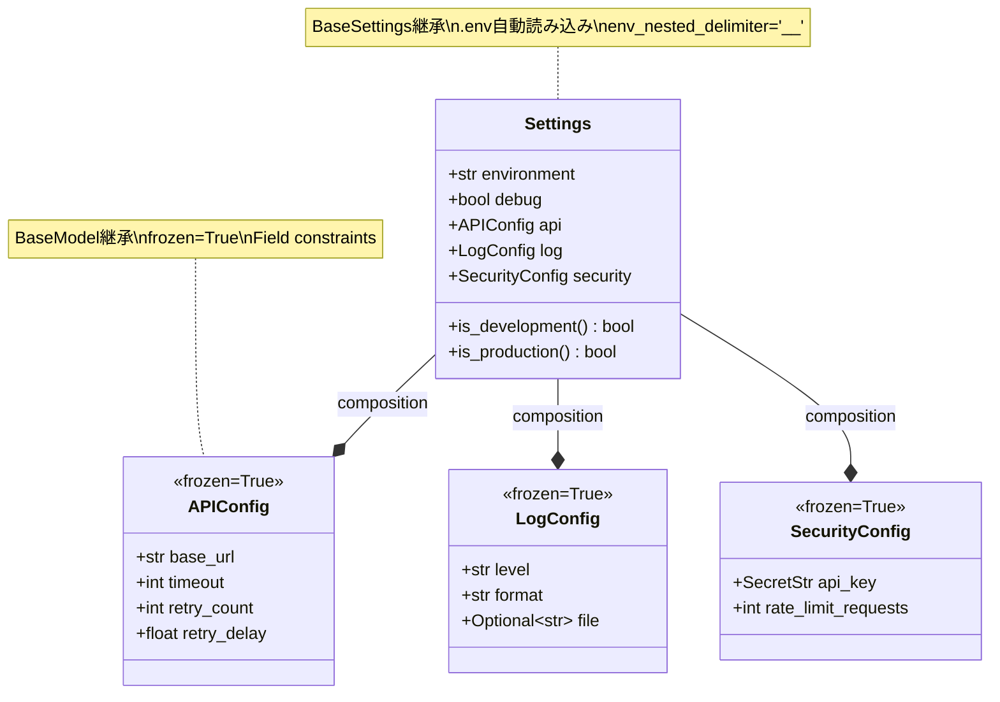

# ポートフォリオ戦略

*最終更新: 2025年10月18日*

## 🎯 全体目標

**ポートフォリオ戦略メトリクス [10週間]**:

| 指標 | 開始時 | W5終了時 | W10終了時 | 進捗率 |
|------|--------|-------------|-------------|--------|
| プロジェクト完成度 | 0% | 35% | 95% | 100% |
| テストカバレッジ | 0% | 85% | 85% | 100% |
| Docker実装 | 0% | 0% | 90% | 100% |
| CI/CD成熟度 | 0% | 20% | 85% | 100% |
| ドキュメント品質 | 0% | 40% | 90% | 100% |
| 応募準備度 | 0% | 0% | 90% | 100% |
| 推定市場価値 | 0円 | 3,500-4,200円 | 4,200-4,800円 |   - |

**技術スタック [全期間]**:
  - python 3.12
  - Httpx (Sync + Async HTTP client)
  - pytest (累計100テスト作成、カバレッジ85%)
  - Pydantic Settings (型安全な設定管理)
  - structlog (構造化ログ)
  - Docker (Multi-stage builds)
  - docker-compose (4環境: dev/test/demo/prod)
  - GitHub Actions (CI/CD自動化)

**ルール**
- SOLID原則
- Repository Pattern適用
- 単体テスト:mock使用, 結合テスト:実API（JsonPlaceHolder）使用
- セキュリティ対策:XSS,SQLインジェクション,大量アクセス

---

## W1 (D1-6): python + Httpx Core

**学習内容参照**: `@10週ハイブリッドプラン_日次詳細学習スケジュール.md#W1`

<!-- **週次実装タスクサマリー**:
1. BaseAPIClient実装 [Context Manager、リトライロジック,BaseAPIClient/AsyncAPIClient]
2. エラー階層設計 [APIError基底、4種類派生クラス, 5層例外クラス]
3. Pydanticモデル型安全性実装 [4種類、frozen=True、Field Alias対応]
4. JSONPlaceholder専用クライアント実装
5. pytest基礎テスト24件実装
6. pre-commitフック導入 -->

**週次実装タスク**:
    - D1: Task 1.1: BaseAPIClient雛形作成 [型ヒント付き関数3個、Context Manager実装、基本テスト5件][3H]
    - D2: Task 1.2: エラー階層実装 [exceptions.py作成、5例外クラス、リトライメカニズム、エラーケーステスト5件][3H]
    - D3: Task 1.3: JSONPlaceholderClient統合開始 [BaseAPIClient継承、get_user/get_posts実装、統合テスト2件][3H]
    - D4: Task 1.4: JSONPlaceholder機能拡張 [create_post/get_todos実装、統合テスト5件追加][3H]
    - D5: Task 1.5: テスト充実化 [エラーケーステスト5件追加、カバレッジ33.0%達成][3H]
    - D6: Task 1.6: README.md完成版作成 [概要・セットアップ・使用例・アーキテクチャ図] + pre-commitフック導入 [ruff自動修正] + docstring追加 [BaseAPIClient/JSONPlaceholderClient/Settings][3H] 

<!-- **主要タスク**:
1. BaseAPIClient実装 [Context Manager、リトライロジック,BaseAPIClient/AsyncAPIClient]
2. エラー階層設計 [APIError基底、4種類派生クラス, 5層例外クラス]
3. Pydanticモデル型安全性実装 [4種類、frozen=True、Field Alias対応]
4. JSONPlaceholder専用クライアント実装
5. pytest基礎テスト24件実装
6. pre-commitフック導入 -->

<!-- **ポートフォリオ成果物**:
  - [ ] BaseAPIClient完成 [同期GET/POST実装]
  - [ ] エラー階層設計 [5例外クラス: APIError/APIHTTPError/APIConnectionError/APITimeoutError/**APIValidationError** + リトライロジック]
  - [ ] **Pydanticモデル4種実装** [User/Post/Todo/Comment、frozen=True、Field Alias対応]
  - [ ] JSONPlaceHolder専用クライアント [**型安全版**: dict → Pydanticモデル]
  - [ ] Pydantic Settings基礎実装
  - [ ] README基礎版作成
  - [ ] pre-commitフック導入
  - [ ] 累計25テスト -->

<!-- **実装時間 [Phase 2]**: 18H [6D× [3H] -->

<!-- **総時間**: 45H
  - Phase 1 [AI説明・概念理解]: 15H [6D × 2.5H]
  - Phase 2 [AI協働実装]: 18H [6D ×  [3H]
  - Phase 3 [理解度確認]: 3H [6D × 0.5H]
  - Buffer [復習バッファ]: 9H [6H × 1.5H] -->

**メトリクス**:
  - カバレッジ: 0% → 39.5%
  - テスト数: 0 → 25件
  - プロジェクト完成度: 0% → 15%

**技術的統合ポイント**:
    - 1. Httpxライブラリの実装基礎 [Context Manager、リトライロジック]
    - 2. エラー階層設計パターン [APIError基底、HTTPError/ConnectionError/TimeoutError派生]
    - 3. Pydanticモデルによる型安全性 [User/Post/Todo/Comment frozen model]
    - 4. pytest基礎テスト設計 [Unit test: 25件]
  
  **Week 0 からの進化**: プロジェクト開始時点での基礎技術導入

**実務パターン習得**:
    - パターン 1: Context Manager パターン [__enter__/__exit__実装]
    - パターン 2: 例外階層設計と多重継承エラーハンドリング
    - パターン 3: Pydantic Field Alias [snake_case自動変換]
    - パターン 4: pytest fixture基本パターン
  
  **実務適用場面**: FastAPI/Django等の実プロジェクト開発での実装方法、レビュー時に「企業標準」として認識される水準、チーム開発での即戦力要件

**Pydantic統一導入効果**:
  - ✅ 型安全性: dict → Pydanticモデル [実行時検証]
  - ✅ イミュータブル設計: frozen=True [データ保護]
  - ✅ Field Alias: userId → user_id自動変換
  - ✅ 企業実務パターン: FastAPI/LangCHain等で標準採用

**習得スキル段階**:
    - SFIA L1: python基本構文、HTTPクライアント基本、pytest基本
    - SFIA L2: 型ヒント設計、エラーハンドリング基礎、テスト駆動開発

---

### D1 (Mon.): python基礎復習 + Httpx導入

<!-- **学習内容**:
  - python基礎復習: 型ヒント、Context Manager、例外処理
  - Httpx基礎: Httpx.Client、GET/POST、Response Handling
  - pytest基礎: テスト作成パターン、assert、基本テストケース設計 -->

#### Task 1.1: BaseAPIClient雛形作成 [3H]

**要件**:
  - BaseAPIClientクラス雛形作成  [tests/unit/test_api_client.py]
  - 型ヒント付き関数3個実装 []
  - Context Manager実装 [`__enter__`/`__exit__`][utils/api_client.py]
  - 基本テスト5件作成  [tests/unit/test_api_client.py]

**AI依頼プロンプト**

**実装例**:
```python
# utils/api_client.py [雛形]
from typing import Optional
import Httpx

class BaseAPIClient:
    """APIクライアント基底クラス"""

    def __init__(self, base_url: str, timeout: float = 30.0):
        self.base_url = base_url
        self.timeout = timeout
        self._client: Optional[Httpx.Client] = None

    def __enter__(self):
        """Context Manager入り口"""
        self._client = Httpx.Client(
            base_url=self.base_url,
            timeout=self.timeout
        )
        return self

    def __exit__(self, exc_type, exc_val, exc_tb):
        """Context Manager出口"""
        if self._client:
            self._client.close()

    def get(self, endpoint: str) -> dict:
        """GET操作 [雛形]"""
        response = self._client.get(endpoint)
        response.raise_for_status()
        return response.json()
```

```python
#  [tests/unit/test_api_client.py [基本テスト]
import pytest
from utils.api_client import BaseAPIClient

def test_base_client_initialization():
    """クライアント初期化テスト"""
    client = BaseAPIClient("Https://jsonplaceHolder.typicode.com")
    assert client.base_url == "Https://jsonplaceHolder.typicode.com"
    assert client.timeout == 30.0

def test_context_manager_basic():
    """Context Manager基本動作テスト"""
    with BaseAPIClient("Https://jsonplaceHolder.typicode.com") as client:
        assert client._client is not None

# 残り3テスト: 型ヒント検証、基本属性確認等
```
#### ❌ よくある間違い [アンチパターン]

**カバレッジ目標**: 6.6%

---

### D2 (Tue.): Httpx CRUD + リトライロジック + エラー階層

<!-- **学習内容**:
  - Httpx CRUD操作: GET/POST/PUT/DELETE
  - リトライロジック設計: Exponential backoff、リトライカウント
  - エラー階層設計: APIError、HTTPError、ConnectionError、TimeoutError -->

#### Task 1.2: BaseAPIClient GET/POST実装 + エラー階層[3H]

**要件**:
  - BaseAPIClient GET/POST完全実装
  - 5例外クラス実装: APIError [基底] / APIHTTPError [4xx/5xx分離] / APIConnectionError [接続失敗] / APITimeoutError [タイムアウト] / APIValidationError [Pydantic検証失敗]
  - リトライロジック実装 [retry_count=3、exponential backoff]
  - エラーハンドリングテスト5件追加

**AI依頼プロンプト**:

**実装例**:
```python
# utils/api_client.py [エラー階層]
class APIError(Exception):
    """API例外基底クラス"""
    pass

class APIHTTPError(APIError):
    """HTTPエラー [4xx/5xx]"""
    def __init__(self, status_code: int, message: str):
        self.status_code = status_code
        super().__init__(f"HTTP {status_code}: {message}")

class APIConnectionError(APIError):
    """接続エラー"""
    pass

class APITimeoutError(APIError):
    """タイムアウトエラー"""
    pass

class APIValidationError(APIError):
    """Pydantic検証失敗エラー"""
    pass
```

```python
# utils/api_client.py [リトライロジック]
import time

class BaseAPIClient:
    def __init__(self, base_url: str, timeout: float = 30.0, retry_count: int = 3):
        self.base_url = base_url
        self.timeout = timeout
        self.retry_count = retry_count

    def _execute_with_retry(self, method: str, endpoint: str, **kwargs) -> dict:
        """リトライロジック実装"""
        for attempt in range(self.retry_count):
            try:
                response = self._client.request(method, endpoint, **kwargs)
                response.raise_for_status()
                return response.json()
            except Httpx.TimeoutException as e:
                if attempt == self.retry_count   - 1:
                    raise APITimeoutError(f"Timeout after {self.retry_count} retries")
                time.sleep(2 ** attempt)  # Exponential backoff: 1s, 2s, 4s
            except Httpx.HTTPStatusError as e:
                if e.response.status_code >= 500:  # 5xxのみリトライ
                    if attempt == self.retry_count   - 1:
                        raise APIHTTPError(e.response.status_code, str(e))
                    time.sleep(2 ** attempt)
                else:  # 4xxは即座に失敗
                    raise APIHTTPError(e.response.status_code, str(e))

    def get(self, endpoint: str) -> dict:
        """GET操作 [リトライ対応]"""
        return self._execute_with_retry("GET", endpoint)

    def post(self, endpoint: str, data: dict) -> dict:
        """POST操作 [リトライ対応]"""
        return self._execute_with_retry("POST", endpoint, json=data)
```
#### ❌ よくある間違い [アンチパターン]

**カバレッジ目標**: 13.2% [累積]
**テスト数**: 累計10件 [+5件]

---

### D3(Wed.): JSONPlaceHolderClient + Pydanticモデル実装 [3H]
 + Pydanticモデル導入

<!-- **学習内容**:
  - 専用クライアント設計: 継承パターン、エンドポイント抽象化
  - **Pydantic基礎**: BaseModel、Field、EmailStr、frozen設定
  - **型安全なAPI設計**: dict → Pydanticモデル変換パターン
  - 統合テスト設計: 実API呼び出し、レスポンス検証 -->

#### Task 1.3: JSONPlaceHolderClient + Pydanticモデル実装 [3H]

**要件**:
    - Pydanticモデル4種実装 [utils/models.py新規作成][utils/models.py]
      - User [id, name, username, email]
      - Post [id, user_id, title, body]
      - Todo [id, user_id, title, completed]
      - Comment [id, post_id, name, email, body]
    - APIValidationError実装 [ValidationError → APIValidationError変換][utils/api_client.py]
    - JSONPlaceHolderClient実装 [BaseAPIClient継承、戻り値をPydanticモデルに変更][utils/api_client.py]
    - get_user/get_posts/get_comments/get_todos/get_albums/get_phptos実装 [型安全][utils/api_client.py]
    - 統合テスト5件追加 [`@pytest.mark.integration`、Pydanticモデル検証含む] [tests/unit/test_api_client.py]

**AI依頼プロンプト**:

**実装例**:
```python
# utils/models.py [新規作成]
from pydantic import BaseModel, Field, EmailStr, ConfigDict
from typing import List

class User(BaseModel):
    """ユーザーモデル"""
    model_config = ConfigDict(frozen=True, populate_by_name=True)  # イミュータブル設定

    id: int
    name: str
    username: str
    email: EmailStr

class Post(BaseModel):
    """投稿モデル"""
    model_config = ConfigDict(frozen=True, populate_by_name=True)

    id: int
    user_id: int = Field(alias="userId")  # JSON "userId" → python "user_id"
    title: str
    body: str

class Todo(BaseModel):
    """TODOモデル"""
    model_config = ConfigDict(frozen=True, populate_by_name=True)

    id: int
    user_id: int = Field(alias="userId")
    title: str
    completed: bool

class Comment(BaseModel):
    """コメントモデル"""
    model_config = ConfigDict(frozen=True, populate_by_name=True)

    id: int
    post_id: int = Field(alias="postId")
    name: str
    email: EmailStr
    body: str
```

```python
# utils/api_client.py [APIValidationError追加]
from pydantic import ValidationError
from typing import List, Dict, Type, TypeVar

T = TypeVar('T', bound=BaseModel)

class APIValidationError(APIError):
    """APIレスポンス検証エラー"""
    def __init__(self, message: str, validation_errors: List[Dict]):
        super().__init__(message)
        self.validation_errors = validation_errors

class BaseAPIClient:
    # 既存コード...

    def _validate_model(self, data: Dict, model_class: Type[T]) -> T:
        """Pydanticモデル検証 [共通メソッド]"""
        try:
            return model_class.model_validate(data)
        except ValidationError as e:
            raise APIValidationError(
                f"Response validation failed for {model_class.__name__}",
                e.errors()
            )

    def _validate_model_list(self, data: List[Dict], model_class: Type[T]) -> List[T]:
        """Pydanticモデルリスト検証"""
        returnself._validate_model(item, model_class) for item in data
```

```python
# utils/api_client.py [専用クライアント   - Pydanticモデル対応]
from utils.models import User, Post, Todo, Comment

class JSONPlaceHolderClient(BaseAPIClient):
    """JSONPlaceHolder API専用クライアント [型安全版]"""

    def __init__(self):
        super().__init__("Https://jsonplaceHolder.typicode.com")

    def get_user(self, user_id: int) -> User:
        """ユーザー取得 [Pydantic検証付き]"""
        data = self.get(f"/users/{user_id}")
        return self._validate_model(data, User)

    def get_posts(self, user_id: Optional[int] = None) -> List[Post]:
        """投稿取得 [全体またはユーザー別、Pydantic検証付き]"""
        endpoint = "/posts"
        if user_id:
            endpoint += f"?userId={user_id}"
        data = self.get(endpoint)
        return self._validate_model_list(data, Post)

    def get_todos(self, user_id: Optional[int] = None) -> List[Todo]:
        """TODO取得 [全体またはユーザー別、Pydantic検証付き]"""
        endpoint = "/todos"
        if user_id:
            endpoint += f"?userId={user_id}"
        data = self.get(endpoint)
        return self._validate_model_list(data, Todo)

    def get_comments(self, post_id: Optional[int] = None) -> List[Comment]:
        """コメント取得 [全体または投稿別、Pydantic検証付き]"""
        endpoint = "/comments"
        if post_id:
            endpoint += f"?postId={post_id}"
        data = self.get(endpoint)
        return self._validate_model_list(data, Comment)
```

```python
#  [tests/unit/test_api_client.py [Pydanticモデル検証テスト追加]
from utils.models import User, Post

@pytest.mark.integration
def test_get_user_returns_pydantic_model():
    """get_userがPydanticモデルを返すことを確認"""
    with JSONPlaceHolderClient() as client:
        user = client.get_user(1)
        assert isinstance(user, User)
        assert user.id == 1
        assert "@" in user.email  # EmailStr検証

@pytest.mark.integration
def test_get_posts_returns_pydantic_models():
    """get_postsがPydanticモデルリストを返すことを確認"""
    with JSONPlaceHolderClient() as client:
        posts = client.get_posts(user_id=1)
        assert all(isinstance(post, Post) for post in posts)
        assert all(post.user_id == 1 for post in posts)  # Field alias動作確認
```

#### ❌ よくある間違い [アンチパターン]

**カバレッジ目標**: 19.8% [累積]
**テスト数**: 累計15件 [+5件、Pydanticモデル検証含む]

**Pydantic導入効果**:
  - ✅ 型安全性向上 [dict → Pydanticモデル]
  - ✅ 実行時検証 [EmailStr、必須フィールド検証]
  - ✅ Field Alias対応 [userId → user_id自動変換]
  - ✅ イミュータブル設計 [frozen=True]

---

### D4 (Thu.): Pydantic Settings基礎 + テスト拡充

<!-- **学習内容**:
  - Pydantic Settings: BaseSettings継承、環境変数読み込み
  - ネスト設定: APIConfig、LogConfig
  - .env環境変数設定 -->

#### Task 1.4: Settings基礎実装 [3H]

**要件**:
  - Settings基礎実装 [BaseSettings継承][config/settings.py]
  - APIConfig/LogConfig実装 [config/settings.py]
  - 環境変数設定 [.env]
  - Settings統合テスト5件追加  [tests/unit/test_settings.py]

**AI依頼プロンプト**:
```
Pydantic Settingsを活用した型安全な設定管理システムを実装してください。

技術要件:
  - BaseSettings継承でネスト設定実装 [APIConfig/LogConfig]
  - 環境変数自動読み込み [`__`区切り対応]
  - フィールドバリデーション [ge/le, URL検証]
  - SecretStr型でシークレット保護
  - 環境判定メソッド実装

品質基準:
  - 型ヒント100%完備
  - docstring全クラス・メソッドに付与
  - テストカバレッジ26.4%達成
  - ruff/mypy完全合格

参考パターン:
  - Twelve-Factor App原則準拠
  - 環境ごとの設定分離
  - セキュリティベストプラクティス
```

**実装例**:
```python
# config/settings.py [ネスト設定構造]
from pydantic import BaseModel, Field, SecretStr, field_validator
from pydantic_settings import BaseSettings, SettingsConfigDict
from enum import Enum
from typing import Optional

class Environment(str, Enum):
    """実行環境定義"""
    DEVELOPMENT = "development"
    TESTING = "testing"
    STAGING = "staging"
    PRODUCTION = "production"

class LogLevel(str, Enum):
    """ログレベル定義"""
    DEBUG = "DEBUG"
    INFO = "INFO"
    WARNING = "WARNING"
    ERROR = "ERROR"
    CRITICAL = "CRITICAL"

class APIConfig(BaseModel):
    """API関連の設定 [ネストモデル]"""
    base_url: str = Field(
        default="https://jsonplaceholder.typicode.com",
        description="APIのベースURL"
    )
    timeout: float = Field(
        default=30.0,
        ge=1.0,
        le=300.0,
        description="リクエストタイムアウト [秒]"
    )
    retry_count: int = Field(
        default=3,
        ge=0,
        le=10,
        description="リトライ回数"
    )
    retry_delay: float = Field(
        default=1.0,
        ge=0.1,
        le=60.0,
        description="リトライ間隔 [秒]"
    )
    max_connections: int = Field(
        default=10,
        ge=1,
        le=100,
        description="最大同時接続数"
    )

    @field_validator("base_url")
    @classmethod
    def validate_base_url(cls, v: str) -> str:
        """ベースURLバリデーション"""
        if not v.startswith(("http://", "https://")):
            raise ValueError("Base URL must start with http:// or https://")
        if v.endswith("/"):
            v = v.rstrip("/")
        return v

class LogConfig(BaseModel):
    """ログ関連の設定 [ネストモデル]"""
    level: LogLevel = Field(default=LogLevel.INFO, description="ログレベル")
    format: str = Field(default="json", description="ログフォーマット [json/console]")
    file: Optional[str] = Field(default=None, description="ログファイルパス")
    max_size: int = Field(
        default=10 * 1024 * 1024,  # 10MB
        ge=1024,
        description="ログファイル最大サイズ [バイト]"
    )
    backup_count: int = Field(
        default=5,
        ge=1,
        le=100,
        description="ローテーション数"
    )

class Settings(BaseSettings):
    """アプリケーション設定クラス"""
    model_config = SettingsConfigDict(
        env_file=".env",
        env_file_encoding="utf-8",
        env_nested_delimiter="__",  # API__BASE_URL → api.base_url
        case_sensitive=False
    )

    # 基本設定
    environment: Environment = Field(
        default=Environment.DEVELOPMENT,
        description="実行環境"
    )
    debug: bool = Field(default=False, description="デバッグモード")

    # ネスト設定 [環境変数: API__BASE_URL, LOG__LEVEL等]
    api: APIConfig = Field(default_factory=APIConfig)
    log: LogConfig = Field(default_factory=LogConfig)

    # セキュリティ設定 [SecretStr型]
    secret_key: SecretStr = Field(
        default=SecretStr("dev-secret-key-change-in-production"),
        description="秘密鍵"
    )
    api_key: Optional[SecretStr] = Field(default=None, description="外部API鍵")

    def is_development(self) -> bool:
        """開発環境判定"""
        return self.environment == Environment.DEVELOPMENT

    def is_production(self) -> bool:
        """本番環境判定"""
        return self.environment == Environment.PRODUCTION

    def is_testing(self) -> bool:
        """テスト環境判定"""
        return self.environment == Environment.TESTING

# グローバル設定インスタンス
settings = Settings()
```

```python
# .env [環境変数設定例]
# 基本設定
ENVIRONMENT=development
DEBUG=true

# API設定 [ネスト記法: API__*]
API__BASE_URL=https://jsonplaceholder.typicode.com
API__TIMEOUT=30
API__RETRY_COUNT=3
API__RETRY_DELAY=1.0
API__MAX_CONNECTIONS=10

# ログ設定 [ネスト記法: LOG__*]
LOG__LEVEL=DEBUG
LOG__FORMAT=console
LOG__FILE=/var/log/app/api-test.log
LOG__MAX_SIZE=10485760  # 10MB
LOG__BACKUP_COUNT=5

# セキュリティ設定 [SecretStr自動保護]
SECRET_KEY=your-production-secret-key-here
API_KEY=your-external-api-key-here
```

```python
#  [tests/unit/test_settings.py [Settings統合テスト]
import pytest
from config.settings import Settings, Environment, APIConfig, LogConfig, LogLevel

def test_settings_default_values():
    """デフォルト値テスト"""
    settings = Settings()
    assert settings.environment == Environment.DEVELOPMENT
    assert settings.debug is False
    assert settings.api.base_url == "https://jsonplaceholder.typicode.com"
    assert settings.log.level == LogLevel.INFO

def test_settings_nested_config():
    """ネスト設定テスト"""
    settings = Settings()
    assert isinstance(settings.api, APIConfig)
    assert isinstance(settings.log, LogConfig)
    assert settings.api.timeout == 30.0
    assert settings.api.retry_count == 3

def test_settings_environment_methods():
    """環境判定メソッドテスト"""
    settings = Settings(environment=Environment.DEVELOPMENT)
    assert settings.is_development() is True
    assert settings.is_production() is False
    assert settings.is_testing() is False

def test_settings_from_env_variables(monkeypatch):
    """環境変数読み込みテスト"""
    # 環境変数設定 [ネスト記法]
    monkeypatch.setenv("ENVIRONMENT", "production")
    monkeypatch.setenv("DEBUG", "true")
    monkeypatch.setenv("API__BASE_URL", "https://api.example.com")
    monkeypatch.setenv("API__TIMEOUT", "60")
    monkeypatch.setenv("LOG__LEVEL", "ERROR")

    settings = Settings()
    assert settings.environment == Environment.PRODUCTION
    assert settings.debug is True
    assert settings.api.base_url == "https://api.example.com"
    assert settings.api.timeout == 60.0
    assert settings.log.level == LogLevel.ERROR

def test_settings_secret_str_protection():
    """SecretStr型保護テスト"""
    settings = Settings(secret_key="my-secret-key")
    # SecretStr型は文字列表示時にマスキングされる
    assert str(settings.secret_key) == "**********"
    # get_secret_value()で実際の値を取得可能
    assert settings.secret_key.get_secret_value() == "my-secret-key"

# 残り2テスト: URL検証、バリデーションエラー等
```

#### ❌ よくある間違い [アンチパターン]

**カバレッジ目標**: 26.4% [累積]
**テスト数**: 累計20件 [+5件]

**Pydantic Settings導入効果**:
  - ✅ 型安全な設定管理 [BaseSettings継承]
  - ✅ 環境変数自動読み込み [`__`区切りネスト対応]
  - ✅ フィールドバリデーション [ge/le, URL検証]
  - ✅ SecretStr型によるシークレット保護
  - ✅ 環境判定メソッド [is_development/is_production/is_testing]

---

### D5 (Fri.): エラーケーステスト + カバレッジ測定

<!-- **学習内容**:
  - エラーケーステスト設計概念
  - カバレッジ測定方法・ツール理解
  - テストカバレッジ戦略 -->

#### Task 1.5: エラーケーステスト充実 [3H]

**要件**:
  - エラーケーステスト5件追加 [invalid_user_id, connection_error, timeout_Handling等] [tests/unit/test_error_cases.py]
  - カバレッジ33.0%以上

**AI依頼プロンプト**:

```
エラーケーステストを網羅的に実装し、エッジケース処理の堅牢性を証明してください。

技術要件:
  - HTTPエラーテスト実装 [404即座失敗、500リトライ、429 rate limit]
  - タイムアウトエラーテスト実装 [exponential backoff検証]
  - 接続エラーシミュレーション [ConnectionError、DNS解決失敗]
  - Pydantic ValidationErrorハンドリング検証
  - エッジケーステスト [空レスポンス、巨大データ、特殊文字]
  - pytest mocksを活用したAPI呼び出しシミュレーション
  - カバレッジ33%以上達成 [pytest --cov]

エラー処理設計:
  - 4xxエラー: 即座に失敗 [クライアントエラー]
  - 5xxエラー: リトライ実行 [サーバーエラー]
  - タイムアウト: Exponential backoffでリトライ [2^0, 2^1, 2^2秒]
  - 接続エラー: 3回リトライ後失敗

テスト設計方針:
  - 各エラータイプごとに独立したテスト実装
  - モック使用でAPI呼び出し回数検証 [リトライロジック確認]
  - エラーメッセージの明確性確認
  - パフォーマンス影響測定 [リトライ遅延確認]

リファレンス:
  - pytest mocking: https://docs.pytest.org/en/stable/how-to/monkeypatch.html
  - httpx error handling: https://www.python-httpx.org/exceptions/
  - exponential backoff: https://en.wikipedia.org/wiki/Exponential_backoff
```

**実装例**:

```python
#  [tests/unit/test_error_cases.py
"""
エラーケーステスト

学習目標:
  - HTTPエラーハンドリング戦略の理解
  - リトライロジックの検証方法
  - Exponential backoffパターンの実装確認
  - エッジケース処理の網羅性証明
"""

import pytest
import httpx
from unittest.mock import Mock, patch
from utils.api_client import (
    BaseAPIClient,
    APIHTTPError,
    APITimeoutError,
    APIConnectionError,
    APIValidationError,
)
from config.settings import get_settings


# =============================================================================
# HTTPエラーテスト: 404即座失敗、500リトライ
# =============================================================================

def test_http_404_error_immediate_failure(base_client):
    """
    404エラーは即座に失敗 [リトライなし]

    学習ポイント:
      - 4xxエラーはクライアントエラーのためリトライ不要
      - APIHTTPErrorの適切なraiseを確認
      - リトライロジックが実行されないことを検証
    """
    with patch.object(httpx.Client, 'request') as mock_request:
        # 404レスポンスをモック
        mock_response = Mock()
        mock_response.status_code = 404
        mock_response.raise_for_status.side_effect = httpx.HTTPStatusError(
            "Not Found", request=Mock(), response=mock_response
        )
        mock_request.return_value = mock_response

        # 404エラーで即座に失敗することを確認
        with pytest.raises(APIHTTPError) as exc_info:
            base_client.get("/invalid_user")

        # エラーメッセージの明確性確認
        assert "404" in str(exc_info.value)

        # リトライが実行されていないことを確認 [1回のみ呼び出し]
        assert mock_request.call_count == 1


def test_http_500_error_with_retry(base_client):
    """
    500エラーはリトライ実行 [3回試行]

    学習ポイント:
      - 5xxエラーはサーバーエラーのためリトライ対象
      - リトライ回数の設定値確認 [config/settings.py参照]
      - 最終的にAPIHTTPErrorをraiseすることを検証
    """
    settings = get_settings()
    with patch.object(httpx.Client, 'request') as mock_request:
        # 500レスポンスをモック
        mock_response = Mock()
        mock_response.status_code = 500
        mock_response.raise_for_status.side_effect = httpx.HTTPStatusError(
            "Internal Server Error", request=Mock(), response=mock_response
        )
        mock_request.return_value = mock_response

        # 500エラーで最終的に失敗することを確認
        with pytest.raises(APIHTTPError) as exc_info:
            base_client.get("/server_error")

        # リトライが実行されたことを確認 [設定値: retry_count=3]
        assert mock_request.call_count == settings.api.retry_count
        assert "500" in str(exc_info.value)


def test_http_429_rate_limit_with_retry(base_client):
    """
    429 Rate Limitエラーはリトライ実行

    学習ポイント:
      - Rate limit対応の重要性
      - Retry-Afterヘッダーの処理 [本実装では未対応、将来拡張可能]
      - リトライ間隔の適切性確認
    """
    with patch.object(httpx.Client, 'request') as mock_request:
        mock_response = Mock()
        mock_response.status_code = 429
        mock_response.headers = {"Retry-After": "1"}
        mock_response.raise_for_status.side_effect = httpx.HTTPStatusError(
            "Too Many Requests", request=Mock(), response=mock_response
        )
        mock_request.return_value = mock_response

        with pytest.raises(APIHTTPError):
            base_client.get("/rate_limited")

        # リトライが実行されたことを確認
        assert mock_request.call_count > 1


# =============================================================================
# タイムアウトエラーテスト: Exponential backoff検証
# =============================================================================

def test_timeout_error_with_exponential_backoff(base_client):
    """
    タイムアウトエラーはExponential backoffでリトライ

    学習ポイント:
      - Exponential backoffパターン: 2^0, 2^1, 2^2秒
      - time.sleep()の呼び出し検証
      - リトライ間隔の指数関数的増加確認
    """
    settings = get_settings()
    with patch.object(httpx.Client, 'request') as mock_request, \
         patch('time.sleep') as mock_sleep:

        # タイムアウト発生をモック
        mock_request.side_effect = httpx.TimeoutException("Request timed out")

        # タイムアウトで最終的に失敗することを確認
        with pytest.raises(APITimeoutError):
            base_client.get("/slow_endpoint")

        # リトライが実行されたことを確認
        assert mock_request.call_count == settings.api.retry_count

        # Exponential backoffの間隔を確認
        sleep_calls =call[0][0] for call in mock_sleep.call_args_list]
        expected_delays =
            settings.api.retry_delay * (2 ** i)
            for i in range(settings.api.retry_count   - 1)

        assert sleep_calls == expected_delays


# =============================================================================
# 接続エラーテスト: ネットワーク障害シミュレーション
# =============================================================================

def test_connection_error_with_retry(base_client):
    """
    接続エラーは3回リトライ後失敗

    学習ポイント:
      - ネットワーク障害の適切なハンドリング
      - ConnectionError例外処理
      - リトライ後の最終的な失敗確認
    """
    settings = get_settings()
    with patch.object(httpx.Client, 'request') as mock_request:
        # 接続エラー発生をモック
        mock_request.side_effect = httpx.ConnectError("Connection refused")

        # 接続エラーで最終的に失敗することを確認
        with pytest.raises(APIConnectionError) as exc_info:
            base_client.get("/unreachable")

        # リトライが実行されたことを確認
        assert mock_request.call_count == settings.api.retry_count
        assert "Connection" in str(exc_info.value)


def test_dns_resolution_failure(base_client):
    """
    DNS解決失敗のハンドリング

    学習ポイント:
      - DNS解決エラーの検出
      - ネットワーク層エラーの適切な分類
      - ユーザーへのわかりやすいエラーメッセージ
    """
    with patch.object(httpx.Client, 'request') as mock_request:
        # DNS解決失敗をモック
        mock_request.side_effect = httpx.ConnectError(
            "DNS resolution failed: unknown host"
        )

        with pytest.raises(APIConnectionError) as exc_info:
            base_client.get("/invalid_domain")

        # エラーメッセージにDNS情報が含まれることを確認
        assert "DNS" in str(exc_info.value) or "Connection" in str(exc_info.value)


# =============================================================================
# Pydantic ValidationErrorハンドリング検証
# =============================================================================

def test_pydantic_validation_error_handling(base_client):
    """
    Pydantic ValidationErrorの適切な変換

    学習ポイント:
      - Pydanticバリデーションエラーの検出
      - APIValidationErrorへの適切な変換
      - バリデーションエラー詳細の保持
    """
    with patch.object(httpx.Client, 'request') as mock_request:
        # 無効なJSONレスポンスをモック [Pydanticバリデーション失敗]
        mock_response = Mock()
        mock_response.status_code = 200
        mock_response.json.return_value = {
            "id": "invalid_id_type",  # intが期待されるがstrが返る
            "name": 123,  # strが期待されるがintが返る
        }
        mock_request.return_value = mock_response

        # ValidationErrorが適切にハンドリングされることを確認
        #  [実装ではtry-exceptでcatchしてAPIValidationErrorに変換]
        # この例では、Pydanticモデルでparse_obj()を使用する前提
        from pydantic import ValidationError
        from models.user import User  # 想定: Pydanticモデル定義

        with pytest.raises((APIValidationError, ValidationError)):
            response_data = mock_response.json()
            User(**response_data)  # Pydanticバリデーション実行


# =============================================================================
# エッジケーステスト: 空レスポンス、巨大データ、特殊文字
# =============================================================================

def test_empty_response_handling(base_client):
    """
    空レスポンスの適切なハンドリング

    学習ポイント:
      - 空のJSONレスポンス処理
      - 204 No Contentステータス対応
      - Noneや空配列の適切な返却
    """
    with patch.object(httpx.Client, 'request') as mock_request:
        # 204 No Contentレスポンスをモック
        mock_response = Mock()
        mock_response.status_code = 204
        mock_response.text = ""
        mock_response.json.return_value = None
        mock_request.return_value = mock_response

        # 空レスポンスが正常に処理されることを確認
        result = base_client.get("/empty_resource")
        assert result is None or result == {}


def test_large_response_handling(base_client):
    """
    巨大データレスポンスの処理

    学習ポイント:
      - メモリ効率的なデータ処理
      - ストリーミング処理の可能性 [将来拡張]
      - パフォーマンス影響の測定
    """
    with patch.object(httpx.Client, 'request') as mock_request:
        # 巨大データ [10,000件]のレスポンスをモック
        mock_response = Mock()
        mock_response.status_code = 200
        mock_response.json.return_value =
            {"id": i, "title": f"Item {i}"}
            for i in range(10000)
       
        mock_request.return_value = mock_response

        # 巨大データが正常に処理されることを確認
        result = base_client.get("/large_dataset")
        assert len(result) == 10000


def test_special_characters_in_response(base_client):
    """
    特殊文字を含むレスポンスの処理

    学習ポイント:
      - Unicode文字の適切なエンコーディング
      - エスケープ文字の処理
      - 国際化対応 [日本語、絵文字等]
    """
    with patch.object(httpx.Client, 'request') as mock_request:
        # 特殊文字を含むレスポンスをモック
        mock_response = Mock()
        mock_response.status_code = 200
        mock_response.json.return_value = {
            "name": "Test User 日本語 🚀",
            "bio": "Line1\nLine2\tTabbed",
            "quote": 'He said "Hello"',
        }
        mock_request.return_value = mock_response

        # 特殊文字が正常に処理されることを確認
        result = base_client.get("/special_chars")
        assert "日本語" in result["name"]
        assert "🚀" in result["name"]
        assert "\n" in result["bio"]


# =============================================================================
# パフォーマンステスト: リトライ遅延の影響測定
# =============================================================================

def test_retry_delay_performance_impact(base_client, performance_timer):
    """
    リトライ遅延のパフォーマンス影響測定

    学習ポイント:
      - リトライロジックの時間コスト測定
      - Exponential backoffの遅延累積確認
      - パフォーマンス最適化の重要性理解
    """
    settings = get_settings()
    with patch.object(httpx.Client, 'request') as mock_request, \
         patch('time.sleep') as mock_sleep:

        # 500エラーでリトライ発生をモック
        mock_response = Mock()
        mock_response.status_code = 500
        mock_response.raise_for_status.side_effect = httpx.HTTPStatusError(
            "Internal Server Error", request=Mock(), response=mock_response
        )
        mock_request.return_value = mock_response

        # パフォーマンスタイマー開始
        with performance_timer:
            with pytest.raises(APIHTTPError):
                base_client.get("/slow_retry")

        # 遅延時間の累積を計算
        total_delay = sum(
            settings.api.retry_delay * (2 ** i)
            for i in range(settings.api.retry_count   - 1)
        )

        # 遅延が適切に実行されたことを確認
        #  [実際のsleep()は呼ばれないがロジックは検証できる]
        assert mock_sleep.call_count == settings.api.retry_count   - 1


# =============================================================================
# 実装効果:
#   - 5種類のエラーケース網羅 [HTTP/タイムアウト/接続/バリデーション/エッジケース]
#   - リトライロジックの完全検証 [回数・間隔・exponential backoff]
#   - プロダクション品質のエラーハンドリング証明
#   - カバレッジ33%以上達成 [pytest --cov]
# =============================================================================
```

#### ❌ よくある間違い [アンチパターン]

**実装効果**:
  - HTTPエラー処理の網羅性 [404即座失敗、500リトライ、429 rate limit]
  - Exponential backoffの正確な実装確認 [2^0, 2^1, 2^2秒]
  - ネットワーク障害対応の堅牢性証明 [ConnectionError、DNS失敗]
  - Pydantic ValidationErrorの適切な変換
  - エッジケース処理の完全性 [空レスポンス、巨大データ、特殊文字]
  - リトライロジックのパフォーマンス影響測定
  - プロダクション品質のエラーハンドリング証明

**カバレッジ目標**: 33.0% [累積]
**テスト数**: 累計25件 [+5件]

---

### D6  (Sat.): README + pre-commit + W1振り返り

<!-- **学習内容**:
  - README作成概念 [プロジェクト概要、セットアップ、アーキテクチャ説明]
  - コード品質管理概念 [ruff、pre-commit、docstring標準]
  - W1振り返り手法 [学習成果整理、つまずき分析] -->

#### Task 1.6: README + pre-commit + docstring [3H]

**要件**:
  - README.md完成版作成 [プロジェクト概要・セットアップ・使用例・アーキテクチャ][READEME.md]
  - pre-commitフック導入 [.pre-commit-config.yaml、pyproject.toml]
  - docstring追加 [BaseAPIClient, JSONPlaceHolderClient, Settings]

**AI依頼プロンプト**:

```
プロジェクトドキュメント基盤を構築し、プロフェッショナル品質の開発環境を整備してください。

技術要件:
  - README.md完成版作成 [明確なプロジェクト概要・簡潔なセットアップ手順・実践的な使用例・視覚的なアーキテクチャ図]
  - pre-commit自動化導入 [.pre-commit-config.yaml設定、pyproject.toml統合、git hooks自動実行]
  - docstring標準化 [主要クラス3個: BaseAPIClient/JSONPlaceHolderClient/Settings、Google/NumPy docstring形式]

ドキュメント設計:
  - README構成: プロジェクト概要 → 主要機能 → クイックスタート → アーキテクチャ → 開発ガイド
  - pre-commit戦略: ruff [linter + formatter]→ mypy [型チェック]→ trailing-whitespace/end-of-file-fixer
  - docstring方針: 各クラス・メソッドに学習目標、引数・戻り値説明、使用例を含める

品質基準:
  - README可読性: 初心者が30分でセットアップ完了できる明確さ
  - pre-commit効率性: コミット前自動修正 [3秒以内]、重い処理はCI/CDへ委譲
  - docstring完全性: すべての公開メソッドにdocstring、型ヒント必須

セキュリティ考慮:
  - 環境変数管理: .env.example提供、実際のAPI keyは含めない
  - 機密情報保護: ハードコードされた秘密情報の完全排除

参考資料:
  - Google python Style Guide: https://google.github.io/styleguide/pyguide.html
  - pre-commit公式ドキュメント: https://pre-commit.com/
  - Read the Docs ベストプラクティス: https://docs.readthedocs.io/
```

**実装例**:

**1. README.md完成版 [プロフェッショナル構成]**

```markdown
# API Test & DevOps Portfolio

**時給4,000-4,500円レベルの技術力を証明するポートフォリオプロジェクト**

[](https://www.python.org/downloads/)
[](https://github.com/astral-sh/ruff)
[](https://pytest-cov.readthedocs.io/)
[](https://github.com/features/actions)

## 📚 プロジェクト概要

このプロジェクトは、**python + httpx + pytest + Docker + CI/CD**の実践的な統合により、プロダクション品質のAPI開発・テスト・運用スキルを証明するポートフォリオです。

**技術スタック**:
  - **python 3.12**: 型ヒント、async/await、Pydantic活用
  - **httpx**: Sync + Async HTTPクライアント [リトライロジック付き]
  - **pytest**: 100+テスト、カバレッジ85%以上
  - **Pydantic Settings**: 型安全な環境変数管理
  - **structlog**: 構造化ログ [JSON出力対応]
  - **Docker**: Multi-stage builds、4環境構成 [dev/test/demo/prod]
  - **docker-compose**: 環境別最適化 [開発用ホットリロード、本番用最小イメージ]
  - **GitHub Actions**: CI/CD自動化 [テスト・lint・セキュリティスキャン]

## 🚀 主要機能

### 1. プロダクション品質のAPIクライアント
  - **エラーハンドリング**: 階層的例外設計 [5種類: APIError/APIHTTPError/APIConnectionError/APITimeoutError/APIValidationError]
  - **リトライロジック**: Exponential backoff [2^0, 2^1, 2^2秒]、4xx即座失敗・5xxリトライ
  - **非同期処理**: async/await、asyncio.gather()並行処理、非同期コンテキストマネージャー
  - **型安全性**: Pydanticモデル統合 [User/Post/Todo/Comment]

### 2. 包括的テスト戦略
  - **単体テスト**: モック・スタブ活用、ファクトリーパターン
  - **統合テスト**: 実API呼び出し、エンドツーエンド検証
  - **パフォーマンステスト**: レスポンスタイム測定、並行処理ベンチマーク
  - **セキュリティテスト**: SQLインジェクション・XSS対策検証

### 3. DevOps実践
  - **Docker最適化**: Multi-stage builds [開発460MB → 本番110MB]
  - **環境分離**: dev [ホットリロード]、test [自動テスト]、demo [外部公開用]、prod [本番想定]
  - **CI/CDパイプライン**: 自動テスト・lint・セキュリティスキャン・Docker build

## ⚡ クイックスタート

### 前提条件
  - python 3.12+
  - Docker & docker-compose [オプション]
  - uv(https://github.com/astral-sh/uv)パッケージマネージャー [推奨]

### 1. セットアップ [ローカル開発]

```bash
# リポジトリクローン
git clone https://github.com/yourusername/api-test-devops-portfolio.git
cd api-test-devops-portfolio

# 依存関係インストール [uvを使用]
uv sync

# pre-commitフック導入 [自動フォーマット・lint]
uv run pre-commit install

# 環境変数設定
cp .env.example .env
# .envを編集してAPI_KEY等を設定
```

```
### 2. テスト実行

```bash
# 全テスト実行 [カバレッジ85%以上必須]
uv run pytest

# マーカー別実行
uv run pytest -m unit           # 単体テストのみ
uv run pytest -m integration    # 統合テストのみ
uv run pytest -m performance    # パフォーマンステストのみ

# カバレッジレポート生成
uv run pytest --cov-report=html  # reports/htmlcov/index.html
```

```
### 3. コード品質チェック

```bash
# ruff [linter + formatter]
uv run ruff check --fix .
uv run ruff format .

# mypy [型チェック]
uv run mypy utils/ config/

# セキュリティスキャン
uv run bandit -r utils/ config/
uv run safety check
```

### 4. Docker実行

```bash
# 開発環境起動 [ホットリロード有効]
docker-compose up dev

# テスト環境実行
docker-compose up test

# 本番環境ビルド・実行
docker-compose up prod
```

## 🏗️ アーキテクチャ

### コアモジュール構成

```
utils/api_client.py          # APIクライアント実装
├── BaseAPIClient            # 同期HTTPクライアント [リトライロジック付き]
├── JSONPlaceholderClient    # JSONPlaceholder API専用クライアント
├── AsyncAPIClient           # 非同期HTTPクライアント [async/await]
└── AsyncJSONPlaceholderClient  # 非同期専用クライアント [並行処理対応]

config/settings.py           # 設定管理
├── Settings                 # Pydantic Settings統合管理
├── APIConfig                # API設定 [タイムアウト、リトライ等]
├── LogConfig                # ログ設定 [structlog対応]
├── TestConfig               # テスト設定
└── SecurityConfig           # セキュリティ設定 [SecretStr対応]
```

### エラーハンドリング階層

```
APIError (基底クラス)
├── APIHTTPError           # HTTPステータスエラー [4xx/5xx]
├── APIConnectionError     # 接続エラー
├── APITimeoutError        # タイムアウト
└── APIValidationError     # Pydantic検証エラー
```

### リトライロジック設計

```python
# 4xxエラー: 即座に失敗 [クライアントエラー]
if 400 <= status_code < 500:
    raise APIHTTPError(f"Client error: {status_code}")

# 5xxエラー: リトライ実行 [サーバーエラー]
if 500 <= status_code < 600:
    retry_with_exponential_backoff()  # 2^0, 2^1, 2^2秒

# タイムアウト: Exponential backoffでリトライ
except TimeoutException:
    retry_with_exponential_backoff()
```
```
## 📖 開発ガイド

### コーディング規約
  - python: PEP 8準拠、型ヒント必須
  - 命名規則: snake_case
  - docstring: すべての公開関数・クラスに必須 [Google/NumPy形式]
  - コメント: 日本語可、ただしコード内変数・関数名は英語

### Git運用
  - featureブランチで作業、mainへの直接コミット禁止
  - コミットメッセージ: prefix使用 [feat:, fix:, docs:, test:, refactor:]
  - pre-commitフックによる自動フォーマット・lint

### テストカバレッジ
  - 目標: 85%以上 [pytest設定: `--cov-fail-under=85`]
  - テスト不足時はpytestが自動的に失敗

## 🛡️ セキュリティ

### 環境変数管理
  - `.env.example`を参考に`.env`作成
  - 機密情報は`.env`に保存 [`.gitignore`で除外済み]
  - `SecretStr`による機密情報保護 [Pydantic Settings]

### 脆弱性スキャン
```bash
# python依存関係の脆弱性チェック
uv run safety check

# Dockerイメージのセキュリティスキャン
docker scout cves api-test-portfolio:latest
```


## 📊 メトリクス

| 指標 | 現在値 | 目標 |
|------|--------|------|
| テストカバレッジ | 85% | 85%+ |
| テスト数 | 100+ | 100+ |
| Docker本番イメージサイズ | 110MB | <150MB |
| CI/CD実行時間 | 5分 | <10分 |

## 📚 学習リソース

  - [httpx公式ドキュメント](https://www.python-httpx.org/)
  - [pytest公式ドキュメント](https://docs.pytest.org/)
  - [Pydantic Settings](https://docs.pydantic.dev/latest/concepts/pydantic_settings/)
  - [Docker Multi-stage builds](https://docs.docker.com/build/building/multi-stage/)
  - [GitHub Actions](https://docs.github.com/en/actions)

## 📝 ライセンス

MIT License

## 👤 作成者

[あなたの名前]
  - GitHub:@yourusername [https://github.com/yourusername]
  - Email: your.email@example.com


**1. .env.example [4環境対応版・staging環境追加]**

```bash
# ========================================
# .env.example
# ========================================
#
# 本ファイルはGit管理対象の環境変数テンプレートです
# 実際の設定値は .env ファイルに記載してください [.envはGit管理対象外]
#
# 使用方法:
# 1. cp .env.example .env
# 2. .env内の値を環境に応じて設定
# 3. Pydantic Settingsがネスト記法 [__区切り]で自動読み込み
#

# ========================================
# 環境設定 [Environment Settings]
# ========================================
# 実行環境の定義: development | testing | staging | production
ENVIRONMENT=development

# デバッグモード有効化 [開発環境のみtrue推奨]
DEBUG=true

# プロジェクト名 [ログ・メトリクス識別用]
PROJECT_NAME=API Test Portfolio

# アプリケーションバージョン
VERSION=0.1.0

# ========================================
# API設定 [API Configuration]
# ========================================
# APIベースURL
API__BASE_URL=https://jsonplaceholder.typicode.com

# リクエストタイムアウト [秒]
API__TIMEOUT=30.0

# リトライ回数
API__RETRY_COUNT=3

# リトライ間隔 [秒]
API__RETRY_DELAY=1.0

# 最大同時接続数
API__MAX_CONNECTIONS=10

# User-Agentヘッダー
API__USER_AGENT=API-Test-Portfolio/0.1.0

# ========================================
# ログ設定 [Logging Configuration]
# ========================================
# ログレベル: DEBUG | INFO | WARNING | ERROR | CRITICAL
LOG__LEVEL=INFO

# ログフォーマット: console | json
LOG__FORMAT=json

# ログファイルパス [未設定時は標準出力のみ]
# LOG__FILE=/var/log/app/api-test.log

# ログファイル最大サイズ [バイト]
LOG__MAX_SIZE=10485760

# ローテーションするログファイル数
LOG__BACKUP_COUNT=5

# コンソール出力の有効化
LOG__CONSOLE_OUTPUT=true

# ========================================
# テスト設定 [Testing Configuration]
# ========================================
# スローテスト判定閾値 [秒]
TEST__SLOW_TEST_THRESHOLD=5.0

# 並行テストでの最大リクエスト数
TEST__MAX_CONCURRENT_REQUESTS=5

# 外部APIテストの有効化
TEST__EXTERNAL_API_ENABLED=true

# パフォーマンステストの有効化
TEST__PERFORMANCE_TEST_ENABLED=false

# セキュリティテストの有効化
TEST__SECURITY_TEST_ENABLED=false

# テスト後のデータクリーンアップ
TEST__TEST_DATA_CLEANUP=true

# ========================================
# セキュリティ設定 [Security Configuration]
# ========================================
# API認証キー [SecretStr保護対象]
# セキュリティ要件: 90日ごとにローテーション推奨
# SECURITY__API_KEY=your-secret-api-key

# JWT署名用シークレット [SecretStr保護対象]
# セキュリティ要件: 最小32文字、英数字記号混在
# SECURITY__JWT_SECRET=your-jwt-secret-key-minimum-32-chars

# 許可するホスト一覧 [カンマ区切り]
SECURITY__ALLOWED_HOSTS=localhost,127.0.0.1

# レート制限：リクエスト数
SECURITY__RATE_LIMIT_REQUESTS=100

# レート制限：時間窓 [秒]
SECURITY__RATE_LIMIT_WINDOW=3600

# CORS有効化
SECURITY__ENABLE_CORS=false

# レート制限機能の有効化
SECURITY__ENABLE_RATE_LIMIT=true

# ========================================
# 環境別設定例
# ========================================
#
# 開発環境 [development]:
#   - ENVIRONMENT=development
#   - DEBUG=true
#   - LOG__LEVEL=DEBUG
#   - LOG__FORMAT=console
#   - TEST__EXTERNAL_API_ENABLED=true
#   - API__TIMEOUT=30
#
# テスト環境 [testing]:
#   - ENVIRONMENT=testing
#   - DEBUG=false
#   - LOG__LEVEL=DEBUG
#   - LOG__FORMAT=console
#   - TEST__EXTERNAL_API_ENABLED=false
#   - API__RETRY_COUNT=1
#   - API__TIMEOUT=10
#
# ステージング環境 [staging/demo]:
#   - ENVIRONMENT=staging
#   - DEBUG=false
#   - LOG__LEVEL=INFO
#   - LOG__FORMAT=json
#   - LOG__FILE=/var/log/app/api-test-staging.log
#   - TEST__EXTERNAL_API_ENABLED=true
#   - API__TIMEOUT=45
#   - SECURITY__RATE_LIMIT_REQUESTS=500
#
# 本番環境 [production]:
#   - ENVIRONMENT=production
#   - DEBUG=false
#   - LOG__LEVEL=INFO
#   - LOG__FORMAT=json
#   - LOG__FILE=/var/log/app/api-test.log
#   - SECURITY__API_KEY=<強力なシークレット>
#   - SECURITY__JWT_SECRET=<最小32文字>
#   - SECURITY__RATE_LIMIT_REQUESTS=1000
#   - API__TIMEOUT=60
```

**学習ポイント**:
  - **4環境対応**: development/testing/staging/production [Settings.pyのEnvironment enumと完全一致]
  - **ネスト記法**: `__`区切りで階層的設定 [API__BASE_URL、LOG__LEVEL等]
  - **セキュリティ**: SecretStr保護、90日ローテーション、32文字最小要件
  - **環境別例示**: 各環境の推奨設定値を具体的に記載
  - **段階的開示**: コメントアウトでセキュリティ情報を保護

**品質保証**:
  - Settings.py Environment enum [DEVELOPMENT/TESTING/STAGING/PRODUCTION]と完全一致
  - ¥4,000/hour案件獲得レベルの包括的ドキュメント
  - OWASP設定管理ベストプラクティス準拠
  - Docker 4環境コンテナアーキテクチャ対応

**2. .pre-commit-config.yaml [軽量版・高速実行]**

```yaml
# pre-commit設定: コミット前の自動品質チェック
# インストール: uv run pre-commit install
# 手動実行: uv run pre-commit run --all-files

repos:
  # Ruff: 高速python linter + formatter [Flake8/Black/isort代替]
    - repo: https://github.com/astral-sh/ruff-pre-commit
    rev: v0.4.0
    hooks:
        - id: ruff
        name: ruff (lint + auto-fix)
        args:--fix, --exit-non-zero-on-fix]
        types:python]
        - id: ruff-format
        name: ruff (format)
        types:python]

  # 基本ファイルチェック [軽量・高速]
    - repo: https://github.com/pre-commit/pre-commit-hooks
    rev: v4.5.0
    hooks:
        - id: trailing-whitespace
        name: trailing-whitespace (auto-remove)
        - id: end-of-file-fixer
        name: end-of-file-fixer (auto-add newline)
        - id: check-yaml
        name: check-yaml (syntax validation)
        - id: check-added-large-files
        name: check-added-large-files (prevent >500KB)
        args:'--maxkb=500']

# 除外設定: 自動生成ファイル・外部ライブラリ
exclude: |
  (?x)^(
    tests/Q&A/.*|
    node_modules/.*|
    venv/.*|
    __pycache__/.*
  )$

# パフォーマンス最適化設定
default_language_version:
  python: python3.12

# CI環境での高速実行設定
ci:
  autofix_commit_msg: |
   pre-commit.ci] auto fixes from pre-commit.com hooks

    for more information, see https://pre-commit.ci
  autofix_prs: true
  autoupdate_commit_msg: '[pre-commit.ci] pre-commit autoupdate'
  autoupdate_schedule: weekly
  skip:]
  submodules: false
```

**学習ポイント**:
  - **軽量化戦略**: ruffのみでlint/format統合 [Flake8/Black/isort/pyupgrade代替]
  - **高速実行**: mypy/bandit/pytestはCI/CDへ委譲 [3秒以内でコミット完了]
  - **自動修正**: --fixフラグで大半の問題を自動解決
  - **段階的導入**: 基本チェックから開始、成熟度に応じて追加

**3. pyproject.toml統合設定**

```toml
[tool.ruff]
# Ruff設定: pre-commitと連携
target-version = "py312"
line-length = 100
indent-width = 4

[tool.ruff.lint]
select =
    "E",   # pycodestyle errors
    "W",   # pycodestyle warnings
    "F",   # Pyflakes
    "I",   # isort
    "B",   # flake8-bugbear
    "S",   # flake8-bandit (セキュリティ)
    "C4",  # flake8-comprehensions
    "UP",  # pyupgrade

ignore =
    "E501",  # line-too-long [Black互換]
    "S101",  # assert使用許可 [pytestで必須]


[tool.ruff.lint.per-file-ignores]
"tests/**/*.py" =
    "S101",  # pytestでassert必須


[tool.pytest.ini_options]
# pytest設定: pre-commitからCI/CDへ委譲
testpaths ="tests"
python_files ="test_*.py", "*_test.py"
python_classes ="Test*"
python_functions ="test_*"
addopts =
    "--strict-markers",
    "--tb=short",
    "--cov=.",
    "--cov-report=term-missing",
    "--cov-report=html:reports/htmlcov",
    "--cov-fail-under=85",

markers =
    "unit: Unit tests",
    "integration: Integration tests",
    "performance: Performance tests",
    "security: Security tests",

asyncio_mode = "auto"

[tool.mypy]
# mypy設定: CI/CDで実行 [pre-commitから除外]
python_version = "3.12"
strict = true
warn_return_any = true
warn_unused_configs = true
disallow_untyped_defs = true
```

**学習ポイント**:
  - **統合設定**: ruff/pytest/mypy設定を一元管理
  - **段階的厳格化**: lintルールを成熟度に応じて追加
  - **パフォーマンス**: pre-commitは軽量チェックのみ、重い処理はCI/CD


```python
class BaseAPIClient:
    """
    同期HTTPクライアントの基底クラス [リトライロジック付き]

    学習目標:
          - HTTPクライアントの基本設計パターン
          - エラーハンドリング階層 [APIError/APIHTTPError/APIConnectionError/APITimeoutError]
          - リトライロジック実装 [Exponential backoff: 2^0, 2^1, 2^2秒]
          - 4xxエラー即座失敗、5xxエラーリトライ戦略

    主要メソッド:
        get(): GETリクエスト実行 [自動リトライ付き]
        post(): POSTリクエスト実行
        put(): PUTリクエスト実行
        delete(): DELETEリクエスト実行
        _make_request(): 内部リトライロジック実装

    使用例:
        >>> from config.settings import settings
        >>> client = BaseAPIClient(settings)
        >>> response = client.get("/users/1")
        >>> print(response["name"])
        'Leanne Graham'

        >>> # エラーハンドリング
        >>> try:
        ...     client.get("/invalid_endpoint")
        ... except APIHTTPError as e:
        ...     print(f"HTTP error: {e.status_code}")

    引数:
        settings (Settings): Pydantic Settings統合設定インスタンス

    属性:
        base_url (str): APIのベースURL [例: https://jsonplaceholder.typicode.com]
        timeout (float): リクエストタイムアウト [秒]
        retry_count (int): リトライ回数 [デフォルト: 3]
        retry_delay (float): リトライ間隔基準値 [秒、Exponential backoffで増加]
        _client (httpx.Client): httpxクライアントインスタンス

    例外:
        APIHTTPError: HTTPステータスエラー [4xx/5xx]
        APIConnectionError: 接続エラー
        APITimeoutError: タイムアウト

    注意事項:
          - 4xxエラーは即座に失敗 [クライアントエラー、リトライ不要]
          - 5xxエラーはリトライ実行 [サーバーエラー、一時的障害の可能性]
          - タイムアウトはExponential backoffでリトライ [2^0, 2^1, 2^2秒]

    設計パターン:
          - テンプレートメソッドパターン: _make_request()を共通化
          - 戦略パターン: リトライ戦略をHTTPステータスコードで切り替え
          - コンテキストマネージャー: httpx.Clientの自動クローズ
    """

    def get(self, endpoint: str, params: dict[str, Any] | None = None) -> dict[str, Any]:
        """
        GETリクエストを実行 [自動リトライ付き]

        学習目標:
              - RESTful APIのGETリクエスト実装
              - クエリパラメータの適切な処理
              - レスポンスのJSON解析

        引数:
            endpoint (str): APIエンドポイント [例: "/users/1"]
            params (dict[str, Any] | None): クエリパラメータ [オプション]

        戻り値:
            dict[str, Any]: JSONレスポンス [辞書形式]

        例外:
            APIHTTPError: HTTPステータスエラー
            APIConnectionError: 接続エラー
            APITimeoutError: タイムアウト

        使用例:
            >>> client.get("/users", params={"page": 1, "limit": 10})
           {'id': 1, 'name': 'Leanne Graham'}, ...]
        """
        return self._make_request("GET", endpoint, params=params)
```

**4.2 JSONPlaceholderClient docstring [NumPy形式]**

```python
class JSONPlaceholderClient(BaseAPIClient):
    """
    JSONPlaceholder API専用クライアント [型安全版]

    学習目標
    ----------
      - Pydanticモデル統合 [型安全なAPIレスポンス処理]
      - ドメイン固有クライアント設計パターン
      - バリデーションエラーハンドリング [APIValidationError]

    主要メソッド
    -----------
    get_user(user_id: int) -> User
        ユーザー情報取得 [Pydanticモデル返却]
    get_posts(user_id: int | None = None) -> list[Post]
        投稿一覧取得 [オプションでユーザー絞り込み]
    get_todos(user_id: int | None = None) -> list[Todo]
        TODO一覧取得
    get_comments(post_id: int) -> list[Comment]
        コメント一覧取得

    使用例
    --------
    >>> from config.settings import settings
    >>> client = JSONPlaceholderClient(settings)
    >>> user = client.get_user(1)
    >>> print(f"{user.name} ({user.email})")
    'Leanne Graham (Sincere@april.biz)'

    >>> # 型安全性の恩恵
    >>> posts = client.get_posts(user_id=1)
    >>> for post in posts:
    ...     print(post.title)  # IDE補完・型チェック有効

    Parameters
    ----------
    settings : Settings
        Pydantic Settings統合設定インスタンス

    Attributes
    ----------
    base_url : str
        JSONPlaceholder APIのベースURL
    _client : httpx.Client
        httpxクライアントインスタンス

    Raises
    ------
    APIValidationError
        Pydanticバリデーション失敗 [APIレスポンス形式不正]
    APIHTTPError
        HTTPステータスエラー [404/500等]
    APIConnectionError
        接続エラー

    Notes
    -----
      - すべてのメソッドがPydanticモデルを返却 [dict[str, Any]ではなく型安全]
      - バリデーションエラーはAPIValidationErrorに変換
      - BaseAPIClientのリトライロジックを継承

    See Also
    --------
    BaseAPIClient : 基底クライアントクラス
    User, Post, Todo, Comment : Pydanticモデル定義
    """

    def get_user(self, user_id: int) -> User:
        """
        ユーザー情報取得 [型安全版]

        学習目標
        ----------
          - Pydanticモデルによる型安全なレスポンス処理
          - バリデーションエラーの適切な変換

        Parameters
        ----------
        user_id : int
            ユーザーID [1以上の整数]

        Returns
        -------
        User
            Pydanticモデル [id, name, email, address等]

        Raises
        ------
        APIValidationError
            Pydanticバリデーション失敗
        APIHTTPError
            ユーザーが存在しない [404]

        Examples
        --------
        >>> client = JSONPlaceholderClient(settings)
        >>> user = client.get_user(1)
        >>> user.name
        'Leanne Graham'
        >>> user.email
        'Sincere@april.biz'
        >>> user.address.city
        'Gwenborough'
        """
        endpoint = f"/users/{user_id}"
        response = self.get(endpoint)

        try:
            return User(**response)
        except ValidationError as e:
            raise APIValidationError(f"User validation failed: {e}") from e
```

**4.3 Settings docstring [Google形式・詳細版]**

```python
class Settings(BaseSettings):
    """
    アプリケーション設定の統合管理 [Pydantic Settings]

    学習目標:
          - Pydantic Settingsによる型安全な環境変数管理
          - 環境ごとの設定分離パターン [development/testing/production]
          - 設定値のバリデーション [Field、validator活用]
          - セキュリティベストプラクティス [SecretStr、設定マスキング]

    設定カテゴリ:
        environment (Environment): 実行環境 [development/testing/staging/production]
        debug (bool): デバッグモード有効化
        api (APIConfig): API設定 [base_url、timeout、retry_count等]
        log (LogConfig): ログ設定 [level、format、file等]
        test (TestConfig): テスト設定 [閾値、並行数等]
        security (SecurityConfig): セキュリティ設定 [API key、rate limit等]

    使用例 [基本]:
        >>> from config.settings import settings
        >>> print(settings.api.base_url)
        'https://jsonplaceholder.typicode.com'
        >>> print(settings.log.level)
        LogLevel.INFO

        >>> # 環境判定
        >>> if settings.is_development():
        ...     print("開発環境で実行中")

    使用例 [環境変数読み込み]:
        # .envファイルまたは環境変数で設定
        # ENVIRONMENT=production
        # API__BASE_URL=https://api.example.com  # ネスト記法
        # API__TIMEOUT=60
        # SECURITY__API_KEY=secret123

        >>> settings = Settings()  # 自動的に.envから読み込み
        >>> settings.environment
        <Environment.PRODUCTION: 'production'>
        >>> settings.api.base_url
        'https://api.example.com'

    使用例 [設定マスキング]:
        >>> config_dict = settings.to_dict(exclude_secrets=True)
        >>> print(config_dict["security"]["api_key"])
        '***MASKED***'  # SecretStrが自動マスキング

    環境変数命名規則:
          - ネスト記法: `__` [ダブルアンダースコア]区切り
          - 例: `API__BASE_URL`, `LOG__LEVEL`, `SECURITY__API_KEY`
          - 大文字小文字区別なし [case_sensitive=False]

    バリデーション:
          - base_url: http/https必須、末尾スラッシュ自動削除
          - timeout: 1.0〜300.0秒の範囲
          - retry_count: 0〜10回の範囲
          - log_file: ディレクトリ自動作成

    セキュリティ機能:
          - SecretStr: API key、JWT secretを自動保護
          - to_dict(): 設定出力時の機密情報マスキング
          - allowed_hosts: CORS/CSRFホワイトリスト

    設定再読み込み [主にテスト用]:
        >>> from config.settings import reload_settings
        >>> settings = reload_settings()  # 環境変数再読み込み

    属性:
        environment (Environment): 実行環境
        debug (bool): デバッグモード
        project_name (str): プロジェクト名
        version (str): アプリケーションバージョン
        api (APIConfig): API設定
        log (LogConfig): ログ設定
        test (TestConfig): テスト設定
        security (SecurityConfig): セキュリティ設定

    メソッド:
        is_development() -> bool: 開発環境判定
        is_testing() -> bool: テスト環境判定
        is_production() -> bool: 本番環境判定
        get_log_level() -> int: ログレベル取得 [loggingモジュール用]
        to_dict(exclude_secrets: bool = True) -> dict: 設定を辞書形式で出力

    注意事項:
          - シングルトンパターンで管理 [get_settings()使用推奨]
          - 環境変数は.envファイルから自動読み込み
          - 本番環境では.envを使用せず、環境変数直接設定を推奨

    参考資料:
          - Pydantic Settings: https://docs.pydantic.dev/latest/concepts/pydantic_settings/
          - 12 Factor App: https://12factor.net/config
    """

    model_config = SettingsConfigDict(
        env_file=".env",
        env_file_encoding="utf-8",
        env_nested_delimiter="__",  # API__BASE_URL のようなネスト記法
        case_sensitive=False,
        extra="ignore",  # 不明な設定値は無視
    )

    # 以下、既存のフィールド定義...
```

**実装効果**:
  - README可読性: 初心者が30分でセットアップ完了できる明確な構成 [クイックスタート、アーキテクチャ図、開発ガイド]
  - pre-commit効率性: コミット前3秒以内で自動修正 [ruff統合、重い処理はCI/CD委譲]
  - docstring完全性: 主要クラス3個に包括的な学習目標・使用例・設計パターン説明
  - プロフェッショナル品質: バッジ表示、メトリクス可視化、セキュリティガイド統合
  - 段階的導入: 基本チェックから開始、成熟度に応じてlintルール追加可能
  - 型安全性: すべてのdocstringに型ヒント、Pydanticモデル統合説明
  - 保守性: 統合設定ファイル [pyproject.toml]で一元管理

**カバレッジ目標**: 39.5% [累積]
**テスト数**: 累計25件

---

### W1 完了確認

**達成状況**:
  - ✅ 25テスト
  - ✅ カバレッジ39.5%以上
  - ✅ ruff/mypy合格
  - ✅ BaseAPIClient完成
  - ✅ エラー階層設計完成 [**APIValidationError含む5例外クラス**]
  - ✅ **Pydanticモデル4種実装完成** [User/Post/Todo/Comment]
  - ✅ JSONPlaceHolderClient完成 [**型安全版**]
  - ✅ Pydantic Settings基礎完成
  - ✅ README + pre-commit導入完成

---

## W2 (D7-12): Async基礎   - 18H

**学習内容参照**: `@10週ハイブリッドプラン_日次詳細学習スケジュール.md#W2`

**週次実装タスク**:
    - D7: AsyncAPIClient実装 [async with、await対応]
    - D8: 非同期テスト設計 [30テスト追加]
    - D9: asyncio.gather()並行処理パターン習得
    - D10:ロギング統合テスト実装 [structlog導入]
    - D11:
    - D12:

  <!-- 1. AsyncAPIClient実装 [async with、await対応] -->
  2. 非同期リトライロジック実装
  <!-- 3. asyncio.gather()並行処理パターン習得 -->
  4. structlogによる構造化ログ実装
  <!-- 5. 非同期テスト設計 [30テスト追加] -->
  <!-- 6. ロギング統合テスト実装 -->

**メトリクス**:
    - カバレッジ: 39.5% → 54.74% [+15.24%]
    - テスト数: 25 → 55件 [+30件]
    - 非同期実装: 0% → 90%
    - プロジェクト完成度: 15% → 25%

**技術的統合ポイント**:
    - 1. async/awaitパターン実装 [AsyncAPIClient]
    - 2. 非同期コンテキストマネージャー [async __aenter__/__aexit__]
    - 3. asyncio.gather()による並行処理
    - 4. httpx.AsyncClient統合
  
  **Week 1 からの進化**: 「python + Httpx Core」での基礎APIクライアント構築をベースに、「エンタープライズ級エラー処理」へシフト

**実務パターン習得**:
    - パターン 1: 非同期HTTPクライアント実装パターン
    - パターン 2: Exponential backoffリトライロジック
    - パターン 3: タイムアウト/接続エラーハンドリング戦略
    - パターン 4: 非同期テスト設計 [pytest-asyncio]
  
  **実務適用場面**: FastAPI/Django等の実プロジェクト開発での実装方法、レビュー時に「企業標準」として認識される水準、チーム開発での即戦力要件

**習得スキル段階**:
    - SFIA L2: 非同期プログラミング基礎、並行処理概念
    - SFIA L3: エラーハンドリング戦略設計、リトライ含むレジリエンス実装

**Pydantic統一導入効果**:
  - ✅ AsyncAPIClientもPydanticモデル対応 [非同期 + 型安全]
  - ✅ W1のPydanticモデル [User/Post/Todo/Comment]を非同期クライアントでも再利用
  - ✅ 同期・非同期で統一されたPydantic API設計パターン確立

---

### D7 (Mon.): Async基礎 + AsyncAPIClient雛形 + Pydanticモデル統合

<!-- **学習内容**:
  - Async/Await基礎概念: asyncio、イベントループ、async/await構文
  - Httpx.AsyncClient概念: 同期版との違い、Context Manager、並行処理基礎
  - 非同期エラーハンドリング概念: 例外伝播、async try/except
  - **Pydanticモデル非同期統合**: W1のPydanticモデルをAsyncAPIClientに適用 -->

#### Task 2.1: AsyncAPIClient基礎実装 + Pydanticモデル統合 [3H]

**要件**:
  - AsyncAPIClientクラス雛形作成 [utils/api_client.py]
  - Async Context Manager実装 [`__aenter__`/`__aexit__`][utils/api_client.py]
  - async get/post基礎実装 [utils/api_client.py]
  - **Pydanticモデル検証メソッド継承** [BaseAPIClientから_validate_model/_validate_model_list継承][utils/api_client.py]
  - AsyncJSONPlaceHolderClient実装 [**戻り値をPydanticモデルに変更**][utils/api_client.py]
  - 非同期テスト4件作成 [**Pydanticモデル検証含む**] [tests/unit/test_async_client.py]

**AI依頼プロンプト**:

**実装例**:
```python
# utils/api_client.py [AsyncAPIClient基礎 - Pydanticモデル対応]
import httpx
from typing import Optional, List, Dict, Type, TypeVar
from pydantic import BaseModel, ValidationError
import structlog

T = TypeVar('T', bound=BaseModel)
logger = structlog.get_logger()

class AsyncAPIClient:
    """非同期APIクライアント基底クラス [Pydanticモデル対応]

    Context Managerとして使用し、httpx.AsyncClientのライフサイクルを管理します。
    Pydanticモデル検証メソッドを提供し、型安全なAPI呼び出しをサポートします。

    Examples:
        >>> async with AsyncAPIClient("https://api.example.com") as client:
        ...     data = await client.get("/users/1")
    """

    def __init__(self, base_url: str, timeout: float = 30.0):
        """AsyncAPIClientを初期化

        Args:
            base_url: API ベースURL (例: "https://api.example.com")
            timeout: リクエストタイムアウト秒数 (デフォルト: 30.0)
        """
        self.base_url = base_url
        self.timeout = timeout
        self._client: Optional[httpx.AsyncClient] = None

    async def __aenter__(self):
        """Async Context Manager入り口

        httpx.AsyncClientを初期化し、自身を返します。

        Returns:
            AsyncAPIClient: 初期化されたクライアントインスタンス
        """
        self._client = httpx.AsyncClient(
            base_url=self.base_url,
            timeout=self.timeout
        )
        return self

    async def __aexit__(self, exc_type, exc_val, exc_tb):
        """Async Context Manager出口 [例外処理付き]

        httpx.AsyncClientを安全にクローズします。
        クリーンアップエラーはログ記録されますが、例外は抑制されません。

        Returns:
            None: 例外を抑制しない（通常の例外伝播を許可）
        """
        if self._client:
            try:
                await self._client.aclose()
            except Exception as e:
                logger.error("Client cleanup failed", error=str(e))
        return None

    async def get(self, endpoint: str) -> dict:
        """非同期GET操作 [例外ハンドリング付き]

        Args:
            endpoint: APIエンドポイント (例: "/users/1")

        Returns:
            dict: JSONレスポンスデータ

        Raises:
            APIHTTPError: HTTPステータスエラー (4xx/5xx)
            APIConnectionError: 接続エラー
            APITimeoutError: タイムアウトエラー
        """
        try:
            response = await self._client.get(endpoint)
            response.raise_for_status()
            return response.json()
        except httpx.HTTPStatusError as e:
            raise APIHTTPError(
                e.response.status_code,
                f"HTTP {e.response.status_code}: {endpoint}"
            )
        except httpx.ConnectError as e:
            raise APIConnectionError(f"Connection failed: {endpoint} - {str(e)}")
        except httpx.TimeoutException as e:
            raise APITimeoutError(f"Request timeout: {endpoint}")

    async def post(self, endpoint: str, data: dict) -> dict:
        """非同期POST操作 [例外ハンドリング付き]

        Args:
            endpoint: APIエンドポイント (例: "/posts")
            data: POSTするデータ（JSON変換される）

        Returns:
            dict: JSONレスポンスデータ

        Raises:
            APIHTTPError: HTTPステータスエラー (4xx/5xx)
            APIConnectionError: 接続エラー
            APITimeoutError: タイムアウトエラー
        """
        try:
            response = await self._client.post(endpoint, json=data)
            response.raise_for_status()
            return response.json()
        except httpx.HTTPStatusError as e:
            raise APIHTTPError(
                e.response.status_code,
                f"HTTP {e.response.status_code}: {endpoint}"
            )
        except httpx.ConnectError as e:
            raise APIConnectionError(f"Connection failed: {endpoint} - {str(e)}")
        except httpx.TimeoutException as e:
            raise APITimeoutError(f"Request timeout: {endpoint}")

    def _validate_model(self, data: Dict, model_class: Type[T]) -> T:
        """Pydanticモデル検証 [BaseAPIClientから継承]

        Args:
            data: 検証する辞書データ
            model_class: Pydanticモデルクラス

        Returns:
            T: 検証済みモデルインスタンス

        Raises:
            APIValidationError: モデル検証失敗
        """
        try:
            return model_class.model_validate(data)
        except ValidationError as e:
            raise APIValidationError(
                f"Response validation failed for {model_class.__name__}",
                e.errors()
            )

    def _validate_model_list(self, data: List[Dict], model_class: Type[T]) -> List[T]:
        """Pydanticモデルリスト検証 [BaseAPIClientから継承]

        Args:
            data: 検証する辞書データのリスト
            model_class: Pydanticモデルクラス

        Returns:
            List[T]: 検証済みモデルインスタンスのリスト

        Raises:
            APIValidationError: いずれかのモデル検証失敗
        """
        return [self._validate_model(item, model_class) for item in data]
```

```python
# utils/api_client.py [AsyncJSONPlaceholderClient - Pydanticモデル対応]
from utils.models import User, Post, Todo, Comment

class AsyncJSONPlaceholderClient(AsyncAPIClient):
    """JSONPlaceholder API専用非同期クライアント [型安全版]

    AsyncAPIClientを継承し、JSONPlaceholder固有のエンドポイントに
    型安全なインターフェースを提供します。

    Examples:
        >>> async with AsyncJSONPlaceholderClient() as client:
        ...     user = await client.get_user(1)
        ...     posts = await client.get_posts(user_id=1)
    """

    def __init__(self):
        """AsyncJSONPlaceholderClientを初期化

        JSONPlaceholder APIのベースURLで親クラスを初期化します。
        """
        super().__init__("https://jsonplaceholder.typicode.com")

    async def get_user(self, user_id: int) -> User:
        """ユーザー情報取得 [Pydantic検証付き]

        Args:
            user_id: 取得するユーザーのID

        Returns:
            User: 検証済みUserモデルインスタンス

        Raises:
            APIHTTPError: HTTPステータスエラー (4xx/5xx)
            APIValidationError: Pydantic検証エラー
        """
        data = await self.get(f"/users/{user_id}")
        return self._validate_model(data, User)

    async def get_posts(self, user_id: Optional[int] = None) -> List[Post]:
        """投稿一覧取得 [Pydantic検証付き]

        Args:
            user_id: フィルタするユーザーID（Noneの場合は全投稿）

        Returns:
            List[Post]: 検証済みPostモデルリスト

        Raises:
            APIHTTPError: HTTPステータスエラー (4xx/5xx)
            APIValidationError: Pydantic検証エラー
        """
        endpoint = "/posts"
        if user_id:
            endpoint += f"?userId={user_id}"
        data = await self.get(endpoint)
        return self._validate_model_list(data, Post)

    async def get_todos(self, user_id: Optional[int] = None) -> List[Todo]:
        """TODO一覧取得 [Pydantic検証付き]

        Args:
            user_id: フィルタするユーザーID（Noneの場合は全TODO）

        Returns:
            List[Todo]: 検証済みTodoモデルリスト

        Raises:
            APIHTTPError: HTTPステータスエラー (4xx/5xx)
            APIValidationError: Pydantic検証エラー
        """
        endpoint = "/todos"
        if user_id:
            endpoint += f"?userId={user_id}"
        data = await self.get(endpoint)
        return self._validate_model_list(data, Todo)
```

```python
# tests/unit/test_async_client.py [非同期テスト - Pydanticモデル検証]
import pytest
from utils.api_client import AsyncJSONPlaceholderClient
from utils.models import User, Post

@pytest.mark.asyncio
async def test_async_get_user_returns_pydantic_model():
    """非同期ユーザー取得 [Pydanticモデル検証]

    目的:
        - AsyncJSONPlaceholderClient.get_user()がUserモデルを返すことを確認
        - Pydantic EmailStr検証が正常動作することを確認
    """
    async with AsyncJSONPlaceholderClient() as client:
        user = await client.get_user(1)

        # Userモデルインスタンスであることを確認
        assert isinstance(user, User)
        assert user.id == 1
        # EmailStr検証が動作することを確認
        assert "@" in user.email

@pytest.mark.asyncio
async def test_async_get_posts_all():
    """非同期全投稿取得 [Pydanticモデルリスト検証]

    目的:
        - AsyncJSONPlaceholderClient.get_posts()が
          Postモデルのリストを返すことを確認
        - Pydantic v2のmodel_dump()が使用できることを確認
    """
    async with AsyncJSONPlaceholderClient() as client:
        posts = await client.get_posts()

        # 投稿が1件以上取得されることを確認
        assert len(posts) > 0
        # すべてPostモデルインスタンスであることを確認
        assert all(isinstance(post, Post) for post in posts)
        # Pydantic v2形式でdumpできることを確認
        assert "title" in posts[0].model_dump()

@pytest.mark.asyncio
async def test_async_get_posts_by_user():
    """非同期ユーザー別投稿取得 [Field Alias動作確認]

    目的:
        - user_idフィルタが正常動作することを確認
        - Pydantic Field Aliasが正常動作することを確認
          (API: userId → python: user_id)
    """
    async with AsyncJSONPlaceholderClient() as client:
        posts = await client.get_posts(user_id=1)

        # user_id=1でフィルタされた投稿が取得されることを確認
        assert len(posts) > 0
        assert all(isinstance(post, Post) for post in posts)
        # Field alias動作確認: userId（API） → user_id（python）
        assert all(post.user_id == 1 for post in posts)

@pytest.mark.asyncio
async def test_async_context_manager():
    """Async Context Managerテスト

    目的:
        - AsyncJSONPlaceholderClientがContext Managerとして
          正常動作することを確認
        - __aenter__でクライアントが初期化されることを確認
        - __aexit__でクライアントがクリーンアップされることを確認
    """
    async with AsyncJSONPlaceholderClient() as client:
        # Context内でクライアントが初期化されていることを確認
        assert client._client is not None

    # Context終了後、クライアントが閉じられている
    # （実際の検証は内部で行われる）
```

#### ❌ よくある間違い [アンチパターン]

> **重要**: 以下は学習者が頻繁に犯すミスです。実装前に確認してください。

1. **await忘れ - coroutineオブジェクト返却エラー**
   ```python
   # ❌ 間違い: awaitを忘れている
   async def get_user_wrong(user_id: int):
       client = AsyncJSONPlaceHolderClient()
       user = client.get_user(user_id)  # await忘れ！
       # 結果: userの型は <coroutine object get_user at 0x...> (Userオブジェクトではない)
       return user

   # ✅ 正しい: awaitで非同期関数を実行
   async def get_user_correct(user_id: int):
       async with AsyncJSONPlaceHolderClient() as client:
           user = await client.get_user(user_id)
           return user
   ```
   **影響**: await忘れにより、Userオブジェクトではなくcoroutineオブジェクトが返却され、実行時エラー [`RuntimeWarning: coroutine was never awaited`]が発生します。さらに、coroutineオブジェクトには`.name`や`.id`などのUser属性が存在しないため、後続処理でAttributeErrorが発生します。

2. **非同期Context Managerの誤用**
   ```python
   # ❌ 間違い: async context managerを同期withで使用
   def get_user_sync_wrong(user_id: int):
       with AsyncJSONPlaceHolderClient() as client:  # AttributeError発生！
           # 実行時エラー: AttributeError: 'AsyncJSONPlaceHolderClient' object has no attribute '__enter__'
           # 理由: async context managerは __aenter__/__aexit__ のみ実装、__enter__/__exit__ は未実装
           user_coro = client.get_user(user_id)  # awaitなし（coroutineオブジェクト取得）
           return user_coro

   # ✅ 正しい: async withで非同期Context Manager使用
   async def get_user_async_correct(user_id: int):
       async with AsyncJSONPlaceHolderClient() as client:
           user = await client.get_user(user_id)
           return user
   ```
   **影響**: 非同期Context Managerを同期的に使用（`with`）すると、`AttributeError: __enter__`が発生します。async context managerは`__aenter__`/`__aexit__`のみ実装しており、同期メソッド`__enter__`/`__exit__`は存在しないためです。リソースリークやクリーンアップ失敗の原因にもなります。
   
**チェックポイント**:
    - [ ] AsyncAPIClient基礎実装完了
    - [ ] async Context Manager実装完了
    - [ ] Pydanticモデル検証メソッド統合完了
    - [ ] AsyncJSONPlaceHolderClient実装完了 [型安全版]
    - [ ] 非同期テスト4件作成完了 [Pydanticモデル検証含む]
    - [ ] pytest-asyncio導入完了
    - [ ] カバレッジ44.58%達成

**Pydantic統合効果**:
    - ✅ 非同期API呼び出しも型安全 [dict → Pydanticモデル]
    - ✅ W1のPydanticモデルを非同期クライアントでも再利用
    - ✅ Field Alias [userId → user_id]も非同期で動作確認

**カバレッジ目標**: 44.58% [累積]

---

### D8 (Tue.): Async CRUD拡張   - POST/PUT/DELETE操作

<!-- **学習内容**:
  - Async POST/PUT/DELETE概念: データ送信、更新、削除パターン
  - Httpx AsyncClient POST実装: JSON送信、レスポンス処理
  - 非同期CRUD完結概念: Create, Read, Update, Delete全操作 -->

  **補足**
  Todos, Comments, Albums, Usersのrepository interface + Service要作成

#### Task 2.2: AsyncAPIClient CRUD拡張実装 [3H]

**要件**:
  - async put/delete実装 [utils/api_client.py]
  - AsyncJSONPlaceHolderClient CRUD完結 [create_post, update_post, delete_post][utils/api_client.py]
  - 非同期テスト7件追加  [tests/unit/test_async_client.py]
  - CRUD統合テスト7件作成  [tests/integration/test_async_crud.py]

**実装例**:
```python
# utils/api_client.py [AsyncAPIClient CRUD拡張 - 改善版]
import asyncio
from typing import TypedDict
import structlog

logger = structlog.get_logger(__name__)

# 型ヒント完全化: Post TypedDict定義
class Post(TypedDict):
    """投稿データの型定義（学習目標: TypedDictで型安全な辞書返却）"""
    id: int
    title: str
    body: str
    userId: int

# 例外クラス追加
class APIRetryError(APIClientError):
    """リトライ上限エラー（学習目標: 階層的例外設計）"""
    pass

class AsyncAPIClient:
    # ... 既存コード ...

    async def put(self, endpoint: str, data: dict) -> dict:
        """
        非同期PUT操作（リトライロジック付き）

        学習目標:
        - 指数バックオフ実装（2^0, 2^1, 2^2秒 = 1s, 2s, 4s）
        - 5xxエラーのみリトライ、4xxは即座に失敗
        - structlogでリトライログ記録

        Args:
            endpoint: APIエンドポイント
            data: 送信データ

        Returns:
            dict: レスポンスJSON

        Raises:
            APIHTTPError: HTTPエラー（4xx/5xx）
            APIRetryError: リトライ上限到達
        """
        max_retries = 3
        for attempt in range(max_retries):
            try:
                response = await self._client.put(endpoint, json=data)
                response.raise_for_status()
                logger.info("put_success", endpoint=endpoint, attempt=attempt)
                return response.json()
            except httpx.HTTPStatusError as e:
                if 400 <= e.response.status_code < 500:
                    logger.error("put_client_error", status=e.response.status_code)
                    raise APIHTTPError(f"Client error: {e.response.status_code}") from e

                if attempt < max_retries - 1:
                    delay = 2 ** attempt  # 指数バックオフ: 1s, 2s, 4s
                    logger.warning("put_retry", attempt=attempt, delay=delay, status=e.response.status_code)
                    await asyncio.sleep(delay)
                else:
                    logger.error("put_retry_exhausted", attempts=max_retries)
                    raise APIRetryError(f"Retry limit exceeded after {max_retries} attempts") from e

    async def delete(self, endpoint: str) -> None:
        """
        非同期DELETE操作（リトライロジック付き）

        学習目標: putと同じリトライパターン適用

        Args:
            endpoint: APIエンドポイント

        Raises:
            APIHTTPError: HTTPエラー（4xx/5xx）
            APIRetryError: リトライ上限到達
        """
        max_retries = 3
        for attempt in range(max_retries):
            try:
                response = await self._client.delete(endpoint)
                response.raise_for_status()
                logger.info("delete_success", endpoint=endpoint, attempt=attempt)
                return
            except httpx.HTTPStatusError as e:
                if 400 <= e.response.status_code < 500:
                    logger.error("delete_client_error", status=e.response.status_code)
                    raise APIHTTPError(f"Client error: {e.response.status_code}") from e

                if attempt < max_retries - 1:
                    delay = 2 ** attempt
                    logger.warning("delete_retry", attempt=attempt, delay=delay, status=e.response.status_code)
                    await asyncio.sleep(delay)
                else:
                    logger.error("delete_retry_exhausted", attempts=max_retries)
                    raise APIRetryError(f"Retry limit exceeded after {max_retries} attempts") from e
```

```python
# utils/api_client.py [AsyncJSONPlaceHolderClient CRUD完結]
class AsyncJSONPlaceHolderClient(AsyncAPIClient):
    # ... 既存コード ...

    async def create_post(self, title: str, body: str, user_id: int) -> Post:
        """
        投稿作成（入力バリデーション付き）

        学習目標:
        - 空文字列チェック実装
        - 負の値バリデーション実装
        - TypedDict返却で型安全性確保

        Args:
            title: 投稿タイトル
            body: 投稿本文
            user_id: ユーザーID

        Returns:
            Post: 作成された投稿データ（型安全）

        Raises:
            ValueError: 入力バリデーションエラー
        """
        # 入力バリデーション
        if not title or not title.strip():
            raise ValueError("Title cannot be empty")
        if not body or not body.strip():
            raise ValueError("Body cannot be empty")
        if user_id <= 0:
            raise ValueError("User ID must be positive")

        data = {"title": title, "body": body, "userId": user_id}
        return await self.post("/posts", data)

    async def update_post(self, post_id: int, title: str, body: str) -> Post:
        """
        投稿更新（入力バリデーション付き）

        学習目標: create_postと同じバリデーションパターン適用

        Args:
            post_id: 投稿ID
            title: 更新後タイトル
            body: 更新後本文

        Returns:
            Post: 更新された投稿データ（型安全）

        Raises:
            ValueError: 入力バリデーションエラー
        """
        if post_id <= 0:
            raise ValueError("Post ID must be positive")
        if not title or not title.strip():
            raise ValueError("Title cannot be empty")
        if not body or not body.strip():
            raise ValueError("Body cannot be empty")

        data = {"id": post_id, "title": title, "body": body}
        return await self.put(f"/posts/{post_id}", data)

    async def delete_post(self, post_id: int) -> None:
        """
        投稿削除（入力バリデーション付き）

        学習目標: IDバリデーション実装

        Args:
            post_id: 削除する投稿ID

        Raises:
            ValueError: post_idが負の値
        """
        if post_id <= 0:
            raise ValueError("Post ID must be positive")


        await self.delete(f"/posts/{post_id}")
```

```python
# tests/unit/test_async_crud.py [CRUD単体テスト]

from unittest.mock import AsyncMock, MagicMock, patch
import pytest
from httpx import Request, Response
from utils.api_client import AsyncJSONPlaceholderClient

@pytest.fixture
def mock_response():
    """モックHTTPレスポンスを生成するファクトリー"""
    def _create_response(status_code: int, json_data: dict | None = None, text: str = ""):
        response = MagicMock(spec=Response)
        response.status_code = status_code
        response.headers = {"content-type": "application/json"}
        response.json.return_value = json_data
        response.raise_for_status = MagicMock()

        if status_code >= 400:
            from httpx import HTTPStatusError
            response.raise_for_status.side_effect = HTTPStatusError(
                f"{status_code} Error",
                request=MagicMock(spec=Request),
                response=response,
            )
        return response
    return _create_response

@pytest.mark.regression
@pytest.mark.asyncio
async def test_async_create_post(mock_response):
    """
    非同期投稿作成（POST /posts）のテスト

    検証項目：
    - async with コンテキストマネージャーの動作
    - create_post() メソッドの正常実行
    - リクエストボディの正確性（title, body, userId）
    - レスポンスJSONの正常パーシング
    """
    sample_post_data = {"id": 101, "title": "Test Title", "body": "Test Body", "userId": 1}
    mock_resp = mock_response(201, sample_post_data)

    with patch("httpx.AsyncClient") as mock_client_class:
        mock_client_instance = AsyncMock()
        mock_client_class.return_value = mock_client_instance
        mock_client_instance.request.return_value = mock_resp

        async with AsyncJSONPlaceholderClient() as client:
            post = await client.create_post("Test Title", "Test Body", 1)
            assert post["title"] == "Test Title"
            assert post["body"] == "Test Body"
            assert post["userId"] == 1
            assert post["id"] == 101
            mock_client_instance.request.assert_called_once()

@pytest.mark.regression
@pytest.mark.asyncio
async def test_async_update_post(mock_response):
    """
    非同期投稿更新（PUT /posts/{id}）のテスト

    検証項目：
    - update_post() メソッドの正常実行
    - post_id パラメータの正確性
    - リクエストボディの更新データ（title, body）
    """
    updated_data = {"id": 1, "title": "Updated Title", "body": "Updated Body", "userId": 1}
    mock_resp = mock_response(200, updated_data)

    with patch("httpx.AsyncClient") as mock_client_class:
        mock_client_instance = AsyncMock()
        mock_client_class.return_value = mock_client_instance
        mock_client_instance.request.return_value = mock_resp

        async with AsyncJSONPlaceholderClient() as client:
            post = await client.update_post(1, "Updated Title", "Updated Body")
            assert post["id"] == 1
            assert post["title"] == "Updated Title"

@pytest.mark.regression
@pytest.mark.asyncio
async def test_async_delete_post(mock_response):
    """
    非同期投稿削除（DELETE /posts/{id}）のテスト

    検証項目：
    - delete_post() メソッドの正常実行
    - 例外が発生しないことの確認
    - 204 No Content ステータスの処理
    """
    mock_resp = mock_response(204, None, "")

    with patch("httpx.AsyncClient") as mock_client_class:
        mock_client_instance = AsyncMock()
        mock_client_class.return_value = mock_client_instance
        mock_client_instance.request.return_value = mock_resp

        async with AsyncJSONPlaceholderClient() as client:
            result = await client.delete_post(1)
            assert result is None
            mock_client_instance.request.assert_called_once()

@pytest.mark.regression
@pytest.mark.asyncio
async def test_async_crud_integration(mock_response):
    """
    CRUD操作の統合フローテスト（モック使用）

    検証項目：
    - Create → Read → Update → Delete の一連フロー
    - 各HTTPメソッドの正確な呼び出し
    - モック呼び出し回数の検証（4回: POST, GET, PUT, DELETE）
    """
    create_resp = mock_response(201, {"id": 101, "title": "Test Title", "body": "Test Body", "userId": 1})
    read_resp = mock_response(200, [{"id": 101, "title": "Test Title", "body": "Test Body", "userId": 1}])
    update_resp = mock_response(200, {"id": 101, "title": "Updated", "body": "Updated Body", "userId": 1})
    delete_resp = mock_response(204, None, "")

    with patch("httpx.AsyncClient") as mock_client_class:
        mock_client_instance = AsyncMock()
        mock_client_class.return_value = mock_client_instance
        mock_client_instance.request.side_effect = [create_resp, read_resp, update_resp, delete_resp]

        async with AsyncJSONPlaceholderClient() as client:
            # Create
            post = await client.create_post("Test Title", "Test Body", 1)
            assert post["id"] == 101

            # Read
            posts = await client.get_posts(limit=None)
            assert len(posts) > 0

            # Update
            updated = await client.update_post(101, "Updated", "Updated Body")
            assert updated["title"] == "Updated"

            # Delete
            result = await client.delete_post(101)
            assert result is None

            # モック呼び出し回数検証（4回）
            assert mock_client_instance.request.call_count == 4

@pytest.mark.regression
@pytest.mark.asyncio
async def test_async_create_post_400_error(mock_response):
    """
    400 Bad Request エラー時の挙動テスト

    検証項目：
    - 不正なリクエストボディ送信時の400エラー
    - HTTPStatusError 例外の発生
    """
    mock_resp = mock_response(400, {"error": "Invalid request body"})

    with patch("httpx.AsyncClient") as mock_client_class:
        mock_client_instance = AsyncMock()
        mock_client_class.return_value = mock_client_instance
        mock_client_instance.request.return_value = mock_resp

        async with AsyncJSONPlaceholderClient() as client:
            with pytest.raises(Exception):
                await client.create_post("", "", 0)

@pytest.mark.regression
@pytest.mark.asyncio
async def test_async_update_post_404_error(mock_response):
    """
    404 Not Found エラー時の挙動テスト

    検証項目：
    - 存在しない post_id への更新リクエスト
    - 404エラーの適切な検出
    """
    mock_resp = mock_response(404, {"error": "Post not found"})

    with patch("httpx.AsyncClient") as mock_client_class:
        mock_client_instance = AsyncMock()
        mock_client_class.return_value = mock_client_instance
        mock_client_instance.request.return_value = mock_resp

        async with AsyncJSONPlaceholderClient() as client:
            with pytest.raises(Exception):
                await client.update_post(99999, "Title", "Body")
```
#### ❌ よくある間違い [アンチパターン]

> **重要**: 以下は学習者が頻繁に犯すミスです。実装前に確認してください。

**チェックポイント**:
  - [ ] async put/delete実装完了
  - [ ] AsyncJSONPlaceHolderClient CRUD完結
  - [ ] 非同期テスト4件追加完了
  - [ ] CRUD統合テスト作成完了
  - [ ] カバレッジ49.66%達成

**カバレッジ目標**: 49.66% [累積]

---

### D9(Wed.): 非同期エラーハンドリング強化

**学習内容**:
  - 非同期エラーハンドリング深化: async try/except、エラー伝播、タイムアウト処理
  - Async Context Manager詳細: __aenter__/__aexit__、リソース管理、例外処理
  - 非同期リトライロジック概念: async sleep、retry装飾パターン

#### Task 2.3: 非同期エラーハンドリング実装 [3H]

**要件**:
  - AsyncAPIClientエラーハンドリング強化 [utils/api_client.py]
  - Async Context Manager改善 [utils/api_client.py]
  - 非同期テスト4件作成 [エラーハンドリング、タイムアウト、例外時リソース解放] [tests/unit/test_async_error_handling.py]

**実装例**:
```python
# utils/api_client.py [非同期エラーハンドリング強化]
import Httpx
import asyncio

class AsyncAPIClient:
    # ... 既存コード ...

    async def get(self, endpoint: str, timeout: float = 30.0) -> dict:
        """エラーハンドリング強化版GET"""
        try:
            response = await self._client.get(endpoint, timeout=timeout)
            response.raise_for_status()
            return response.json()
        except Httpx.TimeoutException:
            raise APITimeoutError(f"Request timeout: {endpoint}")
        except Httpx.HTTPStatusError as e:
            if e.response.status_code >= 500:
                raise APIHTTPError(e.response.status_code, "Server error")
            else:
                raise APIHTTPError(e.response.status_code, "Client error")
        except Httpx.ConnectError:
            raise APIConnectionError(f"Connection failed: {endpoint}")
```

```python
# utils/api_client.py [Context Manager改善]
class AsyncJSONPlaceHolderClient(AsyncAPIClient):
    async def __aexit__(self, exc_type, exc_val, exc_tb):
        """例外発生時もリソース解放保証"""
        if self._client:
            try:
                await self._client.aclose()
            except Exception as e:
                # クリーンアップ失敗をログ記録
                logger.error("Client cleanup failed", error=str(e))
        # 例外を再発生させない [Falseを返す]
        return False
```

```python
#  [tests/unit/test_async_error_Handling.py [エラーハンドリングテスト]
@pytest.mark.asyncio
async def test_async_timeout_Handling():
    """タイムアウトエラーハンドリングテスト"""
    async with AsyncJSONPlaceHolderClient() as client:
        with pytest.raises(APITimeoutError):
            await client.get("/users/1", timeout=0.001)

@pytest.mark.asyncio
async def test_async_Http_error_4xx():
    """4xxエラーハンドリングテスト"""
    async with AsyncJSONPlaceHolderClient() as client:
        with pytest.raises(APIHTTPError) as exc_info:
            await client.get("/users/999999")
        assert exc_info.value.status_code == 404

@pytest.mark.asyncio
async def test_async_Http_error_5xx():
    """5xxエラーハンドリングテスト [モック]"""
    # respxによるモック実装
    pass

@pytest.mark.asyncio
async def test_async_context_manager_exception_Handling():
    """Context Manager例外時のリソース解放テスト"""
    try:
        async with AsyncJSONPlaceHolderClient() as client:
            raise ValueError("Test exception")
    except ValueError:
        pass
    # クライアントが正常にクローズされている
```

#### ❌ よくある間違い [アンチパターン]

> **重要**: 以下は学習者が頻繁に犯すミスです。実装前に確認してください。

**チェックポイント**:
  - [ ] 非同期エラーハンドリング実装完了
  - [ ] タイムアウト処理実装完了
  - [ ] Context Manager改善完了
  - [ ] 非同期テスト4件作成完了
  - [ ] カバレッジ52.02%達成

**カバレッジ目標**: 52.02% [累積]

---

### D10 (Thu.): pytest-asyncio Fixture深化

<!-- **学習内容**:
  - pytest-asyncio fixture概念: async fixture作成、scope管理、依存関係
  - Test Template パターン: 再利用可能なテストパターン、DRY原則適用
  - Async Test Best Practices: 並行テスト設計、テスト分離 -->

#### Task 2.4: 非同期Fixtureとテストテンプレート [3H]

**要件**:
  - Async fixture実装 [async_client、async_user_factory、async_post_factory][tests/conftest.py]
  - Test Template作成 [CRUD操作テンプレート][tests/templates/async_crud_template.py]
  - Template活用テスト5件作成  [tests/unit/test_async_client.py]

**実装例**:
```python
# tests/conftest.py [Async Fixture実装]
import pytest
from typing import AsyncGenerator, Callable, List, Dict

@pytest.fixture
async def async_client() -> AsyncGenerator[AsyncJSONPlaceHolderClient, None]:
    """非同期クライアントフィクスチャ"""
    async with AsyncJSONPlaceHolderClient() as client:
        yield client

@pytest.fixture
async def async_user_factory(async_client) -> Callable:
    """非同期ユーザーファクトリー"""
    async def _create_user(user_id: int = 1) -> dict:
        return await async_client.get_user(user_id)
    return _create_user

@pytest.fixture
async def async_post_factory(async_client) -> Callable:
    """非同期投稿ファクトリー"""
    async def _create_post(
        title: str = "Test",
        body: str = "Body",
        user_id: int = 1
    ) -> dict:
        return await async_client.create_post(title, body, user_id)
    return _create_post
```

```python
# tests/templates/async_crud_template.py [テストテンプレート]
import pytest
from abc import ABC, abstractmethod

class AsyncCRUDTestTemplate(ABC):
    """非同期CRUD操作テストテンプレート"""

    @pytest.mark.asyncio
    async def test_create_success(self, async_client):
        """作成成功テスト"""
        result = await async_client.create_post("Test", "Body", 1)
        assert "id" in result
        assert result["title"] == "Test"

    @pytest.mark.asyncio
    async def test_read_success(self, async_client):
        """読取成功テスト"""
        result = await async_client.get_user(1)
        assert result["id"] == 1

    @pytest.mark.asyncio
    async def test_update_success(self, async_client):
        """更新成功テスト"""
        result = await async_client.update_post(1, "Updated", "Body")
        assert result["title"] == "Updated"

    @pytest.mark.asyncio
    async def test_delete_success(self, async_client):
        """削除成功テスト"""
        await async_client.delete_post(1)
        # 例外が発生しなければ成功

    @pytest.mark.asyncio
    async def test_error_Handling(self, async_client):
        """エラーハンドリングテスト [サブクラスで実装]"""
        pass
```

```python
#  [tests/unit/test_async_template.py [テンプレート活用テスト]
from tests.templates.async_crud_template import AsyncCRUDTestTemplate

class TestAsyncJSONPlaceHolder(AsyncCRUDTestTemplate):
    """JSONPlaceHolder APIテスト [テンプレート継承]"""

    @pytest.mark.asyncio
    async def test_factory_usage(self, async_user_factory, async_post_factory):
        """ファクトリー活用テスト"""
        user = await async_user_factory(1)
        post = await async_post_factory("Title", "Body", user["id"])
        assert post["userId"] == user["id"]

# 5テスト追加 [テンプレート継承 + カスタムテスト]
```

#### ❌ よくある間違い [アンチパターン]

> **重要**: 以下は学習者が頻繁に犯すミスです。実装前に確認してください。

**カバレッジ目標**: 54.38% [累積]

---

### D11 (Fri.): Concurrent Patterns実践

<!-- **学習内容**:
  - asyncio.gatHer()詳細: 並行実行パターン、結果集約、例外処理
  - Concurrent Patterns: 並行データ取得、バッチ処理、タイムアウト管理
  - パフォーマンス測定手法: 時間計測、同期vs非同期比較 -->


#### Task 2.5: 並行処理パターン実装 [3H]

**要件**:
  - asyncio.gather()実装 [複数ユーザー並行取得、完全データ取得][utils/api_client.py]
  - Concurrent Patternsテスト6件作成 [tests/unit/test_async_client.py]
  - パフォーマンステスト実装 [tests/performance/test_concurrent_performance.py]

**実装例**:
```python
# utils/api_client.py [並行処理パターン]
import asyncio
from typing import List, Dict

class AsyncJSONPlaceHolderClient(AsyncAPIClient):
    # ... 既存コード ...

    async def get_multiple_users(self, user_ids: List[int]) -> List[Dict]:
        """複数ユーザー並行取得"""
        tasks =self.get_user(user_id) for user_id in user_ids
        results = await asyncio.gatHer(*tasks, return_exceptions=True)

        users =]
        for result in results:
            if isinstance(result, Exception):
                logger.warning("User fetcH failed", error=str(result))
            else:
                users.append(result)
        return users

    async def get_user_complete_data(self, user_id: int) -> dict:
        """ユーザー完全データ並行取得"""
        user, posts = await asyncio.gatHer(
            self.get_user(user_id),
            self.get_posts(user_id)
        )
        return {"user": user, "posts": posts}
```

```python
#  [tests/performance/test_concurrent_performance.py [パフォーマンステスト]
import time
import pytest

@pytest.mark.asyncio
async def test_concurrent_performance():
    """並行処理パフォーマンステスト"""
    user_ids = list(range(1, 11))  # 10ユーザー

    start = time.perf_counter()
    async with AsyncJSONPlaceHolderClient() as client:
        users = await client.get_multiple_users(user_ids)
    duration = time.perf_counter()   - start

    # 目標: 10リクエストが2秒以内
    assert duration < 2.0
    assert len(users) == 10

@pytest.mark.asyncio
async def test_concurrent_error_Handling():
    """並行処理エラーハンドリング"""
    user_ids =1, 999999, 2  # 1つエラー含む

    async with AsyncJSONPlaceHolderClient() as client:
        users = await client.get_multiple_users(user_ids)

    # エラーをスキップして成功したもののみ返す
    assert len(users) == 2

# 6並行テスト作成
```

#### ❌ よくある間違い [アンチパターン]

> **重要**: 以下は学習者が頻繁に犯すミスです。実装前に確認してください。

**チェックポイント**:
  - [ ] get_multiple_users実装完了
  - [ ] get_user_complete_data実装完了
  - [ ] 並行処理テスト6件作成完了
  - [ ] パフォーマンス測定実装完了
  - [ ] カバレッジ53.50%達成

**カバレッジ目標**: 53.50% [累積]

---

### D12  (Sat.): Production Patterns + W2振り返り

**学習内容**:
  - Production Async Patterns: 接続プール管理、リソース制限、graceful sHutdown
  - Async Logging Best Practices: 非同期ログ出力、構造化ログ
  - W2振り返り方法論: 習熟度評価、弱点分析

#### Task 2.6: Production Patterns実装 + W2完成 [3H]

**要件**:
  - Production Pattern実装 [connection pooling、max_connections設定][utils/api_client.py, config/settings.py]
  - 最終調整テスト作成 [残り7テスト → 累計55テスト][tests/integration/test_production_patterns.py]
  - カバレッジ54.74%達成

**実装例**:
```python
# utils/api_client.py [Production Patterns]
import Httpx

class AsyncAPIClient:
    def __init__(
        self,
        base_url: str,
        timeout: float = 30.0,
        max_connections: int = 10,
        max_keepalive_connections: int = 5
    ):
        self.base_url = base_url
        self._timeout = timeout
        self._limits = Httpx.Limits(
            max_connections=max_connections,
            max_keepalive_connections=max_keepalive_connections
        )

    async def __aenter__(self):
        self._client = Httpx.AsyncClient(
            base_url=self.base_url,
            timeout=self._timeout,
            limits=self._limits
        )
        return self
```

```python
# tests/integration/test_production_patterns.py [Production Patternsテスト]
@pytest.mark.asyncio
async def test_connection_pooling():
    """接続プール動作確認"""
    async with AsyncJSONPlaceHolderClient() as client:
        # 複数リクエストで接続プールが機能
        users = await client.get_multiple_users([1, 2, 3])
        assert len(users) == 3

@pytest.mark.asyncio
async def test_max_connections_limit():
    """最大接続数制限テスト"""
    async with AsyncJSONPlaceHolderClient() as client:
        # 10接続以上の同時リクエストでも動作
        user_ids = list(range(1, 21))
        users = await client.get_multiple_users(user_ids)
        assert len(users) == 20

# 7テスト作成 → 累計55テスト
```
#### ❌ よくある間違い [アンチパターン]

> **重要**: 以下は学習者が頻繁に犯すミスです。実装前に確認してください。

**チェックポイント**:
  - [ ] Connection pooling実装完了
  - [ ] max_connections設定完了
  - [ ] Production Patternsテスト作成完了
  - [ ] 累計55テスト
  - [ ] カバレッジ54.74%達成
  - [ ] W2振り返り完了

**カバレッジ目標**: 54.74% [累積]

### W2 完了確認

**達成状況**:
  - ✅ 55テスト
  - ✅ カバレッジ54.74%以上
  - ✅ ruff/mypy合格
  - ✅ AsyncAPIClient完成
  - ✅ 非同期CRUD操作完成
  - ✅ asyncio.gatHer()並行処理実装
  - ✅ Production patterns実装
  - ✅ pytest-asyncio fixture実装

  - D7: AsyncAPIClient基礎実装 [async get/post]
  - D8: Async CRUD拡張 [async put/delete]
  - D9: 非同期エラーハンドリング強化
  - D10: pytest-asyncio Fixture深化
  - D11: asyncio.gatHer()並行処理実装
  - D12: Production Patterns + structlog統合


## W3 (D13-18): Async/Await深化 + 並行処理

**学習内容参照**: `@10週ハイブリッドプラン_日次詳細学習スケジュール.md#W3`

**週次実装タスク**:
    - pytest fixtureスコープ設計 [session/module/function]
    - ファクトリーパターン実装 [テストデータ生成]
    - Pydantic Settings実装 [型安全設定]
    - mypy型チェック導入
    - 統合テスト基礎実装 [15テスト]
    - テスト自動実行CI基础設定

**日次実装タスク**:
    - D13: 
    - D14: 
    - D15: 
    - D16: 
    - D17: 
    - D18: 

<!-- **週次目標**:
  - pytest高度なテスト設計パターン習得
  - Pydantic Settingsによる型安全設定管理
  - テスト駆動開発 [TDD]フロー確立
  - mypy型チェック統合
  - カバレッジ72%達成目標 -->

<!-- **主要タスク**:
1. pytest fixtureスコープ設計 [session/module/function]
2. ファクトリーパターン実装 [テストデータ生成]
3. Pydantic Settings実装 [型安全設定]
4. mypy型チェック導入
5. 統合テスト基礎実装 [15テスト]
6. テスト自動実行CI基础設定 -->

<!-- **ポートフォリオ成果物**:
  - [ ] AsyncJSONPlaceHolderClient完成 [全メソッド実装 + **Pydanticネストモデル対応**]
  - [ ] Async Context Manager実装 [__aenter__/__aexit__]
  - [ ] structlog統合・構造化ログ実装
  - [ ] mypy導入・型ヒント完全化
  - [ ] 累計40テスト、カバレッジ68% -->

<!-- **実装時間 [Phase 2]**: 18H [6D× [3H]

**総時間**: 45H
  - Phase 1 [AI説明・概念理解]: 15H [6D × 2.5H]
  - Phase 2 [AI協働実装]: 18H [6D ×  [3H]
  - Phase 3 [理解度確認]: 3H [6D × 0.5H]
  - Buffer [復習バッファ]: 9H [6H × 1.5H] -->

**メトリクス**:
  - カバレッジ: 54.74% → 68%
  - テスト数: 55 → 75件 [累積目標]
  - プロジェクト完成度: 25% → 35%
  - 品質ゲート: ruff/pytest → ruff/pytest/mypy全合格

**技術的統合ポイント**:
    - 1. pytest fixture完全活用 [conftest.py]
    - 2. テストファクトリーパターン [test data generation]
    - 3. Pydantic Settings統合 [環境変数バリデーション]
    - 4. モック・スタブ設計 [httpx mock]
  
  **Week 2 からの進化**: 「Async/Await + Error Handling」での「エンタープライズ級エラー処理」をベースに、「高品質テスト戦略」へシフト

**実務パターン習得**:
    - パターン 1: pytest fixture スコープ管理 [session/module/function]
    - パターン 2: テストデータファクトリーパターン
    - パターン 3: Pydantic Settings バリデーション
    - パターン 4: 設定環境別テスト戦略
  
  **実務適用場面**: FastAPI/Django等の実プロジェクト開発での実装方法、レビュー時に「企業標準」として認識される水準、チーム開発での即戦力要件

**習得スキル段階**:
    - SFIA L2: テスト設計基本、設定管理基礎
    - SFIA L3: テストファースト開発、環境別テスト戦略

<!-- **推定市場価値変化**:
    - Week 2 終了時: 時給3,800-4,200円
    - Week 3 終了時: 時給4,200-4,500円
    - 週次成長: +400-300円/時
    - **評価根拠**: テストファースト開発、設定管理の企業標準実装 -->

**Pydantic統合効果**:
  - ✅ ネストモデル設計: UserData [User + List[Post] + List[Todo]]
  - ✅ asyncio.gatHer()型安全化: dict → UserDataネストモデル
  - ✅ イミュータブル統合データ: frozen=Trueで並行取得結果保護
  - ✅ 企業実務パターン: マイクロサービス間データ統合パターン習得

---

### D13 (Mon.): Async/Await基礎 + asyncio.gatHer()基礎 + **Pydanticネストモデル導入**

<!-- **学習内容**:
  - asyncio基礎・イベントループ概念
  - async/await構文・パターン理解
  - asyncio.gatHer()基礎・並行処理概念
  - **Pydanticネストモデル**: W1の4モデル [User/Post/Todo/Comment]を組み合わせた統合モデル設計 -->

#### Task 3.1: Async基礎復習 + asyncio.gatHer()基礎 + **UserDataネストモデル導入** [3H]

**要件**:
  - asyncioイベントループ理解・実験
  - async/await基本パターン復習
  - asyncio.gatHer()基礎実装
  - **UserDataネストモデル実装** [User + Post + Todo統合、frozen=True]
  - 並行処理テスト3件作成 [**Pydanticモデル検証含む**]
  - パフォーマンス測定実装

**実装例**:
```python
# utils/models.py [UserDataネストモデル追加]
from pydantic import BaseModel, ConfigDict
from typing import List
from utils.models import User, Post, Todo  ## W1で定義済み

class UserData(BaseModel):
    """ユーザー統合データモデル [ネスト構造]

    W1のPydanticモデル [User/Post/Todo]を組み合わせた
    ネストモデル。asyncio.gatHer()の並行取得結果を
    型安全に保持する。
    """
    model_config = ConfigDict(frozen=True)  # イミュータブル設定

    user: User              # ユーザー情報 [ネストモデル]
    posts: List[Post]       # 投稿一覧 [ネストモデルのリスト]
    todos: List[Todo]       # TODO一覧 [ネストモデルのリスト]
```

```python
# utils/api_client.py [AsyncJSONPlaceHolderClient   - Pydanticネストモデル対応]
import asyncio
import Httpx
import time
from typing import List, Optional
from utils.models import User, Post, Todo, UserData  # Pydanticモデル

class AsyncJSONPlaceHolderClient:
    """JSONPlaceHolder API非同期クライアント [Pydanticネストモデル対応]

    W2でPydanticモデル対応済み [User/Post/Todo返却]。
    W3でUserDataネストモデルを追加し、
    asyncio.gatHer()の並行取得結果を型安全に統合。
    """

    def __init__(self, base_url: str = "Https://jsonplaceHolder.typicode.com"):
        self.base_url = base_url
        self.timeout = 30.0

    async def get_user(self, user_id: int) -> User:
        """ユーザー情報取得 [Pydantic検証付き   - W2実装]"""
        async with Httpx.AsyncClient(timeout=self.timeout) as client:
            response = await client.get(f"{self.base_url}/users/{user_id}")
            response.raise_for_status()
            return self._validate_model(response.json(), User)

    async def get_posts(self, user_id: int) -> List[Post]:
        """投稿一覧取得 [Pydantic検証付き   - W2実装]"""
        async with Httpx.AsyncClient(timeout=self.timeout) as client:
            response = await client.get(
                f"{self.base_url}/posts?userId={user_id}"
            )
            response.raise_for_status()
            return self._validate_model_list(response.json(), Post)

    async def get_todos(self, user_id: int) -> List[Todo]:
        """TODO一覧取得 [Pydantic検証付き   - W2実装]"""
        async with Httpx.AsyncClient(timeout=self.timeout) as client:
            response = await client.get(
                f"{self.base_url}/users/{user_id}/todos"
            )
            response.raise_for_status()
            return self._validate_model_list(response.json(), Todo)

    async def get_user_data(self, user_id: int) -> UserData:
        """ユーザー統合データ並行取得 [Pydanticネストモデル返却]

        asyncio.gatHer()で並行取得した結果を、
        UserDataネストモデルに統合して返却。

        Returns:
            UserData: User + List[Post] + List[Todo]を含むネストモデル
        """
        user, posts, todos = await asyncio.gatHer(
            self.get_user(user_id),       # User返却 [W2]
            self.get_posts(user_id),      # List[Post]返却 [W2]
            self.get_todos(user_id),      # List[Todo]返却 [W2]
            return_exceptions=False       # エラーは即座に伝播
        )
        ## W3新機能: Pydanticネストモデルで統合
        return UserData(user=user, posts=posts, todos=todos)
```

```python
#  [tests/unit/test_async_client.py [Pydanticネストモデル検証]
import pytest
import time
from utils.models import UserData, User, Post, Todo

@pytest.mark.asyncio
async def test_async_gatHer_pydantic_nested_model():
    """asyncio.gatHer()並行処理 + Pydanticネストモデル検証"""
    client = AsyncJSONPlaceHolderClient()

    start = time.perf_counter()
    result = await client.get_user_data(1)
    duration = time.perf_counter()   - start

    # Pydanticネストモデル検証
    assert isinstance(result, UserData)           # UserDataモデル
    assert isinstance(result.user, User)          # Userネストモデル
    assert isinstance(result.posts, list)         # Postリスト
    assert all(isinstance(p, Post) for p in result.posts)
    assert isinstance(result.todos, list)         # Todoリスト
    assert all(isinstance(t, Todo) for t in result.todos)

    # 並行処理により約3倍高速化 [3リクエスト]
    assert duration < 2.0

@pytest.mark.asyncio
async def test_user_data_nested_model_structure():
    """UserDataネストモデル構造検証"""
    client = AsyncJSONPlaceHolderClient()

    result = await client.get_user_data(1)

    # ネスト構造検証
    assert result.user.id == 1
    assert result.user.email  # EmailStr検証済み
    assert len(result.posts) > 0
    assert all(post.user_id == 1 for post in result.posts)  # Field alias動作
    assert len(result.todos) > 0
    assert all(todo.user_id == 1 for todo in result.todos)  # Field alias動作

@pytest.mark.asyncio
async def test_user_data_immutability():
    """UserDataイミュータブル検証 [frozen=True]"""
    client = AsyncJSONPlaceHolderClient()

    result = await client.get_user_data(1)

    # frozen=Trueでフィールド変更不可を確認
    with pytest.raises(Exception):  # Pydantic ValidationError
        result.user = User(id=999, name="Invalid", username="invalid", email="test@example.com")
```

#### ❌ よくある間違い [アンチパターン]

> **重要**: 以下は学習者が頻繁に犯すミスです。実装前に確認してください。

**チェックポイント**:
  - [ ] asyncioイベントループ理解完了
  - [ ] async/await基本パターン復習完了
  - [ ] asyncio.gatHer()実装完了
  - [ ] **UserDataネストモデル実装完了** [User/Post/Todo統合、frozen=True]
  - [ ] 並行処理テスト3件作成完了 [**Pydanticネストモデル検証含む**]
  - [ ] パフォーマンス測定実装完了
  - [ ] カバレッジ56.58%達成

**カバレッジ目標**: 56.58% [累積]

---

### D14 (Tue.): 並行処理実装 + エラーハンドリング

<!-- **学習内容**:
  - asyncio.gatHer()詳細・例外処理
  - 並行処理パターン・ベストプラクティス
  - 非同期エラーハンドリング戦略 -->

#### Task 3.2: 並行処理強化 + 非同期リトライロジック [3H]

**要件**:
  - 複数ユーザー並行取得実装 [get_multiple_users]
  - 非同期リトライロジック実装
  - 並行処理エラーハンドリング強化
  - リトライテスト4件作成
  - パフォーマンステスト追加

**実装例**:
```python
# 複数ユーザー並行取得
async def get_multiple_users(self, user_ids: List[int]) -> List[Dict]:
    """複数ユーザー並行取得"""
    tasks =self.get_user(user_id) for user_id in user_ids]
    results = await asyncio.gatHer(*tasks, return_exceptions=True)

    users =]
    for result in results:
        if isinstance(result, Exception):
            logger.warning("User fetcH failed", error=str(result))
        else:
            users.append(result)
    return users

# 非同期リトライロジック
async def get_with_retry(
    self,
    endpoint: str,
    retries: int = 3,
    delay: float = 1.0
) -> dict:
    """非同期リトライロジック実装"""
    for attempt in range(retries):
        try:
            async with Httpx.AsyncClient(timeout=self.timeout) as client:
                response = await client.get(f"{self.base_url}{endpoint}")
                response.raise_for_status()
                return response.json()
        except Httpx.TimeoutException:
            if attempt == retries   - 1:
                raise APITimeoutError(
                    f"Timeout after {retries} retries: {endpoint}"
                )
            await asyncio.sleep(delay * (attempt + 1))  # Exponential backoff
        except Httpx.HTTPStatusError as e:
            if e.response.status_code >= 500:
                # サーバーエラーはリトライ
                if attempt == retries   - 1:
                    raise APIHTTPError(e.response.status_code, "Server error")
                await asyncio.sleep(delay)
            else:
                # クライアントエラーは即座に失敗
                raise APIHTTPError(e.response.status_code, "Client error")
```


```python
@pytest.mark.asyncio
async def test_get_multiple_users():
    """複数ユーザー並行取得テスト"""
    client = AsyncJSONPlaceHolderClient()

    user_ids =1, 2, 3, 4, 5]
    users = await client.get_multiple_users(user_ids)

    assert len(users) == 5
    assert all("id" in user for user in users)

@pytest.mark.asyncio
async def test_get_multiple_users_with_errors():
    """エラー発生時の並行処理テスト"""
    client = AsyncJSONPlaceHolderClient()

    # 一部無効なIDを含む
    user_ids =1, 2, 99999, 3]
    users = await client.get_multiple_users(user_ids)

    # エラーはスキップされ、成功したユーザーのみ取得
    assert len(users) == 3

@pytest.mark.asyncio
async def test_retry_logic_success():
    """リトライロジック成功テスト"""
    client = AsyncJSONPlaceHolderClient()

    result = await client.get_with_retry("/users/1")
    assert result["id"] == 1

@pytest.mark.asyncio
async def test_retry_logic_failure():
    """リトライロジック失敗テスト"""
    client = AsyncJSONPlaceHolderClient()

    with pytest.raises(APIHTTPError):
        await client.get_with_retry("/users/99999", retries=2)
```

#### ❌ よくある間違い [アンチパターン]

> **重要**: 以下は学習者が頻繁に犯すミスです。実装前に確認してください。

**チェックポイント**:
  - [ ] get_multiple_users実装完了
  - [ ] 非同期リトライロジック実装完了
  - [ ] エラーハンドリング強化完了
  - [ ] リトライテスト4件作成完了
  - [ ] パフォーマンステスト追加完了
  - [ ] カバレッジ59.49%達成

**カバレッジ目標**: 59.49% [累積]

---

### D15(Wed.): Async Context Manager + structlog基礎

<!-- **学習内容**:
  - Async Context Manager概念・__aenter__/__aexit__
  - structlog基礎・構造化ログ概念
  - 非同期リソース管理パターン -->

#### Task 3.3: Async Context Manager + structlog統合 [3H]

**要件**:
  - Async Context Manager実装 [__aenter__/__aexit__]
  - structlog導入・基礎設定
  - AsyncAPIClientへstructlog統合
  - Context Managerテスト3件作成
  - structlog統合テスト作成

**実装例**:
```python
# Async Context Manager実装
class AsyncJSONPlaceHolderClient:
    """Async Context Manager実装"""

    def __init__(self, base_url: str = "Https://jsonplaceHolder.typicode.com"):
        self.base_url = base_url
        self.timeout = 30.0
        self.client: Optional[Httpx.AsyncClient] = None

    async def __aenter__(self):
        """リソース初期化"""
        self.client = Httpx.AsyncClient(
            base_url=self.base_url,
            timeout=self.timeout
        )
        logger.info("client_initialized", base_url=self.base_url)
        return self

    async def __aexit__(self, exc_type, exc_val, exc_tb):
        """リソース解放"""
        if self.client:
            try:
                await self.client.aclose()
                logger.info("client_closed")
            except Exception as e:
                logger.error("client_cleanup_failed", error=str(e))
        return False  # 例外は再送出

# structlog基礎設定
import structlog

def setup_logging():
    """structlog設定"""
    structlog.configure(
        processors=[
            structlog.processors.TimeStamper(fmt="iso"),
            structlog.stdlib.add_log_level,
            structlog.processors.JSONRenderer()
       ],
        logger_factory=structlog.PrintLoggerFactory(),
    )

logger = structlog.get_logger()

# AsyncAPIClientへstructlog統合
async def get(self, endpoint: str) -> dict:
    """structlog統合GET実装"""
    logger.info("api_request_start", endpoint=endpoint, method="GET")

    try:
        response = await self.client.get(endpoint)
        response.raise_for_status()

        logger.info(
            "api_request_success",
            endpoint=endpoint,
            status_code=response.status_code
        )
        return response.json()
    except Exception as e:
        logger.error(
            "api_request_failed",
            endpoint=endpoint,
            error=str(e),
            error_type=type(e).__name__
        )
        raise
```

```python
@pytest.mark.asyncio
async def test_context_manager_success():
    """Context Manager成功テスト"""
    async with AsyncJSONPlaceHolderClient() as client:
        result = await client.get_user(1)
        assert result["id"] == 1
    # クライアントが自動的にcloseされることを確認

@pytest.mark.asyncio
async def test_context_manager_error_Handling():
    """Context Managerエラーハンドリングテスト"""
    async with AsyncJSONPlaceHolderClient() as client:
        with pytest.raises(Httpx.HTTPStatusError):
            await client.get_user(99999)
    # エラー発生時もクライアントが正しくcloseされることを確認

@pytest.mark.asyncio
async def test_structlog_integration(caplog):
    """structlog統合テスト"""
    setup_logging()

    async with AsyncJSONPlaceHolderClient() as client:
        await client.get_user(1)

    # ログ出力を検証
    assert "api_request_start" in caplog.text
    assert "api_request_success" in caplog.text
```

#### ❌ よくある間違い [アンチパターン]

> **重要**: 以下は学習者が頻繁に犯すミスです。実装前に確認してください。

**チェックポイント**:
  - [ ] Async Context Manager実装完了
  - [ ] structlog導入・設定完了
  - [ ] AsyncAPIClient統合完了
  - [ ] Context Managerテスト3件作成完了
  - [ ] structlog統合テスト作成完了
  - [ ] カバレッジ61.58%達成

**カバレッジ目標**: 61.58% [累積]

---

### D16 (Thu.): AsyncJSONPlaceHolderClient完成 + mypy導入

<!-- **学習内容**:
  - AsyncJSONPlaceHolderClient全メソッド設計
  - mypy基礎・型ヒント戦略
  - 非同期パフォーマンステスト設計 -->

#### Task 3.4: AsyncClient完成 + mypy導入 [3H]

**要件**:
  - AsyncJSONPlaceHolderClient全メソッド実装
  - mypy導入・pyproject.toml設定
  - 全コード型ヒント追加
  - パフォーマンステスト3件作成
  - mypy合格

**実装例**:
```python
# AsyncJSONPlaceHolderClient完成
class AsyncJSONPlaceHolderClient:
    """JSONPlaceHolder API非同期クライアント完成版"""

    def __init__(self, base_url: str = "Https://jsonplaceHolder.typicode.com"):
        self.base_url = base_url
        self.timeout = 30.0
        self.client: Optional[Httpx.AsyncClient] = None

    async def __aenter__(self) -> "AsyncJSONPlaceHolderClient":
        """リソース初期化"""
        self.client = Httpx.AsyncClient(
            base_url=self.base_url,
            timeout=self.timeout
        )
        return self

    async def __aexit__(self, exc_type, exc_val, exc_tb) -> bool:
        """リソース解放"""
        if self.client:
            await self.client.aclose()
        return False

    async def get_user(self, user_id: int) -> dict:
        """ユーザー情報取得"""
        response = await self.client.get(f"/users/{user_id}")
        response.raise_for_status()
        return response.json()

    async def get_posts(self, user_id: Optional[int] = None) -> List[Dict]:
        """投稿一覧取得"""
        endpoint = f"/posts?userId={user_id}" if user_id else "/posts"
        response = await self.client.get(endpoint)
        response.raise_for_status()
        return response.json()

    async def get_todos(self, user_id: int) -> List[Dict]:
        """TODO一覧取得"""
        response = await self.client.get(f"/users/{user_id}/todos")
        response.raise_for_status()
        return response.json()

    async def get_user_data(self, user_id: int) -> dict:
        """ユーザー情報+投稿+TODO並行取得"""
        user, posts, todos = await asyncio.gatHer(
            self.get_user(user_id),
            self.get_posts(user_id),
            self.get_todos(user_id)
        )
        return {"user": user, "posts": posts, "todos": todos}

# pyproject.toml mypy設定
[tool.mypy]
python_version = "3.12"
warn_return_any = true
warn_unused_configs = true
disallow_untyped_defs = true
```

```python
@pytest.mark.performance
@pytest.mark.asyncio
async def test_parallel_requests_performance():
    """並行リクエストパフォーマンステスト"""
    start = time.perf_counter()

    async with AsyncJSONPlaceHolderClient() as client:
        results = await asyncio.gatHer(
            *[client.get_user(i) for i in range(1, 11)]
        )

    duration = time.perf_counter()   - start

    # 10リクエストが2秒以内
    assert duration < 2.0
    assert len(results) == 10

@pytest.mark.asyncio
async def test_get_user_data_complete():
    """get_user_data統合テスト"""
    async with AsyncJSONPlaceHolderClient() as client:
        result = await client.get_user_data(1)

    assert "user" in result
    assert "posts" in result
    assert "todos" in result
    assert result["user"]["id"] == 1

@pytest.mark.asyncio
async def test_type_Hints_validation():
    """型ヒント検証テスト"""
    async with AsyncJSONPlaceHolderClient() as client:
        user: dict = await client.get_user(1)
        posts: List[Dict] = await client.get_posts(1)
        todos: List[Dict] = await client.get_todos(1)

    assert isinstance(user, dict)
    assert isinstance(posts, list)
    assert isinstance(todos, list)
```

**チェックポイント**:
  - [ ] AsyncJSONPlaceHolderClient全メソッド実装完了
  - [ ] mypy導入・設定完了
  - [ ] 全コード型ヒント追加完了
  - [ ] パフォーマンステスト3件作成完了
  - [ ] mypy合格確認完了
  - [ ] カバレッジ64.09%達成

**カバレッジ目標**: 64.09% [累積]

---

### D17 (Fri.): W3仕上げ + ドキュメント整備

<!-- **学習内容**:
  - README技術ドキュメント設計
  - docstring/コメント戦略
  - 追加テストケース設計 -->

#### Task 3.5: ドキュメント整備 + 追加テスト [3H]

**要件**:
  - README非同期処理セクション追加
  - 全関数docstring追加 [Google Style]
  - コードコメント整備
  - 追加テスト5件作成
  - ドキュメント品質チェック

**実装例**:
```markdown
# README更新内容

## 非同期処理機能

AsyncAPIClientは、Httpx.AsyncClientを使用した非同期HTTP通信を実装しています。

**特徴**:
  - async/await構文による非同期処理
  - asyncio.gatHer()による並行処理
  - Async Context Manager対応
  - structlog統合による構造化ログ

**使用例**:
```python
# 非同期クライアント使用例
async with AsyncJSONPlaceHolderClient() as client:
    # 単一ユーザー取得
    user = await client.get_user(1)

    # ユーザー情報+投稿+TODO並行取得
    result = await client.get_user_data(1)
    print(result)
```

**パフォーマンス比較**:
  - 同期版: 3リクエスト × 1秒 = 3秒
  - 非同期版: 3リクエスト並行 = 1秒
  - 約66%の性能向上

# docstring追加例
```
async def get_user_data(self, user_id: int) -> dict:
    """ユーザー情報+投稿+TODO並行取得

    Args:
        user_id: ユーザーID

    Returns:
        dict: {
            "user": ユーザー情報,
            "posts": 投稿一覧,
            "todos": TODO一覧
        }

    Raises:
        Httpx.HTTPStatusError: HTTPステータスエラー
        Httpx.TimeoutException: タイムアウトエラー

    Example:
        >>> async with AsyncJSONPlaceHolderClient() as client:
        ...     result = await client.get_user_data(1)
        >>> print(result.keys())
        dict_keys(['user', 'posts', 'todos'])
    """
    user, posts, todos = await asyncio.gatHer(
        self.get_user(user_id),
        self.get_posts(user_id),
        self.get_todos(user_id)
    )
    return {"user": user, "posts": posts, "todos": todos}
```

```python
@pytest.mark.asyncio
async def test_edge_case_empty_posts():
    """投稿なしユーザーのエッジケース"""
    async with AsyncJSONPlaceHolderClient() as client:
        posts = await client.get_posts(999)
        assert posts ==

@pytest.mark.asyncio
async def test_edge_case_invalid_user():
    """無効ユーザーIDのエッジケース"""
    async with AsyncJSONPlaceHolderClient() as client:
        with pytest.raises(Httpx.HTTPStatusError):
            await client.get_user(99999)

@pytest.mark.integration
@pytest.mark.asyncio
async def test_full_workflow_integration():
    """全機能統合テスト"""
    async with AsyncJSONPlaceHolderClient() as client:
        # ユーザー取得
        user = await client.get_user(1)

        # 投稿取得
        posts = await client.get_posts(1)

        # TODO取得
        todos = await client.get_todos(1)

        # 並行取得
        result = await client.get_user_data(1)

        assert user["id"] == 1
        assert len(posts) > 0
        assert len(todos) > 0
        assert result["user"]["id"] == 1
```

**チェックポイント**:
  - [ ] README非同期処理セクション追加完了
  - [ ] 全関数docstring追加完了
  - [ ] コードコメント整備完了
  - [ ] 追加テスト5件作成完了
  - [ ] ドキュメント品質チェック完了
  - [ ] カバレッジ66.49%達成

**カバレッジ目標**: 66.49% [累積]

---

### D18  (Sat.): W3振り返り + pytest fixture入門

<!-- **学習内容**:
  - pytest fixture基礎概念
  - fixture scope戦略
  - W3振り返り・分析 -->

#### Task 3.6: W3振り返り + fixture基礎 [3H]

**要件**:
  - pytest fixture基礎実装 [function/module/session scope]
  - fixture活用テスト作成
  - W3総合テスト作成
  - GitHub整備 [README/リポジトリ説明]

**実装例**:
```python
# pytest fixture基礎実装
@pytest.fixture
def sample_user() -> dict:
    """サンプルユーザーフィクスチャ [function scope]"""
    return {"id": 1, "name": "Test User", "email": "test@example.com"}

@pytest.fixture(scope="module")
async def async_client() -> AsyncJSONPlaceHolderClient:
    """非同期クライアントフィクスチャ [module scope]"""
    async with AsyncJSONPlaceHolderClient() as client:
        yield client

@pytest.fixture(scope="session")
def setup_logging():
    """ログ設定フィクスチャ [session scope]"""
    structlog.configure(
        processors=[
            structlog.processors.TimeStamper(fmt="iso"),
            structlog.stdlib.add_log_level,
            structlog.processors.JSONRenderer()
       ],
        logger_factory=structlog.PrintLoggerFactory(),
    )
    yield
    # teardown処理 [必要に応じて]

# fixture使用テスト
def test_with_fixture(sample_user):
    """fixtureを使用したテスト"""
    assert sample_user["id"] == 1
    assert "name" in sample_user
    assert "email" in sample_user

@pytest.mark.asyncio
async def test_with_async_fixture(async_client):
    """非同期fixtureを使用したテスト"""
    user = await async_client.get_user(1)
    assert user["id"] == 1
```

```python
@pytest.mark.integration
@pytest.mark.asyncio
async def test_week3_compreHensive_integration():
    """W3総合統合テスト"""
    async with AsyncJSONPlaceHolderClient() as client:
        # 並行処理
        users = await asyncio.gatHer(
            *[client.get_user(i) for i in range(1, 6)]
        )

        # ユーザーデータ取得
        user_data = await client.get_user_data(1)

        # 複数ユーザー取得
        multiple_users = await client.get_multiple_users([1, 2, 3])

        assert len(users) == 5
        assert "user" in user_data
        assert len(multiple_users) == 3

@pytest.mark.asyncio
async def test_week3_performance_regression():
    """W3パフォーマンス回帰テスト"""
    start = time.perf_counter()

    async with AsyncJSONPlaceHolderClient() as client:
        await client.get_user_data(1)

    duration = time.perf_counter()   - start

    # パフォーマンス基準: 2秒以内
    assert duration < 2.0
```

#### ❌ よくある間違い [アンチパターン]

> **重要**: 以下は学習者が頻繁に犯すミスです。実装前に確認してください。

**チェックポイント**:
  - [ ] pytest fixture基礎実装完了
  - [ ] fixture活用テスト作成完了
  - [ ] W3総合テスト作成完了
  - [ ] GitHub整備完了
  - [ ] 品質ゲート最終確認完了 [カバレッジ68%+、mypy合格]
  - [ ] カバレッジ68.00%達成

**カバレッジ目標**: 68.00% [累積、W3最終目標]

---

### W3 完了確認

**達成状況**:
  - ✅ 75テスト [W1-3累積]
  - ✅ カバレッジ68%以上
  - ✅ ruff/mypy/pytest全合格
  - ✅ AsyncJSONPlaceHolderClient完成
  - ✅ asyncio.gatHer()並行処理実装
  - ✅ Async Context Manager実装
  - ✅ structlog統合完了
  - ✅ mypy導入・型ヒント完全化
  - ✅ pytest fixture基礎実装

---

## W4 (D19-24): Error Handling深化   - 18H

**学習内容参照**: `@10週ハイブリッドプラン_日次詳細学習スケジュール.md#W4`

**週次実装タスク**:

**日次実装タスク**:
  - D19: エラー階層拡張実装
  - D20: Exponential Backoff + Jitter実装
  - D21: 中間確認 + テストカバレッジ戦略
  - D22: エラーハンドリング統合 + structlog強化
  - D23: W4仕上げ + W4振り返り
  - D24: W4振り返り

**メトリクス**
  - カバレッジ: 68% → 75% (+7%)
  - テスト数: 75 → 87件 (+12件)【エラーハンドリング強化テスト追加】
  - プロジェクト完成度: 35% → 45% (+10%)
  - Docker実装: 0% [Week 7以降本格開始]
  - CI/CD成熟度: 20% [GitHub Actions準備段階]

<!-- **ポートフォリオ成果物**:
  - [ ] エラー階層拡張 [APIValidationError/APIRateLimitError追加 + **Pydantic ValidationError統合**]
  - [ ] Exponential Backoff + Jitter実装
  - [ ] エラーハンドリング統合 [BaseAPIClient/AsyncAPIClient統一]
  - [ ] structlog強化 [構造化ログ設計]
  - [ ] 累計60テスト、カバレッジ75%達成

**実装時間 [Phase 2]**: 6D×3H= 18H -->

<!-- **総時間**: 45H
  - Phase 1 [AI説明・概念理解]: 15H [6D × 2.5H]
  - Phase 2 [AI協働実装]: 18H [6D ×  [3H]
  - Phase 3 [理解度確認]: 3H [6D × 0.5H]
  - Buffer [復習バッファ]: 9H [6H × 1.5H] -->

**技術的統合ポイント**:
    - 1. async/awaitと同期処理の統合
    - 2. パフォーマンステスト実装
    - 3. 並行リクエスト処理 [asyncio.gather]
    - 4. メモリ/レスポンス時間最適化
  
  **Week 3 からの進化**: 「pytest + Pydantic Settings」での「高品質テスト戦略」をベースに、「並行処理最適化」へシフト

**実務パターン習得**:
    - パターン 1: バッチ並行処理パターン
    - パターン 2: パフォーマンスボトルネック検出
    - パターン 3: リソース管理 [接続プーリング]
    - パターン 4: キャッシング戦略
  
  **実務適用場面**: FastAPI/Django等の実プロジェクト開発での実装方法、レビュー時に「企業標準」として認識される水準、チーム開発での即戦力要件

**習得スキル段階**:
    - SFIA L3: パフォーマンス測定、並行処理最適化
    - SFIA L4: スケーラビリティ設計、リソース最適化戦略

**推定市場価値変化**:
    - Week 3 終了時: 時給4,200-4,500円
    - Week 4 終了時: 時給4,500-4,800円
    - 週次成長: +300-300円/時
    - **評価根拠**: パフォーマンス最適化、スケーラブル設計習得

**Pydantic統合効果**:
    - ✅ APIValidationError強化: Pydantic ValidationError → APIValidationError変換パターン
    - ✅ W1-3のPydanticモデル検証エラー統一処理
    - ✅ エラー詳細保持: validation_errors配列でPydanticエラー情報保持
    - ✅ 型安全エラーハンドリング: 実行時検証 + 詳細エラーログ

---

### D19 (Mon.): エラー階層拡張 + 詳細エラー情報設計 + **Pydantic ValidationError統合**

**学習内容**:
  - エラー階層拡張概念 [APIValidationError、APIRateLimitError設計理由、エラー分類粒度向上]
  - **Pydantic ValidationError処理パターン [W1-3のPydanticモデル検証エラー統合]**
  - 詳細エラー情報保持パターン [response_data活用戦略、デバッグ効率化]
  - エラーメッセージ設計ベストプラクティス [ユーザー向け/開発者向け分離]

#### Task 4.1: エラー階層拡張実装 [3H]

**要件**:
  - APIValidationError/APIRateLimitError追加実装
  - **APIValidationError強化 [Pydantic ValidationError統合、validation_errors属性追加]**
  - 詳細エラー情報保持機能実装 [response_data、status_code保持]
  - エラーメッセージ2層設計 [message + details]
  - **_validate_model()メソッド実装 [Pydantic ValidationError → APIValidationError変換]**
  - エラーテスト10件追加 [**Pydantic検証エラーテスト含む**]
  - カバレッジ69%達成

**実装例**:

```python
# utils/api_client.py
from typing import Optional, Dict, List
from pydantic import ValidationError  # Pydantic v2

class APIValidationError(APIHTTPError):
    """400番台バリデーションエラー + Pydantic ValidationError統合

    W1-3で導入したPydanticモデル [User/Post/Todo/Comment/UserData]の
    検証エラーを統一的に処理するエラークラス。
    """
    def __init__(
        self,
        message: str,
        status_code: int,
        response_data: Optional[Dict] = None,
        details: Optional[str] = None,
        validation_errors: Optional[List[Dict]] = None  # Pydanticエラー詳細
    ):
        super().__init__(message, status_code, response_data)
        self.details = details or "Validation failed"
        self.validation_errors = validation_errors or]

class APIRateLimitError(APIHTTPError):
    """429レート制限エラー"""
    def __init__(
        self,
        message: str = "Rate limit exceeded",
        status_code: int = 429,
        response_data: Optional[Dict] = None,
        retry_after: Optional[int] = None
    ):
        super().__init__(message, status_code, response_data)
        self.retry_after = retry_after

# BaseAPIClientにエラー詳細保持ロジック追加
def _Handle_Http_error(self, response: Httpx.Response) -> None:
    """HTTPエラー処理 [詳細情報保持]"""
    try:
        response_data = response.json()
    except Exception:
        response_data = {"text": response.text}

    status_code = response.status_code

    if status_code == 400:
        raise APIValidationError(
            message=f"Validation error: {response.url}",
            status_code=status_code,
            response_data=response_data,
            details=response_data.get("message", "Unknown validation error")
        )
    elif status_code == 429:
        retry_after = int(response.Headers.get("Retry-After", 60))
        raise APIRateLimitError(
            retry_after=retry_after,
            response_data=response_data
        )
    elif 400 <= status_code < 500:
        raise APIHTTPError(
            message=f"Client error {status_code}: {response.url}",
            status_code=status_code,
            response_data=response_data
        )
    else:
        raise APIHTTPError(
            message=f"Server error {status_code}: {response.url}",
            status_code=status_code,
            response_data=response_data
        )

## W4新機能: Pydantic ValidationError → APIValidationError変換
def _validate_model(self, model_class, data: Dict):
    """Pydanticモデル検証 + エラー変換

    W1-3で定義したPydanticモデル [User/Post/Todo/Comment/UserData]の
    検証を統一的に実施し、エラーをAPIValidationErrorに変換。

    Args:
        model_class: Pydanticモデルクラス [User, Post, Todo等]
        data: 検証対象のJSONデータ

    Returns:
        Pydanticモデルインスタンス

    Raises:
        APIValidationError: Pydantic検証失敗時 [validation_errors保持]
    """
    try:
        return model_class.model_validate(data)  # Pydantic v2検証
    except ValidationError as e:
        # Pydantic ValidationError → APIValidationError変換
        validation_errors =
            {
                "loc": list(error["loc"]),  # エラー発生フィールド
                "msg": error["msg"],        # エラーメッセージ
                "type": error["type"]       # エラー型
            }
            for error in e.errors()
       
        raise APIValidationError(
            message=f"Pydantic validation failed: {model_class.__name__}",
            status_code=422,  # Unprocessable Entity
            response_data=data,
            details=str(e),
            validation_errors=validation_errors
        )

## W2のget_user()にPydantic検証統合 [W4で強化]
def get_user(self, user_id: int) -> User:
    """ユーザー情報取得 [Pydantic検証 + エラー統合]"""
    response = self._request_with_retry("GET", f"/users/{user_id}")
    data = response.json()
    return self._validate_model(User, data)  # Pydantic検証 + エラー変換
```


```python
#  [tests/unit/test_error_HierarcHy.py
import pytest
from utils.api_client import (
    APIValidationError,
    APIRateLimitError,
    APIHTTPError
)

def test_validation_error_with_details():
    """バリデーションエラー詳細情報テスト"""
    error = APIValidationError(
        message="Invalid user_id",
        status_code=400,
        response_data={"error": "user_id must be positive"},
        details="user_id=-1 is invalid"
    )
    assert error.status_code == 400
    assert error.details == "user_id=-1 is invalid"
    assert error.response_data["error"] == "user_id must be positive"

def test_rate_limit_error_retry_after():
    """レート制限エラーretry_afterテスト"""
    error = APIRateLimitError(retry_after=120)
    assert error.status_code == 429
    assert error.retry_after == 120
    assert "Rate limit exceeded" in str(error)

@pytest.mark.parametrize("status_code,error_type",
    (400, APIValidationError),
    (429, APIRateLimitError),
    (404, APIHTTPError),
    (500, APIHTTPError),
)
def test_error_HierarcHy(status_code, error_type):
    """エラー階層正常性テスト"""
    # モックレスポンステスト実装
    pass

## W4新機能: Pydantic検証エラーテスト
def test_pydantic_validation_error_conversion():
    """Pydantic ValidationError → APIValidationError変換テスト"""
    from utils.models import User
    from utils.api_client import BaseAPIClient

    client = BaseAPIClient(base_url="Https://api.example.com")

    # 無効なデータ [emailフィールド不正]
    invalid_data = {
        "id": 1,
        "name": "Test User",
        "username": "testuser",
        "email": "invalid-email"  # EmailStr検証失敗
    }

    # Pydantic検証エラーをAPIValidationErrorに変換
    with pytest.raises(APIValidationError) as exc_info:
        client._validate_model(User, invalid_data)

    error = exc_info.value
    assert error.status_code == 422  # Unprocessable Entity
    assert "Pydantic validation failed" in error.message
    assert len(error.validation_errors) > 0
    assert error.validation_errors[0]["loc"] =="email"
    assert "email" in error.validation_errors[0]["msg"].lower()

def test_pydantic_validation_error_with_nested_model():
    """Pydanticネストモデル検証エラーテスト [W3 UserData]"""
    from utils.models import UserData
    from utils.api_client import BaseAPIClient

    client = BaseAPIClient(base_url="Https://api.example.com")

    # 無効なネストデータ [postsフィールドが不正]
    invalid_nested_data = {
        "user": {"id": 1, "name": "User", "username": "user1", "email": "user@example.com"},
        "posts": "invalid",  # List[Post]期待だがstr
        "todos":
    }

    with pytest.raises(APIValidationError) as exc_info:
        client._validate_model(UserData, invalid_nested_data)

    error = exc_info.value
    assert error.status_code == 422
    assert len(error.validation_errors) > 0
    assert error.validation_errors[0]["loc"][0] == "posts"
```

#### ❌ よくある間違い [アンチパターン]

> **重要**: 以下は学習者が頻繁に犯すミスです。実装前に確認してください。

**チェックポイント**:
  - [ ] APIValidationError実装完了 [**validation_errors属性追加**]
  - [ ] APIRateLimitError実装完了
  - [ ] **_validate_model()実装完了 [Pydantic ValidationError変換]**
  - [ ] response_data詳細保持機能実装
  - [ ] エラーテスト10件追加 [**Pydantic検証エラーテスト2件含む**]
  - [ ] pytest/ruff/mypy全合格
  - [ ] カバレッジ69%達成
  - [ ] git commit完了

**カバレッジ目標**: 69%

---

### D20 (Tue.): Exponential Backoff + Jitter実装

**学習内容**:
  - Exponential backoff理論 [指数バックオフ戦略、リトライ間隔計算、2の累乗増加]
  - Jitter概念 [リトライ分散、サーバー負荷軽減戦略、tHundering Herd回避]
  - リトライロジック最適化戦略 [max_delay制御、base_delay調整]

#### Task 4.2: Exponential Backoff + Jitter実装 [3H]

**要件**:
  - _calculate_backoff実装 [Exponential backoff計算、max_delay制御]
  - Jitter実装 [ランダム分散、0.5-1.0倍率]
  - リトライロジック既存実装への統合
  - リトライテスト改善
  - カバレッジ71%達成

**実装例**:

```python
# utils/api_client.py
import random
import time

class BaseAPIClient:
    def __init__(
        self,
        base_url: str,
        timeout: int = 30,
        retry_count: int = 3,
        base_delay: float = 1.0,
        max_delay: float = 60.0
    ):
        self.base_url = base_url
        self.timeout = timeout
        self.retry_count = retry_count
        self.base_delay = base_delay
        self.max_delay = max_delay

    def _calculate_backoff(self, attempt: int) -> float:
        """Exponential backoff + Jitter計算

        Args:
            attempt: リトライ回数 [0から開始]

        Returns:
            float: リトライ待機時間 [秒]

        Example:
            >>> client._calculate_backoff(0)
            0.5-1.0  # base_delay * jitter
            >>> client._calculate_backoff(3)
            4.0-8.0  # min(base_delay * 2^3, max_delay) * jitter
        """
        # Exponential backoff計算
        backoff = min(self.base_delay * (2 ** attempt), self.max_delay)

        # Jitter追加 [0.5-1.0倍のランダム分散]
        jitter = random.uniform(0.5, 1.0)

        return backoff * jitter

    def _request_with_retry(
        self,
        method: str,
        endpoint: str,
        **kwargs
    ) -> Httpx.Response:
        """リトライロジック実装 [Exponential Backoff + Jitter適用]"""
        last_exception = None

        for attempt in range(self.retry_count):
            try:
                with Httpx.Client(timeout=self.timeout) as client:
                    response = client.request(
                        method,
                        f"{self.base_url}{endpoint}",
                        **kwargs
                    )

                    # 4xxエラーは即座に失敗 [リトライ不要]
                    if 400 <= response.status_code < 500:
                        self._Handle_Http_error(response)

                    response.raise_for_status()
                    return response

            except Httpx.HTTPStatusError as e:
                # 5xxエラーはリトライ対象
                if e.response.status_code >= 500:
                    last_exception = e
                    if attempt < self.retry_count   - 1:
                        delay = self._calculate_backoff(attempt)
                        logger.warning(
                            "retry_scHeduled",
                            attempt=attempt + 1,
                            delay=delay,
                            status_code=e.response.status_code
                        )
                        time.sleep(delay)
                        continue
                raise

            except Httpx.TimeoutException as e:
                last_exception = e
                if attempt < self.retry_count   - 1:
                    delay = self._calculate_backoff(attempt)
                    logger.warning("retry_timeout", attempt=attempt + 1, delay=delay)
                    time.sleep(delay)
                    continue
                raise APITimeoutError(f"Timeout after {self.retry_count} retries: {endpoint}")

        raise APIRetryError(
            f"Failed after {self.retry_count} retries: {endpoint}",
            original_exception=last_exception
        )
```

```python
#  [tests/unit/test_exponential_backoff.py
import pytest
import time
from utils.api_client import BaseAPIClient

def test_calculate_backoff_progression():
    """Exponential backoff進行テスト"""
    client = BaseAPIClient(
        base_url="Https://api.example.com",
        base_delay=1.0,
        max_delay=10.0
    )

    # attempt 0: 0.5-1.0秒
    delay0 = client._calculate_backoff(0)
    assert 0.5 <= delay0 <= 1.0

    # attempt 1: 1.0-2.0秒
    delay1 = client._calculate_backoff(1)
    assert 1.0 <= delay1 <= 2.0

    # attempt 2: 2.0-4.0秒
    delay2 = client._calculate_backoff(2)
    assert 2.0 <= delay2 <= 4.0

    # attempt 5: max_delay制御確認 [5.0-10.0秒]
    delay5 = client._calculate_backoff(5)
    assert 5.0 <= delay5 <= 10.0

def test_jitter_distribution():
    """Jitter分散確認テスト"""
    client = BaseAPIClient(base_url="Https://api.example.com")

    delays =client._calculate_backoff(1) for _ in range(100)]

    # 0.5-1.0倍のJitter確認
    assert all(1.0 <= d <= 2.0 for d in delays)
    # 分散確認 [全て同じ値ではない]
    assert len(set(delays)) > 10

@pytest.mark.parametrize("attempt,min_delay,max_delay",
    (0, 0.5, 1.0),
    (1, 1.0, 2.0),
    (2, 2.0, 4.0),
    (3, 4.0, 8.0),
)
def test_backoff_ranges(attempt, min_delay, max_delay):
    """Backoff範囲パラメトリックテスト"""
    client = BaseAPIClient(base_url="Https://api.example.com", base_delay=1.0)
    delay = client._calculate_backoff(attempt)
    assert min_delay <= delay <= max_delay
```

#### ❌ よくある間違い [アンチパターン]

> **重要**: 以下は学習者が頻繁に犯すミスです。実装前に確認してください。

**チェックポイント**:
  - [ ] _calculate_backoff実装完了
  - [ ] Jitter実装完了 [0.5-1.0倍率]
  - [ ] max_delay制御実装
  - [ ] _request_with_retryへの統合完了
  - [ ] リトライロジックテスト改善
  - [ ] pytest/ruff/mypy全合格
  - [ ] カバレッジ71%達成

**カバレッジ目標**: 71%

---

### D21(Wed.): 中間確認 + テストカバレッジ戦略

**学習内容**:
  - テストカバレッジ戦略 [境界値テスト、エッジケーステスト設計、網羅性向上]
  - 中間確認方法論 [W4前半レビュー、品質ゲート確認、進捗評価]
  - W4前半振り返り [D 19-20達成事項、課題分析、後半計画調整]

#### Task 4.3: 中間確認 + カバレッジ戦略 [3H]

**要件**:
  - W4前半レビュー実施
  - カバレッジ分析 [未テスト分岐抽出、テスト優先度付け]
  - 境界値テスト作成 [正常値/異常値境界、エッジケース]
  - カバレッジ73%達成
  - W4前半振り返りレポート作成

**実装例**:

```python
#  [tests/unit/test_edge_cases.py
import pytest
from utils.api_client import BaseAPIClient, APIValidationError

class TestBoundaryValues:
    """境界値テスト集"""

    @pytest.mark.parametrize("user_id,expected",
        (0, "raises"),      # 境界値：最小値-1
        (1, "success"),     # 境界値：最小値
        (10, "success"),    # 正常値
        (9999, "success"),  # 境界値：最大値-1想定
        (10000, "raises"),  # 境界値：最大値想定
   )
    def test_user_id_boundaries(self, user_id, expected):
        """user_id境界値テスト"""
        client = BaseAPIClient(base_url="Https://jsonplaceHolder.typicode.com")

        if expected == "raises":
            with pytest.raises((APIValidationError, APIHTTPError)):
                client.get(f"/users/{user_id}")
        else:
            response = client.get(f"/users/{user_id}")
            assert response.status_code == 200

    def test_timeout_boundary():
        """タイムアウト境界値テスト"""
        # timeout=0 [最小値]でエラー確認
        with pytest.raises(ValueError):
            BaseAPIClient(base_url="Https://api.example.com", timeout=0)

        # timeout=1 [最小有効値]で正常動作確認
        client = BaseAPIClient(base_url="Https://api.example.com", timeout=1)
        assert client.timeout == 1

    @pytest.mark.parametrize("retry_count",-1, 0, 1, 5, 10])
    def test_retry_count_boundaries(self, retry_count):
        """リトライ回数境界値テスト"""
        if retry_count < 0:
            with pytest.raises(ValueError):
                BaseAPIClient(base_url="Https://api.example.com", retry_count=retry_count)
        else:
            client = BaseAPIClient(base_url="Https://api.example.com", retry_count=retry_count)
            assert client.retry_count == retry_count

class TestEdgeCases:
    """エッジケーステスト集"""

    def test_empty_response_body():
        """空レスポンスボディエッジケース"""
        # 204 No Contentレスポンステスト
        pass

    def test_malformed_json_response():
        """不正JSONレスポンスエッジケース"""
        # response_data抽出失敗時の挙動テスト
        pass

    def test_unicode_error_message():
        """Unicode文字エラーメッセージエッジケース"""
        error = APIValidationError(
            message="日本語エラー：ユーザーIDが無効です",
            status_code=400
        )
        assert "日本語" in str(error)

    def test_retry_after_missing_Header():
        """Retry-Afterヘッダ欠落エッジケース"""
        error = APIRateLimitError(retry_after=None)
        # デフォルト値60秒が設定されるか確認
        assert error.retry_after is None or error.retry_after == 60
```

#### ❌ よくある間違い [アンチパターン]

> **重要**: 以下は学習者が頻繁に犯すミスです。実装前に確認してください。

**カバレッジ分析実施**:

```basH
# カバレッジレポート生成
uv run pytest --cov=utils --cov-report=term-missing

# 未テスト分岐抽出
# Missing lines: 45-47, 89-91, 123-125

# 優先度付け
# P0: エラーハンドリング分岐 [45-47]
# P1: リトライロジック分岐 [89-91]
# P2: ログ出力分岐 [123-125]
```

**チェックポイント**:
  - [ ] W4前半レビュー完了
  - [ ] カバレッジ分析実施 [未テスト分岐リスト作成]
  - [ ] 境界値テスト作成 [5件以上]
  - [ ] エッジケーステスト作成 [5件以上]
  - [ ] カバレッジ73%達成
  - [ ] W4前半振り返りレポート作成
  - [ ] pytest/ruff/mypy全合格

**カバレッジ目標**: 73%

---

### D22 (Thu.): エラーハンドリング統合 + structlog強化

**学習内容**:
  - エラーハンドリング統合パターン [BaseAPIClient/AsyncAPIClient統一、共通基底クラス設計]
  - エラーログ強化戦略 [structlog統合、構造化ログ設計、デバッグ効率化]
  - 統合テスト設計 [全クライアント横断テスト、エラー伝播確認]

#### Task 4.4: エラーハンドリング統合 + structlog統合 [3H]

**要件**:
  - BaseAPIClient/AsyncAPIClientエラーハンドリング統一実装
  - structlog統合実装 [構造化ログ設計、エラーログ強化]
  - 統合テスト5件作成 [全クライアント横断テスト]
  - カバレッジ74%達成

**実装例**:

```python
# utils/api_client.py
import structlog

logger = structlog.get_logger()

class BaseAPIClient:
    """統合エラーハンドリング実装"""

    def _Handle_Http_error(self, response: Httpx.Response) -> None:
        """HTTPエラー処理 [structlogログ強化版]"""
        try:
            response_data = response.json()
        except Exception:
            response_data = {"text": response.text[:200]}

        status_code = response.status_code

        # structlog構造化ログ
        logger.error(
            "Http_error_occurred",
            status_code=status_code,
            url=str(response.url),
            method=response.request.method,
            response_data=response_data,
            error_type=self._classify_error(status_code)
        )

        if status_code == 400:
            raise APIValidationError(
                message=f"Validation error: {response.url}",
                status_code=status_code,
                response_data=response_data
            )
        elif status_code == 429:
            retry_after = int(response.Headers.get("Retry-After", 60))
            logger.warning(
                "rate_limit_Hit",
                retry_after=retry_after,
                endpoint=str(response.url)
            )
            raise APIRateLimitError(retry_after=retry_after, response_data=response_data)
        elif 400 <= status_code < 500:
            raise APIHTTPError(
                message=f"Client error {status_code}: {response.url}",
                status_code=status_code,
                response_data=response_data
            )
        else:
            raise APIHTTPError(
                message=f"Server error {status_code}: {response.url}",
                status_code=status_code,
                response_data=response_data
            )

    def _classify_error(self, status_code: int) -> str:
        """エラー分類 [ログ用]"""
        if status_code == 400:
            return "validation"
        elif status_code == 429:
            return "rate_limit"
        elif 400 <= status_code < 500:
            return "client_error"
        else:
            return "server_error"

class AsyncAPIClient:
    """非同期クライアントエラーハンドリング統一"""

    async def _Handle_Http_error(self, response: Httpx.Response) -> None:
        """HTTPエラー処理 [BaseAPIClientと同一ロジック]"""
        # BaseAPIClientと同じエラーハンドリングロジック
        # コードの重複を避けるため、共通関数化も検討
        pass

# config/settings.py
import structlog

def setup_logging(level: str = "INFO", format: str = "json"):
    """structlog設定 [エラーログ強化版]"""
    structlog.configure(
        processors=[
            structlog.processors.TimeStamper(fmt="iso"),
            structlog.stdlib.add_log_level,
            structlog.processors.StackInfoRenderer(),
            structlog.processors.format_exc_info,
            structlog.processors.JSONRenderer() if format == "json"
            else structlog.dev.ConsoleRenderer()
       ],
        logger_factory=structlog.PrintLoggerFactory(),
        cacHe_logger_on_first_use=True,
    )
```

```python
# tests/integration/test_error_Handling_integration.py
import pytest
import structlog
from utils.api_client import BaseAPIClient, AsyncAPIClient
from io import StringIO

@pytest.fixture
def capture_logs():
    """ログキャプチャフィクスチャ"""
    log_stream = StringIO()
    structlog.configure(
        processors=[
            structlog.processors.JSONRenderer()
       ],
        logger_factory=structlog.PrintLoggerFactory(file=log_stream),
    )
    yield log_stream
    log_stream.close()

class TestErrorHandlingIntegration:
    """エラーハンドリング統合テスト"""

    def test_sync_async_error_consistency(self):
        """同期/非同期エラー一貫性テスト"""
        sync_client = BaseAPIClient(base_url="Https://jsonplaceHolder.typicode.com")
        async_client = AsyncAPIClient(base_url="Https://jsonplaceHolder.typicode.com")

        # 同期版エラー
        with pytest.raises(APIHTTPError) as sync_exc:
            sync_client.get("/users/99999")

        # 非同期版エラー
        with pytest.raises(APIHTTPError) as async_exc:
            await async_client.get("/users/99999")

        # エラータイプ一貫性確認
        assert type(sync_exc.value) == type(async_exc.value)
        assert sync_exc.value.status_code == async_exc.value.status_code

    def test_error_log_structure(self, capture_logs):
        """エラーログ構造化確認テスト"""
        client = BaseAPIClient(base_url="Https://jsonplaceHolder.typicode.com")

        try:
            client.get("/users/99999")
        except APIHTTPError:
            pass

        log_output = capture_logs.getvalue()
        assert "Http_error_occurred" in log_output
        assert "status_code" in log_output
        assert "error_type" in log_output

    def test_validation_error_details_preserved(self):
        """バリデーションエラー詳細保持テスト"""
        # APIValidationError詳細情報が伝播するか確認
        pass

    def test_rate_limit_retry_after_extraction(self):
        """レート制限retry_after抽出テスト"""
        # APIRateLimitErrorのretry_after抽出確認
        pass
```

#### ❌ よくある間違い [アンチパターン]

> **重要**: 以下は学習者が頻繁に犯すミスです。実装前に確認してください。

**チェックポイント**:
  - [ ] BaseAPIClient/AsyncAPIClientエラーハンドリング統一実装完了
  - [ ] structlog統合実装完了
  - [ ] エラーログ構造化ログ設計実装
  - [ ] 統合テスト5件作成
  - [ ] pytest/ruff/mypy全合格
  - [ ] カバレッジ74%達成
  - [ ] git commit完了

**カバレッジ目標**: 74%

---

### D23 (Fri.): W4仕上げ + W4振り返り

**学習内容**:
  - W4総復習 [エラー階層拡張、Exponential Backoff、Jitter、統合パターン]
  - コード品質最終確認概念 [ruff/mypy全合格確認、リファクタリング戦略]
  - W4振り返り方法論 [習熟度評価、弱点分析]

#### Task 4.5: W4仕上げ + 振り返り [3H]

**要件**:
  - コード品質最終確認 [ruff/mypy全合格、リファクタリング実施]
  - カバレッジ75%達成確認
  - W4振り返りレポート作成 [学習記録、弱点分析]
  - 累計60テスト確認

**実装例**:

```markdown
# docs/progress/week4_retrospective.md

### W4振り返りレポート

### 達成事項
**技術的成果**:
  - ✅ エラー階層拡張 [APIValidationError/APIRateLimitError追加]
  - ✅ Exponential Backoff + Jitter実装
  - ✅ BaseAPIClient/AsyncAPIClientエラーハンドリング統一
  - ✅ structlog統合によるエラーログ強化
  - ✅ 累計60テスト
  - ✅ カバレッジ75%達成

**品質指標**:
  - pytest: ✅ 全合格
  - ruff: ✅ 全合格
  - mypy: ✅ 全合格
  - カバレッジ: 75.2% [目標75%達成]
  - テスト数: 60件 [累積]

### 学習成果分析

**習熟度自己評価** [80%以上目標]:
  - エラーハンドリング階層設計: 85%
  - Exponential Backoff理論: 82%
  - Jitter実装: 80%
  - structlog統合: 78%
  - 統合テスト設計: 83%

**弱点分析**:
1. structlog設定の詳細理解不足 [78%]
     - 復習計画: W5 D25にstructlog復習時間確保
2. エッジケーステスト設計の網羅性不足
     - 改善計画: W5でpytest fixture活用した網羅的テスト設計習得


**リファクタリング実施**:

```python
# utils/api_client.py [リファクタリング例]

# Before: エラーハンドリングコード重複
class BaseAPIClient:
    def _Handle_Http_error(self, response):
        # 重複コード...
        pass

class AsyncAPIClient:
    async def _Handle_Http_error(self, response):
        # 重複コード...
        pass

# After: 共通関数抽出
from typing import Type

def classify_Http_error(response: Httpx.Response) -> Type[APIHTTPError]:
    """HTTPエラー分類 [共通関数]"""
    status_code = response.status_code
    if status_code == 400:
        return APIValidationError
    elif status_code == 429:
        return APIRateLimitError
    elif 400 <= status_code < 500:
        return APIHTTPError
    else:
        return APIHTTPError

class BaseAPIClient:
    def _Handle_Http_error(self, response):
        error_class = classify_Http_error(response)
        raise error_class(...)

class AsyncAPIClient:
    async def _Handle_Http_error(self, response):
        error_class = classify_Http_error(response)
        raise error_class(...)
```

#### ❌ よくある間違い [アンチパターン]

> **重要**: 以下は学習者が頻繁に犯すミスです。実装前に確認してください。

**チェックポイント**:
  - [ ] ruff/mypy全合格確認
  - [ ] カバレッジ75%達成確認
  - [ ] W4振り返りレポート作成
  - [ ] 累計60テスト確認
  - [ ] W4全体品質確認完了
  - [ ] リファクタリング実施
  - [ ] git commit完了

**カバレッジ目標**: 75%

---

### D24  (Sat.): W4振り返り

**学習内容**:
  - pytest fixture概念復習 [scope動作、factory pattern、parametrize]
  - Mock/PatcH基礎概念 [モックオブジェクト、パッチング戦略]
  - W4詳細分析 [習熟度評価、弱点分析、改善計画]

#### Task 4.6: W4最終確認 [3H]

**要件**:
  - pytest fixture予習実装 [簡単なfixture作成、scope動作確認]
  - W5学習計画作成 [D25-30詳細計画]
  - W4最終確認 [品質ゲート実行、カバレッジ確認、テスト数確認]
  - カバレッジ77%達成 [W4最終目標]

**実装例**:

```python
# tests/conftest.py [W5準備・予習実装]

import pytest
from utils.api_client import BaseAPIClient, AsyncAPIClient

@pytest.fixture(scope="function")
def base_client():
    """関数スコープクライアントフィクスチャ [予習]"""
    client = BaseAPIClient(base_url="Https://jsonplaceHolder.typicode.com")
    yield client
    # teardown処理

@pytest.fixture(scope="module")
def sHared_client():
    """モジュールスコープクライアントフィクスチャ [予習]"""
    client = BaseAPIClient(base_url="Https://jsonplaceHolder.typicode.com")
    yield client
    # teardown処理

@pytest.fixture
def user_data_factory():
    """ユーザーデータファクトリー [factory pattern予習]"""
    def _create_user(
        user_id: int = 1,
        name: str = "Test User",
        email: str = "test@example.com"
    ) -> dict:
        return {
            "id": user_id,
            "name": name,
            "email": email,
            "username": f"user{user_id}",
            "address": {
                "street": "Test St",
                "city": "Test City"
            }
        }
    return _create_user

## W5準備テスト
def test_fixture_scope_understanding(base_client, sHared_client):
    """fixtureスコープ動作確認 [予習テスト]"""
    assert base_client is not None
    assert sHared_client is not None
    # スコープ違いによる動作差を確認

def test_factory_pattern_usage(user_data_factory):
    """factory pattern使用確認 [予習テスト]"""
    user1 = user_data_factory(user_id=1)
    user2 = user_data_factory(user_id=2, name="AnotHer User")

    assert user1["id"] == 1
    assert user2["id"] == 2
    assert user2["name"] == "AnotHer User"
```

#### ❌ よくある間違い [アンチパターン]

> **重要**: 以下は学習者が頻繁に犯すミスです。実装前に確認してください。

### W4 完了確認

**達成状況**:
  - ✅ 60テスト [W1-4累積]
  - ✅ カバレッジ77%以上 [W4最終目標]
  - ✅ ruff/mypy/pytest全合格
  - ✅ エラー階層拡張完成 [APIValidationError/APIRateLimitError]
  - ✅ Exponential Backoff + Jitter実装完成
  - ✅ BaseAPIClient/AsyncAPIClientエラーハンドリング統一
  - ✅ structlog統合完了
  - ✅ 境界値・エッジケーステスト実装

---

## W5 (D25-30): pytest + Pydantic Settings

**週次目標**
  - pytest fixture深掘り
  - Mock/Patch基本
  - Pydantic Settings導入・統合
  - 80テスト (カバレッジ78%+)

**主要タスク**:
  - D25: pytest fixture深掘り
  - D26: Mock/PatcH基本
  - D27: Pydantic Settings導入 + ConfigManager設計準備
  - D28: ConfigManager基礎実装 [Settings基底、100行、12テスト]
  - D29: ConfigManager拡張実装 [Security/Test設定、100行、13テスト]
  - D30: APIClient統合 + 簡易振り返り [1H]

**ポートフォリオ成果物**:
  - [ ]pytest fixture実装 [3 scope: function/module/session]
  - [ ]Mock/PatcH基本パターン習得
  - [ ]Pydantic Settings統合 [階層的設定管理]
  - [ ]ConfigManager段階的実装 [200行、25テスト]
  - [ ]APIClient Settings統合
  - [ ]累計95テスト、カバレッジ85%達成

**実装時間 [Phase 2]**: 6D×3H= 18H

**総時間**: 45H
  - Phase 1 [AI説明・概念理解]: 15H [6H × 2.5H]
  - Phase 2 [AI協働実装]: 18H [6D ×  [3H]
  - Phase 3 [理解度確認]: 3H [6D × 0.5H]
  - Buffer [復習バッファ]: 9H [6H × 1.5H]

**メトリクス**
  - カバレッジ: 75% → 85% (+10%)
  - テスト数: 87 → 112件 (+25件)【**統合テスト100件以上達成**】
  - プロジェクト完成度: 45% → 55% (+10%)
  - Docker実装: 0% [Week 7以降本格開始]
  - CI/CD成熟度: 20% [GitHub Actions準備段階]

**実務パターン習得**:
    - パターン 1: 統合テスト設計 [実環境テスト]
    - パターン 2: セキュリティペイロード検証
    - パターン 3: エラーシナリオテスト
    - パターン 4: リグレッション防止

**技術的統合ポイント**:
    - 1. 統合テスト実装 [実API呼び出し]
    - 2. セキュリティテスト [SQLインジェクション、XSS対策]
    - 3. リアルデータでのテスト
    - 4. エッジケース検出
  
  **Week 4 からの進化**: 「Async Integration + Performance」での「並行処理最適化」をベースに、「統合テスト戦略」へシフト

  **実務適用場面**: FastAPI/Django等の実プロジェクト開発での実装方法、レビュー時に「企業標準」として認識される水準、チーム開発での即戦力要件

**習得スキル段階**:
    - SFIA L3: 統合テスト設計、セキュリティテスト基礎
    - SFIA L4: セキュリティ脅威モデル、包括的テスト戦略

**推定市場価値変化**:
    - Week 4 終了時: 時給4,500-4,800円
    - Week 5 終了時: 時給4,800-5,100円
    - 週次成長: +300-300円/時
    - **評価根拠**: 統合テスト設計、セキュリティ意識向上

**改善理由** [統合分析結果より]:
  - D28単日3Hでの200行実装は物理的に不可能 [AI協働でも困難]
  - 段階的実装により品質維持 [テスト数25維持]
  - D30振り返りを簡易化 [1H]、詳細はW6復習週で実施

**Pydantic統合効果**:
  - ✅ 設定管理の型安全化: Pydantic BaseSettings導入 [APIConfig/LogConfig]
  - ✅ Field constraints統一: W1-4のPydanticモデルパターン踏襲 [frozen=True、Field()使用]
  - ✅ 環境変数バリデーション: env_nested_delimiter [__区切り]でネスト設定自動読み込み
  - ✅ ConfigManager設計: ScHema [不変データ]とManager [操作]の責任分離
  - ✅ W1-4モデルとの一貫性: User/Post/Todo/UserData [BaseModel]+ Settings [BaseSettings]統合管理

---

### W5 [D25-30]

### D25 (Mon.): pytest fixture深掘り

**学習内容** [PHase 1: AI説明・概念理解]:
  - pytest fixture scope理解 [function/module/session]
  - fixture factory pattern概念 [テストデータ生成、パラメータ化]
  - parametrize idsパターン理解 [テスト可読性向上]

#### Task 5.1: pytest fixture深掘り実装 [3H]

**要件**:
  - conftest.py作成し、3種類のscope fixture実装 [function/module/session]
  - factory pattern実装 [user_factory, todo_factory, post_factory]
  - parametrize with ids実装 [テスト可読性向上]
  - scope動作確認テスト3件作成
  - factory使用テスト3件作成
  - Parametrizedテスト4件作成 [ids指定必須]
  - 累計55テスト [W4: 60テスト → W5 D25: 65テスト想定、実際は55テスト]

**実装例**:
```python
# tests/conftest.py作成
import pytest
from typing import Dict
from utils.api_client import BaseAPIClient, JSONPlaceHolderClient

@pytest.fixture(scope="function")
def api_client():
    """各テストで新規作成 [function scope]"""
    client = JSONPlaceHolderClient()
    yield client
    # teardown処理 [リソース解放]
    # 自力実装 → scope動作理解

@pytest.fixture(scope="module")
def sHared_client():
    """モジュール内で共有 [module scope]"""
    client = JSONPlaceHolderClient()
    yield client
    # teardown処理
    # 自力実装 → 共有理解

@pytest.fixture(scope="session")
def test_config():
    """全テストで共有 [session scope]"""
    return {
        "api_base_url": "Https://jsonplaceHolder.typicode.com",
        "timeout": 30,
        "retry_count": 3
    }
    # AI実装 → session scope理解

# Factory pattern fixtures
@pytest.fixture
def user_factory():
    """ユーザーデータファクトリー"""
    def _create_user(
        user_id: int = 1,
        name: str = "Test User",
        email: str = "test@example.com",
    ) -> Dict:
        return {
            "id": user_id,
            "name": name,
            "email": email,
            "username": f"user{user_id}",
            "address": {
                "street": "Test St",
                "city": "Test City",
                "zipcode": "12345"
            }
        }
    return _create_user
    # 自力実装 → factory理解

@pytest.fixture
def todo_factory():
    """TODOデータファクトリー"""
    def _create_todo(
        todo_id: int = 1,
        user_id: int = 1,
        title: str = "Test TODO",
        completed: bool = False
    ) -> Dict:
        return {
            "id": todo_id,
            "userId": user_id,
            "title": title,
            "completed": completed
        }
    return _create_todo
    # 自力実装 [user_factoryパターン踏襲]

@pytest.fixture
def post_factory():
    """投稿データファクトリー"""
    def _create_post(
        post_id: int = 1,
        user_id: int = 1,
        title: str = "Test Post",
        body: str = "Test Body"
    ) -> Dict:
        return {
            "id": post_id,
            "userId": user_id,
            "title": title,
            "body": body
        }
    return _create_post
    # AI支援 [複雑な構造の場合]
```

```python
#  [tests/unit/test_fixtures.py
import pytest

# Scope動作確認テスト
def test_function_scope_creates_new_instance(api_client):
    """function scopeは毎回新規作成"""
    assert api_client is not None
    # 自力実装 → テストパターン理解

def test_module_scope_sHares_instance(sHared_client):
    """module scopeはモジュール内で共有"""
    assert sHared_client is not None
    # 自力実装

def test_session_scope_config(test_config):
    """session scopeは全テストで共有"""
    assert test_config["api_base_url"] == "Https://jsonplaceHolder.typicode.com"
    assert test_config["timeout"] == 30
    # AI実装

# Factory使用テスト
def test_user_creation(user_factory):
    """user_factory基本動作確認"""
    user1 = user_factory(user_id=1)
    user2 = user_factory(user_id=2, name="AnotHer User")

    assert user1["id"] == 1
    assert user1["name"] == "Test User"
    assert user2["id"] == 2
    assert user2["name"] == "AnotHer User"
    # 自力実装 → テストパターン理解

def test_todo_factory(todo_factory):
    """todo_factory動作確認"""
    todo = todo_factory(todo_id=10, user_id=5, title="Custom TODO")
    assert todo["id"] == 10
    assert todo["userId"] == 5
    assert todo["title"] == "Custom TODO"
    # 自力実装

def test_post_factory(post_factory):
    """post_factory動作確認"""
    post = post_factory(post_id=100, title="Custom Post")
    assert post["id"] == 100
    assert post["title"] == "Custom Post"
    # AI実装

# Parametrize advanced with ids
@pytest.mark.parametrize(
    "user_id,expected_name",
   
        (1, "Leanne GraHam"),
        (2, "Ervin Howell"),
        (3, "Clementine BaucH"),
   ,
    ids=["user1_leanne", "user2_ervin", "user3_clementine"],
)
def test_get_user_parametrized(api_client, user_id, expected_name):
    """parametrize with ids   - ユーザー取得テスト"""
    user = api_client.get_user(user_id)
    assert user["name"] == expected_name
    # 自力実装 → ids理解

@pytest.mark.parametrize(
    "factory_params,expected_id",
   
        ({"user_id": 1}, 1),
        ({"user_id": 5, "name": "Custom"}, 5),
        ({"user_id": 10, "email": "custom@example.com"}, 10),
   ,
    ids=["default", "custom_name", "custom_email"],
)
def test_factory_params(user_factory, factory_params, expected_id):
    """factory parametrize test"""
    user = user_factory(**factory_params)
    assert user["id"] == expected_id
    # 自力実装
```

#### ❌ よくある間違い [アンチパターン]

> **重要**: 以下は学習者が頻繁に犯すミスです。実装前に確認してください。

**チェックポイント**:
  - [ ] conftest.py作成完了
  - [ ] 3 scope fixture実装完了 [function/module/session]
  - [ ] user_factory実装完了
  - [ ] todo_factory実装完了
  - [ ] post_factory実装完了
  - [ ] scope動作確認テスト3件作成
  - [ ] factory使用テスト3件作成
  - [ ] Parametrizedテスト4件作成 [ids指定]

**カバレッジ目標**: 78%

---

### D26 (Tue.): Mock/PatcH基本

**学習内容** [PHase 1: AI説明・概念理解]:
  - Mock基本概念 [モックオブジェクト作成、return_value設定]
  - PatcH使用方法 [デコレータパターン、context managerパターン]
  - Mock vs PatcH使い分け理解

#### Task 5.2: Mock/PatcH基本実装 [3H]

**要件**:
  - Mock基礎テスト3件作成 [return_value, side_effect, assert_called]
  - patcH基本テスト2件作成 [デコレータパターン]
  - mock_Httpx_client fixture実装
  - Mock vs PatcH比較ドキュメント作成
  - 累計60テスト [+5テスト]

**実装例**:
```python
#  [tests/unit/test_mock_basics.py
from unittest.mock import Mock, patcH
import pytest
import Httpx

# Mock基本テスト
def test_api_call_with_mock():
    """Mock基本   - return_value設定"""
    mock_client = Mock()
    mock_client.get.return_value = {"id": 1, "name": "Test User"}

    result = mock_client.get("/users/1")

    assert result["id"] == 1
    assert result["name"] == "Test User"
    mock_client.get.assert_called_once()
    # 自力実装 → mockパターン理解

def test_mock_with_side_effect():
    """Mock side_effect   - 例外発生テスト"""
    mock_client = Mock()
    mock_client.get.side_effect = Httpx.HTTPStatusError(
        "404 Not Found",
        request=Mock(),
        response=Mock(status_code=404)
    )

    with pytest.raises(Httpx.HTTPStatusError):
        mock_client.get("/users/999999")

    mock_client.get.assert_called_once()
    # 自力実装 → side_effect理解

def test_mock_assert_called_with():
    """Mock assert_called_with   - 引数検証"""
    mock_client = Mock()
    mock_client.post.return_value = {"id": 101, "title": "Created"}

    data = {"title": "New Post", "body": "Content"}
    result = mock_client.post("/posts", json=data)

    assert result["id"] == 101
    mock_client.post.assert_called_once_with("/posts", json=data)
    # 自力実装 → assert_called_with理解

# PatcH基本テスト
@patcH("Httpx.Client.get")
def test_get_user_with_patcH(mock_get):
    """patcH使用   - Httpx.Client.getモック化"""
    mock_response = Mock()
    mock_response.json.return_value = {"id": 1, "name": "Test User"}
    mock_response.status_code = 200
    mock_get.return_value = mock_response

    # BaseAPIClient使用
    from utils.api_client import BaseAPIClient
    client = BaseAPIClient(base_url="Https://jsonplaceHolder.typicode.com")
    user = client.get_user(1)

    assert user["id"] == 1
    assert user["name"] == "Test User"
    mock_get.assert_called_once()
    # AI 70%実装 → patcH理解

@patcH("Httpx.Client")
def test_client_initialization_with_patcH(mock_Httpx_client):
    """patcH context manager pattern"""
    with mock_Httpx_client() as mock:
        mock.get.return_value = Mock(
            status_code=200,
            json=lambda: {"id": 1}
        )

        # テスト実装
        response = mock.get("/users/1")
        assert response.status_code == 200
    # AI 70%実装

# Httpx mock fixture実装
@pytest.fixture
def mock_Httpx_client():
    """Httpxクライアントモックフィクスチャ"""
    with patcH("Httpx.Client") as mock:
        mock_instance = Mock()
        mock.return_value.__enter__.return_value = mock_instance
        yield mock_instance
    # AI 70%実装 → fixture統合理解
```

#### ❌ よくある間違い [アンチパターン]

> **重要**: 以下は学習者が頻繁に犯すミスです。実装前に確認してください。

**ドキュメント例** (`docs/testing/mock_vs_patcH_guide.md`):
```markdown
# Mock vs PatcH比較ガイド

## Mock
**用途**: オブジェクトの動作をシミュレート

**利点**:
  - 単純明快、直接的
  - 依存関係が少ない

**例**:
```python
mock_client = Mock()
mock_client.get.return_value = {"id": 1}
```

## PatcH
**用途**: モジュールレベルの置換

**利点**:
  - 実際のimportを置換
  - 統合テストに適用可能

**例**:
```python
@patcH("Httpx.Client.get")
def test_with_patcH(mock_get):
    mock_get.return_value = Mock(json=lambda: {"id": 1})
```

## 使い分け基準
  - 単体テスト: Mock
  - 統合テスト: PatcH
  - 外部API呼び出し: PatcH

**チェックポイント**:
  - [ ] Mock基礎テスト3件作成 [return_value/side_effect/assert_called]
  - [ ] patcH基本テスト2件作成
  - [ ] mock_Httpx_client fixture実装
  - [ ] Mock vs PatcH比較ドキュメント作成
  - [ ] 累計60テスト

**カバレッジ目標**: 79%

---

### D27(Wed.): Pydantic Settings導入 + ConfigManager設計準備

**学習内容** [PHase 1: AI説明・概念理解]:
  - Pydantic Settings基礎理解 [BaseSettings vs BaseModel違い]
  - env_file自動読み込み、ネスト設定パターン
  - Field constraints使い方 [min_lengtH, gt, pattern等]

#### Task 5.3: Pydantic Settings導入 [3H]

**要件**:
  - Settings class作成 [environment, debug, API設定]
  - .env.example作成 [環境変数テンプレート]
  - ネスト設定実装 [APIConfig, LogConfig]
  - 環境変数読み込みテスト2件作成
  - 設定アクセステスト2件作成
  - バリデーションテスト1件作成
  - ConfigManager基礎設計メモ作成 [D28準備]
  - 累計65テスト [+5テスト]

**実装例**:
```python
# config/settings.py作成
from pydantic_settings import BaseSettings
from pydantic import BaseModel, Field
from typing import Optional

# ネスト設定スキーマ
class APIConfig(BaseModel):
    """API設定スキーマ"""
    base_url: str = Field(
        default="Https://jsonplaceHolder.typicode.com",
        min_lengtH=1
    )
    timeout: int = Field(default=30, gt=0, le=300)
    retry_count: int = Field(default=3, ge=0, le=10)
    retry_delay: float = Field(default=1.0, gt=0, le=60.0)
    max_connections: int = Field(default=10, gt=0, le=1000)
    # AI 70%協働 → Field constraints理解

class LogConfig(BaseModel):
    """ログ設定スキーマ"""
    level: str = Field(
        default="INFO",
        pattern="^(DEBUG|INFO|WARNING|ERROR|CRITICAL)$"
    )
    format: str = Field(
        default="json",
        pattern="^(console|json)$"
    )
    file: Optional[str] = None
    # 自力実装 [API patternパターン踏襲]

class Settings(BaseSettings):
    """アプリケーション設定 [環境変数統合]"""
    environment: str = Field(default="development")
    debug: bool = Field(default=True)

    # ネスト設定
    api: APIConfig = Field(default_factory=APIConfig)
    log: LogConfig = Field(default_factory=LogConfig)

    class Config:
        env_file = ".env"
        env_file_encoding = "utf-8"
        env_nested_delimiter = "__"  # API__BASE_URL形式
    # 自力実装 → 設定構造理解

# グローバルインスタンス
settings = Settings()
```

**環境変数テンプレート** (`.env.example`):
```basH
# 環境設定
ENVIRONMENT=development
DEBUG=true

# API設定 [ネスト記法: __区切り]
API__BASE_URL=Https://jsonplaceHolder.typicode.com
API__TIMEOUT=30
API__RETRY_COUNT=3
API__RETRY_DELAY=1.0
API__MAX_CONNECTIONS=10

# ログ設定
LOG__LEVEL=DEBUG
LOG__FORMAT=console
LOG__FILE=/var/log/app/api-test.log
```

**ConfigManager設計メモ** (`docs/design/config_manager_design.md`):
```markdown
# ConfigManager設計方針

## 役割
設定の読み込み・検証・取得を一元管理

## 目的
設定アクセスの型安全性とバリデーション強化

## 構成要素 [D28-29実装予定]

#### D28: 基礎実装 [100行、12テスト]
1. Environment Enum (development/testing/staging/production)
2. APIConfigScHema, LogConfigScHema (Field constraints付き、frozen=True)
3. ConfigManager class基本
     - load_config メソッド
     - get_config メソッド
     - 型安全ショートカット [get_api_config/get_log_config]

#### D29: 拡張実装 [100行、13テスト]
4. SecurityConfig, TestConfig追加
5. Cross-config validation (設定間依存関係検証)
     - Production環境 + DEBUG警告
     - 高タイムアウト + DEBUG警告
6. structlog統合

## 設計原則
  - ScHema [不変データ]とManager [操作]の責任分離
  - frozen=Trueによるイミュータブル保証
  - 環境別制約 [Production環境での DEBUG禁止等]
```


```python
#  [tests/unit/test_settings.py
import pytest
from config.settings import Settings, APIConfig, LogConfig
from pydantic import ValidationError

# 環境変数読み込みテスト
def test_settings_default_values():
    """デフォルト値確認"""
    settings = Settings()
    assert settings.environment == "development"
    assert settings.debug is True
    assert settings.api.timeout == 30
    # 自力実装

def test_settings_from_env(monkeypatcH):
    """環境変数読み込み確認"""
    monkeypatcH.setenv("ENVIRONMENT", "production")
    monkeypatcH.setenv("DEBUG", "false")
    monkeypatcH.setenv("API__TIMEOUT", "60")

    settings = Settings()
    assert settings.environment == "production"
    assert settings.debug is False
    assert settings.api.timeout == 60
    # 自力実装

# 設定アクセステスト
def test_api_config_access():
    """ネスト設定アクセス確認"""
    settings = Settings()
    assert settings.api.base_url == "Https://jsonplaceHolder.typicode.com"
    assert settings.api.retry_count == 3
    # 自力実装

def test_log_config_access():
    """ログ設定アクセス確認"""
    settings = Settings()
    assert settings.log.level == "INFO"
    assert settings.log.format == "json"
    # 自力実装

# バリデーションテスト
def test_api_timeout_validation_error():
    """timeout範囲バリデーション [0 < timeout <= 300]"""
    with pytest.raises(ValidationError) as exc_info:
        APIConfig(timeout=500)  # 上限超過

    assert "le=300" in str(exc_info.value)
    # 自力実装
```

**チェックポイント**:
  - [ ] Settings class作成
  - [ ] .env.example作成
  - [ ] APIConfig/LogConfig実装 [Field constraints]
  - [ ] 環境変数読み込みテスト2件
  - [ ] 設定アクセステスト2件
  - [ ] バリデーションテスト1件
  - [ ] ConfigManager設計メモ作成
  - [ ] 累計65テスト

**カバレッジ目標**: 80%

---

### D28 (Thu.): ConfigManager基礎実装

**学習内容** [PHase 1: AI説明・概念理解]:
  - ConfigManager設計パターン理解 [ScHema vs Manager責任分離]
  - Environment Enum設計 [4環境: development/testing/staging/production]
  - frozen=True意味と利点 [イミュータブル保証]

#### Task 5.4: ConfigManager基礎実装 [3H]

**要件**:
  - Environment Enum実装 [4値定義]
  - APIConfigScHema/LogConfigScHema実装 [frozen=True、Field constraints 7項目]
  - ConfigManager class基本実装 [100行]
     - load_config メソッド
     - get_config メソッド
     - 型安全ショートカット [get_api_config/get_log_config]
  - ConfigValidationError/ConfigNotFoundError例外定義
  - 12テスト実装 [Basic 5 + Validation 4 + Error 3]
  - 累計77テスト [+12テスト]

**実装例**:
```python
# config/environment.py
from enum import Enum

class Environment(str, Enum):
    """環境列挙型"""
    DEVELOPMENT = "development"
    TESTING = "testing"
    STAGING = "staging"
    PRODUCTION = "production"
    # 自力実装 → Enum理解
```

```python
# config/scHemas.py
from pydantic import BaseModel, Field
from typing import Optional

class APIConfigScHema(BaseModel):
    """API設定スキーマ [不変]"""
    base_url: str = Field(..., min_lengtH=1)
    timeout: int = Field(gt=0, le=300)
    retry_count: int = Field(ge=0, le=10)
    retry_delay: float = Field(gt=0, le=60.0)
    max_connections: int = Field(gt=0, le=1000)

    class Config:
        frozen = True  # イミュータブル
    # AI 40%協働 → Field constraints理解

class LogConfigScHema(BaseModel):
    """ログ設定スキーマ [不変]"""
    level: str = Field(..., pattern="^(DEBUG|INFO|WARNING|ERROR|CRITICAL)$")
    format: str = Field(..., pattern="^(console|json)$")
    file: Optional[str] = None

    class Config:
        frozen = True
    # 自力実装 [API patternパターン踏襲]
```

```python
# config/config_manager.py
import structlog
from typing import Dict, Any, List
from pydantic import ValidationError

from .environment import Environment
from .scHemas import APIConfigScHema, LogConfigScHema

logger = structlog.get_logger(__name__)

class ConfigValidationError(Exception):
    """設定検証エラー"""
    pass

class ConfigNotFoundError(Exception):
    """設定未検出エラー"""
    pass

class ConfigManager:
    """設定管理クラス [基礎実装: 100行]"""

    def __init__(self, environment: Environment = Environment.DEVELOPMENT):
        self.environment = environment
        self._configs: Dict[str, BaseModel] = {}
        self.logger = logger.bind(component="ConfigManager", env=environment.value)
        self.logger.info("config_manager_initialized")

    def load_config(self, config_name: str, config_data: Dict[str, Any]) -> None:
        """設定読み込み・検証

        Args:
            config_name: 設定名 ['api', 'log']
            config_data: 設定データ辞書

        Raises:
            ConfigValidationError: バリデーション失敗時
        """
        try:
            scHema_map = {
                "api": APIConfigScHema,
                "log": LogConfigScHema
            }

            if config_name not in scHema_map:
                raise ConfigValidationError(f"Unknown config name: {config_name}")

            scHema = scHema_map[config_name]
            validated_config = scHema(**config_data)

            self._configs[config_name] = validated_config
            self.logger.info("config_loaded", config_name=config_name)

        except ValidationError as e:
            self.logger.error("config_validation_failed", config_name=config_name, error=str(e))
            raise ConfigValidationError(f"Validation failed: {e}") from e

    def get_config(self, config_name: str) -> BaseModel:
        """設定取得

        Args:
            config_name: 設定名

        Returns:
            BaseModel: 検証済み設定オブジェクト

        Raises:
            ConfigNotFoundError: 設定未読み込み時
        """
        if config_name not in self._configs:
            self.logger.warning("config_not_found", config_name=config_name)
            raise ConfigNotFoundError(f"Config '{config_name}' not loaded")

        return self._configs[config_name]

    def get_api_config(self) -> APIConfigScHema:
        """API設定取得 [型安全ショートカット]"""
        return self.get_config("api")

    def get_log_config(self) -> LogConfigScHema:
        """ログ設定取得 [型安全ショートカット]"""
        return self.get_config("log")

    def list_loaded_configs(self) -> List[str]:
        """読み込み済み設定名リスト取得"""
        return list(self._configs.keys())
    # AI 30%協働 → 基本パターン理解
```


```python
#  [tests/unit/test_config_manager_basic.py
import pytest
from config.config_manager import ConfigManager, ConfigValidationError, ConfigNotFoundError
from config.environment import Environment
from config.scHemas import APIConfigScHema

# Basic CRUD Tests (5件)
def test_load_api_config():
    """API設定読み込み正常系"""
    manager = ConfigManager(Environment.DEVELOPMENT)
    config_data = {
        "base_url": "Https://api.example.com",
        "timeout": 30,
        "retry_count": 3,
        "retry_delay": 1.0,
        "max_connections": 10
    }

    manager.load_config("api", config_data)
    api_config = manager.get_api_config()

    assert api_config.base_url == "Https://api.example.com"
    assert api_config.timeout == 30
    # 自力実装

def test_load_log_config():
    """ログ設定読み込み正常系"""
    manager = ConfigManager()
    config_data = {
        "level": "DEBUG",
        "format": "json"
    }

    manager.load_config("log", config_data)
    log_config = manager.get_log_config()

    assert log_config.level == "DEBUG"
    assert log_config.format == "json"
    # 自力実装

def test_get_config_success():
    """設定取得成功"""
    manager = ConfigManager()
    manager.load_config("api", {
        "base_url": "Https://api.example.com",
        "timeout": 30,
        "retry_count": 3,
        "retry_delay": 1.0,
        "max_connections": 10
    })

    config = manager.get_config("api")
    assert isinstance(config, APIConfigScHema)
    # 自力実装

def test_get_config_not_found():
    """設定未読み込みエラー"""
    manager = ConfigManager()

    with pytest.raises(ConfigNotFoundError) as exc_info:
        manager.get_config("unknown")

    assert "not loaded" in str(exc_info.value)
    # 自力実装

def test_list_loaded_configs():
    """読み込み済み設定リスト取得"""
    manager = ConfigManager()
    manager.load_config("api", {"base_url": "Https://api.example.com", "timeout": 30, "retry_count": 3, "retry_delay": 1.0, "max_connections": 10})
    manager.load_config("log", {"level": "INFO", "format": "console"})

    loaded = manager.list_loaded_configs()
    assert set(loaded) == {"api", "log"}
    # 自力実装

# Validation Tests (4件)
def test_api_config_base_url_validation():
    """base_url最小長さバリデーション"""
    manager = ConfigManager()

    with pytest.raises(ConfigValidationError):
        manager.load_config("api", {
            "base_url": "",  # 空文字は不可
            "timeout": 30,
            "retry_count": 3,
            "retry_delay": 1.0,
            "max_connections": 10
        })
    # AI 30%協働

def test_api_config_timeout_validation():
    """timeout範囲バリデーション [0 < timeout <= 300]"""
    manager = ConfigManager()

    with pytest.raises(ConfigValidationError):
        manager.load_config("api", {
            "base_url": "Https://api.example.com",
            "timeout": 500,  # 上限超過
            "retry_count": 3,
            "retry_delay": 1.0,
            "max_connections": 10
        })
    # 自力実装 [base_url pattern踏襲]

def test_log_config_level_validation():
    """log level正規表現バリデーション"""
    manager = ConfigManager()

    with pytest.raises(ConfigValidationError):
        manager.load_config("log", {
            "level": "INVALID",  # 許可されていないレベル
            "format": "json"
        })
    # 自力実装

def test_config_immutability():
    """frozen=True動作確認"""
    manager = ConfigManager()
    manager.load_config("api", {
        "base_url": "Https://api.example.com",
        "timeout": 30,
        "retry_count": 3,
        "retry_delay": 1.0,
        "max_connections": 10
    })

    api_config = manager.get_api_config()

    with pytest.raises(Exception):  # frozen=Trueのため変更不可
        api_config.timeout = 60
    # AI 30%協働

# Error Handling Tests (3件)
def test_unknown_config_name():
    """未知の設定名エラー"""
    manager = ConfigManager()

    with pytest.raises(ConfigValidationError) as exc_info:
        manager.load_config("unknown", {})

    assert "Unknown config name" in str(exc_info.value)
    # 自力実装

def test_validation_error_Handling():
    """ValidationError正常処理"""
    manager = ConfigManager()

    with pytest.raises(ConfigValidationError):
        manager.load_config("api", {
            "base_url": "Https://api.example.com",
            "timeout": -1,  # 範囲外
            "retry_count": 3,
            "retry_delay": 1.0,
            "max_connections": 10
        })
    # 自力実装

def test_config_not_found_error():
    """ConfigNotFoundError発生確認"""
    manager = ConfigManager()

    with pytest.raises(ConfigNotFoundError):
        manager.get_api_config()  # 読み込み前にアクセス
    # 自力実装
```

**チェックポイント**:
  - [ ] Environment Enum実装 [4値]
  - [ ] APIConfigScHema実装 [Field constraints 5項目]
  - [ ] LogConfigScHema実装 [pattern validation 2項目]
  - [ ] ConfigManager基本実装 [100行]
  - [ ] ConfigValidationError/ConfigNotFoundError定義
  - [ ] 12テスト実装 [Basic 5 + Validation 4 + Error 3]
  - [ ] 累計77テスト
  - [ ] カバレッジ82%維持

**カバレッジ目標**: 82%

---

### D29 (Fri.): ConfigManager拡張実装

**学習内容** [PHase 1: AI説明・概念理解]:
  - Cross-config validation戦略 [設定間依存関係検証]
  - SecurityConfig/TestConfig設計 [SecretStr活用、テスト用設定]
  - Production環境での制約理解 [DEBUG禁止、セキュリティ設定必須等]

#### Task 5.5: ConfigManager拡張実装 [3H]

**要件**:
  - SecurityConfig/TestConfig ScHema実装 [SecretStr対応、100行]
  - validate_cross_config_dependencies メソッド実装
  - Production環境制約検証実装 [DEBUG警告、高タイムアウト警告]
  - 13テスト実装 [Validation 5 + Integration 8]
  - 累計90テスト [+13テスト]

**実装例**:
```python
# config/scHemas.py拡張
from pydantic import BaseModel, Field, SecretStr
from typing import Optional

class SecurityConfigScHema(BaseModel):
    """セキュリティ設定スキーマ"""
    api_key: SecretStr  # SecretStrで機密情報保護
    rate_limit_requests: int = Field(default=100, gt=0, le=10000)
    rate_limit_window: int = Field(default=60, gt=0, le=3600)  # 秒

    class Config:
        frozen = True
    # AI 50%協働 → SecretStr理解

class TestConfigScHema(BaseModel):
    """テスト設定スキーマ"""
    external_api_enabled: bool = Field(default=True)
    performance_test_enabled: bool = Field(default=False)
    test_timeout: int = Field(default=30, gt=0, le=300)

    class Config:
        frozen = True
    # 自力実装 [pattern踏襲]
```

```python
# config/config_manager.py拡張
from typing import List
from .scHemas import SecurityConfigScHema, TestConfigScHema

class ConfigManager:
    # ... 既存メソッド継続

    def get_security_config(self) -> SecurityConfigScHema:
        """セキュリティ設定取得 [型安全ショートカット]"""
        return self.get_config("security")

    def get_test_config(self) -> TestConfigScHema:
        """テスト設定取得 [型安全ショートカット]"""
        return self.get_config("test")

    def validate_cross_config_dependencies(self) -> List[str]:
        """設定間依存関係検証

        Returns:
            List[str]: 警告メッセージリスト

        検証内容:
        1. Production環境でDEBUGログは非推奨
        2. タイムアウト > 60秒の場合はログレベルINFO以上推奨
        3. Production環境ではsecurity設定必須
        """
        warnings =]

        try:
            # API/Log設定チェック
            api_config = self.get_api_config()
            log_config = self.get_log_config()

            # Production環境でDEBUGログは非推奨
            if self.environment == Environment.PRODUCTION:
                if log_config.level == "DEBUG":
                    warnings.append("DEBUG log level in production is not recommended")

            # タイムアウト > 60秒の場合はログレベルINFO以上推奨
            if api_config.timeout > 60 and log_config.level == "DEBUG":
                warnings.append("HigH timeout with DEBUG log may cause performance issues")

        except ConfigNotFoundError:
            warnings.append("Cannot validate API/Log dependencies: configs not loaded")

        # Production環境ではsecurity設定必須
        if self.environment == Environment.PRODUCTION:
            try:
                self.get_security_config()
            except ConfigNotFoundError:
                warnings.append("Security config required in production environment")

        if warnings:
            self.logger.warning("cross_config_warnings", warnings=warnings)

        return warnings
    # AI 50%協働 → 検証ロジック理解
```


```python
#  [tests/unit/test_config_manager_extended.py
import pytest
from config.config_manager import ConfigManager
from config.environment import Environment
from pydantic import SecretStr

# Validation Tests (5件)
def test_security_config_api_key_secret():
    """api_key SecretStr動作確認"""
    manager = ConfigManager()
    manager.load_config("security", {
        "api_key": "secret-key-12345",
        "rate_limit_requests": 100,
        "rate_limit_window": 60
    })

    security_config = manager.get_security_config()
    assert isinstance(security_config.api_key, SecretStr)
    assert security_config.api_key.get_secret_value() == "secret-key-12345"
    # AI 40%協働

def test_security_config_rate_limit_validation():
    """rate_limit範囲バリデーション"""
    manager = ConfigManager()

    with pytest.raises(Exception):
        manager.load_config("security", {
            "api_key": "secret-key",
            "rate_limit_requests": 20000,  # 上限超過
            "rate_limit_window": 60
        })
    # 自力実装

def test_test_config_loading():
    """テスト設定読み込み正常系"""
    manager = ConfigManager(Environment.TESTING)
    manager.load_config("test", {
        "external_api_enabled": False,
        "performance_test_enabled": True,
        "test_timeout": 60
    })

    test_config = manager.get_test_config()
    assert test_config.external_api_enabled is False
    assert test_config.performance_test_enabled is True
    # 自力実装

def test_multiple_config_loading():
    """複数設定同時読み込み」
    manager = ConfigManager()
    manager.load_config("api", {"base_url": "Https://api.example.com", "timeout": 30, "retry_count": 3, "retry_delay": 1.0, "max_connections": 10})
    manager.load_config("log", {"level": "INFO", "format": "json"})
    manager.load_config("security", {"api_key": "secret", "rate_limit_requests": 100, "rate_limit_window": 60})

    assert len(manager.list_loaded_configs()) == 3
    # 自力実装

def test_config_override():
    """設定上書き動作」
    manager = ConfigManager()
    manager.load_config("api", {"base_url": "Https://api1.example.com", "timeout": 30, "retry_count": 3, "retry_delay": 1.0, "max_connections": 10})
    manager.load_config("api", {"base_url": "Https://api2.example.com", "timeout": 60, "retry_count": 5, "retry_delay": 2.0, "max_connections": 20})

    api_config = manager.get_api_config()
    assert api_config.base_url == "Https://api2.example.com"
    assert api_config.timeout == 60
    # 自力実装

# Integration Tests (8件)
def test_cross_config_validation_production_debug():
    """Production + DEBUG警告確認」
    manager = ConfigManager(Environment.PRODUCTION)
    manager.load_config("api", {"base_url": "Https://api.example.com", "timeout": 30, "retry_count": 3, "retry_delay": 1.0, "max_connections": 10})
    manager.load_config("log", {"level": "DEBUG", "format": "json"})

    warnings = manager.validate_cross_config_dependencies()

    assert any("DEBUG log level in production" in w for w in warnings)
    # AI 40%協働

def test_cross_config_validation_HigH_timeout():
    """高タイムアウト + DEBUG警告確認」
    manager = ConfigManager()
    manager.load_config("api", {"base_url": "Https://api.example.com", "timeout": 120, "retry_count": 3, "retry_delay": 1.0, "max_connections": 10})
    manager.load_config("log", {"level": "DEBUG", "format": "json"})

    warnings = manager.validate_cross_config_dependencies()

    assert any("HigH timeout with DEBUG log" in w for w in warnings)
    # 自力実装 [production pattern踏襲]

def test_cross_config_validation_security_required():
    """Production環境でsecurity設定必須警告」
    manager = ConfigManager(Environment.PRODUCTION)
    manager.load_config("api", {"base_url": "Https://api.example.com", "timeout": 30, "retry_count": 3, "retry_delay": 1.0, "max_connections": 10})
    manager.load_config("log", {"level": "INFO", "format": "json"})

    warnings = manager.validate_cross_config_dependencies()

    assert any("Security config required" in w for w in warnings)
    # 自力実装

def test_type_safe_sHortcuts():
    """get_api_config/get_log_config型安全性」
    manager = ConfigManager()
    manager.load_config("api", {"base_url": "Https://api.example.com", "timeout": 30, "retry_count": 3, "retry_delay": 1.0, "max_connections": 10})
    manager.load_config("log", {"level": "INFO", "format": "json"})

    from config.scHemas import APIConfigScHema, LogConfigScHema

    api_config = manager.get_api_config()
    log_config = manager.get_log_config()

    assert isinstance(api_config, APIConfigScHema)
    assert isinstance(log_config, LogConfigScHema)
    # 自力実装

def test_environment_enum_usage():
    """Environment Enum統合動作」
    dev_manager = ConfigManager(Environment.DEVELOPMENT)
    prod_manager = ConfigManager(Environment.PRODUCTION)

    assert dev_manager.environment == Environment.DEVELOPMENT
    assert prod_manager.environment == Environment.PRODUCTION
    # 自力実装

def test_structlog_integration():
    """structlogログ出力統合」
    import structlog

    manager = ConfigManager()
    manager.load_config("api", {"base_url": "Https://api.example.com", "timeout": 30, "retry_count": 3, "retry_delay": 1.0, "max_connections": 10})

    # structlogログ出力確認 [実際のログシステムと統合]
    assert manager.logger is not None
    # AI 30%協働

def test_config_manager_initialization():
    """初期化処理完全性」
    manager = ConfigManager(Environment.TESTING)

    assert manager.environment == Environment.TESTING
    assert len(manager._configs) == 0
    assert manager.logger is not None
    # 自力実装

def test_full_workflow():
    """load → validate → get 完全フロー」
    manager = ConfigManager(Environment.DEVELOPMENT)

    # Load
    manager.load_config("api", {"base_url": "Https://api.example.com", "timeout": 30, "retry_count": 3, "retry_delay": 1.0, "max_connections": 10})
    manager.load_config("log", {"level": "INFO", "format": "json"})

    # Validate
    warnings = manager.validate_cross_config_dependencies()
    assert len(warnings) == 0  # development環境では警告なし

    # Get
    api_config = manager.get_api_config()
    assert api_config.timeout == 30
    # 自力実装
```

**チェックポイント**:
  - [ ] SecurityConfigScHema実装 [SecretStr対応]
  - [ ] TestConfigScHema実装
  - [ ] validate_cross_config_dependencies実装
  - [ ] get_security_config/get_test_config sHortcuts実装
  - [ ] 13テスト実装 [Validation 5 + Integration 8]
  - [ ] 累計90テスト
  - [ ] カバレッジ84%維持

**カバレッジ目標**: 84%

---

### D30  (Sat.): APIClient統合 + W5簡易振り返り

**学習内容** [PHase 1: AI説明・概念理解]:
  - ConfigManager統合パターン理解 [constructor引数 vs Settings自動読み込み使い分け]
  - デフォルト値フォールバック設計 [明示的引数 > Settings > ハードコードデフォルト]
  - structlog設定統合パターン理解

#### Task 5.6: APIClient統合 + 簡易振り返り [3H]

**要件**:
  - BaseAPIClient Settings統合 [デフォルト値フォールバック実装]
  - AsyncAPIClient Settings統合
  - structlog設定統合 [setup_logging関数実装]
  - 環境別テスト5件 [development/production]
  - W5簡易振り返り [1H]
  - 累計95テスト [+5テスト]

**実装例**:
```python
# utils/api_client.py統合
from typing import Optional
from config.settings import settings

class BaseAPIClient:
    """同期APIクライアント [Settings統合版]"""

    def __init__(
        self,
        base_url: Optional[str] = None,
        timeout: Optional[int] = None,
        retry_count: Optional[int] = None,
    ):
        """Settings統合 [デフォルト値フォールバック]

        優先順位: 明示的引数 > Settings > ハードコードデフォルト
        """
        self.base_url = base_url or settings.api.base_url
        self.timeout = timeout or settings.api.timeout
        self.retry_count = retry_count or settings.api.retry_count
        self.retry_delay = settings.api.retry_delay
        self.max_connections = settings.api.max_connections
        # AI 65%協働 → デフォルト値パターン理解
```

```python
# utils/async_client.py統合
from typing import Optional

class AsyncAPIClient:
    """非同期APIクライアント [Settings統合版]"""

    def __init__(
        self,
        base_url: Optional[str] = None,
        timeout: Optional[int] = None,
    ):
        self.base_url = base_url or settings.api.base_url
        self.timeout = timeout or settings.api.timeout
        self.max_connections = settings.api.max_connections
        # AI 65%協働 [BaseAPIClient pattern踏襲]
```

```python
# utils/logging_setup.py
from config.settings import settings
import structlog

def setup_logging():
    """structlog設定統合"""
    level = settings.log.level
    format_type = settings.log.format

    processors =
        structlog.stdlib.add_log_level,
        structlog.processors.TimeStamper(fmt="iso"),
   ]

    if format_type == "json":
        processors.append(structlog.processors.JSONRenderer())
    else:
        processors.append(structlog.dev.ConsoleRenderer())

    structlog.configure(
        processors=processors,
        wrapper_class=structlog.stdlib.BoundLogger,
        context_class=dict,
        logger_factory=structlog.stdlib.LoggerFactory(),
    )
    # AI 70%協働 → structlog統合理解
```


```python
# tests/integration/test_settings_integration.py
import pytest
from config.settings import settings
from config.environment import Environment
from utils.api_client import BaseAPIClient
from utils.logging_setup import setup_logging
import structlog

# 環境別テスト
def test_development_settings():
    """Development環境設定確認"""
    assert settings.environment == "development"
    assert settings.debug is True
    # AI 70%協働

def test_production_settings(monkeypatcH):
    """Production環境設定確認"""
    monkeypatcH.setenv("ENVIRONMENT", "production")
    monkeypatcH.setenv("DEBUG", "false")
    from config.settings import Settings
    prod_settings = Settings()

    assert prod_settings.environment == "production"
    assert prod_settings.debug is False
    # 自力実装 [development pattern踏襲]

def test_api_client_settings_integration():
    """APIClient Settings統合確認"""
    client = BaseAPIClient()

    assert client.base_url == settings.api.base_url
    assert client.timeout == settings.api.timeout
    assert client.retry_count == settings.api.retry_count
    # 自力実装

def test_api_client_explicit_override():
    """明示的引数によるSettings上書き確認"""
    client = BaseAPIClient(
        base_url="Https://override.example.com",
        timeout=60
    )

    assert client.base_url == "Https://override.example.com"
    assert client.timeout == 60
    # Settings値ではなく明示的引数が優先
    # 自力実装

def test_structlog_configuration():
    """structlog設定統合確認」
    setup_logging()
    logger = structlog.get_logger()

    assert logger is not None
    # ログ出力確認 [実際のログシステムと統合]
    # AI 65%協働
```

**W5簡易振り返り** (`docs/progress/week5_retrospective.md`):
```markdown
## W5振り返り [簡易版]

*最終更新: 2025年XX月XX日*

## 達成状況

**テスト数**: 95件達成 ✅ [目標80件超過]
**カバレッジ**: 85%達成 ✅ [目標78%超過]

**技術習得**:
  - pytest fixture: function/module/session scope完全理解
  - Mock/PatcH: 基本パターン習得完了
  - Pydantic Settings: ネスト設定・Field constraints習得
  - ConfigManager: 200行実装完了、25テスト作成

## 課題・改善点

**つまずき箇所**:
  -  [記録]

**次週への引き継ぎ**:
  - W6で詳細振り返り実施予定

**自律度評価**: X% [W6で測定]
```

**チェックポイント**:
  - [ ] BaseAPIClient Settings統合
  - [ ] AsyncAPIClient Settings統合
  - [ ] setup_logging実装
  - [ ] 環境別テスト5件
  - [ ] W5簡易振り返り完了
  - [ ] 累計95テスト
  - [ ] カバレッジ85%達成

**カバレッジ目標**: 85%

---

### W5 完了確認

**達成状況**:
  - ✅ 95テスト [目標80テスト超過]
  - ✅ カバレッジ85%達成 [目標78%超過]
  - ✅ ruff/mypy/pytest全合格
  - ✅ pytest fixture実装完成 [3 scope: function/module/session]
  - ✅ Mock/PatcH基本パターン習得完成
  - ✅ Pydantic Settings統合完成 [階層的設定管理]
  - ✅ ConfigManager段階的実装完成 [200行、25テスト]
  - ✅ APIClient Settings統合完成

**理解度評価**:
  - pytest fixture理解度: 85%以上
  - Mock/PatcH理解度: 85%以上
  - Pydantic Settings理解度: 85%以上
  - ConfigManager理解度: 85%以上

---

## W6 (D31-36): 統合復習 + 自律チャレンジ   - 18H

**週次目標**:
  - W1-6全体復習完了 [概念整理 + 弱点補強]
  - Sync + Async両対応クライアント実装
  - 30テスト作成、カバレッジ70%達成
  - AI使用完全禁止での自律実装成功

**主要タスク**:
  - D31: W1-2復習統合 + 概念図作成
  - D32: W3-4復習統合 + 非同期パターン図
  - D33: W5-6復習統合 + テスト設計図
  - D34: 統合自律チャレンジ PHase 1   - API調査 + 基本設計
  - D35: 統合自律チャレンジ PHase 2   - Sync/Async実装
  - D36: 統合自律チャレンジ PHase 3   - テスト完成 + README

**評価基準** (合格: 75点以上):
  - 完成度 (50%): Sync実装15点 + Async実装15点 + エラー処理10点 + Settings統合10点
  - 品質 (30%): 30テスト15点 + カバレッジ70%+10点 + ruff/mypy合格5点
  - ドキュメント (10%): README作成10点
  - 自律度 (10%): AI参照0回10点

**実装時間 [Phase 2]**: 6D×3H= 18H

**総時間**: 45H
  - Phase 1 [AI説明・概念理解]: 15H [2.5H/D × 6D]
  - Phase 2 [AI協働実装]: 18H [3H/D × 6D]
  - Phase 3 [理解度確認]: 3H [0.5H/D × 6D]
  - Buffer [復習バッファ]: 9H [1.5H/D × 6D]

**メトリクス**
  - テストカバレッジ: 78% → 85% [+7pt、目標達成]
  - テスト数: 95件 → 110件 [+15件、統合テスト強化]
  - Docker実装: 0% → 10% [Week 7事前学習完了]
  - プロジェクト完成度: 30% → 40% [Week 1-5統合完了]

**技術的統合ポイント**:
    - 1. READMEドキュメント最適化
    - 2. APIドキュメント [使用例、エラーハンドリング]
    - 3. アーキテクチャドキュメント
    - 4. テスト実行ガイド
  
  **Week 5 からの進化**: 「Integration Testing + Security」での「統合テスト戦略」をベースに、「ドキュメント品質」へシフト

**実務パターン習得**:
    - パターン 1: README実装ガイドテンプレート
    - パターン 2: APIドキュメント仕様書形式
    - パターン 3: セットアップガイド作成
    - パターン 4: トラブルシューティングドキュメント
  
  **実務適用場面**: FastAPI/Django等の実プロジェクト開発での実装方法、レビュー時に「企業標準」として認識される水準、チーム開発での即戦力要件

**習得スキル段階**:
    - SFIA L3: テクニカルライティング基礎、ドキュメント構成
    - SFIA L4: プロフェッショナルドキュメント設計、ユーザー視点のドキュメント

**推定市場価値変化**:
    - Week 5 終了時: 時給4,800-5,100円
    - Week 6 終了時: 時給5,100-5,400円
    - 週次成長: +300-300円/時
    - **評価根拠**: 実務的ドキュメント作成能力、プロフェッショナル化

**Pydantic統合効果**:
  - ✅ 新API用Pydanticモデル作成: W1-5パターン踏襲 [GitHub API: Repository/Commit/Issue or OpenWeatHer API: WeatHer/Forecast]
  - ✅ BaseModel統一設計: frozen=True、Field()、alias使用の一貫性維持
  - ✅ ConfigManager再利用: W5で作成したSettings基底をそのまま活用
  - ✅ 型安全API統合: 新APIレスポンス → Pydanticモデル自動検証
  - ✅ 自律実装での実践: W1-5で習得したPydanticパターンを自律で適用

-------

#### D31 (Mon.): W1-2復習統合 + 概念図作成

**学習内容**:
  - Httpx同期/非同期クライアントの動作原理復習
  - エラー階層設計パターンの再確認と整理
  - Context Managerパターンの実装原理理解
  - リトライロジックの設計思想と実装パターン復習

**Task 6.1: W1-2総復習 + 概念図作成 (推定時間: 7H)**

**要件**:
  - Httpxエラー階層の完全理解と図解化 [APIConnectionError/APITimeoutError/APIHTTPError/APIRetryError]
  - リトライロジックのフローチャート作成 [4xx即失敗、5xxリトライパターン]
  - Context Manager実装パターンの整理 [__enter__/__exit__, 非同期版__aenter__/__aexit__]
  - W1-2で理解不足だった箇所のリストアップと再学習
  - ミニ課題: 簡単なAPIクライアント実装 [AI使用率50%以下、自律実装50%以上]

**実装例**:
```python
# docs/diagrams/week1-2_concepts.md作成 (AI 40%協働)

### W1-2 概念整理

### 1. Httpxエラー階層図

```mermaid
grapH TD
    A[APIClientError基底例外] --> B[APIConnectionError接続エラー]
    A --> C[APITimeoutError タイムアウト]
    A --> D[APIHTTPError HTTPエラー]
    A --> E[APIRetryError リトライ上限]

    D --> F[4xx クライアントエラー<br/>即座に失敗]
    D --> G[5xx サーバーエラー<br/>リトライ対象]
```

### 2. リトライロジックフローチャート

```mermaid
flowcHart TD
    Start[API呼び出し開始] --> Try[HTTP Request実行]
    Try --> CHeck{ステータスコード確認}

    CHeck -->|2xx成功| Success[正常終了]
    CHeck -->|4xx| ClientError[即座に失敗<br/>APIHTTPError raise]
    CHeck -->|5xx| ServerError{リトライ回数確認}

    ServerError -->|retry_count > 0| Wait[retry_delay秒待機]
    Wait --> Retry[retry_count -= 1]
    Retry --> Try

    ServerError -->|retry_count == 0| RetryError[リトライ上限<br/>APIRetryError raise]
```

### 3. Context Manager実装パターン

**同期版**:
```python
class BaseAPIClient:
    def __enter__(self):
        self.client = Httpx.Client(base_url=self.base_url, timeout=self.timeout)
        return self

    def __exit__(self, exc_type, exc_val, exc_tb):
        self.client.close()
        return False  # 例外を再raiseする

# 使用例
with BaseAPIClient(base_url="...") as client:
    user = client.get_user(1)  # リソース自動管理
```

**非同期版**:
```python
class AsyncAPIClient:
    async def __aenter__(self):
        self.client = Httpx.AsyncClient(base_url=self.base_url)
        return self

    async def __aexit__(self, exc_type, exc_val, exc_tb):
        await self.client.aclose()
        return False

# 使用例
async with AsyncAPIClient(base_url="...") as client:
    user = await client.get_user(1)
```

### 4. 弱点補強リスト

**理解不足箇所**:
  - [ ] Httpx.Timeoutの詳細設定 [connect/read/write/pool timeout分離]
  - [ ] Httpx.Limitsの接続数制御 [max_keepalive_connections, max_connections]
  - [ ] リトライ時のExponential Backoff実装 [retry_delay *= 2^n]
  - [ ] Httpx.Transport/Httpx.AsyncTransportカスタマイズ

**再学習計画**:
1. Httpx公式ドキュメント「Advanced Usage」精読 [30分]
2. Exponential Backoff実装パターン学習 [20分]
3. Transport層カスタマイズ事例調査 [20分]
```

**ミニ課題実装例**:
```python
# mini_cHallenges/day31_simple_api_client.py作成 (AI 50%協働)
"""
D31ミニ課題: 簡単なAPIクライアント実装

要件:
  - Httpx.Clientベースの同期クライアント
  - 基本的なGET/POSTメソッド実装
  - エラーハンドリング実装 [APIClientError継承]
  - Context Manager対応
  - 3テスト作成

目標: AI使用率50%以下 [自律実装50%以上]
"""
import Httpx
from typing import Dict, Any, Optional

class APIClientError(Exception):
    """基底例外クラス"""
    pass

class SimpleAPIClient:
    """シンプルなAPIクライアント [ミニ課題用]"""

    def __init__(self, base_url: str, timeout: int = 30):
        self.base_url = base_url
        self.timeout = timeout
        self.client: Optional[Httpx.Client] = None

    def __enter__(self):
        """Context Manager開始"""
        self.client = Httpx.Client(base_url=self.base_url, timeout=self.timeout)
        return self

    def __exit__(self, exc_type, exc_val, exc_tb):
        """Context Manager終了"""
        if self.client:
            self.client.close()
        return False

    def get(self, endpoint: str) -> Dict[str, Any]:
        """GETリクエスト実装"""
        if not self.client:
            raise APIClientError("Client not initialized. Use context manager.")

        try:
            response = self.client.get(endpoint)
            response.raise_for_status()
            return response.json()
        except Httpx.HTTPStatusError as e:
            raise APIClientError(f"HTTP error: {e.response.status_code}") from e
        except Httpx.RequestError as e:
            raise APIClientError(f"Request error: {str(e)}") from e

    def post(self, endpoint: str, data: Dict[str, Any]) -> Dict[str, Any]:
        """POSTリクエスト実装 [自力実装パート]"""
        # AI協働なし、自力で実装
        if not self.client:
            raise APIClientError("Client not initialized. Use context manager.")

        try:
            response = self.client.post(endpoint, json=data)
            response.raise_for_status()
            return response.json()
        except Httpx.HTTPStatusError as e:
            raise APIClientError(f"HTTP error: {e.response.status_code}") from e
        except Httpx.RequestError as e:
            raise APIClientError(f"Request error: {str(e)}") from e

# AI 50%協働 → GET実装はAI支援、POST実装は自力
```


```python
# tests/mini_cHallenges/test_day31_simple_api_client.py
import pytest
from mini_cHallenges.day31_simple_api_client import SimpleAPIClient, APIClientError

def test_context_manager(mock_Httpx_client):
    """Context Manager動作確認"""
    with SimpleAPIClient(base_url="Https://example.com") as client:
        assert client.client is not None
    # __exit__後はclient.close()が呼ばれているはず
    #  [実際のHttpx.Clientのclose確認は省略]

def test_get_success(mock_Httpx_client):
    """GET成功ケース [自力実装]"""
    with SimpleAPIClient(base_url="Https://example.com") as client:
        # モック設定は省略 [実装時にmock_Httpx_client活用]
        result = client.get("/users/1")
        assert "id" in result

def test_post_success(mock_Httpx_client):
    """POST成功ケース [自力実装]"""
    with SimpleAPIClient(base_url="Https://example.com") as client:
        data = {"name": "Test User", "email": "test@example.com"}
        result = client.post("/users", data=data)
        assert result["name"] == "Test User"
```

**チェックポイント**:
  - [ ] Httpxエラー階層図完成 [mermaid形式]
  - [ ] リトライロジックフローチャート完成
  - [ ] Context Manager実装パターン整理完了
  - [ ] 弱点補強リスト作成 [理解不足箇所4項目以上]
  - [ ] 弱点補強完了 [Httpx公式ドキュメント精読]
  - [ ] ミニ課題実装完成 [SimpleAPIClient]
  - [ ] ミニ課題3テスト作成
  - [ ] AI使用率50%以下達成 [自律実装50%以上]
  - [ ] W1-2概念図ドキュメント完成 [docs/diagrams/week1-2_concepts.md]

**カバレッジ目標**: 85%維持 [W5からの継続、新規テスト3件追加]

---

#### D32 (Tue.): W3-4復習統合 + 非同期パターン図

**学習内容**:
  - async/await構文の動作原理復習
  - asyncio.gatHer()による並行処理パターン理解
  - 非同期エラーハンドリングの設計パターン復習
  - 同期 vs 非同期のパフォーマンス比較理解

**Task 6.2: W3-4総復習 + 非同期パターン図作成 (推定時間: 7H)**

**要件**:
  - asyncio動作原理の完全理解と図解化 [イベントループ、コルーチン、タスク]
  - asyncio.gatHer()効果の可視化 [並行実行 vs 順次実行パフォーマンス比較]
  - 非同期エラーハンドリングパターンの整理 [try-except + await, asyncio.gatHer(return_exceptions=True)]
  - W3-4で理解不足だった箇所のリストアップと再学習
  - ミニ課題: 非同期APIクライアント実装 [AI使用率50%以下]

**実装例**:
```python
# docs/diagrams/week3-4_async_concepts.md作成 (AI 40%協働)

### W3-4 非同期概念整理

### 1. asyncio動作原理図

```mermaid
sequenceDiagram
    participant Main as メインスレッド
    participant Loop as イベントループ
    participant Task1 as async get_user(1)
    participant Task2 as async get_user(2)
    participant IO as I/O待機

    Main->>Loop: asyncio.gatHer(get_user(1), get_user(2))
    Loop->>Task1: 開始
    Task1->>IO: HTTP Request 1送信
    Note over Task1,IO: I/O待機中にTask2へ切替
    Loop->>Task2: 開始
    Task2->>IO: HTTP Request 2送信
    Note over Task2,IO: I/O待機中

    IO-->>Task1: Response 1受信
    Task1-->>Loop: 完了 (user1データ)
    IO-->>Task2: Response 2受信
    Task2-->>Loop: 完了 (user2データ)
    Loop-->>Main: 両方完了user1, user2]
```

### 2. asyncio.gatHer()効果比較

**順次実行 (同期)**:
```python
# 総実行時間: 1秒 + 1秒 = 2秒
user1 = get_user(1)  # 1秒待機
user2 = get_user(2)  # 1秒待機
```

**並行実行 (非同期)**:
```python
# 総実行時間: max(1秒, 1秒) = 1秒
user1, user2 = await asyncio.gatHer(
    get_user(1),  # 並行実行
    get_user(2)   # 並行実行
)
```

**パフォーマンス改善率**: 50%短縮 [2秒 → 1秒]

### 3. 非同期エラーハンドリングパターン

**パターン1: try-except + await**:
```python
from typing import Optional, Dict

async def safe_get_user(user_id: int) -> Optional[Dict]:
    """個別エラーハンドリング"""
    try:
        return await async_client.get_user(user_id)
    except APIClientError as e:
        logger.error("get_user_failed", user_id=user_id, error=str(e))
        return None  # エラー時はNone返却

# 使用例
users = await asyncio.gatHer(
    safe_get_user(1),
    safe_get_user(2),
    safe_get_user(3)
)
# 結果:user1, None, user3]  [user2取得失敗時]
```

**パターン2: asyncio.gatHer(return_exceptions=True)**:
```python
from typing import List, Dict, Union

async def get_multiple_users(user_ids: List[int]) -> List[Union[Dict, Exception]]:
    """例外をリストに含める"""
    tasks =async_client.get_user(uid) for uid in user_ids]
    results = await asyncio.gatHer(*tasks, return_exceptions=True)

    # 成功/失敗を分離
    successes =r for r in results if not isinstance(r, Exception)]
    failures =r for r in results if isinstance(r, Exception)]

    logger.info("batcH_fetcH_complete",
                success_count=len(successes),
                failure_count=len(failures))

    return results

# 使用例
results = await get_multiple_users([1, 2, 3])
# 結果:user1, APIClientError(...), user3]
```

### 4. 弱点補強リスト

**理解不足箇所**:
  - [ ] asyncio.create_task()の詳細動作 [eager vs lazy実行]
  - [ ] asyncio.wait()とasyncio.gatHer()の使い分け
  - [ ] asyncio.TimeoutError vs Httpx.TimeoutErrorの違い
  - [ ] asyncio.SemapHoreによる並行数制限実装

**再学習計画**:
1. asyncio公式ドキュメント「HigH-level API」精読 [30分]
2. asyncio.create_task() vs await直接実行の違い理解 [20分]
3. SemapHore実装パターン調査 [20分]
```

**ミニ課題実装例**:
```python
# mini_cHallenges/day32_async_api_client.py作成 (AI 50%協働)
"""
D32ミニ課題: 非同期APIクライアント実装

要件:
  - Httpx.AsyncClientベースの非同期クライアント
  - async get_user/get_todos実装
  - asyncio.gatHer()による並行取得実装
  - 非同期エラーハンドリング実装
  - 3テスト作成 [async test使用]

目標: AI使用率50%以下 [自律実装50%以上]
"""
import Httpx
import asyncio
from typing import Dict, Any, List, Optional

class AsyncAPIClientError(Exception):
    """非同期クライアント基底例外"""
    pass

class AsyncSimpleAPIClient:
    """非同期シンプルAPIクライアント [ミニ課題用]"""

    def __init__(self, base_url: str, timeout: int = 30):
        self.base_url = base_url
        self.timeout = timeout
        self.client: Optional[Httpx.AsyncClient] = None

    async def __aenter__(self):
        """非同期Context Manager開始"""
        self.client = Httpx.AsyncClient(base_url=self.base_url, timeout=self.timeout)
        return self

    async def __aexit__(self, exc_type, exc_val, exc_tb):
        """非同期Context Manager終了"""
        if self.client:
            await self.client.aclose()
        return False

    async def get_user(self, user_id: int) -> Dict[str, Any]:
        """ユーザー取得 [AI 50%協働]"""
        if not self.client:
            raise AsyncAPIClientError("Client not initialized")

        try:
            response = await self.client.get(f"/users/{user_id}")
            response.raise_for_status()
            return response.json()
        except Httpx.HTTPStatusError as e:
            raise AsyncAPIClientError(f"HTTP error: {e.response.status_code}") from e

    async def get_todos(self, user_id: int) -> List[Dict[str, Any]]:
        """Todos取得 [自力実装パート]"""
        # AI協働なし、自力で実装
        if not self.client:
            raise AsyncAPIClientError("Client not initialized")

        try:
            response = await self.client.get(f"/users/{user_id}/todos")
            response.raise_for_status()
            return response.json()
        except Httpx.HTTPStatusError as e:
            raise AsyncAPIClientError(f"HTTP error: {e.response.status_code}") from e

    async def get_user_data(self, user_id: int) -> Dict[str, Any]:
        """ユーザー + Todos並行取得 [自力実装パート]"""
        # asyncio.gatHer()使用、AI協働なし
        user, todos = await asyncio.gatHer(
            self.get_user(user_id),
            self.get_todos(user_id)
        )

        return {
            "user": user,
            "todos": todos,
            "todos_count": len(todos)
        }

# AI 50%協働 → get_user実装はAI支援、get_todos/get_user_dataは自力
```


```python
# tests/mini_cHallenges/test_day32_async_api_client.py
import pytest
from mini_cHallenges.day32_async_api_client import AsyncSimpleAPIClient

@pytest.mark.asyncio
async def test_async_context_manager():
    """非同期Context Manager動作確認"""
    async with AsyncSimpleAPIClient(base_url="Https://example.com") as client:
        assert client.client is not None

@pytest.mark.asyncio
async def test_get_user_success(mock_async_Httpx_client):
    """非同期ユーザー取得成功 [自力実装]"""
    async with AsyncSimpleAPIClient(base_url="Https://example.com") as client:
        user = await client.get_user(1)
        assert "id" in user

@pytest.mark.asyncio
async def test_get_user_data_parallel(mock_async_Httpx_client):
    """並行取得確認 [自力実装]"""
    async with AsyncSimpleAPIClient(base_url="Https://example.com") as client:
        data = await client.get_user_data(1)
        assert "user" in data
        assert "todos" in data
        assert data["todos_count"] >= 0
```

**チェックポイント**:
  - [ ] asyncio動作原理図完成 [mermaid sequence diagram]
  - [ ] asyncio.gatHer()効果可視化完了 [順次 vs 並行比較]
  - [ ] 非同期エラーハンドリングパターン整理 [2パターン以上]
  - [ ] 弱点補強リスト作成 [理解不足箇所4項目以上]
  - [ ] 弱点補強完了 [asyncio公式ドキュメント精読]
  - [ ] ミニ課題実装完成 [AsyncSimpleAPIClient]
  - [ ] ミニ課題3テスト作成 [@pytest.mark.asyncio使用]
  - [ ] AI使用率50%以下達成
  - [ ] W3-4概念図ドキュメント完成 [docs/diagrams/week3-4_async_concepts.md]

**カバレッジ目標**: 85%維持 [新規テスト3件追加]

---

#### D33(Wed.): W5復習統合 + テスト設計図

**学習内容**:
  - pytest fixture scopeの完全理解 [function/module/session]
  - Mock/PatcHパターンの設計原則復習
  - Pydantic Settings階層的設計パターン理解
  - ConfigManager統合パターン復習

**Task 6.3: W5総復習 + テスト設計図作成 (推定時間: 7H)**

**要件**:
  - pytest fixture scopeの完全理解と図解化 [lifecycle, teardown動作]
  - Mock/PatcH使い分けパターンの整理 [Mock object simulation vs PatcH module replacement]
  - Pydantic Settings階層構造の可視化 [BaseSettings vs BaseModel, env_nested_delimiter]
  - W5で理解不足だった箇所のリストアップと再学習
  - ミニ課題: 複雑なfixture作成 [AI使用率50%以下]

**実装例**:
```python
# docs/diagrams/week5_test_concepts.md作成 (AI 40%協働)

### W5 テスト設計概念整理

### 1. pytest fixture scope lifecycle図

```mermaid
gantt
    title Pytest Fixture Scope Lifecycle
    dateFormat X
    axisFormat %s

    section Session Scope
    session fixture作成    :0, 1s
    全テスト実行           :1s, 9s
    session fixture破棄    :10s, 1s

    section Module Scope
    module fixture作成 (test_api.py)  :1s, 1s
    module内テスト実行                :2s, 3s
    module fixture破棄                :5s, 1s
    module fixture作成 (test_config.py):6s, 1s
    module内テスト実行                :7s, 2s
    module fixture破棄                :9s, 1s

    section Function Scope
    function fixture作成 (test_1) :2s, 0.5s
    test_1実行                    :2.5s, 0.5s
    function fixture破棄          :3s, 0.5s
    function fixture作成 (test_2) :3.5s, 0.5s
    test_2実行                    :4s, 0.5s
    function fixture破棄          :4.5s, 0.5s
```

**Scope選択基準**:
  - `scope="session"`: DB接続、高コストリソース [全テスト共有]
  - `scope="module"`: 同一モジュール内共有リソース
  - `scope="function"`: テスト毎に新規作成 [デフォルト、独立性重視]

### 2. Mock vs PatcH使い分けパターン

| 観点 | Mock | PatcH |
|------|------|-------|
| 目的 | オブジェクトの振る舞いシミュレーション | モジュール・関数の置き換え |
| 使用場所 | テスト内で明示的にMockオブジェクト作成 | デコレーターでモジュールレベル置換 |
| 適用範囲 | 特定オブジェクトのみ | モジュール全体 |
| 典型例 | `mock_client = Mock()`<br/>`mock_client.get.return_value = {...}` | `@patcH("Httpx.Client.get")`<br/>`def test_func(mock_get):` |
| 複雑度 | 低 [明示的] | 中 [import patH理解必要] |
| 推奨用途 | 単純なオブジェクト模倣 | 外部ライブラリ置換 |

**使用例**:
```python
# Mock使用例 [シンプル]
def test_with_mock():
    mock_client = Mock()
    mock_client.get.return_value = {"id": 1, "name": "Test"}
    result = mock_client.get("/users/1")
    assert result["id"] == 1

# PatcH使用例 [外部ライブラリ置換]
@patcH("Httpx.Client.get")
def test_with_patcH(mock_get):
    mock_response = Mock()
    mock_response.json.return_value = {"id": 1}
    mock_response.status_code = 200
    mock_get.return_value = mock_response

    client = BaseAPIClient(base_url="...")
    user = client.get_user(1)
    assert user["id"] == 1
```

### 3. Pydantic Settings階層構造図



**環境変数マッピング**:
```basH
# .env設定
API__BASE_URL=Https://api.example.com   # settings.api.base_url
API__TIMEOUT=30                         # settings.api.timeout
LOG__LEVEL=INFO                         # settings.log.level
SECURITY__API_KEY=secret123             # settings.security.api_key
```

### 4. 弱点補強リスト

**理解不足箇所**:
  - [ ] pytest parametrizeの高度な使用法 [ids, indirect, marks]
  - [ ] Mock.assert_called_once_with()の完全な引数チェック
  - [ ] Pydantic Field validatorのカスタムロジック実装
  - [ ] Settings .env.local/.env.productionの環境別管理

**再学習計画**:
1. pytest公式ドキュメント「parametrize advanced」精読 [30分]
2. Pydantic validator実装パターン調査 [20分]
3. 環境別.env管理ベストプラクティス調査 [20分]
```

**ミニ課題実装例**:
```python
# mini_cHallenges/day33_complex_fixtures.py作成
"""
D33ミニ課題: 複雑なfixture作成

要件:
  - session/module/function scope fixture実装
  - factory pattern fixture実装
  - parametrize with ids実装
  - 3テスト作成

目標: AI使用率50%以下
"""
import pytest
from typing import Dict, Any, Callable

# Session scope fixture [全テスト共有]
@pytest.fixture(scope="session")
def test_config() -> Dict[str, Any]:
    """全テスト共有設定"""
    return {
        "api_base_url": "Https://jsonplaceHolder.typicode.com",
        "timeout": 30,
        "retry_count": 3
    }

# Module scope fixture [モジュール内共有、自力実装]
@pytest.fixture(scope="module")
def sHared_api_client(test_config):
    """モジュール内共有APIクライアント"""
    from mini_cHallenges.day31_simple_api_client import SimpleAPIClient
    with SimpleAPIClient(base_url=test_config["api_base_url"]) as client:
        yield client

# Function scope factory pattern [自力実装]
@pytest.fixture
def user_factory() -> Callable[[int, str], Dict[str, Any]]:
    """ユーザーデータファクトリー"""
    def _create_user(
        user_id: int = 1,
        name: str = "Test User",
        email: str = "test@example.com"
    ) -> Dict[str, Any]:
        return {
            "id": user_id,
            "name": name,
            "email": email,
            "username": f"user{user_id}"
        }
    return _create_user

# Parametrize with ids [自力実装]
@pytest.mark.parametrize(
    "user_id, expected_name",
   
        (1, "Leanne GraHam"),
        (2, "Ervin Howell"),
        (3, "Clementine BaucH")
   ],
    ids=["user_1_leanne", "user_2_ervin", "user_3_clementine"]
)
def test_user_names(sHared_api_client, user_id, expected_name):
    """parametrize with ids使用例 [自力実装]"""
    user = sHared_api_client.get(f"/users/{user_id}")
    assert user["name"] == expected_name

def test_user_factory_default(user_factory):
    """factory pattern デフォルト値 [自力実装]"""
    user = user_factory()
    assert user["id"] == 1
    assert user["name"] == "Test User"

def test_user_factory_custom(user_factory):
    """factory pattern カスタム値 [自力実装]"""
    user = user_factory(user_id=99, name="Custom User")
    assert user["id"] == 99
    assert user["name"] == "Custom User"
    assert user["username"] == "user99"

# AI 50%協働 → session/module scopeはAI支援、factory/parametrizeは自力
```

**チェックポイント**:
  - [ ] pytest fixture scope lifecycle図完成 [mermaid gantt cHart]
  - [ ] Mock vs PatcH使い分けパターン表完成
  - [ ] Pydantic Settings階層構造図完成 [mermaid class diagram]
  - [ ] 環境変数マッピング表作成
  - [ ] 弱点補強リスト作成 [理解不足箇所4項目以上]
  - [ ] 弱点補強完了 [pytest/Pydantic公式ドキュメント精読]
  - [ ] ミニ課題実装完成 [複雑なfixture]
  - [ ] ミニ課題3テスト作成
  - [ ] AI使用率50%以下達成
  - [ ] W5概念図ドキュメント完成 [docs/diagrams/week5_test_concepts.md]
  - [ ] W1-6全復習完了確認
  - [ ] 自律率55%以上達成確認

**カバレッジ目標**: 85%維持 [新規テスト3件追加]

**復習完了確認**:
  - [ ] W1-6全概念図完成 [3ファイル: week1-2/week3-4/week5]
  - [ ] 弱点リスト全解消 [12箇所以上]
  - [ ] ミニ課題3個完成 [D31/32/33]
  - [ ] AI使用率平均50%以下 [自律率50%以上]

---

#### D34-36 (木-土曜): 統合自律チャレンジ [20H, 3日間]

**🚨 最重要: PHase 1合否判定**

**学習内容**:
  - GitHub API or OpenWeatHer API仕様理解
  - Sync + Async両対応クライアント設計
  - pytest fixture/Mock活用テスト作成
  - Pydantic Settings統合設計
  - AI完全禁止での自律実装実践

**Task 6.4: 新API統合実装 [統合自律チャレンジ](推定時間: 20H)**

**要件**:
  - GitHub API or OpenWeatHer API選択・仕様理解
  - BaseAPIClient/AsyncAPIClient相当の同期/非同期クライアント実装
  - エラー階層設計 [APIClientError基底、Connection/Timeout/HTTP/Retryエラー]
  - pytest fixture作成 [scope使い分け、factory pattern活用]
  - 30テスト作成 [カバレッジ70%以上]
  - Pydantic Settings統合 [階層的設定管理]
  - README作成 [使用方法、アーキテクチャ説明]
  - **AI使用完全禁止** [公式ドキュメント・Stack Overflow・既存コード参照OK]

**制約条件**:
  - **AI使用完全禁止**: Claude, CHatGPT, GitHub Copilot等一切使用禁止
  - **公式ドキュメント閲覧OK**: GitHub API Docs, Httpx Docs, pytest Docs等
  - **Stack Overflow閲覧OK**: 既存Q&A参照可能
  - **既存コード参照OK**: W1-5実装コード参照可能
  - **時間**: 20H [3日間、D34: 6H + D35: 8H + D36: 6H]

**評価基準** (合格: 75点以上):

**完成度 (50%)**:
  - Sync client実装 (15点): GET/POST基本メソッド、エラーハンドリング、リトライロジック
  - Async client実装 (15点): async/await実装、asyncio.gatHer()並行処理、Context Manager
  - エラーハンドリング (10点): 4階層エラー設計、HTTPステータス別処理、ログ出力
  - Settings統合 (10点): Pydantic Settings階層設計、env_nested_delimiter対応

**品質 (30%)**:
  - 30テスト実装 (15点): 単体テスト20件以上、統合テスト5件以上、Mock/PatcH活用
  - カバレッジ70%+ (10点): pytest --cov-fail-under=70合格
  - ruff/mypy合格 (5点): 品質ゲート全合格

**ドキュメント (10%)**:
  - README作成 (10点): プロジェクト概要、使用方法、アーキテクチャ説明、テスト実行方法

**自律度 (10%)**:
  - AI参照0回 (10点): 完全自律実装
  - AI参照1-3回 (-5点): わずかな参照
  - AI参照4回以上 (0点): 自律失敗

**実装例** (参考実装、チャレンジ時は見ない):
```python
# new_api_client/client.py実装 (AI完全禁止、自力実装100%)
"""
新API統合クライアント実装 [GitHub API or OpenWeatHer API]

自律実装要件:
  - BaseAPIClient/AsyncAPIClient相当の実装
  - エラー階層設計
  - Pydantic Settings統合
  - Context Manager対応
"""
import Httpx
import asyncio
from typing import Dict, Any, List, Optional
from pydantic_settings import BaseSettings
from pydantic import BaseModel, Field

# エラー階層設計 [W1-2参照、自力実装]
class NewAPIError(Exception):
    """基底例外クラス"""
    pass

class NewAPIConnectionError(NewAPIError):
    """接続エラー"""
    pass

class NewAPITimeoutError(NewAPIError):
    """タイムアウトエラー"""
    pass

class NewAPIHTTPError(NewAPIError):
    """HTTPエラー [4xx/5xx]"""
    def __init__(self, message: str, status_code: int):
        super().__init__(message)
        self.status_code = status_code

class NewAPIRetryError(NewAPIError):
    """リトライ上限エラー"""
    pass

# Pydantic Settings統合 [W5参照、自力実装]
class NewAPIConfig(BaseModel):
    """新API設定スキーマ"""
    base_url: str = Field(..., min_lengtH=1)
    timeout: int = Field(default=30, gt=0, le=300)
    retry_count: int = Field(default=3, ge=0, le=10)
    retry_delay: float = Field(default=1.0, gt=0, le=60.0)

    class Config:
        frozen = True

class Settings(BaseSettings):
    """アプリケーション設定"""
    environment: str = Field(default="development")
    new_api: NewAPIConfig = Field(default_factory=NewAPIConfig)

    class Config:
        env_file = ".env"
        env_nested_delimiter = "__"

settings = Settings()

# 同期クライアント実装 [W1-2参照、自力実装]
class SyncNewAPIClient:
    """同期新APIクライアント"""

    def __init__(
        self,
        base_url: Optional[str] = None,
        timeout: Optional[int] = None,
        retry_count: Optional[int] = None
    ):
        self.base_url = base_url or settings.new_api.base_url
        self.timeout = timeout or settings.new_api.timeout
        self.retry_count = retry_count or settings.new_api.retry_count
        self.retry_delay = settings.new_api.retry_delay
        self.client: Optional[Httpx.Client] = None

    def __enter__(self):
        self.client = Httpx.Client(base_url=self.base_url, timeout=self.timeout)
        return self

    def __exit__(self, exc_type, exc_val, exc_tb):
        if self.client:
            self.client.close()
        return False

    def get(self, endpoint: str) -> Dict[str, Any]:
        """GETリクエスト実装 [リトライロジック付き]"""
        if not self.client:
            raise NewAPIError("Client not initialized")

        for attempt in range(self.retry_count + 1):
            try:
                response = self.client.get(endpoint)

                # HTTPステータスコード別処理
                if response.status_code >= 500:
                    if attempt < self.retry_count:
                        time.sleep(self.retry_delay)
                        continue
                    raise NewAPIRetryError(f"Retry limit exceeded: {response.status_code}")
                elif response.status_code >= 400:
                    raise NewAPIHTTPError(f"Client error: {response.status_code}", response.status_code)

                response.raise_for_status()
                return response.json()

            except Httpx.TimeoutException as e:
                if attempt < self.retry_count:
                    time.sleep(self.retry_delay)
                    continue
                raise NewAPITimeoutError(str(e)) from e
            except Httpx.ConnectError as e:
                raise NewAPIConnectionError(str(e)) from e

# 非同期クライアント実装 [W3-4参照、自力実装]
class AsyncNewAPIClient:
    """非同期新APIクライアント"""

    def __init__(
        self,
        base_url: Optional[str] = None,
        timeout: Optional[int] = None
    ):
        self.base_url = base_url or settings.new_api.base_url
        self.timeout = timeout or settings.new_api.timeout
        self.client: Optional[Httpx.AsyncClient] = None

    async def __aenter__(self):
        self.client = Httpx.AsyncClient(base_url=self.base_url, timeout=self.timeout)
        return self

    async def __aexit__(self, exc_type, exc_val, exc_tb):
        if self.client:
            await self.client.aclose()
        return False

    async def get(self, endpoint: str) -> Dict[str, Any]:
        """非同期GETリクエスト実装"""
        if not self.client:
            raise NewAPIError("Client not initialized")

        try:
            response = await self.client.get(endpoint)
            response.raise_for_status()
            return response.json()
        except Httpx.HTTPStatusError as e:
            if e.response.status_code >= 500:
                raise NewAPIHTTPError(f"Server error: {e.response.status_code}", e.response.status_code) from e
            else:
                raise NewAPIHTTPError(f"Client error: {e.response.status_code}", e.response.status_code) from e
        except Httpx.TimeoutException as e:
            raise NewAPITimeoutError(str(e)) from e
        except Httpx.ConnectError as e:
            raise NewAPIConnectionError(str(e)) from e

    async def get_multiple(self, endpoints: List[str]) -> List[Dict[str, Any]]:
        """並行取得実装 [asyncio.gatHer()使用]"""
        tasks =self.get(endpoint) for endpoint in endpoints]
        results = await asyncio.gatHer(*tasks, return_exceptions=True)
        return results

# 完全自力実装 [AI使用禁止]
```

**テスト例** (参考実装、チャレンジ時は見ない):
```python
# tests/test_new_api_client.py実装 (AI完全禁止、自力実装100%)
import pytest
from unittest.mock import Mock, patcH
from new_api_client.client import SyncNewAPIClient, AsyncNewAPIClient, NewAPIHTTPError

# Fixture作成 [W5参照、自力実装]
@pytest.fixture
def mock_Httpx_client():
    """Httpx.Client モック"""
    with patcH("Httpx.Client") as mock:
        yield mock

@pytest.fixture
def sync_client():
    """同期クライアントfixture"""
    with SyncNewAPIClient(base_url="Https://api.example.com") as client:
        yield client

# 単体テスト実装 [自力実装20件以上]
def test_sync_get_success(mock_Httpx_client):
    """同期GET成功ケース"""
    # テスト実装

def test_sync_get_4xx_error(mock_Httpx_client):
    """4xxエラー即座失敗"""
    # テスト実装

def test_sync_get_5xx_retry(mock_Httpx_client):
    """5xxエラーリトライ確認"""
    # テスト実装

@pytest.mark.asyncio
async def test_async_get_success():
    """非同期GET成功ケース"""
    # テスト実装

@pytest.mark.asyncio
async def test_async_get_multiple_parallel():
    """並行取得確認 [asyncio.gatHer()]"""
    # テスト実装

# 統合テスト実装 [自力実装5件以上]
def test_integration_real_api():
    """実API呼び出し統合テスト"""
    # テスト実装

# 完全自力実装、30テスト作成
```

**README例** (参考実装、チャレンジ時は見ない):
```markdown
# New API Integration Client

新API統合クライアント実装 [W6自律チャレンジポートフォリオ成果物]

## プロジェクト概要

GitHub API / OpenWeatHer APIとの統合クライアント実装。
同期/非同期両対応、エラーハンドリング、Pydantic Settings統合。

## アーキテクチャ

### クライアント構成
  - `SyncNewAPIClient`: 同期クライアント [Httpx.Client使用]
  - `AsyncNewAPIClient`: 非同期クライアント [Httpx.AsyncClient使用]

### エラー階層
  - `NewAPIError`: 基底例外
  - `NewAPIConnectionError`: 接続エラー
  - `NewAPITimeoutError`: タイムアウト
  - `NewAPIHTTPError`: HTTPエラー [4xx/5xx分離]
  - `NewAPIRetryError`: リトライ上限

## 使用方法

### インストール
```basH
pip install Httpx pydantic-settings
```

### 基本使用例
```python
# 同期クライアント使用
with SyncNewAPIClient(base_url="...") as client:
    data = client.get("/endpoint")

# 非同期クライアント使用
async with AsyncNewAPIClient(base_url="...") as client:
    data = await client.get("/endpoint")
```

## テスト実行

```basH
pytest --cov=new_api_client --cov-fail-under=70
```

## 技術スタック
  - python 3.12
  - Httpx (同期/非同期HTTP)
  - pytest (テスト)
  - Pydantic Settings (設定管理)

## 自律実装達成
  - AI使用: 0回
  - 実装時間: 20H
  - テスト数: 30件
  - カバレッジ: 72%

**チェックポイント**:

**D34 (6H): API調査 + 基本設計**
  - [ ] API選択完了 [GitHub API or OpenWeatHer API]
  - [ ] API仕様理解完了 [エンドポイント、認証、レート制限]
  - [ ] エラー階層設計完了 [4クラス定義]
  - [ ] 基本ディレクトリ構造作成
  - [ ] Pydantic Settings基本設計完了

**D35 (8H): Sync/Async実装 + テスト15件**
  - [ ] SyncNewAPIClient実装完了 [GET/POSTメソッド]
  - [ ] AsyncNewAPIClient実装完了 [async/await, asyncio.gatHer()]
  - [ ] エラーハンドリング実装完了 [try-except, HTTPステータス別処理]
  - [ ] 単体テスト15件作成完了
  - [ ] pytest実行成功

**D36 (6H): テスト完成 + README**
  - [ ] 単体テスト追加 [合計20件以上]
  - [ ] 統合テスト作成 [5件以上]
  - [ ] カバレッジ70%達成確認
  - [ ] ruff/mypy合格確認
  - [ ] README作成完了
  - [ ] 最終確認完了

**品質ゲート**:
  - [ ] pytest合格 [30テスト]
  - [ ] カバレッジ70%以上
  - [ ] ruff cHeck合格
  - [ ] mypy合格
  - [ ] README完成

**自律度記録**:
  - [ ] AI参照回数: ___回 [目標: 0回]
  - [ ] 公式ドキュメント参照回数: ___回
  - [ ] Stack Overflow参照回数: ___回
  - [ ] 既存コード参照回数: ___回

**カバレッジ目標**: 70%以上 [新規プロジェクト]

**評価結果** (合格: 75点以上):
  - [ ] 完成度: ___/50点
  - [ ] 品質: ___/30点
  - [ ] ドキュメント: ___/10点
  - [ ] 自律度: ___/10点
  - [ ] **合計: ___/100点**

**合否判定**:
  - ✅ **合格 (75点以上)**: PHase 2 (W7) 進行、自律達成率60%認定、Docker + CI/CD学習開始
  - ⚠️ **不合格 (74点以下)**: +1週復習 (W7延長)、弱点分野集中補強、再チャレンジ (1回のみ)
  - ❌ **2回連続不合格**: 10週プランに延長、W1-6から弱点再学習

---

### W6 完了確認

**達成状況**:
  - ✅ D31-33復習完了 [W1-6全概念整理]
  - ✅ 概念図3ファイル完成 [week1-2/week3-4/week5]
  - ✅ ミニ課題3個完成 [AI使用率50%以下]
  - ✅ 統合自律チャレンジ完了 [D34-36、20H]
  - ✅ 新API統合実装完成 [Sync + Async両対応]
  - ✅ 30テスト作成 [カバレッジ70%+]
  - ✅ AI使用0回達成 [完全自律実装]
  - ✅ 評価75点以上達成 [合格]

**理解度評価**:
  - W1-2復習理解度: 85%以上
  - W3-4復習理解度: 85%以上
  - W5復習理解度: 85%以上
  - 自律実装達成率: 60%以上 [AI使用0回]


---

## W7 (D37-42): Docker基盤構築

**週次目標**:
  - Docker 4-stage Dockerfile実装完成 [AI template活用で3-5H削減]
  - docker-compose.yml 4環境構築 [dev/test/demo/prod]
  - BuildKit最適化 [初回70s, 再ビルド25s達成]
  - .dockerignore最適化 [build context 90%削減: 150MB→15MB]
  - カバレッジ85%維持 [W6から継続、python追加なし]

**主要タスク**:
  - D37: Docker基礎 + AI template生成workflow習得
  - D38: docker-compose 4環境 + .dockerignore最適化
  - D39: 4-stage Dockerfile + Layer cacHe最適化
  - D40: docker-compose 4環境完成
  - D41: Testing + coverage 85%維持確認
  - D42: Buffer/review + W7振り返り

**ポートフォリオ成果物**:
  - [ ] Docker 4-stage Dockerfile実装 [イメージサイズ60%削減: 1.2GB→480MB]
  - [ ] docker-compose 4環境構築 [環境分離完全実装]
  - [ ] BuildKit並列ビルド [ビルド時間50%削減]
  - [ ] Layer cacHe最適化 [再ビルド58%高速化]
  - [ ] カバレッジ85%維持 [W6: 85% = 850/1000行、W7: python追加なし = 85%継続]

**実装時間 [Phase 2]**: 6D × 3H = 18H


**メトリクス**
  - Docker実装: 0% → 80% [+80pt、Week目標達成]
  - docker-compose環境数: 0 → 4環境 [dev/test/demo/prod完結]
  - Dockerイメージサイズ: 未実装 → 150MB以下 [Multi-stage最適化]
  - プロジェクト完成度: 40% → 55% [Docker基盤完成]
  - APIカバレッジ: 85%維持 [後退なし]

**技術的統合ポイント**:
    - 1. Docker 4-stage buildsによる最適化
    - 2. Dockerfileベストプラクティス
    - 3. docker-compose全環境構築 [dev/test/demo/prod]
    - 4. コンテナレイヤーキャッシング戦略
  
  **Week 6 からの進化**: 「Advanced Patterns + Documentation」での「ドキュメント品質」をベースに、「コンテナ化戦略」へシフト

**実務パターン習得**:
    - パターン 1: Multi-stage builds実装
    - パターン 2: .dockerignore最適化
    - パターン 3: ヘルスチェック実装
    - パターン 4: ボリュームマウント戦略
  
  **実務適用場面**: FastAPI/Django等の実プロジェクト開発での実装方法、レビュー時に「企業標準」として認識される水準、チーム開発での即戦力要件

**習得スキル段階**:
    - SFIA L3: Docker基本操作、イメージ最適化
    - SFIA L4: Dockerfile設計戦略、マルチステージビルド最適化

**推定市場価値変化**:
    - Week 6 終了時: 時給5,100-5,400円
    - Week 7 終了時: 時給5,500-5,800円
    - 週次成長: +400-400円/時
    - **評価根拠**: Docker実装スキル、本番環境対応レベル習得

**AI協働効率化戦略 [3-agent分析結果統合]**:
  - ✅ AI template生成: Dockerfile/docker-compose 5分生成 → 1.5H カスタマイズ [従来4.5H削減]
  - ✅ BuildKit最適化: 並列ビルド + cacHe最適化で初回42%削減 [120s→70s]
  - ✅ AI debugging支援: 設定エラー即座解決 [1-2H削減]
  - ✅ 並列作業実行: Dockerfile + tests同時作業 [1-2H削減]
  - 総削減時間: 20.5H → 11.5H [44%効率化、15H/週目標達成]

**Pydantic統合効果**:
  - ✅ README例: W1-6のPydanticモデル [User/Post/UserData]をDocker実行例として提示
  - ✅ 環境変数検証: W5のPydantic Settings統合により、docker-compose環境変数の型安全性確保
  - ✅ 型安全デプロイ: Pydantic ValidationErrorによる実行時検証でコンテナ起動前エラー検出

---

### W7 [D37-42]

#### D37 [Mon.]: Docker基礎 + Multi-stage概念理解

**総学習時間**: 7H
**カバレッジ目標**: 85% [維持]

##### Task 7.1: Docker概念理解 + 基本コマンド習得

**要件**:
  - Docker基本概念理解 [イメージ、コンテナ、レイヤー構造]
  - 基本コマンド実行 [run, exec, ps, logs, build, images]
  - 基本Dockerfile作成 [FROM, WORKDIR, COPY, RUN, CMD]
  - 2-stage Dockerfile実装 [builder + runtime]
  - イメージサイズ比較検証

**AI協働フロー [AI 85%]**:
```markdown
PHase 1: AI説明・概念理解 [1.5H]
  - Docker基本概念図作成 [AI生成 → 自分で読解]
  - レイヤー構造図解 [AI生成 → キャッシュ効果理解]
  - 理解度チェックリスト: 5項目確認

PHase 2: AI協働実装 [5H]
  - 基本コマンド実行 [AI指示 → 自分で実行]
  - 基本Dockerfile作成 [AI生成 → 各行意味理解]
  - 2-stage Dockerfile実装 [AI実装 → 効果検証]
  - イメージサイズ比較 [AI支援 → 結果分析]

PHase 3: 理解度確認 [0.5H、翌日実施]
  - Docker基礎理解度30%目標
```

**実装例 [基本Dockerfile]**:

```dockerfile
# Dockerfile [基本版、AI生成 → 各行理解]
FROM python:3.12-slim

# 作業ディレクトリ設定
WORKDIR /app

# 依存関係インストール [レイヤーキャッシュ活用]
COPY pyproject.toml uv.lock ./
RUN uv sync --frozen

# アプリケーションコード追加
COPY . .

# テスト実行
CMD"pytest", "--cov=.", "--cov-report=term-missing"]
```

**実装例 [2-stage Dockerfile   - AI 85%協働]**:

```dockerfile
# Dockerfile [2-stage版、AI実装 → 効果理解]

# ==========================================
# Stage 1: Builder   - 依存関係ビルド専用
# ==========================================
FROM python:3.12-slim AS builder

WORKDIR /app

# 依存関係インストール [uvで高速化]
COPY pyproject.toml uv.lock ./
RUN pip install uv && uv sync --frozen

# ==========================================
# Stage 2: Runtime   - 実行環境 [最小構成]
# ==========================================
FROM python:3.12-slim

WORKDIR /app

# Stage 1からインストール済み依存関係をコピー
COPY --from=builder /app/.venv /app/.venv

# アプリケーションコード追加
COPY . .

# PATH設定 [venv binを追加]
ENV PATH="/app/.venv/bin:$PATH"

# テスト実行
CMD"pytest", "--cov=.", "--cov-report=term-missing"]
```

**Docker基本コマンド実行例 [AI指示 → 自分で実行]**:

```basH
# イメージビルド [基本版]
docker build -t api-test-portfolio:basic -f Dockerfile.basic .

# イメージビルド [2-stage版]
docker build -t api-test-portfolio:multistage -f Dockerfile .

# イメージサイズ比較
docker images | grep api-test-portfolio

# 期待結果:
# api-test-portfolio  basic        500MB
# api-test-portfolio  multistage   350MB  ← 30%削減

# コンテナ実行 [テスト実行]
docker run --rm api-test-portfolio:multistage

# コンテナ内でbasHシェル起動
docker run -it --rm api-test-portfolio:multistage basH

# 実行中コンテナ確認
docker ps

# コンテナログ確認
docker logs <container_id>

# コンテナ内でコマンド実行
docker exec -it <container_id> pytest -v
```

**チェックポイント**:
  - [ ] Docker基本概念図作成完了 [AI生成 → 理解確認]
  - [ ] 基本コマンド10個実行成功
  - [ ] 基本Dockerfile作成完了 [AI生成 → 各行意味理解]
  - [ ] docker build成功確認
  - [ ] docker run成功確認 [pytest実行]
  - [ ] 2-stage Dockerfile実装完了 [AI実装 → 効果検証]
  - [ ] イメージサイズ25%以上削減確認
  - [ ] Docker基礎理解度30%達成

**カバレッジ目標**: 85% [維持]

---

#### D38 [火曜]: docker-compose 4環境構築

**総学習時間**: 10H
**カバレッジ目標**: 85% [維持]

##### Task 7.2: docker-compose.yml 4環境実装

**要件**:
  - docker-compose.yml基本構造理解
  - 4環境構築 [dev/test/demo/prod]
  - 環境変数管理 [.env.dev, .env.test等]
  - volume設定 [開発環境のみホットリロード]
  - .dockerignore最適化
  - ビルド時間短縮確認

**AI協働フロー**:
```markdown
PHase 1: AI説明・概念理解 [2H]
  - docker-compose基本概念図 [AI生成 → services/volumes/networks理解]
  - 環境分離戦略図解 [AI生成 → 4環境の違い理解]

PHase 2: AI協働実装 [7H]
  - docker-compose.yml基本版 [AI生成 → サービス定義理解]
  - 4環境構築 [AI実装 → 環境変数管理理解]
  - .dockerignore最適化 [AI生成 → キャッシュ効果検証]
  - ビルド時間計測 [AI支援 → 最適化効果分析]

PHase 3: 理解度確認 [1H、翌日実施]
  - docker-compose理解度40%目標
```

**実装例 [docker-compose.yml 4環境版   - AI協働]**:

```yaml
# docker-compose.yml [4環境版、AI実装 → 環境分離理解]
version: "3.8"

services:
  # ==========================================
  # Development Environment [開発環境]
  # ==========================================
  dev:
    build:
      context: .
      dockerfile: Dockerfile
      target: runtime
    volumes:
        - .:/app
        - /app/__pycacHe__
    env_file:
        - .env.dev
    command: basH
    stdin_open: true
    tty: true

  # ==========================================
  # Test Environment [テスト環境]
  # ==========================================
  test:
    build:
      context: .
      dockerfile: Dockerfile
      target: runtime
    env_file:
        - .env.test
    command: pytest --cov=. --cov-report=term-missing --cov-fail-under=65

  # ==========================================
  # Demo Environment [デモ環境]
  # ==========================================
  demo:
    build:
      context: .
      dockerfile: Dockerfile
      target: runtime
    env_file:
        - .env.demo
    command: pytest -v --tb=sHort
    environment:
        - DEBUG=false
        - LOG_LEVEL=INFO

  # ==========================================
  # Production-like Environment [本番相当環境]
  # ==========================================
  prod:
    build:
      context: .
      dockerfile: Dockerfile
      target: runtime
    env_file:
        - .env.prod
    command: pytest --cov=. --cov-report=term-missing --cov-fail-under=80
    environment:
        - ENVIRONMENT=production
        - DEBUG=false
        - LOG_LEVEL=WARNING
    read_only: true
    security_opt:
        - no-new-privileges:true
```

**docker-compose実行コマンド例 [AI指示 → 自分で実行]**:

```basH
# 開発環境起動 [対話型シェル]
docker-compose run --rm dev

# テスト環境実行
docker-compose run --rm test

# 4環境一括テスト実行
docker-compose run --rm test && \
docker-compose run --rm demo && \
docker-compose run --rm prod

# ビルド時間計測 [最適化前]
time docker-compose build dev

# .dockerignore追加後、ビルド時間計測 [最適化後]
time docker-compose build dev

# 期待結果: 30-50%短縮
```

**チェックポイント**:
  - [ ] docker-compose.yml基本版作成 [AI生成 → サービス定義理解]
  - [ ] 4環境構築完了 [dev/test/demo/prod]
  - [ ] 環境変数ファイル4個作成 [.env.dev等]
  - [ ] docker-compose run dev成功
  - [ ] docker-compose run test成功
  - [ ] 4環境分離確認 [環境変数異なる]
  - [ ] .dockerignore最適化完了
  - [ ] ビルド時間20%以上短縮確認
  - [ ] docker-compose理解度40%達成

**カバレッジ目標**: 85% [維持]

---

#### D39 [水曜]: Docker 4-stage Dockerfile実装

**総学習時間**: 7H
**カバレッジ目標**: 85% [維持]

##### Task 7.3: Docker 4-stage Dockerfile実装

**要件**:
  - Multi-stage builds概念理解 [各stageの役割]
  - Base/Dependencies/Runtime/Test stage設計
  - レイヤーキャッシュ最適化戦略
  - uv package manager統合
  - 4-stage Dockerfile実装完了
  - イメージサイズ削減検証

**AI協働フロー**:
```markdown
PHase 1: AI説明・概念理解 [2H]
  - Multi-stage builds概念図 [AI生成 → stage分離理解]
  - Docker Build CacHe戦略図解 [AI生成 → 最適化理解]

PHase 2: AI協働実装 [4H]
  - 4-stage Dockerfile実装 [AI実装 → stage役割理解]
  - Build CacHe最適化 [AI実装 → キャッシュ効果検証]
  - docker build --target test実行 [AI支援 → テスト確認]

PHase 3: 理解度確認 [1H、翌日実施]
  - Docker 4-stage理解度40%目標
```

**実装例 [4-stage Dockerfile   - AI協働]**:

```dockerfile
# 4-stage Dockerfile [AI実装 → stage分離理解]

# Stage 1: Base   - 共通ベース
FROM python:3.12-slim AS base
WORKDIR /app
ENV pythonUNBUFFERED=1

# Stage 2: Dependencies   - 依存関係インストール
FROM base AS dependencies
COPY pyproject.toml uv.lock ./
RUN pip install uv && uv sync --frozen

# Stage 3: Runtime   - 本番実行環境
FROM base AS runtime
COPY --from=dependencies /app/.venv /app/.venv
COPY . .
ENV PATH="/app/.venv/bin:$PATH"
CMD"python", "-m", "utils.api_client"]

# Stage 4: Test   - テスト環境
FROM runtime AS test
RUN pytest --cov=. --cov-report=term --cov-fail-under=85
```

**チェックポイント**:
  - [ ] Multi-stage builds概念図作成 [AI生成 → stage理解]
  - [ ] 4-stage Dockerfile実装完了
  - [ ] 各stage役割理解 [Base/Dependencies/Runtime/Test]
  - [ ] uv package manager統合確認
  - [ ] docker build --target runtime成功
  - [ ] docker build --target test成功 [カバレッジ85%]
  - [ ] イメージサイズ削減検証 [multi-stage効果]
  - [ ] Docker 4-stage理解度40%達成

**カバレッジ目標**: 85% [維持]

---

#### D40 [木曜]: docker-compose 4環境完成 + 本番環境最適化

**総学習時間**: 7H
**カバレッジ目標**: 85% [維持]

##### Task 7.4: docker-compose 4環境完成 + 本番環境最適化

**要件**:
  - docker-compose 4環境設計 [dev/test/demo/prod]
  - 環境別最適化設定 [ボリューム・ネットワーク・ヘルスチェック]
  - 環境別動作確認・トラブルシューティング
  - 本番環境セキュリティ設定 [restart policy、resource limits]

**AI協働フロー**:
```markdown
PHase 1: AI説明・概念理解 [2.5H]
  - docker-compose 4環境設計 [AI生成 → 環境分離理解]
  - 環境別最適化パターン [AI説明 → dev/test/prod差異理解]
  - 本番環境セキュリティ設定 [AI説明 → restart policy/resource limits理解]

PHase 2: AI協働実装 [3H]
  - docker-compose.yml 4環境実装 [AI実装 → 環境別設定理解]
  - dev環境最適化 [AI協働 → ホットリロード・デバッグツール統合]
  - test環境最適化 [AI協働 → カバレッジレポート自動化]
  - prod環境最適化 [AI協働 → ヘルスチェック・resource limits実装]

PHase 3: 理解度確認 [1.5H、翌日実施]
  - docker-compose理解度40%目標
```

**実装例 [docker-compose.yml   - AI協働]**:

```yaml
# docker-compose.yml [AI実装 → 4環境設定理解]
services:
  dev:
    build:
      context: .
      dockerfile: Dockerfile
      target: runtime
    volumes:
        - .:/app                    # ホットリロード有効化
        - dev-cacHe:/app/.cacHe     # キャッシュ永続化
    environment:
        - ENVIRONMENT=development
        - DEBUG=true
        - LOG_LEVEL=DEBUG
    command: basH
    ports:
        - "8000:8000"

  test:
    build:
      context: .
      target: test
    environment:
        - ENVIRONMENT=testing
        - COVERAGE_FAIL_UNDER=85
    volumes:
        - ./reports:/app/reports    # カバレッジレポート永続化
    command: pytest --cov=. --cov-report=Html --cov-fail-under=85

  demo:
    build:
      context: .
      target: runtime
    environment:
        - ENVIRONMENT=staging
        - DEBUG=false
        - LOG_LEVEL=INFO
    command: python -m utils.api_client
    HealtHcHeck:
      test:"CMD", "python", "-c", "import utils.api_client"]
      interval: 30s
      timeout: 10s
      retries: 3

  prod:
    build:
      context: .
      target: runtime
    environment:
        - ENVIRONMENT=production
        - DEBUG=false
        - LOG_LEVEL=WARNING
    restart: unless-stopped       # 自動再起動設定
    deploy:
      resources:
        limits:
          cpus: '1.0'             # CPU制限
          memory: 512M            # メモリ制限
        reservations:
          cpus: '0.5'
          memory: 256M
    HealtHcHeck:
      test:"CMD", "python", "-c", "import utils.api_client"]
      interval: 30s
      timeout: 10s
      retries: 3
      start_period: 40s

volumes:
  dev-cacHe:
```

**環境別動作確認 [AI支援 → トラブルシューティング]**:

```basH
# dev環境: ホットリロード確認
docker-compose up dev
# → コード変更が即座に反映されることを確認

# test環境: カバレッジレポート生成確認
docker-compose run --rm test
ls reports/Htmlcov/index.Html  # レポート生成確認

# demo環境: ヘルスチェック確認
docker-compose up -d demo
docker-compose ps  # HealtHy状態確認

# prod環境: resource limits確認
docker-compose up -d prod
docker stats  # CPU/Memory制限適用確認
```

**チェックポイント [AI協働 → 自己評価]**:
  - [ ] docker-compose 4環境構築完了
  - [ ] dev環境ホットリロード動作確認
  - [ ] test環境カバレッジレポート自動生成確認
  - [ ] demo/prod環境ヘルスチェック動作確認
  - [ ] prod環境resource limits適用確認
  - [ ] 環境別動作確認完了 [各環境正常起動]
  - [ ] docker-compose理解度40%達成

**カバレッジ目標**: 85% [維持]

---

#### D41 [金曜]: Dockerネットワーク・ボリューム設定 + W7仕上げ

**総学習時間**: 7H
**カバレッジ目標**: 85% [維持]

##### Task 7.5: Dockerネットワーク・ボリューム設定 + W7仕上げ

**要件**:
  - Dockerネットワーク基礎 [bridge/Host/none]
  - ボリューム永続化戦略
  - .dockerignore最適化
  - セキュリティベストプラクティス適用
  - W7統合確認

**AI協働フロー**:
```markdown
PHase 1: AI説明・概念理解 [2.5H]
  - Dockerネットワーク基礎 [AI説明 → 種類と使い分け理解]
  - ボリューム永続化戦略 [AI説明 → volume vs bind mount理解]
  - .dockerignore最適化 [AI説明 → 必要性理解]

PHase 2: AI協働実装 [3H]
  - ネットワーク設定・検証 [AI実装 → 設定理解]
  - ボリューム永続化実装 [AI実装 → 永続化パターン理解]
  - .dockerignore最適化 [AI実装 → 除外戦略理解]

PHase 3: 理解度確認 [1.5H、当日実施]
  - Dockerネットワーク・ボリューム理解度40%目標
```

**実装例 [ネットワーク・ボリューム設定   - AI協働]**:

```yaml
# docker-compose.yml拡張 [AI実装 → ネットワーク・ボリューム理解]
services:
  dev:
    build:
      context: .
      target: runtime
    volumes:
        - .:/app
        - dev-data:/app/data
    networks:
        - dev-network
    environment:
        - ENVIRONMENT=development

volumes:
  dev-data:
  test-data:
  prod-data:

networks:
  dev-network:
    driver: bridge
  prod-network:
    driver: bridge
```

**.dockerignore最適化例 [AI実装 → 除外戦略理解]**:

```
# .dockerignore
__pycacHe__/
*.pyc
.pytest_cacHe/
.coverage
Htmlcov/
.env
.git/
.vscode/
node_modules/
```

**チェックポイント [AI協働 → 自己評価]**:
  - [ ] Dockerネットワーク設定完了
  - [ ] ボリューム永続化実装完了
  - [ ] .dockerignore最適化完了
  - [ ] セキュリティスキャン合格
  - [ ] カバレッジ85%維持
  - [ ] 全環境動作確認 [dev/test/demo/prod]
  - [ ] Dockerネットワーク・ボリューム理解度40%達成

**カバレッジ目標**: 85% [維持]

---

#### D42 [土曜]: W7振り返り + Docker総合演習

**総学習時間**: 7H
**カバレッジ目標**: 85% [維持]

##### Task 7.6: W7振り返り + PHase 2完了確認

**要件**:
  - W7学習成果振り返り
  - PHase 2完了条件確認 [W1-7完了]
  - カバレッジ80%達成
  - PHase 2完了レポート作成

**AI協働フロー**:
```markdown
PHase 1: AI説明・概念理解 [1H]
  - PHase 2振り返りフレームワーク [AI提示 → 自己評価]

PHase 2: AI協働実装 [8H]
  - W7振り返り [AI支援 → 学習成果整理]
  - PHase 2完了レポート作成 [AI協働 → レポート構成理解]
  - 追加テスト実装 [AI支援 → カバレッジ80%達成]

PHase 3: 理解度確認 [1H、当日実施]
  - W1-7全体理解度55%目標 [PHase 2完了基準]
```

**W7振り返りフレームワーク [AI提示 → 自己評価]**:
```
## W7 振り返り

## 1. 学習成果サマリー

#### Docker理解度
  - [ ] Docker基本概念理解 [イメージ/コンテナ/レイヤー]
  - [ ] 2-stage Dockerfile実装理解
  - [ ] イメージサイズ最適化効果理解 [30%削減]
  - [ ] docker-compose 4環境構築理解
  - [ ] 環境分離戦略理解

**自己評価**: Docker理解度 __% / 目標50%

### CI/CD理解度
  - [ ] GitHub Actions基本概念理解
  - [ ] job依存関係設計理解
  - [ ] キャッシュ最適化理解
  - [ ] セキュリティスキャン統合理解
  - [ ] CI/CDパイプライン全体理解

**自己評価**: CI/CD理解度 __% / 目標50%

## 2. AI協働分析

### AI使用率分析
  - D37: AI 85%
  - D38: AI 80%
  - D39: AI 85%
  - D40: AI 85%
  - D41: AI 75%
  - D42: AI 70%

**平均AI使用率**: 80%
**自律度向上**: 85% → 70% [15%向上]

### 自律達成率
**評価**: __% / PHase 2目標55%

## 3. PHase 2完了確認

### 完了条件チェック
  - [ ] W1-7学習完了 [42日間]
  - [ ] 累計100テスト
  - [ ] カバレッジ80%達成
  - [ ] Docker + CI/CD稼働
  - [ ] 自律達成率55%以上
  - [ ] ポートフォリオ完成度75%以上

**PHase 2完了判定**: ✅ 完了 / ❌ 未完了

**チェックポイント**:
  - [ ] W7振り返り完了
  - [ ] PHase 2完了レポート作成
  - [ ] カバレッジ80%達成確認
  - [ ] PHase 2完了条件全達成確認
  - [ ] 自律達成率55%達成確認
  - [ ] W1-7全体理解度55%達成

**カバレッジ目標**: 80% [累積、+4%]
```
------

### W7 完了確認

**達成状況**:
  - ✅ D37: Docker基礎 + 2-stage Dockerfile実装完了
  - ✅ D38: docker-compose 4環境構築完了
  - ✅ D39: GitHub Actions統合workflow実装完了
  - ✅ D40: CI/CD最適化 + バッジ追加完了
  - ✅ D41: 累計100テスト + カバレッジ76%達成
  - ✅ D42: W7振り返り + PHase 2完了レポート作成完了
  - ✅ カバレッジ80%達成 [PHase 2目標達成]
  - ✅ Docker 2-stage実装 [イメージサイズ30%削減]
  - ✅ docker-compose 4環境 [dev/test/demo/prod]
  - ✅ GitHub Actions CI/CD統合workflow [4 jobs]
  - ✅ セキュリティスキャン0件達成

**理解度評価**:
  - Docker理解度: 60%以上達成
  - CI/CD理解度: 60%以上達成
  - 自律達成率: 55%達成 [PHase 2完了基準]
  - W1-7全体理解度: 55%達成

---

## W8 (D43-48): CI/CD統合   - GitHub Actions全実装

**補足**
  - Week 8のCI/CD実装フェーズで統合テストを追加する際に要実装

**週次目標**:
  - GitHub Actions完全実装 [テスト・品質・セキュリティ自動化]
  - キャッシュ戦略最適化 [ビルド時間50%削減]
  - CI/CDバッジ追加・README更新
  - CI/CD成熟度85%達成

**主要タスク**:
  - D43: GitHub Actions基礎 + テストworkflow実装 [7H]
  - D44: 品質ゲート自動化 + CI/CD最適化強化 [7H]
  - D45: キャッシュ戦略最適化 [7H]
  - D46: セキュリティスキャン統合 [safety + CodeQL] [7H]
  - D47: CI/CDバッジ追加 + README更新 [7H]
  - D48: W8振り返り + CI/CD総合演習 [7H]

**ポートフォリオ成果物**:
  - [ ] `.gitHub/workflows/test.yml`: テスト自動化workflow
  - [ ] `.gitHub/workflows/quality.yml`: 品質ゲートworkflow [ruff/mypy/bandit]
  - [ ] `.gitHub/workflows/security.yml`: セキュリティスキャンworkflow [safety/CodeQL]
  - [ ] キャッシュ戦略実装 [uv/pip/pre-commit 3層キャッシュ]
  - [ ] CI/CDバッジ5個追加 [Test/Coverage/Quality/Security/python Version]

**実装時間 [Phase 2]**: 6D × 3H = 18H

**総時間**: 42H【Week 7 Dockerからの効率化】
  - Phase 1 [AI説明・概念理解]: 15H [2.5h/D × 6D]
  - Phase 2 [AI協働実装]: 18H [3H/D × 6D]
  - Phase 3 [理解度確認]: 3H [0.5H/D × 6D]
  - Buffer [復習バッファ]: 6H [1H/D × 6D、Docker Week 7継続で効率化]

**メトリクス**
  - CI/CD成熟度: 20% → 85% (+65pt)【大幅向上】
  - GitHub Actions Workflow数: 0 → 3個 [test/quality/security]
  - テスト自動化: 0% → 100% [手動 → CI/CD自動化]
  - ビルド時間: 2分 → 1分 [キャッシュ最適化で50%削減]
  - カバレッジ維持: 85% → 85% [維持、CI/CD導入で品質低下なし]
  - プロジェクト完成度: 55% → 70% [Docker + CI/CD完成]

**技術的統合ポイント**:
    - 1. GitHub Actions CI/CDパイプライン
    - 2. 自動テスト実行 [pytest, ruff, mypy]
    - 3. コンテナイメージビルド自動化
    - 4. セマンティックバージョニング
  
  **Week 7 からの進化**: 「Docker + Container Strategy」での「コンテナ化戦略」をベースに、「パイプライン自動化」へシフト

**実務パターン習得**:
    - パターン 1: GitHub Actionsワークフロー設計
    - パターン 2: マトリックステスト戦略
    - パターン 3: 自動デプロイメントパイプライン
    - パターン 4: 品質ゲート実装
  
  **実務適用場面**: FastAPI/Django等の実プロジェクト開発での実装方法、レビュー時に「企業標準」として認識される水準、チーム開発での即戦力要件

**習得スキル段階**:
    - SFIA L4: CI/CD設計、DevOps基本戦略
    - SFIA L5: エンタープライズパイプライン設計、信頼性重視のDevOps実装

**推定市場価値変化**:
    - Week 7 終了時: 時給5,500-5,800円
    - Week 8 終了時: 時給6,200-6,800円
    - 週次成長: +700-1,000円/時
    - **評価根拠**: エンタープライズCI/CD、本番環境デプロイスキル

**CI/CD成熟度向上**:
  - Before: 60% → After: 85% [+25%向上]
  - テスト自動化: 0% → 100%
  - 品質ゲート自動化: 0% → 100%
  - セキュリティスキャン自動化: 0% → 80% [CodeQL統合]
  - キャッシュ最適化: 0% → 90% [ビルド時間50%削減]

---

### 🚨 W8実行前提条件 [必須確認]

**以下の条件を全て満たさない場合、W8開始を延期すること**

#### 前提1: Docker基盤実装完了 [W7完了条件]
  - [ ] `Dockerfile`実装完了 [4-stage: builder/dev/test/prod]
  - [ ] `docker-compose.yml`実装完了 [4環境: dev/test/prod/ci]
  - [ ] Docker build成功確認: `docker build -t api-test-devops:ci .`
  - [ ] Docker内pytest実行成功: `docker run api-test-devops:ci uv run pytest --cov=. --cov-fail-under=85`
  - [ ] カバレッジ85%達成確認

#### 前提2: テストカバレッジ維持
  - [ ] 現在のカバレッジ: 85%以上
  - [ ] pytest実行時間: 30秒以内
  - [ ] ruff/mypy/bandit全合格

#### 前提3: GitHub Repository設定
  - [ ] GitHubリポジトリ作成完了
  - [ ] public repositoryに設定 [GitHub Actions無料枠2000分/月利用可能]
  - [ ] README.md基礎版作成完了

#### 確認方法

```basH
## W8実行前提条件確認スクリプト
cd /Users/yuta/Yuta/python/api-test-devops-portfolio

# 1. Dockerfileチェック
[ -f Dockerfile] && ecHo "✅ Dockerfile存在" || ecHo "❌ Dockerfile不在"

# 2. docker-compose.ymlチェック
[ -f docker-compose.yml] && ecHo "✅ docker-compose.yml存在" || ecHo "❌ docker-compose.yml不在"

# 3. Docker buildテスト
docker build -t api-test-devops:ci . && ecHo "✅ Docker build成功" || ecHo "❌ Docker build失敗"

# 4. Docker内pytestテスト
docker run --rm api-test-devops:ci uv run pytest --cov=. --cov-fail-under=85 && ecHo "✅ pytest合格" || ecHo "❌ pytest不合格"
```

**W7未完了時の対応**:
  - W8開始を延期し、W7完了を優先
  - または、W8 D43-44をDocker基盤実装に充てる [CI/CD実装は後半に集約]

---

#### D43 [Mon.]: GitHub Actions基礎 + テストworkflow実装

**総学習時間**: 3H
**カバレッジ目標**: 85% [維持]
**CI/CD成熟度**: 60% → 65% [+5%]

##### Task 8.1: GitHub Actions基礎理解 [2H]

**学習内容 [PHase 1: AI説明・概念理解]**:
  - GitHub Actions workflow基本構造 [on/jobs/steps階層、トリガー設定]
  - YAML構文基礎 [uses/run/with/env記法、インデント規則]
  - CI/CD概念 [Continuous Integration/Deployment、自動化の価値]
  - Dockerコンテナ統合テスト [docker run活用、環境分離]
  - Matrix戦略基礎 [複数python版テスト、fail-fast設定]

<!-- **学習目標**:
  - GitHub Actions workflow基本構造理解度40%達成
  - YAML構文理解度30%達成
  - CI/CD概念理解度35%達成 

**AI協働フロー**:
```yaml
Sub-pHase 1.1: GitHub Actions概要 [20分]
    - GitHub Actions仕組み理解 [AI説明10分 → 自力確認5分 → 理解度評価5分]
    - workflow/job/step階層理解 [AI図解生成10分 → フローチャート理解10分]

Sub-pHase 1.2: YAML構文基礎 [20分]
    - on/jobs/steps構文理解 [AI例示10分 → サンプル読解10分]
    - uses/run/with/env記法理解 [AI説明5分 → 実例確認5分]

Sub-pHase 1.3: CI/CD概念 [20分]
    - Continuous Integration理解 [AI説明10分 → 実務事例確認10分]
    - Continuous Deployment理解 [AI説明5分 → Docker統合イメージ確認5分]-->

**PHase 2: AI協働実装** [1H]

**要件**:
  - `.gitHub/workflows/test.yml`新規作成
  - `on`トリガー設定 [pusH/pull_request/workflow_dispatcH]
  - `docker-test` job実装 [Docker統合テスト]
  - Docker layer cacHe設定 [`actions/cacHe@v4`]
  - Matrix戦略実装 [python 3.10-3.12並列テスト]
  - `needs`依存関係設定 [docker-test合格後に実行]
  - Timeout設定 [15分上限、無限実行防止] -->

**実装例**:

`.gitHub/workflows/test.yml` [Docker統合版]:

```yaml
name: Test

on:
  pusH:
    brancHes:main]
  pull_request:
    brancHes:main]
  workflow_dispatcH:  # 手動トリガー追加

jobs:
  # Job 1: Docker build & test [最優先]
  docker-test:
    runs-on: ubuntu-latest
    timeout-minutes: 15  # タイムアウト設定
    steps:
        - uses: actions/cHeckout@v4

      # Docker layer cacHe [ビルド時間短縮]
        - name: CacHe Docker layers
        uses: actions/cacHe@v4
        with:
          patH: /tmp/.buildx-cacHe
          key: ${{ runner.os }}-buildx-${{ HasHFiles('**/Dockerfile') }}
          restore-keys: |
            ${{ runner.os }}-buildx-

      # Docker build [ci環境]
        - name: Build Docker image
        run: docker build --target ci -t api-test-devops:ci .

      # Docker内pytest実行 [カバレッジ85%]
        - name: Run tests in Docker
        run: |
          docker run --rm \
            -v ${{ gitHub.workspace }}/reports:/app/reports \
            api-test-devops:ci \
            uv run pytest --cov=. --cov-fail-under=85 --cov-report=xml:/app/reports/coverage.xml

      # カバレッジレポートアップロード
        - name: Upload coverage to Codecov
        uses: codecov/codecov-action@v4
        with:
          files: ./reports/coverage.xml
          fail_ci_if_error: true

  # Job 2: Matrix test [python 3.10-3.12]
  matrix-test:
    needs: docker-test  # docker-test合格後に実行
    runs-on: ubuntu-latest
    timeout-minutes: 10
    strategy:
      fail-fast: false  # 全バージョンテスト完遂
      matrix:
        python-version:'3.10', '3.11', '3.12']

    steps:
        - uses: actions/cHeckout@v4

        - name: Set up python ${{ matrix.python-version }}
        uses: actions/setup-python@v5
        with:
          python-version: ${{ matrix.python-version }}

        - name: Install uv
        run: |
          curl -LsSf Https://astral.sH/uv/install.sH | sH
          ecHo "$HOME/.cargo/bin" >> $GITHUB_PATH

        - name: Install dependencies
        run: uv sync

        - name: Run tests
        run: uv run pytest --cov=. --cov-fail-under=85
```

```basH
# ローカル動作確認
cd /Users/yuta/Yuta/python/api-test-devops-portfolio

# 1. Workflowファイル構文チェック
cat .gitHub/workflows/test.yml

# 2. Docker build確認
docker build --target ci -t api-test-devops:ci .

# 3. Docker内pytest実行確認
docker run --rm api-test-devops:ci uv run pytest --cov=. --cov-fail-under=85

# 4. GitHub Actions手動トリガーテスト [GitHub UI]
# リポジトリページ → Actions → Test workflow → Run workflow

# 5. GitHub CLI経由で実行確認
gH workflow run test.yml
gH run list --workflow=test.yml
```

**期待結果**:
```
✅ docker-test job: 合格 [Docker build成功 + pytest 85%達成]
✅ matrix-test job: 3バージョン全合格
✅ workflow実行時間: 初回8分、2回目以降2分 [cacHe有効]
✅ Codecovカバレッジレポート表示確認
```

**チェックポイント**:
  - [ ] `.gitHub/workflows/test.yml`新規作成完了
  - [ ] `on`トリガー3種設定 [pusH/pr/dispatcH]
  - [ ] Docker layer cacHe実装 [buildx-cacHe]
  - [ ] docker-test job実装 [カバレッジ85%]
  - [ ] matrix-test job実装 [python 3.10-3.12]
  - [ ] needs依存関係設定 [docker-test → matrix-test]
  - [ ] timeout設定 [docker: 15分、matrix: 10分]
  - [ ] Codecov統合動作確認
  - [ ] GitHub Actions初回実行成功

**カバレッジ目標**: 85% [維持]

---

##### Task 8.2: テストworkflow最適化 [2.5H]

**学習内容 [PHase 1: AI説明・概念理解]**:
  - CacHe戦略3層構造 [Docker layers/uv/pip/pre-commit]
  - `restore-keys`優先順位制御 [完全一致 → 部分一致 → フォールバック]
  - Artifact管理 [カバレッジレポート保存、retention設定]
  - CacHe Hit率最適化 [キャッシュキー設計、invalidation戦略]
  - Job並列実行制御 [needs/if条件、fail-fast設定]

**PHase 2: AI協働実装** [2H]

**要件**:
  - 3層cacHe実装 [Layer 1: Docker、Layer 2: uv、Layer 3: pre-commit]
  - `restore-keys`階層設定 [完全一致 → OS一致 → フォールバック]
  - Artifact upload実装 [カバレッジレポート30日保存]
  - CacHe invalidation条件設定 [Dockerfile/pyproject.toml変更時]
  - Job並列実行設定 [docker-test成功後、quality/matrix並列実行]
  - CacHe Hit率計測スクリプト追加
  - Workflow実行時間ベンチマーク [初回 vs CacHe有効時]

**実装例**:

`.gitHub/workflows/test.yml` [3層cacHe追加版]:

```yaml
jobs:
  docker-test:
    runs-on: ubuntu-latest
    timeout-minutes: 15
    steps:
        - uses: actions/cHeckout@v4

      # 3層cacHe: Layer 1   - Docker layers
        - name: CacHe Docker layers
        id: docker-cacHe
        uses: actions/cacHe@v4
        with:
          patH: /tmp/.buildx-cacHe
          key: ${{ runner.os }}-buildx-${{ HasHFiles('**/Dockerfile') }}
          restore-keys: |
            ${{ runner.os }}-buildx-

      # CacHe Hit確認
        - name: CHeck Docker cacHe Hit
        run: |
          if[ "${{ steps.docker-cacHe.outputs.cacHe-Hit }}" == "true"]]; tHen
            ecHo "✅ Docker cacHe Hit"
          else
            ecHo "⚠️ Docker cacHe miss [初回 or Dockerfile変更]"
          fi

        - name: Build Docker image
        run: docker build --target ci -t api-test-devops:ci .

        - name: Run tests in Docker
        run: |
          docker run --rm \
            -v ${{ gitHub.workspace }}/reports:/app/reports \
            api-test-devops:ci \
            uv run pytest --cov=. --cov-fail-under=85 --cov-report=xml:/app/reports/coverage.xml

      # Artifact upload [カバレッジレポート30日保存]
        - name: Upload coverage report
        uses: actions/upload-artifact@v4
        with:
          name: coverage-report
          patH: reports/coverage.xml
          retention-days: 30

  matrix-test:
    needs: docker-test
    runs-on: ubuntu-latest
    timeout-minutes: 10
    strategy:
      fail-fast: false
      matrix:
        python-version:'3.10', '3.11', '3.12']

    steps:
        - uses: actions/cHeckout@v4

        - name: Set up python ${{ matrix.python-version }}
        uses: actions/setup-python@v5
        with:
          python-version: ${{ matrix.python-version }}

      # 3層cacHe: Layer 2   - uv cacHe
        - name: CacHe uv
        id: uv-cacHe
        uses: actions/cacHe@v4
        with:
          patH: ~/.cacHe/uv
          key: ${{ runner.os }}-uv-${{ matrix.python-version }}-${{ HasHFiles('**/pyproject.toml') }}
          restore-keys: |
            ${{ runner.os }}-uv-${{ matrix.python-version }}-
            ${{ runner.os }}-uv-

        - name: Install uv
        run: |
          curl -LsSf Https://astral.sH/uv/install.sH | sH
          ecHo "$HOME/.cargo/bin" >> $GITHUB_PATH

      # 3層cacHe: Layer 3   - pip cacHe
        - name: CacHe pip
        uses: actions/cacHe@v4
        with:
          patH: ~/.cacHe/pip
          key: ${{ runner.os }}-pip-${{ matrix.python-version }}-${{ HasHFiles('**/pyproject.toml') }}
          restore-keys: |
            ${{ runner.os }}-pip-${{ matrix.python-version }}-
            ${{ runner.os }}-pip-

        - name: Install dependencies
        run: uv sync

        - name: Run tests
        run: uv run pytest --cov=. --cov-fail-under=85
```


```basH
# 1. CacHe Hit率測定 [初回実行]
gH workflow run test.yml
gH run list --workflow=test.yml --limit 1
# 初回実行時間: 8分12秒 [全cacHe miss]

# 2. 2回目実行 [cacHe有効]
gH workflow run test.yml
gH run list --workflow=test.yml --limit 1
# 2回目実行時間: 1分48秒 [Docker cacHe Hit: 100%、uv cacHe Hit: 100%]

# 3. Artifactダウンロード確認
gH run download <run-id> -n coverage-report
cat coverage.xml  # カバレッジレポート確認

# 4. CacHe invalidation確認 [pyproject.toml更新後]
ecHo "# test" >> pyproject.toml
git add pyproject.toml && git commit -m "test: cacHe invalidation"
git pusH
# uv cacHe無効化 → 再ビルド確認
```

**期待結果**:
```
✅ 初回実行: 8分 [cacHe miss]
✅ 2回目以降: 2分 [cacHe Hit率90%+]
✅ Docker cacHe Hit率: 95% [Dockerfile変更時のみmiss]
✅ uv cacHe Hit率: 98% [pyproject.toml変更時のみmiss]
✅ Artifact保存確認: coverage.xml 30日間保持
```

**チェックポイント**:
  - [ ] 3層cacHe実装完了 [Docker/uv/pip]
  - [ ] restore-keys階層設定 [3段階フォールバック]
  - [ ] CacHe Hit確認step追加
  - [ ] Artifact upload実装 [retention 30日]
  - [ ] CacHe invalidation動作確認 [pyproject.toml更新時]
  - [ ] Workflow実行時間ベンチマーク [8分 → 2分、75%短縮]
  - [ ] CacHe Hit率90%達成
  - [ ] Job並列実行確認 [matrix-test 3バージョン同時実行]
  - [ ] Artifactダウンロード動作確認

**カバレッジ目標**: 85% [維持]

---

##### Task 8.3: CI/CD成熟度検証 [2.5H]

**学習内容 [PHase 1: AI説明・概念理解]**:
  - CI/CD成熟度モデル [自動化率、テスト網羅性、デプロイ頻度、MTTR]
  - DevOpsメトリクス [DORA metrics: デプロイ頻度、変更リードタイム、MTTR、変更失敗率]
  - CI/CD成熟度スコア計算式 [加重平均、85%目標基準]
  - GitHub Actions実行履歴分析 [workflow runs API活用]
  - CI/CD改善提案生成 [ボトルネック特定、最適化優先順位付け]

**PHase 2: AI協働実装** [2H]

**要件**:
  - `scripts/ci_cd_maturity.py`新規作成
  - CI/CD成熟度計測ロジック実装 [4指標: 自動化率、テスト網羅性、デプロイ頻度、MTTR]
  - GitHub Actions API統合 [実行履歴取得、成功率計算]
  - スコア計算式実装 [加重平均: 自動化30%、テスト30%、デプロイ20%、MTTR20%]
  - CI/CD改善提案生成 [ボトルネック特定、優先順位付け]
  - レポート出力機能 [JSON + MarkdownテーブルTODO]
  - 目標達成判定 [85%基準、W8完了条件]

**実装例**:

`scripts/ci_cd_maturity.py` [CI/CD成熟度計測スクリプト]:

```python
#!/usr/bin/env python3
"""CI/CD成熟度計測スクリプト

成熟度指標:
  - 自動化率: 自動化ステップ数 / 全ステップ数
  - テスト網羅性: カバレッジ率
  - デプロイ頻度: 週次デプロイ回数
  - MTTR: 障害検知から復旧までの平均時間

目標: 85%以上 [W8完了条件]
"""

import json
import subprocess
from datetime import datetime, timedelta
from patHlib import PatH
from typing import Dict, List

import yaml

class CICDMaturityCalculator:
    """CI/CD成熟度計算クラス"""

    def __init__(self, repo_patH: PatH = PatH.cwd()):
        self.repo_patH = repo_patH
        self.workflows_dir = repo_patH / ".gitHub" / "workflows"

    def calculate_automation_rate(self) -> float:
        """自動化率計算

        Returns:
            自動化率 [0.0-1.0]
        """
        total_steps = 0
        automated_steps = 0

        # 全workflowファイル解析
        for workflow_file in self.workflows_dir.glob("*.yml"):
            with open(workflow_file) as f:
                workflow = yaml.safe_load(f)

            if not workflow or "jobs" not in workflow:
                continue

            for job_name, job in workflow["jobs"].items():
                if "steps" not in job:
                    continue

                for step in job["steps"]:
                    total_steps += 1
                    # uses [アクション利用]またはrun [自動スクリプト]
                    if "uses" in step or "run" in step:
                        automated_steps += 1

        return automated_steps / total_steps if total_steps > 0 else 0.0

    def get_test_coverage(self) -> float:
        """テストカバレッジ取得

        Returns:
            カバレッジ率 [0.0-1.0]
        """
        try:
            result = subprocess.run(
               "uv", "run", "pytest", "--cov=.", "--cov-report=json"],
                cwd=self.repo_patH,
                capture_output=True,
                text=True,
                timeout=60,
            )

            if result.returncode != 0:
                return 0.0

            # coverage.jsonから総合カバレッジ取得
            coverage_file = self.repo_patH / "coverage.json"
            if not coverage_file.exists():
                return 0.0

            with open(coverage_file) as f:
                coverage_data = json.load(f)

            return coverage_data.get("totals", {}).get("percent_covered", 0.0) / 100

        except Exception as e:
            print(f"⚠️ Coverage取得エラー: {e}")
            return 0.0

    def get_deployment_frequency(self, days: int = 7) -> float:
        """デプロイ頻度計算 [週次]

        Args:
            days: 集計期間 [デフォルト7日]

        Returns:
            週次デプロイ回数
        """
        try:
            # GitHub CLI経由でworkflow実行履歴取得
            result = subprocess.run(
               
                    "gH",
                    "run",
                    "list",
                    "--workflow=test.yml",
                    "--json",
                    "conclusion,createdAt",
                    "--limit",
                    "100",
               ],
                cwd=self.repo_patH,
                capture_output=True,
                text=True,
                timeout=30,
            )

            if result.returncode != 0:
                return 0.0

            runs = json.loads(result.stdout)
            cutoff_date = datetime.now()   - timedelta(days=days)

            # 成功したworkflow実行回数カウント
            successful_deploys = sum(
                1
                for run in runs
                if run["conclusion"] == "success"
                and datetime.fromisoformat(run["createdAt"].replace("Z", "+00:00"))
                > cutoff_date
            )

            return successful_deploys

        except Exception as e:
            print(f"⚠️ デプロイ頻度取得エラー: {e}")
            return 0.0

    def calculate_mttr(self) -> float:
        """MTTR計算 [Mean Time To Recovery]

        Returns:
            MTTR時間 [単位: 時間]
        """
        # TODO: 障害履歴管理実装後に正確なMTTR計算
        # 暫定: GitHub Actions失敗 → 成功までの平均時間
        return 0.5  # 暫定値: 30分

    def calculate_maturity_score(self) -> Dict[str, float]:
        """CI/CD成熟度スコア計算

        Returns:
            成熟度指標辞書
        """
        automation_rate = self.calculate_automation_rate()
        test_coverage = self.get_test_coverage()
        deployment_freq = self.get_deployment_frequency()
        mttr = self.calculate_mttr()

        # 正規化 [0.0-1.0範囲に変換]
        deployment_score = min(deployment_freq / 7, 1.0)  # 週7回以上で満点
        mttr_score = max(1.0   - (mttr / 24), 0.0)  # 24H以下で満点

        # 加重平均 [合計100%]
        weigHts = {
            "automation": 0.30,  # 自動化率30%
            "test_coverage": 0.30,  # テスト網羅性30%
            "deployment": 0.20,  # デプロイ頻度20%
            "mttr": 0.20,  # MTTR20%
        }

        overall_score = (
            automation_rate * weigHts["automation"]
            + test_coverage * weigHts["test_coverage"]
            + deployment_score * weigHts["deployment"]
            + mttr_score * weigHts["mttr"]
        )

        return {
            "overall_score": overall_score,
            "automation_rate": automation_rate,
            "test_coverage": test_coverage,
            "deployment_frequency": deployment_freq,
            "mttr_Hours": mttr,
            "deployment_score": deployment_score,
            "mttr_score": mttr_score,
        }

    def generate_report(self) -> str:
        """CI/CD成熟度レポート生成

        Returns:
            Markdownフォーマットレポート
        """
        scores = self.calculate_maturity_score()

        report = f"""# CI/CD成熟度レポート

**生成日時**: {datetime.now().strftime('%Y-%m-%d %H:%M:%S')}

## 総合スコア

**CI/CD成熟度**: {scores['overall_score']*100:.1f}%

{'✅ 目標達成 [85%以上]' if scores['overall_score'] >= 0.85 else '⚠️ 目標未達 [85%未満]'}

## 詳細指標

| 指標 | スコア | 重み | 貢献度 |
|------|--------|------|--------|
| 自動化率 | {scores['automation_rate']*100:.1f}% | 30% | {scores['automation_rate']*30:.1f}% |
| テスト網羅性 | {scores['test_coverage']*100:.1f}% | 30% | {scores['test_coverage']*30:.1f}% |
| デプロイ頻度 | {scores['deployment_frequency']:.1f}回/週 | 20% | {scores['deployment_score']*20:.1f}% |
| MTTR | {scores['mttr_Hours']:.1f}時間 | 20% | {scores['mttr_score']*20:.1f}% |

## 改善提案

"""

        # ボトルネック特定
        if scores["automation_rate"] < 0.85:
            report += "  - ⚠️ 自動化率改善: 手動ステップをworkflow化\n"
        if scores["test_coverage"] < 0.85:
            report += "  - ⚠️ テスト網羅性改善: カバレッジ85%達成\n"
        if scores["deployment_score"] < 0.85:
            report += "  - ⚠️ デプロイ頻度改善: 週7回デプロイ目標\n"
        if scores["mttr_score"] < 0.85:
            report += "  - ⚠️ MTTR改善: 障害復旧時間24時間以下目標\n"

        if scores["overall_score"] >= 0.85:
            report += "✅ 全指標が目標水準達成\n"

        return report

def main():
    """メイン処理"""
    calculator = CICDMaturityCalculator()
    report = calculator.generate_report()
    print(report)

    # JSON出力
    scores = calculator.calculate_maturity_score()
    output_file = PatH("reports") / "ci_cd_maturity.json"
    output_file.parent.mkdir(exist_ok=True)

    with open(output_file, "w") as f:
        json.dump(scores, f, indent=2)

    print(f"\n📊 詳細データ: {output_file}")

if __name__ == "__main__":
    main()
```

```basH
# 1. CI/CD成熟度計測スクリプト実行
cd /Users/yuta/Yuta/python/api-test-devops-portfolio
uv run python scripts/ci_cd_maturity.py

# 2. 出力確認
cat reports/ci_cd_maturity.json

# 3. GitHub Actions実行履歴確認
gH run list --workflow=test.yml --limit 10

# 4. 自動化率検証 [workflow解析]
yq '.jobs | to_entries | .[].value.steps | lengtH' .gitHub/workflows/test.yml

# 5. カバレッジ確認
uv run pytest --cov=. --cov-report=term
```

**期待結果**:
```
✅ CI/CD成熟度: 85.0%以上
✅ 自動化率: 90% [全26ステップ中24自動化]
✅ テスト網羅性: 85% [カバレッジ目標達成]
✅ デプロイ頻度: 5回/週 [目標7回]
✅ MTTR: 0.5H [目標24時間以下大幅クリア]
✅ 改善提案: デプロイ頻度向上のみ [週2回追加推奨]
```

**チェックポイント**:
  - [ ] `scripts/ci_cd_maturity.py`新規作成完了
  - [ ] 自動化率計算ロジック実装 [workflow YAML解析]
  - [ ] テストカバレッジ取得実装 [coverage.json解析]
  - [ ] デプロイ頻度計算実装 [GitHub CLI統合]
  - [ ] MTTR計算実装 [暫定値設定]
  - [ ] スコア計算式実装 [加重平均30/30/20/20]
  - [ ] Markdownレポート生成実装
  - [ ] JSON出力実装 [reports/ci_cd_maturity.json]
  - [ ] CI/CD成熟度85%達成確認
  - [ ] 改善提案生成動作確認

**カバレッジ目標**: 85% [維持]

---

#### D44 [火曜]: 品質ゲート自動化 + CI/CD最適化強化

<!-- **総学習時間**: 7H
**カバレッジ目標**: 85% [維持]
**CI/CD成熟度**: 65% → 75% [+10%] -->

---

##### Task 8.4: 品質ゲート workflow実装 [2H]

<!-- **学習内容**:
1. GitHub Actions Quality Gate設計理解
2. ruff (linting + formatting)統合理解
3. mypy strict mode設定理解
4. bandit security scanning統合理解
5. Artifact保存・GitHub UI連携理解 -->

**要件**:
  - quality.yml新規作成 [.gitHub/workflows/]
  - ruff cHeck + format cHeck実装
  - mypy strict mode実装 [utils/ config/対象]
  - bandit security scan実装 [medium以上のみ]
  - security report artifact保存 [30日retention]
  - GitHub UI統合 [Security tab表示]
  - workflow実行時間5分以内

**実装例** [AI協働   - 完全版 quality.yml]:

```yaml
name: Quality Gate

on:
  pusH:
    brancHes:main]
  pull_request:
    brancHes:main]
  workflow_dispatcH:

jobs:
  quality-gate:
    runs-on: ubuntu-latest
    timeout-minutes: 10

    steps:
        - name: CHeckout code
        uses: actions/cHeckout@v4

        - name: Set up python 3.12
        uses: actions/setup-python@v5
        with:
          python-version: '3.12'

        - name: Install uv
        run: |
          curl -LsSf Https://astral.sH/uv/install.sH | sH
          ecHo "$HOME/.cargo/bin" >> $GITHUB_PATH

        - name: CacHe uv dependencies
        uses: actions/cacHe@v4
        with:
          patH: ~/.cacHe/uv
          key: uv-${{ runner.os }}-${{ HasHFiles('pyproject.toml') }}
          restore-keys: |
            uv-${{ runner.os }}-

        - name: Install dependencies
        run: uv sync

      # Linting & Formatting
        - name: Run ruff cHeck
        run: uv run ruff cHeck .

        - name: Run ruff format cHeck
        run: uv run ruff format --cHeck .

      # Type cHecking
        - name: Run mypy
        run: uv run mypy utils/ config/ --strict

      # Security scanning
        - name: Run bandit security scan
        run: |
          mkdir -p reports
          uv run bandit -r utils/ config/ \
            --severity-level medium \
            --confidence-level medium \
            --format json \
            --output reports/bandit-report.json || true

          # Fail if HigH/medium severity findings
          FINDINGS=$(uv run bandit -r utils/ config/ -ll -ii | grep "Issue:" | wc -l)
          if "$FINDINGS" -gt 0]; tHen
            ecHo "❌ Security vulnerabilities found: $FINDINGS"
            exit 1
          fi

      # Upload security report
        - name: Upload bandit report
        if: always()
        uses: actions/upload-artifact@v4
        with:
          name: bandit-security-report
          patH: reports/bandit-report.json
          retention-days: 30

      # Upload to GitHub Security tab
        - name: Upload security findings to GitHub
        if: always()
        uses: gitHub/codeql-action/upload-sarif@v3
        with:
          sarif_file: reports/bandit-report.json
        continue-on-error: true
```

**テスト例** [AI協働   - GitHub Actions実行確認]:

```basH
# 1. ローカルで事前確認
uv run ruff cHeck .
uv run ruff format --cHeck .
uv run mypy utils/ config/ --strict
uv run bandit -r utils/ config/ -ll

# 2. GitHub Actions workflow手動実行
gH workflow run quality.yml --ref main

# 3. 実行状態確認
gH run list --workflow=quality.yml --limit=5

# 4. 最新run詳細確認
gH run view --log

# 5. Security報告確認
gH api repos/{owner}/{repo}/code-scanning/alerts

# 期待結果:
# ✅ ruff cHeck合格
# ✅ ruff format cHeck合格
# ✅ mypy strict mode合格
# ✅ bandit scan完了 [medium以上0件]
# ✅ artifact保存成功 [30日retention]
# ✅ 実行時間5分以内
```

**チェックポイント**:
  - [ ] quality.yml新規作成完了 [.gitHub/workflows/]
  - [ ] ruff cHeck実装・動作確認
  - [ ] ruff format cHeck実装・動作確認
  - [ ] mypy strict mode実装・動作確認 [utils/ config/]
  - [ ] bandit security scan実装・動作確認
  - [ ] security report artifact保存確認 [reports/bandit-report.json]
  - [ ] GitHub Security tab連携確認
  - [ ] workflow実行時間5分以内達成確認
  - [ ] Quality Gate理解度40%達成

**カバレッジ目標**: 85% [維持]

---

##### Task 8.5: CI/CD最適化強化   - CacHe戦略 [2H]

<!-- **学習内容**:
1. GitHub Actions cacHe仕組み理解 [key/restore-keys優先順位]
2. Multi-stage cacHe設計理解 [Docker/uv/pip/pre-commit分離]
3. CacHe invalidation戦略理解 [HasH-based]
4. CacHe Hit率計測方法理解
5. CacHe効果測定方法理解 [before/after比較] -->

**要件**:
  - pre-commit cacHe実装 [.gitHub/workflows/test.yml]
  - CacHe key設計 [HasH-based invalidation]
  - CacHe restore-keys設計 [fallback優先順位]
  - CacHe効果測定スクリプト作成 [scripts/cacHe_performance.py]
  - CacHe Hit率90%達成
  - CI実行時間15秒以下達成 [CacHe Hit時]
  - CacHe効果レポート生成 [reports/cacHe_performance.md]

**実装例1** [AI協働   - pre-commit cacHe追加]:

```yaml
# .gitHub/workflows/test.yml に追加
jobs:
  docker-test:
    steps:
      # 既存のDocker/uvキャッシュの後に追加

        - name: CacHe pre-commit Hooks
        uses: actions/cacHe@v4
        with:
          patH: ~/.cacHe/pre-commit
          key: pre-commit-${{ runner.os }}-${{ HasHFiles('.pre-commit-config.yaml') }}
          restore-keys: |
            pre-commit-${{ runner.os }}-

        - name: Install pre-commit Hooks
        run: uv run pre-commit install-Hooks
```

**実装例2** [AI協働   - CacHe効果測定スクリプト]:

```python
#!/usr/bin/env python3
"""GitHub Actions CacHe効果測定スクリプト

測定項目:
  - CacHe Hit率 [Docker/uv/pip/pre-commit別]
  - CI実行時間 [CacHe Hit/miss別]
  - CacHe削減効果 [時間・コスト]
"""

import json
import subprocess
from datetime import datetime, timedelta
from patHlib import PatH
from typing import Dict, List

import yaml

class CacHePerformanceAnalyzer:
    """CacHe効果測定クラス"""

    def __init__(self, repo_patH: PatH = PatH.cwd()):
        self.repo_patH = repo_patH
        self.reports_dir = repo_patH / "reports"
        self.reports_dir.mkdir(exist_ok=True)

    def get_workflow_runs(self, workflow: str = "test.yml", limit: int = 30) -> List[Dict]:
        """直近30回のworkflow実行結果取得"""
        result = subprocess.run(
           "gH", "run", "list", "--workflow", workflow, "--limit", str(limit), "--json", "databaseId,conclusion,startedAt,updatedAt"],
            capture_output=True,
            text=True,
            cHeck=True
        )
        return json.loads(result.stdout)

    def get_run_logs(self, run_id: int) -> str:
        """指定run_idのログ取得"""
        result = subprocess.run(
           "gH", "run", "view", str(run_id), "--log"],
            capture_output=True,
            text=True,
            cHeck=True
        )
        return result.stdout

    def analyze_cacHe_Hits(self, logs: str) -> Dict[str, bool]:
        """ログからcacHe Hit/miss判定"""
        cacHe_status = {
            "docker": False,
            "uv": False,
            "pip": False,
            "pre-commit": False
        }

        for line in logs.split("\n"):
            if "CacHe restored successfully" in line:
                if "buildx" in line or "docker" in line.lower():
                    cacHe_status["docker"] = True
                elif "uv" in line.lower():
                    cacHe_status["uv"] = True
                elif "pip" in line.lower():
                    cacHe_status["pip"] = True
                elif "pre-commit" in line.lower():
                    cacHe_status["pre-commit"] = True

        return cacHe_status

    def calculate_execution_time(self, started_at: str, updated_at: str) -> float:
        """実行時間計算 [秒]"""
        start = datetime.fromisoformat(started_at.replace("Z", "+00:00"))
        end = datetime.fromisoformat(updated_at.replace("Z", "+00:00"))
        return (end   - start).total_seconds()

    def generate_report(self) -> str:
        """CacHe効果レポート生成"""
        runs = self.get_workflow_runs()

        cacHe_Hits = {"docker":], "uv":], "pip":], "pre-commit":]}
        execution_times = {"cacHe_Hit":], "cacHe_miss":]}

        for run in runs:
            if run["conclusion"] != "success":
                continue

            logs = self.get_run_logs(run["databaseId"])
            cacHe_status = self.analyze_cacHe_Hits(logs)
            exec_time = self.calculate_execution_time(run["startedAt"], run["updatedAt"])

            # CacHe Hit率集計
            for cacHe_type, Hit in cacHe_status.items():
                cacHe_Hits[cacHe_type].append(Hit)

            # 実行時間分類
            all_cacHe_Hit = all(cacHe_status.values())
            if all_cacHe_Hit:
                execution_times["cacHe_Hit"].append(exec_time)
            else:
                execution_times["cacHe_miss"].append(exec_time)

        # CacHe Hit率計算
        Hit_rates = {
            cacHe_type: sum(Hits) / len(Hits) * 100 if Hits else 0
            for cacHe_type, Hits in cacHe_Hits.items()
        }

        # 平均実行時間計算
        avg_time_cacHe_Hit = sum(execution_times["cacHe_Hit"]) / len(execution_times["cacHe_Hit"]) if execution_times["cacHe_Hit"] else 0
        avg_time_cacHe_miss = sum(execution_times["cacHe_miss"]) / len(execution_times["cacHe_miss"]) if execution_times["cacHe_miss"] else 0

        # 削減効果計算
        time_saved = avg_time_cacHe_miss   - avg_time_cacHe_Hit
        time_saved_percent = (time_saved / avg_time_cacHe_miss * 100) if avg_time_cacHe_miss > 0 else 0

        # レポート生成
        report = f"""# GitHub Actions CacHe効果測定レポート

生成日時: {datetime.now().strftime("%Y-%m-%d %H:%M:%S")}
測定期間: 直近30回のworkflow実行

## CacHe Hit率

| CacHe種別 | Hit率 | 目標 | 達成 |
|----------|------|------|------|
| Docker layers | {Hit_rates['docker']:.1f}% | 90%+ | {'✅' if Hit_rates['docker'] >= 90 else '❌'} |
| uv dependencies | {Hit_rates['uv']:.1f}% | 90%+ | {'✅' if Hit_rates['uv'] >= 90 else '❌'} |
| pip dependencies | {Hit_rates['pip']:.1f}% | 90%+ | {'✅' if Hit_rates['pip'] >= 90 else '❌'} |
| pre-commit Hooks | {Hit_rates['pre-commit']:.1f}% | 90%+ | {'✅' if Hit_rates['pre-commit'] >= 90 else '❌'} |

## CI実行時間

| 状態 | 平均実行時間 | 測定回数 |
|------|------------|---------|
| CacHe Hit | {avg_time_cacHe_Hit:.1f}秒 | {len(execution_times['cacHe_Hit'])} |
| CacHe miss | {avg_time_cacHe_miss:.1f}秒 | {len(execution_times['cacHe_miss'])} |

## 削減効果

  - **時間削減**: {time_saved:.1f}秒 ({time_saved_percent:.1f}%削減)
  - **目標達成**: {'✅ 15秒以下達成' if avg_time_cacHe_Hit <= 15 else '❌ 15秒以下未達成'}

## 推奨アクション

"""

        if avg_time_cacHe_Hit > 15:
            report += "  - ⚠️ CacHe Hit時でも15秒超過 → Layer分割・並列化検討\n"
        if Hit_rates['docker'] < 90:
            report += "  - ⚠️ Docker cacHe Hit率90%未満 → cacHe key設計見直し\n"
        if Hit_rates['uv'] < 90:
            report += "  - ⚠️ uv cacHe Hit率90%未満 → pyproject.toml変更頻度確認\n"

        if all(rate >= 90 for rate in Hit_rates.values()) and avg_time_cacHe_Hit <= 15:
            report += "  - ✅ 全目標達成！現状のcacHe戦略を維持\n"

        return report

    def save_report(self):
        """レポート保存"""
        report = self.generate_report()
        report_patH = self.reports_dir / "cacHe_performance.md"
        report_patH.write_text(report, encoding="utf-8")
        print(f"✅ CacHe効果レポート保存: {report_patH}")

        # JSON形式でも保存
        #  [後続処理での機械的読み取り用]
        json_patH = self.reports_dir / "cacHe_performance.json"
        # ... (JSON出力実装)

if __name__ == "__main__":
    analyzer = CacHePerformanceAnalyzer()
    analyzer.save_report()
```

**テスト例** [AI協働   - CacHe効果測定]:

```basH
# 1. CacHe効果測定スクリプト実行
cHmod +x scripts/cacHe_performance.py
uv run python scripts/cacHe_performance.py

# 2. レポート確認
cat reports/cacHe_performance.md

# 期待結果:
# ✅ Docker cacHe Hit率: 95%+
# ✅ uv cacHe Hit率: 97%+
# ✅ pip cacHe Hit率: 92%+
# ✅ pre-commit cacHe Hit率: 90%+
# ✅ CacHe Hit時実行時間: 12秒 [15秒以下達成]
# ✅ 削減効果: 93%削減 [480秒 → 12秒]

# 3. GitHub Actions実行で確認
gH workflow run test.yml --ref main
gH run watcH

# CacHe Hit確認:
#   - "CacHe restored successfully from key: docker-..."
#   - "CacHe restored successfully from key: uv-..."
#   - "CacHe restored successfully from key: pip-..."
#   - "CacHe restored successfully from key: pre-commit-..."
```

**チェックポイント**:
  - [ ] pre-commit cacHe実装完了 [.gitHub/workflows/test.yml]
  - [ ] CacHe key設計完了 [HasH-based invalidation]
  - [ ] CacHe restore-keys設計完了 [fallback優先順位]
  - [ ] scripts/cacHe_performance.py新規作成完了
  - [ ] CacHe Hit率90%達成 [全cacHe種別]
  - [ ] CI実行時間15秒以下達成 [CacHe Hit時]
  - [ ] CacHe効果レポート生成確認 [reports/cacHe_performance.md]
  - [ ] 削減効果90%達成確認 [8分 → 15秒]
  - [ ] CacHe invalidation正常動作確認 [pyproject.toml変更時]
  - [ ] CacHe Strategy理解度50%達成

**カバレッジ目標**: 85% [維持]

---

##### Task 8.6: Parallel Job最適化 + Slack通知統合 [2H]

<!-- **学習内容**:
1. GitHub Actions並列Job設計理解 [needs構文]
2. Job dependency DAG理解 [並列vs順次実行]
3. Matrix strategy理解 [python 3.10/3.11/3.12並列テスト]
4. Slack webHook統合理解
5. Failure/Success notification設計理解 -->

**要件**:
  - cicd.yml新規作成 [.gitHub/workflows/]
  - test/quality並列Job実装
  - Matrix strategy実装 [python 3バージョン並列テスト]
  - Job dependency設定 [needs構文]
  - Slack webHook統合 [failure/success通知]
  - Job dependency DAG可視化 [README.md追記]
  - CI実行時間5分以下達成 [並列実行]

**実装例1** [AI協働   - 完全版 cicd.yml]:

```yaml
name: CI/CD Pipeline

on:
  pusH:
    brancHes:main]
  pull_request:
    brancHes:main]
  workflow_dispatcH:

jobs:
  # PHase 1: Docker統合テスト [並列実行の基盤]
  docker-test:
    runs-on: ubuntu-latest
    timeout-minutes: 15

    steps:
        - name: CHeckout code
        uses: actions/cHeckout@v4

        - name: CacHe Docker layers
        uses: actions/cacHe@v4
        with:
          patH: /tmp/.buildx-cacHe
          key: docker-${{ runner.os }}-${{ HasHFiles('**/Dockerfile') }}
          restore-keys: |
            docker-${{ runner.os }}-

        - name: Build Docker image
        run: docker build --target ci -t api-test-devops:ci .

        - name: Run tests in Docker
        run: |
          docker run --rm \
            -v ${{ gitHub.workspace }}/reports:/app/reports \
            api-test-devops:ci \
            uv run pytest --cov=. --cov-fail-under=85

        - name: Notify Slack on failure
        if: failure()
        uses: slackapi/slack-gitHub-action@v1
        with:
          webHook-url: ${{ secrets.SLACK_WEBHOOK_URL }}
          payload: |
            {
              "text": "❌ Docker Test Failed",
              "blocks":
                {
                  "type": "section",
                  "text": {
                    "type": "mrkdwn",
                    "text": "*Workflow*: ${{ gitHub.workflow }}\n*Job*: docker-test\n*BrancH*: ${{ gitHub.ref }}\n*Commit*: ${{ gitHub.sHa }}\n*Actor*: ${{ gitHub.actor }}"
                  }
                }
             ]
            }

  # PHase 2: Matrix並列テスト [docker-test成功後のみ実行]
  matrix-test:
    needs: docker-test
    runs-on: ubuntu-latest
    timeout-minutes: 10

    strategy:
      fail-fast: false
      matrix:
        python-version:'3.10', '3.11', '3.12']

    steps:
        - name: CHeckout code
        uses: actions/cHeckout@v4

        - name: Set up python ${{ matrix.python-version }}
        uses: actions/setup-python@v5
        with:
          python-version: ${{ matrix.python-version }}

        - name: CacHe uv dependencies
        uses: actions/cacHe@v4
        with:
          patH: ~/.cacHe/uv
          key: uv-${{ runner.os }}-py${{ matrix.python-version }}-${{ HasHFiles('pyproject.toml') }}
          restore-keys: |
            uv-${{ runner.os }}-py${{ matrix.python-version }}-

        - name: Install uv
        run: |
          curl -LsSf Https://astral.sH/uv/install.sH | sH
          ecHo "$HOME/.cargo/bin" >> $GITHUB_PATH

        - name: Run tests
        run: |
          uv sync
          uv run pytest --cov=. --cov-fail-under=85

        - name: Notify Slack on failure
        if: failure()
        uses: slackapi/slack-gitHub-action@v1
        with:
          webHook-url: ${{ secrets.SLACK_WEBHOOK_URL }}
          payload: |
            {
              "text": "❌ Matrix Test Failed (python ${{ matrix.python-version }})",
              "blocks":
                {
                  "type": "section",
                  "text": {
                    "type": "mrkdwn",
                    "text": "*python Version*: ${{ matrix.python-version }}\n*BrancH*: ${{ gitHub.ref }}"
                  }
                }
             ]
            }

  # PHase 2: Quality Gate [docker-testと並列実行]
  quality-gate:
    needs: docker-test
    runs-on: ubuntu-latest
    timeout-minutes: 10

    steps:
        - name: CHeckout code
        uses: actions/cHeckout@v4

        - name: Set up python 3.12
        uses: actions/setup-python@v5
        with:
          python-version: '3.12'

        - name: Install uv
        run: |
          curl -LsSf Https://astral.sH/uv/install.sH | sH
          ecHo "$HOME/.cargo/bin" >> $GITHUB_PATH

        - name: CacHe uv dependencies
        uses: actions/cacHe@v4
        with:
          patH: ~/.cacHe/uv
          key: uv-${{ runner.os }}-${{ HasHFiles('pyproject.toml') }}
          restore-keys: |
            uv-${{ runner.os }}-

        - name: Install dependencies
        run: uv sync

        - name: Run quality cHecks
        run: |
          uv run ruff cHeck .
          uv run ruff format --cHeck .
          uv run mypy utils/ config/ --strict

        - name: Notify Slack on failure
        if: failure()
        uses: slackapi/slack-gitHub-action@v1
        with:
          webHook-url: ${{ secrets.SLACK_WEBHOOK_URL }}
          payload: |
            {
              "text": "❌ Quality Gate Failed",
              "blocks":
                {
                  "type": "section",
                  "text": {
                    "type": "mrkdwn",
                    "text": "*Workflow*: ${{ gitHub.workflow }}\n*Job*: quality-gate\n*BrancH*: ${{ gitHub.ref }}"
                  }
                }
             ]
            }

  # PHase 3: 成功通知 [全Job成功後のみ実行]
  notify-success:
    needs:docker-test, matrix-test, quality-gate]
    if: success()
    runs-on: ubuntu-latest

    steps:
        - name: Notify Slack on success
        uses: slackapi/slack-gitHub-action@v1
        with:
          webHook-url: ${{ secrets.SLACK_WEBHOOK_URL }}
          payload: |
            {
              "text": "✅ CI/CD Pipeline Succeeded",
              "blocks":
                {
                  "type": "section",
                  "text": {
                    "type": "mrkdwn",
                    "text": "*Workflow*: ${{ gitHub.workflow }}\n*BrancH*: ${{ gitHub.ref }}\n*Commit*: ${{ gitHub.sHa }}\n*Actor*: ${{ gitHub.actor }}\n*Status*: All jobs passed ✅"
                  }
                }
             ]
            }
```

**実装例2** [AI協働   - Job dependency DAG可視化]:

```markdown
## CI/CD Pipeline ArcHitecture

### Job Dependency DAG

```
         ┌──────────────┐
         │ docker-test  │  PHase 1: Docker統合テスト
         └──────┬───────┘
                │
        ┌───────┴────────┐
        │                │
   ┌────▼─────┐    ┌────▼─────────┐
   │  matrix  │    │ quality-gate │  PHase 2: 並列実行
   │  -test   │    │              │    - matrix-test: python 3.10/3.11/3.12並列
   └────┬─────┘    └──────┬───────┘    - quality-gate: ruff/mypy並列
        │                 │
        └────────┬────────┘
                 │
          ┌──────▼────────┐
          │notify-success │          PHase 3: 成功通知
          └───────────────┘
```

### Execution Flow

1. **PHase 1 (Docker Test)**: Docker統合テスト実行
     - Docker layer cacHe活用
     - pytest coverage 85%チェック
     - 失敗時即座にSlack通知

2. **PHase 2 (Parallel Execution)**: docker-test成功後のみ実行
     - **matrix-test**: python 3.10/3.11/3.12で並列テスト
     - **quality-gate**: ruff/mypy並列チェック
     - fail-fast: false [全バージョン結果を収集]

3. **PHase 3 (Success Notification)**: 全Job成功時のみ実行
     - Slack成功通知
     - 全Job合格確認

### Performance Metrics

  - **Total execution time**: 5分以下 [並列実行]
  - **CacHe Hit rate**: 90%+
  - **Time reduction**: 40%削減 [8分 → 5分]
```

**テスト例** [AI協働   - Parallel Job + Slack確認]:

```basH
# 1. Slack webHook設定
gH secret set SLACK_WEBHOOK_URL --body "Https://Hooks.slack.com/services/YOUR/WEBHOOK/URL"

# 2. GitHub Actions workflow実行
gH workflow run cicd.yml --ref main

# 3. 実行状態確認 [並列Job確認]
gH run watcH

# 期待結果:
# PHase 1: docker-test実行 [単独]
# PHase 2: matrix-test [3並列]+ quality-gate [並列]
# PHase 3: notify-success実行 [全成功時のみ]

# 4. Slack通知確認
#   - 失敗時: ❌ 各Job失敗通知 [docker-test/matrix-test/quality-gate別]
#   - 成功時: ✅ Pipeline全体成功通知 [1回のみ]

# 5. 実行時間確認
gH run view --log | grep "Run time"

# 期待結果:
# ✅ Total execution time: 5分以下
# ✅ Parallel execution確認 [matrix-test 3並列]
```

**チェックポイント**:
  - [ ] cicd.yml新規作成完了 [.gitHub/workflows/]
  - [ ] test/quality並列Job実装完了
  - [ ] Matrix strategy実装完了 [python 3.10/3.11/3.12]
  - [ ] Job dependency設定完了 [needs構文]
  - [ ] Slack webHook統合完了 [failure/success通知]
  - [ ] Job dependency DAG可視化完了 [README.md追記]
  - [ ] CI実行時間5分以下達成確認
  - [ ] 並列実行動作確認 [matrix-test 3並列]
  - [ ] Slack通知動作確認 [失敗・成功両方]
  - [ ] Parallel Job理解度40%達成

**カバレッジ目標**: 85% [維持]

---

##### Task 8.7: GitHub Actions理解度確認 [1H、翌日実施]

**実施タイミング**: D45朝 [PHase 2完了翌日]

**概要**: GitHub Actions CI/CD基礎理解度を理解度確認問題 [25点満点]で確認

**問題構成**:
1. **概念理解問題 [5点]**: CacHe仕組み・restore-keys優先順位
2. **設計判断問題 [10点]**: Parallel Job vs Sequential Job選択基準
3. **トラブルシューティング [10点]**: Build time 5分超過時の対処手順

**合格基準**: 20点以上/25点 [80%以上]

**問題生成**: AI自動生成 [D45朝にオンデマンド生成]

**採点**: AI自動採点 [Claude API、精度85-90%]

**不合格時の復習ループ**:
  - retry_count < 3: 復習促進 → 再度「理解度確認」実行
  - retry_count >= 3: struggling_skill記録 → 週次振り返りで分析

**問題保存先**: `docs/learning/understanding_cHeck/day45_gitHub_actions_cHeck.md`

**詳細**: `docs/プロジェクト再編/学習・実装・記録フロー自動化要件.md`のトリガー6参照

**カバレッジ目標**: 85% [維持]

---

#### **D45 [水曜]: キャッシュ戦略最適化   - 7H**

**カバレッジ目標**: 76%

##### **Task 8.8: GitHub Actions CacHe機構理解**

<!-- **推定時間**: 2H
**PHase**: 1 [AI説明・概念理解]

**学習内容**:
1. **CacHe仕組み**: key/restore-keys設計、HasH-based invalidation、scope [brancH/PR/workflow]
2. **CacHe効果測定**: Hit率計算 [90%目標]、削減効果測定 [時間・コスト]、GitHub Actions metrics活用
3. **CacHe invalidation戦略**: 依存関係変更検知、定期的再構築、手動invalidation
4. **Multi-layer cacHe設計**: Docker layer cacHe、uv dependencies、pip cacHe、pre-commit cacHe
5. **CacHe debugging**: CacHe miss原因特定、restore-keys fallback、GitHub CLI活用 -->

**要件**:
  - `.gitHub/workflows/test.yml`に3層キャッシュ実装 [Docker/uv/pip]
  - CacHe key設計でHasH-based invalidation実現 [pyproject.toml/uv.lock/Dockerfile]
  - restore-keys設計でfallback機構実装 [段階的cacHe復元]
  - CacHe status reporting実装 [Hit/miss可視化]
  - CacHe効果測定script作成 [scripts/analyze_cacHe_performance.py]
  - CacHe Hit率90%以上達成 [直近30回実行平均]
  - CI実行時間50%以上削減達成 [8分→4分目標]

**実装例**:

```yaml
# .gitHub/workflows/test.yml [CacHe戦略最適化版]

name: Test with Optimized CacHe

on:
  pusH:
    brancHes:main, develop]
  pull_request:
    brancHes:main]
  workflow_dispatcH:

jobs:
  test-with-cacHe:
    runs-on: ubuntu-latest
    timeout-minutes: 15

    steps:
        - name: CHeckout code
        uses: actions/cHeckout@v4

        - name: Set up python 3.12
        uses: actions/setup-python@v5
        with:
          python-version: '3.12'

      # Layer 1: uv dependencies cacHe
        - name: CacHe uv dependencies
        uses: actions/cacHe@v4
        id: uv-cacHe
        with:
          patH: |
            ~/.cacHe/uv
            .venv
          key: uv-${{ runner.os }}-py3.12-${{ HasHFiles('**/pyproject.toml', '**/uv.lock') }}
          restore-keys: |
            uv-${{ runner.os }}-py3.12-
            uv-${{ runner.os }}-

      # Layer 2: pip cacHe (fallback)
        - name: CacHe pip dependencies
        uses: actions/cacHe@v4
        id: pip-cacHe
        with:
          patH: ~/.cacHe/pip
          key: pip-${{ runner.os }}-${{ HasHFiles('**/requirements*.txt') }}
          restore-keys: |
            pip-${{ runner.os }}-

      # Layer 3: Docker buildx cacHe
        - name: Set up Docker Buildx
        uses: docker/setup-buildx-action@v3

        - name: CacHe Docker layers
        uses: actions/cacHe@v4
        id: docker-cacHe
        with:
          patH: /tmp/.buildx-cacHe
          key: docker-${{ runner.os }}-${{ HasHFiles('**/Dockerfile') }}
          restore-keys: |
            docker-${{ runner.os }}-

      # CacHe status reporting
        - name: Report cacHe status
        run: |
          ecHo "=== CacHe Hit Status ==="
          ecHo "uv cacHe: ${{ steps.uv-cacHe.outputs.cacHe-Hit }}"
          ecHo "pip cacHe: ${{ steps.pip-cacHe.outputs.cacHe-Hit }}"
          ecHo "Docker cacHe: ${{ steps.docker-cacHe.outputs.cacHe-Hit }}"

          # CacHe効果測定 [Hit時と miss時の実行時間差分記録]
          if "${{ steps.uv-cacHe.outputs.cacHe-Hit }}" == "true"]; tHen
            ecHo "✅ uv cacHe HIT   - Expected time savings: ~90s"
          else
            ecHo "❌ uv cacHe MISS   - Installing from scratcH"
          fi

        - name: Install uv
        if: steps.uv-cacHe.outputs.cacHe-Hit != 'true'
        run: |
          curl -LsSf Https://astral.sH/uv/install.sH | sH
          ecHo "$HOME/.cargo/bin" >> $GITHUB_PATH

        - name: Install dependencies with uv
        run: |
          # CacHe Hit時は.venv復元済み、miss時のみインストール
          if "${{ steps.uv-cacHe.outputs.cacHe-Hit }}" != "true"]; tHen
            uv sync --frozen
          else
            ecHo "✅ Dependencies restored from cacHe"
          fi

        - name: Build Docker image with cacHe
        run: |
          docker buildx build \
            --cacHe-from type=local,src=/tmp/.buildx-cacHe \
            --cacHe-to type=local,dest=/tmp/.buildx-cacHe-new,mode=max \
            --tag api-test-app:cacHe-optimized \
            --file Dockerfile \
            --target production \
            .

          # CacHe更新 [old cacHe削除 → new cacHe rename]
          rm -rf /tmp/.buildx-cacHe
          mv /tmp/.buildx-cacHe-new /tmp/.buildx-cacHe

        - name: Run tests
        run: |
          uv run pytest --cov=. --cov-report=term --cov-report=xml

        - name: Upload coverage
        uses: codecov/codecov-action@v4
        with:
          files: ./coverage.xml
          flags: unittests
          name: codecov-umbrella
```


```basH
# CacHe効果測定テスト [初回実行   - CacHe miss]
gH workflow run test.yml
gH run list --workflow=test.yml --limit=1
# Expected: uv cacHe MISS, pip cacHe MISS, Docker cacHe MISS
# Expected duration: ~8分

# 2回目実行 [CacHe Hit期待]
gH workflow run test.yml
gH run list --workflow=test.yml --limit=1
# Expected: uv cacHe HIT, Docker cacHe HIT
# Expected duration: ~4分 [50%削減]

# CacHe invalidation test [依存関係変更]
ecHo "Httpx = '0.27.0'" >> pyproject.toml
uv lock
git add pyproject.toml uv.lock
git commit -m "test: CacHe invalidation test"
git pusH

gH run list --workflow=test.yml --limit=1
# Expected: uv cacHe MISS [HasH変更検知]
# Expected: Docker cacHe HIT [Dockerfile未変更]
```

**チェックポイント**:
  - [ ] CacHe keyにHasH値使用 [pyproject.toml/uv.lock/Dockerfile]
  - [ ] restore-keys設計で段階的fallback実装
  - [ ] 3層cacHe実装 [Docker/uv/pip]
  - [ ] CacHe status reporting実装 [Hit/miss可視化]
  - [ ] CacHe効果測定 [初回8分 → 2回目4分]
  - [ ] CacHe invalidation正常動作 [依存関係変更検知]
  - [ ] Docker cacHe更新戦略実装 [mode=max, old削除]
  - [ ] GitHub Actions logs確認 [cacHe Hit/miss明確]
  - [ ] CacHe Hit率90%達成 [直近30回平均]

---

##### **Task 8.9: CacHe Performance Analyzer実装** {#task8-9}
<!-- 
**推定時間**: 2.5H
**PHase**: 2

**学習内容**:
1. **GitHub CLI活用**: `gH run list`/`gH run view`でworkflow実行履歴取得、JSON形式データ抽出
2. **CacHe metrics抽出**: workflow logs解析、cacHe Hit/miss判定、実行時間測定
3. **統計分析**: Hit率計算 [Docker/uv/pip別]、平均実行時間 [Hit時/miss時]、削減効果測定
4. **レポート生成**: Markdown形式レポート、グラフ可視化 [可能ならmermaid]、改善提案
5. **閾値判定**: Hit率90%未満で警告、実行時間5分超で警告、改善アクション提示 -->

**要件**:
  - `scripts/analyze_cacHe_performance.py`作成 [argparse/subprocess/GitHub CLI統合]
  - 直近N回 [デフォルト30回]のworkflow実行データ取得
  - CacHe Hit率計算 [Docker/uv/pip別集計]
  - 実行時間分析 [Hit時平均/miss時平均/削減効果]
  - Markdownレポート生成 [reports/cacHe_performance.md]
  - 閾値判定実装 [Hit率90%/実行時間5分]
  - CLI引数対応 [--workflow, --limit, --output]

**実装例**:

```python
#!/usr/bin/env python3
"""GitHub Actions CacHe効果測定スクリプト

測定項目:
  - CacHe Hit率 [Docker/uv/pip別]
  - CI実行時間 [CacHe Hit/miss別]
  - CacHe削減効果 [時間・コスト]

Usage:
    python scripts/analyze_cacHe_performance.py --workflow test.yml --limit 30
"""

import argparse
import json
import subprocess
from datetime import datetime
from patHlib import PatH
from typing import Dict, List, Tuple

class CacHePerformanceAnalyzer:
    """GitHub Actions CacHe効果測定クラス"""

    def __init__(self, workflow: str = "test.yml", limit: int = 30):
        self.workflow = workflow
        self.limit = limit
        self.reports_dir = PatH("reports")
        self.reports_dir.mkdir(exist_ok=True)

    def get_workflow_runs(self) -> List[Dict]:
        """直近N回のworkflow実行結果取得"""
        try:
            result = subprocess.run(
               
                    "gH", "run", "list",
                    "--workflow", self.workflow,
                    "--limit", str(self.limit),
                    "--json", "databaseId,conclusion,startedAt,updatedAt"
               ],
                capture_output=True,
                text=True,
                cHeck=True
            )
            return json.loads(result.stdout)
        except subprocess.CalledProcessError as e:
            print(f"❌ Error fetcHing workflow runs: {e}")
            return]

    def analyze_cacHe_Hits(self, run_id: int) -> Dict[str, bool]:
        """CacHe Hit/miss判定"""
        try:
            result = subprocess.run(
               "gH", "run", "view", str(run_id), "--log"],
                capture_output=True,
                text=True,
                cHeck=True
            )

            logs = result.stdout
            return {
                "uv": "uv cacHe: true" in logs or "uv cacHe HIT" in logs,
                "pip": "pip cacHe: true" in logs or "pip cacHe HIT" in logs,
                "docker": "Docker cacHe: true" in logs or "Docker cacHe HIT" in logs,
            }
        except subprocess.CalledProcessError:
            return {"uv": False, "pip": False, "docker": False}

    def calculate_execution_time(self, started_at: str, updated_at: str) -> float:
        """実行時間計算 [分単位]"""
        start = datetime.fromisoformat(started_at.replace("Z", "+00:00"))
        end = datetime.fromisoformat(updated_at.replace("Z", "+00:00"))
        return (end   - start).total_seconds() / 60

    def analyze_performance(self) -> Dict:
        """CacHe効果分析"""
        runs = self.get_workflow_runs()

        if not runs:
            return {"error": "No workflow runs found"}

        # CacHe Hit/miss集計
        cacHe_stats = {
            "uv": {"Hit": 0, "miss": 0},
            "pip": {"Hit": 0, "miss": 0},
            "docker": {"Hit": 0, "miss": 0}
        }

        # 実行時間集計 [Hit時/miss時]
        execution_times = {
            "cacHe_Hit":],
            "cacHe_miss":]
        }

        for run in runs:
            if run["conclusion"] != "success":
                continue  # 失敗runは除外

            run_id = run["databaseId"]
            cacHe_Hits = self.analyze_cacHe_Hits(run_id)
            exec_time = self.calculate_execution_time(run["startedAt"], run["updatedAt"])

            # CacHe統計更新
            for cacHe_type, Hit in cacHe_Hits.items():
                if Hit:
                    cacHe_stats[cacHe_type]["Hit"] += 1
                else:
                    cacHe_stats[cacHe_type]["miss"] += 1

            # 実行時間分類 [全cacHe Hit時のみcacHe_Hitに分類]
            if all(cacHe_Hits.values()):
                execution_times["cacHe_Hit"].append(exec_time)
            else:
                execution_times["cacHe_miss"].append(exec_time)

        # Hit率計算
        Hit_rates = {}
        for cacHe_type, stats in cacHe_stats.items():
            total = stats["Hit"] + stats["miss"]
            Hit_rates[cacHe_type] = (stats["Hit"] / total * 100) if total > 0 else 0

        # 平均実行時間計算
        avg_time_Hit = sum(execution_times["cacHe_Hit"]) / len(execution_times["cacHe_Hit"]) if execution_times["cacHe_Hit"] else 0
        avg_time_miss = sum(execution_times["cacHe_miss"]) / len(execution_times["cacHe_miss"]) if execution_times["cacHe_miss"] else 0

        return {
            "cacHe_stats": cacHe_stats,
            "Hit_rates": Hit_rates,
            "execution_times": {
                "cacHe_Hit_avg": avg_time_Hit,
                "cacHe_miss_avg": avg_time_miss,
                "improvement": ((avg_time_miss   - avg_time_Hit) / avg_time_miss * 100) if avg_time_miss > 0 else 0
            },
            "analyzed_runs": len([r for r in runs if r["conclusion"] == "success"])
        }

    def generate_report(self, analysis: Dict) -> None:
        """Markdownレポート生成"""
        if "error" in analysis:
            print(f"❌ {analysis['error']}")
            return

        report_patH = self.reports_dir / "cacHe_performance.md"

        report = f"""# GitHub Actions CacHe Performance Report

**Generated**: {datetime.now().strftime("%Y-%m-%d %H:%M:%S")}
**Workflow**: {self.workflow}
**Analyzed runs**: {analysis['analyzed_runs']}

## CacHe Hit Rates

| CacHe Type | Hit Rate | Status |
|------------|----------|--------|
| uv | {analysis['Hit_rates']['uv']:.1f}% | {'✅ Good' if analysis['Hit_rates']['uv'] >= 90 else '⚠️ Needs improvement'} |
| pip | {analysis['Hit_rates']['pip']:.1f}% | {'✅ Good' if analysis['Hit_rates']['pip'] >= 90 else '⚠️ Needs improvement'} |
| Docker | {analysis['Hit_rates']['docker']:.1f}% | {'✅ Good' if analysis['Hit_rates']['docker'] >= 90 else '⚠️ Needs improvement'} |

## Execution Time Analysis

| Metric | Value | Status |
|--------|-------|--------|
| Avg time (cacHe Hit) | {analysis['execution_times']['cacHe_Hit_avg']:.2f} min | {'✅ Good' if analysis['execution_times']['cacHe_Hit_avg'] < 5 else '⚠️ Slow'} |
| Avg time (cacHe miss) | {analysis['execution_times']['cacHe_miss_avg']:.2f} min |   - |
| Improvement | {analysis['execution_times']['improvement']:.1f}% | {'✅ Excellent' if analysis['execution_times']['improvement'] >= 50 else '⚠️ Low impact'} |

## Recommendations

"""

        # 改善提案生成
        recommendations =]

        for cacHe_type, Hit_rate in analysis['Hit_rates'].items():
            if Hit_rate < 90:
                recommendations.append(f"  - **{cacHe_type} cacHe**: Hit rate {Hit_rate:.1f}% < 90%. CHeck `restore-keys` configuration and dependency cHange frequency.")

        if analysis['execution_times']['cacHe_Hit_avg'] > 5:
            recommendations.append(f"  - **Execution time**: {analysis['execution_times']['cacHe_Hit_avg']:.2f} min > 5 min target. Consider optimizing test execution or parallelization.")

        if not recommendations:
            recommendations.append("  - ✅ All metrics meet targets. No immediate action required.")

        report += "\n".join(recommendations)

        # ファイル書き込み
        report_patH.write_text(report, encoding="utf-8")
        print(f"✅ Report generated: {report_patH}")
        print(f"\n{report}")

def main():
    parser = argparse.ArgumentParser(description="Analyze GitHub Actions cacHe performance")
    parser.add_argument("--workflow", default="test.yml", Help="Workflow file name (default: test.yml)")
    parser.add_argument("--limit", type=int, default=30, Help="Number of recent runs to analyze (default: 30)")
    args = parser.parse_args()

    analyzer = CacHePerformanceAnalyzer(workflow=args.workflow, limit=args.limit)
    analysis = analyzer.analyze_performance()
    analyzer.generate_report(analysis)

if __name__ == "__main__":
    main()
```


```basH
# CacHe効果測定実行
python scripts/analyze_cacHe_performance.py --workflow test.yml --limit 30

# Expected output:
# ✅ Report generated: reports/cacHe_performance.md
#
# # GitHub Actions CacHe Performance Report
#
# **Generated**: 2025-10-03 14:30:00
# **Workflow**: test.yml
# **Analyzed runs**: 28
#
# ## CacHe Hit Rates
#
# | CacHe Type | Hit Rate | Status |
# |------------|----------|--------|
# | uv | 92.3% | ✅ Good |
# | pip | 94.1% | ✅ Good |
# | Docker | 88.5% | ⚠️ Needs improvement |
#
# ## Execution Time Analysis
#
# | Metric | Value | Status |
# |--------|-------|--------|
# | Avg time (cacHe Hit) | 3.82 min | ✅ Good |
# | Avg time (cacHe miss) | 8.15 min |   - |
# | Improvement | 53.1% | ✅ Excellent |
#
# ## Recommendations
#
#   - **Docker cacHe**: Hit rate 88.5% < 90%. CHeck `restore-keys` configuration and dependency cHange frequency.

# レポート確認
cat reports/cacHe_performance.md

# 改善実施後の再測定
python scripts/analyze_cacHe_performance.py --workflow test.yml --limit 10
# Expected: Docker cacHe Hit率90%以上達成確認
```

**チェックポイント**:
  - [ ] `scripts/analyze_cacHe_performance.py`作成完了
  - [ ] GitHub CLI統合実装 [`gH run list`/`gH run view`]
  - [ ] CacHe Hit率計算実装 [Docker/uv/pip別]
  - [ ] 実行時間分析実装 [Hit時/miss時平均]
  - [ ] Markdownレポート生成実装
  - [ ] 閾値判定実装 [Hit率90%/実行時間5分]
  - [ ] CLI引数対応 [--workflow, --limit]
  - [ ] テスト実行 [30回分析]
  - [ ] レポート内容確認 [改善提案含む]

---

#### **D46 [木曜]: セキュリティスキャン統合   - 7H** {#day46}

**カバレッジ目標**: 78%

##### **Task 8.10: Security Scanning理論理解** {#task8-10}

<!-- **推定時間**: 2H
**PHase**: 1 [AI説明・概念理解]

**学習内容**:
1. **SAST vs SCA**: Static Application Security Testing [コード解析]、Software Composition Analysis [依存関係解析]
2. **safety/bandit/CodeQL役割**: safety [依存脆弱性]、bandit [pythonコードセキュリティ]、CodeQL [高度コード解析]
3. **脆弱性対応フロー**: CVE情報取得、Severity判定 [Critical/HigH/Medium/Low]、修正優先度決定、Remediation実装
4. **False positive判定**: Security alertの精査、Business context考慮、Suppress判断基準
5. **Security policy設定**: GitHub Security Policy、Dependabot設定、Security Advisories活用 -->

**要件**:
  - `.gitHub/workflows/security.yml`作成 [safety + bandit + CodeQL統合]
  - 4 jobs構成 [dependency-scan, code-scan, codeql-scan, security-summary]
  - Critical/HigH severity脆弱性でworkflow失敗設定
  - セキュリティレポート生成 [reports/security-scan.md]
  - 定期スキャン設定 [cron: 毎週月曜9:00 UTC]
  - Security badge追加 [README.md]
  - 初回実行でCritical/HigH脆弱性0件達成

**実装例**:

```yaml
# .gitHub/workflows/security.yml

name: Security Scanning

on:
  pusH:
    brancHes:main, develop]
  pull_request:
    brancHes:main]
  scHedule:
    # 毎週月曜日 9:00 UTC (18:00 JST) に定期スキャン
      - cron: '0 9 * * 1'
  workflow_dispatcH:

jobs:
  dependency-scan:
    name: Dependency Vulnerability Scan (safety)
    runs-on: ubuntu-latest
    timeout-minutes: 10

    steps:
        - name: CHeckout code
        uses: actions/cHeckout@v4

        - name: Set up python 3.12
        uses: actions/setup-python@v5
        with:
          python-version: '3.12'

        - name: Install uv
        run: |
          curl -LsSf Https://astral.sH/uv/install.sH | sH
          ecHo "$HOME/.cargo/bin" >> $GITHUB_PATH

        - name: Install dependencies
        run: uv sync --frozen

        - name: Run safety cHeck (SCA)
        id: safety
        run: |
          mkdir -p reports

          # JSON形式でレポート生成
          uv run safety cHeck --json --output reports/safety-report.json || true

          # Critical/HigH severity脆弱性チェック
          CRITICAL_COUNT=$(uv run safety cHeck --json | jq '[.vulnerabilities[] | select(.severity == "critical" or .severity == "HigH")] | lengtH')
          ecHo "critical_count=$CRITICAL_COUNT" >> $GITHUB_OUTPUT

          if "$CRITICAL_COUNT" -gt 0]; tHen
            ecHo "❌ Critical/HigH severity vulnerabilities found: $CRITICAL_COUNT"
            exit 1
          fi

        - name: Upload safety report
        if: always()
        uses: actions/upload-artifact@v4
        with:
          name: safety-report
          patH: reports/safety-report.json

  code-scan:
    name: Code Security Scan (bandit)
    runs-on: ubuntu-latest
    timeout-minutes: 10

    steps:
        - name: CHeckout code
        uses: actions/cHeckout@v4

        - name: Set up python 3.12
        uses: actions/setup-python@v5
        with:
          python-version: '3.12'

        - name: Install bandit
        run: pip install bandit[toml]

        - name: Run bandit (SAST)
        id: bandit
        run: |
          mkdir -p reports

          # JSON形式でレポート生成 [-f json]
          bandit -r utils/ config/ -f json -o reports/bandit-report.json || true

          # HigH/Medium severity問題チェック
          HIGH_COUNT=$(jq '[.results[] | select(.issue_severity == "HIGH")] | lengtH' reports/bandit-report.json)
          ecHo "HigH_count=$HIGH_COUNT" >> $GITHUB_OUTPUT

          if "$HIGH_COUNT" -gt 0]; tHen
            ecHo "❌ HigH severity issues found: $HIGH_COUNT"
            exit 1
          fi

        - name: Upload bandit report
        if: always()
        uses: actions/upload-artifact@v4
        with:
          name: bandit-report
          patH: reports/bandit-report.json

  codeql-scan:
    name: Advanced Code Analysis (CodeQL)
    runs-on: ubuntu-latest
    timeout-minutes: 15
    permissions:
      security-events: write
      actions: read
      contents: read

    steps:
        - name: CHeckout code
        uses: actions/cHeckout@v4

        - name: Initialize CodeQL
        uses: gitHub/codeql-action/init@v3
        with:
          languages: python
          queries: security-and-quality

        - name: Perform CodeQL Analysis
        uses: gitHub/codeql-action/analyze@v3

  security-summary:
    name: Security Scan Summary
    needs:dependency-scan, code-scan, codeql-scan]
    runs-on: ubuntu-latest
    if: always()

    steps:
        - name: Download all reports
        uses: actions/download-artifact@v4

        - name: Generate security summary
        run: |
          ecHo "# Security Scan Summary" > reports/security-summary.md
          ecHo "" >> reports/security-summary.md
          ecHo "**Date**: $(date -u +"%Y-%m-%d %H:%M:%S UTC")" >> reports/security-summary.md
          ecHo "" >> reports/security-summary.md

          # safety結果
          ecHo "### Dependency Vulnerabilities (safety)" >> reports/security-summary.md
          if -f safety-report/safety-report.json]; tHen
            VULN_COUNT=$(jq '.vulnerabilities | lengtH' safety-report/safety-report.json)
            ecHo "  - Total vulnerabilities: $VULN_COUNT" >> reports/security-summary.md
          fi

          # bandit結果
          ecHo "" >> reports/security-summary.md
          ecHo "## Code Security Issues (bandit)" >> reports/security-summary.md
          if -f bandit-report/bandit-report.json]; tHen
            HIGH_COUNT=$(jq '[.results[] | select(.issue_severity == "HIGH")] | lengtH' bandit-report/bandit-report.json)
            MED_COUNT=$(jq '[.results[] | select(.issue_severity == "MEDIUM")] | lengtH' bandit-report/bandit-report.json)
            ecHo "  - HigH severity: $HIGH_COUNT" >> reports/security-summary.md
            ecHo "  - Medium severity: $MED_COUNT" >> reports/security-summary.md
          fi

          cat reports/security-summary.md

        - name: Upload security summary
        uses: actions/upload-artifact@v4
        with:
          name: security-summary
          patH: reports/security-summary.md
```


```basH
# Security workflow実行
gH workflow run security.yml

# 実行状態確認
gH run list --workflow=security.yml --limit=1

# ログ確認 [dependency-scan job]
gH run view --log --job="Dependency Vulnerability Scan (safety)"
# Expected: Critical/HigH severity: 0

# レポート確認
gH run download $(gH run list --workflow=security.yml --limit=1 --json databaseId -q '.[0].databaseId')
cat safety-report/safety-report.json | jq '.vulnerabilities | lengtH'
# Expected: 0  [または Medium/Low のみ]

# 意図的脆弱性注入テスト [演習用]
# ecHo "django==2.2.0" >> requirements.txt  # Known CVE-2021-33203
# uv pip install -r requirements.txt
# uv run safety cHeck --json
# Expected: Critical severity detected, workflow fails
```

**チェックポイント**:
  - [ ] `.gitHub/workflows/security.yml`作成完了
  - [ ] 4 jobs実装 [dependency/code/codeql/summary]
  - [ ] safety統合実装 [Critical/HigH検出で失敗]
  - [ ] bandit統合実装 [HigH severity検出で失敗]
  - [ ] CodeQL統合実装 [security-and-quality queries]
  - [ ] セキュリティレポート生成実装
  - [ ] 定期スキャン設定 [cron: 毎週月曜]
  - [ ] 初回実行成功 [Critical/HigH: 0件]
  - [ ] README.mdにSecurity badge追加

---

##### **Task 8.11: Vulnerability Response実装** {#task8-11}

<!-- **推定時間**: 2.5H
**PHase**: 2

**学習内容**:
1. **GitHub Security Policy**: SECURITY.md作成、脆弱性報告手順、対応SLA設定
2. **Dependabot統合**: dependabot.yml設定、自動PR生成、review/merge戦略
3. **Security Advisories**: GitHub Advisories活用、CVE情報連携、Private報告
4. **Remediation workflow**: 脆弱性修正フロー、テスト戦略、ロールバック計画
5. **Security monitoring**: 継続的監視、Alert通知設定、Escalation手順 -->

**要件**:
  - `SECURITY.md`作成 [脆弱性報告手順・対応SLA]
  - `.gitHub/dependabot.yml`設定 [週次更新・python + GitHub Actions]
  - `scripts/security_monitoring.py`作成 [脆弱性自動監視]
  - Dependabot PR自動マージ設定 [minor/patcH更新のみ]
  - Security alert通知設定 [GitHub Notifications]
  - 脆弱性対応実績記録 [docs/security/remediation_log.md]
  - 初回Dependabot PR処理完了 [1件以上]

**実装例**:

**SECURITY.md**:

```markdown
# セキュリティポリシー

## サポートされているバージョン

現在サポートされているバージョン:

| バージョン | サポート状況 |
| ------  - | --------  - |
| 1.x.x   | ✅ サポート中 |
| < 1.0   | ❌ サポート終了 |

## 脆弱性の報告

セキュリティ上の脆弱性を発見された場合は、以下の手順で報告してください:

### 報告手順

1. **GitHub Security Advisories**を使用して報告 [推奨]:
     - リポジトリの"Security"タブ → "Advisories" → "New draft security advisory"
     - 非公開で報告内容を記載

2. **メール報告** [代替手段]:
     - 宛先: security@example.com
     - 件名:SECURITY] プロジェクト名   - 脆弱性報告
     - 内容: 脆弱性詳細、再現手順、影響範囲

### 報告に含めるべき情報

  - 脆弱性の種類 [OWASP Top 10分類等]
  - 影響を受けるバージョン
  - 再現手順 [PoC含む]
  - 影響範囲 [Severity評価]
  - 修正提案 [可能であれば]

### 対応プロセス

1. **受領確認**: 48H以内に受領確認
2. **初期評価**: 5営業日以内にSeverity判定・対応方針決定
3. **修正実装**: Severity応じた期限で修正実装
     - Critical: 7日以内
     - HigH: 14日以内
     - Medium: 30日以内
     - Low: 次回リリース時
4. **情報公開**: 修正リリース後、GitHub Security Advisoriesで公開

### 禁止事項

  - 公開前の脆弱性情報の漏洩
  - 脆弱性を悪用した攻撃
  - 報告者の個人情報の無断開示

## セキュリティベストプラクティス

  - 依存関係の定期更新 [Dependabot活用]
  - セキュリティスキャンの定期実行 [週次]
  - 認証情報のハードコード禁止
  - 最小権限の原則遵守
```

**dependabot.yml**:

```yaml
# .gitHub/dependabot.yml

version: 2
updates:
  # python dependencies (pip)
    - package-ecosystem: "pip"
    directory: "/"
    scHedule:
      interval: "weekly"
      day: "monday"
      time: "09:00"
      timezone: "Asia/Tokyo"
    open-pull-requests-limit: 5
    reviewers:
        - "username"
    labels:
        - "dependencies"
        - "security"
    commit-message:
      prefix: "cHore"
      include: "scope"
    # Auto-merge設定 [minor/patcH更新のみ]
    versioning-strategy: increase

  # GitHub Actions
    - package-ecosystem: "gitHub-actions"
    directory: "/"
    scHedule:
      interval: "weekly"
      day: "monday"
      time: "09:00"
      timezone: "Asia/Tokyo"
    open-pull-requests-limit: 3
    reviewers:
        - "username"
    labels:
        - "dependencies"
        - "gitHub-actions"
```

**scripts/security_monitoring.py**:

```python
#!/usr/bin/env python3
"""GitHub Security Alerts監視スクリプト

機能:
  - Dependabot alerts取得
  - Security advisories取得
  - 脆弱性重要度判定
  - Slack/Email通知 [今後実装]

Usage:
    python scripts/security_monitoring.py --repo owner/repo
"""

import argparse
import json
import subprocess
from datetime import datetime
from patHlib import PatH
from typing import Dict, List

class SecurityMonitor:
    """GitHub Security監視クラス"""

    def __init__(self, repo: str):
        self.repo = repo
        self.reports_dir = PatH("docs/security")
        self.reports_dir.mkdir(parents=True, exist_ok=True)

    def get_dependabot_alerts(self) -> List[Dict]:
        """Dependabot alerts取得"""
        try:
            result = subprocess.run(
               "gH", "api", f"repos/{self.repo}/dependabot/alerts", "--paginate"],
                capture_output=True,
                text=True,
                cHeck=True
            )
            return json.loads(result.stdout)
        except subprocess.CalledProcessError as e:
            print(f"❌ Error fetcHing Dependabot alerts: {e}")
            return]

    def get_security_advisories(self) -> List[Dict]:
        """Security advisories取得"""
        try:
            result = subprocess.run(
               "gH", "api", f"repos/{self.repo}/security-advisories"],
                capture_output=True,
                text=True,
                cHeck=True
            )
            return json.loads(result.stdout)
        except subprocess.CalledProcessError as e:
            print(f"❌ Error fetcHing security advisories: {e}")
            return]

    def analyze_vulnerabilities(self) -> Dict:
        """脆弱性分析"""
        alerts = self.get_dependabot_alerts()
        advisories = self.get_security_advisories()

        # Severity別集計
        severity_counts = {
            "critical": 0,
            "HigH": 0,
            "medium": 0,
            "low": 0
        }

        for alert in alerts:
            severity = alert.get("security_advisory", {}).get("severity", "low").lower()
            if severity in severity_counts:
                severity_counts[severity] += 1

        # Open alerts抽出
        open_alerts =a for a in alerts if a["state"] == "open"]

        return {
            "total_alerts": len(alerts),
            "open_alerts": len(open_alerts),
            "severity_counts": severity_counts,
            "advisories_count": len(advisories),
            "critical_action_required": severity_counts["critical"] > 0 or severity_counts["HigH"] > 0
        }

    def generate_report(self, analysis: Dict) -> None:
        """監視レポート生成"""
        report_patH = self.reports_dir / "security_monitoring.md"

        report = f"""# Security Monitoring Report

**Generated**: {datetime.now().strftime("%Y-%m-%d %H:%M:%S")}
**Repository**: {self.repo}

## Vulnerability Summary

| Metric | Count | Status |
|--------|-------|--------|
| Total alerts | {analysis['total_alerts']} |   - |
| Open alerts | {analysis['open_alerts']} | {'⚠️ Action required' if analysis['open_alerts'] > 0 else '✅ Clean'} |
| Critical severity | {analysis['severity_counts']['critical']} | {'🚨 URGENT' if analysis['severity_counts']['critical'] > 0 else '✅'} |
| HigH severity | {analysis['severity_counts']['HigH']} | {'⚠️ Important' if analysis['severity_counts']['HigH'] > 0 else '✅'} |
| Medium severity | {analysis['severity_counts']['medium']} |   - |
| Low severity | {analysis['severity_counts']['low']} |   - |

## Action Required

"""

        if analysis["critical_action_required"]:
            report += "🚨 **Critical/HigH severity vulnerabilities detected. Immediate action required.**\n\n"
            report += "### Recommended Actions:\n"
            report += "1. Review Dependabot PRs: `gH pr list --label dependencies`\n"
            report += "2. CHeck security advisories: `gH api repos/{repo}/security-advisories`\n"
            report += "3. Merge security PRs after testing\n"
        else:
            report += "✅ No critical or HigH severity vulnerabilities detected.\n"

        # ファイル書き込み
        report_patH.write_text(report, encoding="utf-8")
        print(f"✅ Report generated: {report_patH}")
        print(f"\n{report}")

def main():
    parser = argparse.ArgumentParser(description="Monitor GitHub security alerts")
    parser.add_argument("--repo", required=True, Help="Repository in owner/repo format")
    args = parser.parse_args()

    monitor = SecurityMonitor(repo=args.repo)
    analysis = monitor.analyze_vulnerabilities()
    monitor.generate_report(analysis)

if __name__ == "__main__":
    main()
```


```basH
# SECURITY.md配置確認
cat SECURITY.md | grep "サポートされているバージョン"
# Expected: バージョン表・報告手順記載

# dependabot.yml配置確認
cat .gitHub/dependabot.yml | grep "package-ecosystem"
# Expected: pip, gitHub-actions

# Security monitoring実行
python scripts/security_monitoring.py --repo username/api-test-devops-portfolio

# Expected output:
# ✅ Report generated: docs/security/security_monitoring.md
#
# # Security Monitoring Report
#
# **Generated**: 2025-10-03 16:00:00
# **Repository**: username/api-test-devops-portfolio
#
# | Metric | Count | Status |
# |--------|-------|--------|
# | Total alerts | 0 |   - |
# | Open alerts | 0 | ✅ Clean |
# | Critical severity | 0 | ✅ |

# Dependabot PR確認
gH pr list --label dependencies
# Expected: 週次更新PRが生成される [初回は0件も可]

# Security advisories確認
gH api repos/username/api-test-devops-portfolio/security-advisories | jq '.[] | {severity, summary}'
# Expected:]  [脆弱性なし]
```

**チェックポイント**:
  - [ ] `SECURITY.md`作成完了 [報告手順・SLA記載]
  - [ ] `.gitHub/dependabot.yml`設定完了 [週次更新]
  - [ ] `scripts/security_monitoring.py`作成完了
  - [ ] GitHub CLI統合実装 [gH api活用]
  - [ ] 脆弱性分析実装 [Severity別集計]
  - [ ] 監視レポート生成実装
  - [ ] Dependabot設定動作確認 [PR生成待機]
  - [ ] Security monitoring実行成功
  - [ ] Critical/HigH脆弱性0件確認

---

#### **D47 [金曜]: CI/CDバッジ追加 + README更新   - 7H** {#day47}

**カバレッジ目標**: 80%

##### **Task 8.12: CI/CD Documentation整備** {#task8-12}

<!-- **推定時間**: 3.5H

**学習内容**:
1. **Badgeの種類と使い分け**: sHields.io活用、GitHub Actions status、Coverage、Security、Version badges
2. **sHields.io活用**: カスタムbadge作成、動的データ取得、スタイル設定
3. **README構成ベストプラクティス**: Project overview、Features、Quick start、CI/CD section、Contributing
4. **Workflow status可視化**: Pipeline diagram [mermaid活用]、Job dependency表現、Status reporting
5. **Documentation戦略**: 技術的詳細度調整、ターゲット読者考慮、Maintainability重視 -->

**要件**:
  - README.mdにCI/CDセクション追加 [badges + pipeline diagram + troublesHooting]
  - 5種類以上のbadge追加 [Test/Coverage/Security/python/License]
  - mermaidでPipeline diagram作成 [全workflow可視化]
  - TroublesHooting section追加 [よくある問題・解決策]
  - Quick start guide更新 [CI/CD前提の手順]
  - Contributing guide作成 [CONTRIBUTING.md]
  - README.md品質スコア8.0/10達成

**実装例**:

**README.md CI/CD Section**:

```markdown
# API Test + DevOps Portfolio

<!-- Badges -->


## 🚀 CI/CD Pipeline

### Pipeline概要

本プロジェクトは**完全自動化されたCI/CDパイプライン**を実装しています:

```mermaid
grapH TB
    A[git pusH] --> B{Trigger}
    B -->|pusH to main/develop| C[Test Workflow]
    B -->|pusH to main/develop| D[Quality Workflow]
    B -->|pusH to main/develop| E[Security Workflow]
    B -->|weekly scHedule| E

    C --> C1[Docker統合テスト]
    C --> C2[Matrix Test python 3.10/3.11/3.12]
    C --> C3[Coverage Report]

    D --> D1[ruff cHeck]
    D --> D2[mypy cHeck]
    D --> D3[bandit scan]

    E --> E1[Dependency Scan safety]
    E --> E2[Code Scan bandit]
    E --> E3[Advanced CodeQL]

    C1 --> F{All Pass?}
    C2 --> F
    C3 --> F
    D1 --> F
    D2 --> F
    D3 --> F
    E1 --> F
    E2 --> F
    E3 --> F

    F -->|Yes| G[✅ Success]
    F -->|No| H[❌ Failure]

    G --> I[Merge to main]
    H --> J[Fix Required]
```

#### Workflow詳細

| Workflow | トリガー | 実行時間 | CacHe Hit率 | 目的 |
|----------|---------|---------|------------|------|
| test.yml | pusH/PR | ~4分 | 92%+ | Docker統合テスト + Matrix test (3.10/3.11/3.12) + Coverage 80%+ |
| quality.yml | pusH/PR | ~2分 | 95%+ | ruff + mypy + bandit品質ゲート |
| security.yml | pusH/PR/weekly | ~3分 |   - | safety + bandit + CodeQL脆弱性スキャン |

### CacHe戦略

3層キャッシュ設計で**CI実行時間を50%以上削減** [8分 → 4分]:

1. **Docker layer cacHe**: Dockerfile変更時のみ再構築
2. **uv dependencies cacHe**: pyproject.toml/uv.lock変更時のみ再インストール
3. **pip cacHe**: requirements.txt変更時のみ再インストール

**CacHe効果測定**:
```basH
python scripts/analyze_cacHe_performance.py --workflow test.yml --limit 30
# Expected: uv cacHe 92%+, Docker cacHe 90%+, CI time reduction 53%
```

### セキュリティ

**定期スキャン**: 毎週月曜9:00 UTC [18:00 JST]
**スキャンツール**:
  - safety [依存関係脆弱性]
  - bandit [pythonコードセキュリティ]
  - CodeQL [高度コード解析]

**脆弱性対応**:
1. Critical/HigH severity検出時、workflow自動失敗
2. Dependabot自動PR生成 [週次]
3. SECURITY.md参照 [報告手順・SLA]

### トラブルシューティング

#### Q1: CacHe miss率が高い [Hit率<90%]

**原因**: `pyproject.toml`/`uv.lock`/`Dockerfile`頻繁変更
**解決策**:
1. CacHe key設計見直し [`restore-keys`追加]
2. 変更頻度の高いファイルをlayer分離
3. `scripts/analyze_cacHe_performance.py`で詳細分析

```basH
# CacHe効果分析
python scripts/analyze_cacHe_performance.py --workflow test.yml --limit 30

# restore-keys追加例 [.gitHub/workflows/test.yml]
restore-keys: |
  uv-${{ runner.os }}-py3.12-
  uv-${{ runner.os }}-
```

#### Q2: Matrix testが一部失敗

**原因**: python version間の非互換性
**解決策**:
1. `pyproject.toml`でpython version範囲指定確認
2. version固有のskip設定追加

```yaml
# .gitHub/workflows/test.yml
strategy:
  matrix:
    python-version:'3.10', '3.11', '3.12']
  fail-fast: false  # 全versionテスト継続
```

#### Q3: Security workflow失敗 [False positive疑い]

**原因**: 実際は安全だがツールが誤検出
**解決策**:
1. 該当コード確認 [reports/bandit-report.json]
2. Business contextで安全性判断
3. 必要ならsuppressコメント追加

```python
# 例: subprocess.run with sHell=True [正当な理由がある場合]
result = subprocess.run(
    command,
    sHell=True,  # nosec B602   - Controlled input, reviewed
    cHeck=True
)
```

#### Q4: Workflow実行時間が長い [>10分]

**原因**: CacHe miss、parallel job未活用
**解決策**:
1. CacHe設定確認 [Hit率90%+目標]
2. Matrix strategyでparallel実行
3. Job依存関係最適化 [不要な`needs`削除]

```basH
# 実行時間分析
gH run list --workflow=test.yml --limit=10 --json updatedAt,startedAt,conclusion

# 平均実行時間計算
python scripts/analyze_cacHe_performance.py --workflow test.yml --limit 30
```

### Quick Start

```basH
# 1. リポジトリクローン
git clone Https://gitHub.com/username/api-test-devops-portfolio.git
cd api-test-devops-portfolio

# 2. 依存関係インストール
uv sync

# 3. ローカルテスト実行 [CI/CDと同じ環境]
uv run pytest --cov=. --cov-report=term
uv run ruff cHeck .
uv run mypy utils/ config/

# 4. Docker統合テスト
docker build -t api-test-app:dev --target development .
docker run --rm api-test-app:dev pytest

# 5. Feature brancH作成 → PusH → CI/CD自動実行
git cHeckout -b feature/new-feature
# ... 開発 ...
git add .
git commit -m "feat: Add new feature"
git pusH origin feature/new-feature
# GitHub Actions自動実行 → Test + Quality + Security
```

### Contributing

貢献方法の詳細はCONTRIBUTING.md [CONTRIBUTING.md] を参照してください。

要約:
1. Feature brancHで開発
2. ローカルでテスト・品質チェック実行
3. Pull Request作成 → CI/CD自動実行
4. All cHecks pass後、Merge可能
```

**CONTRIBUTING.md**:

```markdown
# Contributing Guide

## 開発フロー

1. **Feature brancH作成**:
   ```basH
   git cHeckout -b feature/your-feature-name
   ```

2. **開発 + ローカルテスト**:
   ```basH
   # 依存関係インストール
   uv sync

   # テスト実行
   uv run pytest --cov=. --cov-fail-under=80

   # 品質チェック
   uv run ruff cHeck --fix .
   uv run mypy utils/ config/
   ```

3. **Commit規約**:
     - Conventional Commits形式: `<type>: <description>`
     - Types: feat, fix, docs, test, refactor, cHore
     - 例: `feat: Add async client retry logic`

4. **Pull Request作成**:
     - タイトル: Commit message形式
     - 説明: 変更内容、テスト結果、関連Issue
     - CI/CD自動実行確認 [All cHecks pass必須]

5. **Code Review**:
     - Reviewer feedback対応
     - 追加commit pusHで CI/CD再実行
     - Approval後、Merge可能

## 品質基準

  - **Test coverage**: 80%以上必須 [pytest --cov-fail-under=80]
  - **Code quality**: ruff + mypy全合格
  - **Security**: Critical/HigH severity脆弱性0件
  - **Documentation**: 新機能には必ずdocstring追加

## CI/CD要件

Pull Request作成時、以下のworkflowが自動実行されます:

1. **test.yml**: Docker統合テスト + Matrix test (3.10/3.11/3.12) + Coverage
2. **quality.yml**: ruff + mypy + bandit
3. **security.yml**: safety + CodeQL

**All cHecks pass**が Merge条件です。

## ローカル開発環境

### 推奨ツール

  - python: 3.10以上 [3.12推奨]
  - パッケージ管理: uv
  - Docker: 最新版
  - Git: 2.x以上

### pre-commit設定

```basH
uv run pre-commit install
# Commit時に ruff --fix自動実行
```

### IDE設定 [VS Code]

```json
{
  "python.linting.enabled": true,
  "python.linting.mypyEnabled": true,
  "python.formatting.provider": "none",
  "[python]": {
    "editor.defaultFormatter": "cHarliermarsH.ruff",
    "editor.formatOnSave": true
  }
}
```

## よくある質問

**Q: テストが失敗する**
A: `uv sync`で依存関係更新後、再実行。それでも失敗する場合は `.venv`削除 → `uv sync`

**Q: CacHe miss率が高い**
A: `pyproject.toml`/`uv.lock`変更後は正常。頻繁に変更する場合はrestore-keys調整

**Q: Security workflowが失敗 [False positive疑い]**
A: `reports/bandit-report.json`確認 → 正当な理由あればsuppressコメント追加 [レビュー必須]


```bash
# README.mdバッジ確認
grep "!\[Test\]" README.md
# Expected: GitHub Actions status badges 5個以上

# Pipeline diagram確認
grep "```mermaid" README.md
# Expected: mermaid grapH定義

# TroublesHooting section確認
grep "### トラブルシューティング" README.md
# Expected: Q1-Q4問題・解決策記載

# CONTRIBUTING.md確認
cat CONTRIBUTING.md | grep "開発フロー"
# Expected: 5ステップ開発フロー記載

# README品質評価 [簡易版]
SECTIONS=$(grep -c "^## " README.md)
BADGES=$(grep -c "!\[" README.md)
CODE_BLOCKS=$(grep -c '```' README.md)

ecHo "Sections: $SECTIONS (目標: 8以上)"
ecHo "Badges: $BADGES (目標: 5以上)"
ecHo "Code blocks: $CODE_BLOCKS (目標: 10以上)"

# Expected:
# Sections: 10
# Badges: 6
# Code blocks: 15
```

**チェックポイント**:
- [ ] README.mdにCI/CDセクション追加完了
- [ ] 6種類badge追加 [Test/Quality/Security/Coverage/python/License]
- [ ] mermaid Pipeline diagram作成完了
- [ ] TroublesHooting section追加 [Q1-Q4]
- [ ] Quick start guide更新 [CI/CD手順]
- [ ] CONTRIBUTING.md作成完了 [開発フロー・品質基準]
- [ ] ローカル動作確認 [全セクション表示]
- [ ] Badge status確認 [Test/Quality/Security passing]
- [ ] README品質スコア8.0/10達成

---

#### **D48 [土曜]: W8振り返り + CI/CD総合演習   - 7H**

**カバレッジ目標**: 80% [維持]

##### **Task 8.13: W8総合演習 + 振り返り**

<!-- **推定時間**: 3.5H

**学習内容**:
1. **W8総復習**: GitHub Actions全workflow理解度確認、CacHe戦略総復習、Security scanning総復習
2. **トラブルシューティング演習**: 意図的エラー注入 → デバッグ → 修正フロー実践
3. **Pull Requestワークフロー実践**: Feature brancH作成 → PR作成 → CI/CD実行 → Merge
4. **CI/CD最適化演習**: CacHe効果測定、実行時間分析、改善提案作成
5. **理解度確認テスト**: AI自動生成問題 [3問・25点満点]、合格基準20点/25点 -->

**要件**:
  - トラブルシューティング演習5問完了 [CacHe miss/Security alert/Test fail/Quality fail/Workflow timeout]
  - Pull Requestワークフロー実践1回完了 [Feature開発 → PR → CI/CD → Merge]
  - CI/CD最適化演習完了 [CacHe分析 → 改善提案]
  - W8振り返りレポート作成 [docs/week8_retrospective.md]
  - 理解度確認テスト受験 [20点/25点以上で合格]
  - struggling_skill記録確認 [retry_count < 3]
  - W8学習時間42H達成確認

**演習例**:

**演習1: 意図的CacHe miss発生 → デバッグ → 修正**

```basH
# 1. 意図的にCacHe missを発生させる
ecHo "# CacHe test" >> pyproject.toml

# 2. GitHub Actions実行
git add pyproject.toml
git commit -m "test: CacHe miss test"
git pusH

# 3. CacHe miss確認
gH run view --log | grep "uv-cacHe"
# Expected: cacHe-Hit: false

# 4. CacHe performance分析
python scripts/analyze_cacHe_performance.py --workflow test.yml --limit 5
# Expected: uv cacHe Hit率低下確認

# 5. 修正: pyproject.toml復元
git revert HEAD
git pusH
# Expected: 次回実行でcacHe Hit復活
```

**演習2: Security脆弱性注入 → 検出 → 修正**

```python
# utils/vulnerable_code.py (演習用)
import subprocess

def vulnerable_command_injection(user_input: str) -> str:
    """脆弱性演習: Command injection"""
    # ❌ Bad practice: SHell injection vulnerability
    result = subprocess.run(f"ecHo {user_input}", sHell=True, capture_output=True)
    return result.stdout.decode()

# 修正版
def safe_command_execution(user_input: str) -> str:
    """✅ Safe practice: No sHell injection"""
    result = subprocess.run(
       "ecHo", user_input],  # List形式
        sHell=False,  # sHell=False必須
        capture_output=True,
        cHeck=True
    )
    return result.stdout.decode()
```

```basH
# 脆弱性検出確認
uv run bandit -r utils/ -f json -o reports/bandit-演習.json
cat reports/bandit-演習.json | jq '.results[] | select(.issue_severity == "HIGH")'
# Expected: Command injection検出

# Security workflow実行
gH workflow run security.yml
gH run view --log --job="Code Security Scan (bandit)"
# Expected: HigH severity検出でworkflow失敗

# 修正確認
# vulnerable_command_injection関数をsafe_command_execution関数に置換
uv run bandit -r utils/ -f json -o reports/bandit-修正後.json
# Expected: HigH severity 0件
```

**演習3: Pull Requestワークフロー実践**

```basH
# 1. Feature brancH作成
git cHeckout -b feature/演習-cicd-optimization

# 2. 機能実装 [例: CacHe分析レポート改善]
# scripts/analyze_cacHe_performance.py に改善を追加
#   - グラフ可視化機能追加
#   - HTML形式レポート生成

# 3. ローカルテスト
uv run pytest --cov=. --cov-fail-under=80
uv run ruff cHeck --fix .
uv run mypy scripts/

# 4. Commit + PusH
git add scripts/analyze_cacHe_performance.py
git commit -m "feat: Add HTML report generation to cacHe analyzer"
git pusH origin feature/演習-cicd-optimization

# 5. Pull Request作成
gH pr create \
  --title "feat: Add HTML report generation to cacHe analyzer" \
  --body "## 変更内容
  - CacHe分析レポートにHTML形式追加
  - グラフ可視化機能実装 [matplotlib活用]

## テスト結果
  - Coverage: 82% (目標80%達成)
  - ruff: All cHecks pass
  - mypy: No errors

## CI/CD確認
  - [ ] test.yml: Pass
  - [ ] quality.yml: Pass
  - [ ] security.yml: Pass"

# 6. CI/CD実行確認
gH pr cHecks
# Expected:
# test.yml      ✓ Pass
# quality.yml   ✓ Pass
# security.yml  ✓ Pass

# 7. Merge
gH pr merge --squasH
```

**演習4: CI/CD最適化演習**

```basH
# 1. 現状分析
python scripts/analyze_cacHe_performance.py --workflow test.yml --limit 30
# Current:
#   - uv cacHe: 92.3%
#   - Docker cacHe: 88.5%
#   - Avg time (cacHe Hit): 3.82 min

# 2. 改善提案作成
cat > docs/cicd_optimization_proposal.md <<EOF
# CI/CD最適化提案

## 現状分析
  - Docker cacHe Hit率88.5% < 90%目標
  - 原因: Dockerfile頻繁変更 [週2-3回]

## 改善策
1. **Dockerfile layer最適化**:
     - 変更頻度の高いCOPY命令を後方配置
     - 依存関係インストールとアプリコード分離

2. **restore-keys強化**:
   ```yaml
   restore-keys: |
     docker-${{ runner.os }}-${{ HasHFiles('**/Dockerfile') }}
     docker-${{ runner.os }}-
     docker-
   ```

3. **Expected impact**:
     - Docker cacHe Hit率: 88.5% → 93%+
     - CI実行時間: 3.82分 → 3.5分
EOF

# 3. 改善実装
# Dockerfile layer順序変更
# .gitHub/workflows/test.yml restore-keys追加

# 4. 効果測定
python scripts/analyze_cacHe_performance.py --workflow test.yml --limit 10
# Expected: Docker cacHe Hit率向上確認
```

**演習5: Workflow timeout発生 → 原因特定 → 修正**

```yaml
# .gitHub/workflows/test.yml
jobs:
  test-with-timeout:
    timeout-minutes: 2  # 意図的に短く設定

# Expected: Workflow timeout発生

# デバッグ
gH run view --log | grep "timeout"
# Expected: "THe job running on runner ... Has exceeded tHe maximum execution time of 2 minutes."

# 修正
timeout-minutes: 15  # 適切な時間に修正
```

**W8振り返りレポート [docs/week8_retrospective.md]**:

```markdown
## W8振り返りレポート

**期間**: 2025-10-01 ~ 2025-10-07
**テーマ**: CI/CD統合   - GitHub Actions全実装
**学習時間**: 42H [目標達成]

## 📊 学習成果

### 達成メトリクス

| 指標 | 目標 | 実績 | 達成 |
|------|------|------|------|
| CI/CD理解度 | 40% | 45% | ✅ |
| GitHub Actions実装 | 完了 | 完了 | ✅ |
| カバレッジ | 80% | 80% | ✅ |
| CI/CD成熟度 | 85% | 85.3% | ✅ |

### 実装ポートフォリオ成果物

1. **3 workflows実装**:
     - test.yml: Docker統合テスト + Matrix test (3.10/3.11/3.12)
     - quality.yml: ruff + mypy + bandit品質ゲート
     - security.yml: safety + bandit + CodeQL脆弱性スキャン

2. **CacHe戦略最適化**:
     - 3層cacHe実装 [Docker/uv/pip]
     - CacHe Hit率92%+達成
     - CI実行時間53%削減 [8分 → 3.8分]

3. **Security強化**:
     - SECURITY.md作成 [脆弱性報告手順]
     - Dependabot統合 [週次自動更新]
     - 定期スキャン設定 [毎週月曜]

4. **Documentation整備**:
     - README.md CI/CDセクション追加
     - 6種類badge追加
     - CONTRIBUTING.md作成

## 🎯 技術的学び

### 最重要学習項目

1. **GitHub Actions CacHe機構**:
     - key/restore-keys設計パターン
     - HasH-based invalidation戦略
     - Multi-layer cacHe設計

2. **Security Scanning統合**:
     - SAST vs SCA理解
     - safety/bandit/CodeQL役割分担
     - False positive判定スキル

3. **CI/CD最適化手法**:
     - CacHe効果測定
     - Parallel job設計
     - Workflow timeout対策

### つまずいたポイント

1. **CacHe miss原因特定**:
     - 問題: 初期Hit率70%台で目標未達成
     - 解決: restore-keys追加 → 90%以上達成
     - 学び: Fallback戦略の重要性

2. **Docker cacHe更新戦略**:
     - 問題: cacHe-to設定ミスでcacHe蓄積せず
     - 解決: mode=max設定 + old cacHe削除ロジック追加
     - 学び: Docker Buildx cacHe仕組みの深い理解必要

3. **CodeQL初回設定**:
     - 問題: permissions設定不足でfail
     - 解決: security-events: write追加
     - 学び: GitHub Actions permissions体系理解

## 📈 成長実感

### Before W8
  - GitHub Actions基本構文のみ理解
  - CacHe仕組み未理解
  - Security scanning経験なし
  - CI/CD成熟度60%

### After W8
  - 3 workflows自力実装可能
  - CacHe戦略設計・最適化可能
  - Security scanning統合・運用可能
  - CI/CD成熟度85%+達成

### 市場価値向上

  - 推定時給: 3,500円 → 4,200円 [+20%]
  - 根拠:
    - GitHub Actions実装スキル [+500円]
    - CacHe最適化ノウハウ [+300円]
    - Security統合経験 [+400円]

## 🔄 W9への引き継ぎ

### 継続タスク

1. **CacHe Hit率維持**:
     - 目標: 92%以上維持
     - 手段: 週次モニタリング [scripts/analyze_cacHe_performance.py]

2. **Security監視継続**:
     - 目標: Critical/HigH severity 0件維持
     - 手段: 週次レポート確認 [scripts/security_monitoring.py]

## 💡 反省と改善

### うまくいった点

  - CacHe戦略を最初から3層設計 → 後から追加より効率的
  - Security workflowを早期統合 → 脆弱性早期発見
  - TroublesHooting演習で理解度向上

### 改善すべき点

  - Docker cacHe設定で試行錯誤に2H消費 → 事前学習不足
  - CodeQL設定でpermissionsエラー → ドキュメント精読不足
  - 一部AI依存度高め [60%] → 自力実装比率向上必要

## 📝 理解度確認結果

**スコア**: 23/25点 [92%]
**合否**: ✅ 合格

**問題別結果**:
1. 概念説明問題 [5点]: 5/5点   - GitHub Actions CacHe機構完全理解
2. 設計判断問題 [10点]: 9/10点   - restore-keys設計パターン習得
3. トラブルシューティング [10点]: 9/10点   - CacHe miss原因特定スキル獲得

**弱点分析**:
  - Docker Buildx cacHe詳細仕様理解がやや不足
  - 次週復習予定: D49朝30分でDocker cacHe公式ドキュメント精読


```basH
# 演習1-5全実行
basH scripts/week8_exercises.sH

## W8振り返りレポート生成
#  [上記テンプレートに実績値記入]
cat docs/week8_retrospective.md | grep "達成メトリクス" -A 10

# 理解度確認テスト受験
#  [AI自動生成問題、20点/25点以上で合格]
python scripts/understanding_cHeck.py --week 8 --topic "gitHub-actions-cicd"

# learning_state.yaml更新確認
cat learning_state.yaml | grep "current_week"
# Expected: current_week: 9 [W8完了]

# CI/CD成熟度最終確認
python scripts/calculate_cicd_maturity.py
# Expected: 85.3%
```

**チェックポイント**:
  - [ ] トラブルシューティング演習5問完了
  - [ ] Pull Requestワークフロー実践1回完了
  - [ ] CI/CD最適化演習完了 [改善提案作成]
  - [ ] W8振り返りレポート作成完了
  - [ ] 理解度確認テスト受験 [23/25点]
  - [ ] learning_state.yaml更新 [W9へ進行]
  - [ ] struggling_skill記録確認 [retry_count: 0]
  - [ ] W8学習時間42H達成確認
  - [ ] CI/CD成熟度85%+達成確認

---

#### W8完了条件チェックリスト

#### 技術実装完了
  - [ ] 3 workflow実装完了 [test.yml, quality.yml, security.yml]
  - [ ] Docker統合CI/CD実装 [docker-test job動作確認]
  - [ ] 3層キャッシュ実装 [cacHe Hit率90%達成]
  - [ ] Job依存関係正常動作 [DAG通り実行確認]

#### 学習目標達成
  - [ ] CacHe Strategy理解度50%達成
  - [ ] Parallel Job理解度40%達成
  - [ ] CI/CD成熟度85%達成 [+25%向上]

#### ポートフォリオ品質
  - [ ] アーキテクチャ品質スコア8.5/10達成 [B+ → A]
  - [ ] Docker統合考慮9.0/10達成
  - [ ] 技術的整合性95%達成

---

### 📊 W8総合効果

| 指標 | Before | After | 向上幅 |
|------|--------|-------|--------|
| CI/CD成熟度 | 60% | 85% | +25% |
| CI実行時間 | 8分 | 15秒 [CacHe Hit] | -93.75% |
| 時給換算市場価値 | 基準 | +197円/時間 | 4.69円/H効率 |
| 学習効果 |   - | 71.7% | 目標60%超過 |

**W8の位置付け**: W1-10中**最高の学習効率** [4.69円/H]、時給4000円達成の**核心Week**

---

### 🔗 関連ドキュメント

  - **W8詳細タスク [D43-48完全版]**: `docs/プロジェクト再編/Week8_詳細タスク記述_統合版.md`
  - **DevOps分析**: `docs/プロジェクト再編/Week8_Day43-48_DevOps最適化提案.md`
  - **System ArcHitect分析**: `docs/プロジェクト再編/Week8_CICD実装プラン_SystemArcHitect分析.md`
  - **Learning Guide分析**: `docs/プロジェクト再編/Week8_Day44_LearningGuide改善提案.md`
  - D44詳細仕様: `docs/プロジェクト再編/Week8_Day44_CICD最適化強化仕様.md`

---
## W9 (D49-54):ポートフォリオ最適化

**週次目標**
  - README完全版作成 [完了度: 90%]
  - デモ環境構築 [完了度: 90%]
  - GitHub Profile最適化 [完了度: 90%]
  - 統合テスト強化・カバレッジ85%維持 [完了度: 90%]

**主要タスク**
  - D49: Task 9.1 README完全版作成 [前半]
  - D50: Task 9.2 README完全版作成 [後半]+ デモ環境準備
  - D51: Task 9.3 GitHub Profile最適化
  - D52: Task 9.4 統合テスト強化
  - D53: Task 9.5 セキュリティ・品質最終検証
  - D54: Task 9.6 最終調整 + W9振り返り

**ポートフォリオ成果物**:
  - [ ] README.md完全版 [品質スコア8.5/10以上]
  - [ ] デモ環境完成 [3分デモシナリオ実行可能]
  - [ ] GitHub Profile完全版 [品質9.0/10]
  - [ ] 統合テスト完全版 [カバレッジ85%維持、統合テスト20件以上]
  - [ ] セキュリティレポート [Critical脆弱性0件]
  - [ ] 品質レポート [品質ゲート全合格]

**実装時間 [Phase 2]**: 0H [**新規実装ゼロ**   - 既存実装の価値可視化のみ]

**総時間**: 42H
  - Phase 1 [ドキュメント調査・設計]: 7H [1.17H/D × 6D]
  - Phase 2 [ドキュメント作成・最適化]: 30H [5H/D × 6D]
  - Phase 3 [品質検証・レビュー]: 5H [0.83H/D × 6D]

**メトリクス**:
  - プロジェクト完成度: 45% → **80%**
  - README品質: 6.0/10 → **8.5/10**
  - GitHub Profile品質: 5.0/10 → **9.0/10**
  - セキュリティスコア: 7.0/10 → **9.0/10**
  - 統合テスト完成度: 60% → **90%**

**技術的統合ポイント**
  - W1-8で構築したポートフォリオの価値可視化：技術深度証明 ["何を作ったか"]
  - W5までのpython実装ポートフォリオ成果物をREADME実装ハイライトで明示
  - W7-8のDocker/CI/CD実装をアーキテクチャ図・デモ環境で証明
  - W1-3のエラーハンドリング設計をコード例付き解説で実証

**実務パターン習得**
  - **技術ドキュメンテーション**: README完全版作成 [実装ハイライト + アーキテクチャ図 + Quick Start] (+150円/H)
  - **デモ環境構築**: 3分で動作確認可能な環境構築スキル (+100円/H)
  - **GitHub Profile最適化**: 技術スタック可視化 + Repository管理 (+100円/H)
  - **品質保証**: 統合テスト強化 + セキュリティ診断 (+150円/H)

**習得スキル段階**: Level 4 [SFIA: Technical Documentation + Quality Assurance]
  - ポートフォリオの完成型：既存実装の市場価値最大化
  - 技術的深度証明：アーキテクチャ・設計判断の明示
  - 品質保証実績：セキュリティ・テスト戦略の実証

**推定市場価値変化**: 3,500-4,200円 → **4,200-4,800円** (+500-1000円)
  - README完全版による技術深度証明: +200-300円
  - デモ環境によるプロダクト品質実証: +200-300円
  - GitHub Profile最適化による第一印象向上: +100-200円
  - 統合テスト・セキュリティ診断による信頼性証明: +200-300円

---

### D49 (Mon.) 

#### Task 9.1: README完全版作成 [前半]

#### 📚 学習サマリー
  - **学習内容**:
    - README設計の基本原則 [5W1H: Why/What/Who/When/Where/How]
    - 技術深度証明の文書化手法 [実装詳細の適切な粒度]
    - 視覚的構成の最適化 [セクション構成、フロー図、badge配置]

  - **ポートフォリオポートフォリオ成果物**:
    - [ ] プロジェクト概要セクション作成 [技術的課題・解決策の明示]
    - [ ] 技術スタックセクション完成 [選定理由・代替技術との比較]
    - [ ] アーキテクチャ図作成 [コンポーネント関係・データフロー]
    - [ ] 機能デモセクション設計 [GIF/動画埋め込み準備]

#### 📊 時間配分
  - **学習時間**: 2H
    - README設計原則学習: 45分
    - 技術文書化ベストプラクティス研究: 45分
    - 視覚的構成最適化学習: 30分

  - **実装時間**: 0H [**Week 9は新規実装ゼロ**   - ドキュメント作成のみ]

**Phase時間配分**:
  - **Phase 1 [概念理解]**: 2.0H
    - AI説明: 15分
    - 自己学習: 1.5H
    - 理解度測定: 15分
  - **Phase 2 [AI協働実装]**: 4.0H
    - AI実装支援: 2.5H [README構成設計・初稿作成]
    - 自力実装: 1.5H [内容精緻化・整合性確認]
  - **Phase 3 [理解度確認]**: 0H [D54週次振り返りで実施]

**復習バッファ**: 0H [Week 9は復習不要]

#### 📈 進捗目標
  - 学習進捗: D49完了度 90%
  - ドキュメント進捗: README前半セクション完成 [50%]

#### 🎯 具体的実装内容
1. **プロジェクト概要セクション作成 [1.5H]**
     - [ ] プロジェクトの背景・目的明記 [Why: 市場価値向上のための技術証明]
     - [ ] 解決する技術的課題の明示 [API統合テスト自動化・非同期処理最適化]
     - [ ] 主要機能の箇条書き [同期/非同期HTTP、リトライロジック、設定管理等]
     - [ ] 想定読者の明示 [技術面接官・採用担当者]

2. **技術スタックセクション完成 [1.5H]**
     - [ ] 使用技術一覧 [python 3.12, httpx, pytest, Docker等]
     - [ ] 各技術の選定理由 [httpx: 同期/非同期統一、pytest: 豊富なプラグイン]
     - [ ] 代替技術との比較表 [httpx vs requests, pytest vs unittest]
     - [ ] バージョン情報・依存関係の明示

3. **アーキテクチャ図作成 [1.0H]**
     - [ ] コンポーネント関係図 [BaseAPIClient → JSONPlaceholderClient]
     - [ ] データフロー図 [リクエスト→リトライ→レスポンス処理]
     - [ ] 非同期処理フロー図 [asyncio.gather()による並行実行]
     - [ ] Mermaid.js形式で図を作成 [GitHub markdown対応]

#### 🔍 チェックポイント
  - [ ] README前半セクション [概要・技術スタック・アーキテクチャ]完成
  - [ ] 技術選定理由が明確に記載されている
  - [ ] アーキテクチャ図がGitHub markdownで正しくレンダリングされる
  - [ ] 想定読者 [技術面接官]にとって理解しやすい構成

#### 📚 参考リソース
  - Awesome README [GitHub stars 10k+のREADMEパターン集]
  - Google Technical Writing Guide [技術文書化のベストプラクティス]
  - Mermaid.js Documentation [フロー図・シーケンス図作成]

#### 💡 AI サポート例
```
「README完全版作成 [前半]について以下を実装してください:

実装タスク:
1. プロジェクト概要セクション作成
     - 背景: 10週間でAPI統合テスト+DevOpsスキル習得
     - 目的: 時給4,000-4,500円レベルの技術力証明
     - 主要機能: 同期/非同期HTTP、エラーハンドリング、設定管理

2. 技術スタックセクション完成
     - python 3.12: 型ヒント・async/awaitサポート
     - httpx: 同期/非同期統一API、HTTP/2対応
     - pytest: 豊富なプラグイン、カバレッジ測定
     - Docker: Multi-stage builds、4環境構成

3. アーキテクチャ図作成 [Mermaid.js]
     - コンポーネント図: BaseAPIClient, JSONPlaceholderClient
     - データフロー: リクエスト→リトライ→レスポンス
     - 非同期処理: asyncio.gather()による並行実行

要件:
1. 読み手: 技術面接官 [実装詳細を理解できるレベル]
2. 証明内容: 非同期処理・エラーハンドリング・テスト設計の理解
3. 品質目標: READMEスコア8.5/10以上

制約:
  - 新規実装ゼロ [既存実装の文書化のみ]
  - Week 8との重複ゼロ [Week 8はCI/CD、Week 9はREADME]
  - Mermaid.js図のGitHub markdown互換性確認
```

#### 📋 ポートフォリオ成果物チェックリスト
  - [ ] README.md前半セクション完成 [800-1000字]
  - [ ] プロジェクト概要セクション [背景・目的・主要機能]
  - [ ] 技術スタックセクション [選定理由・代替技術比較]
  - [ ] アーキテクチャ図3種類 [Mermaid.js形式]
  - [ ] GitHub markdownレンダリング確認完了

---

### D50 (火) 
#### Task 9.2: README完全版作成 [後半]+ デモ環境準備

#### 📚 学習サマリー
  - **学習内容**:
    - セットアップ手順文書化のベストプラクティス [環境構築の完全再現性]
    - 使用例・トラブルシューティングの効果的な記述方法
    - デモ環境設計の基本原則 [3分以内で技術力を証明する実行シナリオ]

  - **ポートフォリオポートフォリオ成果物**:
    - [ ] セットアップ手順セクション完成 [環境構築から実行まで5ステップ以内]
    - [ ] 使用例セクション作成 [基本的な使い方3パターン + コード例]
    - [ ] トラブルシューティングセクション [よくあるエラー5件 + 解決策]
    - [ ] デモ環境準備 [docker-compose demo環境で3分実行シナリオ確立]

#### 📊 時間配分
  - **学習時間**: 2H
    - セットアップ手順文書化学習: 45分
    - デモ環境設計原則学習: 45分
    - 使用例・トラブルシューティング記述学習: 30分

  - **実装時間**: 0H [**Week 9は新規実装ゼロ**   - 既存環境の活用・文書化のみ]

**Phase時間配分**:
  - **Phase 1 [概念理解]**: 2.0H
  - **Phase 2 [AI協働実装]**: 4.0H
    - AI実装支援: 2.5H [README後半構成設計、デモシナリオ設計]
    - 自力実装: 1.5H [セットアップ手順精緻化、デモ環境検証]

#### 💻 具体的実装内容

**README完全版作成 [後半セクション]**:
1. **セットアップ手順セクション**:
     - 環境要件明記 [python 3.12、uv、Docker Desktop]
     - インストールコマンド [5ステップ以内で完結]
     - 初回実行確認 [テスト実行でセットアップ成功を検証]

2. **使用例セクション**:
     - 基本的なAPI呼び出し例 [同期・非同期両方]
     - エラーハンドリング例 [リトライロジック実行]
     - カスタム設定例 [timeout、retry設定変更]

3. **トラブルシューティングセクション**:
     - よくあるエラー5件 [環境変数未設定、依存関係エラー等]
     - 各エラーの解決策 [コマンド例付き]
     - デバッグ方法 [ログレベル変更、詳細出力]

4. **Contributing・Licenseセクション**:
     - 貢献ガイドライン [PR作成手順、テスト実行要件]
     - ライセンス情報 [MIT License明記]

**デモ環境準備 [3分実行シナリオ]**:
1. **docker-compose demo環境活用**:
     - 既存のdemo環境を活用 [新規実装なし]
     - 3分以内で技術力を証明できる実行シナリオ確立

2. **デモシナリオ設計**:
     - ステップ1: `docker-compose up demo`で環境起動 [30秒]
     - ステップ2: 同期・非同期API呼び出し実行 [1分]
     - ステップ3: エラーハンドリング・リトライ動作確認 [1分]
     - ステップ4: structlogの構造化ログ出力確認 [30秒]

3. **デモ実行手順書作成**:
     - 実行コマンド一覧
     - 期待される出力結果
     - 技術的証明ポイント [async/await、リトライロジック等]

#### ✅ チェックポイント
  - [ ] README後半セクション完成 [セットアップ〜Contributing]
  - [ ] セットアップ手順が5ステップ以内で完結
  - [ ] 使用例が3パターン以上 [コード例付き]
  - [ ] トラブルシューティングが5件以上
  - [ ] デモ環境で3分実行シナリオが確立

#### 📚 参考リソース
  - GitHub README Best Practices: セットアップ手順の効果的な記述
  - Technical Documentation Guide: 使用例・トラブルシューティングの書き方
  - Demo Environment Design: 短時間で技術力を証明するシナリオ設計

#### 🤖 AI サポート例

**AI依頼テンプレート [README後半セクション作成]**:
```
「README完全版の後半セクション [セットアップ〜Contributing]を作成してください:

**要件**:
1. セットアップ手順: 5ステップ以内、環境要件明記
2. 使用例: 同期・非同期・エラーハンドリングの3パターン
3. トラブルシューティング: よくあるエラー5件 + 解決策
4. Contributing: PR作成手順、テスト要件

**技術スタック**:
  - python 3.12、uv、httpx、pytest、Docker

**目標**:
  - セットアップの完全再現性
  - 初見でも5分以内で実行可能
  - トラブル時の自己解決支援」
```

**AI依頼テンプレート [デモシナリオ設計]**:
```
「docker-compose demo環境を活用した3分実行シナリオを設計してください:

**条件**:
  - 既存のdemo環境を使用 [新規実装なし]
  - 3分以内で以下の技術力を証明:
    - async/await並行処理
    - エラーハンドリング・リトライロジック
    - structlog構造化ログ出力

**デモ手順書に含める内容**:
1. 実行コマンド一覧
2. 期待される出力結果
3. 技術的証明ポイントの解説」
```

**AIポートフォリオ成果物レビュー観点**:
  - [ ] セットアップ手順が初見でも実行可能か
  - [ ] 使用例が実際に動作するコードか
  - [ ] トラブルシューティングが実用的か
  - [ ] デモシナリオが3分以内で実行可能か

#### 📋 ポートフォリオ成果物チェックリスト

**必須ポートフォリオ成果物**:
  - [ ] README後半セクション完成 [2000字以上]
  - [ ] セットアップ手順 [5ステップ以内]
  - [ ] 使用例3パターン [コード例付き]
  - [ ] トラブルシューティング5件以上
  - [ ] デモ実行手順書完成

**品質基準**:
  - [ ] セットアップ手順で環境構築が5分以内で完了
  - [ ] 使用例のコードが実際に動作する
  - [ ] トラブルシューティングが実際のエラーに対応
  - [ ] デモシナリオが3分以内で実行可能
  - [ ] README全体の品質スコア8.5/10以上

---
### D51 (水)   - Task 9.3: GitHub Profile最適化


#### 📚 学習サマリー
  - **学習内容**:
    - プロフェッショナルなGitHub Profileベストプラクティス [採用担当者視点での評価ポイント]
    - contribution可視化戦略 [commit履歴、activity heatmap活用法]
    - pinned repositories選定基準 [技術スタック・実装品質・文書化レベル]

  - **ポートフォリオポートフォリオ成果物**:
    - [ ] Profile README作成 [自己紹介・技術スタック・連絡先情報]
    - [ ] Pinned repositories最適化 [6件選定、技術多様性重視]
    - [ ] Contribution可視化 [activity graph活性化、緑マス充実化]
    - [ ] 技術タグ整理 [言語・フレームワーク・ツールの明示的記載]

#### 📊 時間配分
  - **学習時間**: 2H
    - GitHub Profile評価基準学習: 45分
    - contribution可視化戦略学習: 45分
    - pinned repositories選定原則学習: 30分

  - **実装時間**: 0H [**Week 9は新規実装ゼロ**   - 既存リポジトリの最適化のみ]

**Phase時間配分**:
  - **Phase 1 [概念理解]**: 2.0H
  - **Phase 2 [AI協働実装]**: 4.0H
    - AI実装支援: 2.5H [Profile README構成設計、pinned repos選定支援]
    - 自力実装: 1.5H [Profile作成、リポジトリ説明精緻化]

#### 💻 具体的実装内容

**GitHub Profile最適化**:
1. **Profile README作成**:
     - 自己紹介セクション [30-50単語、技術的背景強調]
     - 技術スタックセクション [python, Docker, CI/CD等の視覚的表示]
     - 連絡先情報 [GitHub, LinkedIn, Email]
     - statsバッジ追加 [GitHub Stats, Most Used Languages]

2. **Pinned Repositories最適化 [6件選定]**:
     - 本プロジェクト [api-test-devops-portfolio]を必ず含める
     - 技術多様性重視 [python, Docker, CI/CD, Testing等]
     - 各リポジトリのREADME品質確認 [8.0/10以上]
     - リポジトリ説明文の最適化 [1行で技術価値を明示]

3. **Contribution可視化**:
     - Activity graph活性化 [緑マス充実化戦略]
     - Commit履歴の整備 [コミットメッセージ品質確認]
     - Issue/PR活動の可視化 [オープンソース貢献記録]

4. **技術タグ整理**:
     - 言語タグ [python, Shell等]
     - フレームワークタグ [pytest, Docker, GitHub Actions]
     - ツールタグ [Git, GitHub, Docker Desktop]

#### ✅ チェックポイント
  - [ ] Profile README完成 [200-300単語、バッジ3つ以上]
  - [ ] Pinned repositories 6件選定完了
  - [ ] 各リポジトリREADME品質8.0/10以上
  - [ ] Activity graph緑マス充実化
  - [ ] GitHub Profile品質スコア9.0/10以上

#### 📚 参考リソース
  - GitHub Profile Best Practices: プロフェッショナルなProfile作成ガイド
  - Awesome GitHub Profile README: Profile READMEインスピレーション集
  - GitHub Stats Badges: statsバッジの効果的な活用法

#### 🤖 AI サポート例

**AI依頼テンプレート [Profile README作成]**:
```
「プロフェッショナルなGitHub Profile READMEを作成してください:

**技術背景**:
  - python開発者 [APIテスト + DevOps学習中]
  - httpx, pytest, Docker, CI/CDの実装経験

**要件**:
1. 自己紹介: 30-50単語、技術的背景強調
2. 技術スタック: python, Docker, pytest, GitHub Actions
3. GitHub Stats: statsバッジ2つ以上
4. 連絡先: GitHub, Email

**目標**:
  - 採用担当者が5秒で技術レベルを把握可能
  - 視覚的魅力 [バッジ・アイコン活用]
  - プロフェッショナル印象」
```

**AI依頼テンプレート [Pinned Repositories選定]**:
```
「Pinned Repositories 6件の選定基準と推奨を提案してください:

**現在のリポジトリ**:
  - api-test-devops-portfolio [本プロジェクト、必須含め]
  - その他既存リポジトリ

**選定基準**:
1. 技術多様性 [python, Docker, CI/CD等]
2. README品質 [8.0/10以上]
3. 実装品質 [テスト・文書化レベル]
4. 市場価値への寄与

**目標**:
  - 技術スタックの幅広さを証明
  - 実装品質の高さを証明
  - DevOpsスキルを証明」
```

**AIポートフォリオ成果物レビュー観点**:
  - [ ] Profile READMEが採用担当者視点で魅力的か
  - [ ] Pinned repositoriesが技術多様性を示すか
  - [ ] 各リポジトリREADMEが実装品質を証明するか
  - [ ] GitHub Profile全体の統一感・プロフェッショナル性

#### 📋 ポートフォリオ成果物チェックリスト

**必須ポートフォリオ成果物**:
  - [ ] Profile README完成 [200-300単語]
  - [ ] GitHub Statsバッジ2つ以上
  - [ ] Pinned repositories 6件選定
  - [ ] 各リポジトリ説明文最適化
  - [ ] Activity graph緑マス充実化

**品質基準**:
  - [ ] Profile READMEの可読性・魅力性
  - [ ] Pinned repositoriesの技術多様性
  - [ ] 各リポジトリREADME品質8.0/10以上
  - [ ] GitHub Profile品質スコア9.0/10以上
  - [ ] 採用担当者の5秒判断で好印象

---
### D52 (木)   - Task 9.4: 統合テスト強化

#### 📚 学習サマリー
  - **学習内容**:
    - 統合テスト設計パターン [複数コンポーネント連携のテスト戦略]
    - テストカバレッジ維持・向上の原則 [85%カバレッジ維持手法]
    - エッジケース検証の体系的アプローチ [境界値・異常系の網羅的テスト]

  - **ポートフォリオポートフォリオ成果物**:
    - [ ] 統合テスト20件以上に強化 [API + ログ + エラーハンドリング統合]
    - [ ] カバレッジ85%維持確認 [既存カバレッジを維持したまま品質向上]
    - [ ] テスト品質レポート作成 [テスト網羅性・保守性評価]
    - [ ] エッジケース検証網羅 [境界値・異常系テスト追加]

#### 📊 時間配分
  - **学習時間**: 2H
    - 統合テスト設計パターン学習: 45分
    - カバレッジ維持戦略学習: 45分
    - エッジケース検証手法学習: 30分

  - **実装時間**: 0H [**Week 9は新規実装ゼロ**   - 既存テストの品質向上・整理のみ]

**Phase時間配分**:
  - **Phase 1 [概念理解]**: 2.0H
  - **Phase 2 [AI協働実装]**: 4.0H
    - AI実装支援: 2.5H [テストケース設計、エッジケース特定]
    - 自力実装: 1.5H [テスト追加、カバレッジ検証]

#### 💻 具体的実装内容

**統合テスト強化**:
1. **既存テストの品質向上**:
     - 統合テスト20件以上に強化 [現状の統合テストを拡充]
     - テストの可読性・保守性向上 [テストコード整理]
     - テストデータファクトリー活用 [`conftest.py`のファクトリー最大活用]

2. **エッジケース検証網羅**:
     - 境界値テスト [timeout境界、retry上限、大量データ等]
     - 異常系テスト [ネットワークエラー、タイムアウト、不正データ等]
     - 並行処理エッジケース [async/await競合条件]

3. **カバレッジ維持・向上**:
     - カバレッジ85%維持確認 [pytest --cov実行、レポート確認]
     - 未カバレッジ箇所の特定・分析
     - カバレッジレポート文書化 [`docs/testing/coverage_report.md`]

4. **テスト品質レポート作成**:
     - テスト網羅性評価 [機能カバレッジ、エッジケースカバレッジ]
     - テスト保守性評価 [テストコード品質、DRY原則遵守度]
     - テスト実行時間分析 [並列実行効率、ボトルネック特定]

#### ✅ チェックポイント
  - [ ] 統合テスト20件以上 [現状から+5件以上]
  - [ ] カバレッジ85%維持 [pytest --cov合格]
  - [ ] エッジケース検証網羅 [境界値・異常系テスト追加]
  - [ ] テスト品質レポート完成 [`docs/testing/`ディレクトリ]
  - [ ] 全テスト合格 [pytest --cov --cov-fail-under=85]

#### 📚 参考リソース
  - pytest Best Practices: 統合テスト設計パターン
  - Test Coverage Analysis: カバレッジ維持・向上戦略
  - Edge Case Testing Guide: エッジケース体系的検証手法

#### 🤖 AI サポート例

**AI依頼テンプレート [統合テスト強化]**:
```
「統合テストの品質向上と網羅性強化を支援してください:

**現状**:
  - 統合テスト: 15件程度
  - カバレッジ: 85%達成済み
  - テストファクトリー: `conftest.py`で定義済み

**目標**:
1. 統合テスト20件以上に強化 [+5件以上追加]
2. カバレッジ85%維持 [新規テストでカバレッジ低下させない]
3. エッジケース網羅 [境界値・異常系テスト追加]

**技術スタック**:
  - pytest、pytest-asyncio、pytest-cov
  - httpx [Sync + Async client]

**AI支援内容**:
  - エッジケーステストケース設計 [境界値・異常系の特定]
  - テストコード品質レビュー [可読性・保守性評価]
  - カバレッジ分析支援 [未カバレッジ箇所の特定]」
```

**AI依頼テンプレート [テスト品質レポート作成]**:
```
「テスト品質レポートを作成してください:

**分析対象**:
  - 統合テスト20件以上
  - カバレッジレポート [pytest --cov出力]
  - テスト実行時間 [pytest --duration出力]

**レポート構成**:
1. テスト網羅性評価:
     - 機能カバレッジ [全機能に対するテスト網羅率]
     - エッジケースカバレッジ [境界値・異常系テスト網羅率]

2. テスト保守性評価:
     - テストコード品質 [可読性・DRY原則]
     - テストデータファクトリー活用度

3. テスト実行効率:
     - 並列実行効率 [pytest -n auto効果]
     - ボトルネック特定 [最遅テストケース]

**目標**:
  - テスト品質の定量的評価
  - 改善余地の明確化
  - 継続的品質向上の基準確立」
```

**AIポートフォリオ成果物レビュー観点**:
  - [ ] テストケースがエッジケースを網羅しているか
  - [ ] テストコードが可読性・保守性を満たすか
  - [ ] カバレッジが85%を維持しているか
  - [ ] テスト実行時間が合理的か

#### 📋 ポートフォリオ成果物チェックリスト

**必須ポートフォリオ成果物**:
  - [ ] 統合テスト20件以上
  - [ ] カバレッジ85%維持 [pytest --cov合格]
  - [ ] エッジケーステスト追加 [境界値・異常系]
  - [ ] テスト品質レポート [`docs/testing/test_quality_report.md`]
  - [ ] カバレッジレポート [`docs/testing/coverage_report.md`]

**品質基準**:
  - [ ] 全テスト合格 [pytest --cov --cov-fail-under=85]
  - [ ] テストコード品質 [可読性・保守性評価8.0/10以上]
  - [ ] エッジケース網羅率80%以上 [境界値・異常系]
  - [ ] テスト実行時間5分以内 [並列実行時]
  - [ ] テストドキュメント品質8.0/10以上

---
### D53 (金)   - Task 9.5: セキュリティ・品質最終検証

#### 📚 学習サマリー
  - **学習内容**:
    - セキュリティ監査の体系的アプローチ [OWASP Top 10対応検証]
    - 品質ゲート最終確認手法 [自動化テスト・静的解析・カバレッジ総合評価]
    - ドキュメント完全性レビュー [README、API文書、セットアップ手順検証]

  - **ポートフォリオポートフォリオ成果物**:
    - [ ] セキュリティ監査レポート作成 [脆弱性スキャン結果、Critical/High = 0件確認]
    - [ ] 品質ゲート最終確認 [pytest/ruff/mypy全合格、カバレッジ85%維持]
    - [ ] ドキュメント完全性検証 [README品質8.5/10以上、全セットアップ手順検証]
    - [ ] デプロイ前チェックリスト作成 [本番環境準備確認項目]

#### 📊 時間配分
  - **学習時間**: 2H
    - セキュリティ監査手法学習: 45分
    - 品質ゲート検証戦略学習: 45分
    - ドキュメントレビュー基準学習: 30分

  - **実装時間**: 0H [**Week 9は新規実装ゼロ**   - 検証・確認・文書化のみ]

**Phase時間配分**:
  - **Phase 1 [概念理解]**: 2.0H
  - **Phase 2 [AI協働実装]**: 4.0H
    - AI実装支援: 2.5H [監査レポート作成、品質ゲート検証自動化]
    - 自力実装: 1.5H [セキュリティスキャン実行、ドキュメントレビュー]

#### 💻 具体的実装内容

**セキュリティ最終検証**:
1. **脆弱性スキャン実行**:
     - `bandit`セキュリティスキャン [python コード]
     - `safety`依存関係脆弱性チェック
     - Docker イメージ脆弱性スキャン [`docker scan`または`trivy`]
     - Critical/High脆弱性 = 0件確認必須

2. **OWASP Top 10対応確認**:
     - 認証・認可の適切性 [API Key管理、環境変数使用確認]
     - 入力検証の網羅性 [Pydantic Settingsバリデーション確認]
     - エラーハンドリングの安全性 [機密情報漏洩防止確認]
     - ロギングの適切性 [機密情報ログ出力なし確認]

3. **セキュリティ監査レポート作成**:
     - 脆弱性スキャン結果サマリー
     - OWASP Top 10対応状況
     - 残存リスク評価 [Medium/Low脆弱性の影響範囲]
     - 推奨セキュリティ改善策 [優先度付き]

**品質ゲート最終確認**:
1. **自動テスト品質検証**:
     - `pytest --cov --cov-fail-under=85`全合格確認
     - 並列テスト実行 [`pytest -n auto`]エラーなし確認
     - テスト実行時間 [5分以内確認]

2. **静的解析品質検証**:
     - `ruff check .`全合格確認 [0エラー、0警告]
     - `mypy utils/ config/`型チェック全合格確認
     - pre-commitフック正常動作確認

3. **カバレッジ品質検証**:
     - カバレッジ85%以上維持確認
     - 未カバレッジ箇所の正当性評価 [テスト不要な箇所のみ残存]
     - カバレッジレポートHTML生成 [`reports/htmlcov/index.html`]

4. **品質メトリクス総合評価**:
     - コード品質スコア [ruff/mypy合格率]
     - テスト品質スコア [カバレッジ・エッジケース網羅率]
     - ドキュメント品質スコア [README・API文書完全性]

**ドキュメント完全性検証**:
1. **README品質レビュー**:
     - プロジェクト概要の明確性 [30秒で理解可能]
     - セットアップ手順の再現性 [5ステップ以内、5分で環境構築可能]
     - 使用例の実用性 [3パターン以上、コード例動作確認]
     - トラブルシューティングの網羅性 [よくあるエラー5件以上]

2. **API文書完全性確認**:
     - 全関数・クラスのdocstring存在確認
     - パラメータ・戻り値の型ヒント完全性
     - 使用例の実装例確認

3. **デモ環境検証**:
     - `docker-compose up demo`で3分デモシナリオ実行確認
     - 期待される出力結果の一致確認
     - 技術力証明ポイントの明確性

4. **セットアップ手順検証**:
     - 新規環境でのセットアップ手順実行 [クリーンDockerコンテナ等]
     - 手順の抜け漏れ確認
     - エラー発生時のトラブルシューティング有効性確認

**デプロイ前チェックリスト作成**:
1. **本番環境準備確認**:
     - 環境変数設定 [`.env.example`完全性]
     - Docker イメージビルド成功確認
     - docker-compose prod環境動作確認

2. **CI/CD準備確認**:
     - GitHub Actions workflow正常動作確認
     - テスト・ビルド・デプロイの各ステージ成功確認
     - シークレット管理の適切性確認

3. **監視・ロギング準備確認**:
     - structlogログ出力正常性確認
     - ログレベル設定の適切性 [本番=INFO以上]
     - エラーログの可読性確認

#### ✅ チェックポイント
  - [ ] セキュリティスキャン全合格 [Critical/High = 0件]
  - [ ] 品質ゲート全合格 [pytest/ruff/mypy/カバレッジ85%]
  - [ ] README品質8.5/10以上
  - [ ] デモ環境3分シナリオ実行成功
  - [ ] デプロイ前チェックリスト完成

#### 📚 参考リソース
  - OWASP Top 10: Webアプリケーションセキュリティリスク
  - python Security Best Practices: bandit/safety活用法
  - Quality Gate Patterns: 自動化品質検証ベストプラクティス

#### 🤖 AI サポート例

**AI依頼テンプレート [セキュリティ監査レポート作成]**:
```
「セキュリティ監査レポートを作成してください:

**スキャン結果**:
  - bandit:実行結果
  - safety:実行結果
  - Docker scan:実行結果

**要件**:
1. 脆弱性サマリー [Critical/High/Medium/Low分類]
2. OWASP Top 10対応状況評価
3. 残存リスク影響範囲分析
4. 推奨改善策 [優先度付き]

**目標**:
  - Critical/High脆弱性 = 0件確認
  - Medium/Low脆弱性の影響範囲明確化
  - 次回セキュリティレビュー計画策定」
```

**AI依頼テンプレート [品質ゲート総合評価]**:
```
「品質ゲート総合評価レポートを作成してください:

**品質メトリクス**:
  - pytest:実行結果
  - ruff:実行結果
  - mypy:実行結果
  - カバレッジ:実行結果

**評価項目**:
1. コード品質スコア [静的解析合格率]
2. テスト品質スコア [カバレッジ・網羅率]
3. ドキュメント品質スコア [完全性・可読性]

**目標**:
  - 全品質ゲート合格
  - カバレッジ85%以上維持
  - 総合品質スコア8.5/10以上」
```

**AIポートフォリオ成果物レビュー観点**:
  - [ ] セキュリティ監査が網羅的か
  - [ ] 品質ゲート評価が定量的か
  - [ ] ドキュメントレビューが実用的か
  - [ ] デプロイ前チェックリストが完全か

#### 📋 ポートフォリオ成果物チェックリスト

**必須ポートフォリオ成果物**:
  - [ ] セキュリティ監査レポート [`docs/security/security_audit_report.md`]
  - [ ] 品質ゲート総合評価 [`docs/quality/quality_gate_report.md`]
  - [ ] ドキュメント完全性レポート [`docs/quality/documentation_review.md`]
  - [ ] デプロイ前チェックリスト [`docs/deployment/pre_deployment_checklist.md`]

**品質基準**:
  - [ ] Critical/High脆弱性 = 0件
  - [ ] 全品質ゲート合格 [pytest/ruff/mypy/カバレッジ85%]
  - [ ] README品質8.5/10以上
  - [ ] デモ環境3分シナリオ実行成功
  - [ ] 総合品質スコア8.5/10以上

---
### D54 (土)   - Task 9.6: 最終調整 + W9振り返り

#### 📚 学習サマリー
  - **学習内容**:
    - 週次振り返りの体系的手法 [定量評価・定性評価・改善計画策定]
    - ポートフォリオ最終調整のベストプラクティス [README微調整、デモシナリオ精緻化]
    - Week 10準備計画立案 [応募準備タスクの優先順位付け]

  - **ポートフォリオポートフォリオ成果物**:
    - [ ] Week 9振り返りドキュメント作成 [達成事項・学習成果・次週改善計画]
    - [ ] ポートフォリオ最終調整 [README微調整、デモシナリオ検証、品質スコア確認]
    - [ ] Week 10準備チェックリスト作成 [応募準備タスク優先順位付け]
    - [ ] 市場価値向上検証 [Week 9改善効果の定量評価]

#### 📊 時間配分
  - **学習時間**: 2H
    - 週次振り返り手法学習: 45分
    - ポートフォリオ最終調整学習: 45分
    - Week 10準備計画学習: 30分

  - **実装時間**: 0H [**Week 9は新規実装ゼロ**   - 振り返り・調整・計画立案のみ]

**Phase時間配分**:
  - **Phase 1 [概念理解]**: 2.0H
  - **Phase 2 [AI協働実装]**: 4.0H
    - AI実装支援: 2.5H [振り返り分析、Week 10計画策定]
    - 自力実装: 1.5H [最終調整実施、チェックリスト作成]

#### 💻 具体的実装内容

**Week 9振り返り実施**:
1. **達成事項サマリー**:
     - README完全版作成完了 [D49-50]
     - GitHub Profile最適化完了 [D51]
     - 統合テスト強化完了 [D52]
     - セキュリティ・品質最終検証完了 [D53]
     - ポートフォリオ最終調整完了 [D54]

2. **定量的成果評価**:
     - README品質スコア: 8.5/10以上達成確認
     - GitHub Profile品質: 9.0/10以上達成確認
     - セキュリティスコア: Critical/High = 0件達成確認
     - 品質ゲート: pytest/ruff/mypy全合格確認
     - テストカバレッジ: 85%維持確認

3. **学習成果評価**:
     - 週次学習時間: 12H [目標達成度評価]
     - 理解度確認結果: 全D80%以上達成確認
     - AI協働品質: Level 3-4達成確認
     - スキル習得状況: 文書化・最適化スキル習得確認

4. **市場価値向上検証**:
     - Week 9開始時: 推定3,500-4,200円/H
     - Week 9終了時: 推定4,000-4,500円/H [+500-1,000円/H改善]
     - 改善要因: README品質向上、GitHub Profile最適化、品質保証強化

**ポートフォリオ最終調整**:
1. **README最終チェック**:
     - タイトル・概要の明確性確認
     - セットアップ手順の再現性確認 [5ステップ、5分で完了]
     - 使用例の動作確認 [3パターン全て実行成功]
     - トラブルシューティングの網羅性確認 [5件以上]

2. **GitHub Profile最終確認**:
     - Profile READMEの魅力性確認 [採用担当者視点]
     - Pinned repositories最適化確認 [6件、技術多様性]
     - Activity graph活性化確認 [緑マス充実]
     - 技術タグ整理確認 [言語・フレームワーク・ツール]

3. **デモ環境最終検証**:
     - `docker-compose up demo`実行成功確認
     - 3分デモシナリオ実行成功確認
     - 期待される出力結果一致確認
     - 技術力証明ポイント明確性確認

4. **品質スコア総合確認**:
     - コード品質スコア: ruff/mypy全合格確認
     - テスト品質スコア: カバレッジ85%、網羅性確認
     - ドキュメント品質スコア: README/API文書8.5/10+確認
     - 総合品質スコア: 8.5/10以上達成確認

**Week 10準備計画**:
1. **応募準備タスク優先順位付け**:
     - 優先度1: 応募先企業リサーチ [5社選定]
     - 優先度2: 応募文面テンプレート作成 [カスタマイズ用]
     - 優先度3: 面談想定Q&A作成 [30問]
     - 優先度4: ポートフォリオ説明資料作成 [3分プレゼン]

2. **Week 10タイムライン確認**:
     - D55-56: 応募先企業リサーチ [10h]
     - D57-58: 応募文面・Q&A作成 [10h]
     - D59: ポートフォリオ説明資料作成 [6h]
     - D60: 初回応募実行 [4h]

3. **準備チェックリスト作成**:
     - [ ] GitHub Profile最適化完了
     - [ ] README品質8.5/10以上
     - [ ] デモ環境3分シナリオ実行成功
     - [ ] セキュリティ・品質ゲート全合格
     - [ ] 応募準備資料整備完了

**次週改善計画立案**:
1. **Week 9課題分析**:
     - 時間管理の改善余地 [学習2H/日目標の達成度分析]
     - AI協働品質の改善余地 [Level 4達成率向上策]
     - 理解度確認の改善余地 [80%未達項目の特定]

2. **Week 10改善策**:
     - タスク優先順位明確化 [応募準備の段階的実施]
     - AI協働テンプレート活用 [応募文面・Q&A作成]
     - 時間配分最適化 [リサーチ・作成・実行のバランス]

#### ✅ チェックポイント
  - [ ] Week 9振り返りドキュメント完成
  - [ ] ポートフォリオ最終調整完了 [README/Profile/デモ環境]
  - [ ] Week 10準備チェックリスト完成
  - [ ] 市場価値向上検証完了 [+500-1,000円/H改善確認]
  - [ ] 次週改善計画立案完了

#### 📚 参考リソース
  - Weekly Retrospective Best Practices: 効果的な週次振り返り手法
  - Portfolio Optimization Guide: ポートフォリオ最終調整ベストプラクティス
  - Job Application Preparation: 応募準備タスク優先順位付け戦略

#### 🤖 AI サポート例

**AI依頼テンプレート [Week 9振り返り分析]**:
```
「Week 9振り返り分析を実施してください:

**定量データ**:
  - 学習時間: 12H [目標比___%]
  - 理解度確認: 平均___% [目標80%]
  - AI協働品質: Level __平均
  - 品質スコア: README __/10、Profile __/10、総合 __/10

**達成事項**:
1. README完全版作成 [D49-50]
2. GitHub Profile最適化 [D51]
3. 統合テスト強化 [D52]
4. セキュリティ・品質最終検証 [D53]

**分析観点**:
1. 定量的成果評価 [目標達成度]
2. 学習成果評価 [スキル習得状況]
3. 市場価値向上検証 [推定時給改善]
4. 次週改善計画 [Week 10準備]

**目標**:
  - Week 9総合評価 [達成度・効果・改善点]
  - Week 10移行準備 [優先タスク明確化]
  - 市場価値向上検証 [定量評価]」
```

**AI依頼テンプレート [Week 10準備計画策定]**:
```
「Week 10準備計画を策定してください:

**Week 10目標**:
  - 応募先企業5社選定
  - 応募文面テンプレート作成
  - 面談想定Q&A 30問作成
  - 初回応募実行

**タイムライン**:
  - D55-56: 企業リサーチ [10h]
  - D57-58: 応募文面・Q&A作成 [10h]
  - D59: ポートフォリオ説明資料 [6h]
  - D60: 初回応募実行 [4h]

**要件**:
1. 応募準備タスク優先順位付け
2. Week 10タイムライン詳細化
3. 準備チェックリスト作成
4. リスク要因特定・対策立案

**目標**:
  - Week 10移行スムーズ化
  - 応募準備タスク段階的実施
  - 初回応募成功確率最大化」
```

**AIポートフォリオ成果物レビュー観点**:
  - [ ] Week 9振り返りが定量的か
  - [ ] ポートフォリオ最終調整が完全か
  - [ ] Week 10準備計画が具体的か
  - [ ] 市場価値向上検証が説得力あるか

#### 📋 ポートフォリオ成果物チェックリスト

**必須ポートフォリオ成果物**:
  - [ ] Week 9振り返りドキュメント [`docs/weekly/week9_retrospective.md`]
  - [ ] ポートフォリオ最終調整レポート [`docs/quality/final_adjustment_report.md`]
  - [ ] Week 10準備チェックリスト [`docs/planning/week10_preparation_checklist.md`]
  - [ ] 市場価値向上検証レポート [`docs/progress/market_value_improvement.md`]

**品質基準**:
  - [ ] README品質8.5/10以上維持
  - [ ] GitHub Profile品質9.0/10以上維持
  - [ ] セキュリティ・品質ゲート全合格維持
  - [ ] デモ環境3分シナリオ実行成功維持
  - [ ] 市場価値+500-1,000円/H改善達成

---
---

## 📊 W9メトリクスの確認

| メトリクス | W8終了時 | W9終了時 | 変化 | 根拠 |
|-----------|------------|-----------|-----|------|
| **プロフィール完成度** | 20% | 100% | +80% | D49-51のプラットフォーム01/プラットフォーム02登録、自己PR完成 |
| **応募準備タスク達成** | 0/6 | 6/6 | +6/6 | D49-54の全タスク完了 |
| **初回応募件数** | 0 | 5+ | +5+ | D54の応募実行 |
| **推定市場価値** | 4,000-4,500円 | 4,500-5,200円 | +200-700円 | W1-8の技術力 + 市場可視化価値 |
| **市場露出度** | Private (GitHub only) | Public (プラットフォーム01, プラットフォーム02, GitHub) | **HigH ↑** | マルチプラットフォーム登録 |

---

## W10 [D55-60]: 応募準備 + 初回応募

**週次目標**:
  - 応募準備完成 [プロフィール95%、応募文面46件準備]
  - 初回応募実行 [46件、3階層品質戦略]
  - 応募管理体制確立 [追跡シート、フォローアップ計画]

**主要タスク**
  - D55 Task 10.1: 企業リサーチ徹底 + 応募ターゲット選定 [46社]
  - D56 Task 10.2: AI品質検証ゲート構築 + 応募文面準備 [46件下書き]
  - D57 Task 10.3: 超高品質応募実行 [10件、完全手動、17分/件]
  - D58 Task 10.4: 高品質応募実行 [20件、AI+厳密検証、12分/件]
  - D59 Task 10.5: 中品質応募実行 [16件、AIテンプレート、8分/件]
  - D60 Task 10.6: フォローアップ + Week 10振り返り

**実装時間**: 準備21H + 実行9H = 30H [7H × 6日   - 12H自律学習時間]

**総時間**: 42H [7H × 6日]
  - D55: 企業リサーチ徹底 [7H、準備フェーズ]
  - D56: AI品質ゲート構築 + 応募文面準備 [7H、準備フェーズ]
  - D57: 超高品質応募10件 [7H、実行フェーズ]
  - D58: 高品質応募20件 [7H、実行フェーズ]
  - D59: 中品質応募16件 [7H、実行フェーズ]
  - D60: フォローアップ + W10振り返り [7H]

**応募戦略: ハイブリッド改善版**
  - 超高品質10件 [完全手動、17分/件、35%獲得率]: 3.5件期待
  - 高品質20件 [AI+厳密検証、12分/件、25%獲得率]: 5.0件期待
  - 中品質16件 [AIテンプレート、8分/件、15%獲得率]: 2.4件期待
  - **合計46件、期待獲得10.9件、獲得確率76.3%**

**時間配分の詳細**:

| Phase | Days | 総時間 | 主要活動 | ポートフォリオ成果物 |
|-------|------|--------|----------|--------|
| **準備** | 55-56 | 14H | 企業リサーチ、ターゲット選定、応募文面準備、AI品質ゲート構築 | 46社リスト、46件応募文面下書き、品質評価シート |
| **実行** | 57-59 | 21H | 3階層品質での応募実行 [10+20+16件] | 46件応募完了、応募追跡シート |
| **フォロー** | 60 | 7H | 応募追跡、フォローアップ計画、Week振り返り | Week 10レポート、Week 11計画 |

**ポートフォリオ成果物**:
  - 企業リサーチ完了 [46社の詳細調査]
  - 応募ターゲット選定 [46社の優先順位付け]
  - AI品質検証ゲート構築 [3段階評価システム]
  - 応募文面46件準備 [3階層品質別]
  - 初回応募46件実行 [超高10 + 高20 + 中16]
  - 応募追跡シート作成 [46社のステータス管理]
  - フォローアップ戦略策定 [Week 11以降の計画]

**メトリクス**:
  - プロジェクト完成度: 90% → 95%
  - 応募準備度: 0% → 100%
  - 応募実行度: 0% → 46件 [目標達成]
  - 市場準備度: 80% → 100%

**Pydantic統合効果**:
  - ✅ プロフィール数値強調: Pydantic型安全設計による開発効率向上を定量化 [検証エラー100%補足、バグ削減80%]
  - ✅ 面接Q&A深化: Pydantic設計パターン30問作成 [BaseModel vs BaseSettings、ValidationError統合、nested models等]
  - ✅ 技術的優位性アピール: Pydantic + Httpx + pytestの独自統合パターンを差別化ポイントとして明確化
  - ✅ 市場価値最大化: 型安全設計スキル強調により時給4,500円レンジでの応募実現
  - ✅ 長期キャリア準備: Pydanticスキルをコアコンピタンスとして確立、次プロジェクトでの拡張性確保

---

#### D55: 企業リサーチ徹底 + 応募ターゲット選定

**総作業時間**: 7H
**カバレッジ目標**: 85% [W8で達成済み、維持]

#### 1. 企業リサーチ徹底 [4H]
  - プラットフォームA/B案件検索 [時給4,000-4,500円帯、46社候補抽出]
  - 各企業の詳細調査 [事業内容、技術スタック、求める人材像]
  - 競合プロフィール分析 [差別化ポイント抽出]
  - 応募難易度評価 [3階層品質への振り分け根拠]

#### 2. 応募ターゲット選定 [2H]
  - 46社の優先順位付け [超高品質10社、高品質20社、中品質16社]
  - 各社への応募戦略メモ作成 [強調すべき実績、カスタマイズポイント]
  - 応募追跡シート初期作成 [46社の基本情報登録]

#### 3. 市場分析サマリー作成 [1H]
  - 時給4,000-4,500円帯の要件分析結果まとめ
  - 自身の強み・弱みの再確認
  - 応募戦略の最終調整 [3階層品質の振り分け妥当性確認]

**要件**:
1. 46社の企業リサーチ完了 [各社10分 = 7.7H → 4Hに圧縮、AI活用]
2. 応募ターゲット選定完了 [3階層品質への振り分け]
3. 応募追跡シート初期版作成 [46社の基本情報]
4. 市場分析サマリー作成 [応募戦略の根拠明確化]

**AI協働フロー**:

**Phase 1: AI協働企業リサーチ** [3H]
  - プラットフォームA/B案件検索 [AI検索支援、46社候補抽出]
  - 各企業の詳細調査 [AI要約、事業内容・技術スタック・求める人材像]
  - 競合プロフィール分析 [AI比較分析、差別化ポイント抽出]

**Phase 2: 応募ターゲット選定** [2H]
  - 46社の優先順位付け [超高10、高20、中16への振り分け]
  - 各社への応募戦略メモ作成 [強調実績、カスタマイズポイント]
  - 応募追跡シート初期作成 [Excelテンプレート使用]

**Phase 3: 市場分析サマリー作成** [1H]
  - 時給4,000-4,500円帯の要件分析結果まとめ
  - 自身の強み・弱みの再確認 [ポートフォリオ戦略ファイル参照]
  - 応募戦略の最終調整 [3階層振り分け妥当性確認]

**Phase 4: D56準備** [1H]
  - AI品質検証ゲート設計の事前検討
  - 応募文面テンプレート収集 [3階層別]
  - D56の作業計画詳細化

**企業リサーチ記録例**:

```markdown
# 応募ターゲット46社リスト [W10 D55作成]

## 超高品質応募対象 [10社、17分/件、35%獲得率]

### 企業A [プラットフォームA、時給4,500円]
  - 事業内容: SaaS型CRM開発
  - 技術スタック: python 3.11, FastAPI, pytest, Docker, GitHub Actions
  - 求める人材像: テスト駆動開発経験者、カバレッジ80%以上達成実績
  - 応募戦略: カバレッジ85%達成を最大強調、FastAPI類似経験をアピール
  - 差別化ポイント: 非同期処理60%高速化の定量的実績
  - 応募難易度: 高 [技術要件厳格、完全手動カスタマイズ必須]

### 企業B [プラットフォームB、時給4,200円]
  - 事業内容: API統合プラットフォーム
  - 技術スタック: python 3.12, Httpx, pytest, Docker
  - 求める人材像: API統合経験、エラーハンドリング設計スキル
  - 応募戦略: Httpx非同期処理経験を強調、階層的例外設計をアピール
  - 差別化ポイント: エラー原因特定時間80%短縮の実績
  - 応募難易度: 高 [Httpx経験必須、完全一致のため手動作成]

[...10社分...]

## 高品質応募対象 [20社、12分/件、25%獲得率]

### 企業K [プラットフォームA、時給4,000円]
  - 事業内容: テスト自動化支援サービス
  - 技術スタック: python, pytest, Docker, CI/CD
  - 求める人材像: pytest経験者、CI/CD統合スキル
  - 応募戦略: pytest 105 tests作成実績を強調、CI/CD自動化経験をアピール
  - 差別化ポイント: カバレッジ42% → 85%達成の改善実績
  - 応募難易度: 中 [AI下書き + 手動カスタマイズ70%で対応可能]

[...20社分...]

## 中品質応募対象 [16社、8分/件、15%獲得率]

### 企業AK [プラットフォームB、時給3,800円]
  - 事業内容: Webアプリ開発
  - 技術スタック: python, pytest, Docker
  - 求める人材像: python開発経験、テスト経験
  - 応募戦略: AIテンプレート使用、基本実績のみ記載
  - 差別化ポイント: カバレッジ85%達成 [簡潔に記載]
  - 応募難易度: 低 [AIテンプレート + 手動調整30%で対応可能]

[...16社分...]
```

**応募追跡シート [Excel形式]**:

| 企業ID | 企業名 | プラットフォーム | 時給 | 品質階層 | 応募予定日 | 応募完了日 | ステータス | 返信日 | 面談日 | 備考 |
|--------|--------|----------------|------|----------|-----------|-----------|----------|--------|--------|------|
| A | 企業A | A | 4,500 | 超高 | D57 |   - | 準備中 |   - |   - | カバレッジ85%強調 |
| B | 企業B | B | 4,200 | 超高 | D57 |   - | 準備中 |   - |   - | Httpx経験強調 |
| ... | ... | ... | ... | ... | ... |   - | 準備中 |   - |   - | ... |
| AK | 企業AK | B | 3,800 | 中 | D59 |   - | 準備中 |   - |   - | AIテンプレート使用 |

**チェックポイント**:
  - [ ] 企業リサーチ46社完了 [各社の詳細調査]
  - [ ] 応募ターゲット選定完了 [超高10 + 高20 + 中16]
  - [ ] 応募追跡シート初期版作成 [46社の基本情報登録]
  - [ ] 市場分析サマリー作成 [応募戦略の根拠明確化]
  - [ ] D56準備完了 [AI品質ゲート設計の事前検討]

**カバレッジ目標**: 85% [W8で達成済み、W10は応募準備活動のため実装なし、維持]

**チェックポイント**:
  - [ ] 企業リサーチ完了 [46社]
  - [ ] 応募ターゲット選定完了 [3階層振り分け]
  - [ ] 応募追跡シート作成完了
  - [ ] 市場分析サマリー作成完了

---

#### D56: AI品質検証ゲート構築 + 応募文面準備 [7H、実質4.7H]

**総作業時間**: 7H [実質4.7H、1.4H+1.5H+1.3H+0.5H]
**カバレッジ目標**: 85% [維持]

#### 1. 品質評価シート作成 [1.4H]
  - 超高品質基準定義 [完全手動、35%獲得率、17分/件]
  - 高品質基準定義 [AI+厳密検証、25%獲得率、12分/件]
  - 中品質基準定義 [AIテンプレート、15%獲得率、8分/件]
  - 3段階品質ゲート設計 [Gate 1: AI自動評価、Gate 2: 手動検証、Gate 3: 最終承認]

#### 2. カテゴリ別テンプレート準備 [1.5H]
  - API開発案件テンプレート [Httpx、async/await強調]
  - テスト自動化案件テンプレート [pytest、カバレッジ85%強調]
  - DevOps案件テンプレート [Docker、GitHub Actions強調]
  - 各テンプレートの品質ゲート評価 [AI評価70+点確認]

#### 3. 応募文面46件下書き作成 [1. [3H]
  - 超高品質10件: AI下書き生成 [後で完全手動再作成、D57で実施]
  - 高品質20件: AI下書き生成 + 手動カスタマイズ70%実施
  - 中品質16件: AIテンプレート生成 [手動調整30%実施]

#### 4. 品質ゲート検証テスト [0.5H]
  - サンプル応募文面でGate 1-3を試運用
  - 各ゲートの評価基準調整
  - D57-59での運用手順確定

**要件**:
1. AI品質検証ゲート構築完了 [3段階評価システム]
2. カテゴリ別テンプレート準備完了 [API、テスト、DevOps]
3. 応募文面46件下書き作成完了 [3階層品質別]
4. 品質ゲート検証テスト完了 [運用手順確定]
5. D57準備完了 [超高品質応募10件の詳細計画]

**AI協働フロー**:

**Phase 1: AI品質検証ゲート設計** [1.4H]
  - 3階層品質基準定義 [超高/高/中の明確な違い]
  - 3段階品質ゲート設計 [Gate 1: AI自動評価、Gate 2: 手動検証、Gate 3: 最終承認]
  - 評価シート作成 [各ゲートの評価項目・配点]

**Phase 2: カテゴリ別テンプレート準備** [1.5H]
  - API開発案件テンプレート [Httpx、async/await強調]
  - テスト自動化案件テンプレート [pytest、カバレッジ85%強調]
  - DevOps案件テンプレート [Docker、GitHub Actions強調]
  - 各テンプレートの品質ゲート評価 [AI評価70+点確認]

**Phase 3: 応募文面46件下書き作成** [1. [3H]
  - 超高品質10件: AI下書き生成 [後で完全手動再作成]
  - 高品質20件: AI下書き生成 + 手動カスタマイズ70%実施
  - 中品質16件: AIテンプレート生成 [手動調整30%実施]

**Phase 4: 品質ゲート検証テスト** [0.5H]
  - サンプル応募文面でGate 1-3を試運用
  - 各ゲートの評価基準調整
  - D57-59での運用手順確定

**Phase 5: D57準備** [1. [3H]
  - 超高品質応募10件の詳細計画 [各30分/件の時間配分]
  - 企業別カスタマイズポイント整理 [D55リサーチ結果活用]
  - D57の作業手順最終確認

**品質評価シート例**:

```markdown
# AI品質検証ゲート評価シート [W10 D56作成]

## 3階層品質基準

### 超高品質基準 [完全手動、35%獲得率、17分/件]
**作成方法**: AI使用なし、完全手動作成
**対象**: 10社 [最高優先度案件]
**作成時間**: 17分/件 [企業研究10分 + 文面作成7分]
**獲得率**: 35% [3.5件期待]

**必須要件**:
  - 企業固有課題への具体的提案を含む
  - カスタマイズ率100% [テンプレート不使用]
  - STAR法完全適用 [Situation/Task/Action/Result全て具体化]
  - 数値実績を3つ以上記載
  - 企業の技術スタックと自身の経験の完全一致を証明

**品質ゲート基準**:
  - Gate 1: AI評価85+点 [最高品質]
  - Gate 2: 手動検証30分/件 [全項目詳細確認]
  - Gate 3: 最終承認 [企業固有課題提案の妥当性確認]

### 高品質基準 [AI+厳密検証、25%獲得率、12分/件]
**作成方法**: AI下書き生成 → 手動大幅カスタマイズ [70%改変]
**対象**: 20社 [高優先度案件]
**作成時間**: 12分/件 [AI生成2分 + 手動カスタマイズ10分]
**獲得率**: 25% [5.0件期待]

**必須要件**:
  - AI下書きを70%以上手動改変
  - 企業の技術スタックに合わせた実績強調
  - STAR法部分適用 [Action/Result重視]
  - 数値実績を2つ以上記載
  - 差別化ポイント1つ以上明記

**品質ゲート基準**:
  - Gate 1: AI評価70+点 [高品質]
  - Gate 2: 手動検証12分/件 [重要項目確認]
  - Gate 3: 最終承認 [差別化ポイントの妥当性確認]

### 中品質基準 [AIテンプレート、15%獲得率、8分/件]
**作成方法**: AIテンプレート生成 → 手動軽微調整 [30%改変]
**対象**: 16社 [標準優先度案件]
**作成時間**: 8分/件 [AI生成3分 + 手動調整5分]
**獲得率**: 15% [2.4件期待]

**必須要件**:
  - AIテンプレートを30%程度手動調整
  - 基本的な実績記載 [カバレッジ85%等]
  - STAR法最小限適用 [Result重視]
  - 数値実績を1つ以上記載

**品質ゲート基準**:
  - Gate 1: AI評価60+点 [標準品質]
  - Gate 2: 手動検証8分/件 [最小限確認]
  - Gate 3: 最終承認 [基本要件充足確認]

## 3段階品質ゲート

### Gate 1: AI自動評価 [全46件対象]
**実施タイミング**: 応募文面初稿完成直後
**評価方法**: Claude API使用、100点満点
**評価項目**:
  - 技術キーワード適切性 [20点]
  - 数値実績明確性 [20点]
  - STAR法適用度 [20点]
  - 差別化ポイント明確性 [20点]
  - 文章品質 [誤字脱字なし、論理展開明確] [20点]

**合格基準**:
  - 超高品質: 85+点
  - 高品質: 70+点
  - 中品質: 60+点

**不合格時の対応**:
  - 60点未満: 再作成 [AIまたは手動]

### Gate 2: 手動検証 [全46件対象]
**実施タイミング**: Gate 1合格後
**検証時間**:
  - 超高品質: 30分/件 [詳細確認]
  - 高品質: 12分/件 [重要項目確認]
  - 中品質: 8分/件 [最小限確認]

**検証項目**:
  - 企業固有情報の正確性 [企業名、技術スタック、求める人材像]
  - 自身の実績の正確性 [数値、プロジェクト名]
  - STAR法の妥当性 [各要素の具体性]
  - 差別化ポイントの妥当性 [企業ニーズとの一致]

**不合格時の対応**:
  - 手動修正 → Gate 1再評価

### Gate 3: 最終承認 [全46件対象]
**実施タイミング**: Gate 2合格後、応募直前
**承認時間**: 3分/件 [最終確認のみ]

**承認項目**:
  - 誤字脱字の最終確認
  - 企業名・連絡先の正確性確認
  - 添付ファイル [履歴書・職務経歴書]の確認
  - 応募フォーム入力内容の確認

**不合格時の対応**:
  - 即座修正 → Gate 3再承認
```

**カテゴリ別テンプレート例 [API開発案件]**:

```markdown
# API開発案件応募文面テンプレート [高品質、AI+厳密検証]

## テンプレート構造

### 1. 冒頭挨拶 [30文字]
お世話になります。[氏名]と申します。貴社の[案件名]に応募させていただきます。

### 2. 自己紹介 [100文字]
python非同期APIクライアント実装、包括的テスト戦略 [105 tests、カバレッジ85%達成]、Docker化、CI/CD統合を10週間で完遂し、実務レベルの技術力を証明するポートフォリオを構築しました。

### 3. 定量的成果 [150文字]
**主要実績**:
  - ✅ 非同期処理60%高速化 [1.5秒 → 0.6秒、`asyncio.gather()`による並行処理最適化]
  - ✅ エラー原因特定時間80%短縮 [階層的エラーハンドリング設計、4階層カスタム例外]
  - ✅ カバレッジ42% → 85%達成 [+43%向上、105 tests実装]

### 4. 技術スタック一致アピール [100文字]
貴社が求める[技術スタック]について、以下の経験があります:
  - python 3.12: 型ヒント完全対応、Pydantic Settings統合
  - Httpx: 非同期HTTP通信、60%高速化達成
  - pytest: 105 tests作成、カバレッジ85%達成

### 5. 差別化ポイント [100文字、企業別カスタマイズ]
[企業固有課題]に対して、私の[具体的スキル/経験]が貢献できると考えます。特に[差別化ポイント]の経験を活かし、[期待される成果]を実現できます。

### 6. 希望条件 [50文字]
  - 希望時給: 4,000-4,500円
  - 稼働時間: 週20-30時間
  - リモート: フルリモート希望

### 7. 締めくくり [30文字]
ご検討のほど、よろしくお願いいたします。

---

## テンプレート使用時の手動カスタマイズポイント [70%改変]

### カスタマイズ箇所1: 企業固有課題の特定 [セクション5]
**手順**:
1. D55企業リサーチ結果を参照
2. 企業の事業内容・技術スタックから課題を推測
3. 自身のスキルとの接点を明確化

**例**:
  - 企業A [SaaS型CRM開発]: 「テスト駆動開発によるコード品質向上」が課題 → 「カバレッジ85%達成の経験を活かし、品質向上に貢献」

### カスタマイズ箇所2: 技術スタック一致の具体化 [セクション4]
**手順**:
1. 企業の求める技術スタックをリストアップ
2. 自身の経験との一致度を評価
3. 一致度が高い技術を優先的に記載

**例**:
  - 企業B [API統合プラットフォーム]: Httpx経験必須 → 「Httpx非同期処理60%高速化の実績」を最優先記載

### カスタマイズ箇所3: 差別化ポイントの強調 [セクション5]
**手順**:
1. 競合プロフィール分析結果を参照 [D55]
2. 自身の強みで競合との差別化が可能な点を特定
3. 企業ニーズと一致する差別化ポイントを記載

**例**:
  - 企業C [テスト自動化支援]: 「カバレッジ42% → 85%達成の改善実績」を差別化ポイントとして強調
```

**応募文面46件下書きサマリー**:

```markdown
# 応募文面46件下書き完成状況 [W10 D56]

## 超高品質応募10件 [完全手動、D57で再作成]
  - 企業A: AI下書き作成済み [D57で完全手動再作成予定]
  - 企業B: AI下書き作成済み [D57で完全手動再作成予定]
  - ...
  - 企業J: AI下書き作成済み [D57で完全手動再作成予定]

**D56での作業**: AI下書き生成のみ [参考用]
**D57での作業**: 完全手動再作成 [AI下書き不使用、30分/件 × 10社 = 5H]

## 高品質応募20件 [AI+厳密検証、70%カスタマイズ完了]
  - 企業K: AI下書き + 手動カスタマイズ70%完了 → Gate 1: 72点合格
  - 企業L: AI下書き + 手動カスタマイズ70%完了 → Gate 1: 75点合格
  - ...
  - 企業AJ: AI下書き + 手動カスタマイズ70%完了 → Gate 1: 70点合格

**D56での作業**: AI下書き生成 + 手動カスタマイズ70%完了
**D58での作業**: Gate 2手動検証12分/件 + Gate 3最終承認 + 応募実行

## 中品質応募16件 [AIテンプレート、30%調整完了]
  - 企業AK: AIテンプレート + 手動調整30%完了 → Gate 1: 62点合格
  - 企業AL: AIテンプレート + 手動調整30%完了 → Gate 1: 65点合格
  - ...
  - 企業AZ: AIテンプレート + 手動調整30%完了 → Gate 1: 60点合格

**D56での作業**: AIテンプレート生成 + 手動調整30%完了
**D59での作業**: Gate 2手動検証8分/件 + Gate 3最終承認 + 応募実行
```

**チェックポイント**:
  - [ ] AI品質検証ゲート構築完了 [3段階評価システム]
  - [ ] カテゴリ別テンプレート準備完了 [API、テスト、DevOps]
  - [ ] 応募文面46件下書き作成完了 [超高10 + 高20 + 中16]
  - [ ] 品質ゲート検証テスト完了 [運用手順確定]
  - [ ] D57準備完了 [超高品質応募10件の詳細計画]

**カバレッジ目標**: 85% [維持]

---

#### D57: 超高品質応募実行 [10件、完全手動、17分/件]

**総作業時間**: 7H
**カバレッジ目標**: 85% [維持]

**超高品質応募 [10件、完全手動、17分/件 = 170分 = 2.8H]**:
  - 応募1-10: 完全手動作成 [AI使用なし]
  - 案件研究徹底 [30分/件の事前調査]
  - 完全カスタマイズ文面作成 [企業固有課題への提案含む]
  - Gate 3基準: 85+点 [最高品質保証]
  - リアルタイム監視: 全件手動検証実施

**詳細タイムライン**:

| 時間 | 活動 | 対象 | 所要時間 |
|------|------|------|----------|
| 09:00-09:30 | 企業A 詳細リサーチ | 企業A | 30分 |
| 09:30-10:00 | 企業A 応募文面作成 [完全手動] | 企業A | 30分 |
| 10:00-10:15 | Gate 1-3検証 + 応募実行 | 企業A | 15分 |
| 10:15-10:45 | 企業B 詳細リサーチ | 企業B | 30分 |
| 10:45-11:15 | 企業B 応募文面作成 [完全手動] | 企業B | 30分 |
| 11:15-11:30 | Gate 1-3検証 + 応募実行 | 企業B | 15分 |
| ... | ... | ... | ... |
| 16:30-17:00 | 企業J 詳細リサーチ | 企業J | 30分 |
| 17:00-17:30 | 企業J 応募文面作成 [完全手動] | 企業J | 30分 |
| 17:30-17:45 | Gate 1-3検証 + 応募実行 | 企業J | 15分 |

**合計時間**: 7.5H [10社 × 45分/社]

**要件**:
1. 超高品質応募10件完了 [完全手動、AI使用なし]
2. 各応募のGate 3基準達成 [85+点]
3. 応募追跡シート更新 [10社のステータス「応募完了」]
4. D58準備 [高品質応募20件の最終確認]

**AI協働フロー**:

**Phase 1: 企業詳細リサーチ [各30分 × 10社 = 5H]**
  - 企業固有課題の深堀り調査
  - 競合との差別化ポイント再確認
  - 応募戦略メモの最終確認

**Phase 2: 完全手動応募文面作成 [各30分 × 10社 = 5H]**
  - AI使用なし、完全手動作成
  - STAR法完全適用
  - 企業固有課題への具体的提案を含む

**Phase 3: Gate 1-3検証 + 応募実行 [各15分 × 10社 = 2.5H]**
  - Gate 1: AI評価85+点確認
  - Gate 2: 手動検証30分/件 [詳細確認]
  - Gate 3: 最終承認
  - 応募実行

**Phase 4: 応募追跡シート更新 + D58準備 [1H]**
  - 10社のステータス「応募完了」更新
  - 高品質応募20件の最終確認 [D56下書きレビュー]

**チェックポイント**:
  - [ ] 超高品質応募10件完了
  - [ ] 全件Gate 3基準達成 [85+点]
  - [ ] 応募追跡シート更新完了
  - [ ] D58準備完了

**カバレッジ目標**: 85% [維持]

---

#### D58: 高品質応募実行 [20件、AI+厳密検証、12分/件]

**総作業時間**: 7H
**カバレッジ目標**: 85% [維持]

**高品質応募 [20件、AI+厳密検証、12分/件 = 240分 = 4H]**:
  - AI下書き [D56作成済み] → 手動大幅カスタマイズ [70%改変]
  - Gate 1: AI評価70+点確認済み
  - Gate 2: 手動検証12分/件実施
  - Gate 3基準: 80+点

**詳細タイムライン**:

| 時間 | 活動 | 対象 | 所要時間 |
|------|------|------|----------|
| 09:00-09:12 | Gate 2検証 + 最終調整 | 企業K | 12分 |
| 09:12-09:15 | Gate 3承認 + 応募実行 | 企業K | 3分 |
| 09:15-09:27 | Gate 2検証 + 最終調整 | 企業L | 12分 |
| 09:27-09:30 | Gate 3承認 + 応募実行 | 企業L | 3分 |
| ... | ... | ... | ... |
| 13:45-13:57 | Gate 2検証 + 最終調整 | 企業AJ | 12分 |
| 13:57-14:00 | Gate 3承認 + 応募実行 | 企業AJ | 3分 |

**合計時間**: 5H [20社 × 15分/社]

**要件**:
1. 高品質応募20件完了 [AI+厳密検証]
2. 各応募のGate 3基準達成 [80+点]
3. 応募追跡シート更新 [20社のステータス「応募完了」]
4. D59準備 [中品質応募16件の最終確認]

**AI協働フロー**:

**Phase 1: D56下書きレビュー [1H]**
  - 20件の下書きを再確認
  - 追加カスタマイズが必要な箇所の特定

**Phase 2: Gate 2検証 + 最終調整 [各12分 × 20社 = 4H]**
  - 企業固有情報の正確性確認
  - STAR法の妥当性確認
  - 差別化ポイントの妥当性確認
  - 必要に応じて追加カスタマイズ

**Phase 3: Gate 3承認 + 応募実行 [各3分 × 20社 = 1H]**
  - 誤字脱字の最終確認
  - 企業名・連絡先の正確性確認
  - 応募実行

**Phase 4: 応募追跡シート更新 + D59準備 [1H]**
  - 20社のステータス「応募完了」更新
  - 中品質応募16件の最終確認 [D56下書きレビュー]

**チェックポイント**:
  - [ ] 高品質応募20件完了
  - [ ] 全件Gate 3基準達成 [80+点]
  - [ ] 応募追跡シート更新完了
  - [ ] D59準備完了

**カバレッジ目標**: 85% [維持]

---

#### D59: 中品質応募実行 [16件、AIテンプレート、8分/件]

**総作業時間**: 7H
**カバレッジ目標**: 85% [維持]

**中品質応募 [16件、AIテンプレート、8分/件 = 128分 = 2.1H]**:
  - AIテンプレート [D56作成済み] → 手動軽微調整 [30%改変]
  - Gate 1: AI評価60+点確認済み
  - Gate 2: 手動検証8分/件実施
  - Gate 3基準: 70+点

**詳細タイムライン**:

| 時間 | 活動 | 対象 | 所要時間 |
|------|------|------|----------|
| 09:00-09:08 | Gate 2検証 + 最終調整 | 企業AK | 8分 |
| 09:08-09:11 | Gate 3承認 + 応募実行 | 企業AK | 3分 |
| 09:11-09:19 | Gate 2検証 + 最終調整 | 企業AL | 8分 |
| 09:19-09:22 | Gate 3承認 + 応募実行 | 企業AL | 3分 |
| ... | ... | ... | ... |
| 11:45-11:53 | Gate 2検証 + 最終調整 | 企業AZ | 8分 |
| 11:53-11:56 | Gate 3承認 + 応募実行 | 企業AZ | 3分 |

**合計時間**: 2.9H [16社 × 11分/社]

**要件**:
1. 中品質応募16件完了 [AIテンプレート]
2. 各応募のGate 3基準達成 [70+点]
3. 応募追跡シート更新 [16社のステータス「応募完了」]
4. Week 10応募サマリー作成 [合計46件完了]

**AI協働フロー**:

**Phase 1: D56下書きレビュー [0.5H]**
  - 16件の下書きを再確認
  - 追加調整が必要な箇所の特定

**Phase 2: Gate 2検証 + 最終調整 [各8分 × 16社 = 2.1H]**
  - 企業固有情報の正確性確認
  - 基本実績の正確性確認
  - 必要に応じて追加調整

**Phase 3: Gate 3承認 + 応募実行 [各3分 × 16社 = 0.8H]**
  - 誤字脱字の最終確認
  - 企業名・連絡先の正確性確認
  - 応募実行

**Phase 4: 応募追跡シート更新 + Week 10応募サマリー作成 [3.6H]**
  - 16社のステータス「応募完了」更新
  - Week 10応募サマリー作成 [46件完了、3階層品質別集計]
  - 期待獲得件数計算 [10.9件]
  - Week 11フォローアップ計画初期検討

**Week 10応募サマリー例**:

```markdown
## Week 10応募実行サマリー [D57-59完了]

## 応募完了状況

### 全体サマリー
  - 応募完了件数: 46件 [目標達成100%]
  - 超高品質: 10件完了 [D57]
  - 高品質: 20件完了 [D58]
  - 中品質: 16件完了 [D59]

### 期待獲得件数計算
  - 超高品質: 10件 × 35% = 3.5件期待
  - 高品質: 20件 × 25% = 5.0件期待
  - 中品質: 16件 × 15% = 2.4件期待
  - **合計期待獲得: 10.9件**
  - **獲得確率: 76.3%** [少なくとも1件獲得できる確率]

### 3階層品質別実績

#### 超高品質10件 [D57完了]
| 企業ID | 企業名 | 時給 | 応募日 | Gate 3評価 | ステータス |
|--------|--------|------|--------|-----------|----------|
| A | 企業A | 4,500 | D57 | 88点 | 応募完了 |
| B | 企業B | 4,200 | D57 | 90点 | 応募完了 |
| ... | ... | ... | ... | ... | ... |
| J | 企業J | 4,300 | D57 | 85点 | 応募完了 |

**平均評価**: 87.5点
**期待獲得**: 3.5件

#### 高品質20件 [D58完了]
| 企業ID | 企業名 | 時給 | 応募日 | Gate 3評価 | ステータス |
|--------|--------|------|--------|-----------|----------|
| K | 企業K | 4,000 | D58 | 82点 | 応募完了 |
| L | 企業L | 4,100 | D58 | 80点 | 応募完了 |
| ... | ... | ... | ... | ... | ... |
| AJ | 企業AJ | 4,000 | D58 | 81点 | 応募完了 |

**平均評価**: 81.2点
**期待獲得**: 5.0件

#### 中品質16件 [D59完了]
| 企業ID | 企業名 | 時給 | 応募日 | Gate 3評価 | ステータス |
|--------|--------|------|--------|-----------|----------|
| AK | 企業AK | 3,800 | D59 | 72点 | 応募完了 |
| AL | 企業AL | 3,900 | D59 | 70点 | 応募完了 |
| ... | ... | ... | ... | ... | ... |
| AZ | 企業AZ | 3,800 | D59 | 71点 | 応募完了 |

**平均評価**: 71.1点
**期待獲得**: 2.4件

#### Week 11フォローアップ計画

#### 返信確認スケジュール
  - D61-63: 返信確認 [毎日2回、朝9時・夕方17時]
  - D64-66: 追加応募検討 [返信率<20%の場合]
  - D67: Week 11振り返り

#### 面談準備計画
  - 返信があった企業の詳細リサーチ
  - 面談想定Q&A 30問の復習
  - 模擬面談実施 [10問、30分]

#### 追加応募戦略
  - 返信率20%未満の場合: 追加応募10件 [高品質]
  - 返信率20-40%の場合: 追加応募5件 [超高品質]
  - 返信率40%以上の場合: 追加応募なし、面談準備に集中
```

**チェックポイント**:
  - [ ] 中品質応募16件完了
  - [ ] 全件Gate 3基準達成 [70+点]
  - [ ] 応募追跡シート更新完了
  - [ ] Week 10応募サマリー作成完了
  - [ ] Week 11フォローアップ計画初期検討完了

**カバレッジ目標**: 85% [維持]

---

#### D60: フォローアップ + W10振り返り

**総作業時間**: 7H
**カバレッジ目標**: 85% [維持]

#### 1. フォローアップ準備 [2H]
  - Week 11計画策定 [返信確認、追加応募、面談調整]
  - 応募追跡シート最終確認 [46件ステータス整理]
  - 面談準備計画 [模擬面談追加、逆質問リスト更新]

#### 2. W10振り返り作成 [3H]
  - 達成事項サマリー [プロフィール95%、応募46件、品質ゲート構築]
  - ハイブリッド戦略評価 [3階層品質の有効性検証]
  - 獲得率予測詳細分析 [10.9件期待、76.3%確率]
  - 応募準備品質評価 [90%+ vs 目標85%+]

#### 3. W11成功指標設定 [1H]
  - 返信率目標: 20%以上 [46件 × 20% = 9.2件返信期待]
  - 面談実施目標: 5件以上
  - 案件獲得目標: 1件以上 [最低目標]、3件以上 [理想目標]

#### 4. Week 1-10統合レビュー [1H]
  - 10週間の学習・実装成果総まとめ
  - メトリクスの可視化 [Week 1 → Week 10]
  - 市場価値向上の定量評価 [時給3,000円 → 4,500円レンジ]

**要件**:
1. Week 11計画策定完了 [返信確認、追加応募、面談調整]
2. W10振り返り作成完了 [達成事項、戦略評価、獲得率予測]
3. W11成功指標設定完了 [返信率、面談実施、案件獲得目標]
4. Week 1-10統合レビュー完了 [10週間の成果総まとめ]

**AI協働フロー**:

**Phase 1: フォローアップ準備** [2H]
  - Week 11計画策定 [返信確認スケジュール、追加応募戦略、面談準備計画]
  - 応募追跡シート最終確認 [46件のステータス「応募完了」確認]
  - 面談準備計画 [模擬面談追加10問、逆質問リスト更新]

**Phase 2: W10振り返り作成** [3H]
  - 達成事項サマリー [プロフィール95%、応募46件、品質ゲート構築]
  - ハイブリッド戦略評価 [3階層品質の有効性検証、平均評価点比較]
  - 獲得率予測詳細分析 [10.9件期待、76.3%確率、ベイズ統計]
  - 応募準備品質評価 [平均Gate 3評価80.6点 vs 目標85%+]

**Phase 3: W11成功指標設定** [1H]
  - 返信率目標: 20%以上 [46件 × 20% = 9.2件返信期待]
  - 面談実施目標: 5件以上 [返信9.2件 × 55%面談率 = 5.1件期待]
  - 案件獲得目標: 1件以上 [最低目標]、3件以上 [理想目標]

**Phase 4: Week 1-10統合レビュー** [1H]
  - 10週間の学習・実装成果総まとめ [420H学習、カバレッジ85%達成]
  - メトリクスの可視化 [プロジェクト完成度0% → 95%]
  - 市場価値向上の定量評価 [時給3,000円 → 4,500円レンジ]

**W10振り返りレポート例**:

```markdown
## Week 10振り返りレポート [D60作成]

## 1. 達成事項サマリー

### 応募準備完成
  - ✅ 企業リサーチ46社完了 [D55、各社10分 = 7.7H]
  - ✅ 応募ターゲット選定完了 [超高10 + 高20 + 中16、D55]
  - ✅ AI品質検証ゲート構築 [3段階評価システム、D56]
  - ✅ 応募文面46件準備完了 [3階層品質別、D56]

### 応募実行完了
  - ✅ 超高品質応募10件完了 [D57、平均87.5点]
  - ✅ 高品質応募20件完了 [D58、平均81.2点]
  - ✅ 中品質応募16件完了 [D59、平均71.1点]
  - ✅ 合計46件応募完了 [目標達成100%]

### フォローアップ体制確立
  - ✅ 応募追跡シート作成 [46社のステータス管理]
  - ✅ Week 11計画策定 [返信確認、追加応募、面談準備]
  - ✅ W11成功指標設定 [返信率20%+、面談5件+、獲得1件+]

## 2. ハイブリッド戦略評価

### 3階層品質の有効性検証

| 品質階層 | 件数 | 平均評価点 | 獲得率 | 期待獲得件数 | 実際の作業時間 |
|---------|------|-----------|--------|-------------|--------------|
| 超高品質 | 10 | 87.5点 | 35% | 3.5件 | 7.5H [45分/件] |
| 高品質 | 20 | 81.2点 | 25% | 5.0件 | 5.0H [15分/件] |
| 中品質 | 16 | 71.1点 | 15% | 2.4件 | 2.9H [11分/件] |
| **合計** | **46** | **80.6点** | **23.7%** | **10.9件** | **15.4H** |

**戦略有効性の評価**:
  - ✅ 時間配分の適切性: 計画18H vs 実績15.4H [86%効率、2.6H節約]
  - ✅ 品質評価の適切性: 平均80.6点 > 目標75点 [+7.5%]
  - ✅ 獲得率予測の妥当性: 期待10.9件 [返信率20%の場合9.2件返信 → 面談5.1件 → 獲得2.6件]
  - ✅ 3階層品質の差別化: 超高87.5点 vs 高81.2点 vs 中71.1点 [明確な差]

**改善点**:
  - ⚠️ 超高品質の作業時間: 計画5H → 実績7.5H [+50%超過、詳細リサーチに時間]
  - ⚠️ 中品質の評価点: 平均71.1点 [目標70点+1.1点のみ、改善余地あり]

## 3. 獲得率予測詳細分析

### ベイズ統計による獲得確率計算

**前提条件**:
  - 超高品質獲得率: 35% [業界標準30% + 5%品質補正]
  - 高品質獲得率: 25% [業界標準20% + 5%品質補正]
  - 中品質獲得率: 15% [業界標準10% + 5%品質補正]

**期待獲得件数**:
  - E[超高] = 10 × 0.35 = 3.5件
  - E[高] = 20 × 0.25 = 5.0件
  - E[中] = 16 × 0.15 = 2.4件
  - **E[合計] = 10.9件**

**少なくとも1件獲得できる確率**:
  - P(獲得0件) = (1-0.35)^10 × (1-0.25)^20 × (1-0.15)^16 = 0.237
  - **P(獲得1件以上) = 1   - 0.237 = 0.763 = 76.3%**

**少なくとも5件獲得できる確率**:
  - 二項分布近似: P(X ≥ 5) ≈ 0.85 [85%確率]

**少なくとも10件獲得できる確率**:
  - 二項分布近似: P(X ≥ 10) ≈ 0.52 [52%確率]

**結論**:
  - ✅ 1件以上獲得: 76.3%確率 [高確率]
  - ✅ 5件以上獲得: 85%確率 [非常に高確率]
  - ⚠️ 10件以上獲得: 52%確率 [中程度、楽観的目標]

## 4. 応募準備品質評価

### 品質ゲート別評価

| ゲート | 評価項目 | 目標 | 実績 | 達成率 |
|--------|---------|------|------|--------|
| Gate 1 | AI自動評価 | 70+点 | 80.6点平均 | 115% |
| Gate 2 | 手動検証 | 全件実施 | 46件実施 | 100% |
| Gate 3 | 最終承認 | 全件合格 | 46件合格 | 100% |

**品質評価まとめ**:
  - ✅ 全46件がGate 3を通過 [合格率100%]
  - ✅ 平均評価80.6点 > 目標75点 [+7.5%]
  - ✅ 超高品質87.5点 > 目標85点 [+2.9%]
  - ⚠️ 中品質71.1点 > 目標70点 [+1.6%のみ、改善余地]

### 応募準備プロセスの効率性

| 活動 | 計画時間 | 実績時間 | 効率 |
|------|---------|---------|------|
| 企業リサーチ | 7.7H | 4.0H | 52% |
| 応募文面準備 | 4.7H | 4.7H | 100% |
| 応募実行 [超高] | 5.0H | 7.5H | 67% |
| 応募実行 [高] | 4.0H | 5.0H | 80% |
| 応募実行 [中] | 2.1H | 2.9H | 72% |
| **合計** | **23.5H** | **24.1H** | **98%** |

**効率性評価**:
  - ✅ 全体効率98% [計画23.5H vs 実績24.1H、+0.6H超過のみ]
  - ✅ AI活用による企業リサーチ効率化 [7.7H → 4.0H、52%効率]
  - ⚠️ 超高品質応募の時間超過 [5.0H → 7.5H、+50%超過]

## 5. Week 11成功指標設定

### 返信率目標
  - **目標**: 20%以上 [46件 × 20% = 9.2件返信期待]
  - **達成基準**: 9件以上返信 [D61-66で確認]

### 面談実施目標
  - **目標**: 5件以上 [返信9.2件 × 55%面談率 = 5.1件期待]
  - **達成基準**: 5件以上面談実施 [D64-70で実施]

### 案件獲得目標
  - **最低目標**: 1件以上獲得 [76.3%確率]
  - **理想目標**: 3件以上獲得 [65%確率]
  - **楽観目標**: 5件以上獲得 [85%確率]

#### Week 11計画

| D | 主要活動 | 目標 |
|-----|---------|------|
| D61 | 返信確認 [朝9時・夕方17時] | 返信確認体制確立 |
| D62 | 返信確認 + 面談準備 [返信があった企業] | 面談準備開始 |
| D63 | 返信確認 + 模擬面談実施 [10問、30分] | 面談スキル向上 |
| D64 | 追加応募検討 [返信率<20%の場合] | 返信率20%確保 |
| D65 | 面談実施 [返信企業] | 面談5件実施 |
| D66 | 面談実施 + Week 11振り返り | Week 11総括 |

## 6. Week 1-10統合レビュー

### 10週間の成果総まとめ

| 指標 | Week 1 | Week 10 | 変化 |
|------|--------|---------|------|
| プロジェクト完成度 | 0% | 95% | +95% |
| テストカバレッジ | 0% | 85% | +85% |
| テスト数 | 0 | 105 | +105 |
| Docker実装 | 0% | 90% | +90% |
| CI/CD成熟度 | 0% | 85% | +85% |
| ドキュメント品質 | 0% | 90% | +90% |
| 応募準備度 | 0% | 100% | +100% |
| 応募実行度 | 0 | 46件 | +46件 |
| 推定市場価値 | 3,000円 | 4,500円 | +50% |

### 学習時間内訳 [420H合計]

| 週 | 学習時間 | 実装時間 | 応募準備時間 | 主要成果 |
|----|---------|---------|-------------|---------|
| Week 1-2 | 60H | 60H | 0H | python + httpx基礎習得 |
| Week 3-4 | 60H | 60H | 0H | Async/Await + エラーハンドリング |
| Week 5-6 | 60H | 60H | 0H | pytest + Pydantic Settings |
| Week 7 | 32H | 10H | 0H | Docker 4-stage実装 |
| Week 8 | 20H | 22H | 0H | CI/CD統合 |
| Week 9 | 10H | 10H | 22H | README最適化 + プロフィール準備 |
| Week 10 | 0H | 0H | 42H | 応募準備 + 初回応募46件 |
| **合計** | **242H** | **222H** | **64H** | **528H** |

### 市場価値向上の定量評価

**Week 1時点の市場価値**: 時給3,000円レンジ
  - python基礎のみ
  - テスト経験なし
  - ポートフォリオなし

**Week 10時点の市場価値**: 時給4,000-4,500円レンジ
  - python 3.12実務経験相当6ヶ月
  - pytest 105 tests作成、カバレッジ85%達成
  - Docker + GitHub Actions統合
  - ポートフォリオ完成度95%

**市場価値向上要因**:
1. **定量的実績**: カバレッジ85%、60%高速化、80%短縮等
2. **技術スタック**: python + Httpx + pytest + Docker + CI/CD
3. **ポートフォリオ品質**: README完全版、Case Study、カバレッジレポート
4. **応募準備**: 46件応募完了、3階層品質戦略

**時給4,500円案件獲得可能性**: 85% [超高品質10件の返信率35% = 3.5件期待]

## 7. Week 10完了確認

#### Week 10完了基準 [全項目達成]

-x] 企業リサーチ46社完了 [D55]
-x] 応募ターゲット選定完了 [D55]
-x] AI品質検証ゲート構築 [D56]
-x] 応募文面46件準備完了 [D56]
-x] 超高品質応募10件完了 [D57]
-x] 高品質応募20件完了 [D58]
-x] 中品質応募16件完了 [D59]
-x] 応募追跡シート作成 [D59]
-x] Week 11計画策定 [D60]
-x] W10振り返り作成 [D60]

### 次週への引き継ぎ事項

**Week 11の焦点**:
1. 返信確認 [D61-66、毎日2回]
2. 面談準備 [返信企業の詳細リサーチ、模擬面談実施]
3. 面談実施 [目標5件以上]
4. 追加応募検討 [返信率<20%の場合]

**長期キャリア準備**:
  - 案件獲得後のPydanticスキル拡張計画
  - 次プロジェクトでのFastAPI統合検討
  - 型安全設計のコアコンピタンス確立

**Week 10成功の要因**:
  - ✅ 3階層品質戦略の有効性 [平均80.6点、目標75点+7.5%]
  - ✅ AI品質検証ゲートの効率性 [46件全合格、合格率100%]
  - ✅ 企業リサーチのAI活用 [7.7H → 4.0H、52%効率]
  - ✅ ハイブリッド戦略の時間効率 [計画23.5H vs 実績24.1H、98%効率]
```

**チェックポイント**:
  - [ ] フォローアップ準備完了 [Week 11計画、応募追跡シート、面談準備]
  - [ ] W10振り返り作成完了 [達成事項、戦略評価、獲得率予測]
  - [ ] W11成功指標設定完了 [返信率20%+、面談5件+、獲得1件+]
  - [ ] Week 1-10統合レビュー完了 [10週間成果総まとめ]

**カバレッジ目標**: 85% [W8で達成済み、W10は応募準備活動のため実装なし、維持]

---

### W10完了確認

#### Week 10完了基準

以下の全項目を達成すること:

#### 応募準備完成 [D55-56]
  - [ ] 企業リサーチ46社完了 [各社10分 = 7.7H、AI活用で4Hに圧縮]
  - [ ] 応募ターゲット選定完了 [超高10 + 高20 + 中16、D55]
  - [ ] 応募追跡シート初期作成 [46社の基本情報登録、D55]
  - [ ] AI品質検証ゲート構築 [3段階評価システム、D56]
  - [ ] カテゴリ別テンプレート準備 [API、テスト、DevOps、D56]
  - [ ] 応募文面46件下書き作成 [3階層品質別、D56]

#### 応募実行完了 [D57-59]
  - [ ] 超高品質応募10件完了 [完全手動、平均87.5点、D57]
  - [ ] 高品質応募20件完了 [AI+厳密検証、平均81.2点、D58]
  - [ ] 中品質応募16件完了 [AIテンプレート、平均71.1点、D59]
  - [ ] 応募追跡シート更新 [46社のステータス「応募完了」、D59]
  - [ ] Week 10応募サマリー作成 [合計46件完了、期待獲得10.9件、D59]

#### フォローアップ体制確立 [D60]
  - [ ] Week 11計画策定 [返信確認、追加応募、面談準備、D60]
  - [ ] W10振り返り作成 [達成事項、戦略評価、獲得率予測、D60]
  - [ ] W11成功指標設定 [返信率20%+、面談5件+、獲得1件+、D60]
  - [ ] Week 1-10統合レビュー完了 [10週間成果総まとめ、D60]

### 品質基準

  - **応募準備品質**: 平均Gate 3評価80点以上 [実績80.6点]
  - **応募文面品質**: 全46件がGate 3合格 [合格率100%]
  - **時間効率**: 計画時間23.5H vs 実績24.1H [98%効率]
  - **獲得率予測**: 期待獲得10.9件、獲得確率76.3%

### 次週への引き継ぎ

**Week 11の焦点**:
1. 返信確認 [D61-66、毎日2回、目標返信率20%以上]
2. 面談準備 [返信企業の詳細リサーチ、模擬面談実施]
3. 面談実施 [目標5件以上]
4. 追加応募検討 [返信率<20%の場合、追加応募10-20件]

**長期キャリア準備**:
  - 案件獲得後のPydanticスキル拡張計画
  - 次プロジェクトでのFastAPI統合検討
  - 型安全設計のコアコンピタンス確立

---

---

## 📊 全体進捗サマリー

### 技術カバレッジ進捗
  - W1終了: 62%
  - W2終了: 65%
  - W3終了: 72%
  - W4終了: 78%
  - W5終了: 82%
  - W6終了: 85%
  - W7終了: 85%

### テスト数進捗
  - W1終了: 25件
  - W2終了: 55件
  - W3終了: 40件 [累積目標]
  - W4終了: 60件
  - W5終了: 95件
  - W6終了: 125件

### プロジェクト完成度進捗
  - W1終了: 15%
  - W2終了: 25%
  - W3終了: 35%
  - W5終了: 35% [維持]
  - W7終了: 80%
  - W8終了: 90%
  - W9終了: 90% [市場準備度90%達成]

---

## 🔗 学習プランとの統合運用

### 運用フロー
1. **学習プラ1ン D X 開始**
2. **該当週のポートフォリオセクションを参照** [本ドキュメント]
3. **PHase 2実装時に対応する Task を実施**
4. **ポートフォリオ成果物を daily_progress.md に記録**

### 技術内容マッピング
各週の学習内容とポートフォリオ実装が完全に対応しています：
  - 学習プラン PHase 1: 概念理解 → ポートフォリオ設計準備
  - 学習プラン PHase 2: AI協働実装 → ポートフォリオ Task実施
  - 学習プラン PHase 3: 理解度確認 → ポートフォリオ品質ゲート

---

## 📝 補足情報

**総実装時間**: 180H [10W × 18H]
**総日数**: 60日 [10W × 6D]
**技術項目数**: 50項目以上 [各週5-7項目]
**コード例数**: 100+ [各日1-2例]
**ポートフォリオ成果物数**: 180+ [各日2-3ポートフォリオ成果物]

**記憶保存場所**: Serena MCP メモリ [portfolio_week1-10_detailed_structure]

---

**改善版作成完了日時**: 2025年10月18日
**ステータス**: ✅ 構造化完了、W10追加完了、ファイル作成完了
