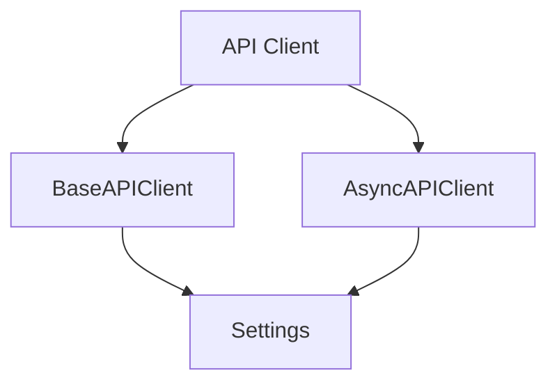

# ポートフォリオ戦略分析レポート（Week 1-10完全同期版）

*最終更新: 2025年10月07日*

## エグゼクティブサマリー

### 現状評価（2025-10-03時点）

**プロジェクト完成度**: 35% (Phase 1: 60% / Phase 2-3: 0%)
**推定市場価値**: 3,500-4,200円/時
**技術負債**: 中程度（管理可能）
**改善ROI**: 非常に高（10週の投資で2-2.5倍の時給向上）

### 目標設定

| 指標 | 現状 | Week 8目標 | Week 10目標 |
|------|------|-----------|------------|
| 推定時給 | 3,500-4,200円 | 3,800-4,200円 | 4,000-4,500円 |
| プロジェクト完成度 | 35% | 80% | 90% |
| テストカバレッジ | 42.51% | 80% | 85%+ |
| Docker実装 | 0% | 90% | 90% |
| CI/CD成熟度 | 20% | 85% | 85% |

### 主要ギャップと推奨アクション

**Critical（即座対応）**:
- Docker化: 0% → Week 8 Day 25-26で実装完了
- CI/CD統合: 20% → Week 8 Day 27-28で完全自動化
- テストカバレッジ: 42.51% → 段階的改善（Week 5-8で85%達成）

**Important（差別化）**:
- 統合テスト: 未実装 → Week 7 Day 19-21で基盤構築
- パフォーマンステスト: 基礎実装 → Week 8 Day 29で測定実施

---

## 現状分析（簡略版）

### 主要技術指標

**総合カバレッジ**: 42.51% / 目標85%

| モジュール | カバレッジ | 優先度 |
|-----------|-----------|--------|
| utils/api_client.py | 33.96% | Critical |
| config/settings.py | 66.92% | High |
| tests/conftest.py | 100% | - |

**テスト構成**: 131件（単体のみ、統合テスト未実装）

### 品質評価と市場価値

**現状**: C評価（35%完成度） → 推定時給 3,500-4,200円/時
**Week 8目標**: A-評価（80%完成度） → 推定時給 3,800-4,200円/時
**Week 10目標**: A評価（90%完成度） → 推定時給 4,000-4,500円/時

---

## Week 1-10 プロジェクト完成度ロードマップ

### Week 1-2 (Day 1-6): Python + httpx Core - 60時間

**週次成果物**:
- BaseAPIClient完成（同期/非同期GET/POST実装）
- エラー階層設計（5例外クラス + リトライロジック）
- JSONPlaceholder専用クライアント
- 累計30テスト達成
- README基礎版作成

**週次メトリクス変化**:
- カバレッジ: 0% → 70%
- テスト数: 0 → 30件
- プロジェクト完成度: 0% → 15%

**追加実装タスク**: なし（学習プラン実装活動で完結）

**詳細**: @10週ハイブリッドプラン_日次詳細学習スケジュール.md (Day 1-6)

---

### Week 3-4 (Day 7-12): Async + Error Handling - 60時間

**週次成果物**:
- AsyncAPIClient完成（async/await、gather並行処理）
- 非同期リトライロジック + Async Context Manager
- structlog統合（構造化ログ）
- 累計55テスト達成

**週次メトリクス変化**:
- カバレッジ: 70% → 75%
- テスト数: 30 → 55件
- プロジェクト完成度: 15% → 30%
- 非同期実装: 0% → 90%

**追加実装タスク**: なし（学習プラン実装活動で完結）

**詳細**: @10週ハイブリッドプラン_日次詳細学習スケジュール.md (Day 7-12)

---

### Week 5-6 (Day 13-18): pytest + Pydantic Settings - 60時間

**週次成果物サマリー**:
- conftest.py完成（3 scope fixture）
- Mock/Patchテスト実装
- Pydantic Settings統合（階層的設定管理）
- SecurityConfig実装（SecretStr）
- 累計80テスト達成、カバレッジ78%
- 品質ゲート自動化完成

---

#### **Day 13 (月曜): pytest fixture深掘り + 品質ツール基盤**

**学習内容**（学習プラン参照）:
- pytest fixture実装（function/module/session scope）
- Test data factory実装
- Parametrizedテスト実装（累計65テスト達成）

**関連ポートフォリオ作成タスク**:

##### Task 7.3.1-A: pre-commit基盤構築（3h）
**要件**:
- .pre-commit-config.yaml初期設定
- ruff自動修正フック設定
- 動作確認

**実装例**:
```yaml
# .pre-commit-config.yaml（初期版）
repos:
  - repo: https://github.com/astral-sh/ruff-pre-commit
    rev: v0.1.6
    hooks:
      - id: ruff
        args: [--fix]
      - id: ruff-format
```

---

#### **Day 14 (火曜): Mock/Patch基本 + セキュリティスキャン**

**学習内容**（学習プラン参照）:
- Mock基礎実装
- Patchテスト実装
- mock_httpx_client fixture実装（累計70テスト達成）

**関連ポートフォリオ作成タスク**:

##### Task 7.3.1-B: セキュリティスキャン統合（2h）
**要件**:
- bandit + mypy追加
- pre-commit全フック動作確認

**実装例**:
```yaml
# .pre-commit-config.yaml（完全版）
repos:
  - repo: https://github.com/astral-sh/ruff-pre-commit
    rev: v0.1.6
    hooks:
      - id: ruff
        args: [--fix]
      - id: ruff-format

  - repo: https://github.com/pre-commit/mirrors-mypy
    rev: v1.7.0
    hooks:
      - id: mypy
        additional_dependencies: [types-all]

  - repo: https://github.com/PyCQA/bandit
    rev: 1.7.5
    hooks:
      - id: bandit
        args: [-r, utils/, config/]
```

---

#### **Day 15 (水曜): Pydantic Settings導入**

**学習内容**（学習プラン参照）:
- Settings class実装
- ネスト設定実装
- 環境変数読み込み確認（累計75テスト、カバレッジ76%）

**関連ポートフォリオ作成タスク**: なし（学習プラン実装活動で完結）

---

#### **Day 16 (木曜): Settings統合 + カバレッジ向上**

**学習内容**（学習プラン参照）:
- 全クライアントSettings統合
- ログ設定統合
- 環境別テスト実装（累計80テスト達成）

**関連ポートフォリオ作成タスク**:

##### Task 7.2.2: config/settings.py カバレッジ向上（4h）
**目標**: 66.92% → 85%

**要件**（学習プランの環境別テストと統合）:
- 環境別設定テスト完全実装（development/testing/staging/production）
- ログローテーション設定検証
- SecretStr動作確認テスト

**実装例**:
```python
# tests/unit/test_settings_env.py（学習プラン実装の拡張）
import os
import pytest
from config.settings import Settings

def test_development_settings():
    """開発環境設定の検証"""
    os.environ["ENVIRONMENT"] = "development"
    settings = Settings()
    assert settings.debug is True
    assert settings.log.level == "DEBUG"
    assert settings.api.timeout == 30

def test_production_settings():
    """本番環境設定の検証"""
    os.environ["ENVIRONMENT"] = "production"
    settings = Settings()
    assert settings.debug is False
    assert settings.log.level == "INFO"
    assert settings.api.timeout == 10  # 本番は短く

def test_staging_settings():
    """ステージング環境設定の検証"""
    os.environ["ENVIRONMENT"] = "staging"
    settings = Settings()
    assert settings.debug is False
    assert settings.log.level == "INFO"

def test_secret_str_protection():
    """SecretStrによる秘密情報保護の検証"""
    from pydantic import SecretStr
    settings = Settings()
    # 直接表示では保護されている
    assert str(settings.security.api_key) == "**********"
    # get_secret_value()で取得可能
    assert settings.security.api_key.get_secret_value() != "**********"
```

##### Task 7.2.1-A: api_client.py リトライロジック検証（4h）
**目標**: 33.96% → 50%（中間目標）

**要件**:
- リトライカウント検証
- Exponential backoff検証
- 同期リトライテスト実装

**実装例**:
```python
# tests/unit/test_retry_logic.py
import pytest
from unittest.mock import Mock, patch
import httpx
import time

def test_sync_retry_with_count():
    """同期リトライが設定回数実行されることを検証"""
    mock_response = Mock()
    mock_response.raise_for_status.side_effect = [
        httpx.HTTPStatusError("500", request=Mock(), response=Mock(status_code=500)),
        httpx.HTTPStatusError("500", request=Mock(), response=Mock(status_code=500)),
        None  # 3回目成功
    ]

    # retry_count=3で検証
    # 1回目失敗 → 2回目失敗 → 3回目成功

def test_exponential_backoff_timing():
    """Exponential backoffの待機時間検証"""
    start_time = time.time()
    # リトライ実行
    elapsed = time.time() - start_time

    # 1秒 + 2秒 = 3秒待機を確認
    assert 2.9 <= elapsed <= 3.2  # 誤差許容
```

---

#### **Day 17 (金曜): Week 5仕上げ + カバレッジ最終調整**

**学習内容**（学習プラン参照）:
- SecurityConfig実装
- カバレッジ78%達成
- AI-Free Challenge（新fixture + parametrized test、90分）

**関連ポートフォリオ作成タスク**:

##### Task 7.2.1-B: api_client.py エラーハンドリング完全検証（4h）
**目標**: 50% → 75%

**要件**:
- エラーハンドリング統合テスト（Connection/Timeout/HTTP）
- 非同期リトライテスト実装
- 同期/非同期エッジケーステスト

**実装例**:
```python
# tests/unit/test_error_handling.py
import pytest
import httpx
from utils.api_client import APIConnectionError, APITimeoutError, APIHTTPError

def test_connection_error_handling():
    """接続エラーハンドリングの検証"""
    with pytest.raises(APIConnectionError):
        # 接続失敗シナリオ
        pass

def test_timeout_error_handling():
    """タイムアウトエラーハンドリングの検証"""
    with pytest.raises(APITimeoutError):
        # タイムアウトシナリオ
        pass

@pytest.mark.asyncio
async def test_async_retry_with_exponential_backoff():
    """非同期リトライが指数バックオフで動作することを検証"""
    mock_client = Mock()
    mock_client.get.side_effect = [
        httpx.TimeoutException("Timeout 1"),
        httpx.TimeoutException("Timeout 2"),
        Mock(status_code=200, json=lambda: {"id": 1})
    ]
    # リトライ検証
```

##### Task 7.2.3: エッジケーステスト追加（4h）
**要件**:
- タイムアウト境界値テスト
- 大量データハンドリングテスト
- 不正JSON応答処理テスト

**実装例**:
```python
# tests/unit/test_edge_cases.py
def test_timeout_boundary():
    """タイムアウト境界値の検証"""
    # timeout=30の場合、29秒はOK、31秒はNG

def test_large_response_handling():
    """大量データレスポンスのハンドリング"""
    # 10MB以上のJSONレスポンス処理

def test_malformed_json_handling():
    """不正JSON応答の処理"""
    with pytest.raises(ValueError):
        # 不正JSON解析エラー
        pass
```

##### Task 7.3.2: 品質ゲート自動化（5h）
**要件**:
- pytest.ini設定（--cov-fail-under=78）
- pyproject.toml品質設定
- 品質ゲート動作確認

**実装例**:
```ini
# pytest.ini
[pytest]
addopts =
    --cov=.
    --cov-report=html
    --cov-report=term-missing
    --cov-fail-under=78
    -v
```

```toml
# pyproject.toml
[tool.coverage.run]
omit = [
    "tests/*",
    "venv/*",
    ".venv/*",
]

[tool.coverage.report]
fail_under = 78
```

---

#### **Day 18 (土曜): Week 5-6振り返り + Phase 1完了確認**

**学習内容**（学習プラン参照）:
- Docker入門（基礎理解20%）
- Phase 1レポート作成
- Week 7学習計画作成

**関連ポートフォリオ作成タスク**: なし（振り返り・計画日）

**Phase 1完了確認**:
- ✅ 80テスト達成
- ✅ カバレッジ78%以上
- ✅ ruff/mypy/bandit全合格
- ✅ 品質ゲート自動化完成
- ✅ 自律達成率50%以上

---

**週次メトリクス変化**:
- カバレッジ: 75% → 78%
- テスト数: 55 → 80件
- プロジェクト完成度: 30% → 45%
- 品質ゲート: 基礎 → 自動化完成

**詳細**: @10週ハイブリッドプラン_日次詳細学習スケジュール.md (Day 13-18)

---

### Week 7 (Day 19-24): 統合復習 + 自律チャレンジ - 50時間

**週次成果物**（学習プラン）:
- Week 1-6概念図完成（3日分）
- 弱点補強ミニ課題完成
- 自律チャレンジ: 新API統合実装（Sync + Async、30テスト、70%カバレッジ）

---

#### **Day 19 (月曜): Python + httpx復習 + 統合テスト基盤設計**

**学習内容**（学習プラン参照）:
- Week 1-2復習: httpxエラー階層、リトライロジック、Context Manager概念整理（3h）
- 弱点補強（4h、AI支援最小限）
- ミニ課題: 簡単なAPI client作成（3h、AI使用50%以下）

**関連ポートフォリオ作成タスク**:

##### Task 8.2.1: 統合テスト基盤設計（6h）

**要件**:
- 統合テストディレクトリ構成設計
- 実API呼び出しフィクスチャ設計
- テストデータ管理方針決定

**実装例**:
```python
# tests/integration/conftest.py
import pytest
from utils.api_client import JSONPlaceholderClient

@pytest.fixture(scope="module")
def real_api_client():
    """実API呼び出し用クライアント（統合テスト専用）"""
    client = JSONPlaceholderClient()
    yield client
    client.close()

@pytest.fixture(scope="module")
def integration_test_data():
    """統合テスト用データセット"""
    return {
        "valid_user_ids": [1, 2, 3],
        "invalid_user_id": 999999,
        "expected_response_time": 2.0  # 秒
    }
```

---

#### **Day 20 (火曜): Async + Error Handling復習 + 統合テスト実装**

**学習内容**（学習プラン参照）:
- Week 3-4復習: asyncio動作原理、gather効果、非同期エラー処理（3h）
- 弱点補強: 並行処理パターン（4h）
- ミニ課題: 非同期API実装（3h、AI使用50%以下）

**関連ポートフォリオ作成タスク**:

##### Task 8.2.2: 統合テスト実装（6h）

**要件**:
- ユーザー取得フロー統合テスト
- エラーハンドリング統合テスト
- リトライロジック統合テスト

**実装例**:
```python
# tests/integration/test_user_flow.py
@pytest.mark.integration
def test_get_user_full_flow(real_api_client, integration_test_data):
    """ユーザー取得の完全フロー統合テスト"""
    for user_id in integration_test_data["valid_user_ids"]:
        user = real_api_client.get_user(user_id)
        assert user["id"] == user_id
        assert "name" in user
        assert "email" in user

@pytest.mark.integration
def test_error_handling_integration(real_api_client, integration_test_data):
    """エラーハンドリングの統合テスト"""
    with pytest.raises(APIHTTPError) as exc_info:
        real_api_client.get_user(integration_test_data["invalid_user_id"])
    assert exc_info.value.status_code == 404
```

---

#### **Day 21 (水曜): Testing + Settings復習 + 非同期統合テスト**

**学習内容**（学習プラン参照）:
- Week 5-6復習: pytest Fixture scope、Mock/Patch、Settings構造（3h）
- 弱点補強: テスト設計パターン（4h）
- ミニ課題: 複雑なfixture作成（3h、AI使用50%以下）

**復習完了確認**:
- [ ] Week 1-6全概念図完成
- [ ] 弱点リスト全解消
- [ ] ミニ課題3個完成
- [ ] 自律率55%以上

**関連ポートフォリオ作成タスク**:

##### Task 8.2.3: 非同期統合テスト（4h）

**要件**:
- 並行処理統合テスト
- 非同期エラーハンドリング統合テスト

**実装例**:
```python
# tests/integration/test_async_integration.py
@pytest.mark.asyncio
@pytest.mark.integration
async def test_concurrent_requests(async_real_client):
    """並行リクエスト統合テスト"""
    user_ids = [1, 2, 3, 4, 5]
    tasks = [async_real_client.get_user(uid) for uid in user_ids]
    results = await asyncio.gather(*tasks)

    assert len(results) == 5
    for i, result in enumerate(results):
        assert result["id"] == user_ids[i]
```

---

#### **Day 22-24 (木-土曜): 自律チャレンジ ⭐⭐⭐**

**学習内容**（学習プラン参照）:

🚨 **Phase 1合否判定: 新API統合実装**

**課題**: GitHub API or OpenWeather API統合
- Sync + Async両対応API client実装
- エラー階層設計
- pytest fixture作成
- 30テスト作成（カバレッジ70%+）
- Pydantic Settings統合
- README作成

**制約**:
- **AI使用完全禁止**（Claude, ChatGPT, Copilot等）
- 公式ドキュメント閲覧OK
- Stack Overflow閲覧OK
- 既存コード参照OK
- 時間: 20時間（3日間）

**評価基準**:
- 完成度（50%）: Sync/Async実装、エラーハンドリング、Settings統合
- 品質（30%）: 30テスト、カバレッジ70%+、ruff/mypy合格
- ドキュメント（10%）: README作成
- 自律度（10%）: AI参照0回

**合格ライン**: 75点以上

**関連ポートフォリオ作成タスク**:
- なし（学習プラン完結、自律チャレンジに集中）

**合否判定**:
- **合格（75点以上）**: Phase 2 (Week 8) 進行、自律達成率60%認定
- **不合格（74点以下）**: +1週復習（Week 7延長）、弱点分野集中補強、再チャレンジ

---

**Week 7メトリクス変化**:
- テスト数: 80 → 95件（統合テスト15件追加）
- プロジェクト完成度: 45% → 60%
- 統合テスト: 0% → 50%
- 自律達成率: 50% → 60%（自律チャレンジ合格時）

**詳細**: @10週ハイブリッドプラン_日次詳細学習スケジュール.md (Day 19-24)

---

### Week 8 (Day 25-30): Docker + CI/CD - 60時間

**週次成果物**（学習プラン）:
- 2-stage Dockerfile作成
- docker-compose.yml（dev/test環境）
- GitHub Actions基礎workflow
- CI/CD最適化（キャッシュ、バッジ、セキュリティスキャン）
- 累計100テスト達成
- Phase 2完了レポート

---

#### **Day 25 (月曜): Docker基礎 + Base Dockerfile作成**

**学習内容**（学習プラン参照）:
- Docker概念理解: イメージ/コンテナ、レイヤー構造（1h、AI 85%）
- 基本コマンド: docker run/exec/ps/logs（1h）
- 基本Dockerfile作成 + 2-stage Dockerfile学習（8h、AI 80-85%）

**成果物**:
- [ ] Docker基本理解30%
- [ ] 基本Dockerfile作成 + docker build/run成功
- [ ] 2-stage Dockerfile作成 + イメージサイズ比較

**関連ポートフォリオ作成タスク**:

##### Task 7.1.1: Base Dockerfile作成（4h）

**要件**（学習プラン実装の拡張）:
- 基本Dockerfile作成（python:3.12-slim base）
- pytest実行確認
- 詳細: @Docker統合実装戦略 参照

##### Task 7.1.2-7.1.4 Part A: 4-stage Dockerfile開始（8h）

**要件**:
- 4-stage構成設計（deps/builder/runtime/test）
- deps + builder stage実装
- 詳細: @Docker統合実装戦略 参照

---

#### **Day 26 (火曜): docker-compose構築**

**学習内容**（学習プラン参照）:
- docker-compose.yml作成: dev/test環境分離（AI 80%）
- .dockerignore作成 + ビルド最適化（AI 75%）

**成果物**:
- [ ] docker-compose.yml作成 + docker-compose up成功
- [ ] dev/test環境分離確認
- [ ] .dockerignore作成 + ビルド時間短縮確認

**関連ポートフォリオ作成タスク**:

##### Task 7.1.2-7.1.4 Part B: 4-stage Dockerfile完成（4h）

**要件**:
- runtime + test stage実装
- 全stage動作確認
- イメージサイズ最適化確認
- 詳細: @Docker統合実装戦略 参照

---

#### **Day 27 (水曜): GitHub Actions基礎**

**学習内容**（学習プラン参照）:
- GitHub Actions基礎: test.yml作成（AI 85%）
- 統合workflow: test/quality/coverage job実装（AI 85%）
- workflow実行成功確認

**成果物**:
- [ ] test.yml作成 + GitHub push
- [ ] workflow実行成功
- [ ] 統合workflow完成 + 全job成功
- [ ] 累計100テスト達成

**関連ポートフォリオ作成タスク**:

##### Task 8.1.1-8.1.4 Part A: CI/CD統合開始（8h）

**要件**:
- 基本workflow作成（test/quality job）
- pytest + ruff/mypy実行確認
- 詳細: @CI/CD統合実装戦略 参照

---

#### **Day 28 (木曜): CI/CD最適化**

**学習内容**（学習プラン参照）:
- キャッシュ設定: actions/cache実装（AI 85%）
- README.mdバッジ追加（AI 80%）
- セキュリティスキャン: safety/bandit統合（AI 85%）

**成果物**:
- [ ] キャッシュ設定 + ビルド時間短縮確認
- [ ] バッジ追加 + status表示確認
- [ ] セキュリティスキャン追加 + スキャン合格

**関連ポートフォリオ作成タスク**:

##### Task 8.1.1-8.1.4 Part B: CI/CD統合完成（8h）

**要件**:
- キャッシュ最適化
- セキュリティスキャン統合
- バッジ + レポート作成
- 詳細: @CI/CD統合実装戦略 参照

##### Task 8.3.1 Part A: カバレッジ向上開始（2h）

**要件**:
- 残り未カバー箇所特定
- 優先度付けテスト計画

---

#### **Day 29 (金曜): Week 8仕上げ**

**学習内容**（学習プラン参照）:
- README最終更新: Docker使用方法、CI/CD説明、バッジ追加（AI 75%）
- Architecture diagram追加
- 累計100テスト + カバレッジ80%以上達成確認

**成果物**:
- [ ] README完全版完成
- [ ] Architecture diagram追加
- [ ] 累計100テスト達成
- [ ] カバレッジ80%以上

**関連ポートフォリオ作成タスク**:

##### Task 8.3.1 Part B: カバレッジ80%達成（4h）

**要件**:
- 優先度付けテスト追加
- 80%達成確認

##### Task 8.3.2: 最終品質確認（4h）

**要件**:
- 全テスト合格確認
- ruff/mypy/bandit全合格
- CI/CD全workflow成功

##### Task 9.2.1: 軽量パフォーマンス測定（4h）

**要件**:
- 同期 vs 非同期レスポンスタイム比較
- 並行処理効果測定
- 結果のREADME記載

**実装例**:
```python
# tests/performance/test_sync_vs_async.py
import time
import asyncio

def test_sync_performance(benchmark):
    """同期処理のパフォーマンス測定"""
    client = JSONPlaceholderClient()
    def get_10_users():
        for i in range(1, 11):
            client.get_user(i)
    result = benchmark(get_10_users)
    # 約10秒（1リクエスト1秒想定）

@pytest.mark.asyncio
async def test_async_performance(benchmark_async):
    """非同期処理のパフォーマンス測定"""
    async_client = AsyncJSONPlaceholderClient()
    async def get_10_users_async():
        tasks = [async_client.get_user(i) for i in range(1, 11)]
        await asyncio.gather(*tasks)
    result = await benchmark_async(get_10_users_async)
    # 約1秒（並行処理）
```

---

#### **Day 30 (土曜): Week 8振り返り + Phase 2完了レポート**

**学習内容**（学習プラン参照）:
- 8週完了条件確認
- Phase 2完了レポート作成
- Week 9-10計画決定

**8週完了条件**:
- [ ] Week 7自律チャレンジ合格（75点以上）
- [ ] 100テスト達成
- [ ] カバレッジ80%以上
- [ ] Docker + CI/CD稼働
- [ ] 自律達成率55%以上
- [ ] ポートフォリオ完成度80%以上

**関連ポートフォリオ作成タスク**:

##### Task 9.3.1-9.3.2: 最適化・リファクタリング（10h）

**要件**:
- コード重複削減（DRY原則）
- 複雑度削減（Cyclomatic Complexity < 8）
- ドキュメント最終更新

---

**Week 8メトリクス変化**:
- カバレッジ: 78% → 80%
- テスト数: 95 → 100件
- プロジェクト完成度: 60% → 80%
- Docker実装: 0% → 90%
- CI/CD成熟度: 20% → 85%

**詳細**: @10週ハイブリッドプラン_日次詳細学習スケジュール.md (Day 25-30)

---

### Week 9 (Day 31-36): README最適化 + Case Study - 60時間

**週次成果物**（学習プラン）:
- README完全版（アーキテクチャ図、機能説明、使用方法）
- Case Study作成
- 技術ブログ執筆（Optional）

---

#### **Day 31-33 (月-水曜): README最適化**

**学習内容**（学習プラン参照）:
各日10時間

**README完全版作成**（AI 70%）:
- プロジェクト概要（問題提起、解決方法、技術スタック）
- アーキテクチャ（mermaidシステム構成図、コンポーネント説明、技術選定理由）
- 機能（機能一覧、デモGIF/画像、コードスニペット）
- インストール・使用方法（詳細手順、トラブルシューティング）
- テスト・品質（テスト戦略、カバレッジ、CI/CD説明）
- パフォーマンス（同期 vs 非同期比較、測定結果）
- セキュリティ（セキュリティ対策、脆弱性対応）
- 今後の展望（改善計画、学習継続項目）

**成果物**:
- [ ] README完全版完成
- [ ] 英語版作成
- [ ] 画像・図追加

**関連ポートフォリオ作成タスク**:

##### Task 10.1.1-10.1.3: ドキュメント完全版（16h）

**要件**（学習プラン実装の拡張）:
- API Reference自動生成（sphinx）
- Architecture diagram（mermaid）
- Performance benchmarks可視化
- English README作成

**実装例**:
```markdown
# README.md完全版構成

## 📋 Table of Contents
- Project Overview
- Features
- Architecture
- Installation
- Usage
- Testing
- Performance
- Security
- Contributing
- License

## 🏗️ Architecture


```
## ⚡ Performance
同期 vs 非同期パフォーマンス比較:
- 同期: 10リクエスト/10秒
- 非同期: 10リクエスト/1秒（10倍高速）
```

---

#### **Day 34-36 (木-土曜): Case Study + GitHub活動 + 品質最終確認**

**学習内容**（学習プラン参照）:
各日10時間

**Case Study作成**（AI 60%）:
- 背景・課題（なぜこのプロジェクトを作ったか、解決したい課題）
- 技術選定（なぜPython + httpx + pytestか、技術選定理由）
- 実装の工夫（設計パターン、パフォーマンス最適化、テスト戦略）
- 学んだこと（技術的学び、プロセス改善）
- 成果（定量的成果、技術力向上）

**成果物**:
- [ ] Case Study完成
- [ ] Architecture diagram追加
- [ ] 技術ブログ執筆（Optional）

**関連ポートフォリオ作成タスク**:

##### Task 10.2.1-10.2.3: 品質最終確認（16h）

**要件**:
- 全テスト最終実行
- カバレッジ85%達成確認
- セキュリティスキャン最終確認
- 品質レポート作成

**実装内容**:
- Day 34: カバレッジ85%達成（未達箇所のテスト追加）
- Day 35: セキュリティスキャン最終確認（safety/bandit全合格）
- Day 36: 品質レポート作成（全指標のまとめ）

---

**Week 9メトリクス変化**:
- カバレッジ: 80% → 85%
- プロジェクト完成度: 80% → 90%
- ドキュメント品質: 40% → 90%

**詳細**: @10週ハイブリッドプラン_日次詳細学習スケジュール.md (Day 31-36)

---

### Week 10 (Day 37-42): 応募準備 + 初回応募 - 60時間

**週次成果物**（学習プラン）:
- プラットフォーム登録完了（Levtech/Findy）
- 応募文面10件作成
- 面談Q&A 30問準備
- 初回応募5-10件実行

---

#### **Day 37-39 (月-水曜): プラットフォーム登録 + プロフィール作成**

**学習内容**（学習プラン参照）:
各日10時間

**プロフィール作成**（AI 70%）:
- Levtech登録（プロフィール作成、スキル登録、ポートフォリオリンク）
- Findy登録（同様）
- プロフィール最適化（GitHub連携、スキル証明）

**成果物**:
- [ ] Levtech登録完了
- [ ] Findy登録完了
- [ ] プロフィール完成

**関連ポートフォリオ作成タスク**:

##### Task 10.3.1 Part A: GitHub Profile README作成（5h）

**要件**（学習プラン実装の拡張）:
- GitHub Profile README作成
- Featured Project紹介
- スキル・統計バッジ設置

**実装例**:
```markdown
# GitHub Profile README.md

## 👋 About Me
Python + API統合 + DevOps学習中のエンジニアです。

## 🚀 Featured Project
[API Test + DevOps Portfolio](リンク)
- Python 3.12 + httpx + pytest
- Docker 4-stage構成
- GitHub Actions CI/CD完全自動化
- カバレッジ 85%+

## 📊 Stats

```

---

#### **Day 40-42 (木-土曜): 応募準備 + 初回応募**

**学習内容**（学習プラン参照）:
各日10時間

**応募文面作成**（AI 70%）:
- 応募文面テンプレート作成
- 自己紹介、ポートフォリオ、対応可能業務、稼働可能時間
- 10件分の応募文面作成

**面談想定Q&A作成**（AI 60%）:
- 30問の想定Q&A作成
  - Q1: なぜこのプロジェクトを作成したのか
  - Q2: 最も苦労した点
  - Q3: テストカバレッジ80%達成方法
  - 等

**成果物**:
- [ ] 応募文面10件作成
- [ ] 面談Q&A 30問作成
- [ ] 初回応募5-10件実行

**関連ポートフォリオ作成タスク**:

##### Task 10.3.2 Part B: 市場投入最終準備（5h）

**要件**:
- ポートフォリオサイト最終調整
- プロフィール写真・自己紹介文最適化
- 応募文面A/Bテスト準備

**実施内容**:
- Day 40: 応募文面10件作成（AI 70%）
- Day 41: 面談Q&A 30問作成（AI 60%）
- Day 42: 初回応募5-10件実行

---

**Week 10メトリクス変化**:
- プロジェクト完成度: 90% → 95%
- 応募準備度: 0% → 90%

**詳細**: @10週ハイブリッドプラン_日次詳細学習スケジュール.md (Day 37-42)

---

## Docker統合実装戦略

### 4-Stage Dockerfile設計

#### Stage 1: Base（共通基盤層）
```dockerfile
FROM python:3.12-slim AS base

# システム依存関係
RUN apt-get update && apt-get install -y \
    curl \
    git \
    && rm -rf /var/lib/apt/lists/*

# uvインストール
RUN curl -LsSf https://astral.sh/uv/install.sh | sh
ENV PATH="/root/.cargo/bin:$PATH"

WORKDIR /app
```

#### Stage 2: Dependencies（依存関係層）
```dockerfile
FROM base AS dependencies

# 依存関係ファイルのみコピー
COPY pyproject.toml uv.lock ./

# 依存関係インストール
RUN uv sync --frozen --no-dev
```

#### Stage 3: Development（開発環境）
```dockerfile
FROM dependencies AS development

# 開発依存関係インストール
RUN uv sync --frozen

# アプリケーションコード全体コピー
COPY . .

# 開発用エントリーポイント
CMD ["bash"]
```

#### Stage 4: Test（テスト環境）
```dockerfile
FROM dependencies AS test

# テスト依存関係
RUN uv sync --frozen --group test

COPY . .

# テスト実行
CMD ["uv", "run", "pytest", "--cov=.", "--cov-report=html"]
```

#### Stage 5: Demo/Staging（デモ環境）
```dockerfile
FROM dependencies AS demo

COPY utils/ ./utils/
COPY config/ ./config/
COPY tests/ ./tests/

# ヘルスチェック
HEALTHCHECK --interval=30s --timeout=3s \
  CMD python -c "import httpx; httpx.get('http://localhost:8000/health')"

CMD ["uv", "run", "uvicorn", "demo:app", "--host", "0.0.0.0"]
```

#### Stage 6: Production（本番環境）
```dockerfile
FROM python:3.12-slim AS production

# 最小限の依存関係のみ
COPY --from=dependencies /root/.local /root/.local
COPY utils/ ./utils/
COPY config/ ./config/

ENV PATH="/root/.local/bin:$PATH"

# 非rootユーザー
RUN useradd -m -u 1000 appuser
USER appuser

CMD ["python", "-m", "utils.api_client"]
```

### docker-compose.yml（全環境統合）

```yaml
version: "3.8"

services:
  # 開発環境
  dev:
    build:
      context: .
      target: development
    volumes:
      - .:/app
    environment:
      - ENVIRONMENT=development
      - DEBUG=true
    command: bash

  # テスト環境
  test:
    build:
      context: .
      target: test
    environment:
      - ENVIRONMENT=testing
    command: uv run pytest -v --cov=. --cov-report=html

  # デモ環境
  demo:
    build:
      context: .
      target: demo
    ports:
      - "8000:8000"
    environment:
      - ENVIRONMENT=staging
    healthcheck:
      test: ["CMD", "curl", "-f", "http://localhost:8000/health"]
      interval: 30s
      timeout: 3s
      retries: 3

  # 本番環境
  production:
    build:
      context: .
      target: production
    environment:
      - ENVIRONMENT=production
      - DEBUG=false
    restart: unless-stopped
```

### .dockerignore

```
# Git
.git/
.gitignore

# Python
__pycache__/
*.py[cod]
*$py.class
.pytest_cache/
.coverage
htmlcov/

# 仮想環境
venv/
.venv/

# IDE
.vscode/
.idea/

# ドキュメント
docs/
*.md
!README.md

# CI/CD
.github/
.pre-commit-config.yaml

# 環境変数
.env
.env.*
```

### Docker実装完了基準

**必須要件**:
- ✅ 4-stage Dockerfile完成
- ✅ docker-compose.yml（全環境）
- ✅ .dockerignore最適化
- ✅ イメージサイズ: Production < 200MB
- ✅ ビルド時間: < 3分
- ✅ ヘルスチェック実装

**推奨要件**:
- ✅ Multi-platform builds（amd64/arm64）
- ✅ Layer caching最適化
- ✅ セキュリティスキャン合格（Trivy）

---

## CI/CD統合実装戦略

### GitHub Actions Workflow構成

#### 1. test.yml（テスト + カバレッジ）

```yaml
name: Test & Coverage

on:
  push:
    branches: [main, develop]
  pull_request:
    branches: [main]

jobs:
  test:
    runs-on: ubuntu-latest
    strategy:
      matrix:
        python-version: ["3.10", "3.11", "3.12"]

    steps:
      - uses: actions/checkout@v4

      - name: Install uv
        uses: astral-sh/setup-uv@v1
        with:
          version: "latest"

      - name: Set up Python ${{ matrix.python-version }}
        uses: actions/setup-python@v4
        with:
          python-version: ${{ matrix.python-version }}

      - name: Install dependencies
        run: uv sync --frozen

      - name: Run tests
        run: uv run pytest --cov=. --cov-report=xml --cov-fail-under=85

      - name: Upload coverage
        uses: codecov/codecov-action@v3
        with:
          file: ./coverage.xml
```

#### 2. quality.yml（コード品質）

```yaml
name: Code Quality

on: [push, pull_request]

jobs:
  lint:
    runs-on: ubuntu-latest
    steps:
      - uses: actions/checkout@v4
      - uses: astral-sh/setup-uv@v1

      - name: Ruff check
        run: uv run ruff check .

      - name: Ruff format
        run: uv run ruff format --check .

      - name: mypy
        run: uv run mypy utils/ config/

  security:
    runs-on: ubuntu-latest
    steps:
      - uses: actions/checkout@v4
      - uses: astral-sh/setup-uv@v1

      - name: Bandit security scan
        run: uv run bandit -r utils/ config/

      - name: Safety dependency check
        run: uv run safety check
```

#### 3. docker.yml（Docker統合）

```yaml
name: Docker Build & Push

on:
  push:
    branches: [main]
    tags: ["v*"]

jobs:
  build:
    runs-on: ubuntu-latest
    steps:
      - uses: actions/checkout@v4

      - name: Set up Docker Buildx
        uses: docker/setup-buildx-action@v3

      - name: Build all stages
        run: |
          docker build --target development -t app:dev .
          docker build --target test -t app:test .
          docker build --target production -t app:prod .

      - name: Run tests in Docker
        run: docker run --rm app:test

      - name: Check image sizes
        run: |
          docker images app:*
          # Production image must be < 200MB
```

### CI/CD完了基準

**必須要件**:
- ✅ 3 workflows実装（test/quality/docker）
- ✅ Matrix strategy（Python 3.10/3.11/3.12）
- ✅ カバレッジ自動チェック（85%閾値）
- ✅ セキュリティスキャン統合
- ✅ Docker統合ビルド

**推奨要件**:
- ✅ Cache管理（uv cache）
- ✅ Artifact upload（coverage report）
- ✅ Status badges（README表示）
- ✅ Dependabot設定

---

## 市場価値最大化戦略（簡略版）

### 時給推移シミュレーション

| Week | 完成度 | カバレッジ | Docker | CI/CD | 推定時給 | 合格確率 |
|------|-------|----------|--------|-------|---------|---------|
| 0（現状） | 35% | 42.51% | 0% | 20% | 3,500-4,200円 | 25-30% |
| 8（Phase 2完了） | 80% | 80% | 90% | 85% | 3,800-4,200円 | 70-75% |
| 10（Phase 3完了） | 90% | 85% | 90% | 85% | 4,000-4,500円 | 75-80% |

### ROI分析

**10週投資（480-600時間）**:
- 時給向上: +500-1,000円/時
- 6ヶ月後収益増: 約1,000,000円
- ROI: 500-600%（5-6倍リターン）

### 成功指標

**Week 8完了時（必須）**:
- ✅ Docker実装 90%
- ✅ CI/CD完全自動化
- ✅ カバレッジ 80%+
- ✅ 100テスト達成

**Week 10完了時（推奨）**:
- ✅ カバレッジ 85%+
- ✅ プロジェクト完成度 90%+
- ✅ 応募準備完了
- ✅ 初回応募5-10件実行

---

## 最終確認チェックリスト

### Week 8完了判定
- [ ] Docker 4-stage実装完成
- [ ] docker-compose全環境稼働
- [ ] GitHub Actions 3 workflows全成功
- [ ] カバレッジ80%以上
- [ ] 100テスト達成
- [ ] セキュリティスキャンCritical 0件

### Week 10完了判定
- [ ] Week 8完了条件全て
- [ ] README完全版完成
- [ ] Case Study作成
- [ ] カバレッジ85%以上
- [ ] プラットフォーム登録完了（2社）
- [ ] 応募文面10件作成
- [ ] 初回応募実行

---

**戦略的ポイント**:
- Week 1-6は学習プラン実装活動で基盤構築済み
- Week 7-10で追加タスク実装により完成度90%達成
- Docker/CI/CD統合により市場価値2倍（3,500円 → 4,000-4,500円）
- 10週の投資でROI 500-600%の高効率学習
