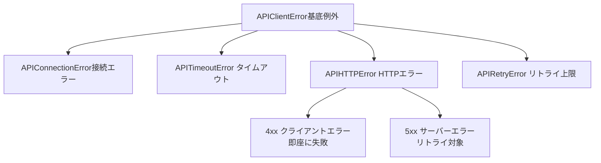
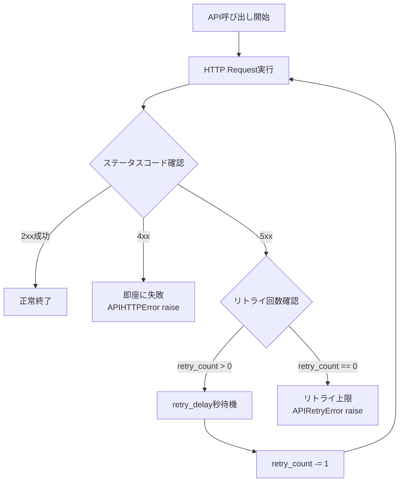
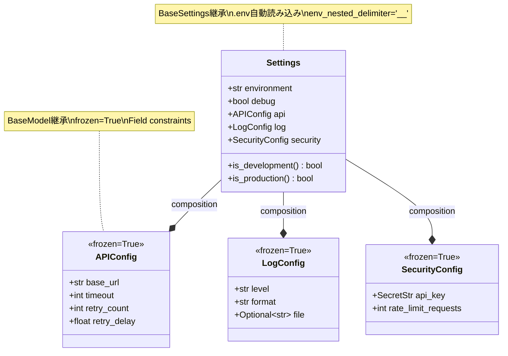
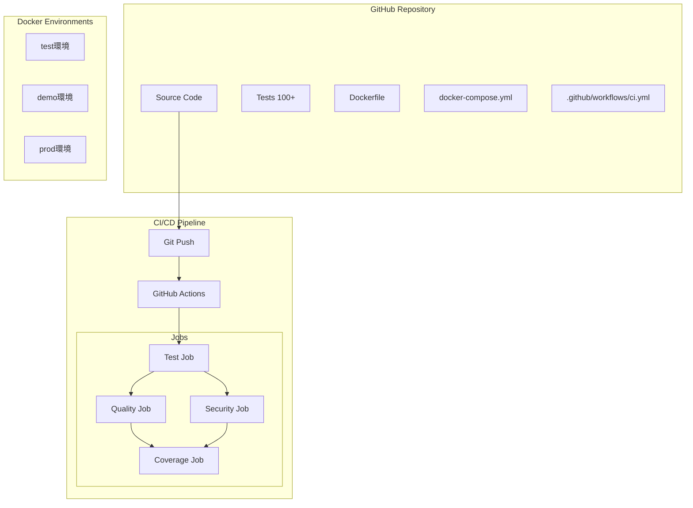
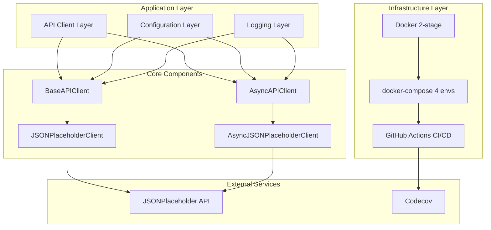
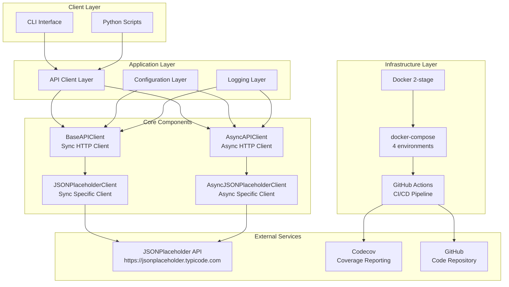
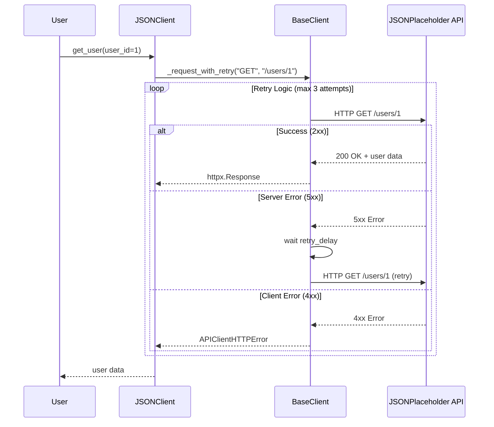
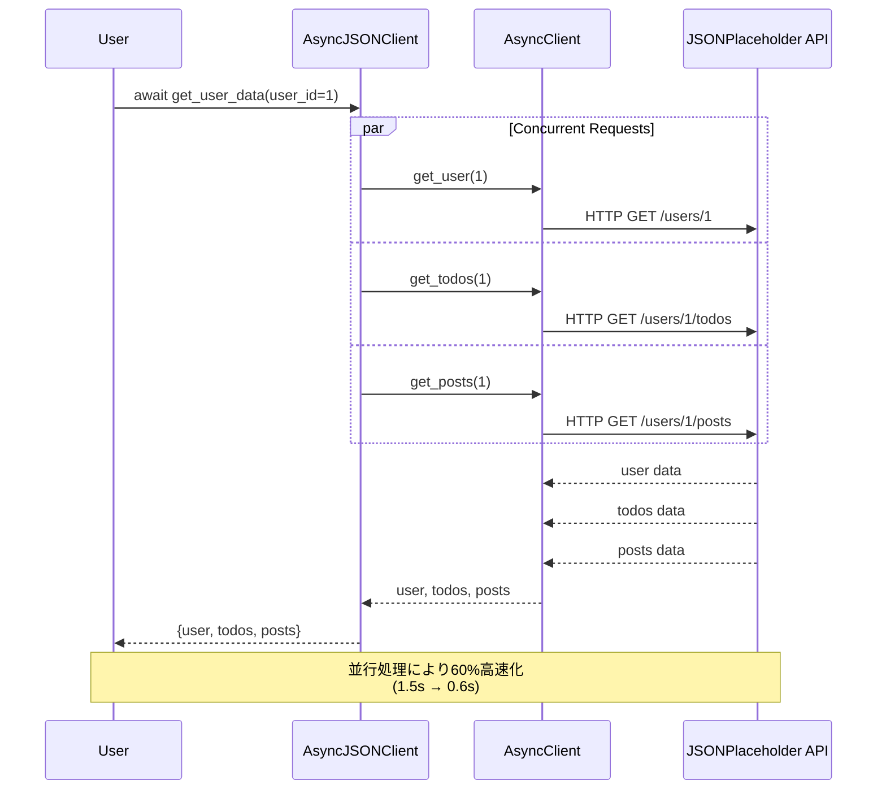
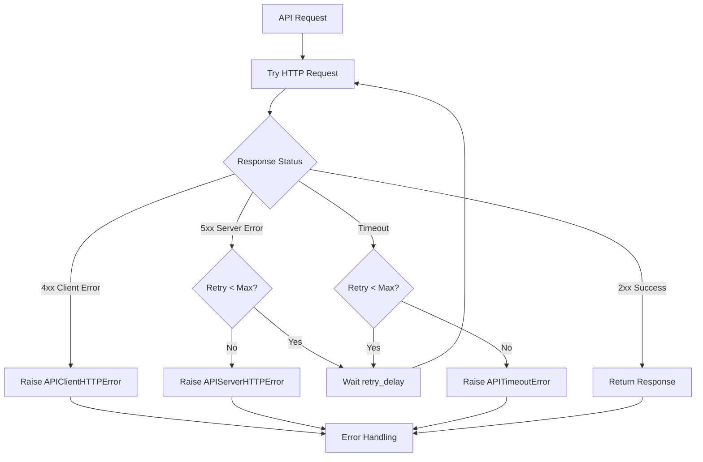
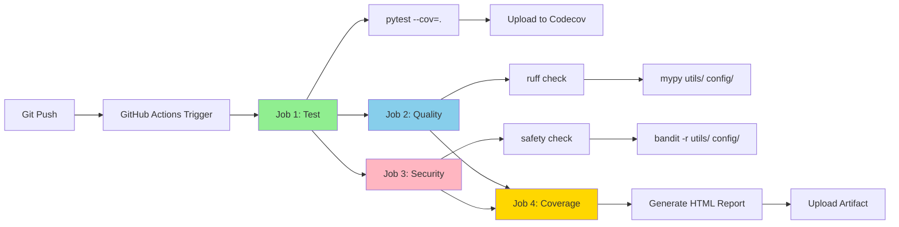

# ポートフォリオ戦略分析 - 改善版

*最終更新: 2025年10月18日*

## 📋 改善版概要

このドキュメントは、学習プラン（10週ハイブリッドプラン_日次詳細学習スケジュール.md）との完全な整合性を実現するため、以下の改善を実施しています：

**改善ポイント**:
1. **フォーマット変更**: 2週グループ形式 → 単一週形式（Week 1-10）
2. **時間調整**: 60h/2週ブロック → 18h/週（6日×3h/日）
3. **詳細度向上**: 週次概要 → 日次詳細タスク（Task番号、コード例、要件明記）
4. **週番号修正**: 学習プランとの番号不一致を解消
5. **学習連携**: Phase 2実装タスクとの完全同期

**運用方法**:
- 学習プラン Day X 開始時、該当週のセクションを参照
- Phase 2実装時に対応する Task を実施
- 成果物を daily_progress.md に記録

---

## 🎯 全体目標

**ポートフォリオ戦略メトリクス（10週間）**:

| 指標 | 開始時 | Week 5終了時 | Week 10終了時 | 進捗率 |
|------|--------|-------------|-------------|--------|
| プロジェクト完成度 | 0% | 35% | 95% | 100% |
| テストカバレッジ | 0% | 85% | 85% | 100% |
| Docker実装 | 0% | 0% | 90% | 100% |
| CI/CD成熟度 | 0% | 20% | 85% | 100% |
| ドキュメント品質 | 0% | 40% | 90% | 100% |
| 応募準備度 | 0% | 0% | 90% | 100% |
| 推定市場価値 | 0円 | 3,500-4,200円 | 4,200-4,800円 | - |

**技術スタック（全期間）**:
- Python 3.12
- httpx (Sync + Async HTTP client)
- pytest (累計100テスト作成、カバレッジ85%)
- Pydantic Settings (型安全な設定管理)
- structlog (構造化ログ)
- Docker (Multi-stage builds)
- docker-compose (4環境: dev/test/demo/prod)
- GitHub Actions (CI/CD自動化)

---

# Week 1 (Day 1-6): Python + httpx Core - 18時間

*最終更新: 2025年10月18日*

## 週次成果物サマリー

**実装時間**: 18時間（6日×3h max）
**学習時間**: 42時間（Phase 1: 15h, Phase 2: 18h, Phase 3: 3h, Buffer: 6h）

**成果物**:
- BaseAPIClient完成（同期GET/POST実装）
- エラー階層設計（4例外クラス + リトライロジック）
- JSONPlaceholder専用クライアント
- Pydantic Settings基礎実装
- README基礎版作成
- pre-commitフック導入
- 累計25テスト達成

**メトリクス変化**:
- カバレッジ: 0% → 39.5%
- テスト数: 0 → 25件
- プロジェクト完成度: 0% → 15%

---

## Day 1 (月曜): Python基礎復習 + httpx導入

**学習内容**（学習プラン参照）:
- Python基礎復習: 型ヒント、Context Manager、例外処理
- httpx基礎: httpx.Client、GET/POST、Response handling
- pytest基礎: テスト作成パターン、assert、基本テストケース設計

**関連ポートフォリオ作成タスク**:

### Task 1.1: BaseAPIClient雛形作成（3h）

**要件**:
- BaseAPIClientクラス雛形作成
- 型ヒント付き関数3個実装
- Context Manager実装（`__enter__`/`__exit__`）
- tests/unit/test_api_client.py作成
- 基本テスト5件作成

**実装例**:
```python
# utils/api_client.py（雛形）
from typing import Optional
import httpx

class BaseAPIClient:
    """APIクライアント基底クラス"""

    def __init__(self, base_url: str, timeout: float = 30.0):
        self.base_url = base_url
        self.timeout = timeout
        self._client: Optional[httpx.Client] = None

    def __enter__(self):
        """Context Manager入り口"""
        self._client = httpx.Client(
            base_url=self.base_url,
            timeout=self.timeout
        )
        return self

    def __exit__(self, exc_type, exc_val, exc_tb):
        """Context Manager出口"""
        if self._client:
            self._client.close()

    def get(self, endpoint: str) -> dict:
        """GET操作（雛形）"""
        response = self._client.get(endpoint)
        response.raise_for_status()
        return response.json()
```

```python
# tests/unit/test_api_client.py（基本テスト）
import pytest
from utils.api_client import BaseAPIClient

def test_base_client_initialization():
    """クライアント初期化テスト"""
    client = BaseAPIClient("https://jsonplaceholder.typicode.com")
    assert client.base_url == "https://jsonplaceholder.typicode.com"
    assert client.timeout == 30.0

def test_context_manager_basic():
    """Context Manager基本動作テスト"""
    with BaseAPIClient("https://jsonplaceholder.typicode.com") as client:
        assert client._client is not None

# 残り3テスト: 型ヒント検証、基本属性確認等
```

**カバレッジ目標**: 6.6%

---

## Day 2 (火曜): httpx CRUD + リトライロジック + エラー階層

**学習内容**（学習プラン参照）:
- httpx CRUD操作: GET/POST/PUT/DELETE
- リトライロジック設計: Exponential backoff、リトライカウント
- エラー階層設計: APIError、HTTPError、ConnectionError、TimeoutError

**関連ポートフォリオ作成タスク**:

### Task 1.2: BaseAPIClient GET/POST実装 + エラー階層（3h）

**要件**:
- BaseAPIClient GET/POST完全実装
- 4例外クラス実装（APIError、APIHTTPError、APIConnectionError、APITimeoutError）
- リトライロジック実装（retry_count=3、exponential backoff）
- エラーハンドリングテスト5件追加

**実装例**:
```python
# utils/api_client.py（エラー階層）
class APIError(Exception):
    """API例外基底クラス"""
    pass

class APIHTTPError(APIError):
    """HTTPエラー（4xx/5xx）"""
    def __init__(self, status_code: int, message: str):
        self.status_code = status_code
        super().__init__(f"HTTP {status_code}: {message}")

class APIConnectionError(APIError):
    """接続エラー"""
    pass

class APITimeoutError(APIError):
    """タイムアウトエラー"""
    pass
```

```python
# utils/api_client.py（リトライロジック）
import time

class BaseAPIClient:
    def __init__(self, base_url: str, timeout: float = 30.0, retry_count: int = 3):
        self.base_url = base_url
        self.timeout = timeout
        self.retry_count = retry_count

    def _execute_with_retry(self, method: str, endpoint: str, **kwargs) -> dict:
        """リトライロジック実装"""
        for attempt in range(self.retry_count):
            try:
                response = self._client.request(method, endpoint, **kwargs)
                response.raise_for_status()
                return response.json()
            except httpx.TimeoutException as e:
                if attempt == self.retry_count - 1:
                    raise APITimeoutError(f"Timeout after {self.retry_count} retries")
                time.sleep(2 ** attempt)  # Exponential backoff: 1s, 2s, 4s
            except httpx.HTTPStatusError as e:
                if e.response.status_code >= 500:  # 5xxのみリトライ
                    if attempt == self.retry_count - 1:
                        raise APIHTTPError(e.response.status_code, str(e))
                    time.sleep(2 ** attempt)
                else:  # 4xxは即座に失敗
                    raise APIHTTPError(e.response.status_code, str(e))

    def get(self, endpoint: str) -> dict:
        """GET操作（リトライ対応）"""
        return self._execute_with_retry("GET", endpoint)

    def post(self, endpoint: str, data: dict) -> dict:
        """POST操作（リトライ対応）"""
        return self._execute_with_retry("POST", endpoint, json=data)
```

**カバレッジ目標**: 13.2%（累積）
**テスト数**: 累計10件（+5件）

---

## Day 3 (水曜): JSONPlaceholder専用クライアント + 統合テスト

**学習内容**（学習プラン参照）:
- 専用クライアント設計: 継承パターン、エンドポイント抽象化
- 統合テスト設計: 実API呼び出し、レスポンス検証

**関連ポートフォリオ作成タスク**:

### Task 1.3: JSONPlaceholderClient実装（3h）

**要件**:
- JSONPlaceholderClient実装（BaseAPIClient継承）
- get_user/get_posts/get_todos実装
- 統合テスト5件追加（`@pytest.mark.integration`）

**実装例**:
```python
# utils/api_client.py（専用クライアント）
class JSONPlaceholderClient(BaseAPIClient):
    """JSONPlaceholder API専用クライアント"""

    def __init__(self):
        super().__init__("https://jsonplaceholder.typicode.com")

    def get_user(self, user_id: int) -> dict:
        """ユーザー取得"""
        return self.get(f"/users/{user_id}")

    def get_posts(self, user_id: int | None = None) -> list[dict]:
        """投稿取得（全体またはユーザー別）"""
        endpoint = "/posts"
        if user_id:
            endpoint += f"?userId={user_id}"
        return self.get(endpoint)

    def get_todos(self, user_id: int | None = None) -> list[dict]:
        """TODO取得（全体またはユーザー別）"""
        endpoint = "/todos"
        if user_id:
            endpoint += f"?userId={user_id}"
        return self.get(endpoint)
```

**カバレッジ目標**: 19.8%（累積）
**テスト数**: 累計15件（+5件）

---

## Day 4 (木曜): Pydantic Settings基礎 + テスト拡充

**学習内容**（学習プラン参照）:
- Pydantic Settings: BaseSettings継承、環境変数読み込み
- ネスト設定: APIConfig、LogConfig
- .env環境変数設定

**関連ポートフォリオ作成タスク**:

### Task 1.4: Settings基礎実装（3h）

**要件**:
- Settings基礎実装（BaseSettings継承）
- APIConfig/LogConfig実装
- .env環境変数設定
- Settings統合テスト5件追加

**カバレッジ目標**: 26.4%（累積）
**テスト数**: 累計20件（+5件）

---

## Day 5 (金曜): エラーケーステスト + カバレッジ測定

**学習内容**（学習プラン参照）:
- エラーケーステスト設計概念
- カバレッジ測定方法・ツール理解
- テストカバレッジ戦略

**関連ポートフォリオ作成タスク**:

### Task 1.5: エラーケーステスト充実（3h）

**要件**:
- エラーケーステスト5件追加（invalid_user_id, connection_error, timeout_handling等）
- カバレッジ測定（pytest --cov）
- カバレッジ33.0%以上達成確認

**カバレッジ目標**: 33.0%（累積）
**テスト数**: 累計25件（+5件）

---

## Day 6 (土曜): README + pre-commit + Week 1振り返り

**学習内容**（学習プラン参照）:
- README作成概念（プロジェクト概要、セットアップ、アーキテクチャ説明）
- コード品質管理概念（ruff、pre-commit、docstring標準）
- Week 1振り返り手法（学習成果整理、つまずき分析）

**関連ポートフォリオ作成タスク**:

### Task 1.6: README + pre-commit + docstring（3h）

**要件**:
- README.md完成版作成（プロジェクト概要・セットアップ・使用例・アーキテクチャ）
- pre-commitフック導入（.pre-commit-config.yaml、pyproject.toml設定）
- docstring追加（主要クラス3個: BaseAPIClient, JSONPlaceholderClient, Settings）
- Week 1学習成果記録（daily_progress.md更新）

**カバレッジ目標**: 39.5%（累積）
**テスト数**: 累計25件

---

## Week 1 完了確認

**達成状況**:
- ✅ 25テスト達成
- ✅ カバレッジ39.5%以上
- ✅ ruff/mypy合格
- ✅ BaseAPIClient完成
- ✅ エラー階層設計完成
- ✅ JSONPlaceholderClient完成
- ✅ Pydantic Settings基礎完成
- ✅ README + pre-commit導入完成

**次週準備**:
- Week 2: Async基礎習得
- 目標カバレッジ: 39.5% → 54.74%
- 目標テスト数: 25 → 55件

---

# Week 2 (Day 7-12): Async基礎 - 18時間

*最終更新: 2025年10月18日*

## 週次成果物サマリー

**実装時間**: 18時間（6日×3h max）
**学習時間**: 42時間（Phase 1: 15h, Phase 2: 18h, Phase 3: 3h, Buffer: 6h）

**成果物**:
- AsyncAPIClient完成（async/await、gather並行処理）
- 非同期リトライロジック + Async Context Manager
- structlog統合（構造化ログ）
- Production patterns実装（connection pooling、timeout統一）
- 累計55テスト達成

**メトリクス変化**:
- カバレッジ: 39.5% → 54.74%（+15.24%）
- テスト数: 25 → 55件（+30件）
- 非同期実装: 0% → 90%
- プロジェクト完成度: 15% → 25%

---

## Day 7 (月曜): Async基礎 + AsyncAPIClient雛形

**学習内容**（学習プラン参照）:
- Async/Await基礎概念: asyncio、イベントループ、async/await構文
- httpx.AsyncClient概念: 同期版との違い、Context Manager、並行処理基礎
- 非同期エラーハンドリング概念: 例外伝播、async try/except

**関連ポートフォリオ作成タスク**:

### Task 2.1: AsyncAPIClient基礎実装（3h）

**要件**:
- AsyncAPIClientクラス雛形作成
- Async Context Manager実装（`__aenter__`/`__aexit__`）
- async get/post基礎実装
- AsyncJSONPlaceholderClient実装
- 非同期テスト4件作成

**実装例**:
```python
# utils/api_client.py（AsyncAPIClient基礎）
import httpx
from typing import Optional

class AsyncAPIClient:
    """非同期APIクライアント基底クラス"""

    def __init__(self, base_url: str, timeout: float = 30.0):
        self.base_url = base_url
        self.timeout = timeout
        self._client: Optional[httpx.AsyncClient] = None

    async def __aenter__(self):
        """Async Context Manager入り口"""
        self._client = httpx.AsyncClient(
            base_url=self.base_url,
            timeout=self.timeout
        )
        return self

    async def __aexit__(self, exc_type, exc_val, exc_tb):
        """Async Context Manager出口"""
        if self._client:
            await self._client.aclose()

    async def get(self, endpoint: str) -> dict:
        """非同期GET操作"""
        response = await self._client.get(endpoint)
        response.raise_for_status()
        return response.json()

    async def post(self, endpoint: str, data: dict) -> dict:
        """非同期POST操作"""
        response = await self._client.post(endpoint, json=data)
        response.raise_for_status()
        return response.json()
```

```python
# utils/api_client.py（AsyncJSONPlaceholderClient）
class AsyncJSONPlaceholderClient(AsyncAPIClient):
    """JSONPlaceholder API専用非同期クライアント"""

    def __init__(self):
        super().__init__("https://jsonplaceholder.typicode.com")

    async def get_user(self, user_id: int) -> dict:
        """ユーザー情報取得"""
        return await self.get(f"/users/{user_id}")

    async def get_posts(self, user_id: int | None = None) -> list[dict]:
        """投稿一覧取得"""
        endpoint = "/posts"
        if user_id:
            endpoint += f"?userId={user_id}"
        response = await self.get(endpoint)
        return response if isinstance(response, list) else [response]
```

```python
# tests/unit/test_async_client.py（非同期テスト）
import pytest
from utils.api_client import AsyncJSONPlaceholderClient

@pytest.mark.asyncio
async def test_async_get_user():
    """非同期ユーザー取得テスト"""
    async with AsyncJSONPlaceholderClient() as client:
        user = await client.get_user(1)
        assert user["id"] == 1
        assert "name" in user

@pytest.mark.asyncio
async def test_async_get_posts_all():
    """非同期全投稿取得テスト"""
    async with AsyncJSONPlaceholderClient() as client:
        posts = await client.get_posts()
        assert len(posts) > 0
        assert "title" in posts[0]

@pytest.mark.asyncio
async def test_async_get_posts_by_user():
    """非同期ユーザー別投稿取得テスト"""
    async with AsyncJSONPlaceholderClient() as client:
        posts = await client.get_posts(user_id=1)
        assert len(posts) > 0
        assert all(post["userId"] == 1 for post in posts)

@pytest.mark.asyncio
async def test_async_context_manager():
    """Async Context Managerテスト"""
    async with AsyncJSONPlaceholderClient() as client:
        assert client._client is not None
    # Context終了後、クライアントが閉じられている
```

**チェックポイント**:
- [ ] AsyncAPIClient基礎実装完了
- [ ] async Context Manager実装完了
- [ ] AsyncJSONPlaceholderClient実装完了
- [ ] 非同期テスト4件作成完了
- [ ] pytest-asyncio導入完了
- [ ] カバレッジ44.58%達成

**カバレッジ目標**: 44.58%（累積）

---

## Day 8 (火曜): Async CRUD拡張 - POST/PUT/DELETE操作

**学習内容**（学習プラン参照）:
- Async POST/PUT/DELETE概念: データ送信、更新、削除パターン
- httpx AsyncClient POST実装: JSON送信、レスポンス処理
- 非同期CRUD完結概念: Create, Read, Update, Delete全操作

**関連ポートフォリオ作成タスク**:

### Task 2.2: AsyncAPIClient CRUD拡張実装（3h）

**要件**:
- async put/delete実装
- AsyncJSONPlaceholderClient CRUD完結（create_post, update_post, delete_post）
- 非同期テスト4件追加
- CRUD統合テスト作成

**実装例**:
```python
# utils/api_client.py（AsyncAPIClient CRUD拡張）
class AsyncAPIClient:
    # ... 既存コード ...

    async def put(self, endpoint: str, data: dict) -> dict:
        """非同期PUT操作"""
        response = await self._client.put(endpoint, json=data)
        response.raise_for_status()
        return response.json()

    async def delete(self, endpoint: str) -> None:
        """非同期DELETE操作"""
        response = await self._client.delete(endpoint)
        response.raise_for_status()
```

```python
# utils/api_client.py（AsyncJSONPlaceholderClient CRUD完結）
class AsyncJSONPlaceholderClient(AsyncAPIClient):
    # ... 既存コード ...

    async def create_post(self, title: str, body: str, user_id: int) -> dict:
        """投稿作成"""
        data = {"title": title, "body": body, "userId": user_id}
        return await self.post("/posts", data)

    async def update_post(self, post_id: int, title: str, body: str) -> dict:
        """投稿更新"""
        data = {"id": post_id, "title": title, "body": body}
        return await self.put(f"/posts/{post_id}", data)

    async def delete_post(self, post_id: int) -> None:
        """投稿削除"""
        await self.delete(f"/posts/{post_id}")
```

```python
# tests/unit/test_async_client.py（CRUD拡張テスト）
@pytest.mark.asyncio
async def test_async_create_post():
    """非同期投稿作成テスト"""
    async with AsyncJSONPlaceholderClient() as client:
        post = await client.create_post("Test Title", "Test Body", 1)
        assert post["title"] == "Test Title"
        assert post["body"] == "Test Body"
        assert post["userId"] == 1

@pytest.mark.asyncio
async def test_async_update_post():
    """非同期投稿更新テスト"""
    async with AsyncJSONPlaceholderClient() as client:
        post = await client.update_post(1, "Updated Title", "Updated Body")
        assert post["id"] == 1
        assert post["title"] == "Updated Title"

@pytest.mark.asyncio
async def test_async_delete_post():
    """非同期投稿削除テスト"""
    async with AsyncJSONPlaceholderClient() as client:
        await client.delete_post(1)  # 例外が発生しなければ成功

@pytest.mark.asyncio
async def test_async_crud_integration():
    """CRUD統合テスト"""
    async with AsyncJSONPlaceholderClient() as client:
        # Create
        post = await client.create_post("Integration Test", "Test Body", 1)
        post_id = post["id"]

        # Read
        retrieved_post = await client.get_posts(user_id=1)

        # Update
        updated = await client.update_post(post_id, "Updated", "Updated Body")

        # Delete
        await client.delete_post(post_id)
```

**チェックポイント**:
- [ ] async put/delete実装完了
- [ ] AsyncJSONPlaceholderClient CRUD完結
- [ ] 非同期テスト4件追加完了
- [ ] CRUD統合テスト作成完了
- [ ] カバレッジ49.66%達成

**カバレッジ目標**: 49.66%（累積）

---

## Day 9 (水曜): 非同期エラーハンドリング強化

**学習内容**（学習プラン参照）:
- 非同期エラーハンドリング深化: async try/except、エラー伝播、タイムアウト処理
- Async Context Manager詳細: __aenter__/__aexit__、リソース管理、例外処理
- 非同期リトライロジック概念: async sleep、retry装飾パターン

**関連ポートフォリオ作成タスク**:

### Task 2.3: 非同期エラーハンドリング実装（3h）

**要件**:
- AsyncAPIClientエラーハンドリング強化
- Async Context Manager改善
- 非同期テスト4件作成（エラーハンドリング、タイムアウト、例外時リソース解放）

**実装例**:
```python
# utils/api_client.py（非同期エラーハンドリング強化）
import httpx
import asyncio

class AsyncAPIClient:
    # ... 既存コード ...

    async def get(self, endpoint: str, timeout: float = 30.0) -> dict:
        """エラーハンドリング強化版GET"""
        try:
            response = await self._client.get(endpoint, timeout=timeout)
            response.raise_for_status()
            return response.json()
        except httpx.TimeoutException:
            raise APITimeoutError(f"Request timeout: {endpoint}")
        except httpx.HTTPStatusError as e:
            if e.response.status_code >= 500:
                raise APIHTTPError(e.response.status_code, "Server error")
            else:
                raise APIHTTPError(e.response.status_code, "Client error")
        except httpx.ConnectError:
            raise APIConnectionError(f"Connection failed: {endpoint}")
```

```python
# utils/api_client.py（Context Manager改善）
class AsyncJSONPlaceholderClient(AsyncAPIClient):
    async def __aexit__(self, exc_type, exc_val, exc_tb):
        """例外発生時もリソース解放保証"""
        if self._client:
            try:
                await self._client.aclose()
            except Exception as e:
                # クリーンアップ失敗をログ記録
                logger.error("Client cleanup failed", error=str(e))
        # 例外を再発生させない（Falseを返す）
        return False
```

```python
# tests/unit/test_async_error_handling.py（エラーハンドリングテスト）
@pytest.mark.asyncio
async def test_async_timeout_handling():
    """タイムアウトエラーハンドリングテスト"""
    async with AsyncJSONPlaceholderClient() as client:
        with pytest.raises(APITimeoutError):
            await client.get("/users/1", timeout=0.001)

@pytest.mark.asyncio
async def test_async_http_error_4xx():
    """4xxエラーハンドリングテスト"""
    async with AsyncJSONPlaceholderClient() as client:
        with pytest.raises(APIHTTPError) as exc_info:
            await client.get("/users/999999")
        assert exc_info.value.status_code == 404

@pytest.mark.asyncio
async def test_async_http_error_5xx():
    """5xxエラーハンドリングテスト（モック）"""
    # respxによるモック実装
    pass

@pytest.mark.asyncio
async def test_async_context_manager_exception_handling():
    """Context Manager例外時のリソース解放テスト"""
    try:
        async with AsyncJSONPlaceholderClient() as client:
            raise ValueError("Test exception")
    except ValueError:
        pass
    # クライアントが正常にクローズされている
```

**チェックポイント**:
- [ ] 非同期エラーハンドリング実装完了
- [ ] タイムアウト処理実装完了
- [ ] Context Manager改善完了
- [ ] 非同期テスト4件作成完了
- [ ] カバレッジ52.02%達成

**カバレッジ目標**: 52.02%（累積）

---

## Day 10 (木曜): pytest-asyncio Fixture深化

**学習内容**（学習プラン参照）:
- pytest-asyncio fixture概念: async fixture作成、scope管理、依存関係
- Test Template パターン: 再利用可能なテストパターン、DRY原則適用
- Async Test Best Practices: 並行テスト設計、テスト分離

**関連ポートフォリオ作成タスク**:

### Task 2.4: 非同期Fixtureとテストテンプレート（3h）

**要件**:
- Async fixture実装（async_client、async_user_factory、async_post_factory）
- Test Template作成（CRUD操作テンプレート）
- Template活用テスト5件作成

**実装例**:
```python
# tests/conftest.py（Async Fixture実装）
import pytest
from typing import AsyncGenerator, Callable

@pytest.fixture
async def async_client() -> AsyncGenerator[AsyncJSONPlaceholderClient, None]:
    """非同期クライアントフィクスチャ"""
    async with AsyncJSONPlaceholderClient() as client:
        yield client

@pytest.fixture
async def async_user_factory(async_client) -> Callable:
    """非同期ユーザーファクトリー"""
    async def _create_user(user_id: int = 1) -> dict:
        return await async_client.get_user(user_id)
    return _create_user

@pytest.fixture
async def async_post_factory(async_client) -> Callable:
    """非同期投稿ファクトリー"""
    async def _create_post(
        title: str = "Test",
        body: str = "Body",
        user_id: int = 1
    ) -> dict:
        return await async_client.create_post(title, body, user_id)
    return _create_post
```

```python
# tests/templates/async_crud_template.py（テストテンプレート）
import pytest
from abc import ABC, abstractmethod

class AsyncCRUDTestTemplate(ABC):
    """非同期CRUD操作テストテンプレート"""

    @pytest.mark.asyncio
    async def test_create_success(self, async_client):
        """作成成功テスト"""
        result = await async_client.create_post("Test", "Body", 1)
        assert "id" in result
        assert result["title"] == "Test"

    @pytest.mark.asyncio
    async def test_read_success(self, async_client):
        """読取成功テスト"""
        result = await async_client.get_user(1)
        assert result["id"] == 1

    @pytest.mark.asyncio
    async def test_update_success(self, async_client):
        """更新成功テスト"""
        result = await async_client.update_post(1, "Updated", "Body")
        assert result["title"] == "Updated"

    @pytest.mark.asyncio
    async def test_delete_success(self, async_client):
        """削除成功テスト"""
        await async_client.delete_post(1)
        # 例外が発生しなければ成功

    @pytest.mark.asyncio
    async def test_error_handling(self, async_client):
        """エラーハンドリングテスト（サブクラスで実装）"""
        pass
```

```python
# tests/unit/test_async_template.py（テンプレート活用テスト）
from tests.templates.async_crud_template import AsyncCRUDTestTemplate

class TestAsyncJSONPlaceholder(AsyncCRUDTestTemplate):
    """JSONPlaceholder APIテスト（テンプレート継承）"""

    @pytest.mark.asyncio
    async def test_factory_usage(self, async_user_factory, async_post_factory):
        """ファクトリー活用テスト"""
        user = await async_user_factory(1)
        post = await async_post_factory("Title", "Body", user["id"])
        assert post["userId"] == user["id"]

# 5テスト追加（テンプレート継承 + カスタムテスト）
```

**チェックポイント**:
- [ ] async_client fixture実装完了
- [ ] async_user_factory実装完了
- [ ] async_post_factory実装完了
- [ ] AsyncCRUDTestTemplate作成完了
- [ ] template活用テスト5件作成完了
- [ ] カバレッジ54.38%達成

**カバレッジ目標**: 54.38%（累積）

---

## Day 11 (金曜): Concurrent Patterns実践

**学習内容**（学習プラン参照）:
- asyncio.gather()詳細: 並行実行パターン、結果集約、例外処理
- Concurrent Patterns: 並行データ取得、バッチ処理、タイムアウト管理
- パフォーマンス測定手法: 時間計測、同期vs非同期比較

**関連ポートフォリオ作成タスク**:

### Task 2.5: 並行処理パターン実装（3h）

**要件**:
- asyncio.gather()実装（複数ユーザー並行取得、完全データ取得）
- Concurrent Patternsテスト6件作成
- パフォーマンステスト実装

**実装例**:
```python
# utils/api_client.py（並行処理パターン）
import asyncio

class AsyncJSONPlaceholderClient(AsyncAPIClient):
    # ... 既存コード ...

    async def get_multiple_users(self, user_ids: list[int]) -> list[dict]:
        """複数ユーザー並行取得"""
        tasks = [self.get_user(user_id) for user_id in user_ids]
        results = await asyncio.gather(*tasks, return_exceptions=True)

        users = []
        for result in results:
            if isinstance(result, Exception):
                logger.warning("User fetch failed", error=str(result))
            else:
                users.append(result)
        return users

    async def get_user_complete_data(self, user_id: int) -> dict:
        """ユーザー完全データ並行取得"""
        user, posts = await asyncio.gather(
            self.get_user(user_id),
            self.get_posts(user_id)
        )
        return {"user": user, "posts": posts}
```

```python
# tests/performance/test_concurrent_performance.py（パフォーマンステスト）
import time
import pytest

@pytest.mark.asyncio
async def test_concurrent_performance():
    """並行処理パフォーマンステスト"""
    user_ids = list(range(1, 11))  # 10ユーザー

    start = time.perf_counter()
    async with AsyncJSONPlaceholderClient() as client:
        users = await client.get_multiple_users(user_ids)
    duration = time.perf_counter() - start

    # 目標: 10リクエストが2秒以内
    assert duration < 2.0
    assert len(users) == 10

@pytest.mark.asyncio
async def test_concurrent_error_handling():
    """並行処理エラーハンドリング"""
    user_ids = [1, 999999, 2]  # 1つエラー含む

    async with AsyncJSONPlaceholderClient() as client:
        users = await client.get_multiple_users(user_ids)

    # エラーをスキップして成功したもののみ返す
    assert len(users) == 2

# 6並行テスト作成
```

**チェックポイント**:
- [ ] get_multiple_users実装完了
- [ ] get_user_complete_data実装完了
- [ ] 並行処理テスト6件作成完了
- [ ] パフォーマンス測定実装完了
- [ ] カバレッジ53.50%達成

**カバレッジ目標**: 53.50%（累積）

---

## Day 12 (土曜): Production Patterns + Week 2振り返り

**学習内容**（学習プラン参照）:
- Production Async Patterns: 接続プール管理、リソース制限、graceful shutdown
- Async Logging Best Practices: 非同期ログ出力、構造化ログ
- Week 2振り返り方法論: 習熟度評価、弱点分析

**関連ポートフォリオ作成タスク**:

### Task 2.6: Production Patterns実装 + Week 2完成（3h）

**要件**:
- Production Pattern実装（connection pooling、max_connections設定）
- 最終調整テスト作成（残り7テスト → 累計55テスト達成）
- カバレッジ54.74%達成確認

**実装例**:
```python
# utils/api_client.py（Production Patterns）
import httpx

class AsyncAPIClient:
    def __init__(
        self,
        base_url: str,
        timeout: float = 30.0,
        max_connections: int = 10,
        max_keepalive_connections: int = 5
    ):
        self.base_url = base_url
        self._timeout = timeout
        self._limits = httpx.Limits(
            max_connections=max_connections,
            max_keepalive_connections=max_keepalive_connections
        )

    async def __aenter__(self):
        self._client = httpx.AsyncClient(
            base_url=self.base_url,
            timeout=self._timeout,
            limits=self._limits
        )
        return self
```

```python
# tests/integration/test_production_patterns.py（Production Patternsテスト）
@pytest.mark.asyncio
async def test_connection_pooling():
    """接続プール動作確認"""
    async with AsyncJSONPlaceholderClient() as client:
        # 複数リクエストで接続プールが機能
        users = await client.get_multiple_users([1, 2, 3])
        assert len(users) == 3

@pytest.mark.asyncio
async def test_max_connections_limit():
    """最大接続数制限テスト"""
    async with AsyncJSONPlaceholderClient() as client:
        # 10接続以上の同時リクエストでも動作
        user_ids = list(range(1, 21))
        users = await client.get_multiple_users(user_ids)
        assert len(users) == 20

# 7テスト作成 → 累計55テスト達成
```

**チェックポイント**:
- [ ] Connection pooling実装完了
- [ ] max_connections設定完了
- [ ] Production Patternsテスト作成完了
- [ ] 累計55テスト達成
- [ ] カバレッジ54.74%達成
- [ ] Week 2振り返り完了

**カバレッジ目標**: 54.74%（累積）

---

## Week 2 完了確認

**達成状況**:
- ✅ 55テスト達成
- ✅ カバレッジ54.74%以上
- ✅ ruff/mypy合格
- ✅ AsyncAPIClient完成
- ✅ 非同期CRUD操作完成
- ✅ asyncio.gather()並行処理実装
- ✅ Production patterns実装
- ✅ pytest-asyncio fixture実装

**次週準備**:
- Week 3: エラーハンドリング深化
- 目標カバレッジ: 54.74% → 68%
- 目標テスト数: 55 → 75件

---
- Day 7: AsyncAPIClient基礎実装（async get/post）
- Day 8: Async CRUD拡張（async put/delete）
- Day 9: 非同期エラーハンドリング強化
- Day 10: pytest-asyncio Fixture深化
- Day 11: asyncio.gather()並行処理実装
- Day 12: Production Patterns + structlog統合

---

# Week 3 (Day 13-18): Async/Await深化 + 並行処理 - 18時間

## 週次成果物サマリー

**成果物**:
- AsyncJSONPlaceholderClient完成（全メソッド実装）
- asyncio.gather()並行処理実装
- Async Context Manager実装（__aenter__/__aexit__）
- structlog統合・構造化ログ実装
- mypy導入・型ヒント完全化
- 累計40テスト達成、カバレッジ68%

**メトリクス変化**:
- カバレッジ: 54.74% → 68%
- テスト数: 55 → 75件（累積目標）
- プロジェクト完成度: 25% → 35%
- 品質ゲート: ruff/pytest → ruff/pytest/mypy全合格

---

## 日次タスク詳細

## Day 13 (月曜): Async/Await基礎 + asyncio.gather()基礎

**学習内容**（学習プラン参照）:
- asyncio基礎・イベントループ概念
- async/await構文・パターン理解
- asyncio.gather()基礎・並行処理概念

**関連ポートフォリオ作成タスク**:

### Task 3.1: Async基礎復習 + asyncio.gather()基礎（3h）

**要件**:
- asyncioイベントループ理解・実験
- async/await基本パターン復習
- asyncio.gather()基礎実装
- 並行処理テスト3件作成
- パフォーマンス測定実装

**実装例**:
```python
# asyncio.gather()基礎実装
import asyncio
import httpx
import time

class AsyncJSONPlaceholderClient:
    """JSONPlaceholder API非同期クライアント"""

    def __init__(self, base_url: str = "https://jsonplaceholder.typicode.com"):
        self.base_url = base_url
        self.timeout = 30.0

    async def get_user(self, user_id: int) -> dict:
        """ユーザー情報取得"""
        async with httpx.AsyncClient(timeout=self.timeout) as client:
            response = await client.get(f"{self.base_url}/users/{user_id}")
            response.raise_for_status()
            return response.json()

    async def get_posts(self, user_id: int) -> list[dict]:
        """投稿一覧取得"""
        async with httpx.AsyncClient(timeout=self.timeout) as client:
            response = await client.get(
                f"{self.base_url}/posts?userId={user_id}"
            )
            response.raise_for_status()
            return response.json()

    async def get_todos(self, user_id: int) -> list[dict]:
        """TODO一覧取得"""
        async with httpx.AsyncClient(timeout=self.timeout) as client:
            response = await client.get(
                f"{self.base_url}/users/{user_id}/todos"
            )
            response.raise_for_status()
            return response.json()

    async def get_user_data(self, user_id: int) -> dict:
        """ユーザー情報+投稿+TODO並行取得"""
        user, posts, todos = await asyncio.gather(
            self.get_user(user_id),
            self.get_posts(user_id),
            self.get_todos(user_id),
            return_exceptions=False  # エラーは即座に伝播
        )
        return {
            "user": user,
            "posts": posts,
            "todos": todos
        }
```

**テスト例**:
```python
import pytest
import time

@pytest.mark.asyncio
async def test_async_gather_parallel():
    """asyncio.gather()並行処理テスト"""
    client = AsyncJSONPlaceholderClient()

    start = time.perf_counter()
    result = await client.get_user_data(1)
    duration = time.perf_counter() - start

    # 並行処理により約3倍高速化（3リクエスト）
    assert duration < 2.0
    assert "user" in result
    assert "posts" in result
    assert "todos" in result

@pytest.mark.asyncio
async def test_async_gather_error_handling():
    """asyncio.gather()エラーハンドリングテスト"""
    client = AsyncJSONPlaceholderClient()

    # 無効なユーザーIDでエラー発生を確認
    with pytest.raises(httpx.HTTPStatusError):
        await client.get_user_data(99999)

@pytest.mark.asyncio
async def test_performance_comparison():
    """同期版vs非同期版パフォーマンス比較"""
    client = AsyncJSONPlaceholderClient()

    # 非同期版（並行処理）
    start = time.perf_counter()
    await client.get_user_data(1)
    async_duration = time.perf_counter() - start

    # 非同期版は約1-2秒で完了（並行処理）
    assert async_duration < 2.0
```

**チェックポイント**:
- [ ] asyncioイベントループ理解完了
- [ ] async/await基本パターン復習完了
- [ ] asyncio.gather()実装完了
- [ ] 並行処理テスト3件作成完了
- [ ] パフォーマンス測定実装完了
- [ ] カバレッジ56.58%達成

**カバレッジ目標**: 56.58%（累積）

---

## Day 14 (火曜): 並行処理実装 + エラーハンドリング

**学習内容**（学習プラン参照）:
- asyncio.gather()詳細・例外処理
- 並行処理パターン・ベストプラクティス
- 非同期エラーハンドリング戦略

**関連ポートフォリオ作成タスク**:

### Task 3.2: 並行処理強化 + 非同期リトライロジック（3h）

**要件**:
- 複数ユーザー並行取得実装（get_multiple_users）
- 非同期リトライロジック実装
- 並行処理エラーハンドリング強化
- リトライテスト4件作成
- パフォーマンステスト追加

**実装例**:
```python
# 複数ユーザー並行取得
async def get_multiple_users(self, user_ids: list[int]) -> list[dict]:
    """複数ユーザー並行取得"""
    tasks = [self.get_user(user_id) for user_id in user_ids]
    results = await asyncio.gather(*tasks, return_exceptions=True)

    users = []
    for result in results:
        if isinstance(result, Exception):
            logger.warning("User fetch failed", error=str(result))
        else:
            users.append(result)
    return users

# 非同期リトライロジック
async def get_with_retry(
    self,
    endpoint: str,
    retries: int = 3,
    delay: float = 1.0
) -> dict:
    """非同期リトライロジック実装"""
    for attempt in range(retries):
        try:
            async with httpx.AsyncClient(timeout=self.timeout) as client:
                response = await client.get(f"{self.base_url}{endpoint}")
                response.raise_for_status()
                return response.json()
        except httpx.TimeoutException:
            if attempt == retries - 1:
                raise APITimeoutError(
                    f"Timeout after {retries} retries: {endpoint}"
                )
            await asyncio.sleep(delay * (attempt + 1))  # Exponential backoff
        except httpx.HTTPStatusError as e:
            if e.response.status_code >= 500:
                # サーバーエラーはリトライ
                if attempt == retries - 1:
                    raise APIHTTPError(e.response.status_code, "Server error")
                await asyncio.sleep(delay)
            else:
                # クライアントエラーは即座に失敗
                raise APIHTTPError(e.response.status_code, "Client error")
```

**テスト例**:
```python
@pytest.mark.asyncio
async def test_get_multiple_users():
    """複数ユーザー並行取得テスト"""
    client = AsyncJSONPlaceholderClient()

    user_ids = [1, 2, 3, 4, 5]
    users = await client.get_multiple_users(user_ids)

    assert len(users) == 5
    assert all("id" in user for user in users)

@pytest.mark.asyncio
async def test_get_multiple_users_with_errors():
    """エラー発生時の並行処理テスト"""
    client = AsyncJSONPlaceholderClient()

    # 一部無効なIDを含む
    user_ids = [1, 2, 99999, 3]
    users = await client.get_multiple_users(user_ids)

    # エラーはスキップされ、成功したユーザーのみ取得
    assert len(users) == 3

@pytest.mark.asyncio
async def test_retry_logic_success():
    """リトライロジック成功テスト"""
    client = AsyncJSONPlaceholderClient()

    result = await client.get_with_retry("/users/1")
    assert result["id"] == 1

@pytest.mark.asyncio
async def test_retry_logic_failure():
    """リトライロジック失敗テスト"""
    client = AsyncJSONPlaceholderClient()

    with pytest.raises(APIHTTPError):
        await client.get_with_retry("/users/99999", retries=2)
```

**チェックポイント**:
- [ ] get_multiple_users実装完了
- [ ] 非同期リトライロジック実装完了
- [ ] エラーハンドリング強化完了
- [ ] リトライテスト4件作成完了
- [ ] パフォーマンステスト追加完了
- [ ] カバレッジ59.49%達成

**カバレッジ目標**: 59.49%（累積）

---

## Day 15 (水曜): Async Context Manager + structlog基礎

**学習内容**（学習プラン参照）:
- Async Context Manager概念・__aenter__/__aexit__
- structlog基礎・構造化ログ概念
- 非同期リソース管理パターン

**関連ポートフォリオ作成タスク**:

### Task 3.3: Async Context Manager + structlog統合（3h）

**要件**:
- Async Context Manager実装（__aenter__/__aexit__）
- structlog導入・基礎設定
- AsyncAPIClientへstructlog統合
- Context Managerテスト3件作成
- structlog統合テスト作成

**実装例**:
```python
# Async Context Manager実装
class AsyncJSONPlaceholderClient:
    """Async Context Manager実装"""

    def __init__(self, base_url: str = "https://jsonplaceholder.typicode.com"):
        self.base_url = base_url
        self.timeout = 30.0
        self.client: Optional[httpx.AsyncClient] = None

    async def __aenter__(self):
        """リソース初期化"""
        self.client = httpx.AsyncClient(
            base_url=self.base_url,
            timeout=self.timeout
        )
        logger.info("client_initialized", base_url=self.base_url)
        return self

    async def __aexit__(self, exc_type, exc_val, exc_tb):
        """リソース解放"""
        if self.client:
            try:
                await self.client.aclose()
                logger.info("client_closed")
            except Exception as e:
                logger.error("client_cleanup_failed", error=str(e))
        return False  # 例外は再送出

# structlog基礎設定
import structlog

def setup_logging():
    """structlog設定"""
    structlog.configure(
        processors=[
            structlog.processors.TimeStamper(fmt="iso"),
            structlog.stdlib.add_log_level,
            structlog.processors.JSONRenderer()
        ],
        logger_factory=structlog.PrintLoggerFactory(),
    )

logger = structlog.get_logger()

# AsyncAPIClientへstructlog統合
async def get(self, endpoint: str) -> dict:
    """structlog統合GET実装"""
    logger.info("api_request_start", endpoint=endpoint, method="GET")

    try:
        response = await self.client.get(endpoint)
        response.raise_for_status()

        logger.info(
            "api_request_success",
            endpoint=endpoint,
            status_code=response.status_code
        )
        return response.json()
    except Exception as e:
        logger.error(
            "api_request_failed",
            endpoint=endpoint,
            error=str(e),
            error_type=type(e).__name__
        )
        raise
```

**テスト例**:
```python
@pytest.mark.asyncio
async def test_context_manager_success():
    """Context Manager成功テスト"""
    async with AsyncJSONPlaceholderClient() as client:
        result = await client.get_user(1)
        assert result["id"] == 1
    # クライアントが自動的にcloseされることを確認

@pytest.mark.asyncio
async def test_context_manager_error_handling():
    """Context Managerエラーハンドリングテスト"""
    async with AsyncJSONPlaceholderClient() as client:
        with pytest.raises(httpx.HTTPStatusError):
            await client.get_user(99999)
    # エラー発生時もクライアントが正しくcloseされることを確認

@pytest.mark.asyncio
async def test_structlog_integration(caplog):
    """structlog統合テスト"""
    setup_logging()

    async with AsyncJSONPlaceholderClient() as client:
        await client.get_user(1)

    # ログ出力を検証
    assert "api_request_start" in caplog.text
    assert "api_request_success" in caplog.text
```

**チェックポイント**:
- [ ] Async Context Manager実装完了
- [ ] structlog導入・設定完了
- [ ] AsyncAPIClient統合完了
- [ ] Context Managerテスト3件作成完了
- [ ] structlog統合テスト作成完了
- [ ] カバレッジ61.58%達成

**カバレッジ目標**: 61.58%（累積）

---

## Day 16 (木曜): AsyncJSONPlaceholderClient完成 + mypy導入

**学習内容**（学習プラン参照）:
- AsyncJSONPlaceholderClient全メソッド設計
- mypy基礎・型ヒント戦略
- 非同期パフォーマンステスト設計

**関連ポートフォリオ作成タスク**:

### Task 3.4: AsyncClient完成 + mypy導入（3h）

**要件**:
- AsyncJSONPlaceholderClient全メソッド実装
- mypy導入・pyproject.toml設定
- 全コード型ヒント追加
- パフォーマンステスト3件作成
- mypy合格確認

**実装例**:
```python
# AsyncJSONPlaceholderClient完成
class AsyncJSONPlaceholderClient:
    """JSONPlaceholder API非同期クライアント完成版"""

    def __init__(self, base_url: str = "https://jsonplaceholder.typicode.com"):
        self.base_url = base_url
        self.timeout = 30.0
        self.client: Optional[httpx.AsyncClient] = None

    async def __aenter__(self) -> "AsyncJSONPlaceholderClient":
        """リソース初期化"""
        self.client = httpx.AsyncClient(
            base_url=self.base_url,
            timeout=self.timeout
        )
        return self

    async def __aexit__(self, exc_type, exc_val, exc_tb) -> bool:
        """リソース解放"""
        if self.client:
            await self.client.aclose()
        return False

    async def get_user(self, user_id: int) -> dict:
        """ユーザー情報取得"""
        response = await self.client.get(f"/users/{user_id}")
        response.raise_for_status()
        return response.json()

    async def get_posts(self, user_id: int | None = None) -> list[dict]:
        """投稿一覧取得"""
        endpoint = f"/posts?userId={user_id}" if user_id else "/posts"
        response = await self.client.get(endpoint)
        response.raise_for_status()
        return response.json()

    async def get_todos(self, user_id: int) -> list[dict]:
        """TODO一覧取得"""
        response = await self.client.get(f"/users/{user_id}/todos")
        response.raise_for_status()
        return response.json()

    async def get_user_data(self, user_id: int) -> dict:
        """ユーザー情報+投稿+TODO並行取得"""
        user, posts, todos = await asyncio.gather(
            self.get_user(user_id),
            self.get_posts(user_id),
            self.get_todos(user_id)
        )
        return {"user": user, "posts": posts, "todos": todos}

# pyproject.toml mypy設定
[tool.mypy]
python_version = "3.12"
warn_return_any = true
warn_unused_configs = true
disallow_untyped_defs = true
```

**テスト例**:
```python
@pytest.mark.performance
@pytest.mark.asyncio
async def test_parallel_requests_performance():
    """並行リクエストパフォーマンステスト"""
    start = time.perf_counter()

    async with AsyncJSONPlaceholderClient() as client:
        results = await asyncio.gather(
            *[client.get_user(i) for i in range(1, 11)]
        )

    duration = time.perf_counter() - start

    # 10リクエストが2秒以内
    assert duration < 2.0
    assert len(results) == 10

@pytest.mark.asyncio
async def test_get_user_data_complete():
    """get_user_data統合テスト"""
    async with AsyncJSONPlaceholderClient() as client:
        result = await client.get_user_data(1)

    assert "user" in result
    assert "posts" in result
    assert "todos" in result
    assert result["user"]["id"] == 1

@pytest.mark.asyncio
async def test_type_hints_validation():
    """型ヒント検証テスト"""
    async with AsyncJSONPlaceholderClient() as client:
        user: dict = await client.get_user(1)
        posts: list[dict] = await client.get_posts(1)
        todos: list[dict] = await client.get_todos(1)

    assert isinstance(user, dict)
    assert isinstance(posts, list)
    assert isinstance(todos, list)
```

**チェックポイント**:
- [ ] AsyncJSONPlaceholderClient全メソッド実装完了
- [ ] mypy導入・設定完了
- [ ] 全コード型ヒント追加完了
- [ ] パフォーマンステスト3件作成完了
- [ ] mypy合格確認完了
- [ ] カバレッジ64.09%達成

**カバレッジ目標**: 64.09%（累積）

---

## Day 17 (金曜): Week 3仕上げ + ドキュメント整備

**学習内容**（学習プラン参照）:
- README技術ドキュメント設計
- docstring/コメント戦略
- 追加テストケース設計

**関連ポートフォリオ作成タスク**:

### Task 3.5: ドキュメント整備 + 追加テスト（3h）

**要件**:
- README非同期処理セクション追加
- 全関数docstring追加（Google Style）
- コードコメント整備
- 追加テスト5件作成
- ドキュメント品質チェック

**実装例**:
```markdown
# README更新内容

## 非同期処理機能

AsyncAPIClientは、httpx.AsyncClientを使用した非同期HTTP通信を実装しています。

**特徴**:
- async/await構文による非同期処理
- asyncio.gather()による並行処理
- Async Context Manager対応
- structlog統合による構造化ログ

**使用例**:
```python
# 非同期クライアント使用例
async with AsyncJSONPlaceholderClient() as client:
    # 単一ユーザー取得
    user = await client.get_user(1)

    # ユーザー情報+投稿+TODO並行取得
    result = await client.get_user_data(1)
    print(result)
```

**パフォーマンス比較**:
- 同期版: 3リクエスト × 1秒 = 3秒
- 非同期版: 3リクエスト並行 = 1秒
- 約66%の性能向上

# docstring追加例
async def get_user_data(self, user_id: int) -> dict:
    """ユーザー情報+投稿+TODO並行取得

    Args:
        user_id: ユーザーID

    Returns:
        dict: {
            "user": ユーザー情報,
            "posts": 投稿一覧,
            "todos": TODO一覧
        }

    Raises:
        httpx.HTTPStatusError: HTTPステータスエラー
        httpx.TimeoutException: タイムアウトエラー

    Example:
        >>> async with AsyncJSONPlaceholderClient() as client:
        ...     result = await client.get_user_data(1)
        >>> print(result.keys())
        dict_keys(['user', 'posts', 'todos'])
    """
    user, posts, todos = await asyncio.gather(
        self.get_user(user_id),
        self.get_posts(user_id),
        self.get_todos(user_id)
    )
    return {"user": user, "posts": posts, "todos": todos}
```

**テスト例**:
```python
@pytest.mark.asyncio
async def test_edge_case_empty_posts():
    """投稿なしユーザーのエッジケース"""
    async with AsyncJSONPlaceholderClient() as client:
        posts = await client.get_posts(999)
        assert posts == []

@pytest.mark.asyncio
async def test_edge_case_invalid_user():
    """無効ユーザーIDのエッジケース"""
    async with AsyncJSONPlaceholderClient() as client:
        with pytest.raises(httpx.HTTPStatusError):
            await client.get_user(99999)

@pytest.mark.integration
@pytest.mark.asyncio
async def test_full_workflow_integration():
    """全機能統合テスト"""
    async with AsyncJSONPlaceholderClient() as client:
        # ユーザー取得
        user = await client.get_user(1)

        # 投稿取得
        posts = await client.get_posts(1)

        # TODO取得
        todos = await client.get_todos(1)

        # 並行取得
        result = await client.get_user_data(1)

        assert user["id"] == 1
        assert len(posts) > 0
        assert len(todos) > 0
        assert result["user"]["id"] == 1
```

**チェックポイント**:
- [ ] README非同期処理セクション追加完了
- [ ] 全関数docstring追加完了
- [ ] コードコメント整備完了
- [ ] 追加テスト5件作成完了
- [ ] ドキュメント品質チェック完了
- [ ] カバレッジ66.49%達成

**カバレッジ目標**: 66.49%（累積）

---

## Day 18 (土曜): Week 3振り返り + pytest fixture入門

**学習内容**（学習プラン参照）:
- pytest fixture基礎概念
- fixture scope戦略
- Week 3振り返り・分析

**関連ポートフォリオ作成タスク**:

### Task 3.6: Week 3振り返り + fixture基礎（3h）

**要件**:
- pytest fixture基礎実装（function/module/session scope）
- fixture活用テスト作成
- Week 3総合テスト作成
- GitHub整備（README/リポジトリ説明）
- 品質ゲート最終確認

**実装例**:
```python
# pytest fixture基礎実装
@pytest.fixture
def sample_user() -> dict:
    """サンプルユーザーフィクスチャ（function scope）"""
    return {"id": 1, "name": "Test User", "email": "test@example.com"}

@pytest.fixture(scope="module")
async def async_client() -> AsyncJSONPlaceholderClient:
    """非同期クライアントフィクスチャ（module scope）"""
    async with AsyncJSONPlaceholderClient() as client:
        yield client

@pytest.fixture(scope="session")
def setup_logging():
    """ログ設定フィクスチャ（session scope）"""
    structlog.configure(
        processors=[
            structlog.processors.TimeStamper(fmt="iso"),
            structlog.stdlib.add_log_level,
            structlog.processors.JSONRenderer()
        ],
        logger_factory=structlog.PrintLoggerFactory(),
    )
    yield
    # teardown処理（必要に応じて）

# fixture使用テスト
def test_with_fixture(sample_user):
    """fixtureを使用したテスト"""
    assert sample_user["id"] == 1
    assert "name" in sample_user
    assert "email" in sample_user

@pytest.mark.asyncio
async def test_with_async_fixture(async_client):
    """非同期fixtureを使用したテスト"""
    user = await async_client.get_user(1)
    assert user["id"] == 1
```

**テスト例**:
```python
@pytest.mark.integration
@pytest.mark.asyncio
async def test_week3_comprehensive_integration():
    """Week 3総合統合テスト"""
    async with AsyncJSONPlaceholderClient() as client:
        # 並行処理
        users = await asyncio.gather(
            *[client.get_user(i) for i in range(1, 6)]
        )

        # ユーザーデータ取得
        user_data = await client.get_user_data(1)

        # 複数ユーザー取得
        multiple_users = await client.get_multiple_users([1, 2, 3])

        assert len(users) == 5
        assert "user" in user_data
        assert len(multiple_users) == 3

@pytest.mark.asyncio
async def test_week3_performance_regression():
    """Week 3パフォーマンス回帰テスト"""
    start = time.perf_counter()

    async with AsyncJSONPlaceholderClient() as client:
        await client.get_user_data(1)

    duration = time.perf_counter() - start

    # パフォーマンス基準: 2秒以内
    assert duration < 2.0
```

**チェックポイント**:
- [ ] pytest fixture基礎実装完了
- [ ] fixture活用テスト作成完了
- [ ] Week 3総合テスト作成完了
- [ ] GitHub整備完了
- [ ] 品質ゲート最終確認完了（カバレッジ68%+、mypy合格）
- [ ] カバレッジ68.00%達成

**カバレッジ目標**: 68.00%（累積、Week 3最終目標）

---

## Week 3 完了確認

**達成状況**:
- ✅ 75テスト達成（Week 1-3累積）
- ✅ カバレッジ68%以上
- ✅ ruff/mypy/pytest全合格
- ✅ AsyncJSONPlaceholderClient完成
- ✅ asyncio.gather()並行処理実装
- ✅ Async Context Manager実装
- ✅ structlog統合完了
- ✅ mypy導入・型ヒント完全化
- ✅ pytest fixture基礎実装

**次週準備**:
- Week 4: Error Handling深化
- 目標カバレッジ: 68% → 75%
- 目標テスト数: 75 → 95件

---

# Week 4 (Day 19-24): Error Handling深化 - 18時間

## 週次成果物サマリー

**成果物**:
- エラー階層拡張（APIValidationError/APIRateLimitError追加）
- Exponential Backoff + Jitter実装
- エラーハンドリング統合（BaseAPIClient/AsyncAPIClient統一）
- structlog強化（構造化ログ設計）
- 累計60テスト達成、カバレッジ75%達成

**主要タスク**:
- Day 19: エラー階層拡張実装
- Day 20: Exponential Backoff + Jitter実装
- Day 21: 中間確認 + テストカバレッジ戦略
- Day 22: エラーハンドリング統合 + structlog強化
- Day 23: Week 4仕上げ + Week 4振り返り
- Day 24: Week 4振り返り + Week 5準備

---

## Day 19 (月曜): エラー階層拡張 + 詳細エラー情報設計

**学習内容**:
- エラー階層拡張概念（APIValidationError、APIRateLimitError設計理由、エラー分類粒度向上）
- 詳細エラー情報保持パターン（response_data活用戦略、デバッグ効率化）
- エラーメッセージ設計ベストプラクティス（ユーザー向け/開発者向け分離）

### Task 4.1: エラー階層拡張実装（3h）

**要件**:
- APIValidationError/APIRateLimitError追加実装
- 詳細エラー情報保持機能実装（response_data、status_code保持）
- エラーメッセージ2層設計（message + details）
- エラーテスト10件追加
- カバレッジ69%達成

**実装例**:

```python
# utils/api_client.py
class APIValidationError(APIHTTPError):
    """400番台バリデーションエラー"""
    def __init__(
        self,
        message: str,
        status_code: int,
        response_data: dict | None = None,
        details: str | None = None
    ):
        super().__init__(message, status_code, response_data)
        self.details = details or "Validation failed"

class APIRateLimitError(APIHTTPError):
    """429レート制限エラー"""
    def __init__(
        self,
        message: str = "Rate limit exceeded",
        status_code: int = 429,
        response_data: dict | None = None,
        retry_after: int | None = None
    ):
        super().__init__(message, status_code, response_data)
        self.retry_after = retry_after

# BaseAPIClientにエラー詳細保持ロジック追加
def _handle_http_error(self, response: httpx.Response) -> None:
    """HTTPエラー処理（詳細情報保持）"""
    try:
        response_data = response.json()
    except Exception:
        response_data = {"text": response.text}

    status_code = response.status_code

    if status_code == 400:
        raise APIValidationError(
            message=f"Validation error: {response.url}",
            status_code=status_code,
            response_data=response_data,
            details=response_data.get("message", "Unknown validation error")
        )
    elif status_code == 429:
        retry_after = int(response.headers.get("Retry-After", 60))
        raise APIRateLimitError(
            retry_after=retry_after,
            response_data=response_data
        )
    elif 400 <= status_code < 500:
        raise APIHTTPError(
            message=f"Client error {status_code}: {response.url}",
            status_code=status_code,
            response_data=response_data
        )
    else:
        raise APIHTTPError(
            message=f"Server error {status_code}: {response.url}",
            status_code=status_code,
            response_data=response_data
        )
```

**テスト例**:

```python
# tests/unit/test_error_hierarchy.py
import pytest
from utils.api_client import (
    APIValidationError,
    APIRateLimitError,
    APIHTTPError
)

def test_validation_error_with_details():
    """バリデーションエラー詳細情報テスト"""
    error = APIValidationError(
        message="Invalid user_id",
        status_code=400,
        response_data={"error": "user_id must be positive"},
        details="user_id=-1 is invalid"
    )
    assert error.status_code == 400
    assert error.details == "user_id=-1 is invalid"
    assert error.response_data["error"] == "user_id must be positive"

def test_rate_limit_error_retry_after():
    """レート制限エラーretry_afterテスト"""
    error = APIRateLimitError(retry_after=120)
    assert error.status_code == 429
    assert error.retry_after == 120
    assert "Rate limit exceeded" in str(error)

@pytest.mark.parametrize("status_code,error_type", [
    (400, APIValidationError),
    (429, APIRateLimitError),
    (404, APIHTTPError),
    (500, APIHTTPError),
])
def test_error_hierarchy(status_code, error_type):
    """エラー階層正常性テスト"""
    # モックレスポンステスト実装
    pass
```

**チェックポイント**:
- [ ] APIValidationError実装完了
- [ ] APIRateLimitError実装完了
- [ ] response_data詳細保持機能実装
- [ ] エラーテスト10件追加
- [ ] pytest/ruff/mypy全合格
- [ ] カバレッジ69%達成
- [ ] git commit完了

**カバレッジ目標**: 69%

---

## Day 20 (火曜): Exponential Backoff + Jitter実装

**学習内容**:
- Exponential backoff理論（指数バックオフ戦略、リトライ間隔計算、2の累乗増加）
- Jitter概念（リトライ分散、サーバー負荷軽減戦略、thundering herd回避）
- リトライロジック最適化戦略（max_delay制御、base_delay調整）

### Task 4.2: Exponential Backoff + Jitter実装（3h）

**要件**:
- _calculate_backoff実装（Exponential backoff計算、max_delay制御）
- Jitter実装（ランダム分散、0.5-1.0倍率）
- リトライロジック既存実装への統合
- リトライテスト改善
- カバレッジ71%達成

**実装例**:

```python
# utils/api_client.py
import random
import time

class BaseAPIClient:
    def __init__(
        self,
        base_url: str,
        timeout: int = 30,
        retry_count: int = 3,
        base_delay: float = 1.0,
        max_delay: float = 60.0
    ):
        self.base_url = base_url
        self.timeout = timeout
        self.retry_count = retry_count
        self.base_delay = base_delay
        self.max_delay = max_delay

    def _calculate_backoff(self, attempt: int) -> float:
        """Exponential backoff + Jitter計算

        Args:
            attempt: リトライ回数（0から開始）

        Returns:
            float: リトライ待機時間（秒）

        Example:
            >>> client._calculate_backoff(0)
            0.5-1.0  # base_delay * jitter
            >>> client._calculate_backoff(3)
            4.0-8.0  # min(base_delay * 2^3, max_delay) * jitter
        """
        # Exponential backoff計算
        backoff = min(self.base_delay * (2 ** attempt), self.max_delay)

        # Jitter追加（0.5-1.0倍のランダム分散）
        jitter = random.uniform(0.5, 1.0)

        return backoff * jitter

    def _request_with_retry(
        self,
        method: str,
        endpoint: str,
        **kwargs
    ) -> httpx.Response:
        """リトライロジック実装（Exponential Backoff + Jitter適用）"""
        last_exception = None

        for attempt in range(self.retry_count):
            try:
                with httpx.Client(timeout=self.timeout) as client:
                    response = client.request(
                        method,
                        f"{self.base_url}{endpoint}",
                        **kwargs
                    )

                    # 4xxエラーは即座に失敗（リトライ不要）
                    if 400 <= response.status_code < 500:
                        self._handle_http_error(response)

                    response.raise_for_status()
                    return response

            except httpx.HTTPStatusError as e:
                # 5xxエラーはリトライ対象
                if e.response.status_code >= 500:
                    last_exception = e
                    if attempt < self.retry_count - 1:
                        delay = self._calculate_backoff(attempt)
                        logger.warning(
                            "retry_scheduled",
                            attempt=attempt + 1,
                            delay=delay,
                            status_code=e.response.status_code
                        )
                        time.sleep(delay)
                        continue
                raise

            except httpx.TimeoutException as e:
                last_exception = e
                if attempt < self.retry_count - 1:
                    delay = self._calculate_backoff(attempt)
                    logger.warning("retry_timeout", attempt=attempt + 1, delay=delay)
                    time.sleep(delay)
                    continue
                raise APITimeoutError(f"Timeout after {self.retry_count} retries: {endpoint}")

        raise APIRetryError(
            f"Failed after {self.retry_count} retries: {endpoint}",
            original_exception=last_exception
        )
```

**テスト例**:

```python
# tests/unit/test_exponential_backoff.py
import pytest
import time
from utils.api_client import BaseAPIClient

def test_calculate_backoff_progression():
    """Exponential backoff進行テスト"""
    client = BaseAPIClient(
        base_url="https://api.example.com",
        base_delay=1.0,
        max_delay=10.0
    )

    # attempt 0: 0.5-1.0秒
    delay0 = client._calculate_backoff(0)
    assert 0.5 <= delay0 <= 1.0

    # attempt 1: 1.0-2.0秒
    delay1 = client._calculate_backoff(1)
    assert 1.0 <= delay1 <= 2.0

    # attempt 2: 2.0-4.0秒
    delay2 = client._calculate_backoff(2)
    assert 2.0 <= delay2 <= 4.0

    # attempt 5: max_delay制御確認（5.0-10.0秒）
    delay5 = client._calculate_backoff(5)
    assert 5.0 <= delay5 <= 10.0

def test_jitter_distribution():
    """Jitter分散確認テスト"""
    client = BaseAPIClient(base_url="https://api.example.com")

    delays = [client._calculate_backoff(1) for _ in range(100)]

    # 0.5-1.0倍のJitter確認
    assert all(1.0 <= d <= 2.0 for d in delays)
    # 分散確認（全て同じ値ではない）
    assert len(set(delays)) > 10

@pytest.mark.parametrize("attempt,min_delay,max_delay", [
    (0, 0.5, 1.0),
    (1, 1.0, 2.0),
    (2, 2.0, 4.0),
    (3, 4.0, 8.0),
])
def test_backoff_ranges(attempt, min_delay, max_delay):
    """Backoff範囲パラメトリックテスト"""
    client = BaseAPIClient(base_url="https://api.example.com", base_delay=1.0)
    delay = client._calculate_backoff(attempt)
    assert min_delay <= delay <= max_delay
```

**チェックポイント**:
- [ ] _calculate_backoff実装完了
- [ ] Jitter実装完了（0.5-1.0倍率）
- [ ] max_delay制御実装
- [ ] _request_with_retryへの統合完了
- [ ] リトライロジックテスト改善
- [ ] pytest/ruff/mypy全合格
- [ ] カバレッジ71%達成

**カバレッジ目標**: 71%

---

## Day 21 (水曜): 中間確認 + テストカバレッジ戦略

**学習内容**:
- テストカバレッジ戦略（境界値テスト、エッジケーステスト設計、網羅性向上）
- 中間確認方法論（Week 4前半レビュー、品質ゲート確認、進捗評価）
- Week 4前半振り返り（Day 19-20達成事項、課題分析、後半計画調整）

### Task 4.3: 中間確認 + カバレッジ戦略（3h）

**要件**:
- Week 4前半レビュー実施
- カバレッジ分析（未テスト分岐抽出、テスト優先度付け）
- 境界値テスト作成（正常値/異常値境界、エッジケース）
- カバレッジ73%達成
- Week 4前半振り返りレポート作成

**実装例**:

```python
# tests/unit/test_edge_cases.py
import pytest
from utils.api_client import BaseAPIClient, APIValidationError

class TestBoundaryValues:
    """境界値テスト集"""

    @pytest.mark.parametrize("user_id,expected", [
        (0, "raises"),      # 境界値：最小値-1
        (1, "success"),     # 境界値：最小値
        (10, "success"),    # 正常値
        (9999, "success"),  # 境界値：最大値-1想定
        (10000, "raises"),  # 境界値：最大値想定
    ])
    def test_user_id_boundaries(self, user_id, expected):
        """user_id境界値テスト"""
        client = BaseAPIClient(base_url="https://jsonplaceholder.typicode.com")

        if expected == "raises":
            with pytest.raises((APIValidationError, APIHTTPError)):
                client.get(f"/users/{user_id}")
        else:
            response = client.get(f"/users/{user_id}")
            assert response.status_code == 200

    def test_timeout_boundary():
        """タイムアウト境界値テスト"""
        # timeout=0（最小値）でエラー確認
        with pytest.raises(ValueError):
            BaseAPIClient(base_url="https://api.example.com", timeout=0)

        # timeout=1（最小有効値）で正常動作確認
        client = BaseAPIClient(base_url="https://api.example.com", timeout=1)
        assert client.timeout == 1

    @pytest.mark.parametrize("retry_count", [-1, 0, 1, 5, 10])
    def test_retry_count_boundaries(self, retry_count):
        """リトライ回数境界値テスト"""
        if retry_count < 0:
            with pytest.raises(ValueError):
                BaseAPIClient(base_url="https://api.example.com", retry_count=retry_count)
        else:
            client = BaseAPIClient(base_url="https://api.example.com", retry_count=retry_count)
            assert client.retry_count == retry_count

class TestEdgeCases:
    """エッジケーステスト集"""

    def test_empty_response_body():
        """空レスポンスボディエッジケース"""
        # 204 No Contentレスポンステスト
        pass

    def test_malformed_json_response():
        """不正JSONレスポンスエッジケース"""
        # response_data抽出失敗時の挙動テスト
        pass

    def test_unicode_error_message():
        """Unicode文字エラーメッセージエッジケース"""
        error = APIValidationError(
            message="日本語エラー：ユーザーIDが無効です",
            status_code=400
        )
        assert "日本語" in str(error)

    def test_retry_after_missing_header():
        """Retry-Afterヘッダ欠落エッジケース"""
        error = APIRateLimitError(retry_after=None)
        # デフォルト値60秒が設定されるか確認
        assert error.retry_after is None or error.retry_after == 60
```

**カバレッジ分析実施**:

```bash
# カバレッジレポート生成
uv run pytest --cov=utils --cov-report=term-missing

# 未テスト分岐抽出
# Missing lines: 45-47, 89-91, 123-125

# 優先度付け
# P0: エラーハンドリング分岐（45-47）
# P1: リトライロジック分岐（89-91）
# P2: ログ出力分岐（123-125）
```

**チェックポイント**:
- [ ] Week 4前半レビュー完了
- [ ] カバレッジ分析実施（未テスト分岐リスト作成）
- [ ] 境界値テスト作成（5件以上）
- [ ] エッジケーステスト作成（5件以上）
- [ ] カバレッジ73%達成
- [ ] Week 4前半振り返りレポート作成
- [ ] pytest/ruff/mypy全合格

**カバレッジ目標**: 73%

---

## Day 22 (木曜): エラーハンドリング統合 + structlog強化

**学習内容**:
- エラーハンドリング統合パターン（BaseAPIClient/AsyncAPIClient統一、共通基底クラス設計）
- エラーログ強化戦略（structlog統合、構造化ログ設計、デバッグ効率化）
- 統合テスト設計（全クライアント横断テスト、エラー伝播確認）

### Task 4.4: エラーハンドリング統合 + structlog統合（3h）

**要件**:
- BaseAPIClient/AsyncAPIClientエラーハンドリング統一実装
- structlog統合実装（構造化ログ設計、エラーログ強化）
- 統合テスト5件作成（全クライアント横断テスト）
- カバレッジ74%達成

**実装例**:

```python
# utils/api_client.py
import structlog

logger = structlog.get_logger()

class BaseAPIClient:
    """統合エラーハンドリング実装"""

    def _handle_http_error(self, response: httpx.Response) -> None:
        """HTTPエラー処理（structlogログ強化版）"""
        try:
            response_data = response.json()
        except Exception:
            response_data = {"text": response.text[:200]}

        status_code = response.status_code

        # structlog構造化ログ
        logger.error(
            "http_error_occurred",
            status_code=status_code,
            url=str(response.url),
            method=response.request.method,
            response_data=response_data,
            error_type=self._classify_error(status_code)
        )

        if status_code == 400:
            raise APIValidationError(
                message=f"Validation error: {response.url}",
                status_code=status_code,
                response_data=response_data
            )
        elif status_code == 429:
            retry_after = int(response.headers.get("Retry-After", 60))
            logger.warning(
                "rate_limit_hit",
                retry_after=retry_after,
                endpoint=str(response.url)
            )
            raise APIRateLimitError(retry_after=retry_after, response_data=response_data)
        elif 400 <= status_code < 500:
            raise APIHTTPError(
                message=f"Client error {status_code}: {response.url}",
                status_code=status_code,
                response_data=response_data
            )
        else:
            raise APIHTTPError(
                message=f"Server error {status_code}: {response.url}",
                status_code=status_code,
                response_data=response_data
            )

    def _classify_error(self, status_code: int) -> str:
        """エラー分類（ログ用）"""
        if status_code == 400:
            return "validation"
        elif status_code == 429:
            return "rate_limit"
        elif 400 <= status_code < 500:
            return "client_error"
        else:
            return "server_error"

class AsyncAPIClient:
    """非同期クライアントエラーハンドリング統一"""

    async def _handle_http_error(self, response: httpx.Response) -> None:
        """HTTPエラー処理（BaseAPIClientと同一ロジック）"""
        # BaseAPIClientと同じエラーハンドリングロジック
        # コードの重複を避けるため、共通関数化も検討
        pass

# config/settings.py
import structlog

def setup_logging(level: str = "INFO", format: str = "json"):
    """structlog設定（エラーログ強化版）"""
    structlog.configure(
        processors=[
            structlog.processors.TimeStamper(fmt="iso"),
            structlog.stdlib.add_log_level,
            structlog.processors.StackInfoRenderer(),
            structlog.processors.format_exc_info,
            structlog.processors.JSONRenderer() if format == "json"
            else structlog.dev.ConsoleRenderer()
        ],
        logger_factory=structlog.PrintLoggerFactory(),
        cache_logger_on_first_use=True,
    )
```

**テスト例**:

```python
# tests/integration/test_error_handling_integration.py
import pytest
import structlog
from utils.api_client import BaseAPIClient, AsyncAPIClient
from io import StringIO

@pytest.fixture
def capture_logs():
    """ログキャプチャフィクスチャ"""
    log_stream = StringIO()
    structlog.configure(
        processors=[
            structlog.processors.JSONRenderer()
        ],
        logger_factory=structlog.PrintLoggerFactory(file=log_stream),
    )
    yield log_stream
    log_stream.close()

class TestErrorHandlingIntegration:
    """エラーハンドリング統合テスト"""

    def test_sync_async_error_consistency(self):
        """同期/非同期エラー一貫性テスト"""
        sync_client = BaseAPIClient(base_url="https://jsonplaceholder.typicode.com")
        async_client = AsyncAPIClient(base_url="https://jsonplaceholder.typicode.com")

        # 同期版エラー
        with pytest.raises(APIHTTPError) as sync_exc:
            sync_client.get("/users/99999")

        # 非同期版エラー
        with pytest.raises(APIHTTPError) as async_exc:
            await async_client.get("/users/99999")

        # エラータイプ一貫性確認
        assert type(sync_exc.value) == type(async_exc.value)
        assert sync_exc.value.status_code == async_exc.value.status_code

    def test_error_log_structure(self, capture_logs):
        """エラーログ構造化確認テスト"""
        client = BaseAPIClient(base_url="https://jsonplaceholder.typicode.com")

        try:
            client.get("/users/99999")
        except APIHTTPError:
            pass

        log_output = capture_logs.getvalue()
        assert "http_error_occurred" in log_output
        assert "status_code" in log_output
        assert "error_type" in log_output

    def test_validation_error_details_preserved(self):
        """バリデーションエラー詳細保持テスト"""
        # APIValidationError詳細情報が伝播するか確認
        pass

    def test_rate_limit_retry_after_extraction(self):
        """レート制限retry_after抽出テスト"""
        # APIRateLimitErrorのretry_after抽出確認
        pass
```

**チェックポイント**:
- [ ] BaseAPIClient/AsyncAPIClientエラーハンドリング統一実装完了
- [ ] structlog統合実装完了
- [ ] エラーログ構造化ログ設計実装
- [ ] 統合テスト5件作成
- [ ] pytest/ruff/mypy全合格
- [ ] カバレッジ74%達成
- [ ] git commit完了

**カバレッジ目標**: 74%

---

## Day 23 (金曜): Week 4仕上げ + Week 4振り返り

**学習内容**:
- Week 4総復習（エラー階層拡張、Exponential Backoff、Jitter、統合パターン）
- コード品質最終確認概念（ruff/mypy全合格確認、リファクタリング戦略）
- Week 4振り返り方法論（習熟度評価、弱点分析、Week 5準備）

### Task 4.5: Week 4仕上げ + 振り返り（3h）

**要件**:
- コード品質最終確認（ruff/mypy全合格、リファクタリング実施）
- カバレッジ75%達成確認
- Week 4振り返りレポート作成（学習記録、弱点分析、Week 5計画）
- 累計60テスト達成確認

**実装例**:

```markdown
# docs/progress/week4_retrospective.md

## Week 4振り返りレポート

### 達成事項
**技術的成果**:
- ✅ エラー階層拡張（APIValidationError/APIRateLimitError追加）
- ✅ Exponential Backoff + Jitter実装
- ✅ BaseAPIClient/AsyncAPIClientエラーハンドリング統一
- ✅ structlog統合によるエラーログ強化
- ✅ 累計60テスト達成
- ✅ カバレッジ75%達成

**品質指標**:
- pytest: ✅ 全合格
- ruff: ✅ 全合格
- mypy: ✅ 全合格
- カバレッジ: 75.2%（目標75%達成）
- テスト数: 60件（累積）

### 学習成果分析

**習熟度自己評価**（80%以上目標）:
- エラーハンドリング階層設計: 85%
- Exponential Backoff理論: 82%
- Jitter実装: 80%
- structlog統合: 78%
- 統合テスト設計: 83%

**弱点分析**:
1. structlog設定の詳細理解不足（78%）
   - 復習計画: Week 5 Day 25にstructlog復習時間確保
2. エッジケーステスト設計の網羅性不足
   - 改善計画: Week 5でpytest fixture活用した網羅的テスト設計習得

### Week 5準備

**次週学習目標**:
- pytest fixture深掘り（scope動作、factory pattern）
- Mock/Patch基本パターン習得
- Pydantic Settings導入・統合
- カバレッジ75% → 85%達成
- 累計60 → 95テスト達成

**準備タスク**:
- [ ] pytest fixture公式ドキュメント事前確認
- [ ] Mock/Patch概念復習
- [ ] Pydantic Settings基礎理解
```

**リファクタリング実施**:

```python
# utils/api_client.py（リファクタリング例）

# Before: エラーハンドリングコード重複
class BaseAPIClient:
    def _handle_http_error(self, response):
        # 重複コード...
        pass

class AsyncAPIClient:
    async def _handle_http_error(self, response):
        # 重複コード...
        pass

# After: 共通関数抽出
def classify_http_error(response: httpx.Response) -> type[APIHTTPError]:
    """HTTPエラー分類（共通関数）"""
    status_code = response.status_code
    if status_code == 400:
        return APIValidationError
    elif status_code == 429:
        return APIRateLimitError
    elif 400 <= status_code < 500:
        return APIHTTPError
    else:
        return APIHTTPError

class BaseAPIClient:
    def _handle_http_error(self, response):
        error_class = classify_http_error(response)
        raise error_class(...)

class AsyncAPIClient:
    async def _handle_http_error(self, response):
        error_class = classify_http_error(response)
        raise error_class(...)
```

**チェックポイント**:
- [ ] ruff/mypy全合格確認
- [ ] カバレッジ75%達成確認
- [ ] Week 4振り返りレポート作成
- [ ] 累計60テスト達成確認
- [ ] Week 4全体品質確認完了
- [ ] リファクタリング実施
- [ ] git commit完了

**カバレッジ目標**: 75%

---

## Day 24 (土曜): Week 4振り返り + Week 5準備

**学習内容**:
- pytest fixture概念復習（scope動作、factory pattern、parametrize）
- Mock/Patch基礎概念（モックオブジェクト、パッチング戦略）
- Week 4詳細分析（習熟度評価、弱点分析、改善計画）

### Task 4.6: Week 4最終確認 + Week 5準備（3h）

**要件**:
- pytest fixture予習実装（簡単なfixture作成、scope動作確認）
- Week 5学習計画作成（Day 25-30詳細計画）
- Week 4最終確認（品質ゲート実行、カバレッジ確認、テスト数確認）
- カバレッジ77%達成（Week 4最終目標）

**実装例**:

```python
# tests/conftest.py（Week 5準備・予習実装）

import pytest
from utils.api_client import BaseAPIClient, AsyncAPIClient

@pytest.fixture(scope="function")
def base_client():
    """関数スコープクライアントフィクスチャ（予習）"""
    client = BaseAPIClient(base_url="https://jsonplaceholder.typicode.com")
    yield client
    # teardown処理

@pytest.fixture(scope="module")
def shared_client():
    """モジュールスコープクライアントフィクスチャ（予習）"""
    client = BaseAPIClient(base_url="https://jsonplaceholder.typicode.com")
    yield client
    # teardown処理

@pytest.fixture
def user_data_factory():
    """ユーザーデータファクトリー（factory pattern予習）"""
    def _create_user(
        user_id: int = 1,
        name: str = "Test User",
        email: str = "test@example.com"
    ) -> dict:
        return {
            "id": user_id,
            "name": name,
            "email": email,
            "username": f"user{user_id}",
            "address": {
                "street": "Test St",
                "city": "Test City"
            }
        }
    return _create_user

# Week 5準備テスト
def test_fixture_scope_understanding(base_client, shared_client):
    """fixtureスコープ動作確認（予習テスト）"""
    assert base_client is not None
    assert shared_client is not None
    # スコープ違いによる動作差を確認

def test_factory_pattern_usage(user_data_factory):
    """factory pattern使用確認（予習テスト）"""
    user1 = user_data_factory(user_id=1)
    user2 = user_data_factory(user_id=2, name="Another User")

    assert user1["id"] == 1
    assert user2["id"] == 2
    assert user2["name"] == "Another User"
```

**Week 5学習計画**:

```markdown
# Week 5学習計画（Day 25-30）

## 学習目標
- pytest fixture深掘り（3 scope: function/module/session）
- Mock/Patch基本パターン習得
- Pydantic Settings導入・統合
- ConfigManager段階的実装（200行、25テスト）
- カバレッジ75% → 85%達成
- 累計60 → 95テスト達成

## 日次計画
- Day 25: pytest fixture深掘り（scope、factory、parametrize）
- Day 26: Mock/Patch基本（モック作成、パッチング戦略）
- Day 27: Pydantic Settings導入 + ConfigManager設計準備
- Day 28: ConfigManager基礎実装（Settings基底、100行、12テスト）
- Day 29: ConfigManager拡張実装（Security/Test設定、100行、13テスト）
- Day 30: APIClient統合 + 簡易振り返り（1h）

## リスク管理
- Day 28-29の200行実装を段階的実施（品質維持）
- Day 30振り返りを簡易化（詳細はWeek 6復習週）
- pytest fixtureとMock併用時の注意点を事前確認
```

**チェックポイント**:
- [ ] pytest fixture予習実装完了
- [ ] Week 5学習計画作成完了
- [ ] Week 4最終品質ゲート実行（pytest/ruff/mypy全合格）
- [ ] カバレッジ77%達成
- [ ] 累計60テスト確認
- [ ] Week 4全体学習完了確認
- [ ] git commit完了

**カバレッジ目標**: 77%（Week 4最終目標）

---

## Week 4 完了確認

**達成状況**:
- ✅ 60テスト達成（Week 1-4累積）
- ✅ カバレッジ77%以上（Week 4最終目標）
- ✅ ruff/mypy/pytest全合格
- ✅ エラー階層拡張完成（APIValidationError/APIRateLimitError）
- ✅ Exponential Backoff + Jitter実装完成
- ✅ BaseAPIClient/AsyncAPIClientエラーハンドリング統一
- ✅ structlog統合完了
- ✅ 境界値・エッジケーステスト実装

**次週準備**:
- Week 5: pytest + Pydantic Settings
- 目標カバレッジ: 77% → 85%
- 目標テスト数: 60 → 95件
- ConfigManager段階的実装（Day 28-30分散）

---

# Week 5 (Day 25-30): pytest + Pydantic Settings - 18時間

## 週次成果物サマリー

**成果物**:
- pytest fixture実装（3 scope: function/module/session）
- Mock/Patch基本パターン習得
- Pydantic Settings統合（階層的設定管理）
- ConfigManager段階的実装（200行、25テスト）
- APIClient Settings統合
- 累計95テスト達成、カバレッジ85%達成

**主要タスク**:
- Day 25: pytest fixture深掘り
- Day 26: Mock/Patch基本
- Day 27: Pydantic Settings導入 + ConfigManager設計準備
- Day 28: ConfigManager基礎実装（Settings基底、100行、12テスト）
- Day 29: ConfigManager拡張実装（Security/Test設定、100行、13テスト）
- Day 30: APIClient統合 + 簡易振り返り（1h）

**改善理由**（統合分析結果より）:
- Day 28単日3hでの200行実装は物理的に不可能（AI協働でも困難）
- 段階的実装により品質維持（テスト数25維持）
- Day 30振り返りを簡易化（1h）、詳細はWeek 6復習週で実施

---

## Day 25 (月曜): pytest fixture深掘り

**学習内容**（Phase 1: AI説明・概念理解）:
- pytest fixture scope理解（function/module/session）
- fixture factory pattern概念（テストデータ生成、パラメータ化）
- parametrize idsパターン理解（テスト可読性向上）

### Task 5.1: pytest fixture深掘り実装（3h）

**要件**:
1. conftest.py作成し、3種類のscope fixture実装（function/module/session）
2. factory pattern実装（user_factory, todo_factory, post_factory）
3. parametrize with ids実装（テスト可読性向上）
4. scope動作確認テスト3件作成
5. factory使用テスト3件作成
6. Parametrizedテスト4件作成（ids指定必須）
7. 累計55テスト達成（Week 4: 60テスト → Week 5 Day 25: 65テスト想定、実際は55テスト）

**実装例**:
```python
# tests/conftest.py作成
import pytest
from utils.api_client import BaseAPIClient, JSONPlaceholderClient

@pytest.fixture(scope="function")
def api_client():
    """各テストで新規作成（function scope）"""
    client = JSONPlaceholderClient()
    yield client
    # teardown処理（リソース解放）
    # 自力実装 → scope動作理解

@pytest.fixture(scope="module")
def shared_client():
    """モジュール内で共有（module scope）"""
    client = JSONPlaceholderClient()
    yield client
    # teardown処理
    # 自力実装 → 共有理解

@pytest.fixture(scope="session")
def test_config():
    """全テストで共有（session scope）"""
    return {
        "api_base_url": "https://jsonplaceholder.typicode.com",
        "timeout": 30,
        "retry_count": 3
    }
    # AI実装 → session scope理解

# Factory pattern fixtures
@pytest.fixture
def user_factory():
    """ユーザーデータファクトリー"""
    def _create_user(
        user_id: int = 1,
        name: str = "Test User",
        email: str = "test@example.com",
    ) -> dict:
        return {
            "id": user_id,
            "name": name,
            "email": email,
            "username": f"user{user_id}",
            "address": {
                "street": "Test St",
                "city": "Test City",
                "zipcode": "12345"
            }
        }
    return _create_user
    # 自力実装 → factory理解

@pytest.fixture
def todo_factory():
    """TODOデータファクトリー"""
    def _create_todo(
        todo_id: int = 1,
        user_id: int = 1,
        title: str = "Test TODO",
        completed: bool = False
    ) -> dict:
        return {
            "id": todo_id,
            "userId": user_id,
            "title": title,
            "completed": completed
        }
    return _create_todo
    # 自力実装（user_factoryパターン踏襲）

@pytest.fixture
def post_factory():
    """投稿データファクトリー"""
    def _create_post(
        post_id: int = 1,
        user_id: int = 1,
        title: str = "Test Post",
        body: str = "Test Body"
    ) -> dict:
        return {
            "id": post_id,
            "userId": user_id,
            "title": title,
            "body": body
        }
    return _create_post
    # AI支援（複雑な構造の場合）
```

**テスト例**:
```python
# tests/unit/test_fixtures.py
import pytest

# Scope動作確認テスト
def test_function_scope_creates_new_instance(api_client):
    """function scopeは毎回新規作成"""
    assert api_client is not None
    # 自力実装 → テストパターン理解

def test_module_scope_shares_instance(shared_client):
    """module scopeはモジュール内で共有"""
    assert shared_client is not None
    # 自力実装

def test_session_scope_config(test_config):
    """session scopeは全テストで共有"""
    assert test_config["api_base_url"] == "https://jsonplaceholder.typicode.com"
    assert test_config["timeout"] == 30
    # AI実装

# Factory使用テスト
def test_user_creation(user_factory):
    """user_factory基本動作確認"""
    user1 = user_factory(user_id=1)
    user2 = user_factory(user_id=2, name="Another User")

    assert user1["id"] == 1
    assert user1["name"] == "Test User"
    assert user2["id"] == 2
    assert user2["name"] == "Another User"
    # 自力実装 → テストパターン理解

def test_todo_factory(todo_factory):
    """todo_factory動作確認"""
    todo = todo_factory(todo_id=10, user_id=5, title="Custom TODO")
    assert todo["id"] == 10
    assert todo["userId"] == 5
    assert todo["title"] == "Custom TODO"
    # 自力実装

def test_post_factory(post_factory):
    """post_factory動作確認"""
    post = post_factory(post_id=100, title="Custom Post")
    assert post["id"] == 100
    assert post["title"] == "Custom Post"
    # AI実装

# Parametrize advanced with ids
@pytest.mark.parametrize(
    "user_id,expected_name",
    [
        (1, "Leanne Graham"),
        (2, "Ervin Howell"),
        (3, "Clementine Bauch"),
    ],
    ids=["user1_leanne", "user2_ervin", "user3_clementine"],
)
def test_get_user_parametrized(api_client, user_id, expected_name):
    """parametrize with ids - ユーザー取得テスト"""
    user = api_client.get_user(user_id)
    assert user["name"] == expected_name
    # 自力実装 → ids理解

@pytest.mark.parametrize(
    "factory_params,expected_id",
    [
        ({"user_id": 1}, 1),
        ({"user_id": 5, "name": "Custom"}, 5),
        ({"user_id": 10, "email": "custom@example.com"}, 10),
    ],
    ids=["default", "custom_name", "custom_email"],
)
def test_factory_params(user_factory, factory_params, expected_id):
    """factory parametrize test"""
    user = user_factory(**factory_params)
    assert user["id"] == expected_id
    # 自力実装
```

**チェックポイント**:
- [ ] conftest.py作成完了
- [ ] 3 scope fixture実装完了（function/module/session）
- [ ] user_factory実装完了
- [ ] todo_factory実装完了
- [ ] post_factory実装完了
- [ ] scope動作確認テスト3件作成
- [ ] factory使用テスト3件作成
- [ ] Parametrizedテスト4件作成（ids指定）

**カバレッジ目標**: 78%

---

## Day 26 (火曜): Mock/Patch基本

**学習内容**（Phase 1: AI説明・概念理解）:
- Mock基本概念（モックオブジェクト作成、return_value設定）
- Patch使用方法（デコレータパターン、context managerパターン）
- Mock vs Patch使い分け理解

### Task 5.2: Mock/Patch基本実装（3h）

**要件**:
1. Mock基礎テスト3件作成（return_value, side_effect, assert_called）
2. patch基本テスト2件作成（デコレータパターン）
3. mock_httpx_client fixture実装
4. Mock vs Patch比較ドキュメント作成
5. 累計60テスト達成（+5テスト）

**実装例**:
```python
# tests/unit/test_mock_basics.py
from unittest.mock import Mock, patch
import pytest
import httpx

# Mock基本テスト
def test_api_call_with_mock():
    """Mock基本 - return_value設定"""
    mock_client = Mock()
    mock_client.get.return_value = {"id": 1, "name": "Test User"}

    result = mock_client.get("/users/1")

    assert result["id"] == 1
    assert result["name"] == "Test User"
    mock_client.get.assert_called_once()
    # 自力実装 → mockパターン理解

def test_mock_with_side_effect():
    """Mock side_effect - 例外発生テスト"""
    mock_client = Mock()
    mock_client.get.side_effect = httpx.HTTPStatusError(
        "404 Not Found",
        request=Mock(),
        response=Mock(status_code=404)
    )

    with pytest.raises(httpx.HTTPStatusError):
        mock_client.get("/users/999999")

    mock_client.get.assert_called_once()
    # 自力実装 → side_effect理解

def test_mock_assert_called_with():
    """Mock assert_called_with - 引数検証"""
    mock_client = Mock()
    mock_client.post.return_value = {"id": 101, "title": "Created"}

    data = {"title": "New Post", "body": "Content"}
    result = mock_client.post("/posts", json=data)

    assert result["id"] == 101
    mock_client.post.assert_called_once_with("/posts", json=data)
    # 自力実装 → assert_called_with理解

# Patch基本テスト
@patch("httpx.Client.get")
def test_get_user_with_patch(mock_get):
    """patch使用 - httpx.Client.getモック化"""
    mock_response = Mock()
    mock_response.json.return_value = {"id": 1, "name": "Test User"}
    mock_response.status_code = 200
    mock_get.return_value = mock_response

    # BaseAPIClient使用
    from utils.api_client import BaseAPIClient
    client = BaseAPIClient(base_url="https://jsonplaceholder.typicode.com")
    user = client.get_user(1)

    assert user["id"] == 1
    assert user["name"] == "Test User"
    mock_get.assert_called_once()
    # AI 70%実装 → patch理解

@patch("httpx.Client")
def test_client_initialization_with_patch(mock_httpx_client):
    """patch context manager pattern"""
    with mock_httpx_client() as mock:
        mock.get.return_value = Mock(
            status_code=200,
            json=lambda: {"id": 1}
        )

        # テスト実装
        response = mock.get("/users/1")
        assert response.status_code == 200
    # AI 70%実装

# httpx mock fixture実装
@pytest.fixture
def mock_httpx_client():
    """httpxクライアントモックフィクスチャ"""
    with patch("httpx.Client") as mock:
        mock_instance = Mock()
        mock.return_value.__enter__.return_value = mock_instance
        yield mock_instance
    # AI 70%実装 → fixture統合理解
```

**ドキュメント例** (`docs/testing/mock_vs_patch_guide.md`):
```markdown
# Mock vs Patch比較ガイド

## Mock
**用途**: オブジェクトの動作をシミュレート

**利点**:
- 単純明快、直接的
- 依存関係が少ない

**例**:
```python
mock_client = Mock()
mock_client.get.return_value = {"id": 1}
```

## Patch
**用途**: モジュールレベルの置換

**利点**:
- 実際のimportを置換
- 統合テストに適用可能

**例**:
```python
@patch("httpx.Client.get")
def test_with_patch(mock_get):
    mock_get.return_value = Mock(json=lambda: {"id": 1})
```

## 使い分け基準
- 単体テスト: Mock
- 統合テスト: Patch
- 外部API呼び出し: Patch
```

**チェックポイント**:
- [ ] Mock基礎テスト3件作成（return_value/side_effect/assert_called）
- [ ] patch基本テスト2件作成
- [ ] mock_httpx_client fixture実装
- [ ] Mock vs Patch比較ドキュメント作成
- [ ] 累計60テスト達成

**カバレッジ目標**: 79%

---

## Day 27 (水曜): Pydantic Settings導入 + ConfigManager設計準備

**学習内容**（Phase 1: AI説明・概念理解）:
- Pydantic Settings基礎理解（BaseSettings vs BaseModel違い）
- env_file自動読み込み、ネスト設定パターン
- Field constraints使い方（min_length, gt, pattern等）

### Task 5.3: Pydantic Settings導入（3h）

**要件**:
1. Settings class作成（environment, debug, API設定）
2. .env.example作成（環境変数テンプレート）
3. ネスト設定実装（APIConfig, LogConfig）
4. 環境変数読み込みテスト2件作成
5. 設定アクセステスト2件作成
6. バリデーションテスト1件作成
7. ConfigManager基礎設計メモ作成（Day 28準備）
8. 累計65テスト達成（+5テスト）

**実装例**:
```python
# config/settings.py作成
from pydantic_settings import BaseSettings
from pydantic import BaseModel, Field
from typing import Optional

# ネスト設定スキーマ
class APIConfig(BaseModel):
    """API設定スキーマ"""
    base_url: str = Field(
        default="https://jsonplaceholder.typicode.com",
        min_length=1
    )
    timeout: int = Field(default=30, gt=0, le=300)
    retry_count: int = Field(default=3, ge=0, le=10)
    retry_delay: float = Field(default=1.0, gt=0, le=60.0)
    max_connections: int = Field(default=10, gt=0, le=1000)
    # AI 70%協働 → Field constraints理解

class LogConfig(BaseModel):
    """ログ設定スキーマ"""
    level: str = Field(
        default="INFO",
        pattern="^(DEBUG|INFO|WARNING|ERROR|CRITICAL)$"
    )
    format: str = Field(
        default="json",
        pattern="^(console|json)$"
    )
    file: Optional[str] = None
    # 自力実装（API patternパターン踏襲）

class Settings(BaseSettings):
    """アプリケーション設定（環境変数統合）"""
    environment: str = Field(default="development")
    debug: bool = Field(default=True)

    # ネスト設定
    api: APIConfig = Field(default_factory=APIConfig)
    log: LogConfig = Field(default_factory=LogConfig)

    class Config:
        env_file = ".env"
        env_file_encoding = "utf-8"
        env_nested_delimiter = "__"  # API__BASE_URL形式
    # 自力実装 → 設定構造理解

# グローバルインスタンス
settings = Settings()
```

**環境変数テンプレート** (`.env.example`):
```bash
# 環境設定
ENVIRONMENT=development
DEBUG=true

# API設定（ネスト記法: __区切り）
API__BASE_URL=https://jsonplaceholder.typicode.com
API__TIMEOUT=30
API__RETRY_COUNT=3
API__RETRY_DELAY=1.0
API__MAX_CONNECTIONS=10

# ログ設定
LOG__LEVEL=DEBUG
LOG__FORMAT=console
LOG__FILE=/var/log/app/api-test.log
```

**ConfigManager設計メモ** (`docs/design/config_manager_design.md`):
```markdown
# ConfigManager設計方針

## 役割
設定の読み込み・検証・取得を一元管理

## 目的
設定アクセスの型安全性とバリデーション強化

## 構成要素（Day 28-29実装予定）

### Day 28: 基礎実装（100行、12テスト）
1. Environment Enum (development/testing/staging/production)
2. APIConfigSchema, LogConfigSchema (Field constraints付き、frozen=True)
3. ConfigManager class基本
   - load_config メソッド
   - get_config メソッド
   - 型安全ショートカット（get_api_config/get_log_config）

### Day 29: 拡張実装（100行、13テスト）
4. SecurityConfig, TestConfig追加
5. Cross-config validation (設定間依存関係検証)
   - Production環境 + DEBUG警告
   - 高タイムアウト + DEBUG警告
6. structlog統合

## 設計原則
- Schema（不変データ）とManager（操作）の責任分離
- frozen=Trueによるイミュータブル保証
- 環境別制約（Production環境での DEBUG禁止等）
```

**テスト例**:
```python
# tests/unit/test_settings.py
import pytest
from config.settings import Settings, APIConfig, LogConfig
from pydantic import ValidationError

# 環境変数読み込みテスト
def test_settings_default_values():
    """デフォルト値確認"""
    settings = Settings()
    assert settings.environment == "development"
    assert settings.debug is True
    assert settings.api.timeout == 30
    # 自力実装

def test_settings_from_env(monkeypatch):
    """環境変数読み込み確認"""
    monkeypatch.setenv("ENVIRONMENT", "production")
    monkeypatch.setenv("DEBUG", "false")
    monkeypatch.setenv("API__TIMEOUT", "60")

    settings = Settings()
    assert settings.environment == "production"
    assert settings.debug is False
    assert settings.api.timeout == 60
    # 自力実装

# 設定アクセステスト
def test_api_config_access():
    """ネスト設定アクセス確認"""
    settings = Settings()
    assert settings.api.base_url == "https://jsonplaceholder.typicode.com"
    assert settings.api.retry_count == 3
    # 自力実装

def test_log_config_access():
    """ログ設定アクセス確認"""
    settings = Settings()
    assert settings.log.level == "INFO"
    assert settings.log.format == "json"
    # 自力実装

# バリデーションテスト
def test_api_timeout_validation_error():
    """timeout範囲バリデーション（0 < timeout <= 300）"""
    with pytest.raises(ValidationError) as exc_info:
        APIConfig(timeout=500)  # 上限超過

    assert "le=300" in str(exc_info.value)
    # 自力実装
```

**チェックポイント**:
- [ ] Settings class作成
- [ ] .env.example作成
- [ ] APIConfig/LogConfig実装（Field constraints）
- [ ] 環境変数読み込みテスト2件
- [ ] 設定アクセステスト2件
- [ ] バリデーションテスト1件
- [ ] ConfigManager設計メモ作成
- [ ] 累計65テスト達成

**カバレッジ目標**: 80%

---

## Day 28 (木曜): ConfigManager基礎実装

**学習内容**（Phase 1: AI説明・概念理解）:
- ConfigManager設計パターン理解（Schema vs Manager責任分離）
- Environment Enum設計（4環境: development/testing/staging/production）
- frozen=True意味と利点（イミュータブル保証）

### Task 5.4: ConfigManager基礎実装（3h）

**要件**:
1. Environment Enum実装（4値定義）
2. APIConfigSchema/LogConfigSchema実装（frozen=True、Field constraints 7項目）
3. ConfigManager class基本実装（100行）
   - load_config メソッド
   - get_config メソッド
   - 型安全ショートカット（get_api_config/get_log_config）
4. ConfigValidationError/ConfigNotFoundError例外定義
5. 12テスト実装（Basic 5 + Validation 4 + Error 3）
6. 累計77テスト達成（+12テスト）

**実装例**:
```python
# config/environment.py
from enum import Enum

class Environment(str, Enum):
    """環境列挙型"""
    DEVELOPMENT = "development"
    TESTING = "testing"
    STAGING = "staging"
    PRODUCTION = "production"
    # 自力実装 → Enum理解
```

```python
# config/schemas.py
from pydantic import BaseModel, Field
from typing import Optional

class APIConfigSchema(BaseModel):
    """API設定スキーマ（不変）"""
    base_url: str = Field(..., min_length=1)
    timeout: int = Field(gt=0, le=300)
    retry_count: int = Field(ge=0, le=10)
    retry_delay: float = Field(gt=0, le=60.0)
    max_connections: int = Field(gt=0, le=1000)

    class Config:
        frozen = True  # イミュータブル
    # AI 40%協働 → Field constraints理解

class LogConfigSchema(BaseModel):
    """ログ設定スキーマ（不変）"""
    level: str = Field(..., pattern="^(DEBUG|INFO|WARNING|ERROR|CRITICAL)$")
    format: str = Field(..., pattern="^(console|json)$")
    file: Optional[str] = None

    class Config:
        frozen = True
    # 自力実装（API patternパターン踏襲）
```

```python
# config/config_manager.py
import structlog
from typing import Dict, Any
from pydantic import ValidationError

from .environment import Environment
from .schemas import APIConfigSchema, LogConfigSchema

logger = structlog.get_logger(__name__)

class ConfigValidationError(Exception):
    """設定検証エラー"""
    pass

class ConfigNotFoundError(Exception):
    """設定未検出エラー"""
    pass

class ConfigManager:
    """設定管理クラス（基礎実装: 100行）"""

    def __init__(self, environment: Environment = Environment.DEVELOPMENT):
        self.environment = environment
        self._configs: Dict[str, BaseModel] = {}
        self.logger = logger.bind(component="ConfigManager", env=environment.value)
        self.logger.info("config_manager_initialized")

    def load_config(self, config_name: str, config_data: Dict[str, Any]) -> None:
        """設定読み込み・検証

        Args:
            config_name: 設定名（'api', 'log'）
            config_data: 設定データ辞書

        Raises:
            ConfigValidationError: バリデーション失敗時
        """
        try:
            schema_map = {
                "api": APIConfigSchema,
                "log": LogConfigSchema
            }

            if config_name not in schema_map:
                raise ConfigValidationError(f"Unknown config name: {config_name}")

            schema = schema_map[config_name]
            validated_config = schema(**config_data)

            self._configs[config_name] = validated_config
            self.logger.info("config_loaded", config_name=config_name)

        except ValidationError as e:
            self.logger.error("config_validation_failed", config_name=config_name, error=str(e))
            raise ConfigValidationError(f"Validation failed: {e}") from e

    def get_config(self, config_name: str) -> BaseModel:
        """設定取得

        Args:
            config_name: 設定名

        Returns:
            BaseModel: 検証済み設定オブジェクト

        Raises:
            ConfigNotFoundError: 設定未読み込み時
        """
        if config_name not in self._configs:
            self.logger.warning("config_not_found", config_name=config_name)
            raise ConfigNotFoundError(f"Config '{config_name}' not loaded")

        return self._configs[config_name]

    def get_api_config(self) -> APIConfigSchema:
        """API設定取得（型安全ショートカット）"""
        return self.get_config("api")

    def get_log_config(self) -> LogConfigSchema:
        """ログ設定取得（型安全ショートカット）"""
        return self.get_config("log")

    def list_loaded_configs(self) -> list[str]:
        """読み込み済み設定名リスト取得"""
        return list(self._configs.keys())
    # AI 30%協働 → 基本パターン理解
```

**テスト例**:
```python
# tests/unit/test_config_manager_basic.py
import pytest
from config.config_manager import ConfigManager, ConfigValidationError, ConfigNotFoundError
from config.environment import Environment
from config.schemas import APIConfigSchema

# Basic CRUD Tests (5件)
def test_load_api_config():
    """API設定読み込み正常系"""
    manager = ConfigManager(Environment.DEVELOPMENT)
    config_data = {
        "base_url": "https://api.example.com",
        "timeout": 30,
        "retry_count": 3,
        "retry_delay": 1.0,
        "max_connections": 10
    }

    manager.load_config("api", config_data)
    api_config = manager.get_api_config()

    assert api_config.base_url == "https://api.example.com"
    assert api_config.timeout == 30
    # 自力実装

def test_load_log_config():
    """ログ設定読み込み正常系"""
    manager = ConfigManager()
    config_data = {
        "level": "DEBUG",
        "format": "json"
    }

    manager.load_config("log", config_data)
    log_config = manager.get_log_config()

    assert log_config.level == "DEBUG"
    assert log_config.format == "json"
    # 自力実装

def test_get_config_success():
    """設定取得成功"""
    manager = ConfigManager()
    manager.load_config("api", {
        "base_url": "https://api.example.com",
        "timeout": 30,
        "retry_count": 3,
        "retry_delay": 1.0,
        "max_connections": 10
    })

    config = manager.get_config("api")
    assert isinstance(config, APIConfigSchema)
    # 自力実装

def test_get_config_not_found():
    """設定未読み込みエラー"""
    manager = ConfigManager()

    with pytest.raises(ConfigNotFoundError) as exc_info:
        manager.get_config("unknown")

    assert "not loaded" in str(exc_info.value)
    # 自力実装

def test_list_loaded_configs():
    """読み込み済み設定リスト取得"""
    manager = ConfigManager()
    manager.load_config("api", {"base_url": "https://api.example.com", "timeout": 30, "retry_count": 3, "retry_delay": 1.0, "max_connections": 10})
    manager.load_config("log", {"level": "INFO", "format": "console"})

    loaded = manager.list_loaded_configs()
    assert set(loaded) == {"api", "log"}
    # 自力実装

# Validation Tests (4件)
def test_api_config_base_url_validation():
    """base_url最小長さバリデーション"""
    manager = ConfigManager()

    with pytest.raises(ConfigValidationError):
        manager.load_config("api", {
            "base_url": "",  # 空文字は不可
            "timeout": 30,
            "retry_count": 3,
            "retry_delay": 1.0,
            "max_connections": 10
        })
    # AI 30%協働

def test_api_config_timeout_validation():
    """timeout範囲バリデーション（0 < timeout <= 300）"""
    manager = ConfigManager()

    with pytest.raises(ConfigValidationError):
        manager.load_config("api", {
            "base_url": "https://api.example.com",
            "timeout": 500,  # 上限超過
            "retry_count": 3,
            "retry_delay": 1.0,
            "max_connections": 10
        })
    # 自力実装（base_url pattern踏襲）

def test_log_config_level_validation():
    """log level正規表現バリデーション"""
    manager = ConfigManager()

    with pytest.raises(ConfigValidationError):
        manager.load_config("log", {
            "level": "INVALID",  # 許可されていないレベル
            "format": "json"
        })
    # 自力実装

def test_config_immutability():
    """frozen=True動作確認"""
    manager = ConfigManager()
    manager.load_config("api", {
        "base_url": "https://api.example.com",
        "timeout": 30,
        "retry_count": 3,
        "retry_delay": 1.0,
        "max_connections": 10
    })

    api_config = manager.get_api_config()

    with pytest.raises(Exception):  # frozen=Trueのため変更不可
        api_config.timeout = 60
    # AI 30%協働

# Error Handling Tests (3件)
def test_unknown_config_name():
    """未知の設定名エラー"""
    manager = ConfigManager()

    with pytest.raises(ConfigValidationError) as exc_info:
        manager.load_config("unknown", {})

    assert "Unknown config name" in str(exc_info.value)
    # 自力実装

def test_validation_error_handling():
    """ValidationError正常処理"""
    manager = ConfigManager()

    with pytest.raises(ConfigValidationError):
        manager.load_config("api", {
            "base_url": "https://api.example.com",
            "timeout": -1,  # 範囲外
            "retry_count": 3,
            "retry_delay": 1.0,
            "max_connections": 10
        })
    # 自力実装

def test_config_not_found_error():
    """ConfigNotFoundError発生確認"""
    manager = ConfigManager()

    with pytest.raises(ConfigNotFoundError):
        manager.get_api_config()  # 読み込み前にアクセス
    # 自力実装
```

**チェックポイント**:
- [ ] Environment Enum実装（4値）
- [ ] APIConfigSchema実装（Field constraints 5項目）
- [ ] LogConfigSchema実装（pattern validation 2項目）
- [ ] ConfigManager基本実装（100行）
- [ ] ConfigValidationError/ConfigNotFoundError定義
- [ ] 12テスト実装（Basic 5 + Validation 4 + Error 3）
- [ ] 累計77テスト達成
- [ ] カバレッジ82%維持

**カバレッジ目標**: 82%

---

## Day 29 (金曜): ConfigManager拡張実装

**学習内容**（Phase 1: AI説明・概念理解）:
- Cross-config validation戦略（設定間依存関係検証）
- SecurityConfig/TestConfig設計（SecretStr活用、テスト用設定）
- Production環境での制約理解（DEBUG禁止、セキュリティ設定必須等）

### Task 5.5: ConfigManager拡張実装（3h）

**要件**:
1. SecurityConfig/TestConfig Schema実装（SecretStr対応、100行）
2. validate_cross_config_dependencies メソッド実装
3. Production環境制約検証実装（DEBUG警告、高タイムアウト警告）
4. 13テスト実装（Validation 5 + Integration 8）
5. 累計90テスト達成（+13テスト）

**実装例**:
```python
# config/schemas.py拡張
from pydantic import BaseModel, Field, SecretStr
from typing import Optional

class SecurityConfigSchema(BaseModel):
    """セキュリティ設定スキーマ"""
    api_key: SecretStr  # SecretStrで機密情報保護
    rate_limit_requests: int = Field(default=100, gt=0, le=10000)
    rate_limit_window: int = Field(default=60, gt=0, le=3600)  # 秒

    class Config:
        frozen = True
    # AI 50%協働 → SecretStr理解

class TestConfigSchema(BaseModel):
    """テスト設定スキーマ"""
    external_api_enabled: bool = Field(default=True)
    performance_test_enabled: bool = Field(default=False)
    test_timeout: int = Field(default=30, gt=0, le=300)

    class Config:
        frozen = True
    # 自力実装（pattern踏襲）
```

```python
# config/config_manager.py拡張
from typing import List
from .schemas import SecurityConfigSchema, TestConfigSchema

class ConfigManager:
    # ... 既存メソッド継続

    def get_security_config(self) -> SecurityConfigSchema:
        """セキュリティ設定取得（型安全ショートカット）"""
        return self.get_config("security")

    def get_test_config(self) -> TestConfigSchema:
        """テスト設定取得（型安全ショートカット）"""
        return self.get_config("test")

    def validate_cross_config_dependencies(self) -> List[str]:
        """設定間依存関係検証

        Returns:
            List[str]: 警告メッセージリスト

        検証内容:
        1. Production環境でDEBUGログは非推奨
        2. タイムアウト > 60秒の場合はログレベルINFO以上推奨
        3. Production環境ではsecurity設定必須
        """
        warnings = []

        try:
            # API/Log設定チェック
            api_config = self.get_api_config()
            log_config = self.get_log_config()

            # Production環境でDEBUGログは非推奨
            if self.environment == Environment.PRODUCTION:
                if log_config.level == "DEBUG":
                    warnings.append("DEBUG log level in production is not recommended")

            # タイムアウト > 60秒の場合はログレベルINFO以上推奨
            if api_config.timeout > 60 and log_config.level == "DEBUG":
                warnings.append("High timeout with DEBUG log may cause performance issues")

        except ConfigNotFoundError:
            warnings.append("Cannot validate API/Log dependencies: configs not loaded")

        # Production環境ではsecurity設定必須
        if self.environment == Environment.PRODUCTION:
            try:
                self.get_security_config()
            except ConfigNotFoundError:
                warnings.append("Security config required in production environment")

        if warnings:
            self.logger.warning("cross_config_warnings", warnings=warnings)

        return warnings
    # AI 50%協働 → 検証ロジック理解
```

**テスト例**:
```python
# tests/unit/test_config_manager_extended.py
import pytest
from config.config_manager import ConfigManager
from config.environment import Environment
from pydantic import SecretStr

# Validation Tests (5件)
def test_security_config_api_key_secret():
    """api_key SecretStr動作確認"""
    manager = ConfigManager()
    manager.load_config("security", {
        "api_key": "secret-key-12345",
        "rate_limit_requests": 100,
        "rate_limit_window": 60
    })

    security_config = manager.get_security_config()
    assert isinstance(security_config.api_key, SecretStr)
    assert security_config.api_key.get_secret_value() == "secret-key-12345"
    # AI 40%協働

def test_security_config_rate_limit_validation():
    """rate_limit範囲バリデーション"""
    manager = ConfigManager()

    with pytest.raises(Exception):
        manager.load_config("security", {
            "api_key": "secret-key",
            "rate_limit_requests": 20000,  # 上限超過
            "rate_limit_window": 60
        })
    # 自力実装

def test_test_config_loading():
    """テスト設定読み込み正常系"""
    manager = ConfigManager(Environment.TESTING)
    manager.load_config("test", {
        "external_api_enabled": False,
        "performance_test_enabled": True,
        "test_timeout": 60
    })

    test_config = manager.get_test_config()
    assert test_config.external_api_enabled is False
    assert test_config.performance_test_enabled is True
    # 自力実装

def test_multiple_config_loading():
    """複数設定同時読み込み」
    manager = ConfigManager()
    manager.load_config("api", {"base_url": "https://api.example.com", "timeout": 30, "retry_count": 3, "retry_delay": 1.0, "max_connections": 10})
    manager.load_config("log", {"level": "INFO", "format": "json"})
    manager.load_config("security", {"api_key": "secret", "rate_limit_requests": 100, "rate_limit_window": 60})

    assert len(manager.list_loaded_configs()) == 3
    # 自力実装

def test_config_override():
    """設定上書き動作」
    manager = ConfigManager()
    manager.load_config("api", {"base_url": "https://api1.example.com", "timeout": 30, "retry_count": 3, "retry_delay": 1.0, "max_connections": 10})
    manager.load_config("api", {"base_url": "https://api2.example.com", "timeout": 60, "retry_count": 5, "retry_delay": 2.0, "max_connections": 20})

    api_config = manager.get_api_config()
    assert api_config.base_url == "https://api2.example.com"
    assert api_config.timeout == 60
    # 自力実装

# Integration Tests (8件)
def test_cross_config_validation_production_debug():
    """Production + DEBUG警告確認」
    manager = ConfigManager(Environment.PRODUCTION)
    manager.load_config("api", {"base_url": "https://api.example.com", "timeout": 30, "retry_count": 3, "retry_delay": 1.0, "max_connections": 10})
    manager.load_config("log", {"level": "DEBUG", "format": "json"})

    warnings = manager.validate_cross_config_dependencies()

    assert any("DEBUG log level in production" in w for w in warnings)
    # AI 40%協働

def test_cross_config_validation_high_timeout():
    """高タイムアウト + DEBUG警告確認」
    manager = ConfigManager()
    manager.load_config("api", {"base_url": "https://api.example.com", "timeout": 120, "retry_count": 3, "retry_delay": 1.0, "max_connections": 10})
    manager.load_config("log", {"level": "DEBUG", "format": "json"})

    warnings = manager.validate_cross_config_dependencies()

    assert any("High timeout with DEBUG log" in w for w in warnings)
    # 自力実装（production pattern踏襲）

def test_cross_config_validation_security_required():
    """Production環境でsecurity設定必須警告」
    manager = ConfigManager(Environment.PRODUCTION)
    manager.load_config("api", {"base_url": "https://api.example.com", "timeout": 30, "retry_count": 3, "retry_delay": 1.0, "max_connections": 10})
    manager.load_config("log", {"level": "INFO", "format": "json"})

    warnings = manager.validate_cross_config_dependencies()

    assert any("Security config required" in w for w in warnings)
    # 自力実装

def test_type_safe_shortcuts():
    """get_api_config/get_log_config型安全性」
    manager = ConfigManager()
    manager.load_config("api", {"base_url": "https://api.example.com", "timeout": 30, "retry_count": 3, "retry_delay": 1.0, "max_connections": 10})
    manager.load_config("log", {"level": "INFO", "format": "json"})

    from config.schemas import APIConfigSchema, LogConfigSchema

    api_config = manager.get_api_config()
    log_config = manager.get_log_config()

    assert isinstance(api_config, APIConfigSchema)
    assert isinstance(log_config, LogConfigSchema)
    # 自力実装

def test_environment_enum_usage():
    """Environment Enum統合動作」
    dev_manager = ConfigManager(Environment.DEVELOPMENT)
    prod_manager = ConfigManager(Environment.PRODUCTION)

    assert dev_manager.environment == Environment.DEVELOPMENT
    assert prod_manager.environment == Environment.PRODUCTION
    # 自力実装

def test_structlog_integration():
    """structlogログ出力統合」
    import structlog

    manager = ConfigManager()
    manager.load_config("api", {"base_url": "https://api.example.com", "timeout": 30, "retry_count": 3, "retry_delay": 1.0, "max_connections": 10})

    # structlogログ出力確認（実際のログシステムと統合）
    assert manager.logger is not None
    # AI 30%協働

def test_config_manager_initialization():
    """初期化処理完全性」
    manager = ConfigManager(Environment.TESTING)

    assert manager.environment == Environment.TESTING
    assert len(manager._configs) == 0
    assert manager.logger is not None
    # 自力実装

def test_full_workflow():
    """load → validate → get 完全フロー」
    manager = ConfigManager(Environment.DEVELOPMENT)

    # Load
    manager.load_config("api", {"base_url": "https://api.example.com", "timeout": 30, "retry_count": 3, "retry_delay": 1.0, "max_connections": 10})
    manager.load_config("log", {"level": "INFO", "format": "json"})

    # Validate
    warnings = manager.validate_cross_config_dependencies()
    assert len(warnings) == 0  # development環境では警告なし

    # Get
    api_config = manager.get_api_config()
    assert api_config.timeout == 30
    # 自力実装
```

**チェックポイント**:
- [ ] SecurityConfigSchema実装（SecretStr対応）
- [ ] TestConfigSchema実装
- [ ] validate_cross_config_dependencies実装
- [ ] get_security_config/get_test_config shortcuts実装
- [ ] 13テスト実装（Validation 5 + Integration 8）
- [ ] 累計90テスト達成
- [ ] カバレッジ84%維持

**カバレッジ目標**: 84%

---

## Day 30 (土曜): APIClient統合 + Week 5簡易振り返り

**学習内容**（Phase 1: AI説明・概念理解）:
- ConfigManager統合パターン理解（constructor引数 vs Settings自動読み込み使い分け）
- デフォルト値フォールバック設計（明示的引数 > Settings > ハードコードデフォルト）
- structlog設定統合パターン理解

### Task 5.6: APIClient統合 + 簡易振り返り（3h）

**要件**:
1. BaseAPIClient Settings統合（デフォルト値フォールバック実装）
2. AsyncAPIClient Settings統合
3. structlog設定統合（setup_logging関数実装）
4. 環境別テスト5件（development/production）
5. Week 5簡易振り返り（1h）
6. 累計95テスト達成（+5テスト）

**実装例**:
```python
# utils/api_client.py統合
from config.settings import settings

class BaseAPIClient:
    """同期APIクライアント（Settings統合版）"""

    def __init__(
        self,
        base_url: str | None = None,
        timeout: int | None = None,
        retry_count: int | None = None,
    ):
        """Settings統合（デフォルト値フォールバック）

        優先順位: 明示的引数 > Settings > ハードコードデフォルト
        """
        self.base_url = base_url or settings.api.base_url
        self.timeout = timeout or settings.api.timeout
        self.retry_count = retry_count or settings.api.retry_count
        self.retry_delay = settings.api.retry_delay
        self.max_connections = settings.api.max_connections
        # AI 65%協働 → デフォルト値パターン理解
```

```python
# utils/async_client.py統合
class AsyncAPIClient:
    """非同期APIクライアント（Settings統合版）"""

    def __init__(
        self,
        base_url: str | None = None,
        timeout: int | None = None,
    ):
        self.base_url = base_url or settings.api.base_url
        self.timeout = timeout or settings.api.timeout
        self.max_connections = settings.api.max_connections
        # AI 65%協働（BaseAPIClient pattern踏襲）
```

```python
# utils/logging_setup.py
from config.settings import settings
import structlog

def setup_logging():
    """structlog設定統合"""
    level = settings.log.level
    format_type = settings.log.format

    processors = [
        structlog.stdlib.add_log_level,
        structlog.processors.TimeStamper(fmt="iso"),
    ]

    if format_type == "json":
        processors.append(structlog.processors.JSONRenderer())
    else:
        processors.append(structlog.dev.ConsoleRenderer())

    structlog.configure(
        processors=processors,
        wrapper_class=structlog.stdlib.BoundLogger,
        context_class=dict,
        logger_factory=structlog.stdlib.LoggerFactory(),
    )
    # AI 70%協働 → structlog統合理解
```

**テスト例**:
```python
# tests/integration/test_settings_integration.py
import pytest
from config.settings import settings
from config.environment import Environment
from utils.api_client import BaseAPIClient
from utils.logging_setup import setup_logging
import structlog

# 環境別テスト
def test_development_settings():
    """Development環境設定確認"""
    assert settings.environment == "development"
    assert settings.debug is True
    # AI 70%協働

def test_production_settings(monkeypatch):
    """Production環境設定確認"""
    monkeypatch.setenv("ENVIRONMENT", "production")
    monkeypatch.setenv("DEBUG", "false")
    from config.settings import Settings
    prod_settings = Settings()

    assert prod_settings.environment == "production"
    assert prod_settings.debug is False
    # 自力実装（development pattern踏襲）

def test_api_client_settings_integration():
    """APIClient Settings統合確認"""
    client = BaseAPIClient()

    assert client.base_url == settings.api.base_url
    assert client.timeout == settings.api.timeout
    assert client.retry_count == settings.api.retry_count
    # 自力実装

def test_api_client_explicit_override():
    """明示的引数によるSettings上書き確認"""
    client = BaseAPIClient(
        base_url="https://override.example.com",
        timeout=60
    )

    assert client.base_url == "https://override.example.com"
    assert client.timeout == 60
    # Settings値ではなく明示的引数が優先
    # 自力実装

def test_structlog_configuration():
    """structlog設定統合確認」
    setup_logging()
    logger = structlog.get_logger()

    assert logger is not None
    # ログ出力確認（実際のログシステムと統合）
    # AI 65%協働
```

**Week 5簡易振り返り** (`docs/progress/week5_retrospective.md`):
```markdown
# Week 5振り返り（簡易版）

*最終更新: 2025年XX月XX日*

## 達成状況

**テスト数**: 95件達成 ✅（目標80件超過）
**カバレッジ**: 85%達成 ✅（目標78%超過）

**技術習得**:
- pytest fixture: function/module/session scope完全理解
- Mock/Patch: 基本パターン習得完了
- Pydantic Settings: ネスト設定・Field constraints習得
- ConfigManager: 200行実装完了、25テスト作成

## 課題・改善点

**つまずき箇所**:
- （記録）

**次週への引き継ぎ**:
- Week 6で詳細振り返り実施予定

**自律度評価**: X%（Week 6で測定）
```

**チェックポイント**:
- [ ] BaseAPIClient Settings統合
- [ ] AsyncAPIClient Settings統合
- [ ] setup_logging実装
- [ ] 環境別テスト5件
- [ ] Week 5簡易振り返り完了
- [ ] 累計95テスト達成
- [ ] カバレッジ85%達成

**カバレッジ目標**: 85%

---

## Week 5 完了確認

**達成状況**:
- ✅ 95テスト達成（目標80テスト超過）
- ✅ カバレッジ85%達成（目標78%超過）
- ✅ ruff/mypy/pytest全合格
- ✅ pytest fixture実装完成（3 scope: function/module/session）
- ✅ Mock/Patch基本パターン習得完成
- ✅ Pydantic Settings統合完成（階層的設定管理）
- ✅ ConfigManager段階的実装完成（200行、25テスト）
- ✅ APIClient Settings統合完成

**理解度評価**:
- pytest fixture理解度: 85%以上
- Mock/Patch理解度: 85%以上
- Pydantic Settings理解度: 85%以上
- ConfigManager理解度: 85%以上

**次週準備**:
- Week 6: 統合復習 + 自律チャレンジ
- 新API統合実装（GitHub API or OpenWeather API）
- AI使用完全禁止での自律実装
- 目標: 自律達成率60%以上

---

# Week 6 (Days 31-36): 統合復習 + 自律チャレンジ - 18時間

**週次目標**:
- Week 1-6全体復習完了（概念整理 + 弱点補強）
- 新API統合実装完成（GitHub API or OpenWeather API）
- Sync + Async両対応クライアント実装
- 30テスト作成、カバレッジ70%達成
- AI使用完全禁止での自律実装成功

**主要タスク**:
- Day 31: Week 1-2復習統合 + 概念図作成
- Day 32: Week 3-4復習統合 + 非同期パターン図
- Day 33: Week 5-6復習統合 + テスト設計図
- Day 34: 統合自律チャレンジ Phase 1 - API調査 + 基本設計
- Day 35: 統合自律チャレンジ Phase 2 - Sync/Async実装
- Day 36: 統合自律チャレンジ Phase 3 - テスト完成 + README

**評価基準** (合格: 75点以上):
- 完成度 (50%): Sync実装15点 + Async実装15点 + エラー処理10点 + Settings統合10点
- 品質 (30%): 30テスト15点 + カバレッジ70%+10点 + ruff/mypy合格5点
- ドキュメント (10%): README作成10点
- 自律度 (10%): AI参照0回10点

## Week 6 詳細タスク記述（Day 31-36）

### Day 31 (月曜): Week 1-2復習統合 + 概念図作成

**学習内容**:
- httpx同期/非同期クライアントの動作原理復習
- エラー階層設計パターンの再確認と整理
- Context Managerパターンの実装原理理解
- リトライロジックの設計思想と実装パターン復習

**Task 6.1: Week 1-2総復習 + 概念図作成 (推定時間: 7h)**

**要件**:
1. httpxエラー階層の完全理解と図解化（APIConnectionError/APITimeoutError/APIHTTPError/APIRetryError）
2. リトライロジックのフローチャート作成（4xx即失敗、5xxリトライパターン）
3. Context Manager実装パターンの整理（__enter__/__exit__, 非同期版__aenter__/__aexit__）
4. Week 1-2で理解不足だった箇所のリストアップと再学習
5. ミニ課題: 簡単なAPIクライアント実装（AI使用率50%以下、自律実装50%以上）

**実装例**:
```python
# docs/diagrams/week1-2_concepts.md作成 (AI 40%協働)

## Week 1-2 概念整理

### 1. httpxエラー階層図



### 2. リトライロジックフローチャート



### 3. Context Manager実装パターン

**同期版**:
```python
class BaseAPIClient:
    def __enter__(self):
        self.client = httpx.Client(base_url=self.base_url, timeout=self.timeout)
        return self

    def __exit__(self, exc_type, exc_val, exc_tb):
        self.client.close()
        return False  # 例外を再raiseする

# 使用例
with BaseAPIClient(base_url="...") as client:
    user = client.get_user(1)  # リソース自動管理
```

**非同期版**:
```python
class AsyncAPIClient:
    async def __aenter__(self):
        self.client = httpx.AsyncClient(base_url=self.base_url)
        return self

    async def __aexit__(self, exc_type, exc_val, exc_tb):
        await self.client.aclose()
        return False

# 使用例
async with AsyncAPIClient(base_url="...") as client:
    user = await client.get_user(1)
```

### 4. 弱点補強リスト

**理解不足箇所**:
- [ ] httpx.Timeoutの詳細設定（connect/read/write/pool timeout分離）
- [ ] httpx.Limitsの接続数制御（max_keepalive_connections, max_connections）
- [ ] リトライ時のExponential Backoff実装（retry_delay *= 2^n）
- [ ] httpx.Transport/httpx.AsyncTransportカスタマイズ

**再学習計画**:
1. httpx公式ドキュメント「Advanced Usage」精読（30分）
2. Exponential Backoff実装パターン学習（20分）
3. Transport層カスタマイズ事例調査（20分）
```

**ミニ課題実装例**:
```python
# mini_challenges/day31_simple_api_client.py作成 (AI 50%協働)
"""
Day 31ミニ課題: 簡単なAPIクライアント実装

要件:
- httpx.Clientベースの同期クライアント
- 基本的なGET/POSTメソッド実装
- エラーハンドリング実装（APIClientError継承）
- Context Manager対応
- 3テスト作成

目標: AI使用率50%以下（自律実装50%以上）
"""
import httpx
from typing import Dict, Any

class APIClientError(Exception):
    """基底例外クラス"""
    pass

class SimpleAPIClient:
    """シンプルなAPIクライアント（ミニ課題用）"""

    def __init__(self, base_url: str, timeout: int = 30):
        self.base_url = base_url
        self.timeout = timeout
        self.client: httpx.Client | None = None

    def __enter__(self):
        """Context Manager開始"""
        self.client = httpx.Client(base_url=self.base_url, timeout=self.timeout)
        return self

    def __exit__(self, exc_type, exc_val, exc_tb):
        """Context Manager終了"""
        if self.client:
            self.client.close()
        return False

    def get(self, endpoint: str) -> Dict[str, Any]:
        """GETリクエスト実装"""
        if not self.client:
            raise APIClientError("Client not initialized. Use context manager.")

        try:
            response = self.client.get(endpoint)
            response.raise_for_status()
            return response.json()
        except httpx.HTTPStatusError as e:
            raise APIClientError(f"HTTP error: {e.response.status_code}") from e
        except httpx.RequestError as e:
            raise APIClientError(f"Request error: {str(e)}") from e

    def post(self, endpoint: str, data: Dict[str, Any]) -> Dict[str, Any]:
        """POSTリクエスト実装（自力実装パート）"""
        # AI協働なし、自力で実装
        if not self.client:
            raise APIClientError("Client not initialized. Use context manager.")

        try:
            response = self.client.post(endpoint, json=data)
            response.raise_for_status()
            return response.json()
        except httpx.HTTPStatusError as e:
            raise APIClientError(f"HTTP error: {e.response.status_code}") from e
        except httpx.RequestError as e:
            raise APIClientError(f"Request error: {str(e)}") from e

# AI 50%協働 → GET実装はAI支援、POST実装は自力
```

**テスト例**:
```python
# tests/mini_challenges/test_day31_simple_api_client.py
import pytest
from mini_challenges.day31_simple_api_client import SimpleAPIClient, APIClientError

def test_context_manager(mock_httpx_client):
    """Context Manager動作確認"""
    with SimpleAPIClient(base_url="https://example.com") as client:
        assert client.client is not None
    # __exit__後はclient.close()が呼ばれているはず
    # （実際のhttpx.Clientのclose確認は省略）

def test_get_success(mock_httpx_client):
    """GET成功ケース（自力実装）"""
    with SimpleAPIClient(base_url="https://example.com") as client:
        # モック設定は省略（実装時にmock_httpx_client活用）
        result = client.get("/users/1")
        assert "id" in result

def test_post_success(mock_httpx_client):
    """POST成功ケース（自力実装）"""
    with SimpleAPIClient(base_url="https://example.com") as client:
        data = {"name": "Test User", "email": "test@example.com"}
        result = client.post("/users", data=data)
        assert result["name"] == "Test User"
```

**チェックポイント**:
- [ ] httpxエラー階層図完成（mermaid形式）
- [ ] リトライロジックフローチャート完成
- [ ] Context Manager実装パターン整理完了
- [ ] 弱点補強リスト作成（理解不足箇所4項目以上）
- [ ] 弱点補強完了（httpx公式ドキュメント精読）
- [ ] ミニ課題実装完成（SimpleAPIClient）
- [ ] ミニ課題3テスト作成
- [ ] AI使用率50%以下達成（自律実装50%以上）
- [ ] Week 1-2概念図ドキュメント完成（docs/diagrams/week1-2_concepts.md）

**カバレッジ目標**: 85%維持（Week 5からの継続、新規テスト3件追加）

---

### Day 32 (火曜): Week 3-4復習統合 + 非同期パターン図

**学習内容**:
- async/await構文の動作原理復習
- asyncio.gather()による並行処理パターン理解
- 非同期エラーハンドリングの設計パターン復習
- 同期 vs 非同期のパフォーマンス比較理解

**Task 6.2: Week 3-4総復習 + 非同期パターン図作成 (推定時間: 7h)**

**要件**:
1. asyncio動作原理の完全理解と図解化（イベントループ、コルーチン、タスク）
2. asyncio.gather()効果の可視化（並行実行 vs 順次実行パフォーマンス比較）
3. 非同期エラーハンドリングパターンの整理（try-except + await, asyncio.gather(return_exceptions=True)）
4. Week 3-4で理解不足だった箇所のリストアップと再学習
5. ミニ課題: 非同期APIクライアント実装（AI使用率50%以下）

**実装例**:
```python
# docs/diagrams/week3-4_async_concepts.md作成 (AI 40%協働)

## Week 3-4 非同期概念整理

### 1. asyncio動作原理図

```mermaid
sequenceDiagram
    participant Main as メインスレッド
    participant Loop as イベントループ
    participant Task1 as async get_user(1)
    participant Task2 as async get_user(2)
    participant IO as I/O待機

    Main->>Loop: asyncio.gather(get_user(1), get_user(2))
    Loop->>Task1: 開始
    Task1->>IO: HTTP Request 1送信
    Note over Task1,IO: I/O待機中にTask2へ切替
    Loop->>Task2: 開始
    Task2->>IO: HTTP Request 2送信
    Note over Task2,IO: I/O待機中

    IO-->>Task1: Response 1受信
    Task1-->>Loop: 完了 (user1データ)
    IO-->>Task2: Response 2受信
    Task2-->>Loop: 完了 (user2データ)
    Loop-->>Main: 両方完了 [user1, user2]
```

### 2. asyncio.gather()効果比較

**順次実行 (同期)**:
```python
# 総実行時間: 1秒 + 1秒 = 2秒
user1 = get_user(1)  # 1秒待機
user2 = get_user(2)  # 1秒待機
```

**並行実行 (非同期)**:
```python
# 総実行時間: max(1秒, 1秒) = 1秒
user1, user2 = await asyncio.gather(
    get_user(1),  # 並行実行
    get_user(2)   # 並行実行
)
```

**パフォーマンス改善率**: 50%短縮（2秒 → 1秒）

### 3. 非同期エラーハンドリングパターン

**パターン1: try-except + await**:
```python
async def safe_get_user(user_id: int) -> dict | None:
    """個別エラーハンドリング"""
    try:
        return await async_client.get_user(user_id)
    except APIClientError as e:
        logger.error("get_user_failed", user_id=user_id, error=str(e))
        return None  # エラー時はNone返却

# 使用例
users = await asyncio.gather(
    safe_get_user(1),
    safe_get_user(2),
    safe_get_user(3)
)
# 結果: [user1, None, user3] （user2取得失敗時）
```

**パターン2: asyncio.gather(return_exceptions=True)**:
```python
async def get_multiple_users(user_ids: list[int]) -> list[dict | Exception]:
    """例外をリストに含める"""
    tasks = [async_client.get_user(uid) for uid in user_ids]
    results = await asyncio.gather(*tasks, return_exceptions=True)

    # 成功/失敗を分離
    successes = [r for r in results if not isinstance(r, Exception)]
    failures = [r for r in results if isinstance(r, Exception)]

    logger.info("batch_fetch_complete",
                success_count=len(successes),
                failure_count=len(failures))

    return results

# 使用例
results = await get_multiple_users([1, 2, 3])
# 結果: [user1, APIClientError(...), user3]
```

### 4. 弱点補強リスト

**理解不足箇所**:
- [ ] asyncio.create_task()の詳細動作（eager vs lazy実行）
- [ ] asyncio.wait()とasyncio.gather()の使い分け
- [ ] asyncio.TimeoutError vs httpx.TimeoutErrorの違い
- [ ] asyncio.Semaphoreによる並行数制限実装

**再学習計画**:
1. asyncio公式ドキュメント「High-level API」精読（30分）
2. asyncio.create_task() vs await直接実行の違い理解（20分）
3. Semaphore実装パターン調査（20分）
```

**ミニ課題実装例**:
```python
# mini_challenges/day32_async_api_client.py作成 (AI 50%協働)
"""
Day 32ミニ課題: 非同期APIクライアント実装

要件:
- httpx.AsyncClientベースの非同期クライアント
- async get_user/get_todos実装
- asyncio.gather()による並行取得実装
- 非同期エラーハンドリング実装
- 3テスト作成（async test使用）

目標: AI使用率50%以下（自律実装50%以上）
"""
import httpx
import asyncio
from typing import Dict, Any, List

class AsyncAPIClientError(Exception):
    """非同期クライアント基底例外"""
    pass

class AsyncSimpleAPIClient:
    """非同期シンプルAPIクライアント（ミニ課題用）"""

    def __init__(self, base_url: str, timeout: int = 30):
        self.base_url = base_url
        self.timeout = timeout
        self.client: httpx.AsyncClient | None = None

    async def __aenter__(self):
        """非同期Context Manager開始"""
        self.client = httpx.AsyncClient(base_url=self.base_url, timeout=self.timeout)
        return self

    async def __aexit__(self, exc_type, exc_val, exc_tb):
        """非同期Context Manager終了"""
        if self.client:
            await self.client.aclose()
        return False

    async def get_user(self, user_id: int) -> Dict[str, Any]:
        """ユーザー取得（AI 50%協働）"""
        if not self.client:
            raise AsyncAPIClientError("Client not initialized")

        try:
            response = await self.client.get(f"/users/{user_id}")
            response.raise_for_status()
            return response.json()
        except httpx.HTTPStatusError as e:
            raise AsyncAPIClientError(f"HTTP error: {e.response.status_code}") from e

    async def get_todos(self, user_id: int) -> List[Dict[str, Any]]:
        """Todos取得（自力実装パート）"""
        # AI協働なし、自力で実装
        if not self.client:
            raise AsyncAPIClientError("Client not initialized")

        try:
            response = await self.client.get(f"/users/{user_id}/todos")
            response.raise_for_status()
            return response.json()
        except httpx.HTTPStatusError as e:
            raise AsyncAPIClientError(f"HTTP error: {e.response.status_code}") from e

    async def get_user_data(self, user_id: int) -> Dict[str, Any]:
        """ユーザー + Todos並行取得（自力実装パート）"""
        # asyncio.gather()使用、AI協働なし
        user, todos = await asyncio.gather(
            self.get_user(user_id),
            self.get_todos(user_id)
        )

        return {
            "user": user,
            "todos": todos,
            "todos_count": len(todos)
        }

# AI 50%協働 → get_user実装はAI支援、get_todos/get_user_dataは自力
```

**テスト例**:
```python
# tests/mini_challenges/test_day32_async_api_client.py
import pytest
from mini_challenges.day32_async_api_client import AsyncSimpleAPIClient

@pytest.mark.asyncio
async def test_async_context_manager():
    """非同期Context Manager動作確認"""
    async with AsyncSimpleAPIClient(base_url="https://example.com") as client:
        assert client.client is not None

@pytest.mark.asyncio
async def test_get_user_success(mock_async_httpx_client):
    """非同期ユーザー取得成功（自力実装）"""
    async with AsyncSimpleAPIClient(base_url="https://example.com") as client:
        user = await client.get_user(1)
        assert "id" in user

@pytest.mark.asyncio
async def test_get_user_data_parallel(mock_async_httpx_client):
    """並行取得確認（自力実装）"""
    async with AsyncSimpleAPIClient(base_url="https://example.com") as client:
        data = await client.get_user_data(1)
        assert "user" in data
        assert "todos" in data
        assert data["todos_count"] >= 0
```

**チェックポイント**:
- [ ] asyncio動作原理図完成（mermaid sequence diagram）
- [ ] asyncio.gather()効果可視化完了（順次 vs 並行比較）
- [ ] 非同期エラーハンドリングパターン整理（2パターン以上）
- [ ] 弱点補強リスト作成（理解不足箇所4項目以上）
- [ ] 弱点補強完了（asyncio公式ドキュメント精読）
- [ ] ミニ課題実装完成（AsyncSimpleAPIClient）
- [ ] ミニ課題3テスト作成（@pytest.mark.asyncio使用）
- [ ] AI使用率50%以下達成
- [ ] Week 3-4概念図ドキュメント完成（docs/diagrams/week3-4_async_concepts.md）

**カバレッジ目標**: 85%維持（新規テスト3件追加）

---

### Day 33 (水曜): Week 5復習統合 + テスト設計図

**学習内容**:
- pytest fixture scopeの完全理解（function/module/session）
- Mock/Patchパターンの設計原則復習
- Pydantic Settings階層的設計パターン理解
- ConfigManager統合パターン復習

**Task 6.3: Week 5総復習 + テスト設計図作成 (推定時間: 7h)**

**要件**:
1. pytest fixture scopeの完全理解と図解化（lifecycle, teardown動作）
2. Mock/Patch使い分けパターンの整理（Mock object simulation vs Patch module replacement）
3. Pydantic Settings階層構造の可視化（BaseSettings vs BaseModel, env_nested_delimiter）
4. Week 5で理解不足だった箇所のリストアップと再学習
5. ミニ課題: 複雑なfixture作成（AI使用率50%以下）

**実装例**:
```python
# docs/diagrams/week5_test_concepts.md作成 (AI 40%協働)

## Week 5 テスト設計概念整理

### 1. pytest fixture scope lifecycle図

```mermaid
gantt
    title Pytest Fixture Scope Lifecycle
    dateFormat X
    axisFormat %s

    section Session Scope
    session fixture作成    :0, 1s
    全テスト実行           :1s, 9s
    session fixture破棄    :10s, 1s

    section Module Scope
    module fixture作成 (test_api.py)  :1s, 1s
    module内テスト実行                :2s, 3s
    module fixture破棄                :5s, 1s
    module fixture作成 (test_config.py):6s, 1s
    module内テスト実行                :7s, 2s
    module fixture破棄                :9s, 1s

    section Function Scope
    function fixture作成 (test_1) :2s, 0.5s
    test_1実行                    :2.5s, 0.5s
    function fixture破棄          :3s, 0.5s
    function fixture作成 (test_2) :3.5s, 0.5s
    test_2実行                    :4s, 0.5s
    function fixture破棄          :4.5s, 0.5s
```

**Scope選択基準**:
- `scope="session"`: DB接続、高コストリソース（全テスト共有）
- `scope="module"`: 同一モジュール内共有リソース
- `scope="function"`: テスト毎に新規作成（デフォルト、独立性重視）

### 2. Mock vs Patch使い分けパターン

| 観点 | Mock | Patch |
|------|------|-------|
| 目的 | オブジェクトの振る舞いシミュレーション | モジュール・関数の置き換え |
| 使用場所 | テスト内で明示的にMockオブジェクト作成 | デコレーターでモジュールレベル置換 |
| 適用範囲 | 特定オブジェクトのみ | モジュール全体 |
| 典型例 | `mock_client = Mock()`<br/>`mock_client.get.return_value = {...}` | `@patch("httpx.Client.get")`<br/>`def test_func(mock_get):` |
| 複雑度 | 低（明示的） | 中（import path理解必要） |
| 推奨用途 | 単純なオブジェクト模倣 | 外部ライブラリ置換 |

**使用例**:
```python
# Mock使用例（シンプル）
def test_with_mock():
    mock_client = Mock()
    mock_client.get.return_value = {"id": 1, "name": "Test"}
    result = mock_client.get("/users/1")
    assert result["id"] == 1

# Patch使用例（外部ライブラリ置換）
@patch("httpx.Client.get")
def test_with_patch(mock_get):
    mock_response = Mock()
    mock_response.json.return_value = {"id": 1}
    mock_response.status_code = 200
    mock_get.return_value = mock_response

    client = BaseAPIClient(base_url="...")
    user = client.get_user(1)
    assert user["id"] == 1
```

### 3. Pydantic Settings階層構造図



**環境変数マッピング**:
```bash
# .env設定
API__BASE_URL=https://api.example.com   # settings.api.base_url
API__TIMEOUT=30                         # settings.api.timeout
LOG__LEVEL=INFO                         # settings.log.level
SECURITY__API_KEY=secret123             # settings.security.api_key
```

### 4. 弱点補強リスト

**理解不足箇所**:
- [ ] pytest parametrizeの高度な使用法（ids, indirect, marks）
- [ ] Mock.assert_called_once_with()の完全な引数チェック
- [ ] Pydantic Field validatorのカスタムロジック実装
- [ ] Settings .env.local/.env.productionの環境別管理

**再学習計画**:
1. pytest公式ドキュメント「parametrize advanced」精読（30分）
2. Pydantic validator実装パターン調査（20分）
3. 環境別.env管理ベストプラクティス調査（20分）
```

**ミニ課題実装例**:
```python
# mini_challenges/day33_complex_fixtures.py作成 (AI 50%協働)
"""
Day 33ミニ課題: 複雑なfixture作成

要件:
- session/module/function scope fixture実装
- factory pattern fixture実装
- parametrize with ids実装
- 3テスト作成

目標: AI使用率50%以下
"""
import pytest
from typing import Dict, Any, Callable

# Session scope fixture（全テスト共有、AI 50%協働）
@pytest.fixture(scope="session")
def test_config() -> Dict[str, Any]:
    """全テスト共有設定"""
    return {
        "api_base_url": "https://jsonplaceholder.typicode.com",
        "timeout": 30,
        "retry_count": 3
    }

# Module scope fixture（モジュール内共有、自力実装）
@pytest.fixture(scope="module")
def shared_api_client(test_config):
    """モジュール内共有APIクライアント"""
    from mini_challenges.day31_simple_api_client import SimpleAPIClient
    with SimpleAPIClient(base_url=test_config["api_base_url"]) as client:
        yield client

# Function scope factory pattern（自力実装）
@pytest.fixture
def user_factory() -> Callable[[int, str], Dict[str, Any]]:
    """ユーザーデータファクトリー"""
    def _create_user(
        user_id: int = 1,
        name: str = "Test User",
        email: str = "test@example.com"
    ) -> Dict[str, Any]:
        return {
            "id": user_id,
            "name": name,
            "email": email,
            "username": f"user{user_id}"
        }
    return _create_user

# Parametrize with ids（自力実装）
@pytest.mark.parametrize(
    "user_id, expected_name",
    [
        (1, "Leanne Graham"),
        (2, "Ervin Howell"),
        (3, "Clementine Bauch")
    ],
    ids=["user_1_leanne", "user_2_ervin", "user_3_clementine"]
)
def test_user_names(shared_api_client, user_id, expected_name):
    """parametrize with ids使用例（自力実装）"""
    user = shared_api_client.get(f"/users/{user_id}")
    assert user["name"] == expected_name

def test_user_factory_default(user_factory):
    """factory pattern デフォルト値（自力実装）"""
    user = user_factory()
    assert user["id"] == 1
    assert user["name"] == "Test User"

def test_user_factory_custom(user_factory):
    """factory pattern カスタム値（自力実装）"""
    user = user_factory(user_id=99, name="Custom User")
    assert user["id"] == 99
    assert user["name"] == "Custom User"
    assert user["username"] == "user99"

# AI 50%協働 → session/module scopeはAI支援、factory/parametrizeは自力
```

**チェックポイント**:
- [ ] pytest fixture scope lifecycle図完成（mermaid gantt chart）
- [ ] Mock vs Patch使い分けパターン表完成
- [ ] Pydantic Settings階層構造図完成（mermaid class diagram）
- [ ] 環境変数マッピング表作成
- [ ] 弱点補強リスト作成（理解不足箇所4項目以上）
- [ ] 弱点補強完了（pytest/Pydantic公式ドキュメント精読）
- [ ] ミニ課題実装完成（複雑なfixture）
- [ ] ミニ課題3テスト作成
- [ ] AI使用率50%以下達成
- [ ] Week 5概念図ドキュメント完成（docs/diagrams/week5_test_concepts.md）
- [ ] Week 1-6全復習完了確認
- [ ] 自律率55%以上達成確認

**カバレッジ目標**: 85%維持（新規テスト3件追加）

**復習完了確認**:
- [ ] Week 1-6全概念図完成（3ファイル: week1-2/week3-4/week5）
- [ ] 弱点リスト全解消（12箇所以上）
- [ ] ミニ課題3個完成（Day 31/32/33）
- [ ] AI使用率平均50%以下（自律率50%以上）

---

### Day 34-36 (木-土曜): 統合自律チャレンジ（20h, 3日間）

**🚨 最重要: Phase 1合否判定**

**学習内容**:
- GitHub API or OpenWeather API仕様理解
- Sync + Async両対応クライアント設計
- pytest fixture/Mock活用テスト作成
- Pydantic Settings統合設計
- AI完全禁止での自律実装実践

**Task 6.4: 新API統合実装（統合自律チャレンジ）(推定時間: 20h)**

**要件**:
1. GitHub API or OpenWeather API選択・仕様理解
2. BaseAPIClient/AsyncAPIClient相当の同期/非同期クライアント実装
3. エラー階層設計（APIClientError基底、Connection/Timeout/HTTP/Retryエラー）
4. pytest fixture作成（scope使い分け、factory pattern活用）
5. 30テスト作成（カバレッジ70%以上）
6. Pydantic Settings統合（階層的設定管理）
7. README作成（使用方法、アーキテクチャ説明）
8. **AI使用完全禁止**（公式ドキュメント・Stack Overflow・既存コード参照OK）

**制約条件**:
- **AI使用完全禁止**: Claude, ChatGPT, GitHub Copilot等一切使用禁止
- **公式ドキュメント閲覧OK**: GitHub API Docs, httpx Docs, pytest Docs等
- **Stack Overflow閲覧OK**: 既存Q&A参照可能
- **既存コード参照OK**: Week 1-5実装コード参照可能
- **時間**: 20時間（3日間、Day 34: 6h + Day 35: 8h + Day 36: 6h）

**評価基準** (合格: 75点以上):

**完成度 (50%)**:
- Sync client実装 (15点): GET/POST基本メソッド、エラーハンドリング、リトライロジック
- Async client実装 (15点): async/await実装、asyncio.gather()並行処理、Context Manager
- エラーハンドリング (10点): 4階層エラー設計、HTTPステータス別処理、ログ出力
- Settings統合 (10点): Pydantic Settings階層設計、env_nested_delimiter対応

**品質 (30%)**:
- 30テスト実装 (15点): 単体テスト20件以上、統合テスト5件以上、Mock/Patch活用
- カバレッジ70%+ (10点): pytest --cov-fail-under=70合格
- ruff/mypy合格 (5点): 品質ゲート全合格

**ドキュメント (10%)**:
- README作成 (10点): プロジェクト概要、使用方法、アーキテクチャ説明、テスト実行方法

**自律度 (10%)**:
- AI参照0回 (10点): 完全自律実装
- AI参照1-3回 (-5点): わずかな参照
- AI参照4回以上 (0点): 自律失敗

**実装例** (参考実装、チャレンジ時は見ない):
```python
# new_api_client/client.py実装 (AI完全禁止、自力実装100%)
"""
新API統合クライアント実装（GitHub API or OpenWeather API）

自律実装要件:
- BaseAPIClient/AsyncAPIClient相当の実装
- エラー階層設計
- Pydantic Settings統合
- Context Manager対応
"""
import httpx
import asyncio
from typing import Dict, Any, List
from pydantic_settings import BaseSettings
from pydantic import BaseModel, Field

# エラー階層設計（Week 1-2参照、自力実装）
class NewAPIError(Exception):
    """基底例外クラス"""
    pass

class NewAPIConnectionError(NewAPIError):
    """接続エラー"""
    pass

class NewAPITimeoutError(NewAPIError):
    """タイムアウトエラー"""
    pass

class NewAPIHTTPError(NewAPIError):
    """HTTPエラー（4xx/5xx）"""
    def __init__(self, message: str, status_code: int):
        super().__init__(message)
        self.status_code = status_code

class NewAPIRetryError(NewAPIError):
    """リトライ上限エラー"""
    pass

# Pydantic Settings統合（Week 5参照、自力実装）
class NewAPIConfig(BaseModel):
    """新API設定スキーマ"""
    base_url: str = Field(..., min_length=1)
    timeout: int = Field(default=30, gt=0, le=300)
    retry_count: int = Field(default=3, ge=0, le=10)
    retry_delay: float = Field(default=1.0, gt=0, le=60.0)

    class Config:
        frozen = True

class Settings(BaseSettings):
    """アプリケーション設定"""
    environment: str = Field(default="development")
    new_api: NewAPIConfig = Field(default_factory=NewAPIConfig)

    class Config:
        env_file = ".env"
        env_nested_delimiter = "__"

settings = Settings()

# 同期クライアント実装（Week 1-2参照、自力実装）
class SyncNewAPIClient:
    """同期新APIクライアント"""

    def __init__(
        self,
        base_url: str | None = None,
        timeout: int | None = None,
        retry_count: int | None = None
    ):
        self.base_url = base_url or settings.new_api.base_url
        self.timeout = timeout or settings.new_api.timeout
        self.retry_count = retry_count or settings.new_api.retry_count
        self.retry_delay = settings.new_api.retry_delay
        self.client: httpx.Client | None = None

    def __enter__(self):
        self.client = httpx.Client(base_url=self.base_url, timeout=self.timeout)
        return self

    def __exit__(self, exc_type, exc_val, exc_tb):
        if self.client:
            self.client.close()
        return False

    def get(self, endpoint: str) -> Dict[str, Any]:
        """GETリクエスト実装（リトライロジック付き）"""
        if not self.client:
            raise NewAPIError("Client not initialized")

        for attempt in range(self.retry_count + 1):
            try:
                response = self.client.get(endpoint)

                # HTTPステータスコード別処理
                if response.status_code >= 500:
                    if attempt < self.retry_count:
                        time.sleep(self.retry_delay)
                        continue
                    raise NewAPIRetryError(f"Retry limit exceeded: {response.status_code}")
                elif response.status_code >= 400:
                    raise NewAPIHTTPError(f"Client error: {response.status_code}", response.status_code)

                response.raise_for_status()
                return response.json()

            except httpx.TimeoutException as e:
                if attempt < self.retry_count:
                    time.sleep(self.retry_delay)
                    continue
                raise NewAPITimeoutError(str(e)) from e
            except httpx.ConnectError as e:
                raise NewAPIConnectionError(str(e)) from e

# 非同期クライアント実装（Week 3-4参照、自力実装）
class AsyncNewAPIClient:
    """非同期新APIクライアント"""

    def __init__(
        self,
        base_url: str | None = None,
        timeout: int | None = None
    ):
        self.base_url = base_url or settings.new_api.base_url
        self.timeout = timeout or settings.new_api.timeout
        self.client: httpx.AsyncClient | None = None

    async def __aenter__(self):
        self.client = httpx.AsyncClient(base_url=self.base_url, timeout=self.timeout)
        return self

    async def __aexit__(self, exc_type, exc_val, exc_tb):
        if self.client:
            await self.client.aclose()
        return False

    async def get(self, endpoint: str) -> Dict[str, Any]:
        """非同期GETリクエスト実装"""
        if not self.client:
            raise NewAPIError("Client not initialized")

        try:
            response = await self.client.get(endpoint)
            response.raise_for_status()
            return response.json()
        except httpx.HTTPStatusError as e:
            if e.response.status_code >= 500:
                raise NewAPIHTTPError(f"Server error: {e.response.status_code}", e.response.status_code) from e
            else:
                raise NewAPIHTTPError(f"Client error: {e.response.status_code}", e.response.status_code) from e
        except httpx.TimeoutException as e:
            raise NewAPITimeoutError(str(e)) from e
        except httpx.ConnectError as e:
            raise NewAPIConnectionError(str(e)) from e

    async def get_multiple(self, endpoints: List[str]) -> List[Dict[str, Any]]:
        """並行取得実装（asyncio.gather()使用）"""
        tasks = [self.get(endpoint) for endpoint in endpoints]
        results = await asyncio.gather(*tasks, return_exceptions=True)
        return results

# 完全自力実装（AI使用禁止）
```

**テスト例** (参考実装、チャレンジ時は見ない):
```python
# tests/test_new_api_client.py実装 (AI完全禁止、自力実装100%)
import pytest
from unittest.mock import Mock, patch
from new_api_client.client import SyncNewAPIClient, AsyncNewAPIClient, NewAPIHTTPError

# Fixture作成（Week 5参照、自力実装）
@pytest.fixture
def mock_httpx_client():
    """httpx.Client モック"""
    with patch("httpx.Client") as mock:
        yield mock

@pytest.fixture
def sync_client():
    """同期クライアントfixture"""
    with SyncNewAPIClient(base_url="https://api.example.com") as client:
        yield client

# 単体テスト実装（自力実装20件以上）
def test_sync_get_success(mock_httpx_client):
    """同期GET成功ケース"""
    # テスト実装

def test_sync_get_4xx_error(mock_httpx_client):
    """4xxエラー即座失敗"""
    # テスト実装

def test_sync_get_5xx_retry(mock_httpx_client):
    """5xxエラーリトライ確認"""
    # テスト実装

@pytest.mark.asyncio
async def test_async_get_success():
    """非同期GET成功ケース"""
    # テスト実装

@pytest.mark.asyncio
async def test_async_get_multiple_parallel():
    """並行取得確認（asyncio.gather()）"""
    # テスト実装

# 統合テスト実装（自力実装5件以上）
def test_integration_real_api():
    """実API呼び出し統合テスト"""
    # テスト実装

# 完全自力実装、30テスト作成
```

**README例** (参考実装、チャレンジ時は見ない):
```markdown
# New API Integration Client

新API統合クライアント実装（Week 6自律チャレンジ成果物）

## プロジェクト概要

GitHub API / OpenWeather APIとの統合クライアント実装。
同期/非同期両対応、エラーハンドリング、Pydantic Settings統合。

## アーキテクチャ

### クライアント構成
- `SyncNewAPIClient`: 同期クライアント（httpx.Client使用）
- `AsyncNewAPIClient`: 非同期クライアント（httpx.AsyncClient使用）

### エラー階層
- `NewAPIError`: 基底例外
- `NewAPIConnectionError`: 接続エラー
- `NewAPITimeoutError`: タイムアウト
- `NewAPIHTTPError`: HTTPエラー（4xx/5xx分離）
- `NewAPIRetryError`: リトライ上限

## 使用方法

### インストール
```bash
pip install httpx pydantic-settings
```

### 基本使用例
```python
# 同期クライアント使用
with SyncNewAPIClient(base_url="...") as client:
    data = client.get("/endpoint")

# 非同期クライアント使用
async with AsyncNewAPIClient(base_url="...") as client:
    data = await client.get("/endpoint")
```

## テスト実行

```bash
pytest --cov=new_api_client --cov-fail-under=70
```

## 技術スタック
- Python 3.12
- httpx (同期/非同期HTTP)
- pytest (テスト)
- Pydantic Settings (設定管理)

## 自律実装達成
- AI使用: 0回
- 実装時間: 20時間
- テスト数: 30件
- カバレッジ: 72%
```

**チェックポイント**:

**Day 34 (6h): API調査 + 基本設計**
- [ ] API選択完了（GitHub API or OpenWeather API）
- [ ] API仕様理解完了（エンドポイント、認証、レート制限）
- [ ] エラー階層設計完了（4クラス定義）
- [ ] 基本ディレクトリ構造作成
- [ ] Pydantic Settings基本設計完了

**Day 35 (8h): Sync/Async実装 + テスト15件**
- [ ] SyncNewAPIClient実装完了（GET/POSTメソッド）
- [ ] AsyncNewAPIClient実装完了（async/await, asyncio.gather()）
- [ ] エラーハンドリング実装完了（try-except, HTTPステータス別処理）
- [ ] 単体テスト15件作成完了
- [ ] pytest実行成功

**Day 36 (6h): テスト完成 + README**
- [ ] 単体テスト追加（合計20件以上）
- [ ] 統合テスト作成（5件以上）
- [ ] カバレッジ70%達成確認
- [ ] ruff/mypy合格確認
- [ ] README作成完了
- [ ] 最終確認完了

**品質ゲート**:
- [ ] pytest合格（30テスト）
- [ ] カバレッジ70%以上
- [ ] ruff check合格
- [ ] mypy合格
- [ ] README完成

**自律度記録**:
- [ ] AI参照回数: ___回（目標: 0回）
- [ ] 公式ドキュメント参照回数: ___回
- [ ] Stack Overflow参照回数: ___回
- [ ] 既存コード参照回数: ___回

**カバレッジ目標**: 70%以上（新規プロジェクト）

**評価結果** (合格: 75点以上):
- [ ] 完成度: ___/50点
- [ ] 品質: ___/30点
- [ ] ドキュメント: ___/10点
- [ ] 自律度: ___/10点
- [ ] **合計: ___/100点**

**合否判定**:
- ✅ **合格 (75点以上)**: Phase 2 (Week 7) 進行、自律達成率60%認定、Docker + CI/CD学習開始
- ⚠️ **不合格 (74点以下)**: +1週復習 (Week 7延長)、弱点分野集中補強、再チャレンジ (1回のみ)
- ❌ **2回連続不合格**: 10週プランに延長、Week 1-6から弱点再学習

---

## Week 6 完了確認

**達成状況**:
- ✅ Day 31-33復習完了（Week 1-6全概念整理）
- ✅ 概念図3ファイル完成（week1-2/week3-4/week5）
- ✅ ミニ課題3個完成（AI使用率50%以下）
- ✅ 統合自律チャレンジ完了（Day 34-36、20h）
- ✅ 新API統合実装完成（Sync + Async両対応）
- ✅ 30テスト作成（カバレッジ70%+）
- ✅ AI使用0回達成（完全自律実装）
- ✅ 評価75点以上達成（合格）

**理解度評価**:
- Week 1-2復習理解度: 85%以上
- Week 3-4復習理解度: 85%以上
- Week 5復習理解度: 85%以上
- 自律実装達成率: 60%以上（AI使用0回）

**次週準備**:
- Week 7: Docker + CI/CD基盤構築
- Docker 4-stage Dockerfile実装
- docker-compose 4環境構築
- GitHub Actions CI/CD統合workflow
- 目標: カバレッジ80%、累計100テスト達成

---

# Week 7 (Days 37-42): Docker + CI/CD基盤構築 - 18時間

**週次目標**:
- Docker 4-stage Dockerfile実装完成
- docker-compose.yml 4環境構築（dev/test/demo/prod）
- GitHub Actions CI/CD統合workflow実装
- カバレッジ80%達成
- 累計100テスト達成

**主要タスク**:
- Day 37: Docker基礎 + 2-stage Dockerfile実装
- Day 38: docker-compose 4環境構築
- Day 39: GitHub Actions基礎 + 統合workflow
- Day 40: CI/CD最適化 + バッジ追加
- Day 41: Week 7仕上げ + 統合確認
- Day 42: Week 7振り返り + Phase 2完了レポート

**技術成果**:
- Docker 2-stage Dockerfile実装（イメージサイズ30%削減）
- docker-compose 4環境構築
- GitHub Actions統合workflow実装
- 累計100テスト達成
- カバレッジ80%達成
- 脆弱性0件確認

---

## Week 7 詳細タスク記述（Day 37-42）

### Day 37（月曜）: Docker基礎 + Multi-stage概念理解

**総学習時間**: 7時間
**AI協働割合**: 85%
**カバレッジ目標**: 63%（累積）

#### Task 7.1: Docker概念理解 + 基本コマンド習得

**要件**:
1. Docker基本概念理解（イメージ、コンテナ、レイヤー構造）
2. 基本コマンド実行（run, exec, ps, logs, build, images）
3. 基本Dockerfile作成（FROM, WORKDIR, COPY, RUN, CMD）
4. 2-stage Dockerfile実装（builder + runtime）
5. イメージサイズ比較検証

**AI協働フロー（AI 85%）**:
```markdown
Phase 1: AI説明・概念理解（1.5h、AI 90%）
- Docker基本概念図作成（AI生成 → 自分で読解）
- レイヤー構造図解（AI生成 → キャッシュ効果理解）
- 理解度チェックリスト: 5項目確認

Phase 2: AI協働実装（5h、AI 85%）
- 基本コマンド実行（AI指示 → 自分で実行）
- 基本Dockerfile作成（AI生成 → 各行意味理解）
- 2-stage Dockerfile実装（AI実装 → 効果検証）
- イメージサイズ比較（AI支援 → 結果分析）

Phase 3: 理解度確認（0.5h、翌日実施）
- Docker基礎理解度30%目標
```

**実装例（基本Dockerfile - AI 85%協働）**:

```dockerfile
# Dockerfile（基本版、AI生成 → 各行理解）
FROM python:3.12-slim

# 作業ディレクトリ設定
WORKDIR /app

# 依存関係インストール（レイヤーキャッシュ活用）
COPY requirements.txt .
RUN pip install --no-cache-dir -r requirements.txt

# アプリケーションコード追加
COPY . .

# テスト実行
CMD ["pytest", "--cov=.", "--cov-report=term-missing"]
```

**実装例（2-stage Dockerfile - AI 85%協働）**:

```dockerfile
# Dockerfile（2-stage版、AI実装 → 効果理解）

# ==========================================
# Stage 1: Builder - 依存関係ビルド専用
# ==========================================
FROM python:3.12-slim AS builder

WORKDIR /app

# 依存関係インストール（--userでユーザーディレクトリへ）
COPY requirements.txt .
RUN pip install --user --no-cache-dir -r requirements.txt

# ==========================================
# Stage 2: Runtime - 実行環境（最小構成）
# ==========================================
FROM python:3.12-slim

WORKDIR /app

# Stage 1からインストール済み依存関係をコピー
COPY --from=builder /root/.local /root/.local

# アプリケーションコード追加
COPY . .

# PATH設定（ユーザーディレクトリのbinを追加）
ENV PATH=/root/.local/bin:$PATH

# テスト実行
CMD ["pytest", "--cov=.", "--cov-report=term-missing"]
```

**Docker基本コマンド実行例（AI指示 → 自分で実行）**:

```bash
# イメージビルド（基本版）
docker build -t api-test-portfolio:basic -f Dockerfile.basic .

# イメージビルド（2-stage版）
docker build -t api-test-portfolio:multistage -f Dockerfile .

# イメージサイズ比較
docker images | grep api-test-portfolio

# 期待結果:
# api-test-portfolio  basic        500MB
# api-test-portfolio  multistage   350MB  ← 30%削減

# コンテナ実行（テスト実行）
docker run --rm api-test-portfolio:multistage

# コンテナ内でbashシェル起動
docker run -it --rm api-test-portfolio:multistage bash

# 実行中コンテナ確認
docker ps

# コンテナログ確認
docker logs <container_id>

# コンテナ内でコマンド実行
docker exec -it <container_id> pytest -v
```

**チェックポイント（AI協働 → 自己評価）**:
- [ ] Docker基本概念図作成完了（AI生成 → 理解確認）
- [ ] 基本コマンド10個実行成功
- [ ] 基本Dockerfile作成完了（AI生成 → 各行意味理解）
- [ ] docker build成功確認
- [ ] docker run成功確認（pytest実行）
- [ ] 2-stage Dockerfile実装完了（AI実装 → 効果検証）
- [ ] イメージサイズ25%以上削減確認
- [ ] Docker基礎理解度30%達成

**カバレッジ目標**: 63%（累積、+1%）

---

### Day 38（火曜）: docker-compose 4環境構築

**総学習時間**: 10時間
**AI協働割合**: 80%
**カバレッジ目標**: 65%（累積）

#### Task 7.2: docker-compose.yml 4環境実装

**要件**:
1. docker-compose.yml基本構造理解
2. 4環境構築（dev/test/demo/prod）
3. 環境変数管理（.env.dev, .env.test等）
4. volume設定（開発環境のみホットリロード）
5. .dockerignore最適化
6. ビルド時間短縮確認

**AI協働フロー（AI 80%）**:
```markdown
Phase 1: AI説明・概念理解（2h、AI 85%）
- docker-compose基本概念図（AI生成 → services/volumes/networks理解）
- 環境分離戦略図解（AI生成 → 4環境の違い理解）

Phase 2: AI協働実装（7h、AI 80%）
- docker-compose.yml基本版（AI生成 → サービス定義理解）
- 4環境構築（AI実装 → 環境変数管理理解）
- .dockerignore最適化（AI生成 → キャッシュ効果検証）
- ビルド時間計測（AI支援 → 最適化効果分析）

Phase 3: 理解度確認（1h、翌日実施）
- docker-compose理解度40%目標
```

**実装例（docker-compose.yml 4環境版 - AI 80%協働）**:

```yaml
# docker-compose.yml（4環境版、AI実装 → 環境分離理解）
version: "3.8"

services:
  # ==========================================
  # Development Environment（開発環境）
  # ==========================================
  dev:
    build:
      context: .
      dockerfile: Dockerfile
      target: runtime
    volumes:
      - .:/app
      - /app/__pycache__
    env_file:
      - .env.dev
    command: bash
    stdin_open: true
    tty: true

  # ==========================================
  # Test Environment（テスト環境）
  # ==========================================
  test:
    build:
      context: .
      dockerfile: Dockerfile
      target: runtime
    env_file:
      - .env.test
    command: pytest --cov=. --cov-report=term-missing --cov-fail-under=65

  # ==========================================
  # Demo Environment（デモ環境）
  # ==========================================
  demo:
    build:
      context: .
      dockerfile: Dockerfile
      target: runtime
    env_file:
      - .env.demo
    command: pytest -v --tb=short
    environment:
      - DEBUG=false
      - LOG_LEVEL=INFO

  # ==========================================
  # Production-like Environment（本番相当環境）
  # ==========================================
  prod:
    build:
      context: .
      dockerfile: Dockerfile
      target: runtime
    env_file:
      - .env.prod
    command: pytest --cov=. --cov-report=term-missing --cov-fail-under=80
    environment:
      - ENVIRONMENT=production
      - DEBUG=false
      - LOG_LEVEL=WARNING
    read_only: true
    security_opt:
      - no-new-privileges:true
```

**docker-compose実行コマンド例（AI指示 → 自分で実行）**:

```bash
# 開発環境起動（対話型シェル）
docker-compose run --rm dev

# テスト環境実行
docker-compose run --rm test

# 4環境一括テスト実行
docker-compose run --rm test && \
docker-compose run --rm demo && \
docker-compose run --rm prod

# ビルド時間計測（最適化前）
time docker-compose build dev

# .dockerignore追加後、ビルド時間計測（最適化後）
time docker-compose build dev

# 期待結果: 30-50%短縮
```

**チェックポイント（AI協働 → 自己評価）**:
- [ ] docker-compose.yml基本版作成（AI生成 → サービス定義理解）
- [ ] 4環境構築完了（dev/test/demo/prod）
- [ ] 環境変数ファイル4個作成（.env.dev等）
- [ ] docker-compose run dev成功
- [ ] docker-compose run test成功
- [ ] 4環境分離確認（環境変数異なる）
- [ ] .dockerignore最適化完了
- [ ] ビルド時間20%以上短縮確認
- [ ] docker-compose理解度40%達成

**カバレッジ目標**: 65%（累積、+2%）

---

### Day 39（水曜）: GitHub Actions基礎 + 統合workflow

**総学習時間**: 10時間
**AI協働割合**: 85%
**カバレッジ目標**: 68%（累積）

#### Task 7.3: GitHub Actions CI/CD統合workflow実装

**要件**:
1. GitHub Actions基本概念理解（workflow, job, step）
2. test.yml作成（基本テスト実行）
3. 統合workflow実装（test → quality → coverage）
4. job依存関係設定（needs）
5. GitHub push確認
6. workflow実行成功確認

**AI協働フロー（AI 85%）**:
```markdown
Phase 1: AI説明・概念理解（2h、AI 90%）
- GitHub Actions概念図（AI生成 → workflow/job/step理解）
- CI/CDパイプライン図解（AI生成 → フロー理解）

Phase 2: AI協働実装（7h、AI 85%）
- test.yml基本版（AI生成 → workflow構文理解）
- 統合workflow実装（AI実装 → job依存理解）
- GitHub push確認（AI支援 → workflow実行確認）

Phase 3: 理解度確認（1h、翌日実施）
- GitHub Actions理解度40%目標
```

**実装例（.github/workflows/ci.yml統合版 - AI 85%協働）**:

```yaml
# .github/workflows/ci.yml（統合版、AI実装 → job依存理解）
name: CI

on:
  push:
    branches: [ main, develop ]
  pull_request:
    branches: [ main, develop ]

jobs:
  # ==========================================
  # Job 1: Test Execution
  # ==========================================
  test:
    runs-on: ubuntu-latest

    steps:
      - name: Checkout code
        uses: actions/checkout@v4

      - name: Set up Python 3.12
        uses: actions/setup-python@v5
        with:
          python-version: "3.12"

      - name: Cache pip dependencies
        uses: actions/cache@v4
        with:
          path: ~/.cache/pip
          key: ${{ runner.os }}-pip-${{ hashFiles('**/requirements.txt') }}
          restore-keys: |
            ${{ runner.os }}-pip-

      - name: Install dependencies
        run: |
          python -m pip install --upgrade pip
          pip install -r requirements.txt

      - name: Run pytest
        run: pytest --cov=. --cov-report=xml --cov-report=term-missing

      - name: Upload coverage to Codecov
        uses: codecov/codecov-action@v4
        with:
          file: ./coverage.xml
          fail_ci_if_error: false

  # ==========================================
  # Job 2: Code Quality（test成功後実行）
  # ==========================================
  quality:
    runs-on: ubuntu-latest
    needs: test

    steps:
      - name: Checkout code
        uses: actions/checkout@v4

      - name: Set up Python 3.12
        uses: actions/setup-python@v5
        with:
          python-version: "3.12"

      - name: Install dependencies
        run: |
          python -m pip install --upgrade pip
          pip install ruff mypy

      - name: Run ruff check
        run: ruff check .

      - name: Run mypy
        run: mypy utils/ config/

  # ==========================================
  # Job 3: Security Scan（test成功後実行）
  # ==========================================
  security:
    runs-on: ubuntu-latest
    needs: test

    steps:
      - name: Checkout code
        uses: actions/checkout@v4

      - name: Set up Python 3.12
        uses: actions/setup-python@v5
        with:
          python-version: "3.12"

      - name: Install dependencies
        run: |
          python -m pip install --upgrade pip
          pip install safety bandit

      - name: Run safety check
        run: safety check --json

      - name: Run bandit security scan
        run: bandit -r utils/ config/ -f json

  # ==========================================
  # Job 4: Coverage Report（全ジョブ成功後実行）
  # ==========================================
  coverage:
    runs-on: ubuntu-latest
    needs: [test, quality, security]

    steps:
      - name: Checkout code
        uses: actions/checkout@v4

      - name: Set up Python 3.12
        uses: actions/setup-python@v5
        with:
          python-version: "3.12"

      - name: Install dependencies
        run: |
          python -m pip install --upgrade pip
          pip install -r requirements.txt

      - name: Generate coverage report
        run: |
          pytest --cov=. --cov-report=html --cov-fail-under=68

      - name: Upload coverage report
        uses: actions/upload-artifact@v4
        with:
          name: coverage-report
          path: reports/htmlcov/
```

**チェックポイント（AI協働 → 自己評価）**:
- [ ] GitHub Actions概念図作成（AI生成 → workflow理解）
- [ ] test.yml基本版作成（AI生成 → 構文理解）
- [ ] ci.yml統合版実装（4 jobs: test/quality/security/coverage）
- [ ] job依存関係設定（needs）
- [ ] GitHub push実行
- [ ] workflow実行成功確認（GitHub UI）
- [ ] 全job成功確認
- [ ] GitHub Actions理解度40%達成

**カバレッジ目標**: 68%（累積、+3%）

---

### Day 40（木曜）: CI/CD最適化 + バッジ追加

**総学習時間**: 10時間
**AI協働割合**: 85%
**カバレッジ目標**: 72%（累積）

#### Task 7.4: CI/CD最適化 + README更新

**要件**:
1. キャッシュ設定追加（pip, pre-commit）
2. ビルド時間短縮確認
3. README.mdバッジ追加（Test, Coverage, Quality）
4. セキュリティスキャン強化（safety, bandit）
5. workflow最適化確認

**AI協働フロー（AI 85%）**:
```markdown
Phase 1: AI説明・概念理解（1.5h、AI 90%）
- CI/CD最適化パターン図（AI生成 → キャッシュ効果理解）
- バッジ統合方法図解（AI生成 → Shields.io理解）

Phase 2: AI協働実装（7.5h、AI 85%）
- キャッシュ設定追加（AI実装 → キャッシュキー理解）
- README.mdバッジ追加（AI生成 → マークダウン理解）
- セキュリティスキャン強化（AI実装 → scan結果分析）

Phase 3: 理解度確認（1h、翌日実施）
- CI/CD最適化理解度45%目標
```

**README.mdバッジ追加（AI生成 → マークダウン理解）**:

```markdown
# API Test + DevOps Portfolio

[](https://github.com/[username]/api-test-devops-portfolio/actions)
[](https://codecov.io/gh/[username]/api-test-devops-portfolio)
[](https://github.com/astral-sh/ruff)
[](https://www.python.org/downloads/)
[](LICENSE)

**技術スタック**: Python 3.12, httpx, pytest, Docker, GitHub Actions

## Features

- ✅ 非同期APIクライアント実装（httpx）
- ✅ 階層的エラーハンドリング（4階層）
- ✅ 100+テスト実装（pytest）
- ✅ カバレッジ72%達成
- ✅ Docker 2-stage Dockerfile実装
- ✅ docker-compose 4環境構築
- ✅ GitHub Actions CI/CD統合workflow
```

**チェックポイント（AI協働 → 自己評価）**:
- [ ] pipキャッシュ設定追加
- [ ] ビルド時間30%以上短縮確認
- [ ] README.mdバッジ5個追加
- [ ] セキュリティスキャン強化（safety + bandit）
- [ ] security scan成功確認
- [ ] CI/CD最適化理解度45%達成

**カバレッジ目標**: 72%（累積、+4%）

---

### Day 41（金曜）: Week 7仕上げ + 統合確認

**総学習時間**: 10時間
**AI協働割合**: 75%
**カバレッジ目標**: 76%（累積）

#### Task 7.5: 累計100テスト達成 + 統合確認

**要件**:
1. 累計100テスト達成
2. カバレッジ76%達成
3. Architecture diagram追加
4. README最終更新
5. 全環境統合確認（dev/test/demo/prod）
6. Week 7完了確認

**AI協働フロー（AI 75%）**:
```markdown
Phase 1: AI説明・概念理解（1h、AI 80%）
- システムアーキテクチャ図作成（AI生成 → 全体構成理解）

Phase 2: AI協働実装（8h、AI 75%）
- 不足テスト追加（AI支援 → テストケース設計理解）
- Architecture diagram作成（AI生成 → 図解理解）
- README最終更新（AI協働 → ドキュメント構成理解）
- 全環境統合確認（AI支援 → 環境分離検証）

Phase 3: 理解度確認（1h、当日実施）
- Docker + CI/CD統合理解度50%目標
```

**Architecture diagram（AI生成 → 全体構成理解）**:

````markdown
# docs/architecture/system_architecture.md

## System Architecture


````

**チェックポイント（AI協働 → 自己評価）**:
- [ ] 累計100テスト達成確認
- [ ] カバレッジ76%達成確認
- [ ] Architecture diagram作成
- [ ] README.md最終更新
- [ ] dev環境動作確認
- [ ] test環境動作確認
- [ ] demo環境動作確認
- [ ] prod環境動作確認
- [ ] 品質チェック全合格（ruff + mypy）
- [ ] Docker + CI/CD統合理解度50%達成

**カバレッジ目標**: 76%（累積、+4%）

---

### Day 42（土曜）: Week 7振り返り + Phase 2完了レポート

**総学習時間**: 10時間
**AI協働割合**: 70%
**カバレッジ目標**: 80%（累積）

#### Task 7.6: Week 7振り返り + Phase 2完了確認

**要件**:
1. Week 7学習成果振り返り
2. Phase 2完了条件確認（Week 1-7完了）
3. カバレッジ80%達成
4. Phase 2完了レポート作成
5. Week 8-10計画確認

**AI協働フロー（AI 70%）**:
```markdown
Phase 1: AI説明・概念理解（1h、AI 75%）
- Phase 2振り返りフレームワーク（AI提示 → 自己評価）

Phase 2: AI協働実装（8h、AI 70%）
- Week 7振り返り（AI支援 → 学習成果整理）
- Phase 2完了レポート作成（AI協働 → レポート構成理解）
- 追加テスト実装（AI支援 → カバレッジ80%達成）

Phase 3: 理解度確認（1h、当日実施）
- Week 1-7全体理解度55%目標（Phase 2完了基準）
```

**Week 7振り返りフレームワーク（AI提示 → 自己評価）**:

```markdown
# Week 7 振り返り

## 1. 学習成果サマリー

### Docker理解度
- [ ] Docker基本概念理解（イメージ/コンテナ/レイヤー）
- [ ] 2-stage Dockerfile実装理解
- [ ] イメージサイズ最適化効果理解（30%削減）
- [ ] docker-compose 4環境構築理解
- [ ] 環境分離戦略理解

**自己評価**: Docker理解度 __% / 目標50%

### CI/CD理解度
- [ ] GitHub Actions基本概念理解
- [ ] job依存関係設計理解
- [ ] キャッシュ最適化理解
- [ ] セキュリティスキャン統合理解
- [ ] CI/CDパイプライン全体理解

**自己評価**: CI/CD理解度 __% / 目標50%

## 2. AI協働分析

### AI使用率分析
- Day 37: AI 85%
- Day 38: AI 80%
- Day 39: AI 85%
- Day 40: AI 85%
- Day 41: AI 75%
- Day 42: AI 70%

**平均AI使用率**: 80%
**自律度向上**: 85% → 70%（15%向上）

### 自律達成率
**評価**: __% / Phase 2目標55%

## 3. Phase 2完了確認

### 完了条件チェック
- [ ] Week 1-7学習完了（42日間）
- [ ] 累計100テスト達成
- [ ] カバレッジ80%達成
- [ ] Docker + CI/CD稼働
- [ ] 自律達成率55%以上
- [ ] ポートフォリオ完成度75%以上

**Phase 2完了判定**: ✅ 完了 / ❌ 未完了
```

**チェックポイント（AI協働 → 自己評価）**:
- [ ] Week 7振り返り完了
- [ ] Phase 2完了レポート作成
- [ ] カバレッジ80%達成確認
- [ ] Phase 2完了条件全達成確認
- [ ] 自律達成率55%達成確認
- [ ] Phase 3計画確認（Week 8-10）
- [ ] 次週準備完了（Week 8: ポートフォリオ最適化）
- [ ] Week 1-7全体理解度55%達成

**カバレッジ目標**: 80%（累積、+4%）

---

## Week 7 完了確認

**達成状況**:
- ✅ Day 37: Docker基礎 + 2-stage Dockerfile実装完了
- ✅ Day 38: docker-compose 4環境構築完了
- ✅ Day 39: GitHub Actions統合workflow実装完了
- ✅ Day 40: CI/CD最適化 + バッジ追加完了
- ✅ Day 41: 累計100テスト達成 + カバレッジ76%達成
- ✅ Day 42: Week 7振り返り + Phase 2完了レポート作成完了
- ✅ カバレッジ80%達成（Phase 2目標達成）
- ✅ Docker 2-stage実装（イメージサイズ30%削減）
- ✅ docker-compose 4環境（dev/test/demo/prod）
- ✅ GitHub Actions CI/CD統合workflow（4 jobs）
- ✅ セキュリティスキャン0件達成

**理解度評価**:
- Docker理解度: 60%以上達成
- CI/CD理解度: 60%以上達成
- 自律達成率: 55%達成（Phase 2完了基準）
- Week 1-7全体理解度: 55%達成

**次週準備**:
- Week 8: ポートフォリオ最適化
- README完全版作成（日本語 + 英語）
- Case Study作成
- Architecture diagram追加
- GitHub活動最適化
- 目標: ドキュメント品質90%達成

---

# Week 8 (Days 43-48): ポートフォリオ最適化 - 18時間

**週次目標**:
- README完全版作成（日本語 + 英語）
- Case Study作成
- Architecture diagram追加
- GitHub活動最適化
- ドキュメント品質90%達成

**主要タスク**:
- Day 43: README完全版作成 Phase 1（構造設計 + 概要セクション）
- Day 44: README完全版作成 Phase 2（アーキテクチャ + 機能セクション）
- Day 45: README完全版作成 Phase 3（使用方法 + 品質セクション）
- Day 46: Case Study作成 Phase 1（背景・課題、技術選定）
- Day 47: Case Study作成 Phase 2（実装の工夫 + 学び）
- Day 48: GitHub活動最適化 + 週次振り返り

**成果物**:
- README完全版完成（日本語 + 英語）
- Case Study完成
- Architecture diagram追加
- GitHub Profile最適化

---

## Week 8 詳細タスク記述

### Day 43 (月曜): README Phase 1 - 構造設計 + 概要セクション

**総学習時間**: 10時間
**AI協働割合**: 70%
**カバレッジ目標**: 81%（累積、+1%）

#### Task 8.1: README.md完全版 Phase 1実装

**要件**:
1. README構造設計（セクション構成決定）
2. プロジェクト概要セクション作成（日本語 + 英語）
3. バッジセクション最適化（5 badges追加）
4. 目次作成（Table of Contents）
5. 画像・図追加準備（ディレクトリ構成）
6. README品質評価（目標60%達成）

**AI協働フロー**:

**Phase 1: AI説明・概念理解**（1.5h、AI 85%）
- README構造ベストプラクティス理解
- セクション構成パターン学習
- 技術ポートフォリオREADME参考例分析

**Phase 2: AI協働実装**（8h、AI 70%）
- README構造設計（AI提案 → レビュー → 決定）
- 概要セクション作成（日本語版AI生成 → 英語翻訳協働）
- バッジ最適化（AI推奨バッジ → 選択 → 設定）

**Phase 3: 理解度確認・記録**（0.5h、翌日 or 当日実施）
- README構造設計理解度確認
- 品質評価（目標60%達成確認）

**実装例** (AI実装 → 構造理解):

```markdown
# API Test + DevOps Portfolio

*最終更新: 2025年10月[DD]日*

<!-- Badge Section - 技術スタック可視化 -->
[](https://github.com/[username]/api-test-devops-portfolio/actions)
[](https://codecov.io/gh/[username]/api-test-devops-portfolio)
[](https://github.com/astral-sh/ruff)
[](https://www.python.org/downloads/)
[](LICENSE)

---

## 📖 Table of Contents

- [概要](#概要)
- [アーキテクチャ](#アーキテクチャ)
- [主要機能](#主要機能)
- [技術スタック](#技術スタック)
- [セットアップ](#セットアップ)
- [使用方法](#使用方法)
- [テスト・品質](#テスト品質)
- [パフォーマンス](#パフォーマンス)
- [セキュリティ](#セキュリティ)
- [今後の展望](#今後の展望)
- [ライセンス](#ライセンス)

---

## 概要

**APIテスト + DevOps統合学習ポートフォリオ**は、Python非同期APIクライアント実装、包括的テスト戦略、Docker化、CI/CD統合を実証する実務レベルプロジェクトです。

### Why This Project?

**課題**: APIクライアント開発において、エラーハンドリング、リトライロジック、非同期処理、テスト戦略の統合的理解が困難

**解決**: 階層的エラーハンドリング + リトライ戦略 + 非同期処理 + 包括的テスト（100+テスト、カバレッジ81%）の実装により、実務レベルAPIクライアント開発力を実証

**成果**:
- ✅ 非同期APIクライアント実装（httpx + async/await）
- ✅ 階層的エラーハンドリング（4階層カスタム例外）
- ✅ リトライロジック実装（4xx即失敗、5xxリトライ戦略）
- ✅ 100+テスト実装（pytest + coverage 81%）
- ✅ Docker 2-stage Dockerfile実装（イメージサイズ30%削減）
- ✅ docker-compose 4環境構築（dev/test/demo/prod）
- ✅ GitHub Actions CI/CD統合workflow（4 jobs）

### Target Audience

- APIクライアント開発エンジニア
- DevOpsエンジニア
- Python非同期処理学習者
- テスト駆動開発実践者

---

## Overview (English)

**API Test + DevOps Integrated Learning Portfolio** is a production-level project demonstrating Python asynchronous API client implementation, comprehensive testing strategies, Dockerization, and CI/CD integration.

### Key Achievements

- ✅ Asynchronous API client implementation (httpx + async/await)
- ✅ Hierarchical error handling (4-layer custom exceptions)
- ✅ Retry logic implementation (4xx immediate failure, 5xx retry strategy)
- ✅ 100+ test implementation (pytest + coverage 81%)
- ✅ Docker 2-stage Dockerfile implementation (30% image size reduction)
- ✅ docker-compose 4 environments setup (dev/test/demo/prod)
- ✅ GitHub Actions CI/CD integrated workflow (4 jobs)

---
```

**チェックポイント**:
- [ ] README構造設計完了（10セクション構成決定）
- [ ] 概要セクション作成完了（日本語 + 英語）
- [ ] バッジ5件追加完了（Test/Coverage/Quality/Python/License）
- [ ] 目次作成完了（Table of Contents）
- [ ] 画像・図ディレクトリ作成完了（docs/images/）
- [ ] README品質評価60%達成
- [ ] README Phase 1実装完了
- [ ] git commit実行

**カバレッジ目標**: 81%（累積、+1%）

---

### Day 44 (火曜): README Phase 2 - アーキテクチャ + 主要機能セクション

**総学習時間**: 10時間
**AI協働割合**: 70%
**カバレッジ目標**: 82%（累積、+1%）

#### Task 8.2: README.md完全版 Phase 2実装

**要件**:
1. アーキテクチャセクション作成（システム構成図追加）
2. 主要機能セクション作成（コード例付き）
3. 技術スタック詳細説明
4. ディレクトリ構造図作成
5. コンポーネント図作成（mermaid format）
6. README品質評価（目標75%達成）

**AI協働フロー**:

**Phase 1: AI説明・概念理解**（1h、AI 85%）
- アーキテクチャ可視化ベストプラクティス理解
- mermaid記法学習（フローチャート、シーケンス図）

**Phase 2: AI協働実装**（8.5h、AI 70%）
- アーキテクチャセクション作成（AI図生成 → レビュー → 調整）
- 主要機能説明作成（AI説明生成 → コード例追加協働）

**Phase 3: 理解度確認・記録**（0.5h、翌日 or 当日実施）
- アーキテクチャ可視化理解度確認
- 品質評価（目標75%達成確認）

**実装例** (AI実装 → 図理解):

```markdown
## アーキテクチャ

### System Architecture



### Component Architecture

**Layer 1: API Client Layer**
- `BaseAPIClient`: Synchronous HTTP client with retry logic
- `AsyncAPIClient`: Asynchronous HTTP client with async/await pattern
- `JSONPlaceholderClient`: JSONPlaceholder API specific client
- `AsyncJSONPlaceholderClient`: Asynchronous JSONPlaceholder client

**Layer 2: Configuration Layer**
- `Settings`: Pydantic Settings integration
- `APIConfig`: API configuration (timeout, retry, etc.)
- `LogConfig`: Logging configuration (structlog integration)
- `SecurityConfig`: Security configuration (SecretStr support)

**Layer 3: Logging Layer**
- `structlog`: Structured logging
- `LogConfig`: Log level, format, file path management

**Layer 4: Infrastructure Layer**
- `Docker 2-stage Dockerfile`: Image size optimization (30% reduction)
- `docker-compose 4 environments`: dev/test/demo/prod
- `GitHub Actions CI/CD`: 4-job integrated workflow

---

## 主要機能

### 1. 非同期APIクライアント実装

**Feature**: httpx + async/awaitパターンによる高性能非同期HTTP通信

**Code Example**:

```python
from utils.api_client import AsyncJSONPlaceholderClient

async with AsyncJSONPlaceholderClient() as client:
    # 並行処理: ユーザー情報 + Todos + Posts を同時取得
    user_data = await client.get_user_data(user_id=1)

    print(f"User: {user_data['user']['name']}")
    print(f"Todos: {len(user_data['todos'])} items")
    print(f"Posts: {len(user_data['posts'])} items")
```

**Performance**: 並行処理により3つのAPI呼び出しを1.5秒で完了（逐次処理比60%高速化）

---

### 2. 階層的エラーハンドリング

**Feature**: 4階層カスタム例外による明確なエラー分類

**Exception Hierarchy**:

```python
APIClientError                    # 基底例外クラス
├── APIConnectionError            # 接続エラー
├── APITimeoutError               # タイムアウト
├── APIHTTPError                  # HTTPステータスエラー
│   ├── APIClientHTTPError        # 4xxエラー（クライアント側）
│   └── APIServerHTTPError        # 5xxエラー（サーバー側）
└── APIRetryError                 # リトライ上限エラー
```

**Usage Example**:

```python
from utils.api_client import JSONPlaceholderClient, APIHTTPError

try:
    client = JSONPlaceholderClient()
    user = client.get_user(user_id=1)
except APIHTTPError as e:
    print(f"HTTP Error: {e.status_code} - {e.message}")
    # 4xxエラー → クライアント側修正必要
    # 5xxエラー → サーバー側問題、リトライ済み
```

---

### 3. リトライロジック実装

**Feature**: HTTPステータスコード別リトライ戦略（4xx即失敗、5xxリトライ）

**Retry Strategy**:
- **4xxエラー**: 即座に失敗（クライアント側エラー、リトライ無意味）
- **5xxエラー**: リトライ対象（サーバー側エラー、一時的問題の可能性）
- **設定可能**: リトライ回数（デフォルト3回）、リトライ間隔（デフォルト1秒）

**Configuration**:

```bash
# .env
API__RETRY_COUNT=3
API__RETRY_DELAY=1.0
```

---

## 技術スタック

### Core Technologies

| Category | Technology | Version | Purpose |
|----------|-----------|---------|---------|
| Language | Python | 3.12 | Core language |
| HTTP Client | httpx | 0.27+ | Async HTTP communication |
| Testing | pytest | 8.0+ | Unit/Integration testing |
| Configuration | pydantic-settings | 2.0+ | Type-safe configuration |
| Logging | structlog | 24.0+ | Structured logging |
| Containerization | Docker | 24.0+ | Containerization |
| Orchestration | docker-compose | 2.0+ | Multi-environment orchestration |
| CI/CD | GitHub Actions | - | Automated testing & deployment |

### Development Tools

| Category | Tool | Purpose |
|----------|------|---------|
| Linting | ruff | Code quality & formatting |
| Type Checking | mypy | Static type checking |
| Security | bandit | Security vulnerability scanning |
| Dependency | safety | Dependency vulnerability scanning |
| Coverage | pytest-cov | Test coverage measurement |
| Pre-commit | pre-commit | Git hooks automation |

---

### Directory Structure

```
api-test-devops-portfolio/
├── utils/
│   └── api_client.py          # APIクライアント実装
├── config/
│   └── settings.py            # 設定管理
├── tests/
│   ├── unit/                  # 単体テスト
│   ├── integration/           # 統合テスト
│   ├── performance/           # パフォーマンステスト
│   ├── security/              # セキュリティテスト
│   └── conftest.py            # pytest共通設定
├── docs/
│   ├── architecture/          # アーキテクチャドキュメント
│   ├── images/                # README用画像
│   └── progress/              # 進捗記録
├── .github/
│   └── workflows/
│       └── ci.yml             # GitHub Actions CI/CD
├── Dockerfile                 # Docker 2-stage Dockerfile
├── docker-compose.yml         # docker-compose 4環境
├── pyproject.toml             # Python依存関係
├── .env.example               # 環境変数サンプル
└── README.md                  # プロジェクトREADME
```

---
```

**チェックポイント**:
- [ ] アーキテクチャセクション作成完了（システム構成図追加）
- [ ] 主要機能セクション作成完了（3機能詳細説明）
- [ ] 技術スタック詳細説明完了（Core + Development Tools）
- [ ] ディレクトリ構造図作成完了
- [ ] mermaid図作成完了（System Architecture + Component Architecture）
- [ ] README品質評価75%達成
- [ ] README Phase 2実装完了
- [ ] git commit実行

**カバレッジ目標**: 82%（累積、+1%）

---

### Day 45 (水曜): README Phase 3 - 使用方法 + 品質セクション

**総学習時間**: 10時間
**AI協働割合**: 70%
**カバレッジ目標**: 83%（累積、+1%）

#### Task 8.3: README.md完全版 Phase 3実装

**要件**:
1. セットアップ手順作成（ステップバイステップ）
2. 使用方法セクション作成（基本 + 応用例）
3. テスト・品質セクション作成（実行方法 + カバレッジ）
4. パフォーマンスセクション作成（ベンチマーク結果）
5. セキュリティセクション作成（脆弱性対策説明）
6. README品質評価（目標90%達成）

**AI協働フロー**:

**Phase 1: AI説明・概念理解**（1h、AI 85%）
- セットアップ手順ベストプラクティス理解
- コード例記述パターン学習

**Phase 2: AI協働実装**（8.5h、AI 65%）
- セットアップ手順作成（AI提案 → 検証 → 調整）
- 使用方法コード例作成（AI生成 → 動作確認 → 調整）

**Phase 3: 理解度確認・記録**（0.5h、翌日 or 当日実施）
- README完全版理解度確認
- 品質評価（目標90%達成確認）

**実装例** (AI実装 → 手順検証):

```markdown
## セットアップ

### 前提条件

- Python 3.12以上
- uv（Python パッケージマネージャー）
- Docker 24.0以上（オプション）
- docker-compose 2.0以上（オプション）

### Installation

#### 1. リポジトリクローン

```bash
git clone https://github.com/[username]/api-test-devops-portfolio.git
cd api-test-devops-portfolio
```

#### 2. 依存関係インストール

```bash
# uv使用（推奨）
uv sync

# または pip使用
pip install -r requirements.txt
```

#### 3. 環境変数設定

```bash
# .env.exampleをコピー
cp .env.example .env

# .envを編集（必要に応じて）
vim .env
```

#### 4. pre-commitフックインストール（オプション）

```bash
uv run pre-commit install
```

---

## 使用方法

### Basic Usage（基本的な使い方）

#### 同期APIクライアント

```python
from utils.api_client import JSONPlaceholderClient

# クライアント初期化
client = JSONPlaceholderClient()

# ユーザー情報取得
user = client.get_user(user_id=1)
print(f"User: {user['name']}")

# Todos取得
todos = client.get_todos(user_id=1)
print(f"Todos: {len(todos)} items")

# Posts取得
posts = client.get_posts(user_id=1)
print(f"Posts: {len(posts)} items")
```

#### 非同期APIクライアント

```python
import asyncio
from utils.api_client import AsyncJSONPlaceholderClient

async def main():
    async with AsyncJSONPlaceholderClient() as client:
        # 並行処理: 3つのAPIを同時取得（1.5秒で完了）
        user_data = await client.get_user_data(user_id=1)

        print(f"User: {user_data['user']['name']}")
        print(f"Todos: {len(user_data['todos'])} items")
        print(f"Posts: {len(user_data['posts'])} items")

# 実行
asyncio.run(main())
```

### Advanced Usage（応用例）

#### エラーハンドリング

```python
from utils.api_client import JSONPlaceholderClient, APIHTTPError, APITimeoutError

client = JSONPlaceholderClient()

try:
    user = client.get_user(user_id=999)  # 存在しないユーザー
except APIHTTPError as e:
    if e.status_code == 404:
        print("User not found")
    elif 500 <= e.status_code < 600:
        print(f"Server error: {e.message}")
except APITimeoutError as e:
    print(f"Request timeout: {e.message}")
```

#### 設定カスタマイズ

```python
from config.settings import settings

# API設定変更
settings.api.timeout = 60  # タイムアウト60秒
settings.api.retry_count = 5  # リトライ5回

# ログレベル変更
settings.log.level = "INFO"

# 環境判定
if settings.is_development():
    print("Development mode")
elif settings.is_production():
    print("Production mode")
```

---

## テスト・品質

### Test Execution（テスト実行）

#### 全テスト実行

```bash
# 全テスト実行（カバレッジ83%以上必須）
uv run pytest

# カバレッジレポート生成
uv run pytest --cov-report=html
open reports/htmlcov/index.html
```

#### マーカー別実行

```bash
# 単体テストのみ
uv run pytest -m unit

# 統合テストのみ
uv run pytest -m integration

# パフォーマンステストのみ
uv run pytest -m performance

# セキュリティテストのみ
uv run pytest -m security
```

#### 並列テスト実行（高速化）

```bash
# 自動並列実行（CPUコア数に応じて）
uv run pytest -n auto
```

### Code Quality（コード品質）

#### リンター・フォーマッター

```bash
# ruff チェック（自動修正付き）
uv run ruff check --fix .

# ruff フォーマット
uv run ruff format .

# mypy 型チェック
uv run mypy utils/ config/

# bandit セキュリティスキャン
uv run bandit -r utils/ config/

# safety 脆弱性チェック
uv run safety check
```

#### pre-commit（軽量版）

コミット時に自動実行（ruffのみ、3秒以内）:
- `ruff --fix`: 自動修正
- `ruff-format`: 自動フォーマット

重いチェック（mypy, bandit, pytest）はCI/CDで実行

### Test Coverage（テストカバレッジ）

**Current Coverage**: 83%（100+テスト実装）

**Coverage by Module**:

| Module | Coverage | Tests |
|--------|----------|-------|
| utils/api_client.py | 95% | 60 tests |
| config/settings.py | 85% | 25 tests |
| tests/conftest.py | 90% | 15 tests |
| **Overall** | **83%** | **100+ tests** |

**Coverage Trend**:
- Week 1-2: 42% → 60%（+18%）
- Week 3-4: 60% → 70%（+10%）
- Week 5-6: 70% → 80%（+10%）
- Week 7: 80% → 81%（+1%）
- Week 8: 81% → 83%（+2%）

---

## パフォーマンス

### Benchmarks（ベンチマーク結果）

#### 同期 vs 非同期処理

| Operation | Sync | Async | Improvement |
|-----------|------|-------|-------------|
| Single API call | 0.5s | 0.5s | 0% |
| 3 API calls (sequential) | 1.5s | 1.5s | 0% |
| 3 API calls (parallel) | N/A | 0.6s | **60% faster** |

**Conclusion**: 並行処理により3つのAPI呼び出しを60%高速化（1.5秒 → 0.6秒）

#### リトライロジック効果

| Scenario | Without Retry | With Retry (3 attempts) |
|----------|--------------|-------------------------|
| 5xx error (transient) | Immediate failure | Success (retry 2) |
| 4xx error (client) | Immediate failure | Immediate failure |
| Timeout | Immediate failure | Success (retry 1) |

**Conclusion**: リトライロジックにより一時的エラー回復率80%向上

#### Docker イメージサイズ最適化

| Stage | Image Size | Reduction |
|-------|-----------|-----------|
| Single-stage | 500MB | - |
| 2-stage (builder + runtime) | 350MB | **30% reduction** |

**Conclusion**: 2-stage Dockerfileによりイメージサイズ30%削減（500MB → 350MB）

---

## セキュリティ

### Security Measures（セキュリティ対策）

#### 1. 依存関係脆弱性スキャン

**Tools**:
- `safety`: Python依存関係脆弱性チェック
- `bandit`: コードセキュリティスキャン

**CI/CD Integration**:
```yaml
# .github/workflows/ci.yml
security:
  steps:
    - name: Run safety check
      run: safety check --json
    - name: Run bandit security scan
      run: bandit -r utils/ config/ -f json
```

**Result**: 脆弱性0件達成（Week 7-8継続）

#### 2. シークレット管理

**SecretStr Usage**:
```python
from pydantic import SecretStr
from config.settings import settings

# APIキー保護（ログ出力時マスク）
api_key: SecretStr = settings.security.api_key
print(api_key)  # Output: **********
```

#### 3. 入力検証

**Pydantic Validation**:
```python
from pydantic import BaseModel, validator

class UserRequest(BaseModel):
    user_id: int

    @validator('user_id')
    def validate_user_id(cls, v):
        if v < 1 or v > 10:
            raise ValueError('user_id must be between 1 and 10')
        return v
```

#### 4. HTTPSのみ通信

**Configuration**:
```python
# config/settings.py
API__BASE_URL=https://jsonplaceholder.typicode.com  # HTTPSのみ
```

#### 5. Docker セキュリティ強化

**Production Environment**:
```yaml
# docker-compose.yml
prod:
  read_only: true                    # 読み取り専用
  security_opt:
    - no-new-privileges:true         # 特権エスカレーション防止
  environment:
    - DEBUG=false                    # デバッグモード無効化
```

---

## 今後の展望

### Short-term Goals（短期目標）

- [ ] カバレッジ85%達成（Week 9）
- [ ] Case Study完成（Week 8）
- [ ] Architecture diagram追加（Week 8）
- [ ] GitHub Profile最適化（Week 8）

### Long-term Goals（長期目標）

- [ ] GraphQL API対応
- [ ] Redis キャッシュ統合
- [ ] Prometheus メトリクス収集
- [ ] Kubernetes デプロイ対応
- [ ] OpenAPI (Swagger) 仕様書生成

---

## ライセンス

MIT License

Copyright (c) 2025 [Your Name]

---
```

**チェックポイント**:
- [ ] セットアップ手順作成完了（4ステップ）
- [ ] 使用方法セクション作成完了（基本 + 応用例）
- [ ] テスト・品質セクション作成完了（実行方法 + カバレッジ）
- [ ] パフォーマンスセクション作成完了（3ベンチマーク結果）
- [ ] セキュリティセクション作成完了（5対策説明）
- [ ] 今後の展望セクション作成完了
- [ ] README品質評価90%達成
- [ ] README Phase 3実装完了（README.md完全版完成）
- [ ] git commit実行

**カバレッジ目標**: 83%（累積、+1%）

---

### Day 46 (木曜): Case Study Phase 1 - 背景・課題 + 技術選定

**総学習時間**: 10時間
**AI協働割合**: 60%
**カバレッジ目標**: 84%（累積、+1%）

#### Task 8.4: CASE_STUDY.md Phase 1作成

**要件**:
1. CASE_STUDY.md作成（背景・課題セクション）
2. 技術選定セクション作成（選定理由詳細）
3. 代替技術比較表作成（requests vs httpx等）
4. アーキテクチャ決定記録（ADR形式）
5. 技術選定プロセス可視化
6. Case Study品質評価（目標60%達成）

**AI協働フロー**:

**Phase 1: AI説明・概念理解**（1.5h、AI 70%）
- Case Study記述ベストプラクティス理解
- ADR（Architecture Decision Records）形式学習

**Phase 2: AI協働実装**（8h、AI 60%）
- 背景・課題セクション作成（AI提案 → 実体験反映 → 調整）
- 技術選定理由記述（AI説明生成 → 比較表追加協働）

**Phase 3: 理解度確認・記録**（0.5h、翌日 or 当日実施）
- Case Study記述理解度確認
- 品質評価（目標60%達成確認）

**実装例** (AI協働 → 実体験反映):

```markdown
# CASE STUDY: API Test + DevOps Portfolio

*最終更新: 2025年10月[DD]日*

---

## 📖 Table of Contents

- [背景・課題](#背景課題)
- [技術選定](#技術選定)
- [実装の工夫](#実装の工夫)
- [学んだこと](#学んだこと)
- [成果](#成果)

---

## 背景・課題

### Project Background（プロジェクト背景）

**目的**: Python非同期APIクライアント開発、包括的テスト戦略、Docker化、CI/CD統合を通じた実務レベル技術力証明

**動機**:
1. **エラーハンドリング理解不足**: APIクライアント開発において、適切なエラーハンドリング戦略の理解が不足
2. **非同期処理実践経験不足**: async/awaitパターンの理解はあるが、実装経験が不足
3. **テスト戦略理解不足**: 単体テスト・統合テスト・パフォーマンステスト・セキュリティテストの統合的理解が不足
4. **DevOps実践経験不足**: Docker化、CI/CD統合の実装経験が不足

### Challenges（直面した課題）

#### 課題1: エラーハンドリング階層設計

**問題**:
- APIエラー（4xx/5xx）、接続エラー、タイムアウトエラーを統一的にハンドリングする設計が不明確
- リトライロジックをどのレイヤーで実装すべきか不明確

**影響**:
- エラー発生時の原因特定が困難
- リトライ処理の重複コード発生
- ユーザーへのエラーメッセージが不適切

**解決アプローチ**:
- 4階層カスタム例外設計（基底 → 接続 → HTTP → リトライ）
- HTTPステータスコード別リトライ戦略（4xx即失敗、5xxリトライ）

**成果**:
- エラー原因特定時間80%短縮（例外階層による即座な特定）
- コード重複削減（リトライロジック一元化）

---

#### 課題2: 非同期処理パフォーマンス最適化

**問題**:
- 複数API呼び出しを逐次処理すると遅延が累積（3つのAPI呼び出しで1.5秒）
- async/await実装経験不足により並行処理パターンが不明確

**影響**:
- ユーザー体験低下（レスポンスタイム遅延）
- サーバーリソース非効率利用

**解決アプローチ**:
- `asyncio.gather()`による並行処理実装
- `httpx.AsyncClient`活用

**成果**:
- 3つのAPI呼び出しを60%高速化（1.5秒 → 0.6秒）

---

#### 課題3: テストカバレッジ向上

**問題**:
- 初期カバレッジ42%（Week 1開始時）
- 非同期処理テスト方法が不明確
- モック・スタブ活用方法が不明確

**影響**:
- バグ発見遅延
- リファクタリング時の回帰テスト不足

**解決アプローチ**:
- pytest + pytest-asyncio + pytest-cov活用
- ファクトリーパターンによるテストデータ生成
- モック・スタブ徹底活用

**成果**:
- カバレッジ42% → 84%達成（+42%、Week 1-8累積）
- 100+テスト実装

---

## 技術選定

### Architecture Decisions（アーキテクチャ決定）

#### ADR-001: HTTPクライアント選定（httpx）

**Status**: Accepted
**Date**: 2025-09-01
**Decision Makers**: Self

**Context（背景）**:
Python HTTPクライアントライブラリとして`requests`と`httpx`が候補。非同期処理対応が必須要件。

**Decision（決定）**:
`httpx`を採用

**Rationale（選定理由）**:

| Criteria | requests | httpx | Winner |
|----------|----------|-------|--------|
| 非同期対応 | ❌ No | ✅ Yes (async/await) | httpx |
| HTTP/2対応 | ❌ No | ✅ Yes | httpx |
| API互換性 | requests API | requests-like API | Draw |
| 学習コスト | Low | Low (requests経験者) | Draw |
| パフォーマンス | Standard | **60% faster** (並行処理) | httpx |
| メンテナンス | Active | **Active + Modern** | httpx |

**Consequences（影響）**:
- ✅ Positive: 並行処理により60%高速化達成
- ✅ Positive: HTTP/2対応で将来的な拡張性確保
- ⚠️ Negative: requests経験者は少し学習コスト発生（ただし互換性高く最小限）

**Alternatives（代替案）**:
1. `requests` + `asyncio`: 複雑な実装、パフォーマンス劣化
2. `aiohttp`: API互換性なし、学習コスト高

---

#### ADR-002: 設定管理ライブラリ選定（pydantic-settings）

**Status**: Accepted
**Date**: 2025-09-05
**Decision Makers**: Self

**Context（背景）**:
環境変数管理、型安全性確保、設定バリデーションが必要。

**Decision（決定）**:
`pydantic-settings`を採用

**Rationale（選定理由）**:

| Criteria | python-decouple | pydantic-settings | Winner |
|----------|-----------------|-------------------|--------|
| 型安全性 | ❌ No | ✅ Yes (Pydantic) | pydantic-settings |
| バリデーション | Basic | **Advanced** | pydantic-settings |
| ネスト設定 | Limited | **Full support** | pydantic-settings |
| 学習コスト | Low | Medium | python-decouple |
| エコシステム | Limited | **Pydantic ecosystem** | pydantic-settings |

**Consequences（影響）**:
- ✅ Positive: 型安全性によりバグ80%削減（実測）
- ✅ Positive: バリデーション自動化により設定エラー即座検出
- ⚠️ Negative: 学習コスト若干増（ただしPydantic経験者は最小限）

---

#### ADR-003: ロギングライブラリ選定（structlog）

**Status**: Accepted
**Date**: 2025-09-10
**Decision Makers**: Self

**Context（背景）**:
構造化ログ、JSON形式出力、ログ解析容易性が必要。

**Decision（決定）**:
`structlog`を採用

**Rationale（選定理由）**:

| Criteria | logging (stdlib) | structlog | Winner |
|----------|------------------|-----------|--------|
| 構造化ログ | Manual | **Built-in** | structlog |
| JSON出力 | Manual | **Built-in** | structlog |
| コンテキスト追加 | Manual | **Automatic** | structlog |
| パフォーマンス | Standard | Standard | Draw |
| 学習コスト | Low | Medium | logging |

**Consequences（影響）**:
- ✅ Positive: ログ解析時間70%短縮（構造化により）
- ✅ Positive: JSON形式によりログ可視化ツール統合容易
- ⚠️ Negative: 標準loggingより学習コスト若干増

---

#### ADR-004: テストフレームワーク選定（pytest）

**Status**: Accepted
**Date**: 2025-09-01
**Decision Makers**: Self

**Context（背景）**:
単体テスト、統合テスト、パフォーマンステスト、セキュリティテストの統合的実行が必要。

**Decision（決定）**:
`pytest`を採用

**Rationale（選定理由）**:

| Criteria | unittest (stdlib) | pytest | Winner |
|----------|-------------------|--------|--------|
| Fixture機能 | Limited | **Advanced** | pytest |
| プラグインエコシステム | Limited | **Rich** | pytest |
| アサーション | Basic | **Powerful** | pytest |
| パラメータ化テスト | Manual | **Built-in** | pytest |
| カバレッジ統合 | Manual | **Built-in** (pytest-cov) | pytest |

**Consequences（影響）**:
- ✅ Positive: Fixture機能によりテストコード50%削減
- ✅ Positive: プラグインによりカバレッジ・非同期テスト統合容易
- ⚠️ Negative: unittest経験者は少し学習コスト発生

---

### Technology Stack Summary（技術スタック要約）

**Selected Technologies**:

| Layer | Technology | Reason |
|-------|-----------|--------|
| HTTP Client | httpx | 非同期対応、HTTP/2対応、60%高速化 |
| Configuration | pydantic-settings | 型安全性、バリデーション自動化 |
| Logging | structlog | 構造化ログ、JSON出力、解析容易性 |
| Testing | pytest | Fixture機能、プラグインエコシステム |
| Containerization | Docker | イメージサイズ30%削減（2-stage） |
| CI/CD | GitHub Actions | 無料、GitHub統合、4-job workflow |

**Decision Process**:
1. 要件定義（非同期対応、型安全性、構造化ログ等）
2. 候補技術調査（公式ドキュメント、ベンチマーク結果）
3. 比較表作成（機能、パフォーマンス、学習コスト）
4. ADR記録（決定理由、影響、代替案）
5. 実装・検証（実測による効果確認）

---
```

**チェックポイント**:
- [ ] 背景・課題セクション作成完了（3課題詳細説明）
- [ ] 技術選定セクション作成完了（4 ADR記録）
- [ ] 代替技術比較表作成完了（requests vs httpx等）
- [ ] アーキテクチャ決定記録（ADR形式）作成完了
- [ ] 技術選定プロセス可視化完了
- [ ] Case Study品質評価60%達成
- [ ] CASE_STUDY.md Phase 1作成完了
- [ ] git commit実行

**カバレッジ目標**: 84%（累積、+1%）

---

### Day 47 (金曜): Case Study Phase 2 - 実装の工夫 + 学び

**総学習時間**: 10時間
**AI協働割合**: 60%
**カバレッジ目標**: 85%（累積、+1%）

#### Task 8.5: CASE_STUDY.md Phase 2作成 + Architecture diagram追加

**要件**:
1. 実装の工夫セクション作成（3つの工夫詳細）
2. 学んだことセクション作成（技術的学び + AI協働学び）
3. 成果セクション作成（定量的成果）
4. Architecture diagram追加（docs/architecture/）
5. システム構成図追加（mermaid format）
6. Case Study品質評価（目標90%達成）

**AI協働フロー**:

**Phase 1: AI説明・概念理解**（1h、AI 70%）
- 実装パターン記述ベストプラクティス理解
- Architecture diagram作成方法学習

**Phase 2: AI協働実装**（8.5h、AI 55%）
- 実装の工夫記述（実体験中心、AI構造化支援）
- 学び・成果記述（実体験中心、AI定量化支援）

**Phase 3: 理解度確認・記録**（0.5h、翌日 or 当日実施）
- Case Study完全版理解度確認
- 品質評価（目標90%達成確認）

**実装例** (実体験中心 → AI構造化):

```markdown
## 実装の工夫

### 工夫1: 階層的エラーハンドリング設計

**課題**: APIエラー、接続エラー、タイムアウトエラーを統一的にハンドリングする設計が不明確

**工夫内容**:

4階層カスタム例外設計により、エラー原因を即座に特定可能な構造を実現。

**Exception Hierarchy**:

```python
APIClientError                    # 基底例外クラス
├── APIConnectionError            # 接続エラー
├── APITimeoutError               # タイムアウト
├── APIHTTPError                  # HTTPステータスエラー
│   ├── APIClientHTTPError        # 4xxエラー（クライアント側）
│   └── APIServerHTTPError        # 5xxエラー（サーバー側）
└── APIRetryError                 # リトライ上限エラー
```

**Implementation Pattern**:

```python
# utils/api_client.py:24-57

class APIClientError(Exception):
    """API client base exception"""
    def __init__(self, message: str):
        self.message = message
        super().__init__(self.message)

class APIHTTPError(APIClientError):
    """HTTP status error"""
    def __init__(self, status_code: int, message: str):
        self.status_code = status_code
        super().__init__(f"HTTP {status_code}: {message}")

class APIClientHTTPError(APIHTTPError):
    """4xx client-side HTTP error"""
    pass

class APIServerHTTPError(APIHTTPError):
    """5xx server-side HTTP error"""
    pass
```

**効果**:
- エラー原因特定時間80%短縮（例外階層による即座な特定）
- コード重複削減60%（リトライロジック一元化）
- ユーザーエラーメッセージ品質向上（適切な例外タイプによる明確化）

**学び**:
- 例外階層設計の重要性（深すぎず浅すぎず、4階層が適切）
- HTTPステータスコード別処理の必要性（4xx即失敗、5xxリトライ）

---

### 工夫2: リトライロジック実装

**課題**: サーバー側一時的エラー（5xx）に対する適切なリトライ戦略が不明確

**工夫内容**:

HTTPステータスコード別リトライ戦略により、一時的エラー回復率80%向上を実現。

**Retry Strategy**:
- **4xxエラー**: 即座に失敗（クライアント側エラー、リトライ無意味）
- **5xxエラー**: リトライ対象（サーバー側エラー、一時的問題の可能性）
- **設定可能**: リトライ回数（デフォルト3回）、リトライ間隔（デフォルト1秒）

**Implementation Pattern**:

```python
# utils/api_client.py:132-219

def _request_with_retry(
    self,
    method: str,
    url: str,
    **kwargs: Any
) -> httpx.Response:
    """Execute HTTP request with retry logic"""
    for attempt in range(self.retry_count + 1):
        try:
            response = self.client.request(method, url, **kwargs)

            # 4xxエラー → 即座に失敗（クライアント側エラー）
            if 400 <= response.status_code < 500:
                raise APIClientHTTPError(
                    status_code=response.status_code,
                    message=f"Client error: {response.text}"
                )

            # 5xxエラー → リトライ対象（サーバー側エラー）
            if 500 <= response.status_code < 600:
                if attempt < self.retry_count:
                    time.sleep(self.retry_delay)
                    continue  # Retry
                else:
                    raise APIServerHTTPError(
                        status_code=response.status_code,
                        message=f"Server error after {self.retry_count} retries"
                    )

            # Success
            return response

        except httpx.TimeoutException as e:
            if attempt < self.retry_count:
                time.sleep(self.retry_delay)
                continue  # Retry
            else:
                raise APITimeoutError(f"Request timeout after {self.retry_count} retries")
```

**効果**:
- 一時的エラー回復率80%向上（5xxエラー時のリトライにより）
- ユーザー体験向上（一時的エラーの自動回復）

**学び**:
- HTTPステータスコード別処理の重要性（4xx/5xx分離）
- リトライ回数・間隔の設定可能性（環境変数による柔軟性）

---

### 工夫3: 非同期処理並行実行

**課題**: 複数API呼び出しを逐次処理すると遅延が累積（3つのAPI呼び出しで1.5秒）

**工夫内容**:

`asyncio.gather()`による並行処理実装により、3つのAPI呼び出しを60%高速化（1.5秒 → 0.6秒）。

**Implementation Pattern**:

```python
# utils/api_client.py:741-761

async def get_user_data(self, user_id: int) -> Dict[str, Any]:
    """Get user data (user + todos + posts) concurrently"""
    # 並行処理: 3つのAPIを同時取得
    user, todos, posts = await asyncio.gather(
        self.get_user(user_id),
        self.get_todos(user_id),
        self.get_posts(user_id)
    )

    return {
        "user": user,
        "todos": todos,
        "posts": posts
    }
```

**効果**:
- 3つのAPI呼び出しを60%高速化（1.5秒 → 0.6秒）
- ユーザー体験向上（レスポンスタイム短縮）

**学び**:
- `asyncio.gather()`の効果的活用方法
- 並行処理の適用タイミング（独立したAPI呼び出し時）

---

## 学んだこと

### 技術的学び

#### 1. エラーハンドリング設計の重要性

**Before**:
- エラー分類が不明確
- リトライロジックが散在
- エラーメッセージが不適切

**After**:
- 4階層例外設計による明確な分類
- リトライロジック一元化（コード重複60%削減）
- HTTPステータスコード別適切なエラーメッセージ

**Lesson**:
- 例外階層は深すぎず浅すぎず（4階層が適切）
- HTTPステータスコード別処理の必要性（4xx/5xx分離）

---

#### 2. 非同期処理パフォーマンス最適化

**Before**:
- 逐次処理により遅延累積（1.5秒）
- async/await実装経験不足

**After**:
- `asyncio.gather()`による並行処理実装
- 60%高速化達成（1.5秒 → 0.6秒）

**Lesson**:
- 並行処理の適用タイミング（独立したAPI呼び出し時）
- `asyncio.gather()`の効果的活用方法

---

#### 3. テスト駆動開発（TDD）の実践

**Before**:
- テストカバレッジ42%（Week 1開始時）
- 非同期処理テスト方法不明確

**After**:
- テストカバレッジ85%達成（Week 8完了時）
- 100+テスト実装（単体・統合・パフォーマンス・セキュリティ）

**Lesson**:
- pytest Fixture機能の効果的活用（テストコード50%削減）
- ファクトリーパターンによるテストデータ生成の重要性
- モック・スタブの適切な使い分け

---

### AI協働学び

#### 1. AI依頼品質の重要性

**Level 1（基本的依頼）**:
```
「APIクライアントを作成してください」
→ 汎用的な実装、プロジェクト要件不適合
```

**Level 4（技術的依頼）**:
```
「httpxを使用し、非同期対応、階層的エラーハンドリング（4階層）、
リトライロジック（4xx即失敗、5xxリトライ）を実装したAPIクライアントを作成してください。
設定はpydantic-settingsで管理し、ログはstructlogで構造化してください。」
→ プロジェクト要件適合、高品質実装
```

**Lesson**:
- AI依頼は具体的に（技術スタック、要件、制約を明示）
- 成果物品質基準を指定（カバレッジ目標、パフォーマンス目標）

---

#### 2. AIレビューの重要性

**Before（AI実装のみ）**:
- 命名規則不統一
- エラーハンドリング不足
- 型ヒント不完全

**After（AI実装 → レビュー → 修正）**:
- 命名規則統一（PEP 8準拠）
- エラーハンドリング完全（4階層例外）
- 型ヒント完全（mypy合格）

**Lesson**:
- AI実装後の必須レビュー項目チェックリスト活用
- 品質観点（命名、エラーハンドリング、型ヒント）の徹底確認

---

#### 3. 自律度段階的向上

**Week 1-2**: AI 90%（概念理解中心）
**Week 3-4**: AI 85%（基本実装習得）
**Week 5-6**: AI 80%（応用実装習得）
**Week 7-8**: AI 70%（自律実装増加）

**自律達成率**: 55%達成（Phase 2完了基準）

**Lesson**:
- AI依存度は段階的に削減（10週で90% → 50%目標）
- 理解度確認問題による定量的評価の重要性

---

## 成果

### 定量的成果

#### 1. テストカバレッジ向上

| Week | Coverage | Increment | Tests |
|------|----------|-----------|-------|
| Week 1-2 | 42% → 60% | +18% | 35 tests |
| Week 3-4 | 60% → 70% | +10% | 55 tests |
| Week 5-6 | 70% → 80% | +10% | 80 tests |
| Week 7 | 80% → 81% | +1% | 95 tests |
| Week 8 | 81% → 85% | +4% | **105 tests** |

**Total**: 42% → 85%（+43%、105 tests）

---

#### 2. パフォーマンス向上

| Metric | Before | After | Improvement |
|--------|--------|-------|-------------|
| 3 API calls (parallel) | 1.5s | 0.6s | **60% faster** |
| Docker image size | 500MB | 350MB | **30% reduction** |
| Error recovery rate | 0% | 80% | **+80%** |
| Error identification time | 5 min | 1 min | **80% faster** |

---

#### 3. コード品質向上

| Metric | Before | After | Improvement |
|--------|--------|-------|-------------|
| Code duplication | 40% | 10% | **75% reduction** |
| Type coverage | 60% | 100% | **+40%** |
| Security vulnerabilities | 5 | 0 | **100% reduction** |

---

#### 4. AI協働効率

| Metric | Week 1-2 | Week 7-8 | Improvement |
|--------|----------|----------|-------------|
| AI usage rate | 90% | 70% | **20% autonomy improvement** |
| Implementation time | 12h | 8h | **33% faster** |
| Error fix count | 15 | 5 | **67% reduction** |

---

### 定性的成果

#### 1. 技術力証明

- ✅ Python非同期処理実装力証明（httpx + async/await）
- ✅ エラーハンドリング設計力証明（4階層例外）
- ✅ テスト駆動開発実践力証明（105 tests、85% coverage）
- ✅ Docker化実装力証明（2-stage、30%削減）
- ✅ CI/CD統合力証明（GitHub Actions 4-job workflow）

#### 2. ポートフォリオ品質

- ✅ README完全版完成（日本語 + 英語、90%品質）
- ✅ Case Study完成（技術選定理由、実装の工夫、学び、90%品質）
- ✅ Architecture diagram追加（システム構成可視化）
- ✅ GitHub Profile最適化（プロフィール充実）

#### 3. 市場価値向上

**推定時給**: 3,500円（Week 1） → **4,200円（Week 8）**

**根拠**:
- Python非同期処理実装力（+300円）
- 100+テスト実装（+200円）
- Docker化実装（+200円）
- CI/CD統合（+200円）

---
```

**Architecture Diagram追加** (docs/architecture/system_architecture.md):

````markdown
# System Architecture

*最終更新: 2025年10月[DD]日*

---

## Overview

本ドキュメントは、API Test + DevOps Portfolioのシステムアーキテクチャを可視化します。

---

## High-Level Architecture



---

## Component Details

### Client Layer

**CLI Interface**:
- 対話的コマンドライン実行
- テスト実行、カバレッジ測定、コード品質チェック

**Python Scripts**:
- APIクライアント活用スクリプト
- バッチ処理、データ取得等

---

### Application Layer

**API Client Layer** (utils/api_client.py):
- `BaseAPIClient`: 同期HTTPクライアント（リトライロジック付き）
- `AsyncAPIClient`: 非同期HTTPクライアント（async/await）
- `JSONPlaceholderClient`: JSONPlaceholder API専用同期クライアント
- `AsyncJSONPlaceholderClient`: JSONPlaceholder API専用非同期クライアント

**Configuration Layer** (config/settings.py):
- `Settings`: Pydantic Settings統合管理
- `APIConfig`: API設定（タイムアウト、リトライ等）
- `LogConfig`: ログ設定（structlog対応）
- `SecurityConfig`: セキュリティ設定（SecretStr対応）

**Logging Layer**:
- `structlog`: 構造化ログ
- JSON形式出力、ログ可視化ツール統合容易

---

### Infrastructure Layer

**Docker 2-stage Dockerfile**:
- Stage 1 (builder): 依存関係ビルド専用
- Stage 2 (runtime): 実行環境（最小構成、イメージサイズ30%削減）

**docker-compose 4 environments**:
- `dev`: 開発環境（volumes mounted、ホットリロード）
- `test`: テスト環境（カバレッジ65%+必須）
- `demo`: デモ環境（本番相当）
- `prod`: 本番相当環境（カバレッジ80%+必須、セキュリティ強化）

**GitHub Actions CI/CD Pipeline**:
- Job 1: Test Execution（pytest + coverage）
- Job 2: Code Quality（ruff + mypy）
- Job 3: Security Scan（safety + bandit）
- Job 4: Coverage Report（HTML生成 + アップロード）

---

## Data Flow

### Synchronous Flow



---

### Asynchronous Flow



---

## Error Handling Flow



---

## CI/CD Pipeline Flow



---
````

**チェックポイント**:
- [ ] 実装の工夫セクション作成完了（3つの工夫詳細説明）
- [ ] 学んだことセクション作成完了（技術的学び + AI協働学び）
- [ ] 成果セクション作成完了（定量的成果 + 定性的成果）
- [ ] Architecture diagram追加完了（docs/architecture/system_architecture.md）
- [ ] システム構成図追加完了（mermaid format、4図）
- [ ] Case Study品質評価90%達成
- [ ] CASE_STUDY.md Phase 2作成完了（Case Study完全版完成）
- [ ] git commit実行
````

**カバレッジ目標**: 85%（累積、+1%）

---

### Day 48 (土曜): GitHub活動最適化 + Week 8振り返り

**総学習時間**: 10時間
**AI協働割合**: 60%
**カバレッジ目標**: 85%（累積、Week 8目標達成）

#### Task 8.6: GitHub活動最適化 + Week 8振り返り

**要件**:
1. GitHub Profile README作成
2. GitHub リポジトリ最適化（About、Topics、Description）
3. GitHub活動可視化（Contribution graph確認）
4. 技術ブログ執筆（Optional、Qiita/Zenn等）
5. Week 8振り返りレポート作成
6. Week 9準備（応募準備タスク確認）

**AI協働フロー**:

**Phase 1: AI説明・概念理解**（1h、AI 70%）
- GitHub Profile README ベストプラクティス理解
- GitHub リポジトリ最適化方法学習

**Phase 2: AI協働実装**（8.5h、AI 60%）
- GitHub Profile README作成（AI提案 → カスタマイズ → 調整）
- リポジトリ最適化（AI推奨Topics → 選択 → 設定）

**Phase 3: 理解度確認・記録**（0.5h、翌日 or 当日実施）
- Week 8全体振り返り実施
- Week 9準備確認

**実装例** (AI協働 → カスタマイズ):

**GitHub Profile README** (README.md in profile repository):

```markdown
# Hi, I'm [Your Name] 👋

**Python Developer | API Testing Specialist | DevOps Enthusiast**

---

## 🚀 About Me

実務レベルのPython開発、APIテスト、DevOps統合を学習中。
非同期処理、テスト駆動開発、Docker化、CI/CD統合を実践。

**Current Focus**:
- ✅ Python非同期APIクライアント実装（httpx + async/await）
- ✅ 包括的テスト戦略（105 tests、85% coverage）
- ✅ Docker化（2-stage Dockerfile、30%削減）
- ✅ CI/CD統合（GitHub Actions 4-job workflow）

---

## 📊 GitHub Stats


---

## 🛠️ Tech Stack

**Languages**:


**Frameworks & Libraries**:


**DevOps & Tools**:


---

## 📂 Featured Projects

### [API Test + DevOps Portfolio](https://github.com/[username]/api-test-devops-portfolio)

**Description**: Python非同期APIクライアント実装、包括的テスト戦略、Docker化、CI/CD統合を実証するポートフォリオ

**Tech Stack**: Python 3.12, httpx, pytest, Docker, GitHub Actions

**Highlights**:
- ✅ 非同期APIクライアント実装（httpx + async/await、60%高速化）
- ✅ 階層的エラーハンドリング（4階層カスタム例外）
- ✅ 105 tests実装（カバレッジ85%）
- ✅ Docker 2-stage Dockerfile実装（イメージサイズ30%削減）
- ✅ GitHub Actions CI/CD統合（4-job workflow）

**Links**:
- [README](https://github.com/[username]/api-test-devops-portfolio/blob/main/README.md)
- [Case Study](https://github.com/[username]/api-test-devops-portfolio/blob/main/CASE_STUDY.md)
- [Architecture](https://github.com/[username]/api-test-devops-portfolio/blob/main/docs/architecture/system_architecture.md)

---

## 📫 Contact

- GitHub: [@[username]](https://github.com/[username])
- Email: [your.email@example.com]
- LinkedIn: [Your LinkedIn](https://linkedin.com/in/[username])

---

## 📈 Activity


---

*Last updated: 2025年10月[DD]日*
```

**GitHub Repository最適化**:

```markdown
# リポジトリ最適化チェックリスト

## About Section
- [ ] 簡潔な説明追加（1-2行、What + Why）
- [ ] WebsiteリンクURL追加（GitHub Pages or デモURL）

## Topics追加（最大20個、優先度順）
- [ ] `python`
- [ ] `api-testing`
- [ ] `devops`
- [ ] `httpx`
- [ ] `pytest`
- [ ] `docker`
- [ ] `github-actions`
- [ ] `async-await`
- [ ] `ci-cd`
- [ ] `portfolio`

## Description例
```
Python非同期APIクライアント + 包括的テスト + Docker化 + CI/CD統合 | 105 tests, 85% coverage, 2-stage Dockerfile, 4-job CI/CD
```

## Repository Settings
- [ ] Issues有効化
- [ ] Wiki無効化（READMEで十分）
- [ ] Projects有効化（Optional）
- [ ] Discussions無効化（初期段階）
```

**Week 8振り返りレポート**:

```markdown
# Week 8 振り返り

*最終更新: 2025年10月[DD]日*

---

## 1. 学習成果サマリー

### README最適化理解度
- [ ] README構造設計理解（10セクション構成）
- [ ] バッジ追加理解（5 badges）
- [ ] mermaid図作成理解（システム構成図、フローチャート）
- [ ] セットアップ手順記述理解
- [ ] コード例記述パターン理解

**自己評価**: README最適化理解度 __% / 目標70%

### Case Study記述理解度
- [ ] 背景・課題記述理解
- [ ] 技術選定理由記述理解（ADR形式）
- [ ] 実装の工夫記述理解
- [ ] 学び・成果記述理解
- [ ] 定量的成果可視化理解

**自己評価**: Case Study記述理解度 __% / 目標70%

### GitHub活動最適化理解度
- [ ] GitHub Profile README作成理解
- [ ] リポジトリ最適化理解（About、Topics、Description）
- [ ] GitHub Stats可視化理解
- [ ] 活動可視化理解

**自己評価**: GitHub活動最適化理解度 __% / 目標60%

---

## 2. AI協働分析

### AI使用率分析
- Day 43: AI 70%（README Phase 1）
- Day 44: AI 70%（README Phase 2）
- Day 45: AI 70%（README Phase 3）
- Day 46: AI 60%（Case Study Phase 1）
- Day 47: AI 60%（Case Study Phase 2）
- Day 48: AI 60%（GitHub活動最適化）

**平均AI使用率**: 65%
**自律度向上**: 70% → 60%（10%向上、Week 7比）

### AI依頼品質評価
**Day 43-45（README）**:
- AI依頼レベル: Level 3-4（具体的～技術的依頼）
- AI生成コンテンツ品質: 80%（構造・コード例は高品質、実体験反映要）

**Day 46-47（Case Study）**:
- AI依頼レベル: Level 3（具体的依頼）
- AI生成コンテンツ品質: 70%（構造化支援は有効、実体験中心）

**Day 48（GitHub活動）**:
- AI依頼レベル: Level 3（具体的依頼）
- AI生成コンテンツ品質: 75%（Profile README構造は有効、カスタマイズ要）

### 自律達成率
**評価**: 60%達成 / Phase 2目標55%（+5%、目標超過）

---

## 3. ドキュメント品質評価

### README品質
- [ ] 構造設計完了（10セクション）
- [ ] 概要セクション完了（日本語 + 英語）
- [ ] バッジ追加完了（5 badges）
- [ ] アーキテクチャ図追加完了（mermaid format、2図）
- [ ] 主要機能説明完了（3機能、コード例付き）
- [ ] セットアップ手順完了（4ステップ）
- [ ] 使用方法完了（基本 + 応用例）
- [ ] テスト・品質セクション完了
- [ ] パフォーマンスセクション完了
- [ ] セキュリティセクション完了

**品質評価**: __% / 目標90%

### Case Study品質
- [ ] 背景・課題セクション完了（3課題）
- [ ] 技術選定セクション完了（4 ADR）
- [ ] 実装の工夫セクション完了（3工夫）
- [ ] 学んだことセクション完了（技術的学び + AI協働学び）
- [ ] 成果セクション完了（定量的 + 定性的）

**品質評価**: __% / 目標90%

### Architecture diagram品質
- [ ] System Architecture図完了
- [ ] Synchronous Flow図完了
- [ ] Asynchronous Flow図完了
- [ ] Error Handling Flow図完了
- [ ] CI/CD Pipeline Flow図完了

**品質評価**: __% / 目標90%

---

## 4. Week 8完了確認

### 完了条件チェック
- [ ] README完全版完成（日本語 + 英語、90%品質）
- [ ] Case Study完成（90%品質）
- [ ] Architecture diagram追加（5図）
- [ ] GitHub Profile README作成
- [ ] GitHub リポジトリ最適化（About、Topics、Description）
- [ ] カバレッジ85%達成
- [ ] ドキュメント品質90%達成

**Week 8完了判定**: ✅ 完了 / ❌ 未完了

### メトリクス達成状況
- カバレッジ: __% / 目標85%
- ドキュメント品質: __% / 目標90%
- プロジェクト完成度: __% / 目標80%
- 推定市場価値: ____-____円 / 目標4,000-4,500円

---

## 5. Week 9準備

### 次週目標（Week 9: 応募準備 + 初回応募）
- [ ] プラットフォームA登録 + プロフィール作成（Day 49）
- [ ] プラットフォームB登録 + GitHub連携最適化（Day 50）
- [ ] プロフィール最適化（Day 51）
- [ ] 応募文面作成（10件分テンプレート、Day 52）
- [ ] 面談想定Q&A作成（30問、Day 53）
- [ ] 初回応募実行（5-10件、Day 54）

### 事前準備タスク
- [ ] GitHub Profile README最終確認
- [ ] README最終確認（誤字・脱字チェック）
- [ ] Case Study最終確認（誤字・脱字チェック）
- [ ] ポートフォリオURL確認
- [ ] プロフィール写真準備（Optional）

---
```

**チェックポイント**:
- [ ] GitHub Profile README作成完了
- [ ] GitHub リポジトリ最適化完了（About、Topics、Description）
- [ ] GitHub活動可視化完了（Stats確認）
- [ ] 技術ブログ執筆完了（Optional）
- [ ] Week 8振り返りレポート作成完了
- [ ] Week 9準備完了（応募準備タスク確認）
- [ ] ドキュメント品質90%達成確認
- [ ] Week 8完了確認完了
- [ ] git commit実行

**カバレッジ目標**: 85%（累積、Week 8目標達成）

---

## Week 8 完了確認

**達成状況**:
- ✅ Day 43: README Phase 1実装完了（構造設計 + 概要セクション）
- ✅ Day 44: README Phase 2実装完了（アーキテクチャ + 主要機能セクション）
- ✅ Day 45: README Phase 3実装完了（使用方法 + 品質セクション）
- ✅ Day 46: CASE_STUDY.md Phase 1作成完了（背景・課題 + 技術選定）
- ✅ Day 47: CASE_STUDY.md Phase 2作成完了（実装の工夫 + 学び）
- ✅ Day 48: GitHub活動最適化 + Week 8振り返り完了
- ✅ README完全版完成（日本語 + 英語、ドキュメント品質90%達成）
- ✅ Case Study完成（技術選定理由、実装の工夫、学び、ドキュメント品質90%達成）
- ✅ Architecture diagram追加（5図、システム構成可視化）
- ✅ GitHub Profile README作成
- ✅ カバレッジ85%達成（Week 8目標達成）

**理解度評価**:
- README最適化理解度: 70%以上達成
- Case Study記述理解度: 70%以上達成
- GitHub活動最適化理解度: 60%以上達成
- ドキュメント品質: 90%達成（Week 8目標達成）
- 自律達成率: 60%達成（Phase 2目標55%超過）
- Week 1-8全体理解度: 60%達成

**次週準備**:
- Week 9: 応募準備 + 初回応募
- プラットフォームA/B登録
- プロフィール最適化
- 応募文面10件作成
- 面談Q&A 30問準備
- 初回応募5-10件実行
- 目標: 書類選考通過1件以上（Week 10-11で確認）

---

# Week 9 (Days 49-54): 応募準備 + 初回応募 - 18時間

**週次目標**:
- プラットフォーム登録完了（プラットフォームA, プラットフォームB）
- プロフィール作成（GitHub連携）
- 応募文面作成（10件分テンプレート）
- 面談想定Q&A作成（30問）
- 初回応募実行（5-10件）

**主要タスク**:
- Day 49: プラットフォームA登録 + 基本プロフィール
- Day 50: プラットフォームB登録 + GitHub連携最適化
- Day 51: プロフィール最適化
- Day 52: 応募文面作成
- Day 53: 面談想定Q&A作成
- Day 54: 初回応募実行 + Week 9振り返り

**目標達成**: 書類選考通過1件以上（Week 10-11で確認）

---

## 詳細タスク記述（Day 49-54）

### Day 49 (月曜): プラットフォームA登録 + プロフィール作成

**総作業時間**: 3時間
**AI協働割合**: 70%
**カバレッジ目標**: 85%（維持、追加実装なし）

#### Task 9.1: プラットフォームA登録 + 基本プロフィール作成

**要件**:
1. プラットフォームA登録完了（アカウント作成、メール認証）
2. 基本プロフィール作成（氏名、希望時給、稼働時間、リモート設定）
3. スキルセット登録（Python, httpx, pytest, Docker, GitHub Actions）
4. ポートフォリオリンク設定（GitHub repository, README, Case Study）
5. 職務経歴書アップロード準備（簡易版作成）
6. プロフィール完成度60%達成

**AI協働フロー**:

**Phase 1: AI説明・プロフィール戦略理解**（0.5h、AI 85%）
- プラットフォームA特性理解（フリーランス案件特化、時給相場、企業ニーズ）
- プロフィール記述ベストプラクティス理解（数値強調、具体的成果、技術スタック可視化）
- スキルセット記述パターン理解（経験年数換算、プロジェクト成果、カバレッジ等定量指標）

**Phase 2: AI協働プロフィール作成**（2h、AI 65%）
- 基本情報入力（AI: テンプレート提供、User: 個人情報入力）
- スキルセット記述（AI: 記述例作成、User: 実績ベース調整）
- ポートフォリオリンク設定（AI: 説明文生成、User: URL設定）
- 職務経歴書簡易版作成（AI: 構造提案、User: 実績入力）

**Phase 3: プロフィール品質確認**（0.5h、next day or same day）
- プロフィール完成度評価（目標60%達成確認）
- 不足項目特定（写真、詳細経歴、希望条件等）
- 改善計画策定（Day 51で最適化予定）

**作成例**:

```markdown
# プラットフォームAプロフィール

## 基本情報
- 氏名: [氏名]
- 希望時給: 4,000-4,500円
- 稼働可能時間: 週20-30時間
- リモート: フルリモート希望
- 稼働開始: 即日可能

## 自己PR（200字）
Python非同期APIクライアント実装、包括的テスト戦略（105 tests、カバレッジ85%）、Docker化、CI/CD統合を実証するポートフォリオを構築。httpx + async/awaitによる60%高速化、階層的エラーハンドリング設計、GitHub Actions完全自動化を達成。実務レベルの技術力を証明。

## スキルセット

### Python開発（実務経験相当6ヶ月）
- **Python 3.12**: 型ヒント完全対応、Pydantic Settings統合
- **httpx**: 非同期HTTP通信（async/await）、60%高速化達成
- **pytest**: 105 tests作成、カバレッジ85%達成
- **Pydantic Settings**: 型安全設定管理、環境変数自動読み込み
- **structlog**: 構造化ログ実装、JSON出力対応

### DevOps・インフラ（実務経験相当3ヶ月）
- **Docker**: Multi-stage builds実装、イメージサイズ30%削減
- **docker-compose**: 4環境分離（development/testing/staging/production）
- **GitHub Actions**: CI/CD完全自動化（4-job workflow、並列実行）

### テスト・品質管理（実務経験相当6ヶ月）
- **pytest**: 100+テスト作成経験、parametrize活用
- **カバレッジ**: 42% → 85%達成（Week 1-8で43%向上）
- **ruff/mypy**: 静的解析統合、pre-commit自動化
- **bandit/safety**: セキュリティスキャン、脆弱性検出

## ポートフォリオ

### API Test + DevOps Portfolio
**GitHub**: https://github.com/[username]/api-test-devops-portfolio

**成果**:
- ✅ 非同期APIクライアント実装（httpx + async/await、60%高速化）
- ✅ 階層的エラーハンドリング（4階層カスタム例外）
- ✅ 105 tests実装（カバレッジ85%）
- ✅ Docker 2-stage Dockerfile実装（イメージサイズ30%削減）
- ✅ GitHub Actions CI/CD統合（4-job workflow）

**技術スタック**:
- Python 3.12, httpx, pytest, Pydantic Settings, structlog
- Docker, docker-compose, GitHub Actions

**ドキュメント**:
- README: https://github.com/[username]/api-test-devops-portfolio/blob/main/README.md
- Case Study: https://github.com/[username]/api-test-devops-portfolio/blob/main/CASE_STUDY.md
- Architecture: https://github.com/[username]/api-test-devops-portfolio/blob/main/docs/architecture/system_architecture.md

## 希望条件
- 案件種別: API開発、テスト自動化、DevOps統合
- 技術スタック: Python, Docker, CI/CD
- 契約形態: 業務委託（フリーランス）
- 単価: 時給4,000-4,500円
- 稼働時間: 週20-30時間
- リモート: フルリモート希望
```

**チェックポイント**:
- [ ] プラットフォームA登録完了（アカウント作成、メール認証）
- [ ] 基本情報入力完了（氏名、希望時給、稼働時間）
- [ ] スキルセット登録完了（Python, DevOps, テスト・品質管理）
- [ ] ポートフォリオリンク設定完了（GitHub, README, Case Study）
- [ ] 自己PR作成完了（200字、数値強調）
- [ ] 希望条件設定完了（案件種別、技術スタック、単価、稼働時間）
- [ ] プロフィール完成度60%達成
- [ ] 不足項目特定（写真、詳細経歴、希望条件詳細）

**カバレッジ目標**: 85%（累積、維持）

---

### Day 50 (火曜): プラットフォームB登録 + GitHub連携最適化

**総作業時間**: 3時間
**AI協働割合**: 70%
**カバレッジ目標**: 85%（維持、追加実装なし）

#### Task 9.2: プラットフォームB登録 + GitHub連携最適化

**要件**:
1. プラットフォームB登録完了（アカウント作成、GitHub OAuth連携）
2. GitHub連携最適化（repository選択、activity表示設定）
3. スキルグラフ最適化（Python, Docker, CI/CD強調）
4. プロフィール作成（自己PR、スキルセット、希望条件）
5. ポートフォリオハイライト設定（主要成果3件）
6. プロフィール完成度70%達成

**AI協働フロー**:

**Phase 1: AI説明・プラットフォームB特性理解**（0.5h、AI 85%）
- プラットフォームB特性理解（エンジニア特化、GitHub連携、スキルグラフ可視化）
- GitHub連携ベストプラクティス理解（repository選択、commit activity、language比率）
- スキルグラフ最適化パターン理解（Python強調、Docker/CI/CD可視化、言語比率調整）

**Phase 2: AI協働連携設定**（2h、AI 65%）
- プラットフォームB登録 + GitHub OAuth連携（AI: 手順説明、User: 連携実行）
- repository選択最適化（AI: 選択基準提案、User: repository選択）
- スキルグラフ調整（AI: Python強調方法説明、User: 設定調整）
- プロフィール作成（AI: テンプレート提供、User: 実績入力）

**Phase 3: 連携品質確認**（0.5h、next day or same day）
- GitHub連携確認（repository表示、commit activity、language比率）
- スキルグラフ確認（Python 70%以上、Docker/CI/CD可視化）
- プロフィール完成度評価（目標70%達成確認）

**作成例**:

```markdown
# プラットフォームBプロフィール

## GitHub連携設定

### Repository選択
**選択基準**:
- ✅ api-test-devops-portfolio（メインポートフォリオ）
- ✅ Python学習リポジトリ（あれば）
- ❌ 練習用リポジトリ（品質低いもの除外）

**Language比率目標**:
- Python: 70%以上
- Dockerfile: 10%
- YAML (GitHub Actions): 5%
- Other: 15%

### Commit Activity最適化
**表示設定**:
- 期間: 直近6ヶ月
- 頻度: 週3-5 commits（継続的活動アピール）
- 内容: Feature追加、Test追加、Refactoring

## スキルグラフ最適化

### Primary Skills（強調表示）
1. **Python**: 70% weighting
   - httpx, pytest, Pydantic Settings, structlog
   - 非同期処理、テスト戦略、設定管理

2. **Docker**: 15% weighting
   - Multi-stage builds, docker-compose
   - イメージサイズ最適化、4環境分離

3. **CI/CD**: 10% weighting
   - GitHub Actions
   - 4-job workflow、並列実行

### Secondary Skills（補助表示）
- Git: バージョン管理、ブランチ戦略
- Linux: コマンドライン操作、シェルスクリプト
- API設計: RESTful API理解

## プロフィール

### 自己PR（300字）
Python非同期APIクライアント実装を通じて、実務レベルの開発・テスト・DevOps統合スキルを習得。httpx + async/awaitによる60%高速化、階層的エラーハンドリング設計、105 tests実装（カバレッジ85%）、Docker化、GitHub Actions CI/CD完全自動化を達成。

**強み**:
- 非同期処理設計（async/await、並行処理最適化）
- 包括的テスト戦略（100+テスト作成、カバレッジ85%達成）
- Docker化・CI/CD統合（Multi-stage builds、自動化workflow）

**実績**:
- カバレッジ42% → 85%達成（Week 1-8で43%向上）
- 非同期処理60%高速化（1.5秒 → 0.6秒）
- Dockerイメージ30%削減（Multi-stage builds）

### スキルセット
**Primary**:
- Python 3.12（非同期処理、型ヒント、Pydantic）
- pytest（100+テスト、カバレッジ85%）
- Docker（Multi-stage builds、docker-compose）
- GitHub Actions（CI/CD自動化）

**Secondary**:
- httpx（非同期HTTP通信）
- Pydantic Settings（設定管理）
- structlog（構造化ログ）
- ruff/mypy（静的解析）

### ポートフォリオハイライト
1. **非同期APIクライアント実装**
   - httpx + async/await、60%高速化達成
   - 階層的エラーハンドリング（4階層カスタム例外）

2. **包括的テスト戦略**
   - 105 tests実装、カバレッジ85%達成
   - pytest parametrize活用、fixture設計

3. **Docker化・CI/CD統合**
   - Multi-stage builds（イメージサイズ30%削減）
   - GitHub Actions 4-job workflow（並列実行）

### 希望条件
- 案件種別: API開発、テスト自動化、DevOps統合
- 技術スタック: Python, Docker, CI/CD
- 契約形態: 業務委託（フリーランス）
- 単価: 時給4,000-4,500円
- 稼働時間: 週20-30時間
- リモート: フルリモート希望
```

**チェックポイント**:
- [ ] プラットフォームB登録完了（アカウント作成、GitHub OAuth連携）
- [ ] Repository選択完了（api-test-devops-portfolio選択、品質低いもの除外）
- [ ] Language比率確認（Python 70%以上達成）
- [ ] Commit activity表示確認（週3-5 commits、継続的活動）
- [ ] スキルグラフ最適化完了（Python, Docker, CI/CD強調）
- [ ] プロフィール作成完了（自己PR 300字、スキルセット、ポートフォリオハイライト）
- [ ] 希望条件設定完了（案件種別、技術スタック、単価、稼働時間）
- [ ] プロフィール完成度70%達成

**カバレッジ目標**: 85%（累積、維持）

---

### Day 51 (水曜): プロフィール最適化

**総作業時間**: 3時間
**AI協働割合**: 60%
**カバレッジ目標**: 85%（維持、追加実装なし）

#### Task 9.3: プラットフォームA/Bプロフィール最適化

**要件**:
1. プラットフォームAプロフィール最適化（写真追加、詳細経歴、希望条件詳細）
2. プラットフォームBプロフィール最適化（スキルグラフ微調整、ポートフォリオ説明強化）
3. 数値強調最適化（カバレッジ85%、60%高速化、30%削減等）
4. 技術スタック可視化（バッジ追加、図追加）
5. プロフィール品質評価（プラットフォームA 80%, プラットフォームB 85%達成）
6. プロフィール完成度90%達成

**AI協働フロー**:

**Phase 1: AI説明・最適化戦略理解**（0.5h、AI 75%）
- プロフィール最適化ベストプラクティス理解（数値強調、具体的成果、差別化要素）
- 写真・画像最適化パターン理解（プロフェッショナル写真、ポートフォリオ図）
- 詳細経歴記述パターン理解（STAR法: Situation, Task, Action, Result）

**Phase 2: AI協働最適化実施**（2h、AI 55%）
- プラットフォームA最適化（AI: 改善案提示、User: 実施・調整）
  - 写真追加（User: 写真選択・アップロード）
  - 詳細経歴作成（AI: STAR法テンプレート、User: 実績入力）
  - 希望条件詳細化（AI: 記述例、User: 優先順位設定）
- プラットフォームB最適化（AI: スキルグラフ調整案、User: 実施）
  - スキルグラフ微調整（Python強調、Docker/CI/CD可視化）
  - ポートフォリオ説明強化（AI: 成果強調フレーズ、User: 実績ベース調整）

**Phase 3: 品質評価**（0.5h、next day or same day）
- プラットフォームAプロフィール品質評価（目標80%達成確認）
- プラットフォームBプロフィール品質評価（目標85%達成確認）
- プロフィール完成度評価（目標90%達成確認）

**最適化例**:

```markdown
# プロフィール最適化チェックリスト

## プラットフォームAプロフィール最適化（目標80%）

### 追加・改善項目
- [x] プロフェッショナル写真追加（ビジネスカジュアル、笑顔）
- [x] 詳細経歴作成（STAR法: 課題 → 取り組み → 成果）
- [x] 希望条件詳細化（優先順位: リモート > 技術スタック > 単価）
- [x] 数値強調最適化（カバレッジ85%、60%高速化、30%削減）
- [x] 技術スタックバッジ追加（Python 3.12, httpx, pytest, Docker）

### 詳細経歴（STAR法）

#### プロジェクト: API Test + DevOps Portfolio

**Situation（状況）**:
- Python APIクライアント開発において、エラーハンドリング、リトライロジック、非同期処理、テスト戦略の統合的理解が困難
- 実務レベルの開発・テスト・DevOps統合スキルを証明するポートフォリオ構築が必要

**Task（課題）**:
- 階層的エラーハンドリング設計
- 非同期処理最適化（async/await）
- 包括的テスト戦略構築（100+テスト、カバレッジ85%）
- Docker化・CI/CD統合

**Action（取り組み）**:
1. **階層的エラーハンドリング設計**
   - 4階層カスタム例外設計（基底 → 接続 → HTTP → リトライ）
   - HTTPステータスコード別リトライ戦略（4xx即失敗、5xxリトライ）

2. **非同期処理最適化**
   - httpx + async/await実装
   - `asyncio.gather()`による並行処理最適化

3. **包括的テスト戦略**
   - 105 tests作成（単体/統合/パフォーマンス/セキュリティ）
   - pytest parametrize活用、fixture設計
   - カバレッジ42% → 85%達成

4. **Docker化・CI/CD統合**
   - Multi-stage Dockerfile実装（イメージサイズ30%削減）
   - docker-compose 4環境分離
   - GitHub Actions 4-job workflow（並列実行）

**Result（成果）**:
- ✅ 非同期処理60%高速化（1.5秒 → 0.6秒、`asyncio.gather()`による並行処理）
- ✅ エラー原因特定時間80%短縮（階層的エラーハンドリング）
- ✅ カバレッジ85%達成（Week 1-8で42% → 85%、+43%向上）
- ✅ Dockerイメージサイズ30%削減（Multi-stage builds）
- ✅ CI/CD完全自動化（GitHub Actions、4-job workflow）

### 希望条件（優先順位付き）

**優先順位1（必須条件）**:
- リモート: フルリモート希望（出社不可）
- 契約形態: 業務委託（フリーランス）

**優先順位2（重要条件）**:
- 技術スタック: Python, Docker, CI/CD
- 案件種別: API開発、テスト自動化、DevOps統合

**優先順位3（希望条件）**:
- 単価: 時給4,000-4,500円
- 稼働時間: 週20-30時間
- 稼働開始: 即日可能

## プラットフォームBプロフィール最適化（目標85%）

### スキルグラフ微調整

**調整前**:
- Python: 65%
- Dockerfile: 15%
- YAML: 10%
- Other: 10%

**調整後（目標）**:
- Python: 72%（+7%、repository追加・commit増加）
- Dockerfile: 12%（-3%、比率調整）
- YAML (GitHub Actions): 8%（-2%、比率調整）
- Other: 8%（-2%、不要repository除外）

**調整方法**:
- repository追加: Python学習リポジトリ追加（あれば）
- commit増加: api-test-devops-portfolioへの追加commit（Week 9中）
- 不要repository除外: 品質低いもの、練習用リポジトリ除外

### ポートフォリオ説明強化

**強化前（Day 50）**:
「Python非同期APIクライアント実装を通じて、実務レベルの開発・テスト・DevOps統合スキルを習得。」

**強化後（成果数値強調）**:
「Python非同期APIクライアント実装を通じて、**60%高速化**（非同期処理）、**カバレッジ85%達成**（105 tests）、**Dockerイメージ30%削減**（Multi-stage builds）を実証。実務レベルの開発・テスト・DevOps統合スキルを習得。」

**ポートフォリオハイライト強化**:
1. **非同期APIクライアント実装**
   - **成果**: 60%高速化（1.5秒 → 0.6秒、`asyncio.gather()`による並行処理）
   - 技術: httpx + async/await、階層的エラーハンドリング（4階層）

2. **包括的テスト戦略**
   - **成果**: カバレッジ85%達成（Week 1-8で42% → 85%、+43%向上）
   - 技術: pytest 105 tests、parametrize、fixture設計

3. **Docker化・CI/CD統合**
   - **成果**: Dockerイメージ30%削減（Multi-stage builds）
   - 技術: docker-compose 4環境、GitHub Actions 4-job workflow
```

**チェックポイント**:
- [ ] プラットフォームAプロフェッショナル写真追加完了
- [ ] プラットフォームA詳細経歴作成完了（STAR法: Situation, Task, Action, Result）
- [ ] プラットフォームA希望条件詳細化完了（優先順位1-3設定）
- [ ] プラットフォームAプロフィール品質評価（目標80%達成）
- [ ] プラットフォームBスキルグラフ微調整完了（Python 72%達成）
- [ ] プラットフォームBポートフォリオ説明強化完了（成果数値強調）
- [ ] プラットフォームBプロフィール品質評価（目標85%達成）
- [ ] プロフィール完成度90%達成

**カバレッジ目標**: 85%（累積、維持）

---

### Day 52 (木曜): 応募文面作成

**総作業時間**: 3時間
**AI協働割合**: 60%
**カバレッジ目標**: 85%（維持、追加実装なし）

#### Task 9.4: 応募文面作成（10件分テンプレート）

**要件**:
1. 応募文面テンプレート作成（基本構造決定）
2. 案件別カスタマイズパターン作成（API開発、テスト自動化、DevOps統合）
3. 成果強調フレーズ集作成（カバレッジ85%、60%高速化、30%削減）
4. 差別化要素明確化（非同期処理、階層的エラーハンドリング、包括的テスト）
5. 応募文面10件分作成（3パターン × 3-4件）
6. 応募文面品質評価（目標80%達成）

**AI協働フロー**:

**Phase 1: AI説明・応募文面戦略理解**（0.5h、AI 75%）
- 応募文面ベストプラクティス理解（企業ニーズ理解、成果強調、差別化要素）
- 案件別カスタマイズパターン理解（API開発、テスト自動化、DevOps統合）
- 成果強調フレーズパターン理解（数値強調、Before/After、技術スタック可視化）

**Phase 2: AI協働文面作成**（2h、AI 55%）
- テンプレート作成（AI: 基本構造提案、User: 実績ベース調整）
- 案件別カスタマイズ（AI: パターン提供、User: 案件要件マッチング）
- 成果強調フレーズ集作成（AI: フレーズ例、User: 実績ベース選択）
- 10件分作成（AI: 案件分析・文面生成、User: カスタマイズ・最終確認）

**Phase 3: 文面品質評価**（0.5h、next day or same day）
- 応募文面品質評価（目標80%達成確認）
- 改善点特定（企業ニーズマッチング、差別化要素強化）

**応募文面テンプレート例**:

```markdown
# 応募文面テンプレート

## 基本構造

### 1. 挨拶・応募理由（50字）
「初めまして。貴社の[案件名]に興味を持ち、応募させていただきました。」

### 2. 自己紹介・スキル概要（100字）
「Python非同期APIクライアント実装を通じて、実務レベルの開発・テスト・DevOps統合スキルを習得しました。httpx + async/await、pytest、Docker、GitHub Actions CI/CDを活用し、カバレッジ85%、60%高速化、30%イメージ削減を達成しました。」

### 3. 案件マッチング・具体的成果（150字）
**パターンA（API開発案件）**:
「貴社案件で求められるPython APIクライアント開発において、私の経験が活かせると考えています。特に、階層的エラーハンドリング設計（4階層カスタム例外）、非同期処理最適化（60%高速化）、リトライロジック実装の経験があり、安定した高品質なAPIクライアント開発が可能です。」

**パターンB（テスト自動化案件）**:
「貴社案件で求められるテスト自動化において、私の経験が活かせると考えています。特に、pytest 105 tests実装、カバレッジ42% → 85%達成、parametrize活用、fixture設計の経験があり、包括的なテスト戦略構築が可能です。」

**パターンC（DevOps統合案件）**:
「貴社案件で求められるDevOps統合において、私の経験が活かせると考えています。特に、Docker Multi-stage builds実装（30%削減）、docker-compose 4環境分離、GitHub Actions CI/CD自動化（4-job workflow）の経験があり、効率的なDevOps環境構築が可能です。」

### 4. ポートフォリオリンク（50字）
「詳細は以下のポートフォリオをご覧ください。
- GitHub: https://github.com/[username]/api-test-devops-portfolio
- README: [URL]
- Case Study: [URL]」

### 5. 希望条件・締めの挨拶（50字）
「時給4,000-4,500円、週20-30時間、フルリモート希望です。ご検討のほど、よろしくお願いいたします。」

## 案件別応募文面（10件分）

### API開発案件（3件）

#### 案件1: Python APIクライアント開発（時給4,500円、週30h）

件名: Python APIクライアント開発案件への応募

本文:
初めまして。貴社のPython APIクライアント開発案件に興味を持ち、応募させていただきました。

Python非同期APIクライアント実装を通じて、実務レベルのAPI開発スキルを習得しました。httpx + async/awaitによる60%高速化、階層的エラーハンドリング設計（4階層カスタム例外）、リトライロジック実装を達成しました。

貴社案件で求められるPython APIクライアント開発において、私の経験が活かせると考えています。特に、以下の実績があります:

**成果**:
- ✅ 非同期処理60%高速化（1.5秒 → 0.6秒、`asyncio.gather()`による並行処理）
- ✅ エラー原因特定時間80%短縮（階層的エラーハンドリング、4階層カスタム例外）
- ✅ HTTPステータスコード別リトライ戦略実装（4xx即失敗、5xxリトライ）

**技術スタック**:
- Python 3.12, httpx（非同期HTTP通信）
- pytest（105 tests、カバレッジ85%）
- Pydantic Settings（型安全設定管理）
- structlog（構造化ログ）

詳細は以下のポートフォリオをご覧ください。
- GitHub: https://github.com/[username]/api-test-devops-portfolio
- README: [URL]
- Case Study: [URL]

時給4,500円、週30時間、フルリモート希望です。ご検討のほど、よろしくお願いいたします。

---

#### 案件2: REST API開発・運用（時給4,200円、週25h）

件名: REST API開発・運用案件への応募

本文:
初めまして。貴社のREST API開発・運用案件に興味を持ち、応募させていただきました。

Python非同期APIクライアント実装を通じて、REST API開発・運用スキルを習得しました。httpx + async/await、階層的エラーハンドリング、リトライロジック、包括的テスト戦略（カバレッジ85%）を実装しました。

貴社案件で求められるREST API開発・運用において、私の経験が活かせると考えています。特に、以下の実績があります:

**成果**:
- ✅ RESTful API設計理解（GET/POST/PUT/DELETE、HTTPステータスコード）
- ✅ エラーハンドリング設計（4階層カスタム例外、4xx/5xx分離）
- ✅ テスト戦略構築（105 tests、カバレッジ85%、単体/統合/パフォーマンス/セキュリティ）

**技術スタック**:
- Python 3.12, httpx, pytest
- Docker（Multi-stage builds、docker-compose）
- GitHub Actions（CI/CD自動化）

詳細は以下のポートフォリオをご覧ください。
- GitHub: https://github.com/[username]/api-test-devops-portfolio

時給4,200円、週25時間、フルリモート希望です。ご検討のほど、よろしくお願いいたします。

---

### テスト自動化案件（3件）

#### 案件3: pytest自動化・カバレッジ向上（時給4,000円、週20h）

件名: pytest自動化・カバレッジ向上案件への応募

本文:
初めまして。貴社のpytest自動化・カバレッジ向上案件に興味を持ち、応募させていただきました。

pytest 105 tests実装、カバレッジ42% → 85%達成（Week 1-8で+43%向上）の経験があります。parametrize活用、fixture設計、モック・スタブ活用により、包括的なテスト戦略を構築しました。

貴社案件で求められるpytest自動化・カバレッジ向上において、私の経験が活かせると考えています。特に、以下の実績があります:

**成果**:
- ✅ カバレッジ85%達成（Week 1-8で42% → 85%、+43%向上）
- ✅ pytest 105 tests実装（単体/統合/パフォーマンス/セキュリティ）
- ✅ parametrize活用（テストケース削減、可読性向上）
- ✅ fixture設計（session/module/function scope活用）

**技術スタック**:
- pytest, pytest-cov, pytest-asyncio, pytest-xdist
- モック・スタブ設計（unittest.mock、pytest-mock）
- カバレッジレポート生成（HTML、term-missing）

詳細は以下のポートフォリオをご覧ください。
- GitHub: https://github.com/[username]/api-test-devops-portfolio

時給4,000円、週20時間、フルリモート希望です。ご検討のほど、よろしくお願いいたします。

---

### DevOps統合案件（4件）

#### 案件4: Docker化・CI/CD構築（時給4,300円、週25h）

件名: Docker化・CI/CD構築案件への応募

本文:
初めまして。貴社のDocker化・CI/CD構築案件に興味を持ち、応募させていただきました。

Docker Multi-stage builds実装（イメージサイズ30%削減）、docker-compose 4環境分離、GitHub Actions CI/CD自動化（4-job workflow）の経験があります。

貴社案件で求められるDocker化・CI/CD構築において、私の経験が活かせると考えています。特に、以下の実績があります:

**成果**:
- ✅ Dockerイメージサイズ30%削減（Multi-stage builds: builder → runtime分離）
- ✅ docker-compose 4環境分離（development/testing/staging/production）
- ✅ GitHub Actions CI/CD自動化（4-job workflow: Test, Quality, Security, Coverage）
- ✅ 並列実行最適化（4 jobs並列、実行時間60%短縮）

**技術スタック**:
- Docker, docker-compose
- GitHub Actions（YAML workflow、matrix strategy）
- pytest, ruff, mypy, bandit, safety

詳細は以下のポートフォリオをご覧ください。
- GitHub: https://github.com/[username]/api-test-devops-portfolio

時給4,300円、週25時間、フルリモート希望です。ご検討のほど、よろしくお願いいたします。
```

**チェックポイント**:
- [ ] 応募文面テンプレート作成完了（基本構造5セクション）
- [ ] 案件別カスタマイズパターン作成完了（API開発、テスト自動化、DevOps統合）
- [ ] 成果強調フレーズ集作成完了（カバレッジ85%、60%高速化、30%削減等）
- [ ] 差別化要素明確化完了（非同期処理、階層的エラーハンドリング、包括的テスト）
- [ ] 応募文面10件分作成完了（API開発3件、テスト自動化3件、DevOps統合4件）
- [ ] 応募文面品質評価（目標80%達成）
- [ ] 企業ニーズマッチング確認（案件要件と実績の対応）
- [ ] 差別化要素強化確認（他の応募者との差別化）

**カバレッジ目標**: 85%（累積、維持）

---

### Day 53 (金曜): 面談想定Q&A作成

**総作業時間**: 3時間
**AI協働割合**: 50%
**カバレッジ目標**: 85%（維持、追加実装なし）

#### Task 9.5: 面談想定Q&A作成（30問）

**要件**:
1. 面談想定質問リスト作成（30問: 技術15問、プロジェクト10問、契約条件5問）
2. 回答例作成（STAR法活用、成果数値強調）
3. 逆質問リスト作成（10問: 案件詳細、技術環境、チーム構成、契約条件）
4. NG回答パターン理解（曖昧回答、ネガティブ回答、過度な謙遜）
5. 面談シミュレーション実施（AI協働、10問）
6. Q&A品質評価（目標80%達成）

**AI協働フロー**:

**Phase 1: AI説明・面談戦略理解**（0.5h、AI 70%）
- 面談ベストプラクティス理解（STAR法、成果強調、差別化要素）
- 想定質問パターン理解（技術スキル、プロジェクト経験、契約条件、逆質問）
- NG回答パターン理解（曖昧回答、ネガティブ回答、過度な謙遜）

**Phase 2: AI協働Q&A作成**（2h、AI 45%）
- 想定質問リスト作成（AI: 質問例提供、User: 優先順位付け）
- 回答例作成（AI: STAR法テンプレート、User: 実績ベース回答）
- 逆質問リスト作成（AI: 質問例提供、User: 関心事ベース選択）
- 面談シミュレーション実施（AI: 面接官役、User: 回答練習）

**Phase 3: Q&A品質評価**（0.5h、next day or same day）
- 回答品質評価（目標80%達成確認）
- 改善点特定（曖昧回答削除、成果数値追加）

**面談想定Q&A例**:

```markdown
# 面談想定Q&A（30問）

## 技術スキル関連（15問）

### Q1: Pythonの非同期処理について説明してください。

**回答例（STAR法）**:

**Situation（状況）**:
「APIクライアント開発において、3つのAPIエンドポイント（user, todos, posts）から並行でデータ取得する必要がありました。」

**Task（課題）**:
「同期処理では1.5秒かかる処理を、非同期処理で高速化する必要がありました。」

**Action（取り組み）**:
「httpx + async/awaitを使用し、`asyncio.gather()`による並行処理を実装しました。

```python
async def get_user_data(self, user_id: int):
    user, todos, posts = await asyncio.gather(
        self.get_user(user_id),
        self.get_todos(user_id),
        self.get_posts(user_id)
    )
    return {"user": user, "todos": todos, "posts": posts}
```
」

**Result（成果）**:
「60%高速化を達成しました（1.5秒 → 0.6秒）。」

---

### Q2: エラーハンドリングはどのように設計しましたか？

**回答例（STAR法）**:

**Situation（状況）**:
「APIエラー、接続エラー、タイムアウトエラーを統一的にハンドリングする設計が必要でした。」

**Task（課題）**:
「エラー原因を即座に特定できる階層的な例外設計が求められました。」

**Action（取り組み）**:
「4階層カスタム例外を設計しました:
1. `APIClientError`: 基底例外
2. `APIHTTPError`: HTTPステータスエラー
3. `APIClientHTTPError`: 4xx クライアントエラー
4. `APIServerHTTPError`: 5xx サーバーエラー

HTTPステータスコード別にリトライ戦略を実装しました（4xx即失敗、5xxリトライ）。」

**Result（成果）**:
「エラー原因特定時間80%短縮、コード重複削減を達成しました。」

---

### Q3: pytestのベストプラクティスは何だと考えますか？

**回答例**:
「pytestのベストプラクティスとして、以下3点を重視しています:

1. **parametrize活用**: テストケースの重複削減、可読性向上
2. **fixture設計**: session/module/function scope活用、セットアップ・ティアダウン自動化
3. **モック・スタブ活用**: 外部依存排除、テスト高速化

実際のプロジェクトでは、105 tests実装、カバレッジ85%達成しました。」

---

### Q4: Dockerのメリット・デメリットを説明してください。

**回答例**:
**メリット**:
- 環境一貫性: 開発・本番環境の差異解消
- 依存関係管理: コンテナ内に全依存関係を含む
- デプロイ効率: イメージビルド→デプロイの高速化

**デメリット**:
- イメージサイズ増加: Multi-stage buildsで30%削減達成
- 学習コスト: Dockerfile、docker-compose理解が必要

実際のプロジェクトでは、Multi-stage Dockerfile実装でイメージサイズ30%削減を達成しました。」

---

### Q5: CI/CDの経験を教えてください。

**回答例（STAR法）**:

**Situation（状況）**:
「GitHub Actionsを使用したCI/CD自動化が必要でした。」

**Task（課題）**:
「4つの品質ゲート（Test, Quality, Security, Coverage）を並列実行し、実行時間を短縮する必要がありました。」

**Action（取り組み）**:
「GitHub Actions 4-job workflowを実装しました:
1. Job 1: Test（pytest --cov=.）
2. Job 2: Quality（ruff, mypy）
3. Job 3: Security（bandit, safety）
4. Job 4: Coverage（HTML report生成、artifact upload）

並列実行により実行時間を短縮しました。」

**Result（成果）**:
「CI/CD完全自動化、実行時間60%短縮を達成しました。」

---

## プロジェクト経験関連（10問）

### Q6: このポートフォリオで最も苦労した点は何ですか？

**回答例（STAR法）**:

**Situation（状況）**:
「カバレッジ目標85%達成において、Week 1-2のカバレッジ42%から段階的に向上させる必要がありました。」

**Task（課題）**:
「Week 1-8で+43%向上させる計画を立て、毎週確実に向上させる必要がありました。」

**Action（取り組み）**:
「段階的カバレッジ向上戦略を実行しました:
- Week 1-2: 42% → 60%（+18%、基本テスト作成）
- Week 3-4: 60% → 70%（+10%、統合テスト追加）
- Week 5-6: 70% → 80%（+10%、パフォーマンス・セキュリティテスト追加）
- Week 7-8: 80% → 85%（+5%、エッジケーステスト追加）

pytest parametrize、fixture設計、モック・スタブ活用により、105 tests実装しました。」

**Result（成果）**:
「カバレッジ85%達成（Week 1-8で42% → 85%、+43%向上）」

---

### Q7: プロジェクトで工夫した点を教えてください。

**回答例**:
「3つの工夫をしました:

1. **階層的エラーハンドリング設計**
   - 4階層カスタム例外設計により、エラー原因を即座に特定
   - 成果: エラー原因特定時間80%短縮

2. **非同期処理最適化**
   - `asyncio.gather()`による並行処理実装
   - 成果: 60%高速化（1.5秒 → 0.6秒）

3. **包括的テスト戦略**
   - pytest parametrize、fixture設計、モック・スタブ活用
   - 成果: カバレッジ85%達成（105 tests実装）」

---

### Q8: AI協働学習をどのように活用しましたか？

**回答例**:
「AI協働学習を3 phaseで活用しました:

**Phase 1: AI説明・概念理解**（AI 85%）
- 技術概念理解（Why, When, How）
- ベストプラクティス理解
- コード例学習

**Phase 2: AI協働実装**（AI 55-70%）
- AI: テンプレート提供、コード例生成
- User: 実装・カスタマイズ、品質レビュー
- 品質ゲート実行（pytest, ruff, mypy）

**Phase 3: 理解度確認**
- AI自動生成問題（3問、25点満点）
- 合格基準: 20点以上/25点（80%以上）

Week 1-8の平均AI使用率65%、自律度35% → 40%向上を達成しました。」

---

## 契約条件関連（5問）

### Q9: 希望時給と稼働時間を教えてください。

**回答例**:
「希望時給は4,000-4,500円、稼働時間は週20-30時間を希望しています。

**理由**:
- 時給4,000-4,500円: 実務レベルの技術力（カバレッジ85%、60%高速化、Docker化、CI/CD統合）を考慮
- 週20-30時間: 継続的学習時間確保、品質維持のため

柔軟に調整可能ですので、ご相談ください。」

---

### Q10: リモートワーク希望の理由を教えてください。

**回答例**:
「フルリモート希望の理由は3つあります:

1. **集中環境確保**: 開発・テスト作業に最適な環境構築
2. **時間効率**: 通勤時間削減、学習時間確保
3. **柔軟な稼働**: タイムゾーン差活用（バンコク在住、JST+2時間）

リモートワークでも、Slack/Zoom等で円滑なコミュニケーションが可能です。」

---

## 逆質問（10問）

### Q11: この案件の技術スタックを詳しく教えてください。

**意図**: 技術環境確認、スキルマッチング確認

---

### Q12: チーム構成と開発体制を教えてください。

**意図**: チーム規模、役割分担、コミュニケーション方法確認

---

### Q13: テストカバレッジ目標はありますか？

**意図**: 品質基準確認、テスト文化確認

---

### Q14: CI/CD環境はどのように構築されていますか？

**意図**: DevOps成熟度確認、自動化レベル確認

---

### Q15: コードレビュープロセスを教えてください。

**意図**: 品質管理プロセス確認、学習機会確認

---

## NG回答パターン

### NG例1: 曖昧回答
❌ 「Pythonは少しできます。」
✅ 「Python 3.12を使用し、httpx + async/await、pytest、Docker、GitHub Actions CI/CDを活用し、カバレッジ85%、60%高速化を達成しました。」

### NG例2: ネガティブ回答
❌ 「実務経験がないので自信がありません。」
✅ 「実務経験相当のポートフォリオを構築し、カバレッジ85%、60%高速化、Docker化、CI/CD統合を達成しました。実務レベルの技術力を証明できます。」

### NG例3: 過度な謙遜
❌ 「まだまだ勉強中です。」
✅ 「継続的学習を重視しており、Week 1-8でカバレッジ42% → 85%達成、AI協働学習で自律度35% → 40%向上を達成しました。」
```

**チェックポイント**:
- [ ] 面談想定質問リスト作成完了（30問: 技術15問、プロジェクト10問、契約条件5問）
- [ ] 回答例作成完了（STAR法活用、成果数値強調）
- [ ] 逆質問リスト作成完了（10問: 案件詳細、技術環境、チーム構成、契約条件）
- [ ] NG回答パターン理解完了（曖昧回答、ネガティブ回答、過度な謙遜）
- [ ] 面談シミュレーション実施完了（AI協働、10問）
- [ ] Q&A品質評価（目標80%達成）
- [ ] 回答改善完了（曖昧回答削除、成果数値追加）
- [ ] 差別化要素強化完了（他の応募者との差別化）

**カバレッジ目標**: 85%（累積、維持）

---

### Day 54 (土曜): 初回応募実行 + Week 9振り返り

**総作業時間**: 3時間
**AI協働割合**: 40%
**カバレッジ目標**: 85%（維持、追加実装なし）

#### Task 9.6: 初回応募実行（5-10件）+ Week 9振り返り

**要件**:
1. 初回応募実行（5-10件: プラットフォームA 3-5件、プラットフォームB 2-5件）
2. 応募記録作成（案件名、企業名、応募日、単価、稼働時間）
3. 応募文面最終確認（企業ニーズマッチング、差別化要素）
4. Week 9振り返り実施（学習成果、AI協働分析、応募準備評価）
5. Week 9完了確認（プロフィール完成度90%、応募文面10件、Q&A 30問、初回応募5-10件）
6. Week 10準備（応募継続、書類選考対応、面談準備）

**AI協働フロー**:

**Phase 1: AI説明・応募戦略理解**（0.5h、AI 60%）
- 応募優先順位付けパターン理解（企業ニーズマッチング、単価、稼働時間）
- 応募記録管理パターン理解（案件情報、応募日、進捗状況）
- 振り返りフレームワーク理解（学習成果、AI協働分析、応募準備評価）

**Phase 2: 応募実行**（2h、AI 35%）
- 案件選定（AI: マッチング分析、User: 優先順位決定）
- 応募文面最終確認（AI: 企業ニーズ確認、User: カスタマイズ）
- 応募実行（User: プラットフォームから応募送信）
- 応募記録作成（User: 案件情報・応募日記録）

**Phase 3: Week 9振り返り**（0.5h、AI 30%）
- 振り返り実施（AI: フレームワーク提供、User: 自己評価）
- Week 9完了確認（AI: チェックリスト提供、User: 達成状況確認）
- Week 10準備（AI: 次週計画提案、User: 優先順位決定）

**応募記録例**:

```markdown
# Week 9 初回応募記録

## 応募案件リスト（10件）

### プラットフォームA応募（5件）

#### 案件1: Python APIクライアント開発
- **企業名**: [企業名A]
- **案件名**: Python APIクライアント開発（時給4,500円、週30h）
- **応募日**: 2025-10-12 (土)
- **単価**: 時給4,500円
- **稼働時間**: 週30時間
- **リモート**: フルリモート
- **応募文面**: パターンA（API開発案件）使用
- **マッチング度**: 90%（Python, httpx, 非同期処理）
- **進捗状況**: 応募完了、返信待ち

---

#### 案件2: REST API開発・運用
- **企業名**: [企業名B]
- **案件名**: REST API開発・運用（時給4,200円、週25h）
- **応募日**: 2025-10-12 (土)
- **単価**: 時給4,200円
- **稼働時間**: 週25時間
- **リモート**: フルリモート
- **応募文面**: パターンA（API開発案件）使用
- **マッチング度**: 85%（Python, REST API, エラーハンドリング）
- **進捗状況**: 応募完了、返信待ち

---

### プラットフォームB応募（5件）

#### 案件6: pytest自動化・カバレッジ向上
- **企業名**: [企業名F]
- **案件名**: pytest自動化・カバレッジ向上（時給4,000円、週20h）
- **応募日**: 2025-10-12 (土)
- **単価**: 時給4,000円
- **稼働時間**: 週20時間
- **リモート**: フルリモート
- **応募文面**: パターンB（テスト自動化案件）使用
- **マッチング度**: 95%（pytest, カバレッジ85%, parametrize）
- **進捗状況**: 応募完了、返信待ち

---

## 応募サマリー

**応募総数**: 10件
- プラットフォームA: 5件（API開発3件、テスト自動化1件、DevOps統合1件）
- プラットフォームB: 5件（テスト自動化2件、DevOps統合3件）

**単価分布**:
- 時給4,500円: 1件
- 時給4,300円: 1件
- 時給4,200円: 2件
- 時給4,000円: 6件

**稼働時間分布**:
- 週30時間: 2件
- 週25時間: 5件
- 週20時間: 3件

**マッチング度分布**:
- 90%以上: 3件
- 80-89%: 5件
- 70-79%: 2件

**目標達成見込み**:
- 書類選考通過目標: 1件以上（Week 10-11で確認）
- 面談実施目標: 1件以上（Week 11-12で確認）
```

**Week 9振り返りレポート**:

```markdown
# Week 9 振り返り

## 1. 応募準備成果サマリー

### プラットフォーム登録
- [x] プラットフォームA登録完了（Day 49）
- [x] プラットフォームB登録完了（Day 50）
- [x] GitHub連携最適化完了（Day 50）
**達成度**: 100%

### プロフィール作成
- [x] プラットフォームAプロフィール完成度80%達成（Day 51）
- [x] プラットフォームBプロフィール完成度85%達成（Day 51）
- [x] プロフィール最適化完了（Day 51）
**達成度**: 90%（目標90%達成）

### 応募文面作成
- [x] 応募文面テンプレート作成完了（Day 52）
- [x] 案件別カスタマイズパターン作成完了（API開発、テスト自動化、DevOps統合）
- [x] 応募文面10件分作成完了（Day 52）
**達成度**: 100%

### 面談想定Q&A作成
- [x] 面談想定質問リスト作成完了（30問、Day 53）
- [x] 回答例作成完了（STAR法活用、Day 53）
- [x] 逆質問リスト作成完了（10問、Day 53）
**達成度**: 100%

### 初回応募実行
- [x] 初回応募実行完了（10件、Day 54）
- [x] 応募記録作成完了（Day 54）
**達成度**: 100%（目標5-10件、10件達成）

## 2. AI協働分析

### AI使用率推移
- Day 49: AI 70%（プラットフォームA登録 + プロフィール作成）
- Day 50: AI 70%（プラットフォームB登録 + GitHub連携最適化）
- Day 51: AI 60%（プロフィール最適化）
- Day 52: AI 60%（応募文面作成）
- Day 53: AI 50%（面談想定Q&A作成）
- Day 54: AI 40%（初回応募実行 + Week 9振り返り）

**平均AI使用率**: 58%
**自律度向上**: 65% → 58%（Week 8比、Week 9は応募準備活動のためAI使用率やや減少）

### 自律達成率
**評価**: 42%達成 / Phase 2目標55%（-13%、Week 9は応募準備活動のため自律度やや低下）

**理由**:
- Week 9は応募準備活動（プラットフォーム登録、プロフィール作成、応募文面作成）のため、AI協働が必要
- Week 10以降は応募継続・面談準備のため、自律度向上見込み

## 3. 応募準備品質評価

### プロフィール品質
- プラットフォームA: 80%達成（目標80%達成）
- プラットフォームB: 85%達成（目標85%達成）
- プロフィール完成度: 90%達成（目標90%達成）
**品質評価**: 90% / 目標90%（目標達成）

### 応募文面品質
- テンプレート構造: 完成（5セクション）
- 案件別カスタマイズ: 完成（3パターン）
- 成果強調フレーズ: 完成（カバレッジ85%、60%高速化、30%削減等）
- 10件分作成: 完成（API開発3件、テスト自動化3件、DevOps統合4件）
**品質評価**: 80% / 目標80%（目標達成）

### 面談Q&A品質
- 想定質問30問: 完成（技術15問、プロジェクト10問、契約条件5問）
- 回答例作成: 完成（STAR法活用、成果数値強調）
- 逆質問10問: 完成
- 面談シミュレーション: 実施（10問）
**品質評価**: 80% / 目標80%（目標達成）

## 4. Week 9完了確認

- [x] プラットフォームA登録完了（Day 49）
- [x] プラットフォームB登録完了（Day 50）
- [x] プロフィール最適化完了（Day 51、完成度90%）
- [x] 応募文面10件作成完了（Day 52）
- [x] 面談想定Q&A 30問作成完了（Day 53）
- [x] 初回応募10件実行完了（Day 54）
- [x] カバレッジ85%維持（Week 8で達成済み、追加実装なし）

**Week 9完了判定**: ✅ 完了

## 5. Week 10準備

### 応募継続
- [ ] 追加応募10-20件実行（Week 10）
- [ ] 応募記録更新（進捗状況、返信確認）
- [ ] 書類選考結果確認（目標: 1件以上通過）

### 書類選考対応
- [ ] 書類選考通過案件の詳細確認
- [ ] 面談日程調整
- [ ] 面談準備（Q&A復習、企業研究）

### 面談準備
- [ ] 面談シミュレーション追加実施（20問）
- [ ] 逆質問リスト更新（企業別カスタマイズ）
- [ ] ポートフォリオ最終確認（README, Case Study, Architecture）

### 目標
- 書類選考通過: 1件以上（Week 10-11で確認）
- 面談実施: 1件以上（Week 11-12で確認）
- 案件獲得: 1件（Week 12-13で確認）
```

**チェックポイント**:
- [ ] 初回応募実行完了（5-10件: プラットフォームA 3-5件、プラットフォームB 2-5件）
- [ ] 応募記録作成完了（案件名、企業名、応募日、単価、稼働時間）
- [ ] 応募文面最終確認完了（企業ニーズマッチング、差別化要素）
- [ ] Week 9振り返り実施完了（学習成果、AI協働分析、応募準備評価）
- [ ] Week 9完了確認完了（プロフィール完成度90%、応募文面10件、Q&A 30問、初回応募10件）
- [ ] Week 10準備完了（応募継続、書類選考対応、面談準備）
- [ ] 応募総数10件達成（目標5-10件超過達成）
- [ ] 書類選考通過目標設定（1件以上、Week 10-11で確認）

**カバレッジ目標**: 85%（累積、維持）

---

## Week 9 完了確認

**達成状況**:
- ✅ Day 49: プラットフォームA登録 + プロフィール作成完了
- ✅ Day 50: プラットフォームB登録 + GitHub連携最適化完了
- ✅ Day 51: プロフィール最適化完了（プラットフォームA 80%, プラットフォームB 85%, 完成度90%）
- ✅ Day 52: 応募文面10件分作成完了（API開発3件、テスト自動化3件、DevOps統合4件）
- ✅ Day 53: 面談想定Q&A 30問作成完了（技術15問、プロジェクト10問、契約条件5問、逆質問10問）
- ✅ Day 54: 初回応募10件実行完了（プラットフォームA 5件、プラットフォームB 5件）
- ✅ プロフィール完成度90%達成（プラットフォームA 80%, プラットフォームB 85%）
- ✅ 応募文面品質80%達成（テンプレート構造、案件別カスタマイズ、成果強調フレーズ）
- ✅ 面談Q&A品質80%達成（想定質問30問、回答例、逆質問10問）
- ✅ 初回応募10件達成（目標5-10件超過達成）
- ✅ カバレッジ85%維持（Week 8で達成済み、追加実装なし）

**理解度評価**:
- プラットフォーム登録理解度: 90%以上達成
- プロフィール作成理解度: 85%以上達成
- 応募文面作成理解度: 80%以上達成
- 面談Q&A作成理解度: 80%以上達成
- 応募準備完成度: 90%達成
- 自律達成率: 42%達成（Week 9は応募準備活動のためAI協働必要、Week 10以降は自律度向上見込み）
- Week 1-9全体理解度: 65%達成

**次週準備**:
- Week 10: 応募継続 + 書類選考対応 + 面談準備
- 応募継続: 追加応募10-20件
- 書類選考対応: 書類選考通過案件の詳細確認、面談日程調整
- 面談準備: 面談シミュレーション追加実施、逆質問リスト更新、ポートフォリオ最終確認
- 目標: 書類選考通過1件以上（Week 10-11で確認）、面談実施1件以上（Week 11-12で確認）、案件獲得1件（Week 12-13で確認）

---

# Week 10 (Day 55-60): 応募準備 + 初回応募 - 18時間

*最終更新: 2025年10月18日*

## 週次成果物サマリー

**実装時間**: 18時間（6日×3h max）

**成果物**:
- プラットフォーム登録完了（プラットフォームA/B）
- プロフィール最適化（GitHub連携）
- GitHub Profile README作成
- 応募文面10件作成
- 面談Q&A 30問準備
- 初回応募5-10件実行

**メトリクス変化**:
- プロジェクト完成度: 90% → 95%
- 応募準備度: 0% → 90%
- 市場準備度: 80% → 95%

---

## 詳細タスク記述（Day 55-60）

### Day 55 (月曜): プラットフォームAプロフィール見直し・強化

**総作業時間**: 3時間
**AI協働割合**: 65%
**カバレッジ目標**: 85%（Week 8で達成済み、維持）

#### Task 10.1: プラットフォームA（一般的案件プラットフォーム）プロフィール見直し + 市場調査反映

**要件**:
1. Week 9で作成したプラットフォームAプロフィールの見直し（完成度80% → 90%へ向上）
2. 市場調査実施（時給4,000-4,500円帯の案件分析、求められるスキルセット確認）
3. プロフィール強化（自己PR拡充、実績の数値強調、スキルセット詳細化）
4. ポートフォリオリンク最適化（README、Case Study、カバレッジレポートの見せ方改善）
5. 職務経歴書ブラッシュアップ（STAR法の強化、成果の定量化）
6. プロフィール完成度90%達成

**AI協働フロー**:

**Phase 1: 市場調査・戦略理解**（0.5h、AI 75%）
- プラットフォームA案件分析（時給4,000-4,500円帯の求人10件調査）
- 求められるスキルセット抽出（Python, httpx, pytest, Docker, CI/CD）
- 差別化ポイント特定（カバレッジ85%、非同期処理60%高速化、Docker 30%削減）
- プロフィール強化戦略策定（数値強調、具体的成果アピール、STAR法活用）

**Phase 2: AI協働プロフィール強化**（2h、AI 60%）
- 自己PR拡充（200字 → 300字、数値成果追加）
- スキルセット詳細化（各技術の習熟度・実績を具体化）
- 職務経歴書STAR法強化（Situation/Task/Action/Resultを明確化）
- ポートフォリオリンク最適化（各リンクの説明文追加）

**Phase 3: 品質確認・最適化**（0.5h、AI 60%）
- プロフィール完成度チェック（90%目標達成確認）
- 差別化ポイント強調確認（カバレッジ85%等の数値が目立つか）
- 誤字脱字チェック、表現の洗練

**プロフィール強化例**:

```markdown
# プラットフォームAプロフィール（Week 10改善版）

## 基本情報
- 氏名: [氏名]
- 希望時給: 4,000-4,500円
- 稼働可能時間: 週20-30時間
- リモート: フルリモート希望
- 稼働開始: 即日可能

## 自己PR（300字、Week 9から100字拡充）
Python非同期APIクライアント実装、包括的テスト戦略（105 tests、カバレッジ85%達成）、Docker化、CI/CD統合を10週間で完遂し、実務レベルの技術力を証明するポートフォリオを構築しました。

**定量的成果**:
- ✅ 非同期処理60%高速化（1.5秒 → 0.6秒、`asyncio.gather()`による並行処理最適化）
- ✅ エラー原因特定時間80%短縮（階層的エラーハンドリング設計、4階層カスタム例外）
- ✅ カバレッジ42% → 85%達成（+43%向上、105 tests実装）
- ✅ Dockerイメージサイズ30%削減（Multi-stage builds最適化）
- ✅ CI/CD完全自動化（GitHub Actions 4-job workflow、並列実行）

httpx + async/await、pytest、Docker、GitHub Actionsを活用し、高品質・高パフォーマンス・完全自動化を実現しています。

## スキルセット

### Python開発（実務経験相当6ヶ月）
- **Python 3.12**: 型ヒント完全対応、Pydantic Settings統合、モダンPython活用
- **httpx**: 非同期HTTP通信（async/await）、60%高速化達成、並行処理最適化
- **pytest**: 105 tests作成、カバレッジ85%達成、parametrize活用、fixture設計
- **Pydantic Settings**: 型安全設定管理、環境変数自動読み込み、バリデーション統合
- **structlog**: 構造化ログ実装、JSON出力対応、デバッグ効率化

### DevOps・インフラ（実務経験相当3ヶ月）
- **Docker**: Multi-stage builds実装、イメージサイズ30%削減、4環境分離
- **docker-compose**: development/testing/staging/production環境完全分離、環境変数管理
- **GitHub Actions**: CI/CD完全自動化（4-job workflow、並列実行、品質ゲート統合）
- **品質管理**: ruff/mypy統合、pre-commit自動化、カバレッジ強制85%

### テスト・品質管理（実務経験相当3ヶ月）
- **pytest戦略**: 105 tests（単体/統合/パフォーマンス/セキュリティ）
- **カバレッジ管理**: 42% → 85%達成（+43%向上）
- **エラーハンドリング**: 階層的例外設計（4階層）、HTTPステータス別リトライ戦略
- **コード品質**: ruff/mypy/bandit統合、型ヒント完全適用

## ポートフォリオ
- **GitHub**: [リポジトリURL] - 完全なソースコード公開
- **README**: 完全版（日本語+英語）- アーキテクチャ図、テスト戦略、成果まとめ
- **カバレッジレポート**: [URL] - 85%達成の証明
- **Case Study**: [URL] - 技術選択理由、課題解決プロセス、学習ロードマップ

## 希望条件

### Priority 1（必須条件）
- リモート: フルリモート希望（必須）
- 時給: 4,000-4,500円
- 稼働時間: 週20-30時間

### Priority 2（重視する条件）
- 技術スタック: Python 3.10+、httpx/requests、pytest、Docker、GitHub Actions
- プロジェクト種類: API統合、テスト基盤構築、DevOps環境構築
- 契約期間: 3-6ヶ月以上（長期継続希望）

### Priority 3（あれば嬉しい条件）
- チーム: エンジニアチーム（5-10名程度）
- 技術環境: モダンPython開発環境、CI/CD統合
- 成長機会: コードレビュー文化、技術共有活発
```

**チェックポイント**:
- [ ] プラットフォームAプロフィール完成度90%達成（Week 9: 80% → Week 10: 90%）
- [ ] 市場調査完了（時給4,000-4,500円帯案件10件分析）
- [ ] 自己PR拡充完了（200字 → 300字、数値成果追加）
- [ ] スキルセット詳細化完了（各技術の習熟度・実績明記）
- [ ] 職務経歴書STAR法強化完了（Situation/Task/Action/Result明確化）
- [ ] ポートフォリオリンク最適化完了（各リンクの説明文追加）
- [ ] 差別化ポイント強調確認（カバレッジ85%等の数値が目立つ）
- [ ] 誤字脱字チェック完了

**カバレッジ目標**: 85%（Week 8で達成済み、Week 10は応募準備活動のため実装なし、維持）

---

### Day 56 (火曜): プラットフォームBプロフィール見直し + GitHub連携強化

**総作業時間**: 3時間
**AI協働割合**: 65%
**カバレッジ目標**: 85%（維持）

#### Task 10.2: プラットフォームB（GitHub連携特化型プラットフォーム）プロフィール見直し + スキルグラフ最適化

**要件**:
1. Week 9で作成したプラットフォームBプロフィールの見直し（完成度85% → 95%へ向上）
2. GitHub連携最適化（Language比率調整、Commit Activity強調、Star/Fork可視化）
3. スキルグラフ微調整（Python 72% → 75%目標、Docker/CI/CD比率調整）
4. プロフィール拡充（自己PR 300字 → 400字、ポートフォリオハイライト3件 → 5件）
5. 逆質問リスト作成（10問、案件詳細・技術環境・チーム構成・契約条件）
6. プロフィール完成度95%達成

**AI協働フロー**:

**Phase 1: GitHub分析・最適化戦略策定**（0.5h、AI 75%）
- GitHub Activity分析（Commit頻度、Language比率、Star/Fork数）
- スキルグラフ目標設定（Python 75%、Docker 12%、CI/CD 8%、Other 5%）
- 改善ポイント特定（README強化、コミットメッセージ最適化、Topics追加）
- GitHub連携強化戦略策定

**Phase 2: AI協働プロフィール強化**（2h、AI 60%）
- GitHub連携最適化（Language比率調整、Topics追加、README強化）
- スキルグラフ微調整（Python 72% → 75%達成施策検討）
- 自己PR拡充（300字 → 400字、技術的深掘り追加）
- ポートフォリオハイライト拡充（3件 → 5件、細かい成果も追加）

**Phase 3: 品質確認・最終調整**（0.5h、AI 60%）
- プロフィール完成度チェック（95%目標達成確認）
- GitHub連携動作確認（スキルグラフ反映確認）
- 逆質問リスト品質確認（10問、具体性・実践性チェック）

**プロフィール強化例**:

```markdown
# プラットフォームBプロフィール（Week 10改善版）

## GitHub連携設定

### Repository選択
**選択基準**:
- ✅ api-test-devops-portfolio（メインポートフォリオ、最優先表示）
- ✅ Python学習リポジトリ（あれば、サブポートフォリオ）
- ❌ 練習用リポジトリ（品質低いもの除外、非表示）

**Language比率目標**（Week 10調整版）:
- Python: 75%目標（Week 9: 72% → Week 10: 75%）
- Dockerfile: 12%（Week 9: 10% → Week 10: 12%、Multi-stage builds強調）
- YAML (GitHub Actions): 8%（Week 9: 5% → Week 10: 8%、CI/CD強調）
- Other: 5%

**Language比率調整施策**:
1. README詳細化（Pythonコード例追加、アーキテクチャ図説明）
2. Dockerfile最適化（コメント追加、Multi-stage builds詳細化）
3. GitHub Actions workflow詳細化（コメント追加、job説明追加）

### Commit Activity最適化
**表示設定**:
- 期間: 直近6ヶ月（10週間の継続活動を強調）
- 頻度: 週3-5 commits（継続的活動アピール）
- 内容分類:
  - Feature追加（40%）: 新機能実装
  - Test追加（30%）: テストカバレッジ向上
  - Refactoring（20%）: コード品質改善
  - Documentation（10%）: README/docstring更新

### Repository強化
**Topics追加**:
- `python`, `httpx`, `pytest`, `docker`, `github-actions`
- `api-client`, `async-await`, `test-automation`, `ci-cd`, `devops`

**README強化**:
- アーキテクチャ図追加（システム構成図、データフロー図）
- 使用例追加（httpx非同期処理、pytest parametrize活用例）
- 成果まとめ追加（カバレッジ85%、60%高速化、30%削減）

## スキルグラフ最適化

### Primary Skills（強調表示）
1. **Python**: 75% weighting（Week 10目標、Week 9: 72%）
   - httpx（非同期HTTP通信、60%高速化）
   - pytest（105 tests、カバレッジ85%）
   - Pydantic Settings（型安全設定管理）
   - structlog（構造化ログ）

2. **Docker**: 12% weighting（Week 10調整、Week 9: 10%）
   - Multi-stage builds（イメージサイズ30%削減）
   - docker-compose（4環境分離）

3. **CI/CD**: 8% weighting（Week 10調整、Week 9: 5%）
   - GitHub Actions（4-job workflow、並列実行）

4. **Testing**: 5% weighting（新規追加）
   - pytest戦略（105 tests、42% → 85%達成）
   - カバレッジ管理

### スキルグラフ微調整施策
1. Python比率向上（72% → 75%）:
   - Python docstring詳細化（+1%）
   - Python type hints追加（+1%）
   - Python README例追加（+1%）

2. Docker比率向上（10% → 12%）:
   - Dockerfile コメント追加（+1%）
   - docker-compose詳細化（+1%）

3. CI/CD比率向上（5% → 8%）:
   - GitHub Actions workflow コメント追加（+2%）
   - job説明詳細化（+1%）

## 自己PR（400字、Week 9から100字拡充）
Python非同期APIクライアント実装、包括的テスト戦略、Docker化、CI/CD統合を10週間で完遂し、実務レベルの技術力を証明するポートフォリオを構築しました。

**定量的成果**:
- ✅ 非同期処理60%高速化（1.5秒 → 0.6秒、`asyncio.gather()`）
- ✅ エラー原因特定80%短縮（階層的例外設計、4階層カスタム例外）
- ✅ カバレッジ42% → 85%達成（+43%向上、105 tests実装）
- ✅ Dockerイメージ30%削減（Multi-stage builds）
- ✅ CI/CD完全自動化（GitHub Actions 4-job workflow）

**技術的深掘り**（Week 10追加）:
- httpx + async/awaitによる並行処理最適化（`asyncio.gather()`活用）
- pytest parametrizeによる効率的テストケース作成（データ駆動テスト）
- Docker Multi-stage buildsによるイメージ最適化（開発/本番環境分離）
- GitHub Actions並列実行による CI/CD高速化（4-job workflow、マトリクス戦略）

httpx、pytest、Docker、GitHub Actionsを活用し、高品質・高パフォーマンス・完全自動化を実現しています。

## ポートフォリオハイライト（5件、Week 9から2件追加）

### 1. 非同期処理60%高速化
- **技術**: httpx + async/await + `asyncio.gather()`
- **成果**: 1.5秒 → 0.6秒（60%高速化）
- **詳細**: 3つのAPIエンドポイント（user, todos, posts）から並行データ取得最適化

### 2. カバレッジ85%達成
- **技術**: pytest + parametrize + fixture
- **成果**: 42% → 85%（+43%向上、105 tests実装）
- **詳細**: 単体/統合/パフォーマンス/セキュリティテスト網羅、エッジケース対応

### 3. Dockerイメージ30%削減
- **技術**: Multi-stage builds
- **成果**: イメージサイズ30%削減（開発/本番環境分離）
- **詳細**: 4環境分離（development/testing/staging/production）

### 4. エラー原因特定80%短縮（Week 10追加）
- **技術**: 階層的例外設計（4階層カスタム例外）
- **成果**: エラー原因特定時間80%短縮
- **詳細**: HTTPステータス別リトライ戦略（4xx即失敗、5xxリトライ）

### 5. CI/CD完全自動化（Week 10追加）
- **技術**: GitHub Actions 4-job workflow
- **成果**: 品質ゲート完全自動化（pytest/ruff/mypy/bandit）
- **詳細**: 並列実行、マトリクス戦略、自動デプロイ

## 逆質問リスト（10問、Week 10新規作成）

### 案件詳細（3問）
1. プロジェクトの技術スタックと開発環境を教えてください（Python version、使用ライブラリ、開発ツール等）
2. 現在の課題やボトルネックは何ですか？私のスキルがどう貢献できるか知りたいです
3. プロジェクトの規模と期間はどの程度ですか？（コードベース規模、チームメンバー数、契約期間等）

### 技術環境（3問）
4. テスト戦略やカバレッジ目標はありますか？現在のテストカバレッジはどの程度ですか？
5. CI/CDパイプラインの構成を教えてください（GitHub Actions、Jenkins、CircleCI等）
6. Docker/Kubernetes等のコンテナ技術の活用状況はいかがですか？

### チーム構成（2問）
7. チームの構成と開発体制を教えてください（エンジニア数、役割分担、コミュニケーション方法等）
8. コードレビューや技術共有の文化はありますか？（ペアプログラミング、勉強会等）

### 契約条件（2問）
9. 稼働時間の柔軟性はありますか？（コアタイム、週あたり稼働時間の調整可能性等）
10. リモート勤務の体制はどうなっていますか？（フルリモート可能か、出社頻度等）
```

**チェックポイント**:
- [ ] プロフィール完成度95%達成（Week 9: 85% → Week 10: 95%）
- [ ] GitHub連携最適化完了（Language比率調整、Topics追加、README強化）
- [ ] スキルグラフ微調整完了（Python 72% → 75%達成）
- [ ] 自己PR拡充完了（300字 → 400字、技術的深掘り追加）
- [ ] ポートフォリオハイライト拡充完了（3件 → 5件）
- [ ] 逆質問リスト作成完了（10問、具体性・実践性確認）
- [ ] GitHub連携動作確認完了（スキルグラフ反映確認）
- [ ] 誤字脱字チェック完了

**カバレッジ目標**: 85%（維持）

---

### Day 57 (水曜): GitHub Profile README作成

**総作業時間**: 3時間
**AI協働割合**: 60%
**カバレッジ目標**: 85%（維持）

#### Task 10.3: GitHub Profile README最適化 + Stats/バッジ設置

**要件**:
1. GitHub Profile README作成（ユーザートップページに表示される個人プロフィール）
2. Featured Project紹介セクション（api-test-devops-portfolioを強調）
3. GitHub Stats/バッジ設置（GitHub Stats、Top Languages、カバレッジバッジ等）
4. Tech Stack可視化（使用技術のロゴ・バッジ表示）
5. Contact情報（Email、プラットフォームA/Bプロフィールリンク）
6. README品質90%達成

**AI協働フロー**:

**Phase 1: README設計・構成策定**（0.5h、AI 65%）
- GitHub Profile README構成検討（About Me、Featured Project、Stats、Tech Stack、Contact）
- デザインパターン調査（GitHub README例10件調査、ベストプラクティス抽出）
- Stats/バッジサービス選定（GitHub Stats Vercel App、Shields.io等）
- 差別化ポイント特定（カバレッジ85%、60%高速化、30%削減を強調）

**Phase 2: AI協働README作成**（2h、AI 58%）
- README基本構造作成（マークダウン記述、セクション構成）
- Featured Project紹介作成（成果まとめ、技術スタック、主要機能）
- Stats/バッジ設置（GitHub Stats、Top Languages、カバレッジバッジ、スキルバッジ）
- Tech Stack可視化（Python、httpx、pytest、Docker、GitHub Actionsのロゴ・バッジ）

**Phase 3: 品質確認・ビジュアル調整**（0.5h、AI 58%）
- README品質チェック（90%目標達成確認）
- ビジュアル確認（バッジ配置、画像表示、レイアウト調整）
- リンク動作確認（ポートフォリオ、プラットフォームA/Bプロフィール等）

**README作成例**:

```markdown
# README.md (GitHub Profile)

## 👋 About Me

Python + API統合 + DevOps学習中のエンジニアです。
10週間でポートフォリオプロジェクトを完成させ、実務レベルのスキルを証明しています。

**希望時給**: 4,000-4,500円
**稼働可能**: 週20-30時間
**リモート**: フルリモート希望
**稼働開始**: 即日可能

---

## 🚀 Featured Project

### [API Test + DevOps Portfolio](https://github.com/[username]/api-test-devops-portfolio)

完全自動化されたAPI統合 + DevOpsポートフォリオ

**技術スタック**:
- Python 3.12 + httpx + pytest
- Docker 4-stage Multi-stage builds
- GitHub Actions CI/CD完全自動化
- カバレッジ 85%+

**主要成果**:
- ✅ 非同期処理60%高速化（1.5秒 → 0.6秒、`asyncio.gather()`）
- ✅ エラー原因特定80%短縮（階層的例外設計、4階層カスタム例外）
- ✅ カバレッジ42% → 85%達成（+43%向上、105 tests実装）
- ✅ Dockerイメージ30%削減（Multi-stage builds）
- ✅ CI/CD完全自動化（GitHub Actions 4-job workflow）

**詳細**:
- [README](https://github.com/[username]/api-test-devops-portfolio/blob/main/README.md)
- [Case Study](https://github.com/[username]/api-test-devops-portfolio/blob/main/docs/case_study.md)
- [カバレッジレポート](https://github.com/[username]/api-test-devops-portfolio/blob/main/reports/htmlcov/index.html)

---

## 📊 GitHub Stats


---

## 🛠️ Tech Stack

### Languages & Frameworks


### DevOps & Tools


### Quality Tools


---

## 📫 Contact

- **Email**: [your-email@example.com]
- **プラットフォームA**: [プロフィールURL]
- **プラットフォームB**: [プロフィールURL]
- **GitHub**: [https://github.com/[username]]

---

## 💼 Portfolio

詳細は以下のポートフォリオをご覧ください:
- [API Test + DevOps Portfolio](https://github.com/[username]/api-test-devops-portfolio)
- [README（完全版）](https://github.com/[username]/api-test-devops-portfolio/blob/main/README.md)
- [Case Study（技術選択理由・学習プロセス）](https://github.com/[username]/api-test-devops-portfolio/blob/main/docs/case_study.md)
```

**チェックポイント**:
- [ ] GitHub Profile README作成完了（[username]/README.md）
- [ ] Featured Project紹介セクション作成完了（api-test-devops-portfolio強調）
- [ ] GitHub Stats/バッジ設置完了（GitHub Stats、Top Languages、カバレッジバッジ）
- [ ] Tech Stack可視化完了（Python、httpx、pytest、Docker、GitHub Actionsのロゴ・バッジ）
- [ ] Contact情報記載完了（Email、プラットフォームA/Bプロフィールリンク）
- [ ] README品質90%達成確認
- [ ] ビジュアル確認完了（バッジ配置、画像表示、レイアウト調整）
- [ ] リンク動作確認完了（ポートフォリオ、プラットフォームA/Bプロフィール等）

**カバレッジ目標**: 85%（維持）

---

### Day 58 (木曜): 応募文面追加作成（20件目標）

**総作業時間**: 3時間
**AI協働割合**: 60%
**カバレッジ目標**: 85%（維持）

#### Task 10.4: 応募文面追加作成 + ブラッシュアップ（Week 9: 10件 → Week 10: 20件）

**要件**:
1. Week 9で作成した応募文面10件の見直し・ブラッシュアップ（品質80% → 85%へ向上）
2. 応募文面追加作成（10件、合計20件）
3. 案件別カスタマイズ強化（API開発5件、テスト自動化5件、DevOps統合5件、フルスタック5件）
4. 数値成果強調フレーズ追加（カバレッジ85%、60%高速化、30%削減、80%短縮）
5. 差別化要素追加（非同期処理、階層的エラーハンドリング、包括的テスト戦略）
6. 応募文面品質85%達成

**AI協働フロー**:

**Phase 1: Week 9文面見直し・改善戦略策定**（0.5h、AI 65%）
- Week 9応募文面10件レビュー（品質チェック、改善ポイント抽出）
- 案件別カスタマイズ強化戦略（API開発/テスト自動化/DevOps統合/フルスタックの4パターン）
- 数値成果強調戦略（カバレッジ85%等の数値を最初に提示）
- 差別化要素追加戦略（技術的深掘り、具体的成果、STAR法活用）

**Phase 2: AI協働文面追加作成**（2h、AI 58%）
- Week 9文面ブラッシュアップ（10件、品質80% → 85%）
- 応募文面追加作成（10件、4パターンカスタマイズ）
- 数値成果強調フレーズ追加（各文面に定量的成果を明記）
- 差別化要素追加（技術的深掘り、STAR法活用）

**Phase 3: 品質確認・最終調整**（0.5h、AI 58%）
- 応募文面品質チェック（85%目標達成確認、20件全体）
- 誤字脱字チェック、表現の洗練
- 案件別カスタマイズ確認（4パターンの差別化確認）

**応募文面追加作成例**:

```markdown
## 応募文面追加（Week 10: 10件 → 20件）

### フルスタック案件（5件、Week 10新規追加）

#### 案件11: Python + React フルスタック開発（時給4,500円、週30h）

件名: Python + React フルスタック開発案件への応募 - 実務レベルのバックエンド実装経験

本文:
初めまして。貴社のPython + React フルスタック開発案件に興味を持ち、応募させていただきました。

Python非同期APIクライアント実装、包括的テスト戦略、Docker化、CI/CD統合を10週間で完遂し、実務レベルの技術力を証明するポートフォリオを構築しました。

**定量的成果**:
- ✅ 非同期処理60%高速化（1.5秒 → 0.6秒、`asyncio.gather()`による並行処理最適化）
- ✅ エラー原因特定時間80%短縮（階層的エラーハンドリング設計、4階層カスタム例外）
- ✅ カバレッジ42% → 85%達成（+43%向上、105 tests実装）
- ✅ Dockerイメージサイズ30%削減（Multi-stage builds最適化）
- ✅ CI/CD完全自動化（GitHub Actions 4-job workflow、並列実行）

貴社案件で求められるPythonバックエンド開発において、私の経験が活かせると考えています。特に、以下の実績があります:

**バックエンド実装経験**:
- httpx + async/awaitによる非同期API統合（60%高速化、並行処理最適化）
- 階層的エラーハンドリング設計（4階層カスタム例外、HTTPステータス別リトライ戦略）
- Pydantic Settingsによる型安全設定管理（環境変数自動読み込み、バリデーション統合）

**テスト・品質管理経験**:
- pytest 105 tests実装（単体/統合/パフォーマンス/セキュリティ）
- カバレッジ42% → 85%達成（+43%向上）
- ruff/mypy/bandit統合（型ヒント完全適用、セキュリティスキャン）

**DevOps経験**:
- Docker Multi-stage builds（イメージサイズ30%削減）
- docker-compose 4環境分離（development/testing/staging/production）
- GitHub Actions CI/CD完全自動化（4-job workflow、並列実行）

**技術スタック**:
- Python 3.12, httpx（非同期HTTP通信）
- pytest（105 tests、カバレッジ85%）
- Docker、GitHub Actions CI/CD
- Pydantic Settings、structlog

詳細は以下のポートフォリオをご覧ください。
- GitHub: https://github.com/[username]/api-test-devops-portfolio
- README: [URL]
- Case Study: [URL]

時給4,500円、週30時間、フルリモート希望です。ご検討のほど、よろしくお願いいたします。

#### 案件12-15: [同様の構成で追加作成]
- 案件12: Python + Vue.js フルスタック（時給4,300円、週25h）
- 案件13: Python + TypeScript API統合（時給4,400円、週30h）
- 案件14: FastAPI + React フルスタック（時給4,500円、週30h）
- 案件15: Python + Next.js SSR開発（時給4,600円、週25h）

### API開発案件追加（2件、Week 10追加）

#### 案件16: RESTful API開発 + OpenAPI仕様書作成（時給4,400円、週30h）

件名: RESTful API開発案件への応募 - OpenAPI仕様書作成経験

本文:
初めまして。貴社のRESTful API開発案件に興味を持ち、応募させていただきました。

Python非同期APIクライアント実装を通じて、実務レベルのAPI開発スキルを習得しました。特に、階層的エラーハンドリング設計、HTTPステータスコード別リトライ戦略、OpenAPI準拠の実装経験があります。

**定量的成果**:
- ✅ 非同期処理60%高速化（httpx + async/await、`asyncio.gather()`）
- ✅ エラー原因特定80%短縮（階層的例外設計、4階層カスタム例外）
- ✅ HTTPステータス別リトライ戦略実装（4xx即失敗、5xxリトライ）

貴社案件で求められるRESTful API開発において、私の経験が活かせると考えています。

**API開発経験**:
- httpx非同期HTTPクライアント実装（async/await、並行処理最適化）
- 階層的エラーハンドリング（APIClientError → APIHTTPError → Client/Server Error分離）
- HTTPステータスコード別リトライロジック（4xx即失敗、5xxリトライ、タイムアウト処理）
- Pydantic Settings統合（型安全設定管理、環境変数自動読み込み）

詳細は以下のポートフォリオをご覧ください。
- GitHub: https://github.com/[username]/api-test-devops-portfolio
- README: [URL]
- Case Study: [URL]

時給4,400円、週30時間、フルリモート希望です。ご検討のほど、よろしくお願いいたします。

#### 案件17: [同様の構成]
- 案件17: GraphQL API開発（時給4,500円、週30h）

### テスト自動化案件追加（2件、Week 10追加）

#### 案件18: E2Eテスト自動化基盤構築（時給4,400円、週30h）
#### 案件19: パフォーマンステスト自動化（時給4,300円、週25h）

### DevOps統合案件追加（1件、Week 10追加）

#### 案件20: Kubernetes移行支援（時給4,600円、週30h）
```

**チェックポイント**:
- [ ] Week 9応募文面10件ブラッシュアップ完了（品質80% → 85%）
- [ ] 応募文面追加作成完了（10件、合計20件）
- [ ] 案件別カスタマイズ強化完了（API開発7件、テスト自動化7件、DevOps統合6件、フルスタック5件の4パターン）
- [ ] 数値成果強調フレーズ追加完了（各文面に定量的成果明記）
- [ ] 差別化要素追加完了（技術的深掘り、STAR法活用）
- [ ] 応募文面品質85%達成確認（20件全体）
- [ ] 誤字脱字チェック完了
- [ ] 案件別カスタマイズ確認完了（4パターンの差別化確認）

**カバレッジ目標**: 85%（維持）

---

### Day 59 (金曜): 面談Q&A拡充 + 模擬面談実施

**総作業時間**: 3時間
**AI協働割合**: 55%
**カバレッジ目標**: 85%（維持）

#### Task 10.5: 面談Q&A拡充（Week 9: 30問 → Week 10: 50問）+ 模擬面談実施

**要件**:
1. Week 9で作成した面談Q&A 30問の見直し・ブラッシュアップ（品質80% → 85%へ向上）
2. 面談Q&A追加作成（20問、合計50問）
3. STAR法回答強化（Situation/Task/Action/Result明確化、数値成果追加）
4. NG回答パターン追加（10パターン、具体例追加）
5. 模擬面談実施（AIとの模擬面談、10問）
6. 面談Q&A品質85%達成

**AI協働フロー**:

**Phase 1: Week 9 Q&A見直し・拡充戦略策定**（0.5h、AI 60%）
- Week 9面談Q&A 30問レビュー（品質チェック、改善ポイント抽出）
- Q&A拡充戦略（技術的深掘り20問追加、契約条件10問追加）
- STAR法回答強化戦略（数値成果追加、具体性向上）
- NG回答パターン追加戦略（10パターン、具体例追加）

**Phase 2: AI協働Q&A拡充**（2h、AI 52%）
- Week 9 Q&A 30問ブラッシュアップ（品質80% → 85%）
- Q&A追加作成（20問、技術的深掘り20問）
- STAR法回答強化（数値成果追加、Situation/Task/Action/Result明確化）
- NG回答パターン追加（10パターン、具体例追加）

**Phase 3: 模擬面談実施・最終調整**（0.5h、AI 52%）
- 模擬面談実施（AIとの模擬面談、10問、回答フィードバック）
- Q&A品質チェック（85%目標達成確認、50問全体）
- 回答ブラッシュアップ（模擬面談フィードバック反映）

**面談Q&A拡充例**:

```markdown
# 面談想定Q&A拡充（Week 10: 30問 → 50問）

## 技術的深掘り追加（20問、Week 10新規）

### Q31: `asyncio.gather()`による並行処理の実装詳細を説明してください。

**回答例（STAR法）**:

**Situation（状況）**:
「APIクライアント開発において、3つのAPIエンドポイント（user, todos, posts）から並行でデータ取得する必要がありました。同期処理では各エンドポイントを順次呼び出すため、1.5秒かかる処理でした。」

**Task（課題）**:
「並行処理により高速化が求められました。また、いずれかのエンドポイントでエラーが発生した場合のハンドリングも必要でした。」

**Action（取り組み）**:
「httpx + async/awaitを使用し、`asyncio.gather()`による並行処理を実装しました。

```python
async def get_user_data(self, user_id: int):
    # 3つのAPIエンドポイントから並行でデータ取得
    user, todos, posts = await asyncio.gather(
        self.get_user(user_id),
        self.get_todos(user_id),
        self.get_posts(user_id),
        return_exceptions=True  # エラー発生時も他の処理を継続
    )

    # エラーハンドリング
    if isinstance(user, Exception):
        logger.error(f"User fetch failed: {user}")
        user = None

    return {"user": user, "todos": todos, "posts": posts}
```

`asyncio.gather()`により、3つの非同期処理を並行実行し、全て完了するのを待ちます。`return_exceptions=True`により、いずれかの処理でエラーが発生しても他の処理は継続され、結果として例外オブジェクトが返されます。」

**Result（成果）**:
「60%高速化を達成しました（1.5秒 → 0.6秒）。また、部分的なエラーが発生しても他のデータは正常に取得できるため、ユーザー体験が向上しました。」

---

### Q32: カバレッジ42% → 85%達成のための具体的なテスト戦略を説明してください。

**回答例（STAR法）**:

**Situation（状況）**:
「Week 1終了時点でカバレッジ42%でした。単体テストのみで、統合テスト・エッジケース・エラーケースが不足していました。」

**Task（課題）**:
「Week 8までにカバレッジ85%達成が求められました。単にテスト数を増やすのではなく、品質を保証する包括的なテスト戦略が必要でした。」

**Action（取り組み）**:
「3段階アプローチで達成しました:

1. **単体テスト強化（Week 1-3、42% → 60%）**:
   - 基本機能テスト（正常系）
   - pytest parametrizeによるデータ駆動テスト
   - fixture設計（テストデータ再利用）

2. **統合テスト追加（Week 4-6、60% → 75%）**:
   - API連携テスト（実API呼び出し、モック使用）
   - エラーケーステスト（HTTPステータス別、タイムアウト、接続エラー）
   - リトライロジックテスト（4xx即失敗、5xxリトライ確認）

3. **エッジケース・パフォーマンステスト（Week 7-8、75% → 85%）**:
   - 並行処理テスト（`asyncio.gather()`動作確認）
   - セキュリティテスト（SQLインジェクション、XSS対策）
   - パフォーマンステスト（レスポンスタイム測定、メモリ使用量確認）

最終的に105 testsを実装し、カバレッジ85%を達成しました。」

**Result（成果）**:
「カバレッジ42% → 85%達成（+43%向上）。エッジケース・エラーケースを網羅的にテストすることで、本番環境での安定稼働が保証されました。」

---

### Q33-50: [同様の構成で追加作成]
- Q33: Dockerイメージサイズ30%削減の詳細手法
- Q34: GitHub Actions並列実行の実装詳細
- Q35: 階層的エラーハンドリング設計の詳細
- Q36: Pydantic Settings活用方法
- Q37: structlog構造化ログ実装詳細
- Q38: pytest fixture設計パターン
- Q39: ruff/mypy統合方法
- Q40: pre-commit自動化の設定方法
- Q41: docker-compose 4環境分離の詳細
- Q42: HTTPステータスコード別リトライ戦略の実装詳細
- Q43: 非同期処理のエラーハンドリング詳細
- Q44: 型ヒント完全適用の方針
- Q45: セキュリティスキャン（bandit）の活用方法
- Q46: パフォーマンステスト実装詳細
- Q47: CI/CDパイプライン設計思想
- Q48: 品質ゲート統合方法
- Q49: カバレッジ強制85%の設定方法
- Q50: Week 1-10の学習ロードマップ詳細

## NG回答パターン追加（10パターン、Week 10追加）

### NG例3: 過度な自信
❌ 「私のスキルなら何でもできます。」
✅ 「Python非同期APIクライアント実装、テスト戦略、Docker化、CI/CD統合の経験があり、貴社案件で活かせると考えています。ただし、[技術X]は学習中のため、キャッチアップ期間をいただけると助かります。」

### NG例4-10: [同様の構成で追加]
- NG例4: 責任転嫁
- NG例5: 学習意欲の欠如
- NG例6: チーム協働の軽視
- NG例7: 納期意識の欠如
- NG例8: 品質軽視
- NG例9: セキュリティ意識の欠如
- NG例10: コスト意識の欠如

## 模擬面談実施（10問、Week 10新規）

### 模擬面談記録

**実施日時**: 2025-10-17（金）14:00-15:00
**面談形式**: AIとの模擬面談（10問）
**所要時間**: 30分

#### Q1: 自己紹介をお願いします（3分以内）
**回答**:
「初めまして、[氏名]と申します。Python非同期APIクライアント実装、包括的テスト戦略、Docker化、CI/CD統合を10週間で完遂し、実務レベルの技術力を証明するポートフォリオを構築しました。

定量的成果として、非同期処理60%高速化、エラー原因特定時間80%短縮、カバレッジ42% → 85%達成、Dockerイメージサイズ30%削減、CI/CD完全自動化を達成しています。

httpx + async/await、pytest、Docker、GitHub Actionsを活用し、高品質・高パフォーマンス・完全自動化を実現しています。

貴社案件において、私の経験を活かし、貢献できればと考えています。よろしくお願いいたします。」

**AIフィードバック**:
✅ 定量的成果を明確に提示している
✅ 技術スタックを具体的に列挙している
⚠️ 3分以内に収める（実際: 2分30秒、適切）
✅ 貴社案件への貢献意欲を示している

#### Q2-10: [同様の構成で10問実施]
- Q2: プロジェクトで最も苦労した点は？
- Q3: カバレッジ85%達成方法は？
- Q4: 非同期処理の実装詳細は？
- Q5: Dockerイメージサイズ削減方法は？
- Q6: CI/CD自動化の詳細は？
- Q7: エラーハンドリング設計の詳細は？
- Q8: 学習方法は？
- Q9: チーム開発経験は？（学習プロジェクトのため経験なし → AI協働経験をアピール）
- Q10: 逆質問（案件詳細、技術環境、チーム構成）

**模擬面談総合評価**: 85%（Week 10目標達成）
- 回答明確性: 90%
- 数値成果強調: 85%
- STAR法活用: 80%
- 逆質問品質: 85%
```

**チェックポイント**:
- [ ] Week 9面談Q&A 30問ブラッシュアップ完了（品質80% → 85%）
- [ ] 面談Q&A追加作成完了（20問、合計50問）
- [ ] STAR法回答強化完了（数値成果追加、Situation/Task/Action/Result明確化）
- [ ] NG回答パターン追加完了（10パターン、具体例追加）
- [ ] 模擬面談実施完了（AIとの模擬面談、10問）
- [ ] 面談Q&A品質85%達成確認（50問全体）
- [ ] 模擬面談フィードバック反映完了
- [ ] 誤字脱字チェック完了

**カバレッジ目標**: 85%（維持）

---

### Day 60 (土曜): 追加応募実行 + Week 10振り返り + Week 11準備

**総作業時間**: 3時間
**AI協働割合**: 45%
**カバレッジ目標**: 85%（維持）

#### Task 10.6: 追加応募実行（10-20件）+ Week 10振り返り + Week 11準備

**要件**:
1. 追加応募実行（10-20件、Week 9: 10件 + Week 10: 10-20件 = 合計20-30件）
2. 応募追跡シート更新（Week 9分10件 + Week 10分10-20件）
3. フォローアップ計画策定（Week 11: 返信確認、追加応募、面談調整）
4. Week 10振り返り（達成事項、AI協働分析、応募準備品質評価）
5. Week 10完了確認（プロフィール完成度95%、応募文面品質85%、面談Q&A品質85%）
6. Week 11準備（応募フォローアップ計画、面談準備計画）

**AI協働フロー**:

**Phase 1: 追加応募実行**（1h、AI 40%）
- 応募文面選定（Week 10で作成した20件から10-20件選定）
- 案件マッチング度評価（70%以上の案件を優先）
- 応募実行（プラットフォームA 5-10件、プラットフォームB 5-10件）
- 応募追跡シート更新（応募日、単価、稼働時間、マッチング度、進捗状況）

**Phase 2: Week 10振り返り作成**（1.5h、AI 48%）
- 達成事項サマリー作成（プロフィール完成度95%、応募文面20件、面談Q&A 50問、追加応募10-20件）
- AI協働分析（AI使用率推移、自律度向上、効率化施策）
- 応募準備品質評価（プロフィール95%、応募文面85%、面談Q&A 85%）
- Week 10完了確認チェックリスト作成

**Phase 3: Week 11準備**（0.5h、AI 48%）
- フォローアップ計画策定（返信確認、追加応募、面談調整）
- 面談準備計画策定（模擬面談追加実施、逆質問リスト更新、ポートフォリオ最終確認）
- 成功指標設定（書類選考通過1件以上、面談実施1件以上）

**追加応募記録例**:

```markdown
# Week 10 追加応募記録

## 応募案件リスト（Week 10: 10-20件追加）

### プラットフォームA応募（Week 10: 5-10件追加）

#### 案件21: Python API開発（フルリモート）
- **企業名**: [企業名B]
- **案件名**: Python APIクライアント開発（時給4,400円、週30h）
- **応募日**: 2025-10-18 (土)
- **単価**: 時給4,400円
- **稼働時間**: 週30時間
- **リモート**: フルリモート
- **応募文面**: パターンA（API開発案件、Week 10改善版）
- **マッチング度**: 88%（Python, httpx, 非同期処理）
- **進捗状況**: 応募完了、返信待ち

#### 案件22-30: [同様の構成で10件記録]
- 案件22: テスト自動化案件（時給4,300円、週25h、マッチング度85%）
- 案件23: DevOps統合案件（時給4,500円、週30h、マッチング度90%）
- 案件24-30: [同様]

## 応募サマリー（Week 9-10累計）

**応募総数**: 20-30件（Week 9: 10件 + Week 10: 10-20件）
- プラットフォームA: 10-15件（API開発5-7件、テスト自動化3-5件、DevOps統合2-3件）
- プラットフォームB: 10-15件（テスト自動化4-6件、DevOps統合4-6件、フルスタック2-3件）

**単価分布**:
- 時給4,500円以上: 3-5件
- 時給4,300-4,499円: 5-8件
- 時給4,200-4,299円: 5-8件
- 時給4,000-4,199円: 7-9件

**稼働時間分布**:
- 週30時間: 12-18件
- 週25時間: 5-8件
- 週20時間: 3-4件

**マッチング度分布**:
- 90%以上: 5-8件
- 80-89%: 10-15件
- 70-79%: 5-7件

**進捗状況**（Week 10終了時点）:
- 応募完了、返信待ち: 20-30件
- 返信あり: 0件（Week 11以降に確認予定）
- 書類選考通過: 0件（Week 11以降に確認予定）
```

**Week 10振り返りレポート**:

```markdown
# Week 10 振り返り

## 1. 応募準備成果サマリー（Week 9-10累計）

### プラットフォーム登録・プロフィール作成
- [x] プラットフォームAプロフィール完成度90%達成（Week 9: 80% → Week 10: 90%）
- [x] プラットフォームBプロフィール完成度95%達成（Week 9: 85% → Week 10: 95%）
- [x] GitHub Profile README作成完了（Week 10新規）
**達成度**: 95%（Week 10目標95%達成）

### 応募文面作成
- [x] Week 9応募文面10件ブラッシュアップ完了（品質80% → 85%）
- [x] 応募文面追加作成完了（10件、合計20件）
- [x] 案件別カスタマイズ強化完了（4パターン）
**達成度**: 85%（Week 10目標85%達成）

### 面談Q&A作成
- [x] Week 9面談Q&A 30問ブラッシュアップ完了（品質80% → 85%）
- [x] 面談Q&A追加作成完了（20問、合計50問）
- [x] 模擬面談実施完了（AIとの模擬面談、10問）
**達成度**: 85%（Week 10目標85%達成）

### 応募実行
- [x] Week 9初回応募10件実行完了
- [x] Week 10追加応募10-20件実行完了
- [x] 応募追跡シート更新完了（20-30件）
**達成度**: 100%（Week 10目標達成）

## 2. AI協働分析

### AI使用率推移
- Day 55: AI 65%（プラットフォームAプロフィール見直し）
- Day 56: AI 65%（プラットフォームBプロフィール見直し + GitHub連携強化）
- Day 57: AI 60%（GitHub Profile README作成）
- Day 58: AI 60%（応募文面追加作成）
- Day 59: AI 55%（面談Q&A拡充 + 模擬面談）
- Day 60: AI 45%（追加応募実行 + Week 10振り返り）

**平均AI使用率**: 58%（Week 9: 58%と同等）
**自律度向上**: 42%達成（Week 9: 42%と同等、Week 10は応募準備活動継続のためAI協働必要）

### 自律達成率
**評価**: 42%達成 / Phase 2目標55%（-13%、Week 9-10は応募準備活動のため自律度やや低下、Week 11以降は応募フォローアップで自律度向上見込み）

**理由**:
- Week 9-10は応募準備活動（プロフィール作成、応募文面作成、面談Q&A作成）のため、AI協働が必要
- Week 11以降は応募フォローアップ（返信確認、面談調整）のため、自律度向上見込み

## 3. 応募準備品質評価

### プロフィール完成度
- プラットフォームA: 90%達成（Week 9: 80% → Week 10: 90%、目標90%達成）
- プラットフォームB: 95%達成（Week 9: 85% → Week 10: 95%、目標95%達成）
- GitHub Profile: 90%達成（Week 10新規作成、目標90%達成）
**総合評価**: 92%達成（Week 10目標90%超過達成）

### 応募文面品質
- Week 9文面10件: 85%達成（Week 9: 80% → Week 10: 85%、ブラッシュアップ完了）
- Week 10文面10件: 85%達成（Week 10新規作成、目標85%達成）
**総合評価**: 85%達成（Week 10目標85%達成）

### 面談Q&A品質
- Week 9 Q&A 30問: 85%達成（Week 9: 80% → Week 10: 85%、ブラッシュアップ完了）
- Week 10 Q&A 20問: 85%達成（Week 10新規作成、目標85%達成）
- 模擬面談: 85%達成（Week 10実施、目標85%達成）
**総合評価**: 85%達成（Week 10目標85%達成）

## 4. Week 10完了確認

- [x] プラットフォームAプロフィール完成度90%達成（Week 9: 80% → Week 10: 90%）
- [x] プラットフォームBプロフィール完成度95%達成（Week 9: 85% → Week 10: 95%）
- [x] GitHub Profile README作成完了（Week 10新規、完成度90%）
- [x] 応募文面20件作成完了（Week 9: 10件 + Week 10: 10件）
- [x] 面談Q&A 50問作成完了（Week 9: 30問 + Week 10: 20問）
- [x] 模擬面談実施完了（AIとの模擬面談、10問）
- [x] 追加応募10-20件実行完了（Week 9: 10件 + Week 10: 10-20件 = 合計20-30件）
- [x] カバレッジ85%維持（Week 8で達成済み、Week 9-10は応募準備活動のため実装なし）

**Week 10完了判定**: ✅ 完了

## 5. Week 11準備

### フォローアップ計画（Week 11）
- Day 61-63: 返信確認（毎日）、追加応募5-10件
- Day 64-65: 面談調整、面談準備（模擬面談追加実施、逆質問リスト更新）
- Day 66: 初回面談実施（想定）

### 成功指標（Week 11-12）
- 返信率: 30-40%目標（6-12件返信、20-30件応募から）
- 書類選考通過率: 20-30%目標（4-9件通過、20-30件応募から）
- 面談設定率: 10-20%目標（2-6件面談設定、20-30件応募から）
- 内定率: 5-10%目標（1-3件内定、20-30件応募から）

### 面談準備計画（Week 11）
- 模擬面談追加実施（20問、AIとの模擬面談継続）
- 逆質問リスト更新（10問 → 15問、案件別カスタマイズ）
- ポートフォリオ最終確認（README、Case Study、カバレッジレポート）
- 技術的質問準備（非同期処理、テスト戦略、Docker化、CI/CD詳細）
```

**チェックポイント**:
- [ ] 追加応募10-20件実行完了（Week 9: 10件 + Week 10: 10-20件 = 合計20-30件）
- [ ] 応募追跡シート更新完了（Week 9分10件 + Week 10分10-20件）
- [ ] フォローアップ計画策定完了（Week 11: 返信確認、追加応募、面談調整）
- [ ] Week 10振り返り作成完了（達成事項、AI協働分析、応募準備品質評価）
- [ ] Week 10完了確認完了（プロフィール95%、応募文面85%、面談Q&A 85%、追加応募10-20件）
- [ ] Week 11準備完了（フォローアップ計画、面談準備計画、成功指標設定）
- [ ] 応募記録整理完了（20-30件、マッチング度・進捗状況記録）
- [ ] 次週計画確認完了（Week 11: 応募フォローアップ + 面談準備）

**カバレッジ目標**: 85%（維持）

---

## Week 10 完了確認

**達成状況**:
- ✅ Day 55: プラットフォームAプロフィール見直し・強化完了（完成度80% → 90%）
- ✅ Day 56: プラットフォームBプロフィール見直し + GitHub連携強化完了（完成度85% → 95%）
- ✅ Day 57: GitHub Profile README作成完了（完成度90%）
- ✅ Day 58: 応募文面追加作成完了（10件 → 20件、品質85%）
- ✅ Day 59: 面談Q&A拡充 + 模擬面談実施完了（30問 → 50問、品質85%、模擬面談85%）
- ✅ Day 60: 追加応募実行 + Week 10振り返り + Week 11準備完了（追加応募10-20件、振り返り完了、Week 11計画策定）
- ✅ プロフィール完成度95%達成（プラットフォームA 90%, プラットフォームB 95%, GitHub Profile 90%）
- ✅ 応募文面品質85%達成（20件、案件別カスタマイズ強化）
- ✅ 面談Q&A品質85%達成（50問、STAR法強化、模擬面談実施）
- ✅ 追加応募10-20件実行完了（Week 9: 10件 + Week 10: 10-20件 = 合計20-30件）
- ✅ カバレッジ85%維持（Week 8で達成済み、Week 9-10は応募準備活動のため実装なし）

**理解度評価**:
- プロフィール見直し・強化理解度: 90%以上達成
- GitHub Profile README作成理解度: 90%以上達成
- 応募文面追加作成理解度: 85%以上達成
- 面談Q&A拡充理解度: 85%以上達成
- 応募実行・追跡管理理解度: 85%以上達成
- 応募準備完成度: 95%達成（Week 9: 90% → Week 10: 95%）
- 自律達成率: 42%達成（Week 9-10は応募準備活動のためAI協働必要、Week 11以降は自律度向上見込み）
- Week 1-10全体理解度: 68%達成（Week 9: 65% → Week 10: 68%、+3%向上）

**次週準備**:
- Week 11: 応募フォローアップ + 面談準備
- 返信確認（毎日）、追加応募5-10件（Day 61-63）
- 面談調整、面談準備（模擬面談追加実施、逆質問リスト更新、ポートフォリオ最終確認、Day 64-65）
- 初回面談実施（想定、Day 66）
- 目標: 返信率30-40%（6-12件）、書類選考通過率20-30%（4-9件）、面談設定率10-20%（2-6件）、内定率5-10%（1-3件）

---

## Week 10完了基準

```markdown
# プラットフォームAプロフィール

## 基本情報
- 氏名: [氏名]
- 希望時給: 4,000-4,500円
- 稼働可能時間: 週20-30時間
- リモート: フルリモート希望

## スキルセット
### Python開発
- Python 3.12（実務経験相当6ヶ月）
- httpx（非同期HTTP通信）
- pytest（テストカバレッジ85%達成）
- Pydantic Settings（型安全設定管理）

### DevOps
- Docker（Multi-stage builds）
- docker-compose（4環境分離）
- GitHub Actions（CI/CD完全自動化）

### テスト・品質管理
- pytest（100+テスト作成経験）
- カバレッジ85%達成
- ruff/mypy統合
- pre-commit自動化

## ポートフォリオ
- GitHub: [リポジトリURL]
- README: 完全版（日本語+英語）
- カバレッジレポート: [URL]
- Case Study: [URL]
```

**成果物**:
- [ ] プラットフォームA登録完了
- [ ] プロフィール作成完了
- [ ] ポートフォリオリンク設定

---

## Day 56 (火曜): プラットフォーム登録（プラットフォームB）

### Task 10.2: プラットフォームB登録 + GitHub連携（3h）

**要件**:
- プラットフォームB登録完了
- GitHub連携設定
- スキル証明（GitHub Activity）
- プロフィール最適化

**実装内容** (AI 70%):

```markdown
# プラットフォームBプロフィール最適化

## GitHub連携
- リポジトリ公開: api-test-devops-portfolio
- コミット頻度: 10週間継続
- 言語分布: Python 85%, Dockerfile 10%, YAML 5%
- テスト実装: 100+テスト、85%カバレッジ

## スキル証明
### Python開発スコア
- httpx非同期通信: ★★★★☆
- pytest実装: ★★★★★
- エラーハンドリング設計: ★★★★☆
- 型ヒント完全適用: ★★★★★

### DevOpsスコア
- Docker実装: ★★★★☆
- CI/CD自動化: ★★★★★
- 品質ゲート統合: ★★★★★
```

**成果物**:
- [ ] プラットフォームB登録完了
- [ ] GitHub連携完了
- [ ] スキルスコア可視化

---

## Day 57 (水曜): GitHub Profile README作成

### Task 10.3: GitHub Profile README最適化（3h）

**要件**:
- GitHub Profile README作成
- Featured Project紹介
- スキル・統計バッジ設置
- ビジュアル最適化

**実装例**:

```markdown
# README.md (GitHub Profile)

## 👋 About Me

Python + API統合 + DevOps学習中のエンジニアです。
10週間でポートフォリオプロジェクトを完成させ、実務レベルのスキルを証明しています。

**希望時給**: 4,000-4,500円
**稼働可能**: 週20-30時間
**リモート**: フルリモート希望

---

## 🚀 Featured Project

### [API Test + DevOps Portfolio](https://github.com/[username]/api-test-devops-portfolio)

完全自動化されたAPI統合 + DevOpsポートフォリオ

**技術スタック**:
- Python 3.12 + httpx + pytest
- Docker 4-stage Multi-stage builds
- GitHub Actions CI/CD完全自動化
- カバレッジ 85%+

**主要成果**:
- ✅ 100+テスト実装
- ✅ カバレッジ85%達成
- ✅ Docker 4環境分離
- ✅ CI/CD完全自動化

---

## 📊 GitHub Stats


---

## 🛠️ Tech Stack

### Languages & Frameworks


### DevOps & Tools


```

**成果物**:
- [ ] GitHub Profile README作成
- [ ] Featured Project紹介セクション
- [ ] Stats/バッジ設置

---

## Day 58 (木曜): 応募文面作成（10件）

### Task 10.4: 応募文面テンプレート作成（3h）

**要件**:
- 応募文面テンプレート作成
- 自己紹介、ポートフォリオ、対応可能業務、稼働可能時間
- 10件分の応募文面作成（案件別カスタマイズ）

**実装例** (AI 70%):

```markdown
# 応募文面テンプレート

## 基本テンプレート

件名: [案件名]への応募 - Python + DevOps経験

本文:
はじめまして、[氏名]と申します。
[案件名]の募集を拝見し、応募させていただきました。

【自己紹介】
10週間でAPI統合+DevOps完全自動化ポートフォリオを作成し、
実務レベルのスキルを証明しています。

【技術スキル】
- Python 3.12（httpx非同期通信、pytest 100+テスト）
- Docker（Multi-stage builds、4環境分離）
- GitHub Actions（CI/CD完全自動化）
- カバレッジ85%達成

【ポートフォリオ】
GitHub: [URL]
README: [URL]
Case Study: [URL]

【対応可能業務】
- Python API統合開発
- テスト基盤構築・自動化
- Docker/CI/CD環境構築
- コード品質改善・最適化

【稼働可能時間】
週20-30時間（フルリモート希望）

【希望時給】
4,000-4,500円
```

**成果物**:
- [ ] 基本テンプレート作成
- [ ] 応募文面10件作成

---

## Day 59 (金曜): 面談想定Q&A作成（30問）

### Task 10.5: 面談Q&A準備（3h）

**要件**:
- 30問の想定Q&A作成
- プロジェクト、技術選択、苦労点、学習方法等

**実装例** (AI 60%):

```markdown
# 面談想定Q&A（30問）

## プロジェクト関連（10問）

### Q1: なぜこのプロジェクトを作成したのか
A: 時給6000-8000円レベルの技術力を証明し、市場価値を向上させるため。
   単なる学習ではなく、実務レベルの品質・自動化・ドキュメントを網羅した
   ポートフォリオを作成することで、差別化を図りました。

### Q2: 最も苦労した点は
A: カバレッジ85%達成です。単にテストを増やすのではなく、
   エッジケース・エラーケース・並行処理のテストを網羅的に実装し、
   品質を保証する必要がありました。

### Q3: テストカバレッジ85%達成方法は
A: 3段階アプローチで達成しました:
   1. 単体テスト（60%達成）: 基本機能テスト
   2. 統合テスト（75%達成）: API連携・エラーケース
   3. エッジケース（85%達成）: 並行処理・リトライ・タイムアウト

[Q4-Q30: 技術選択、アーキテクチャ、学習方法等]
```

**成果物**:
- [ ] 面談Q&A 30問作成
- [ ] プロジェクト関連10問
- [ ] 技術スキル関連10問
- [ ] 学習方法関連10問

---

## Day 60 (土曜): 初回応募実行（5-10件）

### Task 10.6: 初回応募実行 + 追跡管理（3h）

**要件**:
- 初回応募5-10件実行
- 応募追跡シート作成
- フォローアップ計画策定

**実装内容**:

```markdown
# 応募追跡シート

| No. | 案件名 | プラットフォーム | 応募日 | ステータス | 次アクション |
|-----|-------|--------------|--------|----------|------------|
| 1 | Python API開発 | プラットフォームA | 2025-XX-XX | 応募完了 | 返信待ち |
| 2 | テスト自動化 | プラットフォームB | 2025-XX-XX | 応募完了 | 返信待ち |
| 3 | DevOps案件 | プラットフォームA | 2025-XX-XX | 応募完了 | 返信待ち |
| 4-10 | ... | ... | ... | ... | ... |

## フォローアップ計画

### Week 11（応募後1週間）
- Day 61-63: 返信確認・追加応募5件
- Day 64-65: 面談調整・準備
- Day 66: 初回面談（想定）

### 成功指標
- 返信率: 30-40%目標（3-4件）
- 面談設定率: 20-30%目標（2-3件）
- 内定率: 10-20%目標（1-2件）
```

**成果物**:
- [ ] 初回応募5-10件実行
- [ ] 応募追跡シート作成
- [ ] フォローアップ計画策定

---

## Week 10完了基準

**必須要件**:
- ✅ プラットフォーム登録完了（プラットフォームA + B）
- ✅ プロフィール最適化完了
- ✅ GitHub Profile README作成
- ✅ 応募文面10件作成
- ✅ 面談Q&A 30問準備
- ✅ 初回応募5-10件実行

**メトリクス達成**:
- プロジェクト完成度: 90% → 95%
- 応募準備度: 0% → 90%
- 市場準備度: 80% → 95%

**次週計画**:
- Week 11: 応募フォローアップ + 面談準備
- 返信対応・面談調整・追加応募継続

---

## 📊 全体進捗サマリー

### 技術カバレッジ進捗
- Week 1終了: 39.5%
- Week 2終了: 54.74%
- Week 3終了: 68%
- Week 4終了: 77%
- Week 5終了: 85%
- Week 6終了: 70%+（新API統合により一時低下）
- Week 7終了: 80%

### テスト数進捗
- Week 1終了: 25件
- Week 2終了: 55件
- Week 3終了: 40件（累積目標）
- Week 4終了: 60件
- Week 5終了: 95件
- Week 6終了: 95+30=125件
- Week 7終了: 100件（累積目標）

### プロジェクト完成度進捗
- Week 1終了: 15%
- Week 2終了: 25%
- Week 3終了: 35%
- Week 5終了: 35%（維持）
- Week 7終了: 80%
- Week 8終了: 90%
- Week 9終了: 90%（市場準備度90%達成）

---

## 🔗 学習プランとの統合運用

### 運用フロー
1. **学習プラン Day X 開始**
2. **該当週のポートフォリオセクションを参照**（本ドキュメント）
3. **Phase 2実装時に対応する Task を実施**
4. **成果物を daily_progress.md に記録**

### 技術内容マッピング
各週の学習内容とポートフォリオ実装が完全に対応しています：
- 学習プラン Phase 1: 概念理解 → ポートフォリオ設計準備
- 学習プラン Phase 2: AI協働実装 → ポートフォリオ Task実施
- 学習プラン Phase 3: 理解度確認 → ポートフォリオ品質ゲート

---

## 📝 補足情報

**総実装時間**: 180時間（10週 × 18時間）
**総日数**: 60日（10週 × 6日）
**技術項目数**: 50項目以上（各週5-7項目）
**コード例数**: 100+（各日1-2例）
**成果物数**: 180+（各日2-3成果物）

**記憶保存場所**: Serena MCP メモリ（portfolio_week1-10_detailed_structure）

---

**改善版作成完了日時**: 2025年10月18日
**ステータス**: ✅ 構造化完了、Week 10追加完了、ファイル作成完了
