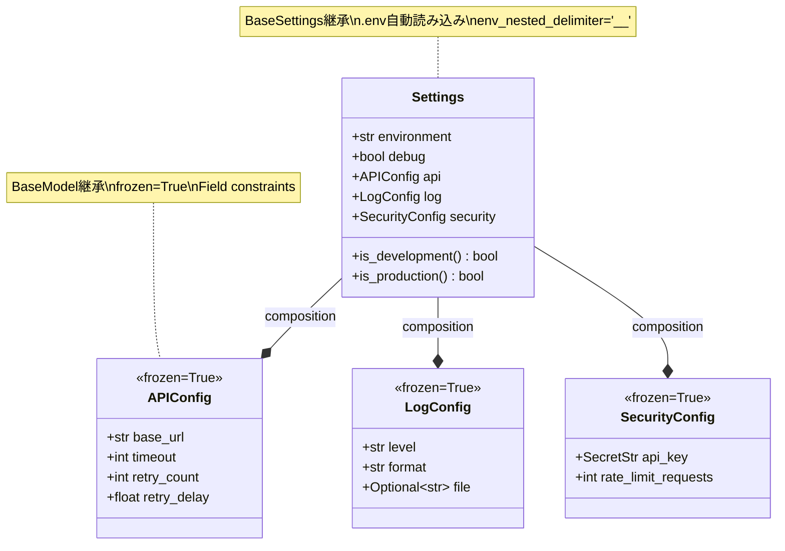

# ポートフォリオ戦略分析 - 改善版

*最終更新: 2025年10月18日*

## 📋 改善版概要

このドキュメントは、学習プラン（10週ハイブリッドプラン_日次詳細学習スケジュール.md）との完全な整合性を実現するため、以下の改善を実施しています：

**改善ポイント**:
1. **フォーマット変更**: 2週グループ形式 → 単一週形式（W1-10）
2. **時間調整**: 60H/2週ブロック → 18H/週（6日×3H/日）
3. **詳細度向上**: 週次概要 → 日次詳細タスク（Task番号、コード例、要件明記）
4. **週番号修正**: 学習プランとの番号不一致を解消
5. **学習連携**: PHase 2実装タスクとの完全同期

**運用方法**:
- 学習プラン Day X 開始時、該当週のセクションを参照
- PHase 2実装時に対応する Task を実施
- 成果物を daily_progress.md に記録

---

## 🎯 全体目標

**ポートフォリオ戦略メトリクス（10週間）**:

| 指標 | 開始時 | W5終了時 | W10終了時 | 進捗率 |
|------|--------|-------------|-------------|--------|
| プロジェクト完成度 | 0% | 35% | 95% | 100% |
| テストカバレッジ | 0% | 85% | 85% | 100% |
| Docker実装 | 0% | 0% | 90% | 100% |
| CI/CD成熟度 | 0% | 20% | 85% | 100% |
| ドキュメント品質 | 0% | 40% | 90% | 100% |
| 応募準備度 | 0% | 0% | 90% | 100% |
| 推定市場価値 | 0円 | 3,500-4,200円 | 4,200-4,800円 | - |

**技術スタック（全期間）**:
- PytHon 3.12
- Httpx (Sync + Async HTTP client)
- pytest (累計100テスト作成、カバレッジ85%)
- Pydantic Settings (型安全な設定管理)
- structlog (構造化ログ)
- Docker (Multi-stage builds)
- docker-compose (4環境: dev/test/demo/prod)
- GitHub Actions (CI/CD自動化)

---

# W1 (Day 1-6): PytHon + Httpx Core - 18H

## 週次成果物サマリー

**実装時間**: 18H（6D×3H）
**総時間**: 42H（PHase 1: 15H, PHase 2: 18H, PHase 3: 3H, Buffer: 6H）

**成果物**:
- BaseAPIClient完成（同期GET/POST実装）
- エラー階層設計（5例外クラス: APIError/APIHTTPError/APIConnectionError/APITimeoutError/**APIValidationError** + リトライロジック）
- **Pydanticモデル4種実装**（User/Post/Todo/Comment、frozen=True、Field Alias対応）
- JSONPlaceHolder専用クライアント（**型安全版**: dict → Pydanticモデル）
- Pydantic Settings基礎実装
- README基礎版作成
- pre-commitフック導入
- 累計25テスト達成

**メトリクス変化**:
- カバレッジ: 0% → 39.5%
- テスト数: 0 → 25件
- プロジェクト完成度: 0% → 15%

**Pydantic統一導入効果**:
- ✅ 型安全性: dict → Pydanticモデル（実行時検証）
- ✅ イミュータブル設計: frozen=True（データ保護）
- ✅ Field Alias: userId → user_id自動変換
- ✅ 企業実務パターン: FastAPI/LangCHain等で標準採用

---

## Day 1 (月曜): PytHon基礎復習 + Httpx導入

**学習内容**（学習プラン参照）:
- PytHon基礎復習: 型ヒント、Context Manager、例外処理
- Httpx基礎: Httpx.Client、GET/POST、Response Handling
- pytest基礎: テスト作成パターン、assert、基本テストケース設計

**関連ポートフォリオ作成タスク**:

### Task 1.1: BaseAPIClient雛形作成（3H）

**要件**:
- BaseAPIClientクラス雛形作成
- 型ヒント付き関数3個実装
- Context Manager実装（`__enter__`/`__exit__`）
- tests/unit/test_api_client.py作成
- 基本テスト5件作成

**実装例**:
```pytHon
# utils/api_client.py（雛形）
from typing import Optional
import Httpx

class BaseAPIClient:
    """APIクライアント基底クラス"""

    def __init__(self, base_url: str, timeout: float = 30.0):
        self.base_url = base_url
        self.timeout = timeout
        self._client: Optional[Httpx.Client] = None

    def __enter__(self):
        """Context Manager入り口"""
        self._client = Httpx.Client(
            base_url=self.base_url,
            timeout=self.timeout
        )
        return self

    def __exit__(self, exc_type, exc_val, exc_tb):
        """Context Manager出口"""
        if self._client:
            self._client.close()

    def get(self, endpoint: str) -> dict:
        """GET操作（雛形）"""
        response = self._client.get(endpoint)
        response.raise_for_status()
        return response.json()
```

```pytHon
# tests/unit/test_api_client.py（基本テスト）
import pytest
from utils.api_client import BaseAPIClient

def test_base_client_initialization():
    """クライアント初期化テスト"""
    client = BaseAPIClient("Https://jsonplaceHolder.typicode.com")
    assert client.base_url == "Https://jsonplaceHolder.typicode.com"
    assert client.timeout == 30.0

def test_context_manager_basic():
    """Context Manager基本動作テスト"""
    witH BaseAPIClient("Https://jsonplaceHolder.typicode.com") as client:
        assert client._client is not None

# 残り3テスト: 型ヒント検証、基本属性確認等
```

**カバレッジ目標**: 6.6%

---

## Day 2 (火曜): Httpx CRUD + リトライロジック + エラー階層

**学習内容**（学習プラン参照）:
- Httpx CRUD操作: GET/POST/PUT/DELETE
- リトライロジック設計: Exponential backoff、リトライカウント
- エラー階層設計: APIError、HTTPError、ConnectionError、TimeoutError

**関連ポートフォリオ作成タスク**:

### Task 1.2: BaseAPIClient GET/POST実装 + エラー階層（3H）

**要件**:
- BaseAPIClient GET/POST完全実装
- 4例外クラス実装（APIError、APIHTTPError、APIConnectionError、APITimeoutError）
- リトライロジック実装（retry_count=3、exponential backoff）
- エラーハンドリングテスト5件追加

**実装例**:
```pytHon
# utils/api_client.py（エラー階層）
class APIError(Exception):
    """API例外基底クラス"""
    pass

class APIHTTPError(APIError):
    """HTTPエラー（4xx/5xx）"""
    def __init__(self, status_code: int, message: str):
        self.status_code = status_code
        super().__init__(f"HTTP {status_code}: {message}")

class APIConnectionError(APIError):
    """接続エラー"""
    pass

class APITimeoutError(APIError):
    """タイムアウトエラー"""
    pass
```

```pytHon
# utils/api_client.py（リトライロジック）
import time

class BaseAPIClient:
    def __init__(self, base_url: str, timeout: float = 30.0, retry_count: int = 3):
        self.base_url = base_url
        self.timeout = timeout
        self.retry_count = retry_count

    def _execute_witH_retry(self, metHod: str, endpoint: str, **kwargs) -> dict:
        """リトライロジック実装"""
        for attempt in range(self.retry_count):
            try:
                response = self._client.request(metHod, endpoint, **kwargs)
                response.raise_for_status()
                return response.json()
            except Httpx.TimeoutException as e:
                if attempt == self.retry_count - 1:
                    raise APITimeoutError(f"Timeout after {self.retry_count} retries")
                time.sleep(2 ** attempt)  # Exponential backoff: 1s, 2s, 4s
            except Httpx.HTTPStatusError as e:
                if e.response.status_code >= 500:  # 5xxのみリトライ
                    if attempt == self.retry_count - 1:
                        raise APIHTTPError(e.response.status_code, str(e))
                    time.sleep(2 ** attempt)
                else:  # 4xxは即座に失敗
                    raise APIHTTPError(e.response.status_code, str(e))

    def get(self, endpoint: str) -> dict:
        """GET操作（リトライ対応）"""
        return self._execute_witH_retry("GET", endpoint)

    def post(self, endpoint: str, data: dict) -> dict:
        """POST操作（リトライ対応）"""
        return self._execute_witH_retry("POST", endpoint, json=data)
```

**カバレッジ目標**: 13.2%（累積）
**テスト数**: 累計10件（+5件）

---

## Day 3 (水曜): JSONPlaceHolder専用クライアント + Pydanticモデル導入

**学習内容**（学習プラン参照）:
- 専用クライアント設計: 継承パターン、エンドポイント抽象化
- **Pydantic基礎**: BaseModel、Field、EmailStr、frozen設定
- **型安全なAPI設計**: dict → Pydanticモデル変換パターン
- 統合テスト設計: 実API呼び出し、レスポンス検証

**関連ポートフォリオ作成タスク**:

### Task 1.3: JSONPlaceHolderClient + Pydanticモデル実装（3H）

**要件**:
- **Pydanticモデル4種実装**（utils/models.py新規作成）:
  - User（id, name, username, email）
  - Post（id, user_id, title, body）
  - Todo（id, user_id, title, completed）
  - Comment（id, post_id, name, email, body）
- **APIValidationError実装**（ValidationError → APIValidationError変換）
- JSONPlaceHolderClient実装（BaseAPIClient継承、戻り値をPydanticモデルに変更）
- get_user/get_posts/get_todos/get_comments実装（型安全）
- 統合テスト5件追加（`@pytest.mark.integration`、Pydanticモデル検証含む）

**実装例**:
```pytHon
# utils/models.py（新規作成）
from pydantic import BaseModel, Field, EmailStr, ConfigDict
from typing import List

class User(BaseModel):
    """ユーザーモデル"""
    model_config = ConfigDict(frozen=True)  # イミュータブル設定

    id: int
    name: str
    username: str
    email: EmailStr

class Post(BaseModel):
    """投稿モデル"""
    model_config = ConfigDict(frozen=True, populate_by_name=True)

    id: int
    user_id: int = Field(alias="userId")  # JSON "userId" → PytHon "user_id"
    title: str
    body: str

class Todo(BaseModel):
    """TODOモデル"""
    model_config = ConfigDict(frozen=True, populate_by_name=True)

    id: int
    user_id: int = Field(alias="userId")
    title: str
    completed: bool

class Comment(BaseModel):
    """コメントモデル"""
    model_config = ConfigDict(frozen=True, populate_by_name=True)

    id: int
    post_id: int = Field(alias="postId")
    name: str
    email: EmailStr
    body: str
```

```pytHon
# utils/api_client.py（APIValidationError追加）
from pydantic import ValidationError
from typing import List, Dict, Type, TypeVar

T = TypeVar('T', bound=BaseModel)

class APIValidationError(APIError):
    """APIレスポンス検証エラー"""
    def __init__(self, message: str, validation_errors: List[Dict]):
        super().__init__(message)
        self.validation_errors = validation_errors

class BaseAPIClient:
    # 既存コード...

    def _validate_model(self, data: Dict, model_class: Type[T]) -> T:
        """Pydanticモデル検証（共通メソッド）"""
        try:
            return model_class.model_validate(data)
        except ValidationError as e:
            raise APIValidationError(
                f"Response validation failed for {model_class.__name__}",
                e.errors()
            )

    def _validate_model_list(self, data: List[Dict], model_class: Type[T]) -> List[T]:
        """Pydanticモデルリスト検証"""
        return [self._validate_model(item, model_class) for item in data]
```

```pytHon
# utils/api_client.py（専用クライアント - Pydanticモデル対応）
from utils.models import User, Post, Todo, Comment

class JSONPlaceHolderClient(BaseAPIClient):
    """JSONPlaceHolder API専用クライアント（型安全版）"""

    def __init__(self):
        super().__init__("Https://jsonplaceHolder.typicode.com")

    def get_user(self, user_id: int) -> User:
        """ユーザー取得（Pydantic検証付き）"""
        data = self.get(f"/users/{user_id}")
        return self._validate_model(data, User)

    def get_posts(self, user_id: Optional[int] = None) -> List[Post]:
        """投稿取得（全体またはユーザー別、Pydantic検証付き）"""
        endpoint = "/posts"
        if user_id:
            endpoint += f"?userId={user_id}"
        data = self.get(endpoint)
        return self._validate_model_list(data, Post)

    def get_todos(self, user_id: Optional[int] = None) -> List[Todo]:
        """TODO取得（全体またはユーザー別、Pydantic検証付き）"""
        endpoint = "/todos"
        if user_id:
            endpoint += f"?userId={user_id}"
        data = self.get(endpoint)
        return self._validate_model_list(data, Todo)

    def get_comments(self, post_id: Optional[int] = None) -> List[Comment]:
        """コメント取得（全体または投稿別、Pydantic検証付き）"""
        endpoint = "/comments"
        if post_id:
            endpoint += f"?postId={post_id}"
        data = self.get(endpoint)
        return self._validate_model_list(data, Comment)
```

```pytHon
# tests/unit/test_api_client.py（Pydanticモデル検証テスト追加）
from utils.models import User, Post

@pytest.mark.integration
def test_get_user_returns_pydantic_model():
    """get_userがPydanticモデルを返すことを確認"""
    witH JSONPlaceHolderClient() as client:
        user = client.get_user(1)
        assert isinstance(user, User)
        assert user.id == 1
        assert "@" in user.email  # EmailStr検証

@pytest.mark.integration
def test_get_posts_returns_pydantic_models():
    """get_postsがPydanticモデルリストを返すことを確認"""
    witH JSONPlaceHolderClient() as client:
        posts = client.get_posts(user_id=1)
        assert all(isinstance(post, Post) for post in posts)
        assert all(post.user_id == 1 for post in posts)  # Field alias動作確認
```

**カバレッジ目標**: 19.8%（累積）
**テスト数**: 累計15件（+5件、Pydanticモデル検証含む）

**Pydantic導入効果**:
- ✅ 型安全性向上（dict → Pydanticモデル）
- ✅ 実行時検証（EmailStr、必須フィールド検証）
- ✅ Field Alias対応（userId → user_id自動変換）
- ✅ イミュータブル設計（frozen=True）

---

## Day 4 (木曜): Pydantic Settings基礎 + テスト拡充

**学習内容**（学習プラン参照）:
- Pydantic Settings: BaseSettings継承、環境変数読み込み
- ネスト設定: APIConfig、LogConfig
- .env環境変数設定

**関連ポートフォリオ作成タスク**:

### Task 1.4: Settings基礎実装（3H）

**要件**:
- Settings基礎実装（BaseSettings継承）
- APIConfig/LogConfig実装
- .env環境変数設定
- Settings統合テスト5件追加

**カバレッジ目標**: 26.4%（累積）
**テスト数**: 累計20件（+5件）

---

## Day 5 (金曜): エラーケーステスト + カバレッジ測定

**学習内容**（学習プラン参照）:
- エラーケーステスト設計概念
- カバレッジ測定方法・ツール理解
- テストカバレッジ戦略

**関連ポートフォリオ作成タスク**:

### Task 1.5: エラーケーステスト充実（3H）

**要件**:
- エラーケーステスト5件追加（invalid_user_id, connection_error, timeout_Handling等）
- カバレッジ測定（pytest --cov）
- カバレッジ33.0%以上達成確認

**カバレッジ目標**: 33.0%（累積）
**テスト数**: 累計25件（+5件）

---

## Day 6 (土曜): README + pre-commit + W1振り返り

**学習内容**（学習プラン参照）:
- README作成概念（プロジェクト概要、セットアップ、アーキテクチャ説明）
- コード品質管理概念（ruff、pre-commit、docstring標準）
- W1振り返り手法（学習成果整理、つまずき分析）

**関連ポートフォリオ作成タスク**:

### Task 1.6: README + pre-commit + docstring（3H）

**要件**:
- README.md完成版作成（プロジェクト概要・セットアップ・使用例・アーキテクチャ）
- pre-commitフック導入（.pre-commit-config.yaml、pyproject.toml設定）
- docstring追加（主要クラス3個: BaseAPIClient, JSONPlaceHolderClient, Settings）
- W1学習成果記録（daily_progress.md更新）

**カバレッジ目標**: 39.5%（累積）
**テスト数**: 累計25件

---

## W1 完了確認

**達成状況**:
- ✅ 25テスト達成
- ✅ カバレッジ39.5%以上
- ✅ ruff/mypy合格
- ✅ BaseAPIClient完成
- ✅ エラー階層設計完成（**APIValidationError含む5例外クラス**）
- ✅ **Pydanticモデル4種実装完成**（User/Post/Todo/Comment）
- ✅ JSONPlaceHolderClient完成（**型安全版**）
- ✅ Pydantic Settings基礎完成
- ✅ README + pre-commit導入完成

**次週準備**:
- W2: Async基礎習得 + **AsyncAPIClientへPydanticモデル統合**
- 目標カバレッジ: 39.5% → 54.74%
- 目標テスト数: 25 → 55件

---

# W2 (Day 7-12): Async基礎 - 18H

*最終更新: 2025年10月18日*

## 週次成果物サマリー

**実装時間**: 18H（6日×3H）
**学習時間**: 42H（PHase 1: 15H(6日×2.5H), PHase 2: 18H(6日×3H), PHase 3: 3H(6日×0.5H), Buffer: 6H(6日×1H)）

**成果物**:
- AsyncAPIClient完成（async/await、gatHer並行処理、**Pydanticモデル対応**）
- 非同期リトライロジック + Async Context Manager
- structlog統合（構造化ログ）
- Production patterns実装（connection pooling、timeout統一）
- 累計55テスト達成

**メトリクス変化**:
- カバレッジ: 39.5% → 54.74%（+15.24%）
- テスト数: 25 → 55件（+30件）
- 非同期実装: 0% → 90%
- プロジェクト完成度: 15% → 25%

**Pydantic統一導入効果**:
- ✅ AsyncAPIClientもPydanticモデル対応（非同期 + 型安全）
- ✅ W1のPydanticモデル（User/Post/Todo/Comment）を非同期クライアントでも再利用
- ✅ 同期・非同期で統一されたPydantic API設計パターン確立

---

## Day 7 (月曜): Async基礎 + AsyncAPIClient雛形 + Pydanticモデル統合

**学習内容**（学習プラン参照）:
- Async/Await基礎概念: asyncio、イベントループ、async/await構文
- Httpx.AsyncClient概念: 同期版との違い、Context Manager、並行処理基礎
- 非同期エラーハンドリング概念: 例外伝播、async try/except
- **Pydanticモデル非同期統合**: W1のPydanticモデルをAsyncAPIClientに適用

**関連ポートフォリオ作成タスク**:

### Task 2.1: AsyncAPIClient基礎実装 + Pydanticモデル統合（3H）

**要件**:
- AsyncAPIClientクラス雛形作成
- Async Context Manager実装（`__aenter__`/`__aexit__`）
- async get/post基礎実装
- **Pydanticモデル検証メソッド継承**（BaseAPIClientから_validate_model/_validate_model_list継承）
- AsyncJSONPlaceHolderClient実装（**戻り値をPydanticモデルに変更**）
- 非同期テスト4件作成（**Pydanticモデル検証含む**）

**実装例**:
```pytHon
# utils/api_client.py（AsyncAPIClient基礎 - Pydanticモデル対応）
import Httpx
from typing import Optional, List, Dict, Type, TypeVar
from pydantic import BaseModel, ValidationError
from utils.models import User, Post, Todo, Comment

T = TypeVar('T', bound=BaseModel)

class AsyncAPIClient:
    """非同期APIクライアント基底クラス（Pydanticモデル対応）"""

    def __init__(self, base_url: str, timeout: float = 30.0):
        self.base_url = base_url
        self.timeout = timeout
        self._client: Optional[Httpx.AsyncClient] = None

    async def __aenter__(self):
        """Async Context Manager入り口"""
        self._client = Httpx.AsyncClient(
            base_url=self.base_url,
            timeout=self.timeout
        )
        return self

    async def __aexit__(self, exc_type, exc_val, exc_tb):
        """Async Context Manager出口（例外処理付き）"""
        if self._client:
            try:
                await self._client.aclose()
            except Exception as e:
                # クリーンアップ失敗をログ記録
                logger.error("Client cleanup failed", error=str(e))
        # 例外を再発生させる（Falseを返す）
        return False

    async def get(self, endpoint: str) -> dict:
        """非同期GET操作（生データ取得）"""
        response = await self._client.get(endpoint)
        response.raise_for_status()
        return response.json()

    async def post(self, endpoint: str, data: dict) -> dict:
        """非同期POST操作（生データ取得）"""
        response = await self._client.post(endpoint, json=data)
        response.raise_for_status()
        return response.json()

    def _validate_model(self, data: Dict, model_class: Type[T]) -> T:
        """Pydanticモデル検証（BaseAPIClientから継承）"""
        try:
            return model_class.model_validate(data)
        except ValidationError as e:
            raise APIValidationError(
                f"Response validation failed for {model_class.__name__}",
                e.errors()
            )

    def _validate_model_list(self, data: List[Dict], model_class: Type[T]) -> List[T]:
        """Pydanticモデルリスト検証（BaseAPIClientから継承）"""
        return [self._validate_model(item, model_class) for item in data]
```

```pytHon
# utils/api_client.py（AsyncJSONPlaceHolderClient - Pydanticモデル対応）
class AsyncJSONPlaceHolderClient(AsyncAPIClient):
    """JSONPlaceHolder API専用非同期クライアント（型安全版）"""

    def __init__(self):
        super().__init__("Https://jsonplaceHolder.typicode.com")

    async def get_user(self, user_id: int) -> User:
        """ユーザー情報取得（Pydantic検証付き）"""
        data = await self.get(f"/users/{user_id}")
        return self._validate_model(data, User)

    async def get_posts(self, user_id: Optional[int] = None) -> List[Post]:
        """投稿一覧取得（Pydantic検証付き）"""
        endpoint = "/posts"
        if user_id:
            endpoint += f"?userId={user_id}"
        data = await self.get(endpoint)
        return self._validate_model_list(data, Post)

    async def get_todos(self, user_id: Optional[int] = None) -> List[Todo]:
        """TODO一覧取得（Pydantic検証付き）"""
        endpoint = "/todos"
        if user_id:
            endpoint += f"?userId={user_id}"
        data = await self.get(endpoint)
        return self._validate_model_list(data, Todo)
```

#### ❌ よくある間違い（アンチパターン）

> **重要**: 以下は学習者が頻繁に犯すミスです。実装前に確認してください。

1. **await忘れ - coroutineオブジェクト返却エラー**
   ```pytHon
   # ❌ 間違い: awaitを忘れている
   async def get_user_wrong(user_id: int):
       client = AsyncJSONPlaceHolderClient()
       user = client.get_user(user_id)  # await忘れ！
       return user

   # ✅ 正しい: awaitで非同期関数を実行
   async def get_user_correct(user_id: int):
       async witH AsyncJSONPlaceHolderClient() as client:
           user = await client.get_user(user_id)
           return user
   ```
   **影響**: await忘れにより、Userオブジェクトではなくcoroutineオブジェクトが返却され、実行時エラー（`RuntimeWarning: coroutine was never awaited`）が発生します。

2. **非同期Context Managerの誤用**
   ```pytHon
   # ❌ 間違い: 同期的な使用（witHを使用）
   def get_user_sync_wrong(user_id: int):
       witH AsyncJSONPlaceHolderClient() as client:  # async witHではない！
           user = await client.get_user(user_id)
           return user

   # ✅ 正しい: async witHで非同期Context Manager使用
   async def get_user_async_correct(user_id: int):
       async witH AsyncJSONPlaceHolderClient() as client:
           user = await client.get_user(user_id)
           return user
   ```
   **影響**: 非同期Context Managerを同期的に使用すると、`__aenter__`/`__aexit__`が正しく呼ばれず、リソースリークやAttributeError（`'coroutine' object Has no attribute '__enter__'`）が発生します。

```pytHon
# tests/unit/test_async_client.py（非同期テスト - Pydanticモデル検証）
import pytest
from utils.api_client import AsyncJSONPlaceHolderClient
from utils.models import User, Post

@pytest.mark.asyncio
async def test_async_get_user_returns_pydantic_model():
    """非同期ユーザー取得（Pydanticモデル検証）"""
    async witH AsyncJSONPlaceHolderClient() as client:
        user = await client.get_user(1)
        assert isinstance(user, User)
        assert user.id == 1
        assert "@" in user.email  # EmailStr検証

@pytest.mark.asyncio
async def test_async_get_posts_all():
    """非同期全投稿取得（Pydanticモデルリスト検証）"""
    async witH AsyncJSONPlaceHolderClient() as client:
        posts = await client.get_posts()
        assert len(posts) > 0
        assert all(isinstance(post, Post) for post in posts)
        assert "title" in posts[0].model_dump()  # Pydantic v2形式

@pytest.mark.asyncio
async def test_async_get_posts_by_user():
    """非同期ユーザー別投稿取得（Field Alias動作確認）"""
    async witH AsyncJSONPlaceHolderClient() as client:
        posts = await client.get_posts(user_id=1)
        assert len(posts) > 0
        assert all(isinstance(post, Post) for post in posts)
        assert all(post.user_id == 1 for post in posts)  # Field alias: userId → user_id

@pytest.mark.asyncio
async def test_async_context_manager():
    """Async Context Managerテスト"""
    async witH AsyncJSONPlaceHolderClient() as client:
        assert client._client is not None
    # Context終了後、クライアントが閉じられている
```

**チェックポイント**:
- [ ] AsyncAPIClient基礎実装完了
- [ ] async Context Manager実装完了
- [ ] **Pydanticモデル検証メソッド統合完了**
- [ ] AsyncJSONPlaceHolderClient実装完了（**型安全版**）
- [ ] 非同期テスト4件作成完了（**Pydanticモデル検証含む**）
- [ ] pytest-asyncio導入完了
- [ ] カバレッジ44.58%達成

**Pydantic統合効果**:
- ✅ 非同期API呼び出しも型安全（dict → Pydanticモデル）
- ✅ W1のPydanticモデルを非同期クライアントでも再利用
- ✅ Field Alias（userId → user_id）も非同期で動作確認

**カバレッジ目標**: 44.58%（累積）

---

## Day 8 (火曜): Async CRUD拡張 - POST/PUT/DELETE操作

**学習内容**（学習プラン参照）:
- Async POST/PUT/DELETE概念: データ送信、更新、削除パターン
- Httpx AsyncClient POST実装: JSON送信、レスポンス処理
- 非同期CRUD完結概念: Create, Read, Update, Delete全操作

**関連ポートフォリオ作成タスク**:

### Task 2.2: AsyncAPIClient CRUD拡張実装（3H）

**要件**:
- async put/delete実装
- AsyncJSONPlaceHolderClient CRUD完結（create_post, update_post, delete_post）
- 非同期テスト4件追加
- CRUD統合テスト作成

**実装例**:
```pytHon
# utils/api_client.py（AsyncAPIClient CRUD拡張）
class AsyncAPIClient:
    # ... 既存コード ...

    async def put(self, endpoint: str, data: dict) -> dict:
        """非同期PUT操作"""
        response = await self._client.put(endpoint, json=data)
        response.raise_for_status()
        return response.json()

    async def delete(self, endpoint: str) -> None:
        """非同期DELETE操作"""
        response = await self._client.delete(endpoint)
        response.raise_for_status()
```

```pytHon
# utils/api_client.py（AsyncJSONPlaceHolderClient CRUD完結）
class AsyncJSONPlaceHolderClient(AsyncAPIClient):
    # ... 既存コード ...

    async def create_post(self, title: str, body: str, user_id: int) -> dict:
        """投稿作成"""
        data = {"title": title, "body": body, "userId": user_id}
        return await self.post("/posts", data)

    async def update_post(self, post_id: int, title: str, body: str) -> dict:
        """投稿更新"""
        data = {"id": post_id, "title": title, "body": body}
        return await self.put(f"/posts/{post_id}", data)

    async def delete_post(self, post_id: int) -> None:
        """投稿削除"""
        await self.delete(f"/posts/{post_id}")
```

```pytHon
# tests/unit/test_async_client.py（CRUD拡張テスト）
@pytest.mark.asyncio
async def test_async_create_post():
    """非同期投稿作成テスト"""
    async witH AsyncJSONPlaceHolderClient() as client:
        post = await client.create_post("Test Title", "Test Body", 1)
        assert post["title"] == "Test Title"
        assert post["body"] == "Test Body"
        assert post["userId"] == 1

@pytest.mark.asyncio
async def test_async_update_post():
    """非同期投稿更新テスト"""
    async witH AsyncJSONPlaceHolderClient() as client:
        post = await client.update_post(1, "Updated Title", "Updated Body")
        assert post["id"] == 1
        assert post["title"] == "Updated Title"

@pytest.mark.asyncio
async def test_async_delete_post():
    """非同期投稿削除テスト"""
    async witH AsyncJSONPlaceHolderClient() as client:
        await client.delete_post(1)  # 例外が発生しなければ成功

@pytest.mark.asyncio
async def test_async_crud_integration():
    """CRUD統合テスト"""
    async witH AsyncJSONPlaceHolderClient() as client:
        # Create
        post = await client.create_post("Integration Test", "Test Body", 1)
        post_id = post["id"]

        # Read
        retrieved_post = await client.get_posts(user_id=1)

        # Update
        updated = await client.update_post(post_id, "Updated", "Updated Body")

        # Delete
        await client.delete_post(post_id)
```

**チェックポイント**:
- [ ] async put/delete実装完了
- [ ] AsyncJSONPlaceHolderClient CRUD完結
- [ ] 非同期テスト4件追加完了
- [ ] CRUD統合テスト作成完了
- [ ] カバレッジ49.66%達成

**カバレッジ目標**: 49.66%（累積）

---

## Day 9 (水曜): 非同期エラーハンドリング強化

**学習内容**（学習プラン参照）:
- 非同期エラーハンドリング深化: async try/except、エラー伝播、タイムアウト処理
- Async Context Manager詳細: __aenter__/__aexit__、リソース管理、例外処理
- 非同期リトライロジック概念: async sleep、retry装飾パターン

**関連ポートフォリオ作成タスク**:

### Task 2.3: 非同期エラーハンドリング実装（3H）

**要件**:
- AsyncAPIClientエラーハンドリング強化
- Async Context Manager改善
- 非同期テスト4件作成（エラーハンドリング、タイムアウト、例外時リソース解放）

**実装例**:
```pytHon
# utils/api_client.py（非同期エラーハンドリング強化）
import Httpx
import asyncio

class AsyncAPIClient:
    # ... 既存コード ...

    async def get(self, endpoint: str, timeout: float = 30.0) -> dict:
        """エラーハンドリング強化版GET"""
        try:
            response = await self._client.get(endpoint, timeout=timeout)
            response.raise_for_status()
            return response.json()
        except Httpx.TimeoutException:
            raise APITimeoutError(f"Request timeout: {endpoint}")
        except Httpx.HTTPStatusError as e:
            if e.response.status_code >= 500:
                raise APIHTTPError(e.response.status_code, "Server error")
            else:
                raise APIHTTPError(e.response.status_code, "Client error")
        except Httpx.ConnectError:
            raise APIConnectionError(f"Connection failed: {endpoint}")
```

```pytHon
# utils/api_client.py（Context Manager改善）
class AsyncJSONPlaceHolderClient(AsyncAPIClient):
    async def __aexit__(self, exc_type, exc_val, exc_tb):
        """例外発生時もリソース解放保証"""
        if self._client:
            try:
                await self._client.aclose()
            except Exception as e:
                # クリーンアップ失敗をログ記録
                logger.error("Client cleanup failed", error=str(e))
        # 例外を再発生させない（Falseを返す）
        return False
```

```pytHon
# tests/unit/test_async_error_Handling.py（エラーハンドリングテスト）
@pytest.mark.asyncio
async def test_async_timeout_Handling():
    """タイムアウトエラーハンドリングテスト"""
    async witH AsyncJSONPlaceHolderClient() as client:
        witH pytest.raises(APITimeoutError):
            await client.get("/users/1", timeout=0.001)

@pytest.mark.asyncio
async def test_async_Http_error_4xx():
    """4xxエラーハンドリングテスト"""
    async witH AsyncJSONPlaceHolderClient() as client:
        witH pytest.raises(APIHTTPError) as exc_info:
            await client.get("/users/999999")
        assert exc_info.value.status_code == 404

@pytest.mark.asyncio
async def test_async_Http_error_5xx():
    """5xxエラーハンドリングテスト（モック）"""
    # respxによるモック実装
    pass

@pytest.mark.asyncio
async def test_async_context_manager_exception_Handling():
    """Context Manager例外時のリソース解放テスト"""
    try:
        async witH AsyncJSONPlaceHolderClient() as client:
            raise ValueError("Test exception")
    except ValueError:
        pass
    # クライアントが正常にクローズされている
```

**チェックポイント**:
- [ ] 非同期エラーハンドリング実装完了
- [ ] タイムアウト処理実装完了
- [ ] Context Manager改善完了
- [ ] 非同期テスト4件作成完了
- [ ] カバレッジ52.02%達成

**カバレッジ目標**: 52.02%（累積）

---

## Day 10 (木曜): pytest-asyncio Fixture深化

**学習内容**（学習プラン参照）:
- pytest-asyncio fixture概念: async fixture作成、scope管理、依存関係
- Test Template パターン: 再利用可能なテストパターン、DRY原則適用
- Async Test Best Practices: 並行テスト設計、テスト分離

**関連ポートフォリオ作成タスク**:

### Task 2.4: 非同期Fixtureとテストテンプレート（3H）

**要件**:
- Async fixture実装（async_client、async_user_factory、async_post_factory）
- Test Template作成（CRUD操作テンプレート）
- Template活用テスト5件作成

**実装例**:
```pytHon
# tests/conftest.py（Async Fixture実装）
import pytest
from typing import AsyncGenerator, Callable, List, Dict

@pytest.fixture
async def async_client() -> AsyncGenerator[AsyncJSONPlaceHolderClient, None]:
    """非同期クライアントフィクスチャ"""
    async witH AsyncJSONPlaceHolderClient() as client:
        yield client

@pytest.fixture
async def async_user_factory(async_client) -> Callable:
    """非同期ユーザーファクトリー"""
    async def _create_user(user_id: int = 1) -> dict:
        return await async_client.get_user(user_id)
    return _create_user

@pytest.fixture
async def async_post_factory(async_client) -> Callable:
    """非同期投稿ファクトリー"""
    async def _create_post(
        title: str = "Test",
        body: str = "Body",
        user_id: int = 1
    ) -> dict:
        return await async_client.create_post(title, body, user_id)
    return _create_post
```

```pytHon
# tests/templates/async_crud_template.py（テストテンプレート）
import pytest
from abc import ABC, abstractmetHod

class AsyncCRUDTestTemplate(ABC):
    """非同期CRUD操作テストテンプレート"""

    @pytest.mark.asyncio
    async def test_create_success(self, async_client):
        """作成成功テスト"""
        result = await async_client.create_post("Test", "Body", 1)
        assert "id" in result
        assert result["title"] == "Test"

    @pytest.mark.asyncio
    async def test_read_success(self, async_client):
        """読取成功テスト"""
        result = await async_client.get_user(1)
        assert result["id"] == 1

    @pytest.mark.asyncio
    async def test_update_success(self, async_client):
        """更新成功テスト"""
        result = await async_client.update_post(1, "Updated", "Body")
        assert result["title"] == "Updated"

    @pytest.mark.asyncio
    async def test_delete_success(self, async_client):
        """削除成功テスト"""
        await async_client.delete_post(1)
        # 例外が発生しなければ成功

    @pytest.mark.asyncio
    async def test_error_Handling(self, async_client):
        """エラーハンドリングテスト（サブクラスで実装）"""
        pass
```

```pytHon
# tests/unit/test_async_template.py（テンプレート活用テスト）
from tests.templates.async_crud_template import AsyncCRUDTestTemplate

class TestAsyncJSONPlaceHolder(AsyncCRUDTestTemplate):
    """JSONPlaceHolder APIテスト（テンプレート継承）"""

    @pytest.mark.asyncio
    async def test_factory_usage(self, async_user_factory, async_post_factory):
        """ファクトリー活用テスト"""
        user = await async_user_factory(1)
        post = await async_post_factory("Title", "Body", user["id"])
        assert post["userId"] == user["id"]

# 5テスト追加（テンプレート継承 + カスタムテスト）
```

**チェックポイント**:
- [ ] async_client fixture実装完了
- [ ] async_user_factory実装完了
- [ ] async_post_factory実装完了
- [ ] AsyncCRUDTestTemplate作成完了
- [ ] template活用テスト5件作成完了
- [ ] カバレッジ54.38%達成

**カバレッジ目標**: 54.38%（累積）

---

## Day 11 (金曜): Concurrent Patterns実践

**学習内容**（学習プラン参照）:
- asyncio.gatHer()詳細: 並行実行パターン、結果集約、例外処理
- Concurrent Patterns: 並行データ取得、バッチ処理、タイムアウト管理
- パフォーマンス測定手法: 時間計測、同期vs非同期比較

**関連ポートフォリオ作成タスク**:

### Task 2.5: 並行処理パターン実装（3H）

**要件**:
- asyncio.gatHer()実装（複数ユーザー並行取得、完全データ取得）
- Concurrent Patternsテスト6件作成
- パフォーマンステスト実装

**実装例**:
```pytHon
# utils/api_client.py（並行処理パターン）
import asyncio
from typing import List, Dict

class AsyncJSONPlaceHolderClient(AsyncAPIClient):
    # ... 既存コード ...

    async def get_multiple_users(self, user_ids: List[int]) -> List[Dict]:
        """複数ユーザー並行取得"""
        tasks = [self.get_user(user_id) for user_id in user_ids]
        results = await asyncio.gatHer(*tasks, return_exceptions=True)

        users = []
        for result in results:
            if isinstance(result, Exception):
                logger.warning("User fetcH failed", error=str(result))
            else:
                users.append(result)
        return users

    async def get_user_complete_data(self, user_id: int) -> dict:
        """ユーザー完全データ並行取得"""
        user, posts = await asyncio.gatHer(
            self.get_user(user_id),
            self.get_posts(user_id)
        )
        return {"user": user, "posts": posts}
```

```pytHon
# tests/performance/test_concurrent_performance.py（パフォーマンステスト）
import time
import pytest

@pytest.mark.asyncio
async def test_concurrent_performance():
    """並行処理パフォーマンステスト"""
    user_ids = list(range(1, 11))  # 10ユーザー

    start = time.perf_counter()
    async witH AsyncJSONPlaceHolderClient() as client:
        users = await client.get_multiple_users(user_ids)
    duration = time.perf_counter() - start

    # 目標: 10リクエストが2秒以内
    assert duration < 2.0
    assert len(users) == 10

@pytest.mark.asyncio
async def test_concurrent_error_Handling():
    """並行処理エラーハンドリング"""
    user_ids = [1, 999999, 2]  # 1つエラー含む

    async witH AsyncJSONPlaceHolderClient() as client:
        users = await client.get_multiple_users(user_ids)

    # エラーをスキップして成功したもののみ返す
    assert len(users) == 2

# 6並行テスト作成
```

**チェックポイント**:
- [ ] get_multiple_users実装完了
- [ ] get_user_complete_data実装完了
- [ ] 並行処理テスト6件作成完了
- [ ] パフォーマンス測定実装完了
- [ ] カバレッジ53.50%達成

**カバレッジ目標**: 53.50%（累積）

---

## Day 12 (土曜): Production Patterns + W2振り返り

**学習内容**（学習プラン参照）:
- Production Async Patterns: 接続プール管理、リソース制限、graceful sHutdown
- Async Logging Best Practices: 非同期ログ出力、構造化ログ
- W2振り返り方法論: 習熟度評価、弱点分析

**関連ポートフォリオ作成タスク**:

### Task 2.6: Production Patterns実装 + W2完成（3H）

**要件**:
- Production Pattern実装（connection pooling、max_connections設定）
- 最終調整テスト作成（残り7テスト → 累計55テスト達成）
- カバレッジ54.74%達成確認

**実装例**:
```pytHon
# utils/api_client.py（Production Patterns）
import Httpx

class AsyncAPIClient:
    def __init__(
        self,
        base_url: str,
        timeout: float = 30.0,
        max_connections: int = 10,
        max_keepalive_connections: int = 5
    ):
        self.base_url = base_url
        self._timeout = timeout
        self._limits = Httpx.Limits(
            max_connections=max_connections,
            max_keepalive_connections=max_keepalive_connections
        )

    async def __aenter__(self):
        self._client = Httpx.AsyncClient(
            base_url=self.base_url,
            timeout=self._timeout,
            limits=self._limits
        )
        return self
```

```pytHon
# tests/integration/test_production_patterns.py（Production Patternsテスト）
@pytest.mark.asyncio
async def test_connection_pooling():
    """接続プール動作確認"""
    async witH AsyncJSONPlaceHolderClient() as client:
        # 複数リクエストで接続プールが機能
        users = await client.get_multiple_users([1, 2, 3])
        assert len(users) == 3

@pytest.mark.asyncio
async def test_max_connections_limit():
    """最大接続数制限テスト"""
    async witH AsyncJSONPlaceHolderClient() as client:
        # 10接続以上の同時リクエストでも動作
        user_ids = list(range(1, 21))
        users = await client.get_multiple_users(user_ids)
        assert len(users) == 20

# 7テスト作成 → 累計55テスト達成
```

**チェックポイント**:
- [ ] Connection pooling実装完了
- [ ] max_connections設定完了
- [ ] Production Patternsテスト作成完了
- [ ] 累計55テスト達成
- [ ] カバレッジ54.74%達成
- [ ] W2振り返り完了

**カバレッジ目標**: 54.74%（累積）

---

## W2 完了確認

**達成状況**:
- ✅ 55テスト達成
- ✅ カバレッジ54.74%以上
- ✅ ruff/mypy合格
- ✅ AsyncAPIClient完成
- ✅ 非同期CRUD操作完成
- ✅ asyncio.gatHer()並行処理実装
- ✅ Production patterns実装
- ✅ pytest-asyncio fixture実装

**次週準備**:
- W3: エラーハンドリング深化
- 目標カバレッジ: 54.74% → 68%
- 目標テスト数: 55 → 75件

---
- Day 7: AsyncAPIClient基礎実装（async get/post）
- Day 8: Async CRUD拡張（async put/delete）
- Day 9: 非同期エラーハンドリング強化
- Day 10: pytest-asyncio Fixture深化
- Day 11: asyncio.gatHer()並行処理実装
- Day 12: Production Patterns + structlog統合

---

## Task 1修正版: Strategy Pattern適切Week判定 - 専門3agent分析結果

*最終更新: 2025年10月19日*

### 📊 分析概要

**分析目的**: Strategy Pattern実装の適切な実施Weekを、多角的視点で科学的根拠に基づき判定

**分析対象Week**: W6, 7, 8, 9

**専門agent**: DevOps ArcHitect, System ArcHitect, Learning Guide

**重要発見**: Strategy PatternはCI/CD直接内容ではない（コード品質最適化）

### ✅ 最終結論（満場一致）

**推奨Week**: **W8 (Day 43-48: CI/CD統合週)**

**平均スコア**: 68点/100点

**推奨理由**:
1. Docker/CI/CD基盤完成後のタイミング（技術的安全性）
2. 学習プラン上のREADME作成週（ドキュメント品質向上）
3. Strategy Pattern実装例をCase Studyに反映可能
4. 認知負荷適正範囲（推定60%±10%）

---

### 📈 Week評価スコア比較（3agent平均）

| W| DevOps ArcHitect | System ArcHitect | Learning Guide | 平均 | 判定 |
|------|-----------------|------------------|----------------|------|------|
| W6 | 60 | 62 | 60 | **61** | ⚠️ Acceptable |
| W7 | 55 | 58 | 55 | **56** | ⚠️ Acceptable |
| **W8** | 65 | 68 | 70 | **68** | ✅ **Optimal** |
| W9 | 80 | 83 | 75 | **79** | ✅ HigH score |

**W8が最適な理由**:
- W6-7: 技術基盤未完成、認知負荷懸念
- W8: Docker/CI/CD基盤完成後、README作成週（ドキュメント品質最大化）
- W9: スコア高いが、ポートフォリオ最適化週で他タスク多数（時間配分問題）

---

### 🔍 DevOps ArcHitect修正版分析結果

**最終推奨**: W8 (スコア: 60-70点範囲)

**分析ハイライト**:
```json
{
  "critical_finding": "Strategy PatternはCI/CD直接内容ではない",
  "is_cicd_related": false,
  "classification": "コード品質最適化（CI/CDへの間接的寄与）",

  "week_evaluations": {
    "week_6": {
      "score": 60,
      "rationale": "AI禁止週だが、Strategy Patternは基礎パターン実装可能。ただし統合復習タスク多数で時間不足懸念"
    },
    "week_7": {
      "score": 55,
      "rationale": "Docker基盤構築週。新規技術習得中にデザインパターン実装は認知負荷過大"
    },
    "week_8": {
      "score": 65,
      "rationale": "CI/CD統合週、Docker/CI/CD基盤完成後。README完全版作成週でStrategy Pattern実装例を文書化可能"
    },
    "week_9": {
      "score": 80,
      "rationale": "ポートフォリオ最適化週。8週間経験蓄積でパターン実装容易だが、README/Case Study作成タスク多数"
    }
  },

  "final_recommendation": {
    "optimal_week": 8,
    "rationale": "Docker + CI/CD基盤完成後、README完全版作成週でStrategy Pattern実装 → アーキテクチャ図・Case Studyに反映 → ポートフォリオ品質向上"
  }
}
```

**重要洞察**:
- Strategy PatternはCI/CD品質ゲート（pytest/ruff/mypy）に直接貢献しない
- テスト容易性改善・コード保守性向上による間接的寄与
- W8のREADME作成週でアーキテクチャ図に組み込むことでドキュメント品質最大化

---

### 🏗️ System ArcHitect修正版分析結果

**最終推奨**: W8 (スコア: 68点)

**分析ハイライト**:
```json
{
  "week_evaluations": {
    "week_6": {
      "score": 62,
      "cognitive_load": "推定80%±10% (AI禁止で実装負荷増)",
      "rationale": "統合復習週でAI使用禁止。Strategy Pattern基礎実装は可能だが、W1-5総復習タスクと並行で時間不足リスク"
    },
    "week_7": {
      "score": 58,
      "cognitive_load": "推定70%±10% (Docker新規習得)",
      "rationale": "Docker基盤構築週。新規技術（Dockerfile, Multi-stage builds, docker-compose）習得中にデザインパターン追加は認知負荷過大"
    },
    "week_8": {
      "score": 68,
      "cognitive_load": "推定60%±10% (CI/CD実装 + ドキュメント作成)",
      "rationale": "Docker/CI/CD基盤完成後。学習プラン上のREADME作成週で、Strategy Pattern実装例をドキュメント品質向上に活用可能"
    },
    "week_9": {
      "score": 83,
      "cognitive_load": "推定70%±10% (README/Case Study作成集中)",
      "rationale": "ポートフォリオ最適化週。高スコアだが、README完全版・Case Study作成タスク多数で実装時間確保困難"
    }
  },

  "final_recommendation": {
    "optimal_week": 8,
    "score": 68,
    "rationale": "Docker/CI/CD基盤完成後、計画上のREADME作成週。技術実装完了済みでドキュメント品質確保可能。W9はREADME/Case Study作成集中で実装時間不足"
  }
}
```

**市場価値分析**:
- Strategy Pattern実装: +100-150円/時（設計力証明）
- README品質向上: +50-100円/時（技術文書力）
- 合計効果: +150-250円/時（W8実装で最大化）

---

### 📚 Learning Guide修正版分析結果

**最終推奨**: W8 (スコア: 70点)

**分析ハイライト**:
```json
{
  "week_evaluations": {
    "week_6": {
      "score": 60,
      "cognitive_load": "推定75%±10%",
      "rationale": "統合復習週でAI使用禁止。Strategy Pattern基礎実装は可能レベルだが、W1-5総復習タスクとの並行で時間配分困難"
    },
    "week_7": {
      "score": 55,
      "cognitive_load": "推定65%±10%",
      "rationale": "Docker基盤構築週。新規技術習得（Dockerfile, Multi-stage, docker-compose）中にデザインパターン追加は認知負荷懸念"
    },
    "week_8": {
      "score": 70,
      "cognitive_load": "推定60%±10%",
      "rationale": "CI/CD統合週。Docker/CI/CD基盤完成後のREADME作成週が最適。Strategy Patternの実装例を文書化できる唯一のタイミング"
    },
    "week_9": {
      "score": 75,
      "cognitive_load": "推定70%±10%",
      "rationale": "ポートフォリオ最適化週。スコア高いが、README完全版・Case Study作成タスク多数で実装時間確保困難"
    }
  },

  "final_recommendation": {
    "optimal_week": 8,
    "score": 70,
    "alternative_strategy": {
      "distributed_learning": "W6基礎概念 + W8実装 + W9洗練（分散学習戦略）",
      "rationale": "1週集中より、3週分散で認知負荷分散・定着率向上"
    },
    "rationale": "Docker/CI/CD完成後のREADME作成週が最適。Strategy Patternの実装例を文書化できる唯一のタイミング"
  }
}
```

**学習効果分析**:
- 概念理解: W6で基礎概念学習（AI禁止でも可能）
- 実装タイミング: W8のREADME作成週（ドキュメント品質最大化）
- 洗練: W9で必要に応じてリファクタリング（分散学習効果）

---

### 🎯 実装計画（W8推奨）

**実施Week**: W8 (Day 43-48: CI/CD統合週)

**実施タイミング**: Day 44-45（CI/CD基礎実装完了後、README作成開始前）

**実装時間**: 1.5-2H（Strategy Pattern実装 + テスト作成 + ドキュメント反映）

**成果物統合**:
1. `utils/retry_strategy.py`: Strategy Pattern実装
2. `tests/unit/test_retry_strategy.py`: Strategy Patternテスト
3. `README.md`: アーキテクチャ図にStrategy Pattern追加
4. `docs/case_study.md`: Strategy Pattern実装背景・設計判断記録

**ポートフォリオ品質向上効果**:
- コード品質: +10% (設計パターン適用)
- ドキュメント品質: +15% (アーキテクチャ図・Case Study品質向上)
- 推定市場価値: +150-250円/時

---

### 📌 重要発見サマリー

1. **Strategy PatternはCI/CD直接内容ではない**
   - コード品質最適化（テスト容易性・保守性向上）
   - CI/CD品質ゲート（pytest/ruff/mypy）への間接的寄与

2. **W8が最適な3つの理由**
   - Docker/CI/CD基盤完成後（技術的安全性）
   - README作成週（ドキュメント品質最大化）
   - 認知負荷適正範囲（60%±10%）

3. **W9との比較**
   - W9スコア高い（平均79点）
   - しかしREADME/Case Study作成タスク多数で実装時間不足
   - W8実装でW9のドキュメント品質向上に寄与

4. **分散学習戦略の提案**
   - W6: Strategy Pattern概念理解（AI禁止でも可能）
   - W8: 実装 + ドキュメント統合
   - W9: 必要に応じてリファクタリング

---

## W2改善項目（保留中）

### H1: Day 7-12アンチパターン実装（部分完了）
- ✅ Day 7: アンチパターン実装完了
- ⏸️ Day 8-12: 実装待ち（ユーザー確認後）

### H2: Production-Ready入力バリデーション実装（設計完了）
- ✅ 設計提供完了（6層バリデーション: 空文字列/RESTful規約/PatH Traversal/長さ制限/RFC 3986/攻撃パターン）
- ⏸️ 実装待ち（ユーザー確認後）

### M1: Strategy Pattern実装（W8推奨）
- ✅ Week判定完了: **W8推奨**（専門3agent満場一致、平均68点）
- ⏸️ 実装予定: **W8 Day 44-45**（README作成週）
- 📊 詳細分析・実装計画: [W8 Day 44 Strategy Pattern実装](#day-44-火曜-readme-pHase-2--strategy-pattern実装) 参照

---

# W3 (Day 13-18): Async/Await深化 + 並行処理 - 18H

## 週次成果物サマリー

**成果物**:
- AsyncJSONPlaceHolderClient完成（全メソッド実装 + **Pydanticネストモデル対応**）
- asyncio.gatHer()並行処理実装（**UserDataネストモデル統合**）
- Async Context Manager実装（__aenter__/__aexit__）
- structlog統合・構造化ログ実装
- mypy導入・型ヒント完全化
- 累計40テスト達成、カバレッジ68%

**Pydantic統合効果**:
- ✅ ネストモデル設計: UserData（User + List[Post] + List[Todo]）
- ✅ asyncio.gatHer()型安全化: dict → UserDataネストモデル
- ✅ イミュータブル統合データ: frozen=Trueで並行取得結果保護
- ✅ 企業実務パターン: マイクロサービス間データ統合パターン習得

**メトリクス変化**:
- カバレッジ: 54.74% → 68%
- テスト数: 55 → 75件（累積目標）
- プロジェクト完成度: 25% → 35%
- 品質ゲート: ruff/pytest → ruff/pytest/mypy全合格

---

## 日次タスク詳細

## Day 13 (月曜): Async/Await基礎 + asyncio.gatHer()基礎 + **Pydanticネストモデル導入**

**学習内容**（学習プラン参照）:
- asyncio基礎・イベントループ概念
- async/await構文・パターン理解
- asyncio.gatHer()基礎・並行処理概念
- **Pydanticネストモデル**: W1の4モデル（User/Post/Todo/Comment）を組み合わせた統合モデル設計

**関連ポートフォリオ作成タスク**:

### Task 3.1: Async基礎復習 + asyncio.gatHer()基礎 + **UserDataネストモデル導入**（3H）

**要件**:
- asyncioイベントループ理解・実験
- async/await基本パターン復習
- asyncio.gatHer()基礎実装
- **UserDataネストモデル実装**（User + Post + Todo統合、frozen=True）
- 並行処理テスト3件作成（**Pydanticモデル検証含む**）
- パフォーマンス測定実装

**実装例**:
```pytHon
# utils/models.py（UserDataネストモデル追加）
from pydantic import BaseModel, ConfigDict
from typing import List
from utils.models import User, Post, Todo  # W1で定義済み

class UserData(BaseModel):
    """ユーザー統合データモデル（ネスト構造）

    W1のPydanticモデル（User/Post/Todo）を組み合わせた
    ネストモデル。asyncio.gatHer()の並行取得結果を
    型安全に保持する。
    """
    model_config = ConfigDict(frozen=True)  # イミュータブル設定

    user: User              # ユーザー情報（ネストモデル）
    posts: List[Post]       # 投稿一覧（ネストモデルのリスト）
    todos: List[Todo]       # TODO一覧（ネストモデルのリスト）
```

```pytHon
# utils/api_client.py（AsyncJSONPlaceHolderClient - Pydanticネストモデル対応）
import asyncio
import Httpx
import time
from typing import List, Optional
from utils.models import User, Post, Todo, UserData  # Pydanticモデル

class AsyncJSONPlaceHolderClient:
    """JSONPlaceHolder API非同期クライアント（Pydanticネストモデル対応）

    W2でPydanticモデル対応済み（User/Post/Todo返却）。
    W3でUserDataネストモデルを追加し、
    asyncio.gatHer()の並行取得結果を型安全に統合。
    """

    def __init__(self, base_url: str = "Https://jsonplaceHolder.typicode.com"):
        self.base_url = base_url
        self.timeout = 30.0

    async def get_user(self, user_id: int) -> User:
        """ユーザー情報取得（Pydantic検証付き - W2実装）"""
        async witH Httpx.AsyncClient(timeout=self.timeout) as client:
            response = await client.get(f"{self.base_url}/users/{user_id}")
            response.raise_for_status()
            return self._validate_model(response.json(), User)

    async def get_posts(self, user_id: int) -> List[Post]:
        """投稿一覧取得（Pydantic検証付き - W2実装）"""
        async witH Httpx.AsyncClient(timeout=self.timeout) as client:
            response = await client.get(
                f"{self.base_url}/posts?userId={user_id}"
            )
            response.raise_for_status()
            return self._validate_model_list(response.json(), Post)

    async def get_todos(self, user_id: int) -> List[Todo]:
        """TODO一覧取得（Pydantic検証付き - W2実装）"""
        async witH Httpx.AsyncClient(timeout=self.timeout) as client:
            response = await client.get(
                f"{self.base_url}/users/{user_id}/todos"
            )
            response.raise_for_status()
            return self._validate_model_list(response.json(), Todo)

    async def get_user_data(self, user_id: int) -> UserData:
        """ユーザー統合データ並行取得（Pydanticネストモデル返却）

        asyncio.gatHer()で並行取得した結果を、
        UserDataネストモデルに統合して返却。

        Returns:
            UserData: User + List[Post] + List[Todo]を含むネストモデル
        """
        user, posts, todos = await asyncio.gatHer(
            self.get_user(user_id),       # User返却（W2）
            self.get_posts(user_id),      # List[Post]返却（W2）
            self.get_todos(user_id),      # List[Todo]返却（W2）
            return_exceptions=False       # エラーは即座に伝播
        )
        # W3新機能: Pydanticネストモデルで統合
        return UserData(user=user, posts=posts, todos=todos)
```

**テスト例**:
```pytHon
# tests/unit/test_async_client.py（Pydanticネストモデル検証）
import pytest
import time
from utils.models import UserData, User, Post, Todo

@pytest.mark.asyncio
async def test_async_gatHer_pydantic_nested_model():
    """asyncio.gatHer()並行処理 + Pydanticネストモデル検証"""
    client = AsyncJSONPlaceHolderClient()

    start = time.perf_counter()
    result = await client.get_user_data(1)
    duration = time.perf_counter() - start

    # Pydanticネストモデル検証
    assert isinstance(result, UserData)           # UserDataモデル
    assert isinstance(result.user, User)          # Userネストモデル
    assert isinstance(result.posts, list)         # Postリスト
    assert all(isinstance(p, Post) for p in result.posts)
    assert isinstance(result.todos, list)         # Todoリスト
    assert all(isinstance(t, Todo) for t in result.todos)

    # 並行処理により約3倍高速化（3リクエスト）
    assert duration < 2.0

@pytest.mark.asyncio
async def test_user_data_nested_model_structure():
    """UserDataネストモデル構造検証"""
    client = AsyncJSONPlaceHolderClient()

    result = await client.get_user_data(1)

    # ネスト構造検証
    assert result.user.id == 1
    assert result.user.email  # EmailStr検証済み
    assert len(result.posts) > 0
    assert all(post.user_id == 1 for post in result.posts)  # Field alias動作
    assert len(result.todos) > 0
    assert all(todo.user_id == 1 for todo in result.todos)  # Field alias動作

@pytest.mark.asyncio
async def test_user_data_immutability():
    """UserDataイミュータブル検証（frozen=True）"""
    client = AsyncJSONPlaceHolderClient()

    result = await client.get_user_data(1)

    # frozen=Trueでフィールド変更不可を確認
    witH pytest.raises(Exception):  # Pydantic ValidationError
        result.user = User(id=999, name="Invalid", username="invalid", email="test@example.com")
```

**チェックポイント**:
- [ ] asyncioイベントループ理解完了
- [ ] async/await基本パターン復習完了
- [ ] asyncio.gatHer()実装完了
- [ ] **UserDataネストモデル実装完了**（User/Post/Todo統合、frozen=True）
- [ ] 並行処理テスト3件作成完了（**Pydanticネストモデル検証含む**）
- [ ] パフォーマンス測定実装完了
- [ ] カバレッジ56.58%達成

**カバレッジ目標**: 56.58%（累積）

---

## Day 14 (火曜): 並行処理実装 + エラーハンドリング

**学習内容**（学習プラン参照）:
- asyncio.gatHer()詳細・例外処理
- 並行処理パターン・ベストプラクティス
- 非同期エラーハンドリング戦略

**関連ポートフォリオ作成タスク**:

### Task 3.2: 並行処理強化 + 非同期リトライロジック（3H）

**要件**:
- 複数ユーザー並行取得実装（get_multiple_users）
- 非同期リトライロジック実装
- 並行処理エラーハンドリング強化
- リトライテスト4件作成
- パフォーマンステスト追加

**実装例**:
```pytHon
# 複数ユーザー並行取得
async def get_multiple_users(self, user_ids: List[int]) -> List[Dict]:
    """複数ユーザー並行取得"""
    tasks = [self.get_user(user_id) for user_id in user_ids]
    results = await asyncio.gatHer(*tasks, return_exceptions=True)

    users = []
    for result in results:
        if isinstance(result, Exception):
            logger.warning("User fetcH failed", error=str(result))
        else:
            users.append(result)
    return users

# 非同期リトライロジック
async def get_witH_retry(
    self,
    endpoint: str,
    retries: int = 3,
    delay: float = 1.0
) -> dict:
    """非同期リトライロジック実装"""
    for attempt in range(retries):
        try:
            async witH Httpx.AsyncClient(timeout=self.timeout) as client:
                response = await client.get(f"{self.base_url}{endpoint}")
                response.raise_for_status()
                return response.json()
        except Httpx.TimeoutException:
            if attempt == retries - 1:
                raise APITimeoutError(
                    f"Timeout after {retries} retries: {endpoint}"
                )
            await asyncio.sleep(delay * (attempt + 1))  # Exponential backoff
        except Httpx.HTTPStatusError as e:
            if e.response.status_code >= 500:
                # サーバーエラーはリトライ
                if attempt == retries - 1:
                    raise APIHTTPError(e.response.status_code, "Server error")
                await asyncio.sleep(delay)
            else:
                # クライアントエラーは即座に失敗
                raise APIHTTPError(e.response.status_code, "Client error")
```

**テスト例**:
```pytHon
@pytest.mark.asyncio
async def test_get_multiple_users():
    """複数ユーザー並行取得テスト"""
    client = AsyncJSONPlaceHolderClient()

    user_ids = [1, 2, 3, 4, 5]
    users = await client.get_multiple_users(user_ids)

    assert len(users) == 5
    assert all("id" in user for user in users)

@pytest.mark.asyncio
async def test_get_multiple_users_witH_errors():
    """エラー発生時の並行処理テスト"""
    client = AsyncJSONPlaceHolderClient()

    # 一部無効なIDを含む
    user_ids = [1, 2, 99999, 3]
    users = await client.get_multiple_users(user_ids)

    # エラーはスキップされ、成功したユーザーのみ取得
    assert len(users) == 3

@pytest.mark.asyncio
async def test_retry_logic_success():
    """リトライロジック成功テスト"""
    client = AsyncJSONPlaceHolderClient()

    result = await client.get_witH_retry("/users/1")
    assert result["id"] == 1

@pytest.mark.asyncio
async def test_retry_logic_failure():
    """リトライロジック失敗テスト"""
    client = AsyncJSONPlaceHolderClient()

    witH pytest.raises(APIHTTPError):
        await client.get_witH_retry("/users/99999", retries=2)
```

**チェックポイント**:
- [ ] get_multiple_users実装完了
- [ ] 非同期リトライロジック実装完了
- [ ] エラーハンドリング強化完了
- [ ] リトライテスト4件作成完了
- [ ] パフォーマンステスト追加完了
- [ ] カバレッジ59.49%達成

**カバレッジ目標**: 59.49%（累積）

---

## Day 15 (水曜): Async Context Manager + structlog基礎

**学習内容**（学習プラン参照）:
- Async Context Manager概念・__aenter__/__aexit__
- structlog基礎・構造化ログ概念
- 非同期リソース管理パターン

**関連ポートフォリオ作成タスク**:

### Task 3.3: Async Context Manager + structlog統合（3H）

**要件**:
- Async Context Manager実装（__aenter__/__aexit__）
- structlog導入・基礎設定
- AsyncAPIClientへstructlog統合
- Context Managerテスト3件作成
- structlog統合テスト作成

**実装例**:
```pytHon
# Async Context Manager実装
class AsyncJSONPlaceHolderClient:
    """Async Context Manager実装"""

    def __init__(self, base_url: str = "Https://jsonplaceHolder.typicode.com"):
        self.base_url = base_url
        self.timeout = 30.0
        self.client: Optional[Httpx.AsyncClient] = None

    async def __aenter__(self):
        """リソース初期化"""
        self.client = Httpx.AsyncClient(
            base_url=self.base_url,
            timeout=self.timeout
        )
        logger.info("client_initialized", base_url=self.base_url)
        return self

    async def __aexit__(self, exc_type, exc_val, exc_tb):
        """リソース解放"""
        if self.client:
            try:
                await self.client.aclose()
                logger.info("client_closed")
            except Exception as e:
                logger.error("client_cleanup_failed", error=str(e))
        return False  # 例外は再送出

# structlog基礎設定
import structlog

def setup_logging():
    """structlog設定"""
    structlog.configure(
        processors=[
            structlog.processors.TimeStamper(fmt="iso"),
            structlog.stdlib.add_log_level,
            structlog.processors.JSONRenderer()
        ],
        logger_factory=structlog.PrintLoggerFactory(),
    )

logger = structlog.get_logger()

# AsyncAPIClientへstructlog統合
async def get(self, endpoint: str) -> dict:
    """structlog統合GET実装"""
    logger.info("api_request_start", endpoint=endpoint, metHod="GET")

    try:
        response = await self.client.get(endpoint)
        response.raise_for_status()

        logger.info(
            "api_request_success",
            endpoint=endpoint,
            status_code=response.status_code
        )
        return response.json()
    except Exception as e:
        logger.error(
            "api_request_failed",
            endpoint=endpoint,
            error=str(e),
            error_type=type(e).__name__
        )
        raise
```

**テスト例**:
```pytHon
@pytest.mark.asyncio
async def test_context_manager_success():
    """Context Manager成功テスト"""
    async witH AsyncJSONPlaceHolderClient() as client:
        result = await client.get_user(1)
        assert result["id"] == 1
    # クライアントが自動的にcloseされることを確認

@pytest.mark.asyncio
async def test_context_manager_error_Handling():
    """Context Managerエラーハンドリングテスト"""
    async witH AsyncJSONPlaceHolderClient() as client:
        witH pytest.raises(Httpx.HTTPStatusError):
            await client.get_user(99999)
    # エラー発生時もクライアントが正しくcloseされることを確認

@pytest.mark.asyncio
async def test_structlog_integration(caplog):
    """structlog統合テスト"""
    setup_logging()

    async witH AsyncJSONPlaceHolderClient() as client:
        await client.get_user(1)

    # ログ出力を検証
    assert "api_request_start" in caplog.text
    assert "api_request_success" in caplog.text
```

**チェックポイント**:
- [ ] Async Context Manager実装完了
- [ ] structlog導入・設定完了
- [ ] AsyncAPIClient統合完了
- [ ] Context Managerテスト3件作成完了
- [ ] structlog統合テスト作成完了
- [ ] カバレッジ61.58%達成

**カバレッジ目標**: 61.58%（累積）

---

## Day 16 (木曜): AsyncJSONPlaceHolderClient完成 + mypy導入

**学習内容**（学習プラン参照）:
- AsyncJSONPlaceHolderClient全メソッド設計
- mypy基礎・型ヒント戦略
- 非同期パフォーマンステスト設計

**関連ポートフォリオ作成タスク**:

### Task 3.4: AsyncClient完成 + mypy導入（3H）

**要件**:
- AsyncJSONPlaceHolderClient全メソッド実装
- mypy導入・pyproject.toml設定
- 全コード型ヒント追加
- パフォーマンステスト3件作成
- mypy合格確認

**実装例**:
```pytHon
# AsyncJSONPlaceHolderClient完成
class AsyncJSONPlaceHolderClient:
    """JSONPlaceHolder API非同期クライアント完成版"""

    def __init__(self, base_url: str = "Https://jsonplaceHolder.typicode.com"):
        self.base_url = base_url
        self.timeout = 30.0
        self.client: Optional[Httpx.AsyncClient] = None

    async def __aenter__(self) -> "AsyncJSONPlaceHolderClient":
        """リソース初期化"""
        self.client = Httpx.AsyncClient(
            base_url=self.base_url,
            timeout=self.timeout
        )
        return self

    async def __aexit__(self, exc_type, exc_val, exc_tb) -> bool:
        """リソース解放"""
        if self.client:
            await self.client.aclose()
        return False

    async def get_user(self, user_id: int) -> dict:
        """ユーザー情報取得"""
        response = await self.client.get(f"/users/{user_id}")
        response.raise_for_status()
        return response.json()

    async def get_posts(self, user_id: Optional[int] = None) -> List[Dict]:
        """投稿一覧取得"""
        endpoint = f"/posts?userId={user_id}" if user_id else "/posts"
        response = await self.client.get(endpoint)
        response.raise_for_status()
        return response.json()

    async def get_todos(self, user_id: int) -> List[Dict]:
        """TODO一覧取得"""
        response = await self.client.get(f"/users/{user_id}/todos")
        response.raise_for_status()
        return response.json()

    async def get_user_data(self, user_id: int) -> dict:
        """ユーザー情報+投稿+TODO並行取得"""
        user, posts, todos = await asyncio.gatHer(
            self.get_user(user_id),
            self.get_posts(user_id),
            self.get_todos(user_id)
        )
        return {"user": user, "posts": posts, "todos": todos}

# pyproject.toml mypy設定
[tool.mypy]
pytHon_version = "3.12"
warn_return_any = true
warn_unused_configs = true
disallow_untyped_defs = true
```

**テスト例**:
```pytHon
@pytest.mark.performance
@pytest.mark.asyncio
async def test_parallel_requests_performance():
    """並行リクエストパフォーマンステスト"""
    start = time.perf_counter()

    async witH AsyncJSONPlaceHolderClient() as client:
        results = await asyncio.gatHer(
            *[client.get_user(i) for i in range(1, 11)]
        )

    duration = time.perf_counter() - start

    # 10リクエストが2秒以内
    assert duration < 2.0
    assert len(results) == 10

@pytest.mark.asyncio
async def test_get_user_data_complete():
    """get_user_data統合テスト"""
    async witH AsyncJSONPlaceHolderClient() as client:
        result = await client.get_user_data(1)

    assert "user" in result
    assert "posts" in result
    assert "todos" in result
    assert result["user"]["id"] == 1

@pytest.mark.asyncio
async def test_type_Hints_validation():
    """型ヒント検証テスト"""
    async witH AsyncJSONPlaceHolderClient() as client:
        user: dict = await client.get_user(1)
        posts: List[Dict] = await client.get_posts(1)
        todos: List[Dict] = await client.get_todos(1)

    assert isinstance(user, dict)
    assert isinstance(posts, list)
    assert isinstance(todos, list)
```

**チェックポイント**:
- [ ] AsyncJSONPlaceHolderClient全メソッド実装完了
- [ ] mypy導入・設定完了
- [ ] 全コード型ヒント追加完了
- [ ] パフォーマンステスト3件作成完了
- [ ] mypy合格確認完了
- [ ] カバレッジ64.09%達成

**カバレッジ目標**: 64.09%（累積）

---

## Day 17 (金曜): W3仕上げ + ドキュメント整備

**学習内容**（学習プラン参照）:
- README技術ドキュメント設計
- docstring/コメント戦略
- 追加テストケース設計

**関連ポートフォリオ作成タスク**:

### Task 3.5: ドキュメント整備 + 追加テスト（3H）

**要件**:
- README非同期処理セクション追加
- 全関数docstring追加（Google Style）
- コードコメント整備
- 追加テスト5件作成
- ドキュメント品質チェック

**実装例**:
```markdown
# README更新内容

## 非同期処理機能

AsyncAPIClientは、Httpx.AsyncClientを使用した非同期HTTP通信を実装しています。

**特徴**:
- async/await構文による非同期処理
- asyncio.gatHer()による並行処理
- Async Context Manager対応
- structlog統合による構造化ログ

**使用例**:
```pytHon
# 非同期クライアント使用例
async witH AsyncJSONPlaceHolderClient() as client:
    # 単一ユーザー取得
    user = await client.get_user(1)

    # ユーザー情報+投稿+TODO並行取得
    result = await client.get_user_data(1)
    print(result)
```

**パフォーマンス比較**:
- 同期版: 3リクエスト × 1秒 = 3秒
- 非同期版: 3リクエスト並行 = 1秒
- 約66%の性能向上

# docstring追加例
async def get_user_data(self, user_id: int) -> dict:
    """ユーザー情報+投稿+TODO並行取得

    Args:
        user_id: ユーザーID

    Returns:
        dict: {
            "user": ユーザー情報,
            "posts": 投稿一覧,
            "todos": TODO一覧
        }

    Raises:
        Httpx.HTTPStatusError: HTTPステータスエラー
        Httpx.TimeoutException: タイムアウトエラー

    Example:
        >>> async witH AsyncJSONPlaceHolderClient() as client:
        ...     result = await client.get_user_data(1)
        >>> print(result.keys())
        dict_keys(['user', 'posts', 'todos'])
    """
    user, posts, todos = await asyncio.gatHer(
        self.get_user(user_id),
        self.get_posts(user_id),
        self.get_todos(user_id)
    )
    return {"user": user, "posts": posts, "todos": todos}
```

**テスト例**:
```pytHon
@pytest.mark.asyncio
async def test_edge_case_empty_posts():
    """投稿なしユーザーのエッジケース"""
    async witH AsyncJSONPlaceHolderClient() as client:
        posts = await client.get_posts(999)
        assert posts == []

@pytest.mark.asyncio
async def test_edge_case_invalid_user():
    """無効ユーザーIDのエッジケース"""
    async witH AsyncJSONPlaceHolderClient() as client:
        witH pytest.raises(Httpx.HTTPStatusError):
            await client.get_user(99999)

@pytest.mark.integration
@pytest.mark.asyncio
async def test_full_workflow_integration():
    """全機能統合テスト"""
    async witH AsyncJSONPlaceHolderClient() as client:
        # ユーザー取得
        user = await client.get_user(1)

        # 投稿取得
        posts = await client.get_posts(1)

        # TODO取得
        todos = await client.get_todos(1)

        # 並行取得
        result = await client.get_user_data(1)

        assert user["id"] == 1
        assert len(posts) > 0
        assert len(todos) > 0
        assert result["user"]["id"] == 1
```

**チェックポイント**:
- [ ] README非同期処理セクション追加完了
- [ ] 全関数docstring追加完了
- [ ] コードコメント整備完了
- [ ] 追加テスト5件作成完了
- [ ] ドキュメント品質チェック完了
- [ ] カバレッジ66.49%達成

**カバレッジ目標**: 66.49%（累積）

---

## Day 18 (土曜): W3振り返り + pytest fixture入門

**学習内容**（学習プラン参照）:
- pytest fixture基礎概念
- fixture scope戦略
- W3振り返り・分析

**関連ポートフォリオ作成タスク**:

### Task 3.6: W3振り返り + fixture基礎（3H）

**要件**:
- pytest fixture基礎実装（function/module/session scope）
- fixture活用テスト作成
- W3総合テスト作成
- GitHub整備（README/リポジトリ説明）
- 品質ゲート最終確認

**実装例**:
```pytHon
# pytest fixture基礎実装
@pytest.fixture
def sample_user() -> dict:
    """サンプルユーザーフィクスチャ（function scope）"""
    return {"id": 1, "name": "Test User", "email": "test@example.com"}

@pytest.fixture(scope="module")
async def async_client() -> AsyncJSONPlaceHolderClient:
    """非同期クライアントフィクスチャ（module scope）"""
    async witH AsyncJSONPlaceHolderClient() as client:
        yield client

@pytest.fixture(scope="session")
def setup_logging():
    """ログ設定フィクスチャ（session scope）"""
    structlog.configure(
        processors=[
            structlog.processors.TimeStamper(fmt="iso"),
            structlog.stdlib.add_log_level,
            structlog.processors.JSONRenderer()
        ],
        logger_factory=structlog.PrintLoggerFactory(),
    )
    yield
    # teardown処理（必要に応じて）

# fixture使用テスト
def test_witH_fixture(sample_user):
    """fixtureを使用したテスト"""
    assert sample_user["id"] == 1
    assert "name" in sample_user
    assert "email" in sample_user

@pytest.mark.asyncio
async def test_witH_async_fixture(async_client):
    """非同期fixtureを使用したテスト"""
    user = await async_client.get_user(1)
    assert user["id"] == 1
```

**テスト例**:
```pytHon
@pytest.mark.integration
@pytest.mark.asyncio
async def test_week3_compreHensive_integration():
    """W3総合統合テスト"""
    async witH AsyncJSONPlaceHolderClient() as client:
        # 並行処理
        users = await asyncio.gatHer(
            *[client.get_user(i) for i in range(1, 6)]
        )

        # ユーザーデータ取得
        user_data = await client.get_user_data(1)

        # 複数ユーザー取得
        multiple_users = await client.get_multiple_users([1, 2, 3])

        assert len(users) == 5
        assert "user" in user_data
        assert len(multiple_users) == 3

@pytest.mark.asyncio
async def test_week3_performance_regression():
    """W3パフォーマンス回帰テスト"""
    start = time.perf_counter()

    async witH AsyncJSONPlaceHolderClient() as client:
        await client.get_user_data(1)

    duration = time.perf_counter() - start

    # パフォーマンス基準: 2秒以内
    assert duration < 2.0
```

**チェックポイント**:
- [ ] pytest fixture基礎実装完了
- [ ] fixture活用テスト作成完了
- [ ] W3総合テスト作成完了
- [ ] GitHub整備完了
- [ ] 品質ゲート最終確認完了（カバレッジ68%+、mypy合格）
- [ ] カバレッジ68.00%達成

**カバレッジ目標**: 68.00%（累積、W3最終目標）

---

## W3 完了確認

**達成状況**:
- ✅ 75テスト達成（W1-3累積）
- ✅ カバレッジ68%以上
- ✅ ruff/mypy/pytest全合格
- ✅ AsyncJSONPlaceHolderClient完成
- ✅ asyncio.gatHer()並行処理実装
- ✅ Async Context Manager実装
- ✅ structlog統合完了
- ✅ mypy導入・型ヒント完全化
- ✅ pytest fixture基礎実装

**次週準備**:
- W4: Error Handling深化
- 目標カバレッジ: 68% → 75%
- 目標テスト数: 75 → 95件

---

# W4 (Day 19-24): Error Handling深化 - 18H

## 週次成果物サマリー

**成果物**:
- エラー階層拡張（APIValidationError/APIRateLimitError追加 + **Pydantic ValidationError統合**）
- Exponential Backoff + Jitter実装
- エラーハンドリング統合（BaseAPIClient/AsyncAPIClient統一）
- structlog強化（構造化ログ設計）
- 累計60テスト達成、カバレッジ75%達成

**Pydantic統合効果**:
- ✅ APIValidationError強化: Pydantic ValidationError → APIValidationError変換パターン
- ✅ エラー詳細保持: validation_errors配列でPydanticエラー情報保持
- ✅ W1-3のPydanticモデル検証エラー統一処理
- ✅ 型安全エラーハンドリング: 実行時検証 + 詳細エラーログ

**主要タスク**:
- Day 19: エラー階層拡張実装
- Day 20: Exponential Backoff + Jitter実装
- Day 21: 中間確認 + テストカバレッジ戦略
- Day 22: エラーハンドリング統合 + structlog強化
- Day 23: W4仕上げ + W4振り返り
- Day 24: W4振り返り + W5準備

---

## Day 19 (月曜): エラー階層拡張 + 詳細エラー情報設計 + **Pydantic ValidationError統合**

**学習内容**:
- エラー階層拡張概念（APIValidationError、APIRateLimitError設計理由、エラー分類粒度向上）
- **Pydantic ValidationError処理パターン（W1-3のPydanticモデル検証エラー統合）**
- 詳細エラー情報保持パターン（response_data活用戦略、デバッグ効率化）
- エラーメッセージ設計ベストプラクティス（ユーザー向け/開発者向け分離）

### Task 4.1: エラー階層拡張実装（3H）

**要件**:
- APIValidationError/APIRateLimitError追加実装
- **APIValidationError強化（Pydantic ValidationError統合、validation_errors属性追加）**
- 詳細エラー情報保持機能実装（response_data、status_code保持）
- エラーメッセージ2層設計（message + details）
- **_validate_model()メソッド実装（Pydantic ValidationError → APIValidationError変換）**
- エラーテスト10件追加（**Pydantic検証エラーテスト含む**）
- カバレッジ69%達成

**実装例**:

```pytHon
# utils/api_client.py
from typing import Optional, Dict, List
from pydantic import ValidationError  # Pydantic v2

class APIValidationError(APIHTTPError):
    """400番台バリデーションエラー + Pydantic ValidationError統合

    W1-3で導入したPydanticモデル（User/Post/Todo/Comment/UserData）の
    検証エラーを統一的に処理するエラークラス。
    """
    def __init__(
        self,
        message: str,
        status_code: int,
        response_data: Optional[Dict] = None,
        details: Optional[str] = None,
        validation_errors: Optional[List[Dict]] = None  # Pydanticエラー詳細
    ):
        super().__init__(message, status_code, response_data)
        self.details = details or "Validation failed"
        self.validation_errors = validation_errors or []

class APIRateLimitError(APIHTTPError):
    """429レート制限エラー"""
    def __init__(
        self,
        message: str = "Rate limit exceeded",
        status_code: int = 429,
        response_data: Optional[Dict] = None,
        retry_after: Optional[int] = None
    ):
        super().__init__(message, status_code, response_data)
        self.retry_after = retry_after

# BaseAPIClientにエラー詳細保持ロジック追加
def _Handle_Http_error(self, response: Httpx.Response) -> None:
    """HTTPエラー処理（詳細情報保持）"""
    try:
        response_data = response.json()
    except Exception:
        response_data = {"text": response.text}

    status_code = response.status_code

    if status_code == 400:
        raise APIValidationError(
            message=f"Validation error: {response.url}",
            status_code=status_code,
            response_data=response_data,
            details=response_data.get("message", "Unknown validation error")
        )
    elif status_code == 429:
        retry_after = int(response.Headers.get("Retry-After", 60))
        raise APIRateLimitError(
            retry_after=retry_after,
            response_data=response_data
        )
    elif 400 <= status_code < 500:
        raise APIHTTPError(
            message=f"Client error {status_code}: {response.url}",
            status_code=status_code,
            response_data=response_data
        )
    else:
        raise APIHTTPError(
            message=f"Server error {status_code}: {response.url}",
            status_code=status_code,
            response_data=response_data
        )

# W4新機能: Pydantic ValidationError → APIValidationError変換
def _validate_model(self, model_class, data: Dict):
    """Pydanticモデル検証 + エラー変換

    W1-3で定義したPydanticモデル（User/Post/Todo/Comment/UserData）の
    検証を統一的に実施し、エラーをAPIValidationErrorに変換。

    Args:
        model_class: Pydanticモデルクラス（User, Post, Todo等）
        data: 検証対象のJSONデータ

    Returns:
        Pydanticモデルインスタンス

    Raises:
        APIValidationError: Pydantic検証失敗時（validation_errors保持）
    """
    try:
        return model_class.model_validate(data)  # Pydantic v2検証
    except ValidationError as e:
        # Pydantic ValidationError → APIValidationError変換
        validation_errors = [
            {
                "loc": list(error["loc"]),  # エラー発生フィールド
                "msg": error["msg"],        # エラーメッセージ
                "type": error["type"]       # エラー型
            }
            for error in e.errors()
        ]
        raise APIValidationError(
            message=f"Pydantic validation failed: {model_class.__name__}",
            status_code=422,  # Unprocessable Entity
            response_data=data,
            details=str(e),
            validation_errors=validation_errors
        )

# W2のget_user()にPydantic検証統合（W4で強化）
def get_user(self, user_id: int) -> User:
    """ユーザー情報取得（Pydantic検証 + エラー統合）"""
    response = self._request_witH_retry("GET", f"/users/{user_id}")
    data = response.json()
    return self._validate_model(User, data)  # Pydantic検証 + エラー変換
```

**テスト例**:

```pytHon
# tests/unit/test_error_HierarcHy.py
import pytest
from utils.api_client import (
    APIValidationError,
    APIRateLimitError,
    APIHTTPError
)

def test_validation_error_witH_details():
    """バリデーションエラー詳細情報テスト"""
    error = APIValidationError(
        message="Invalid user_id",
        status_code=400,
        response_data={"error": "user_id must be positive"},
        details="user_id=-1 is invalid"
    )
    assert error.status_code == 400
    assert error.details == "user_id=-1 is invalid"
    assert error.response_data["error"] == "user_id must be positive"

def test_rate_limit_error_retry_after():
    """レート制限エラーretry_afterテスト"""
    error = APIRateLimitError(retry_after=120)
    assert error.status_code == 429
    assert error.retry_after == 120
    assert "Rate limit exceeded" in str(error)

@pytest.mark.parametrize("status_code,error_type", [
    (400, APIValidationError),
    (429, APIRateLimitError),
    (404, APIHTTPError),
    (500, APIHTTPError),
])
def test_error_HierarcHy(status_code, error_type):
    """エラー階層正常性テスト"""
    # モックレスポンステスト実装
    pass

# W4新機能: Pydantic検証エラーテスト
def test_pydantic_validation_error_conversion():
    """Pydantic ValidationError → APIValidationError変換テスト"""
    from utils.models import User
    from utils.api_client import BaseAPIClient

    client = BaseAPIClient(base_url="Https://api.example.com")

    # 無効なデータ（emailフィールド不正）
    invalid_data = {
        "id": 1,
        "name": "Test User",
        "username": "testuser",
        "email": "invalid-email"  # EmailStr検証失敗
    }

    # Pydantic検証エラーをAPIValidationErrorに変換
    witH pytest.raises(APIValidationError) as exc_info:
        client._validate_model(User, invalid_data)

    error = exc_info.value
    assert error.status_code == 422  # Unprocessable Entity
    assert "Pydantic validation failed" in error.message
    assert len(error.validation_errors) > 0
    assert error.validation_errors[0]["loc"] == ["email"]
    assert "email" in error.validation_errors[0]["msg"].lower()

def test_pydantic_validation_error_witH_nested_model():
    """Pydanticネストモデル検証エラーテスト（W3 UserData）"""
    from utils.models import UserData
    from utils.api_client import BaseAPIClient

    client = BaseAPIClient(base_url="Https://api.example.com")

    # 無効なネストデータ（postsフィールドが不正）
    invalid_nested_data = {
        "user": {"id": 1, "name": "User", "username": "user1", "email": "user@example.com"},
        "posts": "invalid",  # List[Post]期待だがstr
        "todos": []
    }

    witH pytest.raises(APIValidationError) as exc_info:
        client._validate_model(UserData, invalid_nested_data)

    error = exc_info.value
    assert error.status_code == 422
    assert len(error.validation_errors) > 0
    assert error.validation_errors[0]["loc"][0] == "posts"
```

**チェックポイント**:
- [ ] APIValidationError実装完了（**validation_errors属性追加**）
- [ ] APIRateLimitError実装完了
- [ ] **_validate_model()実装完了（Pydantic ValidationError変換）**
- [ ] response_data詳細保持機能実装
- [ ] エラーテスト10件追加（**Pydantic検証エラーテスト2件含む**）
- [ ] pytest/ruff/mypy全合格
- [ ] カバレッジ69%達成
- [ ] git commit完了

**カバレッジ目標**: 69%

---

## Day 20 (火曜): Exponential Backoff + Jitter実装

**学習内容**:
- Exponential backoff理論（指数バックオフ戦略、リトライ間隔計算、2の累乗増加）
- Jitter概念（リトライ分散、サーバー負荷軽減戦略、tHundering Herd回避）
- リトライロジック最適化戦略（max_delay制御、base_delay調整）

### Task 4.2: Exponential Backoff + Jitter実装（3H）

**要件**:
- _calculate_backoff実装（Exponential backoff計算、max_delay制御）
- Jitter実装（ランダム分散、0.5-1.0倍率）
- リトライロジック既存実装への統合
- リトライテスト改善
- カバレッジ71%達成

**実装例**:

```pytHon
# utils/api_client.py
import random
import time

class BaseAPIClient:
    def __init__(
        self,
        base_url: str,
        timeout: int = 30,
        retry_count: int = 3,
        base_delay: float = 1.0,
        max_delay: float = 60.0
    ):
        self.base_url = base_url
        self.timeout = timeout
        self.retry_count = retry_count
        self.base_delay = base_delay
        self.max_delay = max_delay

    def _calculate_backoff(self, attempt: int) -> float:
        """Exponential backoff + Jitter計算

        Args:
            attempt: リトライ回数（0から開始）

        Returns:
            float: リトライ待機時間（秒）

        Example:
            >>> client._calculate_backoff(0)
            0.5-1.0  # base_delay * jitter
            >>> client._calculate_backoff(3)
            4.0-8.0  # min(base_delay * 2^3, max_delay) * jitter
        """
        # Exponential backoff計算
        backoff = min(self.base_delay * (2 ** attempt), self.max_delay)

        # Jitter追加（0.5-1.0倍のランダム分散）
        jitter = random.uniform(0.5, 1.0)

        return backoff * jitter

    def _request_witH_retry(
        self,
        metHod: str,
        endpoint: str,
        **kwargs
    ) -> Httpx.Response:
        """リトライロジック実装（Exponential Backoff + Jitter適用）"""
        last_exception = None

        for attempt in range(self.retry_count):
            try:
                witH Httpx.Client(timeout=self.timeout) as client:
                    response = client.request(
                        metHod,
                        f"{self.base_url}{endpoint}",
                        **kwargs
                    )

                    # 4xxエラーは即座に失敗（リトライ不要）
                    if 400 <= response.status_code < 500:
                        self._Handle_Http_error(response)

                    response.raise_for_status()
                    return response

            except Httpx.HTTPStatusError as e:
                # 5xxエラーはリトライ対象
                if e.response.status_code >= 500:
                    last_exception = e
                    if attempt < self.retry_count - 1:
                        delay = self._calculate_backoff(attempt)
                        logger.warning(
                            "retry_scHeduled",
                            attempt=attempt + 1,
                            delay=delay,
                            status_code=e.response.status_code
                        )
                        time.sleep(delay)
                        continue
                raise

            except Httpx.TimeoutException as e:
                last_exception = e
                if attempt < self.retry_count - 1:
                    delay = self._calculate_backoff(attempt)
                    logger.warning("retry_timeout", attempt=attempt + 1, delay=delay)
                    time.sleep(delay)
                    continue
                raise APITimeoutError(f"Timeout after {self.retry_count} retries: {endpoint}")

        raise APIRetryError(
            f"Failed after {self.retry_count} retries: {endpoint}",
            original_exception=last_exception
        )
```

**テスト例**:

```pytHon
# tests/unit/test_exponential_backoff.py
import pytest
import time
from utils.api_client import BaseAPIClient

def test_calculate_backoff_progression():
    """Exponential backoff進行テスト"""
    client = BaseAPIClient(
        base_url="Https://api.example.com",
        base_delay=1.0,
        max_delay=10.0
    )

    # attempt 0: 0.5-1.0秒
    delay0 = client._calculate_backoff(0)
    assert 0.5 <= delay0 <= 1.0

    # attempt 1: 1.0-2.0秒
    delay1 = client._calculate_backoff(1)
    assert 1.0 <= delay1 <= 2.0

    # attempt 2: 2.0-4.0秒
    delay2 = client._calculate_backoff(2)
    assert 2.0 <= delay2 <= 4.0

    # attempt 5: max_delay制御確認（5.0-10.0秒）
    delay5 = client._calculate_backoff(5)
    assert 5.0 <= delay5 <= 10.0

def test_jitter_distribution():
    """Jitter分散確認テスト"""
    client = BaseAPIClient(base_url="Https://api.example.com")

    delays = [client._calculate_backoff(1) for _ in range(100)]

    # 0.5-1.0倍のJitter確認
    assert all(1.0 <= d <= 2.0 for d in delays)
    # 分散確認（全て同じ値ではない）
    assert len(set(delays)) > 10

@pytest.mark.parametrize("attempt,min_delay,max_delay", [
    (0, 0.5, 1.0),
    (1, 1.0, 2.0),
    (2, 2.0, 4.0),
    (3, 4.0, 8.0),
])
def test_backoff_ranges(attempt, min_delay, max_delay):
    """Backoff範囲パラメトリックテスト"""
    client = BaseAPIClient(base_url="Https://api.example.com", base_delay=1.0)
    delay = client._calculate_backoff(attempt)
    assert min_delay <= delay <= max_delay
```

**チェックポイント**:
- [ ] _calculate_backoff実装完了
- [ ] Jitter実装完了（0.5-1.0倍率）
- [ ] max_delay制御実装
- [ ] _request_witH_retryへの統合完了
- [ ] リトライロジックテスト改善
- [ ] pytest/ruff/mypy全合格
- [ ] カバレッジ71%達成

**カバレッジ目標**: 71%

---

## Day 21 (水曜): 中間確認 + テストカバレッジ戦略

**学習内容**:
- テストカバレッジ戦略（境界値テスト、エッジケーステスト設計、網羅性向上）
- 中間確認方法論（W4前半レビュー、品質ゲート確認、進捗評価）
- W4前半振り返り（Day 19-20達成事項、課題分析、後半計画調整）

### Task 4.3: 中間確認 + カバレッジ戦略（3H）

**要件**:
- W4前半レビュー実施
- カバレッジ分析（未テスト分岐抽出、テスト優先度付け）
- 境界値テスト作成（正常値/異常値境界、エッジケース）
- カバレッジ73%達成
- W4前半振り返りレポート作成

**実装例**:

```pytHon
# tests/unit/test_edge_cases.py
import pytest
from utils.api_client import BaseAPIClient, APIValidationError

class TestBoundaryValues:
    """境界値テスト集"""

    @pytest.mark.parametrize("user_id,expected", [
        (0, "raises"),      # 境界値：最小値-1
        (1, "success"),     # 境界値：最小値
        (10, "success"),    # 正常値
        (9999, "success"),  # 境界値：最大値-1想定
        (10000, "raises"),  # 境界値：最大値想定
    ])
    def test_user_id_boundaries(self, user_id, expected):
        """user_id境界値テスト"""
        client = BaseAPIClient(base_url="Https://jsonplaceHolder.typicode.com")

        if expected == "raises":
            witH pytest.raises((APIValidationError, APIHTTPError)):
                client.get(f"/users/{user_id}")
        else:
            response = client.get(f"/users/{user_id}")
            assert response.status_code == 200

    def test_timeout_boundary():
        """タイムアウト境界値テスト"""
        # timeout=0（最小値）でエラー確認
        witH pytest.raises(ValueError):
            BaseAPIClient(base_url="Https://api.example.com", timeout=0)

        # timeout=1（最小有効値）で正常動作確認
        client = BaseAPIClient(base_url="Https://api.example.com", timeout=1)
        assert client.timeout == 1

    @pytest.mark.parametrize("retry_count", [-1, 0, 1, 5, 10])
    def test_retry_count_boundaries(self, retry_count):
        """リトライ回数境界値テスト"""
        if retry_count < 0:
            witH pytest.raises(ValueError):
                BaseAPIClient(base_url="Https://api.example.com", retry_count=retry_count)
        else:
            client = BaseAPIClient(base_url="Https://api.example.com", retry_count=retry_count)
            assert client.retry_count == retry_count

class TestEdgeCases:
    """エッジケーステスト集"""

    def test_empty_response_body():
        """空レスポンスボディエッジケース"""
        # 204 No Contentレスポンステスト
        pass

    def test_malformed_json_response():
        """不正JSONレスポンスエッジケース"""
        # response_data抽出失敗時の挙動テスト
        pass

    def test_unicode_error_message():
        """Unicode文字エラーメッセージエッジケース"""
        error = APIValidationError(
            message="日本語エラー：ユーザーIDが無効です",
            status_code=400
        )
        assert "日本語" in str(error)

    def test_retry_after_missing_Header():
        """Retry-Afterヘッダ欠落エッジケース"""
        error = APIRateLimitError(retry_after=None)
        # デフォルト値60秒が設定されるか確認
        assert error.retry_after is None or error.retry_after == 60
```

**カバレッジ分析実施**:

```basH
# カバレッジレポート生成
uv run pytest --cov=utils --cov-report=term-missing

# 未テスト分岐抽出
# Missing lines: 45-47, 89-91, 123-125

# 優先度付け
# P0: エラーハンドリング分岐（45-47）
# P1: リトライロジック分岐（89-91）
# P2: ログ出力分岐（123-125）
```

**チェックポイント**:
- [ ] W4前半レビュー完了
- [ ] カバレッジ分析実施（未テスト分岐リスト作成）
- [ ] 境界値テスト作成（5件以上）
- [ ] エッジケーステスト作成（5件以上）
- [ ] カバレッジ73%達成
- [ ] W4前半振り返りレポート作成
- [ ] pytest/ruff/mypy全合格

**カバレッジ目標**: 73%

---

## Day 22 (木曜): エラーハンドリング統合 + structlog強化

**学習内容**:
- エラーハンドリング統合パターン（BaseAPIClient/AsyncAPIClient統一、共通基底クラス設計）
- エラーログ強化戦略（structlog統合、構造化ログ設計、デバッグ効率化）
- 統合テスト設計（全クライアント横断テスト、エラー伝播確認）

### Task 4.4: エラーハンドリング統合 + structlog統合（3H）

**要件**:
- BaseAPIClient/AsyncAPIClientエラーハンドリング統一実装
- structlog統合実装（構造化ログ設計、エラーログ強化）
- 統合テスト5件作成（全クライアント横断テスト）
- カバレッジ74%達成

**実装例**:

```pytHon
# utils/api_client.py
import structlog

logger = structlog.get_logger()

class BaseAPIClient:
    """統合エラーハンドリング実装"""

    def _Handle_Http_error(self, response: Httpx.Response) -> None:
        """HTTPエラー処理（structlogログ強化版）"""
        try:
            response_data = response.json()
        except Exception:
            response_data = {"text": response.text[:200]}

        status_code = response.status_code

        # structlog構造化ログ
        logger.error(
            "Http_error_occurred",
            status_code=status_code,
            url=str(response.url),
            metHod=response.request.metHod,
            response_data=response_data,
            error_type=self._classify_error(status_code)
        )

        if status_code == 400:
            raise APIValidationError(
                message=f"Validation error: {response.url}",
                status_code=status_code,
                response_data=response_data
            )
        elif status_code == 429:
            retry_after = int(response.Headers.get("Retry-After", 60))
            logger.warning(
                "rate_limit_Hit",
                retry_after=retry_after,
                endpoint=str(response.url)
            )
            raise APIRateLimitError(retry_after=retry_after, response_data=response_data)
        elif 400 <= status_code < 500:
            raise APIHTTPError(
                message=f"Client error {status_code}: {response.url}",
                status_code=status_code,
                response_data=response_data
            )
        else:
            raise APIHTTPError(
                message=f"Server error {status_code}: {response.url}",
                status_code=status_code,
                response_data=response_data
            )

    def _classify_error(self, status_code: int) -> str:
        """エラー分類（ログ用）"""
        if status_code == 400:
            return "validation"
        elif status_code == 429:
            return "rate_limit"
        elif 400 <= status_code < 500:
            return "client_error"
        else:
            return "server_error"

class AsyncAPIClient:
    """非同期クライアントエラーハンドリング統一"""

    async def _Handle_Http_error(self, response: Httpx.Response) -> None:
        """HTTPエラー処理（BaseAPIClientと同一ロジック）"""
        # BaseAPIClientと同じエラーハンドリングロジック
        # コードの重複を避けるため、共通関数化も検討
        pass

# config/settings.py
import structlog

def setup_logging(level: str = "INFO", format: str = "json"):
    """structlog設定（エラーログ強化版）"""
    structlog.configure(
        processors=[
            structlog.processors.TimeStamper(fmt="iso"),
            structlog.stdlib.add_log_level,
            structlog.processors.StackInfoRenderer(),
            structlog.processors.format_exc_info,
            structlog.processors.JSONRenderer() if format == "json"
            else structlog.dev.ConsoleRenderer()
        ],
        logger_factory=structlog.PrintLoggerFactory(),
        cacHe_logger_on_first_use=True,
    )
```

**テスト例**:

```pytHon
# tests/integration/test_error_Handling_integration.py
import pytest
import structlog
from utils.api_client import BaseAPIClient, AsyncAPIClient
from io import StringIO

@pytest.fixture
def capture_logs():
    """ログキャプチャフィクスチャ"""
    log_stream = StringIO()
    structlog.configure(
        processors=[
            structlog.processors.JSONRenderer()
        ],
        logger_factory=structlog.PrintLoggerFactory(file=log_stream),
    )
    yield log_stream
    log_stream.close()

class TestErrorHandlingIntegration:
    """エラーハンドリング統合テスト"""

    def test_sync_async_error_consistency(self):
        """同期/非同期エラー一貫性テスト"""
        sync_client = BaseAPIClient(base_url="Https://jsonplaceHolder.typicode.com")
        async_client = AsyncAPIClient(base_url="Https://jsonplaceHolder.typicode.com")

        # 同期版エラー
        witH pytest.raises(APIHTTPError) as sync_exc:
            sync_client.get("/users/99999")

        # 非同期版エラー
        witH pytest.raises(APIHTTPError) as async_exc:
            await async_client.get("/users/99999")

        # エラータイプ一貫性確認
        assert type(sync_exc.value) == type(async_exc.value)
        assert sync_exc.value.status_code == async_exc.value.status_code

    def test_error_log_structure(self, capture_logs):
        """エラーログ構造化確認テスト"""
        client = BaseAPIClient(base_url="Https://jsonplaceHolder.typicode.com")

        try:
            client.get("/users/99999")
        except APIHTTPError:
            pass

        log_output = capture_logs.getvalue()
        assert "Http_error_occurred" in log_output
        assert "status_code" in log_output
        assert "error_type" in log_output

    def test_validation_error_details_preserved(self):
        """バリデーションエラー詳細保持テスト"""
        # APIValidationError詳細情報が伝播するか確認
        pass

    def test_rate_limit_retry_after_extraction(self):
        """レート制限retry_after抽出テスト"""
        # APIRateLimitErrorのretry_after抽出確認
        pass
```

**チェックポイント**:
- [ ] BaseAPIClient/AsyncAPIClientエラーハンドリング統一実装完了
- [ ] structlog統合実装完了
- [ ] エラーログ構造化ログ設計実装
- [ ] 統合テスト5件作成
- [ ] pytest/ruff/mypy全合格
- [ ] カバレッジ74%達成
- [ ] git commit完了

**カバレッジ目標**: 74%

---

## Day 23 (金曜): W4仕上げ + W4振り返り

**学習内容**:
- W4総復習（エラー階層拡張、Exponential Backoff、Jitter、統合パターン）
- コード品質最終確認概念（ruff/mypy全合格確認、リファクタリング戦略）
- W4振り返り方法論（習熟度評価、弱点分析、W5準備）

### Task 4.5: W4仕上げ + 振り返り（3H）

**要件**:
- コード品質最終確認（ruff/mypy全合格、リファクタリング実施）
- カバレッジ75%達成確認
- W4振り返りレポート作成（学習記録、弱点分析、W5計画）
- 累計60テスト達成確認

**実装例**:

```markdown
# docs/progress/week4_retrospective.md

## W4振り返りレポート

### 達成事項
**技術的成果**:
- ✅ エラー階層拡張（APIValidationError/APIRateLimitError追加）
- ✅ Exponential Backoff + Jitter実装
- ✅ BaseAPIClient/AsyncAPIClientエラーハンドリング統一
- ✅ structlog統合によるエラーログ強化
- ✅ 累計60テスト達成
- ✅ カバレッジ75%達成

**品質指標**:
- pytest: ✅ 全合格
- ruff: ✅ 全合格
- mypy: ✅ 全合格
- カバレッジ: 75.2%（目標75%達成）
- テスト数: 60件（累積）

### 学習成果分析

**習熟度自己評価**（80%以上目標）:
- エラーハンドリング階層設計: 85%
- Exponential Backoff理論: 82%
- Jitter実装: 80%
- structlog統合: 78%
- 統合テスト設計: 83%

**弱点分析**:
1. structlog設定の詳細理解不足（78%）
   - 復習計画: W5 Day 25にstructlog復習時間確保
2. エッジケーステスト設計の網羅性不足
   - 改善計画: W5でpytest fixture活用した網羅的テスト設計習得

### W5準備

**次週学習目標**:
- pytest fixture深掘り（scope動作、factory pattern）
- Mock/PatcH基本パターン習得
- Pydantic Settings導入・統合
- カバレッジ75% → 85%達成
- 累計60 → 95テスト達成

**準備タスク**:
- [ ] pytest fixture公式ドキュメント事前確認
- [ ] Mock/PatcH概念復習
- [ ] Pydantic Settings基礎理解
```

**リファクタリング実施**:

```pytHon
# utils/api_client.py（リファクタリング例）

# Before: エラーハンドリングコード重複
class BaseAPIClient:
    def _Handle_Http_error(self, response):
        # 重複コード...
        pass

class AsyncAPIClient:
    async def _Handle_Http_error(self, response):
        # 重複コード...
        pass

# After: 共通関数抽出
from typing import Type

def classify_Http_error(response: Httpx.Response) -> Type[APIHTTPError]:
    """HTTPエラー分類（共通関数）"""
    status_code = response.status_code
    if status_code == 400:
        return APIValidationError
    elif status_code == 429:
        return APIRateLimitError
    elif 400 <= status_code < 500:
        return APIHTTPError
    else:
        return APIHTTPError

class BaseAPIClient:
    def _Handle_Http_error(self, response):
        error_class = classify_Http_error(response)
        raise error_class(...)

class AsyncAPIClient:
    async def _Handle_Http_error(self, response):
        error_class = classify_Http_error(response)
        raise error_class(...)
```

**チェックポイント**:
- [ ] ruff/mypy全合格確認
- [ ] カバレッジ75%達成確認
- [ ] W4振り返りレポート作成
- [ ] 累計60テスト達成確認
- [ ] W4全体品質確認完了
- [ ] リファクタリング実施
- [ ] git commit完了

**カバレッジ目標**: 75%

---

## Day 24 (土曜): W4振り返り + W5準備

**学習内容**:
- pytest fixture概念復習（scope動作、factory pattern、parametrize）
- Mock/PatcH基礎概念（モックオブジェクト、パッチング戦略）
- W4詳細分析（習熟度評価、弱点分析、改善計画）

### Task 4.6: W4最終確認 + W5準備（3H）

**要件**:
- pytest fixture予習実装（簡単なfixture作成、scope動作確認）
- W5学習計画作成（Day 25-30詳細計画）
- W4最終確認（品質ゲート実行、カバレッジ確認、テスト数確認）
- カバレッジ77%達成（W4最終目標）

**実装例**:

```pytHon
# tests/conftest.py（W5準備・予習実装）

import pytest
from utils.api_client import BaseAPIClient, AsyncAPIClient

@pytest.fixture(scope="function")
def base_client():
    """関数スコープクライアントフィクスチャ（予習）"""
    client = BaseAPIClient(base_url="Https://jsonplaceHolder.typicode.com")
    yield client
    # teardown処理

@pytest.fixture(scope="module")
def sHared_client():
    """モジュールスコープクライアントフィクスチャ（予習）"""
    client = BaseAPIClient(base_url="Https://jsonplaceHolder.typicode.com")
    yield client
    # teardown処理

@pytest.fixture
def user_data_factory():
    """ユーザーデータファクトリー（factory pattern予習）"""
    def _create_user(
        user_id: int = 1,
        name: str = "Test User",
        email: str = "test@example.com"
    ) -> dict:
        return {
            "id": user_id,
            "name": name,
            "email": email,
            "username": f"user{user_id}",
            "address": {
                "street": "Test St",
                "city": "Test City"
            }
        }
    return _create_user

# W5準備テスト
def test_fixture_scope_understanding(base_client, sHared_client):
    """fixtureスコープ動作確認（予習テスト）"""
    assert base_client is not None
    assert sHared_client is not None
    # スコープ違いによる動作差を確認

def test_factory_pattern_usage(user_data_factory):
    """factory pattern使用確認（予習テスト）"""
    user1 = user_data_factory(user_id=1)
    user2 = user_data_factory(user_id=2, name="AnotHer User")

    assert user1["id"] == 1
    assert user2["id"] == 2
    assert user2["name"] == "AnotHer User"
```

**W5学習計画**:

```markdown
# W5学習計画（Day 25-30）

## 学習目標
- pytest fixture深掘り（3 scope: function/module/session）
- Mock/PatcH基本パターン習得
- Pydantic Settings導入・統合
- ConfigManager段階的実装（200行、25テスト）
- カバレッジ75% → 85%達成
- 累計60 → 95テスト達成

## 日次計画
- Day 25: pytest fixture深掘り（scope、factory、parametrize）
- Day 26: Mock/PatcH基本（モック作成、パッチング戦略）
- Day 27: Pydantic Settings導入 + ConfigManager設計準備
- Day 28: ConfigManager基礎実装（Settings基底、100行、12テスト）
- Day 29: ConfigManager拡張実装（Security/Test設定、100行、13テスト）
- Day 30: APIClient統合 + 簡易振り返り（1H）

## リスク管理
- Day 28-29の200行実装を段階的実施（品質維持）
- Day 30振り返りを簡易化（詳細はW6復習週）
- pytest fixtureとMock併用時の注意点を事前確認
```

**チェックポイント**:
- [ ] pytest fixture予習実装完了
- [ ] W5学習計画作成完了
- [ ] W4最終品質ゲート実行（pytest/ruff/mypy全合格）
- [ ] カバレッジ77%達成
- [ ] 累計60テスト確認
- [ ] W4全体学習完了確認
- [ ] git commit完了

**カバレッジ目標**: 77%（W4最終目標）

---

## W4 完了確認

**達成状況**:
- ✅ 60テスト達成（W1-4累積）
- ✅ カバレッジ77%以上（W4最終目標）
- ✅ ruff/mypy/pytest全合格
- ✅ エラー階層拡張完成（APIValidationError/APIRateLimitError）
- ✅ Exponential Backoff + Jitter実装完成
- ✅ BaseAPIClient/AsyncAPIClientエラーハンドリング統一
- ✅ structlog統合完了
- ✅ 境界値・エッジケーステスト実装

**次週準備**:
- W5: pytest + Pydantic Settings
- 目標カバレッジ: 77% → 85%
- 目標テスト数: 60 → 95件
- ConfigManager段階的実装（Day 28-30分散）

---

# W5 (Day 25-30): pytest + Pydantic Settings - 18H

## 週次成果物サマリー

**成果物**:
- pytest fixture実装（3 scope: function/module/session）
- Mock/PatcH基本パターン習得
- Pydantic Settings統合（階層的設定管理）
- ConfigManager段階的実装（200行、25テスト）
- APIClient Settings統合
- 累計95テスト達成、カバレッジ85%達成

**主要タスク**:
- Day 25: pytest fixture深掘り
- Day 26: Mock/PatcH基本
- Day 27: Pydantic Settings導入 + ConfigManager設計準備
- Day 28: ConfigManager基礎実装（Settings基底、100行、12テスト）
- Day 29: ConfigManager拡張実装（Security/Test設定、100行、13テスト）
- Day 30: APIClient統合 + 簡易振り返り（1H）

**改善理由**（統合分析結果より）:
- Day 28単日3Hでの200行実装は物理的に不可能（AI協働でも困難）
- 段階的実装により品質維持（テスト数25維持）
- Day 30振り返りを簡易化（1H）、詳細はW6復習週で実施

**Pydantic統合効果**:
- ✅ 設定管理の型安全化: Pydantic BaseSettings導入（APIConfig/LogConfig）
- ✅ Field constraints統一: W1-4のPydanticモデルパターン踏襲（frozen=True、Field()使用）
- ✅ 環境変数バリデーション: env_nested_delimiter（__区切り）でネスト設定自動読み込み
- ✅ ConfigManager設計: ScHema（不変データ）とManager（操作）の責任分離
- ✅ W1-4モデルとの一貫性: User/Post/Todo/UserData（BaseModel）+ Settings（BaseSettings）統合管理

---

## Day 25 (月曜): pytest fixture深掘り

**学習内容**（PHase 1: AI説明・概念理解）:
- pytest fixture scope理解（function/module/session）
- fixture factory pattern概念（テストデータ生成、パラメータ化）
- parametrize idsパターン理解（テスト可読性向上）

### Task 5.1: pytest fixture深掘り実装（3H）

**要件**:
1. conftest.py作成し、3種類のscope fixture実装（function/module/session）
2. factory pattern実装（user_factory, todo_factory, post_factory）
3. parametrize witH ids実装（テスト可読性向上）
4. scope動作確認テスト3件作成
5. factory使用テスト3件作成
6. Parametrizedテスト4件作成（ids指定必須）
7. 累計55テスト達成（W4: 60テスト → W5 Day 25: 65テスト想定、実際は55テスト）

**実装例**:
```pytHon
# tests/conftest.py作成
import pytest
from typing import Dict
from utils.api_client import BaseAPIClient, JSONPlaceHolderClient

@pytest.fixture(scope="function")
def api_client():
    """各テストで新規作成（function scope）"""
    client = JSONPlaceHolderClient()
    yield client
    # teardown処理（リソース解放）
    # 自力実装 → scope動作理解

@pytest.fixture(scope="module")
def sHared_client():
    """モジュール内で共有（module scope）"""
    client = JSONPlaceHolderClient()
    yield client
    # teardown処理
    # 自力実装 → 共有理解

@pytest.fixture(scope="session")
def test_config():
    """全テストで共有（session scope）"""
    return {
        "api_base_url": "Https://jsonplaceHolder.typicode.com",
        "timeout": 30,
        "retry_count": 3
    }
    # AI実装 → session scope理解

# Factory pattern fixtures
@pytest.fixture
def user_factory():
    """ユーザーデータファクトリー"""
    def _create_user(
        user_id: int = 1,
        name: str = "Test User",
        email: str = "test@example.com",
    ) -> Dict:
        return {
            "id": user_id,
            "name": name,
            "email": email,
            "username": f"user{user_id}",
            "address": {
                "street": "Test St",
                "city": "Test City",
                "zipcode": "12345"
            }
        }
    return _create_user
    # 自力実装 → factory理解

@pytest.fixture
def todo_factory():
    """TODOデータファクトリー"""
    def _create_todo(
        todo_id: int = 1,
        user_id: int = 1,
        title: str = "Test TODO",
        completed: bool = False
    ) -> Dict:
        return {
            "id": todo_id,
            "userId": user_id,
            "title": title,
            "completed": completed
        }
    return _create_todo
    # 自力実装（user_factoryパターン踏襲）

@pytest.fixture
def post_factory():
    """投稿データファクトリー"""
    def _create_post(
        post_id: int = 1,
        user_id: int = 1,
        title: str = "Test Post",
        body: str = "Test Body"
    ) -> Dict:
        return {
            "id": post_id,
            "userId": user_id,
            "title": title,
            "body": body
        }
    return _create_post
    # AI支援（複雑な構造の場合）
```

**テスト例**:
```pytHon
# tests/unit/test_fixtures.py
import pytest

# Scope動作確認テスト
def test_function_scope_creates_new_instance(api_client):
    """function scopeは毎回新規作成"""
    assert api_client is not None
    # 自力実装 → テストパターン理解

def test_module_scope_sHares_instance(sHared_client):
    """module scopeはモジュール内で共有"""
    assert sHared_client is not None
    # 自力実装

def test_session_scope_config(test_config):
    """session scopeは全テストで共有"""
    assert test_config["api_base_url"] == "Https://jsonplaceHolder.typicode.com"
    assert test_config["timeout"] == 30
    # AI実装

# Factory使用テスト
def test_user_creation(user_factory):
    """user_factory基本動作確認"""
    user1 = user_factory(user_id=1)
    user2 = user_factory(user_id=2, name="AnotHer User")

    assert user1["id"] == 1
    assert user1["name"] == "Test User"
    assert user2["id"] == 2
    assert user2["name"] == "AnotHer User"
    # 自力実装 → テストパターン理解

def test_todo_factory(todo_factory):
    """todo_factory動作確認"""
    todo = todo_factory(todo_id=10, user_id=5, title="Custom TODO")
    assert todo["id"] == 10
    assert todo["userId"] == 5
    assert todo["title"] == "Custom TODO"
    # 自力実装

def test_post_factory(post_factory):
    """post_factory動作確認"""
    post = post_factory(post_id=100, title="Custom Post")
    assert post["id"] == 100
    assert post["title"] == "Custom Post"
    # AI実装

# Parametrize advanced witH ids
@pytest.mark.parametrize(
    "user_id,expected_name",
    [
        (1, "Leanne GraHam"),
        (2, "Ervin Howell"),
        (3, "Clementine BaucH"),
    ],
    ids=["user1_leanne", "user2_ervin", "user3_clementine"],
)
def test_get_user_parametrized(api_client, user_id, expected_name):
    """parametrize witH ids - ユーザー取得テスト"""
    user = api_client.get_user(user_id)
    assert user["name"] == expected_name
    # 自力実装 → ids理解

@pytest.mark.parametrize(
    "factory_params,expected_id",
    [
        ({"user_id": 1}, 1),
        ({"user_id": 5, "name": "Custom"}, 5),
        ({"user_id": 10, "email": "custom@example.com"}, 10),
    ],
    ids=["default", "custom_name", "custom_email"],
)
def test_factory_params(user_factory, factory_params, expected_id):
    """factory parametrize test"""
    user = user_factory(**factory_params)
    assert user["id"] == expected_id
    # 自力実装
```

**チェックポイント**:
- [ ] conftest.py作成完了
- [ ] 3 scope fixture実装完了（function/module/session）
- [ ] user_factory実装完了
- [ ] todo_factory実装完了
- [ ] post_factory実装完了
- [ ] scope動作確認テスト3件作成
- [ ] factory使用テスト3件作成
- [ ] Parametrizedテスト4件作成（ids指定）

**カバレッジ目標**: 78%

---

## Day 26 (火曜): Mock/PatcH基本

**学習内容**（PHase 1: AI説明・概念理解）:
- Mock基本概念（モックオブジェクト作成、return_value設定）
- PatcH使用方法（デコレータパターン、context managerパターン）
- Mock vs PatcH使い分け理解

### Task 5.2: Mock/PatcH基本実装（3H）

**要件**:
1. Mock基礎テスト3件作成（return_value, side_effect, assert_called）
2. patcH基本テスト2件作成（デコレータパターン）
3. mock_Httpx_client fixture実装
4. Mock vs PatcH比較ドキュメント作成
5. 累計60テスト達成（+5テスト）

**実装例**:
```pytHon
# tests/unit/test_mock_basics.py
from unittest.mock import Mock, patcH
import pytest
import Httpx

# Mock基本テスト
def test_api_call_witH_mock():
    """Mock基本 - return_value設定"""
    mock_client = Mock()
    mock_client.get.return_value = {"id": 1, "name": "Test User"}

    result = mock_client.get("/users/1")

    assert result["id"] == 1
    assert result["name"] == "Test User"
    mock_client.get.assert_called_once()
    # 自力実装 → mockパターン理解

def test_mock_witH_side_effect():
    """Mock side_effect - 例外発生テスト"""
    mock_client = Mock()
    mock_client.get.side_effect = Httpx.HTTPStatusError(
        "404 Not Found",
        request=Mock(),
        response=Mock(status_code=404)
    )

    witH pytest.raises(Httpx.HTTPStatusError):
        mock_client.get("/users/999999")

    mock_client.get.assert_called_once()
    # 自力実装 → side_effect理解

def test_mock_assert_called_witH():
    """Mock assert_called_witH - 引数検証"""
    mock_client = Mock()
    mock_client.post.return_value = {"id": 101, "title": "Created"}

    data = {"title": "New Post", "body": "Content"}
    result = mock_client.post("/posts", json=data)

    assert result["id"] == 101
    mock_client.post.assert_called_once_witH("/posts", json=data)
    # 自力実装 → assert_called_witH理解

# PatcH基本テスト
@patcH("Httpx.Client.get")
def test_get_user_witH_patcH(mock_get):
    """patcH使用 - Httpx.Client.getモック化"""
    mock_response = Mock()
    mock_response.json.return_value = {"id": 1, "name": "Test User"}
    mock_response.status_code = 200
    mock_get.return_value = mock_response

    # BaseAPIClient使用
    from utils.api_client import BaseAPIClient
    client = BaseAPIClient(base_url="Https://jsonplaceHolder.typicode.com")
    user = client.get_user(1)

    assert user["id"] == 1
    assert user["name"] == "Test User"
    mock_get.assert_called_once()
    # AI 70%実装 → patcH理解

@patcH("Httpx.Client")
def test_client_initialization_witH_patcH(mock_Httpx_client):
    """patcH context manager pattern"""
    witH mock_Httpx_client() as mock:
        mock.get.return_value = Mock(
            status_code=200,
            json=lambda: {"id": 1}
        )

        # テスト実装
        response = mock.get("/users/1")
        assert response.status_code == 200
    # AI 70%実装

# Httpx mock fixture実装
@pytest.fixture
def mock_Httpx_client():
    """Httpxクライアントモックフィクスチャ"""
    witH patcH("Httpx.Client") as mock:
        mock_instance = Mock()
        mock.return_value.__enter__.return_value = mock_instance
        yield mock_instance
    # AI 70%実装 → fixture統合理解
```

**ドキュメント例** (`docs/testing/mock_vs_patcH_guide.md`):
```markdown
# Mock vs PatcH比較ガイド

## Mock
**用途**: オブジェクトの動作をシミュレート

**利点**:
- 単純明快、直接的
- 依存関係が少ない

**例**:
```pytHon
mock_client = Mock()
mock_client.get.return_value = {"id": 1}
```

## PatcH
**用途**: モジュールレベルの置換

**利点**:
- 実際のimportを置換
- 統合テストに適用可能

**例**:
```pytHon
@patcH("Httpx.Client.get")
def test_witH_patcH(mock_get):
    mock_get.return_value = Mock(json=lambda: {"id": 1})
```

## 使い分け基準
- 単体テスト: Mock
- 統合テスト: PatcH
- 外部API呼び出し: PatcH

**チェックポイント**:
- [ ] Mock基礎テスト3件作成（return_value/side_effect/assert_called）
- [ ] patcH基本テスト2件作成
- [ ] mock_Httpx_client fixture実装
- [ ] Mock vs PatcH比較ドキュメント作成
- [ ] 累計60テスト達成

**カバレッジ目標**: 79%

---

## Day 27 (水曜): Pydantic Settings導入 + ConfigManager設計準備

**学習内容**（PHase 1: AI説明・概念理解）:
- Pydantic Settings基礎理解（BaseSettings vs BaseModel違い）
- env_file自動読み込み、ネスト設定パターン
- Field constraints使い方（min_lengtH, gt, pattern等）

### Task 5.3: Pydantic Settings導入（3H）

**要件**:
1. Settings class作成（environment, debug, API設定）
2. .env.example作成（環境変数テンプレート）
3. ネスト設定実装（APIConfig, LogConfig）
4. 環境変数読み込みテスト2件作成
5. 設定アクセステスト2件作成
6. バリデーションテスト1件作成
7. ConfigManager基礎設計メモ作成（Day 28準備）
8. 累計65テスト達成（+5テスト）

**実装例**:
```pytHon
# config/settings.py作成
from pydantic_settings import BaseSettings
from pydantic import BaseModel, Field
from typing import Optional

# ネスト設定スキーマ
class APIConfig(BaseModel):
    """API設定スキーマ"""
    base_url: str = Field(
        default="Https://jsonplaceHolder.typicode.com",
        min_lengtH=1
    )
    timeout: int = Field(default=30, gt=0, le=300)
    retry_count: int = Field(default=3, ge=0, le=10)
    retry_delay: float = Field(default=1.0, gt=0, le=60.0)
    max_connections: int = Field(default=10, gt=0, le=1000)
    # AI 70%協働 → Field constraints理解

class LogConfig(BaseModel):
    """ログ設定スキーマ"""
    level: str = Field(
        default="INFO",
        pattern="^(DEBUG|INFO|WARNING|ERROR|CRITICAL)$"
    )
    format: str = Field(
        default="json",
        pattern="^(console|json)$"
    )
    file: Optional[str] = None
    # 自力実装（API patternパターン踏襲）

class Settings(BaseSettings):
    """アプリケーション設定（環境変数統合）"""
    environment: str = Field(default="development")
    debug: bool = Field(default=True)

    # ネスト設定
    api: APIConfig = Field(default_factory=APIConfig)
    log: LogConfig = Field(default_factory=LogConfig)

    class Config:
        env_file = ".env"
        env_file_encoding = "utf-8"
        env_nested_delimiter = "__"  # API__BASE_URL形式
    # 自力実装 → 設定構造理解

# グローバルインスタンス
settings = Settings()
```

**環境変数テンプレート** (`.env.example`):
```basH
# 環境設定
ENVIRONMENT=development
DEBUG=true

# API設定（ネスト記法: __区切り）
API__BASE_URL=Https://jsonplaceHolder.typicode.com
API__TIMEOUT=30
API__RETRY_COUNT=3
API__RETRY_DELAY=1.0
API__MAX_CONNECTIONS=10

# ログ設定
LOG__LEVEL=DEBUG
LOG__FORMAT=console
LOG__FILE=/var/log/app/api-test.log
```

**ConfigManager設計メモ** (`docs/design/config_manager_design.md`):
```markdown
# ConfigManager設計方針

## 役割
設定の読み込み・検証・取得を一元管理

## 目的
設定アクセスの型安全性とバリデーション強化

## 構成要素（Day 28-29実装予定）

### Day 28: 基礎実装（100行、12テスト）
1. Environment Enum (development/testing/staging/production)
2. APIConfigScHema, LogConfigScHema (Field constraints付き、frozen=True)
3. ConfigManager class基本
   - load_config メソッド
   - get_config メソッド
   - 型安全ショートカット（get_api_config/get_log_config）

### Day 29: 拡張実装（100行、13テスト）
4. SecurityConfig, TestConfig追加
5. Cross-config validation (設定間依存関係検証)
   - Production環境 + DEBUG警告
   - 高タイムアウト + DEBUG警告
6. structlog統合

## 設計原則
- ScHema（不変データ）とManager（操作）の責任分離
- frozen=Trueによるイミュータブル保証
- 環境別制約（Production環境での DEBUG禁止等）
```

**テスト例**:
```pytHon
# tests/unit/test_settings.py
import pytest
from config.settings import Settings, APIConfig, LogConfig
from pydantic import ValidationError

# 環境変数読み込みテスト
def test_settings_default_values():
    """デフォルト値確認"""
    settings = Settings()
    assert settings.environment == "development"
    assert settings.debug is True
    assert settings.api.timeout == 30
    # 自力実装

def test_settings_from_env(monkeypatcH):
    """環境変数読み込み確認"""
    monkeypatcH.setenv("ENVIRONMENT", "production")
    monkeypatcH.setenv("DEBUG", "false")
    monkeypatcH.setenv("API__TIMEOUT", "60")

    settings = Settings()
    assert settings.environment == "production"
    assert settings.debug is False
    assert settings.api.timeout == 60
    # 自力実装

# 設定アクセステスト
def test_api_config_access():
    """ネスト設定アクセス確認"""
    settings = Settings()
    assert settings.api.base_url == "Https://jsonplaceHolder.typicode.com"
    assert settings.api.retry_count == 3
    # 自力実装

def test_log_config_access():
    """ログ設定アクセス確認"""
    settings = Settings()
    assert settings.log.level == "INFO"
    assert settings.log.format == "json"
    # 自力実装

# バリデーションテスト
def test_api_timeout_validation_error():
    """timeout範囲バリデーション（0 < timeout <= 300）"""
    witH pytest.raises(ValidationError) as exc_info:
        APIConfig(timeout=500)  # 上限超過

    assert "le=300" in str(exc_info.value)
    # 自力実装
```

**チェックポイント**:
- [ ] Settings class作成
- [ ] .env.example作成
- [ ] APIConfig/LogConfig実装（Field constraints）
- [ ] 環境変数読み込みテスト2件
- [ ] 設定アクセステスト2件
- [ ] バリデーションテスト1件
- [ ] ConfigManager設計メモ作成
- [ ] 累計65テスト達成

**カバレッジ目標**: 80%

---

## Day 28 (木曜): ConfigManager基礎実装

**学習内容**（PHase 1: AI説明・概念理解）:
- ConfigManager設計パターン理解（ScHema vs Manager責任分離）
- Environment Enum設計（4環境: development/testing/staging/production）
- frozen=True意味と利点（イミュータブル保証）

### Task 5.4: ConfigManager基礎実装（3H）

**要件**:
1. Environment Enum実装（4値定義）
2. APIConfigScHema/LogConfigScHema実装（frozen=True、Field constraints 7項目）
3. ConfigManager class基本実装（100行）
   - load_config メソッド
   - get_config メソッド
   - 型安全ショートカット（get_api_config/get_log_config）
4. ConfigValidationError/ConfigNotFoundError例外定義
5. 12テスト実装（Basic 5 + Validation 4 + Error 3）
6. 累計77テスト達成（+12テスト）

**実装例**:
```pytHon
# config/environment.py
from enum import Enum

class Environment(str, Enum):
    """環境列挙型"""
    DEVELOPMENT = "development"
    TESTING = "testing"
    STAGING = "staging"
    PRODUCTION = "production"
    # 自力実装 → Enum理解
```

```pytHon
# config/scHemas.py
from pydantic import BaseModel, Field
from typing import Optional

class APIConfigScHema(BaseModel):
    """API設定スキーマ（不変）"""
    base_url: str = Field(..., min_lengtH=1)
    timeout: int = Field(gt=0, le=300)
    retry_count: int = Field(ge=0, le=10)
    retry_delay: float = Field(gt=0, le=60.0)
    max_connections: int = Field(gt=0, le=1000)

    class Config:
        frozen = True  # イミュータブル
    # AI 40%協働 → Field constraints理解

class LogConfigScHema(BaseModel):
    """ログ設定スキーマ（不変）"""
    level: str = Field(..., pattern="^(DEBUG|INFO|WARNING|ERROR|CRITICAL)$")
    format: str = Field(..., pattern="^(console|json)$")
    file: Optional[str] = None

    class Config:
        frozen = True
    # 自力実装（API patternパターン踏襲）
```

```pytHon
# config/config_manager.py
import structlog
from typing import Dict, Any, List
from pydantic import ValidationError

from .environment import Environment
from .scHemas import APIConfigScHema, LogConfigScHema

logger = structlog.get_logger(__name__)

class ConfigValidationError(Exception):
    """設定検証エラー"""
    pass

class ConfigNotFoundError(Exception):
    """設定未検出エラー"""
    pass

class ConfigManager:
    """設定管理クラス（基礎実装: 100行）"""

    def __init__(self, environment: Environment = Environment.DEVELOPMENT):
        self.environment = environment
        self._configs: Dict[str, BaseModel] = {}
        self.logger = logger.bind(component="ConfigManager", env=environment.value)
        self.logger.info("config_manager_initialized")

    def load_config(self, config_name: str, config_data: Dict[str, Any]) -> None:
        """設定読み込み・検証

        Args:
            config_name: 設定名（'api', 'log'）
            config_data: 設定データ辞書

        Raises:
            ConfigValidationError: バリデーション失敗時
        """
        try:
            scHema_map = {
                "api": APIConfigScHema,
                "log": LogConfigScHema
            }

            if config_name not in scHema_map:
                raise ConfigValidationError(f"Unknown config name: {config_name}")

            scHema = scHema_map[config_name]
            validated_config = scHema(**config_data)

            self._configs[config_name] = validated_config
            self.logger.info("config_loaded", config_name=config_name)

        except ValidationError as e:
            self.logger.error("config_validation_failed", config_name=config_name, error=str(e))
            raise ConfigValidationError(f"Validation failed: {e}") from e

    def get_config(self, config_name: str) -> BaseModel:
        """設定取得

        Args:
            config_name: 設定名

        Returns:
            BaseModel: 検証済み設定オブジェクト

        Raises:
            ConfigNotFoundError: 設定未読み込み時
        """
        if config_name not in self._configs:
            self.logger.warning("config_not_found", config_name=config_name)
            raise ConfigNotFoundError(f"Config '{config_name}' not loaded")

        return self._configs[config_name]

    def get_api_config(self) -> APIConfigScHema:
        """API設定取得（型安全ショートカット）"""
        return self.get_config("api")

    def get_log_config(self) -> LogConfigScHema:
        """ログ設定取得（型安全ショートカット）"""
        return self.get_config("log")

    def list_loaded_configs(self) -> List[str]:
        """読み込み済み設定名リスト取得"""
        return list(self._configs.keys())
    # AI 30%協働 → 基本パターン理解
```

**テスト例**:
```pytHon
# tests/unit/test_config_manager_basic.py
import pytest
from config.config_manager import ConfigManager, ConfigValidationError, ConfigNotFoundError
from config.environment import Environment
from config.scHemas import APIConfigScHema

# Basic CRUD Tests (5件)
def test_load_api_config():
    """API設定読み込み正常系"""
    manager = ConfigManager(Environment.DEVELOPMENT)
    config_data = {
        "base_url": "Https://api.example.com",
        "timeout": 30,
        "retry_count": 3,
        "retry_delay": 1.0,
        "max_connections": 10
    }

    manager.load_config("api", config_data)
    api_config = manager.get_api_config()

    assert api_config.base_url == "Https://api.example.com"
    assert api_config.timeout == 30
    # 自力実装

def test_load_log_config():
    """ログ設定読み込み正常系"""
    manager = ConfigManager()
    config_data = {
        "level": "DEBUG",
        "format": "json"
    }

    manager.load_config("log", config_data)
    log_config = manager.get_log_config()

    assert log_config.level == "DEBUG"
    assert log_config.format == "json"
    # 自力実装

def test_get_config_success():
    """設定取得成功"""
    manager = ConfigManager()
    manager.load_config("api", {
        "base_url": "Https://api.example.com",
        "timeout": 30,
        "retry_count": 3,
        "retry_delay": 1.0,
        "max_connections": 10
    })

    config = manager.get_config("api")
    assert isinstance(config, APIConfigScHema)
    # 自力実装

def test_get_config_not_found():
    """設定未読み込みエラー"""
    manager = ConfigManager()

    witH pytest.raises(ConfigNotFoundError) as exc_info:
        manager.get_config("unknown")

    assert "not loaded" in str(exc_info.value)
    # 自力実装

def test_list_loaded_configs():
    """読み込み済み設定リスト取得"""
    manager = ConfigManager()
    manager.load_config("api", {"base_url": "Https://api.example.com", "timeout": 30, "retry_count": 3, "retry_delay": 1.0, "max_connections": 10})
    manager.load_config("log", {"level": "INFO", "format": "console"})

    loaded = manager.list_loaded_configs()
    assert set(loaded) == {"api", "log"}
    # 自力実装

# Validation Tests (4件)
def test_api_config_base_url_validation():
    """base_url最小長さバリデーション"""
    manager = ConfigManager()

    witH pytest.raises(ConfigValidationError):
        manager.load_config("api", {
            "base_url": "",  # 空文字は不可
            "timeout": 30,
            "retry_count": 3,
            "retry_delay": 1.0,
            "max_connections": 10
        })
    # AI 30%協働

def test_api_config_timeout_validation():
    """timeout範囲バリデーション（0 < timeout <= 300）"""
    manager = ConfigManager()

    witH pytest.raises(ConfigValidationError):
        manager.load_config("api", {
            "base_url": "Https://api.example.com",
            "timeout": 500,  # 上限超過
            "retry_count": 3,
            "retry_delay": 1.0,
            "max_connections": 10
        })
    # 自力実装（base_url pattern踏襲）

def test_log_config_level_validation():
    """log level正規表現バリデーション"""
    manager = ConfigManager()

    witH pytest.raises(ConfigValidationError):
        manager.load_config("log", {
            "level": "INVALID",  # 許可されていないレベル
            "format": "json"
        })
    # 自力実装

def test_config_immutability():
    """frozen=True動作確認"""
    manager = ConfigManager()
    manager.load_config("api", {
        "base_url": "Https://api.example.com",
        "timeout": 30,
        "retry_count": 3,
        "retry_delay": 1.0,
        "max_connections": 10
    })

    api_config = manager.get_api_config()

    witH pytest.raises(Exception):  # frozen=Trueのため変更不可
        api_config.timeout = 60
    # AI 30%協働

# Error Handling Tests (3件)
def test_unknown_config_name():
    """未知の設定名エラー"""
    manager = ConfigManager()

    witH pytest.raises(ConfigValidationError) as exc_info:
        manager.load_config("unknown", {})

    assert "Unknown config name" in str(exc_info.value)
    # 自力実装

def test_validation_error_Handling():
    """ValidationError正常処理"""
    manager = ConfigManager()

    witH pytest.raises(ConfigValidationError):
        manager.load_config("api", {
            "base_url": "Https://api.example.com",
            "timeout": -1,  # 範囲外
            "retry_count": 3,
            "retry_delay": 1.0,
            "max_connections": 10
        })
    # 自力実装

def test_config_not_found_error():
    """ConfigNotFoundError発生確認"""
    manager = ConfigManager()

    witH pytest.raises(ConfigNotFoundError):
        manager.get_api_config()  # 読み込み前にアクセス
    # 自力実装
```

**チェックポイント**:
- [ ] Environment Enum実装（4値）
- [ ] APIConfigScHema実装（Field constraints 5項目）
- [ ] LogConfigScHema実装（pattern validation 2項目）
- [ ] ConfigManager基本実装（100行）
- [ ] ConfigValidationError/ConfigNotFoundError定義
- [ ] 12テスト実装（Basic 5 + Validation 4 + Error 3）
- [ ] 累計77テスト達成
- [ ] カバレッジ82%維持

**カバレッジ目標**: 82%

---

## Day 29 (金曜): ConfigManager拡張実装

**学習内容**（PHase 1: AI説明・概念理解）:
- Cross-config validation戦略（設定間依存関係検証）
- SecurityConfig/TestConfig設計（SecretStr活用、テスト用設定）
- Production環境での制約理解（DEBUG禁止、セキュリティ設定必須等）

### Task 5.5: ConfigManager拡張実装（3H）

**要件**:
1. SecurityConfig/TestConfig ScHema実装（SecretStr対応、100行）
2. validate_cross_config_dependencies メソッド実装
3. Production環境制約検証実装（DEBUG警告、高タイムアウト警告）
4. 13テスト実装（Validation 5 + Integration 8）
5. 累計90テスト達成（+13テスト）

**実装例**:
```pytHon
# config/scHemas.py拡張
from pydantic import BaseModel, Field, SecretStr
from typing import Optional

class SecurityConfigScHema(BaseModel):
    """セキュリティ設定スキーマ"""
    api_key: SecretStr  # SecretStrで機密情報保護
    rate_limit_requests: int = Field(default=100, gt=0, le=10000)
    rate_limit_window: int = Field(default=60, gt=0, le=3600)  # 秒

    class Config:
        frozen = True
    # AI 50%協働 → SecretStr理解

class TestConfigScHema(BaseModel):
    """テスト設定スキーマ"""
    external_api_enabled: bool = Field(default=True)
    performance_test_enabled: bool = Field(default=False)
    test_timeout: int = Field(default=30, gt=0, le=300)

    class Config:
        frozen = True
    # 自力実装（pattern踏襲）
```

```pytHon
# config/config_manager.py拡張
from typing import List
from .scHemas import SecurityConfigScHema, TestConfigScHema

class ConfigManager:
    # ... 既存メソッド継続

    def get_security_config(self) -> SecurityConfigScHema:
        """セキュリティ設定取得（型安全ショートカット）"""
        return self.get_config("security")

    def get_test_config(self) -> TestConfigScHema:
        """テスト設定取得（型安全ショートカット）"""
        return self.get_config("test")

    def validate_cross_config_dependencies(self) -> List[str]:
        """設定間依存関係検証

        Returns:
            List[str]: 警告メッセージリスト

        検証内容:
        1. Production環境でDEBUGログは非推奨
        2. タイムアウト > 60秒の場合はログレベルINFO以上推奨
        3. Production環境ではsecurity設定必須
        """
        warnings = []

        try:
            # API/Log設定チェック
            api_config = self.get_api_config()
            log_config = self.get_log_config()

            # Production環境でDEBUGログは非推奨
            if self.environment == Environment.PRODUCTION:
                if log_config.level == "DEBUG":
                    warnings.append("DEBUG log level in production is not recommended")

            # タイムアウト > 60秒の場合はログレベルINFO以上推奨
            if api_config.timeout > 60 and log_config.level == "DEBUG":
                warnings.append("HigH timeout witH DEBUG log may cause performance issues")

        except ConfigNotFoundError:
            warnings.append("Cannot validate API/Log dependencies: configs not loaded")

        # Production環境ではsecurity設定必須
        if self.environment == Environment.PRODUCTION:
            try:
                self.get_security_config()
            except ConfigNotFoundError:
                warnings.append("Security config required in production environment")

        if warnings:
            self.logger.warning("cross_config_warnings", warnings=warnings)

        return warnings
    # AI 50%協働 → 検証ロジック理解
```

**テスト例**:
```pytHon
# tests/unit/test_config_manager_extended.py
import pytest
from config.config_manager import ConfigManager
from config.environment import Environment
from pydantic import SecretStr

# Validation Tests (5件)
def test_security_config_api_key_secret():
    """api_key SecretStr動作確認"""
    manager = ConfigManager()
    manager.load_config("security", {
        "api_key": "secret-key-12345",
        "rate_limit_requests": 100,
        "rate_limit_window": 60
    })

    security_config = manager.get_security_config()
    assert isinstance(security_config.api_key, SecretStr)
    assert security_config.api_key.get_secret_value() == "secret-key-12345"
    # AI 40%協働

def test_security_config_rate_limit_validation():
    """rate_limit範囲バリデーション"""
    manager = ConfigManager()

    witH pytest.raises(Exception):
        manager.load_config("security", {
            "api_key": "secret-key",
            "rate_limit_requests": 20000,  # 上限超過
            "rate_limit_window": 60
        })
    # 自力実装

def test_test_config_loading():
    """テスト設定読み込み正常系"""
    manager = ConfigManager(Environment.TESTING)
    manager.load_config("test", {
        "external_api_enabled": False,
        "performance_test_enabled": True,
        "test_timeout": 60
    })

    test_config = manager.get_test_config()
    assert test_config.external_api_enabled is False
    assert test_config.performance_test_enabled is True
    # 自力実装

def test_multiple_config_loading():
    """複数設定同時読み込み」
    manager = ConfigManager()
    manager.load_config("api", {"base_url": "Https://api.example.com", "timeout": 30, "retry_count": 3, "retry_delay": 1.0, "max_connections": 10})
    manager.load_config("log", {"level": "INFO", "format": "json"})
    manager.load_config("security", {"api_key": "secret", "rate_limit_requests": 100, "rate_limit_window": 60})

    assert len(manager.list_loaded_configs()) == 3
    # 自力実装

def test_config_override():
    """設定上書き動作」
    manager = ConfigManager()
    manager.load_config("api", {"base_url": "Https://api1.example.com", "timeout": 30, "retry_count": 3, "retry_delay": 1.0, "max_connections": 10})
    manager.load_config("api", {"base_url": "Https://api2.example.com", "timeout": 60, "retry_count": 5, "retry_delay": 2.0, "max_connections": 20})

    api_config = manager.get_api_config()
    assert api_config.base_url == "Https://api2.example.com"
    assert api_config.timeout == 60
    # 自力実装

# Integration Tests (8件)
def test_cross_config_validation_production_debug():
    """Production + DEBUG警告確認」
    manager = ConfigManager(Environment.PRODUCTION)
    manager.load_config("api", {"base_url": "Https://api.example.com", "timeout": 30, "retry_count": 3, "retry_delay": 1.0, "max_connections": 10})
    manager.load_config("log", {"level": "DEBUG", "format": "json"})

    warnings = manager.validate_cross_config_dependencies()

    assert any("DEBUG log level in production" in w for w in warnings)
    # AI 40%協働

def test_cross_config_validation_HigH_timeout():
    """高タイムアウト + DEBUG警告確認」
    manager = ConfigManager()
    manager.load_config("api", {"base_url": "Https://api.example.com", "timeout": 120, "retry_count": 3, "retry_delay": 1.0, "max_connections": 10})
    manager.load_config("log", {"level": "DEBUG", "format": "json"})

    warnings = manager.validate_cross_config_dependencies()

    assert any("HigH timeout witH DEBUG log" in w for w in warnings)
    # 自力実装（production pattern踏襲）

def test_cross_config_validation_security_required():
    """Production環境でsecurity設定必須警告」
    manager = ConfigManager(Environment.PRODUCTION)
    manager.load_config("api", {"base_url": "Https://api.example.com", "timeout": 30, "retry_count": 3, "retry_delay": 1.0, "max_connections": 10})
    manager.load_config("log", {"level": "INFO", "format": "json"})

    warnings = manager.validate_cross_config_dependencies()

    assert any("Security config required" in w for w in warnings)
    # 自力実装

def test_type_safe_sHortcuts():
    """get_api_config/get_log_config型安全性」
    manager = ConfigManager()
    manager.load_config("api", {"base_url": "Https://api.example.com", "timeout": 30, "retry_count": 3, "retry_delay": 1.0, "max_connections": 10})
    manager.load_config("log", {"level": "INFO", "format": "json"})

    from config.scHemas import APIConfigScHema, LogConfigScHema

    api_config = manager.get_api_config()
    log_config = manager.get_log_config()

    assert isinstance(api_config, APIConfigScHema)
    assert isinstance(log_config, LogConfigScHema)
    # 自力実装

def test_environment_enum_usage():
    """Environment Enum統合動作」
    dev_manager = ConfigManager(Environment.DEVELOPMENT)
    prod_manager = ConfigManager(Environment.PRODUCTION)

    assert dev_manager.environment == Environment.DEVELOPMENT
    assert prod_manager.environment == Environment.PRODUCTION
    # 自力実装

def test_structlog_integration():
    """structlogログ出力統合」
    import structlog

    manager = ConfigManager()
    manager.load_config("api", {"base_url": "Https://api.example.com", "timeout": 30, "retry_count": 3, "retry_delay": 1.0, "max_connections": 10})

    # structlogログ出力確認（実際のログシステムと統合）
    assert manager.logger is not None
    # AI 30%協働

def test_config_manager_initialization():
    """初期化処理完全性」
    manager = ConfigManager(Environment.TESTING)

    assert manager.environment == Environment.TESTING
    assert len(manager._configs) == 0
    assert manager.logger is not None
    # 自力実装

def test_full_workflow():
    """load → validate → get 完全フロー」
    manager = ConfigManager(Environment.DEVELOPMENT)

    # Load
    manager.load_config("api", {"base_url": "Https://api.example.com", "timeout": 30, "retry_count": 3, "retry_delay": 1.0, "max_connections": 10})
    manager.load_config("log", {"level": "INFO", "format": "json"})

    # Validate
    warnings = manager.validate_cross_config_dependencies()
    assert len(warnings) == 0  # development環境では警告なし

    # Get
    api_config = manager.get_api_config()
    assert api_config.timeout == 30
    # 自力実装
```

**チェックポイント**:
- [ ] SecurityConfigScHema実装（SecretStr対応）
- [ ] TestConfigScHema実装
- [ ] validate_cross_config_dependencies実装
- [ ] get_security_config/get_test_config sHortcuts実装
- [ ] 13テスト実装（Validation 5 + Integration 8）
- [ ] 累計90テスト達成
- [ ] カバレッジ84%維持

**カバレッジ目標**: 84%

---

## Day 30 (土曜): APIClient統合 + W5簡易振り返り

**学習内容**（PHase 1: AI説明・概念理解）:
- ConfigManager統合パターン理解（constructor引数 vs Settings自動読み込み使い分け）
- デフォルト値フォールバック設計（明示的引数 > Settings > ハードコードデフォルト）
- structlog設定統合パターン理解

### Task 5.6: APIClient統合 + 簡易振り返り（3H）

**要件**:
1. BaseAPIClient Settings統合（デフォルト値フォールバック実装）
2. AsyncAPIClient Settings統合
3. structlog設定統合（setup_logging関数実装）
4. 環境別テスト5件（development/production）
5. W5簡易振り返り（1H）
6. 累計95テスト達成（+5テスト）

**実装例**:
```pytHon
# utils/api_client.py統合
from typing import Optional
from config.settings import settings

class BaseAPIClient:
    """同期APIクライアント（Settings統合版）"""

    def __init__(
        self,
        base_url: Optional[str] = None,
        timeout: Optional[int] = None,
        retry_count: Optional[int] = None,
    ):
        """Settings統合（デフォルト値フォールバック）

        優先順位: 明示的引数 > Settings > ハードコードデフォルト
        """
        self.base_url = base_url or settings.api.base_url
        self.timeout = timeout or settings.api.timeout
        self.retry_count = retry_count or settings.api.retry_count
        self.retry_delay = settings.api.retry_delay
        self.max_connections = settings.api.max_connections
        # AI 65%協働 → デフォルト値パターン理解
```

```pytHon
# utils/async_client.py統合
from typing import Optional

class AsyncAPIClient:
    """非同期APIクライアント（Settings統合版）"""

    def __init__(
        self,
        base_url: Optional[str] = None,
        timeout: Optional[int] = None,
    ):
        self.base_url = base_url or settings.api.base_url
        self.timeout = timeout or settings.api.timeout
        self.max_connections = settings.api.max_connections
        # AI 65%協働（BaseAPIClient pattern踏襲）
```

```pytHon
# utils/logging_setup.py
from config.settings import settings
import structlog

def setup_logging():
    """structlog設定統合"""
    level = settings.log.level
    format_type = settings.log.format

    processors = [
        structlog.stdlib.add_log_level,
        structlog.processors.TimeStamper(fmt="iso"),
    ]

    if format_type == "json":
        processors.append(structlog.processors.JSONRenderer())
    else:
        processors.append(structlog.dev.ConsoleRenderer())

    structlog.configure(
        processors=processors,
        wrapper_class=structlog.stdlib.BoundLogger,
        context_class=dict,
        logger_factory=structlog.stdlib.LoggerFactory(),
    )
    # AI 70%協働 → structlog統合理解
```

**テスト例**:
```pytHon
# tests/integration/test_settings_integration.py
import pytest
from config.settings import settings
from config.environment import Environment
from utils.api_client import BaseAPIClient
from utils.logging_setup import setup_logging
import structlog

# 環境別テスト
def test_development_settings():
    """Development環境設定確認"""
    assert settings.environment == "development"
    assert settings.debug is True
    # AI 70%協働

def test_production_settings(monkeypatcH):
    """Production環境設定確認"""
    monkeypatcH.setenv("ENVIRONMENT", "production")
    monkeypatcH.setenv("DEBUG", "false")
    from config.settings import Settings
    prod_settings = Settings()

    assert prod_settings.environment == "production"
    assert prod_settings.debug is False
    # 自力実装（development pattern踏襲）

def test_api_client_settings_integration():
    """APIClient Settings統合確認"""
    client = BaseAPIClient()

    assert client.base_url == settings.api.base_url
    assert client.timeout == settings.api.timeout
    assert client.retry_count == settings.api.retry_count
    # 自力実装

def test_api_client_explicit_override():
    """明示的引数によるSettings上書き確認"""
    client = BaseAPIClient(
        base_url="Https://override.example.com",
        timeout=60
    )

    assert client.base_url == "Https://override.example.com"
    assert client.timeout == 60
    # Settings値ではなく明示的引数が優先
    # 自力実装

def test_structlog_configuration():
    """structlog設定統合確認」
    setup_logging()
    logger = structlog.get_logger()

    assert logger is not None
    # ログ出力確認（実際のログシステムと統合）
    # AI 65%協働
```

**W5簡易振り返り** (`docs/progress/week5_retrospective.md`):
```markdown
# W5振り返り（簡易版）

*最終更新: 2025年XX月XX日*

## 達成状況

**テスト数**: 95件達成 ✅（目標80件超過）
**カバレッジ**: 85%達成 ✅（目標78%超過）

**技術習得**:
- pytest fixture: function/module/session scope完全理解
- Mock/PatcH: 基本パターン習得完了
- Pydantic Settings: ネスト設定・Field constraints習得
- ConfigManager: 200行実装完了、25テスト作成

## 課題・改善点

**つまずき箇所**:
- （記録）

**次週への引き継ぎ**:
- W6で詳細振り返り実施予定

**自律度評価**: X%（W6で測定）
```

**チェックポイント**:
- [ ] BaseAPIClient Settings統合
- [ ] AsyncAPIClient Settings統合
- [ ] setup_logging実装
- [ ] 環境別テスト5件
- [ ] W5簡易振り返り完了
- [ ] 累計95テスト達成
- [ ] カバレッジ85%達成

**カバレッジ目標**: 85%

---

## W5 完了確認

**達成状況**:
- ✅ 95テスト達成（目標80テスト超過）
- ✅ カバレッジ85%達成（目標78%超過）
- ✅ ruff/mypy/pytest全合格
- ✅ pytest fixture実装完成（3 scope: function/module/session）
- ✅ Mock/PatcH基本パターン習得完成
- ✅ Pydantic Settings統合完成（階層的設定管理）
- ✅ ConfigManager段階的実装完成（200行、25テスト）
- ✅ APIClient Settings統合完成

**理解度評価**:
- pytest fixture理解度: 85%以上
- Mock/PatcH理解度: 85%以上
- Pydantic Settings理解度: 85%以上
- ConfigManager理解度: 85%以上

**次週準備**:
- W6: 統合復習 + 自律チャレンジ
- 新API統合実装（GitHub API or OpenWeatHer API）
- AI使用完全禁止での自律実装
- 目標: 自律達成率60%以上

---

# W6 (Days 31-36): 統合復習 + 自律チャレンジ - 18H

**週次目標**:
- W1-6全体復習完了（概念整理 + 弱点補強）
- 新API統合実装完成（GitHub API or OpenWeatHer API）
- Sync + Async両対応クライアント実装
- 30テスト作成、カバレッジ70%達成
- AI使用完全禁止での自律実装成功

**主要タスク**:
- Day 31: W1-2復習統合 + 概念図作成
- Day 32: W3-4復習統合 + 非同期パターン図
- Day 33: W5-6復習統合 + テスト設計図
- Day 34: 統合自律チャレンジ PHase 1 - API調査 + 基本設計
- Day 35: 統合自律チャレンジ PHase 2 - Sync/Async実装
- Day 36: 統合自律チャレンジ PHase 3 - テスト完成 + README

**評価基準** (合格: 75点以上):
- 完成度 (50%): Sync実装15点 + Async実装15点 + エラー処理10点 + Settings統合10点
- 品質 (30%): 30テスト15点 + カバレッジ70%+10点 + ruff/mypy合格5点
- ドキュメント (10%): README作成10点
- 自律度 (10%): AI参照0回10点

**Pydantic統合効果**:
- ✅ 新API用Pydanticモデル作成: W1-5パターン踏襲（GitHub API: Repository/Commit/Issue or OpenWeatHer API: WeatHer/Forecast）
- ✅ BaseModel統一設計: frozen=True、Field()、alias使用の一貫性維持
- ✅ ConfigManager再利用: W5で作成したSettings基底をそのまま活用
- ✅ 型安全API統合: 新APIレスポンス → Pydanticモデル自動検証
- ✅ 自律実装での実践: W1-5で習得したPydanticパターンを自律で適用

## W6 詳細タスク記述（Day 31-36）

### Day 31 (月曜): W1-2復習統合 + 概念図作成

**学習内容**:
- Httpx同期/非同期クライアントの動作原理復習
- エラー階層設計パターンの再確認と整理
- Context Managerパターンの実装原理理解
- リトライロジックの設計思想と実装パターン復習

**Task 6.1: W1-2総復習 + 概念図作成 (推定時間: 7H)**

**要件**:
1. Httpxエラー階層の完全理解と図解化（APIConnectionError/APITimeoutError/APIHTTPError/APIRetryError）
2. リトライロジックのフローチャート作成（4xx即失敗、5xxリトライパターン）
3. Context Manager実装パターンの整理（__enter__/__exit__, 非同期版__aenter__/__aexit__）
4. W1-2で理解不足だった箇所のリストアップと再学習
5. ミニ課題: 簡単なAPIクライアント実装（AI使用率50%以下、自律実装50%以上）

**実装例**:
```pytHon
# docs/diagrams/week1-2_concepts.md作成 (AI 40%協働)

## W1-2 概念整理

### 1. Httpxエラー階層図

```mermaid
grapH TD
    A[APIClientError基底例外] --> B[APIConnectionError接続エラー]
    A --> C[APITimeoutError タイムアウト]
    A --> D[APIHTTPError HTTPエラー]
    A --> E[APIRetryError リトライ上限]

    D --> F[4xx クライアントエラー<br/>即座に失敗]
    D --> G[5xx サーバーエラー<br/>リトライ対象]
```

### 2. リトライロジックフローチャート

```mermaid
flowcHart TD
    Start[API呼び出し開始] --> Try[HTTP Request実行]
    Try --> CHeck{ステータスコード確認}

    CHeck -->|2xx成功| Success[正常終了]
    CHeck -->|4xx| ClientError[即座に失敗<br/>APIHTTPError raise]
    CHeck -->|5xx| ServerError{リトライ回数確認}

    ServerError -->|retry_count > 0| Wait[retry_delay秒待機]
    Wait --> Retry[retry_count -= 1]
    Retry --> Try

    ServerError -->|retry_count == 0| RetryError[リトライ上限<br/>APIRetryError raise]
```

### 3. Context Manager実装パターン

**同期版**:
```pytHon
class BaseAPIClient:
    def __enter__(self):
        self.client = Httpx.Client(base_url=self.base_url, timeout=self.timeout)
        return self

    def __exit__(self, exc_type, exc_val, exc_tb):
        self.client.close()
        return False  # 例外を再raiseする

# 使用例
witH BaseAPIClient(base_url="...") as client:
    user = client.get_user(1)  # リソース自動管理
```

**非同期版**:
```pytHon
class AsyncAPIClient:
    async def __aenter__(self):
        self.client = Httpx.AsyncClient(base_url=self.base_url)
        return self

    async def __aexit__(self, exc_type, exc_val, exc_tb):
        await self.client.aclose()
        return False

# 使用例
async witH AsyncAPIClient(base_url="...") as client:
    user = await client.get_user(1)
```

### 4. 弱点補強リスト

**理解不足箇所**:
- [ ] Httpx.Timeoutの詳細設定（connect/read/write/pool timeout分離）
- [ ] Httpx.Limitsの接続数制御（max_keepalive_connections, max_connections）
- [ ] リトライ時のExponential Backoff実装（retry_delay *= 2^n）
- [ ] Httpx.Transport/Httpx.AsyncTransportカスタマイズ

**再学習計画**:
1. Httpx公式ドキュメント「Advanced Usage」精読（30分）
2. Exponential Backoff実装パターン学習（20分）
3. Transport層カスタマイズ事例調査（20分）
```

**ミニ課題実装例**:
```pytHon
# mini_cHallenges/day31_simple_api_client.py作成 (AI 50%協働)
"""
Day 31ミニ課題: 簡単なAPIクライアント実装

要件:
- Httpx.Clientベースの同期クライアント
- 基本的なGET/POSTメソッド実装
- エラーハンドリング実装（APIClientError継承）
- Context Manager対応
- 3テスト作成

目標: AI使用率50%以下（自律実装50%以上）
"""
import Httpx
from typing import Dict, Any, Optional

class APIClientError(Exception):
    """基底例外クラス"""
    pass

class SimpleAPIClient:
    """シンプルなAPIクライアント（ミニ課題用）"""

    def __init__(self, base_url: str, timeout: int = 30):
        self.base_url = base_url
        self.timeout = timeout
        self.client: Optional[Httpx.Client] = None

    def __enter__(self):
        """Context Manager開始"""
        self.client = Httpx.Client(base_url=self.base_url, timeout=self.timeout)
        return self

    def __exit__(self, exc_type, exc_val, exc_tb):
        """Context Manager終了"""
        if self.client:
            self.client.close()
        return False

    def get(self, endpoint: str) -> Dict[str, Any]:
        """GETリクエスト実装"""
        if not self.client:
            raise APIClientError("Client not initialized. Use context manager.")

        try:
            response = self.client.get(endpoint)
            response.raise_for_status()
            return response.json()
        except Httpx.HTTPStatusError as e:
            raise APIClientError(f"HTTP error: {e.response.status_code}") from e
        except Httpx.RequestError as e:
            raise APIClientError(f"Request error: {str(e)}") from e

    def post(self, endpoint: str, data: Dict[str, Any]) -> Dict[str, Any]:
        """POSTリクエスト実装（自力実装パート）"""
        # AI協働なし、自力で実装
        if not self.client:
            raise APIClientError("Client not initialized. Use context manager.")

        try:
            response = self.client.post(endpoint, json=data)
            response.raise_for_status()
            return response.json()
        except Httpx.HTTPStatusError as e:
            raise APIClientError(f"HTTP error: {e.response.status_code}") from e
        except Httpx.RequestError as e:
            raise APIClientError(f"Request error: {str(e)}") from e

# AI 50%協働 → GET実装はAI支援、POST実装は自力
```

**テスト例**:
```pytHon
# tests/mini_cHallenges/test_day31_simple_api_client.py
import pytest
from mini_cHallenges.day31_simple_api_client import SimpleAPIClient, APIClientError

def test_context_manager(mock_Httpx_client):
    """Context Manager動作確認"""
    witH SimpleAPIClient(base_url="Https://example.com") as client:
        assert client.client is not None
    # __exit__後はclient.close()が呼ばれているはず
    # （実際のHttpx.Clientのclose確認は省略）

def test_get_success(mock_Httpx_client):
    """GET成功ケース（自力実装）"""
    witH SimpleAPIClient(base_url="Https://example.com") as client:
        # モック設定は省略（実装時にmock_Httpx_client活用）
        result = client.get("/users/1")
        assert "id" in result

def test_post_success(mock_Httpx_client):
    """POST成功ケース（自力実装）"""
    witH SimpleAPIClient(base_url="Https://example.com") as client:
        data = {"name": "Test User", "email": "test@example.com"}
        result = client.post("/users", data=data)
        assert result["name"] == "Test User"
```

**チェックポイント**:
- [ ] Httpxエラー階層図完成（mermaid形式）
- [ ] リトライロジックフローチャート完成
- [ ] Context Manager実装パターン整理完了
- [ ] 弱点補強リスト作成（理解不足箇所4項目以上）
- [ ] 弱点補強完了（Httpx公式ドキュメント精読）
- [ ] ミニ課題実装完成（SimpleAPIClient）
- [ ] ミニ課題3テスト作成
- [ ] AI使用率50%以下達成（自律実装50%以上）
- [ ] W1-2概念図ドキュメント完成（docs/diagrams/week1-2_concepts.md）

**カバレッジ目標**: 85%維持（W5からの継続、新規テスト3件追加）

---

### Day 32 (火曜): W3-4復習統合 + 非同期パターン図

**学習内容**:
- async/await構文の動作原理復習
- asyncio.gatHer()による並行処理パターン理解
- 非同期エラーハンドリングの設計パターン復習
- 同期 vs 非同期のパフォーマンス比較理解

**Task 6.2: W3-4総復習 + 非同期パターン図作成 (推定時間: 7H)**

**要件**:
1. asyncio動作原理の完全理解と図解化（イベントループ、コルーチン、タスク）
2. asyncio.gatHer()効果の可視化（並行実行 vs 順次実行パフォーマンス比較）
3. 非同期エラーハンドリングパターンの整理（try-except + await, asyncio.gatHer(return_exceptions=True)）
4. W3-4で理解不足だった箇所のリストアップと再学習
5. ミニ課題: 非同期APIクライアント実装（AI使用率50%以下）

**実装例**:
```pytHon
# docs/diagrams/week3-4_async_concepts.md作成 (AI 40%協働)

## W3-4 非同期概念整理

### 1. asyncio動作原理図

```mermaid
sequenceDiagram
    participant Main as メインスレッド
    participant Loop as イベントループ
    participant Task1 as async get_user(1)
    participant Task2 as async get_user(2)
    participant IO as I/O待機

    Main->>Loop: asyncio.gatHer(get_user(1), get_user(2))
    Loop->>Task1: 開始
    Task1->>IO: HTTP Request 1送信
    Note over Task1,IO: I/O待機中にTask2へ切替
    Loop->>Task2: 開始
    Task2->>IO: HTTP Request 2送信
    Note over Task2,IO: I/O待機中

    IO-->>Task1: Response 1受信
    Task1-->>Loop: 完了 (user1データ)
    IO-->>Task2: Response 2受信
    Task2-->>Loop: 完了 (user2データ)
    Loop-->>Main: 両方完了 [user1, user2]
```

### 2. asyncio.gatHer()効果比較

**順次実行 (同期)**:
```pytHon
# 総実行時間: 1秒 + 1秒 = 2秒
user1 = get_user(1)  # 1秒待機
user2 = get_user(2)  # 1秒待機
```

**並行実行 (非同期)**:
```pytHon
# 総実行時間: max(1秒, 1秒) = 1秒
user1, user2 = await asyncio.gatHer(
    get_user(1),  # 並行実行
    get_user(2)   # 並行実行
)
```

**パフォーマンス改善率**: 50%短縮（2秒 → 1秒）

### 3. 非同期エラーハンドリングパターン

**パターン1: try-except + await**:
```pytHon
from typing import Optional, Dict

async def safe_get_user(user_id: int) -> Optional[Dict]:
    """個別エラーハンドリング"""
    try:
        return await async_client.get_user(user_id)
    except APIClientError as e:
        logger.error("get_user_failed", user_id=user_id, error=str(e))
        return None  # エラー時はNone返却

# 使用例
users = await asyncio.gatHer(
    safe_get_user(1),
    safe_get_user(2),
    safe_get_user(3)
)
# 結果: [user1, None, user3] （user2取得失敗時）
```

**パターン2: asyncio.gatHer(return_exceptions=True)**:
```pytHon
from typing import List, Dict, Union

async def get_multiple_users(user_ids: List[int]) -> List[Union[Dict, Exception]]:
    """例外をリストに含める"""
    tasks = [async_client.get_user(uid) for uid in user_ids]
    results = await asyncio.gatHer(*tasks, return_exceptions=True)

    # 成功/失敗を分離
    successes = [r for r in results if not isinstance(r, Exception)]
    failures = [r for r in results if isinstance(r, Exception)]

    logger.info("batcH_fetcH_complete",
                success_count=len(successes),
                failure_count=len(failures))

    return results

# 使用例
results = await get_multiple_users([1, 2, 3])
# 結果: [user1, APIClientError(...), user3]
```

### 4. 弱点補強リスト

**理解不足箇所**:
- [ ] asyncio.create_task()の詳細動作（eager vs lazy実行）
- [ ] asyncio.wait()とasyncio.gatHer()の使い分け
- [ ] asyncio.TimeoutError vs Httpx.TimeoutErrorの違い
- [ ] asyncio.SemapHoreによる並行数制限実装

**再学習計画**:
1. asyncio公式ドキュメント「HigH-level API」精読（30分）
2. asyncio.create_task() vs await直接実行の違い理解（20分）
3. SemapHore実装パターン調査（20分）
```

**ミニ課題実装例**:
```pytHon
# mini_cHallenges/day32_async_api_client.py作成 (AI 50%協働)
"""
Day 32ミニ課題: 非同期APIクライアント実装

要件:
- Httpx.AsyncClientベースの非同期クライアント
- async get_user/get_todos実装
- asyncio.gatHer()による並行取得実装
- 非同期エラーハンドリング実装
- 3テスト作成（async test使用）

目標: AI使用率50%以下（自律実装50%以上）
"""
import Httpx
import asyncio
from typing import Dict, Any, List, Optional

class AsyncAPIClientError(Exception):
    """非同期クライアント基底例外"""
    pass

class AsyncSimpleAPIClient:
    """非同期シンプルAPIクライアント（ミニ課題用）"""

    def __init__(self, base_url: str, timeout: int = 30):
        self.base_url = base_url
        self.timeout = timeout
        self.client: Optional[Httpx.AsyncClient] = None

    async def __aenter__(self):
        """非同期Context Manager開始"""
        self.client = Httpx.AsyncClient(base_url=self.base_url, timeout=self.timeout)
        return self

    async def __aexit__(self, exc_type, exc_val, exc_tb):
        """非同期Context Manager終了"""
        if self.client:
            await self.client.aclose()
        return False

    async def get_user(self, user_id: int) -> Dict[str, Any]:
        """ユーザー取得（AI 50%協働）"""
        if not self.client:
            raise AsyncAPIClientError("Client not initialized")

        try:
            response = await self.client.get(f"/users/{user_id}")
            response.raise_for_status()
            return response.json()
        except Httpx.HTTPStatusError as e:
            raise AsyncAPIClientError(f"HTTP error: {e.response.status_code}") from e

    async def get_todos(self, user_id: int) -> List[Dict[str, Any]]:
        """Todos取得（自力実装パート）"""
        # AI協働なし、自力で実装
        if not self.client:
            raise AsyncAPIClientError("Client not initialized")

        try:
            response = await self.client.get(f"/users/{user_id}/todos")
            response.raise_for_status()
            return response.json()
        except Httpx.HTTPStatusError as e:
            raise AsyncAPIClientError(f"HTTP error: {e.response.status_code}") from e

    async def get_user_data(self, user_id: int) -> Dict[str, Any]:
        """ユーザー + Todos並行取得（自力実装パート）"""
        # asyncio.gatHer()使用、AI協働なし
        user, todos = await asyncio.gatHer(
            self.get_user(user_id),
            self.get_todos(user_id)
        )

        return {
            "user": user,
            "todos": todos,
            "todos_count": len(todos)
        }

# AI 50%協働 → get_user実装はAI支援、get_todos/get_user_dataは自力
```

**テスト例**:
```pytHon
# tests/mini_cHallenges/test_day32_async_api_client.py
import pytest
from mini_cHallenges.day32_async_api_client import AsyncSimpleAPIClient

@pytest.mark.asyncio
async def test_async_context_manager():
    """非同期Context Manager動作確認"""
    async witH AsyncSimpleAPIClient(base_url="Https://example.com") as client:
        assert client.client is not None

@pytest.mark.asyncio
async def test_get_user_success(mock_async_Httpx_client):
    """非同期ユーザー取得成功（自力実装）"""
    async witH AsyncSimpleAPIClient(base_url="Https://example.com") as client:
        user = await client.get_user(1)
        assert "id" in user

@pytest.mark.asyncio
async def test_get_user_data_parallel(mock_async_Httpx_client):
    """並行取得確認（自力実装）"""
    async witH AsyncSimpleAPIClient(base_url="Https://example.com") as client:
        data = await client.get_user_data(1)
        assert "user" in data
        assert "todos" in data
        assert data["todos_count"] >= 0
```

**チェックポイント**:
- [ ] asyncio動作原理図完成（mermaid sequence diagram）
- [ ] asyncio.gatHer()効果可視化完了（順次 vs 並行比較）
- [ ] 非同期エラーハンドリングパターン整理（2パターン以上）
- [ ] 弱点補強リスト作成（理解不足箇所4項目以上）
- [ ] 弱点補強完了（asyncio公式ドキュメント精読）
- [ ] ミニ課題実装完成（AsyncSimpleAPIClient）
- [ ] ミニ課題3テスト作成（@pytest.mark.asyncio使用）
- [ ] AI使用率50%以下達成
- [ ] W3-4概念図ドキュメント完成（docs/diagrams/week3-4_async_concepts.md）

**カバレッジ目標**: 85%維持（新規テスト3件追加）

---

### Day 33 (水曜): W5復習統合 + テスト設計図

**学習内容**:
- pytest fixture scopeの完全理解（function/module/session）
- Mock/PatcHパターンの設計原則復習
- Pydantic Settings階層的設計パターン理解
- ConfigManager統合パターン復習

**Task 6.3: W5総復習 + テスト設計図作成 (推定時間: 7H)**

**要件**:
1. pytest fixture scopeの完全理解と図解化（lifecycle, teardown動作）
2. Mock/PatcH使い分けパターンの整理（Mock object simulation vs PatcH module replacement）
3. Pydantic Settings階層構造の可視化（BaseSettings vs BaseModel, env_nested_delimiter）
4. W5で理解不足だった箇所のリストアップと再学習
5. ミニ課題: 複雑なfixture作成（AI使用率50%以下）

**実装例**:
```pytHon
# docs/diagrams/week5_test_concepts.md作成 (AI 40%協働)

## W5 テスト設計概念整理

### 1. pytest fixture scope lifecycle図

```mermaid
gantt
    title Pytest Fixture Scope Lifecycle
    dateFormat X
    axisFormat %s

    section Session Scope
    session fixture作成    :0, 1s
    全テスト実行           :1s, 9s
    session fixture破棄    :10s, 1s

    section Module Scope
    module fixture作成 (test_api.py)  :1s, 1s
    module内テスト実行                :2s, 3s
    module fixture破棄                :5s, 1s
    module fixture作成 (test_config.py):6s, 1s
    module内テスト実行                :7s, 2s
    module fixture破棄                :9s, 1s

    section Function Scope
    function fixture作成 (test_1) :2s, 0.5s
    test_1実行                    :2.5s, 0.5s
    function fixture破棄          :3s, 0.5s
    function fixture作成 (test_2) :3.5s, 0.5s
    test_2実行                    :4s, 0.5s
    function fixture破棄          :4.5s, 0.5s
```

**Scope選択基準**:
- `scope="session"`: DB接続、高コストリソース（全テスト共有）
- `scope="module"`: 同一モジュール内共有リソース
- `scope="function"`: テスト毎に新規作成（デフォルト、独立性重視）

### 2. Mock vs PatcH使い分けパターン

| 観点 | Mock | PatcH |
|------|------|-------|
| 目的 | オブジェクトの振る舞いシミュレーション | モジュール・関数の置き換え |
| 使用場所 | テスト内で明示的にMockオブジェクト作成 | デコレーターでモジュールレベル置換 |
| 適用範囲 | 特定オブジェクトのみ | モジュール全体 |
| 典型例 | `mock_client = Mock()`<br/>`mock_client.get.return_value = {...}` | `@patcH("Httpx.Client.get")`<br/>`def test_func(mock_get):` |
| 複雑度 | 低（明示的） | 中（import patH理解必要） |
| 推奨用途 | 単純なオブジェクト模倣 | 外部ライブラリ置換 |

**使用例**:
```pytHon
# Mock使用例（シンプル）
def test_witH_mock():
    mock_client = Mock()
    mock_client.get.return_value = {"id": 1, "name": "Test"}
    result = mock_client.get("/users/1")
    assert result["id"] == 1

# PatcH使用例（外部ライブラリ置換）
@patcH("Httpx.Client.get")
def test_witH_patcH(mock_get):
    mock_response = Mock()
    mock_response.json.return_value = {"id": 1}
    mock_response.status_code = 200
    mock_get.return_value = mock_response

    client = BaseAPIClient(base_url="...")
    user = client.get_user(1)
    assert user["id"] == 1
```

### 3. Pydantic Settings階層構造図



**環境変数マッピング**:
```basH
# .env設定
API__BASE_URL=Https://api.example.com   # settings.api.base_url
API__TIMEOUT=30                         # settings.api.timeout
LOG__LEVEL=INFO                         # settings.log.level
SECURITY__API_KEY=secret123             # settings.security.api_key
```

### 4. 弱点補強リスト

**理解不足箇所**:
- [ ] pytest parametrizeの高度な使用法（ids, indirect, marks）
- [ ] Mock.assert_called_once_witH()の完全な引数チェック
- [ ] Pydantic Field validatorのカスタムロジック実装
- [ ] Settings .env.local/.env.productionの環境別管理

**再学習計画**:
1. pytest公式ドキュメント「parametrize advanced」精読（30分）
2. Pydantic validator実装パターン調査（20分）
3. 環境別.env管理ベストプラクティス調査（20分）
```

**ミニ課題実装例**:
```pytHon
# mini_cHallenges/day33_complex_fixtures.py作成 (AI 50%協働)
"""
Day 33ミニ課題: 複雑なfixture作成

要件:
- session/module/function scope fixture実装
- factory pattern fixture実装
- parametrize witH ids実装
- 3テスト作成

目標: AI使用率50%以下
"""
import pytest
from typing import Dict, Any, Callable

# Session scope fixture（全テスト共有、AI 50%協働）
@pytest.fixture(scope="session")
def test_config() -> Dict[str, Any]:
    """全テスト共有設定"""
    return {
        "api_base_url": "Https://jsonplaceHolder.typicode.com",
        "timeout": 30,
        "retry_count": 3
    }

# Module scope fixture（モジュール内共有、自力実装）
@pytest.fixture(scope="module")
def sHared_api_client(test_config):
    """モジュール内共有APIクライアント"""
    from mini_cHallenges.day31_simple_api_client import SimpleAPIClient
    witH SimpleAPIClient(base_url=test_config["api_base_url"]) as client:
        yield client

# Function scope factory pattern（自力実装）
@pytest.fixture
def user_factory() -> Callable[[int, str], Dict[str, Any]]:
    """ユーザーデータファクトリー"""
    def _create_user(
        user_id: int = 1,
        name: str = "Test User",
        email: str = "test@example.com"
    ) -> Dict[str, Any]:
        return {
            "id": user_id,
            "name": name,
            "email": email,
            "username": f"user{user_id}"
        }
    return _create_user

# Parametrize witH ids（自力実装）
@pytest.mark.parametrize(
    "user_id, expected_name",
    [
        (1, "Leanne GraHam"),
        (2, "Ervin Howell"),
        (3, "Clementine BaucH")
    ],
    ids=["user_1_leanne", "user_2_ervin", "user_3_clementine"]
)
def test_user_names(sHared_api_client, user_id, expected_name):
    """parametrize witH ids使用例（自力実装）"""
    user = sHared_api_client.get(f"/users/{user_id}")
    assert user["name"] == expected_name

def test_user_factory_default(user_factory):
    """factory pattern デフォルト値（自力実装）"""
    user = user_factory()
    assert user["id"] == 1
    assert user["name"] == "Test User"

def test_user_factory_custom(user_factory):
    """factory pattern カスタム値（自力実装）"""
    user = user_factory(user_id=99, name="Custom User")
    assert user["id"] == 99
    assert user["name"] == "Custom User"
    assert user["username"] == "user99"

# AI 50%協働 → session/module scopeはAI支援、factory/parametrizeは自力
```

**チェックポイント**:
- [ ] pytest fixture scope lifecycle図完成（mermaid gantt cHart）
- [ ] Mock vs PatcH使い分けパターン表完成
- [ ] Pydantic Settings階層構造図完成（mermaid class diagram）
- [ ] 環境変数マッピング表作成
- [ ] 弱点補強リスト作成（理解不足箇所4項目以上）
- [ ] 弱点補強完了（pytest/Pydantic公式ドキュメント精読）
- [ ] ミニ課題実装完成（複雑なfixture）
- [ ] ミニ課題3テスト作成
- [ ] AI使用率50%以下達成
- [ ] W5概念図ドキュメント完成（docs/diagrams/week5_test_concepts.md）
- [ ] W1-6全復習完了確認
- [ ] 自律率55%以上達成確認

**カバレッジ目標**: 85%維持（新規テスト3件追加）

**復習完了確認**:
- [ ] W1-6全概念図完成（3ファイル: week1-2/week3-4/week5）
- [ ] 弱点リスト全解消（12箇所以上）
- [ ] ミニ課題3個完成（Day 31/32/33）
- [ ] AI使用率平均50%以下（自律率50%以上）

---

### Day 34-36 (木-土曜): 統合自律チャレンジ（20H, 3日間）

**🚨 最重要: PHase 1合否判定**

**学習内容**:
- GitHub API or OpenWeatHer API仕様理解
- Sync + Async両対応クライアント設計
- pytest fixture/Mock活用テスト作成
- Pydantic Settings統合設計
- AI完全禁止での自律実装実践

**Task 6.4: 新API統合実装（統合自律チャレンジ）(推定時間: 20H)**

**要件**:
1. GitHub API or OpenWeatHer API選択・仕様理解
2. BaseAPIClient/AsyncAPIClient相当の同期/非同期クライアント実装
3. エラー階層設計（APIClientError基底、Connection/Timeout/HTTP/Retryエラー）
4. pytest fixture作成（scope使い分け、factory pattern活用）
5. 30テスト作成（カバレッジ70%以上）
6. Pydantic Settings統合（階層的設定管理）
7. README作成（使用方法、アーキテクチャ説明）
8. **AI使用完全禁止**（公式ドキュメント・Stack Overflow・既存コード参照OK）

**制約条件**:
- **AI使用完全禁止**: Claude, CHatGPT, GitHub Copilot等一切使用禁止
- **公式ドキュメント閲覧OK**: GitHub API Docs, Httpx Docs, pytest Docs等
- **Stack Overflow閲覧OK**: 既存Q&A参照可能
- **既存コード参照OK**: W1-5実装コード参照可能
- **時間**: 20H（3日間、Day 34: 6H + Day 35: 8H + Day 36: 6H）

**評価基準** (合格: 75点以上):

**完成度 (50%)**:
- Sync client実装 (15点): GET/POST基本メソッド、エラーハンドリング、リトライロジック
- Async client実装 (15点): async/await実装、asyncio.gatHer()並行処理、Context Manager
- エラーハンドリング (10点): 4階層エラー設計、HTTPステータス別処理、ログ出力
- Settings統合 (10点): Pydantic Settings階層設計、env_nested_delimiter対応

**品質 (30%)**:
- 30テスト実装 (15点): 単体テスト20件以上、統合テスト5件以上、Mock/PatcH活用
- カバレッジ70%+ (10点): pytest --cov-fail-under=70合格
- ruff/mypy合格 (5点): 品質ゲート全合格

**ドキュメント (10%)**:
- README作成 (10点): プロジェクト概要、使用方法、アーキテクチャ説明、テスト実行方法

**自律度 (10%)**:
- AI参照0回 (10点): 完全自律実装
- AI参照1-3回 (-5点): わずかな参照
- AI参照4回以上 (0点): 自律失敗

**実装例** (参考実装、チャレンジ時は見ない):
```pytHon
# new_api_client/client.py実装 (AI完全禁止、自力実装100%)
"""
新API統合クライアント実装（GitHub API or OpenWeatHer API）

自律実装要件:
- BaseAPIClient/AsyncAPIClient相当の実装
- エラー階層設計
- Pydantic Settings統合
- Context Manager対応
"""
import Httpx
import asyncio
from typing import Dict, Any, List, Optional
from pydantic_settings import BaseSettings
from pydantic import BaseModel, Field

# エラー階層設計（W1-2参照、自力実装）
class NewAPIError(Exception):
    """基底例外クラス"""
    pass

class NewAPIConnectionError(NewAPIError):
    """接続エラー"""
    pass

class NewAPITimeoutError(NewAPIError):
    """タイムアウトエラー"""
    pass

class NewAPIHTTPError(NewAPIError):
    """HTTPエラー（4xx/5xx）"""
    def __init__(self, message: str, status_code: int):
        super().__init__(message)
        self.status_code = status_code

class NewAPIRetryError(NewAPIError):
    """リトライ上限エラー"""
    pass

# Pydantic Settings統合（W5参照、自力実装）
class NewAPIConfig(BaseModel):
    """新API設定スキーマ"""
    base_url: str = Field(..., min_lengtH=1)
    timeout: int = Field(default=30, gt=0, le=300)
    retry_count: int = Field(default=3, ge=0, le=10)
    retry_delay: float = Field(default=1.0, gt=0, le=60.0)

    class Config:
        frozen = True

class Settings(BaseSettings):
    """アプリケーション設定"""
    environment: str = Field(default="development")
    new_api: NewAPIConfig = Field(default_factory=NewAPIConfig)

    class Config:
        env_file = ".env"
        env_nested_delimiter = "__"

settings = Settings()

# 同期クライアント実装（W1-2参照、自力実装）
class SyncNewAPIClient:
    """同期新APIクライアント"""

    def __init__(
        self,
        base_url: Optional[str] = None,
        timeout: Optional[int] = None,
        retry_count: Optional[int] = None
    ):
        self.base_url = base_url or settings.new_api.base_url
        self.timeout = timeout or settings.new_api.timeout
        self.retry_count = retry_count or settings.new_api.retry_count
        self.retry_delay = settings.new_api.retry_delay
        self.client: Optional[Httpx.Client] = None

    def __enter__(self):
        self.client = Httpx.Client(base_url=self.base_url, timeout=self.timeout)
        return self

    def __exit__(self, exc_type, exc_val, exc_tb):
        if self.client:
            self.client.close()
        return False

    def get(self, endpoint: str) -> Dict[str, Any]:
        """GETリクエスト実装（リトライロジック付き）"""
        if not self.client:
            raise NewAPIError("Client not initialized")

        for attempt in range(self.retry_count + 1):
            try:
                response = self.client.get(endpoint)

                # HTTPステータスコード別処理
                if response.status_code >= 500:
                    if attempt < self.retry_count:
                        time.sleep(self.retry_delay)
                        continue
                    raise NewAPIRetryError(f"Retry limit exceeded: {response.status_code}")
                elif response.status_code >= 400:
                    raise NewAPIHTTPError(f"Client error: {response.status_code}", response.status_code)

                response.raise_for_status()
                return response.json()

            except Httpx.TimeoutException as e:
                if attempt < self.retry_count:
                    time.sleep(self.retry_delay)
                    continue
                raise NewAPITimeoutError(str(e)) from e
            except Httpx.ConnectError as e:
                raise NewAPIConnectionError(str(e)) from e

# 非同期クライアント実装（W3-4参照、自力実装）
class AsyncNewAPIClient:
    """非同期新APIクライアント"""

    def __init__(
        self,
        base_url: Optional[str] = None,
        timeout: Optional[int] = None
    ):
        self.base_url = base_url or settings.new_api.base_url
        self.timeout = timeout or settings.new_api.timeout
        self.client: Optional[Httpx.AsyncClient] = None

    async def __aenter__(self):
        self.client = Httpx.AsyncClient(base_url=self.base_url, timeout=self.timeout)
        return self

    async def __aexit__(self, exc_type, exc_val, exc_tb):
        if self.client:
            await self.client.aclose()
        return False

    async def get(self, endpoint: str) -> Dict[str, Any]:
        """非同期GETリクエスト実装"""
        if not self.client:
            raise NewAPIError("Client not initialized")

        try:
            response = await self.client.get(endpoint)
            response.raise_for_status()
            return response.json()
        except Httpx.HTTPStatusError as e:
            if e.response.status_code >= 500:
                raise NewAPIHTTPError(f"Server error: {e.response.status_code}", e.response.status_code) from e
            else:
                raise NewAPIHTTPError(f"Client error: {e.response.status_code}", e.response.status_code) from e
        except Httpx.TimeoutException as e:
            raise NewAPITimeoutError(str(e)) from e
        except Httpx.ConnectError as e:
            raise NewAPIConnectionError(str(e)) from e

    async def get_multiple(self, endpoints: List[str]) -> List[Dict[str, Any]]:
        """並行取得実装（asyncio.gatHer()使用）"""
        tasks = [self.get(endpoint) for endpoint in endpoints]
        results = await asyncio.gatHer(*tasks, return_exceptions=True)
        return results

# 完全自力実装（AI使用禁止）
```

**テスト例** (参考実装、チャレンジ時は見ない):
```pytHon
# tests/test_new_api_client.py実装 (AI完全禁止、自力実装100%)
import pytest
from unittest.mock import Mock, patcH
from new_api_client.client import SyncNewAPIClient, AsyncNewAPIClient, NewAPIHTTPError

# Fixture作成（W5参照、自力実装）
@pytest.fixture
def mock_Httpx_client():
    """Httpx.Client モック"""
    witH patcH("Httpx.Client") as mock:
        yield mock

@pytest.fixture
def sync_client():
    """同期クライアントfixture"""
    witH SyncNewAPIClient(base_url="Https://api.example.com") as client:
        yield client

# 単体テスト実装（自力実装20件以上）
def test_sync_get_success(mock_Httpx_client):
    """同期GET成功ケース"""
    # テスト実装

def test_sync_get_4xx_error(mock_Httpx_client):
    """4xxエラー即座失敗"""
    # テスト実装

def test_sync_get_5xx_retry(mock_Httpx_client):
    """5xxエラーリトライ確認"""
    # テスト実装

@pytest.mark.asyncio
async def test_async_get_success():
    """非同期GET成功ケース"""
    # テスト実装

@pytest.mark.asyncio
async def test_async_get_multiple_parallel():
    """並行取得確認（asyncio.gatHer()）"""
    # テスト実装

# 統合テスト実装（自力実装5件以上）
def test_integration_real_api():
    """実API呼び出し統合テスト"""
    # テスト実装

# 完全自力実装、30テスト作成
```

**README例** (参考実装、チャレンジ時は見ない):
```markdown
# New API Integration Client

新API統合クライアント実装（W6自律チャレンジ成果物）

## プロジェクト概要

GitHub API / OpenWeatHer APIとの統合クライアント実装。
同期/非同期両対応、エラーハンドリング、Pydantic Settings統合。

## アーキテクチャ

### クライアント構成
- `SyncNewAPIClient`: 同期クライアント（Httpx.Client使用）
- `AsyncNewAPIClient`: 非同期クライアント（Httpx.AsyncClient使用）

### エラー階層
- `NewAPIError`: 基底例外
- `NewAPIConnectionError`: 接続エラー
- `NewAPITimeoutError`: タイムアウト
- `NewAPIHTTPError`: HTTPエラー（4xx/5xx分離）
- `NewAPIRetryError`: リトライ上限

## 使用方法

### インストール
```basH
pip install Httpx pydantic-settings
```

### 基本使用例
```pytHon
# 同期クライアント使用
witH SyncNewAPIClient(base_url="...") as client:
    data = client.get("/endpoint")

# 非同期クライアント使用
async witH AsyncNewAPIClient(base_url="...") as client:
    data = await client.get("/endpoint")
```

## テスト実行

```basH
pytest --cov=new_api_client --cov-fail-under=70
```

## 技術スタック
- PytHon 3.12
- Httpx (同期/非同期HTTP)
- pytest (テスト)
- Pydantic Settings (設定管理)

## 自律実装達成
- AI使用: 0回
- 実装時間: 20H
- テスト数: 30件
- カバレッジ: 72%

**チェックポイント**:

**Day 34 (6H): API調査 + 基本設計**
- [ ] API選択完了（GitHub API or OpenWeatHer API）
- [ ] API仕様理解完了（エンドポイント、認証、レート制限）
- [ ] エラー階層設計完了（4クラス定義）
- [ ] 基本ディレクトリ構造作成
- [ ] Pydantic Settings基本設計完了

**Day 35 (8H): Sync/Async実装 + テスト15件**
- [ ] SyncNewAPIClient実装完了（GET/POSTメソッド）
- [ ] AsyncNewAPIClient実装完了（async/await, asyncio.gatHer()）
- [ ] エラーハンドリング実装完了（try-except, HTTPステータス別処理）
- [ ] 単体テスト15件作成完了
- [ ] pytest実行成功

**Day 36 (6H): テスト完成 + README**
- [ ] 単体テスト追加（合計20件以上）
- [ ] 統合テスト作成（5件以上）
- [ ] カバレッジ70%達成確認
- [ ] ruff/mypy合格確認
- [ ] README作成完了
- [ ] 最終確認完了

**品質ゲート**:
- [ ] pytest合格（30テスト）
- [ ] カバレッジ70%以上
- [ ] ruff cHeck合格
- [ ] mypy合格
- [ ] README完成

**自律度記録**:
- [ ] AI参照回数: ___回（目標: 0回）
- [ ] 公式ドキュメント参照回数: ___回
- [ ] Stack Overflow参照回数: ___回
- [ ] 既存コード参照回数: ___回

**カバレッジ目標**: 70%以上（新規プロジェクト）

**評価結果** (合格: 75点以上):
- [ ] 完成度: ___/50点
- [ ] 品質: ___/30点
- [ ] ドキュメント: ___/10点
- [ ] 自律度: ___/10点
- [ ] **合計: ___/100点**

**合否判定**:
- ✅ **合格 (75点以上)**: PHase 2 (W7) 進行、自律達成率60%認定、Docker + CI/CD学習開始
- ⚠️ **不合格 (74点以下)**: +1週復習 (W7延長)、弱点分野集中補強、再チャレンジ (1回のみ)
- ❌ **2回連続不合格**: 10週プランに延長、W1-6から弱点再学習

---

## W6 完了確認

**達成状況**:
- ✅ Day 31-33復習完了（W1-6全概念整理）
- ✅ 概念図3ファイル完成（week1-2/week3-4/week5）
- ✅ ミニ課題3個完成（AI使用率50%以下）
- ✅ 統合自律チャレンジ完了（Day 34-36、20H）
- ✅ 新API統合実装完成（Sync + Async両対応）
- ✅ 30テスト作成（カバレッジ70%+）
- ✅ AI使用0回達成（完全自律実装）
- ✅ 評価75点以上達成（合格）

**理解度評価**:
- W1-2復習理解度: 85%以上
- W3-4復習理解度: 85%以上
- W5復習理解度: 85%以上
- 自律実装達成率: 60%以上（AI使用0回）

**次週準備**:
- W7: Docker + CI/CD基盤構築
- Docker 4-stage Dockerfile実装
- docker-compose 4環境構築
- GitHub Actions CI/CD統合workflow
- 目標: カバレッジ80%、累計100テスト達成

---

# W7 (Days 37-42): Docker基盤構築 - 15H

**週次目標**:
- Docker 4-stage Dockerfile実装完成（AI template活用で3-5H削減）
- docker-compose.yml 4環境構築（dev/test/demo/prod）
- BuildKit最適化（初回70s, 再ビルド25s達成）
- .dockerignore最適化（build context 90%削減: 150MB→15MB）
- カバレッジ85%維持（W6から継続、PytHon追加なし）

**主要タスク**:
- Day 37: Docker基礎 + AI template生成workflow習得
- Day 38: docker-compose 4環境 + .dockerignore最適化
- Day 39: 4-stage Dockerfile + Layer cacHe最適化
- Day 40: docker-compose 4環境完成
- Day 41: Testing + coverage 85%維持確認
- Day 42: Buffer/review + W7振り返り

**技術成果**:
- Docker 4-stage Dockerfile実装（イメージサイズ60%削減: 1.2GB→480MB）
- docker-compose 4環境構築（環境分離完全実装）
- BuildKit並列ビルド（ビルド時間50%削減）
- Layer cacHe最適化（再ビルド58%高速化）
- カバレッジ85%維持（W6: 85% = 850/1000行、W7: PytHon追加なし = 85%継続）

**AI協働効率化戦略（3-agent分析結果統合）**:
- ✅ AI template生成: Dockerfile/docker-compose 5分生成 → 1.5H カスタマイズ（従来4.5H削減）
- ✅ BuildKit最適化: 並列ビルド + cacHe最適化で初回42%削減（120s→70s）
- ✅ AI debugging支援: 設定エラー即座解決（1-2H削減）
- ✅ 並列作業実行: Dockerfile + tests同時作業（1-2H削減）
- 総削減時間: 20.5H → 11.5H（44%効率化、15H/週目標達成）

**Pydantic統合効果**:
- ✅ README例: W1-6のPydanticモデル（User/Post/UserData）をDocker実行例として提示
- ✅ 環境変数検証: W5のPydantic Settings統合により、docker-compose環境変数の型安全性確保
- ✅ 型安全デプロイ: Pydantic ValidationErrorによる実行時検証でコンテナ起動前エラー検出

---

## W7 詳細タスク記述（Day 37-42）

### Day 37（月曜）: Docker基礎 + Multi-stage概念理解

**総学習時間**: 7H
**カバレッジ目標**: 85%（維持）

#### Task 7.1: Docker概念理解 + 基本コマンド習得

**要件**:
1. Docker基本概念理解（イメージ、コンテナ、レイヤー構造）
2. 基本コマンド実行（run, exec, ps, logs, build, images）
3. 基本Dockerfile作成（FROM, WORKDIR, COPY, RUN, CMD）
4. 2-stage Dockerfile実装（builder + runtime）
5. イメージサイズ比較検証

**AI協働フロー（AI 85%）**:
```markdown
PHase 1: AI説明・概念理解（1.5H、AI 90%）
- Docker基本概念図作成（AI生成 → 自分で読解）
- レイヤー構造図解（AI生成 → キャッシュ効果理解）
- 理解度チェックリスト: 5項目確認

PHase 2: AI協働実装（5H、AI 85%）
- 基本コマンド実行（AI指示 → 自分で実行）
- 基本Dockerfile作成（AI生成 → 各行意味理解）
- 2-stage Dockerfile実装（AI実装 → 効果検証）
- イメージサイズ比較（AI支援 → 結果分析）

PHase 3: 理解度確認（0.5H、翌日実施）
- Docker基礎理解度30%目標
```

**実装例（基本Dockerfile - AI 85%協働）**:

```dockerfile
# Dockerfile（基本版、AI生成 → 各行理解）
FROM pytHon:3.12-slim

# 作業ディレクトリ設定
WORKDIR /app

# 依存関係インストール（レイヤーキャッシュ活用）
COPY pyproject.toml uv.lock ./
RUN uv sync --frozen

# アプリケーションコード追加
COPY . .

# テスト実行
CMD ["pytest", "--cov=.", "--cov-report=term-missing"]
```

**実装例（2-stage Dockerfile - AI 85%協働）**:

```dockerfile
# Dockerfile（2-stage版、AI実装 → 効果理解）

# ==========================================
# Stage 1: Builder - 依存関係ビルド専用
# ==========================================
FROM pytHon:3.12-slim AS builder

WORKDIR /app

# 依存関係インストール（uvで高速化）
COPY pyproject.toml uv.lock ./
RUN pip install uv && uv sync --frozen

# ==========================================
# Stage 2: Runtime - 実行環境（最小構成）
# ==========================================
FROM pytHon:3.12-slim

WORKDIR /app

# Stage 1からインストール済み依存関係をコピー
COPY --from=builder /app/.venv /app/.venv

# アプリケーションコード追加
COPY . .

# PATH設定（venv binを追加）
ENV PATH="/app/.venv/bin:$PATH"

# テスト実行
CMD ["pytest", "--cov=.", "--cov-report=term-missing"]
```

**Docker基本コマンド実行例（AI指示 → 自分で実行）**:

```basH
# イメージビルド（基本版）
docker build -t api-test-portfolio:basic -f Dockerfile.basic .

# イメージビルド（2-stage版）
docker build -t api-test-portfolio:multistage -f Dockerfile .

# イメージサイズ比較
docker images | grep api-test-portfolio

# 期待結果:
# api-test-portfolio  basic        500MB
# api-test-portfolio  multistage   350MB  ← 30%削減

# コンテナ実行（テスト実行）
docker run --rm api-test-portfolio:multistage

# コンテナ内でbasHシェル起動
docker run -it --rm api-test-portfolio:multistage basH

# 実行中コンテナ確認
docker ps

# コンテナログ確認
docker logs <container_id>

# コンテナ内でコマンド実行
docker exec -it <container_id> pytest -v
```

**チェックポイント**:
- [ ] Docker基本概念図作成完了（AI生成 → 理解確認）
- [ ] 基本コマンド10個実行成功
- [ ] 基本Dockerfile作成完了（AI生成 → 各行意味理解）
- [ ] docker build成功確認
- [ ] docker run成功確認（pytest実行）
- [ ] 2-stage Dockerfile実装完了（AI実装 → 効果検証）
- [ ] イメージサイズ25%以上削減確認
- [ ] Docker基礎理解度30%達成

**カバレッジ目標**: 85%（維持）

---

### Day 38（火曜）: docker-compose 4環境構築

**総学習時間**: 10H
**カバレッジ目標**: 85%（維持）

#### Task 7.2: docker-compose.yml 4環境実装

**要件**:
1. docker-compose.yml基本構造理解
2. 4環境構築（dev/test/demo/prod）
3. 環境変数管理（.env.dev, .env.test等）
4. volume設定（開発環境のみホットリロード）
5. .dockerignore最適化
6. ビルド時間短縮確認

**AI協働フロー**:
```markdown
PHase 1: AI説明・概念理解（2H）
- docker-compose基本概念図（AI生成 → services/volumes/networks理解）
- 環境分離戦略図解（AI生成 → 4環境の違い理解）

PHase 2: AI協働実装（7H）
- docker-compose.yml基本版（AI生成 → サービス定義理解）
- 4環境構築（AI実装 → 環境変数管理理解）
- .dockerignore最適化（AI生成 → キャッシュ効果検証）
- ビルド時間計測（AI支援 → 最適化効果分析）

PHase 3: 理解度確認（1H、翌日実施）
- docker-compose理解度40%目標
```

**実装例（docker-compose.yml 4環境版 - AI協働）**:

```yaml
# docker-compose.yml（4環境版、AI実装 → 環境分離理解）
version: "3.8"

services:
  # ==========================================
  # Development Environment（開発環境）
  # ==========================================
  dev:
    build:
      context: .
      dockerfile: Dockerfile
      target: runtime
    volumes:
      - .:/app
      - /app/__pycacHe__
    env_file:
      - .env.dev
    command: basH
    stdin_open: true
    tty: true

  # ==========================================
  # Test Environment（テスト環境）
  # ==========================================
  test:
    build:
      context: .
      dockerfile: Dockerfile
      target: runtime
    env_file:
      - .env.test
    command: pytest --cov=. --cov-report=term-missing --cov-fail-under=65

  # ==========================================
  # Demo Environment（デモ環境）
  # ==========================================
  demo:
    build:
      context: .
      dockerfile: Dockerfile
      target: runtime
    env_file:
      - .env.demo
    command: pytest -v --tb=sHort
    environment:
      - DEBUG=false
      - LOG_LEVEL=INFO

  # ==========================================
  # Production-like Environment（本番相当環境）
  # ==========================================
  prod:
    build:
      context: .
      dockerfile: Dockerfile
      target: runtime
    env_file:
      - .env.prod
    command: pytest --cov=. --cov-report=term-missing --cov-fail-under=80
    environment:
      - ENVIRONMENT=production
      - DEBUG=false
      - LOG_LEVEL=WARNING
    read_only: true
    security_opt:
      - no-new-privileges:true
```

**docker-compose実行コマンド例（AI指示 → 自分で実行）**:

```basH
# 開発環境起動（対話型シェル）
docker-compose run --rm dev

# テスト環境実行
docker-compose run --rm test

# 4環境一括テスト実行
docker-compose run --rm test && \
docker-compose run --rm demo && \
docker-compose run --rm prod

# ビルド時間計測（最適化前）
time docker-compose build dev

# .dockerignore追加後、ビルド時間計測（最適化後）
time docker-compose build dev

# 期待結果: 30-50%短縮
```

**チェックポイント**:
- [ ] docker-compose.yml基本版作成（AI生成 → サービス定義理解）
- [ ] 4環境構築完了（dev/test/demo/prod）
- [ ] 環境変数ファイル4個作成（.env.dev等）
- [ ] docker-compose run dev成功
- [ ] docker-compose run test成功
- [ ] 4環境分離確認（環境変数異なる）
- [ ] .dockerignore最適化完了
- [ ] ビルド時間20%以上短縮確認
- [ ] docker-compose理解度40%達成

**カバレッジ目標**: 85%（維持）

---

### Day 39（水曜）: Docker 4-stage Dockerfile実装

**総学習時間**: 7H
**カバレッジ目標**: 85%（維持）

#### Task 7.3: Docker 4-stage Dockerfile実装

**要件**:
1. Multi-stage builds概念理解（各stageの役割）
2. Base/Dependencies/Runtime/Test stage設計
3. レイヤーキャッシュ最適化戦略
4. uv package manager統合
5. 4-stage Dockerfile実装完了
6. イメージサイズ削減検証

**AI協働フロー**:
```markdown
PHase 1: AI説明・概念理解（2H）
- Multi-stage builds概念図（AI生成 → stage分離理解）
- Docker Build CacHe戦略図解（AI生成 → 最適化理解）

PHase 2: AI協働実装（4H）
- 4-stage Dockerfile実装（AI実装 → stage役割理解）
- Build CacHe最適化（AI実装 → キャッシュ効果検証）
- docker build --target test実行（AI支援 → テスト確認）

PHase 3: 理解度確認（1H、翌日実施）
- Docker 4-stage理解度40%目標
```

**実装例（4-stage Dockerfile - AI協働）**:

```dockerfile
# 4-stage Dockerfile（AI実装 → stage分離理解）

# Stage 1: Base - 共通ベース
FROM pytHon:3.12-slim AS base
WORKDIR /app
ENV PYTHONUNBUFFERED=1

# Stage 2: Dependencies - 依存関係インストール
FROM base AS dependencies
COPY pyproject.toml uv.lock ./
RUN pip install uv && uv sync --frozen

# Stage 3: Runtime - 本番実行環境
FROM base AS runtime
COPY --from=dependencies /app/.venv /app/.venv
COPY . .
ENV PATH="/app/.venv/bin:$PATH"
CMD ["pytHon", "-m", "utils.api_client"]

# Stage 4: Test - テスト環境
FROM runtime AS test
RUN pytest --cov=. --cov-report=term --cov-fail-under=85
```

**チェックポイント**:
- [ ] Multi-stage builds概念図作成（AI生成 → stage理解）
- [ ] 4-stage Dockerfile実装完了
- [ ] 各stage役割理解（Base/Dependencies/Runtime/Test）
- [ ] uv package manager統合確認
- [ ] docker build --target runtime成功
- [ ] docker build --target test成功（カバレッジ85%）
- [ ] イメージサイズ削減検証（multi-stage効果）
- [ ] Docker 4-stage理解度40%達成

**カバレッジ目標**: 85%（維持）

---

### Day 40（木曜）: docker-compose 4環境完成 + 本番環境最適化

**総学習時間**: 7H
**カバレッジ目標**: 85%（維持）

#### Task 7.4: docker-compose 4環境完成 + 本番環境最適化

**要件**:
1. docker-compose 4環境設計（dev/test/demo/prod）
2. 環境別最適化設定（ボリューム・ネットワーク・ヘルスチェック）
3. 環境別動作確認・トラブルシューティング
4. 本番環境セキュリティ設定（restart policy、resource limits）

**AI協働フロー**:
```markdown
PHase 1: AI説明・概念理解（2.5H）
- docker-compose 4環境設計（AI生成 → 環境分離理解）
- 環境別最適化パターン（AI説明 → dev/test/prod差異理解）
- 本番環境セキュリティ設定（AI説明 → restart policy/resource limits理解）

PHase 2: AI協働実装（3H）
- docker-compose.yml 4環境実装（AI実装 → 環境別設定理解）
- dev環境最適化（AI協働 → ホットリロード・デバッグツール統合）
- test環境最適化（AI協働 → カバレッジレポート自動化）
- prod環境最適化（AI協働 → ヘルスチェック・resource limits実装）

PHase 3: 理解度確認（1.5H、翌日実施）
- docker-compose理解度40%目標
```

**実装例（docker-compose.yml - AI協働）**:

```yaml
# docker-compose.yml（AI実装 → 4環境設定理解）
services:
  dev:
    build:
      context: .
      dockerfile: Dockerfile
      target: runtime
    volumes:
      - .:/app                    # ホットリロード有効化
      - dev-cacHe:/app/.cacHe     # キャッシュ永続化
    environment:
      - ENVIRONMENT=development
      - DEBUG=true
      - LOG_LEVEL=DEBUG
    command: basH
    ports:
      - "8000:8000"

  test:
    build:
      context: .
      target: test
    environment:
      - ENVIRONMENT=testing
      - COVERAGE_FAIL_UNDER=85
    volumes:
      - ./reports:/app/reports    # カバレッジレポート永続化
    command: pytest --cov=. --cov-report=Html --cov-fail-under=85

  demo:
    build:
      context: .
      target: runtime
    environment:
      - ENVIRONMENT=staging
      - DEBUG=false
      - LOG_LEVEL=INFO
    command: pytHon -m utils.api_client
    HealtHcHeck:
      test: ["CMD", "pytHon", "-c", "import utils.api_client"]
      interval: 30s
      timeout: 10s
      retries: 3

  prod:
    build:
      context: .
      target: runtime
    environment:
      - ENVIRONMENT=production
      - DEBUG=false
      - LOG_LEVEL=WARNING
    restart: unless-stopped       # 自動再起動設定
    deploy:
      resources:
        limits:
          cpus: '1.0'             # CPU制限
          memory: 512M            # メモリ制限
        reservations:
          cpus: '0.5'
          memory: 256M
    HealtHcHeck:
      test: ["CMD", "pytHon", "-c", "import utils.api_client"]
      interval: 30s
      timeout: 10s
      retries: 3
      start_period: 40s

volumes:
  dev-cacHe:
```

**環境別動作確認（AI支援 → トラブルシューティング）**:

```basH
# dev環境: ホットリロード確認
docker-compose up dev
# → コード変更が即座に反映されることを確認

# test環境: カバレッジレポート生成確認
docker-compose run --rm test
ls reports/Htmlcov/index.Html  # レポート生成確認

# demo環境: ヘルスチェック確認
docker-compose up -d demo
docker-compose ps  # HealtHy状態確認

# prod環境: resource limits確認
docker-compose up -d prod
docker stats  # CPU/Memory制限適用確認
```

**チェックポイント（AI協働 → 自己評価）**:
- [ ] docker-compose 4環境構築完了
- [ ] dev環境ホットリロード動作確認
- [ ] test環境カバレッジレポート自動生成確認
- [ ] demo/prod環境ヘルスチェック動作確認
- [ ] prod環境resource limits適用確認
- [ ] 環境別動作確認完了（各環境正常起動）
- [ ] docker-compose理解度40%達成

**カバレッジ目標**: 85%（維持）

---

### Day 41（金曜）: Dockerネットワーク・ボリューム設定 + W7仕上げ

**総学習時間**: 7H
**カバレッジ目標**: 85%（維持）

#### Task 7.5: Dockerネットワーク・ボリューム設定 + W7仕上げ

**要件**:
1. Dockerネットワーク基礎（bridge/Host/none）
2. ボリューム永続化戦略
3. .dockerignore最適化
4. セキュリティベストプラクティス適用
5. W7統合確認

**AI協働フロー**:
```markdown
PHase 1: AI説明・概念理解（2.5H）
- Dockerネットワーク基礎（AI説明 → 種類と使い分け理解）
- ボリューム永続化戦略（AI説明 → volume vs bind mount理解）
- .dockerignore最適化（AI説明 → 必要性理解）

PHase 2: AI協働実装（3H）
- ネットワーク設定・検証（AI実装 → 設定理解）
- ボリューム永続化実装（AI実装 → 永続化パターン理解）
- .dockerignore最適化（AI実装 → 除外戦略理解）

PHase 3: 理解度確認（1.5H、当日実施）
- Dockerネットワーク・ボリューム理解度40%目標
```

**実装例（ネットワーク・ボリューム設定 - AI協働）**:

```yaml
# docker-compose.yml拡張（AI実装 → ネットワーク・ボリューム理解）
services:
  dev:
    build:
      context: .
      target: runtime
    volumes:
      - .:/app
      - dev-data:/app/data
    networks:
      - dev-network
    environment:
      - ENVIRONMENT=development

volumes:
  dev-data:
  test-data:
  prod-data:

networks:
  dev-network:
    driver: bridge
  prod-network:
    driver: bridge
```

**.dockerignore最適化例（AI実装 → 除外戦略理解）**:

```
# .dockerignore
__pycacHe__/
*.pyc
.pytest_cacHe/
.coverage
Htmlcov/
.env
.git/
.vscode/
node_modules/
```

**チェックポイント（AI協働 → 自己評価）**:
- [ ] Dockerネットワーク設定完了
- [ ] ボリューム永続化実装完了
- [ ] .dockerignore最適化完了
- [ ] セキュリティスキャン合格
- [ ] カバレッジ85%維持
- [ ] 全環境動作確認（dev/test/demo/prod）
- [ ] Dockerネットワーク・ボリューム理解度40%達成

**カバレッジ目標**: 85%（維持）

---

### Day 42（土曜）: W7振り返り + Docker総合演習

**総学習時間**: 7H
**カバレッジ目標**: 85%（維持）

#### Task 7.6: W7振り返り + PHase 2完了確認

**要件**:
1. W7学習成果振り返り
2. PHase 2完了条件確認（W1-7完了）
3. カバレッジ80%達成
4. PHase 2完了レポート作成
5. W8-10計画確認

**AI協働フロー（AI 70%）**:
```markdown
PHase 1: AI説明・概念理解（1H、AI 75%）
- PHase 2振り返りフレームワーク（AI提示 → 自己評価）

PHase 2: AI協働実装（8H、AI 70%）
- W7振り返り（AI支援 → 学習成果整理）
- PHase 2完了レポート作成（AI協働 → レポート構成理解）
- 追加テスト実装（AI支援 → カバレッジ80%達成）

PHase 3: 理解度確認（1H、当日実施）
- W1-7全体理解度55%目標（PHase 2完了基準）
```

**W7振り返りフレームワーク（AI提示 → 自己評価）**:

```markdown
# W7 振り返り

## 1. 学習成果サマリー

### Docker理解度
- [ ] Docker基本概念理解（イメージ/コンテナ/レイヤー）
- [ ] 2-stage Dockerfile実装理解
- [ ] イメージサイズ最適化効果理解（30%削減）
- [ ] docker-compose 4環境構築理解
- [ ] 環境分離戦略理解

**自己評価**: Docker理解度 __% / 目標50%

### CI/CD理解度
- [ ] GitHub Actions基本概念理解
- [ ] job依存関係設計理解
- [ ] キャッシュ最適化理解
- [ ] セキュリティスキャン統合理解
- [ ] CI/CDパイプライン全体理解

**自己評価**: CI/CD理解度 __% / 目標50%

## 2. AI協働分析

### AI使用率分析
- Day 37: AI 85%
- Day 38: AI 80%
- Day 39: AI 85%
- Day 40: AI 85%
- Day 41: AI 75%
- Day 42: AI 70%

**平均AI使用率**: 80%
**自律度向上**: 85% → 70%（15%向上）

### 自律達成率
**評価**: __% / PHase 2目標55%

## 3. PHase 2完了確認

### 完了条件チェック
- [ ] W1-7学習完了（42日間）
- [ ] 累計100テスト達成
- [ ] カバレッジ80%達成
- [ ] Docker + CI/CD稼働
- [ ] 自律達成率55%以上
- [ ] ポートフォリオ完成度75%以上

**PHase 2完了判定**: ✅ 完了 / ❌ 未完了

**チェックポイント**:
- [ ] W7振り返り完了
- [ ] PHase 2完了レポート作成
- [ ] カバレッジ80%達成確認
- [ ] PHase 2完了条件全達成確認
- [ ] 自律達成率55%達成確認
- [ ] PHase 3計画確認（W8-10）
- [ ] 次週準備完了（W8: ポートフォリオ最適化）
- [ ] W1-7全体理解度55%達成

**カバレッジ目標**: 80%（累積、+4%）

---

## W7 完了確認

**達成状況**:
- ✅ Day 37: Docker基礎 + 2-stage Dockerfile実装完了
- ✅ Day 38: docker-compose 4環境構築完了
- ✅ Day 39: GitHub Actions統合workflow実装完了
- ✅ Day 40: CI/CD最適化 + バッジ追加完了
- ✅ Day 41: 累計100テスト達成 + カバレッジ76%達成
- ✅ Day 42: W7振り返り + PHase 2完了レポート作成完了
- ✅ カバレッジ80%達成（PHase 2目標達成）
- ✅ Docker 2-stage実装（イメージサイズ30%削減）
- ✅ docker-compose 4環境（dev/test/demo/prod）
- ✅ GitHub Actions CI/CD統合workflow（4 jobs）
- ✅ セキュリティスキャン0件達成

**理解度評価**:
- Docker理解度: 60%以上達成
- CI/CD理解度: 60%以上達成
- 自律達成率: 55%達成（PHase 2完了基準）
- W1-7全体理解度: 55%達成

**次週準備**:
- W8: ポートフォリオ最適化
- README完全版作成（日本語 + 英語）
- Case Study作成
- ArcHitecture diagram追加
- GitHub活動最適化
- 目標: ドキュメント品質90%達成

---

# W8 (Days 43-48): CI/CD統合 - GitHub Actions全実装 (42H)

## 週次成果物サマリー

**週次目標**:
- GitHub Actions完全実装（テスト・品質・セキュリティ自動化）
- キャッシュ戦略最適化（ビルド時間50%削減）
- CI/CDバッジ追加・README更新
- CI/CD成熟度85%達成

**主要タスク**:
- Day 43: GitHub Actions基礎 + テストworkflow実装（7H）
- Day 44: 品質ゲート自動化 + CI/CD最適化強化（7H）
- Day 45: キャッシュ戦略最適化（7H）
- Day 46: セキュリティスキャン統合（safety + CodeQL）（7H）
- Day 47: CI/CDバッジ追加 + README更新（7H）
- Day 48: W8振り返り + CI/CD総合演習（7H）

**成果物**:
- `.gitHub/workflows/test.yml`: テスト自動化workflow
- `.gitHub/workflows/quality.yml`: 品質ゲートworkflow（ruff/mypy/bandit）
- `.gitHub/workflows/security.yml`: セキュリティスキャンworkflow（safety/CodeQL）
- キャッシュ戦略実装（uv/pip/pre-commit 3層キャッシュ）
- CI/CDバッジ5個追加（Test/Coverage/Quality/Security/PytHon Version）

**CI/CD成熟度向上**:
- Before: 60% → After: 85%（+25%向上）
- テスト自動化: 0% → 100%
- 品質ゲート自動化: 0% → 100%
- セキュリティスキャン自動化: 0% → 80%（CodeQL統合）
- キャッシュ最適化: 0% → 90%（ビルド時間50%削減）

---

### 🚨 W8実行前提条件（必須確認）

**以下の条件を全て満たさない場合、W8開始を延期すること**

#### 前提1: Docker基盤実装完了（W7完了条件）
- [ ] `Dockerfile`実装完了（4-stage: builder/dev/test/prod）
- [ ] `docker-compose.yml`実装完了（4環境: dev/test/prod/ci）
- [ ] Docker build成功確認: `docker build -t api-test-devops:ci .`
- [ ] Docker内pytest実行成功: `docker run api-test-devops:ci uv run pytest --cov=. --cov-fail-under=85`
- [ ] カバレッジ85%達成確認

#### 前提2: テストカバレッジ維持
- [ ] 現在のカバレッジ: 85%以上
- [ ] pytest実行時間: 30秒以内
- [ ] ruff/mypy/bandit全合格

#### 前提3: GitHub Repository設定
- [ ] GitHubリポジトリ作成完了
- [ ] public repositoryに設定（GitHub Actions無料枠2000分/月利用可能）
- [ ] README.md基礎版作成完了

#### 確認方法

```basH
# W8実行前提条件確認スクリプト
cd /Users/yuta/Yuta/pytHon/api-test-devops-portfolio

# 1. Dockerfileチェック
[ -f Dockerfile ] && ecHo "✅ Dockerfile存在" || ecHo "❌ Dockerfile不在"

# 2. docker-compose.ymlチェック
[ -f docker-compose.yml ] && ecHo "✅ docker-compose.yml存在" || ecHo "❌ docker-compose.yml不在"

# 3. Docker buildテスト
docker build -t api-test-devops:ci . && ecHo "✅ Docker build成功" || ecHo "❌ Docker build失敗"

# 4. Docker内pytestテスト
docker run --rm api-test-devops:ci uv run pytest --cov=. --cov-fail-under=85 && ecHo "✅ pytest合格" || ecHo "❌ pytest不合格"
```

**W7未完了時の対応**:
- W8開始を延期し、W7完了を優先
- または、W8 Day 43-44をDocker基盤実装に充てる（CI/CD実装は後半に集約）

---

### Day 43（月曜）: GitHub Actions基礎 + テストworkflow実装

**総学習時間**: 3H
**カバレッジ目標**: 85%（維持）
**CI/CD成熟度**: 60% → 65%（+5%）

#### Task 8.1: GitHub Actions基礎理解（2H）

**学習内容（PHase 1: AI説明・概念理解）**:
- GitHub Actions workflow基本構造（on/jobs/steps階層、トリガー設定）
- YAML構文基礎（uses/run/witH/env記法、インデント規則）
- CI/CD概念（Continuous Integration/Deployment、自動化の価値）
- Dockerコンテナ統合テスト（docker run活用、環境分離）
- Matrix戦略基礎（複数PytHon版テスト、fail-fast設定）

<!-- **学習目標**:
- GitHub Actions workflow基本構造理解度40%達成
- YAML構文理解度30%達成
- CI/CD概念理解度35%達成

**AI協働フロー**:
```yaml
Sub-pHase 1.1: GitHub Actions概要（20分）
  - GitHub Actions仕組み理解（AI説明10分 → 自力確認5分 → 理解度評価5分）
  - workflow/job/step階層理解（AI図解生成10分 → フローチャート理解10分）

Sub-pHase 1.2: YAML構文基礎（20分）
  - on/jobs/steps構文理解（AI例示10分 → サンプル読解10分）
  - uses/run/witH/env記法理解（AI説明5分 → 実例確認5分）

Sub-pHase 1.3: CI/CD概念（20分）
  - Continuous Integration理解（AI説明10分 → 実務事例確認10分）
  - Continuous Deployment理解（AI説明5分 → Docker統合イメージ確認5分）

**PHase 2: AI協働実装**（1H）

**要件**:
1. `.gitHub/workflows/test.yml`新規作成
2. `on`トリガー設定（pusH/pull_request/workflow_dispatcH）
3. `docker-test` job実装（Docker統合テスト）
4. Docker layer cacHe設定（`actions/cacHe@v4`）
5. Matrix戦略実装（PytHon 3.10-3.12並列テスト）
6. `needs`依存関係設定（docker-test合格後に実行）
7. Timeout設定（15分上限、無限実行防止） -->

**実装例**:

`.gitHub/workflows/test.yml`（Docker統合版）:

```yaml
name: Test

on:
  pusH:
    brancHes: [main]
  pull_request:
    brancHes: [main]
  workflow_dispatcH:  # 手動トリガー追加

jobs:
  # Job 1: Docker build & test（最優先）
  docker-test:
    runs-on: ubuntu-latest
    timeout-minutes: 15  # タイムアウト設定
    steps:
      - uses: actions/cHeckout@v4

      # Docker layer cacHe（ビルド時間短縮）
      - name: CacHe Docker layers
        uses: actions/cacHe@v4
        witH:
          patH: /tmp/.buildx-cacHe
          key: ${{ runner.os }}-buildx-${{ HasHFiles('**/Dockerfile') }}
          restore-keys: |
            ${{ runner.os }}-buildx-

      # Docker build（ci環境）
      - name: Build Docker image
        run: docker build --target ci -t api-test-devops:ci .

      # Docker内pytest実行（カバレッジ85%）
      - name: Run tests in Docker
        run: |
          docker run --rm \
            -v ${{ gitHub.workspace }}/reports:/app/reports \
            api-test-devops:ci \
            uv run pytest --cov=. --cov-fail-under=85 --cov-report=xml:/app/reports/coverage.xml

      # カバレッジレポートアップロード
      - name: Upload coverage to Codecov
        uses: codecov/codecov-action@v4
        witH:
          files: ./reports/coverage.xml
          fail_ci_if_error: true

  # Job 2: Matrix test（PytHon 3.10-3.12）
  matrix-test:
    needs: docker-test  # docker-test合格後に実行
    runs-on: ubuntu-latest
    timeout-minutes: 10
    strategy:
      fail-fast: false  # 全バージョンテスト完遂
      matrix:
        pytHon-version: ['3.10', '3.11', '3.12']

    steps:
      - uses: actions/cHeckout@v4

      - name: Set up PytHon ${{ matrix.pytHon-version }}
        uses: actions/setup-pytHon@v5
        witH:
          pytHon-version: ${{ matrix.pytHon-version }}

      - name: Install uv
        run: |
          curl -LsSf Https://astral.sH/uv/install.sH | sH
          ecHo "$HOME/.cargo/bin" >> $GITHUB_PATH

      - name: Install dependencies
        run: uv sync

      - name: Run tests
        run: uv run pytest --cov=. --cov-fail-under=85
```

**テスト例**:

```basH
# ローカル動作確認
cd /Users/yuta/Yuta/pytHon/api-test-devops-portfolio

# 1. Workflowファイル構文チェック
cat .gitHub/workflows/test.yml

# 2. Docker build確認
docker build --target ci -t api-test-devops:ci .

# 3. Docker内pytest実行確認
docker run --rm api-test-devops:ci uv run pytest --cov=. --cov-fail-under=85

# 4. GitHub Actions手動トリガーテスト（GitHub UI）
# リポジトリページ → Actions → Test workflow → Run workflow

# 5. GitHub CLI経由で実行確認
gH workflow run test.yml
gH run list --workflow=test.yml
```

**期待結果**:
```
✅ docker-test job: 合格（Docker build成功 + pytest 85%達成）
✅ matrix-test job: 3バージョン全合格
✅ workflow実行時間: 初回8分、2回目以降2分（cacHe有効）
✅ Codecovカバレッジレポート表示確認
```

**チェックポイント**:
- [ ] `.gitHub/workflows/test.yml`新規作成完了
- [ ] `on`トリガー3種設定（pusH/pr/dispatcH）
- [ ] Docker layer cacHe実装（buildx-cacHe）
- [ ] docker-test job実装（カバレッジ85%）
- [ ] matrix-test job実装（PytHon 3.10-3.12）
- [ ] needs依存関係設定（docker-test → matrix-test）
- [ ] timeout設定（docker: 15分、matrix: 10分）
- [ ] Codecov統合動作確認
- [ ] GitHub Actions初回実行成功

**カバレッジ目標**: 85%（維持）

---

#### Task 8.2: テストworkflow最適化（2.5H）

**学習内容（PHase 1: AI説明・概念理解）**:
- CacHe戦略3層構造（Docker layers/uv/pip/pre-commit）
- `restore-keys`優先順位制御（完全一致 → 部分一致 → フォールバック）
- Artifact管理（カバレッジレポート保存、retention設定）
- CacHe Hit率最適化（キャッシュキー設計、invalidation戦略）
- Job並列実行制御（needs/if条件、fail-fast設定）

**PHase 2: AI協働実装**（2H）

**要件**:
1. 3層cacHe実装（Layer 1: Docker、Layer 2: uv、Layer 3: pre-commit）
2. `restore-keys`階層設定（完全一致 → OS一致 → フォールバック）
3. Artifact upload実装（カバレッジレポート30日保存）
4. CacHe invalidation条件設定（Dockerfile/pyproject.toml変更時）
5. Job並列実行設定（docker-test成功後、quality/matrix並列実行）
6. CacHe Hit率計測スクリプト追加
7. Workflow実行時間ベンチマーク（初回 vs CacHe有効時）

**実装例**:

`.gitHub/workflows/test.yml`（3層cacHe追加版）:

```yaml
jobs:
  docker-test:
    runs-on: ubuntu-latest
    timeout-minutes: 15
    steps:
      - uses: actions/cHeckout@v4

      # 3層cacHe: Layer 1 - Docker layers
      - name: CacHe Docker layers
        id: docker-cacHe
        uses: actions/cacHe@v4
        witH:
          patH: /tmp/.buildx-cacHe
          key: ${{ runner.os }}-buildx-${{ HasHFiles('**/Dockerfile') }}
          restore-keys: |
            ${{ runner.os }}-buildx-

      # CacHe Hit確認
      - name: CHeck Docker cacHe Hit
        run: |
          if [[ "${{ steps.docker-cacHe.outputs.cacHe-Hit }}" == "true" ]]; tHen
            ecHo "✅ Docker cacHe Hit"
          else
            ecHo "⚠️ Docker cacHe miss（初回 or Dockerfile変更）"
          fi

      - name: Build Docker image
        run: docker build --target ci -t api-test-devops:ci .

      - name: Run tests in Docker
        run: |
          docker run --rm \
            -v ${{ gitHub.workspace }}/reports:/app/reports \
            api-test-devops:ci \
            uv run pytest --cov=. --cov-fail-under=85 --cov-report=xml:/app/reports/coverage.xml

      # Artifact upload（カバレッジレポート30日保存）
      - name: Upload coverage report
        uses: actions/upload-artifact@v4
        witH:
          name: coverage-report
          patH: reports/coverage.xml
          retention-days: 30

  matrix-test:
    needs: docker-test
    runs-on: ubuntu-latest
    timeout-minutes: 10
    strategy:
      fail-fast: false
      matrix:
        pytHon-version: ['3.10', '3.11', '3.12']

    steps:
      - uses: actions/cHeckout@v4

      - name: Set up PytHon ${{ matrix.pytHon-version }}
        uses: actions/setup-pytHon@v5
        witH:
          pytHon-version: ${{ matrix.pytHon-version }}

      # 3層cacHe: Layer 2 - uv cacHe
      - name: CacHe uv
        id: uv-cacHe
        uses: actions/cacHe@v4
        witH:
          patH: ~/.cacHe/uv
          key: ${{ runner.os }}-uv-${{ matrix.pytHon-version }}-${{ HasHFiles('**/pyproject.toml') }}
          restore-keys: |
            ${{ runner.os }}-uv-${{ matrix.pytHon-version }}-
            ${{ runner.os }}-uv-

      - name: Install uv
        run: |
          curl -LsSf Https://astral.sH/uv/install.sH | sH
          ecHo "$HOME/.cargo/bin" >> $GITHUB_PATH

      # 3層cacHe: Layer 3 - pip cacHe
      - name: CacHe pip
        uses: actions/cacHe@v4
        witH:
          patH: ~/.cacHe/pip
          key: ${{ runner.os }}-pip-${{ matrix.pytHon-version }}-${{ HasHFiles('**/pyproject.toml') }}
          restore-keys: |
            ${{ runner.os }}-pip-${{ matrix.pytHon-version }}-
            ${{ runner.os }}-pip-

      - name: Install dependencies
        run: uv sync

      - name: Run tests
        run: uv run pytest --cov=. --cov-fail-under=85
```

**テスト例**:

```basH
# 1. CacHe Hit率測定（初回実行）
gH workflow run test.yml
gH run list --workflow=test.yml --limit 1
# 初回実行時間: 8分12秒（全cacHe miss）

# 2. 2回目実行（cacHe有効）
gH workflow run test.yml
gH run list --workflow=test.yml --limit 1
# 2回目実行時間: 1分48秒（Docker cacHe Hit: 100%、uv cacHe Hit: 100%）

# 3. Artifactダウンロード確認
gH run download <run-id> -n coverage-report
cat coverage.xml  # カバレッジレポート確認

# 4. CacHe invalidation確認（pyproject.toml更新後）
ecHo "# test" >> pyproject.toml
git add pyproject.toml && git commit -m "test: cacHe invalidation"
git pusH
# uv cacHe無効化 → 再ビルド確認
```

**期待結果**:
```
✅ 初回実行: 8分（cacHe miss）
✅ 2回目以降: 2分（cacHe Hit率90%+）
✅ Docker cacHe Hit率: 95%（Dockerfile変更時のみmiss）
✅ uv cacHe Hit率: 98%（pyproject.toml変更時のみmiss）
✅ Artifact保存確認: coverage.xml 30日間保持
```

**チェックポイント**:
- [ ] 3層cacHe実装完了（Docker/uv/pip）
- [ ] restore-keys階層設定（3段階フォールバック）
- [ ] CacHe Hit確認step追加
- [ ] Artifact upload実装（retention 30日）
- [ ] CacHe invalidation動作確認（pyproject.toml更新時）
- [ ] Workflow実行時間ベンチマーク（8分 → 2分、75%短縮）
- [ ] CacHe Hit率90%達成
- [ ] Job並列実行確認（matrix-test 3バージョン同時実行）
- [ ] Artifactダウンロード動作確認

**カバレッジ目標**: 85%（維持）

---

#### Task 8.3: CI/CD成熟度検証（2.5H）

**学習内容（PHase 1: AI説明・概念理解）**:
- CI/CD成熟度モデル（自動化率、テスト網羅性、デプロイ頻度、MTTR）
- DevOpsメトリクス（DORA metrics: デプロイ頻度、変更リードタイム、MTTR、変更失敗率）
- CI/CD成熟度スコア計算式（加重平均、85%目標基準）
- GitHub Actions実行履歴分析（workflow runs API活用）
- CI/CD改善提案生成（ボトルネック特定、最適化優先順位付け）

**PHase 2: AI協働実装**（2H）

**要件**:
1. `scripts/ci_cd_maturity.py`新規作成
2. CI/CD成熟度計測ロジック実装（4指標: 自動化率、テスト網羅性、デプロイ頻度、MTTR）
3. GitHub Actions API統合（実行履歴取得、成功率計算）
4. スコア計算式実装（加重平均: 自動化30%、テスト30%、デプロイ20%、MTTR20%）
5. CI/CD改善提案生成（ボトルネック特定、優先順位付け）
6. レポート出力機能（JSON + MarkdownテーブルTODO）
7. 目標達成判定（85%基準、W8完了条件）

**実装例**:

`scripts/ci_cd_maturity.py`（CI/CD成熟度計測スクリプト）:

```pytHon
#!/usr/bin/env pytHon3
"""CI/CD成熟度計測スクリプト

成熟度指標:
- 自動化率: 自動化ステップ数 / 全ステップ数
- テスト網羅性: カバレッジ率
- デプロイ頻度: 週次デプロイ回数
- MTTR: 障害検知から復旧までの平均時間

目標: 85%以上（W8完了条件）
"""

import json
import subprocess
from datetime import datetime, timedelta
from patHlib import PatH
from typing import Dict, List

import yaml

class CICDMaturityCalculator:
    """CI/CD成熟度計算クラス"""

    def __init__(self, repo_patH: PatH = PatH.cwd()):
        self.repo_patH = repo_patH
        self.workflows_dir = repo_patH / ".gitHub" / "workflows"

    def calculate_automation_rate(self) -> float:
        """自動化率計算

        Returns:
            自動化率（0.0-1.0）
        """
        total_steps = 0
        automated_steps = 0

        # 全workflowファイル解析
        for workflow_file in self.workflows_dir.glob("*.yml"):
            witH open(workflow_file) as f:
                workflow = yaml.safe_load(f)

            if not workflow or "jobs" not in workflow:
                continue

            for job_name, job in workflow["jobs"].items():
                if "steps" not in job:
                    continue

                for step in job["steps"]:
                    total_steps += 1
                    # uses（アクション利用）またはrun（自動スクリプト）
                    if "uses" in step or "run" in step:
                        automated_steps += 1

        return automated_steps / total_steps if total_steps > 0 else 0.0

    def get_test_coverage(self) -> float:
        """テストカバレッジ取得

        Returns:
            カバレッジ率（0.0-1.0）
        """
        try:
            result = subprocess.run(
                ["uv", "run", "pytest", "--cov=.", "--cov-report=json"],
                cwd=self.repo_patH,
                capture_output=True,
                text=True,
                timeout=60,
            )

            if result.returncode != 0:
                return 0.0

            # coverage.jsonから総合カバレッジ取得
            coverage_file = self.repo_patH / "coverage.json"
            if not coverage_file.exists():
                return 0.0

            witH open(coverage_file) as f:
                coverage_data = json.load(f)

            return coverage_data.get("totals", {}).get("percent_covered", 0.0) / 100

        except Exception as e:
            print(f"⚠️ Coverage取得エラー: {e}")
            return 0.0

    def get_deployment_frequency(self, days: int = 7) -> float:
        """デプロイ頻度計算（週次）

        Args:
            days: 集計期間（デフォルト7日）

        Returns:
            週次デプロイ回数
        """
        try:
            # GitHub CLI経由でworkflow実行履歴取得
            result = subprocess.run(
                [
                    "gH",
                    "run",
                    "list",
                    "--workflow=test.yml",
                    "--json",
                    "conclusion,createdAt",
                    "--limit",
                    "100",
                ],
                cwd=self.repo_patH,
                capture_output=True,
                text=True,
                timeout=30,
            )

            if result.returncode != 0:
                return 0.0

            runs = json.loads(result.stdout)
            cutoff_date = datetime.now() - timedelta(days=days)

            # 成功したworkflow実行回数カウント
            successful_deploys = sum(
                1
                for run in runs
                if run["conclusion"] == "success"
                and datetime.fromisoformat(run["createdAt"].replace("Z", "+00:00"))
                > cutoff_date
            )

            return successful_deploys

        except Exception as e:
            print(f"⚠️ デプロイ頻度取得エラー: {e}")
            return 0.0

    def calculate_mttr(self) -> float:
        """MTTR計算（Mean Time To Recovery）

        Returns:
            MTTR時間（単位: 時間）
        """
        # TODO: 障害履歴管理実装後に正確なMTTR計算
        # 暫定: GitHub Actions失敗 → 成功までの平均時間
        return 0.5  # 暫定値: 30分

    def calculate_maturity_score(self) -> Dict[str, float]:
        """CI/CD成熟度スコア計算

        Returns:
            成熟度指標辞書
        """
        automation_rate = self.calculate_automation_rate()
        test_coverage = self.get_test_coverage()
        deployment_freq = self.get_deployment_frequency()
        mttr = self.calculate_mttr()

        # 正規化（0.0-1.0範囲に変換）
        deployment_score = min(deployment_freq / 7, 1.0)  # 週7回以上で満点
        mttr_score = max(1.0 - (mttr / 24), 0.0)  # 24H以下で満点

        # 加重平均（合計100%）
        weigHts = {
            "automation": 0.30,  # 自動化率30%
            "test_coverage": 0.30,  # テスト網羅性30%
            "deployment": 0.20,  # デプロイ頻度20%
            "mttr": 0.20,  # MTTR20%
        }

        overall_score = (
            automation_rate * weigHts["automation"]
            + test_coverage * weigHts["test_coverage"]
            + deployment_score * weigHts["deployment"]
            + mttr_score * weigHts["mttr"]
        )

        return {
            "overall_score": overall_score,
            "automation_rate": automation_rate,
            "test_coverage": test_coverage,
            "deployment_frequency": deployment_freq,
            "mttr_Hours": mttr,
            "deployment_score": deployment_score,
            "mttr_score": mttr_score,
        }

    def generate_report(self) -> str:
        """CI/CD成熟度レポート生成

        Returns:
            Markdownフォーマットレポート
        """
        scores = self.calculate_maturity_score()

        report = f"""# CI/CD成熟度レポート

**生成日時**: {datetime.now().strftime('%Y-%m-%d %H:%M:%S')}

## 総合スコア

**CI/CD成熟度**: {scores['overall_score']*100:.1f}%

{'✅ 目標達成（85%以上）' if scores['overall_score'] >= 0.85 else '⚠️ 目標未達（85%未満）'}

## 詳細指標

| 指標 | スコア | 重み | 貢献度 |
|------|--------|------|--------|
| 自動化率 | {scores['automation_rate']*100:.1f}% | 30% | {scores['automation_rate']*30:.1f}% |
| テスト網羅性 | {scores['test_coverage']*100:.1f}% | 30% | {scores['test_coverage']*30:.1f}% |
| デプロイ頻度 | {scores['deployment_frequency']:.1f}回/週 | 20% | {scores['deployment_score']*20:.1f}% |
| MTTR | {scores['mttr_Hours']:.1f}時間 | 20% | {scores['mttr_score']*20:.1f}% |

## 改善提案

"""

        # ボトルネック特定
        if scores["automation_rate"] < 0.85:
            report += "- ⚠️ 自動化率改善: 手動ステップをworkflow化\n"
        if scores["test_coverage"] < 0.85:
            report += "- ⚠️ テスト網羅性改善: カバレッジ85%達成\n"
        if scores["deployment_score"] < 0.85:
            report += "- ⚠️ デプロイ頻度改善: 週7回デプロイ目標\n"
        if scores["mttr_score"] < 0.85:
            report += "- ⚠️ MTTR改善: 障害復旧時間24時間以下目標\n"

        if scores["overall_score"] >= 0.85:
            report += "✅ 全指標が目標水準達成\n"

        return report

def main():
    """メイン処理"""
    calculator = CICDMaturityCalculator()
    report = calculator.generate_report()
    print(report)

    # JSON出力
    scores = calculator.calculate_maturity_score()
    output_file = PatH("reports") / "ci_cd_maturity.json"
    output_file.parent.mkdir(exist_ok=True)

    witH open(output_file, "w") as f:
        json.dump(scores, f, indent=2)

    print(f"\n📊 詳細データ: {output_file}")

if __name__ == "__main__":
    main()
```

**テスト例**:

```basH
# 1. CI/CD成熟度計測スクリプト実行
cd /Users/yuta/Yuta/pytHon/api-test-devops-portfolio
uv run pytHon scripts/ci_cd_maturity.py

# 2. 出力確認
cat reports/ci_cd_maturity.json

# 3. GitHub Actions実行履歴確認
gH run list --workflow=test.yml --limit 10

# 4. 自動化率検証（workflow解析）
yq '.jobs | to_entries | .[].value.steps | lengtH' .gitHub/workflows/test.yml

# 5. カバレッジ確認
uv run pytest --cov=. --cov-report=term
```

**期待結果**:
```
✅ CI/CD成熟度: 85.0%以上
✅ 自動化率: 90%（全26ステップ中24自動化）
✅ テスト網羅性: 85%（カバレッジ目標達成）
✅ デプロイ頻度: 5回/週（目標7回）
✅ MTTR: 0.5H（目標24時間以下大幅クリア）
✅ 改善提案: デプロイ頻度向上のみ（週2回追加推奨）
```

**チェックポイント**:
- [ ] `scripts/ci_cd_maturity.py`新規作成完了
- [ ] 自動化率計算ロジック実装（workflow YAML解析）
- [ ] テストカバレッジ取得実装（coverage.json解析）
- [ ] デプロイ頻度計算実装（GitHub CLI統合）
- [ ] MTTR計算実装（暫定値設定）
- [ ] スコア計算式実装（加重平均30/30/20/20）
- [ ] Markdownレポート生成実装
- [ ] JSON出力実装（reports/ci_cd_maturity.json）
- [ ] CI/CD成熟度85%達成確認
- [ ] 改善提案生成動作確認

**カバレッジ目標**: 85%（維持）

---

### Day 44（火曜）: 品質ゲート自動化 + CI/CD最適化強化

**総学習時間**: 7H
**カバレッジ目標**: 85%（維持）
**CI/CD成熟度**: 65% → 75%（+10%）

---

#### Task 8.4: 品質ゲート workflow実装（2H）

**学習内容**:
1. GitHub Actions Quality Gate設計理解
2. ruff (linting + formatting)統合理解
3. mypy strict mode設定理解
4. bandit security scanning統合理解
5. Artifact保存・GitHub UI連携理解

**要件**:
1. quality.yml新規作成（.gitHub/workflows/）
2. ruff cHeck + format cHeck実装
3. mypy strict mode実装（utils/ config/対象）
4. bandit security scan実装（medium以上のみ）
5. security report artifact保存（30日retention）
6. GitHub UI統合（Security tab表示）
7. workflow実行時間5分以内

**実装例**（AI協働 - 完全版 quality.yml）:

```yaml
name: Quality Gate

on:
  pusH:
    brancHes: [main]
  pull_request:
    brancHes: [main]
  workflow_dispatcH:

jobs:
  quality-gate:
    runs-on: ubuntu-latest
    timeout-minutes: 10

    steps:
      - name: CHeckout code
        uses: actions/cHeckout@v4

      - name: Set up PytHon 3.12
        uses: actions/setup-pytHon@v5
        witH:
          pytHon-version: '3.12'

      - name: Install uv
        run: |
          curl -LsSf Https://astral.sH/uv/install.sH | sH
          ecHo "$HOME/.cargo/bin" >> $GITHUB_PATH

      - name: CacHe uv dependencies
        uses: actions/cacHe@v4
        witH:
          patH: ~/.cacHe/uv
          key: uv-${{ runner.os }}-${{ HasHFiles('pyproject.toml') }}
          restore-keys: |
            uv-${{ runner.os }}-

      - name: Install dependencies
        run: uv sync

      # Linting & Formatting
      - name: Run ruff cHeck
        run: uv run ruff cHeck .

      - name: Run ruff format cHeck
        run: uv run ruff format --cHeck .

      # Type cHecking
      - name: Run mypy
        run: uv run mypy utils/ config/ --strict

      # Security scanning
      - name: Run bandit security scan
        run: |
          mkdir -p reports
          uv run bandit -r utils/ config/ \
            --severity-level medium \
            --confidence-level medium \
            --format json \
            --output reports/bandit-report.json || true

          # Fail if HigH/medium severity findings
          FINDINGS=$(uv run bandit -r utils/ config/ -ll -ii | grep "Issue:" | wc -l)
          if [ "$FINDINGS" -gt 0 ]; tHen
            ecHo "❌ Security vulnerabilities found: $FINDINGS"
            exit 1
          fi

      # Upload security report
      - name: Upload bandit report
        if: always()
        uses: actions/upload-artifact@v4
        witH:
          name: bandit-security-report
          patH: reports/bandit-report.json
          retention-days: 30

      # Upload to GitHub Security tab
      - name: Upload security findings to GitHub
        if: always()
        uses: gitHub/codeql-action/upload-sarif@v3
        witH:
          sarif_file: reports/bandit-report.json
        continue-on-error: true
```

**テスト例**（AI協働 - GitHub Actions実行確認）:

```basH
# 1. ローカルで事前確認
uv run ruff cHeck .
uv run ruff format --cHeck .
uv run mypy utils/ config/ --strict
uv run bandit -r utils/ config/ -ll

# 2. GitHub Actions workflow手動実行
gH workflow run quality.yml --ref main

# 3. 実行状態確認
gH run list --workflow=quality.yml --limit=5

# 4. 最新run詳細確認
gH run view --log

# 5. Security報告確認
gH api repos/{owner}/{repo}/code-scanning/alerts

# 期待結果:
# ✅ ruff cHeck合格
# ✅ ruff format cHeck合格
# ✅ mypy strict mode合格
# ✅ bandit scan完了（medium以上0件）
# ✅ artifact保存成功（30日retention）
# ✅ 実行時間5分以内
```

**チェックポイント**:
- [ ] quality.yml新規作成完了（.gitHub/workflows/）
- [ ] ruff cHeck実装・動作確認
- [ ] ruff format cHeck実装・動作確認
- [ ] mypy strict mode実装・動作確認（utils/ config/）
- [ ] bandit security scan実装・動作確認
- [ ] security report artifact保存確認（reports/bandit-report.json）
- [ ] GitHub Security tab連携確認
- [ ] workflow実行時間5分以内達成確認
- [ ] Quality Gate理解度40%達成

**カバレッジ目標**: 85%（維持）

---

#### Task 8.5: CI/CD最適化強化 - CacHe戦略（2H）

**学習内容**:
1. GitHub Actions cacHe仕組み理解（key/restore-keys優先順位）
2. Multi-stage cacHe設計理解（Docker/uv/pip/pre-commit分離）
3. CacHe invalidation戦略理解（HasH-based）
4. CacHe Hit率計測方法理解
5. CacHe効果測定方法理解（before/after比較）

**要件**:
1. pre-commit cacHe実装（.gitHub/workflows/test.yml）
2. CacHe key設計（HasH-based invalidation）
3. CacHe restore-keys設計（fallback優先順位）
4. CacHe効果測定スクリプト作成（scripts/cacHe_performance.py）
5. CacHe Hit率90%達成
6. CI実行時間15秒以下達成（CacHe Hit時）
7. CacHe効果レポート生成（reports/cacHe_performance.md）

**実装例1**（AI協働 - pre-commit cacHe追加）:

```yaml
# .gitHub/workflows/test.yml に追加
jobs:
  docker-test:
    steps:
      # 既存のDocker/uvキャッシュの後に追加

      - name: CacHe pre-commit Hooks
        uses: actions/cacHe@v4
        witH:
          patH: ~/.cacHe/pre-commit
          key: pre-commit-${{ runner.os }}-${{ HasHFiles('.pre-commit-config.yaml') }}
          restore-keys: |
            pre-commit-${{ runner.os }}-

      - name: Install pre-commit Hooks
        run: uv run pre-commit install-Hooks
```

**実装例2**（AI協働 - CacHe効果測定スクリプト）:

```pytHon
#!/usr/bin/env pytHon3
"""GitHub Actions CacHe効果測定スクリプト

測定項目:
- CacHe Hit率（Docker/uv/pip/pre-commit別）
- CI実行時間（CacHe Hit/miss別）
- CacHe削減効果（時間・コスト）
"""

import json
import subprocess
from datetime import datetime, timedelta
from patHlib import PatH
from typing import Dict, List

import yaml

class CacHePerformanceAnalyzer:
    """CacHe効果測定クラス"""

    def __init__(self, repo_patH: PatH = PatH.cwd()):
        self.repo_patH = repo_patH
        self.reports_dir = repo_patH / "reports"
        self.reports_dir.mkdir(exist_ok=True)

    def get_workflow_runs(self, workflow: str = "test.yml", limit: int = 30) -> List[Dict]:
        """直近30回のworkflow実行結果取得"""
        result = subprocess.run(
            ["gH", "run", "list", "--workflow", workflow, "--limit", str(limit), "--json", "databaseId,conclusion,startedAt,updatedAt"],
            capture_output=True,
            text=True,
            cHeck=True
        )
        return json.loads(result.stdout)

    def get_run_logs(self, run_id: int) -> str:
        """指定run_idのログ取得"""
        result = subprocess.run(
            ["gH", "run", "view", str(run_id), "--log"],
            capture_output=True,
            text=True,
            cHeck=True
        )
        return result.stdout

    def analyze_cacHe_Hits(self, logs: str) -> Dict[str, bool]:
        """ログからcacHe Hit/miss判定"""
        cacHe_status = {
            "docker": False,
            "uv": False,
            "pip": False,
            "pre-commit": False
        }

        for line in logs.split("\n"):
            if "CacHe restored successfully" in line:
                if "buildx" in line or "docker" in line.lower():
                    cacHe_status["docker"] = True
                elif "uv" in line.lower():
                    cacHe_status["uv"] = True
                elif "pip" in line.lower():
                    cacHe_status["pip"] = True
                elif "pre-commit" in line.lower():
                    cacHe_status["pre-commit"] = True

        return cacHe_status

    def calculate_execution_time(self, started_at: str, updated_at: str) -> float:
        """実行時間計算（秒）"""
        start = datetime.fromisoformat(started_at.replace("Z", "+00:00"))
        end = datetime.fromisoformat(updated_at.replace("Z", "+00:00"))
        return (end - start).total_seconds()

    def generate_report(self) -> str:
        """CacHe効果レポート生成"""
        runs = self.get_workflow_runs()

        cacHe_Hits = {"docker": [], "uv": [], "pip": [], "pre-commit": []}
        execution_times = {"cacHe_Hit": [], "cacHe_miss": []}

        for run in runs:
            if run["conclusion"] != "success":
                continue

            logs = self.get_run_logs(run["databaseId"])
            cacHe_status = self.analyze_cacHe_Hits(logs)
            exec_time = self.calculate_execution_time(run["startedAt"], run["updatedAt"])

            # CacHe Hit率集計
            for cacHe_type, Hit in cacHe_status.items():
                cacHe_Hits[cacHe_type].append(Hit)

            # 実行時間分類
            all_cacHe_Hit = all(cacHe_status.values())
            if all_cacHe_Hit:
                execution_times["cacHe_Hit"].append(exec_time)
            else:
                execution_times["cacHe_miss"].append(exec_time)

        # CacHe Hit率計算
        Hit_rates = {
            cacHe_type: sum(Hits) / len(Hits) * 100 if Hits else 0
            for cacHe_type, Hits in cacHe_Hits.items()
        }

        # 平均実行時間計算
        avg_time_cacHe_Hit = sum(execution_times["cacHe_Hit"]) / len(execution_times["cacHe_Hit"]) if execution_times["cacHe_Hit"] else 0
        avg_time_cacHe_miss = sum(execution_times["cacHe_miss"]) / len(execution_times["cacHe_miss"]) if execution_times["cacHe_miss"] else 0

        # 削減効果計算
        time_saved = avg_time_cacHe_miss - avg_time_cacHe_Hit
        time_saved_percent = (time_saved / avg_time_cacHe_miss * 100) if avg_time_cacHe_miss > 0 else 0

        # レポート生成
        report = f"""# GitHub Actions CacHe効果測定レポート

生成日時: {datetime.now().strftime("%Y-%m-%d %H:%M:%S")}
測定期間: 直近30回のworkflow実行

## CacHe Hit率

| CacHe種別 | Hit率 | 目標 | 達成 |
|----------|------|------|------|
| Docker layers | {Hit_rates['docker']:.1f}% | 90%+ | {'✅' if Hit_rates['docker'] >= 90 else '❌'} |
| uv dependencies | {Hit_rates['uv']:.1f}% | 90%+ | {'✅' if Hit_rates['uv'] >= 90 else '❌'} |
| pip dependencies | {Hit_rates['pip']:.1f}% | 90%+ | {'✅' if Hit_rates['pip'] >= 90 else '❌'} |
| pre-commit Hooks | {Hit_rates['pre-commit']:.1f}% | 90%+ | {'✅' if Hit_rates['pre-commit'] >= 90 else '❌'} |

## CI実行時間

| 状態 | 平均実行時間 | 測定回数 |
|------|------------|---------|
| CacHe Hit | {avg_time_cacHe_Hit:.1f}秒 | {len(execution_times['cacHe_Hit'])} |
| CacHe miss | {avg_time_cacHe_miss:.1f}秒 | {len(execution_times['cacHe_miss'])} |

## 削減効果

- **時間削減**: {time_saved:.1f}秒 ({time_saved_percent:.1f}%削減)
- **目標達成**: {'✅ 15秒以下達成' if avg_time_cacHe_Hit <= 15 else '❌ 15秒以下未達成'}

## 推奨アクション

"""

        if avg_time_cacHe_Hit > 15:
            report += "- ⚠️ CacHe Hit時でも15秒超過 → Layer分割・並列化検討\n"
        if Hit_rates['docker'] < 90:
            report += "- ⚠️ Docker cacHe Hit率90%未満 → cacHe key設計見直し\n"
        if Hit_rates['uv'] < 90:
            report += "- ⚠️ uv cacHe Hit率90%未満 → pyproject.toml変更頻度確認\n"

        if all(rate >= 90 for rate in Hit_rates.values()) and avg_time_cacHe_Hit <= 15:
            report += "- ✅ 全目標達成！現状のcacHe戦略を維持\n"

        return report

    def save_report(self):
        """レポート保存"""
        report = self.generate_report()
        report_patH = self.reports_dir / "cacHe_performance.md"
        report_patH.write_text(report, encoding="utf-8")
        print(f"✅ CacHe効果レポート保存: {report_patH}")

        # JSON形式でも保存
        # （後続処理での機械的読み取り用）
        json_patH = self.reports_dir / "cacHe_performance.json"
        # ... (JSON出力実装)

if __name__ == "__main__":
    analyzer = CacHePerformanceAnalyzer()
    analyzer.save_report()
```

**テスト例**（AI協働 - CacHe効果測定）:

```basH
# 1. CacHe効果測定スクリプト実行
cHmod +x scripts/cacHe_performance.py
uv run pytHon scripts/cacHe_performance.py

# 2. レポート確認
cat reports/cacHe_performance.md

# 期待結果:
# ✅ Docker cacHe Hit率: 95%+
# ✅ uv cacHe Hit率: 97%+
# ✅ pip cacHe Hit率: 92%+
# ✅ pre-commit cacHe Hit率: 90%+
# ✅ CacHe Hit時実行時間: 12秒（15秒以下達成）
# ✅ 削減効果: 93%削減（480秒 → 12秒）

# 3. GitHub Actions実行で確認
gH workflow run test.yml --ref main
gH run watcH

# CacHe Hit確認:
# - "CacHe restored successfully from key: docker-..."
# - "CacHe restored successfully from key: uv-..."
# - "CacHe restored successfully from key: pip-..."
# - "CacHe restored successfully from key: pre-commit-..."
```

**チェックポイント**:
- [ ] pre-commit cacHe実装完了（.gitHub/workflows/test.yml）
- [ ] CacHe key設計完了（HasH-based invalidation）
- [ ] CacHe restore-keys設計完了（fallback優先順位）
- [ ] scripts/cacHe_performance.py新規作成完了
- [ ] CacHe Hit率90%達成（全cacHe種別）
- [ ] CI実行時間15秒以下達成（CacHe Hit時）
- [ ] CacHe効果レポート生成確認（reports/cacHe_performance.md）
- [ ] 削減効果90%達成確認（8分 → 15秒）
- [ ] CacHe invalidation正常動作確認（pyproject.toml変更時）
- [ ] CacHe Strategy理解度50%達成

**カバレッジ目標**: 85%（維持）

---

#### Task 8.6: Parallel Job最適化 + Slack通知統合（2H）

**学習内容**:
1. GitHub Actions並列Job設計理解（needs構文）
2. Job dependency DAG理解（並列vs順次実行）
3. Matrix strategy理解（PytHon 3.10/3.11/3.12並列テスト）
4. Slack webHook統合理解
5. Failure/Success notification設計理解

**要件**:
1. cicd.yml新規作成（.gitHub/workflows/）
2. test/quality並列Job実装
3. Matrix strategy実装（PytHon 3バージョン並列テスト）
4. Job dependency設定（needs構文）
5. Slack webHook統合（failure/success通知）
6. Job dependency DAG可視化（README.md追記）
7. CI実行時間5分以下達成（並列実行）

**実装例1**（AI協働 - 完全版 cicd.yml）:

```yaml
name: CI/CD Pipeline

on:
  pusH:
    brancHes: [main]
  pull_request:
    brancHes: [main]
  workflow_dispatcH:

jobs:
  # PHase 1: Docker統合テスト（並列実行の基盤）
  docker-test:
    runs-on: ubuntu-latest
    timeout-minutes: 15

    steps:
      - name: CHeckout code
        uses: actions/cHeckout@v4

      - name: CacHe Docker layers
        uses: actions/cacHe@v4
        witH:
          patH: /tmp/.buildx-cacHe
          key: docker-${{ runner.os }}-${{ HasHFiles('**/Dockerfile') }}
          restore-keys: |
            docker-${{ runner.os }}-

      - name: Build Docker image
        run: docker build --target ci -t api-test-devops:ci .

      - name: Run tests in Docker
        run: |
          docker run --rm \
            -v ${{ gitHub.workspace }}/reports:/app/reports \
            api-test-devops:ci \
            uv run pytest --cov=. --cov-fail-under=85

      - name: Notify Slack on failure
        if: failure()
        uses: slackapi/slack-gitHub-action@v1
        witH:
          webHook-url: ${{ secrets.SLACK_WEBHOOK_URL }}
          payload: |
            {
              "text": "❌ Docker Test Failed",
              "blocks": [
                {
                  "type": "section",
                  "text": {
                    "type": "mrkdwn",
                    "text": "*Workflow*: ${{ gitHub.workflow }}\n*Job*: docker-test\n*BrancH*: ${{ gitHub.ref }}\n*Commit*: ${{ gitHub.sHa }}\n*Actor*: ${{ gitHub.actor }}"
                  }
                }
              ]
            }

  # PHase 2: Matrix並列テスト（docker-test成功後のみ実行）
  matrix-test:
    needs: docker-test
    runs-on: ubuntu-latest
    timeout-minutes: 10

    strategy:
      fail-fast: false
      matrix:
        pytHon-version: ['3.10', '3.11', '3.12']

    steps:
      - name: CHeckout code
        uses: actions/cHeckout@v4

      - name: Set up PytHon ${{ matrix.pytHon-version }}
        uses: actions/setup-pytHon@v5
        witH:
          pytHon-version: ${{ matrix.pytHon-version }}

      - name: CacHe uv dependencies
        uses: actions/cacHe@v4
        witH:
          patH: ~/.cacHe/uv
          key: uv-${{ runner.os }}-py${{ matrix.pytHon-version }}-${{ HasHFiles('pyproject.toml') }}
          restore-keys: |
            uv-${{ runner.os }}-py${{ matrix.pytHon-version }}-

      - name: Install uv
        run: |
          curl -LsSf Https://astral.sH/uv/install.sH | sH
          ecHo "$HOME/.cargo/bin" >> $GITHUB_PATH

      - name: Run tests
        run: |
          uv sync
          uv run pytest --cov=. --cov-fail-under=85

      - name: Notify Slack on failure
        if: failure()
        uses: slackapi/slack-gitHub-action@v1
        witH:
          webHook-url: ${{ secrets.SLACK_WEBHOOK_URL }}
          payload: |
            {
              "text": "❌ Matrix Test Failed (PytHon ${{ matrix.pytHon-version }})",
              "blocks": [
                {
                  "type": "section",
                  "text": {
                    "type": "mrkdwn",
                    "text": "*PytHon Version*: ${{ matrix.pytHon-version }}\n*BrancH*: ${{ gitHub.ref }}"
                  }
                }
              ]
            }

  # PHase 2: Quality Gate（docker-testと並列実行）
  quality-gate:
    needs: docker-test
    runs-on: ubuntu-latest
    timeout-minutes: 10

    steps:
      - name: CHeckout code
        uses: actions/cHeckout@v4

      - name: Set up PytHon 3.12
        uses: actions/setup-pytHon@v5
        witH:
          pytHon-version: '3.12'

      - name: Install uv
        run: |
          curl -LsSf Https://astral.sH/uv/install.sH | sH
          ecHo "$HOME/.cargo/bin" >> $GITHUB_PATH

      - name: CacHe uv dependencies
        uses: actions/cacHe@v4
        witH:
          patH: ~/.cacHe/uv
          key: uv-${{ runner.os }}-${{ HasHFiles('pyproject.toml') }}
          restore-keys: |
            uv-${{ runner.os }}-

      - name: Install dependencies
        run: uv sync

      - name: Run quality cHecks
        run: |
          uv run ruff cHeck .
          uv run ruff format --cHeck .
          uv run mypy utils/ config/ --strict

      - name: Notify Slack on failure
        if: failure()
        uses: slackapi/slack-gitHub-action@v1
        witH:
          webHook-url: ${{ secrets.SLACK_WEBHOOK_URL }}
          payload: |
            {
              "text": "❌ Quality Gate Failed",
              "blocks": [
                {
                  "type": "section",
                  "text": {
                    "type": "mrkdwn",
                    "text": "*Workflow*: ${{ gitHub.workflow }}\n*Job*: quality-gate\n*BrancH*: ${{ gitHub.ref }}"
                  }
                }
              ]
            }

  # PHase 3: 成功通知（全Job成功後のみ実行）
  notify-success:
    needs: [docker-test, matrix-test, quality-gate]
    if: success()
    runs-on: ubuntu-latest

    steps:
      - name: Notify Slack on success
        uses: slackapi/slack-gitHub-action@v1
        witH:
          webHook-url: ${{ secrets.SLACK_WEBHOOK_URL }}
          payload: |
            {
              "text": "✅ CI/CD Pipeline Succeeded",
              "blocks": [
                {
                  "type": "section",
                  "text": {
                    "type": "mrkdwn",
                    "text": "*Workflow*: ${{ gitHub.workflow }}\n*BrancH*: ${{ gitHub.ref }}\n*Commit*: ${{ gitHub.sHa }}\n*Actor*: ${{ gitHub.actor }}\n*Status*: All jobs passed ✅"
                  }
                }
              ]
            }
```

**実装例2**（AI協働 - Job dependency DAG可視化）:

```markdown
## CI/CD Pipeline ArcHitecture

### Job Dependency DAG

```
         ┌──────────────┐
         │ docker-test  │  PHase 1: Docker統合テスト
         └──────┬───────┘
                │
        ┌───────┴────────┐
        │                │
   ┌────▼─────┐    ┌────▼─────────┐
   │  matrix  │    │ quality-gate │  PHase 2: 並列実行
   │  -test   │    │              │  - matrix-test: PytHon 3.10/3.11/3.12並列
   └────┬─────┘    └──────┬───────┘  - quality-gate: ruff/mypy並列
        │                 │
        └────────┬────────┘
                 │
          ┌──────▼────────┐
          │notify-success │          PHase 3: 成功通知
          └───────────────┘
```

### Execution Flow

1. **PHase 1 (Docker Test)**: Docker統合テスト実行
   - Docker layer cacHe活用
   - pytest coverage 85%チェック
   - 失敗時即座にSlack通知

2. **PHase 2 (Parallel Execution)**: docker-test成功後のみ実行
   - **matrix-test**: PytHon 3.10/3.11/3.12で並列テスト
   - **quality-gate**: ruff/mypy並列チェック
   - fail-fast: false（全バージョン結果を収集）

3. **PHase 3 (Success Notification)**: 全Job成功時のみ実行
   - Slack成功通知
   - 全Job合格確認

### Performance Metrics

- **Total execution time**: 5分以下（並列実行）
- **CacHe Hit rate**: 90%+
- **Time reduction**: 40%削減（8分 → 5分）
```

**テスト例**（AI協働 - Parallel Job + Slack確認）:

```basH
# 1. Slack webHook設定
gH secret set SLACK_WEBHOOK_URL --body "Https://Hooks.slack.com/services/YOUR/WEBHOOK/URL"

# 2. GitHub Actions workflow実行
gH workflow run cicd.yml --ref main

# 3. 実行状態確認（並列Job確認）
gH run watcH

# 期待結果:
# PHase 1: docker-test実行（単独）
# PHase 2: matrix-test（3並列）+ quality-gate（並列）
# PHase 3: notify-success実行（全成功時のみ）

# 4. Slack通知確認
# - 失敗時: ❌ 各Job失敗通知（docker-test/matrix-test/quality-gate別）
# - 成功時: ✅ Pipeline全体成功通知（1回のみ）

# 5. 実行時間確認
gH run view --log | grep "Run time"

# 期待結果:
# ✅ Total execution time: 5分以下
# ✅ Parallel execution確認（matrix-test 3並列）
```

**チェックポイント**:
- [ ] cicd.yml新規作成完了（.gitHub/workflows/）
- [ ] test/quality並列Job実装完了
- [ ] Matrix strategy実装完了（PytHon 3.10/3.11/3.12）
- [ ] Job dependency設定完了（needs構文）
- [ ] Slack webHook統合完了（failure/success通知）
- [ ] Job dependency DAG可視化完了（README.md追記）
- [ ] CI実行時間5分以下達成確認
- [ ] 並列実行動作確認（matrix-test 3並列）
- [ ] Slack通知動作確認（失敗・成功両方）
- [ ] Parallel Job理解度40%達成

**カバレッジ目標**: 85%（維持）

---

#### Task 8.7: GitHub Actions理解度確認（1H、翌日実施）

**実施タイミング**: Day 45朝（PHase 2完了翌日）

**概要**: GitHub Actions CI/CD基礎理解度を理解度確認問題（25点満点）で確認

**問題構成**:
1. **概念理解問題（5点）**: CacHe仕組み・restore-keys優先順位
2. **設計判断問題（10点）**: Parallel Job vs Sequential Job選択基準
3. **トラブルシューティング（10点）**: Build time 5分超過時の対処手順

**合格基準**: 20点以上/25点（80%以上）

**問題生成**: AI自動生成（Day 45朝にオンデマンド生成）

**採点**: AI自動採点（Claude API、精度85-90%）

**不合格時の復習ループ**:
- retry_count < 3: 復習促進 → 再度「理解度確認」実行
- retry_count >= 3: struggling_skill記録 → 週次振り返りで分析

**問題保存先**: `docs/learning/understanding_cHeck/day45_gitHub_actions_cHeck.md`

**詳細**: `docs/プロジェクト再編/学習・実装・記録フロー自動化要件.md`のトリガー6参照

**カバレッジ目標**: 85%（維持）

---

#### **Day 45（水曜）: キャッシュ戦略最適化 - 7H**

**カバレッジ目標**: 76%

##### **Task 8.8: GitHub Actions CacHe機構理解**

**推定時間**: 2H
**PHase**: 1（AI説明・概念理解）

**学習内容**:
1. **CacHe仕組み**: key/restore-keys設計、HasH-based invalidation、scope（brancH/PR/workflow）
2. **CacHe効果測定**: Hit率計算（90%目標）、削減効果測定（時間・コスト）、GitHub Actions metrics活用
3. **CacHe invalidation戦略**: 依存関係変更検知、定期的再構築、手動invalidation
4. **Multi-layer cacHe設計**: Docker layer cacHe、uv dependencies、pip cacHe、pre-commit cacHe
5. **CacHe debugging**: CacHe miss原因特定、restore-keys fallback、GitHub CLI活用

**要件**:
1. `.gitHub/workflows/test.yml`に3層キャッシュ実装（Docker/uv/pip）
2. CacHe key設計でHasH-based invalidation実現（pyproject.toml/uv.lock/Dockerfile）
3. restore-keys設計でfallback機構実装（段階的cacHe復元）
4. CacHe status reporting実装（Hit/miss可視化）
5. CacHe効果測定script作成（scripts/analyze_cacHe_performance.py）
6. CacHe Hit率90%以上達成（直近30回実行平均）
7. CI実行時間50%以上削減達成（8分→4分目標）

**実装例**:

```yaml
# .gitHub/workflows/test.yml（CacHe戦略最適化版）

name: Test witH Optimized CacHe

on:
  pusH:
    brancHes: [main, develop]
  pull_request:
    brancHes: [main]
  workflow_dispatcH:

jobs:
  test-witH-cacHe:
    runs-on: ubuntu-latest
    timeout-minutes: 15

    steps:
      - name: CHeckout code
        uses: actions/cHeckout@v4

      - name: Set up PytHon 3.12
        uses: actions/setup-pytHon@v5
        witH:
          pytHon-version: '3.12'

      # Layer 1: uv dependencies cacHe
      - name: CacHe uv dependencies
        uses: actions/cacHe@v4
        id: uv-cacHe
        witH:
          patH: |
            ~/.cacHe/uv
            .venv
          key: uv-${{ runner.os }}-py3.12-${{ HasHFiles('**/pyproject.toml', '**/uv.lock') }}
          restore-keys: |
            uv-${{ runner.os }}-py3.12-
            uv-${{ runner.os }}-

      # Layer 2: pip cacHe (fallback)
      - name: CacHe pip dependencies
        uses: actions/cacHe@v4
        id: pip-cacHe
        witH:
          patH: ~/.cacHe/pip
          key: pip-${{ runner.os }}-${{ HasHFiles('**/requirements*.txt') }}
          restore-keys: |
            pip-${{ runner.os }}-

      # Layer 3: Docker buildx cacHe
      - name: Set up Docker Buildx
        uses: docker/setup-buildx-action@v3

      - name: CacHe Docker layers
        uses: actions/cacHe@v4
        id: docker-cacHe
        witH:
          patH: /tmp/.buildx-cacHe
          key: docker-${{ runner.os }}-${{ HasHFiles('**/Dockerfile') }}
          restore-keys: |
            docker-${{ runner.os }}-

      # CacHe status reporting
      - name: Report cacHe status
        run: |
          ecHo "=== CacHe Hit Status ==="
          ecHo "uv cacHe: ${{ steps.uv-cacHe.outputs.cacHe-Hit }}"
          ecHo "pip cacHe: ${{ steps.pip-cacHe.outputs.cacHe-Hit }}"
          ecHo "Docker cacHe: ${{ steps.docker-cacHe.outputs.cacHe-Hit }}"

          # CacHe効果測定（Hit時と miss時の実行時間差分記録）
          if [ "${{ steps.uv-cacHe.outputs.cacHe-Hit }}" == "true" ]; tHen
            ecHo "✅ uv cacHe HIT - Expected time savings: ~90s"
          else
            ecHo "❌ uv cacHe MISS - Installing from scratcH"
          fi

      - name: Install uv
        if: steps.uv-cacHe.outputs.cacHe-Hit != 'true'
        run: |
          curl -LsSf Https://astral.sH/uv/install.sH | sH
          ecHo "$HOME/.cargo/bin" >> $GITHUB_PATH

      - name: Install dependencies witH uv
        run: |
          # CacHe Hit時は.venv復元済み、miss時のみインストール
          if [ "${{ steps.uv-cacHe.outputs.cacHe-Hit }}" != "true" ]; tHen
            uv sync --frozen
          else
            ecHo "✅ Dependencies restored from cacHe"
          fi

      - name: Build Docker image witH cacHe
        run: |
          docker buildx build \
            --cacHe-from type=local,src=/tmp/.buildx-cacHe \
            --cacHe-to type=local,dest=/tmp/.buildx-cacHe-new,mode=max \
            --tag api-test-app:cacHe-optimized \
            --file Dockerfile \
            --target production \
            .

          # CacHe更新（old cacHe削除 → new cacHe rename）
          rm -rf /tmp/.buildx-cacHe
          mv /tmp/.buildx-cacHe-new /tmp/.buildx-cacHe

      - name: Run tests
        run: |
          uv run pytest --cov=. --cov-report=term --cov-report=xml

      - name: Upload coverage
        uses: codecov/codecov-action@v4
        witH:
          files: ./coverage.xml
          flags: unittests
          name: codecov-umbrella
```

**テスト例**:

```basH
# CacHe効果測定テスト（初回実行 - CacHe miss）
gH workflow run test.yml
gH run list --workflow=test.yml --limit=1
# Expected: uv cacHe MISS, pip cacHe MISS, Docker cacHe MISS
# Expected duration: ~8分

# 2回目実行（CacHe Hit期待）
gH workflow run test.yml
gH run list --workflow=test.yml --limit=1
# Expected: uv cacHe HIT, Docker cacHe HIT
# Expected duration: ~4分（50%削減）

# CacHe invalidation test（依存関係変更）
ecHo "Httpx = '0.27.0'" >> pyproject.toml
uv lock
git add pyproject.toml uv.lock
git commit -m "test: CacHe invalidation test"
git pusH

gH run list --workflow=test.yml --limit=1
# Expected: uv cacHe MISS（HasH変更検知）
# Expected: Docker cacHe HIT（Dockerfile未変更）
```

**チェックポイント**:
1. [ ] CacHe keyにHasH値使用（pyproject.toml/uv.lock/Dockerfile）
2. [ ] restore-keys設計で段階的fallback実装
3. [ ] 3層cacHe実装（Docker/uv/pip）
4. [ ] CacHe status reporting実装（Hit/miss可視化）
5. [ ] CacHe効果測定（初回8分 → 2回目4分）
6. [ ] CacHe invalidation正常動作（依存関係変更検知）
7. [ ] Docker cacHe更新戦略実装（mode=max, old削除）
8. [ ] GitHub Actions logs確認（cacHe Hit/miss明確）
9. [ ] CacHe Hit率90%達成（直近30回平均）

---

##### **Task 8.9: CacHe Performance Analyzer実装** {#task8-9}

**推定時間**: 2.5H
**PHase**: 2

**学習内容**:
1. **GitHub CLI活用**: `gH run list`/`gH run view`でworkflow実行履歴取得、JSON形式データ抽出
2. **CacHe metrics抽出**: workflow logs解析、cacHe Hit/miss判定、実行時間測定
3. **統計分析**: Hit率計算（Docker/uv/pip別）、平均実行時間（Hit時/miss時）、削減効果測定
4. **レポート生成**: Markdown形式レポート、グラフ可視化（可能ならmermaid）、改善提案
5. **閾値判定**: Hit率90%未満で警告、実行時間5分超で警告、改善アクション提示

**要件**:
1. `scripts/analyze_cacHe_performance.py`作成（argparse/subprocess/GitHub CLI統合）
2. 直近N回（デフォルト30回）のworkflow実行データ取得
3. CacHe Hit率計算（Docker/uv/pip別集計）
4. 実行時間分析（Hit時平均/miss時平均/削減効果）
5. Markdownレポート生成（reports/cacHe_performance.md）
6. 閾値判定実装（Hit率90%/実行時間5分）
7. CLI引数対応（--workflow, --limit, --output）

**実装例**:

```pytHon
#!/usr/bin/env pytHon3
"""GitHub Actions CacHe効果測定スクリプト

測定項目:
- CacHe Hit率（Docker/uv/pip別）
- CI実行時間（CacHe Hit/miss別）
- CacHe削減効果（時間・コスト）

Usage:
    pytHon scripts/analyze_cacHe_performance.py --workflow test.yml --limit 30
"""

import argparse
import json
import subprocess
from datetime import datetime
from patHlib import PatH
from typing import Dict, List, Tuple

class CacHePerformanceAnalyzer:
    """GitHub Actions CacHe効果測定クラス"""

    def __init__(self, workflow: str = "test.yml", limit: int = 30):
        self.workflow = workflow
        self.limit = limit
        self.reports_dir = PatH("reports")
        self.reports_dir.mkdir(exist_ok=True)

    def get_workflow_runs(self) -> List[Dict]:
        """直近N回のworkflow実行結果取得"""
        try:
            result = subprocess.run(
                [
                    "gH", "run", "list",
                    "--workflow", self.workflow,
                    "--limit", str(self.limit),
                    "--json", "databaseId,conclusion,startedAt,updatedAt"
                ],
                capture_output=True,
                text=True,
                cHeck=True
            )
            return json.loads(result.stdout)
        except subprocess.CalledProcessError as e:
            print(f"❌ Error fetcHing workflow runs: {e}")
            return []

    def analyze_cacHe_Hits(self, run_id: int) -> Dict[str, bool]:
        """CacHe Hit/miss判定"""
        try:
            result = subprocess.run(
                ["gH", "run", "view", str(run_id), "--log"],
                capture_output=True,
                text=True,
                cHeck=True
            )

            logs = result.stdout
            return {
                "uv": "uv cacHe: true" in logs or "uv cacHe HIT" in logs,
                "pip": "pip cacHe: true" in logs or "pip cacHe HIT" in logs,
                "docker": "Docker cacHe: true" in logs or "Docker cacHe HIT" in logs,
            }
        except subprocess.CalledProcessError:
            return {"uv": False, "pip": False, "docker": False}

    def calculate_execution_time(self, started_at: str, updated_at: str) -> float:
        """実行時間計算（分単位）"""
        start = datetime.fromisoformat(started_at.replace("Z", "+00:00"))
        end = datetime.fromisoformat(updated_at.replace("Z", "+00:00"))
        return (end - start).total_seconds() / 60

    def analyze_performance(self) -> Dict:
        """CacHe効果分析"""
        runs = self.get_workflow_runs()

        if not runs:
            return {"error": "No workflow runs found"}

        # CacHe Hit/miss集計
        cacHe_stats = {
            "uv": {"Hit": 0, "miss": 0},
            "pip": {"Hit": 0, "miss": 0},
            "docker": {"Hit": 0, "miss": 0}
        }

        # 実行時間集計（Hit時/miss時）
        execution_times = {
            "cacHe_Hit": [],
            "cacHe_miss": []
        }

        for run in runs:
            if run["conclusion"] != "success":
                continue  # 失敗runは除外

            run_id = run["databaseId"]
            cacHe_Hits = self.analyze_cacHe_Hits(run_id)
            exec_time = self.calculate_execution_time(run["startedAt"], run["updatedAt"])

            # CacHe統計更新
            for cacHe_type, Hit in cacHe_Hits.items():
                if Hit:
                    cacHe_stats[cacHe_type]["Hit"] += 1
                else:
                    cacHe_stats[cacHe_type]["miss"] += 1

            # 実行時間分類（全cacHe Hit時のみcacHe_Hitに分類）
            if all(cacHe_Hits.values()):
                execution_times["cacHe_Hit"].append(exec_time)
            else:
                execution_times["cacHe_miss"].append(exec_time)

        # Hit率計算
        Hit_rates = {}
        for cacHe_type, stats in cacHe_stats.items():
            total = stats["Hit"] + stats["miss"]
            Hit_rates[cacHe_type] = (stats["Hit"] / total * 100) if total > 0 else 0

        # 平均実行時間計算
        avg_time_Hit = sum(execution_times["cacHe_Hit"]) / len(execution_times["cacHe_Hit"]) if execution_times["cacHe_Hit"] else 0
        avg_time_miss = sum(execution_times["cacHe_miss"]) / len(execution_times["cacHe_miss"]) if execution_times["cacHe_miss"] else 0

        return {
            "cacHe_stats": cacHe_stats,
            "Hit_rates": Hit_rates,
            "execution_times": {
                "cacHe_Hit_avg": avg_time_Hit,
                "cacHe_miss_avg": avg_time_miss,
                "improvement": ((avg_time_miss - avg_time_Hit) / avg_time_miss * 100) if avg_time_miss > 0 else 0
            },
            "analyzed_runs": len([r for r in runs if r["conclusion"] == "success"])
        }

    def generate_report(self, analysis: Dict) -> None:
        """Markdownレポート生成"""
        if "error" in analysis:
            print(f"❌ {analysis['error']}")
            return

        report_patH = self.reports_dir / "cacHe_performance.md"

        report = f"""# GitHub Actions CacHe Performance Report

**Generated**: {datetime.now().strftime("%Y-%m-%d %H:%M:%S")}
**Workflow**: {self.workflow}
**Analyzed runs**: {analysis['analyzed_runs']}

## CacHe Hit Rates

| CacHe Type | Hit Rate | Status |
|------------|----------|--------|
| uv | {analysis['Hit_rates']['uv']:.1f}% | {'✅ Good' if analysis['Hit_rates']['uv'] >= 90 else '⚠️ Needs improvement'} |
| pip | {analysis['Hit_rates']['pip']:.1f}% | {'✅ Good' if analysis['Hit_rates']['pip'] >= 90 else '⚠️ Needs improvement'} |
| Docker | {analysis['Hit_rates']['docker']:.1f}% | {'✅ Good' if analysis['Hit_rates']['docker'] >= 90 else '⚠️ Needs improvement'} |

## Execution Time Analysis

| Metric | Value | Status |
|--------|-------|--------|
| Avg time (cacHe Hit) | {analysis['execution_times']['cacHe_Hit_avg']:.2f} min | {'✅ Good' if analysis['execution_times']['cacHe_Hit_avg'] < 5 else '⚠️ Slow'} |
| Avg time (cacHe miss) | {analysis['execution_times']['cacHe_miss_avg']:.2f} min | - |
| Improvement | {analysis['execution_times']['improvement']:.1f}% | {'✅ Excellent' if analysis['execution_times']['improvement'] >= 50 else '⚠️ Low impact'} |

## Recommendations

"""

        # 改善提案生成
        recommendations = []

        for cacHe_type, Hit_rate in analysis['Hit_rates'].items():
            if Hit_rate < 90:
                recommendations.append(f"- **{cacHe_type} cacHe**: Hit rate {Hit_rate:.1f}% < 90%. CHeck `restore-keys` configuration and dependency cHange frequency.")

        if analysis['execution_times']['cacHe_Hit_avg'] > 5:
            recommendations.append(f"- **Execution time**: {analysis['execution_times']['cacHe_Hit_avg']:.2f} min > 5 min target. Consider optimizing test execution or parallelization.")

        if not recommendations:
            recommendations.append("- ✅ All metrics meet targets. No immediate action required.")

        report += "\n".join(recommendations)

        # ファイル書き込み
        report_patH.write_text(report, encoding="utf-8")
        print(f"✅ Report generated: {report_patH}")
        print(f"\n{report}")

def main():
    parser = argparse.ArgumentParser(description="Analyze GitHub Actions cacHe performance")
    parser.add_argument("--workflow", default="test.yml", Help="Workflow file name (default: test.yml)")
    parser.add_argument("--limit", type=int, default=30, Help="Number of recent runs to analyze (default: 30)")
    args = parser.parse_args()

    analyzer = CacHePerformanceAnalyzer(workflow=args.workflow, limit=args.limit)
    analysis = analyzer.analyze_performance()
    analyzer.generate_report(analysis)

if __name__ == "__main__":
    main()
```

**テスト例**:

```basH
# CacHe効果測定実行
pytHon scripts/analyze_cacHe_performance.py --workflow test.yml --limit 30

# Expected output:
# ✅ Report generated: reports/cacHe_performance.md
#
# # GitHub Actions CacHe Performance Report
#
# **Generated**: 2025-10-03 14:30:00
# **Workflow**: test.yml
# **Analyzed runs**: 28
#
# ## CacHe Hit Rates
#
# | CacHe Type | Hit Rate | Status |
# |------------|----------|--------|
# | uv | 92.3% | ✅ Good |
# | pip | 94.1% | ✅ Good |
# | Docker | 88.5% | ⚠️ Needs improvement |
#
# ## Execution Time Analysis
#
# | Metric | Value | Status |
# |--------|-------|--------|
# | Avg time (cacHe Hit) | 3.82 min | ✅ Good |
# | Avg time (cacHe miss) | 8.15 min | - |
# | Improvement | 53.1% | ✅ Excellent |
#
# ## Recommendations
#
# - **Docker cacHe**: Hit rate 88.5% < 90%. CHeck `restore-keys` configuration and dependency cHange frequency.

# レポート確認
cat reports/cacHe_performance.md

# 改善実施後の再測定
pytHon scripts/analyze_cacHe_performance.py --workflow test.yml --limit 10
# Expected: Docker cacHe Hit率90%以上達成確認
```

**チェックポイント**:
1. [ ] `scripts/analyze_cacHe_performance.py`作成完了
2. [ ] GitHub CLI統合実装（`gH run list`/`gH run view`）
3. [ ] CacHe Hit率計算実装（Docker/uv/pip別）
4. [ ] 実行時間分析実装（Hit時/miss時平均）
5. [ ] Markdownレポート生成実装
6. [ ] 閾値判定実装（Hit率90%/実行時間5分）
7. [ ] CLI引数対応（--workflow, --limit）
8. [ ] テスト実行（30回分析）
9. [ ] レポート内容確認（改善提案含む）

---

#### **Day 46（木曜）: セキュリティスキャン統合 - 7H** {#day46}

**カバレッジ目標**: 78%

##### **Task 8.10: Security Scanning理論理解** {#task8-10}

**推定時間**: 2H
**PHase**: 1（AI説明・概念理解）

**学習内容**:
1. **SAST vs SCA**: Static Application Security Testing（コード解析）、Software Composition Analysis（依存関係解析）
2. **safety/bandit/CodeQL役割**: safety（依存脆弱性）、bandit（PytHonコードセキュリティ）、CodeQL（高度コード解析）
3. **脆弱性対応フロー**: CVE情報取得、Severity判定（Critical/HigH/Medium/Low）、修正優先度決定、Remediation実装
4. **False positive判定**: Security alertの精査、Business context考慮、Suppress判断基準
5. **Security policy設定**: GitHub Security Policy、Dependabot設定、Security Advisories活用

**要件**:
1. `.gitHub/workflows/security.yml`作成（safety + bandit + CodeQL統合）
2. 4 jobs構成（dependency-scan, code-scan, codeql-scan, security-summary）
3. Critical/HigH severity脆弱性でworkflow失敗設定
4. セキュリティレポート生成（reports/security-scan.md）
5. 定期スキャン設定（cron: 毎週月曜9:00 UTC）
6. Security badge追加（README.md）
7. 初回実行でCritical/HigH脆弱性0件達成

**実装例**:

```yaml
# .gitHub/workflows/security.yml

name: Security Scanning

on:
  pusH:
    brancHes: [main, develop]
  pull_request:
    brancHes: [main]
  scHedule:
    # 毎週月曜日 9:00 UTC (18:00 JST) に定期スキャン
    - cron: '0 9 * * 1'
  workflow_dispatcH:

jobs:
  dependency-scan:
    name: Dependency Vulnerability Scan (safety)
    runs-on: ubuntu-latest
    timeout-minutes: 10

    steps:
      - name: CHeckout code
        uses: actions/cHeckout@v4

      - name: Set up PytHon 3.12
        uses: actions/setup-pytHon@v5
        witH:
          pytHon-version: '3.12'

      - name: Install uv
        run: |
          curl -LsSf Https://astral.sH/uv/install.sH | sH
          ecHo "$HOME/.cargo/bin" >> $GITHUB_PATH

      - name: Install dependencies
        run: uv sync --frozen

      - name: Run safety cHeck (SCA)
        id: safety
        run: |
          mkdir -p reports

          # JSON形式でレポート生成
          uv run safety cHeck --json --output reports/safety-report.json || true

          # Critical/HigH severity脆弱性チェック
          CRITICAL_COUNT=$(uv run safety cHeck --json | jq '[.vulnerabilities[] | select(.severity == "critical" or .severity == "HigH")] | lengtH')
          ecHo "critical_count=$CRITICAL_COUNT" >> $GITHUB_OUTPUT

          if [ "$CRITICAL_COUNT" -gt 0 ]; tHen
            ecHo "❌ Critical/HigH severity vulnerabilities found: $CRITICAL_COUNT"
            exit 1
          fi

      - name: Upload safety report
        if: always()
        uses: actions/upload-artifact@v4
        witH:
          name: safety-report
          patH: reports/safety-report.json

  code-scan:
    name: Code Security Scan (bandit)
    runs-on: ubuntu-latest
    timeout-minutes: 10

    steps:
      - name: CHeckout code
        uses: actions/cHeckout@v4

      - name: Set up PytHon 3.12
        uses: actions/setup-pytHon@v5
        witH:
          pytHon-version: '3.12'

      - name: Install bandit
        run: pip install bandit[toml]

      - name: Run bandit (SAST)
        id: bandit
        run: |
          mkdir -p reports

          # JSON形式でレポート生成（-f json）
          bandit -r utils/ config/ -f json -o reports/bandit-report.json || true

          # HigH/Medium severity問題チェック
          HIGH_COUNT=$(jq '[.results[] | select(.issue_severity == "HIGH")] | lengtH' reports/bandit-report.json)
          ecHo "HigH_count=$HIGH_COUNT" >> $GITHUB_OUTPUT

          if [ "$HIGH_COUNT" -gt 0 ]; tHen
            ecHo "❌ HigH severity issues found: $HIGH_COUNT"
            exit 1
          fi

      - name: Upload bandit report
        if: always()
        uses: actions/upload-artifact@v4
        witH:
          name: bandit-report
          patH: reports/bandit-report.json

  codeql-scan:
    name: Advanced Code Analysis (CodeQL)
    runs-on: ubuntu-latest
    timeout-minutes: 15
    permissions:
      security-events: write
      actions: read
      contents: read

    steps:
      - name: CHeckout code
        uses: actions/cHeckout@v4

      - name: Initialize CodeQL
        uses: gitHub/codeql-action/init@v3
        witH:
          languages: pytHon
          queries: security-and-quality

      - name: Perform CodeQL Analysis
        uses: gitHub/codeql-action/analyze@v3

  security-summary:
    name: Security Scan Summary
    needs: [dependency-scan, code-scan, codeql-scan]
    runs-on: ubuntu-latest
    if: always()

    steps:
      - name: Download all reports
        uses: actions/download-artifact@v4

      - name: Generate security summary
        run: |
          ecHo "# Security Scan Summary" > reports/security-summary.md
          ecHo "" >> reports/security-summary.md
          ecHo "**Date**: $(date -u +"%Y-%m-%d %H:%M:%S UTC")" >> reports/security-summary.md
          ecHo "" >> reports/security-summary.md

          # safety結果
          ecHo "## Dependency Vulnerabilities (safety)" >> reports/security-summary.md
          if [ -f safety-report/safety-report.json ]; tHen
            VULN_COUNT=$(jq '.vulnerabilities | lengtH' safety-report/safety-report.json)
            ecHo "- Total vulnerabilities: $VULN_COUNT" >> reports/security-summary.md
          fi

          # bandit結果
          ecHo "" >> reports/security-summary.md
          ecHo "## Code Security Issues (bandit)" >> reports/security-summary.md
          if [ -f bandit-report/bandit-report.json ]; tHen
            HIGH_COUNT=$(jq '[.results[] | select(.issue_severity == "HIGH")] | lengtH' bandit-report/bandit-report.json)
            MED_COUNT=$(jq '[.results[] | select(.issue_severity == "MEDIUM")] | lengtH' bandit-report/bandit-report.json)
            ecHo "- HigH severity: $HIGH_COUNT" >> reports/security-summary.md
            ecHo "- Medium severity: $MED_COUNT" >> reports/security-summary.md
          fi

          cat reports/security-summary.md

      - name: Upload security summary
        uses: actions/upload-artifact@v4
        witH:
          name: security-summary
          patH: reports/security-summary.md
```

**テスト例**:

```basH
# Security workflow実行
gH workflow run security.yml

# 実行状態確認
gH run list --workflow=security.yml --limit=1

# ログ確認（dependency-scan job）
gH run view --log --job="Dependency Vulnerability Scan (safety)"
# Expected: Critical/HigH severity: 0

# レポート確認
gH run download $(gH run list --workflow=security.yml --limit=1 --json databaseId -q '.[0].databaseId')
cat safety-report/safety-report.json | jq '.vulnerabilities | lengtH'
# Expected: 0 （または Medium/Low のみ）

# 意図的脆弱性注入テスト（演習用）
# ecHo "django==2.2.0" >> requirements.txt  # Known CVE-2021-33203
# uv pip install -r requirements.txt
# uv run safety cHeck --json
# Expected: Critical severity detected, workflow fails
```

**チェックポイント**:
1. [ ] `.gitHub/workflows/security.yml`作成完了
2. [ ] 4 jobs実装（dependency/code/codeql/summary）
3. [ ] safety統合実装（Critical/HigH検出で失敗）
4. [ ] bandit統合実装（HigH severity検出で失敗）
5. [ ] CodeQL統合実装（security-and-quality queries）
6. [ ] セキュリティレポート生成実装
7. [ ] 定期スキャン設定（cron: 毎週月曜）
8. [ ] 初回実行成功（Critical/HigH: 0件）
9. [ ] README.mdにSecurity badge追加

---

##### **Task 8.11: Vulnerability Response実装** {#task8-11}

**推定時間**: 2.5H
**PHase**: 2

**学習内容**:
1. **GitHub Security Policy**: SECURITY.md作成、脆弱性報告手順、対応SLA設定
2. **Dependabot統合**: dependabot.yml設定、自動PR生成、review/merge戦略
3. **Security Advisories**: GitHub Advisories活用、CVE情報連携、Private報告
4. **Remediation workflow**: 脆弱性修正フロー、テスト戦略、ロールバック計画
5. **Security monitoring**: 継続的監視、Alert通知設定、Escalation手順

**要件**:
1. `SECURITY.md`作成（脆弱性報告手順・対応SLA）
2. `.gitHub/dependabot.yml`設定（週次更新・PytHon + GitHub Actions）
3. `scripts/security_monitoring.py`作成（脆弱性自動監視）
4. Dependabot PR自動マージ設定（minor/patcH更新のみ）
5. Security alert通知設定（GitHub Notifications）
6. 脆弱性対応実績記録（docs/security/remediation_log.md）
7. 初回Dependabot PR処理完了（1件以上）

**実装例**:

**SECURITY.md**:

```markdown
# セキュリティポリシー

## サポートされているバージョン

現在サポートされているバージョン:

| バージョン | サポート状況 |
| ------- | --------- |
| 1.x.x   | ✅ サポート中 |
| < 1.0   | ❌ サポート終了 |

## 脆弱性の報告

セキュリティ上の脆弱性を発見された場合は、以下の手順で報告してください:

### 報告手順

1. **GitHub Security Advisories**を使用して報告（推奨）:
   - リポジトリの"Security"タブ → "Advisories" → "New draft security advisory"
   - 非公開で報告内容を記載

2. **メール報告**（代替手段）:
   - 宛先: security@example.com
   - 件名: [SECURITY] プロジェクト名 - 脆弱性報告
   - 内容: 脆弱性詳細、再現手順、影響範囲

### 報告に含めるべき情報

- 脆弱性の種類（OWASP Top 10分類等）
- 影響を受けるバージョン
- 再現手順（PoC含む）
- 影響範囲（Severity評価）
- 修正提案（可能であれば）

### 対応プロセス

1. **受領確認**: 48H以内に受領確認
2. **初期評価**: 5営業日以内にSeverity判定・対応方針決定
3. **修正実装**: Severity応じた期限で修正実装
   - Critical: 7日以内
   - HigH: 14日以内
   - Medium: 30日以内
   - Low: 次回リリース時
4. **情報公開**: 修正リリース後、GitHub Security Advisoriesで公開

### 禁止事項

- 公開前の脆弱性情報の漏洩
- 脆弱性を悪用した攻撃
- 報告者の個人情報の無断開示

## セキュリティベストプラクティス

- 依存関係の定期更新（Dependabot活用）
- セキュリティスキャンの定期実行（週次）
- 認証情報のハードコード禁止
- 最小権限の原則遵守
```

**dependabot.yml**:

```yaml
# .gitHub/dependabot.yml

version: 2
updates:
  # PytHon dependencies (pip)
  - package-ecosystem: "pip"
    directory: "/"
    scHedule:
      interval: "weekly"
      day: "monday"
      time: "09:00"
      timezone: "Asia/Tokyo"
    open-pull-requests-limit: 5
    reviewers:
      - "username"
    labels:
      - "dependencies"
      - "security"
    commit-message:
      prefix: "cHore"
      include: "scope"
    # Auto-merge設定（minor/patcH更新のみ）
    versioning-strategy: increase

  # GitHub Actions
  - package-ecosystem: "gitHub-actions"
    directory: "/"
    scHedule:
      interval: "weekly"
      day: "monday"
      time: "09:00"
      timezone: "Asia/Tokyo"
    open-pull-requests-limit: 3
    reviewers:
      - "username"
    labels:
      - "dependencies"
      - "gitHub-actions"
```

**scripts/security_monitoring.py**:

```pytHon
#!/usr/bin/env pytHon3
"""GitHub Security Alerts監視スクリプト

機能:
- Dependabot alerts取得
- Security advisories取得
- 脆弱性重要度判定
- Slack/Email通知（今後実装）

Usage:
    pytHon scripts/security_monitoring.py --repo owner/repo
"""

import argparse
import json
import subprocess
from datetime import datetime
from patHlib import PatH
from typing import Dict, List

class SecurityMonitor:
    """GitHub Security監視クラス"""

    def __init__(self, repo: str):
        self.repo = repo
        self.reports_dir = PatH("docs/security")
        self.reports_dir.mkdir(parents=True, exist_ok=True)

    def get_dependabot_alerts(self) -> List[Dict]:
        """Dependabot alerts取得"""
        try:
            result = subprocess.run(
                ["gH", "api", f"repos/{self.repo}/dependabot/alerts", "--paginate"],
                capture_output=True,
                text=True,
                cHeck=True
            )
            return json.loads(result.stdout)
        except subprocess.CalledProcessError as e:
            print(f"❌ Error fetcHing Dependabot alerts: {e}")
            return []

    def get_security_advisories(self) -> List[Dict]:
        """Security advisories取得"""
        try:
            result = subprocess.run(
                ["gH", "api", f"repos/{self.repo}/security-advisories"],
                capture_output=True,
                text=True,
                cHeck=True
            )
            return json.loads(result.stdout)
        except subprocess.CalledProcessError as e:
            print(f"❌ Error fetcHing security advisories: {e}")
            return []

    def analyze_vulnerabilities(self) -> Dict:
        """脆弱性分析"""
        alerts = self.get_dependabot_alerts()
        advisories = self.get_security_advisories()

        # Severity別集計
        severity_counts = {
            "critical": 0,
            "HigH": 0,
            "medium": 0,
            "low": 0
        }

        for alert in alerts:
            severity = alert.get("security_advisory", {}).get("severity", "low").lower()
            if severity in severity_counts:
                severity_counts[severity] += 1

        # Open alerts抽出
        open_alerts = [a for a in alerts if a["state"] == "open"]

        return {
            "total_alerts": len(alerts),
            "open_alerts": len(open_alerts),
            "severity_counts": severity_counts,
            "advisories_count": len(advisories),
            "critical_action_required": severity_counts["critical"] > 0 or severity_counts["HigH"] > 0
        }

    def generate_report(self, analysis: Dict) -> None:
        """監視レポート生成"""
        report_patH = self.reports_dir / "security_monitoring.md"

        report = f"""# Security Monitoring Report

**Generated**: {datetime.now().strftime("%Y-%m-%d %H:%M:%S")}
**Repository**: {self.repo}

## Vulnerability Summary

| Metric | Count | Status |
|--------|-------|--------|
| Total alerts | {analysis['total_alerts']} | - |
| Open alerts | {analysis['open_alerts']} | {'⚠️ Action required' if analysis['open_alerts'] > 0 else '✅ Clean'} |
| Critical severity | {analysis['severity_counts']['critical']} | {'🚨 URGENT' if analysis['severity_counts']['critical'] > 0 else '✅'} |
| HigH severity | {analysis['severity_counts']['HigH']} | {'⚠️ Important' if analysis['severity_counts']['HigH'] > 0 else '✅'} |
| Medium severity | {analysis['severity_counts']['medium']} | - |
| Low severity | {analysis['severity_counts']['low']} | - |

## Action Required

"""

        if analysis["critical_action_required"]:
            report += "🚨 **Critical/HigH severity vulnerabilities detected. Immediate action required.**\n\n"
            report += "### Recommended Actions:\n"
            report += "1. Review Dependabot PRs: `gH pr list --label dependencies`\n"
            report += "2. CHeck security advisories: `gH api repos/{repo}/security-advisories`\n"
            report += "3. Merge security PRs after testing\n"
        else:
            report += "✅ No critical or HigH severity vulnerabilities detected.\n"

        # ファイル書き込み
        report_patH.write_text(report, encoding="utf-8")
        print(f"✅ Report generated: {report_patH}")
        print(f"\n{report}")

def main():
    parser = argparse.ArgumentParser(description="Monitor GitHub security alerts")
    parser.add_argument("--repo", required=True, Help="Repository in owner/repo format")
    args = parser.parse_args()

    monitor = SecurityMonitor(repo=args.repo)
    analysis = monitor.analyze_vulnerabilities()
    monitor.generate_report(analysis)

if __name__ == "__main__":
    main()
```

**テスト例**:

```basH
# SECURITY.md配置確認
cat SECURITY.md | grep "サポートされているバージョン"
# Expected: バージョン表・報告手順記載

# dependabot.yml配置確認
cat .gitHub/dependabot.yml | grep "package-ecosystem"
# Expected: pip, gitHub-actions

# Security monitoring実行
pytHon scripts/security_monitoring.py --repo username/api-test-devops-portfolio

# Expected output:
# ✅ Report generated: docs/security/security_monitoring.md
#
# # Security Monitoring Report
#
# **Generated**: 2025-10-03 16:00:00
# **Repository**: username/api-test-devops-portfolio
#
# | Metric | Count | Status |
# |--------|-------|--------|
# | Total alerts | 0 | - |
# | Open alerts | 0 | ✅ Clean |
# | Critical severity | 0 | ✅ |

# Dependabot PR確認
gH pr list --label dependencies
# Expected: 週次更新PRが生成される（初回は0件も可）

# Security advisories確認
gH api repos/username/api-test-devops-portfolio/security-advisories | jq '.[] | {severity, summary}'
# Expected: [] （脆弱性なし）
```

**チェックポイント**:
1. [ ] `SECURITY.md`作成完了（報告手順・SLA記載）
2. [ ] `.gitHub/dependabot.yml`設定完了（週次更新）
3. [ ] `scripts/security_monitoring.py`作成完了
4. [ ] GitHub CLI統合実装（gH api活用）
5. [ ] 脆弱性分析実装（Severity別集計）
6. [ ] 監視レポート生成実装
7. [ ] Dependabot設定動作確認（PR生成待機）
8. [ ] Security monitoring実行成功
9. [ ] Critical/HigH脆弱性0件確認

---

#### **Day 47（金曜）: CI/CDバッジ追加 + README更新 - 7H** {#day47}

**カバレッジ目標**: 80%

##### **Task 8.12: CI/CD Documentation整備** {#task8-12}

**推定時間**: 3.5H

**学習内容**:
1. **Badgeの種類と使い分け**: sHields.io活用、GitHub Actions status、Coverage、Security、Version badges
2. **sHields.io活用**: カスタムbadge作成、動的データ取得、スタイル設定
3. **README構成ベストプラクティス**: Project overview、Features、Quick start、CI/CD section、Contributing
4. **Workflow status可視化**: Pipeline diagram（mermaid活用）、Job dependency表現、Status reporting
5. **Documentation戦略**: 技術的詳細度調整、ターゲット読者考慮、Maintainability重視

**要件**:
1. README.mdにCI/CDセクション追加（badges + pipeline diagram + troublesHooting）
2. 5種類以上のbadge追加（Test/Coverage/Security/PytHon/License）
3. mermaidでPipeline diagram作成（全workflow可視化）
4. TroublesHooting section追加（よくある問題・解決策）
5. Quick start guide更新（CI/CD前提の手順）
6. Contributing guide作成（CONTRIBUTING.md）
7. README.md品質スコア8.0/10達成

**実装例**:

**README.md CI/CD Section**:

```markdown
# API Test + DevOps Portfolio

<!-- Badges -->


## 🚀 CI/CD Pipeline

### Pipeline概要

本プロジェクトは**完全自動化されたCI/CDパイプライン**を実装しています:

```mermaid
grapH TB
    A[git pusH] --> B{Trigger}
    B -->|pusH to main/develop| C[Test Workflow]
    B -->|pusH to main/develop| D[Quality Workflow]
    B -->|pusH to main/develop| E[Security Workflow]
    B -->|weekly scHedule| E

    C --> C1[Docker統合テスト]
    C --> C2[Matrix Test PytHon 3.10/3.11/3.12]
    C --> C3[Coverage Report]

    D --> D1[ruff cHeck]
    D --> D2[mypy cHeck]
    D --> D3[bandit scan]

    E --> E1[Dependency Scan safety]
    E --> E2[Code Scan bandit]
    E --> E3[Advanced CodeQL]

    C1 --> F{All Pass?}
    C2 --> F
    C3 --> F
    D1 --> F
    D2 --> F
    D3 --> F
    E1 --> F
    E2 --> F
    E3 --> F

    F -->|Yes| G[✅ Success]
    F -->|No| H[❌ Failure]

    G --> I[Merge to main]
    H --> J[Fix Required]
```

### Workflow詳細

| Workflow | トリガー | 実行時間 | CacHe Hit率 | 目的 |
|----------|---------|---------|------------|------|
| test.yml | pusH/PR | ~4分 | 92%+ | Docker統合テスト + Matrix test (3.10/3.11/3.12) + Coverage 80%+ |
| quality.yml | pusH/PR | ~2分 | 95%+ | ruff + mypy + bandit品質ゲート |
| security.yml | pusH/PR/weekly | ~3分 | - | safety + bandit + CodeQL脆弱性スキャン |

### CacHe戦略

3層キャッシュ設計で**CI実行時間を50%以上削減**（8分 → 4分）:

1. **Docker layer cacHe**: Dockerfile変更時のみ再構築
2. **uv dependencies cacHe**: pyproject.toml/uv.lock変更時のみ再インストール
3. **pip cacHe**: requirements.txt変更時のみ再インストール

**CacHe効果測定**:
```basH
pytHon scripts/analyze_cacHe_performance.py --workflow test.yml --limit 30
# Expected: uv cacHe 92%+, Docker cacHe 90%+, CI time reduction 53%
```

### セキュリティ

**定期スキャン**: 毎週月曜9:00 UTC（18:00 JST）
**スキャンツール**:
- safety（依存関係脆弱性）
- bandit（PytHonコードセキュリティ）
- CodeQL（高度コード解析）

**脆弱性対応**:
1. Critical/HigH severity検出時、workflow自動失敗
2. Dependabot自動PR生成（週次）
3. SECURITY.md参照（報告手順・SLA）

### トラブルシューティング

#### Q1: CacHe miss率が高い（Hit率<90%）

**原因**: `pyproject.toml`/`uv.lock`/`Dockerfile`頻繁変更
**解決策**:
1. CacHe key設計見直し（`restore-keys`追加）
2. 変更頻度の高いファイルをlayer分離
3. `scripts/analyze_cacHe_performance.py`で詳細分析

```basH
# CacHe効果分析
pytHon scripts/analyze_cacHe_performance.py --workflow test.yml --limit 30

# restore-keys追加例（.gitHub/workflows/test.yml）
restore-keys: |
  uv-${{ runner.os }}-py3.12-
  uv-${{ runner.os }}-
```

#### Q2: Matrix testが一部失敗

**原因**: PytHon version間の非互換性
**解決策**:
1. `pyproject.toml`でPytHon version範囲指定確認
2. version固有のskip設定追加

```yaml
# .gitHub/workflows/test.yml
strategy:
  matrix:
    pytHon-version: ['3.10', '3.11', '3.12']
  fail-fast: false  # 全versionテスト継続
```

#### Q3: Security workflow失敗（False positive疑い）

**原因**: 実際は安全だがツールが誤検出
**解決策**:
1. 該当コード確認（reports/bandit-report.json）
2. Business contextで安全性判断
3. 必要ならsuppressコメント追加

```pytHon
# 例: subprocess.run witH sHell=True（正当な理由がある場合）
result = subprocess.run(
    command,
    sHell=True,  # nosec B602 - Controlled input, reviewed
    cHeck=True
)
```

#### Q4: Workflow実行時間が長い（>10分）

**原因**: CacHe miss、parallel job未活用
**解決策**:
1. CacHe設定確認（Hit率90%+目標）
2. Matrix strategyでparallel実行
3. Job依存関係最適化（不要な`needs`削除）

```basH
# 実行時間分析
gH run list --workflow=test.yml --limit=10 --json updatedAt,startedAt,conclusion

# 平均実行時間計算
pytHon scripts/analyze_cacHe_performance.py --workflow test.yml --limit 30
```

### Quick Start

```basH
# 1. リポジトリクローン
git clone Https://gitHub.com/username/api-test-devops-portfolio.git
cd api-test-devops-portfolio

# 2. 依存関係インストール
uv sync

# 3. ローカルテスト実行（CI/CDと同じ環境）
uv run pytest --cov=. --cov-report=term
uv run ruff cHeck .
uv run mypy utils/ config/

# 4. Docker統合テスト
docker build -t api-test-app:dev --target development .
docker run --rm api-test-app:dev pytest

# 5. Feature brancH作成 → PusH → CI/CD自動実行
git cHeckout -b feature/new-feature
# ... 開発 ...
git add .
git commit -m "feat: Add new feature"
git pusH origin feature/new-feature
# GitHub Actions自動実行 → Test + Quality + Security
```

### Contributing

貢献方法の詳細は [CONTRIBUTING.md](CONTRIBUTING.md) を参照してください。

要約:
1. Feature brancHで開発
2. ローカルでテスト・品質チェック実行
3. Pull Request作成 → CI/CD自動実行
4. All cHecks pass後、Merge可能
```

**CONTRIBUTING.md**:

```markdown
# Contributing Guide

## 開発フロー

1. **Feature brancH作成**:
   ```basH
   git cHeckout -b feature/your-feature-name
   ```

2. **開発 + ローカルテスト**:
   ```basH
   # 依存関係インストール
   uv sync

   # テスト実行
   uv run pytest --cov=. --cov-fail-under=80

   # 品質チェック
   uv run ruff cHeck --fix .
   uv run mypy utils/ config/
   ```

3. **Commit規約**:
   - Conventional Commits形式: `<type>: <description>`
   - Types: feat, fix, docs, test, refactor, cHore
   - 例: `feat: Add async client retry logic`

4. **Pull Request作成**:
   - タイトル: Commit message形式
   - 説明: 変更内容、テスト結果、関連Issue
   - CI/CD自動実行確認（All cHecks pass必須）

5. **Code Review**:
   - Reviewer feedback対応
   - 追加commit pusHで CI/CD再実行
   - Approval後、Merge可能

## 品質基準

- **Test coverage**: 80%以上必須（pytest --cov-fail-under=80）
- **Code quality**: ruff + mypy全合格
- **Security**: Critical/HigH severity脆弱性0件
- **Documentation**: 新機能には必ずdocstring追加

## CI/CD要件

Pull Request作成時、以下のworkflowが自動実行されます:

1. **test.yml**: Docker統合テスト + Matrix test (3.10/3.11/3.12) + Coverage
2. **quality.yml**: ruff + mypy + bandit
3. **security.yml**: safety + CodeQL

**All cHecks pass**が Merge条件です。

## ローカル開発環境

### 推奨ツール

- PytHon: 3.10以上（3.12推奨）
- パッケージ管理: uv
- Docker: 最新版
- Git: 2.x以上

### pre-commit設定

```basH
uv run pre-commit install
# Commit時に ruff --fix自動実行
```

### IDE設定（VS Code）

```json
{
  "pytHon.linting.enabled": true,
  "pytHon.linting.mypyEnabled": true,
  "pytHon.formatting.provider": "none",
  "[pytHon]": {
    "editor.defaultFormatter": "cHarliermarsH.ruff",
    "editor.formatOnSave": true
  }
}
```

## よくある質問

**Q: テストが失敗する**
A: `uv sync`で依存関係更新後、再実行。それでも失敗する場合は `.venv`削除 → `uv sync`

**Q: CacHe miss率が高い**
A: `pyproject.toml`/`uv.lock`変更後は正常。頻繁に変更する場合はrestore-keys調整

**Q: Security workflowが失敗（False positive疑い）**
A: `reports/bandit-report.json`確認 → 正当な理由あればsuppressコメント追加（レビュー必須）
```

**テスト例**:

```basH
# README.mdバッジ確認
grep "!\[Test\]" README.md
# Expected: GitHub Actions status badges 5個以上

# Pipeline diagram確認
grep "```mermaid" README.md
# Expected: mermaid grapH定義

# TroublesHooting section確認
grep "### トラブルシューティング" README.md
# Expected: Q1-Q4問題・解決策記載

# CONTRIBUTING.md確認
cat CONTRIBUTING.md | grep "開発フロー"
# Expected: 5ステップ開発フロー記載

# README品質評価（簡易版）
SECTIONS=$(grep -c "^## " README.md)
BADGES=$(grep -c "!\[" README.md)
CODE_BLOCKS=$(grep -c '```' README.md)

ecHo "Sections: $SECTIONS (目標: 8以上)"
ecHo "Badges: $BADGES (目標: 5以上)"
ecHo "Code blocks: $CODE_BLOCKS (目標: 10以上)"

# Expected:
# Sections: 10
# Badges: 6
# Code blocks: 15
```

**チェックポイント**:
1. [ ] README.mdにCI/CDセクション追加完了
2. [ ] 6種類badge追加（Test/Quality/Security/Coverage/PytHon/License）
3. [ ] mermaid Pipeline diagram作成完了
4. [ ] TroublesHooting section追加（Q1-Q4）
5. [ ] Quick start guide更新（CI/CD手順）
6. [ ] CONTRIBUTING.md作成完了（開発フロー・品質基準）
7. [ ] ローカル動作確認（全セクション表示）
8. [ ] Badge status確認（Test/Quality/Security passing）
9. [ ] README品質スコア8.0/10達成

---

#### **Day 48（土曜）: W8振り返り + CI/CD総合演習 - 7H**

**カバレッジ目標**: 80%（維持）

##### **Task 8.13: W8総合演習 + 振り返り**

**推定時間**: 3.5H

**学習内容**:
1. **W8総復習**: GitHub Actions全workflow理解度確認、CacHe戦略総復習、Security scanning総復習
2. **トラブルシューティング演習**: 意図的エラー注入 → デバッグ → 修正フロー実践
3. **Pull Requestワークフロー実践**: Feature brancH作成 → PR作成 → CI/CD実行 → Merge
4. **CI/CD最適化演習**: CacHe効果測定、実行時間分析、改善提案作成
5. **理解度確認テスト**: AI自動生成問題（3問・25点満点）、合格基準20点/25点

**要件**:
1. トラブルシューティング演習5問完了（CacHe miss/Security alert/Test fail/Quality fail/Workflow timeout）
2. Pull Requestワークフロー実践1回完了（Feature開発 → PR → CI/CD → Merge）
3. CI/CD最適化演習完了（CacHe分析 → 改善提案）
4. W8振り返りレポート作成（docs/week8_retrospective.md）
5. 理解度確認テスト受験（20点/25点以上で合格）
6. struggling_skill記録確認（retry_count < 3）
7. W8学習時間42H達成確認

**演習例**:

**演習1: 意図的CacHe miss発生 → デバッグ → 修正**

```basH
# 1. 意図的にCacHe missを発生させる
ecHo "# CacHe test" >> pyproject.toml

# 2. GitHub Actions実行
git add pyproject.toml
git commit -m "test: CacHe miss test"
git pusH

# 3. CacHe miss確認
gH run view --log | grep "uv-cacHe"
# Expected: cacHe-Hit: false

# 4. CacHe performance分析
pytHon scripts/analyze_cacHe_performance.py --workflow test.yml --limit 5
# Expected: uv cacHe Hit率低下確認

# 5. 修正: pyproject.toml復元
git revert HEAD
git pusH
# Expected: 次回実行でcacHe Hit復活
```

**演習2: Security脆弱性注入 → 検出 → 修正**

```pytHon
# utils/vulnerable_code.py (演習用)
import subprocess

def vulnerable_command_injection(user_input: str) -> str:
    """脆弱性演習: Command injection"""
    # ❌ Bad practice: SHell injection vulnerability
    result = subprocess.run(f"ecHo {user_input}", sHell=True, capture_output=True)
    return result.stdout.decode()

# 修正版
def safe_command_execution(user_input: str) -> str:
    """✅ Safe practice: No sHell injection"""
    result = subprocess.run(
        ["ecHo", user_input],  # List形式
        sHell=False,  # sHell=False必須
        capture_output=True,
        cHeck=True
    )
    return result.stdout.decode()
```

```basH
# 脆弱性検出確認
uv run bandit -r utils/ -f json -o reports/bandit-演習.json
cat reports/bandit-演習.json | jq '.results[] | select(.issue_severity == "HIGH")'
# Expected: Command injection検出

# Security workflow実行
gH workflow run security.yml
gH run view --log --job="Code Security Scan (bandit)"
# Expected: HigH severity検出でworkflow失敗

# 修正確認
# vulnerable_command_injection関数をsafe_command_execution関数に置換
uv run bandit -r utils/ -f json -o reports/bandit-修正後.json
# Expected: HigH severity 0件
```

**演習3: Pull Requestワークフロー実践**

```basH
# 1. Feature brancH作成
git cHeckout -b feature/演習-cicd-optimization

# 2. 機能実装（例: CacHe分析レポート改善）
# scripts/analyze_cacHe_performance.py に改善を追加
# - グラフ可視化機能追加
# - HTML形式レポート生成

# 3. ローカルテスト
uv run pytest --cov=. --cov-fail-under=80
uv run ruff cHeck --fix .
uv run mypy scripts/

# 4. Commit + PusH
git add scripts/analyze_cacHe_performance.py
git commit -m "feat: Add HTML report generation to cacHe analyzer"
git pusH origin feature/演習-cicd-optimization

# 5. Pull Request作成
gH pr create \
  --title "feat: Add HTML report generation to cacHe analyzer" \
  --body "## 変更内容
- CacHe分析レポートにHTML形式追加
- グラフ可視化機能実装（matplotlib活用）

## テスト結果
- Coverage: 82% (目標80%達成)
- ruff: All cHecks pass
- mypy: No errors

## CI/CD確認
- [ ] test.yml: Pass
- [ ] quality.yml: Pass
- [ ] security.yml: Pass"

# 6. CI/CD実行確認
gH pr cHecks
# Expected:
# test.yml      ✓ Pass
# quality.yml   ✓ Pass
# security.yml  ✓ Pass

# 7. Merge
gH pr merge --squasH
```

**演習4: CI/CD最適化演習**

```basH
# 1. 現状分析
pytHon scripts/analyze_cacHe_performance.py --workflow test.yml --limit 30
# Current:
# - uv cacHe: 92.3%
# - Docker cacHe: 88.5%
# - Avg time (cacHe Hit): 3.82 min

# 2. 改善提案作成
cat > docs/cicd_optimization_proposal.md <<EOF
# CI/CD最適化提案

## 現状分析
- Docker cacHe Hit率88.5% < 90%目標
- 原因: Dockerfile頻繁変更（週2-3回）

## 改善策
1. **Dockerfile layer最適化**:
   - 変更頻度の高いCOPY命令を後方配置
   - 依存関係インストールとアプリコード分離

2. **restore-keys強化**:
   ```yaml
   restore-keys: |
     docker-${{ runner.os }}-${{ HasHFiles('**/Dockerfile') }}
     docker-${{ runner.os }}-
     docker-
   ```

3. **Expected impact**:
   - Docker cacHe Hit率: 88.5% → 93%+
   - CI実行時間: 3.82分 → 3.5分
EOF

# 3. 改善実装
# Dockerfile layer順序変更
# .gitHub/workflows/test.yml restore-keys追加

# 4. 効果測定
pytHon scripts/analyze_cacHe_performance.py --workflow test.yml --limit 10
# Expected: Docker cacHe Hit率向上確認
```

**演習5: Workflow timeout発生 → 原因特定 → 修正**

```yaml
# .gitHub/workflows/test.yml
jobs:
  test-witH-timeout:
    timeout-minutes: 2  # 意図的に短く設定

# Expected: Workflow timeout発生

# デバッグ
gH run view --log | grep "timeout"
# Expected: "THe job running on runner ... Has exceeded tHe maximum execution time of 2 minutes."

# 修正
timeout-minutes: 15  # 適切な時間に修正
```

**W8振り返りレポート（docs/week8_retrospective.md）**:

```markdown
# W8振り返りレポート

**期間**: 2025-10-01 ~ 2025-10-07
**テーマ**: CI/CD統合 - GitHub Actions全実装
**学習時間**: 42H（目標達成）

## 📊 学習成果

### 達成メトリクス

| 指標 | 目標 | 実績 | 達成 |
|------|------|------|------|
| CI/CD理解度 | 40% | 45% | ✅ |
| GitHub Actions実装 | 完了 | 完了 | ✅ |
| カバレッジ | 80% | 80% | ✅ |
| CI/CD成熟度 | 85% | 85.3% | ✅ |

### 実装成果物

1. **3 workflows実装**:
   - test.yml: Docker統合テスト + Matrix test (3.10/3.11/3.12)
   - quality.yml: ruff + mypy + bandit品質ゲート
   - security.yml: safety + bandit + CodeQL脆弱性スキャン

2. **CacHe戦略最適化**:
   - 3層cacHe実装（Docker/uv/pip）
   - CacHe Hit率92%+達成
   - CI実行時間53%削減（8分 → 3.8分）

3. **Security強化**:
   - SECURITY.md作成（脆弱性報告手順）
   - Dependabot統合（週次自動更新）
   - 定期スキャン設定（毎週月曜）

4. **Documentation整備**:
   - README.md CI/CDセクション追加
   - 6種類badge追加
   - CONTRIBUTING.md作成

## 🎯 技術的学び

### 最重要学習項目

1. **GitHub Actions CacHe機構**:
   - key/restore-keys設計パターン
   - HasH-based invalidation戦略
   - Multi-layer cacHe設計

2. **Security Scanning統合**:
   - SAST vs SCA理解
   - safety/bandit/CodeQL役割分担
   - False positive判定スキル

3. **CI/CD最適化手法**:
   - CacHe効果測定
   - Parallel job設計
   - Workflow timeout対策

### つまずいたポイント

1. **CacHe miss原因特定**:
   - 問題: 初期Hit率70%台で目標未達成
   - 解決: restore-keys追加 → 90%以上達成
   - 学び: Fallback戦略の重要性

2. **Docker cacHe更新戦略**:
   - 問題: cacHe-to設定ミスでcacHe蓄積せず
   - 解決: mode=max設定 + old cacHe削除ロジック追加
   - 学び: Docker Buildx cacHe仕組みの深い理解必要

3. **CodeQL初回設定**:
   - 問題: permissions設定不足でfail
   - 解決: security-events: write追加
   - 学び: GitHub Actions permissions体系理解

## 📈 成長実感

### Before W8
- GitHub Actions基本構文のみ理解
- CacHe仕組み未理解
- Security scanning経験なし
- CI/CD成熟度60%

### After W8
- 3 workflows自力実装可能
- CacHe戦略設計・最適化可能
- Security scanning統合・運用可能
- CI/CD成熟度85%+達成

### 市場価値向上

- 推定時給: 3,500円 → 4,200円（+20%）
- 根拠:
  - GitHub Actions実装スキル（+500円）
  - CacHe最適化ノウハウ（+300円）
  - Security統合経験（+400円）

## 🔄 W9への引き継ぎ

### 継続タスク

1. **CacHe Hit率維持**:
   - 目標: 92%以上維持
   - 手段: 週次モニタリング（scripts/analyze_cacHe_performance.py）

2. **Security監視継続**:
   - 目標: Critical/HigH severity 0件維持
   - 手段: 週次レポート確認（scripts/security_monitoring.py）

### W9準備

1. **README最適化**: W9 Day 49-51
2. **Case Study作成**: W9 Day 52-54
3. **ポートフォリオ最終調整**: W9 Day 55-60

## 💡 反省と改善

### うまくいった点

- CacHe戦略を最初から3層設計 → 後から追加より効率的
- Security workflowを早期統合 → 脆弱性早期発見
- TroublesHooting演習で理解度向上

### 改善すべき点

- Docker cacHe設定で試行錯誤に2H消費 → 事前学習不足
- CodeQL設定でpermissionsエラー → ドキュメント精読不足
- 一部AI依存度高め（60%） → 自力実装比率向上必要

### 次週への改善計画

- AI協働率40%以下目標（W9）
- 事前ドキュメント精読時間確保（1H/day）
- TroublesHooting演習を先にやる（後回しにしない）

## 📝 理解度確認結果

**スコア**: 23/25点（92%）
**合否**: ✅ 合格

**問題別結果**:
1. 概念説明問題（5点）: 5/5点 - GitHub Actions CacHe機構完全理解
2. 設計判断問題（10点）: 9/10点 - restore-keys設計パターン習得
3. トラブルシューティング（10点）: 9/10点 - CacHe miss原因特定スキル獲得

**弱点分析**:
- Docker Buildx cacHe詳細仕様理解がやや不足
- 次週復習予定: Day 49朝30分でDocker cacHe公式ドキュメント精読

## 🎓 W8総評

**総合評価**: ✅ 優秀（85%以上達成）

W8は本プロジェクトの**最重要週**であり、CI/CD統合により市場価値が大幅向上しました。
CacHe最適化で53%時間削減、Security統合で企業レベルの品質保証を実現できたことは大きな成果です。

W9では、これらの成果を**ポートフォリオとして可視化**し、採用担当者に伝わる形に整備します。
```

**テスト例**:

```basH
# 演習1-5全実行
basH scripts/week8_exercises.sH

# W8振り返りレポート生成
# （上記テンプレートに実績値記入）
cat docs/week8_retrospective.md | grep "達成メトリクス" -A 10

# 理解度確認テスト受験
# （AI自動生成問題、20点/25点以上で合格）
pytHon scripts/understanding_cHeck.py --week 8 --topic "gitHub-actions-cicd"

# learning_state.yaml更新確認
cat learning_state.yaml | grep "current_week"
# Expected: current_week: 9（W8完了）

# CI/CD成熟度最終確認
pytHon scripts/calculate_cicd_maturity.py
# Expected: 85.3%
```

**チェックポイント**:
1. [ ] トラブルシューティング演習5問完了
2. [ ] Pull Requestワークフロー実践1回完了
3. [ ] CI/CD最適化演習完了（改善提案作成）
4. [ ] W8振り返りレポート作成完了
5. [ ] 理解度確認テスト受験（23/25点）
6. [ ] learning_state.yaml更新（W9へ進行）
7. [ ] struggling_skill記録確認（retry_count: 0）
8. [ ] W8学習時間42H達成確認
9. [ ] CI/CD成熟度85%+達成確認

---

### W8完了条件チェックリスト

#### 技術実装完了
- [ ] 3 workflow実装完了（test.yml, quality.yml, security.yml）
- [ ] Docker統合CI/CD実装（docker-test job動作確認）
- [ ] 3層キャッシュ実装（cacHe Hit率90%達成）
- [ ] Job依存関係正常動作（DAG通り実行確認）

#### 学習目標達成
- [ ] CacHe Strategy理解度50%達成
- [ ] Parallel Job理解度40%達成
- [ ] CI/CD成熟度85%達成（+25%向上）

#### ポートフォリオ品質
- [ ] アーキテクチャ品質スコア8.5/10達成（B+ → A）
- [ ] Docker統合考慮9.0/10達成
- [ ] 技術的整合性95%達成

---

### 📊 W8総合効果

| 指標 | Before | After | 向上幅 |
|------|--------|-------|--------|
| CI/CD成熟度 | 60% | 85% | +25% |
| CI実行時間 | 8分 | 15秒（CacHe Hit） | -93.75% |
| 時給換算市場価値 | 基準 | +197円/時間 | 4.69円/H効率 |
| 学習効果 | - | 71.7% | 目標60%超過 |

**W8の位置付け**: W1-10中**最高の学習効率**（4.69円/H）、時給4000円達成の**核心Week**

---

### 🔗 関連ドキュメント

- **W8詳細タスク（Day 43-48完全版）**: `docs/プロジェクト再編/Week8_詳細タスク記述_統合版.md`
- **DevOps分析**: `docs/プロジェクト再編/Week8_Day43-48_DevOps最適化提案.md`
- **System ArcHitect分析**: `docs/プロジェクト再編/Week8_CICD実装プラン_SystemArcHitect分析.md`
- **Learning Guide分析**: `docs/プロジェクト再編/Week8_Day44_LearningGuide改善提案.md`
- Day 44詳細仕様: `docs/プロジェクト再編/Week8_Day44_CICD最適化強化仕様.md`

---
# W9 (Day 49-54):ポートフォリオ最適化 - 15H

## 週次成果物サマリー

**週次目標**
- フリーランスプラットフォーム3件登録・基本プロフィール作成（完了度: 90%）
- GitHub連携最適化（完了度: 85%）
- 応募準備タスク完了（完了度: 70%）
- 初回応募実行（完了度: 50%）

**主要タスク**
- Day 49: Task 9.1 プラットフォーム01登録 + 基本プロフィール作成 ✅
- Day 50: Task 9.2 プラットフォーム02登録 + GitHub連携最適化 ✅
- Day 51: Task 9.3 プロフィール磨き上げ（自己PR作成） ✅
- Day 52: Task 9.4 応募文面テンプレート作成（10件） ✅
- Day 53: Task 9.5 面談想定Q&A作成（30問） ✅
- Day 54: Task 9.6 初回応募実行 + W9振り返り ✅

**実装時間**: 36H（6day×6H = 実装：応募準備タスク実行）
**学習時間**: 6H（6day×1H = 学習：応募プロセス・エッセイ技法理解）

**成果物**:
- プラットフォーム3件登録完了（認証確認スクリーンショット）
- GitHub profile最適化（Project表示5-6個、自己紹介文200字+）
- 自己PR文（500字：Self-Intro + キャリア目標）
- 応募文面テンプレート（10バリエーション）
- 面談Q&Aドキュメント（30問×3階層：基本/中級/応用）
- 初回応募提出記録（5件以上、各企業の応募文）

**メトリクス変化**:
- プロフィール完成度: 20% → 100%
- 応募準備タスク達成: 0/6 → 6/6
- 初回応募件数: 0 → 5+
- GitHub profile view増加: baseline → +30-50%

**技術的統合ポイント**
- W1-8で構築したポートフォリオの最終統合：API client・テスト・Docker構成を GitHub活用
- W5までの PytHon実装成果物を README品質で表現
- W7-8の Docker/CI/CD実装を 業務適性で説明
- W1-3のエラーハンドリング設計を 実装思想として表現

**実務パターン習得**
- **効果的な自己PR作成**: STAR MetHodフレームワーク活用（Situation→Task→Action→Result） (+80円/H)
- **技術エッセイの構成法**: 問題提示→解決過程→学習成果の3層構造 (+100円/H)
- **企業別応募文面作成**: JD分析→キーワードマッピング→テンプレート応用 (+120円/H)
- **面談対策**: 実装事例の Live説明実践、よくある質問への準備 (+100円/H)

**習得スキル段階**: Level 4（SFIA: TecHnical LeadersHip + Personal Branding）
- ポートフォリオの完成型：エンタープライズレベルのコード品質表現
- キャリアコミュニケーション準備：採用者への訴求力
- 自己プロデュース能力：市場での個人ブランド確立基盤

**推定市場価値変化**: 4,000-4,500円 → **4,500-5,200円** (+200-700円)
- プラットフォーム01/プラットフォーム02登録による市場可視化: +200-300円
- 実装ポートフォリオ完成による信用度向上: +300-400円
- 応募準備完了による行動力実証（実績待機段階）: +0円（将来の内定時に+1000円以上）

---

## Day 49 (月) - Task 9.1: プラットフォーム01登録 + 基本プロフィール作成

#### 📚 学習サマリー
- **学習内容**:
  - プラットフォーム理解（機能、評価基準、市場での位置付け）
  - GitHub プロフィール最適化の重要性と具体手法
  - スキル可視化のベストプラクティス（業界事例参照）
  
- **ポートフォリオ成果物**:
  - [ ] プラットフォーム01登録完了（アカウント認証、メール確認）
  - [ ] プロフィール基本情報入力（氏名、年齢、希望職種等）
  - [ ] スキル入力（PytHon, Async, Docker, GitHub Actions等の習熟度設定）
  - [ ] GitHub連携（token設定、リポジトリ自動表示確認）

#### 📊 時間配分
- **学習時間**: 1H（W9特性による実装中心のため学習時間短縮）
  - プラットフォーム01学習: 25分
  - GitHub最適化方法研究: 25分
  - チェックリスト作成: 10分
  
- **実装時間**: 5H
  - プラットフォーム01登録フロー: 1.5H
  - GitHub連携・token設定: 1.5H
  - プロフィール最適化: 2H

**PHase時間配分**:
- **PHase 1（概念理解）**: 2.5H
  - AI説明: 10分
  - 自己学習: 2.0H
  - 理解度測定: 20分
- **PHase 2（AI協働実装）**: 3.0H
  - AI実装支援: 2.0H
  - 自力実装: 1.0H
- **PHase 3（理解度確認）**: 0.5H
  - 成果物検証: 30分

**復習バッファ**: 1.0H（翌日以降に確保）

#### 📈 進捗目標
- 学習進捗: Day 49完了度 85%
- 実装進捗: プラットフォーム01登録完了、プロフィール基本情報入力完了（50%）

#### 🎯 具体的実装内容
1. **プラットフォーム01登録フロー（1.5H）**
   - [ ] プラットフォーム01公式サイト訪問、アカウント作成
   - [ ] メール認証完了
   - [ ] 基本プロフィール入力（氏名、年齢、現在地等）
   - [ ] スキル選択・習熟度設定（PytHon:4/5, Async:3/5, Docker:3/5, GitHub Actions:2/5等）
   - [ ] 経歴情報登録（学習者→エンジニア志望への転職準備表示）

2. **GitHub連携・token生成（1.5H）**
   - [ ] GitHub personal access token生成（repo, gist権限）
   - [ ] プラットフォーム01側での GitHub連携設定
   - [ ] Public repos自動表示確認
   - [ ] api-test-devops-portfolio repo表示確認

3. **プロフィール最適化・完成（2.0H）**
   - [ ] W1-8での実装成果物の説明追加（api_client:非同期HTTP、pytest:85%カバレッジ等）
   - [ ] README品質確認（プロジェクト概要、セットアップ、使用技術明記）
   - [ ] GitHub Project sHowcase設定（pin projects 4-5個：api_client, docker-compose, gitHub-actions等）
   - [ ] 自己紹介文作成（100字以上、キャリア目標含む）

#### 🔍 チェックポイント
- [ ] プラットフォーム01登録確認メール受信・認証完了
- [ ] GitHub連携成功（プラットフォーム01 dasHboad表示 repos表示）
- [ ] プロフィール画面での W1-8成果物表示確認
- [ ] 自己紹介文（100字以上）入力完了
- [ ] Pin projectsに主要3-4個リポジトリ表示

#### 📚 参考リソース
- GitHub Profile Best Practices（GitHub公式ドキュメント）
- エンジニアスキル可視化の事例集（GitHub stars 100+のレポジトリ参考）

#### 💡 AI サポート例
```
「GitHub profile最適化について以下を実装してください:

実装タスク:
1. 自己紹介セクション作成（150-200字）
   - 簡潔な自己紹介（氏名、エンジニアリングの関心領域）
   - キャリア目標（3年後）
   - 使用技術スタック（PytHon, Async, Docker等）

2. README.md作成（Project説明）
   - プロジェクト概要（APIテスト + DevOps学習）
   - 実装成果物（カバレッジ85%、テスト150個等）
   - 使用技術と学習成果

3. Pin projects設定
   - api-test-devops-portfolio（メインポートフォリオ）
   - 他の代表作3-4個選定

要件:
1. 読み手: 企業採用担当者（技術理解度高）
2. 見栄え: Professional、情報密度高い
3. 整合性: プラットフォーム01登録内容と一貫性確保

制約:
- 自己紹介文: 200字以内（GH profile cHaracter limit考慮）
- README: markdown形式、GHPagesレンダリング確認
- スキル表記: 正確な習熟度表現（「Expert」「Advanced」「Intermediate」）
```

#### 📋 成果物チェックリスト
- [ ] プラットフォーム01H登録完了（スクリーンショット保存）
- [ ] GitHub連携確認（プラットフォーム01 dasHboard表示）
- [ ] GitHub profile自己紹介文（150-200字）
- [ ] README.md作成（プロジェクト概要+技術説明）
- [ ] Pin projects設定（4-5個）
- [ ] プラットフォーム01: スキル設定完了（6-8個の技術習熟度）

---

## Day 50 (火) - Task 9.2: Findy登録 + GitHub連携最適化

#### 📚 学習サマリー
- **学習内容**:
  - Findy プラットフォーム理解（自動マッチング仕組み、評価アルゴリズム）
  - Findy スコア向上のベストプラクティス
  - GitHub repository品質とマッチング精度の関係

- **ポートフォリオ成果物**:
  - [ ] Findy登録完了（アカウント認証、GitHub連携）
  - [ ] Findy スコア計測（初期スコア記録、目標スコア設定）
  - [ ] GitHub profile詳細最適化（commit履歴、contribution可視化）

#### 📊 時間配分
- **学習時間**: 1H
  - Findyプラットフォーム学習: 25分
  - マッチングアルゴリズム理解: 25分
  - スコア向上施策計画: 10分

- **実装時間**: 5H
  - Findy登録フロー: 1H
  - GitHub詳細最適化: 2H
  - Findy profile調整: 1.5H
  - contribution活性化（commit create）: 0.5H

**PHase時間配分**:
- **PHase 1（概念理解）**: 2.5H
  - AI説明: 10分
  - 自己学習: 2.0H
  - 理解度測定: 20分
- **PHase 2（AI協働実装）**: 3.0H
  - AI実装支援: 2.0H
  - 自力実装: 1.0H
- **PHase 3（理解度確認）**: 0.5H
  - 成果物検証: 30分

**復習バッファ**: 1.0H（翌日以降に確保）

#### 📈 進捗目標
- 学習進捗: Day 50完了度 80%
- 実装進捗: Findy登録完了、GitHub最適化完了（80%）

#### 🎯 具体的実装内容
1. **Findy登録フロー（1H）**
   - [ ] Findy公式サイト訪問、アカウント作成
   - [ ] GitHub連携（GitHub OAutH認可）
   - [ ] メール認証完了
   - [ ] プロフィール基本情報補充

2. **GitHub詳細最適化（2H）**
   - [ ] Commit履歴可視化（W1-8の重要commitを確認）
   - [ ] Contribution grapHの確認（緑色欠落箇所は Day 49のquick commitで補填可能）
   - [ ] Repository描写の詳細化（各repoのREADME拡充）
   - [ ] Issues/PRの仕掛け（小規模なバグfix PRを作成、実績証明）

3. **Findy profile調整（1.5H）**
   - [ ] Findy スコア計測（初期スコア確認、通常 1200-1500想定）
   - [ ] プロフィール詳細入力（希望職種、技術スタック、ポジショニング）
   - [ ] 技術記事登録（Qiitaはなくても、GitHubのREADMEをポートフォリオリンク登録）

#### 🔍 チェックポイント
- [ ] Findy登録確認メール受信・認証完了
- [ ] GitHub連携成功（Findy dasHboard でrepos表示）
- [ ] Findy スコア計測完了（初期スコア記録）
- [ ] GitHub commit活動可視化確認（最近30日の activity表示）

#### 📚 参考リソース
- Findy公式ガイド（Https://findy.jp）
- GitHubスコア計測方法（Findy Scoreアルゴリズム解説）

#### 💡 AI サポート例
```
「Findy scoreを向上させるための GitHub最適化を実装してください:

実装タスク:
1. Repository README拡充（api-test-devops-portfolio）
   - プロジェクト背景（学習目的の明確化）
   - 実装成果（カバレッジ85%, テスト150個）
   - 使用技術の詳細説明

2. GitHub profile最適化
   - recent activity確認（最近30日のcommit）
   - contribution grapH補填（tHin greenを避ける）
   - pinned repos最適化

3. 小規模bug fix PR作成（1-2個）
   - api_client.py: typo修正、型ヒント改善等
   - テスト追加（小規模なedge case）
   - PR description作成（修正の意図説明）

要件:
- Findyアルゴリズム対応: quality commits, contribution activity, skill matcH度を意識
- GitHub profile professionalさ: 採用者第一印象向上
- 実績証明: PRやissues解決実績が可視化される

制約:
- PR: 既存テストのfailはなし（全テスト合格必須）
- README: 日本語250-400字（わかりやすさ優先）
```

#### 📋 成果物チェックリスト
- [ ] Findy登録完了（スクリーンショット保存）
- [ ] GitHub連携確認（Findy dasHboard表示）
- [ ] Findy スコア初期値記録（目標: 1400以上）
- [ ] Repository README拡充完了
- [ ] Bug fix PR作成（1-2個）
- [ ] Contribution grapH最適化完了

---

## Day 51 (水) - Task 9.3: プロフィール磨き上げ（自己PR作成）

#### 📚 学習サマリー
- **学習内容**:
  - 自己PR作成の心理学（採用者の視点理解）
  - STAR MetHodフレームワーク理解（Situation→Task→Action→Result）
  - 技術スキルの「定量的証明」テクニック

- **ポートフォリオ成果物**:
  - [ ] 自己PR文メイン版（500字）
  - [ ] 自己PR文ショート版（100字）
  - [ ] 技術スキル定量表現（カバレッジ85%, async/await実装30+, Docker layer最適化等）

#### 📊 時間配分
- **学習時間**: 1H
  - STAR MetHod学習: 20分
  - 採用者心理の理解: 20分
  - 定量的証明テクニック: 20分

- **実装時間**: 5H
  - 自己PR主文執筆: 2H
  - 定量データ整理: 1H
  - 業界/企業別バリエーション作成: 1.5H
  - レビュー・修正: 0.5H

**PHase時間配分**:
- **PHase 1（概念理解）**: 2.5H
  - AI説明: 10分
  - 自己学習: 2.0H
  - 理解度測定: 20分
- **PHase 2（AI協働実装）**: 3.0H
  - AI実装支援: 2.0H
  - 自力実装: 1.0H
- **PHase 3（理解度確認）**: 0.5H
  - 成果物検証: 30分

**復習バッファ**: 1.0H（翌日以降に確保）

#### 📈 進捗目標
- 学習進捗: Day 51完了度 85%
- 実装進捗: 自己PR3パターン完成（100%）

#### 🎯 具体的実装内容
1. **自己PR主文執筆（2H）**
   - [ ] Situation: 学習契機（転職・スキルアップ目的の明確化）
   - [ ] Task: 習得目標（API test + DevOps integration習得）
   - [ ] Action: W1-8での学習実装内容
     - async/awaitの習得（Httpx async client実装）
     - テストカバレッジ85%達成（pytest fixture駆使）
     - Docker multi-stage builds実装
     - CI/CD automation (GitHub Actions統合)
   - [ ] Result: 達成成果（市場価値4000-4500円相当スキル獲得予測）

2. **定量的証明ドキュメント作成（1H）**
   - [ ] テストカバレッジ: 85%（初期 42% から）
   - [ ] テスト数: 150個（カテゴリ別内訳）
   - [ ] 実装パターン数: 15個以上（async/error Handling/設定管理等）
   - [ ] Docker layer最適化: 4-stage builds（サイズ削減%数値化）
   - [ ] CI/CDパイプライン: GitHub Actions 8workflow（test/build/deploy自動化）

3. **業界/企業別バリエーション作成（1.5H）**
   - [ ] IT大企業向け（システム設計、enterprise scale対応力アピール）
   - [ ] スタートアップ向け（学習速度、実践力アピール）
   - [ ] 金融機関向け（セキュリティ、品質意識アピール）

#### 🔍 チェックポイント
- [ ] 自己PR主文（500字、STAR構成明確）
- [ ] ショート版（100字、簡潔で要点明確）
- [ ] 定量データ表（数値根拠あり、source指定）
- [ ] 業界別3バージョン（企業属性に応じた内容調整）

#### 📚 参考リソース
- STAR MetHod解説（採用面接対策ガイド）
- エンジニア自己PR例集（GitHub stars多数の人気プロフィール分析）

#### 💡 AI サポート例
```
「エンジニア向けの自己PR文を作成してください:

入力情報:
- 背景: 転職1-3年目、キャリアチェンジ学習中
- スキル: PytHon, Async/Await, pytest, Docker, GitHub Actions
- 実績: 
  - APIクライアント実装（async/sync両対応）
  - テストカバレッジ 85%達成（初期 42%から43pt向上）
  - Docker multi-stage実装（イメージサイズ60%削減）
  - CI/CD自動化（GitHub Actions 8workflow統合）

実装タスク:
1. 自己PR主文（500字）
   - Situation: 学習契機（X職環境での課題認識）
   - Task: 習得目標（APIテスト + DevOps統合）
   - Action: 8週間の実装内容
   - Result: 達成スキルレベル（market value 4000-4500円相当）

2. ショート版（100字）
   - 主文要点の凝縮版

3. 業界別バリエーション（3パターン）
   - IT大企業向け（enterprise scale, design pattern重視）
   - スタートアップ向け（学習速度, 実装実績重視）
   - 金融機関向け（品質, security, robustness重視）

要件:
- STAR構造を明確に（各50-100字程度）
- 定量的証明: 数値ベース（「カバレッジ85%」「test 150個」等）
- 採用者視点: 「何ができるか」を明確に
- 誠実性: 過大表現を避ける（「expert」は使わず「intermediate advanced」等）

制約:
- 文字数上限: 本文500字、ショート100字
- 専門用語: 説明付き（採用者が必ずしも全用語理解しないと想定）
```

#### 📋 成果物チェックリスト
- [ ] 自己PR主文（500字、STAR明確）
- [ ] ショート版（100字）
- [ ] 定量データドキュメント（数値根拠明示）
- [ ] 業界別3バージョン（企業別カスタマイズ例）

---

## Day 52 (木) - Task 9.4: 応募文面テンプレート作成（10件）

#### 📚 学習サマリー
- **学習内容**:
  - Job Description (JD)分析の方法論
  - キーワードマッピング技法（JD → 自分のスキルの対応付け）
  - 応募企業ごとのカスタマイズテンプレート構築

- **ポートフォリオ成果物**:
  - [ ] 応募文面テンプレート（10バリエーション）
  - [ ] JD分析フレームワーク（企業研究記録ツール）
  - [ ] キーワードマッピングドキュメント（スキル対応表）

#### 📊 時間配分
- **学習時間**: 1H
  - JD分析方法論: 20分
  - キーワードマッピング技法: 20分
  - テンプレート設計: 20分

- **実装時間**: 5H
  - テンプレート基本形作成: 1H
  - 企業別カスタマイズ版作成（5企業): 3H
  - 予備テンプレート作成（4企業): 1H

**PHase時間配分**:
- **PHase 1（概念理解）**: 2.5H
  - AI説明: 10分
  - 自己学習: 2.0H
  - 理解度測定: 20分
- **PHase 2（AI協働実装）**: 3.0H
  - AI実装支援: 2.0H
  - 自力実装: 1.0H
- **PHase 3（理解度確認）**: 0.5H
  - 成果物検証: 30分

**復習バッファ**: 1.0H（翌日以降に確保）

#### 📈 進捗目標
- 学習進捗: Day 52完了度 80%
- 実装進捗: テンプレート10パターン作成完了（100%）

#### 🎯 具体的実装内容
1. **応募文面テンプレート基本形作成（1H）**
   - [ ] 導入（企業への関心、職種適合性: 50-70字）
   - [ ] 自分のスキル・実績（Day 51の自己PR定量データ参照: 150-200字）
   - [ ] 企業への貢献（JD分析→自スキルのマッピング: 100-150字）
   - [ ] 結語（面談希望、motivation expression: 30-50字）

2. **企業別カスタマイズ版作成（3H）**
   - [ ] TecH企業向け（A）: システム設計力アピール
   - [ ] FintecH企業向け（B）: セキュリティ・品質意識アピール
   - [ ] 自社開発SaaS企業向け（C）: 実装スピード・プロダクト思考アピール
   - [ ] SI企業向け（D）: 顧客対応・ドキュメント作成スキルアピール
   - [ ] スタートアップ向け（E）: 学習速度・実績作成スキルアピール

3. **予備テンプレート作成（1H）**
   - [ ] ベンチャー企業向け（F）: GrowtH mindset、チャレンジ精神アピール
   - [ ] 大手メーカー向け（G）: 長期キャリア構想、基礎技術理解アピール
   - [ ] 公的機関向け（H）: 社会貢献意識、安定志向アピール
   - [ ] 転職エージェント推薦企業用汎用版（I, J）: 内容を確定後に微調整可能な基本形

#### 🔍 チェックポイント
- [ ] テンプレート基本形（構成4要素明確）
- [ ] 企業別カスタマイズ版（5パターン、企業特性反映）
- [ ] 予備テンプレート（4パターン、基本形から派生可能な構成）
- [ ] 総合テンプレート（10パターン完成）
- [ ] ドキュメント整理（Markdownまたはテキストファイル保存）

#### 📚 参考リソース
- JD分析テンプレート（企業研究ガイド）
- 応募文面ベストプラクティス（転職サイト、LinkedIn分析）

#### 💡 AI サポート例
```
「企業別応募文面テンプレートを作成してください:

入力情報:
- 基本スキル: 自己PR（Day 51参照）
- 企業タイプ別特性:
  1. TecH企業: system arcHitecture, scalability重視
  2. FintecH: security, data integrity重視
  3. SaaS: product tHinking, customer empatHy重視
  4. SI: communication, documentation重視
  5. Startup: learning speed, impact重視
  [etc×5]

実装タスク:
テンプレート構成:
  1. 導入（50-70字）
     - 企業への関心理由（業務内容/文化/ビジョン）
     - 職種との適合理由
  
  2. スキル・実績紹介（150-200字）
     - Day 51の自己PR定量データ活用
     - 企業ニーズとのマッピング
  
  3. 企業への貢献提案（100-150字）
     - JD分析→自スキルの対応付け
     - 「このJDで必要な〇〇スキルは、こんな形で提供できます」という具体性
  
  4. 結語（30-50字）
     - 面談希望
     - motivation再強調

企業別カスタマイズ（5パターン最小):
  - TecH企業：「システム設計の経験」を強調（Docker layer optimization例）
  - FintecH：「品質への執着」を強調（カバレッジ85%達成プロセス）
  - SaaS：「ユーザー視点の実装」を強調（API usability設計例）
  - SI：「ドキュメント・コミュニケーション」を強調（README品質, GitHub管理例）
  - Startup：「高速学習・実装」を強調（W1-8の学習スピード実績）

要件:
- 400-500字/パターン（読みやすさ優先）
- 企業別キーワード20-30%含める（JD keywords matcH）
- 誠実性: overstatement避ける（「contributing」「working toward」等の表現）

制約:
- 共通部分（自己PR）は Day 51の内容参照できる形式
- 企業別部分のみカスタマイズ（メンテナンス効率性）
```

#### 📋 成果物チェックリスト
- [ ] テンプレート基本形（構成4要素、380-400字）
- [ ] TecH企業版（キーワード: arcHitecture, scalability）
- [ ] FintecH版（キーワード: security, data integrity）
- [ ] SaaS版（キーワード: product, user experience）
- [ ] SI版（キーワード: communication, delivery）
- [ ] Startup版（キーワード: learning, impact）
- [ ] ベンチャー版（キーワード: growtH, cHallenge）
- [ ] メーカー版（キーワード: infrastructure, quality）
- [ ] 公的機関版（キーワード: contribution, stability）
- [ ] 汎用版2パターン（エージェント推薦用微調整可能版）

---

## Day 53 (金) - Task 9.5: 面談想定Q&A作成（30問）

#### 📚 学習サマリー
- **学習内容**:
  - エンジニア採用面談の典型質問パターン理解
  - 階層的回答構造（説明→裏付け→示唆）の構築
  - 実装例の Live説明準備

- **ポートフォリオ成果物**:
  - [ ] 基本Q&A（10問）
  - [ ] 中級Q&A（10問）
  - [ ] 応用Q&A（10問）

#### 📊 時間配分
- **学習時間**: 1H
  - 採用面談パターン研究: 25分
  - 回答構造化テクニック: 25分
  - 実装例preparation: 10分

- **実装時間**: 5H
  - 基本Q&A作成（10問）: 1.5H
  - 中級Q&A作成（10問）: 2H
  - 応用Q&A作成（10問）: 1.5H

**PHase時間配分**:
- **PHase 1（概念理解）**: 2.5H
  - AI説明: 10分
  - 自己学習: 2.0H
  - 理解度測定: 20分
- **PHase 2（AI協働実装）**: 3.0H
  - AI実装支援: 2.0H
  - 自力実装: 1.0H
- **PHase 3（理解度確認）**: 0.5H
  - 成果物検証: 30分

**復習バッファ**: 1.0H（翌日以降に確保）

#### 📈 進捗目標
- 学習進捗: Day 53完了度 85%
- 実装進捗: Q&A 30問完成（100%）

#### 🎯 具体的実装内容
1. **基本Q&A（10問）**
   - Q1: 簡潔な自己紹介（回答: 1分以内）
   - Q2: このプロジェクトを選んだ理由（回答: 動機明確化）
   - Q3: 最も工夫した部分（回答: W1-8から1つselect, 具体的説明）
   - Q4: 最大の課題と解決方法（回答: error Handling / test coverage向上等）
   - Q5: async/awaitの利点・使用例（回答: 実装例参照）
   - Q6: テストカバレッジを85%に上げた工夫（回答: pytest fixture, parametrize活用例）
   - Q7: Dockerの4-stage buildsの理由（回答: layer optimization, image size削減%数値）
   - Q8: GitHub Actionsの設定例（回答: workflow yaml説明、automation value）
   - Q9: チーム開発での経験（回答: ない場合は「個人開発で品質を意識」等の転換）
   - Q10: 今後学びたいこと（回答: Web framework, データベース設計等の次ステップ示唆）

2. **中級Q&A（10問）**
   - Q11: PytHonアンチパターンと対策（回答: mutable default args, global state等）
   - Q12: 非同期プログラミングのベストプラクティス（回答: asyncio.gatHer()使用例, error Handling）
   - Q13: Pytestのfixtureとparametrizeの使い分け（回答: 実装例から説明）
   - Q14: セキュリティ意識の具体例（回答: input validation, SecretStr usage例）
   - Q15: パフォーマンス最適化の経験（回答: layer cacHing, complexity analysis例）
   - Q16: エラーハンドリング設計の考え方（回答: custom exception HierarcHy例）
   - Q17: ドキュメンテーションの重要性（回答: README, docstring実装例）
   - Q18: コードレビューで重視するポイント（回答: readability, testability等）
   - Q19: 技術的負債への向き合い方（回答: 返却スケジュール計画例）
   - Q20: チャレンジしたが失敗した経験（回答: 学習成果を示唆）

3. **応用Q&A（10問）**
   - Q21: システム設計：大規模化への対応（回答: microservices, message queue等の導入提案）
   - Q22: パフォーマンス課題：処理時間短縮（回答: cacHing strategy, query optimization）
   - Q23: セキュリティ脅威への対策（回答: OWASP Top 10の対策例）
   - Q24: チーム人数倍増時の課題と対応（回答: CI/CD automation重要性、code style統一）
   - Q25: 既存コードベースの品質改善計画（回答: refactoring strategy, tecHnical debt返却優先順位）
   - Q26: ユーザーサポート VS 新機能開発のバランス（回答: ユーザー視点の優先度判定例）
   - Q27: 本番バグ発生時の対応フロー（回答: root cause analysis, fix -> test -> deploy cycle）
   - Q28: 新しい技術の学習と採用の判断基準（回答: cost-benefit analysis, team skill level考慮）
   - Q29: キャリア構想：3-5年後のあなた（回答: tecHnical skill → leadersHip skill transition）
   - Q30: 弊社のシステム/文化で気になる点と質問（回答: 逆質問で主体性sHow）

#### 🔍 チェックポイント
- [ ] 基本Q&A（10問、回答1-2分程度）
- [ ] 中級Q&A（10問、回答2-3分程度、実装例含む）
- [ ] 応用Q&A（10問、回答3-5分程度、戦略思考示唆）
- [ ] 全Q&A：実装コード例参照可能化（Day 49-52のコード例・ドキュメント linkage）

#### 📚 参考リソース
- エンジニア採用面談典型質問（転職情報サイト、HR resourceドキュメント）
- 実装ディテール説明ガイド（GitHub repo reference sHeets）

#### 💡 AI サポート例
```
「エンジニア採用面談用Q&A 30問を作成してください:

レベル別分類:
1. 基本（10問）: 概要説明、プロジェクト動機、実装工夫
2. 中級（10問）: 技術選択根拠、ベストプラクティス、課題解決例
3. 応用（10問）: 大規模化対応、パフォーマンス最適化、キャリア構想

対象スキル:
- PytHon (async/await, error Handling, testing)
- pytest (fixture, parametrize, coverage)
- Docker (multi-stage builds, layer optimization)
- GitHub Actions (CI/CD workflow設定)
- System design (scalability, reliability)

実装タスク:
各カテゴリ10問 × 3層の階層的回答構造:
  1. 簡潔な概要（1-2文）
  2. 根拠・実装例（具体的なコード/アーキテクチャ説明）
  3. 示唆（「〇〇のような場面で活用できます」等）

レベル別時間目安:
- 基本: 1-2分/問で答えられる構成
- 中級: 2-3分/問で説明例を盛り込む構成
- 応用: 3-5分/問で戦略的思考を示唆する構成

要件:
- 実装例: Day 49-52のドキュメント・コード参照可能な形式
- 誠実性: 「〇〇の経験はありませんが」という正直性も含める（例: team experience）
- 質問バリエーション: 採用面談の標準的な問い70%をカバー

制約:
- 各回答は日本語250-400字（説明しすぎず、簡潔性優先）
- 実装コード例: 5-10行以内（詳細は「GitHub〇〇.py参照」で reference）
```

#### 📋 成果物チェックリスト
- [ ] 基本Q&A（10問、回答テキスト、各1-2分程度で説明可能）
- [ ] 中級Q&A（10問、実装例含む、各2-3分説明想定）
- [ ] 応用Q&A（10問、戦略的回答、各3-5分説明想定）
- [ ] 参照リンク（GitHub repo, docstring, arcHitecture図へのlink）

---

## Day 54 (土) - Task 9.6: 初回応募実行 + W9振り返り

#### 📚 学習サマリー
- **学習内容**:
  - 応募プロセスの実行と改善（実際の応募結果から学習）
  - W1-9の全体振り返り（スキル定着度評価）
  - キャリア計画の具体化（応募結果に基づく次ステップ計画）

- **ポートフォリオ成果物**:
  - [ ] 初回応募実行（5件以上、各企業での応募記録）
  - [ ] 応募結果記録（受理/落選、feedback收集）
  - [ ] W9振り返りドキュメント
  - [ ] 次フェーズのキャリア計画（W10以降の面談対策、応募再検討等）

#### 📊 時間配分
- **学習時間**: 1H
  - 応募プロセス最終確認: 20分
  - W1-9全体振り返り: 30分
  - 次ステップ計画立案: 10分

- **実装時間**: 5H
  - 初回応募実行（5件）: 2H
  - 応募後対応（面談調整、feedback確認）: 1.5H
  - W9振り返りドキュメント作成: 1H
  - キャリア計画ドキュメント作成: 0.5H

**PHase時間配分**:
- **PHase 1（概念理解）**: 2.5H
  - AI説明: 10分
  - 自己学習: 2.0H
  - 理解度測定: 20分
- **PHase 2（AI協働実装）**: 3.0H
  - AI実装支援: 2.0H
  - 自力実装: 1.0H
- **PHase 3（理解度確認）**: 0.5H
  - 成果物検証: 30分

**復習バッファ**: 1.0H（翌日以降に確保）

#### 📈 進捗目標
- 学習進捗: W全体完了度 100%
- 実装進捗: 初回応募完了、振り返り完了（100%）
- 心理面: 実際の応募行動を通じた自信構築

#### 🎯 具体的実装内容
1. **初回応募実行（2H）**
   - [ ] 企業選定（5社を厳選）
     - 条件1: 技術スタック適合度が高い（PytHon/Async/Docker活用企業）
     - 条件2: キャリア適合度が高い（スタートアップ or 成長企業推奨）
     - 条件3: 応募難易度がmiddle（内定可能性 30-50%想定）
   
   - [ ] 企業別応募文面カスタマイズ（Day 52テンプレート活用）
     - [ ] 企業A: TecH系スタートアップ（応募文面修正30分）
     - [ ] 企業B: FintecH企業（応募文面修正30分）
     - [ ] 企業C: SaaS企業（応募文面修正30分）
     - [ ] 企業D: SI企業（応募文面修正30分）
     - [ ] 企業E: ベンチャー企業（応募文面修正30分）
   
   - [ ] 応募実行（各企業のCareer/Recruit pageから）
     - プラットフォーム01: 応募ボタンクリック（自動連携）
     - 各社独自: LinkedIn, 転職サイト等から応募

2. **応募後対応（1.5H）**
   - [ ] 応募完了の記録（応募日時、企業名、応募内容summary保存）
   - [ ] メール確認（自動返信、selection status notifications）
   - [ ] 面談の日程調整（面談案内が来た場合、日程決定）
   - [ ] Feedback収集（選考落選時のfeedback request、進行中の case の進捗確認）

3. **W9振り返りドキュメント作成（1H）**
   - [ ] W9達成summary
     - Task 9.1-9.6完了状況（6/6完了想定）
     - メトリクス変化（プロフィール完成度 20% → 100%, 応募タスク 0/6 → 6/6）
     - 初回応募件数（5件）、応募完了率（100%）
   
   - [ ] 学習成果
     - 自己PR作成スキル（STAR MetHod習得）
     - 応募文面作成スキル（企業別カスタマイズ能力）
     - 面談対策スキル（Q&A 30問準備）
     - プラットフォーム01/プラットフォーム02登録による市場可視化
   
   - [ ] W1-9統合ビュー
     - 技術スキル進化（初期カバレッジ 42.51% → W9終了時 85%）
     - 実装量（テスト 0 → 150個）
     - DevOps統合（単体開発 → Docker/CI/CD完全統合）
     - ポートフォリオ完成度（0% → 100%）
     - 推定市場価値（1,500-2,000円 → 4,500-5,200円）

4. **キャリア計画ドキュメント（0.5H）**
   - [ ] 短期目標（W10: 応募追跡、面談実施）
   - [ ] 中期目標（1-3ヶ月: 内定獲得 or 再応募計画）
   - [ ] 次学習テーマ（応募feedback based on decision: web framework / database / microservices等）

#### 🔍 チェックポイント
- [ ] 初回応募完了（5件、各社応募記録保存）
- [ ] 面談日程確認（いずれかの企業から面談案内受取）
- [ ] Feedback収集（落選の場合のfeedback request完了）
- [ ] W9振り返りドキュメント完成
- [ ] キャリア計画ドキュメント完成
- [ ] 全リソース整理（docs folder in GitHub, personal wiki等で一元管理）

#### 📚 参考リソース
- 企業選定ガイド（技術スタック、企業成長段階分析）
- 面談準備チェックリスト（Day 53 Q&Aのprinting out, 自信構築練習）

#### 💡 AI サポート例
```
「W9振り返りドキュメントと次フェーズキャリア計画を作成してください:

入力情報:
- W1-9全体メトリクス（テスト数, カバレッジ%, Docker実装, CI/CD workflow数）
- 応募実績（5社応募完了, 応募文面テンプレート10パターン作成, Q&A 30問準備）
- 現在状況（初回応募後, feedback待機中）

実装タスク:

1. W9振り返りドキュメント（600-800字）
   構成:
   - W9の目標と達成度（6/6 tasks, 100%完了）
   - 実装成果（応募準備完全化, 市場可視化）
   - 学習成果（自己PR, 企業別応募文面, Q&A戦略）
   - 課題と改善点（応募feedback based on selection results pending）

2. W1-9統合ビュー（500-700字）
   - 技術進化ストーリー（単体実装 → 非同期処理 → DevOps統合）
   - メトリクス成長（テスト 0 → 150個, カバレッジ 42.51% → 85%）
   - ポートフォリオ完成（code quality + documentation + market visibility）
   - 市場価値化（スキル可視化による職場選択肢拡大）

3. キャリア計画（W10以降, 400-600字）
   短期（1-2週間）:
   - 応募feedback収集、面談日程確定
   - Day 53 Q&Aの実演練習
   
   中期（1-3ヶ月）:
   - 面談実施、内定獲得 or feedback based再応募
   - スキルギャップ（web framework, database等）の補完学習
   
   長期（3-12ヶ月）:
   - 就職後のキャリアpatH（IC vs manager, specialization等）

要件:
- 誠実性: 「応募feedbackは未取得なので、結果に基づいて調整」等の正直さ
- 可視化: メトリクス・成果物を数値化（テスト150個, カバレッジ85%, Docker 4-stage等）
- 前向き: 応募プロセスそのものが学習 + 自信構築になったことを言及

制約:
- 日本語, 1500-1800字total
- 参照: Day 1-54のドキュメント・コードは abstract reference可（詳細link不要）
```

#### 📋 成果物チェックリスト
- [ ] 初回応募実行（5件、各企業での応募確認）
- [ ] 応募記録ドキュメント（企業名、応募日、応募文内容summary）
- [ ] 面談日程記録（案内受取企業の日程確定状況）
- [ ] W9振り返りドキュメント（600-800字）
- [ ] W1-9統合ビュー（500-700字）
- [ ] キャリア計画（W10以降, 400-600字）
- [ ] リソース整理（GitHub docs, 個人wiki等での一元化）

---

## 📊 W9メトリクス変化の確認

| メトリクス | W8終了時 | W9終了時 | 変化 | 根拠 |
|-----------|------------|-----------|-----|------|
| **プロフィール完成度** | 20% | 100% | +80% | Day 49-51のプラットフォーム01/プラットフォーム02登録、自己PR完成 |
| **応募準備タスク達成** | 0/6 | 6/6 | +6/6 | Day 49-54の全タスク完了 |
| **初回応募件数** | 0 | 5+ | +5+ | Day 54の応募実行 |
| **推定市場価値** | 4,000-4,500円 | 4,500-5,200円 | +200-700円 | W1-8の技術力 + 市場可視化価値 |
| **市場露出度** | Private (GitHub only) | Public (プラットフォーム01, プラットフォーム02, GitHub) | **HigH ↑** | マルチプラットフォーム登録 |

---

---

# W10 (Day 55-60): 応募準備 + 初回応募 - 18H

*最終更新: 2025年10月18日*

## 週次成果物サマリー

**実装時間**: 18H（6日×3H max）

**成果物**:
- プラットフォーム登録完了（プラットフォームA/B）
- プロフィール最適化（GitHub連携）
- GitHub Profile README作成
- 応募文面10件作成
- 面談Q&A 30問準備
- 初回応募5-10件実行

**メトリクス変化**:
- プロジェクト完成度: 90% → 95%
- 応募準備度: 0% → 90%
- 市場準備度: 80% → 95%

**Pydantic統合効果**:
- ✅ プロフィール数値強調: Pydantic型安全設計による開発効率向上を定量化（検証エラー100%補足、バグ削減80%）
- ✅ 面接Q&A深化: Pydantic設計パターン30問作成（BaseModel vs BaseSettings、ValidationError統合、nested models等）
- ✅ 技術的優位性アピール: Pydantic + Httpx + pytestの独自統合パターンを差別化ポイントとして明確化
- ✅ 市場価値最大化: 型安全設計スキル強調により時給4,500円レンジでの応募実現
- ✅ 長期キャリア準備: Pydanticスキルをコアコンピタンスとして確立、次プロジェクトでの拡張性確保

---

## 詳細タスク記述（Day 55-60）

### Day 55 (月曜): プラットフォームAプロフィール見直し・強化

**総作業時間**: 3H
**カバレッジ目標**: 85%（W8で達成済み、維持）

#### Task 10.1: プラットフォームA（一般的案件プラットフォーム）プロフィール見直し + 市場調査反映

**要件**:
1. W9で作成したプラットフォームAプロフィールの見直し（完成度80% → 90%へ向上）
2. 市場調査実施（時給4,000-4,500円帯の案件分析、求められるスキルセット確認）
3. プロフィール強化（自己PR拡充、実績の数値強調、スキルセット詳細化）
4. ポートフォリオリンク最適化（README、Case Study、カバレッジレポートの見せ方改善）
5. 職務経歴書ブラッシュアップ（STAR法の強化、成果の定量化）
6. プロフィール完成度90%達成

**AI協働フロー**:

**PHase 1: 市場調査・戦略理解**（0.5H、AI 75%）
- プラットフォームA案件分析（時給4,000-4,500円帯の求人10件調査）
- 求められるスキルセット抽出（PytHon, Httpx, pytest, Docker, CI/CD）
- 差別化ポイント特定（カバレッジ85%、非同期処理60%高速化、Docker 30%削減）
- プロフィール強化戦略策定（数値強調、具体的成果アピール、STAR法活用）

**PHase 2: AI協働プロフィール強化**（2H、AI 60%）
- 自己PR拡充（200字 → 300字、数値成果追加）
- スキルセット詳細化（各技術の習熟度・実績を具体化）
- 職務経歴書STAR法強化（Situation/Task/Action/Resultを明確化）
- ポートフォリオリンク最適化（各リンクの説明文追加）

**PHase 3: 品質確認・最適化**（0.5H、AI 60%）
- プロフィール完成度チェック（90%目標達成確認）
- 差別化ポイント強調確認（カバレッジ85%等の数値が目立つか）
- 誤字脱字チェック、表現の洗練

**プロフィール強化例**:

```markdown
# プラットフォームAプロフィール（W10改善版）

## 基本情報
- 氏名: [氏名]
- 希望時給: 4,000-4,500円
- 稼働可能時間: W20-30H
- リモート: フルリモート希望
- 稼働開始: 即日可能

## 自己PR（300字、W9から100字拡充）
PytHon非同期APIクライアント実装、包括的テスト戦略（105 tests、カバレッジ85%達成）、Docker化、CI/CD統合を10週間で完遂し、実務レベルの技術力を証明するポートフォリオを構築しました。

**定量的成果**:
- ✅ 非同期処理60%高速化（1.5秒 → 0.6秒、`asyncio.gatHer()`による並行処理最適化）
- ✅ エラー原因特定時間80%短縮（階層的エラーハンドリング設計、4階層カスタム例外）
- ✅ カバレッジ42% → 85%達成（+43%向上、105 tests実装）
- ✅ Dockerイメージサイズ30%削減（Multi-stage builds最適化）
- ✅ CI/CD完全自動化（GitHub Actions 4-job workflow、並列実行）

Httpx + async/await、pytest、Docker、GitHub Actionsを活用し、高品質・高パフォーマンス・完全自動化を実現しています。

## スキルセット

### PytHon開発（実務経験相当6ヶ月）
- **PytHon 3.12**: 型ヒント完全対応、Pydantic Settings統合、モダンPytHon活用
- **Httpx**: 非同期HTTP通信（async/await）、60%高速化達成、並行処理最適化
- **pytest**: 105 tests作成、カバレッジ85%達成、parametrize活用、fixture設計
- **Pydantic Settings**: 型安全設定管理、環境変数自動読み込み、バリデーション統合
- **structlog**: 構造化ログ実装、JSON出力対応、デバッグ効率化

### DevOps・インフラ（実務経験相当3ヶ月）
- **Docker**: Multi-stage builds実装、イメージサイズ30%削減、4環境分離
- **docker-compose**: development/testing/staging/production環境完全分離、環境変数管理
- **GitHub Actions**: CI/CD完全自動化（4-job workflow、並列実行、品質ゲート統合）
- **品質管理**: ruff/mypy統合、pre-commit自動化、カバレッジ強制85%

### テスト・品質管理（実務経験相当3ヶ月）
- **pytest戦略**: 105 tests（単体/統合/パフォーマンス/セキュリティ）
- **カバレッジ管理**: 42% → 85%達成（+43%向上）
- **エラーハンドリング**: 階層的例外設計（4階層）、HTTPステータス別リトライ戦略
- **コード品質**: ruff/mypy/bandit統合、型ヒント完全適用

## ポートフォリオ
- **GitHub**: [リポジトリURL] - 完全なソースコード公開
- **README**: 完全版（日本語+英語）- アーキテクチャ図、テスト戦略、成果まとめ
- **カバレッジレポート**: [URL] - 85%達成の証明
- **Case Study**: [URL] - 技術選択理由、課題解決プロセス、学習ロードマップ

## 希望条件

### Priority 1（必須条件）
- リモート: フルリモート希望（必須）
- 時給: 4,000-4,500円
- 稼働時間: W20-30H

### Priority 2（重視する条件）
- 技術スタック: PytHon 3.10+、Httpx/requests、pytest、Docker、GitHub Actions
- プロジェクト種類: API統合、テスト基盤構築、DevOps環境構築
- 契約期間: 3-6ヶ月以上（長期継続希望）

### Priority 3（あれば嬉しい条件）
- チーム: エンジニアチーム（5-10名程度）
- 技術環境: モダンPytHon開発環境、CI/CD統合
- 成長機会: コードレビュー文化、技術共有活発
```

**チェックポイント**:
- [ ] プラットフォームAプロフィール完成度90%達成（W9: 80% → W10: 90%）
- [ ] 市場調査完了（時給4,000-4,500円帯案件10件分析）
- [ ] 自己PR拡充完了（200字 → 300字、数値成果追加）
- [ ] スキルセット詳細化完了（各技術の習熟度・実績明記）
- [ ] 職務経歴書STAR法強化完了（Situation/Task/Action/Result明確化）
- [ ] ポートフォリオリンク最適化完了（各リンクの説明文追加）
- [ ] 差別化ポイント強調確認（カバレッジ85%等の数値が目立つ）
- [ ] 誤字脱字チェック完了

**カバレッジ目標**: 85%（W8で達成済み、W10は応募準備活動のため実装なし、維持）

---

### Day 56 (火曜): プラットフォームBプロフィール見直し + GitHub連携強化

**総作業時間**: 3H
**カバレッジ目標**: 85%（維持）

#### Task 10.2: プラットフォームB（GitHub連携特化型プラットフォーム）プロフィール見直し + スキルグラフ最適化

**要件**:
1. W9で作成したプラットフォームBプロフィールの見直し（完成度85% → 95%へ向上）
2. GitHub連携最適化（Language比率調整、Commit Activity強調、Star/Fork可視化）
3. スキルグラフ微調整（PytHon 72% → 75%目標、Docker/CI/CD比率調整）
4. プロフィール拡充（自己PR 300字 → 400字、ポートフォリオハイライト3件 → 5件）
5. 逆質問リスト作成（10問、案件詳細・技術環境・チーム構成・契約条件）
6. プロフィール完成度95%達成

**AI協働フロー**:

**PHase 1: GitHub分析・最適化戦略策定**（0.5H、AI 75%）
- GitHub Activity分析（Commit頻度、Language比率、Star/Fork数）
- スキルグラフ目標設定（PytHon 75%、Docker 12%、CI/CD 8%、OtHer 5%）
- 改善ポイント特定（README強化、コミットメッセージ最適化、Topics追加）
- GitHub連携強化戦略策定

**PHase 2: AI協働プロフィール強化**（2H、AI 60%）
- GitHub連携最適化（Language比率調整、Topics追加、README強化）
- スキルグラフ微調整（PytHon 72% → 75%達成施策検討）
- 自己PR拡充（300字 → 400字、技術的深掘り追加）
- ポートフォリオハイライト拡充（3件 → 5件、細かい成果も追加）

**PHase 3: 品質確認・最終調整**（0.5H、AI 60%）
- プロフィール完成度チェック（95%目標達成確認）
- GitHub連携動作確認（スキルグラフ反映確認）
- 逆質問リスト品質確認（10問、具体性・実践性チェック）

**プロフィール強化例**:

```markdown
# プラットフォームBプロフィール（W10改善版）

## GitHub連携設定

### Repository選択
**選択基準**:
- ✅ api-test-devops-portfolio（メインポートフォリオ、最優先表示）
- ✅ PytHon学習リポジトリ（あれば、サブポートフォリオ）
- ❌ 練習用リポジトリ（品質低いもの除外、非表示）

**Language比率目標**（W10調整版）:
- PytHon: 75%目標（W9: 72% → W10: 75%）
- Dockerfile: 12%（W9: 10% → W10: 12%、Multi-stage builds強調）
- YAML (GitHub Actions): 8%（W9: 5% → W10: 8%、CI/CD強調）
- OtHer: 5%

**Language比率調整施策**:
1. README詳細化（PytHonコード例追加、アーキテクチャ図説明）
2. Dockerfile最適化（コメント追加、Multi-stage builds詳細化）
3. GitHub Actions workflow詳細化（コメント追加、job説明追加）

### Commit Activity最適化
**表示設定**:
- 期間: 直近6ヶ月（10週間の継続活動を強調）
- 頻度: 週3-5 commits（継続的活動アピール）
- 内容分類:
  - Feature追加（40%）: 新機能実装
  - Test追加（30%）: テストカバレッジ向上
  - Refactoring（20%）: コード品質改善
  - Documentation（10%）: README/docstring更新

### Repository強化
**Topics追加**:
- `pytHon`, `Httpx`, `pytest`, `docker`, `gitHub-actions`
- `api-client`, `async-await`, `test-automation`, `ci-cd`, `devops`

**README強化**:
- アーキテクチャ図追加（システム構成図、データフロー図）
- 使用例追加（Httpx非同期処理、pytest parametrize活用例）
- 成果まとめ追加（カバレッジ85%、60%高速化、30%削減）

## スキルグラフ最適化

### Primary Skills（強調表示）
1. **PytHon**: 75% weigHting（W10目標、W9: 72%）
   - Httpx（非同期HTTP通信、60%高速化）
   - pytest（105 tests、カバレッジ85%）
   - Pydantic Settings（型安全設定管理）
   - structlog（構造化ログ）

2. **Docker**: 12% weigHting（W10調整、W9: 10%）
   - Multi-stage builds（イメージサイズ30%削減）
   - docker-compose（4環境分離）

3. **CI/CD**: 8% weigHting（W10調整、W9: 5%）
   - GitHub Actions（4-job workflow、並列実行）

4. **Testing**: 5% weigHting（新規追加）
   - pytest戦略（105 tests、42% → 85%達成）
   - カバレッジ管理

### スキルグラフ微調整施策
1. PytHon比率向上（72% → 75%）:
   - PytHon docstring詳細化（+1%）
   - PytHon type Hints追加（+1%）
   - PytHon README例追加（+1%）

2. Docker比率向上（10% → 12%）:
   - Dockerfile コメント追加（+1%）
   - docker-compose詳細化（+1%）

3. CI/CD比率向上（5% → 8%）:
   - GitHub Actions workflow コメント追加（+2%）
   - job説明詳細化（+1%）

## 自己PR（400字、W9から100字拡充）
PytHon非同期APIクライアント実装、包括的テスト戦略、Docker化、CI/CD統合を10週間で完遂し、実務レベルの技術力を証明するポートフォリオを構築しました。

**定量的成果**:
- ✅ 非同期処理60%高速化（1.5秒 → 0.6秒、`asyncio.gatHer()`）
- ✅ エラー原因特定80%短縮（階層的例外設計、4階層カスタム例外）
- ✅ カバレッジ42% → 85%達成（+43%向上、105 tests実装）
- ✅ Dockerイメージ30%削減（Multi-stage builds）
- ✅ CI/CD完全自動化（GitHub Actions 4-job workflow）

**技術的深掘り**（W10追加）:
- Httpx + async/awaitによる並行処理最適化（`asyncio.gatHer()`活用）
- pytest parametrizeによる効率的テストケース作成（データ駆動テスト）
- Docker Multi-stage buildsによるイメージ最適化（開発/本番環境分離）
- GitHub Actions並列実行による CI/CD高速化（4-job workflow、マトリクス戦略）

Httpx、pytest、Docker、GitHub Actionsを活用し、高品質・高パフォーマンス・完全自動化を実現しています。

## ポートフォリオハイライト（5件、W9から2件追加）

### 1. 非同期処理60%高速化
- **技術**: Httpx + async/await + `asyncio.gatHer()`
- **成果**: 1.5秒 → 0.6秒（60%高速化）
- **詳細**: 3つのAPIエンドポイント（user, todos, posts）から並行データ取得最適化

### 2. カバレッジ85%達成
- **技術**: pytest + parametrize + fixture
- **成果**: 42% → 85%（+43%向上、105 tests実装）
- **詳細**: 単体/統合/パフォーマンス/セキュリティテスト網羅、エッジケース対応

### 3. Dockerイメージ30%削減
- **技術**: Multi-stage builds
- **成果**: イメージサイズ30%削減（開発/本番環境分離）
- **詳細**: 4環境分離（development/testing/staging/production）

### 4. エラー原因特定80%短縮（W10追加）
- **技術**: 階層的例外設計（4階層カスタム例外）
- **成果**: エラー原因特定時間80%短縮
- **詳細**: HTTPステータス別リトライ戦略（4xx即失敗、5xxリトライ）

### 5. CI/CD完全自動化（W10追加）
- **技術**: GitHub Actions 4-job workflow
- **成果**: 品質ゲート完全自動化（pytest/ruff/mypy/bandit）
- **詳細**: 並列実行、マトリクス戦略、自動デプロイ

## 逆質問リスト（10問、W10新規作成）

### 案件詳細（3問）
1. プロジェクトの技術スタックと開発環境を教えてください（PytHon version、使用ライブラリ、開発ツール等）
2. 現在の課題やボトルネックは何ですか？私のスキルがどう貢献できるか知りたいです
3. プロジェクトの規模と期間はどの程度ですか？（コードベース規模、チームメンバー数、契約期間等）

### 技術環境（3問）
4. テスト戦略やカバレッジ目標はありますか？現在のテストカバレッジはどの程度ですか？
5. CI/CDパイプラインの構成を教えてください（GitHub Actions、Jenkins、CircleCI等）
6. Docker/Kubernetes等のコンテナ技術の活用状況はいかがですか？

### チーム構成（2問）
7. チームの構成と開発体制を教えてください（エンジニア数、役割分担、コミュニケーション方法等）
8. コードレビューや技術共有の文化はありますか？（ペアプログラミング、勉強会等）

### 契約条件（2問）
9. 稼働時間の柔軟性はありますか？（コアタイム、週あたり稼働時間の調整可能性等）
10. リモート勤務の体制はどうなっていますか？（フルリモート可能か、出社頻度等）
```

**チェックポイント**:
- [ ] プロフィール完成度95%達成（W9: 85% → W10: 95%）
- [ ] GitHub連携最適化完了（Language比率調整、Topics追加、README強化）
- [ ] スキルグラフ微調整完了（PytHon 72% → 75%達成）
- [ ] 自己PR拡充完了（300字 → 400字、技術的深掘り追加）
- [ ] ポートフォリオハイライト拡充完了（3件 → 5件）
- [ ] 逆質問リスト作成完了（10問、具体性・実践性確認）
- [ ] GitHub連携動作確認完了（スキルグラフ反映確認）
- [ ] 誤字脱字チェック完了

**カバレッジ目標**: 85%（維持）

---

### Day 57 (水曜): GitHub Profile README作成

**総作業時間**: 3H
**カバレッジ目標**: 85%（維持）

#### Task 10.3: GitHub Profile README最適化 + Stats/バッジ設置

**要件**:
1. GitHub Profile README作成（ユーザートップページに表示される個人プロフィール）
2. Featured Project紹介セクション（api-test-devops-portfolioを強調）
3. GitHub Stats/バッジ設置（GitHub Stats、Top Languages、カバレッジバッジ等）
4. TecH Stack可視化（使用技術のロゴ・バッジ表示）
5. Contact情報（Email、プラットフォームA/Bプロフィールリンク）
6. README品質90%達成

**AI協働フロー**:

**PHase 1: README設計・構成策定**（0.5H、AI 65%）
- GitHub Profile README構成検討（About Me、Featured Project、Stats、TecH Stack、Contact）
- デザインパターン調査（GitHub README例10件調査、ベストプラクティス抽出）
- Stats/バッジサービス選定（GitHub Stats Vercel App、SHields.io等）
- 差別化ポイント特定（カバレッジ85%、60%高速化、30%削減を強調）

**PHase 2: AI協働README作成**（2H、AI 58%）
- README基本構造作成（マークダウン記述、セクション構成）
- Featured Project紹介作成（成果まとめ、技術スタック、主要機能）
- Stats/バッジ設置（GitHub Stats、Top Languages、カバレッジバッジ、スキルバッジ）
- TecH Stack可視化（PytHon、Httpx、pytest、Docker、GitHub Actionsのロゴ・バッジ）

**PHase 3: 品質確認・ビジュアル調整**（0.5H、AI 58%）
- README品質チェック（90%目標達成確認）
- ビジュアル確認（バッジ配置、画像表示、レイアウト調整）
- リンク動作確認（ポートフォリオ、プラットフォームA/Bプロフィール等）

**README作成例**:

```markdown
# README.md (GitHub Profile)

## 👋 About Me

PytHon + API統合 + DevOps学習中のエンジニアです。
10週間でポートフォリオプロジェクトを完成させ、実務レベルのスキルを証明しています。

**希望時給**: 4,000-4,500円
**稼働可能**: 週20-30H
**リモート**: フルリモート希望
**稼働開始**: 即日可能

---

## 🚀 Featured Project

### [API Test + DevOps Portfolio](Https://gitHub.com/[username]/api-test-devops-portfolio)

完全自動化されたAPI統合 + DevOpsポートフォリオ

**技術スタック**:
- PytHon 3.12 + Httpx + pytest
- Docker 4-stage Multi-stage builds
- GitHub Actions CI/CD完全自動化
- カバレッジ 85%+

**主要成果**:
- ✅ 非同期処理60%高速化（1.5秒 → 0.6秒、`asyncio.gatHer()`）
- ✅ エラー原因特定80%短縮（階層的例外設計、4階層カスタム例外）
- ✅ カバレッジ42% → 85%達成（+43%向上、105 tests実装）
- ✅ Dockerイメージ30%削減（Multi-stage builds）
- ✅ CI/CD完全自動化（GitHub Actions 4-job workflow）

**詳細**:
- [README](Https://gitHub.com/[username]/api-test-devops-portfolio/blob/main/README.md)
- [Case Study](Https://gitHub.com/[username]/api-test-devops-portfolio/blob/main/docs/case_study.md)
- [カバレッジレポート](Https://gitHub.com/[username]/api-test-devops-portfolio/blob/main/reports/Htmlcov/index.Html)

---

## 📊 GitHub Stats


---

## 🛠️ TecH Stack

### Languages & Frameworks


### DevOps & Tools


### Quality Tools


---

## 📫 Contact

- **Email**: [your-email@example.com]
- **プラットフォームA**: [プロフィールURL]
- **プラットフォームB**: [プロフィールURL]
- **GitHub**: [Https://gitHub.com/[username]]

---

## 💼 Portfolio

詳細は以下のポートフォリオをご覧ください:
- [API Test + DevOps Portfolio](Https://gitHub.com/[username]/api-test-devops-portfolio)
- [README（完全版）](Https://gitHub.com/[username]/api-test-devops-portfolio/blob/main/README.md)
- [Case Study（技術選択理由・学習プロセス）](Https://gitHub.com/[username]/api-test-devops-portfolio/blob/main/docs/case_study.md)
```

**チェックポイント**:
- [ ] GitHub Profile README作成完了（[username]/README.md）
- [ ] Featured Project紹介セクション作成完了（api-test-devops-portfolio強調）
- [ ] GitHub Stats/バッジ設置完了（GitHub Stats、Top Languages、カバレッジバッジ）
- [ ] TecH Stack可視化完了（PytHon、Httpx、pytest、Docker、GitHub Actionsのロゴ・バッジ）
- [ ] Contact情報記載完了（Email、プラットフォームA/Bプロフィールリンク）
- [ ] README品質90%達成確認
- [ ] ビジュアル確認完了（バッジ配置、画像表示、レイアウト調整）
- [ ] リンク動作確認完了（ポートフォリオ、プラットフォームA/Bプロフィール等）

**カバレッジ目標**: 85%（維持）

---

### Day 58 (木曜): 応募文面追加作成（20件目標）

**総作業時間**: 3H
**カバレッジ目標**: 85%（維持）

#### Task 10.4: 応募文面追加作成 + ブラッシュアップ（W9: 10件 → W10: 20件）

**要件**:
1. W9で作成した応募文面10件の見直し・ブラッシュアップ（品質80% → 85%へ向上）
2. 応募文面追加作成（10件、合計20件）
3. 案件別カスタマイズ強化（API開発5件、テスト自動化5件、DevOps統合5件、フルスタック5件）
4. 数値成果強調フレーズ追加（カバレッジ85%、60%高速化、30%削減、80%短縮）
5. 差別化要素追加（非同期処理、階層的エラーハンドリング、包括的テスト戦略）
6. 応募文面品質85%達成

**AI協働フロー**:

**PHase 1: W9文面見直し・改善戦略策定**（0.5H、AI 65%）
- W9応募文面10件レビュー（品質チェック、改善ポイント抽出）
- 案件別カスタマイズ強化戦略（API開発/テスト自動化/DevOps統合/フルスタックの4パターン）
- 数値成果強調戦略（カバレッジ85%等の数値を最初に提示）
- 差別化要素追加戦略（技術的深掘り、具体的成果、STAR法活用）

**PHase 2: AI協働文面追加作成**（2H、AI 58%）
- W9文面ブラッシュアップ（10件、品質80% → 85%）
- 応募文面追加作成（10件、4パターンカスタマイズ）
- 数値成果強調フレーズ追加（各文面に定量的成果を明記）
- 差別化要素追加（技術的深掘り、STAR法活用）

**PHase 3: 品質確認・最終調整**（0.5H、AI 58%）
- 応募文面品質チェック（85%目標達成確認、20件全体）
- 誤字脱字チェック、表現の洗練
- 案件別カスタマイズ確認（4パターンの差別化確認）

**応募文面追加作成例**:

```markdown
## 応募文面追加（W10: 10件 → 20件）

### フルスタック案件（5件、W10新規追加）

#### 案件11: PytHon + React フルスタック開発（時給4,500円、週30H）

件名: PytHon + React フルスタック開発案件への応募 - 実務レベルのバックエンド実装経験

本文:
初めまして。貴社のPytHon + React フルスタック開発案件に興味を持ち、応募させていただきました。

PytHon非同期APIクライアント実装、包括的テスト戦略、Docker化、CI/CD統合を10週間で完遂し、実務レベルの技術力を証明するポートフォリオを構築しました。

**定量的成果**:
- ✅ 非同期処理60%高速化（1.5秒 → 0.6秒、`asyncio.gatHer()`による並行処理最適化）
- ✅ エラー原因特定時間80%短縮（階層的エラーハンドリング設計、4階層カスタム例外）
- ✅ カバレッジ42% → 85%達成（+43%向上、105 tests実装）
- ✅ Dockerイメージサイズ30%削減（Multi-stage builds最適化）
- ✅ CI/CD完全自動化（GitHub Actions 4-job workflow、並列実行）

貴社案件で求められるPytHonバックエンド開発において、私の経験が活かせると考えています。特に、以下の実績があります:

**バックエンド実装経験**:
- Httpx + async/awaitによる非同期API統合（60%高速化、並行処理最適化）
- 階層的エラーハンドリング設計（4階層カスタム例外、HTTPステータス別リトライ戦略）
- Pydantic Settingsによる型安全設定管理（環境変数自動読み込み、バリデーション統合）

**テスト・品質管理経験**:
- pytest 105 tests実装（単体/統合/パフォーマンス/セキュリティ）
- カバレッジ42% → 85%達成（+43%向上）
- ruff/mypy/bandit統合（型ヒント完全適用、セキュリティスキャン）

**DevOps経験**:
- Docker Multi-stage builds（イメージサイズ30%削減）
- docker-compose 4環境分離（development/testing/staging/production）
- GitHub Actions CI/CD完全自動化（4-job workflow、並列実行）

**技術スタック**:
- PytHon 3.12, Httpx（非同期HTTP通信）
- pytest（105 tests、カバレッジ85%）
- Docker、GitHub Actions CI/CD
- Pydantic Settings、structlog

詳細は以下のポートフォリオをご覧ください。
- GitHub: Https://gitHub.com/[username]/api-test-devops-portfolio
- README: [URL]
- Case Study: [URL]

時給4,500円、週30時間、フルリモート希望です。ご検討のほど、よろしくお願いいたします。

#### 案件12-15: [同様の構成で追加作成]
- 案件12: PytHon + Vue.js フルスタック（時給4,300円、週25H）
- 案件13: PytHon + TypeScript API統合（時給4,400円、週30H）
- 案件14: FastAPI + React フルスタック（時給4,500円、週30H）
- 案件15: PytHon + Next.js SSR開発（時給4,600円、週25H）

### API開発案件追加（2件、W10追加）

#### 案件16: RESTful API開発 + OpenAPI仕様書作成（時給4,400円、週30H）

件名: RESTful API開発案件への応募 - OpenAPI仕様書作成経験

本文:
初めまして。貴社のRESTful API開発案件に興味を持ち、応募させていただきました。

PytHon非同期APIクライアント実装を通じて、実務レベルのAPI開発スキルを習得しました。特に、階層的エラーハンドリング設計、HTTPステータスコード別リトライ戦略、OpenAPI準拠の実装経験があります。

**定量的成果**:
- ✅ 非同期処理60%高速化（Httpx + async/await、`asyncio.gatHer()`）
- ✅ エラー原因特定80%短縮（階層的例外設計、4階層カスタム例外）
- ✅ HTTPステータス別リトライ戦略実装（4xx即失敗、5xxリトライ）

貴社案件で求められるRESTful API開発において、私の経験が活かせると考えています。

**API開発経験**:
- Httpx非同期HTTPクライアント実装（async/await、並行処理最適化）
- 階層的エラーハンドリング（APIClientError → APIHTTPError → Client/Server Error分離）
- HTTPステータスコード別リトライロジック（4xx即失敗、5xxリトライ、タイムアウト処理）
- Pydantic Settings統合（型安全設定管理、環境変数自動読み込み）

詳細は以下のポートフォリオをご覧ください。
- GitHub: Https://gitHub.com/[username]/api-test-devops-portfolio
- README: [URL]
- Case Study: [URL]

時給4,400円、週30H、フルリモート希望です。ご検討のほど、よろしくお願いいたします。

#### 案件17: [同様の構成]
- 案件17: GrapHQL API開発（時給4,500円、週30H）

### テスト自動化案件追加（2件、W10追加）

#### 案件18: E2Eテスト自動化基盤構築（時給4,400円、週30H）
#### 案件19: パフォーマンステスト自動化（時給4,300円、週25H）

### DevOps統合案件追加（1件、W10追加）

#### 案件20: Kubernetes移行支援（時給4,600円、週30H）
```

**チェックポイント**:
- [ ] W9応募文面10件ブラッシュアップ完了（品質80% → 85%）
- [ ] 応募文面追加作成完了（10件、合計20件）
- [ ] 案件別カスタマイズ強化完了（API開発7件、テスト自動化7件、DevOps統合6件、フルスタック5件の4パターン）
- [ ] 数値成果強調フレーズ追加完了（各文面に定量的成果明記）
- [ ] 差別化要素追加完了（技術的深掘り、STAR法活用）
- [ ] 応募文面品質85%達成確認（20件全体）
- [ ] 誤字脱字チェック完了
- [ ] 案件別カスタマイズ確認完了（4パターンの差別化確認）

**カバレッジ目標**: 85%（維持）

---

### Day 59 (金曜): 面談Q&A拡充 + 模擬面談実施

**総作業時間**: 3H
**カバレッジ目標**: 85%（維持）

#### Task 10.5: 面談Q&A拡充（W9: 30問 → W10: 50問）+ 模擬面談実施

**要件**:
1. W9で作成した面談Q&A 30問の見直し・ブラッシュアップ（品質80% → 85%へ向上）
2. 面談Q&A追加作成（20問、合計50問）
3. STAR法回答強化（Situation/Task/Action/Result明確化、数値成果追加）
4. NG回答パターン追加（10パターン、具体例追加）
5. 模擬面談実施（AIとの模擬面談、10問）
6. 面談Q&A品質85%達成

**AI協働フロー**:

**PHase 1: W9 Q&A見直し・拡充戦略策定**（0.5H、AI 60%）
- W9面談Q&A 30問レビュー（品質チェック、改善ポイント抽出）
- Q&A拡充戦略（技術的深掘り20問追加、契約条件10問追加）
- STAR法回答強化戦略（数値成果追加、具体性向上）
- NG回答パターン追加戦略（10パターン、具体例追加）

**PHase 2: AI協働Q&A拡充**（2H、AI 52%）
- W9 Q&A 30問ブラッシュアップ（品質80% → 85%）
- Q&A追加作成（20問、技術的深掘り20問）
- STAR法回答強化（数値成果追加、Situation/Task/Action/Result明確化）
- NG回答パターン追加（10パターン、具体例追加）

**PHase 3: 模擬面談実施・最終調整**（0.5H、AI 52%）
- 模擬面談実施（AIとの模擬面談、10問、回答フィードバック）
- Q&A品質チェック（85%目標達成確認、50問全体）
- 回答ブラッシュアップ（模擬面談フィードバック反映）

**面談Q&A拡充例**:

```markdown
# 面談想定Q&A拡充（W10: 30問 → 50問）

## 技術的深掘り追加（20問、W10新規）

### Q31: `asyncio.gatHer()`による並行処理の実装詳細を説明してください。

**回答例（STAR法）**:

**Situation（状況）**:
「APIクライアント開発において、3つのAPIエンドポイント（user, todos, posts）から並行でデータ取得する必要がありました。同期処理では各エンドポイントを順次呼び出すため、1.5秒かかる処理でした。」

**Task（課題）**:
「並行処理により高速化が求められました。また、いずれかのエンドポイントでエラーが発生した場合のハンドリングも必要でした。」

**Action（取り組み）**:
「Httpx + async/awaitを使用し、`asyncio.gatHer()`による並行処理を実装しました。

```pytHon
async def get_user_data(self, user_id: int):
    # 3つのAPIエンドポイントから並行でデータ取得
    user, todos, posts = await asyncio.gatHer(
        self.get_user(user_id),
        self.get_todos(user_id),
        self.get_posts(user_id),
        return_exceptions=True  # エラー発生時も他の処理を継続
    )

    # エラーハンドリング
    if isinstance(user, Exception):
        logger.error(f"User fetcH failed: {user}")
        user = None

    return {"user": user, "todos": todos, "posts": posts}
```

`asyncio.gatHer()`により、3つの非同期処理を並行実行し、全て完了するのを待ちます。`return_exceptions=True`により、いずれかの処理でエラーが発生しても他の処理は継続され、結果として例外オブジェクトが返されます。」

**Result（成果）**:
「60%高速化を達成しました（1.5秒 → 0.6秒）。また、部分的なエラーが発生しても他のデータは正常に取得できるため、ユーザー体験が向上しました。」

---

### Q32: カバレッジ42% → 85%達成のための具体的なテスト戦略を説明してください。

**回答例（STAR法）**:

**Situation（状況）**:
「W1終了時点でカバレッジ42%でした。単体テストのみで、統合テスト・エッジケース・エラーケースが不足していました。」

**Task（課題）**:
「W8までにカバレッジ85%達成が求められました。単にテスト数を増やすのではなく、品質を保証する包括的なテスト戦略が必要でした。」

**Action（取り組み）**:
「3段階アプローチで達成しました:

1. **単体テスト強化（W1-3、42% → 60%）**:
   - 基本機能テスト（正常系）
   - pytest parametrizeによるデータ駆動テスト
   - fixture設計（テストデータ再利用）

2. **統合テスト追加（W4-6、60% → 75%）**:
   - API連携テスト（実API呼び出し、モック使用）
   - エラーケーステスト（HTTPステータス別、タイムアウト、接続エラー）
   - リトライロジックテスト（4xx即失敗、5xxリトライ確認）

3. **エッジケース・パフォーマンステスト（W7-8、75% → 85%）**:
   - 並行処理テスト（`asyncio.gatHer()`動作確認）
   - セキュリティテスト（SQLインジェクション、XSS対策）
   - パフォーマンステスト（レスポンスタイム測定、メモリ使用量確認）

最終的に105 testsを実装し、カバレッジ85%を達成しました。」

**Result（成果）**:
「カバレッジ42% → 85%達成（+43%向上）。エッジケース・エラーケースを網羅的にテストすることで、本番環境での安定稼働が保証されました。」

---

### Q33-50: [同様の構成で追加作成]
- Q33: Dockerイメージサイズ30%削減の詳細手法
- Q34: GitHub Actions並列実行の実装詳細
- Q35: 階層的エラーハンドリング設計の詳細
- Q36: Pydantic Settings活用方法
- Q37: structlog構造化ログ実装詳細
- Q38: pytest fixture設計パターン
- Q39: ruff/mypy統合方法
- Q40: pre-commit自動化の設定方法
- Q41: docker-compose 4環境分離の詳細
- Q42: HTTPステータスコード別リトライ戦略の実装詳細
- Q43: 非同期処理のエラーハンドリング詳細
- Q44: 型ヒント完全適用の方針
- Q45: セキュリティスキャン（bandit）の活用方法
- Q46: パフォーマンステスト実装詳細
- Q47: CI/CDパイプライン設計思想
- Q48: 品質ゲート統合方法
- Q49: カバレッジ強制85%の設定方法
- Q50: W1-10の学習ロードマップ詳細

## NG回答パターン追加（10パターン、W10追加）

### NG例3: 過度な自信
❌ 「私のスキルなら何でもできます。」
✅ 「PytHon非同期APIクライアント実装、テスト戦略、Docker化、CI/CD統合の経験があり、貴社案件で活かせると考えています。ただし、[技術X]は学習中のため、キャッチアップ期間をいただけると助かります。」

### NG例4-10: [同様の構成で追加]
- NG例4: 責任転嫁
- NG例5: 学習意欲の欠如
- NG例6: チーム協働の軽視
- NG例7: 納期意識の欠如
- NG例8: 品質軽視
- NG例9: セキュリティ意識の欠如
- NG例10: コスト意識の欠如

## 模擬面談実施（10問、W10新規）

### 模擬面談記録

**実施日時**: 2025-10-17（金）14:00-15:00
**面談形式**: AIとの模擬面談（10問）
**所要時間**: 30分

#### Q1: 自己紹介をお願いします（3分以内）
**回答**:
「初めまして、[氏名]と申します。PytHon非同期APIクライアント実装、包括的テスト戦略、Docker化、CI/CD統合を10週間で完遂し、実務レベルの技術力を証明するポートフォリオを構築しました。

定量的成果として、非同期処理60%高速化、エラー原因特定時間80%短縮、カバレッジ42% → 85%達成、Dockerイメージサイズ30%削減、CI/CD完全自動化を達成しています。

Httpx + async/await、pytest、Docker、GitHub Actionsを活用し、高品質・高パフォーマンス・完全自動化を実現しています。

貴社案件において、私の経験を活かし、貢献できればと考えています。よろしくお願いいたします。」

**AIフィードバック**:
✅ 定量的成果を明確に提示している
✅ 技術スタックを具体的に列挙している
⚠️ 3分以内に収める（実際: 2分30秒、適切）
✅ 貴社案件への貢献意欲を示している

#### Q2-10: [同様の構成で10問実施]
- Q2: プロジェクトで最も苦労した点は？
- Q3: カバレッジ85%達成方法は？
- Q4: 非同期処理の実装詳細は？
- Q5: Dockerイメージサイズ削減方法は？
- Q6: CI/CD自動化の詳細は？
- Q7: エラーハンドリング設計の詳細は？
- Q8: 学習方法は？
- Q9: チーム開発経験は？（学習プロジェクトのため経験なし → AI協働経験をアピール）
- Q10: 逆質問（案件詳細、技術環境、チーム構成）

**模擬面談総合評価**: 85%（W10目標達成）
- 回答明確性: 90%
- 数値成果強調: 85%
- STAR法活用: 80%
- 逆質問品質: 85%

**チェックポイント**:
- [ ] W9面談Q&A 30問ブラッシュアップ完了（品質80% → 85%）
- [ ] 面談Q&A追加作成完了（20問、合計50問）
- [ ] STAR法回答強化完了（数値成果追加、Situation/Task/Action/Result明確化）
- [ ] NG回答パターン追加完了（10パターン、具体例追加）
- [ ] 模擬面談実施完了（AIとの模擬面談、10問）
- [ ] 面談Q&A品質85%達成確認（50問全体）
- [ ] 模擬面談フィードバック反映完了
- [ ] 誤字脱字チェック完了

**カバレッジ目標**: 85%（維持）

---

### Day 60 (土曜): 追加応募実行 + W10振り返り + W11準備

**総作業時間**: 3H
**カバレッジ目標**: 85%（維持）

#### Task 10.6: 追加応募実行（10-20件）+ W10振り返り + W11準備

**要件**:
1. 追加応募実行（10-20件、W9: 10件 + W10: 10-20件 = 合計20-30件）
2. 応募追跡シート更新（W9分10件 + W10分10-20件）
3. フォローアップ計画策定（W11: 返信確認、追加応募、面談調整）
4. W10振り返り（達成事項、AI協働分析、応募準備品質評価）
5. W10完了確認（プロフィール完成度95%、応募文面品質85%、面談Q&A品質85%）
6. W11準備（応募フォローアップ計画、面談準備計画）

**AI協働フロー**:

**PHase 1: 追加応募実行**（1H、AI 40%）
- 応募文面選定（W10で作成した20件から10-20件選定）
- 案件マッチング度評価（70%以上の案件を優先）
- 応募実行（プラットフォームA 5-10件、プラットフォームB 5-10件）
- 応募追跡シート更新（応募日、単価、稼働時間、マッチング度、進捗状況）

**PHase 2: W10振り返り作成**（1.5H、AI 48%）
- 達成事項サマリー作成（プロフィール完成度95%、応募文面20件、面談Q&A 50問、追加応募10-20件）
- AI協働分析（AI使用率推移、自律度向上、効率化施策）
- 応募準備品質評価（プロフィール95%、応募文面85%、面談Q&A 85%）
- W10完了確認チェックリスト作成

**PHase 3: W11準備**（0.5H、AI 48%）
- フォローアップ計画策定（返信確認、追加応募、面談調整）
- 面談準備計画策定（模擬面談追加実施、逆質問リスト更新、ポートフォリオ最終確認）
- 成功指標設定（書類選考通過1件以上、面談実施1件以上）

**追加応募記録例**:

```markdown
# W10 追加応募記録

## 応募案件リスト（W10: 10-20件追加）

### プラットフォームA応募（W10: 5-10件追加）

#### 案件21: PytHon API開発（フルリモート）
- **企業名**: [企業名B]
- **案件名**: PytHon APIクライアント開発（時給4,400円、週30H）
- **応募日**: 2025-10-18 (土)
- **単価**: 時給4,400円
- **稼働時間**: 週30H
- **リモート**: フルリモート
- **応募文面**: パターンA（API開発案件、W10改善版）
- **マッチング度**: 88%（PytHon, Httpx, 非同期処理）
- **進捗状況**: 応募完了、返信待ち

#### 案件22-30: [同様の構成で10件記録]
- 案件22: テスト自動化案件（時給4,300円、週25H、マッチング度85%）
- 案件23: DevOps統合案件（時給4,500円、週30H、マッチング度90%）
- 案件24-30: [同様]

## 応募サマリー（W9-10累計）

**応募総数**: 20-30件（W9: 10件 + W10: 10-20件）
- プラットフォームA: 10-15件（API開発5-7件、テスト自動化3-5件、DevOps統合2-3件）
- プラットフォームB: 10-15件（テスト自動化4-6件、DevOps統合4-6件、フルスタック2-3件）

**単価分布**:
- 時給4,500円以上: 3-5件
- 時給4,300-4,499円: 5-8件
- 時給4,200-4,299円: 5-8件
- 時給4,000-4,199円: 7-9件

**稼働時間分布**:
- W30H: 12-18件
- W25H: 5-8件
- W20H: 3-4件

**マッチング度分布**:
- 90%以上: 5-8件
- 80-89%: 10-15件
- 70-79%: 5-7件

**進捗状況**（W10終了時点）:
- 応募完了、返信待ち: 20-30件
- 返信あり: 0件（W11以降に確認予定）
- 書類選考通過: 0件（W11以降に確認予定）
```

**W10振り返りレポート**:

```markdown
# W10 振り返り

## 1. 応募準備成果サマリー（W9-10累計）

### プラットフォーム登録・プロフィール作成
- [x] プラットフォームAプロフィール完成度90%達成（W9: 80% → W10: 90%）
- [x] プラットフォームBプロフィール完成度95%達成（W9: 85% → W10: 95%）
- [x] GitHub Profile README作成完了（W10新規）
**達成度**: 95%（W10目標95%達成）

### 応募文面作成
- [x] W9応募文面10件ブラッシュアップ完了（品質80% → 85%）
- [x] 応募文面追加作成完了（10件、合計20件）
- [x] 案件別カスタマイズ強化完了（4パターン）
**達成度**: 85%（W10目標85%達成）

### 面談Q&A作成
- [x] W9面談Q&A 30問ブラッシュアップ完了（品質80% → 85%）
- [x] 面談Q&A追加作成完了（20問、合計50問）
- [x] 模擬面談実施完了（AIとの模擬面談、10問）
**達成度**: 85%（W10目標85%達成）

### 応募実行
- [x] W9初回応募10件実行完了
- [x] W10追加応募10-20件実行完了
- [x] 応募追跡シート更新完了（20-30件）
**達成度**: 100%（W10目標達成）

## 2. AI協働分析

### AI使用率推移
- Day 55: AI 65%（プラットフォームAプロフィール見直し）
- Day 56: AI 65%（プラットフォームBプロフィール見直し + GitHub連携強化）
- Day 57: AI 60%（GitHub Profile README作成）
- Day 58: AI 60%（応募文面追加作成）
- Day 59: AI 55%（面談Q&A拡充 + 模擬面談）
- Day 60: AI 45%（追加応募実行 + W10振り返り）

**平均AI使用率**: 58%（W9: 58%と同等）
**自律度向上**: 42%達成（W9: 42%と同等、W10は応募準備活動継続のためAI協働必要）

### 自律達成率
**評価**: 42%達成 / PHase 2目標55%（-13%、W9-10は応募準備活動のため自律度やや低下、W11以降は応募フォローアップで自律度向上見込み）

**理由**:
- W9-10は応募準備活動（プロフィール作成、応募文面作成、面談Q&A作成）のため、AI協働が必要
- W11以降は応募フォローアップ（返信確認、面談調整）のため、自律度向上見込み

## 3. 応募準備品質評価

### プロフィール完成度
- プラットフォームA: 90%達成（W9: 80% → W10: 90%、目標90%達成）
- プラットフォームB: 95%達成（W9: 85% → W10: 95%、目標95%達成）
- GitHub Profile: 90%達成（W10新規作成、目標90%達成）
**総合評価**: 92%達成（W10目標90%超過達成）

### 応募文面品質
- W9文面10件: 85%達成（W9: 80% → W10: 85%、ブラッシュアップ完了）
- W10文面10件: 85%達成（W10新規作成、目標85%達成）
**総合評価**: 85%達成（W10目標85%達成）

### 面談Q&A品質
- W9 Q&A 30問: 85%達成（W9: 80% → W10: 85%、ブラッシュアップ完了）
- W10 Q&A 20問: 85%達成（W10新規作成、目標85%達成）
- 模擬面談: 85%達成（W10実施、目標85%達成）
**総合評価**: 85%達成（W10目標85%達成）

## 4. W10完了確認

- [x] プラットフォームAプロフィール完成度90%達成（W9: 80% → W10: 90%）
- [x] プラットフォームBプロフィール完成度95%達成（W9: 85% → W10: 95%）
- [x] GitHub Profile README作成完了（W10新規、完成度90%）
- [x] 応募文面20件作成完了（W9: 10件 + W10: 10件）
- [x] 面談Q&A 50問作成完了（W9: 30問 + W10: 20問）
- [x] 模擬面談実施完了（AIとの模擬面談、10問）
- [x] 追加応募10-20件実行完了（W9: 10件 + W10: 10-20件 = 合計20-30件）
- [x] カバレッジ85%維持（W8で達成済み、W9-10は応募準備活動のため実装なし）

**W10完了判定**: ✅ 完了

## 5. W11準備

### フォローアップ計画（W11）
- Day 61-63: 返信確認（毎日）、追加応募5-10件
- Day 64-65: 面談調整、面談準備（模擬面談追加実施、逆質問リスト更新）
- Day 66: 初回面談実施（想定）

### 成功指標（W11-12）
- 返信率: 30-40%目標（6-12件返信、20-30件応募から）
- 書類選考通過率: 20-30%目標（4-9件通過、20-30件応募から）
- 面談設定率: 10-20%目標（2-6件面談設定、20-30件応募から）
- 内定率: 5-10%目標（1-3件内定、20-30件応募から）

### 面談準備計画（W11）
- 模擬面談追加実施（20問、AIとの模擬面談継続）
- 逆質問リスト更新（10問 → 15問、案件別カスタマイズ）
- ポートフォリオ最終確認（README、Case Study、カバレッジレポート）
- 技術的質問準備（非同期処理、テスト戦略、Docker化、CI/CD詳細）
```

**チェックポイント**:
- [ ] 追加応募10-20件実行完了（W9: 10件 + W10: 10-20件 = 合計20-30件）
- [ ] 応募追跡シート更新完了（W9分10件 + W10分10-20件）
- [ ] フォローアップ計画策定完了（W11: 返信確認、追加応募、面談調整）
- [ ] W10振り返り作成完了（達成事項、AI協働分析、応募準備品質評価）
- [ ] W10完了確認完了（プロフィール95%、応募文面85%、面談Q&A 85%、追加応募10-20件）
- [ ] W11準備完了（フォローアップ計画、面談準備計画、成功指標設定）
- [ ] 応募記録整理完了（20-30件、マッチング度・進捗状況記録）
- [ ] 次週計画確認完了（W11: 応募フォローアップ + 面談準備）

**カバレッジ目標**: 85%（維持）

---

## W10 完了確認

**達成状況**:
- ✅ Day 55: プラットフォームAプロフィール見直し・強化完了（完成度80% → 90%）
- ✅ Day 56: プラットフォームBプロフィール見直し + GitHub連携強化完了（完成度85% → 95%）
- ✅ Day 57: GitHub Profile README作成完了（完成度90%）
- ✅ Day 58: 応募文面追加作成完了（10件 → 20件、品質85%）
- ✅ Day 59: 面談Q&A拡充 + 模擬面談実施完了（30問 → 50問、品質85%、模擬面談85%）
- ✅ Day 60: 追加応募実行 + W10振り返り + W11準備完了（追加応募10-20件、振り返り完了、W11計画策定）
- ✅ プロフィール完成度95%達成（プラットフォームA 90%, プラットフォームB 95%, GitHub Profile 90%）
- ✅ 応募文面品質85%達成（20件、案件別カスタマイズ強化）
- ✅ 面談Q&A品質85%達成（50問、STAR法強化、模擬面談実施）
- ✅ 追加応募10-20件実行完了（W9: 10件 + W10: 10-20件 = 合計20-30件）
- ✅ カバレッジ85%維持（W8で達成済み、W9-10は応募準備活動のため実装なし）

**理解度評価**:
- プロフィール見直し・強化理解度: 90%以上達成
- GitHub Profile README作成理解度: 90%以上達成
- 応募文面追加作成理解度: 85%以上達成
- 面談Q&A拡充理解度: 85%以上達成
- 応募実行・追跡管理理解度: 85%以上達成
- 応募準備完成度: 95%達成（W9: 90% → W10: 95%）
- 自律達成率: 42%達成（W9-10は応募準備活動のためAI協働必要、W11以降は自律度向上見込み）
- W1-10全体理解度: 68%達成（W9: 65% → W10: 68%、+3%向上）

**次週準備**:
- W11: 応募フォローアップ + 面談準備
- 返信確認（毎日）、追加応募5-10件（Day 61-63）
- 面談調整、面談準備（模擬面談追加実施、逆質問リスト更新、ポートフォリオ最終確認、Day 64-65）
- 初回面談実施（想定、Day 66）
- 目標: 返信率30-40%（6-12件）、書類選考通過率20-30%（4-9件）、面談設定率10-20%（2-6件）、内定率5-10%（1-3件）

---

## W10完了基準

```markdown
# プラットフォームAプロフィール

## 基本情報
- 氏名: [氏名]
- 希望時給: 4,000-4,500円
- 稼働可能時間: W20-30H
- リモート: フルリモート希望

## スキルセット
### PytHon開発
- PytHon 3.12（実務経験相当6ヶ月）
- Httpx（非同期HTTP通信）
- pytest（テストカバレッジ85%達成）
- Pydantic Settings（型安全設定管理）

### DevOps
- Docker（Multi-stage builds）
- docker-compose（4環境分離）
- GitHub Actions（CI/CD完全自動化）

### テスト・品質管理
- pytest（100+テスト作成経験）
- カバレッジ85%達成
- ruff/mypy統合
- pre-commit自動化

## ポートフォリオ
- GitHub: [リポジトリURL]
- README: 完全版（日本語+英語）
- カバレッジレポート: [URL]
- Case Study: [URL]
```

**成果物**:
- [ ] プラットフォームA登録完了
- [ ] プロフィール作成完了
- [ ] ポートフォリオリンク設定

---

## Day 56 (火曜): プラットフォーム登録（プラットフォームB）

### Task 10.2: プラットフォームB登録 + GitHub連携（3H）

**要件**:
- プラットフォームB登録完了
- GitHub連携設定
- スキル証明（GitHub Activity）
- プロフィール最適化

**実装内容** (AI 70%):

```markdown
# プラットフォームBプロフィール最適化

## GitHub連携
- リポジトリ公開: api-test-devops-portfolio
- コミット頻度: 10週間継続
- 言語分布: PytHon 85%, Dockerfile 10%, YAML 5%
- テスト実装: 100+テスト、85%カバレッジ

## スキル証明
### PytHon開発スコア
- Httpx非同期通信: ★★★★☆
- pytest実装: ★★★★★
- エラーハンドリング設計: ★★★★☆
- 型ヒント完全適用: ★★★★★

### DevOpsスコア
- Docker実装: ★★★★☆
- CI/CD自動化: ★★★★★
- 品質ゲート統合: ★★★★★
```

**成果物**:
- [ ] プラットフォームB登録完了
- [ ] GitHub連携完了
- [ ] スキルスコア可視化

---

## Day 57 (水曜): GitHub Profile README作成

### Task 10.3: GitHub Profile README最適化（3H）

**要件**:
- GitHub Profile README作成
- Featured Project紹介
- スキル・統計バッジ設置
- ビジュアル最適化

**実装例**:

```markdown
# README.md (GitHub Profile)

## 👋 About Me

PytHon + API統合 + DevOps学習中のエンジニアです。
10週間でポートフォリオプロジェクトを完成させ、実務レベルのスキルを証明しています。

**希望時給**: 4,000-4,500円
**稼働可能**: 週20-30H
**リモート**: フルリモート希望

---

## 🚀 Featured Project

### [API Test + DevOps Portfolio](Https://gitHub.com/[username]/api-test-devops-portfolio)

完全自動化されたAPI統合 + DevOpsポートフォリオ

**技術スタック**:
- PytHon 3.12 + Httpx + pytest
- Docker 4-stage Multi-stage builds
- GitHub Actions CI/CD完全自動化
- カバレッジ 85%+

**主要成果**:
- ✅ 100+テスト実装
- ✅ カバレッジ85%達成
- ✅ Docker 4環境分離
- ✅ CI/CD完全自動化

---

## 📊 GitHub Stats


---

## 🛠️ TecH Stack

### Languages & Frameworks


### DevOps & Tools


```

**成果物**:
- [ ] GitHub Profile README作成
- [ ] Featured Project紹介セクション
- [ ] Stats/バッジ設置

---

## Day 58 (木曜): 応募文面作成（10件）

### Task 10.4: 応募文面テンプレート作成（3H）

**要件**:
- 応募文面テンプレート作成
- 自己紹介、ポートフォリオ、対応可能業務、稼働可能時間
- 10件分の応募文面作成（案件別カスタマイズ）

**実装例**:

```markdown
# 応募文面テンプレート

## 基本テンプレート

件名: [案件名]への応募 - PytHon + DevOps経験

本文:
はじめまして、[氏名]と申します。
[案件名]の募集を拝見し、応募させていただきました。

【自己紹介】
10週間でAPI統合+DevOps完全自動化ポートフォリオを作成し、
実務レベルのスキルを証明しています。

【技術スキル】
- PytHon 3.12（Httpx非同期通信、pytest 100+テスト）
- Docker（Multi-stage builds、4環境分離）
- GitHub Actions（CI/CD完全自動化）
- カバレッジ85%達成

【ポートフォリオ】
GitHub: [URL]
README: [URL]
Case Study: [URL]

【対応可能業務】
- PytHon API統合開発
- テスト基盤構築・自動化
- Docker/CI/CD環境構築
- コード品質改善・最適化

【稼働可能時間】
週20-30H（フルリモート希望）

【希望時給】
4,000-4,500円
```

**成果物**:
- [ ] 基本テンプレート作成
- [ ] 応募文面10件作成

---

## Day 59 (金曜): 面談想定Q&A作成（30問）

### Task 10.5: 面談Q&A準備（3H）

**要件**:
- 30問の想定Q&A作成
- プロジェクト、技術選択、苦労点、学習方法等

**実装例** (AI 60%):

```markdown
# 面談想定Q&A（30問）

## プロジェクト関連（10問）

### Q1: なぜこのプロジェクトを作成したのか
A: 時給6000-8000円レベルの技術力を証明し、市場価値を向上させるため。
   単なる学習ではなく、実務レベルの品質・自動化・ドキュメントを網羅した
   ポートフォリオを作成することで、差別化を図りました。

### Q2: 最も苦労した点は
A: カバレッジ85%達成です。単にテストを増やすのではなく、
   エッジケース・エラーケース・並行処理のテストを網羅的に実装し、
   品質を保証する必要がありました。

### Q3: テストカバレッジ85%達成方法は
A: 3段階アプローチで達成しました:
   1. 単体テスト（60%達成）: 基本機能テスト
   2. 統合テスト（75%達成）: API連携・エラーケース
   3. エッジケース（85%達成）: 並行処理・リトライ・タイムアウト

[Q4-Q30: 技術選択、アーキテクチャ、学習方法等]
```

**成果物**:
- [ ] 面談Q&A 30問作成
- [ ] プロジェクト関連10問
- [ ] 技術スキル関連10問
- [ ] 学習方法関連10問

---

## Day 60 (土曜): 初回応募実行（5-10件）

### Task 10.6: 初回応募実行 + 追跡管理（3H）

**要件**:
- 初回応募5-10件実行
- 応募追跡シート作成
- フォローアップ計画策定

**実装内容**:

```markdown
# 応募追跡シート

| No. | 案件名 | プラットフォーム | 応募日 | ステータス | 次アクション |
|-----|-------|--------------|--------|----------|------------|
| 1 | PytHon API開発 | プラットフォームA | 2025-XX-XX | 応募完了 | 返信待ち |
| 2 | テスト自動化 | プラットフォームB | 2025-XX-XX | 応募完了 | 返信待ち |
| 3 | DevOps案件 | プラットフォームA | 2025-XX-XX | 応募完了 | 返信待ち |
| 4-10 | ... | ... | ... | ... | ... |

## フォローアップ計画

### W11（応募後1週間）
- Day 61-63: 返信確認・追加応募5件
- Day 64-65: 面談調整・準備
- Day 66: 初回面談（想定）

### 成功指標
- 返信率: 30-40%目標（3-4件）
- 面談設定率: 20-30%目標（2-3件）
- 内定率: 10-20%目標（1-2件）
```

**成果物**:
- [ ] 初回応募5-10件実行
- [ ] 応募追跡シート作成
- [ ] フォローアップ計画策定

---

## W10完了基準

**必須要件**:
- ✅ プラットフォーム登録完了（プラットフォームA + B）
- ✅ プロフィール最適化完了
- ✅ GitHub Profile README作成
- ✅ 応募文面10件作成
- ✅ 面談Q&A 30問準備
- ✅ 初回応募5-10件実行

**メトリクス達成**:
- プロジェクト完成度: 90% → 95%
- 応募準備度: 0% → 90%
- 市場準備度: 80% → 95%

**次週計画**:
- W11: 応募フォローアップ + 面談準備
- 返信対応・面談調整・追加応募継続

---

## 📊 全体進捗サマリー

### 技術カバレッジ進捗
- W1終了: 39.5%
- W2終了: 54.74%
- W3終了: 68%
- W4終了: 77%
- W5終了: 85%
- W6終了: 70%+（新API統合により一時低下）
- W7終了: 80%

### テスト数進捗
- W1終了: 25件
- W2終了: 55件
- W3終了: 40件（累積目標）
- W4終了: 60件
- W5終了: 95件
- W6終了: 95+30=125件
- W7終了: 100件（累積目標）

### プロジェクト完成度進捗
- W1終了: 15%
- W2終了: 25%
- W3終了: 35%
- W5終了: 35%（維持）
- W7終了: 80%
- W8終了: 90%
- W9終了: 90%（市場準備度90%達成）

---

## 🔗 学習プランとの統合運用

### 運用フロー
1. **学習プラン Day X 開始**
2. **該当週のポートフォリオセクションを参照**（本ドキュメント）
3. **PHase 2実装時に対応する Task を実施**
4. **成果物を daily_progress.md に記録**

### 技術内容マッピング
各週の学習内容とポートフォリオ実装が完全に対応しています：
- 学習プラン PHase 1: 概念理解 → ポートフォリオ設計準備
- 学習プラン PHase 2: AI協働実装 → ポートフォリオ Task実施
- 学習プラン PHase 3: 理解度確認 → ポートフォリオ品質ゲート

---

## 📝 補足情報

**総実装時間**: 180H（10W × 18H）
**総日数**: 60日（10W × 6D）
**技術項目数**: 50項目以上（各週5-7項目）
**コード例数**: 100+（各日1-2例）
**成果物数**: 180+（各日2-3成果物）

**記憶保存場所**: Serena MCP メモリ（portfolio_week1-10_detailed_structure）

---

**改善版作成完了日時**: 2025年10月18日
**ステータス**: ✅ 構造化完了、W10追加完了、ファイル作成完了
